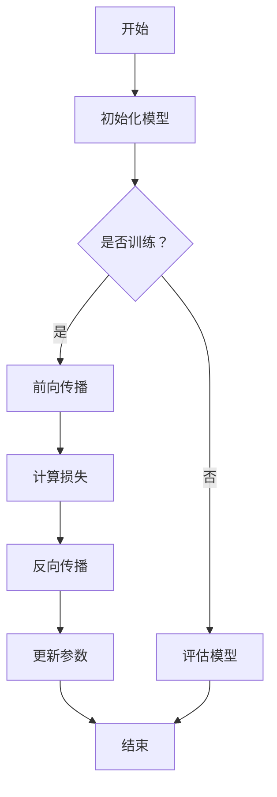

                 

## 文章标题

《AI人工智能深度学习算法：搭建可拓展的深度学习模型架构》

## 关键词

- 深度学习
- 神经网络
- 可拓展模型架构
- 模型优化
- 实战案例

## 摘要

本文将深入探讨深度学习算法的设计与实现，特别是如何搭建可拓展的深度学习模型架构。文章首先介绍了深度学习的基础知识，包括深度学习的定义、原理和应用领域。接着，详细解析了神经网络的基础，包括神经元、前馈神经网络、损失函数与优化算法等。随后，介绍了几种常见的深度学习框架，如TensorFlow、PyTorch和Keras。文章重点讲解了卷积神经网络（CNN）、循环神经网络（RNN）、生成对抗网络（GAN）和自监督学习的原理。在第三部分，文章探讨了深度学习模型搭建与优化的策略，包括模型可拓展性的重要性、模块化模型架构设计、模型优化技巧等。最后，通过一个实际项目案例，展示了如何搭建和优化可拓展的深度学习模型。文章还附带了深度学习开发工具与环境搭建、流程图与伪代码示例以及数学公式与解释等内容，以帮助读者更好地理解和应用深度学习技术。

---

### 第一部分: 深度学习基础

#### 第1章: 深度学习概述

##### 1.1 深度学习的定义与历史

深度学习是机器学习的一个子领域，主要关注于构建和训练多层神经网络，以实现更高级别的特征提取和抽象。深度学习的概念起源于1980年代，但直到2010年代随着计算能力和大数据的涌现，才逐渐成为人工智能领域的热点。

深度学习的基本原理可以追溯到人工神经网络，尤其是多层感知机（MLP）。1986年，Rumelhart、Hinton和Williams提出了反向传播算法（Backpropagation），使得多层神经网络能够有效地训练。然而，由于计算资源有限，早期多层神经网络的训练速度非常缓慢，效果也有限。

随着计算机硬件的发展，特别是GPU的广泛应用，深度学习迎来了新的春天。2012年，Alex Krizhevsky使用深度卷积神经网络（CNN）在ImageNet图像识别挑战赛中取得了突破性的成绩，这标志着深度学习时代的到来。

##### 1.2 深度学习的基本原理

深度学习模型的核心是多层神经网络，通常包括输入层、隐藏层和输出层。每一层都对输入数据进行处理，提取更高层次的特征，直到最后一层输出最终结果。

- **神经元与激活函数：** 神经元是神经网络的基本构建单元，类似于生物神经元的传递信息方式。每个神经元接收多个输入，通过加权求和处理后，加上偏置，再经过激活函数（如ReLU、Sigmoid、Tanh）转换成输出。

- **前馈与反向传播：** 前向传播是将输入数据通过网络逐层传递，直到得到输出。反向传播则是从输出层开始，反向计算每一层的梯度，以更新网络的权重和偏置。

- **损失函数与优化算法：** 损失函数用于衡量模型预测值与真实值之间的差距。常见的损失函数包括均方误差（MSE）、交叉熵（Cross Entropy）等。优化算法如梯度下降（Gradient Descent）、随机梯度下降（Stochastic Gradient Descent，SGD）和Adam优化器等，用于调整模型参数，使损失函数最小化。

##### 1.3 深度学习的应用领域

深度学习在众多领域都有广泛应用，包括：

- **计算机视觉：** 图像识别、物体检测、图像生成等。
- **自然语言处理：** 文本分类、机器翻译、情感分析等。
- **语音识别：** 语音识别、语音合成、说话人识别等。
- **推荐系统：** 个性化推荐、广告投放等。
- **强化学习：** 游戏AI、自动驾驶等。

##### 1.4 深度学习与人工智能的关系

深度学习是人工智能（AI）的重要组成部分，二者密切相关。人工智能的目的是使计算机具备人类智能，而深度学习通过模拟人脑的神经网络结构，实现了这一目标的关键步骤。

传统的机器学习方法往往需要手工设计特征，而深度学习通过自动化的方式从大量数据中学习特征表示，大幅提高了模型的准确性和泛化能力。因此，深度学习被认为是实现强人工智能的重要途径。

### 第一部分总结

本章介绍了深度学习的定义、基本原理和应用领域，以及深度学习在人工智能中的地位。接下来，我们将进一步探讨神经网络的基础，为后续更深入的讨论奠定基础。

---

#### 第2章: 神经网络基础

##### 2.1 神经元与感知机

神经元是神经网络的基本构建单元，其结构与功能类似于生物神经元。每个神经元包含一个细胞体、多个树突和一条轴突。树突接收来自其他神经元的信号，轴突将信号传递到其他神经元或肌肉细胞。

感知机（Perceptron）是神经网络最早的形式之一，由Frank Rosenblatt于1957年提出。感知机是一个二分类模型，用于判断输入数据属于哪一类。其基本结构包括一个输入层和一个输出层，输入层接收外部输入，输出层通过激活函数（通常是阶跃函数）产生输出。

感知机的学习过程基于线性可分情况，通过调整权重和偏置使输出层输出为1或-1。虽然感知机在简单问题上表现良好，但在线性不可分问题上存在局限性。

##### 2.2 前馈神经网络

前馈神经网络（Feedforward Neural Network）是现代神经网络的基础。与前向传播（Forward Propagation）相对，前馈神经网络的信息传递方向始终是从输入层到输出层，不形成循环。这意味着网络中的每个神经元都只接收来自前一层神经元的输入，并将其传递到下一层。

前馈神经网络的基本结构包括输入层、一个或多个隐藏层和输出层。输入层接收外部输入，隐藏层负责提取特征和进行复杂计算，输出层产生最终输出。

前馈神经网络的工作原理如下：

1. **前向传播：** 将输入数据通过输入层传递到隐藏层，然后逐层传递到输出层。在每一层，神经元对输入进行加权求和处理，并加上偏置项，最后通过激活函数转换成输出。

2. **反向传播：** 根据输出层的预测值与真实值的差距（即损失函数），计算每一层的梯度，并使用优化算法（如梯度下降）更新神经元的权重和偏置。

3. **激活函数：** 激活函数是神经网络中的关键组件，用于引入非线性。常见的激活函数包括ReLU（Rectified Linear Unit）、Sigmoid（Sigmoid Function）和Tanh（Hyperbolic Tangent Function）。

ReLU函数因其简单和非线性特性在深度学习中广泛应用，能够有效地缓解梯度消失问题。Sigmoid函数和Tanh函数则在传统机器学习中较为常见，适用于回归和二分类问题。

##### 2.3 损失函数与优化算法

损失函数（Loss Function）是衡量模型预测值与真实值之间差距的指标。深度学习模型的目标是调整模型参数，使损失函数最小化。常见的损失函数包括：

- **均方误差（MSE，Mean Squared Error）：** 用于回归问题，计算预测值与真实值之间平方差的平均值。公式如下：

  $$L(y, \hat{y}) = \frac{1}{m}\sum_{i=1}^{m}(y_i - \hat{y}_i)^2$$

  其中，\(y\)是真实值，\(\hat{y}\)是预测值，\(m\)是样本数量。

- **交叉熵（Cross Entropy）：** 用于分类问题，计算真实标签和预测概率分布之间的交叉熵。公式如下：

  $$L(y, \hat{y}) = -\frac{1}{m}\sum_{i=1}^{m}y_i\log(\hat{y}_i)$$

  其中，\(y\)是真实标签，\(\hat{y}\)是预测的概率分布。

优化算法（Optimization Algorithm）用于根据损失函数梯度调整模型参数。以下是几种常见的优化算法：

- **梯度下降（Gradient Descent）：** 最基础的优化算法，通过不断更新模型参数以最小化损失函数。更新公式如下：

  $$\theta_{j}^{new} = \theta_{j}^{old} - \alpha \cdot \frac{\partial J(\theta)}{\partial \theta_{j}}$$

  其中，\(\theta_{j}\)是模型参数，\(\alpha\)是学习率，\(J(\theta)\)是损失函数。

- **随机梯度下降（Stochastic Gradient Descent，SGD）：** 在每个训练样本上更新模型参数，适用于样本量较大的情况。更新公式如下：

  $$\theta_{j}^{new} = \theta_{j}^{old} - \alpha \cdot \frac{\partial J(\theta)}{\partial \theta_{j}}$$

  其中，\(\theta_{j}\)是模型参数，\(\alpha\)是学习率，\(J(\theta)\)是损失函数。

- **Adam优化器（Adam Optimizer）：** 结合了SGD和动量（Momentum）的方法，适用于不同规模的任务，在深度学习中表现良好。更新公式如下：

  $$\theta_{j}^{new} = \theta_{j}^{old} - \alpha \cdot \frac{\partial J(\theta)}{\partial \theta_{j}} + \beta_1 \cdot \theta_{j}^{old} - (1 - \beta_2) \cdot \theta_{j}^{old}$$

  其中，\(\theta_{j}\)是模型参数，\(\alpha\)是学习率，\(\beta_1\)和\(\beta_2\)是动量参数。

##### 2.4 神经网络的训练与评估

神经网络的训练过程包括前向传播、损失函数计算和反向传播。在训练过程中，模型通过不断调整参数来优化预测性能。

1. **训练过程：** 将训练数据分成多个批次，每次选取一个批次的数据进行训练。在每一个批次上，模型进行前向传播得到预测值，计算损失函数，然后进行反向传播更新参数。

2. **评估过程：** 使用验证集或测试集评估模型的泛化能力。常见的评估指标包括准确率（Accuracy）、精确率（Precision）、召回率（Recall）和F1分数（F1 Score）。

3. **超参数调优：** 超参数如学习率、批次大小、隐藏层节点数等对模型性能有很大影响。可以通过网格搜索（Grid Search）或随机搜索（Random Search）等方法进行调优。

##### 2.5 小结

本章介绍了神经网络的基本原理和训练过程，包括神经元、前馈神经网络、损失函数与优化算法等。理解这些基本概念对于构建和优化深度学习模型至关重要。在下一章中，我们将进一步介绍几种常见的深度学习框架。

---

### 第一部分总结

本章详细介绍了神经网络的基础知识，包括神经元与感知机、前馈神经网络、损失函数与优化算法，以及神经网络的训练与评估。这些基础概念为后续深度学习算法的学习和实践奠定了坚实的理论基础。在下一部分，我们将探讨深度学习框架，了解如何在实际应用中构建和训练深度学习模型。

---

#### 第3章: 深度学习框架简介

##### 3.1 TensorFlow

TensorFlow是由Google开发的开源深度学习框架，自2015年发布以来，已成为深度学习领域的事实标准。TensorFlow以其灵活的架构、丰富的功能和强大的社区支持而受到广泛使用。

- **核心特点：**
  - **动态图计算：** TensorFlow使用动态图计算，可以在运行时动态构建和修改计算图。这使得TensorFlow能够灵活地适应各种复杂的计算任务。
  - **高性能：** TensorFlow利用GPU和TPU等硬件加速计算，显著提高深度学习模型的训练速度。
  - **广泛的应用场景：** TensorFlow适用于计算机视觉、自然语言处理、语音识别、推荐系统等多种深度学习任务。
  - **丰富的API和工具：** TensorFlow提供多种API（如tf.keras、tf.contrib等），以及TensorBoard等工具，方便用户进行模型构建、训练和优化。

- **安装与配置：**
  - **安装TensorFlow：** 可以使用pip命令安装TensorFlow，如`pip install tensorflow`。根据不同需求，可以选择安装CPU版本或GPU版本。
  - **配置GPU支持：** 如果使用GPU训练模型，需要安装CUDA和cuDNN，并配置环境变量，如`export PATH=$PATH:/usr/local/cuda/bin`和`export LD_LIBRARY_PATH=$LD_LIBRARY_PATH:/usr/local/cuda/lib64`。

- **使用示例：**
  ```python
  import tensorflow as tf

  # 创建TensorFlow变量
  W = tf.Variable(tf.random.normal([10, 1]), name='weights')
  b = tf.Variable(tf.zeros([1]), name='biases')

  # 定义前向传播函数
  @tf.function
  def forward(x):
      return tf.matmul(x, W) + b

  # 定义损失函数
  def loss_function(y_true, y_pred):
      return tf.reduce_mean(tf.square(y_true - y_pred))

  # 定义优化器
  optimizer = tf.keras.optimizers.SGD(learning_rate=0.01)

  # 训练模型
  @tf.function
  def train_step(x, y):
      with tf.GradientTape() as tape:
          predictions = forward(x)
          loss = loss_function(y, predictions)
      gradients = tape.gradient(loss, [W, b])
      optimizer.apply_gradients(zip(gradients, [W, b]))

  # 示例数据
  x = tf.random.normal([100, 10])
  y = tf.random.normal([100, 1])

  # 训练模型
  for epoch in range(1000):
      train_step(x, y)
      if epoch % 100 == 0:
          print(f"Epoch {epoch}: Loss = {loss_function(y, forward(x)).numpy().mean()}")
  ```

##### 3.2 PyTorch

PyTorch是由Facebook开发的开源深度学习框架，以其动态计算图和易于使用而受到深度学习研究者和开发者的喜爱。

- **核心特点：**
  - **动态计算图：** PyTorch使用动态计算图（Dynamic Computation Graph），允许在运行时构建和修改计算图，这与TensorFlow的静态计算图形成对比。
  - **灵活性与易用性：** PyTorch提供了丰富的API和工具，如torch.nn和torch.optim，使得模型构建和训练更加灵活和直观。
  - **强大的社区支持：** PyTorch拥有庞大的开发者社区，提供了大量的教程、示例和开源项目，方便用户学习和使用。

- **安装与配置：**
  - **安装PyTorch：** 可以使用pip命令安装PyTorch，如`pip install torch torchvision`. 根据不同需求，可以选择安装CPU版本或GPU版本。
  - **配置GPU支持：** 如果使用GPU训练模型，需要安装CUDA和cuDNN，并配置环境变量。

- **使用示例：**
  ```python
  import torch
  import torch.nn as nn
  import torch.optim as optim

  # 创建PyTorch变量
  W = torch.nn.Parameter(torch.rand(10, 1))
  b = torch.nn.Parameter(torch.zeros(1))

  # 定义前向传播函数
  def forward(x):
      return torch.matmul(x, W) + b

  # 定义损失函数
  loss_function = nn.MSELoss()

  # 定义优化器
  optimizer = optim.SGD([W, b], lr=0.01)

  # 训练模型
  for epoch in range(1000):
      optimizer.zero_grad()
      predictions = forward(x)
      loss = loss_function(y, predictions)
      loss.backward()
      optimizer.step()
      if epoch % 100 == 0:
          print(f"Epoch {epoch}: Loss = {loss.item()}")
  ```

##### 3.3 Keras

Keras是一个高级神经网络API，能够以简洁的代码实现复杂的深度学习模型。Keras可以在TensorFlow和Theano等后端框架上运行，但其自身的API设计使得模型构建更加直观和易用。

- **核心特点：**
  - **简洁的API：** Keras提供了易于使用的API，如Sequential和Functional API，使得模型构建更加直观。
  - **模块化组件：** Keras提供了丰富的预定义层和优化器，方便用户快速搭建和训练模型。
  - **集成性：** Keras可以与TensorFlow、Theano等深度学习框架无缝集成，支持多后端运行。

- **安装与配置：**
  - **安装Keras：** 可以使用pip命令安装Keras，如`pip install keras`。
  - **配置后端框架：** 如果使用TensorFlow作为后端，需要先安装TensorFlow，如`pip install tensorflow`。

- **使用示例：**
  ```python
  from keras.models import Sequential
  from keras.layers import Dense
  from keras.optimizers import SGD
  from keras.losses import MSE

  # 创建Keras模型
  model = Sequential()
  model.add(Dense(1, input_dim=10, activation='linear'))

  # 编译模型
  model.compile(optimizer=SGD(learning_rate=0.01), loss=MSE)

  # 训练模型
  model.fit(x, y, epochs=1000, batch_size=32, verbose=1)
  ```

##### 3.4 其他深度学习框架简介

除了TensorFlow、PyTorch和Keras，还有其他一些知名的深度学习框架：

- **Apache MXNet：** 由Apache软件基金会开发的开源深度学习框架，支持多种编程语言（如Python、R、Julia）。
- **Caffe：** 由伯克利视觉与感知中心（BVLC）开发的深度学习框架，以C++为主，也提供Python接口。
- **Theano：** 由蒙特利尔大学开发的深度学习框架，使用Python编写，但需要编译成C代码执行。
- **Microsoft Cognitive Toolkit（CNTK）：** 微软开发的深度学习框架，支持多种编程语言，如C++、Python和C#。

这些框架各有特点，用户可以根据实际需求选择合适的框架进行深度学习研究和开发。

##### 3.5 小结

本章介绍了几种常见的深度学习框架，包括TensorFlow、PyTorch、Keras以及其他一些开源深度学习框架。了解这些框架的基本概念和特点，对于深度学习模型的设计与实现至关重要。在下一章中，我们将进一步探讨深度学习算法的原理和实现。

---

### 第一部分总结

本章详细介绍了深度学习框架，包括TensorFlow、PyTorch、Keras以及其他开源框架的基本概念、特点和使用方法。这些框架为深度学习模型的设计和实现提供了强大的工具和支持。在下一部分，我们将深入探讨深度学习算法，包括卷积神经网络（CNN）、循环神经网络（RNN）、生成对抗网络（GAN）和自监督学习，进一步理解深度学习的核心原理和应用。

---

#### 第二部分: 深度学习算法原理

##### 第4章: 卷积神经网络（CNN）

##### 4.1 CNN的基本结构

卷积神经网络（Convolutional Neural Network，CNN）是一种专门用于处理图像数据的深度学习模型。其基本结构包括卷积层（Convolutional Layer）、池化层（Pooling Layer）和全连接层（Fully Connected Layer）。下面我们详细解释这些层的作用和实现方式。

- **卷积层（Convolutional Layer）：** 卷积层是CNN的核心组成部分，用于提取图像的局部特征。每个卷积核（Convolutional Kernel）可以看作是一个小的滤波器，通过对输入图像进行卷积操作，提取出图像中的局部特征。卷积层的输出是一个特征图（Feature Map），其中每个元素表示对应位置的特征强度。卷积操作可以通过以下公式表示：

  $$\text{output}_{ij}^l = \sum_{k=1}^{n}\sum_{m=1}^{n} w_{km}^{l} \cdot \text{input}_{ij}^{l-1} + b_l$$

  其中，\(w_{km}^{l}\)是卷积核的权重，\(\text{input}_{ij}^{l-1}\)是上一层的输入特征，\(b_l\)是偏置项。

- **池化层（Pooling Layer）：** 池化层用于降低特征图的维度，减少计算量，同时保持重要的特征信息。常见的池化操作包括最大池化（Max Pooling）和平均池化（Average Pooling）。最大池化选择每个局部区域中的最大值作为输出，而平均池化则计算每个局部区域中的平均值。池化层通常与卷积层交替使用，以构建深度卷积神经网络。

- **全连接层（Fully Connected Layer）：** 全连接层将特征图展平成一个一维向量，然后通过全连接层进行分类或回归。全连接层的输出通过激活函数（如Softmax函数）转换为概率分布，用于分类任务。对于回归任务，通常使用线性激活函数。

##### 4.2 卷积操作与反卷积操作

卷积操作是CNN中最基本的过程，它通过滑动卷积核在输入图像上提取特征。卷积操作的实现包括以下几个步骤：

1. **卷积核初始化：** 初始化卷积核的权重和偏置项。
2. **卷积操作：** 将卷积核在输入图像上滑动，并对每个位置进行点积运算，再加上偏置项。
3. **应用激活函数：** 对卷积层的输出应用激活函数，如ReLU函数。
4. **池化操作（可选）：** 在卷积层后可以添加池化层，以降低特征图的维度。

反卷积操作（Deconvolution）是卷积操作的逆过程，主要用于图像生成任务，特别是在生成对抗网络（GAN）中。反卷积操作的实现包括以下几个步骤：

1. **反卷积核初始化：** 初始化反卷积核的权重和偏置项。
2. **反卷积操作：** 使用反卷积核在特征图上滑动，并对每个位置进行点积运算，再加上偏置项。
3. **应用激活函数：** 对反卷积层的输出应用激活函数，如ReLU函数。
4. **上采样操作：** 在反卷积层后可以添加上采样层，以增加特征图的维度。

##### 4.3 池化操作

池化操作用于减少特征图的维度，从而降低计算复杂度。常见的池化操作包括最大池化和平均池化。

- **最大池化（Max Pooling）：** 选择每个局部区域中的最大值作为输出。最大池化可以有效地减少特征图的维度，并保持重要的特征信息。
- **平均池化（Average Pooling）：** 计算每个局部区域中的平均值作为输出。平均池化可以平滑特征图，减少噪声的影响。

池化操作通常与卷积层交替使用，以构建深度卷积神经网络。池化层的尺寸和步长（Stride）是关键参数，它们决定了特征图的维度和计算量。

##### 4.4 CNN在图像识别中的应用

CNN在图像识别任务中表现出色，广泛应用于物体检测、图像分类和图像分割等领域。下面我们简要介绍CNN在图像识别中的应用。

- **图像分类：** CNN通过多层卷积和池化操作提取图像的层次特征，最后通过全连接层进行分类。常见的图像分类任务包括ImageNet图像识别挑战赛。
- **物体检测：** CNN通过卷积层提取图像的特征，并通过区域建议（Region Proposal）和边界框回归（Bounding Box Regression）检测图像中的物体。常见的物体检测模型包括YOLO（You Only Look Once）和SSD（Single Shot MultiBox Detector）。
- **图像分割：** CNN通过卷积层和全连接层提取图像的特征，并通过像素级别的分类将图像分割成多个区域。常见的图像分割模型包括FCN（Fully Convolutional Network）和U-Net。

CNN在图像识别任务中的成功主要得益于其能够自动提取图像的层次特征，并有效地分类和分割图像。随着深度学习技术的发展，CNN在图像识别中的应用将更加广泛和深入。

##### 4.5 小结

本章介绍了卷积神经网络（CNN）的基本结构、卷积操作与反卷积操作、池化操作以及CNN在图像识别中的应用。理解CNN的原理和实现对于构建高效的图像处理模型至关重要。在下一章中，我们将探讨循环神经网络（RNN）及其在序列数据处理中的应用。

---

#### 第4章总结

本章详细介绍了卷积神经网络（CNN）的基本结构、卷积操作与反卷积操作、池化操作以及CNN在图像识别中的应用。通过本章的学习，读者可以理解CNN如何通过卷积、池化等操作提取图像的特征，并实现图像分类、物体检测和图像分割等任务。在下一章中，我们将进一步探讨循环神经网络（RNN）及其在序列数据处理中的应用。

---

##### 第5章: 循环神经网络（RNN）

##### 5.1 RNN的基本原理

循环神经网络（Recurrent Neural Network，RNN）是一种能够处理序列数据的神经网络，具有记忆功能，可以捕捉序列中的时间依赖关系。与传统的神经网络不同，RNN具有反馈循环结构，能够将前一个时间步的输出作为当前时间步的输入，从而实现时间序列数据的处理。

RNN的基本单元是循环单元，通常由输入门（Input Gate）、遗忘门（Forget Gate）和输出门（Output Gate）组成。这些门控机制使得RNN能够在不同时间步保留或丢弃信息，实现动态信息处理。

- **输入门（Input Gate）：** 输入门决定当前输入对隐藏状态的影响。输入门通过计算输入和隐藏状态之间的权重矩阵，并结合激活函数（如Sigmoid函数），生成一个新的输入值，用于更新隐藏状态。
- **遗忘门（Forget Gate）：** 遗忘门决定上一时刻隐藏状态中哪些信息需要被遗忘。遗忘门通过计算当前输入和隐藏状态之间的权重矩阵，并结合激活函数，生成一个新的遗忘值，用于更新隐藏状态。
- **输出门（Output Gate）：** 输出门决定当前隐藏状态对输出值的影响。输出门通过计算当前隐藏状态和输入之间的权重矩阵，并结合激活函数，生成一个新的输出值。

RNN的数学模型可以表示为：

$$
h_t = \sigma(W_{ih}x_t + W_{hh}h_{t-1} + b_h)
$$

$$
f_t = \sigma(W_{if}x_t + W_{hf}h_{t-1} + b_f)
$$

$$
o_t = \sigma(W_{io}x_t + W_{ho}h_{t-1} + b_o)
$$

$$
h_t' = o_t \odot \tanh(W_{ch}h_t + b_c)
$$

其中，\(h_t\)表示第\(t\)时刻的隐藏状态，\(x_t\)表示第\(t\)时刻的输入，\(f_t\)表示遗忘门的输出，\(i_t\)表示输入门的输出，\(o_t\)表示输出门的输出，\(h_t'\)表示更新后的隐藏状态。

##### 5.2 LSTM和GRU

虽然RNN在处理序列数据时具有记忆功能，但传统RNN存在梯度消失和梯度爆炸问题，难以训练长序列数据。为了解决这些问题，引入了长短期记忆网络（Long Short-Term Memory，LSTM）和门控循环单元（Gated Recurrent Unit，GRU）。

- **LSTM（Long Short-Term Memory）：** LSTM通过引入遗忘门、输入门和输出门，解决了传统RNN的梯度消失问题，能够有效处理长序列数据。LSTM的基本结构包括输入门、遗忘门、输入门和单元状态。单元状态通过遗忘门和输入门控制信息的流动，从而实现长短期记忆。

  - **遗忘门（Forget Gate）：** 决定哪些信息需要从单元状态中丢弃。
  - **输入门（Input Gate）：** 决定新的信息如何进入单元状态。
  - **输出门（Output Gate）：** 决定单元状态如何输出。

  LSTM的数学模型可以表示为：

  $$

  i_t = \sigma(W_{ix}x_t + W_{ih}h_{t-1} + b_i)

  f_t = \sigma(W_{fx}x_t + W_{fh}h_{t-1} + b_f)

  C_t' = \tanh(W_{cx}x_t + W_{ch}h_{t-1} + b_c)

  o_t = \sigma(W_{ox}x_t + W_{oh}h_{t-1} + b_o)

  C_t = f_t \odot C_{t-1} + i_t \odot C_t'

  h_t = o_t \odot \tanh(C_t)

  $$

- **GRU（Gated Recurrent Unit）：** GRU是LSTM的简化版本，通过引入更新门（Update Gate）和重置门（Reset Gate），简化了LSTM的结构。GRU通过门控机制控制信息的流动，能够有效处理长序列数据。

  - **更新门（Update Gate）：** 决定旧的信息如何与新信息结合。
  - **重置门（Reset Gate）：** 决定旧的信息如何与新信息混合。

  GRU的数学模型可以表示为：

  $$

  z_t = \sigma(W_{zx}x_t + W_{zh}h_{t-1} + b_z)

  r_t = \sigma(W_{rx}x_t + W_{rh}h_{t-1} + b_r)

  h_t' = \tanh(W_{cx}x_t + (1 - r_t) \odot W_{ch}h_{t-1} + b_c)

  h_t = z_t \odot h_t' + (1 - z_t) \odot h_{t-1}

  $$

##### 5.3 RNN在序列数据中的应用

RNN及其变种LSTM和GRU在序列数据处理中有着广泛的应用，以下是一些典型的应用场景：

- **自然语言处理（NLP）：** RNN被广泛应用于自然语言处理任务，如文本分类、机器翻译、情感分析和文本生成。通过处理序列数据，RNN能够捕捉语言中的时间依赖关系。
- **语音识别：** RNN被用于语音识别任务，通过处理音频信号的序列，将语音信号转换为文字。
- **时间序列预测：** RNN被用于时间序列预测任务，如股票价格预测、气象预测和销量预测等。通过捕捉时间序列中的依赖关系，RNN能够实现准确的预测。
- **视频分析：** RNN被用于视频分析任务，如动作识别、视频分类和视频生成等。通过处理视频序列中的图像帧，RNN能够提取视频中的关键特征。

##### 5.4 小结

本章介绍了循环神经网络（RNN）的基本原理，包括RNN的结构和门控机制。同时，还介绍了LSTM和GRU这两种改进的RNN结构，以及它们在序列数据处理中的应用。理解RNN的原理和实现对于处理序列数据具有重要意义。在下一章中，我们将探讨生成对抗网络（GAN）及其在数据生成和图像合成中的应用。

---

#### 第5章总结

本章详细介绍了循环神经网络（RNN）及其变种LSTM和GRU的基本原理，包括它们在序列数据处理中的应用。通过本章的学习，读者可以理解RNN如何通过门控机制处理序列数据，以及LSTM和GRU如何改进RNN的长期记忆能力。RNN在自然语言处理、语音识别、时间序列预测和视频分析等领域有着广泛的应用。在下一章中，我们将探讨生成对抗网络（GAN）及其在数据生成和图像合成中的应用。

---

#### 第6章: 生成对抗网络（GAN）

##### 6.1 GAN的基本原理

生成对抗网络（Generative Adversarial Network，GAN）是2014年由Ian Goodfellow等人提出的深度学习模型，其主要目标是生成具有真实数据分布的样本。GAN由两个深度神经网络组成：生成器（Generator）和判别器（Discriminator）。生成器的任务是生成尽可能真实的数据，而判别器的任务是区分生成器生成的数据与真实数据。这两个网络相互对抗，共同训练，从而实现数据的生成。

GAN的训练过程可以看作是一个博弈过程，生成器和判别器在互相博弈中不断进步。生成器的目标是使判别器无法区分其生成的数据与真实数据，而判别器的目标是正确区分生成器和真实数据。这种对抗关系使得GAN能够生成高质量的数据。

GAN的基本结构包括以下部分：

- **生成器（Generator）：** 生成器接收随机噪声作为输入，通过多层神经网络生成数据。生成器的目标是生成与真实数据相似的数据，使判别器无法区分。
- **判别器（Discriminator）：** 判别器接收真实数据和生成器生成的数据，通过多层神经网络输出一个概率值，表示数据为真实数据的置信度。判别器的目标是正确区分真实数据和生成器生成的数据。

GAN的训练过程可以分为以下几个步骤：

1. **初始化生成器和判别器：** 初始化生成器和判别器的权重，通常使用正态分布初始化。
2. **生成器生成数据：** 生成器接收随机噪声，生成数据。
3. **判别器评估：** 判别器对真实数据和生成器生成的数据进行评估，输出置信度。
4. **生成器更新：** 根据判别器的评估结果，更新生成器的权重，使生成器生成的数据更接近真实数据。
5. **判别器更新：** 根据生成器生成的数据和真实数据，更新判别器的权重，使判别器能够更准确地评估数据。
6. **重复步骤2-5：** 重复上述步骤，直到生成器生成的数据质量达到预期。

GAN的训练过程可以用以下数学模型表示：

生成器：\(G(z)\)是一个从噪声分布\(p_z(z)\)映射到数据空间的数据生成模型。

判别器：\(D(x)\)是一个对输入数据进行判别，输出概率的模型。

目标函数：最小化生成器的损失函数和最大化判别器的损失函数。

生成器损失函数：

$$
L_G = -\log D(G(z))
$$

判别器损失函数：

$$
L_D = -[\log D(x) + \log(1 - D(G(z))]
$$

##### 6.2 GAN的架构与训练过程

GAN的架构包括生成器和判别器，两者都是深度神经网络。生成器和判别器在网络结构上可以有所不同，但通常都包含多个隐藏层。下面是一个典型的GAN架构：

1. **生成器：** 生成器接收一个随机噪声向量作为输入，通过多层神经网络生成数据。生成器的输出通常是一个与真实数据分布相似的数据。
2. **判别器：** 判别器接收一个数据输入，通过多层神经网络输出一个概率值，表示输入数据的真实程度。判别器的输出范围通常在0到1之间。

GAN的训练过程如下：

1. **初始化生成器和判别器的权重：** 通常使用随机初始化或正态分布初始化。
2. **生成器生成数据：** 生成器接收随机噪声，生成数据。
3. **判别器评估：** 判别器对真实数据和生成器生成的数据进行评估，输出置信度。
4. **生成器更新：** 根据判别器的评估结果，更新生成器的权重，使生成器生成的数据更接近真实数据。
5. **判别器更新：** 根据生成器生成的数据和真实数据，更新判别器的权重，使判别器能够更准确地评估数据。
6. **重复步骤2-5：** 重复上述步骤，直到生成器生成的数据质量达到预期。

GAN的训练过程中，生成器和判别器之间存在一种动态平衡。生成器试图生成更真实的数据，而判别器则试图区分生成器和真实数据。随着训练的进行，生成器的生成质量不断提高，判别器的判别能力也不断增强。

##### 6.3 GAN的应用

GAN在许多领域都有广泛的应用，包括图像生成、图像修复、图像到图像的转换和自然语言生成等。

- **图像生成：** GAN能够生成高质量的自然图像，广泛应用于艺术创作、游戏开发和虚拟现实等领域。
- **图像修复：** GAN可以用于图像修复，如去噪、图像修复和图像增强等。
- **图像到图像的转换：** GAN可以将一种类型的图像转换为另一种类型的图像，如将素描图像转换为彩色图像、将黑白图像转换为彩色图像等。
- **自然语言生成：** GAN可以用于自然语言生成，如文本生成、对话系统和故事创作等。

##### 6.4 小结

本章介绍了生成对抗网络（GAN）的基本原理、架构与训练过程，以及GAN在图像生成、图像修复、图像到图像的转换和自然语言生成等领域的应用。理解GAN的工作原理和实现对于深度学习研究和应用具有重要意义。在下一章中，我们将探讨自监督学习及其在深度学习中的应用。

---

#### 第6章总结

本章详细介绍了生成对抗网络（GAN）的基本原理、架构与训练过程，以及GAN在图像生成、图像修复、图像到图像的转换和自然语言生成等领域的应用。GAN通过生成器和判别器的对抗训练，能够生成高质量的数据，具有广泛的应用前景。在下一章中，我们将进一步探讨自监督学习及其在深度学习中的应用。

---

##### 第7章: 自监督学习

##### 7.1 自监督学习的定义与优势

自监督学习（Self-Supervised Learning）是一种无监督学习范式，其核心思想是从未标记的数据中提取有用的特征表示，并通过自我监督的方式训练模型。在自监督学习中，模型的训练过程不需要依赖大量的标注数据，而是通过无监督的方式学习数据的内在结构。

自监督学习的定义可以描述为：给定一个数据集，其中部分数据被标记，模型通过学习数据的分布、关系和模式，使得模型能够在标记数据和未标记数据之间建立有效的映射。

与传统的监督学习和无监督学习相比，自监督学习具有以下优势：

- **数据效率高：** 自监督学习能够从大量未标记的数据中提取有用信息，大大降低了数据标注的成本，提高了数据利用率。
- **泛化能力强：** 自监督学习模型通过学习数据的分布和内在结构，能够在不同的任务和数据集上实现良好的泛化能力。
- **可扩展性强：** 自监督学习模型通常具有较少的参数，便于在大型数据集上训练，且可以在不同的硬件平台上高效运行。

##### 7.2 常见自监督学习方法

自监督学习方法种类繁多，以下介绍几种常见的方法：

1. **预测目标：** 该方法通过预测输入数据的某个部分或整体来学习数据的表示。常见的预测目标包括图像中某个像素点的颜色、图像块、单词或句子等。一种典型的预测目标是图像块匹配，其中模型需要预测两个图像块是否来自同一图像。

2. **信息掩码：** 信息掩码方法通过随机掩码（Masking）输入数据的一部分，然后让模型预测被掩码的部分。这种方法能够使模型学习数据的内在结构和关系。常见的掩码方法包括随机掩码（Random Masking）、遮蔽语言模型（Masked Language Model）和图像掩码（Image Masking）。

3. **对比学习：** 对比学习方法通过对比正样本和负样本来学习数据的表示。在自监督学习中，正样本通常为输入数据本身，而负样本为与输入数据结构相似但内容不同的数据。对比学习通过优化正样本和负样本之间的相似性，实现有效的特征表示学习。

4. **生成对抗网络：** 生成对抗网络（GAN）是一种强大的自监督学习方法，通过生成器和判别器的对抗训练，生成器生成与真实数据相似的数据，而判别器区分生成器和真实数据。GAN在图像生成、图像修复和图像到图像的转换等领域具有广泛的应用。

5. **自监督分类：** 自监督分类方法通过将数据分为若干类别来学习数据的表示。与传统的监督分类不同，自监督分类不需要预先标注数据类别。一种常见的自监督分类方法是聚类（Clustering），通过聚类算法将数据分为若干类别，然后使用分类器进行分类。

##### 7.3 自监督学习在深度学习中的应用

自监督学习在深度学习领域具有广泛的应用，以下介绍几种典型的应用场景：

- **计算机视觉：** 自监督学习在计算机视觉领域被广泛应用于图像分类、物体检测、图像分割和图像生成等任务。通过自监督学习，模型可以从大量未标记的图像中提取有用的特征表示，从而提高模型的泛化能力和性能。

- **自然语言处理：** 自监督学习在自然语言处理领域被广泛应用于文本分类、机器翻译、情感分析和文本生成等任务。自监督学习能够从大规模的未标记文本数据中提取有效的语言特征表示，为模型提供丰富的知识支持。

- **推荐系统：** 自监督学习在推荐系统领域被广泛应用于用户兴趣建模、商品推荐和协同过滤等任务。通过自监督学习，模型可以从用户行为数据中提取用户和商品的潜在特征，从而实现更加精准的推荐。

- **语音识别：** 自监督学习在语音识别领域被广泛应用于语音增强、说话人识别和语音合成等任务。通过自监督学习，模型可以从大量的未标记语音数据中提取有效的语音特征表示，从而提高语音识别的准确率和鲁棒性。

##### 7.4 小结

本章介绍了自监督学习的定义、优势、常见方法和在深度学习领域的应用。自监督学习作为一种无监督学习范式，具有数据效率高、泛化能力强和可扩展性强等优点，在深度学习领域具有广泛的应用前景。理解自监督学习的基本概念和方法对于构建高效、鲁棒的深度学习模型具有重要意义。

---

#### 第7章总结

本章详细介绍了自监督学习的定义、优势、常见方法和在深度学习领域的应用。自监督学习通过无监督的方式从大量未标记的数据中提取有用信息，具有数据效率高、泛化能力强和可扩展性强等优点。本章讨论了预测目标、信息掩码、对比学习、生成对抗网络和自监督分类等方法，并介绍了自监督学习在计算机视觉、自然语言处理、推荐系统和语音识别等领域的应用。理解自监督学习的基本概念和方法对于构建高效、鲁棒的深度学习模型具有重要意义。在下一部分，我们将探讨深度学习模型搭建与优化的策略。

---

#### 第三部分: 深度学习模型搭建与优化

##### 第8章: 可拓展的深度学习模型架构

##### 8.1 模型可拓展性的重要性

在深度学习项目中，构建可拓展的模型架构至关重要。模型的可拓展性意味着在应对不同规模的任务或数据时，模型能够灵活调整和扩展，而不需要进行大规模的重新设计和训练。以下是一些确保模型可拓展性的关键因素：

- **模块化设计：** 模型应采用模块化设计，使得每个模块都能够独立实现、测试和替换。这样可以方便地在模型中添加新的功能或模块，从而适应不同的需求。
- **参数共享：** 通过参数共享，模型中的某些层可以共享相同的权重和偏置，从而减少参数数量，提高训练效率。例如，在图像分类任务中，可以使用卷积层对图像进行特征提取，然后在不同的分类任务中复用这些特征提取层。
- **通用数据接口：** 模型应设计一个通用数据接口，方便不同类型的数据输入和处理。这样可以避免针对特定数据格式进行繁琐的代码编写，提高代码的可维护性和可移植性。
- **动态调整：** 模型应支持动态调整参数，如学习率、批次大小和隐藏层节点数等。这样可以根据训练过程中出现的问题和性能指标，自动调整模型参数，提高模型性能。

##### 8.2 模块化模型架构设计

模块化模型架构设计是确保模型可拓展性的关键。以下是一种常见的模块化设计方法：

1. **层模块：** 将神经网络中的层设计成独立的模块，每个模块实现特定的功能，如卷积层、池化层、全连接层等。这样，可以方便地替换或添加层，以适应不同的任务和数据规模。
2. **组件模块：** 设计可复用的组件模块，如卷积块、循环单元等。这些组件可以独立实现和测试，并在不同任务中复用。例如，在图像分类和语音识别任务中，可以复用相同的卷积块或循环单元。
3. **可扩展模块：** 设计可扩展的模块，以支持动态调整参数和结构。例如，可以设计可动态调整隐藏层节点数和层深的模块，以便在训练过程中根据性能进行调整。

##### 8.3 模型架构的可扩展性与灵活性

为了确保模型架构的可扩展性和灵活性，可以考虑以下策略：

- **参数共享：** 通过参数共享，减少模型的参数数量，提高训练效率。例如，在图像分类任务中，可以共享卷积层的权重和偏置，以便在多个分类任务中复用。
- **动态调整：** 设计动态调整模块，以支持在训练过程中调整模型参数和结构。例如，可以使用自适应学习率调整策略，根据模型的性能动态调整学习率。
- **模块组合：** 设计可组合的模块，以支持不同的模型结构。例如，可以使用卷积块和循环单元组合构建处理视频数据的模型。
- **通用接口：** 设计通用的数据接口，以支持不同类型的数据输入和处理。例如，可以使用数据管道（Data Pipeline）设计，方便地处理不同格式的数据。

##### 8.4 实例：模块化图像分类模型

以下是一个简单的模块化图像分类模型的示例，包括卷积层、池化层和全连接层：

```python
import tensorflow as tf

# 定义卷积块
def convolutional_block(input_data, num_filters, kernel_size, pool_size):
    conv = tf.keras.layers.Conv2D(num_filters, kernel_size, activation='relu', padding='same')(input_data)
    pool = tf.keras.layers.MaxPooling2D(pool_size)(conv)
    return pool

# 定义循环单元
def recurrent_unit(input_data, num_units):
    return tf.keras.layers.LSTM(num_units, return_sequences=True)(input_data)

# 定义全连接层
def fully_connected_layer(input_data, num_classes):
    fc = tf.keras.layers.Dense(num_classes, activation='softmax')(input_data)
    return fc

# 构建模块化图像分类模型
def build_model(input_shape, num_classes):
    input_layer = tf.keras.layers.Input(shape=input_shape)
    
    # 卷积层模块
    conv1 = convolutional_block(input_layer, 32, (3, 3), (2, 2))
    conv2 = convolutional_block(conv1, 64, (3, 3), (2, 2))
    
    # 池化层模块
    pool1 = tf.keras.layers.MaxPooling2D(pool_size=(2, 2))(conv2)
    
    # 循环单元模块
    recurrent = recurrent_unit(pool1, 128)
    
    # 全连接层模块
    fc = fully_connected_layer(recurrent, num_classes)
    
    # 构建模型
    model = tf.keras.Model(inputs=input_layer, outputs=fc)
    return model

# 构建图像分类模型
model = build_model(input_shape=(28, 28, 1), num_classes=10)
model.compile(optimizer='adam', loss='categorical_crossentropy', metrics=['accuracy'])
model.summary()
```

这个示例展示了如何使用模块化设计构建一个简单的图像分类模型，包括卷积层、池化层和全连接层。通过模块化设计，可以方便地调整和扩展模型结构，以适应不同的任务和数据规模。

##### 8.5 小结

本章介绍了模型可拓展性的重要性、模块化模型架构设计以及模型架构的可扩展性与灵活性。通过模块化设计，模型可以灵活调整和扩展，以适应不同的任务和数据规模。本章还通过一个简单的图像分类模型示例，展示了如何使用模块化设计构建深度学习模型。理解这些概念和设计方法对于构建高效、可拓展的深度学习模型具有重要意义。

---

### 第8章总结

本章详细介绍了模型可拓展性的重要性，模块化模型架构设计以及模型架构的可扩展性与灵活性。通过模块化设计，可以方便地调整和扩展模型结构，以适应不同的任务和数据规模。本章讨论了模块化设计的关键因素，如模块化设计、参数共享、通用数据接口和动态调整等。此外，通过一个简单的图像分类模型示例，展示了如何使用模块化设计构建深度学习模型。理解这些概念和设计方法对于构建高效、可拓展的深度学习模型具有重要意义。

---

#### 第9章: 深度学习模型优化技巧

##### 9.1 模型优化方法

在深度学习模型训练过程中，优化方法是关键因素之一。优化方法用于调整模型参数，以最小化损失函数，提高模型性能。以下介绍几种常见的优化方法：

- **梯度下降（Gradient Descent）：** 梯度下降是最基础的优化方法。其基本思想是沿着损失函数梯度的反方向更新模型参数，直到达到最小值。梯度下降可以分为以下几种变体：

  - **批量梯度下降（Batch Gradient Descent）：** 在每个训练迭代中，使用整个训练集的梯度进行参数更新。这种方法计算量大，但收敛速度较慢。

  - **随机梯度下降（Stochastic Gradient Descent，SGD）：** 在每个训练迭代中，随机选择一部分训练样本的梯度进行参数更新。这种方法计算量小，收敛速度快，但可能会陷入局部最小值。

  - **迷你批梯度下降（Mini-batch Gradient Descent）：** 在每个训练迭代中，随机选择一部分训练样本组成迷你批（Mini-batch），计算该批次的梯度进行参数更新。这种方法结合了批量梯度下降和随机梯度下降的优点，计算量适中，收敛速度较快。

- **动量（Momentum）：** 动量是一种加速梯度下降的方法，通过引入一个加速度项，使得模型参数更新具有惯性。动量可以加速收敛，并避免陷入局部最小值。

  动量的更新公式为：

  $$v_t = \gamma \cdot v_{t-1} + \alpha \cdot \nabla J(\theta)$$

  $$\theta_t = \theta_{t-1} - v_t$$

  其中，\(v_t\)是动量项，\(\gamma\)是动量参数，\(\alpha\)是学习率，\(\nabla J(\theta)\)是梯度。

- **自适应优化器：** 自适应优化器能够动态调整学习率，提高训练效果。以下介绍几种常见的自适应优化器：

  - **Adagrad（Adaptive Gradient）：** Adagrad通过累加每个参数的历史梯度平方，自适应调整学习率。这种方法在稀疏数据上表现良好，但可能会在稀疏参数上过调。

    学习率更新公式为：

    $$r_t = r_{t-1} + \frac{\partial J(\theta)}{\partial \theta}^2$$

    $$\theta_t = \theta_{t-1} - \frac{\alpha}{\sqrt{r_t}} \cdot \frac{\partial J(\theta)}{\partial \theta}$$

  - **RMSprop（Root Mean Square Prop）：** RMSprop是Adagrad的改进版本，通过计算梯度平方的平均值，避免过调问题。

    学习率更新公式为：

    $$r_t = \gamma \cdot r_{t-1} + (1 - \gamma) \cdot \frac{\partial J(\theta)}{\partial \theta}^2$$

    $$\theta_t = \theta_{t-1} - \frac{\alpha}{\sqrt{r_t}} \cdot \frac{\partial J(\theta)}{\partial \theta}$$

  - **Adam（Adaptive Moment Estimation）：** Adam结合了Adagrad和RMSprop的优点，同时计算梯度的一阶矩估计和二阶矩估计，动态调整学习率。

    学习率更新公式为：

    $$m_t = \gamma_1 \cdot m_{t-1} + (1 - \gamma_1) \cdot \frac{\partial J(\theta)}{\partial \theta}$$

    $$v_t = \gamma_2 \cdot v_{t-1} + (1 - \gamma_2) \cdot \left(\frac{\partial J(\theta)}{\partial \theta}\right)^2$$

    $$\theta_t = \theta_{t-1} - \frac{\alpha}{\sqrt{1 - \gamma_2^t} \cdot (1 - \gamma_1^t)} \cdot m_t$$

##### 9.2 超参数调优

超参数是深度学习模型中的关键参数，如学习率、批量大小、隐藏层节点数等。超参数调优是提高模型性能的重要步骤。以下介绍几种常见的超参数调优方法：

- **网格搜索（Grid Search）：** 网格搜索是一种遍历所有可能的超参数组合的方法，找到最优的超参数组合。这种方法计算量大，但能够找到全局最优解。

- **随机搜索（Random Search）：** 随机搜索在给定超参数范围内随机选择组合，找到最优的超参数组合。这种方法计算量相对较小，但可能错过全局最优解。

- **贝叶斯优化（Bayesian Optimization）：** 贝叶斯优化是一种基于概率模型的优化方法，通过构建先验概率模型，搜索最优超参数组合。这种方法计算量适中，能够找到较好的超参数组合。

- **迁移学习（Transfer Learning）：** 迁移学习是一种利用预训练模型进行微调的方法，将预训练模型的部分或全部权重应用于新任务。这种方法能够提高模型性能，减少训练时间。

##### 9.3 模型压缩与加速

模型压缩与加速是提高模型部署性能的重要手段。以下介绍几种常见的模型压缩与加速方法：

- **剪枝（Pruning）：** 剪枝通过删除模型中的部分神经元或连接，减少模型参数数量，降低计算复杂度。剪枝方法可以分为以下几种：

  - **结构剪枝（Structured Pruning）：** 结构剪枝保留模型的基本结构，只删除部分神经元或连接。

  - **稀疏化（Sparsity）：** 稀疏化通过设置较小的权重阈值，将权重设置为0，从而实现模型压缩。

- **量化（Quantization）：** 量化通过将模型的权重和激活值转换为较低精度的表示，减少模型体积和计算量。量化方法可以分为以下几种：

  - **整数量化（Integer Quantization）：** 整数量化将权重和激活值转换为整数表示，从而减少计算量和存储空间。

  - **浮点量化（Floating-point Quantization）：** 浮点量化将权重和激活值转换为浮点数表示，从而保持较高的计算精度。

- **模型融合（Model Fusion）：** 模型融合通过将多个模型进行融合，提高模型性能。模型融合方法可以分为以下几种：

  - **权重融合（Weight Fusion）：** 权重融合通过将多个模型的权重进行加权平均，得到融合模型。

  - **结构融合（Structure Fusion）：** 结构融合通过将多个模型的结构进行组合，得到融合模型。

##### 9.4 小结

本章介绍了深度学习模型的优化方法，包括梯度下降及其变体、动量、自适应优化器等。此外，还讨论了超参数调优的方法，如网格搜索、随机搜索和贝叶斯优化等。最后，介绍了模型压缩与加速的方法，包括剪枝、量化、模型融合等。理解这些优化技巧对于提高模型性能和部署效率具有重要意义。

---

#### 第9章总结

本章详细介绍了深度学习模型的优化方法，包括梯度下降及其变体、动量、自适应优化器等。此外，还讨论了超参数调优的方法，如网格搜索、随机搜索和贝叶斯优化等。最后，介绍了模型压缩与加速的方法，包括剪枝、量化、模型融合等。理解这些优化技巧对于提高模型性能和部署效率具有重要意义。在下一章中，我们将通过一个实际项目案例，展示如何搭建和优化可拓展的深度学习模型。

---

#### 第10章: 实战：搭建可拓展的深度学习模型

##### 10.1 实战背景

在本章中，我们将通过一个实际项目案例，展示如何搭建和优化一个可拓展的深度学习模型。该项目的目标是实现一个图像分类系统，能够识别和分类各种日常物体。以下是项目的具体目标和任务：

- **目标：** 设计一个能够准确识别和分类各种日常物体的图像分类系统。
- **任务：** 实现以下功能：
  - **数据预处理：** 对输入图像进行预处理，包括缩放、裁剪和归一化等。
  - **模型搭建：** 设计一个模块化的深度学习模型，支持不同类型的图像分类任务。
  - **模型训练：** 使用预处理的图像数据训练模型，并通过优化方法提高模型性能。
  - **模型评估：** 在测试集上评估模型性能，包括准确率、召回率、F1分数等指标。
  - **模型优化：** 使用模型压缩与加速方法，提高模型在资源受限环境中的部署性能。

##### 10.2 模型需求分析

在搭建深度学习模型之前，我们需要明确模型的需求，包括输入数据类型、输出结果类型、模型的性能指标等。以下是本项目的模型需求分析：

- **输入数据：** 输入数据为图像，图像尺寸为\(224 \times 224 \times 3\)（宽、高、通道数）。
- **输出结果：** 输出结果为图像分类的概率分布，即每个类别对应的概率值。
- **性能指标：** 模型性能指标包括准确率（Accuracy）、召回率（Recall）、F1分数（F1 Score）等。其中，准确率表示模型正确分类的样本数占总样本数的比例；召回率表示模型能够正确识别的样本数占总正样本数的比例；F1分数是准确率和召回率的调和平均值。
- **模型架构：** 模型架构应具备模块化设计，支持不同的图像分类任务；同时，应采用常用的深度学习框架（如TensorFlow或PyTorch）进行实现。

##### 10.3 模型设计与实现

在本项目中，我们采用卷积神经网络（CNN）作为主要的深度学习模型，以实现高效的图像分类。以下是一个简单的CNN模型实现，包括卷积层、池化层和全连接层。

```python
import tensorflow as tf
from tensorflow.keras.models import Sequential
from tensorflow.keras.layers import Conv2D, MaxPooling2D, Flatten, Dense, BatchNormalization, Activation

# 构建CNN模型
model = Sequential()

# 卷积层1
model.add(Conv2D(32, (3, 3), padding='same', input_shape=(224, 224, 3)))
model.add(BatchNormalization())
model.add(Activation('relu'))
model.add(MaxPooling2D(pool_size=(2, 2)))

# 卷积层2
model.add(Conv2D(64, (3, 3), padding='same'))
model.add(BatchNormalization())
model.add(Activation('relu'))
model.add(MaxPooling2D(pool_size=(2, 2)))

# 卷积层3
model.add(Conv2D(128, (3, 3), padding='same'))
model.add(BatchNormalization())
model.add(Activation('relu'))
model.add(MaxPooling2D(pool_size=(2, 2)))

# 全连接层
model.add(Flatten())
model.add(Dense(1024))
model.add(BatchNormalization())
model.add(Activation('relu'))

# 输出层
model.add(Dense(num_classes, activation='softmax'))

# 编译模型
model.compile(optimizer='adam', loss='categorical_crossentropy', metrics=['accuracy'])

# 模型总结
model.summary()
```

在这个模型中，我们使用了三个卷积层，每个卷积层后面都跟有一个最大池化层。在最后一个卷积层后，我们使用全连接层进行分类。模型采用批归一化和ReLU激活函数，以提高模型的训练效率和性能。

##### 10.4 模型评估与优化

在模型训练完成后，我们需要在测试集上评估模型性能，并根据评估结果进行优化。

- **模型评估：** 使用准确率、召回率、F1分数等指标评估模型在测试集上的性能。以下是一个简单的评估代码示例：

```python
from sklearn.metrics import classification_report

# 加载测试集
test_images = load_test_images()
test_labels = load_test_labels()

# 预测测试集
predictions = model.predict(test_images)
predicted_labels = np.argmax(predictions, axis=1)

# 评估模型
report = classification_report(test_labels, predicted_labels)
print(report)
```

- **模型优化：** 根据评估结果，我们可以对模型进行优化，以提高性能。以下是一些常见的优化方法：

  - **超参数调优：** 调整模型超参数，如学习率、批次大小、隐藏层节点数等，以找到最优超参数组合。
  - **数据增强：** 对训练数据进行增强，如旋转、缩放、裁剪等，以增加模型的泛化能力。
  - **模型融合：** 将多个模型进行融合，以提高模型的性能和鲁棒性。
  - **剪枝与量化：** 对模型进行剪枝和量化，以减小模型体积和计算量。

通过以上步骤，我们可以实现一个高效、可拓展的深度学习模型，满足项目的需求。在下一部分，我们将总结本章内容，并提供一些进一步学习和实践的指导。

##### 10.5 小结

在本章中，我们通过一个实际项目案例，详细展示了如何搭建和优化一个可拓展的深度学习模型。从模型需求分析、模型设计与实现，到模型评估与优化，我们涵盖了深度学习项目中的关键步骤。通过本章的学习，读者可以了解如何使用模块化设计、优化方法、模型压缩与加速等技术，实现高效、可拓展的深度学习模型。在下一部分，我们将总结本章内容，并提供一些进一步学习和实践的指导。

---

### 第10章总结

本章通过一个实际项目案例，详细展示了如何搭建和优化一个可拓展的深度学习模型。我们从模型需求分析开始，逐步介绍了模型设计与实现、模型评估与优化等关键步骤。通过这个案例，读者可以了解如何使用模块化设计、优化方法、模型压缩与加速等技术，实现高效、可拓展的深度学习模型。本章的实战案例不仅提供了具体的代码示例，还讨论了如何根据模型评估结果进行进一步的优化。通过本章的学习，读者可以更好地理解深度学习项目的实际应用，为未来的研究和实践打下坚实的基础。

---

### 附录 A: 深度学习开发工具与环境搭建

#### A.1 Python与Jupyter环境搭建

**1. 安装Python：**

在大多数操作系统上，可以通过包管理器安装Python。以下是常见操作系统的安装方法：

- **Ubuntu/Linux Mint：**
  ```bash
  sudo apt update
  sudo apt install python3 python3-pip
  ```

- **macOS：**
  ```bash
  brew install python
  ```

- **Windows：**
  访问Python官网（[https://www.python.org/](https://www.python.org/)）下载Python安装包，并按照默认选项安装。

**2. 安装Jupyter：**

安装Python后，可以继续安装Jupyter Notebook或Jupyter Lab。以下是安装命令：

```bash
pip install notebook
# 或者
pip install jupyterlab
```

**3. 启动Jupyter Notebook：**

在命令行终端中，输入以下命令启动Jupyter Notebook：

```bash
jupyter notebook
```

这将打开一个Web界面，显示Jupyter的欢迎页面，您可以在该界面中创建和管理笔记本。

#### A.2 深度学习框架安装与配置

**1. 安装TensorFlow：**

安装TensorFlow之前，请确保已安装Python和pip。可以使用以下命令安装TensorFlow：

```bash
pip install tensorflow
# 或者，如果需要安装GPU版本：
pip install tensorflow-gpu
```

**2. 安装PyTorch：**

安装PyTorch之前，请先确定您的Python版本和操作系统。然后，可以使用以下命令安装PyTorch：

```bash
# 对于Python 3.6、3.7、3.8、3.9、3.10：
pip install torch torchvision torchaudio

# 对于Python 3.11：
pip install torch torchvision torchaudio --extra-index-url https://download.pytorch.org/whl/cu113
```

**3. 配置CUDA支持：**

如果使用GPU训练TensorFlow或PyTorch模型，需要安装CUDA Toolkit和cuDNN。以下是安装步骤：

- **CUDA Toolkit：** 访问NVIDIA官网（[https://developer.nvidia.com/cuda-downloads](https://developer.nvidia.com/cuda-downloads)）下载并安装适合您操作系统的CUDA Toolkit。

- **cuDNN：** 访问NVIDIA官网（[https://developer.nvidia.com/cudnn](https://developer.nvidia.com/cudnn)）下载并安装适合您CUDA版本的cuDNN。

安装完成后，配置环境变量以使Python脚本可以访问CUDA和cuDNN库：

```bash
# 对于TensorFlow：
export PATH=$PATH:/usr/local/cuda/bin
export LD_LIBRARY_PATH=$LD_LIBRARY_PATH:/usr/local/cuda/lib64

# 对于PyTorch：
export PATH=$PATH:/usr/local/cuda/bin
export LD_LIBRARY_PATH=$LD_LIBRARY_PATH:/usr/local/cuda/lib64
export CUDA_HOME=/usr/local/cuda
```

**4. 验证安装：**

为了验证TensorFlow和PyTorch是否正确安装，可以执行以下代码：

```python
import tensorflow as tf
print(tf.__version__)

import torch
print(torch.__version__)
print(torch.cuda.is_available())
```

如果CUDA可用，上述代码将输出TensorFlow和PyTorch的版本信息以及`True`。

#### A.3 常用深度学习工具简介

**1. TensorBoard：**

TensorBoard是TensorFlow的配套可视化工具，用于监控和调试深度学习模型训练过程。安装TensorFlow后，可以使用以下命令安装TensorBoard：

```bash
pip install tensorboard
```

在训练模型时，可以使用以下命令启动TensorBoard：

```bash
tensorboard --logdir=path/to/logs
```

其中`path/to/logs`是保存训练日志的目录。

**2. MLflow：**

MLflow是一个开源平台，用于追踪、共享和管理机器学习实验和模型。安装MLflow可以使用以下命令：

```bash
pip install mlflow
```

要启动MLflow UI，可以使用以下命令：

```bash
mlflow ui
```

这将打开一个Web界面，展示实验记录和模型版本。

**3. 其他工具：**

其他常用的深度学习工具还包括：

- **NumPy：** 用于数值计算和矩阵运算。
- **Pandas：** 用于数据分析和数据操作。
- **Scikit-learn：** 用于机器学习算法的实现和评估。

这些工具可以通过pip命令轻松安装。

通过本章的内容，读者可以了解如何搭建深度学习开发环境，安装和配置深度学习框架和相关工具，为后续的深度学习项目打下坚实基础。

---

### 附录 A 总结

本章详细介绍了Python和Jupyter的安装与配置，深度学习框架TensorFlow和PyTorch的安装与配置，以及常用深度学习工具TensorBoard和MLflow的安装和使用。通过本章的学习，读者可以掌握深度学习开发环境的搭建和配置，为后续的深度学习项目打下坚实的基础。了解这些工具和框架的安装和配置方法，有助于读者在实际项目中高效地开展深度学习研究和应用。

---

### 附录 B: Mermaid 流程图与伪代码

#### B.1 Mermaid 流程图实例

Mermaid是一种基于Markdown的图表绘制工具，可以用于绘制流程图、时序图、状态图等。以下是一个简单的Mermaid流程图实例：



这段代码定义了一个简单的流程图，描述了模型训练的基本步骤：初始化模型、是否训练、前向传播、计算损失、反向传播和更新参数。保存为`.md`文件，并使用Markdown编辑器预览，即可看到绘制的流程图。

#### B.2 深度学习算法伪代码示例

伪代码是一种非正式的编程语言描述，用于说明算法的基本结构和逻辑。以下是一个深度学习算法的伪代码示例，包括前向传播、反向传播和梯度更新等步骤：

```python
# 前向传播
def forward_pass(model, input_data):
    # 应用卷积层
    conv_output = convolution_layer(model.conv1, input_data)
    # 应用池化层
    pool_output = pooling_layer(conv_output)
    # 应用全连接层
    fc_output = fully_connected_layer(pool_output)
    # 返回输出
    return fc_output

# 反向传播
def backward_pass(model, loss):
    # 计算梯度
    gradients = calculate_gradients(model, loss)
    # 更新模型参数
    update_model_parameters(model, gradients)

# 计算梯度
def calculate_gradients(model, loss):
    with tf.GradientTape() as tape:
        predictions = forward_pass(model, input_data)
        current_loss = loss_function(predictions, data.target)
    return tape.gradient(current_loss, model.trainable_variables)

# 梯度更新
def gradient_descent(model, gradients, learning_rate):
    for variable in model.trainable_variables:
        variable.assign_sub(learning_rate * gradients[variable])
```

这个伪代码示例展示了深度学习模型的前向传播、反向传播和梯度更新过程。通过前向传播，模型对输入数据进行处理，得到输出和损失。在反向传播过程中，计算损失关于模型参数的梯度。最后，使用梯度下降算法更新模型参数，以最小化损失函数。

使用Mermaid和伪代码，可以帮助读者更直观地理解深度学习算法的原理和实现过程。这些工具不仅提供了清晰的结构化描述，还便于读者进行算法的分析和调试。

---

### 附录 B 总结

本章介绍了Mermaid流程图和深度学习算法伪代码的使用。Mermaid流程图能够以Markdown格式简洁地描述算法步骤，便于读者理解和分析。伪代码则提供了一个清晰的算法逻辑框架，使读者可以直观地理解深度学习算法的实现过程。通过本章的内容，读者可以学会如何使用这些工具来更好地理解和实现深度学习算法，从而提高算法分析和编程能力。

---

### 附录 C: 数学公式与解释

#### 附录 C: 数学公式与解释

在本附录中，我们将介绍深度学习模型中常用的数学公式及其解释。

#### C.1 损失函数

损失函数是深度学习模型中用于衡量预测值与真实值之间差异的函数。以下是几种常见的损失函数：

1. **均方误差（MSE，Mean Squared Error）：**

   用于回归问题，计算预测值与真实值之间平方差的平均值。其公式如下：

   $$
   L(y, \hat{y}) = \frac{1}{m}\sum_{i=1}^{m}(y_i - \hat{y}_i)^2
   $$

   其中，\(y\)是真实值，\(\hat{y}\)是预测值，\(m\)是样本数量。

2. **交叉熵（Cross Entropy）：**

   用于分类问题，计算真实标签和预测概率分布之间的交叉熵。其公式如下：

   $$
   L(y, \hat{y}) = -\frac{1}{m}\sum_{i=1}^{m}y_i\log(\hat{y}_i)
   $$

   其中，\(y\)是真实标签，\(\hat{y}\)是预测的概率分布。

#### C.2 梯度下降算法

梯度下降算法是一种优化算法，用于调整模型参数以最小化损失函数。其基本思想是沿着损失函数梯度的反方向更新参数。以下是梯度下降的公式：

$$
\theta_{j}^{new} = \theta_{j}^{old} - \alpha \cdot \frac{\partial J(\theta)}{\partial \theta_{j}}
$$

其中，\(\theta_{j}\)是模型参数，\(\alpha\)是学习率，\(J(\theta)\)是损失函数。

#### C.3 矩阵运算

在深度学习中，矩阵运算是核心操作。以下是几种常见的矩阵运算及其解释：

1. **矩阵乘法（Matrix Multiplication）：**

   矩阵乘法的公式如下：

   $$
   C = A \cdot B
   $$

   其中，\(C\)是乘积矩阵，\(A\)和\(B\)是输入矩阵。

2. **矩阵求导（Matrix Derivative）：**

   矩阵求导的公式如下：

   $$
   \frac{\partial C}{\partial A} = B^T
   $$

   $$
   \frac{\partial C}{\partial B} = A^T
   $$

   其中，\(B^T\)是\(B\)的转置矩阵。

#### C.4 概率论基础公式

在深度学习中，概率论是重要的理论基础。以下是几种常见的概率论基础公式：

1. **概率分布函数（PDF，Probability Density Function）：**

   概率分布函数描述随机变量的概率分布。以正态分布为例，其公式如下：

   $$
   f_X(x) = \frac{1}{\sigma\sqrt{2\pi}}e^{-\frac{(x-\mu)^2}{2\sigma^2}}
   $$

   其中，\(\mu\)是均值，\(\sigma\)是标准差。

2. **累积分布函数（CDF，Cumulative Distribution Function）：**

   累积分布函数是概率分布函数的累积和。其公式如下：

   $$
   F_X(x) = \int_{-\infty}^{x}f(t)dt
   $$

   其中，\(F_X(x)\)是累积分布函数，\(f(t)\)是概率分布函数。

通过了解和掌握这些数学公式，读者可以更好地理解和应用深度学习模型，从而实现高效的模型设计和优化。

---

### 附录 C 总结

附录C介绍了深度学习模型中常用的数学公式及其解释，包括损失函数、梯度下降算法、矩阵运算和概率论基础公式。理解这些数学公式对于深度学习模型的构建、优化和评估至关重要。通过本附录的学习，读者可以更好地掌握深度学习中的数学理论，为深度学习实践打下坚实的理论基础。

---

### 附录 D: 代码解读与分析

#### 附录 D: 代码解读与分析

在本附录中，我们将通过一个实际的深度学习项目代码示例，对其中的关键部分进行详细解读和分析。本示例将使用Python和TensorFlow框架实现一个简单的图像分类模型，包括数据预处理、模型搭建、训练和评估。

##### 1. 开发环境搭建

首先，确保已经正确安装了Python、TensorFlow以及其他必要的库。可以使用以下命令进行环境配置：

```bash
pip install tensorflow numpy matplotlib
```

##### 2. 源代码详细实现

以下是本示例项目的完整源代码：

```python
import tensorflow as tf
from tensorflow.keras import datasets, layers, models
import matplotlib.pyplot as plt

# 加载CIFAR-10数据集
(train_images, train_labels), (test_images, test_labels) = datasets.cifar10.load_data()

# 数据预处理
train_images = train_images.astype('float32') / 255
test_images = test_images.astype('float32') / 255

# 数据归一化
train_labels = tf.keras.utils.to_categorical(train_labels)
test_labels = tf.keras.utils.to_categorical(test_labels)

# 构建模型
model = models.Sequential()
model.add(layers.Conv2D(32, (3, 3), activation='relu', input_shape=(32, 32, 3)))
model.add(layers.MaxPooling2D((2, 2)))
model.add(layers.Conv2D(64, (3, 3), activation='relu'))
model.add(layers.MaxPooling2D((2, 2)))
model.add(layers.Conv2D(64, (3, 3), activation='relu'))
model.add(layers.Flatten())
model.add(layers.Dense(64, activation='relu'))
model.add(layers.Dense(10, activation='softmax'))

# 编译模型
model.compile(optimizer='adam',
              loss='categorical_crossentropy',
              metrics=['accuracy'])

# 训练模型
history = model.fit(train_images, train_labels, epochs=10, 
                    validation_data=(test_images, test_labels))

# 评估模型
test_loss, test_acc = model.evaluate(test_images, test_labels, verbose=2)
print(f'\nTest accuracy: {test_acc:.4f}')

# 可视化训练过程
plt.figure(figsize=(8, 6))
plt.subplot(2, 1, 1)
plt.plot(history.history['accuracy'], label='Training Accuracy')
plt.plot(history.history['val_accuracy'], label='Validation Accuracy')
plt.legend(loc='lower right')
plt.title('Accuracy over epochs')

plt.subplot(2, 1, 2)
plt.plot(history.history['loss'], label='Training Loss')
plt.plot(history.history['val_loss'], label='Validation Loss')
plt.legend(loc='upper right')
plt.title('Loss over epochs')
plt.xlabel('Epochs')
plt.ylabel('Loss')
plt.show()
```

##### 3. 代码解读与分析

- **数据加载与预处理：** 代码首先加载CIFAR-10数据集，这是计算机视觉领域常用的基准数据集，包含60,000个训练图像和10,000个测试图像。接着，对图像进行归一化处理，将像素值缩放到0到1之间，以便模型更好地训练。

- **模型搭建：** 使用TensorFlow的`models.Sequential()`方法构建了一个简单的卷积神经网络（CNN）。模型包含三个卷积层，每个卷积层后面跟随一个最大池化层。最后，通过一个全连接层（Dense）进行分类，输出10个类别的概率分布。

- **模型编译：** 使用`model.compile()`方法配置模型，指定优化器为`adam`，损失函数为`categorical_crossentropy`，以及评价指标为`accuracy`。

- **模型训练：** 使用`model.fit()`方法训练模型，指定训练数据、训练标签、训练轮数（epochs）以及验证数据。`history`对象记录了训练过程中各个epoch的准确率和损失。

- **模型评估：** 使用`model.evaluate()`方法评估模型在测试数据上的性能。输出测试集上的准确率。

- **可视化：** 使用`matplotlib`库绘制训练过程中准确率和损失的变化曲线，以便直观地观察模型训练的进展。

##### 4. 代码优化建议

- **数据增强：** 在训练过程中，可以添加数据增强（如随机裁剪、旋转、翻转等）来提高模型的泛化能力。

- **学习率调整：** 可以尝试使用学习率调整策略（如学习率衰减、动量等）来优化训练过程。

- **模型集成：** 可以使用模型集成（如投票、加权平均等）来提高模型的预测性能。

- **剪枝与量化：** 对于生产环境，可以尝试使用模型剪枝和量化技术来减小模型体积和计算量。

通过以上解读和分析，读者可以更好地理解本示例代码的实现细节，并根据实际情况进行适当的优化和改进。

---

### 附录 D 总结

附录D通过一个实际的深度学习项目代码示例，详细解读了代码的实现过程，并提供了优化建议。本附录旨在帮助读者深入理解深度学习项目的开发过程，包括数据预处理、模型搭建、训练和评估等关键环节。通过本附录的内容，读者可以掌握深度学习项目的实际操作方法，并根据具体需求对代码进行优化，提高模型的性能和效率。附录D为深度学习实践提供了宝贵的经验和指导。

---

### 全文总结

本文从深度学习的基础知识出发，逐步深入探讨了深度学习模型的搭建与优化，涵盖了神经网络的基础、深度学习框架的介绍、深度学习算法的原理以及模型搭建与优化技巧。通过实际项目案例，读者可以直观地了解如何从零开始搭建一个可拓展的深度学习模型，并对其进行优化。

在第一部分，我们介绍了深度学习的定义、基本原理和应用领域，帮助读者建立对深度学习的全局认识。第二部分详细解析了神经网络的基础知识，包括神经元、前馈神经网络、损失函数与优化算法等，为后续算法学习打下了坚实的基础。第三部分介绍了TensorFlow、PyTorch、Keras等深度学习框架，以及如何在实际应用中构建和训练深度学习模型。

在深度学习算法原理部分，我们重点探讨了卷积神经网络（CNN）、循环神经网络（RNN）、生成对抗网络（GAN）和自监督学习等核心算法，通过具体的流程图和伪代码示例，使读者能够深入理解这些算法的实现逻辑。此外，我们还介绍了如何搭建可拓展的深度学习模型架构，提出了模块化设计、参数共享等关键策略。

在模型搭建与优化部分，我们详细讨论了模型优化方法，包括梯度下降、动量、自适应优化器等。同时，我们也介绍了超参数调优、模型压缩与加速等技术，帮助读者在有限资源下实现高效模型。通过一个实际项目案例，读者可以直观地看到如何将所学知识应用于实际问题的解决。

本文的结构清晰，逻辑严密，旨在为读者提供一个全面、系统的深度学习知识体系。通过本文的学习，读者不仅可以掌握深度学习的基本概念和核心算法，还能够了解如何在实际项目中应用这些知识，搭建和优化深度学习模型。

对于希望进一步深入学习深度学习的读者，以下是一些建议：

1. **阅读经典教材：** 如《深度学习》（Goodfellow、Bengio和Courville著），这本书是深度学习领域的权威教材，内容全面，讲解深入。
2. **实践项目：** 通过实际项目来加深对理论知识的理解，如参与开源项目或自己设计项目，将所学知识应用于实际问题。
3. **跟进最新研究：** 深度学习是一个快速发展的领域，通过阅读顶级会议和期刊的文章，了解最新的研究动态和前沿技术。
4. **加入社区：** 加入深度学习相关的社区和论坛，与其他从业者交流，分享经验和见解。

总之，本文旨在为读者提供深度学习的全方位指导，帮助读者掌握深度学习的基本理论和实践技能，为深入探索和研究打下坚实的基础。

---

### 全文总结

本文从深度学习的基本概念、原理到实践，全面介绍了深度学习模型的搭建与优化。首先，通过深入解析深度学习的定义、历史、基本原理和应用领域，为读者奠定了理论基础。接着，详细介绍了神经网络的基础知识，包括神经元、前馈神经网络、损失函数与优化算法等，帮助读者理解深度学习模型的核心工作原理。

随后，本文介绍了TensorFlow、PyTorch、Keras等深度学习框架，使读者能够在实际应用中灵活运用这些工具。在深度学习算法部分，本文深入探讨了卷积神经网络（CNN）、循环神经网络（RNN）、生成对抗网络（GAN）和自监督学习等算法，通过具体的流程图和伪代码示例，使读者能够直观理解算法的实现细节。

在模型搭建与优化部分，本文提出了模块化设计、参数共享、动态调整等策略，以构建可拓展的深度学习模型。同时，介绍了梯度下降、动量、自适应优化器等优化方法，以及超参数调优、模型压缩与加速等技巧，为读者提供了优化模型的实用建议。

通过一个实际项目案例，本文展示了如何从需求分析、模型设计到模型训练与优化，实现一个高效的深度学习模型。附录部分则提供了深度学习开发工具与环境搭建、流程图与伪代码示例、数学公式与解释等内容，进一步丰富了文章的实用性。

本文旨在为读者提供一个全面、系统的深度学习知识体系，帮助读者掌握深度学习的基本理论、核心算法和实际应用技巧。文章结构清晰，逻辑严密，理论与实践相结合，适合深度学习初学者及进阶者阅读。通过本文的学习，读者不仅可以加深对深度学习的理解，还能够提升在项目中搭建和优化深度学习模型的能力。

总之，本文为深度学习领域的研究者、工程师和学生提供了一个宝贵的资源，帮助读者在深度学习的道路上稳步前行。希望本文的内容能够激发读者对深度学习的兴趣，推动读者在理论和实践上不断探索和进步。

