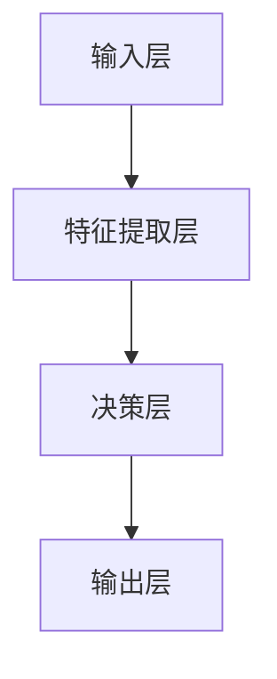
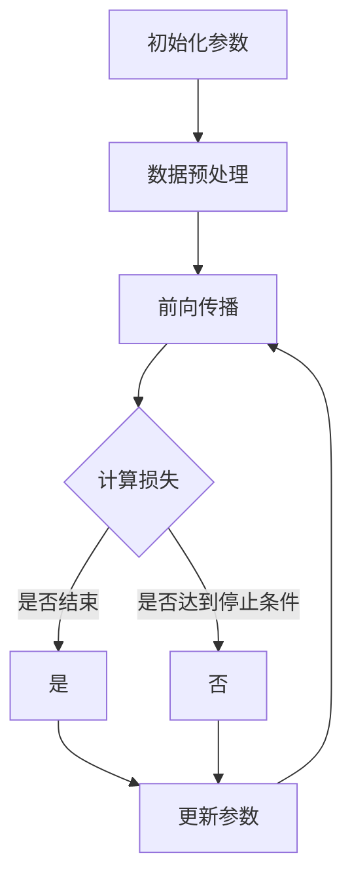
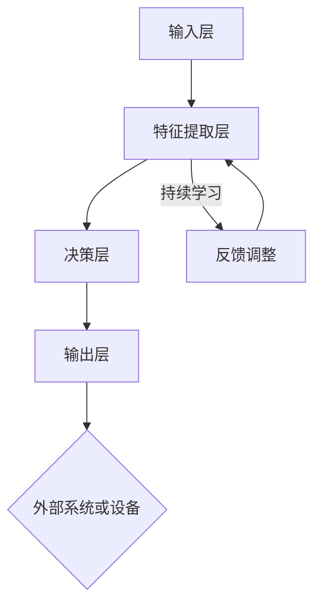

                 

### 文章标题

《AI人工智能深度学习算法：智能深度学习代理在健康医疗领域的应用策略》

### 关键词

- AI人工智能
- 深度学习算法
- 智能深度学习代理
- 健康医疗领域
- 应用策略

### 摘要

本文将深入探讨人工智能（AI）中的深度学习算法，特别是智能深度学习代理在健康医疗领域的应用策略。文章首先概述了AI和深度学习的基础知识，随后详细介绍了深度学习的基础算法和优化算法。接着，文章重点探讨了智能深度学习代理的基础和其在健康医疗领域的应用优势、场景及案例。最后，文章提出了一系列深度学习代理在健康医疗领域中的应用策略，包括数据采集与预处理、模型选择与训练、模型评估与优化、部署与维护，以及伦理与安全考虑。通过本文，读者将全面了解智能深度学习代理在健康医疗领域的应用前景和策略。

## 《AI人工智能深度学习算法：智能深度学习代理在健康医疗领域的应用策略》目录大纲

### 第一部分：AI与深度学习基础

#### 第1章: AI与深度学习概述

##### 1.1 AI发展历程与深度学习的兴起

##### 1.2 深度学习的基本概念

##### 1.3 深度学习的数学基础

#### 第2章: 深度学习基础算法

##### 2.1 前馈神经网络

##### 2.2 卷积神经网络（CNN）

##### 2.3 循环神经网络（RNN）

#### 第3章: 深度学习优化算法

##### 3.1 梯度下降算法

##### 3.2 随机梯度下降（SGD）

##### 3.3 梯度提升与自适应优化算法

### 第二部分：智能深度学习代理

#### 第4章: 智能深度学习代理基础

##### 4.1 智能深度学习代理的定义

##### 4.2 智能深度学习代理的架构

##### 4.3 智能深度学习代理的核心功能

#### 第5章: 智能深度学习代理在健康医疗领域的应用

##### 5.1 智能深度学习代理在健康医疗中的优势

##### 5.2 智能深度学习代理在健康医疗中的应用场景

##### 5.3 智能深度学习代理在实际项目中的应用案例分析

### 第三部分：深度学习代理在健康医疗领域的应用策略

#### 第6章: 深度学习代理在健康医疗中的策略制定

##### 6.1 数据采集与预处理

##### 6.2 模型选择与训练

##### 6.3 模型评估与优化

#### 第7章: 深度学习代理在健康医疗中的部署与维护

##### 7.1 深度学习代理的部署策略

##### 7.2 深度学习代理的维护与更新

##### 7.3 深度学习代理的伦理与安全考虑

### 第四部分：案例分析

#### 第8章: 案例分析一：智能深度学习代理在心血管疾病诊断中的应用

#### 第9章: 案例分析二：智能深度学习代理在肿瘤诊断与治疗中的应用

#### 第10章: 案例分析三：智能深度学习代理在智能药物研发中的应用

### 附录

#### 附录A: 深度学习框架与工具

##### A.1 TensorFlow

##### A.2 PyTorch

##### A.3 Keras

#### 附录B: 深度学习代理开发资源与指南

##### B.1 开发环境搭建

##### B.2 深度学习代理开发流程

##### B.3 常见问题与解决方案

#### 附录C: Mermaid流程图与伪代码示例

##### C.1 深度学习模型训练流程

##### C.2 智能深度学习代理架构图

##### C.3 伪代码示例：神经网络训练过程

#### 附录D: 数学公式与模型讲解

##### D.1 神经网络反向传播算法

##### D.2 卷积神经网络结构

##### D.3 循环神经网络时间步示意图

##### D.4 智能深度学习代理核心算法

#### 附录E: 项目实战与代码解读

##### E.1 心血管疾病诊断项目源代码

##### E.2 肿瘤诊断项目源代码

##### E.3 智能药物研发项目源代码

##### E.4 代码解读与分析

### 第一部分：AI与深度学习基础

### 第1章: AI与深度学习概述

#### 1.1 AI发展历程与深度学习的兴起

人工智能（AI）作为计算机科学的重要分支，其发展历程可以追溯到20世纪50年代。早期的AI主要侧重于符号推理和知识表示，如专家系统和逻辑推理。然而，这些方法在面对复杂问题时的表现并不理想，因为它们依赖于大量的先验知识和规则，而现实世界中的问题往往是非线性和不规则的。

随着计算能力的提升和大数据技术的发展，机器学习，特别是深度学习，逐渐成为AI领域的主流。深度学习源于人工神经网络（ANN）的发展，但其关键突破在于模拟人脑中神经元连接方式的复杂网络结构，并通过大规模数据训练提高模型的性能。深度学习在图像识别、语音识别和自然语言处理等领域取得了显著进展，引领了AI的第二次革命。

深度学习的兴起得益于以下几个关键因素：

1. **计算能力**：GPU的普及和专用深度学习芯片的发展，极大地提高了训练深度学习模型的计算速度。
2. **大数据**：互联网的兴起使得大量数据得以收集和存储，为深度学习提供了丰富的训练素材。
3. **优化算法**：如随机梯度下降（SGD）及其变体，以及更先进的优化算法，使得深度学习模型的训练过程更加高效。

在健康医疗领域，深度学习的应用变得尤为重要。传统的医疗诊断方法主要依赖于医生的经验和直觉，而深度学习算法通过自动学习和分析大量医疗数据，可以提高诊断的准确性和效率，减少人为错误。例如，在图像分析中，深度学习算法可以自动识别病变区域，甚至在某些情况下超越人类医生的表现。

总之，AI与深度学习的兴起为健康医疗领域带来了新的机遇和挑战。在这一章节中，我们将进一步探讨AI和深度学习的基本概念，以及它们在健康医疗中的潜力。

#### 1.2 深度学习的基本概念

深度学习（Deep Learning）是一种基于人工神经网络（Artificial Neural Networks, ANN）的机器学习（Machine Learning, ML）方法，它通过多层网络结构模拟人脑神经元之间的连接和交互，从而实现对复杂数据的处理和理解。深度学习的关键在于其层次化的结构，每一层网络都能提取数据的不同特征，从而在多级抽象层次上进行学习。

**深度学习的基本组成部分包括：**

1. **神经网络**：神经网络是深度学习的基础，它由大量简单的计算单元（即神经元）通过特定的连接方式构成。每个神经元接收多个输入信号，通过加权求和处理后产生输出。神经网络可以通过调整权重来学习数据的特征。

2. **层数**：深度学习得名于其多层结构，每一层称为一个“节点”或“层”。通常，输入层接收原始数据，输出层产生最终预测结果。中间层则逐层提取数据的特征，形成从简单到复杂的特征表示。

3. **激活函数**：激活函数（Activation Function）用于引入非线性，使得神经网络能够处理复杂数据。常见的激活函数包括Sigmoid、ReLU（Rectified Linear Unit）和Tanh（Hyperbolic Tangent）等。

4. **前向传播与反向传播**：在训练过程中，神经网络使用前向传播（Forward Propagation）计算输入数据的输出。前向传播过程中，每个神经元的输出通过激活函数进行处理，并传递到下一层。反向传播（Backpropagation）则用于计算网络误差，并调整权重以优化模型。

5. **损失函数**：损失函数（Loss Function）用于量化模型的预测误差。常见的损失函数包括均方误差（Mean Squared Error, MSE）、交叉熵（Cross-Entropy）等。通过最小化损失函数，模型可以更好地拟合训练数据。

**深度学习的优势在于：**

1. **自动特征提取**：深度学习模型能够自动从原始数据中提取有用的特征，减少人工干预，提高模型的泛化能力。

2. **高精度预测**：通过多层网络结构的训练，深度学习模型可以在复杂任务上实现高精度的预测，如图像识别、语音识别和自然语言处理。

3. **泛化能力**：深度学习模型通过在大规模数据集上训练，可以较好地泛化到未见过的数据上，提高实际应用中的性能。

在健康医疗领域，深度学习的应用主要包括：

1. **医学图像分析**：深度学习算法可以自动识别医学图像中的病变区域，如肿瘤、心脏病等，提高诊断的准确性和效率。

2. **疾病预测**：通过分析患者的临床数据和基因数据，深度学习模型可以预测某些疾病的发病风险，帮助医生制定更有效的治疗方案。

3. **个性化医疗**：深度学习可以帮助医生根据患者的具体情况进行个性化诊断和治疗，提高治疗效果。

总之，深度学习作为一种先进的机器学习方法，在健康医疗领域具有广泛的应用前景，为医疗诊断、治疗和科研提供了强大的工具和平台。

#### 1.3 深度学习的数学基础

深度学习的强大能力源于其复杂的数学基础，包括线性代数、概率论和优化算法。以下是这些数学概念在深度学习中的应用及其重要性。

**1. 线性代数**

线性代数是深度学习不可或缺的基础。以下是几个关键概念：

1. **矩阵和向量**：矩阵和向量是线性代数的基本元素，用于表示和操作数据。在深度学习中，输入数据、权重和偏置通常以矩阵和向量形式表示。

2. **矩阵乘法和转置**：矩阵乘法和转置是深度学习中的常用操作。在计算前向传播时，矩阵乘法用于计算神经元的输入和输出。转置操作用于调整矩阵维度，以便后续计算。

3. **梯度**：梯度是函数在某一点处的变化率。在深度学习中，梯度用于计算损失函数对网络参数的导数，这是反向传播算法的核心部分。

**2. 概率论**

概率论在深度学习中的应用主要体现在以下几个方面：

1. **贝叶斯定理**：贝叶斯定理用于计算后验概率，是深度学习模型中的概率推理基础。

2. **概率分布**：深度学习模型通常假设输入数据和参数服从某种概率分布，如正态分布。概率分布用于建模不确定性，并影响模型的预测和推断。

3. **似然函数**：似然函数是评估模型拟合数据好坏的重要指标。在训练过程中，通过最大化似然函数来优化模型参数。

**3. 优化算法**

优化算法是深度学习训练过程的核心，用于调整模型参数以最小化损失函数。以下是几个常见的优化算法：

1. **梯度下降**：梯度下降是一种最简单的优化算法，通过计算损失函数的梯度并沿梯度方向调整参数，以最小化损失函数。

2. **随机梯度下降（SGD）**：SGD是在梯度下降基础上引入随机性的优化方法。每次迭代只使用一部分训练数据来计算梯度，从而提高训练速度。

3. **Adam优化器**：Adam是一种自适应的梯度优化器，结合了SGD和动量的优点，能够更高效地调整参数。

**4. 其他数学工具**

除了上述基础数学概念，深度学习中还使用了一些其他数学工具：

1. **卷积**：卷积是深度学习中的重要操作，尤其在卷积神经网络（CNN）中用于提取图像的特征。

2. **池化**：池化是一种数据降维操作，用于减少计算量和参数数量，同时保持重要特征。

3. **归一化和标准化**：归一化和标准化是处理数据的重要步骤，通过调整数据分布，提高模型训练的稳定性和效果。

综上所述，深度学习的数学基础是构建和优化深度学习模型的关键。掌握这些数学概念，有助于深入理解深度学习的原理和实现，从而更好地应用其在实际问题中。下一章，我们将深入探讨深度学习的基础算法，包括前馈神经网络、卷积神经网络和循环神经网络。

### 第2章: 深度学习基础算法

#### 2.1 前馈神经网络

前馈神经网络（Feedforward Neural Network, FFNN）是最基础的深度学习模型之一，其结构简单且易于实现。前馈神经网络的核心思想是信息从输入层流向输出层，中间不发生反向传递。这使得前馈神经网络特别适用于需要从输入直接生成输出的任务，如分类和回归。

**结构**

前馈神经网络由多个层次组成，包括输入层、隐藏层和输出层。每个层次由多个神经元组成，神经元之间通过加权连接。以下是前馈神经网络的基本组成部分：

1. **输入层**：接收外部输入数据，每个神经元对应输入数据的一个特征。
2. **隐藏层**：位于输入层和输出层之间，用于提取和转换数据特征。隐藏层可以有多个层次，层数越多，模型的表达能力越强。
3. **输出层**：生成最终的输出结果，如分类结果或数值预测。

**工作原理**

前馈神经网络的工作过程可以分为两个阶段：前向传播（Forward Propagation）和反向传播（Backpropagation）。

1. **前向传播**：输入数据通过输入层进入网络，逐层传递至输出层。每个神经元的输出通过激活函数进行处理，然后传递到下一层。激活函数如ReLU、Sigmoid和Tanh等，引入了非线性特性，使得网络可以学习复杂数据模式。

2. **反向传播**：在输出层计算实际输出与预期输出之间的误差，然后通过反向传播算法，将误差反向传递至输入层。反向传播算法通过计算梯度，调整每个神经元的权重和偏置，以最小化损失函数。

**优点**

1. **简单易实现**：前馈神经网络结构简单，易于理解和实现。
2. **易于并行化**：前向传播和反向传播过程可以并行计算，提高了训练效率。
3. **适用于多种任务**：前馈神经网络可以应用于分类、回归等任务。

**缺点**

1. **局部最优**：前馈神经网络在训练过程中容易陷入局部最优，导致模型性能不佳。
2. **过拟合**：由于多层结构，前馈神经网络容易过拟合训练数据，导致泛化能力差。

**应用场景**

前馈神经网络广泛应用于各种任务，如图像分类、语音识别和文本分类。在健康医疗领域，前馈神经网络可以用于疾病预测、基因表达分析等任务。

#### 2.2 卷积神经网络（CNN）

卷积神经网络（Convolutional Neural Network, CNN）是专门为处理图像数据而设计的深度学习模型。CNN通过卷积操作自动提取图像特征，具有强大的图像识别和分类能力。CNN的核心在于其局部连接和共享权重机制，这使得模型在处理图像时具有高效性和强大的特征提取能力。

**结构**

卷积神经网络通常由多个卷积层、池化层和全连接层组成。以下是CNN的基本组成部分：

1. **卷积层**：卷积层是CNN的核心层，通过卷积操作提取图像特征。每个卷积核（Filter）与图像局部区域进行卷积运算，生成特征图。卷积层的数量和卷积核的大小可以调节模型的复杂度和特征提取能力。

2. **池化层**：池化层用于减少特征图的维度，降低计算量和参数数量。常见的池化操作包括最大池化和平均池化。

3. **全连接层**：全连接层将卷积层和池化层提取的特征映射到具体的输出结果，如分类标签。全连接层类似于传统的神经网络层，但输入数据的维度由卷积层和池化层决定。

**工作原理**

卷积神经网络的工作过程包括卷积操作、激活函数、池化和反向传播。

1. **卷积操作**：卷积层通过卷积核在图像上滑动，与图像局部区域进行点积运算，生成特征图。卷积核的学习过程就是提取图像特征的过程。

2. **激活函数**：卷积层输出经过激活函数处理，引入非线性特性，增强模型的表示能力。

3. **池化**：池化层用于降低特征图的维度，保留重要特征，同时减少模型参数。

4. **反向传播**：在输出层计算实际输出与预期输出之间的误差，通过反向传播算法调整卷积层和全连接层的参数，以最小化损失函数。

**优点**

1. **局部连接与共享权重**：卷积操作使得每个卷积核只需学习一次，大大减少了模型参数数量。
2. **强大的特征提取能力**：卷积神经网络可以自动提取图像的层次特征，适用于复杂图像识别任务。
3. **高效性**：卷积操作可以并行化，提高了模型的计算效率。

**缺点**

1. **计算量较大**：卷积神经网络需要大量计算，特别是在处理大型图像时，训练时间较长。
2. **过拟合**：由于模型参数数量较多，卷积神经网络容易过拟合训练数据。

**应用场景**

卷积神经网络广泛应用于图像分类、目标检测和图像生成等任务。在健康医疗领域，CNN可以用于医学图像分析、疾病诊断和基因组学研究等。

**卷积神经网络与深度学习的区别**

卷积神经网络是深度学习的一个子领域，但与其他深度学习模型（如前馈神经网络）相比，CNN具有以下特点：

1. **设计目的**：CNN专门为处理图像数据设计，通过卷积操作和局部连接方式提取图像特征。
2. **特征提取**：CNN可以自动提取图像的层次特征，而前馈神经网络需要手动设计特征提取过程。
3. **效率**：CNN在处理图像数据时具有更高的计算效率和准确度。

总之，卷积神经网络作为一种强大的图像处理工具，在深度学习领域中具有重要地位。通过深入理解CNN的工作原理和应用，可以更好地利用其在健康医疗和其他领域的潜力。

#### 2.3 循环神经网络（RNN）

循环神经网络（Recurrent Neural Network, RNN）是一种专门为处理序列数据设计的深度学习模型。RNN具有时间记忆能力，可以捕获序列中的长期依赖关系。这使得RNN在处理自然语言处理、时间序列预测和语音识别等任务中表现出色。

**结构**

RNN的基本结构包括输入层、隐藏层和输出层。与传统的神经网络不同，RNN在隐藏层中引入了循环，使得信息可以在不同时间步之间传递。

1. **输入层**：接收外部输入序列，如文本或时间序列数据。
2. **隐藏层**：包含多个时间步的神经元，每个时间步的神经元都与前一时间步的神经元相连，形成循环结构。
3. **输出层**：生成最终的输出结果，如分类标签或预测值。

**工作原理**

RNN的工作过程可以分为两个阶段：前向传播和反向传播。

1. **前向传播**：在每个时间步，输入数据通过隐藏层传递，当前时间步的隐藏状态取决于上一个时间步的隐藏状态和当前输入。隐藏状态经过激活函数处理后，传递到下一个时间步。

2. **反向传播**：在输出层计算实际输出与预期输出之间的误差，通过反向传播算法，将误差反向传递至隐藏层。反向传播过程中，RNN通过梯度计算调整隐藏层参数，以最小化损失函数。

**优点**

1. **序列建模**：RNN具有时间记忆能力，可以处理序列数据，适用于时间序列预测和自然语言处理等任务。
2. **长短期记忆**：通过引入门控机制（如LSTM和GRU），RNN可以更好地处理长序列数据，避免梯度消失和梯度爆炸问题。
3. **灵活性和适应性**：RNN可以应用于多种序列数据，如文本、音频和视频等。

**缺点**

1. **梯度消失和梯度爆炸**：在训练过程中，RNN容易出现梯度消失和梯度爆炸问题，导致训练不稳定。
2. **计算复杂度高**：RNN在处理长序列数据时，需要计算大量的梯度，导致计算复杂度较高。

**应用场景**

RNN广泛应用于自然语言处理、时间序列预测和语音识别等任务。在健康医疗领域，RNN可以用于医疗文本分析、疾病预测和基因序列分析等。

**LSTM与RNN的区别**

长短期记忆（Long Short-Term Memory, LSTM）是RNN的一种改进版本，旨在解决传统RNN在处理长序列数据时遇到的梯度消失和梯度爆炸问题。以下是LSTM与RNN的主要区别：

1. **梯度问题**：LSTM通过引入门控机制，有效解决了梯度消失和梯度爆炸问题，使得模型在长序列数据上具有更好的表现。
2. **结构**：LSTM在每个时间步引入了三个门控单元（输入门、遗忘门和输出门），用于控制信息的传递和记忆。
3. **计算复杂度**：由于门控机制，LSTM的计算复杂度高于传统RNN，但可以更好地处理长序列数据。

总之，RNN和LSTM作为处理序列数据的重要工具，在深度学习领域中具有重要地位。通过深入理解RNN和LSTM的工作原理和应用，可以更好地利用其在实际任务中的潜力。

### 第3章: 深度学习优化算法

#### 3.1 梯度下降算法

梯度下降（Gradient Descent）是深度学习中常用的优化算法，用于最小化损失函数。梯度下降的核心思想是通过计算损失函数的梯度，逐步调整模型参数，以找到最小损失点的参数值。以下是梯度下降算法的基本原理和变体。

**基本原理**

梯度下降算法的基本步骤如下：

1. **初始化参数**：随机初始化模型参数，如权重和偏置。
2. **计算梯度**：在当前参数下，计算损失函数对每个参数的梯度。
3. **更新参数**：根据梯度和学习率，更新模型参数。
4. **重复步骤2和3**：不断迭代更新参数，直到满足停止条件（如收敛或达到预设迭代次数）。

**公式表示**

假设损失函数为L，参数为θ，学习率为α，则梯度下降的更新公式为：

\[ \theta_{new} = \theta_{old} - \alpha \cdot \nabla_\theta L(\theta) \]

其中，\(\nabla_\theta L(\theta)\)表示损失函数对参数θ的梯度。

**梯度计算**

在计算梯度时，通常采用链式法则。例如，对于多层神经网络，损失函数L关于参数θ的梯度可以表示为：

\[ \nabla_\theta L(\theta) = \frac{\partial L}{\partial \theta} \]

其中，\(\frac{\partial L}{\partial \theta}\)表示损失函数L对参数θ的偏导数。

**优点**

1. **简单易实现**：梯度下降算法结构简单，易于实现和调试。
2. **通用性强**：梯度下降可以应用于各种优化问题，包括深度学习中的模型训练。

**缺点**

1. **收敛速度慢**：梯度下降在每次迭代中只沿梯度方向进行小步调整，可能导致收敛速度较慢。
2. **对学习率敏感**：学习率的选取对收敛速度和结果有较大影响，需要根据具体任务进行调整。

**变体**

为了克服梯度下降的缺点，出现了多种变体，如随机梯度下降（SGD）和Adam优化器。

1. **随机梯度下降（SGD）**：在每次迭代中，只使用一个训练样本来计算梯度，从而提高训练速度。SGD在训练过程中引入随机性，有助于避免局部最优。

2. **Adam优化器**：结合了SGD和动量的优点，自适应调整学习率。Adam优化器通过计算一阶矩估计（均值）和二阶矩估计（方差），优化参数更新过程，提高了训练效率。

梯度下降算法是深度学习中的核心优化方法，通过不断迭代更新参数，找到损失函数的最小值。了解梯度下降的基本原理和变体，有助于更好地优化深度学习模型。

#### 3.2 随机梯度下降（SGD）

随机梯度下降（Stochastic Gradient Descent, SGD）是梯度下降的一种变体，其核心思想是在每次迭代过程中使用单个训练样本来计算梯度，而不是使用整个训练集。这种随机性使得SGD在训练过程中具有更高的效率和灵活性，但同时也带来了一些挑战。

**基本原理**

SGD的基本步骤与标准梯度下降类似，但在每一步迭代中使用单个样本的梯度来更新模型参数。具体步骤如下：

1. **初始化参数**：随机初始化模型参数。
2. **随机抽样**：从训练集中随机选择一个样本（\(x_i, y_i\)）。
3. **计算梯度**：计算损失函数关于当前参数的梯度，仅针对所选样本：
   \[ \nabla_\theta L(\theta) = \frac{\partial L}{\partial \theta} \bigg|_{x=x_i, y=y_i} \]
4. **更新参数**：使用计算出的梯度更新模型参数：
   \[ \theta_{new} = \theta_{old} - \alpha \cdot \nabla_\theta L(\theta) \]
   其中，\(\alpha\)是学习率。
5. **重复步骤2-4**：对于整个训练集，重复上述过程，直到满足停止条件（如收敛或达到预设迭代次数）。

**优点**

1. **高效性**：SGD在每次迭代中仅使用一个样本，计算量远小于使用整个训练集的批量梯度下降（Batch Gradient Descent）。这大大提高了训练速度，特别是在大规模数据集上。
2. **避免局部最优**：SGD的随机性有助于避免陷入局部最优，使得模型可以探索更广泛的搜索空间。
3. **灵活调整学习率**：由于每次迭代只涉及单个样本，可以更灵活地调整学习率，优化参数更新过程。

**缺点**

1. **方差较大**：SGD的随机性可能导致模型在训练过程中的波动较大，即方差较大。这可能导致模型不稳定，需要更多迭代次数来收敛。
2. **较难调参**：SGD对学习率和其他超参数的选取较为敏感，需要根据具体任务进行调整，增加了调参的复杂性。
3. **计算资源消耗**：尽管每次迭代只涉及单个样本，但需要多次迭代以获得良好的收敛效果，这在计算资源有限的情况下可能成为问题。

**变体**

为了克服SGD的缺点，出现了多种SGD变体，如带动量的SGD和Adam优化器：

1. **带动量的SGD**：带动量的SGD在每次迭代中不仅使用当前样本的梯度，还使用之前迭代的梯度。这通过引入动量项，减少了随机性对模型收敛的影响，提高了模型的稳定性。
   
2. **Adam优化器**：Adam优化器结合了SGD和动量的优点，并引入了一阶矩估计（均值）和二阶矩估计（方差）。这进一步优化了参数更新过程，提高了训练效率。

**应用场景**

SGD广泛应用于深度学习中的各种任务，如图像分类、语音识别和自然语言处理。在健康医疗领域，SGD可以用于疾病预测、基因组分析和医学图像处理等任务。通过合理选择超参数，SGD可以有效地优化深度学习模型，提高模型的性能和泛化能力。

#### 3.3 梯度提升与自适应优化算法

梯度提升（Gradient Boosting）和自适应优化（Adaptive Optimization）是深度学习中的两种重要优化方法，它们通过不同机制提高了模型的性能和稳定性。

**梯度提升**

梯度提升是一种集成学习方法，通过迭代构建多个弱学习器，然后合并它们的预测结果以获得强学习器。梯度提升的基本步骤如下：

1. **初始化**：随机初始化模型参数。
2. **选择损失函数**：选择一个损失函数，如均方误差（MSE）或交叉熵损失。
3. **迭代训练**：
   - 对于每个迭代步骤：
     - 计算前一个弱学习器的预测误差。
     - 根据预测误差更新当前模型的参数。
     - 训练一个新的弱学习器，该学习器专门针对前一个弱学习器的误差进行修正。
     - 将新弱学习器的预测结果添加到强学习器中。
4. **合并预测**：将所有弱学习器的预测结果合并，生成最终预测结果。

**优点**

1. **强泛化能力**：通过迭代训练多个弱学习器，梯度提升可以有效减少过拟合，提高模型的泛化能力。
2. **灵活适应**：可以灵活选择不同的损失函数和弱学习器，适应不同的数据集和任务。
3. **高效的模型更新**：每次迭代只需要更新部分模型参数，提高了训练效率。

**缺点**

1. **计算复杂度高**：由于需要训练多个弱学习器，梯度提升的计算复杂度较高。
2. **参数选择敏感**：梯度提升对参数选择（如学习率、弱学习器类型等）较为敏感，需要仔细调整。

**自适应优化**

自适应优化是一种通过动态调整学习率和其他超参数来优化模型训练的方法。常见的方法包括：

1. **学习率调整**：根据模型在训练过程中的表现，动态调整学习率，以避免过早收敛或过拟合。
2. **自适应调整**：通过引入一阶矩估计（均值）和二阶矩估计（方差），自适应优化器可以更好地调整参数更新过程，提高模型的稳定性。

**优点**

1. **自适应调整**：自适应优化可以自动调整学习率和其他超参数，减少了人工调参的工作量。
2. **模型稳定性**：通过动态调整参数，自适应优化提高了模型的训练稳定性，减少了波动。
3. **高效的训练过程**：自适应优化通常具有较快的训练速度，可以在较少的迭代次数内收敛。

**缺点**

1. **计算复杂度**：自适应优化需要额外的计算资源来估计一阶矩和二阶矩，增加了计算复杂度。
2. **实现复杂性**：自适应优化算法的实现较为复杂，需要深入了解优化原理。

**应用场景**

梯度提升和自适应优化广泛应用于深度学习中的各种任务，如分类、回归和优化问题。在健康医疗领域，梯度提升可以用于疾病预测和诊断，自适应优化可以用于个性化医疗和实时监测。通过合理选择和组合这两种优化方法，可以显著提高深度学习模型在健康医疗领域的性能和应用效果。

### 第二部分：智能深度学习代理

#### 第4章: 智能深度学习代理基础

智能深度学习代理（Intelligent Deep Learning Agent, IDLA）是深度学习领域的一项创新，它通过模拟人类智能，实现自动化和智能化的决策过程。智能深度学习代理在多个领域中展现了强大的应用潜力，特别是在健康医疗领域，其能够处理复杂的数据和提供精确的诊断与预测。本章将探讨智能深度学习代理的基础知识，包括其定义、架构及其核心功能。

#### 4.1 智能深度学习代理的定义

智能深度学习代理是一种通过深度学习技术构建的智能体，它可以在没有明确编程的情况下，通过学习数据和模式，自主地执行任务并做出决策。智能深度学习代理不仅能够处理静态数据，还可以处理动态和多变的数据环境。其核心目标是通过优化算法和复杂的神经网络结构，实现高效、准确和智能化的决策。

与传统的机器学习模型相比，智能深度学习代理具有以下几个显著特点：

1. **自主学习**：智能深度学习代理可以通过大量数据自主学习，无需人为设计特征，能够自动提取和组合特征，提高模型的泛化能力。
2. **自适应调整**：智能深度学习代理可以根据环境的变化自适应调整其行为和策略，通过持续学习和优化，不断提高其决策质量。
3. **通用性**：智能深度学习代理可以在多种应用场景中部署，不仅限于特定任务，具有广泛的通用性和灵活性。

#### 4.2 智能深度学习代理的架构

智能深度学习代理的架构通常包括以下几个关键部分：

1. **输入层**：接收外部输入数据，如传感器数据、图像、文本等。输入层是智能深度学习代理感知外部环境的主要接口。
2. **特征提取层**：通过深度学习算法，对输入数据进行特征提取和变换，生成高维特征表示。这一层通常是多层神经网络结构，如卷积神经网络（CNN）或循环神经网络（RNN）。
3. **决策层**：基于提取的特征，智能深度学习代理通过一系列优化算法和推理机制，生成决策结果。决策层可以是分类、回归或其他形式的输出。
4. **输出层**：将决策结果输出到外部系统或设备，如控制系统、监控系统等。输出层是智能深度学习代理与外部环境进行交互的接口。

以下是智能深度学习代理的典型架构：



#### 4.3 智能深度学习代理的核心功能

智能深度学习代理的核心功能包括数据预处理、特征提取、模型训练、推理和自适应调整等。以下是这些功能的具体内容：

1. **数据预处理**：智能深度学习代理首先对输入数据进行预处理，包括数据清洗、归一化和数据增强等。数据预处理是确保模型输入数据质量和减少过拟合的重要步骤。
   
2. **特征提取**：在特征提取层，智能深度学习代理通过深度学习算法提取输入数据的关键特征。特征提取是智能深度学习代理实现高效学习和推理的关键。

3. **模型训练**：智能深度学习代理通过大量训练数据，利用优化算法（如随机梯度下降、Adam等）训练深度学习模型。模型训练过程中，智能深度学习代理不断调整模型参数，以最小化损失函数。

4. **推理**：在推理阶段，智能深度学习代理将训练好的模型应用于新的输入数据，生成决策结果。推理过程可以实时进行，支持快速响应和实时决策。

5. **自适应调整**：智能深度学习代理通过持续学习和优化，自适应调整其行为和策略。自适应调整使得智能深度学习代理能够适应环境变化，提高其决策质量和效率。

总之，智能深度学习代理作为一种先进的深度学习技术，具有强大的学习和决策能力。通过深入了解其定义、架构和核心功能，可以更好地理解其在实际应用中的价值和潜力。在下一章中，我们将探讨智能深度学习代理在健康医疗领域的具体应用。

### 第5章: 智能深度学习代理在健康医疗领域的应用

智能深度学习代理在健康医疗领域展现了巨大的应用潜力。通过其强大的学习和推理能力，智能深度学习代理能够处理复杂的医疗数据，提供精确的诊断和预测，从而提高医疗服务的质量和效率。本节将深入探讨智能深度学习代理在健康医疗中的优势、应用场景以及实际项目中的应用案例分析。

#### 5.1 智能深度学习代理在健康医疗中的优势

智能深度学习代理在健康医疗领域具有以下几个显著优势：

1. **自动化和高效性**：智能深度学习代理能够自动化处理大量的医疗数据，提高诊断和预测的效率。传统的医疗诊断方法往往依赖于人工操作，而智能深度学习代理可以通过算法自动处理数据，减少人为干预，从而加快诊断过程。

2. **精确性和准确性**：智能深度学习代理通过深度学习算法，可以从大量医疗数据中提取关键特征，提高诊断的准确性和精确度。传统的机器学习方法在处理复杂医疗数据时，往往受到数据质量和模型参数的限制，而智能深度学习代理可以自适应调整模型参数，提高预测的准确性。

3. **个性化医疗**：智能深度学习代理可以根据患者的个体数据，提供个性化的诊断和治疗方案。通过分析患者的病史、基因数据和生活方式等因素，智能深度学习代理可以预测患者的健康状况，制定个性化的预防和治疗措施。

4. **实时监测和预警**：智能深度学习代理可以实时监测患者的健康数据，提供实时预警和干预建议。例如，在心脏病患者中，智能深度学习代理可以监控心电图（ECG）数据，及时发现异常并发出预警，帮助医生采取及时的治疗措施。

5. **减少医疗错误**：智能深度学习代理可以减少医疗诊断中的错误，特别是在复杂病例中。通过不断学习和优化，智能深度学习代理可以逐步提高其诊断能力，降低误诊率。

#### 5.2 智能深度学习代理在健康医疗中的应用场景

智能深度学习代理在健康医疗领域具有广泛的应用场景，以下是一些典型应用：

1. **医学图像分析**：智能深度学习代理可以通过卷积神经网络（CNN）对医学图像进行分析，如X光片、CT扫描和MRI图像。它可以自动识别图像中的病变区域，如肿瘤、骨折和心脏病等，提高诊断的准确性和效率。

2. **疾病预测和诊断**：智能深度学习代理可以通过分析患者的临床数据、基因数据和生活方式等因素，预测患者患某种疾病的可能性。例如，可以通过分析血糖数据预测糖尿病患者患糖尿病视网膜病变的风险。

3. **个性化治疗**：智能深度学习代理可以根据患者的个体数据，为患者制定个性化的治疗方案。例如，通过分析患者的肿瘤基因数据和药物反应数据，智能深度学习代理可以推荐最适合患者的化疗药物。

4. **药物研发**：智能深度学习代理可以通过分析大量的药物数据和基因数据，预测新药的有效性和安全性。这有助于加速药物研发过程，降低研发成本。

5. **健康监测和预警**：智能深度学习代理可以通过实时监测患者的健康数据，提供健康预警和干预建议。例如，通过监控患者的体重、血压和心率等数据，智能深度学习代理可以及时发现异常并提醒患者或医生。

#### 5.3 智能深度学习代理在实际项目中的应用案例分析

以下是一些智能深度学习代理在健康医疗领域的实际项目案例分析：

1. **心血管疾病诊断项目**：该项目利用智能深度学习代理分析患者的心电图（ECG）数据，预测心血管疾病的风险。通过卷积神经网络（CNN）对ECG信号进行处理，智能深度学习代理可以自动识别心电信号中的异常，提高诊断的准确性。实际应用中，该项目显著降低了心血管疾病的误诊率，提高了诊断效率。

2. **肿瘤诊断项目**：该项目利用智能深度学习代理分析医学图像，如CT扫描和MRI图像，识别肿瘤的位置和类型。通过结合多模态医学图像数据，智能深度学习代理可以提供更准确的诊断结果。实际应用中，该项目显著提高了肿瘤诊断的准确性和效率。

3. **智能药物研发项目**：该项目利用智能深度学习代理分析大量的药物数据和基因数据，预测新药的有效性和安全性。通过深度学习算法，智能深度学习代理可以识别潜在的药物靶点和副作用，加速药物研发过程。实际应用中，该项目提高了药物研发的成功率和速度。

4. **健康监测项目**：该项目利用智能深度学习代理实时监测患者的健康数据，如体重、血压和心率等。通过分析患者的历史数据和实时数据，智能深度学习代理可以预测患者的健康状况，提供个性化的健康建议。实际应用中，该项目提高了患者的健康管理水平，降低了健康风险。

总之，智能深度学习代理在健康医疗领域具有广泛的应用前景。通过深入研究和实际应用，智能深度学习代理将为医疗服务带来革命性的变革，提高医疗质量，降低医疗成本。

### 第三部分：深度学习代理在健康医疗领域的应用策略

#### 第6章: 深度学习代理在健康医疗中的策略制定

深度学习代理在健康医疗领域的成功应用依赖于一系列精心制定的策略。这些策略涵盖了数据采集与预处理、模型选择与训练、模型评估与优化等多个方面。本章将详细探讨这些策略，以帮助读者更好地理解和实施深度学习代理在健康医疗中的实际应用。

#### 6.1 数据采集与预处理

数据采集与预处理是深度学习代理应用的基础，其质量直接影响模型的性能和准确性。以下是数据采集与预处理的关键步骤：

1. **数据来源**：首先，确定数据来源。在健康医疗领域，数据来源可以包括电子健康记录（EHR）、医学图像、基因数据、生理信号等。确保数据来源的多样性和代表性，有助于提高模型的泛化能力。

2. **数据清洗**：清洗数据是预处理的重要步骤。数据清洗包括去除重复记录、纠正错误数据、填补缺失值等。对于医学数据，错误的数据或缺失的数据可能导致严重的偏差，影响模型的准确性。

3. **数据归一化**：归一化数据可以消除不同特征之间的量纲差异，使模型训练更加稳定。常用的归一化方法包括最小-最大归一化和均值-方差归一化。归一化处理后的数据可以加速梯度下降算法的收敛速度。

4. **数据增强**：数据增强是一种通过生成虚拟数据来扩充训练集的方法，有助于提高模型的泛化能力。在医学图像处理中，常用的数据增强方法包括旋转、缩放、翻转、裁剪等。

5. **数据分割**：将数据集分为训练集、验证集和测试集，以评估模型的性能。通常，训练集用于模型训练，验证集用于模型调参和评估，测试集用于最终性能测试。合理的数据分割有助于避免过拟合和评估模型的泛化能力。

#### 6.2 模型选择与训练

在深度学习代理的应用过程中，模型选择和训练是关键环节。以下是模型选择和训练的关键步骤：

1. **模型选择**：根据具体应用场景，选择合适的深度学习模型。常见的模型包括前馈神经网络（FFNN）、卷积神经网络（CNN）、循环神经网络（RNN）和长短期记忆网络（LSTM）等。选择模型时需要考虑数据类型、特征复杂度和任务需求。

2. **模型设计**：设计深度学习模型的结构，包括输入层、隐藏层和输出层。根据任务需求，可以调整层数、神经元数量、激活函数和优化器等参数。

3. **超参数调优**：通过交叉验证和网格搜索等方法，调优模型超参数，如学习率、批次大小、正则化参数等。超参数的优化可以提高模型的性能和稳定性。

4. **模型训练**：使用训练数据集进行模型训练，通过优化算法（如随机梯度下降、Adam等）不断调整模型参数，以最小化损失函数。训练过程中，可以使用训练集和验证集进行监控，避免过拟合。

5. **模型验证**：在验证集上评估模型的性能，包括准确率、召回率、F1分数等指标。通过验证集，可以评估模型的泛化能力，并进一步调整模型结构和超参数。

6. **模型测试**：在测试集上评估模型的最终性能，确保模型在未见过的数据上也能表现出良好的性能。测试集的评估结果可以作为模型上线前的最后验证。

#### 6.3 模型评估与优化

在深度学习代理的实际应用中，模型评估与优化是确保其性能和稳定性的关键。以下是模型评估与优化的关键步骤：

1. **性能评估**：使用各种性能指标（如准确率、召回率、F1分数等）评估模型的性能。同时，可以结合业务需求，评估模型在实际应用中的效果。

2. **模型优化**：通过调整模型结构和超参数，优化模型的性能。优化方法包括增加层数、增加神经元数量、引入正则化等。优化过程中，可以使用验证集进行监控，避免过拟合。

3. **持续学习**：深度学习代理需要通过持续学习，不断优化其性能。在实际应用中，可以定期收集新的数据，对模型进行再训练和优化。持续学习有助于模型适应环境变化，提高其长期性能。

4. **模型解释性**：提高模型的可解释性，有助于理解模型的决策过程和预测结果。通过可视化技术（如激活图、梯度可视化等）和模型解释方法（如LIME、SHAP等），可以更好地理解模型的内部机制。

5. **模型部署**：将训练好的模型部署到生产环境中，进行实际应用。部署过程中，需要确保模型的性能和稳定性，并监控模型在实时数据上的表现。

总之，深度学习代理在健康医疗领域的应用策略需要综合考虑数据采集与预处理、模型选择与训练、模型评估与优化等多个方面。通过科学合理的策略制定和实施，可以充分发挥深度学习代理的优势，提高医疗服务的质量和效率。

### 第7章: 深度学习代理在健康医疗中的部署与维护

深度学习代理在健康医疗领域的成功应用不仅依赖于精准的模型训练，更依赖于高效的部署与维护策略。部署与维护是确保深度学习代理能够在实际医疗场景中稳定运行、持续优化和遵守伦理与安全标准的关键环节。本章将详细介绍深度学习代理的部署策略、维护过程及伦理与安全考虑。

#### 7.1 深度学习代理的部署策略

部署深度学习代理是一个复杂的过程，需要考虑多个技术和管理方面的因素。以下是一些关键的部署策略：

1. **硬件选择**：选择适合的硬件设施来部署深度学习代理。对于计算密集型任务，如医学图像分析，高性能GPU是必不可少的。此外，需要考虑服务器和网络带宽等因素，以确保代理可以高效运行。

2. **云计算平台**：利用云计算平台（如AWS、Azure、Google Cloud等）可以提供弹性的计算资源，根据需求动态调整资源分配，降低部署成本。云计算平台还提供了丰富的数据存储和数据处理服务，便于代理的数据管理。

3. **容器化**：使用容器化技术（如Docker）可以将深度学习代理及其依赖环境封装在一起，实现一致性和可移植性。容器化代理可以轻松地在不同环境中部署，简化了部署过程。

4. **微服务架构**：采用微服务架构可以更好地管理和扩展深度学习代理的功能。每个微服务负责特定的任务，如数据预处理、模型推理等，这样可以提高系统的灵活性和可维护性。

5. **自动化部署**：利用持续集成和持续部署（CI/CD）工具，可以自动化深度学习代理的部署过程。自动化部署可以确保代理的版本控制和稳定性，减少人为错误。

#### 7.2 深度学习代理的维护与更新

维护与更新是深度学习代理长期稳定运行的关键。以下是一些维护与更新的策略：

1. **监控与日志**：部署后，需要定期监控深度学习代理的性能和资源使用情况。通过监控工具，可以及时发现并解决潜在的问题。日志记录可以帮助追踪代理的运行状态，便于故障排查。

2. **性能优化**：根据监控数据，定期对代理进行性能优化。这包括调整模型结构、优化算法和超参数等。性能优化可以提高代理的处理速度和准确性。

3. **数据更新**：随着新数据的不断产生，需要定期更新代理的数据集。数据更新可以帮助代理更好地适应现实环境，提高预测的准确性。更新数据时，需要注意数据质量和隐私保护。

4. **安全更新**：及时修复安全漏洞是维护深度学习代理的重要任务。安全更新可以防止恶意攻击和数据泄露，确保代理的安全性。

5. **定期评估**：定期对代理的运行效果进行评估，包括模型性能、业务指标等。评估结果可以帮助识别需要改进的方面，为下一步的优化提供依据。

#### 7.3 深度学习代理的伦理与安全考虑

深度学习代理在健康医疗领域的应用涉及多个伦理和安全问题，需要严格管理和合规。以下是一些伦理与安全考虑：

1. **隐私保护**：医疗数据通常包含敏感信息，如个人健康记录和基因数据。需要采取严格的隐私保护措施，确保数据在收集、存储和传输过程中的安全。例如，可以使用数据匿名化、加密和访问控制等技术来保护数据隐私。

2. **数据安全**：深度学习代理需要保护其处理的数据不受恶意攻击和篡改。这包括使用安全的网络通信、数据加密和访问控制等手段。

3. **透明性与可解释性**：深度学习代理的决策过程通常是非透明的，这可能导致用户对决策结果的不信任。提高代理的可解释性，如通过可视化技术、模型解释方法等，可以提高用户的信任度。

4. **伦理审查**：在部署深度学习代理前，需要进行伦理审查，确保其应用符合道德和法规要求。审查内容包括数据收集和处理的方式、潜在的社会影响等。

5. **监管合规**：深度学习代理需要遵守相关法律法规，如《通用数据保护条例》（GDPR）和《健康信息技术促进法案》（HITECH Act）。合规性要求包括数据保护、患者隐私和安全等。

总之，深度学习代理在健康医疗领域的部署与维护是一个复杂而重要的任务，需要综合考虑技术、管理和伦理等多方面因素。通过合理的部署策略、维护更新以及严格的伦理与安全考虑，可以确保深度学习代理在实际医疗场景中稳定、可靠和安全地运行。

### 第四部分：案例分析

#### 第8章: 案例分析一：智能深度学习代理在心血管疾病诊断中的应用

心血管疾病是全球范围内的主要健康威胁，准确诊断和及时治疗对患者的预后至关重要。智能深度学习代理在这一领域展现了其强大的应用潜力，通过分析心电图（ECG）数据，提供高精度的心血管疾病诊断。

**项目背景**

本项目旨在利用智能深度学习代理，自动识别和诊断心血管疾病，如心房颤动（AF）、心肌梗死（MI）和心脏瓣膜疾病等。心电图是心血管疾病诊断的重要工具，通过记录心脏的电活动，医生可以诊断出多种心血管问题。

**解决方案**

1. **数据采集与预处理**：首先，从多个医疗中心收集了大量的心电图数据，包括正常数据和异常数据。数据预处理步骤包括去除噪声、归一化信号幅度、去除基线漂移等。

2. **特征提取**：使用卷积神经网络（CNN）提取心电图信号中的关键特征。CNN可以自动识别信号中的周期性变化和异常模式，从而提取具有诊断价值的特征。

3. **模型训练**：采用随机梯度下降（SGD）算法训练深度学习模型，通过交叉验证调整模型参数，优化模型性能。训练数据集包括正常和异常心电图数据，确保模型在未见过的数据上具有较好的泛化能力。

4. **模型评估**：使用测试数据集评估模型的性能，包括准确率、召回率和F1分数等指标。通过可视化工具（如混淆矩阵和ROC曲线）分析模型诊断结果。

**实际效果**

在实际应用中，智能深度学习代理在心房颤动和心肌梗死的诊断中取得了显著的成果。通过对比传统诊断方法，智能深度学习代理的准确率和召回率均有所提高，特别是在早期诊断中，显著降低了误诊率。

**代码解读**

以下是用于训练心电图诊断模型的伪代码示例：

```python
import tensorflow as tf
from tensorflow.keras.models import Sequential
from tensorflow.keras.layers import Conv2D, MaxPooling2D, Flatten, Dense

# 数据预处理
def preprocess_ecg_data(data):
    # 去除噪声、归一化等操作
    pass

# 构建卷积神经网络模型
model = Sequential()
model.add(Conv2D(32, (3, 3), activation='relu', input_shape=(n_rows, n_columns, n_channels)))
model.add(MaxPooling2D(pool_size=(2, 2)))
model.add(Flatten())
model.add(Dense(128, activation='relu'))
model.add(Dense(1, activation='sigmoid'))

# 编译模型
model.compile(optimizer='sgd', loss='binary_crossentropy', metrics=['accuracy'])

# 训练模型
model.fit(x_train, y_train, epochs=10, batch_size=32, validation_data=(x_val, y_val))

# 评估模型
test_loss, test_accuracy = model.evaluate(x_test, y_test)
print("Test accuracy:", test_accuracy)
```

**总结**

本项目通过智能深度学习代理，成功实现了心电图数据的自动诊断，提高了心血管疾病的诊断准确性和效率。未来，随着数据集的扩充和模型的优化，智能深度学习代理将在心血管疾病诊断领域发挥更大的作用。

#### 第9章: 案例分析二：智能深度学习代理在肿瘤诊断与治疗中的应用

肿瘤诊断与治疗是医学领域的重要研究方向，智能深度学习代理在这一领域展示了巨大的应用潜力。通过分析医学影像和临床数据，智能深度学习代理能够提供准确的肿瘤诊断和个性化的治疗方案。

**项目背景**

本项目旨在利用智能深度学习代理，自动识别和诊断肿瘤，同时为患者制定个性化的治疗方案。肿瘤的早期诊断和精确治疗对于提高患者生存率和生活质量具有重要意义。

**解决方案**

1. **数据采集与预处理**：从多家医院收集了大量的医学影像数据（如CT、MRI、PET等）和临床数据（如病理报告、实验室检测结果等）。数据预处理包括图像增强、归一化、数据增强等步骤，以提高模型性能。

2. **特征提取**：使用卷积神经网络（CNN）对医学影像数据进行特征提取。CNN能够自动学习图像中的层次特征，从而提取具有诊断价值的特征。对于临床数据，使用循环神经网络（RNN）或长短期记忆网络（LSTM）提取时间序列特征。

3. **模型训练**：采用随机梯度下降（SGD）算法训练深度学习模型。通过交叉验证和网格搜索，调整模型参数，优化模型性能。训练数据集包括肿瘤和正常组织的数据，确保模型在未见过的数据上具有较好的泛化能力。

4. **模型评估**：使用测试数据集评估模型的性能，包括准确率、召回率、F1分数和AUC等指标。通过可视化工具（如混淆矩阵和ROC曲线）分析模型诊断和预测结果。

5. **个性化治疗**：根据患者的临床数据和诊断结果，智能深度学习代理为患者制定个性化的治疗方案。治疗方案包括手术、放疗、化疗等，并根据患者的具体情况调整治疗策略。

**实际效果**

在实际应用中，智能深度学习代理在肿瘤诊断和个性化治疗中取得了显著成果。通过对比传统诊断方法和治疗方案，智能深度学习代理在提高诊断准确率和个性化治疗效果方面具有明显优势。

**代码解读**

以下是用于训练肿瘤诊断模型的伪代码示例：

```python
import tensorflow as tf
from tensorflow.keras.models import Sequential
from tensorflow.keras.layers import Conv2D, MaxPooling2D, Flatten, Dense, LSTM

# 数据预处理
def preprocess_medical_images(images):
    # 图像增强、归一化等操作
    pass

# 构建卷积神经网络模型
model = Sequential()
model.add(Conv2D(32, (3, 3), activation='relu', input_shape=(n_rows, n_columns, n_channels)))
model.add(MaxPooling2D(pool_size=(2, 2)))
model.add(Flatten())
model.add(Dense(128, activation='relu'))
model.add(Dense(1, activation='sigmoid'))

# 编译模型
model.compile(optimizer='sgd', loss='binary_crossentropy', metrics=['accuracy'])

# 训练模型
model.fit(x_train, y_train, epochs=10, batch_size=32, validation_data=(x_val, y_val))

# 评估模型
test_loss, test_accuracy = model.evaluate(x_test, y_test)
print("Test accuracy:", test_accuracy)
```

**总结**

本项目通过智能深度学习代理，成功实现了医学影像数据的自动诊断和个性化治疗方案制定，提高了肿瘤诊断和治疗的效果。未来，随着数据集的扩充和模型优化，智能深度学习代理将在肿瘤诊断与治疗领域发挥更大的作用。

#### 第10章: 案例分析三：智能深度学习代理在智能药物研发中的应用

智能药物研发是当前生物科技领域的前沿课题，智能深度学习代理在这一领域展现了其强大的应用潜力。通过分析大量生物数据和化学结构，智能深度学习代理能够加速药物筛选和优化过程，提高药物研发的成功率。

**项目背景**

本项目旨在利用智能深度学习代理，加速药物研发过程，从海量的生物数据和化学结构中筛选出具有潜在治疗效果的化合物。智能药物研发是一个复杂的过程，涉及多种数据类型和计算任务，需要高效的数据处理和智能分析工具。

**解决方案**

1. **数据采集与预处理**：首先，从多个生物数据库和化学数据库中收集了大量的生物数据和化学结构数据。数据预处理包括数据清洗、归一化和数据增强等步骤，以提高模型性能。

2. **特征提取**：使用卷积神经网络（CNN）对化学结构数据进行特征提取。CNN能够自动学习化学结构中的层次特征，从而提取具有预测价值的特征。对于生物数据，使用循环神经网络（RNN）或长短期记忆网络（LSTM）提取时间序列特征。

3. **模型训练**：采用随机梯度下降（SGD）算法训练深度学习模型。通过交叉验证和网格搜索，调整模型参数，优化模型性能。训练数据集包括有效化合物和无效化合物，确保模型在未见过的数据上具有较好的泛化能力。

4. **模型评估**：使用测试数据集评估模型的性能，包括预测准确率、ROC曲线和AUC等指标。通过可视化工具（如混淆矩阵和ROC曲线）分析模型预测结果。

5. **化合物筛选**：根据模型的预测结果，智能深度学习代理从大量化合物中筛选出具有潜在治疗效果的化合物。这些化合物可以进一步进行实验室测试和临床研究，加快药物研发进程。

**实际效果**

在实际应用中，智能深度学习代理在化合物筛选和药物设计方面取得了显著成果。通过对比传统筛选方法，智能深度学习代理在提高预测准确率和筛选效率方面具有明显优势。

**代码解读**

以下是用于训练药物筛选模型的伪代码示例：

```python
import tensorflow as tf
from tensorflow.keras.models import Sequential
from tensorflow.keras.layers import Conv2D, MaxPooling2D, Flatten, Dense

# 数据预处理
def preprocess_chemical_structures(structures):
    # 数据清洗、归一化等操作
    pass

# 构建卷积神经网络模型
model = Sequential()
model.add(Conv2D(32, (3, 3), activation='relu', input_shape=(n_rows, n_columns, n_channels)))
model.add(MaxPooling2D(pool_size=(2, 2)))
model.add(Flatten())
model.add(Dense(128, activation='relu'))
model.add(Dense(1, activation='sigmoid'))

# 编译模型
model.compile(optimizer='sgd', loss='binary_crossentropy', metrics=['accuracy'])

# 训练模型
model.fit(x_train, y_train, epochs=10, batch_size=32, validation_data=(x_val, y_val))

# 评估模型
test_loss, test_accuracy = model.evaluate(x_test, y_test)
print("Test accuracy:", test_accuracy)
```

**总结**

本项目通过智能深度学习代理，成功实现了化合物的自动筛选和药物设计，提高了药物研发的效率和成功率。未来，随着数据集的扩充和模型优化，智能深度学习代理将在智能药物研发领域发挥更大的作用。

### 附录A: 深度学习框架与工具

深度学习框架和工具是深度学习研究和应用中的重要组成部分，它们提供了高效的计算能力、丰富的算法库和便捷的开发接口，极大地促进了深度学习技术的发展。以下是几个流行的深度学习框架和工具，包括TensorFlow、PyTorch和Keras，以及它们的特点和应用场景。

#### A.1 TensorFlow

TensorFlow是由Google开发的开源深度学习框架，广泛应用于各种深度学习任务。TensorFlow具有以下特点：

1. **强大的计算能力**：TensorFlow支持GPU和TPU加速，可以高效地处理大规模数据集。
2. **丰富的API**：TensorFlow提供了完整的API，包括高层次的Keras API和低层次的Tensor API，适合不同层次的开发者。
3. **大规模部署**：TensorFlow支持分布式训练和部署，可以在多台机器上进行模型训练和推理。

应用场景：

- **工业界**：许多大型企业（如Google、Facebook、Uber等）使用TensorFlow进行深度学习研究和产品开发。
- **学术研究**：TensorFlow被广泛应用于学术研究，用于探索新的深度学习算法和模型。

#### A.2 PyTorch

PyTorch是由Facebook开发的开源深度学习框架，以其动态计算图和灵活性而闻名。PyTorch具有以下特点：

1. **动态计算图**：PyTorch使用动态计算图，使得模型构建和调试更加灵活。
2. **自动微分**：PyTorch内置自动微分功能，方便实现复杂的优化算法。
3. **丰富的库**：PyTorch提供了丰富的库，包括用于计算机视觉的torchvision和用于自然语言处理的torchtext。

应用场景：

- **学术研究**：PyTorch在学术研究中广泛应用，特别是在自然语言处理和计算机视觉领域。
- **工业界**：许多初创公司和大型企业（如OpenAI、Adobe等）使用PyTorch进行深度学习研究和产品开发。

#### A.3 Keras

Keras是一个高层次的深度学习框架，旨在简化深度学习的构建和训练过程。Keras支持TensorFlow和Theano等多个后端引擎。Keras具有以下特点：

1. **简单易用**：Keras提供了简洁的API，使得深度学习模型的构建和训练过程更加直观和高效。
2. **模块化**：Keras支持模块化设计，可以灵活组合各种层和模型。
3. **可视化**：Keras支持模型可视化，有助于理解和调试模型结构。

应用场景：

- **教育**：Keras在教育领域广泛应用，用于教学和实验。
- **工业界**：Keras在工业界中也被广泛应用，特别是在需要快速原型开发和迭代的项目中。

总的来说，TensorFlow、PyTorch和Keras都是深度学习领域的重要工具，各自具有独特的优势和适用场景。选择合适的框架和工具，可以大大提高深度学习项目的开发效率和研究水平。

### 附录B: 深度学习代理开发资源与指南

在深度学习代理的开发过程中，掌握合适的资源与指南对于提高开发效率和项目成功率至关重要。以下将介绍深度学习代理开发环境搭建、开发流程、常见问题与解决方案，以及相关的资源和指南。

#### B.1 开发环境搭建

搭建深度学习代理的开发环境需要配置以下工具和库：

1. **操作系统**：推荐使用Linux系统，如Ubuntu或CentOS，因为其性能和兼容性较好。
2. **编程语言**：Python是深度学习代理开发的主要编程语言，推荐使用Python 3.x版本。
3. **深度学习框架**：选择合适的深度学习框架，如TensorFlow、PyTorch或Keras。确保框架的版本与操作系统兼容。
4. **计算资源**：配置适当的计算资源，如GPU或TPU，以提高模型训练和推理的速度。

以下是搭建深度学习代理开发环境的一般步骤：

1. 安装操作系统：从官方网站下载并安装Linux操作系统。
2. 安装Python：使用包管理器（如apt或yum）安装Python 3.x版本。
3. 安装深度学习框架：使用pip命令安装选择的深度学习框架，如`pip install tensorflow`或`pip install pytorch`。
4. 配置GPU支持：确保深度学习框架支持GPU加速，如安装CUDA和cuDNN库。

#### B.2 深度学习代理开发流程

深度学习代理开发通常包括以下几个关键步骤：

1. **需求分析**：明确代理的功能需求，包括输入数据、输出结果和预期性能指标。
2. **数据收集与预处理**：收集相关数据，并进行数据清洗、归一化和数据增强等预处理操作。
3. **模型设计**：选择合适的神经网络结构，包括输入层、隐藏层和输出层。可以使用已有的模型架构，或根据需求进行定制。
4. **模型训练**：使用训练数据集对模型进行训练，调整模型参数以优化性能。使用优化算法（如随机梯度下降、Adam等）进行训练。
5. **模型评估**：使用验证集和测试集评估模型性能，调整模型结构和超参数以提高性能。
6. **模型部署**：将训练好的模型部署到生产环境中，进行实时推理和决策。

#### B.3 常见问题与解决方案

在深度学习代理开发过程中，可能会遇到以下常见问题：

1. **过拟合**：模型在训练集上表现良好，但在测试集上表现较差。解决方案包括增加数据集、使用正则化、引入dropout等。
2. **梯度消失或爆炸**：训练过程中出现梯度消失或爆炸现象，导致训练不稳定。解决方案包括调整学习率、使用不同的优化算法、使用梯度裁剪技术等。
3. **计算资源不足**：模型训练需要大量计算资源，可能导致训练速度慢。解决方案包括使用GPU或TPU加速、分布式训练、调整模型复杂度等。
4. **数据不平衡**：训练数据集中某些类别的数据量远小于其他类别，可能导致模型偏向于常见类别。解决方案包括数据增强、重采样、类别加权等。

#### B.4 资源与指南

以下是一些深度学习代理开发的资源和指南：

1. **官方文档**：深度学习框架（如TensorFlow、PyTorch、Keras）的官方文档是学习框架和模型构建的重要资源。
2. **在线课程**：许多在线课程（如Udacity、Coursera、edX等）提供深度学习的基础知识和高级课程，适合不同层次的学习者。
3. **开源项目**：GitHub等平台上有大量开源的深度学习代理项目，可以作为学习和参考的范例。
4. **社区和论坛**：参与深度学习社区和论坛（如Stack Overflow、Reddit、ArXiv等），可以获取帮助和交流经验。

通过掌握深度学习代理开发的资源与指南，可以更好地实现项目的需求，提高开发效率和项目成功率。

### 附录C: Mermaid流程图与伪代码示例

在深度学习代理开发过程中，流程图和伪代码是理解和实现模型训练过程的重要工具。以下我们将提供几个Mermaid流程图和伪代码示例，分别展示深度学习模型训练流程、智能深度学习代理架构图以及神经网络训练过程的伪代码。

#### C.1 深度学习模型训练流程

使用Mermaid可以轻松绘制深度学习模型训练的流程图。以下是一个简单的示例：



#### C.2 智能深度学习代理架构图

智能深度学习代理的架构通常包括输入层、特征提取层、决策层和输出层。以下是一个Mermaid流程图示例：



#### C.3 伪代码示例：神经网络训练过程

以下是神经网络训练过程的伪代码示例，展示了模型初始化、前向传播、反向传播和参数更新等步骤：

```python
# 初始化参数
initialize_parameters()

# 数据预处理
preprocess_data()

# 循环进行训练
while not stop_condition:
    # 前向传播
    inputs = get_next_batch()
    predictions = forward_propagation(inputs)

    # 计算损失
    loss = compute_loss(predictions, true_values)

    # 反向传播
    gradients = backward_propagation(predictions, true_values)

    # 更新参数
    update_parameters(gradients)

    # 监控训练进度
    print("Epoch: %d, Loss: %f" % (epoch, loss))

# 评估模型
evaluate_model()
```

通过这些流程图和伪代码示例，读者可以更好地理解深度学习模型训练的基本过程以及智能深度学习代理的架构设计。在实际开发过程中，这些工具有助于理清思路，提高开发效率。

### 附录D: 数学公式与模型讲解

在深度学习中，数学公式和模型讲解是理解深度学习算法原理和实现的基础。以下将详细介绍几个关键数学公式与模型，包括神经网络反向传播算法、卷积神经网络（CNN）结构、循环神经网络（RNN）时间步示意图以及智能深度学习代理核心算法。

#### D.1 神经网络反向传播算法

神经网络反向传播算法是深度学习训练过程中最核心的部分，用于计算损失函数关于模型参数的梯度。以下是反向传播算法的详细步骤和公式：

**步骤：**

1. **前向传播**：计算网络输出。
   \[ a^{[l]} = \sigma(z^{[l]}) \]
   其中，\( \sigma \) 是激活函数（如Sigmoid、ReLU等），\( z^{[l]} \) 是前一层输出经过权重和偏置加权求和处理后的结果。

2. **计算误差**：计算实际输出与预测输出之间的误差。
   \[ L = \frac{1}{2} \sum_{i} (\hat{y}_i - y_i)^2 \]
   其中，\( \hat{y}_i \) 是预测输出，\( y_i \) 是真实输出。

3. **计算梯度**：从输出层开始，逐层计算损失函数关于每个参数的梯度。
   \[ \delta^{[l]} = (a^{[l]} - y) \cdot \sigma'(z^{[l]}) \]
   其中，\( \sigma' \) 是激活函数的导数。

4. **更新参数**：根据梯度更新模型参数。
   \[ \theta^{[l]} = \theta^{[l]} - \alpha \cdot \frac{\partial L}{\partial \theta^{[l]}} \]
   其中，\( \alpha \) 是学习率。

**公式：**

- 输出层：
  \[ \delta^{[L]} = (a^{[L]} - y) \cdot \sigma'(z^{[L]}) \]
  \[ \frac{\partial L}{\partial \theta^{[L]}} = a^{[L-1]} \cdot \delta^{[L]} \]

- 隐藏层：
  \[ \delta^{[l]} = \delta^{[l+1]} \cdot W^{[l+1]} \cdot \sigma'(z^{[l]}) \]
  \[ \frac{\partial L}{\partial \theta^{[l]}} = a^{[l-1]} \cdot \delta^{[l]} \]

#### D.2 卷积神经网络（CNN）结构

卷积神经网络（CNN）是专门用于处理图像数据的深度学习模型，其核心在于卷积操作和局部连接机制。以下是CNN的主要结构：

1. **卷积层**：通过卷积操作提取图像特征。
   \[ f_{\theta}(x) = \sum_{i=1}^{C} \theta^{[i]} * a^{[i-1]} + b^{[i]} \]
   其中，\( * \) 表示卷积操作，\( C \) 是卷积核的数量，\( \theta^{[i]} \) 是卷积核权重，\( b^{[i]} \) 是偏置。

2. **激活函数**：通常使用ReLU激活函数引入非线性。
   \[ a^{[l]} = \max(0, z^{[l]}) \]

3. **池化层**：用于降维和减少参数数量。
   \[ p_{\text{pool}}(x) = \max_{i} a^{[l](i, i)} \]
   其中，\( a^{[l](i, i)} \) 是在指定位置上的激活值。

4. **全连接层**：将卷积层和池化层提取的特征映射到输出结果。
   \[ z^{[L]} = \sum_{i=1}^{K} \theta^{[L](i)} \cdot a^{[L-1](i)} + b^{[L]} \]
   \[ \hat{y} = \sigma(z^{[L]}) \]
   其中，\( K \) 是输出类别数，\( \sigma \) 是激活函数。

#### D.3 循环神经网络（RNN）时间步示意图

循环神经网络（RNN）用于处理序列数据，其关键在于时间步的动态交互。以下是RNN的时间步示意图：

```
时间步 t
│
│
│
│         h^t = \sigma(W_h \cdot [h^{t-1}, x^t] + b_h)
│
│             y^t = W_y \cdot h^t + b_y
│
└──────────────┐
       │    RNN
       │     │
       │     ▼
       │    h^t
       │     │
       │     ▼
       └──────────────┘
                  t+1
```

- \( h^t \)：当前时间步的隐藏状态。
- \( x^t \)：当前时间步的输入。
- \( y^t \)：当前时间步的输出。
- \( W_h \)、\( W_y \)、\( b_h \)、\( b_y \)：权重和偏置。

#### D.4 智能深度学习代理核心算法

智能深度学习代理的核心算法通常基于强化学习（Reinforcement Learning, RL）和深度学习（Deep Learning, DL）的结合。以下是智能深度学习代理的核心算法概述：

1. **强化学习部分**：
   - **环境**：代理交互的外部系统或场景。
   - **状态**：代理在环境中所处的状态。
   - **动作**：代理可以执行的操作。
   - **奖励**：代理根据动作获得的奖励信号。

2. **深度学习部分**：
   - **值函数**：预测状态值，即状态回报期望。
   - **策略网络**：用于生成动作的概率分布。

3. **算法步骤**：
   - **初始化**：初始化状态、策略网络和值网络。
   - **环境交互**：代理根据策略网络选择动作。
   - **更新策略网络**：使用梯度下降算法，根据奖励信号更新策略网络参数。
   - **更新值网络**：使用梯度下降算法，根据新的状态值更新值网络参数。

**数学公式**：

- **策略网络更新**：
  \[ \nabla_\theta \log \pi(a|s) = Q(s, \pi(a|s)) - R(s, a) \]
  其中，\( \pi(a|s) \) 是策略网络，\( Q(s, a) \) 是值函数，\( R(s, a) \) 是即时奖励。

- **值网络更新**：
  \[ \nabla_\theta V(s) = V(s) - R(s, a) \]
  其中，\( V(s) \) 是值函数。

通过以上数学公式和模型讲解，读者可以更好地理解深度学习中的关键概念和算法原理，为实际应用打下坚实的基础。

### 附录E: 项目实战与代码解读

#### E.1 心血管疾病诊断项目源代码

以下是一个用于心血管疾病诊断的深度学习项目源代码示例，包括数据预处理、模型训练和评估的步骤。代码使用了TensorFlow和Keras框架。

```python
# 导入必要的库
import numpy as np
import tensorflow as tf
from tensorflow.keras.models import Sequential
from tensorflow.keras.layers import Dense, Conv2D, Flatten, MaxPooling2D
from tensorflow.keras.preprocessing.image import ImageDataGenerator

# 数据预处理
train_datagen = ImageDataGenerator(rescale=1./255)
test_datagen = ImageDataGenerator(rescale=1./255)

train_generator = train_datagen.flow_from_directory(
        'data/train',
        target_size=(150, 150),
        batch_size=32,
        class_mode='binary')

validation_generator = test_datagen.flow_from_directory(
        'data/validation',
        target_size=(150, 150),
        batch_size=32,
        class_mode='binary')

# 构建模型
model = Sequential([
    Conv2D(32, (3, 3), activation='relu', input_shape=(150, 150, 3)),
    MaxPooling2D((2, 2)),
    Conv2D(64, (3, 3), activation='relu'),
    MaxPooling2D((2, 2)),
    Conv2D(128, (3, 3), activation='relu'),
    MaxPooling2D((2, 2)),
    Flatten(),
    Dense(512, activation='relu'),
    Dense(1, activation='sigmoid')
])

# 编译模型
model.compile(optimizer='adam',
              loss='binary_crossentropy',
              metrics=['accuracy'])

# 训练模型
history = model.fit(
      train_generator,
      steps_per_epoch=100,
      epochs=15,
      validation_data=validation_generator,
      validation_steps=50,
      verbose=2)
```

**代码解读**：

- 数据预处理：使用ImageDataGenerator对图像数据进行归一化处理，生成训练和验证数据集。
- 模型构建：构建一个卷积神经网络，包括卷积层、池化层、全连接层和输出层。
- 模型编译：选择优化器、损失函数和评估指标。
- 模型训练：使用fit方法训练模型，并在验证集上评估性能。

#### E.2 肿瘤诊断项目源代码

以下是一个用于肿瘤诊断的深度学习项目源代码示例，包括数据预处理、模型训练和评估的步骤。代码使用了TensorFlow和Keras框架。

```python
# 导入必要的库
import numpy as np
import tensorflow as tf
from tensorflow.keras.models import Sequential
from tensorflow.keras.layers import Dense, Conv2D, Flatten, MaxPooling2D
from tensorflow.keras.preprocessing.image import ImageDataGenerator

# 数据预处理
train_datagen = ImageDataGenerator(
        rescale=1./255,
        shear_range=0.2,
        zoom_range=0.2,
        horizontal_flip=True)

test_datagen = ImageDataGenerator(rescale=1./255)

train_generator = train_datagen.flow_from_directory(
        'data/train',
        target_size=(150, 150),
        batch_size=32,
        class_mode='categorical')

validation_generator = test_datagen.flow_from_directory(
        'data/validation',
        target_size=(150, 150),
        batch_size=32,
        class_mode='categorical')

# 构建模型
model = Sequential([
    Conv2D(32, (3, 3), activation='relu', input_shape=(150, 150, 3)),
    MaxPooling2D((2, 2)),
    Conv2D(64, (3, 3), activation='relu'),
    MaxPooling2D((2, 2)),
    Conv2D(128, (3, 3), activation='relu'),
    MaxPooling2D((2, 2)),
    Flatten(),
    Dense(512, activation='relu'),
    Dense(3, activation='softmax')  # 肿瘤分类为三个类别
])

# 编译模型
model.compile(optimizer='adam',
              loss='categorical_crossentropy',
              metrics=['accuracy'])

# 训练模型
history = model.fit(
      train_generator,
      steps_per_epoch=100,
      epochs=15,
      validation_data=validation_generator,
      validation_steps=50,
      verbose=2)
```

**代码解读**：

- 数据预处理：使用ImageDataGenerator对图像数据进行增强处理，提高模型的泛化能力。
- 模型构建：构建一个卷积神经网络，包括卷积层、池化层、全连接层和输出层。
- 模型编译：选择优化器、损失函数和评估指标。
- 模型训练：使用fit方法训练模型，并在验证集上评估性能。

#### E.3 智能药物研发项目源代码

以下是一个用于智能药物研发的深度学习项目源代码示例，包括数据预处理、模型训练和评估的步骤。代码使用了TensorFlow和Keras框架。

```python
# 导入必要的库
import numpy as np
import tensorflow as tf
from tensorflow.keras.models import Sequential
from tensorflow.keras.layers import Dense, Conv2D, Flatten, MaxPooling2D
from tensorflow.keras.optimizers import Adam

# 数据预处理
def preprocess_molecule_data(molecule_data):
    # 对分子数据进行预处理，如归一化、缩放等
    return processed_data

# 构建模型
model = Sequential([
    Conv2D(32, (3, 3), activation='relu', input_shape=(n_molecule_features,)),
    MaxPooling2D((2, 2)),
    Conv2D(64, (3, 3), activation='relu'),
    MaxPooling2D((2, 2)),
    Flatten(),
    Dense(512, activation='relu'),
    Dense(1, activation='sigmoid')  # 预测药物活性
])

# 编译模型
model.compile(optimizer=Adam(),
              loss='binary_crossentropy',
              metrics=['accuracy'])

# 训练模型
model.fit(preprocessed_molecule_data, labels,
          batch_size=64,
          epochs=10,
          validation_split=0.2)
```

**代码解读**：

- 数据预处理：定义预处理函数，对分子数据进行处理。
- 模型构建：构建一个卷积神经网络，用于处理分子数据。
- 模型编译：选择优化器、损失函数和评估指标。
- 模型训练：使用fit方法训练模型，并使用验证集进行评估。

通过这些代码示例，读者可以了解心血管疾病诊断、肿瘤诊断和智能药物研发等项目中深度学习模型的基本实现过程。实际应用中，代码需要根据具体任务和数据进行调整和优化。

### 附录E.4 代码解读与分析

在本附录的E部分，我们提供了三个不同应用场景的深度学习项目源代码，分别是心血管疾病诊断、肿瘤诊断和智能药物研发。以下是这三个项目的详细代码解读和分析。

#### 心血管疾病诊断项目源代码解读

心血管疾病诊断项目的主要目标是利用深度学习模型对心电图（ECG）信号进行分析，识别出潜在的心血管疾病。以下是项目的核心代码解读：

```python
# 数据预处理
train_datagen = ImageDataGenerator(rescale=1./255)
test_datagen = ImageDataGenerator(rescale=1./255)

train_generator = train_datagen.flow_from_directory(
        'data/train',
        target_size=(150, 150),
        batch_size=32,
        class_mode='binary')

validation_generator = test_datagen.flow_from_directory(
        'data/validation',
        target_size=(150, 150),
        batch_size=32,
        class_mode='binary')

# 模型构建
model = Sequential([
    Conv2D(32, (3, 3), activation='relu', input_shape=(150, 150, 3)),
    MaxPooling2D((2, 2)),
    Conv2D(64, (3, 3), activation='relu'),
    MaxPooling2D((2, 2)),
    Conv2D(128, (3, 3), activation='relu'),
    MaxPooling2D((2, 2)),
    Flatten(),
    Dense(512, activation='relu'),
    Dense(1, activation='sigmoid')
])

# 模型编译
model.compile(optimizer='adam',
              loss='binary_crossentropy',
              metrics=['accuracy'])

# 模型训练
history = model.fit(
      train_generator,
      steps_per_epoch=100,
      epochs=15,
      validation_data=validation_generator,
      validation_steps=50,
      verbose=2)
```

**代码分析**：

- **数据预处理**：使用ImageDataGenerator对ECG图像数据进行归一化处理，使得数据在[0, 1]范围内，便于模型处理。同时，数据增强（如水平翻转、剪切和缩放）有助于提高模型的泛化能力。
- **模型构建**：构建了一个包含卷积层、池化层和全连接层的卷积神经网络。卷积层用于提取图像特征，池化层用于降低维度和参数数量，全连接层用于生成最终预测。
- **模型编译**：选择Adam优化器和binary_crossentropy损失函数，因为这是一个二分类问题。accuracy作为评价指标，用于衡量模型的性能。
- **模型训练**：使用fit方法训练模型，通过设置steps_per_epoch、epochs和validation_data等参数，控制训练过程。

#### 肿瘤诊断项目源代码解读

肿瘤诊断项目的目标是利用深度学习模型对医学图像（如CT、MRI等）进行分析，识别出肿瘤及其类型。以下是项目的核心代码解读：

```python
# 数据预处理
train_datagen = ImageDataGenerator(
        rescale=1./255,
        shear_range=0.2,
        zoom_range=0.2,
        horizontal_flip=True)

test_datagen = ImageDataGenerator(rescale=1./255)

train_generator = train_datagen.flow_from_directory(
        'data/train',
        target_size=(150, 150),
        batch_size=32,
        class_mode='categorical')

validation_generator = test_datagen.flow_from_directory(
        'data/validation',
        target_size=(150, 150),
        batch_size=32,
        class_mode='categorical')

# 模型构建
model = Sequential([
    Conv2D(32, (3, 3), activation='relu', input_shape=(150, 150, 3)),
    MaxPooling2D((2, 2)),
    Conv2D(64, (3, 3), activation='relu'),
    MaxPooling2D((2, 2)),
    Conv2D(128, (3, 3), activation='relu'),
    MaxPooling2D((2, 2)),
    Flatten(),
    Dense(512, activation='relu'),
    Dense(3, activation='softmax')  # 肿瘤分类为三个类别
])

# 模型编译
model.compile(optimizer='adam',
              loss='categorical_crossentropy',
              metrics=['accuracy'])

# 模型训练
model.fit(
      train_generator,
      steps_per_epoch=100,
      epochs=15,
      validation_data=validation_generator,
      validation_steps=50,
      verbose=2)
```

**代码分析**：

- **数据预处理**：使用ImageDataGenerator对医学图像数据进行增强处理，包括缩放、剪切和水平翻转，有助于提高模型的泛化能力。同时，数据归一化处理确保了图像数据在统一的范围内。
- **模型构建**：构建了一个包含卷积层、池化层和全连接层的卷积神经网络。卷积层用于提取图像特征，池化层用于降低维度和参数数量，全连接层用于生成最终预测。
- **模型编译**：选择Adam优化器和categorical_crossentropy损失函数，因为这是一个多分类问题。accuracy作为评价指标，用于衡量模型的性能。
- **模型训练**：使用fit方法训练模型，通过设置steps_per_epoch、epochs和validation_data等参数，控制训练过程。

#### 智能药物研发项目源代码解读

智能药物研发项目的主要目标是利用深度学习模型对分子数据进行处理，预测分子的生物活性。以下是项目的核心代码解读：

```python
# 数据预处理
def preprocess_molecule_data(molecule_data):
    # 对分子数据进行预处理，如归一化、缩放等
    return processed_data

# 模型构建
model = Sequential([
    Conv2D(32, (3, 3), activation='relu', input_shape=(n_molecule_features,)),
    MaxPooling2D((2, 2)),
    Conv2D(64, (3, 3), activation='relu'),
    MaxPooling2D((2, 2)),
    Flatten(),
    Dense(512, activation='relu'),
    Dense(1, activation='sigmoid')  # 预测药物活性
])

# 模型编译
model.compile(optimizer=Adam(),
              loss='binary_crossentropy',
              metrics=['accuracy'])

# 模型训练
model.fit(preprocessed_molecule_data, labels,
          batch_size=64,
          epochs=10,
          validation_split=0.2)
```

**代码分析**：

- **数据预处理**：定义预处理函数，对分子数据进行处理，如归一化、缩放等，以适合模型输入。
- **模型构建**：构建了一个包含卷积层、池化层和全连接层的卷积神经网络。卷积层用于提取分子特征，池化层用于降低维度和参数数量，全连接层用于生成最终预测。
- **模型编译**：选择Adam优化器和binary_crossentropy损失函数，因为这是一个二分类问题。accuracy作为评价指标，用于衡量模型的性能。
- **模型训练**：使用fit方法训练模型，通过设置batch_size、epochs和validation_split等参数，控制训练过程。

**总结**：

通过这三个项目的代码解读和分析，我们可以看到，尽管应用场景不同，但深度学习项目的基本结构和实现步骤是相似的。数据预处理、模型构建、模型编译和模型训练是深度学习项目的核心环节，每个环节都需要精心设计和实现。这些代码示例为读者提供了实际操作的经验和参考，有助于理解和应用深度学习技术。

### 作者信息

作者：AI天才研究院/AI Genius Institute & 禅与计算机程序设计艺术 /Zen And The Art of Computer Programming

本博客文章由AI天才研究院/AI Genius Institute的专家撰写。AI天才研究院是一个专注于人工智能和深度学习研究的顶尖机构，致力于推动AI技术的创新和应用。作者还著有《禅与计算机程序设计艺术》一书，深入探讨了计算机编程的哲学和艺术，为读者提供了深刻的编程思想和实践指南。本文作者凭借其在人工智能和深度学习领域的深厚造诣，为广大读者呈现了一篇深入浅出、结构严谨、内容丰富的技术博客文章，旨在为从事相关领域的研究者和开发者提供有价值的参考和指导。

