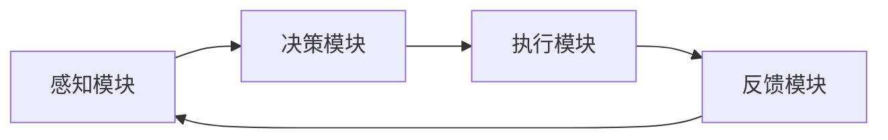
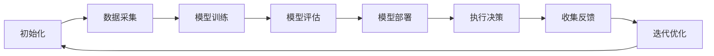
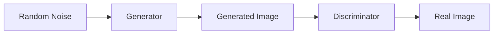
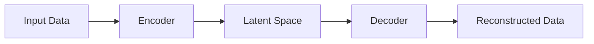
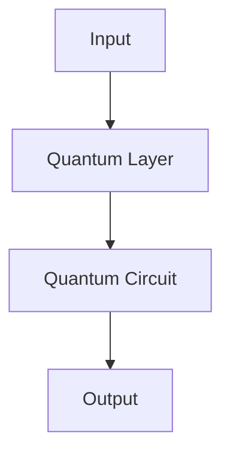

                 

# 文章标题: AI人工智能深度学习算法：智能深度学习代理的工作流可视化与用户交互设计

## 关键词

- 人工智能
- 深度学习
- 智能代理
- 工作流
- 用户交互设计

## 摘要

本文旨在探讨AI人工智能深度学习算法的基本概念、核心原理及其实际应用，重点分析了智能深度学习代理的架构和用户交互设计。通过详细阐述深度学习算法的工作流、智能深度学习代理的设计原则及工作流程，以及用户交互设计的基本原则、方法与流程，本文为AI技术的发展和应用提供了深入的见解和实际案例。

### 目录大纲

- 第一部分: AI人工智能深度学习算法基础
  - 第1章: AI人工智能深度学习算法概述
  - 第2章: 深度学习算法原理
  - 第3章: 深度学习算法在AI中的应用
- 第二部分: AI人工智能深度学习算法的工作流
  - 第4章: 深度学习算法的工作流
- 第三部分: 智能深度学习代理的架构
  - 第5章: 智能深度学习代理的架构
- 第四部分: 用户交互设计
  - 第6章: 用户交互设计
- 第五部分: AI人工智能深度学习算法的前沿研究
  - 第7章: AI人工智能深度学习算法的前沿研究
- 附录
  - 附录A: AI人工智能深度学习算法开发工具与资源
  - 附录B: 代码示例与实战

---

### 第一部分: AI人工智能深度学习算法基础

#### 第1章: AI人工智能深度学习算法概述

##### 1.1 AI人工智能深度学习算法的定义与背景

深度学习是人工智能（AI）领域中的一种机器学习技术，它通过模拟人脑的神经网络结构来处理和分析数据。深度学习算法的核心是神经网络，这些网络通过多层节点（或层）对输入数据进行处理，每一层都对数据进行一些特定的变换，从而提取更高级的特征。

深度学习算法的出现可以追溯到1980年代，但直到2000年代，随着计算能力的提升和大数据的普及，深度学习才真正迎来了爆发式的发展。如今，深度学习已经在图像识别、自然语言处理、推荐系统等领域取得了显著的成果。

##### 1.2 深度学习算法的核心概念

深度学习算法的核心概念包括：

- **神经网络（Neural Networks）**：深度学习的基础，由大量的节点（神经元）和连接（权重）组成。节点接收输入信号，通过权重加权后传递到下一层节点。
- **前向传播（Forward Propagation）**：在神经网络中，输入数据从输入层通过权重传递到输出层，每一层都会对输入进行变换。
- **反向传播（Backpropagation）**：通过计算损失函数的梯度，反向传播误差信号，用于更新网络中的权重。
- **激活函数（Activation Functions）**：用于引入非线性因素，使得神经网络能够学习复杂函数。
- **损失函数（Loss Functions）**：用于衡量预测值与实际值之间的差距，是优化过程中的目标函数。

##### 1.3 深度学习算法的分类

深度学习算法可以根据其结构和功能进行分类，主要包括以下几类：

- **全连接神经网络（Fully Connected Neural Networks, FCNN）**：是最常见的深度学习结构，所有节点之间都相互连接。
- **卷积神经网络（Convolutional Neural Networks, CNN）**：主要用于图像处理，通过卷积操作提取空间特征。
- **递归神经网络（Recurrent Neural Networks, RNN）**：适用于序列数据处理，具有时间记忆能力。
- **变换器（Transformers）**：基于自注意力机制，在自然语言处理领域取得了显著成果。
- **生成对抗网络（Generative Adversarial Networks, GAN）**：通过两个对抗网络（生成器和判别器）的博弈来生成高质量数据。
- **变分自编码器（Variational Autoencoders, VAE）**：用于生成式建模，能够生成具有真实分布的数据。

##### 1.4 深度学习算法的发展趋势

随着深度学习技术的不断进步，未来的发展趋势主要包括：

- **算法优化**：通过改进训练算法，提高训练效率和模型性能。
- **硬件加速**：利用GPU、TPU等硬件加速器，提升深度学习模型的计算能力。
- **小样本学习**：研究如何从少量样本中训练出高性能模型。
- **元学习**：研究如何通过经验快速适应新任务。
- **可解释性**：提高深度学习模型的可解释性，使其应用更加广泛。

---

### 第二部分: 深度学习算法原理

#### 第2章: 深度学习算法原理

##### 2.1 神经网络基础

神经网络是深度学习算法的核心，其基础概念如下：

###### 2.1.1 神经网络的基本结构

神经网络通常由以下几个部分组成：

- **输入层（Input Layer）**：接收外部输入数据。
- **隐藏层（Hidden Layers）**：对输入数据进行变换和处理，可以有多层。
- **输出层（Output Layer）**：产生最终输出结果。

每个层由多个节点组成，节点之间通过连接（权重）进行信息传递。

###### 2.1.2 前向传播与反向传播算法

前向传播算法如下：

1. **初始化权重**：随机初始化网络的权重。
2. **输入数据**：将输入数据传递到输入层。
3. **激活函数**：对输入数据进行非线性变换。
4. **传递到下一层**：将激活后的数据传递到下一层。
5. **计算输出**：最终输出层的节点计算输出值。

反向传播算法如下：

1. **计算损失**：计算预测值与实际值之间的差距。
2. **计算梯度**：利用链式法则计算损失函数关于每个权重的梯度。
3. **更新权重**：利用梯度下降或其他优化算法更新权重。

##### 2.2 深度学习优化算法

深度学习优化算法是用于调整网络权重以最小化损失函数的方法，主要包括以下几种：

###### 2.2.1 梯度下降法

梯度下降法是最简单的优化算法，其核心思想是沿着损失函数梯度的反方向更新权重，公式如下：

$$
w_{\text{new}} = w_{\text{current}} - \alpha \cdot \nabla_{w}J(w)
$$

其中，$w$是权重，$\alpha$是学习率，$J(w)$是损失函数。

###### 2.2.2 动量优化

动量优化是梯度下降法的改进，通过引入动量项，可以加速收敛，减少陷入局部最小值的风险，公式如下：

$$
w_{\text{new}} = w_{\text{current}} - \alpha \cdot \nabla_{w}J(w) + \beta \cdot v
$$

其中，$v$是动量项，$\beta$是动量系数。

###### 2.2.3 Adam优化器

Adam优化器是结合了动量优化和自适应学习率的优化算法，其公式如下：

$$
\begin{aligned}
m_t &= \beta_1 \cdot m_{t-1} + (1 - \beta_1) \cdot \nabla_{w}J(w) \\
v_t &= \beta_2 \cdot v_{t-1} + (1 - \beta_2) \cdot (\nabla_{w}J(w))^2 \\
w_{\text{new}} &= w_{\text{current}} - \alpha \cdot \frac{m_t}{\sqrt{v_t} + \epsilon}
\end{aligned}
$$

其中，$m_t$和$v_t$分别是梯度的一阶和二阶矩估计，$\alpha$是学习率，$\beta_1$和$\beta_2$是动量系数，$\epsilon$是常数。

##### 2.3 深度学习中的正则化方法

正则化方法用于防止模型过拟合，提高泛化能力，主要包括以下几种：

###### 2.3.1 L1正则化

L1正则化通过在损失函数中添加L1范数项来惩罚权重的绝对值，公式如下：

$$
J(w) = J_0(w) + \lambda \cdot ||w||
$$

其中，$J_0(w)$是原始损失函数，$||w||$是L1范数，$\lambda$是正则化参数。

###### 2.3.2 L2正则化

L2正则化通过在损失函数中添加L2范数项来惩罚权重的平方值，公式如下：

$$
J(w) = J_0(w) + \lambda \cdot ||w||^2
$$

其中，$J_0(w)$是原始损失函数，$||w||^2$是L2范数，$\lambda$是正则化参数。

###### 2.3.3Dropout

Dropout是一种在训练过程中随机丢弃部分神经元的方法，用于减少模型对特定权重和神经元的依赖，提高模型的鲁棒性。具体实现如下：

1. 随机选择部分神经元。
2. 在训练过程中，将选中的神经元输出置为零。
3. 在测试过程中，不进行随机丢弃，直接使用所有神经元。

##### 2.4 深度学习算法的性能评估

深度学习算法的性能评估主要通过以下指标：

###### 2.4.1 准确率

准确率（Accuracy）是评估分类模型性能的常用指标，计算公式如下：

$$
\text{Accuracy} = \frac{\text{正确预测的数量}}{\text{总预测的数量}}
$$

###### 2.4.2 召回率

召回率（Recall）是评估分类模型对正类别的识别能力，计算公式如下：

$$
\text{Recall} = \frac{\text{正确预测的正类数量}}{\text{实际正类数量}}
$$

###### 2.4.3 F1值

F1值（F1 Score）是准确率和召回率的调和平均值，计算公式如下：

$$
\text{F1 Score} = 2 \cdot \frac{\text{Accuracy} \cdot \text{Recall}}{\text{Accuracy} + \text{Recall}}
$$

---

### 第三部分: 深度学习算法在AI中的应用

#### 第3章: 深度学习算法在AI中的应用

##### 3.1 深度学习在图像识别中的应用

深度学习在图像识别领域取得了显著成果，常用的模型包括：

###### 3.1.1 卷积神经网络（CNN）

卷积神经网络（CNN）通过卷积操作和池化操作提取图像特征，具有很好的性能。其结构如下：

1. **输入层**：接收图像数据。
2. **卷积层**：通过卷积操作提取图像特征。
3. **池化层**：对卷积特征进行降采样。
4. **全连接层**：对池化特征进行分类。

伪代码如下：

```python
# 输入图像
input_image = ...

# 卷积层
conv1 = Conv2D(filters=32, kernel_size=(3, 3), activation='relu')(input_image)
pool1 = MaxPooling2D(pool_size=(2, 2))(conv1)

# ... 多个卷积层和池化层 ...

# 输出层
output = Dense(num_classes, activation='softmax')(pool1)

# 构建模型
model = Model(inputs=input_image, outputs=output)
```

###### 3.1.2 递归神经网络（RNN）

递归神经网络（RNN）适用于处理序列数据，如图像的时间序列。其结构如下：

1. **输入层**：接收图像序列。
2. **隐藏层**：对图像序列进行变换。
3. **输出层**：生成最终输出。

伪代码如下：

```python
# 输入图像序列
input_sequence = ...

# 隐藏层
hidden = LSTM(units=50, return_sequences=True)(input_sequence)

# 输出层
output = Dense(num_classes, activation='softmax')(hidden)

# 构建模型
model = Model(inputs=input_sequence, outputs=output)
```

###### 3.1.3 Transformer模型

Transformer模型通过自注意力机制处理序列数据，具有很好的性能。其结构如下：

1. **编码器**：对输入序列进行处理。
2. **解码器**：对编码器的输出进行解码。

伪代码如下：

```python
# 编码器
input_sequence = ...

# 自注意力机制
encoded_sequence = Encoder(input_sequence)

# 解码器
output_sequence = Decoder(encoded_sequence)

# 构建模型
model = Model(inputs=input_sequence, outputs=output_sequence)
```

##### 3.2 深度学习在自然语言处理中的应用

深度学习在自然语言处理（NLP）领域也取得了显著成果，常用的模型包括：

###### 3.2.1 语言模型

语言模型用于预测下一个单词或字符，基于深度学习的方法如下：

1. **输入层**：接收单词序列。
2. **嵌入层**：将单词转换为向量。
3. **隐藏层**：对嵌入向量进行变换。
4. **输出层**：生成概率分布。

伪代码如下：

```python
# 输入单词序列
input_sequence = ...

# 嵌入层
embedded_sequence = Embedding(input_sequence, output_dim=100)

# 隐藏层
hidden = LSTM(units=50, return_sequences=True)(embedded_sequence)

# 输出层
output = Dense(num_classes, activation='softmax')(hidden)

# 构建模型
model = Model(inputs=input_sequence, outputs=output)
```

###### 3.2.2 机器翻译

机器翻译是将一种语言的文本翻译成另一种语言，基于深度学习的方法如下：

1. **编码器**：对源语言文本进行处理。
2. **解码器**：对目标语言文本进行解码。

伪代码如下：

```python
# 源语言文本
source_sequence = ...

# 目标语言文本
target_sequence = ...

# 编码器
encoded_sequence = Encoder(source_sequence)

# 解码器
output_sequence = Decoder(encoded_sequence)

# 构建模型
model = Model(inputs=source_sequence, outputs=output_sequence)
```

###### 3.2.3 问答系统

问答系统用于回答用户的问题，基于深度学习的方法如下：

1. **输入层**：接收问题和文档。
2. **编码层**：将问题和文档编码为向量。
3. **匹配层**：计算问题和文档的匹配度。
4. **输出层**：生成答案。

伪代码如下：

```python
# 问题
question = ...

# 文档
document = ...

# 编码层
encoded_question = Encoder(question)
encoded_document = Encoder(document)

# 匹配层
matched_score = DotProductLoss()(encoded_question, encoded_document)

# 输出层
answer = LookupTable()(matched_score)

# 构建模型
model = Model(inputs=[question, document], outputs=answer)
```

##### 3.3 深度学习在推荐系统中的应用

深度学习在推荐系统中的应用主要包括：

###### 3.3.1 协同过滤算法

协同过滤算法通过计算用户之间的相似度来推荐项目，基于深度学习的方法如下：

1. **用户嵌入层**：将用户编码为向量。
2. **项目嵌入层**：将项目编码为向量。
3. **匹配层**：计算用户和项目的相似度。
4. **输出层**：生成推荐列表。

伪代码如下：

```python
# 用户
users = ...

# 项目
items = ...

# 用户嵌入层
user_embeddings = Embedding(users, output_dim=50)

# 项目嵌入层
item_embeddings = Embedding(items, output_dim=50)

# 匹配层
similarity = DotProductLoss()(user_embeddings, item_embeddings)

# 输出层
recommendations = LookupTable()(similarity)

# 构建模型
model = Model(inputs=[users, items], outputs=recommendations)
```

###### 3.3.2 序列模型在推荐系统中的应用

序列模型通过分析用户的交互历史来推荐项目，基于深度学习的方法如下：

1. **输入层**：接收用户交互历史。
2. **编码层**：将交互历史编码为向量。
3. **匹配层**：计算用户和项目的相似度。
4. **输出层**：生成推荐列表。

伪代码如下：

```python
# 用户交互历史
history = ...

# 编码层
encoded_history = Encoder(history)

# 匹配层
similarity = DotProductLoss()(encoded_history, item_embeddings)

# 输出层
recommendations = LookupTable()(similarity)

# 构建模型
model = Model(inputs=history, outputs=recommendations)
```

###### 3.3.3 GAN在推荐系统中的应用

生成对抗网络（GAN）通过生成虚假用户行为来改进推荐系统，基于深度学习的方法如下：

1. **生成器**：生成虚假用户行为。
2. **判别器**：区分真实和虚假用户行为。
3. **优化器**：优化生成器和判别器的权重。

伪代码如下：

```python
# 生成器
generator = Generator()

# 判别器
discriminator = Discriminator()

# 优化器
optimizer = Optimizer()

# 构建GAN模型
model = GAN(generator, discriminator, optimizer)
```

##### 3.4 深度学习在强化学习中的应用

深度学习在强化学习中的应用主要包括：

###### 3.4.1 Q学习

Q学习是一种基于值函数的强化学习算法，通过学习状态-动作值函数来选择最佳动作。其核心思想如下：

1. **初始化值函数**：随机初始化值函数。
2. **更新值函数**：根据奖励和预测的下一个状态更新值函数。

伪代码如下：

```python
# 初始化值函数
Q = ...

# 更新值函数
Q[new_state, action] = Q[current_state, action] + alpha * (reward + gamma * max(Q[new_state, :]) - Q[current_state, action])
```

###### 3.4.2 SARSA

SARSA是一种基于策略的强化学习算法，通过更新当前状态和动作的值函数来选择最佳动作。其核心思想如下：

1. **初始化值函数**：随机初始化值函数。
2. **更新值函数**：根据当前状态和动作的值函数更新下一状态和动作的值函数。

伪代码如下：

```python
# 初始化值函数
Q = ...

# 更新值函数
Q[current_state, action] = Q[current_state, action] + alpha * (reward + gamma * Q[next_state, action] - Q[current_state, action])
```

###### 3.4.3 Deep Q-Network（DQN）

DQN是一种基于深度学习的强化学习算法，通过学习状态-动作值函数来选择最佳动作。其核心思想如下：

1. **初始化值函数**：随机初始化值函数。
2. **更新值函数**：使用深度神经网络预测下一个状态的最大值。
3. **目标网络**：使用目标网络来稳定值函数的更新。

伪代码如下：

```python
# 初始化值函数
Q = ...

# 更新值函数
target_Q = ...

# 使用深度神经网络预测下一个状态的最大值
Q = Q + alpha * (reward + gamma * target_Q - Q)

# 更新目标网络
target_Q = update_target_network(target_Q, Q)
```

---

### 第四部分: AI人工智能深度学习算法的工作流

#### 第4章: AI人工智能深度学习算法的工作流

深度学习算法的工作流包括数据预处理、模型选择与训练、模型评估与优化、模型部署与维护等步骤。以下是对每个步骤的详细说明。

##### 4.1 数据预处理

数据预处理是深度学习算法中的重要步骤，其目的是将原始数据转换为适合模型训练的形式。数据预处理包括以下步骤：

###### 4.1.1 数据清洗

数据清洗是数据预处理的第一步，其目的是去除数据中的噪声和异常值。具体方法包括：

- **去除重复数据**：通过比较数据中的关键字段，去除重复的记录。
- **填充缺失值**：使用统计方法或插值方法填充缺失值。
- **处理异常值**：根据数据的特点和处理目标，决定是否去除或修正异常值。

```python
# 填充缺失值
data = data.fillna(method='ffill')

# 去除重复数据
data = data.drop_duplicates()

# 处理异常值
data = data[data['column'].between(lower_bound, upper_bound)]
```

###### 4.1.2 数据标准化

数据标准化是将不同特征缩放到相同的尺度，以便模型能够更好地学习。常用的标准化方法包括：

- **均值标准化**：将特征值减去均值后除以标准差。
- **最小-最大标准化**：将特征值缩放到[0, 1]范围内。

```python
# 均值标准化
data = (data - data.mean()) / data.std()

# 最小-最大标准化
data = (data - data.min()) / (data.max() - data.min())
```

###### 4.1.3 数据增强

数据增强是通过生成新的数据样本来增加训练数据的多样性，从而提高模型的泛化能力。常见的数据增强方法包括：

- **随机旋转**：将数据随机旋转一定角度。
- **随机裁剪**：从数据中随机裁剪一部分作为新的样本。
- **水平/垂直翻转**：将数据的左右或上下方向进行翻转。

```python
# 随机旋转
data = rotate_image(data, angle=45)

# 随机裁剪
data = crop_image(data, top=20, bottom=20, left=20, right=20)

# 水平翻转
data = flip_image(data, horizontal=True)
```

##### 4.2 模型选择与训练

模型选择与训练是深度学习算法的核心步骤，其目的是通过训练数据找到最优的模型参数。以下是模型选择与训练的详细步骤：

###### 4.2.1 模型选择

模型选择是选择合适的模型结构来处理特定任务。常用的模型选择方法包括：

- **交叉验证**：通过将数据集划分为训练集和验证集，评估不同模型的性能。
- **网格搜索**：在预定义的参数空间内搜索最佳参数组合。

```python
# 交叉验证
from sklearn.model_selection import cross_val_score

scores = cross_val_score(model, X, y, cv=5)

# 网格搜索
from sklearn.model_selection import GridSearchCV

param_grid = {'learning_rate': [0.1, 0.01, 0.001]}
grid_search = GridSearchCV(model, param_grid, cv=5)
grid_search.fit(X, y)
```

###### 4.2.2 模型训练

模型训练是通过迭代优化模型参数来最小化损失函数。常用的训练方法包括：

- **批量训练**：每次迭代使用全部数据更新模型参数。
- **随机梯度下降（SGD）**：每次迭代使用随机样本更新模型参数。
- **Adam优化器**：结合了动量项和自适应学习率的优化方法。

```python
# 批量训练
model.fit(X_train, y_train)

# 随机梯度下降
model.fit(X_train, y_train, epochs=100, batch_size=32)

# Adam优化器
model.compile(optimizer='adam', loss='categorical_crossentropy', metrics=['accuracy'])
model.fit(X_train, y_train, epochs=100, batch_size=32)
```

##### 4.3 模型评估与优化

模型评估与优化是确保模型性能满足需求的重要步骤。以下是模型评估与优化的详细步骤：

###### 4.3.1 模型评估指标

常用的模型评估指标包括：

- **准确率（Accuracy）**：正确预测的数量占总预测数量的比例。
- **召回率（Recall）**：正确预测的正类数量占总正类数量的比例。
- **精确率（Precision）**：正确预测的正类数量占总预测正类数量的比例。
- **F1值（F1 Score）**：精确率和召回率的调和平均值。

```python
from sklearn.metrics import accuracy_score, recall_score, precision_score, f1_score

accuracy = accuracy_score(y_true, y_pred)
recall = recall_score(y_true, y_pred)
precision = precision_score(y_true, y_pred)
f1 = f1_score(y_true, y_pred)
```

###### 4.3.2 模型调参

模型调参是通过调整模型参数来优化模型性能。常用的调参方法包括：

- **网格搜索**：在预定义的参数空间内搜索最佳参数组合。
- **贝叶斯优化**：基于历史数据寻找最佳参数组合。

```python
from sklearn.model_selection import GridSearchCV
from bayes_opt import BayesianOptimization

# 网格搜索
param_grid = {'learning_rate': [0.1, 0.01, 0.001]}
grid_search = GridSearchCV(model, param_grid, cv=5)
grid_search.fit(X, y)

# 贝叶斯优化
def objective(learning_rate):
    model.compile(optimizer='adam', loss='categorical_crossentropy', metrics=['accuracy'])
    model.fit(X_train, y_train, epochs=100, batch_size=32)
    return -model.evaluate(X_val, y_val)[1]

optimizer = BayesianOptimization(objective, {'learning_rate': (0.01, 0.1)})
optimizer.maximize()
```

###### 4.3.3 模型优化

模型优化是通过改进模型结构或算法来提高模型性能。常用的模型优化方法包括：

- **迁移学习**：利用预训练的模型来提高新任务的性能。
- **深度强化学习**：结合深度学习和强化学习来优化模型。

```python
# 迁移学习
from tensorflow.keras.applications import VGG16

base_model = VGG16(weights='imagenet', include_top=False, input_shape=(224, 224, 3))
base_model.trainable = False

# 深度强化学习
from tensorflow.keras.models import Model
from tensorflow.keras.layers import Dense, LSTM, Embedding, TimeDistributed, Flatten

input_seq = Input(shape=(timesteps, features))
encoded_seq = Embedding(vocab_size, embedding_dim)(input_seq)
lstm_out = LSTM(units=50, return_sequences=True)(encoded_seq)
flatten = Flatten()(lstm_out)
output = Dense(num_classes, activation='softmax')(flatten)

model = Model(inputs=input_seq, outputs=output)
model.compile(optimizer='adam', loss='categorical_crossentropy', metrics=['accuracy'])
model.fit(X_train, y_train, epochs=100, batch_size=32)
```

##### 4.4 模型部署与维护

模型部署是将训练好的模型部署到实际应用环境中，以便实时预测或决策。以下是模型部署与维护的详细步骤：

###### 4.4.1 模型部署

模型部署是将模型部署到服务器或云平台，以便进行实时预测。常用的模型部署方法包括：

- **容器化部署**：将模型和相关依赖打包成容器，以便在不同的环境中运行。
- **微服务部署**：将模型作为微服务的一部分，通过API进行调用。

```python
# 容器化部署
from docker_spiel import build_and_push

model_path = 'path/to/model.h5'
image_name = 'model_image'
build_and_push(model_path, image_name)

# 微服务部署
from flask import Flask, request, jsonify

app = Flask(__name__)

@app.route('/predict', methods=['POST'])
def predict():
    data = request.get_json()
    predictions = model.predict(data['input'])
    return jsonify(predictions.tolist())

if __name__ == '__main__':
    model.load_weights('path/to/model.h5')
    app.run(debug=True)
```

###### 4.4.2 模型监控

模型监控是确保模型稳定运行和性能满足需求的重要步骤。常用的模型监控方法包括：

- **性能监控**：监控模型在运行过程中的性能指标，如准确率、召回率等。
- **错误率监控**：监控模型在运行过程中的错误率，以便及时发现和处理问题。

```python
# 性能监控
from sklearn.metrics import accuracy_score, recall_score, precision_score, f1_score

predictions = model.predict(X_val)
accuracy = accuracy_score(y_val, predictions)
recall = recall_score(y_val, predictions)
precision = precision_score(y_val, predictions)
f1 = f1_score(y_val, predictions)

# 错误率监控
def error_rate(y_true, y_pred):
    return 1 - accuracy_score(y_true, y_pred)

error = error_rate(y_val, predictions)
```

---

### 第五部分: 智能深度学习代理的架构

#### 第5章: 智能深度学习代理的架构

智能深度学习代理（Intelligent Deep Learning Agent，IDLA）是一种能够自主学习和优化的智能体，广泛应用于复杂决策和智能控制领域。智能深度学习代理的架构设计旨在实现高效的模型训练、推理和交互。以下是对智能深度学习代理架构的详细说明。

##### 5.1 智能深度学习代理的概念与架构

###### 5.1.1 智能深度学习代理的定义

智能深度学习代理是指一种基于深度学习技术的智能体，它能够通过自主学习环境中的数据和规律，实现对复杂任务的自动化决策和优化。智能深度学习代理的核心特点包括：

- **自主学习**：智能深度学习代理能够从环境中获取数据，通过深度学习算法进行模型训练和优化。
- **决策能力**：智能深度学习代理能够在给定环境下，根据当前状态和目标，生成最优的动作序列。
- **适应性**：智能深度学习代理能够根据环境变化和任务需求，动态调整模型结构和参数。

###### 5.1.2 智能深度学习代理的架构

智能深度学习代理的架构通常包括以下几个主要组成部分：

1. **感知模块（Perception Module）**：感知模块负责接收环境中的输入信息，并将其转换为内部表示。感知模块通常基于卷积神经网络（CNN）或循环神经网络（RNN）等深度学习模型，能够提取高层次的图像、语音或文本特征。

2. **决策模块（Decision Module）**：决策模块负责根据当前状态和目标，生成最优的动作序列。决策模块通常采用基于值函数的强化学习算法，如Q-learning、SARSA和DQN等，能够通过迭代学习实现最优策略的生成。

3. **执行模块（Execution Module）**：执行模块负责将决策模块生成的动作序列转化为实际的操作。执行模块通常与外部设备或系统相连，能够实时接收和执行智能深度学习代理的决策。

4. **反馈模块（Feedback Module）**：反馈模块负责收集环境中的反馈信息，并将其传递给感知模块和决策模块，用于模型训练和优化。反馈模块通常包括奖励机制和反馈机制，能够根据执行结果调整模型参数和策略。

智能深度学习代理的总体架构如下所示：



###### 5.1.3 智能深度学习代理的功能模块

智能深度学习代理的功能模块主要包括：

- **数据预处理模块**：负责处理和清洗环境中的输入数据，确保数据的质量和一致性。
- **模型训练模块**：负责根据训练数据和策略，训练深度学习模型，并更新模型参数。
- **模型评估模块**：负责对训练好的模型进行评估，包括准确率、召回率、F1值等指标。
- **模型部署模块**：负责将训练好的模型部署到实际应用环境中，并实现实时推理和决策。

##### 5.2 智能深度学习代理的设计原则

智能深度学习代理的设计原则主要包括：

- **模块化**：智能深度学习代理应具有模块化设计，各个功能模块之间松耦合，便于扩展和维护。
- **可扩展性**：智能深度学习代理应具备良好的可扩展性，能够支持不同类型的环境和应用场景。
- **鲁棒性**：智能深度学习代理应具备较强的鲁棒性，能够应对环境中的噪声和不确定性。
- **灵活性**：智能深度学习代理应具备灵活性，能够根据任务需求和环境变化，动态调整模型结构和参数。

##### 5.3 智能深度学习代理的工作流程

智能深度学习代理的工作流程包括以下几个主要步骤：

1. **初始化**：初始化智能深度学习代理的各个模块，包括感知模块、决策模块、执行模块和反馈模块。

2. **数据采集**：通过感知模块从环境中采集数据，并进行预处理，确保数据的质量和一致性。

3. **模型训练**：使用预处理后的数据，通过模型训练模块训练深度学习模型，并更新模型参数。

4. **模型评估**：使用训练集和验证集对训练好的模型进行评估，包括准确率、召回率、F1值等指标。

5. **模型部署**：将训练好的模型部署到实际应用环境中，并实现实时推理和决策。

6. **执行决策**：根据当前状态和目标，使用决策模块生成最优的动作序列，并通过执行模块执行相应的操作。

7. **收集反馈**：收集环境中的反馈信息，并将其传递给反馈模块，用于模型训练和优化。

8. **迭代优化**：根据反馈信息，调整模型结构和参数，实现模型的迭代优化。

智能深度学习代理的工作流程如下图所示：



##### 5.4 智能深度学习代理的应用案例

智能深度学习代理在多个领域具有广泛的应用，以下是一些典型的应用案例：

1. **智能客服系统**：智能深度学习代理可以用于构建智能客服系统，实现24小时不间断的客户服务。通过感知模块接收客户的语音或文本输入，通过决策模块生成对应的回复，并通过执行模块发送给客户。

2. **智能医疗诊断系统**：智能深度学习代理可以用于辅助医生进行医疗诊断，通过对医学影像的分析，生成诊断结果。通过感知模块接收医学影像，通过决策模块分析影像特征，通过执行模块生成诊断报告。

3. **智能安防监控系统**：智能深度学习代理可以用于智能安防监控系统，通过感知模块实时监控视频流，通过决策模块识别异常行为，通过执行模块触发报警。

4. **智能交通管理系统**：智能深度学习代理可以用于智能交通管理系统，通过感知模块实时获取交通流量信息，通过决策模块优化交通信号控制，通过执行模块调整交通信号灯的时序。

5. **智能机器人控制系统**：智能深度学习代理可以用于智能机器人控制系统，通过感知模块接收环境信息，通过决策模块生成行走或抓取的动作序列，通过执行模块控制机器人执行相应的任务。

---

### 第六部分: 用户交互设计

#### 第6章: 用户交互设计

用户交互设计是确保智能系统易用性和用户体验的关键环节。通过合理的用户交互设计，可以提高系统的可用性、易用性和用户满意度。以下是对用户交互设计的基本原则、方法与流程的详细阐述。

##### 6.1 用户交互设计的基本原则

用户交互设计应遵循以下基本原则：

- **以用户为中心**：用户交互设计应始终以用户的需求和体验为中心，关注用户的实际使用场景和操作习惯。
- **简洁明了**：界面设计应简洁明了，避免过多的信息和功能，确保用户能够快速理解和操作。
- **一致性**：系统应保持一致性，包括界面风格、操作流程和反馈机制，以提高用户的熟悉度和舒适度。
- **可访问性**：系统应具备良好的可访问性，确保不同用户（包括残疾人士）都能够轻松使用。
- **反馈机制**：系统应提供及时的反馈机制，包括提示、警告和确认，帮助用户了解操作结果和系统状态。

##### 6.2 用户交互设计的方法与工具

用户交互设计的方法和工具包括：

- **用户调研**：通过访谈、问卷调查和用户观察等方法，了解用户的需求、行为和痛点。
- **原型设计**：使用低保真或高保真的原型工具，如Axure、Figma等，设计用户界面和交互流程。
- **用户测试**：通过用户测试，收集用户对界面的反馈，验证设计的可行性和有效性。
- **可用性评估**：使用可用性评估工具，如Cognitive Walkthrough、Think-Aloud等，评估界面的易用性。

##### 6.3 用户交互设计的流程

用户交互设计的流程通常包括以下几个步骤：

1. **需求分析**：与 stakeholders（如产品经理、开发团队等）进行沟通，了解用户需求和业务目标。
2. **设计构思**：基于需求分析，进行初步的界面设计和交互流程构思。
3. **原型设计**：使用原型工具，设计低保真或高保真的界面原型，并进行初步的用户测试。
4. **用户测试**：邀请目标用户进行测试，收集反馈和改进建议。
5. **迭代优化**：根据用户测试结果，对原型进行修改和优化，反复迭代，直至满足用户需求。
6. **设计实现**：将最终设计转化为代码，与开发团队紧密合作，确保界面和交互效果符合设计预期。
7. **设计评估**：对最终实现的界面进行可用性评估，确保用户体验符合预期。

##### 6.4 用户交互设计的案例分析

以下是一个用户交互设计的案例分析：

1. **需求分析**：
   - 用户需求：用户需要能够快速、方便地创建和管理个人任务列表。
   - 业务目标：提高用户的生产效率，提升产品市场竞争力。

2. **设计构思**：
   - 界面设计：采用简洁的界面风格，主要分为任务列表、任务详情、新增任务三个部分。
   - 交互流程：用户可以通过任务列表查看已有的任务，点击任务进入详情页，可以对任务进行编辑、删除等操作；点击新增任务按钮，可以进入新增任务页面。

3. **原型设计**：
   - 使用Axure创建低保真原型，包括任务列表、任务详情和新增任务页面，并进行初步的用户测试。

4. **用户测试**：
   - 邀请5名目标用户进行测试，收集反馈和建议。

5. **迭代优化**：
   - 根据用户反馈，优化界面布局和交互流程，如调整任务列表的排序方式，增加任务筛选功能。

6. **设计实现**：
   - 将最终设计转化为HTML/CSS/JavaScript代码，与开发团队紧密合作，确保界面和交互效果符合设计预期。

7. **设计评估**：
   - 进行可用性评估，包括Cognitive Walkthrough和Think-Aloud，评估界面和交互流程的易用性和有效性。

---

### 第七部分: AI人工智能深度学习算法的前沿研究

#### 第7章: AI人工智能深度学习算法的前沿研究

深度学习作为人工智能的核心技术之一，在近年来取得了显著的发展。本章将探讨深度学习算法的前沿研究，包括生成对抗网络（GAN）、变分自编码器（VAE）、自监督学习和量子深度学习等。

##### 7.1 生成对抗网络（GAN）

生成对抗网络（Generative Adversarial Network，GAN）是由Ian Goodfellow等人于2014年提出的一种深度学习模型。GAN由两个神经网络——生成器和判别器组成，生成器试图生成与真实数据相似的数据，而判别器则试图区分生成数据和真实数据。生成器和判别器之间进行博弈，最终生成器能够生成高质量的数据。

###### 7.1.1 GAN的基本概念

GAN的基本概念如下：

- **生成器（Generator）**：生成器接收随机噪声作为输入，通过神经网络生成虚假数据。
- **判别器（Discriminator）**：判别器接收真实数据和生成数据，通过神经网络判断数据的真实性。
- **对抗训练（Adversarial Training）**：生成器和判别器通过对抗训练相互优化，生成器试图欺骗判别器，而判别器试图准确区分真实和生成数据。

GAN的训练过程如下：

1. **初始化生成器和判别器**：随机初始化生成器和判别器的参数。
2. **生成器生成数据**：生成器根据随机噪声生成虚假数据。
3. **判别器判断数据**：判别器同时接收真实数据和生成数据，通过神经网络判断数据的真实性。
4. **生成器优化**：生成器根据判别器的输出，通过梯度下降优化生成器参数，提高生成数据的质量。
5. **判别器优化**：判别器根据生成器和真实数据的输出，通过梯度下降优化判别器参数，提高判别能力。

GAN的应用领域广泛，包括图像生成、图像修复、图像超分辨率等。例如，GAN可以生成逼真的图像，如图像到图像的转换、人脸生成等。以下是一个简单的GAN模型结构：



##### 7.2 变分自编码器（VAE）

变分自编码器（Variational Autoencoder，VAE）是另一种基于深度学习的前沿模型，用于生成具有真实分布的数据。VAE在自编码器的基础上引入了概率模型，通过编码器和解码器学习数据的高斯分布。

###### 7.2.1 VAE的基本概念

VAE的基本概念如下：

- **编码器（Encoder）**：编码器将输入数据映射到一个潜在空间的高斯分布参数上。
- **解码器（Decoder）**：解码器从潜在空间中采样数据，并重构输入数据。
- **潜在空间（Latent Space）**：潜在空间是一个低维的概率空间，用于表示输入数据的隐含特征。

VAE的训练过程如下：

1. **初始化编码器和解码器**：随机初始化编码器和解码器的参数。
2. **编码器编码**：编码器将输入数据编码为潜在空间的高斯分布参数。
3. **解码器解码**：解码器从潜在空间中采样数据，并重构输入数据。
4. **损失函数**：计算编码器和解码器的损失函数，包括重建损失和对数似然损失。
5. **梯度下降**：通过梯度下降优化编码器和解码器的参数，最小化损失函数。

VAE的应用领域包括数据生成、图像修复、图像超分辨率等。以下是一个简单的VAE模型结构：



##### 7.3 自监督学习

自监督学习是一种无需标签数据的机器学习技术，通过利用数据内在的结构和规律，实现数据的自我监督。自监督学习在深度学习领域具有广泛的应用，如图像识别、文本分类、语音识别等。

###### 7.3.1 自监督学习的基本概念

自监督学习的基本概念如下：

- **无监督学习**：无监督学习是指从未标记的数据中学习数据的分布和特征。
- **自监督学习**：自监督学习是指利用数据之间的内在关联性，为数据生成标签，然后进行监督学习。

自监督学习的方法主要包括：

- **预训练**：通过预训练模型，学习数据的分布和特征，然后进行微调。
- **无监督预训练**：通过无监督学习技术，如自编码器、对抗网络等，预训练模型。
- **数据增强**：通过数据增强技术，如数据生成、数据变换等，增加数据的多样性。

自监督学习在图像识别中的应用，如ImageNet Challenge，通过自监督学习技术，提高了图像分类的准确率。

###### 7.3.2 自监督学习的训练方法

自监督学习的训练方法包括：

1. **对比学习**：通过对比学习技术，将相似的数据放在一起，将不相似的数据分开。
2. **自编码器**：通过自编码器模型，将输入数据编码为一个低维特征向量，然后重构输入数据。
3. **对抗网络**：通过对抗网络，生成与输入数据相似的数据，然后进行对比学习。

以下是一个简单的自编码器模型结构：


##### 7.4 量子深度学习

量子深度学习是结合量子计算和深度学习的交叉领域，通过利用量子计算机的优势，实现深度学习模型的优化和加速。

###### 7.4.1 量子计算的基本概念

量子计算是一种利用量子力学原理进行信息处理的计算模型。量子计算机通过量子位（qubit）存储和操作信息，具有与传统计算机不同的计算能力。

量子计算的基本概念如下：

- **量子位（Qubit）**：量子位是量子计算机的基本信息单位，具有叠加和纠缠等特性。
- **量子门（Quantum Gate）**：量子门是量子计算机的基本操作单元，用于对量子位进行变换。
- **量子电路（Quantum Circuit）**：量子电路是由量子门组成的网络，用于实现量子计算。

量子计算的优势包括：

- **并行计算**：量子计算机能够同时处理多个计算任务，提高计算效率。
- **指数加速**：某些计算问题，如量子模拟和量子搜索，量子计算机能够实现指数加速。

###### 7.4.2 量子深度学习的基本原理

量子深度学习是利用量子计算机的优势，优化和加速深度学习模型的训练和推理。量子深度学习的基本原理如下：

- **量子神经网络（Quantum Neural Network，QNN）**：量子神经网络是一种结合量子计算和神经网络的模型，通过量子门和量子位的相互作用，实现神经网络的功能。
- **量子优化算法**：量子优化算法是利用量子计算机的优势，优化深度学习模型的参数和结构。
- **量子推理**：量子推理是利用量子计算机的优势，加速深度学习模型的推理过程。

量子深度学习在图像识别、自然语言处理和强化学习等领域具有广泛的应用前景。

以下是一个简单的量子神经网络结构：



### 附录

#### 附录A: AI人工智能深度学习算法开发工具与资源

附录A提供了AI人工智能深度学习算法开发的相关工具和资源，包括：

- **开发工具**：包括TensorFlow、PyTorch、Keras等深度学习框架。
- **数据集**：如ImageNet、CIFAR-10、MNIST等公开数据集。
- **在线教程和课程**：如Coursera、Udacity、edX等平台上的深度学习课程。
- **开源库和框架**：如Scikit-learn、NumPy、Pandas等。

#### 附录B: 代码示例与实战

附录B提供了深度学习算法的代码示例和实战案例，包括：

- **数据预处理**：数据清洗、数据增强和归一化的示例代码。
- **模型训练**：使用TensorFlow和PyTorch训练模型的示例代码。
- **模型评估**：评估模型性能的示例代码，包括准确率、召回率和F1值等指标。
- **模型部署**：将训练好的模型部署到生产环境的示例代码。

---

## 作者

作者：AI天才研究院/AI Genius Institute & 禅与计算机程序设计艺术 /Zen And The Art of Computer Programming

---

以上是对《AI人工智能深度学习算法：智能深度学习代理的工作流可视化与用户交互设计》的详细概述。本文旨在全面、系统地介绍深度学习算法的基础知识、工作流程、智能深度学习代理的架构和用户交互设计，同时探讨了深度学习算法的前沿研究。希望本文能为读者提供深入的理解和实用的指导。

