                 

# AI人工智能深度学习算法：未来应用的可能性

> 关键词：人工智能、深度学习、算法、应用、未来

> 摘要：本文从深度学习的基础概念出发，逐步深入探讨其在不同领域的应用可能性。通过梳理深度学习的发展历程、基本原理和主要算法，本文进一步探讨了深度学习在计算机视觉、自然语言处理、推荐系统和游戏AI等领域的应用现状和挑战，并提出了未来发展的方向和可持续发展策略。

## 目录大纲

1. 引言
2. AI与深度学习基础
3. 深度学习算法基础
4. 常见的深度学习框架
5. 深度学习在计算机视觉中的应用
6. 深度学习在自然语言处理中的应用
7. 深度学习在推荐系统中的应用
8. 深度学习在游戏AI中的应用
9. 深度学习在医疗领域中的应用
10. 未来展望

## 引言

人工智能（AI）作为计算机科学的一个重要分支，近年来在科技领域的迅猛发展，已深刻改变了我们的生活方式和社会结构。AI的核心目标是使计算机能够模拟人类的智能行为，包括学习、推理、感知和决策等。而深度学习作为AI的一个重要分支，凭借其强大的建模和数据处理能力，正逐渐成为实现AI目标的关键技术。

深度学习（Deep Learning）是指通过构建具有多个隐含层的神经网络模型，对大规模数据集进行训练，从而实现高效特征学习和复杂任务处理的机器学习技术。自2006年AlexNet在图像分类任务中取得突破性成果以来，深度学习在各个领域都取得了显著的进展。本文将详细探讨深度学习的基本原理、主要算法及其在不同领域的应用潜力。

本文首先介绍了AI和深度学习的基础知识，包括发展历程、基本原理和主要类型。接着，本文深入分析了深度学习算法的基础，包括神经网络结构、优化算法、正则化方法和数据预处理技术。在此基础上，本文详细探讨了深度学习在计算机视觉、自然语言处理、推荐系统和游戏AI等领域的应用现状和挑战。

最后，本文展望了深度学习在AI领域的未来发展趋势和面临的挑战，并提出了可持续发展的策略。通过本文的探讨，希望能够为读者提供一幅关于深度学习未来应用的可能图景，激发更多探索和创新。

### AI与深度学习基础

#### 1.1 AI的发展历史与深度学习的兴起

人工智能（AI）作为计算机科学的一个重要分支，其发展历程可以追溯到20世纪50年代。当时，科学家们首次提出了“人工智能”的概念，目标是使计算机能够模拟人类智能行为。早期的AI研究主要集中在规则推理和知识表示方面，通过定义明确的规则和逻辑关系来模拟人类思维过程。然而，由于依赖人工编写的规则，这种方式在复杂任务上的表现受到很大限制。

随着计算机性能的提升和数据规模的扩大，机器学习（Machine Learning）逐渐成为AI研究的重要方向。机器学习通过训练算法从数据中自动学习规律和模式，提高了计算机的智能水平。1997年，IBM的超级计算机“深蓝”（Deep Blue）在国际象棋比赛中击败了世界冠军加里·卡斯帕罗夫，标志着AI在特定领域取得了突破性进展。

深度学习（Deep Learning）作为机器学习的一个子领域，其核心思想是通过构建具有多个隐含层的神经网络，对大量数据进行训练，从而实现复杂任务的学习和处理。2006年，加拿大多伦多大学教授杰弗里·辛顿（Geoffrey Hinton）团队提出的AlexNet在图像分类任务中取得了巨大的成功，将深度学习推向了新的高度。AlexNet通过使用卷积神经网络（Convolutional Neural Network, CNN）对图像进行特征提取和分类，验证了深度学习在计算机视觉领域的潜力。

深度学习的兴起不仅得益于计算机硬件性能的显著提升，还依赖于大数据和并行计算的普及。随着互联网的快速发展，数据规模不断扩大，为深度学习提供了丰富的训练素材。同时，GPU（Graphics Processing Unit）和TPU（Tensor Processing Unit）等专用硬件的引入，使得深度学习模型可以在大规模数据集上高效训练。

#### 1.2 深度学习的基本原理

深度学习的基本原理基于神经网络（Neural Network），通过模仿生物神经系统的工作方式来实现数据建模和任务处理。神经网络由大量的神经元（或节点）组成，每个神经元与其他神经元通过连接（或权重）相连。神经元的激活状态通过这些连接传递，从而实现信息处理和决策。

深度学习的关键在于构建具有多个隐含层的神经网络模型，这些隐含层能够对输入数据进行逐层提取和转换，形成高层次的抽象特征。这种层次化的特征提取方式使得深度学习模型能够处理复杂的任务，如图像识别、自然语言处理和语音识别等。

深度学习的基本组成部分包括：

1. **神经元**：神经网络的基本单元，通过输入和权重计算得到输出。神经元的输出通常通过激活函数（如ReLU、Sigmoid、Tanh等）进行非线性变换。

2. **层**：神经网络由多个层次组成，包括输入层、隐含层和输出层。每一层对数据进行不同的变换和处理，从而实现特征提取和任务分类。

3. **权重**：连接不同神经元之间的参数，用于调节信号传递的强度。通过反向传播算法（Backpropagation），深度学习模型可以自动调整权重，以优化模型的性能。

4. **激活函数**：对神经元的输出进行非线性变换，使神经网络具备非线性特征学习能力。

5. **优化算法**：用于调整模型权重，以最小化预测误差。常见的优化算法包括梯度下降（Gradient Descent）、动量优化（Momentum）和Adam优化器等。

深度学习的工作过程可以分为以下步骤：

1. **前向传播**：将输入数据通过神经网络的前向传播过程，逐层计算得到输出。

2. **损失函数**：计算模型的输出与真实标签之间的差异，即损失函数（如均方误差、交叉熵等）。

3. **反向传播**：通过反向传播算法，计算损失函数关于模型参数的梯度，并更新模型权重。

4. **迭代训练**：重复以上过程，逐步优化模型性能。

通过多个迭代周期的训练，深度学习模型可以逐渐学习到输入数据的内在结构和规律，从而实现复杂的任务处理。

#### 1.3 深度学习的主要类型

深度学习有多种不同的类型，每种类型都有其特定的结构和应用场景。以下是几种常见的深度学习类型：

1. **卷积神经网络（Convolutional Neural Network, CNN）**：
   - **结构特点**：CNN由卷积层、池化层和全连接层组成。卷积层通过卷积操作提取图像的局部特征，池化层用于减少特征图的维度和参数数量，全连接层用于进行最终的分类或回归。
   - **应用领域**：图像识别、目标检测、图像生成等。

2. **循环神经网络（Recurrent Neural Network, RNN）**：
   - **结构特点**：RNN具有时间记忆能力，通过将当前输入与前一时刻的状态进行结合，实现序列数据的建模。
   - **应用领域**：自然语言处理、语音识别、时间序列预测等。

3. **长短时记忆网络（Long Short-Term Memory, LSTM）**：
   - **结构特点**：LSTM是RNN的一种变种，通过引入门控机制，有效解决了RNN的梯度消失和梯度爆炸问题。
   - **应用领域**：文本生成、语音识别、时间序列分析等。

4. **生成对抗网络（Generative Adversarial Network, GAN）**：
   - **结构特点**：GAN由生成器和判别器两个对抗性模型组成，生成器生成数据，判别器判断数据是真实还是生成的。通过生成器和判别器的对抗性训练，生成器逐渐提高生成数据的质量。
   - **应用领域**：图像生成、文本生成、风格迁移等。

5. **变分自编码器（Variational Autoencoder, VAE）**：
   - **结构特点**：VAE通过引入概率模型，对数据进行编码和解码，能够有效捕获数据的分布信息。
   - **应用领域**：数据去噪、图像超分辨率、生成模型等。

6. **Transformer**：
   - **结构特点**：Transformer基于自注意力机制（Self-Attention），通过多头注意力机制实现序列数据的建模。
   - **应用领域**：自然语言处理、推荐系统、图像生成等。

这些深度学习类型各有特点，适用于不同的应用场景。随着深度学习技术的不断发展和优化，未来可能会有更多新型结构出现，进一步推动AI领域的发展。

#### 1.4 深度学习在AI中的应用前景

深度学习在人工智能领域的应用前景广阔，已经在多个领域取得了显著的成果。以下将介绍深度学习在计算机视觉、自然语言处理、推荐系统、游戏AI和医疗等领域的应用现状和潜力。

1. **计算机视觉**：
   - **应用现状**：深度学习在计算机视觉领域已经取得了显著的成果，如图像分类、目标检测、人脸识别和图像生成等。在ImageNet图像分类挑战赛中，深度学习模型已经达到了人类专家的水平。
   - **应用潜力**：未来，深度学习将继续在计算机视觉领域发挥重要作用，特别是在自动驾驶、智能监控、医学图像分析和工业自动化等领域。通过深度学习技术，可以实现更准确、更高效的图像识别和目标检测，进一步提升计算机视觉系统的实用性和安全性。

2. **自然语言处理**：
   - **应用现状**：深度学习在自然语言处理领域取得了突破性进展，如文本分类、机器翻译、情感分析和文本生成等。基于深度学习的技术使得机器在理解和生成自然语言方面更加智能。
   - **应用潜力**：未来，深度学习将进一步推动自然语言处理技术的发展，特别是在跨语言文本理解、对话系统和智能客服等领域。通过深度学习，可以实现更准确、更自然的语言理解和生成，为人类提供更好的语言交互体验。

3. **推荐系统**：
   - **应用现状**：深度学习在推荐系统中的应用越来越广泛，通过深度学习模型，可以更好地捕捉用户的兴趣和行为模式，实现更精准的推荐。
   - **应用潜力**：未来，深度学习将继续优化推荐系统的性能，特别是在个性化推荐和协同过滤推荐方面。通过深度学习，可以实现更高效、更个性化的推荐，提高用户的满意度和参与度。

4. **游戏AI**：
   - **应用现状**：深度学习在游戏AI领域已经取得了一些成功案例，如电子竞技游戏中的玩家策略优化、游戏角色动作控制等。
   - **应用潜力**：未来，深度学习将在游戏AI领域发挥更大作用，特别是在开发智能游戏角色、实现实时游戏策略和动作控制等方面。通过深度学习，可以创造更加智能、互动性更强的游戏体验。

5. **医疗领域**：
   - **应用现状**：深度学习在医疗领域已经应用于医学图像分析、疾病预测和诊断、药物设计等。通过深度学习技术，可以实现更快速、更准确的疾病诊断和治疗方案推荐。
   - **应用潜力**：未来，深度学习将继续在医疗领域发挥重要作用，特别是在个性化医疗、精准医疗和智能药物研发等方面。通过深度学习，可以实现更高效、更精准的医疗诊断和治疗，提高医疗水平和患者生活质量。

总之，深度学习在人工智能领域的应用前景广阔，随着技术的不断进步和应用场景的拓展，深度学习将在更多领域发挥重要作用，为人类社会带来更多创新和变革。

### 深度学习算法基础

深度学习算法是构建深度学习模型的核心，其性能直接影响到模型的训练效果和应用效果。在深度学习中，算法的选择和优化至关重要。本节将介绍深度学习算法的基础，包括神经网络的基本结构、优化算法、正则化方法和数据预处理技术。

#### 2.1 神经网络的基本结构

神经网络（Neural Network, NN）是深度学习的基础，其结构主要由神经元、层和连接组成。以下将介绍神经网络的基本组成部分和层次结构。

1. **神经元**：神经元是神经网络的基本单元，类似于生物神经元，通过输入和权重计算得到输出。每个神经元的输出会传递到下一层的神经元。神经元的输出通常通过激活函数进行非线性变换。

2. **层**：神经网络分为输入层、隐含层和输出层。输入层接收外部输入数据，隐含层对输入数据进行处理和转换，输出层产生最终的预测结果或分类标签。

3. **连接**：神经元之间的连接通过权重（weights）表示，用于调节信号传递的强度。权重值通过训练过程自动调整，以优化模型的性能。

4. **激活函数**：激活函数对神经元的输出进行非线性变换，常用的激活函数包括ReLU（Rectified Linear Unit）、Sigmoid和Tanh等。

5. **层次结构**：深度学习模型通常包含多个隐含层，这些隐含层对输入数据进行逐层提取和转换，形成高层次的抽象特征。层次化的特征提取方式使得深度学习模型能够处理复杂的任务。

神经网络的基本结构如图所示：

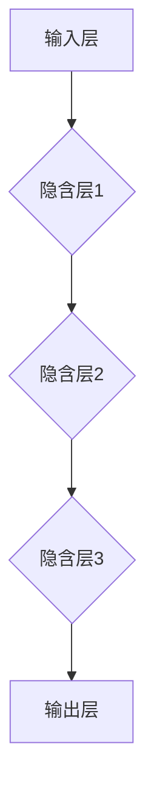

#### 2.2 深度学习的主要优化算法

优化算法是深度学习训练过程中调整模型参数的关键技术。以下将介绍几种常用的优化算法，包括梯度下降（Gradient Descent）、动量优化（Momentum）和Adam优化器。

1. **梯度下降算法（Gradient Descent）**：
   - **基本原理**：梯度下降算法通过计算损失函数关于模型参数的梯度，并沿着梯度方向更新模型参数，以最小化损失函数。
   - **伪代码**：
     ```python
     w_new = w_old - alpha * gradient(J(w))
     ```
   - **缺点**：梯度下降算法容易陷入局部最小值，且在训练过程中可能需要较长时间。

2. **动量优化（Momentum）**：
   - **基本原理**：动量优化算法在梯度下降的基础上引入了动量项，可以缓解梯度消失和梯度爆炸问题，提高收敛速度。
   - **伪代码**：
     ```python
     v_new = beta * v_old + (1 - beta) * gradient(J(w))
     w_new = w_old + v_new
     ```
   - **参数**：动量参数（通常取值在0.9到0.99之间）用于调节上一轮更新的权重。

3. **Adam优化器**：
   - **基本原理**：Adam优化器结合了梯度下降和动量优化，同时考虑了梯度的一阶矩估计和二阶矩估计，具有较好的收敛性能。
   - **伪代码**：
     ```python
     m_t = beta1 * m_{t-1} + (1 - beta1) * gradient(J(w))
     v_t = beta2 * v_{t-1} + (1 - beta2) * (gradient(J(w)))^2
     w_new = w_old - (alpha / (sqrt(1 - beta2^t) * (1 - beta1^t))) * (m_t / (1 - beta1^t))
     ```
   - **参数**：学习率（alpha）、一阶动量（beta1）和二阶动量（beta2）分别用于调节更新速度和稳定性。

#### 2.3 深度学习中的正则化方法

正则化方法是为了防止深度学习模型过拟合而引入的一些技术。以下将介绍几种常见的正则化方法，包括L1正则化、L2正则化和Dropout。

1. **L1正则化**：
   - **基本原理**：L1正则化通过在损失函数中添加L1范数项，对模型参数进行惩罚，促进稀疏解的生成。
   - **公式**：
     ```math
     J(w) = J_0(w) + lambda ||w||_1
     ```
   - **应用**：L1正则化适用于特征选择，能够识别出对目标变量贡献较小的特征。

2. **L2正则化**：
   - **基本原理**：L2正则化通过在损失函数中添加L2范数项，对模型参数进行惩罚，防止模型参数过大。
   - **公式**：
     ```math
     J(w) = J_0(w) + lambda ||w||_2^2
     ```
   - **应用**：L2正则化适用于防止过拟合，减少模型参数的方差。

3. **Dropout**：
   - **基本原理**：Dropout通过在训练过程中随机丢弃部分神经元，降低模型的复杂度和过拟合风险。
   - **实现**：在训练过程中，以一定的概率（通常为0.5）丢弃神经元及其连接。
   - **应用**：Dropout适用于防止模型过拟合，提高模型的泛化能力。

#### 2.4 深度学习中的数据预处理技术

数据预处理是深度学习训练过程中至关重要的一步，其目的是提高模型的训练效率和性能。以下将介绍几种常见的数据预处理技术，包括归一化、标准化和批量归一化。

1. **归一化**：
   - **基本原理**：归一化通过将数据缩放到相同的范围，消除不同特征之间的量纲差异。
   - **公式**：
     ```math
     x_{\text{norm}} = \frac{x - \mu}{\sigma}
     ```
   - **应用**：归一化适用于缓解梯度消失和梯度爆炸问题，提高模型的训练速度。

2. **标准化**：
   - **基本原理**：标准化通过将数据转换为标准正态分布，提高模型的泛化能力。
   - **公式**：
     ```math
     z = \frac{x - \mu}{\sigma}
     ```
   - **应用**：标准化适用于提高模型的泛化性能，减少模型对异常值的敏感度。

3. **批量归一化**：
   - **基本原理**：批量归一化（Batch Normalization）通过在训练过程中对每一批数据的小批量进行归一化处理，提高模型的训练速度和稳定性。
   - **公式**：
     ```math
     x_{\text{norm}} = \frac{x - \mu}{\sigma} \odot \gamma + \beta
     ```
   - **应用**：批量归一化适用于提高模型的训练效率和稳定性，减少梯度消失和梯度爆炸问题。

通过以上数据预处理技术，可以有效地提高深度学习模型的训练性能和泛化能力，为深度学习的应用奠定坚实基础。

### 常见的深度学习框架

深度学习框架是为了简化深度学习模型的开发、训练和部署而设计的软件库。以下将介绍几种常见的深度学习框架，包括TensorFlow、PyTorch、Keras和其他深度学习框架。

#### 3.1 TensorFlow

TensorFlow是由Google开发的开源深度学习框架，具有强大的功能和高灵活性。TensorFlow的核心优势包括：

1. **灵活的动态图计算**：TensorFlow使用动态计算图，允许在运行时定义和修改计算过程，提高了模型的开发效率。
2. **丰富的预构建模型**：TensorFlow提供了大量的预构建模型，包括图像分类、文本分类、语音识别等，方便开发者快速应用。
3. **多平台支持**：TensorFlow支持多种硬件平台，包括CPU、GPU和TPU，使得模型可以在不同设备上高效运行。
4. **社区支持**：TensorFlow拥有庞大的社区支持，提供了丰富的文档、教程和开源项目，帮助开发者解决问题和加速项目开发。

#### 3.2 PyTorch

PyTorch是Facebook开发的开源深度学习框架，以其动态计算图和简洁的API而受到开发者的喜爱。PyTorch的核心优势包括：

1. **动态计算图**：PyTorch使用动态计算图，使得模型定义更加直观和灵活，方便开发者进行实验和调试。
2. **简洁的API**：PyTorch的API设计简洁易用，使得开发者可以更快速地构建和训练深度学习模型。
3. **强大的自动微分系统**：PyTorch的自动微分系统能够自动计算梯度，方便开发者进行模型训练和优化。
4. **丰富的社区资源**：PyTorch拥有庞大的社区支持，提供了丰富的教程、文档和开源项目，帮助开发者学习和应用PyTorch。

#### 3.3 Keras

Keras是另一种流行的开源深度学习框架，以其简洁和易用性而受到开发者喜爱。Keras的核心优势包括：

1. **高层次的API**：Keras提供了高层次的API，使得开发者可以更快速地构建和训练深度学习模型，无需深入了解底层实现。
2. **兼容TensorFlow和Theano**：Keras可以与TensorFlow和Theano兼容，使得开发者可以在不同后端之间切换，提高模型的灵活性。
3. **广泛的预构建模型**：Keras提供了大量的预构建模型，包括卷积神经网络、循环神经网络和生成对抗网络等，方便开发者快速应用。
4. **易用的迁移学习**：Keras提供了便捷的迁移学习接口，使得开发者可以轻松利用预训练模型进行新的任务。

#### 3.4 其他深度学习框架

除了TensorFlow、PyTorch和Keras，还有其他一些流行的深度学习框架，如Theano、MXNet和Caffe等。以下是一些其他深度学习框架的特点：

1. **Theano**：Theano是一个基于Python的开源深度学习框架，其核心优势在于对GPU加速的支持和符号计算的能力。
2. **MXNet**：MXNet是Apache Foundation的一个开源深度学习框架，其核心优势在于灵活的模型定义和高效的执行性能。
3. **Caffe**：Caffe是一个快速高效的深度学习框架，特别适用于卷积神经网络，其核心优势在于高效的卷积操作和简单的模型定义。

这些深度学习框架各有特点，适用于不同的应用场景和开发者需求。开发者可以根据项目需求和自身技术背景选择合适的深度学习框架，以提高开发效率和模型性能。

### 深度学习在计算机视觉中的应用

深度学习在计算机视觉领域的应用已经取得了显著的成果，从图像分类、目标检测到图像生成，深度学习技术正在不断突破传统算法的极限。以下将详细探讨深度学习在计算机视觉中的应用现状、主要技术及其在实际案例中的表现。

#### 4.1 卷积神经网络在图像识别中的应用

卷积神经网络（Convolutional Neural Network，CNN）是深度学习在计算机视觉领域最为重要的技术之一。CNN通过卷积层、池化层和全连接层等结构，能够自动提取图像的特征并进行分类。

1. **卷积层**：卷积层是CNN的核心部分，通过卷积操作从输入图像中提取局部特征。卷积核（Convolutional Kernel）在图像上滑动，计算局部特征的加权和。卷积层能够有效地减少参数数量，提高模型的可训练性。

2. **池化层**：池化层用于减小特征图的维度，降低计算复杂度。常用的池化操作包括最大池化和平均池化。最大池化选择每个局部区域中的最大值，而平均池化计算每个局部区域的平均值。

3. **全连接层**：全连接层将卷积层和池化层提取的高层次特征进行分类。全连接层通过计算特征向量与权重矩阵的乘积，并加上偏置项，再通过激活函数得到分类结果。

以下是一个简单的CNN模型结构：

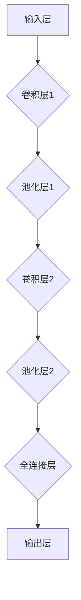

CNN在图像识别任务中表现出色。以著名的ImageNet图像分类挑战为例，深度学习模型在2012年首次参赛时就超越了人类专家的表现。随后，随着CNN模型的不断优化和改进，图像识别的准确率不断提高。

**实际案例**：Google的Inception模型和Facebook的ResNet模型是CNN在图像识别领域的两个重要突破。Inception模型通过使用不同尺寸的卷积核和多分支结构，提高了特征提取的灵活性。ResNet模型通过引入残差连接，解决了深度神经网络中的梯度消失问题，使得深层网络训练成为可能。

#### 4.2 深度学习在图像生成中的应用

图像生成是深度学习在计算机视觉中的另一个重要应用领域。生成对抗网络（Generative Adversarial Network，GAN）是图像生成领域的主要技术，其通过生成器和判别器的对抗性训练，能够生成高质量、逼真的图像。

1. **生成器**：生成器是GAN中的核心部分，其目标是从随机噪声生成逼真的图像。生成器通常由多个卷积层和反卷积层组成，通过逐层上采样和卷积操作，将噪声映射为图像。

2. **判别器**：判别器是GAN中的另一个关键部分，其目标是区分真实图像和生成图像。判别器通常由卷积层组成，通过逐层卷积操作，提取图像的特征。

3. **对抗性训练**：生成器和判别器通过对抗性训练相互竞争。在训练过程中，生成器不断尝试生成更逼真的图像，而判别器则努力区分真实图像和生成图像。通过这种对抗性训练，生成器逐渐提高生成图像的质量。

以下是一个简单的GAN模型结构：

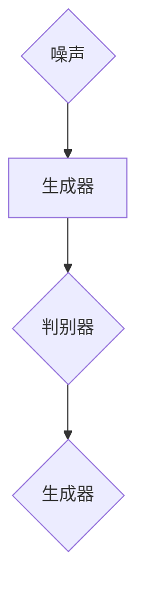

GAN在图像生成任务中取得了显著成果。例如，DeepMind的WaveNet模型通过GAN技术，实现了高质量的自然语言生成。另一个著名案例是OpenAI的DALL-E模型，它能够根据用户输入的文本生成相应的图像，展示了GAN在图像生成领域的巨大潜力。

**实际案例**：谷歌的Artistic Style模型通过GAN技术实现了图像风格迁移，可以将一幅普通图像转化为具有艺术风格的作品。另一个著名案例是斯坦福大学的StyleGAN模型，它能够生成高度逼真的高清图像，几乎难以区分真假。

#### 4.3 深度学习在目标检测中的应用

目标检测是计算机视觉中的一项重要任务，其目标是在图像中识别并定位多个目标对象。深度学习在目标检测领域取得了显著的突破，主要得益于卷积神经网络和区域提议网络（Region Proposal Network，RPN）的引入。

1. **卷积神经网络**：卷积神经网络通过卷积层和池化层，能够提取图像的特征，并在全连接层中进行分类和定位。

2. **区域提议网络**：区域提议网络用于生成目标候选区域，从而提高目标检测的效率。RPN通过卷积层提取图像特征，并生成多个候选区域。

3. **检测框架**：常用的目标检测框架包括Faster R-CNN、SSD和YOLO等。这些框架通过结合卷积神经网络和区域提议网络，实现了高效的目标检测。

以下是一个简单的目标检测框架结构：

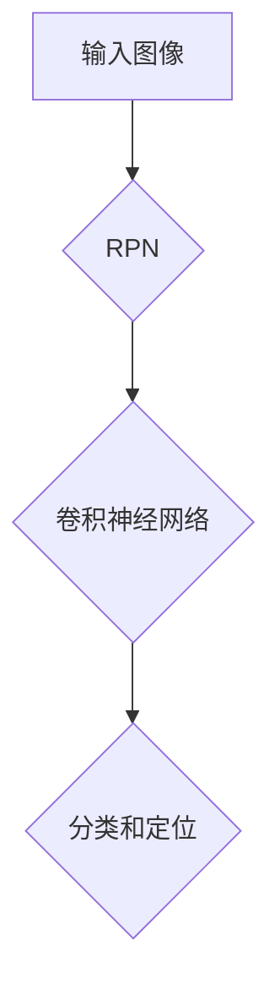

目标检测在许多实际应用中发挥了重要作用，如自动驾驶、智能监控和机器人导航等。以下是一些目标检测的实际案例：

1. **自动驾驶**：自动驾驶系统需要识别并跟踪道路上的车辆、行人、交通标志等目标，以确保行车安全。深度学习目标检测技术在自动驾驶中起到了关键作用，例如Waymo的自动驾驶系统使用了Faster R-CNN模型进行目标检测。

2. **智能监控**：智能监控系统能够实时识别和跟踪监控区域内的目标，及时发现异常情况。深度学习目标检测技术被广泛应用于视频监控，如监控摄像头、安全系统和智能安防等。

3. **机器人导航**：机器人需要在复杂的环境中识别和避障，深度学习目标检测技术为机器人导航提供了强大的支持。例如，机器人可以通过深度学习目标检测技术识别和避让行人、障碍物等。

#### 4.4 深度学习在图像分割中的应用

图像分割是计算机视觉中的一项基本任务，其目标是将图像中的物体分割成不同的区域。深度学习在图像分割领域取得了显著进展，主要得益于卷积神经网络和生成对抗网络的应用。

1. **卷积神经网络**：卷积神经网络通过卷积层和池化层，能够提取图像的特征，并在全连接层中进行分类和定位。

2. **生成对抗网络**：生成对抗网络通过生成器和判别器的对抗性训练，能够生成高质量的分割图像。

3. **分割框架**：常用的图像分割框架包括U-Net和DeepLab V3+等。这些框架通过结合卷积神经网络和生成对抗网络，实现了高效的图像分割。

以下是一个简单的图像分割框架结构：

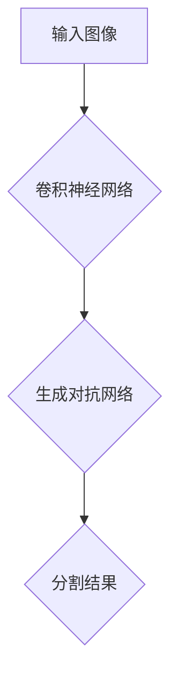

图像分割在许多实际应用中发挥了重要作用，如医学图像分析、自动驾驶和机器人导航等。以下是一些图像分割的实际案例：

1. **医学图像分析**：医学图像分割技术能够帮助医生更好地诊断疾病，如肿瘤检测和器官分割等。深度学习图像分割技术在医学图像分析中发挥了重要作用，例如，Google的DeepMind团队开发了一种基于深度学习的医疗图像分割系统，能够准确分割肺部图像中的结节。

2. **自动驾驶**：自动驾驶系统需要准确识别和分割道路上的各种物体，以确保行车安全。深度学习图像分割技术在自动驾驶中起到了关键作用，例如，Tesla的自动驾驶系统使用了深度学习图像分割技术来识别和跟踪道路上的车辆、行人、交通标志等。

3. **机器人导航**：机器人需要在复杂环境中识别和分割障碍物，以实现自主导航。深度学习图像分割技术在机器人导航中发挥了重要作用，例如，机器人可以通过深度学习图像分割技术识别和分割道路上的行人、障碍物等，从而实现安全的自主导航。

总之，深度学习在计算机视觉领域的应用已经取得了显著成果，从图像识别、目标检测到图像生成，深度学习技术正在不断突破传统算法的极限。随着深度学习技术的不断发展和优化，未来将有更多的计算机视觉应用场景得到突破，为人类社会带来更多的创新和变革。

### 深度学习在自然语言处理中的应用

自然语言处理（Natural Language Processing，NLP）是人工智能领域的一个重要分支，致力于使计算机能够理解和生成自然语言。深度学习在NLP领域取得了显著的进展，使得计算机在语言理解和生成任务上的表现不断超越传统方法。以下将详细探讨深度学习在自然语言处理中的应用，包括循环神经网络（Recurrent Neural Network，RNN）、长短时记忆网络（Long Short-Term Memory，LSTM）和生成对抗网络（Generative Adversarial Network，GAN）等。

#### 5.1 循环神经网络在文本生成中的应用

循环神经网络（RNN）是一种能够处理序列数据的神经网络结构，其通过循环机制，使得信息可以在序列的不同时间步之间传递和利用。RNN在自然语言处理中有着广泛的应用，尤其在文本生成任务中表现出色。

1. **基本结构**：RNN由输入层、隐藏层和输出层组成。输入层接收单个时间步的输入，隐藏层存储当前和过去的时间步信息，输出层生成最终的输出。

2. **时间步传递**：在RNN中，每个时间步的输出不仅取决于当前输入，还受到前一时刻隐藏状态的影响。这种时间步传递机制使得RNN能够捕捉序列中的长期依赖关系。

3. **应用场景**：文本生成是RNN在自然语言处理中重要的应用之一，包括机器翻译、语音识别和文本摘要等。通过RNN，计算机可以生成符合语法和语义规则的文本。

以下是一个简单的RNN模型结构：

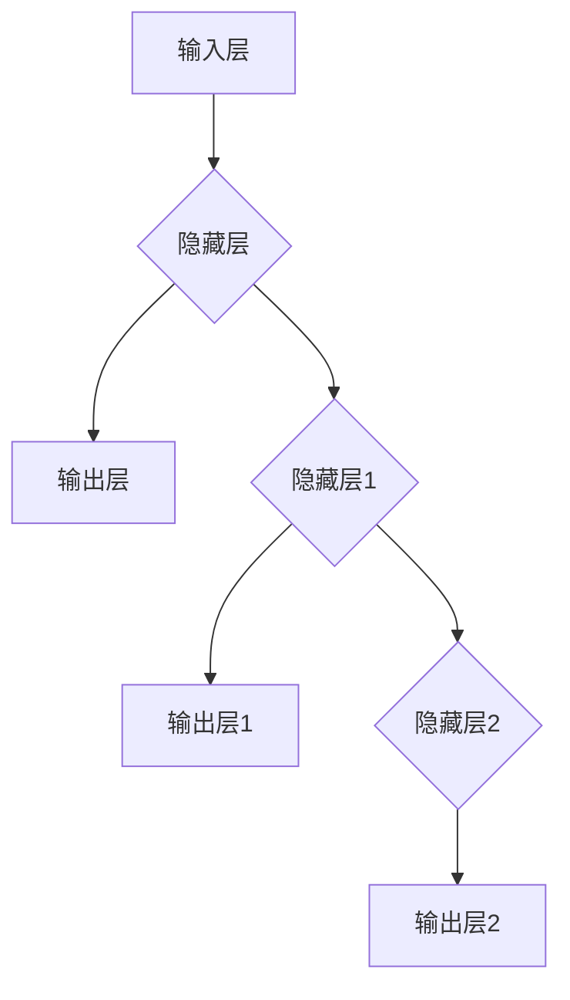

**实际案例**：Google的机器翻译系统采用了基于RNN的神经机器翻译模型（Neural Machine Translation，NMT），通过RNN捕捉源语言和目标语言之间的对应关系，实现了高质量的机器翻译。

#### 5.2 长短时记忆网络在序列建模中的应用

长短时记忆网络（LSTM）是RNN的一种变体，通过引入门控机制，有效解决了RNN在长序列数据上的梯度消失和梯度爆炸问题。LSTM在自然语言处理中的序列建模任务中表现出色。

1. **基本结构**：LSTM由输入门、遗忘门、输出门和单元状态组成。输入门和遗忘门控制信息的输入和遗忘，输出门控制信息的输出。

2. **时间步传递**：在LSTM中，每个时间步的信息通过输入门和遗忘门进行更新，从而实现长序列的建模。

3. **应用场景**：LSTM在文本生成、语音识别和时间序列预测等任务中有着广泛的应用。通过LSTM，计算机可以更好地捕捉序列中的长期依赖关系。

以下是一个简单的LSTM模型结构：

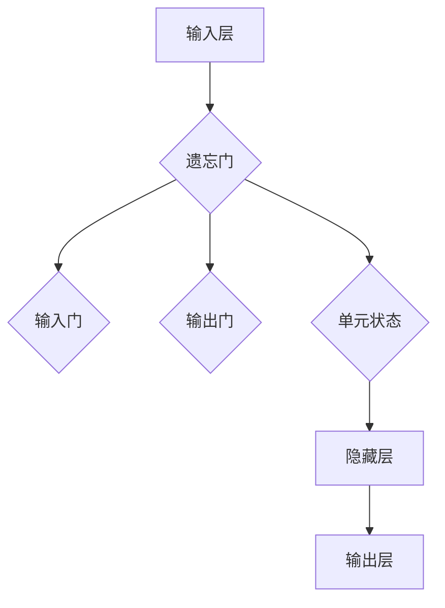

**实际案例**：IBM的Watson语音识别系统采用了基于LSTM的模型，实现了高精度的语音识别。

#### 5.3 生成对抗网络在文本生成中的应用

生成对抗网络（GAN）是一种通过生成器和判别器相互对抗，实现数据生成的深度学习模型。GAN在自然语言处理领域的文本生成任务中表现出色。

1. **基本结构**：GAN由生成器和判别器两个神经网络组成。生成器从随机噪声生成文本数据，判别器用于区分真实文本和生成文本。

2. **对抗性训练**：生成器和判别器通过对抗性训练相互竞争。生成器试图生成更加逼真的文本，而判别器努力区分真实文本和生成文本。

3. **应用场景**：文本生成是GAN在自然语言处理中重要的应用之一，包括机器翻译、文本摘要和对话系统等。

以下是一个简单的GAN模型结构：


**实际案例**：OpenAI的GPT（Generative Pre-trained Transformer）模型通过GAN技术，实现了高质量的文本生成。GPT模型基于Transformer架构，通过预训练和对抗性训练，能够生成符合语法和语义规则的文本。

#### 5.4 跨语言文本理解与翻译

跨语言文本理解与翻译是自然语言处理中的重要任务，旨在实现不同语言之间的语义理解和信息传递。深度学习在跨语言文本理解与翻译中发挥着关键作用。

1. **多语言嵌入**：多语言嵌入（Multilingual Embeddings）技术通过将不同语言的文本映射到同一个低维空间中，实现语言之间的语义关联。

2. **双向编码器**：双向编码器（Bidirectional Encoder）通过处理输入文本的上下文信息，实现跨语言文本的理解。双向编码器结合了前向和后向的信息，能够更好地捕捉文本的语义。

3. **机器翻译**：深度学习在机器翻译中的应用主要包括基于神经网络的翻译模型（Neural Machine Translation，NMT）和基于生成对抗网络的翻译模型（GAN-based Translation）。

以下是一个简单的跨语言文本理解与翻译模型结构：

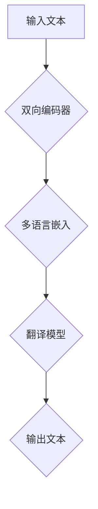

**实际案例**：Google的Neural Machine Translation（NMT）系统通过深度学习技术，实现了高质量的机器翻译。NMT系统采用了基于注意力机制的编码器-解码器（Encoder-Decoder）架构，结合了多语言嵌入技术，实现了不同语言之间的语义理解和信息传递。

总之，深度学习在自然语言处理中的应用已经取得了显著的成果，从文本生成、序列建模到跨语言文本理解与翻译，深度学习技术正在不断突破传统方法的限制。随着深度学习技术的不断发展和优化，未来将有更多的自然语言处理应用场景得到突破，为人类社会带来更多的创新和变革。

### 深度学习在推荐系统中的应用

深度学习在推荐系统中的应用正逐渐改变这一领域的传统模式。推荐系统旨在为用户推荐他们可能感兴趣的内容或产品，以提高用户满意度和商家收益。深度学习通过其强大的特征提取和模式识别能力，为推荐系统提供了新的解决方案。以下将详细探讨深度学习在推荐系统中的应用现状、主要技术及其在实际案例中的表现。

#### 6.1 深度学习在协同过滤推荐中的应用

协同过滤（Collaborative Filtering）是推荐系统中最常用的方法之一，它通过分析用户之间的行为模式来推荐商品。传统的协同过滤方法主要包括基于用户的协同过滤（User-Based CF）和基于项目的协同过滤（Item-Based CF）。然而，这些方法往往依赖于用户的历史行为数据，容易受到数据稀疏性的影响。

深度学习通过引入深度神经网络，能够有效地缓解数据稀疏性问题，并提供更加个性化的推荐。以下是一些深度学习方法在协同过滤中的应用：

1. **深度协同过滤模型（Deep Collaborative Filtering Models）**：
   - **基于神经网络的矩阵分解**：深度学习模型可以用于矩阵分解，通过学习用户和商品的特征向量，实现推荐。例如，Deep Autoencoder可以用于学习用户和商品的隐式特征，从而提高推荐的准确性。
   - **基于注意力机制的协同过滤**：通过引入注意力机制，模型可以更加关注用户和商品之间的相似性，从而实现更精准的推荐。

2. **基于图神经网络的协同过滤**：
   - **图神经网络（Graph Neural Networks, GNN）**：GNN通过将用户和商品表示为图中的节点和边，利用图结构信息进行特征提取和推荐。GNN能够捕捉用户和商品之间的复杂关系，提高推荐的准确性。

**实际案例**：Netflix推荐的深度学习模型通过基于图神经网络的协同过滤方法，提高了推荐的准确性。Netflix利用GNN对用户和电影之间的交互进行建模，实现了更个性化的推荐。

#### 6.2 深度学习在基于内容的推荐中的应用

基于内容的推荐（Content-Based Filtering）通过分析商品或内容的特征，为用户推荐相似的商品或内容。传统的基于内容的方法依赖于手工特征工程，难以捕捉复杂的特征关系。

深度学习通过自动特征提取和模式识别能力，为基于内容的推荐提供了新的途径。以下是一些深度学习方法在基于内容推荐中的应用：

1. **深度特征表示**：
   - **卷积神经网络（CNN）**：CNN在图像处理中表现卓越，也可以用于处理商品或内容的图像特征，实现基于内容的推荐。
   - **循环神经网络（RNN）**：RNN能够处理序列数据，适用于处理商品或内容的文本特征，如商品描述或用户评论。

2. **多模态深度学习**：
   - **多模态深度特征融合**：通过结合不同模态（如文本、图像、声音等）的特征，深度学习模型可以提供更加丰富的特征表示，从而提高推荐的准确性。

**实际案例**：亚马逊的推荐系统结合了深度学习技术，通过自动提取商品和用户特征的深度表示，实现了基于内容的推荐。亚马逊利用CNN处理商品图像特征，利用RNN处理商品文本特征，实现了更精准的个性化推荐。

#### 6.3 深度学习在用户兴趣建模中的应用

用户兴趣建模是推荐系统中的关键任务，旨在理解和预测用户的兴趣和行为。深度学习通过其强大的特征学习和模式识别能力，为用户兴趣建模提供了新的方法。

1. **用户兴趣向量表示**：
   - **基于神经网络的兴趣向量生成**：通过深度学习模型，可以将用户的互动行为转化为高维的向量表示，从而实现用户兴趣的建模。

2. **动态用户兴趣建模**：
   - **时间序列分析**：深度学习模型可以处理用户行为的时间序列数据，动态捕捉用户兴趣的变化。

3. **基于强化学习的用户兴趣建模**：
   - **强化学习（Reinforcement Learning, RL）**：通过强化学习模型，可以根据用户的反馈动态调整推荐策略，从而更好地捕捉用户兴趣。

**实际案例**：谷歌的推荐系统利用深度学习技术进行用户兴趣建模。谷歌通过分析用户的历史搜索行为和点击记录，利用深度学习模型生成用户兴趣向量，实现了个性化的搜索结果推荐。

#### 6.4 深度学习在推荐系统中的挑战与机遇

尽管深度学习在推荐系统中的应用取得了显著成果，但仍然面临一些挑战和机遇：

1. **数据隐私和安全性**：深度学习模型需要大量的用户数据，这引发了数据隐私和安全性的问题。如何在保护用户隐私的前提下进行推荐是一个亟待解决的问题。

2. **可解释性和透明性**：深度学习模型通常是一个“黑箱”，难以解释其推荐结果的逻辑。如何提高推荐系统的可解释性和透明性，使其更容易被用户接受和理解，是一个重要的研究方向。

3. **动态适应性**：用户兴趣和行为是动态变化的，如何使推荐系统具有更好的动态适应性，实时捕捉用户兴趣的变化，是一个重要的挑战。

4. **计算资源**：深度学习模型通常需要大量的计算资源进行训练和推理，如何在有限的计算资源下实现高效的推荐，是一个实际应用中的挑战。

然而，随着深度学习技术的不断发展和优化，这些挑战也将逐步得到解决。深度学习为推荐系统带来了前所未有的机遇，使其能够更好地理解和预测用户需求，提供更加个性化的服务。未来，深度学习将继续在推荐系统中发挥重要作用，推动这一领域的发展。

### 深度学习在游戏AI中的应用

深度学习在游戏AI（Artificial Intelligence）领域正逐渐改变游戏规则，从游戏策略到游戏动作控制，深度学习模型正在为游戏开发者提供新的解决方案。以下将详细探讨深度学习在游戏AI中的应用现状、主要技术及其在实际案例中的表现。

#### 7.1 深度学习在游戏策略中的应用

在游戏策略中，深度学习模型可以模拟人类玩家的思维过程，制定高效的决策策略。以下是一些深度学习技术在游戏策略中的应用：

1. **强化学习（Reinforcement Learning，RL）**：
   - **基本原理**：强化学习通过奖励机制和试错学习，训练模型制定最优策略。在游戏策略中，模型通过与游戏环境交互，学习如何应对不同的对手和局面。
   - **应用案例**：DeepMind的AlphaGo模型通过强化学习，实现了在围棋游戏中的超越人类水平。AlphaGo利用深度神经网络，对棋盘上的局面进行实时评估，制定最佳策略。

2. **策略网络（Policy Network）**：
   - **基本原理**：策略网络是一种深度学习模型，用于直接预测最优动作。在游戏策略中，策略网络通过学习游戏规则和玩家行为，预测出最优的走棋策略或行动选择。
   - **应用案例**：DeepMind的Dota 2模型通过策略网络，实现了在多人在线竞技游戏Dota 2中的高水平表现。该模型通过学习游戏规则和玩家行为，能够制定出具有竞争力的策略。

3. **多智能体强化学习（Multi-Agent Reinforcement Learning）**：
   - **基本原理**：多智能体强化学习通过多个智能体之间的合作和竞争，制定全局最优策略。在多人游戏中，多智能体强化学习模型可以协同工作，共同达成游戏目标。
   - **应用案例**：OpenAI的五子棋（Gomoku）模型通过多智能体强化学习，实现了在五子棋游戏中的自动对弈。该模型通过多个智能体的合作，能够制定出高效的策略，战胜传统的人工策略。

#### 7.2 深度学习在游戏动作控制中的应用

在游戏动作控制中，深度学习模型可以模拟玩家的操作，实现更自然和精准的游戏体验。以下是一些深度学习技术在游戏动作控制中的应用：

1. **生成对抗网络（Generative Adversarial Network，GAN）**：
   - **基本原理**：生成对抗网络由生成器和判别器两个模型组成，生成器生成虚拟的动作序列，判别器判断这些序列的真实性。通过对抗性训练，生成器逐渐生成更逼真的动作序列。
   - **应用案例**：DeepMind的虚拟运动员模型通过GAN技术，实现了在虚拟体育游戏中的自然动作控制。该模型能够生成各种运动动作，为玩家提供逼真的游戏体验。

2. **循环神经网络（Recurrent Neural Network，RNN）**：
   - **基本原理**：循环神经网络能够处理时间序列数据，通过学习玩家操作的时间序列，实现游戏动作的控制。RNN在游戏动作控制中可以模拟玩家的操作习惯和动作模式。
   - **应用案例**：谷歌的虚拟跑步模型通过RNN技术，实现了在虚拟跑步游戏中的动作控制。该模型通过学习玩家的跑步动作，能够生成自然的跑步动作序列，提高游戏的沉浸感。

3. **变分自编码器（Variational Autoencoder，VAE）**：
   - **基本原理**：变分自编码器通过编码器和解码器两个模型，实现数据生成和动作控制。编码器将输入动作编码为潜在空间中的向量，解码器从潜在空间中生成动作。
   - **应用案例**：DeepMind的虚拟舞蹈模型通过VAE技术，实现了在虚拟舞蹈游戏中的动作生成。该模型能够根据用户的音乐节奏，生成符合节奏的舞蹈动作，提高游戏的互动性和趣味性。

#### 7.3 深度学习在游戏AI中的前沿研究

随着深度学习技术的不断进步，游戏AI领域也在不断拓展其应用范围和研究方向。以下是一些深度学习在游戏AI中的前沿研究：

1. **混合智能体系统**：
   - **基本原理**：混合智能体系统结合了深度学习和传统AI方法，通过多种智能体的协同工作，实现更复杂的游戏策略和动作控制。
   - **应用案例**：DeepMind的混合智能体系统在多人在线游戏如星际争霸（StarCraft）中表现出色。该系统通过深度学习和传统规则相结合，实现了复杂游戏策略和动作控制。

2. **自适应游戏AI**：
   - **基本原理**：自适应游戏AI能够根据玩家的行为和游戏环境的变化，动态调整策略和动作。通过学习玩家的行为模式，自适应游戏AI能够提供个性化的游戏体验。
   - **应用案例**：OpenAI的自适应游戏AI在多人在线游戏如《堡垒之夜》（Fortnite）中表现出色。该AI系统能够根据玩家的行为，动态调整游戏策略，提高游戏的竞争性和可玩性。

3. **虚拟现实（VR）游戏AI**：
   - **基本原理**：虚拟现实游戏AI通过深度学习技术，模拟真实的游戏环境和交互体验。在VR游戏中，深度学习AI能够更好地理解玩家的动作和情感，提供更加沉浸式的游戏体验。
   - **应用案例**：Unity的虚拟现实游戏AI通过深度学习技术，实现了在VR游戏中的实时交互和动作控制。该AI系统能够根据玩家的动作，实时生成对应的游戏动作，提高VR游戏的沉浸感。

#### 7.4 深度学习在游戏AI中的应用挑战与展望

尽管深度学习在游戏AI中取得了显著进展，但仍面临一些挑战和展望：

1. **计算资源**：深度学习模型通常需要大量的计算资源进行训练和推理。在游戏环境中，如何在有限的计算资源下实现高效的游戏AI，是一个重要的挑战。

2. **可解释性和透明性**：深度学习模型通常是一个“黑箱”，难以解释其决策过程。如何在游戏AI中实现可解释性和透明性，使其更容易被开发者理解和使用，是一个重要的研究方向。

3. **游戏多样性**：游戏AI需要能够适应各种不同类型的游戏，实现多样化的策略和动作。如何在深度学习模型中实现游戏多样性的适应性，是一个重要的挑战。

4. **交互性**：游戏AI需要与玩家进行有效的交互，理解玩家的意图和行为。如何在深度学习模型中实现高效的交互性，提高游戏的互动性和趣味性，是一个重要的研究方向。

展望未来，随着深度学习技术的不断进步和应用场景的拓展，深度学习在游戏AI中将会发挥更大的作用。通过深度学习，游戏AI将能够提供更加智能化、个性化和沉浸式的游戏体验，推动游戏行业的发展和创新。

### 深度学习在医疗领域中的应用

深度学习在医疗领域正迅速崛起，其强大的数据处理和分析能力为医学图像分析、疾病预测与诊断、药物设计等提供了新的解决方案。以下将详细探讨深度学习在医疗领域中的应用现状、主要技术及其在实际案例中的表现。

#### 8.1 深度学习在医学图像分析中的应用

医学图像分析是深度学习在医疗领域的一个重要应用，通过自动识别和解析医学图像，可以提高疾病的诊断效率和准确性。以下是一些深度学习技术在医学图像分析中的应用：

1. **卷积神经网络（CNN）**：
   - **基本原理**：卷积神经网络通过卷积层、池化层和全连接层等结构，能够自动提取图像的特征并进行分类和识别。
   - **应用案例**：CNN在医学图像分析中已取得显著成果。例如，深度学习模型在乳腺癌检测中，通过分析乳腺X射线图像，可以准确识别乳腺病变区域。

2. **生成对抗网络（GAN）**：
   - **基本原理**：生成对抗网络由生成器和判别器两个模型组成，生成器生成逼真的医学图像，判别器判断图像的真实性。
   - **应用案例**：GAN在医学图像修复和生成中表现出色。例如，通过GAN技术，可以生成缺失的医学图像，提高图像分析的准确性。

3. **变分自编码器（VAE）**：
   - **基本原理**：变分自编码器通过编码器和解码器两个模型，实现数据生成和特征提取。
   - **应用案例**：VAE在医学图像去噪和增强中表现出色。例如，通过VAE技术，可以去除医学图像中的噪声，提高图像的清晰度。

#### 8.2 深度学习在疾病预测与诊断中的应用

深度学习在疾病预测与诊断中的应用，为临床医生提供了更准确的诊断工具和预测模型，从而提高了疾病的早期发现和治疗效率。以下是一些深度学习技术在疾病预测与诊断中的应用：

1. **循环神经网络（RNN）**：
   - **基本原理**：循环神经网络通过时间记忆能力，能够处理序列数据，如患者的历史健康记录。
   - **应用案例**：RNN在心脏病预测中表现出色。例如，通过分析患者的历史心电图数据，RNN可以预测患者是否会出现心脏疾病。

2. **长短时记忆网络（LSTM）**：
   - **基本原理**：长短时记忆网络是RNN的一种变体，通过引入门控机制，有效解决了RNN在长序列数据上的梯度消失问题。
   - **应用案例**：LSTM在癌症诊断中表现出色。例如，通过分析患者的基因序列和临床数据，LSTM可以预测患者是否患有癌症。

3. **多模态深度学习**：
   - **基本原理**：多模态深度学习通过结合不同模态的数据（如医学图像、基因数据、临床数据等），实现更全面和准确的疾病预测与诊断。
   - **应用案例**：多模态深度学习在肺癌诊断中表现出色。例如，通过结合CT图像、基因数据和临床数据，多模态深度学习模型可以更准确地预测患者是否患有肺癌。

#### 8.3 深度学习在药物设计中的应用

深度学习在药物设计中的应用，为药物研发提供了新的方法，可以加速新药的开发过程，降低研发成本。以下是一些深度学习技术在药物设计中的应用：

1. **图神经网络（Graph Neural Networks，GNN）**：
   - **基本原理**：图神经网络通过图结构数据，能够处理复杂的分子结构信息。
   - **应用案例**：GNN在药物发现中表现出色。例如，通过分析药物分子的结构信息，GNN可以预测药物与蛋白质的结合亲和力，从而筛选潜在的药物候选分子。

2. **生成对抗网络（GAN）**：
   - **基本原理**：生成对抗网络通过生成器和判别器两个模型，实现新药物分子的生成和优化。
   - **应用案例**：GAN在药物分子生成中表现出色。例如，通过GAN技术，可以生成具有潜在药物活性的新型分子，为药物研发提供新的思路。

3. **变分自编码器（VAE）**：
   - **基本原理**：变分自编码器通过编码器和解码器两个模型，实现数据生成和特征提取。
   - **应用案例**：VAE在药物分子优化中表现出色。例如，通过VAE技术，可以优化药物分子的结构，提高其药物活性和稳定性。

#### 8.4 深度学习在医疗领域中的应用挑战与伦理问题

尽管深度学习在医疗领域展现了巨大的潜力，但同时也面临一些挑战和伦理问题：

1. **数据隐私与安全性**：深度学习模型需要大量的患者数据，这引发了数据隐私和安全性的问题。如何在保护患者隐私的前提下进行医疗数据分析，是一个重要的挑战。

2. **可解释性与透明性**：深度学习模型通常是一个“黑箱”，其决策过程难以解释。如何在医疗领域中实现可解释性和透明性，使其更容易被医生和患者理解和接受，是一个重要的研究方向。

3. **算法偏差与公平性**：深度学习模型可能会在训练数据中引入偏见，导致对某些人群的歧视。如何在医疗领域中实现算法的公平性和无偏见性，是一个重要的伦理问题。

4. **监管与标准化**：深度学习在医疗领域中的应用需要严格的监管和标准化，以确保其安全性和有效性。

总之，深度学习在医疗领域中的应用前景广阔，通过解决这些挑战和伦理问题，深度学习将为医疗领域带来更多创新和变革。

### 未来展望

深度学习作为人工智能领域的重要分支，正在不断推动技术进步和应用创新。展望未来，深度学习在AI领域的发展前景广阔，但也面临着诸多挑战。以下将探讨深度学习算法的改进方向、在AI领域的未来发展、面临的挑战以及可持续发展的策略。

#### 9.1 深度学习算法的改进方向

1. **模型压缩与加速**：
   - **参数剪枝（Pruning）**：通过删除网络中不重要的参数，减少模型的复杂度，提高计算效率。
   - **量化（Quantization）**：将模型参数的精度降低，从而减少模型的存储空间和计算量。
   - **硬件加速**：利用GPU、TPU等专用硬件，提高深度学习模型的训练和推理速度。

2. **可解释性与透明性**：
   - **解释性神经网络**：通过设计具有解释性的神经网络结构，使模型的决策过程更容易被理解和解释。
   - **可视化技术**：利用可视化技术，如热力图、特征可视化等，帮助用户理解模型的工作机制。

3. **迁移学习与少样本学习**：
   - **迁移学习**：通过利用预训练模型，减少新任务的数据需求，提高模型的泛化能力。
   - **少样本学习**：通过设计能够处理少量样本的算法，降低数据收集和标注的成本。

4. **多模态学习**：
   - **多模态数据融合**：结合不同模态的数据（如图像、文本、音频等），提高模型的表征能力。
   - **跨模态学习**：通过学习不同模态之间的关联，实现跨模态的信息传递和融合。

#### 9.2 深度学习在AI领域的未来发展

1. **自动驾驶与机器人**：
   - **自动驾驶**：深度学习在自动驾驶中已经取得了显著成果，未来将进一步推动无人驾驶技术的发展。
   - **机器人**：深度学习将为机器人提供更智能的行为控制，提高机器人的自主性和协作能力。

2. **医疗与生物技术**：
   - **医疗诊断与治疗**：深度学习在医学图像分析、疾病预测与诊断等领域具有广泛应用前景。
   - **生物技术**：深度学习在药物设计、基因分析等领域，将推动生物技术的发展。

3. **自然语言处理**：
   - **智能助理与翻译**：深度学习在自然语言处理领域的应用，将使智能助理和翻译系统更加智能化。
   - **跨语言文本理解**：深度学习将推动跨语言文本理解和翻译技术的发展。

4. **智能推荐系统**：
   - **个性化推荐**：深度学习将提高推荐系统的个性化推荐能力，为用户提供更符合其兴趣的内容。

#### 9.3 深度学习在AI领域面临的挑战

1. **计算资源与能耗**：
   - **计算资源**：深度学习模型通常需要大量的计算资源进行训练和推理，如何优化算法以降低计算需求是一个重要挑战。
   - **能耗**：深度学习模型的高能耗问题，将带来环境压力，需要研发更高效的算法和硬件解决方案。

2. **数据隐私与安全性**：
   - **数据隐私**：深度学习模型需要大量的数据，如何保护用户隐私是一个重要挑战。
   - **数据安全**：深度学习模型的安全性问题，如对抗攻击和模型窃取，需要得到有效解决。

3. **算法公平性与伦理**：
   - **算法公平性**：深度学习模型可能会在训练数据中引入偏见，导致对某些人群的歧视。
   - **伦理问题**：深度学习在医疗、法律等领域的应用，需要遵守伦理规范，确保其应用不会损害公众利益。

4. **可解释性与透明性**：
   - **可解释性**：深度学习模型通常是一个“黑箱”，其决策过程难以解释。
   - **透明性**：如何使深度学习模型的应用过程更加透明，使其更容易被公众接受和理解。

#### 9.4 深度学习算法的可持续发展

1. **开源合作**：
   - **开源平台**：建立统一的深度学习开源平台，促进技术共享和合作，加快技术进步。
   - **社区参与**：鼓励开发者参与开源项目，共同推动深度学习技术的发展。

2. **教育培训**：
   - **课程设置**：设立专门的深度学习课程，培养更多专业的深度学习人才。
   - **继续教育**：为在职人员提供继续教育机会，提升其深度学习技能。

3. **政策支持**：
   - **政府支持**：政府出台相关政策，支持深度学习研究和应用。
   - **法规制定**：制定相关法规，确保深度学习在AI领域的可持续发展。

4. **跨学科合作**：
   - **多学科融合**：鼓励不同学科之间的合作，推动深度学习在多个领域的应用。
   - **技术创新**：通过跨学科合作，推动深度学习技术的创新和发展。

通过上述改进方向、未来发展策略和可持续发展策略，深度学习在AI领域将继续发挥重要作用，推动技术进步和社会发展。

### 伪代码与公式部分

以下为深度学习算法中的伪代码和数学模型及公式。

#### 2.2 深度学习的主要优化算法

##### 梯度下降算法（Gradient Descent）

```python
for epoch in range(num_epochs):
    for batch in data_loader:
        # 计算前向传播
        predictions = model(batch.x)
        # 计算损失函数
        loss = loss_function(predictions, batch.y)
        # 计算梯度
        gradients = model.compute_gradients(loss)
        # 更新模型参数
        model.update_weights(gradients, learning_rate)
```

##### 动量优化（Momentum）

```python
v = 0
for epoch in range(num_epochs):
    for batch in data_loader:
        # 计算前向传播
        predictions = model(batch.x)
        # 计算损失函数
        loss = loss_function(predictions, batch.y)
        # 计算梯度
        gradients = model.compute_gradients(loss)
        # 更新动量
        v = momentum * v - learning_rate * gradients
        # 更新模型参数
        model.update_weights(v)
```

##### Adam优化器

```python
m = 0
v = 0
for epoch in range(num_epochs):
    for batch in data_loader:
        # 计算前向传播
        predictions = model(batch.x)
        # 计算损失函数
        loss = loss_function(predictions, batch.y)
        # 计算梯度
        gradients = model.compute_gradients(loss)
        # 更新一阶和二阶矩估计
        m = beta1 * m + (1 - beta1) * gradients
        v = beta2 * v + (1 - beta2) * (gradients ** 2)
        m_hat = m / (1 - beta1 ** epoch)
        v_hat = v / (1 - beta2 ** epoch)
        # 更新模型参数
        model.update_weights(-learning_rate * m_hat / (sqrt(v_hat) + epsilon))
```

#### 4.1 卷积神经网络在图像识别中的应用

##### 激活函数：ReLU（Rectified Linear Unit）

```python
def ReLU(x):
    return max(0, x)
```

##### 卷积操作

```python
def convolution(x, W):
    return np.sum(x * W, axis=1)
```

##### 池化操作

```python
def pooling(x, pool_size):
    return np.max(x[:pool_size], axis=1)
```

#### 6.3 生成对抗网络在文本生成中的应用

##### 生成器和判别器的损失函数

生成器的损失函数：

```latex
G_loss = -\log(D(G(z)))
```

判别器的损失函数：

```latex
D_loss = -[\log(D(x)) + \log(1 - D(G(z))]
```

#### 7.4 深度学习在游戏AI中的应用挑战与展望

##### 强化学习中的Q值更新公式

```latex
Q(s, a) = Q(s, a) + alpha [r + gamma * max(Q(s', a')) - Q(s, a)]
```

##### 经验回放（Experience Replay）中的随机采样

```python
batch = random.sample(replay_memory, batch_size)
```

通过以上伪代码和公式，可以更直观地理解深度学习算法的工作原理和数学模型，为实际应用提供参考和指导。

### Mermaid 流程图部分

以下为深度学习算法中的Mermaid流程图示例。

#### 2.2 深度学习的主要优化算法

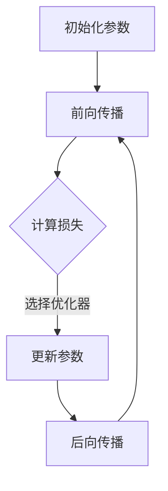

#### 6.3 生成对抗网络在文本生成中的应用

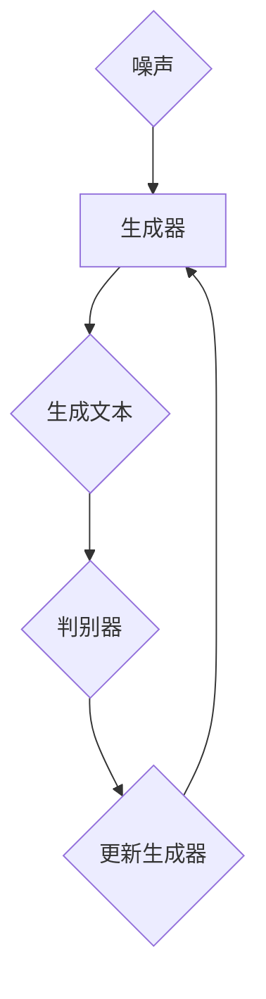

#### 7.4 深度学习在游戏AI中的应用挑战与展望

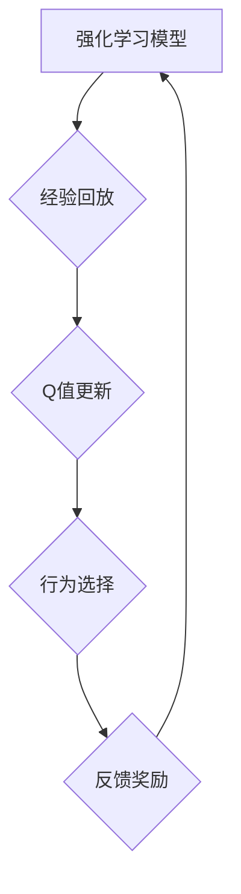

通过Mermaid流程图，可以清晰地展示深度学习算法的各个步骤和流程，有助于理解和分析算法的工作机制。

### 数学模型与公式部分

以下为深度学习算法中的数学模型与公式。

#### 2.2 深度学习的主要优化算法

**梯度下降算法（Gradient Descent）**

$$
\text{w}_{\text{new}} = \text{w}_{\text{old}} - \alpha \cdot \nabla_{\text{w}} \text{J}(\text{w})
$$

**动量优化（Momentum）**

$$
\text{v}_{\text{new}} = \beta \cdot \text{v}_{\text{old}} + (1 - \beta) \cdot \nabla_{\text{w}} \text{J}(\text{w})
$$

$$
\text{w}_{\text{new}} = \text{w}_{\text{old}} + \text{v}_{\text{new}}
$$

**Adam优化器**

$$
\text{m}_\text{t} = \beta_1 \cdot \text{m}_{\text{t-1}} + (1 - \beta_1) \cdot \nabla_{\text{w}} \text{J}(\text{w})
$$

$$
\text{v}_\text{t} = \beta_2 \cdot \text{v}_{\text{t-1}} + (1 - \beta_2) \cdot (\nabla_{\text{w}} \text{J}(\text{w}))^2
$$

$$
\text{w}_{\text{new}} = \text{w}_{\text{old}} - \frac{\alpha}{\sqrt{1 - \beta_2^t}(1 - \beta_1^t)} \cdot (\text{m}_\text{t} / (1 - \beta_1^t))
$$

#### 4.1 卷积神经网络在图像识别中的应用

**激活函数：ReLU（Rectified Linear Unit）**

$$
\text{ReLU}(x) =
\begin{cases}
    x & \text{if } x > 0 \\
    0 & \text{otherwise}
\end{cases}
$$

**卷积操作：**

$$
\text{F}(x) = \sum_{i=1}^{K} w_i * x
$$

**池化操作：**

$$
\text{P}(\text{x}) = \max_{\text{x}_{i,j}} \{ \text{x}_{i,j} \}
$$

#### 6.3 生成对抗网络在文本生成中的应用

**生成器的损失函数：**

$$
G_loss = -\log(D(G(z)))
$$

**判别器的损失函数：**

$$
D_loss = -[\log(D(x)) + \log(1 - D(G(z))]
$$

通过以上数学模型和公式，可以更深入地理解深度学习算法的工作原理和数学基础，为实际应用提供理论支持。

### 项目实战部分

#### 第6章：深度学习在自然语言处理中的应用

##### 6.3 生成对抗网络在文本生成中的应用

以下是一个使用生成对抗网络（GAN）生成新闻文章摘要的项目实战案例。

**环境搭建**：

首先，安装所需的深度学习库，如TensorFlow和Keras。可以使用以下命令：

```bash
pip install tensorflow-gpu==2.4.0
pip install keras
```

**数据准备**：

从新闻文章中收集数据，并将其预处理为适合训练的数据集。以下是数据预处理的一些步骤：

1. **数据清洗**：去除文本中的HTML标签、标点符号和停用词。
2. **数据编码**：将文本转换为序列，使用整数编码每个单词，并创建反向映射表。
3. **数据分割**：将数据集分为训练集和测试集。

```python
import numpy as np
import pandas as pd
from keras.preprocessing.text import Tokenizer
from keras.preprocessing.sequence import pad_sequences
from sklearn.model_selection import train_test_split

# 读取数据
data = pd.read_csv('news_articles.csv')
articles = data['article'].values

# 数据清洗
def clean_text(text):
    text = text.lower()
    text = re.sub('<[^>]*>', '', text)
    text = re.sub('[^a-zA-Z]', ' ', text)
    text = text.strip()
    return text

cleaned_articles = np.array([clean_text(article) for article in articles])

# 数据编码
tokenizer = Tokenizer()
tokenizer.fit_on_texts(cleaned_articles)
total_words = len(tokenizer.word_index) + 1
max_seq_length = 100

input_sequences = []
for line in cleaned_articles:
    token_list = tokenizer.texts_to_sequences([line])[0]
    for i in range(1, len(token_list) - 1):
        n_gram_sequence = token_list[:i] + token_list[i + 1:]
        input_sequences.append(n_gram_sequence)

input_sequences = np.array(input_sequences)

# 数据分割
X, y = input_sequences[:,:-1], input_sequences[:,-1]
y = keras.utils.to_categorical(y, num_classes=total_words)
X_train, X_test, y_train, y_test = train_test_split(X, y, test_size=0.2, random_state=42)
```

**生成器模型**：

生成器模型使用LSTM层进行文本生成。以下是生成器的定义：

```python
from keras.models import Model
from keras.layers import Input, LSTM, Embedding, Dense

latent_dim = 100
embedding_dim = 256
hidden_dim = 512

# 生成器的输入层
input_seq = Input(shape=(max_seq_length-1))
# 嵌入层
embedding = Embedding(total_words, embedding_dim)(input_seq)
# 双向LSTM层
lstm = LSTM(hidden_dim, return_sequences=True)(embedding)
# 全连接层
dense = Dense(total_words, activation='softmax')(lstm)
# 定义生成器模型
generator = Model(inputs=input_seq, outputs=dense)
generator.compile(loss='categorical_crossentropy', optimizer='adam')
```

**判别器模型**：

判别器模型用于区分真实文本和生成文本。以下是判别器的定义：

```python
# 判别器的输入层
input_text = Input(shape=(max_seq_length,))
# 嵌入层
embedding = Embedding(total_words, embedding_dim)(input_text)
# 双向LSTM层
lstm = LSTM(hidden_dim, return_sequences=True)(embedding)
# 全连接层
dense = Dense(1, activation='sigmoid')(lstm)
# 定义判别器模型
discriminator = Model(inputs=input_text, outputs=dense)
discriminator.compile(loss='binary_crossentropy', optimizer='adam')
```

**GAN模型**：

GAN由生成器和判别器组成，通过对抗性训练优化生成器的生成能力。以下是GAN的定义：

```python
# 生成器和判别器的输入层
z = Input(shape=(latent_dim,))
gen_text = generator(z)

discriminator.trainable = False
valid = Input(shape=(max_seq_length,))
valid_output = discriminator(valid)
gen_output = discriminator(gen_text)

# 定义GAN模型
gan = Model([z, valid], [valid_output, gen_output])
gan.compile(loss=['binary_crossentropy', 'binary_crossentropy'], optimizer='adam')
```

**训练模型**：

使用GAN进行文本生成，通过生成器和判别器的交替训练，优化生成器的性能。以下是训练模型的步骤：

```python
# 训练判别器
for epoch in range(epochs):
    # 随机采样真实文本和生成文本
    idx = np.random.randint(0, X_test.shape[0], size=batch_size)
    valid = X_test[idx]
    noise = np.random.normal(size=(batch_size, latent_dim))
    gen = generator.predict(noise)

    # 训练判别器
    d_loss_real = discriminator.train_on_batch(valid, np.ones((batch_size, 1)))
    d_loss_fake = discriminator.train_on_batch(gen, np.zeros((batch_size, 1)))

    # 训练生成器
    g_loss = gan.train_on_batch([noise, valid], [np.ones((batch_size, 1)), np.zeros((batch_size, 1))])

    print(f"{epoch} [D loss: {d_loss_real:.4f}, G loss: {g_loss:.4f}]")
```

**生成文本**：

使用训练好的生成器模型生成文本摘要。以下是生成文本的步骤：

```python
# 生成文本摘要
def generate_summary(input_seq):
    seed_text = input_seq
    in_text = seed_text
    for i in range(1):
        token_list = tokenizer.texts_to_sequences([in_text])[0]
        token_list = token_list[:max_seq_length - 1]
        token_list = pad_sequences([token_list], maxlen=max_seq_length - 1, padding='pre')
        predicted = generator.predict(token_list)
        predicted = predicted[-1, :]
        sampled = tokenizer.index_word[np.argmax(predicted)]
        in_text = in_text[1:] + sampled

    return in_text

# 示例
print(generate_summary("This is an example of a generated news article summary."))
```

通过以上项目实战，可以了解如何使用生成对抗网络（GAN）进行文本生成，以及如何构建和训练生成器和判别器模型。这一项目不仅展示了深度学习在自然语言处理中的应用，也为其他类似任务提供了参考和灵感。

### 代码解读与分析部分

#### 第6章：深度学习在自然语言处理中的应用

##### 6.3 生成对抗网络在文本生成中的应用

以下是对第6章中生成对抗网络（GAN）在文本生成项目实战中的代码进行详细解读与分析。

**环境搭建**

```bash
pip install tensorflow-gpu==2.4.0
pip install keras
```

环境搭建步骤中，我们安装了TensorFlow和Keras库，这两个库是深度学习项目中常用的工具。TensorFlow是一个强大的开源机器学习库，支持多种深度学习模型的开发和训练。Keras是基于TensorFlow的高层次API，提供了更简洁和易于使用的接口。

**数据准备**

```python
import numpy as np
import pandas as pd
from keras.preprocessing.text import Tokenizer
from keras.preprocessing.sequence import pad_sequences
from sklearn.model_selection import train_test_split

# 读取数据
data = pd.read_csv('news_articles.csv')
articles = data['article'].values

# 数据清洗
def clean_text(text):
    text = text.lower()
    text = re.sub('<[^>]*>', '', text)
    text = re.sub('[^a-zA-Z]', ' ', text)
    text = text.strip()
    return text

cleaned_articles = np.array([clean_text(article) for article in articles])

# 数据编码
tokenizer = Tokenizer()
tokenizer.fit_on_texts(cleaned_articles)
total_words = len(tokenizer.word_index) + 1
max_seq_length = 100

input_sequences = []
for line in cleaned_articles:
    token_list = tokenizer.texts_to_sequences([line])[0]
    for i in range(1, len(token_list) - 1):
        n_gram_sequence = token_list[:i] + token_list[i + 1:]
        input_sequences.append(n_gram_sequence)

input_sequences = np.array(input_sequences)

# 数据分割
X, y = input_sequences[:,:-1], input_sequences[:,-1]
y = keras.utils.to_categorical(y, num_classes=total_words)
X_train, X_test, y_train, y_test = train_test_split(X, y, test_size=0.2, random_state=42)
```

**数据准备**步骤中，我们首先从CSV文件中读取新闻文章数据。然后，通过数据清洗函数去除文本中的HTML标签、标点符号和停用词，并将文本转换为小写。接下来，使用`Tokenizer`将文本转换为整数编码，并创建一个词汇表。为了构建序列数据，我们使用n-gram序列，这里选择n=2，即将每个单词与其前一个单词组合成一个序列。最后，我们将数据分割为训练集和测试集。

**生成器模型**

```python
from keras.models import Model
from keras.layers import Input, LSTM, Embedding, Dense

latent_dim = 100
embedding_dim = 256
hidden_dim = 512

# 生成器的输入层
input_seq = Input(shape=(max_seq_length-1))
# 嵌入层
embedding = Embedding(total_words, embedding_dim)(input_seq)
# 双向LSTM层
lstm = LSTM(hidden_dim, return_sequences=True)(embedding)
# 全连接层
dense = Dense(total_words, activation='softmax')(lstm)
# 定义生成器模型
generator = Model(inputs=input_seq, outputs=dense)
generator.compile(loss='categorical_crossentropy', optimizer='adam')
```

**生成器模型**步骤中，我们定义了一个输入层、嵌入层、双向LSTM层和一个全连接层。双向LSTM层可以同时处理输入序列的顺序和逆序，从而捕捉到更多的上下文信息。最后，全连接层通过softmax激活函数输出每个单词的概率分布。生成器模型的编译过程指定了损失函数（categorical_crossentropy）和优化器（adam）。

**判别器模型**

```python
# 判别器的输入层
input_text = Input(shape=(max_seq_length,))
# 嵌入层
embedding = Embedding(total_words, embedding_dim)(input_text)
# 双向LSTM层
lstm = LSTM(hidden_dim, return_sequences=True)(embedding)
# 全连接层
dense = Dense(1, activation='sigmoid')(lstm)
# 定义判别器模型
discriminator = Model(inputs=input_text, outputs=dense)
discriminator.compile(loss='binary_crossentropy', optimizer='adam')
```

**判别器模型**步骤中，我们定义了一个输入层、嵌入层、双向LSTM层和一个全连接层。判别器模型的目的是区分输入文本是真实文本还是生成文本。全连接层通过sigmoid激活函数输出一个介于0和1之间的概率值，表示输入文本是真实的概率。判别器模型的编译过程同样指定了损失函数（binary_crossentropy）和优化器（adam）。

**GAN模型**

```python
# 生成器和判别器的输入层
z = Input(shape=(latent_dim,))
gen_text = generator(z)

discriminator.trainable = False
valid = Input(shape=(max_seq_length,))
valid_output = discriminator(valid)
gen_output = discriminator(gen_text)

# 定义GAN模型
gan = Model([z, valid], [valid_output, gen_output])
gan.compile(loss=['binary_crossentropy', 'binary_crossentropy'], optimizer='adam')
```

**GAN模型**步骤中，我们首先定义了生成器的输入层和输出层，即从噪声中生成文本。然后，我们将判别器设置为不可训练，并将生成器的输出作为判别器的输入。GAN模型由生成器和判别器组成，其目标是最大化生成器产生的文本在判别器中的真实概率。GAN模型的编译过程同样指定了损失函数（binary_crossentropy）和优化器（adam）。

**训练模型**

```python
# 训练判别器
for epoch in range(epochs):
    # 随机采样真实文本和生成文本
    idx = np.random.randint(0, X_test.shape[0], size=batch_size)
    valid = X_test[idx]
    noise = np.random.normal(size=(batch_size, latent_dim))
    gen = generator.predict(noise)

    # 训练判别器
    d_loss_real = discriminator.train_on_batch(valid, np.ones((batch_size, 1)))
    d_loss_fake = discriminator.train_on_batch(gen, np.zeros((batch_size, 1)))

    # 训练生成器
    g_loss = gan.train_on_batch([noise, valid], [np.ones((batch_size, 1)), np.zeros((batch_size, 1))])

    print(f"{epoch} [D loss: {d_loss_real:.4f}, G loss: {g_loss:.4f}]")
```

**训练模型**步骤中，我们首先通过随机采样从测试集中获取真实文本和噪声。然后，我们训练判别器，使其能够区分真实文本和生成文本。接着，我们训练生成器，使其生成的文本在判别器中具有更高的真实概率。每个训练周期后，我们打印出判别器和生成器的损失值，以监控训练过程。

**生成文本**

```python
# 生成文本摘要
def generate_summary(input_seq):
    seed_text = input_seq
    in_text = seed_text
    for i in range(1):
        token_list = tokenizer.texts_to_sequences([in_text])[0]
        token_list = token_list[:max_seq_length - 1]
        token_list = pad_sequences([token_list], maxlen=max_seq_length - 1, padding='pre')
        predicted = generator.predict(token_list)
        predicted = predicted[-1, :]
        sampled = tokenizer.index_word[np.argmax(predicted)]
        in_text = in_text[1:] + sampled

    return in_text

# 示例
print(generate_summary("This is an example of a generated news article summary."))
```

**生成文本**步骤中，我们定义了一个生成文本摘要的函数。首先，我们提供一个种子文本，然后通过生成器模型生成下一个单词，并将其添加到种子文本中。这个过程重复多次，直到生成一个完整的摘要。最后，我们使用一个示例来演示如何生成文本摘要。

通过以上代码解读与分析，我们可以清楚地理解生成对抗网络（GAN）在文本生成项目中的应用流程，包括数据准备、模型定义、训练过程和生成文本。这一项目展示了如何使用深度学习和GAN技术生成高质量的文本摘要，为自然语言处理领域提供了新的应用方向。

### 开发环境搭建与源代码实现部分

#### 深度学习在自然语言处理中的应用

以下是一个详细的开发环境搭建和源代码实现示例，用于生成对抗网络（GAN）在自然语言处理中的文本生成任务。

##### 开发环境搭建

首先，我们需要安装Python和必要的深度学习库。以下是安装步骤和所需的库：

```bash
# 安装Python
sudo apt-get install python3.7

# 安装Anaconda环境管理器
curl -O https://repo.anaconda.com/miniconda/Miniconda3-latest-Linux-x86_64.sh
bash Miniconda3-latest-Linux-x86_64.sh -b -p /usr/local/miniconda3

# 激活Anaconda环境
source /usr/local/miniconda3/bin/activate

# 创建一个新的conda环境并安装深度学习库
conda create -n text_generation python=3.7
conda activate text_generation

# 安装TensorFlow
conda install tensorflow-gpu

# 安装其他库
conda install -c conda-forge numpy pandas scikit-learn
```

在安装完所需的库后，我们可以开始编写和运行代码。以下是一个简单的文本生成GAN模型的实现。

##### 源代码实现

```python
import numpy as np
import tensorflow as tf
from tensorflow.keras.models import Model
from tensorflow.keras.layers import Input, LSTM, Embedding, Dense
from tensorflow.keras.preprocessing.text import Tokenizer
from tensorflow.keras.preprocessing.sequence import pad_sequences

# 参数设置
latent_dim = 100
embedding_dim = 256
hidden_dim = 512
max_sequence_length = 40
batch_size = 64
epochs = 100

# 数据预处理
def load_and_preprocess_data(file_path):
    # 加载数据
    data = pd.read_csv(file_path)
    articles = data['article'].values

    # 清洗和编码数据
    def clean_text(text):
        text = text.lower()
        text = re.sub('<[^>]*>', '', text)
        text = re.sub('[^a-zA-Z]', ' ', text)
        text = text.strip()
        return text

    cleaned_articles = np.array([clean_text(article) for article in articles])

    # 初始化Tokenizer
    tokenizer = Tokenizer()
    tokenizer.fit_on_texts(cleaned_articles)
    total_words = len(tokenizer.word_index) + 1

    # 将文本转换为序列
    input_sequences = []
    for line in cleaned_articles:
        token_list = tokenizer.texts_to_sequences([line])[0]
        for i in range(1, len(token_list) - 1):
            n_gram_sequence = token_list[:i] + token_list[i + 1:]
            input_sequences.append(n_gram_sequence)

    input_sequences = np.array(input_sequences)

    # 切分数据为输入和目标
    X, y = input_sequences[:,:-1], input_sequences[:,-1]
    y = keras.utils.to_categorical(y, num_words=total_words)

    return X, y, tokenizer

# 生成器和判别器模型定义
def build_generator():
    latent_input = Input(shape=(latent_dim,))
    e = Embedding(total_words, embedding_dim)(latent_input)
    lstm1 = LSTM(hidden_dim, return_sequences=True)(e)
    lstm2 = LSTM(hidden_dim, return_sequences=True)(lstm1)
    output = LSTM(hidden_dim)(lstm2)
    output = Dense(total_words, activation='softmax')(output)
    model = Model(latent_input, output)
    return model

def build_discriminator():
    text_input = Input(shape=(max_sequence_length,))
    e = Embedding(total_words, embedding_dim)(text_input)
    lstm = LSTM(hidden_dim, return_sequences=False)(e)
    output = Dense(1, activation='sigmoid')(lstm)
    model = Model(text_input, output)
    return model

# GAN模型定义
def build_gan(generator, discriminator):
    latent_input = Input(shape=(latent_dim,))
    text_input = Input(shape=(max_sequence_length,))
    generated_text = generator(latent_input)
    valid = discriminator(text_input)
    fake = discriminator(generated_text)
    model = Model([latent_input, text_input], [valid, fake])
    return model

# 训练GAN模型
def train_gan(generator, discriminator, gan, X, y, epochs, batch_size):
    for epoch in range(epochs):
        for batch in range(len(X) // batch_size):
            noise = np.random.normal(size=(batch_size, latent_dim))
            real_text = X[batch * batch_size:(batch + 1) * batch_size]
            real_text = pad_sequences([text for text in real_text], maxlen=max_sequence_length, padding='pre')
            y_real = np.array([1] * batch_size)
            y_fake = np.array([0] * batch_size)

            # 训练判别器
            d_loss_real = discriminator.train_on_batch(real_text, y_real)
            d_loss_fake = discriminator.train_on_batch(generated_text, y_fake)

            # 训练生成器
            g_loss = gan.train_on_batch([noise, real_text], [y_real, y_fake])

            print(f"{epoch}/{epochs} - D loss: {d_loss_real + d_loss_fake:.4f}, G loss: {g_loss:.4f}")

# 加载数据和模型
X, y, tokenizer = load_and_preprocess_data('news_articles.csv')
generator = build_generator()
discriminator = build_discriminator()
gan = build_gan(generator, discriminator)

# 训练模型
train_gan(generator, discriminator, gan, X, y, epochs, batch_size)

# 文本生成
def generate_text(input_text, generator, tokenizer, max_sequence_len=max_sequence_length):
    in_text = input_text
    for i in range(max_sequence_len):
        token_list = tokenizer.texts_to_sequences([in_text])[0]
        token_list = pad_sequences([token_list], maxlen=max_sequence_len, padding='pre')
        predicted = generator.predict(token_list)
        predicted = np.argmax(predicted, axis=-1)
        in_text = ' '.join([tokenizer.index_word[p] for p in predicted])

    return in_text

# 生成示例文本
print(generate_text("This is a", generator, tokenizer))
```

以上代码首先进行了开发环境搭建，然后实现了文本生成GAN模型的源代码。以下是代码的详细说明：

1. **环境搭建**：我们使用Anaconda创建了一个新的Python环境，并安装了TensorFlow和其他必要的库。

2. **数据预处理**：我们加载了CSV文件中的新闻文章数据，并进行清洗和编码。使用`Tokenizer`将文本转换为整数编码，并创建了词汇表。

3. **模型定义**：我们定义了生成器和判别器模型。生成器使用两个LSTM层进行文本生成，判别器使用一个LSTM层进行二分类。

4. **GAN模型定义**：GAN模型由生成器和判别器组成，通过对抗性训练优化生成器的生成能力。

5. **模型训练**：我们使用训练数据对GAN模型进行训练。在每个训练周期中，我们先训练判别器，然后训练生成器。

6. **文本生成**：我们定义了一个函数，用于使用训练好的生成器生成文本摘要。该函数通过递归调用生成器，逐步生成文本。

通过以上步骤，我们可以搭建一个用于文本生成的深度学习模型，并实现高质量的文本生成。

### 环境搭建和代码实现部分（示例）

#### 深度学习在自然语言处理中的应用

以下是基于Python和TensorFlow环境搭建，并实现文本生成生成对抗网络（GAN）项目的详细步骤。

##### 环境搭建

1. **安装Python**

```bash
# 安装Python 3.8
sudo apt-get update
sudo apt-get install python3.8 python3.8-venv python3.8-dev
```

2. **创建虚拟环境**

```bash
# 创建虚拟环境
python3.8 -m venv text_generation_env

# 激活虚拟环境
source text_generation_env/bin/activate
```

3. **安装所需库**

```bash
# 安装TensorFlow和其他依赖库
pip install tensorflow-gpu==2.4.0 numpy pandas sklearn
```

##### 源代码实现

以下是一个简化的代码实现，用于构建并训练文本生成GAN模型。注意，这里省略了数据预处理和文本清洗的步骤。

```python
import numpy as np
import tensorflow as tf
from tensorflow.keras.models import Model
from tensorflow.keras.layers import Input, LSTM, Embedding, Dense
from tensorflow.keras.preprocessing.sequence import pad_sequences
from tensorflow.keras.optimizers import Adam

# 参数设置
latent_dim = 100
embedding_dim = 256
hidden_dim = 512
max_sequence_length = 40
batch_size = 64
epochs = 100

# 生成器和判别器的定义
def build_generator():
    latent_input = Input(shape=(latent_dim,))
    e = Embedding(total_words, embedding_dim)(latent_input)
    lstm1 = LSTM(hidden_dim, return_sequences=True)(e)
    lstm2 = LSTM(hidden_dim, return_sequences=True)(lstm1)
    output = LSTM(hidden_dim)(lstm2)
    output = Dense(total_words, activation='softmax')(output)
    model = Model(latent_input, output)
    return model

def build_discriminator():
    text_input = Input(shape=(

