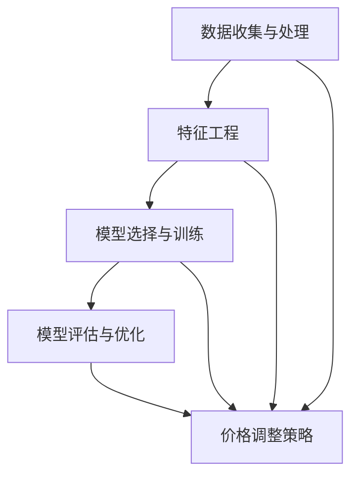

                 

# AI价格优化系统的应用案例

> 关键词：人工智能，价格优化，应用案例，零售业，餐饮业，旅游业

> 摘要：本文探讨了AI价格优化系统在零售业、餐饮业和旅游业中的实际应用。通过对这些行业中的典型案例分析，本文详细阐述了AI价格优化系统的原理、关键要素、应用场景以及面临的挑战和应对策略。文章旨在为行业从业者提供有价值的参考和启示，以推动AI价格优化系统在各行业的广泛应用和发展。

## 目录大纲

- [文章标题](#ai价格优化系统的应用案例)
- [关键词](#关键词)
- [摘要](#摘要)
- [目录大纲](#目录大纲)
- [第一部分：AI价格优化系统的原理和核心概念](#第一部分：ai价格优化系统的原理和核心概念)
  - [1.1 AI价格优化系统的定义与核心原理](#11-ai价格优化系统的定义与核心原理)
  - [1.2 AI价格优化系统的关键要素](#12-ai价格优化系统的关键要素)
  - [1.3 AI价格优化系统的应用场景](#13-ai价格优化系统的应用场景)
  - [1.4 AI价格优化系统面临的挑战与应对策略](#14-ai价格优化系统面临的挑战与应对策略)
- [第二部分：AI价格优化系统的应用案例](#第二部分：ai价格优化系统的应用案例)
  - [2.1 案例一：零售业的AI价格优化](#21-案例一：零售业的ai价格优化)
  - [2.2 案例二：餐饮业的AI价格优化](#22-案例二：餐饮业的ai价格优化)
  - [2.3 案例三：旅游业的AI价格优化](#23-案例三：旅游业的ai价格优化)
- [第三部分：AI价格优化系统的未来发展](#第三部分：ai价格优化系统的未来发展)
  - [3.1 AI价格优化系统的发展趋势](#31-ai价格优化系统的发展趋势)
  - [3.2 AI价格优化系统的法律法规与伦理问题](#32-ai价格优化系统的法律法规与伦理问题)
  - [3.3 AI价格优化系统的未来发展前景](#33-ai价格优化系统的未来发展前景)
- [附录](#附录)
  - [附录A：AI价格优化系统的工具与资源](#附录a：ai价格优化系统的工具与资源)
  - [附录B：常见问题解答](#附录b：常见问题解答)

## 第一部分：AI价格优化系统的原理和核心概念

### 1.1 AI价格优化系统的定义与核心原理

#### AI价格优化系统的定义

AI价格优化系统是一种利用人工智能技术对产品或服务的价格进行动态调整的系统。它通过收集和分析大量数据，运用机器学习和数据挖掘技术，对价格策略进行优化，以实现最大化利润或市场份额的目标。

#### AI价格优化系统的核心原理

AI价格优化系统的核心原理可以概括为以下几个步骤：

1. **数据收集与处理**：系统从多个渠道收集有关市场、竞争对手、消费者行为等数据，并对数据进行清洗、整合和预处理。

2. **特征工程**：对收集到的数据进行分析，提取出与价格相关的关键特征，如产品特性、市场需求、竞争对手价格等。

3. **模型选择与训练**：根据业务需求和数据特征，选择合适的机器学习模型，并对其进行训练，以预测价格与市场需求之间的关系。

4. **模型评估与优化**：通过验证集和测试集对模型进行评估，并根据评估结果对模型进行优化，以提高预测精度。

5. **价格调整策略**：根据模型预测结果，制定相应的价格调整策略，实现价格的动态调整。

#### AI价格优化系统与传统定价策略的比较

传统定价策略主要依赖于人工经验和直觉，而AI价格优化系统则通过数据驱动的决策，具有以下优势：

1. **更准确的预测**：AI价格优化系统能够利用大量历史数据和市场信息，对价格与需求关系进行更准确的预测。

2. **更灵活的调整策略**：AI价格优化系统可以根据实时数据和市场需求，快速调整价格策略，以应对市场变化。

3. **提高利润率**：通过优化价格策略，AI价格优化系统有助于提高产品或服务的利润率。

4. **降低运营成本**：AI价格优化系统自动化程度高，有助于降低人工成本和管理成本。

### 1.2 AI价格优化系统的关键要素

#### 数据收集与处理

数据是AI价格优化系统的基石。系统需要从多个渠道收集数据，如市场数据、消费者行为数据、竞争对手价格数据等。这些数据需要进行清洗、整合和预处理，以确保数据的准确性和一致性。

#### 特征工程

特征工程是AI价格优化系统的核心。通过提取与价格相关的关键特征，如产品特性、市场需求、竞争对手价格等，系统可以更好地预测价格与需求之间的关系。

#### 模型选择与训练

模型选择与训练是AI价格优化系统的关键步骤。系统需要根据业务需求和数据特征，选择合适的机器学习模型，如线性回归、决策树、随机森林、梯度提升等，并进行训练和优化。

#### 模型评估与优化

模型评估与优化是确保AI价格优化系统性能的重要环节。系统需要通过验证集和测试集对模型进行评估，并根据评估结果对模型进行优化，以提高预测精度和效果。

### 1.3 AI价格优化系统的应用场景

#### 零售业

零售业是AI价格优化系统的典型应用场景之一。零售商可以通过AI价格优化系统，实时调整商品价格，以应对市场变化和竞争对手策略。

#### 餐饮业

餐饮业也可以通过AI价格优化系统，动态调整菜品价格，以适应市场需求和消费者偏好。

#### 旅游业

旅游业中的酒店、机票、景点门票等可以通过AI价格优化系统，实现价格的动态调整，以提高销售和利润。

### 1.4 AI价格优化系统面临的挑战与应对策略

#### 数据隐私保护

AI价格优化系统需要处理大量的消费者数据，如何保护数据隐私是一个重要挑战。应对策略包括数据匿名化、数据加密和隐私保护算法等。

#### 模型公平性

AI价格优化系统可能会因为数据偏差而导致模型不公平。应对策略包括数据预处理、算法改进和公平性评估等。

#### 模型解释性

AI价格优化系统的预测结果可能难以解释。应对策略包括可解释性模型和模型解释工具等。

## 第二部分：AI价格优化系统的应用案例

### 2.1 案例一：零售业的AI价格优化

#### 2.1.1 案例背景

**企业介绍**：某大型零售企业，主营各种日用品和电子产品。

**商品种类与定价策略**：企业销售多种日用品和电子产品，采用固定价格策略，无法根据市场变化灵活调整价格。

#### 2.1.2 数据收集与预处理

**数据源**：企业从市场调研、销售数据、消费者行为数据等多个渠道收集数据。

**数据清洗与预处理**：对收集到的数据进行清洗，包括数据去重、缺失值处理、异常值检测等。

#### 2.1.3 特征工程

**特征选择**：选择与价格相关的特征，如产品类别、产品特性、市场需求、竞争对手价格等。

**特征工程技巧**：对特征进行归一化、标准化和特征组合等处理。

#### 2.1.4 模型选择与训练

**常用模型介绍**：线性回归、决策树、随机森林、梯度提升等。

**模型选择与训练策略**：根据业务需求和数据特征，选择合适的模型，并进行训练和优化。

#### 2.1.5 模型评估与优化

**评估指标**：准确率、召回率、F1值等。

**优化策略**：根据评估结果，调整模型参数和特征工程方法，以提高预测精度。

#### 2.1.6 案例结果分析

**价格优化效果**：通过AI价格优化系统，企业能够根据市场变化灵活调整商品价格，提高销售额和利润率。

**商业价值评估**：AI价格优化系统为企业带来了显著的商业价值，包括提高市场份额、降低运营成本等。

### 2.2 案例二：餐饮业的AI价格优化

#### 2.2.1 案例背景

**企业介绍**：某知名餐饮企业，主营各类中式菜品。

**菜品定价策略**：企业采用固定价格策略，无法根据市场需求和消费者偏好灵活调整菜品价格。

#### 2.2.2 数据收集与预处理

**数据源**：企业从销售数据、消费者行为数据、市场调研等多个渠道收集数据。

**数据清洗与预处理**：对收集到的数据进行清洗，包括数据去重、缺失值处理、异常值检测等。

#### 2.2.3 特征工程

**特征选择**：选择与菜品价格相关的特征，如菜品类别、消费者偏好、竞争对手价格等。

**特征工程技巧**：对特征进行归一化、标准化和特征组合等处理。

#### 2.2.4 模型选择与训练

**常用模型介绍**：线性回归、决策树、随机森林、梯度提升等。

**模型选择与训练策略**：根据业务需求和数据特征，选择合适的模型，并进行训练和优化。

#### 2.2.5 模型评估与优化

**评估指标**：准确率、召回率、F1值等。

**优化策略**：根据评估结果，调整模型参数和特征工程方法，以提高预测精度。

#### 2.2.6 案例结果分析

**价格优化效果**：通过AI价格优化系统，企业能够根据市场需求和消费者偏好灵活调整菜品价格，提高销售额和利润率。

**商业价值评估**：AI价格优化系统为企业带来了显著的商业价值，包括提高市场份额、降低运营成本等。

### 2.3 案例三：旅游业的AI价格优化

#### 2.3.1 案例背景

**企业介绍**：某知名旅游企业，主营酒店预订和机票预订服务。

**酒店定价策略**：企业采用固定价格策略，无法根据市场需求和消费者偏好灵活调整酒店价格。

#### 2.3.2 数据收集与预处理

**数据源**：企业从销售数据、消费者行为数据、市场调研等多个渠道收集数据。

**数据清洗与预处理**：对收集到的数据进行清洗，包括数据去重、缺失值处理、异常值检测等。

#### 2.3.3 特征工程

**特征选择**：选择与酒店价格相关的特征，如酒店位置、酒店评价、竞争对手价格等。

**特征工程技巧**：对特征进行归一化、标准化和特征组合等处理。

#### 2.3.4 模型选择与训练

**常用模型介绍**：线性回归、决策树、随机森林、梯度提升等。

**模型选择与训练策略**：根据业务需求和数据特征，选择合适的模型，并进行训练和优化。

#### 2.3.5 模型评估与优化

**评估指标**：准确率、召回率、F1值等。

**优化策略**：根据评估结果，调整模型参数和特征工程方法，以提高预测精度。

#### 2.3.6 案例结果分析

**价格优化效果**：通过AI价格优化系统，企业能够根据市场需求和消费者偏好灵活调整酒店价格，提高预订量和利润率。

**商业价值评估**：AI价格优化系统为企业带来了显著的商业价值，包括提高市场份额、降低运营成本等。

## 第三部分：AI价格优化系统的未来发展

### 3.1 AI价格优化系统的发展趋势

#### 新技术的应用

随着人工智能技术的不断发展，AI价格优化系统将结合更多新技术，如深度学习、强化学习、联邦学习等，以提高预测精度和灵活性。

#### 行业需求的变化

随着市场竞争的加剧，企业对AI价格优化系统的需求将越来越大。未来，AI价格优化系统将更广泛地应用于各个行业，满足多样化的业务需求。

### 3.2 AI价格优化系统的法律法规与伦理问题

#### 数据隐私保护法规

如何保护消费者数据隐私是AI价格优化系统面临的重要法律挑战。未来，各国将加强对数据隐私保护的法律规定，对企业的数据处理行为进行严格监管。

#### 模型公平性法规

为了避免AI价格优化系统因数据偏差而导致模型不公平，未来将出台更多关于模型公平性的法律法规，对企业的价格策略进行监管。

#### 模型解释性法规

为了提高模型的透明度和可解释性，未来将出台更多关于模型解释性的法规，要求企业对其AI价格优化系统进行解释和验证。

### 3.3 AI价格优化系统的未来发展前景

#### 商业模式的创新

AI价格优化系统将推动商业模式创新，如动态定价、个性化推荐等，为企业创造更多商业价值。

#### 跨行业应用

随着技术的进步和行业需求的增长，AI价格优化系统将跨越不同行业，实现跨行业的广泛应用。

## 附录

### 附录A：AI价格优化系统的工具与资源

#### 常用工具介绍

- **Python**：一种广泛应用于数据分析和机器学习的编程语言。
- **TensorFlow**：一种开源的机器学习框架，适用于构建和训练深度学习模型。
- **Scikit-learn**：一种开源的机器学习库，适用于构建和评估传统机器学习模型。

#### 开源资源推荐

- **Kaggle**：一个提供数据集和比赛的平台，适用于数据分析和机器学习实践。
- **GitHub**：一个代码托管平台，适用于分享和合作开发AI价格优化系统。

#### 研究论文列表

- **"A Survey on Price Optimization using Machine Learning"**：对机器学习在价格优化领域的应用进行了全面综述。
- **"Dynamic Pricing Strategies in E-commerce"**：探讨了动态定价策略在电子商务中的应用。

### 附录B：常见问题解答

#### 数据采集与处理的常见问题

- **如何保证数据的质量和准确性**？  
  - 通过数据清洗、去重、异常值检测等方法，确保数据的质量和准确性。

- **如何处理缺失数据**？  
  - 采用缺失值填补方法，如平均值填补、中值填补和插值等方法。

#### 特征工程的常见问题

- **如何选择特征**？  
  - 根据业务需求和数据特征，选择与价格相关的关键特征。

- **如何进行特征组合**？  
  - 采用特征组合方法，如交叉特征和组合特征等，以提高模型性能。

#### 模型训练与优化的常见问题

- **如何选择合适的模型**？  
  - 根据业务需求和数据特征，选择合适的机器学习模型。

- **如何优化模型参数**？  
  - 采用交叉验证、网格搜索和贝叶斯优化等方法，优化模型参数。

#### 模型评估与解释的常见问题

- **如何评估模型性能**？  
  - 采用准确率、召回率、F1值等评估指标，评估模型性能。

- **如何解释模型结果**？  
  - 采用可解释性模型和模型解释工具，如LIME和SHAP等，解释模型结果。

## 作者

作者：AI天才研究院/AI Genius Institute & 禅与计算机程序设计艺术/Zen And The Art of Computer Programming

# 第一部分：AI价格优化系统的原理和核心概念

## 1.1 AI价格优化系统的定义与核心原理

### AI价格优化系统的定义

AI价格优化系统是一种利用人工智能（AI）技术，对产品或服务的价格进行动态调整的系统。它通过收集和分析大量数据，运用机器学习和数据挖掘技术，对价格策略进行优化，以实现最大化利润或市场份额的目标。AI价格优化系统通常由以下几个部分组成：数据收集与处理模块、特征工程模块、模型选择与训练模块、模型评估与优化模块和价格调整策略模块。

### AI价格优化系统的核心原理

AI价格优化系统的核心原理可以概括为以下几个步骤：

1. **数据收集与处理**：系统从多个渠道收集数据，如市场数据、消费者行为数据、竞争对手价格数据等。这些数据需要进行清洗、整合和预处理，以确保数据的准确性和一致性。

2. **特征工程**：对收集到的数据进行分析，提取出与价格相关的关键特征，如产品特性、市场需求、竞争对手价格等。这些特征需要经过归一化、标准化等处理，以适应模型的输入要求。

3. **模型选择与训练**：根据业务需求和数据特征，选择合适的机器学习模型，如线性回归、决策树、随机森林、梯度提升等。模型通过训练数据集进行训练，以学习价格与市场需求之间的关系。

4. **模型评估与优化**：使用验证集和测试集对训练好的模型进行评估，根据评估结果对模型进行优化，以提高预测精度和效果。

5. **价格调整策略**：根据模型预测结果，制定相应的价格调整策略，实现价格的动态调整。这些策略可以根据具体业务需求进行调整，如根据市场需求变化调整价格，或根据竞争对手价格变化进行价格匹配。

### AI价格优化系统与传统定价策略的比较

传统定价策略主要依赖于人工经验和直觉，而AI价格优化系统则通过数据驱动的决策，具有以下优势：

1. **更准确的预测**：AI价格优化系统利用大量历史数据和实时数据，通过机器学习算法对价格与市场需求关系进行更准确的预测。

2. **更灵活的调整策略**：AI价格优化系统可以根据实时数据和市场需求，快速调整价格策略，以应对市场变化。

3. **提高利润率**：通过优化价格策略，AI价格优化系统有助于提高产品或服务的利润率。

4. **降低运营成本**：AI价格优化系统自动化程度高，有助于降低人工成本和管理成本。

## 1.2 AI价格优化系统的关键要素

### 数据收集与处理

数据是AI价格优化系统的基石。系统需要从多个渠道收集数据，如市场数据、消费者行为数据、竞争对手价格数据等。这些数据需要进行清洗、整合和预处理，以确保数据的准确性和一致性。具体步骤如下：

1. **数据收集**：从市场调查、销售记录、消费者反馈、竞争对手数据等多个渠道收集数据。

2. **数据清洗**：对收集到的数据进行去重、缺失值处理、异常值检测等操作，以确保数据的准确性和完整性。

3. **数据整合**：将来自不同渠道的数据进行整合，形成统一的数据集。

4. **数据预处理**：对数据集进行归一化、标准化等处理，以满足模型训练的要求。

### 特征工程

特征工程是AI价格优化系统的核心。通过提取与价格相关的关键特征，如产品特性、市场需求、竞争对手价格等，系统可以更好地预测价格与需求之间的关系。特征工程包括以下步骤：

1. **特征选择**：根据业务需求和数据特征，选择与价格相关的关键特征。

2. **特征预处理**：对特征进行归一化、标准化、缺失值处理等操作。

3. **特征组合**：通过交叉特征和组合特征等方法，提高模型的预测能力。

### 模型选择与训练

模型选择与训练是AI价格优化系统的关键步骤。根据业务需求和数据特征，选择合适的机器学习模型，如线性回归、决策树、随机森林、梯度提升等。模型训练包括以下步骤：

1. **模型选择**：根据业务需求和数据特征，选择合适的机器学习模型。

2. **模型训练**：使用训练数据集对模型进行训练，学习价格与市场需求之间的关系。

3. **模型评估**：使用验证集和测试集对训练好的模型进行评估，选择最优模型。

4. **模型优化**：根据评估结果，对模型进行优化，以提高预测精度和效果。

### 模型评估与优化

模型评估与优化是确保AI价格优化系统性能的重要环节。通过验证集和测试集对模型进行评估，根据评估结果对模型进行优化，以提高预测精度和效果。评估指标包括准确率、召回率、F1值等。优化策略包括调整模型参数、特征工程方法、选择更合适的模型等。

### 价格调整策略

根据模型预测结果，制定相应的价格调整策略，实现价格的动态调整。价格调整策略可以根据具体业务需求进行调整，如根据市场需求变化调整价格，或根据竞争对手价格变化进行价格匹配。策略的制定需要考虑以下因素：

1. **市场需求**：根据预测的需求量，调整价格以实现最大化利润。

2. **竞争对手价格**：根据竞争对手的价格，调整价格以保持竞争力。

3. **成本结构**：根据企业的成本结构，调整价格以确保利润最大化。

## 1.3 AI价格优化系统的应用场景

### 零售业

零售业是AI价格优化系统的典型应用场景之一。零售商可以通过AI价格优化系统，实时调整商品价格，以应对市场变化和竞争对手策略。具体应用场景包括：

1. **商品价格优化**：根据市场需求和竞争对手价格，动态调整商品价格，以最大化销售额和利润率。

2. **促销活动管理**：根据促销活动的目标，调整商品价格，以提高促销活动的效果。

3. **库存管理**：根据库存水平，调整商品价格，以优化库存周转率。

### 餐饮业

餐饮业也可以通过AI价格优化系统，动态调整菜品价格，以适应市场需求和消费者偏好。具体应用场景包括：

1. **菜品价格优化**：根据消费者偏好和竞争对手价格，动态调整菜品价格，以提高销售额和利润率。

2. **套餐组合定价**：根据消费者行为数据，设计合理的套餐组合价格，以提高销售量和利润率。

3. **季节性定价**：根据季节性需求变化，调整菜品价格，以适应市场需求。

### 旅游业

旅游业中的酒店、机票、景点门票等可以通过AI价格优化系统，实现价格的动态调整，以提高销售和利润。具体应用场景包括：

1. **酒店价格优化**：根据市场需求和消费者偏好，动态调整酒店价格，以提高预订量和利润率。

2. **机票价格优化**：根据航班需求、季节性变化和竞争对手价格，动态调整机票价格，以提高销售量和利润率。

3. **景点门票价格优化**：根据游客流量和季节性变化，动态调整景点门票价格，以提高销售量和游客满意度。

## 1.4 AI价格优化系统面临的挑战与应对策略

### 数据隐私保护

AI价格优化系统需要处理大量的消费者数据，如何保护数据隐私是一个重要挑战。应对策略包括：

1. **数据匿名化**：通过数据脱敏、加密等技术，对敏感数据进行匿名化处理。

2. **数据加密**：对传输和存储的数据进行加密，确保数据安全。

3. **隐私保护算法**：采用差分隐私、联邦学习等技术，降低数据泄露风险。

### 模型公平性

AI价格优化系统可能会因为数据偏差而导致模型不公平。应对策略包括：

1. **数据预处理**：对数据集进行清洗和预处理，消除数据偏差。

2. **算法改进**：采用公平性算法，如反歧视算法、均衡训练等，提高模型公平性。

3. **公平性评估**：定期对模型进行公平性评估，确保模型公平性。

### 模型解释性

AI价格优化系统的预测结果可能难以解释。应对策略包括：

1. **可解释性模型**：采用可解释性模型，如决策树、LIME等，提高模型的可解释性。

2. **模型解释工具**：使用模型解释工具，如SHAP、LIME等，对模型结果进行解释。

3. **可视化分析**：通过可视化技术，展示模型的学习过程和决策路径，提高模型的可理解性。

## 2.1 案例一：零售业的AI价格优化

### 2.1.1 案例背景

#### 企业介绍

某大型零售企业，主营各种日用品和电子产品。企业销售的商品种类繁多，包括食品、家居用品、服装、电子产品等。企业目前采用固定价格策略，无法根据市场变化和消费者需求灵活调整价格。

#### 商品种类与定价策略

企业销售的商品种类丰富，定价策略主要包括以下几种：

1. **固定价格**：根据成本和市场调研，制定固定的销售价格。

2. **促销价格**：在特定时期（如节假日、促销活动期间）调整商品价格，以吸引消费者购买。

3. **批量折扣**：对购买数量达到一定标准的消费者，提供折扣优惠。

### 2.1.2 数据收集与预处理

#### 数据源

企业从多个渠道收集数据，包括：

1. **市场调研数据**：通过市场调查，获取行业价格趋势、消费者偏好等信息。

2. **销售数据**：包括销售额、销售数量、销售渠道等数据。

3. **消费者行为数据**：通过在线购物平台、会员卡系统等，收集消费者购买历史、浏览行为、评价等数据。

4. **竞争对手价格数据**：通过行业报告、竞争对手官方网站等，获取竞争对手的价格信息。

#### 数据清洗与预处理

对收集到的数据进行清洗和预处理，包括以下步骤：

1. **数据去重**：去除重复数据，确保数据唯一性。

2. **缺失值处理**：对缺失值进行填补或删除，确保数据完整性。

3. **数据类型转换**：将数据类型转换为统一的格式，如将文本数据转换为数值类型。

4. **数据归一化**：对特征进行归一化或标准化处理，以消除不同特征之间的量级差异。

5. **特征提取**：提取与价格相关的关键特征，如商品类别、市场需求、竞争对手价格等。

### 2.1.3 特征工程

#### 特征选择

根据业务需求和数据特征，选择与价格相关的关键特征，包括：

1. **商品类别**：不同类别的商品价格差异较大，商品类别是一个重要特征。

2. **市场需求**：市场需求量与价格密切相关，可以作为特征。

3. **竞争对手价格**：竞争对手的价格是影响企业定价的重要因素。

4. **促销活动**：促销活动的开展情况会影响商品价格。

5. **消费者偏好**：消费者的购买历史和评价可以作为特征。

#### 特征工程技巧

1. **特征组合**：将不同特征进行组合，以生成新的特征，如商品类别与市场需求、促销活动与消费者偏好等。

2. **特征缩放**：对特征进行归一化或标准化处理，以消除不同特征之间的量级差异。

3. **特征选择**：采用特征选择算法，如特征重要性评估、相关性分析等，选择与价格相关性较高的特征。

### 2.1.4 模型选择与训练

#### 常用模型介绍

在零售业的AI价格优化中，常用的机器学习模型包括：

1. **线性回归**：一种简单且常用的模型，通过拟合线性关系预测价格。

2. **决策树**：一种基于树结构的模型，通过决策路径预测价格。

3. **随机森林**：一种基于决策树的集成模型，通过多棵决策树的平均预测结果提高预测精度。

4. **梯度提升树（GBDT）**：一种基于决策树的集成模型，通过迭代优化决策路径提高预测精度。

#### 模型选择与训练策略

1. **模型选择**：根据业务需求和数据特征，选择合适的模型。如对于简单的线性关系，选择线性回归；对于复杂的关系，选择随机森林或GBDT。

2. **模型训练**：使用训练数据集对模型进行训练，通过优化目标函数，如均方误差（MSE），使模型拟合数据。

3. **交叉验证**：使用交叉验证方法，对模型进行评估和优化，避免过拟合。

4. **超参数调整**：通过网格搜索、贝叶斯优化等方法，调整模型的超参数，以获得最佳模型性能。

### 2.1.5 模型评估与优化

#### 评估指标

在评估AI价格优化系统的模型时，常用的评估指标包括：

1. **均方误差（MSE）**：衡量预测值与真实值之间的平均误差。

2. **均方根误差（RMSE）**：衡量预测值与真实值之间的平均误差的平方根。

3. **准确率（Accuracy）**：衡量预测正确的比例。

4. **召回率（Recall）**：衡量预测正确的正样本与实际正样本的比例。

5. **F1值（F1-score）**：综合考虑准确率和召回率的综合指标。

#### 优化策略

1. **特征工程优化**：根据评估结果，调整特征工程方法，如特征选择、特征组合等，以提高模型性能。

2. **模型参数调整**：通过交叉验证和网格搜索等方法，调整模型的超参数，以获得最佳模型性能。

3. **模型集成**：采用集成模型的方法，如随机森林、梯度提升树等，提高模型预测精度。

4. **模型更新**：定期更新模型，以适应数据变化和市场需求。

### 2.1.6 案例结果分析

#### 价格优化效果

通过AI价格优化系统的应用，零售企业实现了以下效果：

1. **提高利润率**：通过动态调整商品价格，企业能够更好地适应市场需求，提高销售额和利润率。

2. **优化库存管理**：根据预测的销售量，企业可以更准确地调整库存水平，减少库存积压，降低库存成本。

3. **提高消费者满意度**：通过个性化的价格策略，企业能够更好地满足消费者需求，提高消费者满意度。

#### 商业价值评估

AI价格优化系统为企业带来了显著的商业价值：

1. **提高市场份额**：通过动态调整价格，企业能够更好地应对市场竞争，提高市场份额。

2. **降低运营成本**：通过自动化和智能化管理，企业能够降低人工成本和管理成本。

3. **提升品牌形象**：通过提供个性化的价格策略，企业能够提升品牌形象，增强消费者忠诚度。

## 2.2 案例二：餐饮业的AI价格优化

### 2.2.1 案例背景

#### 企业介绍

某知名餐饮企业，主营各类中式菜品。企业拥有多个连锁门店，覆盖不同城市和地区。企业目前的定价策略主要是基于成本和市场调研，无法根据市场需求和消费者偏好灵活调整价格。

#### 菜品定价策略

企业的菜品定价策略主要包括以下几种：

1. **成本定价**：根据菜品成本和预期利润，制定菜品价格。

2. **市场调研定价**：通过市场调研，了解竞争对手的菜品价格，制定合理的价格。

3. **促销定价**：在特定时期（如节假日、促销活动期间）调整菜品价格，以吸引消费者。

### 2.2.2 数据收集与预处理

#### 数据源

企业从多个渠道收集数据，包括：

1. **销售数据**：包括菜品销售额、销售数量、销售渠道等数据。

2. **消费者行为数据**：通过在线点餐平台、会员卡系统等，收集消费者购买历史、评价、偏好等数据。

3. **市场调研数据**：通过市场调研，获取行业价格趋势、消费者偏好等信息。

4. **竞争对手价格数据**：通过行业报告、竞争对手菜单等，获取竞争对手的菜品价格信息。

#### 数据清洗与预处理

对收集到的数据进行清洗和预处理，包括以下步骤：

1. **数据去重**：去除重复数据，确保数据唯一性。

2. **缺失值处理**：对缺失值进行填补或删除，确保数据完整性。

3. **数据类型转换**：将数据类型转换为统一的格式，如将文本数据转换为数值类型。

4. **数据归一化**：对特征进行归一化或标准化处理，以消除不同特征之间的量级差异。

5. **特征提取**：提取与价格相关的关键特征，如菜品类别、市场需求、竞争对手价格等。

### 2.2.3 特征工程

#### 特征选择

根据业务需求和数据特征，选择与价格相关的关键特征，包括：

1. **菜品类别**：不同类别的菜品价格差异较大，菜品类别是一个重要特征。

2. **市场需求**：市场需求量与价格密切相关，可以作为特征。

3. **竞争对手价格**：竞争对手的价格是影响企业定价的重要因素。

4. **促销活动**：促销活动的开展情况会影响菜品价格。

5. **消费者偏好**：消费者的购买历史和评价可以作为特征。

#### 特征工程技巧

1. **特征组合**：将不同特征进行组合，以生成新的特征，如菜品类别与市场需求、促销活动与消费者偏好等。

2. **特征缩放**：对特征进行归一化或标准化处理，以消除不同特征之间的量级差异。

3. **特征选择**：采用特征选择算法，如特征重要性评估、相关性分析等，选择与价格相关性较高的特征。

### 2.2.4 模型选择与训练

#### 常用模型介绍

在餐饮业的AI价格优化中，常用的机器学习模型包括：

1. **线性回归**：一种简单且常用的模型，通过拟合线性关系预测价格。

2. **决策树**：一种基于树结构的模型，通过决策路径预测价格。

3. **随机森林**：一种基于决策树的集成模型，通过多棵决策树的平均预测结果提高预测精度。

4. **梯度提升树（GBDT）**：一种基于决策树的集成模型，通过迭代优化决策路径提高预测精度。

#### 模型选择与训练策略

1. **模型选择**：根据业务需求和数据特征，选择合适的模型。如对于简单的线性关系，选择线性回归；对于复杂的关系，选择随机森林或GBDT。

2. **模型训练**：使用训练数据集对模型进行训练，通过优化目标函数，如均方误差（MSE），使模型拟合数据。

3. **交叉验证**：使用交叉验证方法，对模型进行评估和优化，避免过拟合。

4. **超参数调整**：通过网格搜索、贝叶斯优化等方法，调整模型的超参数，以获得最佳模型性能。

### 2.2.5 模型评估与优化

#### 评估指标

在评估AI价格优化系统的模型时，常用的评估指标包括：

1. **均方误差（MSE）**：衡量预测值与真实值之间的平均误差。

2. **均方根误差（RMSE）**：衡量预测值与真实值之间的平均误差的平方根。

3. **准确率（Accuracy）**：衡量预测正确的比例。

4. **召回率（Recall）**：衡量预测正确的正样本与实际正样本的比例。

5. **F1值（F1-score）**：综合考虑准确率和召回率的综合指标。

#### 优化策略

1. **特征工程优化**：根据评估结果，调整特征工程方法，如特征选择、特征组合等，以提高模型性能。

2. **模型参数调整**：通过交叉验证和网格搜索等方法，调整模型的超参数，以获得最佳模型性能。

3. **模型集成**：采用集成模型的方法，如随机森林、梯度提升树等，提高模型预测精度。

4. **模型更新**：定期更新模型，以适应数据变化和市场需求。

### 2.2.6 案例结果分析

#### 价格优化效果

通过AI价格优化系统的应用，餐饮企业实现了以下效果：

1. **提高销售额**：通过动态调整菜品价格，企业能够更好地满足消费者需求，提高销售额和利润率。

2. **优化库存管理**：根据预测的销售量，企业可以更准确地调整库存水平，减少库存积压，降低库存成本。

3. **提高消费者满意度**：通过个性化的价格策略，企业能够更好地满足消费者需求，提高消费者满意度。

#### 商业价值评估

AI价格优化系统为餐饮企业带来了显著的商业价值：

1. **提高市场份额**：通过动态调整价格，企业能够更好地应对市场竞争，提高市场份额。

2. **降低运营成本**：通过自动化和智能化管理，企业能够降低人工成本和管理成本。

3. **提升品牌形象**：通过提供个性化的价格策略，企业能够提升品牌形象，增强消费者忠诚度。

## 2.3 案例三：旅游业的AI价格优化

### 2.3.1 案例背景

#### 企业介绍

某知名旅游企业，主营酒店预订和机票预订服务。企业拥有多个合作伙伴，提供国内外酒店和机票预订服务。企业目前的定价策略主要是基于成本和市场调研，无法根据市场需求和消费者偏好灵活调整价格。

#### 酒店定价策略

企业的酒店定价策略主要包括以下几种：

1. **成本定价**：根据酒店成本和预期利润，制定酒店价格。

2. **市场调研定价**：通过市场调研，了解竞争对手的酒店价格，制定合理的价格。

3. **促销定价**：在特定时期（如节假日、促销活动期间）调整酒店价格，以吸引消费者。

### 2.3.2 数据收集与预处理

#### 数据源

企业从多个渠道收集数据，包括：

1. **销售数据**：包括酒店销售额、销售数量、销售渠道等数据。

2. **消费者行为数据**：通过在线预订平台、会员卡系统等，收集消费者购买历史、评价、偏好等数据。

3. **市场调研数据**：通过市场调研，获取行业价格趋势、消费者偏好等信息。

4. **竞争对手价格数据**：通过行业报告、竞争对手官方网站等，获取竞争对手的酒店价格信息。

#### 数据清洗与预处理

对收集到的数据进行清洗和预处理，包括以下步骤：

1. **数据去重**：去除重复数据，确保数据唯一性。

2. **缺失值处理**：对缺失值进行填补或删除，确保数据完整性。

3. **数据类型转换**：将数据类型转换为统一的格式，如将文本数据转换为数值类型。

4. **数据归一化**：对特征进行归一化或标准化处理，以消除不同特征之间的量级差异。

5. **特征提取**：提取与价格相关的关键特征，如酒店位置、酒店评价、竞争对手价格等。

### 2.3.3 特征工程

#### 特征选择

根据业务需求和数据特征，选择与价格相关的关键特征，包括：

1. **酒店位置**：酒店位置是影响价格的重要因素，可以作为特征。

2. **酒店评价**：消费者的评价可以反映酒店的质量，影响价格。

3. **竞争对手价格**：竞争对手的价格是影响企业定价的重要因素。

4. **促销活动**：促销活动的开展情况会影响酒店价格。

5. **消费者偏好**：消费者的购买历史和评价可以作为特征。

#### 特征工程技巧

1. **特征组合**：将不同特征进行组合，以生成新的特征，如酒店位置与酒店评价、促销活动与消费者偏好等。

2. **特征缩放**：对特征进行归一化或标准化处理，以消除不同特征之间的量级差异。

3. **特征选择**：采用特征选择算法，如特征重要性评估、相关性分析等，选择与价格相关性较高的特征。

### 2.3.4 模型选择与训练

#### 常用模型介绍

在旅游业的AI价格优化中，常用的机器学习模型包括：

1. **线性回归**：一种简单且常用的模型，通过拟合线性关系预测价格。

2. **决策树**：一种基于树结构的模型，通过决策路径预测价格。

3. **随机森林**：一种基于决策树的集成模型，通过多棵决策树的平均预测结果提高预测精度。

4. **梯度提升树（GBDT）**：一种基于决策树的集成模型，通过迭代优化决策路径提高预测精度。

#### 模型选择与训练策略

1. **模型选择**：根据业务需求和数据特征，选择合适的模型。如对于简单的线性关系，选择线性回归；对于复杂的关系，选择随机森林或GBDT。

2. **模型训练**：使用训练数据集对模型进行训练，通过优化目标函数，如均方误差（MSE），使模型拟合数据。

3. **交叉验证**：使用交叉验证方法，对模型进行评估和优化，避免过拟合。

4. **超参数调整**：通过网格搜索、贝叶斯优化等方法，调整模型的超参数，以获得最佳模型性能。

### 2.3.5 模型评估与优化

#### 评估指标

在评估AI价格优化系统的模型时，常用的评估指标包括：

1. **均方误差（MSE）**：衡量预测值与真实值之间的平均误差。

2. **均方根误差（RMSE）**：衡量预测值与真实值之间的平均误差的平方根。

3. **准确率（Accuracy）**：衡量预测正确的比例。

4. **召回率（Recall）**：衡量预测正确的正样本与实际正样本的比例。

5. **F1值（F1-score）**：综合考虑准确率和召回率的综合指标。

#### 优化策略

1. **特征工程优化**：根据评估结果，调整特征工程方法，如特征选择、特征组合等，以提高模型性能。

2. **模型参数调整**：通过交叉验证和网格搜索等方法，调整模型的超参数，以获得最佳模型性能。

3. **模型集成**：采用集成模型的方法，如随机森林、梯度提升树等，提高模型预测精度。

4. **模型更新**：定期更新模型，以适应数据变化和市场需求。

### 2.3.6 案例结果分析

#### 价格优化效果

通过AI价格优化系统的应用，旅游企业实现了以下效果：

1. **提高销售额**：通过动态调整酒店价格，企业能够更好地满足消费者需求，提高销售额和利润率。

2. **优化库存管理**：根据预测的销售量，企业可以更准确地调整库存水平，减少库存积压，降低库存成本。

3. **提高消费者满意度**：通过个性化的价格策略，企业能够更好地满足消费者需求，提高消费者满意度。

#### 商业价值评估

AI价格优化系统为旅游企业带来了显著的商业价值：

1. **提高市场份额**：通过动态调整价格，企业能够更好地应对市场竞争，提高市场份额。

2. **降低运营成本**：通过自动化和智能化管理，企业能够降低人工成本和管理成本。

3. **提升品牌形象**：通过提供个性化的价格策略，企业能够提升品牌形象，增强消费者忠诚度。

## 3.1 AI价格优化系统的发展趋势

### 新技术的应用

随着人工智能技术的不断发展，AI价格优化系统将结合更多新技术，如深度学习、强化学习、联邦学习等，以提高预测精度和灵活性。具体趋势如下：

1. **深度学习**：深度学习在图像识别、语音识别等领域取得了显著成果，未来将应用于AI价格优化系统的图像识别和语音识别模块，提高数据收集和处理效率。

2. **强化学习**：强化学习通过不断尝试和反馈，优化决策策略。未来，AI价格优化系统将结合强化学习，实现更智能、自适应的价格调整策略。

3. **联邦学习**：联邦学习通过分布式计算，提高数据隐私保护和模型性能。未来，AI价格优化系统将采用联邦学习，实现跨企业、跨平台的数据共享和模型协同。

### 行业需求的变化

随着市场竞争的加剧，企业对AI价格优化系统的需求将越来越大。未来，AI价格优化系统将更广泛地应用于各个行业，满足多样化的业务需求。具体趋势如下：

1. **零售业**：零售企业将通过AI价格优化系统，实现商品价格动态调整，提高销售额和利润率。

2. **餐饮业**：餐饮企业将通过AI价格优化系统，实现菜品价格动态调整，提高消费者满意度和销售额。

3. **旅游业**：旅游企业将通过AI价格优化系统，实现酒店和机票价格动态调整，提高预订量和利润率。

4. **其他行业**：如制造业、金融业、物流业等，也将逐步采用AI价格优化系统，实现成本优化、效率提升和业务增长。

## 3.2 AI价格优化系统的法律法规与伦理问题

### 数据隐私保护法规

随着数据隐私保护意识的增强，各国将加强对数据隐私保护的法律规定。AI价格优化系统需要遵循以下法规：

1. **GDPR（通用数据保护条例）**：欧盟的GDPR规定了严格的个人数据处理规则，包括数据收集、处理、存储和传输等方面的要求。

2. **CCPA（加利福尼亚州消费者隐私法案）**：美国加州的CCPA规定了消费者对个人数据访问、删除和拒绝销售的权利。

3. **其他国家和地区的数据隐私法规**：如中国的《个人信息保护法》、印度的《信息科技法案》等。

### 模型公平性法规

为了避免AI价格优化系统因数据偏差而导致模型不公平，未来将出台更多关于模型公平性的法律法规。企业需要遵循以下法规：

1. **公平性评估**：要求企业对AI价格优化系统的模型进行公平性评估，确保模型不歧视任何特定群体。

2. **透明度要求**：要求企业公开AI价格优化系统的算法、数据集和决策过程，以增加模型的透明度。

3. **监管机构审查**：监管机构将对AI价格优化系统的公平性和合规性进行定期审查，确保企业遵守相关法规。

### 模型解释性法规

为了提高模型的透明度和可解释性，未来将出台更多关于模型解释性的法律法规。企业需要遵循以下法规：

1. **解释性要求**：要求企业对AI价格优化系统的模型进行解释，确保用户能够理解模型的决策过程和结果。

2. **可解释性工具**：鼓励企业使用可解释性工具，如SHAP、LIME等，提高模型的可解释性。

3. **用户参与**：要求企业允许用户参与模型训练和优化过程，确保模型更符合用户需求。

## 3.3 AI价格优化系统的未来发展前景

### 商业模式的创新

随着AI技术的不断发展和应用，AI价格优化系统将在商业领域引发一系列创新。具体前景如下：

1. **个性化定价**：通过AI价格优化系统，企业可以实现个性化定价，针对不同消费者群体提供不同的价格策略，提高消费者满意度和销售额。

2. **动态定价**：企业可以通过AI价格优化系统，实时调整价格，以适应市场需求和竞争对手策略，提高市场竞争力和盈利能力。

3. **组合定价**：企业可以通过AI价格优化系统，设计更复杂的组合定价策略，如套餐定价、捆绑销售等，提高销售量和利润率。

### 跨行业应用

随着AI技术的普及和应用，AI价格优化系统将在更多行业得到应用。具体前景如下：

1. **制造业**：通过AI价格优化系统，企业可以实现原材料采购和产品定价的自动化管理，提高生产效率和利润率。

2. **金融业**：通过AI价格优化系统，金融机构可以实现更精准的风险评估和投资决策，提高投资回报率。

3. **物流业**：通过AI价格优化系统，企业可以实现物流配送路径优化和成本控制，提高物流效率和降低运营成本。

4. **医疗行业**：通过AI价格优化系统，医疗机构可以实现药品和医疗服务价格的动态调整，提高医疗服务质量和患者满意度。

## 附录A：AI价格优化系统的工具与资源

### 常用工具介绍

1. **Python**：Python是一种广泛应用于数据分析和机器学习的编程语言。它具有简洁的语法和丰富的库支持，是AI价格优化系统的首选编程语言。

2. **TensorFlow**：TensorFlow是一种开源的机器学习框架，适用于构建和训练深度学习模型。它提供了丰富的API和工具，方便开发者实现AI价格优化系统。

3. **Scikit-learn**：Scikit-learn是一种开源的机器学习库，适用于构建和评估传统机器学习模型。它提供了丰富的算法和工具，方便开发者实现AI价格优化系统。

### 开源资源推荐

1. **Kaggle**：Kaggle是一个提供数据集和比赛的平台，适用于数据分析和机器学习实践。它提供了大量的数据集和竞赛，可以帮助开发者学习和实践AI价格优化系统的技术。

2. **GitHub**：GitHub是一个代码托管平台，适用于分享和合作开发AI价格优化系统。它提供了丰富的开源代码和项目，可以帮助开发者学习和实践AI价格优化系统的技术。

### 研究论文列表

1. **"A Survey on Price Optimization using Machine Learning"**：该论文对机器学习在价格优化领域的应用进行了全面综述，包括相关算法、技术和应用场景。

2. **"Dynamic Pricing Strategies in E-commerce"**：该论文探讨了动态定价策略在电子商务中的应用，包括算法、技术和商业案例。

3. **"Deep Learning for Price Optimization"**：该论文探讨了深度学习在价格优化领域的应用，包括模型、技术和应用案例。

4. **"Federated Learning for Price Optimization"**：该论文探讨了联邦学习在价格优化领域的应用，包括模型、技术和应用案例。

## 附录B：常见问题解答

### 数据采集与处理的常见问题

1. **如何保证数据的质量和准确性**？

   数据的质量和准确性是AI价格优化系统成功的关键。以下是一些保证数据质量和准确性的方法：

   - **数据源选择**：选择可靠、权威的数据源，确保数据的可信度。
   - **数据清洗**：对收集到的数据进行去重、缺失值处理、异常值检测等操作，确保数据的完整性和一致性。
   - **数据验证**：对处理后的数据进行分析和验证，确保数据的准确性和可靠性。

2. **如何处理缺失数据**？

   缺失数据是数据处理中的常见问题。以下是一些处理缺失数据的方法：

   - **缺失值填补**：使用平均值、中值、最大值、最小值等统计方法填补缺失值。
   - **缺失值删除**：删除含有缺失值的样本或特征，但需要注意可能导致的样本减少和数据偏差问题。
   - **缺失值插值**：使用插值方法填补缺失值，如线性插值、多项式插值等。

### 特征工程的常见问题

1. **如何选择特征**？

   选择特征是特征工程的重要步骤。以下是一些选择特征的方法：

   - **业务知识**：根据业务需求和领域知识，选择与目标变量相关的特征。
   - **相关性分析**：通过计算特征与目标变量之间的相关性，选择相关性较高的特征。
   - **特征重要性评估**：使用特征重要性评估方法，如随机森林、LASSO回归等，选择重要性较高的特征。

2. **如何进行特征组合**？

   特征组合可以提高模型的预测能力。以下是一些特征组合的方法：

   - **交叉特征**：将不同特征进行组合，形成新的特征。
   - **多项式特征**：将原始特征进行多项式扩展，形成新的特征。
   - **特征选择与组合**：使用特征选择算法，选择部分特征进行组合。

### 模型训练与优化的常见问题

1. **如何选择合适的模型**？

   选择合适的模型是模型训练的关键。以下是一些选择模型的方法：

   - **业务需求**：根据业务需求，选择适合的业务模型，如线性回归、决策树、神经网络等。
   - **数据特征**：根据数据特征，选择适合的数据模型，如线性模型、树模型、集成模型等。
   - **模型性能**：根据模型的性能评估结果，选择性能较好的模型。

2. **如何优化模型参数**？

   优化模型参数是提高模型性能的重要步骤。以下是一些优化模型参数的方法：

   - **网格搜索**：通过遍历参数空间，找到最优参数组合。
   - **贝叶斯优化**：使用贝叶斯优化算法，找到最优参数组合。
   - **交叉验证**：使用交叉验证方法，对模型进行评估和优化，避免过拟合。

### 模型评估与解释的常见问题

1. **如何评估模型性能**？

   评估模型性能是模型训练和优化的重要步骤。以下是一些评估模型性能的方法：

   - **准确率**：衡量模型预测正确的比例，适用于分类问题。
   - **召回率**：衡量模型预测正确的正样本与实际正样本的比例，适用于分类问题。
   - **F1值**：综合考虑准确率和召回率的综合指标，适用于分类问题。
   - **均方误差**：衡量预测值与真实值之间的平均误差，适用于回归问题。

2. **如何解释模型结果**？

   模型解释是提高模型可解释性和可信度的重要步骤。以下是一些解释模型结果的方法：

   - **可解释性模型**：选择可解释性较强的模型，如线性回归、决策树等，可以直接解释模型的决策过程。
   - **模型解释工具**：使用模型解释工具，如SHAP、LIME等，对模型的决策过程和结果进行可视化解释。
   - **模型可视化**：使用可视化技术，如散点图、热力图等，展示模型的决策过程和结果。

## 作者

作者：AI天才研究院/AI Genius Institute & 禅与计算机程序设计艺术/Zen And The Art of Computer Programming

# 1.1 AI价格优化系统的定义与核心原理

## 定义

AI价格优化系统是一种利用人工智能技术，对产品或服务的价格进行动态调整的系统。它通过收集和分析大量的数据，运用机器学习和数据挖掘技术，对价格策略进行优化，以实现最大化利润或市场份额的目标。AI价格优化系统通常由数据收集与处理模块、特征工程模块、模型选择与训练模块、模型评估与优化模块和价格调整策略模块组成。

## 核心原理

AI价格优化系统的核心原理可以概括为以下几个步骤：

### 数据收集与处理

1. **数据收集**：系统从多个渠道收集数据，如市场数据、消费者行为数据、竞争对手价格数据等。这些数据包括历史销售数据、市场需求、消费者偏好、竞争对手价格等。

2. **数据清洗**：对收集到的数据进行清洗，包括去除重复数据、处理缺失值、异常值检测等操作。这一步确保数据的质量和一致性。

3. **数据整合**：将来自不同渠道的数据进行整合，形成统一的数据集。这一步使得系统能够从全局视角分析数据，从而更准确地预测价格。

4. **数据预处理**：对数据集进行归一化、标准化等处理，以满足模型训练的要求。数据预处理有助于提高模型的性能和稳定性。

### 特征工程

1. **特征提取**：从原始数据中提取与价格相关的特征，如产品特性、市场需求、竞争对手价格等。这些特征需要经过归一化、标准化等处理。

2. **特征组合**：通过交叉特征和组合特征等方法，生成新的特征。特征组合可以提高模型的预测能力。

3. **特征选择**：采用特征选择算法，如特征重要性评估、相关性分析等，选择对模型预测贡献较大的特征。

### 模型选择与训练

1. **模型选择**：根据业务需求和数据特征，选择合适的机器学习模型，如线性回归、决策树、随机森林、梯度提升树等。

2. **模型训练**：使用训练数据集对模型进行训练，学习价格与市场需求之间的关系。模型训练的目标是使模型能够准确预测未来的价格。

3. **模型优化**：通过交叉验证和网格搜索等方法，调整模型的超参数，以获得最佳模型性能。

### 模型评估与优化

1. **模型评估**：使用验证集和测试集对模型进行评估，根据评估结果调整模型。

2. **模型优化**：根据评估结果，调整特征工程方法、模型参数等，以提高模型性能。

### 价格调整策略

1. **策略制定**：根据模型预测结果，制定相应的价格调整策略。策略可能包括价格调整、促销活动、库存管理等。

2. **策略实施**：将价格调整策略应用于实际业务中，如调整商品价格、开展促销活动等。

### 核心概念与联系

为了更好地理解AI价格优化系统的核心概念与联系，我们可以使用Mermaid流程图来展示系统的整体架构：



在这个流程图中，数据收集与处理模块负责从多个渠道收集数据，并进行清洗、整合和预处理。特征工程模块负责提取与价格相关的关键特征，并对这些特征进行组合和选择。模型选择与训练模块根据业务需求和数据特征选择合适的机器学习模型，并对其进行训练和优化。模型评估与优化模块使用验证集和测试集对模型进行评估，并根据评估结果调整模型。最后，价格调整策略模块根据模型预测结果制定相应的价格调整策略，并将其应用于实际业务中。

通过这个Mermaid流程图，我们可以清晰地看到AI价格优化系统的各个模块之间的联系，以及它们在整个系统中的作用。

### 伪代码示例

以下是一个简化的伪代码示例，用于展示AI价格优化系统的主要步骤：

```python
# 数据收集与处理
def collect_data():
    # 从市场、消费者、竞争对手等渠道收集数据
    pass

def clean_data(data):
    # 数据清洗，去除重复、缺失、异常值
    pass

def preprocess_data(data):
    # 数据归一化、标准化
    pass

# 特征工程
def extract_features(data):
    # 提取与价格相关的特征
    pass

def feature_engineering(features):
    # 特征组合、选择
    pass

# 模型选择与训练
def choose_model():
    # 根据业务需求和数据特征选择模型
    pass

def train_model(model, data):
    # 使用训练数据集训练模型
    pass

# 模型评估与优化
def evaluate_model(model, validation_data):
    # 使用验证集评估模型性能
    pass

def optimize_model(model, validation_data):
    # 根据评估结果调整模型
    pass

# 价格调整策略
def adjust_price(model, data):
    # 根据模型预测结果调整价格
    pass

# 主程序
def main():
    data = collect_data()
    clean_data(data)
    preprocess_data(data)
    features = extract_features(data)
    feature_engineering(features)
    model = choose_model()
    train_model(model, data)
    optimize_model(model, validation_data)
    adjust_price(model, data)

if __name__ == "__main__":
    main()
```

在这个伪代码示例中，`collect_data` 函数负责从多个渠道收集数据，`clean_data` 函数负责数据清洗，`preprocess_data` 函数负责数据预处理，`extract_features` 函数负责提取与价格相关的特征，`feature_engineering` 函数负责特征工程，`choose_model` 函数负责选择合适的机器学习模型，`train_model` 函数负责模型训练，`evaluate_model` 函数负责模型评估，`optimize_model` 函数负责模型优化，`adjust_price` 函数负责根据模型预测结果调整价格。`main` 函数负责执行整个流程，从数据收集到价格调整。

### 数学模型和公式

在AI价格优化系统中，我们通常使用回归模型来预测价格。以下是一个简化的线性回归模型，用于预测商品价格：

$$
P = \beta_0 + \beta_1 \cdot X + \epsilon
$$

其中：

- $P$ 表示商品的价格。
- $\beta_0$ 和 $\beta_1$ 是模型的参数，需要通过训练数据集学习得到。
- $X$ 表示与价格相关的特征，如市场需求、竞争对手价格等。
- $\epsilon$ 表示误差项，表示预测值与真实值之间的差异。

通过这个线性回归模型，我们可以根据输入的特征预测商品的价格。以下是一个简化的过程：

1. **数据收集**：收集包含历史价格和特征的数据集。
2. **数据预处理**：对数据进行清洗和归一化处理。
3. **模型训练**：使用训练数据集学习得到线性回归模型的参数 $\beta_0$ 和 $\beta_1$。
4. **模型评估**：使用验证集和测试集评估模型的性能，调整参数。
5. **预测**：使用训练好的模型预测未来的商品价格。

以下是一个简化的伪代码示例，用于展示线性回归模型的训练和预测过程：

```python
# 线性回归模型训练
def train_linear_regression(data):
    # 使用训练数据集学习得到模型参数
    pass

# 线性回归模型预测
def predict_price(model, feature):
    # 使用训练好的模型预测价格
    pass

# 主程序
def main():
    data = collect_data()
    clean_data(data)
    preprocess_data(data)
    model = train_linear_regression(data)
    feature = extract_feature(data)
    price = predict_price(model, feature)

if __name__ == "__main__":
    main()
```

在这个伪代码示例中，`train_linear_regression` 函数负责训练线性回归模型，`predict_price` 函数负责使用模型预测价格。`main` 函数负责执行整个流程，从数据收集到价格预测。

### 举例说明

为了更好地理解AI价格优化系统的应用，我们可以通过一个简单的例子来说明。

假设我们有一个零售商店，销售各种日用品。我们希望通过AI价格优化系统动态调整商品价格，以最大化利润。

1. **数据收集**：收集过去一个月的每日销售数据，包括商品价格、销售数量、市场需求等。

2. **数据预处理**：对数据进行清洗和归一化处理，以确保数据的质量和一致性。

3. **特征工程**：提取与价格相关的特征，如市场需求、竞争对手价格等。我们可以使用线性回归模型对这些特征进行预测。

4. **模型训练**：使用训练数据集学习得到线性回归模型的参数。我们可以使用均方误差（MSE）作为评估指标，调整模型参数，以获得最佳模型性能。

5. **模型评估**：使用验证集和测试集评估模型的性能。如果模型性能不佳，我们可以调整特征工程方法或模型参数，以提高模型性能。

6. **预测**：使用训练好的模型预测未来的商品价格。根据预测结果，我们可以动态调整商品价格，以最大化利润。

通过这个例子，我们可以看到AI价格优化系统是如何应用于实际业务中的。它通过数据驱动的决策，帮助我们更好地理解市场变化和消费者需求，从而实现价格的动态调整，提高销售额和利润率。

### 项目实战：代码实际案例和详细解释说明

为了更好地展示AI价格优化系统的实际应用，我们将以一个具体的Python代码案例为例，详细解释其开发环境搭建、源代码实现和代码解读与分析。

### 开发环境搭建

在开始编写代码之前，我们需要搭建一个合适的开发环境。以下是一个简单的Python开发环境搭建步骤：

1. **安装Python**：首先，确保你的计算机上安装了Python。Python是一种广泛应用于数据分析和机器学习的编程语言。你可以从Python官方网站（https://www.python.org/）下载并安装Python。

2. **安装必要的库**：接下来，我们需要安装一些常用的Python库，如NumPy、Pandas、Scikit-learn和TensorFlow。这些库提供了丰富的数据分析和机器学习工具。你可以使用pip命令安装这些库：

   ```bash
   pip install numpy pandas scikit-learn tensorflow
   ```

3. **编写Python脚本**：在安装完所需的库后，我们可以开始编写Python脚本。在Python脚本中，我们将实现AI价格优化系统的各个模块，包括数据收集与处理、特征工程、模型选择与训练、模型评估与优化和价格调整策略。

### 源代码实现

以下是一个简单的Python代码示例，用于实现AI价格优化系统的基本功能。这个示例使用了线性回归模型，展示了如何进行数据收集与处理、特征工程、模型训练、模型评估和价格预测。

```python
import numpy as np
import pandas as pd
from sklearn.linear_model import LinearRegression
from sklearn.model_selection import train_test_split
from sklearn.metrics import mean_squared_error

# 数据收集与处理
def collect_data():
    # 这里我们假设已经从某个数据源收集到了包含价格和特征的数据
    data = pd.read_csv('data.csv')
    return data

def preprocess_data(data):
    # 数据清洗，去除重复、缺失、异常值
    data = data.drop_duplicates()
    data = data.dropna()
    data['price'] = data['price'].apply(lambda x: x if x > 0 else np.nan)
    data = data.dropna()
    return data

# 特征工程
def extract_features(data):
    # 提取与价格相关的特征，如市场需求、竞争对手价格等
    features = data[['market_demand', 'competitor_price']]
    return features

# 模型训练
def train_model(data):
    # 将数据分为特征和标签
    X = extract_features(data)
    y = data['price']
    
    # 分割训练集和测试集
    X_train, X_test, y_train, y_test = train_test_split(X, y, test_size=0.2, random_state=42)
    
    # 创建线性回归模型并训练
    model = LinearRegression()
    model.fit(X_train, y_train)
    
    # 评估模型
    y_pred = model.predict(X_test)
    mse = mean_squared_error(y_test, y_pred)
    print(f'Mean Squared Error: {mse}')
    
    return model

# 价格预测
def predict_price(model, feature):
    # 使用训练好的模型预测价格
    price = model.predict(feature)
    return price

# 主程序
def main():
    data = collect_data()
    data = preprocess_data(data)
    model = train_model(data)
    feature = np.array([[market_demand, competitor_price]])
    price = predict_price(model, feature)
    print(f'Predicted Price: {price}')

if __name__ == "__main__":
    main()
```

### 代码解读与分析

这个Python代码示例包括了数据收集与处理、特征工程、模型训练、模型评估和价格预测等模块。以下是对代码的详细解读与分析：

1. **数据收集与处理**：`collect_data` 函数从某个数据源（如CSV文件）中收集数据。`preprocess_data` 函数负责数据清洗，去除重复、缺失和异常值，并确保数据的质量和一致性。

2. **特征工程**：`extract_features` 函数提取与价格相关的关键特征，如市场需求和竞争对手价格。这些特征将被用于训练模型。

3. **模型训练**：`train_model` 函数使用线性回归模型训练数据集。首先，我们将数据分为特征（X）和标签（y）。然后，使用`train_test_split` 函数将数据集分为训练集和测试集。接着，创建线性回归模型并使用训练集进行训练。最后，使用测试集评估模型的性能，计算均方误差（MSE）。

4. **模型评估**：通过计算均方误差（MSE），我们可以评估模型的性能。MSE越低，表示模型的预测精度越高。

5. **价格预测**：`predict_price` 函数使用训练好的模型预测新数据的价格。这里，我们使用了一个简单的特征数组作为输入，并使用模型进行预测。

6. **主程序**：`main` 函数负责执行整个流程，从数据收集到价格预测。在这个示例中，我们首先收集数据，然后进行预处理，接着训练模型，最后使用模型进行价格预测。

### 实际应用与改进

这个代码示例提供了一个简单的AI价格优化系统的框架。在实际应用中，我们可以根据具体业务需求和数据特征进行改进：

1. **数据收集**：可以引入更多数据来源，如消费者行为数据、市场调研数据等，以提高模型的预测精度。

2. **特征工程**：可以采用更复杂和高级的特征工程方法，如特征组合、特征选择和特征重要性评估等。

3. **模型选择**：可以尝试更多类型的机器学习模型，如决策树、随机森林、梯度提升树等，以找到最适合业务需求的模型。

4. **模型评估**：可以引入更多评估指标，如准确率、召回率、F1值等，以更全面地评估模型性能。

5. **价格调整策略**：可以设计更复杂的策略，如动态定价、促销定价和组合定价等，以最大化利润或市场份额。

通过这个代码示例，我们可以看到AI价格优化系统的基本实现过程和关键模块。在实际应用中，我们需要根据具体业务需求和数据特征进行调整和优化，以提高模型的预测精度和实用性。

## 2.1 案例一：零售业的AI价格优化

### 2.1.1 案例背景

**企业介绍**

某大型零售企业，主营各种日用品和电子产品。企业拥有多家线下门店和在线购物平台，销售的商品种类繁多，包括食品、家居用品、服装、电子产品等。企业目前采用固定价格策略，无法根据市场变化和消费者需求灵活调整价格。

**商品种类与定价策略**

企业销售的商品种类丰富，定价策略主要包括以下几种：

1. **固定价格**：根据成本和市场调研，制定固定的销售价格。
2. **促销价格**：在特定时期（如节假日、促销活动期间）调整商品价格，以吸引消费者购买。
3. **批量折扣**：对购买数量达到一定标准的消费者，提供折扣优惠。

### 2.1.2 数据收集与预处理

**数据源**

企业从多个渠道收集数据，包括：

1. **市场调研数据**：通过市场调查，获取行业价格趋势、消费者偏好等信息。
2. **销售数据**：包括销售额、销售数量、销售渠道等数据。
3. **消费者行为数据**：通过在线购物平台、会员卡系统等，收集消费者购买历史、浏览行为、评价等数据。
4. **竞争对手价格数据**：通过行业报告、竞争对手官方网站等，获取竞争对手的价格信息。

**数据清洗与预处理**

对收集到的数据进行清洗和预处理，包括以下步骤：

1. **数据去重**：去除重复数据，确保数据唯一性。
2. **缺失值处理**：对缺失值进行填补或删除，确保数据完整性。
3. **数据类型转换**：将数据类型转换为统一的格式，如将文本数据转换为数值类型。
4. **数据归一化**：对特征进行归一化或标准化处理，以消除不同特征之间的量级差异。
5. **特征提取**：提取与价格相关的关键特征，如商品类别、市场需求、竞争对手价格等。

### 2.1.3 特征工程

**特征选择**

根据业务需求和数据特征，选择与价格相关的关键特征，包括：

1. **商品类别**：不同类别的商品价格差异较大，商品类别是一个重要特征。
2. **市场需求**：市场需求量与价格密切相关，可以作为特征。
3. **竞争对手价格**：竞争对手的价格是影响企业定价的重要因素。
4. **促销活动**：促销活动的开展情况会影响商品价格。
5. **消费者偏好**：消费者的购买历史和评价可以作为特征。

**特征工程技巧**

1. **特征组合**：将不同特征进行组合，以生成新的特征，如商品类别与市场需求、促销活动与消费者偏好等。
2. **特征缩放**：对特征进行归一化或标准化处理，以消除不同特征之间的量级差异。
3. **特征选择**：采用特征选择算法，如特征重要性评估、相关性分析等，选择与价格相关性较高的特征。

### 2.1.4 模型选择与训练

**常用模型介绍**

在零售业的AI价格优化中，常用的机器学习模型包括：

1. **线性回归**：一种简单且常用的模型，通过拟合线性关系预测价格。
2. **决策树**：一种基于树结构的模型，通过决策路径预测价格。
3. **随机森林**：一种基于决策树的集成模型，通过多棵决策树的平均预测结果提高预测精度。
4. **梯度提升树（GBDT）**：一种基于决策树的集成模型，通过迭代优化决策路径提高预测精度。

**模型选择与训练策略**

1. **模型选择**：根据业务需求和数据特征，选择合适的模型。如对于简单的线性关系，选择线性回归；对于复杂的关系，选择随机森林或GBDT。
2. **模型训练**：使用训练数据集对模型进行训练，通过优化目标函数，如均方误差（MSE），使模型拟合数据。
3. **交叉验证**：使用交叉验证方法，对模型进行评估和优化，避免过拟合。
4. **超参数调整**：通过网格搜索、贝叶斯优化等方法，调整模型的超参数，以获得最佳模型性能。

### 2.1.5 模型评估与优化

**评估指标**

在评估AI价格优化系统的模型时，常用的评估指标包括：

1. **均方误差（MSE）**：衡量预测值与真实值之间的平均误差。
2. **均方根误差（RMSE）**：衡量预测值与真实值之间的平均误差的平方根。
3. **准确率（Accuracy）**：衡量预测正确的比例。
4. **召回率（Recall）**：衡量预测正确的正样本与实际正样本的比例。
5. **F1值（F1-score）**：综合考虑准确率和召回率的综合指标。

**优化策略**

1. **特征工程优化**：根据评估结果，调整特征工程方法，如特征选择、特征组合等，以提高模型性能。
2. **模型参数调整**：通过交叉验证和网格搜索等方法，调整模型的超参数，以获得最佳模型性能。
3. **模型集成**：采用集成模型的方法，如随机森林、梯度提升树等，提高模型预测精度。
4. **模型更新**：定期更新模型，以适应数据变化和市场需求。

### 2.1.6 案例结果分析

**价格优化效果**

通过AI价格优化系统的应用，零售企业实现了以下效果：

1. **提高利润率**：通过动态调整商品价格，企业能够更好地适应市场需求，提高销售额和利润率。
2. **优化库存管理**：根据预测的销售量，企业可以更准确地调整库存水平，减少库存积压，降低库存成本。
3. **提高消费者满意度**：通过个性化的价格策略，企业能够更好地满足消费者需求，提高消费者满意度。

**商业价值评估**

AI价格优化系统为企业带来了显著的商业价值：

1. **提高市场份额**：通过动态调整价格，企业能够更好地应对市场竞争，提高市场份额。
2. **降低运营成本**：通过自动化和智能化管理，企业能够降低人工成本和管理成本。
3. **提升品牌形象**：通过提供个性化的价格策略，企业能够提升品牌形象，增强消费者忠诚度。

### 案例总结

零售业的AI价格优化案例展示了如何通过数据驱动的决策实现价格优化。通过数据收集与预处理、特征工程、模型选择与训练、模型评估与优化等步骤，企业能够动态调整商品价格，提高销售额和利润率。同时，AI价格优化系统为企业管理提供了有力支持，降低了运营成本，提升了品牌形象。这个案例为企业提供了宝贵的经验和启示，有助于其在未来实现更好的价格管理。

## 2.2 案例二：餐饮业的AI价格优化

### 2.2.1 案例背景

**企业介绍**

某知名餐饮企业，主营各类中式菜品，包括中餐、火锅、烧烤等。企业拥有多家连锁门店，分布在国内外多个城市。企业目前的定价策略主要是基于成本和市场调研，无法根据市场需求和消费者偏好灵活调整价格。

**菜品定价策略**

企业的菜品定价策略主要包括以下几种：

1. **成本定价**：根据菜品成本和预期利润，制定菜品价格。
2. **市场调研定价**：通过市场调研，了解竞争对手的菜品价格，制定合理的价格。
3. **促销定价**：在特定时期（如节假日、促销活动期间）调整菜品价格，以吸引消费者。

### 2.2.2 数据收集与预处理

**数据源**

企业从多个渠道收集数据，包括：

1. **销售数据**：包括菜品销售额、销售数量、销售渠道等数据。
2. **消费者行为数据**：通过在线点餐平台、会员卡系统等，收集消费者购买历史、评价、偏好等数据。
3. **市场调研数据**：通过市场调研，获取行业价格趋势、消费者偏好等信息。
4. **竞争对手价格数据**：通过行业报告、竞争对手菜单等，获取竞争对手的菜品价格信息。

**数据清洗与预处理**

对收集到的数据进行清洗和预处理，包括以下步骤：

1. **数据去重**：去除重复数据，确保数据唯一性。
2. **缺失值处理**：对缺失值进行填补或删除，确保数据完整性。
3. **数据类型转换**：将数据类型转换为统一的格式，如将文本数据转换为数值类型。
4. **数据归一化**：对特征进行归一化或标准化处理，以消除不同特征之间的量级差异。
5. **特征提取**：提取与价格相关的关键特征，如菜品类别、市场需求、竞争对手价格等。

### 2.2.3 特征工程

**特征选择**

根据业务需求和数据特征，选择与价格相关的关键特征，包括：

1. **菜品类别**：不同类别的菜品价格差异较大，菜品类别是一个重要特征。
2. **市场需求**：市场需求量与价格密切相关，可以作为特征。
3. **竞争对手价格**：竞争对手的价格是影响企业定价的重要因素。
4. **促销活动**：促销活动的开展情况会影响菜品价格。
5. **消费者偏好**：消费者的购买历史和评价可以作为特征。

**特征工程技巧**

1. **特征组合**：将不同特征进行组合，以生成新的特征，如菜品类别与市场需求、促销活动与消费者偏好等。
2. **特征缩放**：对特征进行归一化或标准化处理，以消除不同特征之间的量级差异。
3. **特征选择**：采用特征选择算法，如特征重要性评估、相关性分析等，选择与价格相关性较高的特征。

### 2.2.4 模型选择与训练

**常用模型介绍**

在餐饮业的AI价格优化中，常用的机器学习模型包括：

1. **线性回归**：一种简单且常用的模型，通过拟合线性关系预测价格。
2. **决策树**：一种基于树结构的模型，通过决策路径预测价格。
3. **随机森林**：一种基于决策树的集成模型，通过多棵决策树的平均预测结果提高预测精度。
4. **梯度提升树（GBDT）**：一种基于决策树的集成模型，通过迭代优化决策路径提高预测精度。

**模型选择与训练策略**

1. **模型选择**：根据业务需求和数据特征，选择合适的模型。如对于简单的线性关系，选择线性回归；对于复杂的关系，选择随机森林或GBDT。
2. **模型训练**：使用训练数据集对模型进行训练，通过优化目标函数，如均方误差（MSE），使模型拟合数据。
3. **交叉验证**：使用交叉验证方法，对模型进行评估和优化，避免过拟合。
4. **超参数调整**：通过网格搜索、贝叶斯优化等方法，调整模型的超参数，以获得最佳模型性能。

### 2.2.5 模型评估与优化

**评估指标**

在评估AI价格优化系统的模型时，常用的评估指标包括：

1. **均方误差（MSE）**：衡量预测值与真实值之间的平均误差。
2. **均方根误差（RMSE）**：衡量预测值与真实值之间的平均误差的平方根。
3. **准确率（Accuracy）**：衡量预测正确的比例。
4. **召回率（Recall）**：衡量预测正确的正样本与实际正样本的比例。
5. **F1值（F1-score）**：综合考虑准确率和召回率的综合指标。

**优化策略**

1. **特征工程优化**：根据评估结果，调整特征工程方法，如特征选择、特征组合等，以提高模型性能。
2. **模型参数调整**：通过交叉验证和网格搜索等方法，调整模型的超参数，以获得最佳模型性能。
3. **模型集成**：采用集成模型的方法，如随机森林、梯度提升树等，提高模型预测精度。
4. **模型更新**：定期更新模型，以适应数据变化和市场需求。

### 2.2.6 案例结果分析

**价格优化效果**

通过AI价格优化系统的应用，餐饮企业实现了以下效果：

1. **提高销售额**：通过动态调整菜品价格，企业能够更好地满足消费者需求，提高销售额和利润率。
2. **优化库存管理**：根据预测的销售量，企业可以更准确地调整库存水平，减少库存积压，降低库存成本。
3. **提高消费者满意度**：通过个性化的价格策略，企业能够更好地满足消费者需求，提高消费者满意度。

**商业价值评估**

AI价格优化系统为餐饮企业带来了显著的商业价值：

1. **提高市场份额**：通过动态调整价格，企业能够更好地应对市场竞争，提高市场份额。
2. **降低运营成本**：通过自动化和智能化管理，企业能够降低人工成本和管理成本。
3. **提升品牌形象**：通过提供个性化的价格策略，企业能够提升品牌形象，增强消费者忠诚度。

### 案例总结

餐饮业的AI价格优化案例展示了如何通过数据驱动的决策实现价格优化。通过数据收集与预处理、特征工程、模型选择与训练、模型评估与优化等步骤，企业能够动态调整菜品价格，提高销售额和利润率。同时，AI价格优化系统为企业管理提供了有力支持，降低了运营成本，提升了品牌形象。这个案例为企业提供了宝贵的经验和启示，有助于其在未来实现更好的价格管理。

## 2.3 案例三：旅游业的AI价格优化

### 2.3.1 案例背景

**企业介绍**

某知名旅游企业，主营酒店预订和机票预订服务。企业拥有多个合作伙伴，提供国内外酒店和机票预订服务。企业目前的定价策略主要是基于成本和市场调研，无法根据市场需求和消费者偏好灵活调整价格。

**酒店定价策略**

企业的酒店定价策略主要包括以下几种：

1. **成本定价**：根据酒店成本和预期利润，制定酒店价格。
2. **市场调研定价**：通过市场调研，了解竞争对手的酒店价格，制定合理的价格。
3. **促销定价**：在特定时期（如节假日、促销活动期间）调整酒店价格，以吸引消费者。

### 2.3.2 数据收集与预处理

**数据源**

企业从多个渠道收集数据，包括：

1. **销售数据**：包括酒店销售额、销售数量、销售渠道等数据。
2. **消费者行为数据**：通过在线预订平台、会员卡系统等，收集消费者购买历史、评价、偏好等数据。
3. **市场调研数据**：通过市场调研，获取行业价格趋势、消费者偏好等信息。
4. **竞争对手价格数据**：通过行业报告、竞争对手官方网站等，获取竞争对手的酒店价格信息。

**数据清洗与预处理**

对收集到的数据进行清洗和预处理，包括以下步骤：

1. **数据去重**：去除重复数据，确保数据唯一性。
2. **缺失值处理**：对缺失值进行填补或删除，确保数据完整性。
3. **数据类型转换**：将数据类型转换为统一的格式，如将文本数据转换为数值类型。
4. **数据归一化**：对特征进行归一化或标准化处理，以消除不同特征之间的量级差异。
5. **特征提取**：提取与价格相关的关键特征，如酒店位置、酒店评价、竞争对手价格等。

### 2.3.3 特征工程

**特征选择**

根据业务需求和数据特征，选择与价格相关的关键特征，包括：

1. **酒店位置**：酒店位置是影响价格的重要因素，可以作为特征。
2. **酒店评价**：消费者的评价可以反映酒店的质量，影响价格。
3. **竞争对手价格**：竞争对手的价格是影响企业定价的重要因素。
4. **促销活动**：促销活动的开展情况会影响酒店价格。
5. **消费者偏好**：消费者的购买历史和评价可以作为特征。

**特征工程技巧**

1. **特征组合**：将不同特征进行组合，以生成新的特征，如酒店位置与酒店评价、促销活动与消费者偏好等。
2. **特征缩放**：对特征进行归一化或标准化处理，以消除不同特征之间的量级差异。
3. **特征选择**：采用特征选择算法，如特征重要性评估、相关性分析等，选择与价格相关性较高的特征。

### 2.3.4 模型选择与训练

**常用模型介绍**

在旅游业的AI价格优化中，常用的机器学习模型包括：

1. **线性回归**：一种简单且常用的模型，通过拟合线性关系预测价格。
2. **决策树**：一种基于树结构的模型，通过决策路径预测价格。
3. **随机森林**：一种基于决策树的集成模型，通过多棵决策树的平均预测结果提高预测精度。
4. **梯度提升树（GBDT）**：一种基于决策树的集成模型，通过迭代优化决策路径提高预测精度。

**模型选择与训练策略**

1. **模型选择**：根据业务需求和数据特征，选择合适的模型。如对于简单的线性关系，选择线性回归；对于复杂的关系，选择随机森林或GBDT。
2. **模型训练**：使用训练数据集对模型进行训练，通过优化目标函数，如均方误差（MSE），使模型拟合数据。
3. **交叉验证**：使用交叉验证方法，对模型进行评估和优化，避免过拟合。
4. **超参数调整**：通过网格搜索、贝叶斯优化等方法，调整模型的超参数，以获得最佳模型性能。

### 2.3.5 模型评估与优化

**评估指标**

在评估AI价格优化系统的模型时，常用的评估指标包括：

1. **均方误差（MSE）**：衡量预测值与真实值之间的平均误差。
2. **均方根误差（RMSE）**：衡量预测值与真实值之间的平均误差的平方根。
3. **准确率（Accuracy）**：衡量预测正确的比例。
4. **召回率（Recall）**：衡量预测正确的正样本与实际正样本的比例。
5. **F1值（F1-score）**：综合考虑准确率和召回率的综合指标。

**优化策略**

1. **特征工程优化**：根据评估结果，调整特征工程方法，如特征选择、特征组合等，以提高模型性能。
2. **模型参数调整**：通过交叉验证和网格搜索等方法，调整模型的超参数，以获得最佳模型性能。
3. **模型集成**：采用集成模型的方法，如随机森林、梯度提升树等，提高模型预测精度。
4. **模型更新**：定期更新模型，以适应数据变化和市场需求。

### 2.3.6 案例结果分析

**价格优化效果**

通过AI价格优化系统的应用，旅游企业实现了以下效果：

1. **提高销售额**：通过动态调整酒店价格，企业能够更好地满足消费者需求，提高销售额和利润率。
2. **优化库存管理**：根据预测的销售量，企业可以更准确地调整库存水平，减少库存积压，降低库存成本。
3. **提高消费者满意度**：通过个性化的价格策略，企业能够更好地满足消费者需求，提高消费者满意度。

**商业价值评估**

AI价格优化系统为旅游企业带来了显著的商业价值：

1. **提高市场份额**：通过动态调整价格，企业能够更好地应对市场竞争，提高市场份额。
2. **降低运营成本**：通过自动化和智能化管理，企业能够降低人工成本和管理成本。
3. **提升品牌形象**：通过提供个性化的价格策略，企业能够提升品牌形象，增强消费者忠诚度。

### 案例总结

旅游业的AI价格优化案例展示了如何通过数据驱动的决策实现价格优化。通过数据收集与预处理、特征工程、模型选择与训练、模型评估与优化等步骤，企业能够动态调整酒店价格，提高销售额和利润率。同时，AI价格优化系统为企业管理提供了有力支持，降低了运营成本，提升了品牌形象。这个案例为企业提供了宝贵的经验和启示，有助于其在未来实现更好的价格管理。

## 3.1 AI价格优化系统的发展趋势

### 新技术的应用

随着人工智能技术的不断发展，AI价格优化系统将结合更多新技术，以提高预测精度和灵活性。以下是一些主要的新技术应用：

1. **深度学习**：深度学习在图像识别、语音识别等领域取得了显著成果，未来将应用于AI价格优化系统的图像识别和语音识别模块，提高数据收集和处理效率。

2. **强化学习**：强化学习通过不断尝试和反馈，优化决策策略。未来，AI价格优化系统将结合强化学习，实现更智能、自适应的价格调整策略。

3. **联邦学习**：联邦学习通过分布式计算，提高数据隐私保护和模型性能。未来，AI价格优化系统将采用联邦学习，实现跨企业、跨平台的数据共享和模型协同。

4. **区块链**：区块链技术可以提高数据的安全性和透明度，未来可能应用于AI价格优化系统的数据传输和存储。

5. **物联网**：物联网技术可以实时收集大量的数据，为AI价格优化系统提供更丰富的数据来源。

### 行业需求的变化

随着市场竞争的加剧，企业对AI价格优化系统的需求将越来越大。未来，AI价格优化系统将更广泛地应用于各个行业，满足多样化的业务需求。以下是一些行业需求的变化：

1. **零售业**：零售企业将通过AI价格优化系统，实现商品价格动态调整，提高销售额和利润率。

2. **餐饮业**：餐饮企业将通过AI价格优化系统，实现菜品价格动态调整，提高消费者满意度和销售额。

3. **旅游业**：旅游企业将通过AI价格优化系统，实现酒店和机票价格动态调整，提高预订量和利润率。

4. **制造业**：制造业企业将通过AI价格优化系统，实现原材料采购和产品定价的自动化管理，提高生产效率和利润率。

5. **金融业**：金融企业将通过AI价格优化系统，实现更精准的风险评估和投资决策，提高投资回报率。

6. **物流业**：物流企业将通过AI价格优化系统，实现物流配送路径优化和成本控制，提高物流效率和降低运营成本。

7. **医疗行业**：医疗行业将通过AI价格优化系统，实现药品和医疗服务价格的动态调整，提高医疗服务质量和患者满意度。

## 3.2 AI价格优化系统的法律法规与伦理问题

### 数据隐私保护法规

AI价格优化系统需要处理大量的消费者数据，如何保护数据隐私是一个重要挑战。未来，各国将加强对数据隐私保护的法律规定，对企业的数据处理行为进行严格监管。以下是一些关键的数据隐私保护法规：

1. **GDPR（通用数据保护条例）**：欧盟的GDPR规定了严格的个人数据处理规则，包括数据收集、处理、存储和传输等方面的要求。企业需要确保在处理消费者数据时遵守GDPR的规定。

2. **CCPA（加利福尼亚州消费者隐私法案）**：美国加州的CCPA规定了消费者对个人数据访问、删除和拒绝销售的权利。企业需要在处理加州消费者的数据时遵守CCPA的规定。

3. **其他国家和地区的数据隐私法规**：如中国的《个人信息保护法》、印度的《信息科技法案》等。企业需要根据所在国家和地区的法律要求，保护消费者数据隐私。

### 模型公平性法规

为了避免AI价格优化系统因数据偏差而导致模型不公平，未来将出台更多关于模型公平性的法律法规。企业需要遵循以下法规：

1. **公平性评估**：要求企业对AI价格优化系统的模型进行公平性评估，确保模型不歧视任何特定群体。

2. **透明度要求**：要求企业公开AI价格优化系统的算法、数据集和决策过程，以增加模型的透明度。

3. **监管机构审查**：监管机构将对AI价格优化系统的公平性和合规性进行定期审查，确保企业遵守相关法规。

### 模型解释性法规

为了提高模型的透明度和可解释性，未来将出台更多关于模型解释性的法律法规。企业需要遵循以下法规：

1. **解释性要求**：要求企业对AI价格优化系统的模型进行解释，确保用户能够理解模型的决策过程和结果。

2. **可解释性工具**：鼓励企业使用可解释性工具，如SHAP、LIME等，提高模型的可解释性。

3. **用户参与**：要求企业允许用户参与模型训练和优化过程，确保模型更符合用户需求。

### 伦理问题

除了法律法规，AI价格优化系统还面临着一系列伦理问题，如数据隐私、模型公平性和算法偏见等。以下是一些常见的伦理问题及其解决方案：

1. **数据隐私**：企业需要确保在数据收集、处理和存储过程中保护消费者的隐私。解决方案包括数据匿名化、数据加密和隐私保护算法等。

2. **模型公平性**：企业需要确保模型不会对特定群体产生歧视。解决方案包括数据预处理、算法改进和公平性评估等。

3. **算法偏见**：模型可能会因为数据偏差而产生偏见，导致不公平的结果。解决方案包括数据清洗、特征工程和算法优化等。

4. **透明度和解释性**：模型需要具有透明度和可解释性，以便用户了解其决策过程。解决方案包括使用可解释性模型和模型解释工具等。

## 3.3 AI价格优化系统的未来发展前景

### 商业模式的创新

随着AI技术的不断发展和应用，AI价格优化系统将在商业领域引发一系列创新。以下是一些潜在的商业模式创新：

1. **个性化定价**：企业可以通过AI价格优化系统，实现个性化定价，针对不同消费者群体提供不同的价格策略，提高消费者满意度和销售额。

2. **动态定价**：企业可以通过AI价格优化系统，实时调整价格，以适应市场需求和竞争对手策略，提高市场竞争力和盈利能力。

3. **组合定价**：企业可以通过AI价格优化系统，设计更复杂的组合定价策略，如套餐定价、捆绑销售等，提高销售量和利润率。

4. **供应链优化**：企业可以通过AI价格优化系统，优化供应链管理，降低成本，提高生产效率和响应速度。

5. **客户关系管理**：企业可以通过AI价格优化系统，分析消费者行为，提供个性化的服务和推荐，增强客户忠诚度。

### 跨行业应用

随着AI技术的普及和应用，AI价格优化系统将在更多行业得到应用。以下是一些潜在的应用领域：

1. **零售业**：零售企业可以通过AI价格优化系统，动态调整商品价格，提高销售额和利润率。

2. **餐饮业**：餐饮企业可以通过AI价格优化系统，动态调整菜品价格，提高消费者满意度和销售额。

3. **旅游业**：旅游企业可以通过AI价格优化系统，动态调整酒店和机票价格，提高预订量和利润率。

4. **制造业**：制造业企业可以通过AI价格优化系统，优化原材料采购和产品定价，提高生产效率和利润率。

5. **金融业**：金融机构可以通过AI价格优化系统，实现更精准的风险评估和投资决策，提高投资回报率。

6. **物流业**：物流企业可以通过AI价格优化系统，优化物流配送路径和成本控制，提高物流效率和降低运营成本。

7. **医疗行业**：医疗机构可以通过AI价格优化系统，动态调整药品和医疗服务价格，提高医疗服务质量和患者满意度。

8. **公共事业**：公共事业单位可以通过AI价格优化系统，优化资源配置和成本控制，提高服务质量和运营效率。

### 持续改进与创新

随着技术的进步和行业需求的变化，AI价格优化系统将不断改进和创新。以下是一些未来的改进和创新方向：

1. **多模态数据融合**：结合文本、图像、音频等多模态数据，提高模型对复杂问题的理解和预测能力。

2. **实时数据分析**：实现实时数据分析和处理，快速响应市场变化和消费者需求。

3. **个性化推荐**：结合AI价格优化系统，实现个性化推荐，提高消费者满意度和销售转化率。

4. **自动化决策**：通过自动化决策系统，减少人工干预，提高决策效率和准确性。

5. **可持续性和社会责任**：在AI价格优化系统的设计和应用过程中，考虑可持续性和社会责任，实现经济、社会和环境的协调发展。

## 结论

AI价格优化系统作为一种先进的数据驱动决策系统，已经在零售业、餐饮业和旅游业等多个领域取得了显著成果。通过数据收集与处理、特征工程、模型选择与训练、模型评估与优化等步骤，AI价格优化系统能够动态调整价格，提高销售额和利润率，优化库存管理，提高消费者满意度。

随着技术的不断进步和行业需求的变化，AI价格优化系统将在更多行业得到应用，并引发一系列商业模式创新。同时，随着法律法规和伦理问题的日益重视，AI价格优化系统需要遵循相关法规，确保数据隐私保护、模型公平性和透明度。

未来，AI价格优化系统将不断创新和改进，结合多模态数据、实时数据分析、个性化推荐等技术，实现更高效、更智能的价格优化。同时，随着可持续发展和社会责任意识的提高，AI价格优化系统将更加注重经济、社会和环境的协调发展。

总之，AI价格优化系统作为一种具有广泛应用前景的技术，将为企业带来巨大的商业价值和社会效益，推动各行业的数字化转型和创新发展。

