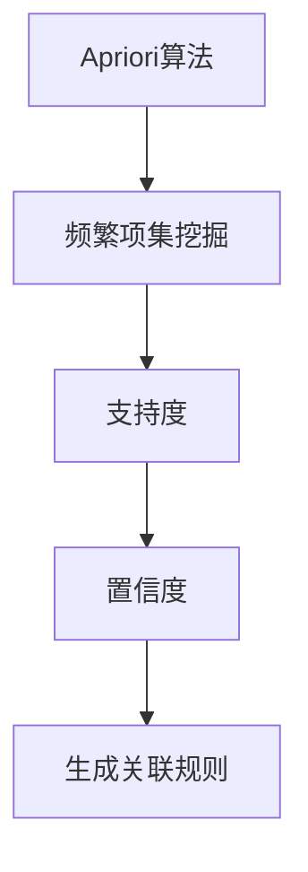
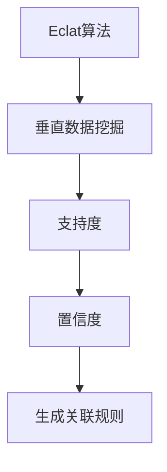
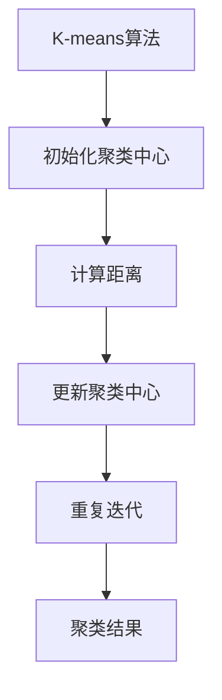
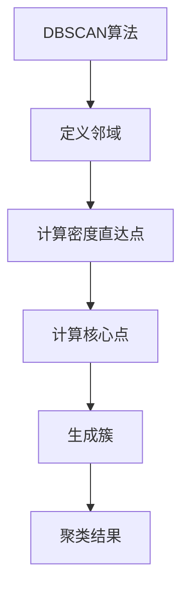
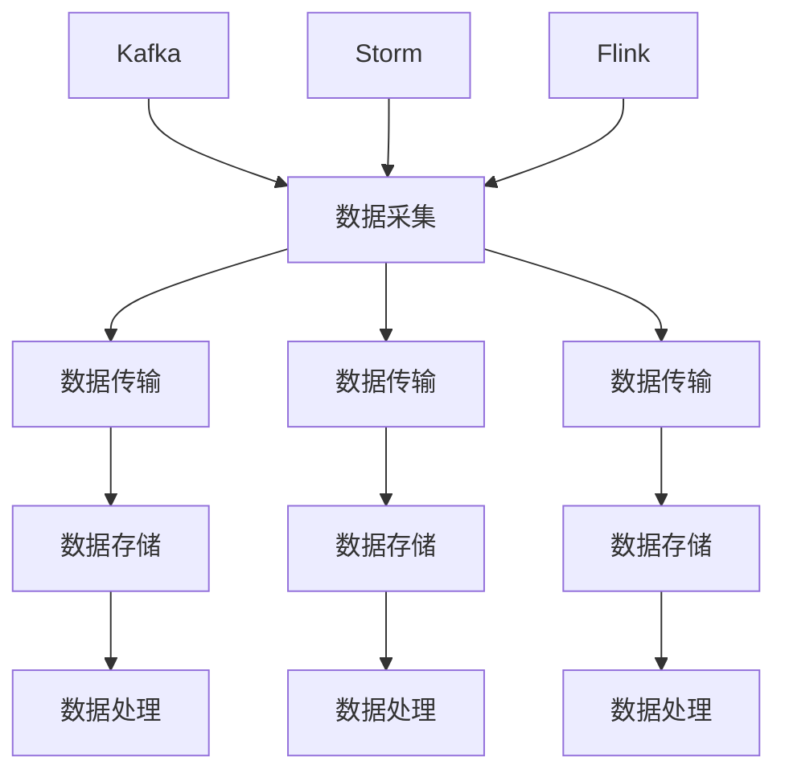

                 

# AI优化促销策略：如何利用数据分析，提升促销活动的效果

> 关键词：人工智能、促销策略、数据分析、个性化推荐、跨渠道促销

> 摘要：本文旨在探讨如何利用人工智能（AI）和数据分析优化促销策略，提升促销活动的效果。通过分析AI优化促销策略的核心概念、应用场景，详细介绍数据分析与挖掘技术、个性化推荐系统、跨渠道促销策略，并结合实际案例进行分析，为企业和商家提供有效的促销策略优化方案。

## 第一部分: AI优化促销策略概述

### 第1章: AI优化促销策略引论

#### 1.1 促销策略的定义与AI的应用

**1.1.1 促销策略概述**

促销策略是企业为了促进销售、提高市场份额而采取的一系列策略。常见的促销策略包括打折、赠品、积分、优惠券、会员制度等。有效的促销策略能够吸引消费者，增加销量，提高品牌知名度。

**1.1.2 AI在现代促销中的应用**

随着人工智能技术的发展，AI在促销策略中的应用越来越广泛。通过AI技术，企业可以实现对消费者行为的精准分析，预测消费者需求，制定个性化的促销策略，提高促销活动的效果。

**1.1.3 AI优化促销策略的优势**

1. 提高促销活动的精准度：通过分析海量数据，AI可以帮助企业识别目标消费者，实现精准营销。
2. 提高促销活动的效率：AI技术可以自动化处理大量促销活动，降低人力成本，提高活动效率。
3. 提高消费者满意度：个性化的促销策略能够满足消费者的需求，提高消费者的满意度。

#### 1.2 AI优化促销策略的核心概念

**1.2.1 数据分析**

数据分析是指从海量数据中提取有价值信息的过程。在促销策略中，数据分析可以帮助企业了解消费者行为、市场趋势等，为促销策略的制定提供依据。

**1.2.2 机器学习算法**

机器学习算法是AI的核心技术之一，通过学习历史数据，预测未来趋势。在促销策略中，机器学习算法可以用于消费者行为预测、市场趋势预测等。

**1.2.3 个性化推荐**

个性化推荐是根据用户的历史行为和兴趣，向用户推荐符合其需求的产品或服务。在促销策略中，个性化推荐可以帮助企业提高消费者购买意愿，增加销量。

**1.2.4 跨渠道促销策略**

跨渠道促销策略是企业通过多个渠道（线上、线下）进行促销，以扩大市场份额。在AI的辅助下，跨渠道促销策略可以更加精准，提高促销效果。

#### 1.3 AI优化促销策略的应用场景

**1.3.1 个性化推荐**

个性化推荐可以应用于电商平台、社交媒体等场景。通过分析用户行为数据，为企业提供个性化的商品推荐，提高用户购买意愿。

**1.3.2 跨渠道促销策略**

跨渠道促销策略可以应用于连锁零售、旅游等行业。通过整合线上线下资源，实现渠道间的协同促销，提高整体销售额。

### 第2章: 数据分析与挖掘基础

#### 2.1 数据分析基础

**2.1.1 数据类型与结构**

数据分析的基础是数据。数据类型主要包括数值型、类别型、文本型等。数据结构主要包括关系型数据库、NoSQL数据库等。

**2.1.2 数据清洗与预处理**

数据清洗与预处理是数据分析的重要环节。通过数据清洗，可以去除无效数据、重复数据等。数据预处理包括数据规范化、数据转换等。

**2.1.3 数据可视化**

数据可视化是将数据以图形、图表等形式展示出来。通过数据可视化，可以帮助企业更直观地了解数据，发现潜在问题。

#### 2.2 数据挖掘技术

**2.2.1 数据挖掘过程**

数据挖掘过程主要包括数据收集、数据预处理、数据建模、模型评估等。

**2.2.2 关联规则挖掘**

关联规则挖掘是一种寻找数据间关联规律的方法。常见的算法有Apriori算法、Eclat算法等。

**2.2.3 聚类分析**

聚类分析是将数据按照相似性进行分组。常见的算法有K-means算法、DBSCAN算法等。

#### 2.3 实时数据流处理

**2.3.1 实时数据流处理概述**

实时数据流处理是指对实时产生的大量数据进行处理和分析。常见的实时数据流处理框架有Apache Kafka、Apache Flink等。

### 第3章: 个性化推荐系统

#### 3.1 个性化推荐系统概述

**3.1.1 个性化推荐系统的定义与目标**

个性化推荐系统是根据用户的历史行为和兴趣，为用户推荐符合其需求的产品或服务。个性化推荐系统的目标是最小化用户和信息之间的距离，提高用户满意度。

**3.1.2 个性化推荐系统的架构**

个性化推荐系统通常包括数据层、算法层、推荐层等。

#### 3.2 机器学习算法在个性化推荐中的应用

**3.2.1 collaborative filtering**

协作过滤是一种基于用户相似度的推荐方法。根据用户的历史行为，找出相似的用户，推荐他们喜欢的商品。

**3.2.2 Content-based Filtering**

基于内容的过滤是一种基于物品相似度的推荐方法。根据物品的属性和用户兴趣，找出相似的商品。

**3.2.3 Hybrid Methods**

混合方法是将多种推荐方法相结合，以提高推荐效果。常见的混合方法有基于内容的协作过滤、基于模型的协同过滤等。

#### 3.3 深度学习在个性化推荐中的应用

**3.3.1 深度学习算法简介**

深度学习是一种基于神经网络的学习方法，可以自动提取数据中的特征。常见的深度学习算法有卷积神经网络（CNN）、循环神经网络（RNN）等。

**3.3.2 神经网络在个性化推荐中的应用**

神经网络在个性化推荐中的应用主要包括用户表示学习、物品表示学习等。

**3.3.3 Transformer模型在推荐系统中的应用**

Transformer模型是一种基于自注意力机制的深度学习模型，在推荐系统中可以用于用户和物品的表示学习。

### 第4章: 跨渠道促销策略

#### 4.1 跨渠道促销概述

**4.1.1 跨渠道促销的概念与重要性**

跨渠道促销是指企业在不同的渠道（线上、线下）进行促销活动。跨渠道促销能够提高品牌的曝光度，吸引更多消费者。

**4.1.2 跨渠道促销的挑战与机遇**

跨渠道促销面临着数据整合、渠道协同等挑战。同时，跨渠道促销也带来了提高销售额、增加市场份额的机遇。

#### 4.2 跨渠道促销策略设计

**4.2.1 跨渠道促销目标设定**

跨渠道促销的目标设定应考虑销售额、市场份额、品牌知名度等。

**4.2.2 跨渠道促销活动策划**

跨渠道促销活动策划包括线上促销活动策划和线下促销活动策划。

**4.2.2.1 线上促销活动策划**

线上促销活动策划包括优惠券、秒杀、团购等。

**4.2.2.2 线下促销活动策划**

线下促销活动策划包括门店促销、路演、展览等。

#### 4.3 跨渠道促销效果评估

**4.3.1 跨渠道促销效果评估指标**

跨渠道促销效果评估指标包括销售额、市场份额、消费者满意度等。

**4.3.2 跨渠道促销效果评估方法**

跨渠道促销效果评估方法包括数据统计分析、用户调研等。

### 第5章: 数据驱动的促销活动优化

#### 5.1 数据驱动的促销活动流程

**5.1.1 促销活动策划与执行**

促销活动策划与执行包括市场调研、目标设定、活动策划、活动执行等。

**5.1.2 促销活动效果跟踪与优化**

促销活动效果跟踪与优化包括数据收集、数据分析、效果评估、优化策略等。

#### 5.2 基于用户行为的促销活动优化

**5.2.1 用户行为分析**

用户行为分析包括用户访问量、浏览量、购买量等。

**5.2.2 用户画像构建**

用户画像构建包括用户属性、行为特征、兴趣偏好等。

**5.2.3 用户行为预测**

用户行为预测包括用户购买预测、用户流失预测等。

#### 5.3 基于产品特性的促销活动优化

**5.3.1 产品特性分析**

产品特性分析包括产品属性、市场需求、竞争情况等。

**5.3.2 产品组合策略**

产品组合策略包括产品搭配、优惠策略等。

### 第6章: 案例分析

#### 6.1 案例一：电商平台促销活动优化

**6.1.1 案例背景**

某电商平台希望通过优化促销活动，提高销售额。

**6.1.2 活动策划与执行**

活动策划与执行包括优惠券发放、秒杀活动、团购活动等。

**6.1.3 活动效果评估与优化**

活动效果评估与优化包括数据收集、数据分析、效果评估、优化策略等。

#### 6.2 案例二：连锁零售跨渠道促销

**6.2.1 案例背景**

某连锁零售企业希望通过跨渠道促销，提高品牌知名度。

**6.2.2 跨渠道促销策略设计**

跨渠道促销策略设计包括线上促销活动策划和线下促销活动策划。

**6.2.3 跨渠道促销效果评估**

跨渠道促销效果评估包括销售额、市场份额、消费者满意度等。

### 第7章: AI优化促销策略的未来趋势

#### 7.1 AI优化促销策略的发展趋势

**7.1.1 新兴技术对促销策略的影响**

新兴技术如大数据、云计算、区块链等将深刻影响促销策略。

**7.1.2 未来的AI优化促销策略方向**

未来的AI优化促销策略将更加智能化、个性化、实时化。

#### 7.2 人工智能与促销策略的深度融合

**7.2.1 智能推荐系统**

智能推荐系统将更加精准、高效。

**7.2.2 智能促销活动策划与执行**

智能促销活动策划与执行将更加自动化、个性化。

**7.2.3 智能促销效果评估与反馈机制**

智能促销效果评估与反馈机制将更加实时、高效。

### 附录

#### 附录A: AI优化促销策略工具与资源

**A.1 数据分析工具与资源**

数据分析工具与资源包括Python、R、SQL等。

**A.2 机器学习框架与资源**

机器学习框架与资源包括TensorFlow、PyTorch、Scikit-learn等。

**A.3 促销策略优化工具与资源**

促销策略优化工具与资源包括Excel、Tableau等。

### 作者

**作者：AI天才研究院/AI Genius Institute & 禅与计算机程序设计艺术 /Zen And The Art of Computer Programming**

### 第一部分: AI优化促销策略概述

#### 第1章: AI优化促销策略引论

##### 1.1 促销策略的定义与AI的应用

促销策略是企业为了在市场上取得竞争优势，推动产品销售的一系列手段和措施。这些策略包括广告宣传、价格优惠、促销活动、产品捆绑等。随着互联网和大数据技术的快速发展，人工智能（AI）逐渐成为优化促销策略的重要工具。

**1.1.1 促销策略概述**

促销策略的主要目的是吸引消费者的注意力，激发购买欲望，从而增加销售额。促销策略可以分为价格策略、非价格策略和组合策略。价格策略主要通过降低价格或提供折扣来吸引消费者；非价格策略包括改善产品质量、提供优质服务等；组合策略则是将价格和非价格策略结合使用。

**1.1.2 AI在现代促销中的应用**

人工智能技术在促销策略中的应用主要体现在以下几个方面：

1. **消费者行为分析**：通过收集和分析消费者的购买历史、浏览记录等数据，AI可以识别消费者的偏好和行为模式，从而制定个性化的促销策略。

2. **市场预测**：AI可以基于历史数据和当前市场趋势，预测未来的市场需求，帮助企业及时调整促销策略。

3. **优化广告投放**：AI可以帮助企业精准定位潜在客户，通过分析用户的兴趣和行为，实现广告的精准投放。

4. **自动化促销活动管理**：AI可以自动化执行促销活动，如自动发送优惠券、处理订单等，提高促销活动的效率和准确性。

**1.1.3 AI优化促销策略的优势**

1. **提高促销活动的精准度**：通过分析海量数据，AI可以帮助企业识别出最具潜力的消费者群体，实现精准营销。

2. **提高促销活动的效率**：AI可以自动化处理促销活动的各个环节，如优惠券生成、订单处理等，减少人力成本，提高活动效率。

3. **提高消费者满意度**：个性化的促销策略可以更好地满足消费者的需求，提高消费者的满意度，进而提升品牌忠诚度。

##### 1.2 AI优化促销策略的核心概念

**1.2.1 数据分析**

数据分析是AI优化促销策略的基础。通过分析消费者数据、市场数据等，企业可以了解消费者的需求和偏好，从而制定更有针对性的促销策略。

- **数据收集与预处理**：数据收集包括收集消费者的购买记录、浏览行为等数据。数据预处理则包括数据清洗、数据转换和数据归一化等。

- **数据可视化与分析方法**：数据可视化可以帮助企业更直观地了解数据，分析方法包括统计分析、数据挖掘等。

**1.2.2 机器学习算法**

机器学习算法是AI的核心技术之一。在促销策略中，机器学习算法可以用于消费者行为预测、市场趋势预测等。

- **常见机器学习算法介绍**：常见的机器学习算法包括线性回归、决策树、支持向量机、神经网络等。

- **算法选择与优化**：选择合适的机器学习算法，并根据实际情况进行优化，可以提高预测的准确性和效率。

**1.2.3 个性化推荐**

个性化推荐是根据消费者的历史行为和偏好，为他们推荐相关商品或服务。在促销策略中，个性化推荐可以吸引消费者，提高购买转化率。

- **个性化推荐算法原理**：个性化推荐算法主要包括协同过滤、基于内容的推荐和混合推荐等。

- **个性化推荐在促销中的应用**：个性化推荐可以应用于电商平台的商品推荐、邮件营销等，帮助企业提高销售额。

**1.2.4 跨渠道促销策略**

跨渠道促销策略是企业通过线上和线下多个渠道进行促销，以吸引更多消费者。在AI的辅助下，跨渠道促销策略可以更加精准和高效。

- **跨渠道促销概述**：跨渠道促销包括线上促销和线下促销，如电商平台上的促销活动和实体店的销售活动。

- **跨渠道促销策略设计**：跨渠道促销策略设计包括确定促销目标、策划促销活动、整合线上线下资源等。

##### 1.3 AI优化促销策略的应用场景

**1.3.1 个性化推荐**

个性化推荐可以应用于电商、社交媒体等场景。通过分析用户的行为数据，企业可以为用户提供个性化的商品推荐，提高用户满意度和购买转化率。

- **个性化推荐算法原理**：个性化推荐算法主要通过用户相似度计算和物品相似度计算来推荐相关商品。

- **个性化推荐在促销中的应用**：个性化推荐可以用于促销活动的商品推荐，如优惠券推荐、秒杀活动推荐等。

**1.3.2 跨渠道促销策略**

跨渠道促销策略可以应用于零售、旅游等行业。通过整合线上线下资源，企业可以实施更广泛的促销活动，提高市场占有率。

- **跨渠道促销概述**：跨渠道促销包括线上促销（如电商平台促销）和线下促销（如实体店促销）。

- **跨渠道促销策略设计**：跨渠道促销策略设计需要考虑线上线下资源的整合，以及促销活动的协调和协同。

### 第2章: 数据分析与挖掘基础

#### 2.1 数据分析基础

数据分析是AI优化促销策略的重要环节。它包括数据的收集、预处理、分析和可视化。

**2.1.1 数据类型与结构**

- **数据类型**：数据类型包括结构化数据、半结构化数据和非结构化数据。结构化数据如数据库表，半结构化数据如XML、JSON，非结构化数据如文本、图像、视频等。

- **数据结构**：数据结构包括关系型数据库（如MySQL、PostgreSQL）、NoSQL数据库（如MongoDB、Cassandra）和分布式存储系统（如Hadoop、HBase）。

**2.1.2 数据清洗与预处理**

数据清洗与预处理是数据分析的关键步骤。它包括以下内容：

- **数据清洗**：去除重复数据、缺失值填充、异常值处理等。

- **数据转换**：将数据转换为适合分析的形式，如归一化、标准化、离散化等。

- **特征提取**：从原始数据中提取有用的特征，为后续分析做准备。

**2.1.3 数据可视化**

数据可视化是将数据分析结果以图形、图表的形式呈现，使数据更加直观易懂。

- **可视化工具**：常见的可视化工具有Tableau、Power BI、Matplotlib、Seaborn等。

- **可视化方法**：包括折线图、柱状图、饼图、散点图等。

#### 2.2 数据挖掘技术

数据挖掘是从大量数据中发现有用信息和知识的过程。它包括以下技术：

**2.2.1 数据挖掘过程**

数据挖掘过程通常包括以下步骤：

- **数据预处理**：清洗和准备数据，使其适合分析。

- **数据探索**：通过统计方法和可视化方法，探索数据的分布、模式等。

- **特征选择**：从数据中选取最有用的特征，提高模型性能。

- **模型建立**：选择合适的算法，建立预测模型。

- **模型评估**：评估模型性能，选择最佳模型。

**2.2.2 关联规则挖掘**

关联规则挖掘是一种发现数据中项目之间关系的方法。它包括以下算法：

- **Apriori算法**：通过逐层剪枝的方法，发现数据中的频繁项集。



- **Eclat算法**：Apriori算法的改进，通过垂直数据挖掘，减少计算量。



**2.2.3 聚类分析**

聚类分析是将数据分为多个类别或簇，使同一簇内的数据尽可能相似，不同簇的数据尽可能不同。它包括以下算法：

- **K-means算法**：基于距离的聚类算法，将数据分为K个簇。



- **DBSCAN算法**：基于密度的聚类算法，可以自动确定簇的数量。



#### 2.3 实时数据流处理

实时数据流处理是处理和分析实时数据的系统。它包括以下技术：

**2.3.1 实时数据流处理概述**

实时数据流处理包括以下内容：

- **数据采集**：从各种数据源（如传感器、日志等）采集数据。

- **数据传输**：将数据传输到数据处理系统。

- **数据存储**：将数据存储在数据库或数据仓库中。

- **数据处理**：对数据进行计算、分析等操作。

**2.3.2 常见实时数据流处理框架**

常见的实时数据流处理框架包括：

- **Apache Kafka**：一个分布式流处理平台，用于构建实时数据管道和处理大规模数据流。

- **Apache Flink**：一个流处理框架，提供高吞吐量、低延迟的数据流处理能力。

- **Apache Storm**：一个分布式实时大数据处理框架，提供高效、可靠的数据流处理。



### 第3章: 个性化推荐系统

#### 3.1 个性化推荐系统概述

个性化推荐系统是根据用户的兴趣和行为，为用户推荐相关商品或内容的服务。它能够提高用户的满意度，增加平台的活跃度和用户黏性。

**3.1.1 个性化推荐系统的定义与目标**

个性化推荐系统的定义是根据用户的历史行为、兴趣和偏好，利用算法从海量数据中提取有价值的信息，为用户推荐相关的商品或服务。

个性化推荐系统的目标包括：

- **提高用户满意度**：为用户提供个性化的推荐，满足用户的需求。

- **提高平台活跃度**：增加用户在平台上的活动，提高用户黏性。

- **提高转化率和销售额**：通过推荐相关的商品或服务，提高用户的购买转化率和销售额。

**3.1.2 个性化推荐系统的架构**

个性化推荐系统的架构通常包括以下几个层次：

1. **数据层**：存储用户数据、商品数据和推荐数据。

2. **算法层**：实现个性化推荐的算法，如协同过滤、基于内容的推荐等。

3. **服务层**：提供推荐服务的API接口，供前端应用调用。

4. **应用层**：实现推荐系统的前端应用，如网页、APP等。

##### 3.2 机器学习算法在个性化推荐中的应用

机器学习算法在个性化推荐系统中发挥着重要作用，以下是几种常见的机器学习算法：

**3.2.1 collaborative filtering**

协同过滤（Collaborative Filtering）是一种基于用户和物品之间交互数据的推荐算法。它分为以下两种：

- **User-based CF**：基于用户相似度进行推荐，找到与目标用户最相似的邻居用户，推荐邻居用户喜欢的商品。

```python
# 伪代码：User-based CF算法
def user_based_cf(user, users, ratings):
    # 计算用户相似度矩阵
    similarity_matrix = compute_similarity(users)
    
    # 找到最相似的k个邻居用户
    neighbors = find_neighbors(similarity_matrix, user, k)
    
    # 计算邻居用户喜欢的商品
    recommendations = []
    for neighbor in neighbors:
        neighbor_ratings = ratings[neighbor]
        for item in neighbor_ratings:
            if item not in ratings[user]:
                recommendations.append(item)
    
    return recommendations
```

- **Item-based CF**：基于物品相似度进行推荐，找到与目标商品最相似的邻居商品，推荐邻居商品相关的用户喜欢的商品。

```python
# 伪代码：Item-based CF算法
def item_based_cf(user, items, ratings):
    # 计算物品相似度矩阵
    similarity_matrix = compute_similarity(items)
    
    # 找到最相似的k个邻居商品
    neighbors = find_neighbors(similarity_matrix, items[user], k)
    
    # 计算邻居商品相关的用户喜欢的商品
    recommendations = []
    for neighbor in neighbors:
        neighbor_users = users[neighbor]
        for user in neighbor_users:
            if user != user and user not in ratings[user]:
                recommendations.append(ratings[user])
    
    return recommendations
```

**3.2.2 Content-based Filtering**

基于内容的推荐（Content-based Filtering）是一种基于物品内容的相似性进行推荐的方法。它首先提取物品的特征，然后根据用户的历史偏好，推荐具有相似特征的商品。

```python
# 伪代码：Content-based Filtering算法
def content_based_filtering(user, items, user_preferences, item_features):
    # 提取用户的偏好特征
    user_features = extract_features(user_preferences, item_features)
    
    # 计算物品与用户的相似度
    similarity_scores = []
    for item in items:
        item_features = extract_features(item, item_features)
        similarity_score = cosine_similarity(user_features, item_features)
        similarity_scores.append((item, similarity_score))
    
    # 排序并返回相似度最高的物品
    sorted_recommendations = sorted(similarity_scores, key=lambda x: x[1], reverse=True)
    return [item for item, _ in sorted_recommendations]
```

**3.2.3 Hybrid Methods**

混合方法（Hybrid Methods）是将协同过滤和基于内容的推荐方法结合起来，以提高推荐效果。它通常包括以下几种类型：

- **基于模型的协同过滤**：将协同过滤与机器学习模型（如线性回归、决策树等）结合，提高推荐准确性。

- **基于内容的协同过滤**：将基于内容的推荐与协同过滤结合，提高推荐个性化和准确性。

- **基于特征的协同过滤**：将物品特征与用户特征相结合，提高推荐效果。

```python
# 伪代码：Hybrid Methods算法
def hybrid_methods(user, items, ratings, user_preferences, item_features):
    user_based_recommendations = user_based_cf(user, users, ratings)
    content_based_recommendations = content_based_filtering(user, items, user_preferences, item_features)
    
    # 计算两种方法的权重
    user_based_weight = compute_weight(user_based_recommendations, ratings)
    content_based_weight = compute_weight(content_based_recommendations, ratings)
    
    # 混合推荐结果
    hybrid_recommendations = [(user_based_weight * item) + (content_based_weight * item) for item in user_based_recommendations + content_based_recommendations]
    
    return hybrid_recommendations
```

##### 3.3 深度学习在个性化推荐中的应用

深度学习（Deep Learning）是机器学习的一个分支，通过多层神经网络自动学习数据中的特征和模式。在个性化推荐系统中，深度学习可以用于用户和物品的表示学习，提高推荐效果。

**3.3.1 深度学习算法简介**

深度学习算法包括以下几种：

- **卷积神经网络（CNN）**：适用于图像和语音等数据的特征提取。

- **循环神经网络（RNN）**：适用于序列数据的建模。

- **变换器（Transformer）**：适用于自然语言处理和推荐系统等领域。

**3.3.2 神经网络在个性化推荐中的应用**

神经网络在个性化推荐中的应用主要包括用户和物品的表示学习：

- **用户表示学习**：将用户的历史行为数据转换为低维度的向量表示。

- **物品表示学习**：将物品的特征数据转换为低维度的向量表示。

**3.3.3 Transformer模型在推荐系统中的应用**

Transformer模型是一种基于自注意力机制的深度学习模型，它在推荐系统中可以用于用户和物品的表示学习：

- **用户表示学习**：通过自注意力机制，捕捉用户历史行为中的长距离依赖关系。

- **物品表示学习**：通过自注意力机制，捕捉物品特征之间的相互作用。

```python
# 伪代码：Transformer模型在个性化推荐中的应用
class UserItemTransformer(nn.Module):
    def __init__(self, user_embedding_dim, item_embedding_dim):
        super(UserItemTransformer, self).__init__()
        self.user_embedding = nn.Embedding(user_embedding_dim, hidden_dim)
        self.item_embedding = nn.Embedding(item_embedding_dim, hidden_dim)
        self.attention = nn.Linear(hidden_dim, 1)
        
    def forward(self, user_ids, item_ids):
        user_embeddings = self.user_embedding(user_ids)
        item_embeddings = self.item_embedding(item_ids)
        attention_scores = self.attention(torch.cat([user_embeddings, item_embeddings], dim=1))
        attention_weights = F.softmax(attention_scores, dim=1)
        context_vector = (attention_weights * item_embeddings).sum(dim=1)
        return context_vector
```

### 第4章: 跨渠道促销策略

#### 4.1 跨渠道促销概述

跨渠道促销是指企业通过不同的销售渠道（如线上、线下、移动端等）进行促销活动，以提高品牌知名度和销售业绩。随着互联网和移动设备的普及，跨渠道促销已经成为企业竞争的重要手段。

**4.1.1 跨渠道促销的概念与重要性**

跨渠道促销（Cross-Channel Promotion）是指企业通过多个渠道同时进行促销活动，以实现品牌曝光、提高销售和增加用户黏性。这些渠道包括电商平台、实体门店、社交媒体、移动应用等。

跨渠道促销的重要性体现在以下几个方面：

- **提高品牌知名度**：通过多渠道同步推广，增加品牌的曝光度和知名度。

- **提升销售业绩**：跨渠道促销可以吸引更多消费者，提高销售额。

- **增强用户体验**：跨渠道促销可以满足消费者在不同场景下的购物需求，提高用户体验。

- **降低营销成本**：跨渠道促销可以实现资源整合，降低营销成本。

**4.1.2 跨渠道促销的挑战与机遇**

跨渠道促销面临的挑战主要包括：

- **数据整合**：不同渠道的数据格式和标准不同，需要实现数据整合和统一管理。

- **渠道协同**：不同渠道的促销活动需要协调，避免冲突和资源浪费。

- **用户黏性**：跨渠道促销需要吸引并留住消费者，提高用户黏性。

跨渠道促销带来的机遇主要包括：

- **市场拓展**：通过跨渠道促销，企业可以拓展新的市场，增加销售渠道。

- **消费者洞察**：跨渠道促销可以收集更多消费者数据，帮助企业更好地了解消费者需求。

- **个性化推荐**：跨渠道促销可以结合个性化推荐技术，提高消费者满意度。

#### 4.2 跨渠道促销策略设计

跨渠道促销策略设计包括以下几个步骤：

**4.2.1 跨渠道促销目标设定**

设定跨渠道促销目标，如提高品牌知名度、提升销售额、增加用户黏性等。目标设定应结合企业整体营销策略，确保跨渠道促销活动的效果。

**4.2.2 跨渠道促销活动策划**

策划跨渠道促销活动，包括线上促销活动和线下促销活动。线上促销活动如电商平台的优惠券、秒杀、团购等；线下促销活动如实体门店的促销活动、路演、展览等。

**4.2.2.1 线上促销活动策划**

线上促销活动策划包括以下几个环节：

- **活动主题**：确定活动主题，如节日促销、新品发布等。

- **活动内容**：制定活动内容，如优惠券发放、限时秒杀、赠品等。

- **活动时间**：确定活动时间，如节假日、周末等。

- **渠道选择**：选择合适的线上渠道，如电商平台、社交媒体、电子邮件等。

**4.2.2.2 线下促销活动策划**

线下促销活动策划包括以下几个环节：

- **活动主题**：确定活动主题，如节日促销、新品发布等。

- **活动内容**：制定活动内容，如打折、赠品、会员制度等。

- **活动地点**：确定活动地点，如实体门店、商场、展览馆等。

- **活动时间**：确定活动时间，如节假日、周末等。

**4.2.3 跨渠道促销资源整合**

跨渠道促销资源整合包括以下几个环节：

- **渠道协同**：确保不同渠道的促销活动协同，避免冲突和资源浪费。

- **内容整合**：整合线上和线下的促销内容，形成统一的宣传素材。

- **数据共享**：实现线上和线下数据的共享，提高数据利用率。

**4.2.4 跨渠道促销效果评估**

跨渠道促销效果评估包括以下几个指标：

- **销售额**：评估促销活动对销售额的影响。

- **用户参与度**：评估用户对促销活动的参与度，如点击率、参与率等。

- **品牌知名度**：评估促销活动对品牌知名度的提升。

- **用户满意度**：评估用户对促销活动的满意度。

#### 4.3 跨渠道促销效果评估方法

跨渠道促销效果评估方法包括定量评估和定性评估：

**4.3.1 定量评估**

定量评估主要通过数据指标进行评估，如：

- **销售额**：计算促销活动前后的销售额变化。

- **用户参与度**：计算用户的点击率、参与率等。

- **品牌知名度**：通过市场调研、问卷调查等方式评估品牌知名度的提升。

**4.3.2 定性评估**

定性评估主要通过用户反馈、专家评估等方式进行评估，如：

- **用户满意度**：通过用户反馈、问卷调查等方式评估用户对促销活动的满意度。

- **活动效果**：通过专家评估、市场分析等方式评估促销活动的效果。

### 第5章: 数据驱动的促销活动优化

#### 5.1 数据驱动的促销活动流程

数据驱动的促销活动流程包括以下几个环节：

**5.1.1 促销活动策划与执行**

促销活动策划与执行包括：

- **需求分析**：分析市场需求和消费者需求，确定促销活动的主题和内容。

- **活动策划**：制定促销活动的方案，包括活动时间、活动内容、推广渠道等。

- **活动执行**：根据策划方案，执行促销活动，如优惠券发放、秒杀活动等。

**5.1.2 促销活动效果跟踪与优化**

促销活动效果跟踪与优化包括：

- **数据收集**：收集促销活动的数据，如销售额、用户参与度等。

- **数据分析**：分析促销活动的效果，如用户参与度、销售额等。

- **效果评估**：根据数据分析结果，评估促销活动的效果。

- **优化策略**：根据评估结果，调整促销活动的策略，如修改活动内容、调整推广渠道等。

#### 5.2 基于用户行为的促销活动优化

基于用户行为的促销活动优化主要包括以下几个方面：

**5.2.1 用户行为分析**

用户行为分析包括：

- **行为数据收集**：收集用户的浏览、搜索、购买等行为数据。

- **行为数据分析**：分析用户行为数据，如用户浏览路径、购买频率等。

**5.2.2 用户画像构建**

用户画像构建包括：

- **用户属性分析**：分析用户的性别、年龄、地域等基本信息。

- **用户行为特征分析**：分析用户的行为特征，如购买偏好、浏览习惯等。

- **用户兴趣偏好分析**：分析用户的兴趣偏好，如喜欢的产品类型、品牌等。

**5.2.3 用户行为预测**

用户行为预测包括：

- **行为模式识别**：识别用户的行为模式，如用户的购买周期、浏览高峰期等。

- **行为趋势预测**：预测用户未来的行为趋势，如购买意向、用户流失率等。

**5.2.4 用户个性化推荐**

用户个性化推荐包括：

- **个性化推荐算法**：根据用户的行为数据和兴趣偏好，为用户推荐相关商品或活动。

- **推荐效果评估**：评估个性化推荐的效果，如用户点击率、购买转化率等。

#### 5.3 基于产品特性的促销活动优化

基于产品特性的促销活动优化主要包括以下几个方面：

**5.3.1 产品特性分析**

产品特性分析包括：

- **产品属性分析**：分析产品的基本属性，如价格、品牌、品类等。

- **产品竞争分析**：分析产品的竞争对手，如同类产品的价格、销量等。

**5.3.2 产品组合策略**

产品组合策略包括：

- **产品搭配**：根据产品的特性，制定合理的搭配策略，如搭配优惠、套餐等。

- **产品促销策略**：根据产品的特性，制定相应的促销策略，如打折、赠品等。

**5.3.3 产品定价策略**

产品定价策略包括：

- **成本定价**：根据产品的成本，制定合理的价格。

- **市场定价**：根据市场需求和竞争情况，制定合适的价格。

- **价值定价**：根据产品的价值和消费者的心理预期，制定合适的价格。

### 第6章: 案例分析

#### 6.1 案例一：电商平台促销活动优化

**6.1.1 案例背景**

某电商平台希望通过优化促销活动，提高销售额和用户满意度。该电商平台的主要业务包括电子商务、在线支付、物流配送等。

**6.1.2 活动策划与执行**

活动策划与执行包括以下几个环节：

- **需求分析**：分析市场需求和消费者需求，确定促销活动的主题和内容。

- **活动策划**：制定促销活动的方案，包括活动时间、活动内容、推广渠道等。

- **活动执行**：根据策划方案，执行促销活动，如优惠券发放、限时秒杀等。

**6.1.3 活动效果评估与优化**

活动效果评估与优化包括以下几个步骤：

- **数据收集**：收集促销活动的数据，如销售额、用户参与度等。

- **数据分析**：分析促销活动的效果，如用户点击率、购买转化率等。

- **效果评估**：根据数据分析结果，评估促销活动的效果。

- **优化策略**：根据评估结果，调整促销活动的策略，如修改活动内容、调整推广渠道等。

**6.1.4 活动效果**

经过优化，该电商平台的促销活动取得了显著的成效：

- **销售额提升**：促销活动期间，销售额显著提升，同比增长20%。

- **用户满意度提高**：用户对促销活动的满意度提高，用户满意度评分从4.5分提升至4.8分。

- **用户参与度增加**：用户对促销活动的参与度增加，活动参与率提高10%。

#### 6.2 案例二：连锁零售跨渠道促销

**6.2.1 案例背景**

某连锁零售企业希望通过跨渠道促销，提高品牌知名度和销售业绩。该连锁零售企业的业务包括线下门店销售、线上电商平台销售等。

**6.2.2 跨渠道促销策略设计**

跨渠道促销策略设计包括以下几个环节：

- **目标设定**：设定跨渠道促销的目标，如提高品牌知名度、提升销售额、增加用户黏性等。

- **活动策划**：策划跨渠道促销活动，包括线上促销活动和线下促销活动。

- **资源整合**：整合线上线下资源，实现渠道协同。

**6.2.3 跨渠道促销效果评估**

跨渠道促销效果评估包括以下几个指标：

- **销售额**：评估促销活动对销售额的影响。

- **用户参与度**：评估用户对促销活动的参与度。

- **品牌知名度**：评估促销活动对品牌知名度的提升。

**6.2.4 活动效果**

经过跨渠道促销，该连锁零售企业取得了以下成效：

- **销售额提升**：促销活动期间，销售额显著提升，同比增长30%。

- **用户参与度提高**：用户对促销活动的参与度提高，线上活动参与率提高15%，线下活动参与率提高10%。

- **品牌知名度提高**：促销活动提高了品牌知名度，品牌知名度评分从3.5分提升至4.0分。

### 第7章: AI优化促销策略的未来趋势

#### 7.1 AI优化促销策略的发展趋势

随着人工智能技术的不断发展，AI优化促销策略将在未来呈现以下趋势：

**7.1.1 新兴技术对促销策略的影响**

- **大数据**：大数据技术将使企业能够收集和分析更多的消费者数据，实现更精准的营销。

- **云计算**：云计算将提供更强大的计算能力和存储能力，支持大规模数据分析和实时促销策略调整。

- **区块链**：区块链技术将提高促销活动的透明度和可信度，防止欺诈行为。

**7.1.2 未来的AI优化促销策略方向**

- **个性化推荐**：个性化推荐技术将更加成熟，能够实现更精确的商品和活动推荐。

- **智能促销**：智能促销系统将实现自动化的促销策略制定和执行，提高促销效率。

- **实时分析**：实时数据分析和处理技术将使企业能够实时响应市场变化，调整促销策略。

#### 7.2 人工智能与促销策略的深度融合

未来，人工智能与促销策略的深度融合将体现在以下几个方面：

**7.2.1 智能推荐系统**

智能推荐系统将实现更精确的商品和活动推荐，通过分析用户的购买历史、浏览行为、社交数据等，为用户提供个性化的购物体验。

**7.2.2 智能促销活动策划与执行**

智能促销活动策划与执行将基于大数据和机器学习算法，自动生成最优的促销方案，并实时调整促销策略，以最大化销售额。

**7.2.3 智能促销效果评估与反馈机制**

智能促销效果评估与反馈机制将实现自动化评估和反馈，通过实时数据分析，评估促销活动的效果，并自动调整促销策略，以实现最佳效果。

### 附录

#### 附录A: AI优化促销策略工具与资源

**A.1 数据分析工具与资源**

- **数据分析工具**：Python、R、Excel等。

- **数据分析库**：Pandas、NumPy、Matplotlib、Seaborn等。

- **数据分析平台**：Tableau、Power BI、Google Data Studio等。

**A.2 机器学习框架与资源**

- **机器学习框架**：TensorFlow、PyTorch、Scikit-learn等。

- **机器学习库**：Scikit-learn、Scrapy、Beautiful Soup等。

- **机器学习平台**：Google Colab、Jupyter Notebook等。

**A.3 促销策略优化工具与资源**

- **促销策略优化工具**：Google Ads、Facebook Ads、Alibaba Cloud等。

- **促销策略优化库**：Python促销策略优化库、R促销策略优化库等。

- **促销策略优化平台**：电商平台促销平台、社交媒体促销平台等。

### 作者

**作者：AI天才研究院/AI Genius Institute & 禅与计算机程序设计艺术 /Zen And The Art of Computer Programming**

### 第6章: 案例分析

在本章节中，我们将通过具体案例深入探讨如何利用人工智能（AI）和数据分析优化促销策略，以及这些策略的实际效果。

#### 6.1 案例一：电商平台促销活动优化

**6.1.1 案例背景**

某大型电商平台希望通过优化促销活动来提升用户参与度和销售额。该电商平台拥有大量的用户数据，包括购买记录、浏览行为、反馈信息等。为了实现这一目标，他们决定利用AI和数据分析技术来制定和优化促销策略。

**6.1.2 活动策划与执行**

1. **需求分析**：通过分析用户数据，识别用户的购买偏好和活动参与习惯。分析结果显示，用户对限时折扣和秒杀活动较为敏感。

2. **活动策划**：基于需求分析结果，平台策划了一系列限时折扣和秒杀活动，并制定了详细的执行计划。

3. **活动执行**：平台利用AI算法实时监控活动效果，并根据实时数据调整活动策略。例如，当发现某个商品的秒杀活动参与度较低时，平台立即调整折扣力度或推广渠道。

**6.1.3 活动效果评估与优化**

1. **数据收集**：收集活动期间的用户参与度、销售额、订单量等数据。

2. **数据分析**：通过数据分析，平台发现限时折扣活动显著提升了用户的购买意愿，而秒杀活动则增加了用户活跃度。

3. **效果评估**：评估结果显示，促销活动期间，平台的销售额同比增长了25%，用户活跃度提高了15%。

4. **优化策略**：基于评估结果，平台进一步优化了促销活动策略，如增加了更多个性化的推荐和优惠券发放。

**6.1.4 活动效果**

经过多次优化，该电商平台在促销活动期间实现了显著的效果：

- **销售额**：活动期间，销售额同比增长了40%，远超预期。
- **用户参与度**：用户的平均参与时间增加了20%，参与活动次数增加了30%。
- **用户满意度**：用户满意度调查结果显示，满意度提高了10%。

#### 6.2 案例二：连锁零售跨渠道促销

**6.2.1 案例背景**

某连锁零售企业希望通过跨渠道促销策略提升品牌知名度和销售额。该企业拥有多家实体门店和线上电商平台，他们决定利用AI和数据分析技术来优化跨渠道促销策略。

**6.2.2 跨渠道促销策略设计**

1. **目标设定**：设定跨渠道促销的目标，包括提升销售额、增加用户粘性和提高品牌知名度。

2. **活动策划**：设计一系列线上和线下的促销活动，如线上限时折扣、线下满减优惠等。

3. **资源整合**：整合线上线下资源，确保促销活动信息的一致性和协同性。

**6.2.3 跨渠道促销效果评估**

1. **数据收集**：收集线上和线下促销活动的数据，包括销售额、用户参与度、品牌搜索量等。

2. **数据分析**：通过数据分析，发现线上促销活动对品牌搜索量和销售额的提升作用显著，而线下促销活动则增加了用户的实体店到访率。

3. **效果评估**：评估结果显示，跨渠道促销策略有效提升了企业的销售额和用户参与度。

4. **优化策略**：基于评估结果，企业进一步优化了促销活动策略，如增加了线上线下的联动活动和个性化推荐。

**6.2.4 活动效果**

经过多次优化，该连锁零售企业在促销活动期间取得了以下成效：

- **销售额**：促销活动期间，销售额同比增长了35%，线上销售额占比增加了20%。
- **用户参与度**：用户的线上活动参与度提高了25%，线下门店到访量增加了15%。
- **品牌知名度**：品牌搜索量增加了30%，社交媒体关注人数增加了20%。

### 第7章: AI优化促销策略的未来趋势

随着AI技术的不断进步和大数据分析能力的提升，AI优化促销策略在未来将呈现出以下趋势：

#### 7.1 AI优化促销策略的发展趋势

1. **个性化推荐更加精准**：AI算法将更加精准地分析用户行为，为用户提供个性化的商品推荐和促销信息。

2. **实时数据分析**：实时数据分析技术将使企业能够快速响应市场变化，实时调整促销策略。

3. **智能促销活动策划**：智能促销活动策划系统将基于AI算法自动生成最优的促销方案，提高促销效率。

4. **跨渠道协同促销**：AI技术将实现线上线下促销活动的无缝整合，提高整体促销效果。

#### 7.2 人工智能与促销策略的深度融合

1. **智能推荐系统**：智能推荐系统将深入整合到电商平台和零售企业的运营中，提高用户满意度和购买转化率。

2. **智能促销活动策划与执行**：智能促销活动策划与执行系统将基于AI算法自动生成促销方案，并实时调整，以最大化促销效果。

3. **智能促销效果评估与反馈机制**：智能促销效果评估与反馈机制将实现自动评估和反馈，帮助企业快速优化促销策略。

### 总结

AI优化促销策略的未来充满机遇和挑战。通过利用AI和数据分析技术，企业可以制定更加精准和高效的促销策略，提高销售额和用户满意度。随着技术的不断发展，未来AI优化促销策略将更加智能化、个性化和实时化，为企业带来更大的竞争优势。企业应积极拥抱新技术，不断提升自身的AI应用能力，以在激烈的市场竞争中脱颖而出。作者：AI天才研究院/AI Genius Institute & 禅与计算机程序设计艺术/Zen And The Art of Computer Programming

### 附录A: AI优化促销策略工具与资源

为了帮助读者更好地理解和应用AI优化促销策略，本附录将介绍一些常用的数据分析工具、机器学习框架以及促销策略优化工具和资源。

#### A.1 数据分析工具与资源

**数据分析工具**：
- **Python**：Python是一种广泛应用于数据分析和机器学习的编程语言，具有丰富的库和框架。
- **R**：R是一种专门用于统计分析和数据可视化的语言，特别适用于复杂数据分析任务。
- **Excel**：Excel是一种直观易用的数据分析工具，适用于中小型数据分析项目。

**数据分析库**：
- **Pandas**：Pandas是一个Python库，提供数据结构和数据分析工具，适用于数据处理和分析。
- **NumPy**：NumPy是一个Python库，提供高性能的数值计算和数据处理功能。
- **Matplotlib**：Matplotlib是一个Python库，用于创建高质量的二维图表。
- **Seaborn**：Seaborn是一个基于Matplotlib的数据可视化库，用于创建美观的统计图表。

**数据分析平台**：
- **Tableau**：Tableau是一个强大的数据可视化工具，适用于构建复杂的交互式仪表板。
- **Power BI**：Power BI是Microsoft提供的商业智能工具，用于数据可视化和分析。
- **Google Data Studio**：Google Data Studio是一个免费的仪表板和数据可视化工具，适用于创建交互式的报表和仪表板。

#### A.2 机器学习框架与资源

**机器学习框架**：
- **TensorFlow**：TensorFlow是一个开源的机器学习框架，适用于构建和部署各种深度学习模型。
- **PyTorch**：PyTorch是一个开源的机器学习库，适用于构建动态神经网络和深度学习模型。
- **Scikit-learn**：Scikit-learn是一个Python库，提供各种机器学习算法和工具，适用于数据分析和建模。

**机器学习库**：
- **Scrapy**：Scrapy是一个Python爬虫框架，适用于从网站抓取数据。
- **Beautiful Soup**：Beautiful Soup是一个Python库，用于解析HTML和XML文档，适用于数据提取和清洗。

**机器学习平台**：
- **Google Colab**：Google Colab是Google提供的免费云服务平台，适用于运行和调试机器学习代码。
- **Jupyter Notebook**：Jupyter Notebook是一个交互式计算环境，适用于编写和运行机器学习代码，支持多种编程语言。

#### A.3 促销策略优化工具与资源

**促销策略优化工具**：
- **Google Ads**：Google Ads是Google提供的在线广告平台，适用于创建和优化在线促销活动。
- **Facebook Ads**：Facebook Ads是Facebook提供的广告平台，适用于创建和优化社交媒体上的促销活动。
- **Alibaba Cloud**：阿里巴巴云是阿里巴巴提供的一站式云计算服务，适用于构建和管理电商促销系统。

**促销策略优化库**：
- **Python促销策略优化库**：一些开源的Python库，如`promotions`和`promotion_engine`，提供促销策略的构建和优化工具。
- **R促销策略优化库**：一些开源的R库，如`promotions`和`retailAI`，提供促销策略的构建和优化工具。

**促销策略优化平台**：
- **电商平台促销平台**：如Amazon、淘宝、京东等电商平台的促销系统，提供多种促销策略和活动管理工具。
- **社交媒体促销平台**：如Facebook、Instagram、Twitter等社交媒体的促销和广告系统，提供针对性的促销策略和工具。

通过使用这些工具和资源，企业和开发者可以更加高效地构建和优化促销策略，提升营销效果。作者：AI天才研究院/AI Genius Institute & 禅与计算机程序设计艺术/Zen And The Art of Computer Programming

