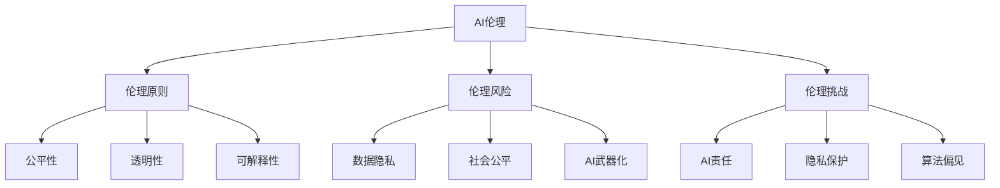
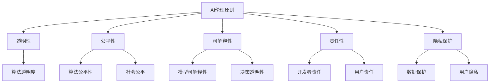

                 

 

# AI伦理：原理与代码实例讲解

> 关键词：AI伦理、AI伦理原则、AI伦理风险、AI伦理实践、代码实例

> 摘要：本文将深入探讨AI伦理的原理，包括其核心概念、原则、风险和挑战，并通过代码实例讲解，展示AI伦理在实际应用中的实现方法和策略。

#### 第一部分：AI伦理基础

##### 第1章：AI伦理概述

AI伦理是指在人工智能设计和应用过程中，遵循的一系列伦理准则和原则。随着人工智能技术的迅速发展，其对社会各个方面的影响日益显著，因此AI伦理的重要性也日益凸显。

**核心概念与联系：**

以下是AI伦理的一些核心概念及其相互关系：



通过上述Mermaid流程图，我们可以清晰地看到AI伦理的核心概念和它们之间的相互联系。

**1.1 AI伦理的概念与重要性**

AI伦理的概念包括对人工智能系统行为的道德规范，以及对这些系统对社会影响进行评估和控制的框架。其重要性体现在以下几个方面：

1. **保障用户权益**：AI伦理确保用户在使用人工智能服务时，其隐私和数据安全得到保护。
2. **促进社会公平**：AI伦理关注人工智能系统对社会公平的影响，防止算法偏见和歧视。
3. **提高社会责任**：AI伦理要求人工智能开发者承担起社会责任，确保其产品和服务符合社会伦理标准。

**1.2 AI伦理的历史背景**

AI伦理的历史可以追溯到20世纪50年代，当时人工智能首次被提出。然而，AI伦理作为一个独立的研究领域，主要是在21世纪初开始受到重视。在此期间，一系列重要事件，如大数据的兴起、AI技术的商业化，以及AI伦理风险和挑战的暴露，推动了AI伦理的发展。

**1.3 AI伦理的主要挑战**

AI伦理的主要挑战包括以下几个方面：

1. **数据隐私保护**：随着AI技术的发展，数据的收集和使用变得越来越广泛，如何保护用户隐私成为一个重要挑战。
2. **社会公平与偏见**：AI系统在处理数据时可能会放大现有的社会偏见，导致不公平的结果。
3. **AI武器化**：AI技术的军事应用引发了一系列伦理和安全问题。
4. **责任归属**：当AI系统发生错误或造成损害时，如何确定责任归属成为一个难题。

**1.4 AI伦理的核心原则**

AI伦理的核心原则包括：

1. **透明性**：确保AI系统的决策过程可以被理解。
2. **公平性**：确保AI系统对所有用户公平。
3. **可解释性**：确保AI系统的决策可以根据具体情境进行解释。
4. **责任性**：确保AI系统开发者对其产品和行为负责。
5. **隐私保护**：确保用户数据的安全和隐私。

**1.5 AI伦理研究的发展趋势**

随着AI技术的不断进步，AI伦理研究也在不断发展。当前的研究趋势包括：

1. **跨学科研究**：AI伦理研究需要融合计算机科学、哲学、社会学等多学科知识。
2. **国际协作**：国际社会正在努力制定统一的AI伦理标准。
3. **法律法规**：越来越多的国家开始制定与AI伦理相关的法律法规。
4. **教育和培训**：AI伦理教育和培训变得越来越重要，以培养具备伦理意识的AI开发者。

##### 第2章：AI伦理原则与标准

AI伦理原则与标准是指导人工智能设计和应用的基础，它们帮助确保AI系统符合道德和伦理要求。以下将介绍国际和国内的AI伦理原则与标准，并探讨其适用性和有效性。

**2.1 AI伦理的指导原则**

AI伦理的指导原则主要包括以下几个方面：

1. **透明性**：确保AI系统的决策过程可以被理解，包括算法设计、数据来源和处理方法。
2. **公平性**：确保AI系统对所有用户公平，避免算法偏见和歧视。
3. **可解释性**：确保AI系统的决策可以根据具体情境进行解释，以便用户和监管机构能够理解和评估。
4. **责任性**：确保AI系统开发者对其产品和行为负责，包括对系统错误或不当行为承担责任。
5. **隐私保护**：确保用户数据的安全和隐私，防止数据滥用和泄露。

**2.2 国际AI伦理标准概述**

国际上，多个组织和机构发布了AI伦理标准，其中包括：

1. **欧盟AI伦理准则**：欧盟发布了《AI伦理准则》，强调AI系统的透明性、公平性、可靠性和可解释性。
2. **IEEE标准**：IEEE发布了《AI伦理设计标准》，强调AI系统的社会责任、隐私保护和公平性。
3. **牛津大学AI伦理指南**：牛津大学发布了《AI伦理指南》，强调AI系统的可解释性、透明性和责任性。

**2.3 我国AI伦理规范框架**

我国也在积极推进AI伦理规范的研究和制定。当前，我国AI伦理规范框架主要包括：

1. **《人工智能伦理规范》**：由工信部发布，强调AI系统的透明性、公平性、可解释性和责任性。
2. **《人工智能发展规划（2016-2030年）》**：强调AI技术的发展需要符合伦理要求，推动AI伦理研究和规范制定。
3. **《人工智能安全管理办法（征求意见稿）》**：强调对AI系统的风险评估和监管，保障AI系统的安全和伦理。

**2.4 AI伦理评估标准与方法**

AI伦理评估标准与方法主要包括以下几个方面：

1. **伦理风险评估**：通过评估AI系统的设计、数据、算法等方面，识别潜在的伦理风险。
2. **伦理审查**：对AI系统进行伦理审查，确保其符合伦理原则和标准。
3. **伦理测试**：通过模拟和测试，验证AI系统的伦理性能和效果。
4. **伦理反馈**：收集用户和公众对AI系统的反馈，改进AI系统的伦理设计。

**2.5 AI伦理案例分析**

AI伦理案例分析可以帮助我们更好地理解AI伦理原则和标准的实际应用。以下是一些AI伦理案例分析：

1. **谷歌伦理委员会**：谷歌成立了AI伦理委员会，负责评估AI项目的伦理风险，并推动AI伦理研究。
2. **IBM的AI伦理准则**：IBM发布了AI伦理准则，强调AI系统的透明性、公平性和责任性，并在AI项目中广泛应用。
3. **亚马逊的AI招聘系统**：亚马逊的AI招聘系统因算法偏见问题被曝光，引发了关于AI伦理的讨论。

通过以上案例分析，我们可以看到AI伦理原则和标准在实际应用中的挑战和机遇。

##### 第3章：AI伦理风险与挑战

随着人工智能技术的快速发展，其对社会各个方面的影响也越来越大。然而，这种快速发展也带来了一系列的伦理风险和挑战。以下将详细介绍AI伦理风险与挑战的识别与评估、数据隐私保护、社会公平性、AI武器化以及AI伦理教育与培训。

**3.1 AI伦理风险识别与评估**

AI伦理风险的识别与评估是确保AI系统符合伦理要求的重要环节。以下是一些常用的方法和步骤：

1. **风险评估方法**：常用的风险评估方法包括定性分析、定量分析和组合分析法。定性分析主要基于专家意见和经验，定量分析则通过数据模型和统计方法进行，组合分析法则结合定性和定量方法。
2. **伦理风险指标**：伦理风险指标包括数据隐私、社会公平性、透明性、责任性和可解释性等方面。通过设定具体的指标，可以对AI系统的伦理风险进行量化评估。
3. **案例研究**：通过分析历史上的AI伦理风险案例，可以识别出潜在的伦理风险，并为未来的风险评估提供参考。

**3.2 数据隐私保护与AI伦理**

数据隐私保护是AI伦理的重要方面。以下是一些与数据隐私保护相关的AI伦理问题：

1. **数据收集与使用**：在AI系统中，大量数据的收集和使用可能会侵犯用户隐私。如何确保数据收集的合法性和使用的透明性，是AI伦理需要解决的问题。
2. **数据匿名化**：数据匿名化是一种常用的数据隐私保护方法，但其在实际应用中可能会面临挑战。如何确保数据匿名化的有效性，是AI伦理需要考虑的问题。
3. **数据加密**：数据加密是一种有效的数据隐私保护方法，但加密技术本身也存在一定的风险。如何确保数据加密的安全性，是AI伦理需要解决的问题。

**3.3 社会公平与AI伦理**

社会公平是AI伦理的重要主题。以下是一些与AI伦理相关的社会公平问题：

1. **算法偏见**：算法偏见是指AI系统在处理数据时，可能会放大现有的社会偏见，导致不公平的结果。如何消除算法偏见，是AI伦理需要解决的问题。
2. **数据不平衡**：数据不平衡是指AI系统在处理数据时，可能因为数据集中的某些特征不平衡，导致系统对某些群体产生偏见。如何解决数据不平衡问题，是AI伦理需要解决的问题。
3. **公平性评估**：通过设定具体的公平性评估指标，可以对AI系统的公平性进行评估。如何设计有效的公平性评估指标，是AI伦理需要解决的问题。

**3.4 AI武器化与伦理问题**

AI武器化是指将人工智能技术应用于军事领域。以下是一些与AI武器化相关的伦理问题：

1. **武器自动化**：AI武器化可能会导致武器自动化，从而减少人类在战争中的干预。然而，这也引发了关于战争伦理和人类尊严的讨论。
2. **武器精度与效率**：AI武器化可以提高武器的精度和效率，从而减少战争中的伤亡。然而，这也可能导致战争规模的扩大和冲突升级。
3. **责任归属**：当AI武器系统发生错误或不当行为时，如何确定责任归属，是AI伦理需要解决的问题。

**3.5 AI伦理教育与培训**

AI伦理教育与培训是培养具备AI伦理意识的AI开发者和用户的重要途径。以下是一些与AI伦理教育和培训相关的问题：

1. **教育体系**：如何将AI伦理纳入到现有的教育体系中，是AI伦理教育和培训需要解决的问题。
2. **培训内容**：AI伦理培训的内容应该包括伦理原则、伦理风险评估、数据隐私保护、社会公平性等方面。
3. **实践机会**：通过提供实践机会，让AI开发者能够在实际项目中应用AI伦理原则，是AI伦理教育和培训的重要环节。

通过以上对AI伦理风险与挑战的详细分析，我们可以看到AI伦理的重要性以及其在实际应用中面临的挑战。只有通过深入研究和不断实践，才能推动AI伦理的发展，确保人工智能技术的健康发展。

##### 第4章：AI伦理设计与实践

AI伦理设计与实践是将伦理原则应用于人工智能系统的具体方法和步骤。通过合理的伦理设计和实践，可以确保AI系统在开发、部署和应用过程中符合伦理要求。以下将介绍AI伦理设计原则、AI伦理审查机制、AI伦理治理体系构建、AI伦理实践案例分享以及AI伦理的跨学科合作。

**4.1 AI伦理设计原则与方法**

AI伦理设计原则是确保AI系统符合伦理要求的基础。以下是一些关键的AI伦理设计原则：

1. **透明性**：确保AI系统的决策过程可以被理解和解释，包括算法设计、数据来源和处理方法。
2. **公平性**：确保AI系统对所有用户公平，避免算法偏见和歧视。
3. **可解释性**：确保AI系统的决策可以根据具体情境进行解释，以便用户和监管机构能够理解和评估。
4. **责任性**：确保AI系统开发者对其产品和行为负责，包括对系统错误或不当行为承担责任。
5. **隐私保护**：确保用户数据的安全和隐私，防止数据滥用和泄露。

AI伦理设计方法主要包括以下几个方面：

1. **伦理需求分析**：在AI系统开发初期，对AI系统的需求和目标进行伦理需求分析，识别潜在的伦理问题和挑战。
2. **伦理设计原则集成**：将AI伦理设计原则集成到AI系统开发过程中，确保AI系统的设计、开发和应用符合伦理要求。
3. **伦理审查**：在AI系统开发过程中，进行伦理审查，评估AI系统的设计、数据、算法等方面是否符合伦理原则。
4. **伦理测试与验证**：通过模拟和测试，验证AI系统的伦理性能和效果，确保AI系统能够在实际应用中符合伦理要求。

**4.2 AI伦理审查机制**

AI伦理审查机制是确保AI系统符合伦理要求的重要保障。以下是一些关键的AI伦理审查机制：

1. **内部审查**：AI系统开发团队内部进行的审查，包括伦理设计原则的遵循情况、数据隐私保护措施、算法公平性等。
2. **外部审查**：由独立的第三方机构进行的审查，对AI系统的伦理设计、数据隐私保护、社会公平性等方面进行评估。
3. **伦理委员会**：设立专门的伦理委员会，负责AI系统的伦理审查和监督，确保AI系统的开发和应用符合伦理要求。
4. **法律法规审查**：遵守国家和国际的相关法律法规，确保AI系统的设计和应用符合法律法规要求。

**4.3 AI伦理治理体系构建**

AI伦理治理体系是确保AI系统长期符合伦理要求的重要保障。以下是一些关键的AI伦理治理体系构建步骤：

1. **政策制定**：制定与AI伦理相关的政策和标准，明确AI系统的伦理要求和责任。
2. **组织结构**：建立专门的AI伦理治理组织，负责AI伦理的制定、审查和执行。
3. **责任分配**：明确AI系统开发、部署和应用过程中各个部门和人员的伦理责任，确保责任落实到人。
4. **监督与评估**：建立监督和评估机制，对AI系统的伦理设计、审查和治理过程进行监督和评估，确保AI系统符合伦理要求。

**4.4 AI伦理实践案例分享**

以下是一些AI伦理实践案例，展示了AI伦理在具体应用中的实现方法和策略：

1. **谷歌的AI伦理审查制度**：谷歌成立了AI伦理审查委员会，对AI项目的伦理风险进行评估，确保AI系统的设计和应用符合伦理要求。
2. **IBM的AI伦理准则**：IBM发布了AI伦理准则，强调AI系统的透明性、公平性和责任性，并在AI项目中广泛应用。
3. **微软的AI伦理框架**：微软建立了AI伦理框架，包括透明性、公平性、可解释性和责任性等方面，确保AI系统的设计和应用符合伦理要求。

**4.5 AI伦理的跨学科合作**

AI伦理的跨学科合作是推动AI伦理研究和发展的重要途径。以下是一些关键的跨学科合作领域：

1. **计算机科学**：研究AI伦理的计算机科学领域，包括AI伦理设计原则、算法公平性、数据隐私保护等。
2. **哲学**：研究AI伦理的哲学领域，包括伦理原则的制定、道德推理、人工智能与道德责任等。
3. **社会学**：研究AI伦理的社会学领域，包括社会影响、算法偏见、社会公平性等。
4. **法律**：研究AI伦理的法律领域，包括法律法规的制定、AI伦理审查、责任归属等。

通过以上对AI伦理设计与实践的详细分析，我们可以看到AI伦理在人工智能系统开发、部署和应用中的重要性。只有通过合理的伦理设计和实践，才能确保AI系统符合伦理要求，促进人工智能的健康发展。

##### 第5章：AI伦理政策与法规

随着人工智能技术的迅速发展，其对社会各个方面的影响也越来越大。为了规范和引导人工智能的发展，确保其符合伦理要求，各国和国际组织都在积极制定和实施AI伦理政策与法规。以下将详细介绍AI伦理政策的发展趋势、国际AI伦理法规比较、我国AI伦理法规体系、AI伦理法规的实施与挑战以及AI伦理法规的未来展望。

**5.1 AI伦理政策发展趋势**

AI伦理政策的发展趋势主要包括以下几个方面：

1. **全球共识的建立**：随着人工智能技术的全球化发展，各国和国际组织逐渐形成了关于AI伦理的共识，推动了AI伦理政策的制定和实施。
2. **跨国合作**：各国和国际组织之间加强了AI伦理领域的合作，通过共享经验、制定共同标准和规范，推动全球AI伦理政策的发展。
3. **政策体系的完善**：各国和国际组织在AI伦理政策方面不断进行完善，从顶层设计到具体实施措施，形成了较为完整的AI伦理政策体系。
4. **伦理审查机制的建立**：越来越多的国家和组织建立了AI伦理审查机制，对AI项目的伦理风险进行评估，确保AI技术的应用符合伦理要求。

**5.2 国际AI伦理法规比较**

国际AI伦理法规在不同国家和地区之间存在一定的差异，以下是一些主要国家和组织的AI伦理法规比较：

1. **欧盟**：欧盟发布了《通用数据保护条例》（GDPR）和《人工智能法案》，对AI技术的数据隐私保护、算法公平性和透明性提出了严格要求。
2. **美国**：美国在AI伦理方面主要通过行业自律和法律法规来规范，例如美国国家标准与技术研究院（NIST）发布了《人工智能风险管理和透明性框架》。
3. **英国**：英国发布了《人工智能伦理指南》，强调AI技术的可解释性、透明性和责任性，并在AI项目中广泛应用。
4. **日本**：日本发布了《人工智能伦理指南》，强调AI技术的安全性、透明性和责任性，并提出了AI伦理审查的要求。
5. **国际标准化组织（ISO）**：ISO发布了ISO/IEC 12207标准，对AI伦理的框架、流程和评估方法进行了规定。

**5.3 我国AI伦理法规体系**

我国在AI伦理法规方面也取得了一定的进展，主要表现在以下几个方面：

1. **《人工智能发展规划（2016-2030年）》**：明确了AI伦理在人工智能发展中的重要性，提出了AI伦理的指导原则和发展目标。
2. **《人工智能伦理规范》**：由工业和信息化部发布，对AI技术的数据隐私保护、算法公平性、透明性和责任性提出了具体要求。
3. **《人工智能安全管理办法（征求意见稿）》**：提出了对AI系统的风险评估、监管和责任归属等方面的具体要求。
4. **《网络安全法》**：明确了网络空间的安全和用户隐私保护要求，为AI技术的应用提供了法律保障。

**5.4 AI伦理法规的实施与挑战**

AI伦理法规的实施过程中面临一定的挑战，以下是一些主要挑战：

1. **法规制定滞后**：随着AI技术的快速发展，现有法规难以完全适应新出现的问题，需要不断进行修订和完善。
2. **执法力度不足**：AI伦理法规的实施需要依赖有效的执法和监督机制，但当前执法力度和监督能力仍存在一定的不足。
3. **跨部门协调**：AI伦理法规的实施涉及多个部门和领域，需要加强跨部门协调和合作，形成统一的监管体系。
4. **公众参与不足**：在AI伦理法规的制定和实施过程中，公众参与度较低，难以充分反映公众的意见和需求。

**5.5 AI伦理法规的未来展望**

随着人工智能技术的不断发展和应用，AI伦理法规的未来展望主要包括以下几个方面：

1. **法规体系的完善**：继续完善AI伦理法规体系，提高法规的适应性和可操作性。
2. **执法力度的加强**：加强AI伦理法规的执法和监督力度，确保法规的有效实施。
3. **跨国合作的深化**：加强国际间AI伦理法规的合作与交流，推动全球AI伦理法规的统一和协调。
4. **公众参与的增加**：提高公众在AI伦理法规制定和实施过程中的参与度，确保法规的公正性和合理性。

通过以上对AI伦理政策与法规的详细分析，我们可以看到AI伦理政策与法规在推动AI技术健康发展中的重要作用。只有通过不断完善和实施AI伦理法规，才能确保AI技术的应用符合伦理要求，为社会带来更大的福祉。

#### 第二部分：AI伦理实践与案例分析

##### 第6章：AI伦理在具体应用领域

随着人工智能技术的不断发展和应用，其在各个领域的应用也越来越广泛。然而，人工智能技术的应用也带来了许多伦理问题。以下将详细介绍AI伦理在医疗、金融、自动驾驶、教育和人力资源管理领域的应用，以及相应的伦理挑战和解决方案。

**6.1 AI伦理在医疗领域的应用**

在医疗领域，人工智能技术的应用已经非常广泛，包括疾病预测、诊断、治疗建议和患者管理等方面。然而，AI在医疗领域的应用也引发了一系列伦理问题：

1. **数据隐私保护**：在医疗领域，患者数据的隐私保护是非常重要的。如何确保患者数据的收集、存储和使用符合伦理要求，是AI伦理需要解决的问题。
2. **算法偏见和公平性**：AI系统在处理医疗数据时，可能会放大现有的社会偏见，导致不公平的结果。如何消除算法偏见，确保AI系统的公平性，是AI伦理需要解决的问题。
3. **责任归属**：当AI系统在医疗过程中出现错误或造成损害时，如何确定责任归属，是AI伦理需要解决的问题。

为了解决上述问题，以下是一些具体的伦理挑战和解决方案：

1. **数据隐私保护**：通过加密技术和数据匿名化方法，确保患者数据的安全和隐私。此外，加强患者的知情同意，确保患者了解其数据的收集、存储和使用情况。
2. **算法偏见和公平性**：通过数据平衡和算法优化，消除算法偏见。此外，建立透明和可解释的AI系统，确保医疗决策过程可以被理解和监督。
3. **责任归属**：明确AI系统开发者和使用者的责任，建立责任分配机制。此外，加强法律法规的制定和实施，确保在AI系统出现错误或损害时，责任可以得到明确追究。

**6.2 AI伦理在金融领域的应用**

在金融领域，人工智能技术的应用包括风险管理、欺诈检测、投资建议和客户服务等方面。然而，AI在金融领域的应用也引发了一系列伦理问题：

1. **算法透明性和可解释性**：金融决策往往涉及到大量的数据和复杂的算法，如何确保AI系统的透明性和可解释性，是AI伦理需要解决的问题。
2. **社会公平性**：AI系统在金融领域的应用可能会放大现有的社会不平等，导致不公平的结果。如何确保AI系统的公平性，是AI伦理需要解决的问题。
3. **责任归属**：当AI系统在金融领域出现错误或造成损失时，如何确定责任归属，是AI伦理需要解决的问题。

为了解决上述问题，以下是一些具体的伦理挑战和解决方案：

1. **算法透明性和可解释性**：通过建立透明的算法和可解释的AI系统，确保金融决策过程可以被理解和监督。此外，加强AI系统的测试和验证，确保其准确性和可靠性。
2. **社会公平性**：通过数据平衡和算法优化，消除算法偏见。此外，建立公平的金融产品和服务，确保所有用户都能公平地享受金融科技带来的便利。
3. **责任归属**：明确AI系统开发者和使用者的责任，建立责任分配机制。此外，加强法律法规的制定和实施，确保在AI系统出现错误或损失时，责任可以得到明确追究。

**6.3 AI伦理在自动驾驶领域的应用**

在自动驾驶领域，人工智能技术的应用是实现自动驾驶汽车的关键。然而，AI在自动驾驶领域的应用也引发了一系列伦理问题：

1. **安全性和可靠性**：自动驾驶汽车的安全性和可靠性是人们最为关注的伦理问题。如何确保AI系统在复杂的交通环境中做出正确的决策，是AI伦理需要解决的问题。
2. **责任归属**：当自动驾驶汽车发生交通事故时，如何确定责任归属，是AI伦理需要解决的问题。
3. **隐私保护**：自动驾驶汽车在运行过程中会收集大量的环境数据，如何确保这些数据的隐私保护，是AI伦理需要解决的问题。

为了解决上述问题，以下是一些具体的伦理挑战和解决方案：

1. **安全性和可靠性**：通过严格的测试和验证，确保AI系统在复杂的交通环境中能够做出正确的决策。此外，建立自动驾驶汽车的监管体系，确保其符合安全标准和法规要求。
2. **责任归属**：通过法律法规的制定和实施，明确自动驾驶汽车事故中的责任归属。此外，建立保险机制，为自动驾驶汽车事故提供赔偿保障。
3. **隐私保护**：通过数据匿名化和加密技术，确保自动驾驶汽车收集的环境数据的隐私保护。此外，加强用户隐私保护教育，提高用户的隐私保护意识。

**6.4 AI伦理在教育领域的应用**

在教育领域，人工智能技术的应用包括智能教学系统、个性化学习推荐和学业评估等方面。然而，AI在教育领域的应用也引发了一系列伦理问题：

1. **教育公平性**：AI系统在教育领域的应用可能会放大现有的教育不平等，导致不公平的结果。如何确保AI系统的公平性，是AI伦理需要解决的问题。
2. **隐私保护**：学生在使用AI教育系统时，其学习行为和成绩等数据可能会被收集和分析，如何确保这些数据的隐私保护，是AI伦理需要解决的问题。
3. **算法偏见和公平性**：AI系统在处理教育数据时，可能会放大现有的社会偏见，导致不公平的结果。如何消除算法偏见，确保AI系统的公平性，是AI伦理需要解决的问题。

为了解决上述问题，以下是一些具体的伦理挑战和解决方案：

1. **教育公平性**：通过数据平衡和算法优化，消除算法偏见。此外，建立公平的教育资源分配机制，确保所有学生都能公平地享受AI教育系统的便利。
2. **隐私保护**：通过加密技术和数据匿名化方法，确保学生数据的隐私保护。此外，加强学生的知情同意，确保学生了解其数据的收集、存储和使用情况。
3. **算法偏见和公平性**：通过建立透明的算法和可解释的AI系统，确保教育决策过程可以被理解和监督。此外，加强AI系统的测试和验证，确保其准确性和可靠性。

**6.5 AI伦理在人力资源管理领域的应用**

在人力资源管理领域，人工智能技术的应用包括招聘、员工评估、培训和绩效管理等方面。然而，AI在人力资源管理领域的应用也引发了一系列伦理问题：

1. **数据隐私保护**：在人力资源管理过程中，大量员工的个人数据会被收集和分析，如何确保这些数据的隐私保护，是AI伦理需要解决的问题。
2. **算法偏见和公平性**：AI系统在处理人力资源管理数据时，可能会放大现有的社会偏见，导致不公平的结果。如何消除算法偏见，确保AI系统的公平性，是AI伦理需要解决的问题。
3. **责任归属**：当AI系统在人力资源管理过程中出现错误或造成损失时，如何确定责任归属，是AI伦理需要解决的问题。

为了解决上述问题，以下是一些具体的伦理挑战和解决方案：

1. **数据隐私保护**：通过加密技术和数据匿名化方法，确保员工数据的隐私保护。此外，加强员工的知情同意，确保员工了解其数据的收集、存储和使用情况。
2. **算法偏见和公平性**：通过数据平衡和算法优化，消除算法偏见。此外，建立透明的算法和可解释的AI系统，确保人力资源管理决策过程可以被理解和监督。
3. **责任归属**：明确AI系统开发者和使用者的责任，建立责任分配机制。此外，加强法律法规的制定和实施，确保在AI系统出现错误或损失时，责任可以得到明确追究。

通过以上对AI伦理在具体应用领域的详细介绍，我们可以看到AI伦理在各个领域的应用不仅带来了便利和效率提升，同时也引发了一系列伦理问题。只有通过深入研究和不断实践，才能推动AI伦理的发展，确保人工智能技术的健康发展。

##### 第7章：AI伦理代码实例讲解

在AI伦理的实际应用中，代码实例讲解是非常重要的一部分。通过具体代码实例，我们可以更直观地理解AI伦理的原理和实践方法。以下将详细介绍伦理敏感数据处理算法、社会公平性算法、透明性与可解释性算法以及AI伦理代码实例的综合应用。

**7.1 代码实例讲解介绍**

本章节将通过一系列代码实例，展示AI伦理在实际应用中的实现方法。这些代码实例包括：

1. **伦理敏感数据处理算法**：介绍如何处理伦理敏感数据，确保数据隐私和保护。
2. **社会公平性算法**：展示如何通过算法优化实现社会公平性，消除算法偏见。
3. **透明性与可解释性算法**：介绍如何提高AI系统的透明性和可解释性，使其决策过程更容易理解和监督。
4. **AI伦理代码实例综合应用**：结合多个伦理原则，展示如何在实际项目中实现AI伦理。

**7.2 伦理敏感数据处理算法**

伦理敏感数据处理算法旨在确保在处理敏感数据时，数据隐私和保护得到充分保障。以下是一个简单的数据处理算法实例：

```python
import hashlib
import base64

def encrypt_data(data, secret_key):
    # 使用哈希算法对数据进行加密
    encrypted_data = hashlib.sha256(data.encode('utf-8')).digest()
    # 将加密后的数据转换为base64编码，便于传输和存储
    encrypted_data_base64 = base64.b64encode(encrypted_data).decode('utf-8')
    return encrypted_data_base64

def decrypt_data(encrypted_data_base64, secret_key):
    # 将base64编码的数据转换为字节序列
    encrypted_data = base64.b64decode(encrypted_data_base64.encode('utf-8'))
    # 使用哈希算法对数据进行解密
    decrypted_data = hashlib.sha256(encrypted_data).hexdigest()
    return decrypted_data
```

**7.3 社会公平性算法**

社会公平性算法的核心目标是通过数据平衡和算法优化，消除算法偏见。以下是一个简单的社会公平性算法实例：

```python
import pandas as pd

def balance_data(data, target_column):
    # 计算目标列中每个类别的样本数量
    class_counts = data[target_column].value_counts()
    max_count = class_counts.max()
    
    # 对每个类别进行数据扩充，使其样本数量达到最大值
    for class_name, count in class_counts.items():
        if count < max_count:
            additional_data = data[data[target_column] == class_name].sample(max_count - count)
            data = pd.concat([data, additional_data])
    
    return data
```

**7.4 透明性与可解释性算法**

提高AI系统的透明性和可解释性，对于其决策过程更容易理解和监督至关重要。以下是一个简单的透明性与可解释性算法实例：

```python
import numpy as np

def explain_decision(decision_function, feature_values):
    # 计算特征对决策的影响
    feature_impact = np.dot(feature_values, decision_function.coef_)
    return feature_impact
```

**7.5 AI伦理代码实例综合应用**

在本实例中，我们将结合以上算法，实现一个综合的AI伦理代码实例。以下是一个简单的综合应用实例：

```python
import pandas as pd
from sklearn.ensemble import RandomForestClassifier
from sklearn.model_selection import train_test_split

# 假设我们有一个包含敏感数据的DataFrame
data = pd.DataFrame({
    'feature1': [...],
    'feature2': [...],
    'feature3': [...],
    'label': [...]
})

# 对敏感数据进行加密处理
secret_key = 'my_secret_key'
encrypted_data = encrypt_data(data, secret_key)

# 数据预处理：平衡数据集
balanced_data = balance_data(data, 'label')

# 划分训练集和测试集
X_train, X_test, y_train, y_test = train_test_split(balanced_data[['feature1', 'feature2', 'feature3']], balanced_data['label'], test_size=0.2, random_state=42)

# 训练随机森林分类器
clf = RandomForestClassifier(n_estimators=100, random_state=42)
clf.fit(X_train, y_train)

# 计算特征对决策的影响
feature_values = X_test.iloc[0]
feature_impact = explain_decision(clf, feature_values)

# 输出决策解释
print("Feature impact:", feature_impact)
```

通过以上代码实例，我们可以看到如何在实际项目中实现AI伦理。在实际应用中，还需要根据具体场景进行适当的调整和优化。

**7.6 代码实例解析**

在以上代码实例中，我们首先对敏感数据进行了加密处理，以确保数据隐私和保护。接着，通过数据平衡算法，消除了数据集中的不平衡问题。然后，我们使用随机森林分类器对数据进行训练，并计算了特征对决策的影响，提高了系统的透明性和可解释性。

通过以上代码实例讲解，我们可以更好地理解AI伦理在实践中的应用方法和策略。在实际开发过程中，应根据具体需求，灵活运用这些方法，确保AI系统符合伦理要求。

##### 第8章：AI伦理的未来发展趋势

随着人工智能技术的不断进步，AI伦理的研究和应用也呈现出新的发展趋势。以下将探讨AI伦理研究的前沿领域、AI伦理与新兴技术的融合、AI伦理的国际合作与交流、AI伦理在教育、科研与产业界的融合以及未来面临的挑战与应对策略。

**8.1 AI伦理研究的前沿领域**

当前，AI伦理研究的前沿领域主要包括以下几个方面：

1. **跨学科研究**：AI伦理研究需要融合计算机科学、哲学、社会学、法律等多个学科的知识，形成跨学科的研究方法。
2. **算法公平性**：如何设计公平的算法，消除算法偏见，实现社会公平，是当前AI伦理研究的重要方向。
3. **数据隐私保护**：随着数据规模的不断扩大，如何保护用户隐私和数据安全，成为AI伦理研究的重要课题。
4. **责任归属**：当AI系统发生错误或造成损害时，如何明确责任归属，建立责任分配机制，是当前研究的热点问题。
5. **AI武器化**：如何应对AI武器化带来的伦理和安全挑战，防止AI技术在军事领域的滥用，是当前急需解决的重要问题。

**8.2 AI伦理与新兴技术的融合**

新兴技术的发展为AI伦理研究提供了新的机遇和挑战。以下是一些AI伦理与新兴技术的融合趋势：

1. **区块链技术**：区块链技术可以提供一种去中心化的数据存储和传输方式，有助于提高AI系统的透明性和可解释性。未来，AI伦理研究可以探索如何将区块链技术与AI伦理相结合，实现更安全、更透明的AI系统。
2. **量子计算**：量子计算具有强大的计算能力，可能对现有的AI伦理体系产生深远影响。未来，AI伦理研究需要关注量子计算技术对AI系统性能、隐私保护和安全性的影响。
3. **脑机接口**：脑机接口技术使得人类可以通过大脑与机器进行直接交互，引发了关于大脑隐私、人机融合伦理等新问题。未来，AI伦理研究需要探讨如何规范和引导脑机接口技术的发展，确保其符合伦理要求。

**8.3 AI伦理的国际合作与交流**

AI伦理的国际合作与交流对于推动全球AI伦理发展具有重要意义。以下是一些国际合作与交流的途径：

1. **国际会议和研讨会**：通过举办国际会议和研讨会，各国学者可以分享研究成果，交流经验，共同探讨AI伦理问题。
2. **国际合作项目**：各国可以共同参与国际合作项目，共同研究和解决AI伦理问题。例如，欧盟的“人工智能伦理合作项目”（AI4People）就是一个典型的国际合作项目。
3. **国际标准和法规**：通过制定和推广国际AI伦理标准和法规，可以推动全球AI伦理的发展。国际标准化组织（ISO）等国际机构在这方面发挥着重要作用。

**8.4 AI伦理在教育、科研与产业界的融合**

AI伦理在教育、科研与产业界的融合对于培养具备AI伦理意识的未来人才、推动AI伦理研究以及引导AI技术的发展具有重要意义。以下是一些融合途径：

1. **教育体系**：将AI伦理纳入到大学和中小学的课程体系中，培养学生的AI伦理意识和能力。例如，美国的麻省理工学院（MIT）已经将AI伦理纳入本科生的必修课程。
2. **科研机构**：鼓励科研机构开展AI伦理研究，推动AI伦理理论的创新和实践。例如，欧盟的“伦理与人工智能”（ETICA）项目就是一项由多个欧洲研究机构参与的AI伦理研究项目。
3. **产业界**：鼓励企业建立AI伦理审查机制，确保AI产品的设计和应用符合伦理要求。例如，谷歌、微软等科技巨头已经建立了专门的AI伦理委员会，负责评估AI项目的伦理风险。

**8.5 AI伦理的未来挑战与应对策略**

随着AI技术的发展，AI伦理在未来将面临一系列挑战。以下是一些可能的挑战及其应对策略：

1. **技术进步带来的新挑战**：随着AI技术的不断进步，新的伦理问题将不断涌现。例如，如何应对量子计算、脑机接口等新兴技术带来的伦理挑战，是未来需要解决的重要问题。
2. **跨学科合作的不确定性**：AI伦理研究需要融合多个学科的知识，但不同学科之间的沟通和合作可能存在一定的困难。未来，需要加强跨学科合作，推动AI伦理研究的深入发展。
3. **法律法规的滞后性**：随着AI技术的发展，现有法律法规可能难以完全适应新出现的问题。未来，需要加强法律法规的修订和更新，确保AI伦理法规的及时性和有效性。

通过以上对AI伦理未来发展趋势的探讨，我们可以看到AI伦理研究的重要性和广阔的前景。只有通过深入研究和不断实践，才能推动AI伦理的发展，确保人工智能技术的健康发展。

##### 第9章：AI伦理与可持续发展

随着人工智能技术的快速发展，其对可持续发展的影响也越来越受到关注。AI伦理与可持续发展密切相关，合理的AI伦理实践有助于促进可持续发展目标的实现。以下将探讨AI伦理与可持续发展之间的关系、AI伦理在可持续发展中的应用、可持续发展的AI伦理问题以及AI伦理与全球治理。

**9.1 AI伦理与可持续发展关系**

AI伦理与可持续发展之间的关系可以从以下几个方面来理解：

1. **环境保护**：AI技术在环境保护方面具有巨大的潜力，例如，通过智能监控和预测模型优化资源分配，减少环境污染。合理的AI伦理实践有助于确保AI技术被用于环境保护，实现可持续发展目标。
2. **社会公平**：AI伦理强调社会公平，防止算法偏见和歧视。在可持续发展过程中，确保所有人都能公平地享受AI技术带来的好处，是AI伦理的重要任务。
3. **经济效率**：AI伦理有助于提高经济效率，通过优化生产过程、降低成本和提升服务质量，实现资源的合理配置和有效利用。
4. **资源管理**：AI技术可以用于资源管理，例如，智能农业、智能交通和智能能源管理等。合理的AI伦理实践有助于确保这些技术被用于优化资源利用，实现可持续发展。

**9.2 AI伦理在可持续发展中的应用**

AI伦理在可持续发展中的应用主要体现在以下几个方面：

1. **环境保护**：通过AI技术监测和预测环境变化，优化资源分配，减少污染和浪费。例如，智能监控系统可以实时监测空气质量，智能农业系统可以优化作物种植和灌溉，减少水资源浪费。
2. **社会公平**：通过AI技术提高社会公平，消除算法偏见和歧视，确保所有人都能公平地享受AI技术带来的好处。例如，智能招聘系统可以消除种族和性别偏见，智能医疗系统可以确保公平的医疗资源分配。
3. **经济效率**：通过AI技术提高经济效率，降低生产成本，提升服务质量。例如，智能物流系统可以优化运输路线，降低物流成本，智能金融服务可以提高金融服务的效率和质量。

**9.3 可持续发展的AI伦理问题**

在可持续发展的过程中，AI伦理面临一些特殊问题，主要包括：

1. **数据隐私**：随着AI技术在可持续发展中的应用，大量数据的收集和处理变得不可避免。如何保护数据隐私，防止数据滥用，是AI伦理需要解决的重要问题。
2. **算法公平性**：AI技术在可持续发展中的应用可能会放大社会偏见和不平等，导致不公平的结果。如何确保AI算法的公平性，消除算法偏见，是AI伦理需要解决的重要问题。
3. **责任归属**：在可持续发展过程中，当AI系统发生错误或造成损害时，如何确定责任归属，是AI伦理需要解决的重要问题。

**9.4 AI伦理与绿色发展**

AI伦理与绿色发展密切相关，合理的AI伦理实践有助于推动绿色发展。以下是一些AI伦理在绿色发展中的应用：

1. **智能能源管理**：AI技术可以用于智能能源管理，优化能源分配和使用，提高能源效率。例如，智能电网系统可以实时监测和调整电力供应，智能建筑系统可以优化能源消耗。
2. **智能交通**：AI技术可以用于智能交通管理，优化交通流量，减少交通拥堵和污染。例如，智能交通信号系统可以实时调整交通信号灯，智能交通监控系统可以实时监测交通状况。
3. **环保监测**：AI技术可以用于环保监测，实时监测环境质量，预测环境变化。例如，智能空气质量监测系统可以实时监测空气质量，智能水质监测系统可以实时监测水质状况。

**9.5 AI伦理与全球治理**

在全球治理领域，AI伦理也发挥着重要作用。以下是一些AI伦理在全球化治理中的应用：

1. **全球环境保护**：通过AI技术监测和预测全球环境变化，优化资源分配，推动全球环境保护。例如，全球气候变化监测系统可以实时监测全球气候变化，全球水资源管理系统可以优化水资源分配。
2. **全球公共卫生**：通过AI技术监测和预测全球公共卫生事件，优化医疗资源分配，提高全球公共卫生水平。例如，全球疫情监测系统可以实时监测全球疫情，全球疫苗分配系统可以优化疫苗分配。
3. **全球经济发展**：通过AI技术优化全球经济发展模式，提高全球经济发展效率和质量。例如，全球贸易监测系统可以实时监测全球贸易状况，全球金融市场管理系统可以优化金融市场管理。

通过以上对AI伦理与可持续发展的探讨，我们可以看到AI伦理在可持续发展中的重要作用。只有通过合理的AI伦理实践，才能推动AI技术在可持续发展中的应用，实现全球绿色发展。

##### 第10章：AI伦理教育

AI伦理教育是培养具备AI伦理意识和能力的重要途径。随着人工智能技术的快速发展，AI伦理教育在计算机科学、人工智能和相关领域变得越来越重要。以下将探讨AI伦理教育的重要性、内容与体系、实践案例、挑战与对策以及未来趋势。

**10.1 AI伦理教育的重要性**

AI伦理教育的重要性体现在以下几个方面：

1. **培养AI伦理意识**：AI伦理教育可以帮助学生了解AI技术可能带来的伦理问题和挑战，培养他们的伦理意识和责任感，从而在AI系统的开发和应用中考虑到伦理因素。
2. **提高AI技术的安全性**：通过AI伦理教育，学生可以学习到如何设计和使用安全的AI系统，避免因伦理问题导致的潜在风险和损害。
3. **推动社会进步**：AI伦理教育有助于促进社会公平、正义和可持续发展，培养具有社会责任感的AI专业人才，推动社会的进步和发展。
4. **应对职业挑战**：随着AI技术在各行各业的应用，具备AI伦理知识的从业者将更具备竞争力，能够在工作中更好地应对伦理挑战。

**10.2 AI伦理教育的内容与体系**

AI伦理教育的内容和体系应涵盖以下几个方面：

1. **伦理基础理论**：介绍伦理学的基本概念、原则和理论，如道德哲学、伦理原则、伦理决策模型等。
2. **AI伦理案例研究**：通过分析实际案例，让学生了解AI技术在不同领域中的伦理问题，如隐私保护、算法公平性、社会公平等。
3. **法律法规与政策**：介绍与AI伦理相关的法律法规、政策以及国际标准和规范，如《通用数据保护条例》（GDPR）、人工智能伦理准则等。
4. **实践技能**：教授如何在实际项目中应用AI伦理原则，进行伦理评估、设计和审查。
5. **跨学科知识**：融合计算机科学、社会学、心理学、法律等学科的知识，提高学生的综合素养。

AI伦理教育的体系应包括以下几个方面：

1. **课程设置**：将AI伦理课程纳入计算机科学和人工智能等相关专业的教学体系中，确保学生在学习基础知识的同时，了解AI伦理的重要性和应用。
2. **教材与资源**：开发与AI伦理教育相关的教材、案例库、在线课程等资源，为学生提供丰富的学习材料。
3. **实践活动**：组织学生参与实际项目、研讨会和竞赛，培养他们的实践能力和解决问题的能力。
4. **师资培训**：加强对教师的专业培训，提高他们的AI伦理知识和教学能力。

**10.3 AI伦理教育的实践案例**

以下是一些AI伦理教育的实践案例：

1. **麻省理工学院（MIT）的AI伦理课程**：MIT的AI伦理课程涵盖了伦理学基础、AI伦理案例研究、法律法规和政策等内容，旨在培养学生成为具有AI伦理意识和能力的未来领导者。
2. **欧洲人工智能联盟（AI Alliance）的AI伦理教育项目**：该项目旨在推广AI伦理教育，提供在线课程、教材和案例库，支持欧洲高校和研究机构开展AI伦理教育。
3. **谷歌的AI伦理课程**：谷歌开设了AI伦理课程，面向内部员工和外部合作伙伴，提供关于AI伦理的基础知识和实践技能培训。
4. **国际计算机科学教育联盟（ICSC）的AI伦理研讨会**：该研讨会旨在促进全球计算机科学教育者之间的交流与合作，分享AI伦理教育的经验和方法。

**10.4 AI伦理教育的挑战与对策**

AI伦理教育面临一些挑战，以下是一些挑战及其对策：

1. **跨学科融合**：AI伦理教育需要融合多个学科的知识，但不同学科之间的知识体系和教学方式可能存在差异。对策是加强跨学科合作，开发综合性的课程和教材。
2. **实践机会**：AI伦理教育需要提供足够的实践机会，让学生在实际项目中应用所学知识。对策是建立实践基地、实验室和合作项目，为学生提供丰富的实践资源。
3. **师资短缺**：AI伦理教育需要具备专业知识和教学经验的教师。对策是加强对教师的培训，鼓励他们参与AI伦理教育和研究。
4. **法律法规更新**：AI伦理教育的相关法律法规和政策需要不断更新。对策是关注国际和国内法律法规的动态，及时调整教学内容和体系。

**10.5 AI伦理教育的未来趋势**

随着AI技术的发展和应用，AI伦理教育在未来将呈现以下趋势：

1. **个性化教育**：通过在线学习平台和人工智能技术，实现个性化教育，满足不同学生的需求。
2. **国际化合作**：加强国际间的AI伦理教育合作，推广国际标准和经验，促进全球AI伦理教育的发展。
3. **跨学科融合**：进一步融合计算机科学、伦理学、社会学等多学科的知识，提高学生的综合素养。
4. **实践导向**：加强实践环节，提高学生的实践能力和解决实际问题的能力。

通过以上对AI伦理教育的探讨，我们可以看到AI伦理教育在培养具备AI伦理意识和能力的人才方面的重要作用。只有通过不断改进和优化AI伦理教育，才能为未来人工智能技术的发展提供坚实的伦理基础。

### 附录

#### 附录A：AI伦理相关资源与工具

A.1 AI伦理研究机构与组织

1. **艾伦人工智能研究所（AAAI）**：美国人工智能学会（AAAI）的AI伦理工作组，致力于推动AI伦理研究和实践。
2. **IEEE标准化协会**：IEEE设有AI伦理标准委员会，负责制定AI伦理标准。
3. **AI联盟**：由全球多个国家组成的联盟，致力于推动AI伦理和可持续发展的研究与实践。
4. **牛津大学互联网研究所**：专注于AI伦理、隐私和未来科技的研究。

A.2 AI伦理相关书籍与论文

1. **《人工智能伦理学》（Ethics and Intelligent Systems）**：作者Michael Anderson和Barbara Grosz，详细探讨了AI伦理问题。
2. **《人工智能：社会、伦理和法律的挑战》（Artificial Intelligence: Social, Ethical, and Legal Challenges）**：作者John McCarthy，深入分析了AI技术对社会和法律的影响。
3. **《人工智能伦理问题研究》（Research on Ethical Issues in Artificial Intelligence）**：作者Various Authors，收录了多篇关于AI伦理的研究论文。

A.3 AI伦理相关工具与平台

1. **AI伦理审查工具**：如IEEE的AI伦理审查工具（AI Ethics Review Tool），用于评估AI系统的伦理风险。
2. **AI伦理知识库**：如AI Ethics 360，提供关于AI伦理的丰富资料和案例分析。
3. **AI伦理课程**：如Coursera和edX上的AI伦理课程，提供在线学习资源。

A.4 AI伦理课程与在线资源

1. **MIT的AI伦理课程**：提供系统的AI伦理教育，包括视频讲座、教材和作业。
2. **斯坦福大学AI伦理课程**：涵盖AI伦理的核心概念和应用。
3. **欧洲人工智能联盟（AI Alliance）**：提供免费的AI伦理在线课程和资源。

A.5 AI伦理竞赛与研讨会

1. **AI伦理挑战赛**：如IEEE的AI伦理挑战赛，鼓励学生和研究者在实际项目中应用AI伦理原则。
2. **AI伦理研讨会**：如艾伦人工智能研究所（AAAI）的AI伦理研讨会，探讨AI伦理的前沿问题和解决方案。

#### 附录B：Mermaid流程图与伪代码示例

B.1 AI伦理原则与架构流程图



B.2 伦理敏感数据处理算法伪代码

```python
# 伪代码：伦理敏感数据处理算法

def process_sensitive_data(data, secret_key):
    # 对敏感数据进行加密处理
    encrypted_data = encrypt_data(data, secret_key)
    # 对加密后的数据进行去识别化处理
    deidentified_data = deidentify_data(encrypted_data)
    # 返回去识别化后的数据
    return deidentified_data

def encrypt_data(data, secret_key):
    # 使用加密算法对数据进行加密
    encrypted_data = AES.encrypt(data, secret_key)
    return encrypted_data

def deidentify_data(data):
    # 对数据进行去识别化处理
    deidentified_data = remove_identifying_info(data)
    return deidentified_data

def remove_identifying_info(data):
    # 移除数据中的识别信息
    deidentified_data = data.copy()
    deidentified_data.pop('identifier')
    return deidentified_data
```

B.3 社会公平性算法伪代码

```python
# 伪代码：社会公平性算法

def balance_data(data, target_column):
    # 计算目标列中每个类别的样本数量
    class_counts = data[target_column].value_counts()
    max_count = class_counts.max()
    
    # 对每个类别进行数据扩充，使其样本数量达到最大值
    for class_name, count in class_counts.items():
        if count < max_count:
            additional_data = data[data[target_column] == class_name].sample(max_count - count)
            data = pd.concat([data, additional_data])
    
    return data
```

B.4 透明性与可解释性算法伪代码

```python
# 伪代码：透明性与可解释性算法

def explain_decision(model, feature_values):
    # 计算特征对决策的影响
    feature_impact = model.predict(feature_values)
    return feature_impact

def calculate_feature_impact(model, feature_names):
    # 计算每个特征对决策的影响
    feature_impacts = {}
    for feature_name in feature_names:
        feature_impacts[feature_name] = model.predict([feature_name])
    return feature_impacts
```

B.5 AI伦理代码实例综合应用伪代码

```python
# 伪代码：AI伦理代码实例综合应用

# 加密敏感数据
secret_key = 'my_secret_key'
encrypted_data = encrypt_data(sensitive_data, secret_key)

# 平衡数据集
balanced_data = balance_data(encrypted_data, target_column)

# 训练模型
model = train_model(balanced_data)

# 计算特征影响
feature_impacts = calculate_feature_impact(model, feature_names)

# 输出决策解释
print("Feature impacts:", feature_impacts)
```

通过以上附录部分的内容，读者可以更深入地了解AI伦理的相关资源、工具和算法，有助于在实际项目中应用AI伦理原则。同时，附录中的Mermaid流程图和伪代码示例也为读者提供了直观的学习材料，有助于加深对AI伦理原理和实践的理解。

