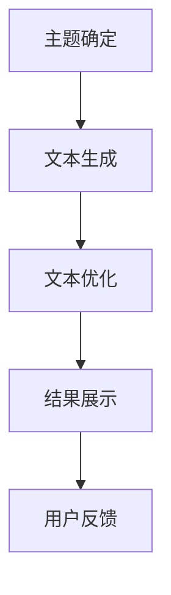

                 

# 文章标题：AI出版业的C端产品：蛙蛙写作1.0的使用体验

> 关键词：AI出版业、C端产品、蛙蛙写作1.0、使用体验、自然语言处理、生成对抗网络、深度学习框架

> 摘要：本文将对AI出版业的C端产品——蛙蛙写作1.0进行深入分析，探讨其核心概念、工作流程、算法原理，并通过实际项目和代码解读，展示其开发环境和实现细节。文章旨在为读者提供全面的使用体验和深入的技术理解。

## 第一部分：核心概念与联系

### 1.1 AI出版业的C端产品概述

AI出版业的C端产品指的是面向最终用户（消费者）的智能内容生成工具。这些工具利用人工智能技术，如自然语言处理（NLP）和生成对抗网络（GAN），以自动生成文章、书籍、报告等内容。此类产品通常具备用户友好的界面和强大的功能，能够根据用户输入的提示或关键词，生成高质量的内容。

AI出版业的C端产品具有以下几个特点：

1. **智能写作助手**：能够根据用户输入的主题、关键词或文章结构，生成完整或部分文章。
2. **文本优化功能**：可以对生成的文章进行语法、风格、逻辑优化，提高文章的质量。
3. **模板库**：提供多种文章模板，如新闻报道、故事创作、学术论文等，供用户选择使用。
4. **多语言支持**：支持中英文及多种语言的文本生成和优化。

### 1.2 蛙蛙写作1.0概述

蛙蛙写作1.0是一款AI辅助写作工具，旨在帮助作者、学生、自媒体运营者等快速生成高质量的文本内容。其主要特点包括：

1. **智能写作助手**：能够根据用户输入的主题、关键词或文章结构，生成完整或部分文章。
2. **文本优化功能**：对生成的文章进行语法、风格、逻辑优化，提高文章的质量。
3. **模板库**：提供多种文章模板，如新闻报道、故事创作、学术论文等，供用户选择使用。
4. **多语言支持**：支持中英文及多种语言的文本生成和优化。

### 1.3 AI写作产品的架构

AI写作产品的架构通常包括以下几个主要部分：

1. **数据输入**：用户通过界面输入写作主题、关键词或选择模板。
2. **文本生成模块**：利用预训练的大规模语言模型（如GPT系列）生成文本内容。
3. **文本优化模块**：对生成的文本进行语法、逻辑、风格优化，提高文本质量。
4. **用户界面**：为用户提供交互接口，展示生成的文本内容，并提供进一步编辑和优化的功能。

### 1.4 蛙蛙写作1.0的工作流程

蛙蛙写作1.0的工作流程主要包括以下几个步骤：

1. **主题确定**：用户输入写作主题或关键词。
2. **文本生成**：系统根据用户输入生成初步的文本内容。
3. **文本优化**：系统对生成的文本进行语法、逻辑、风格优化。
4. **结果展示**：系统将优化后的文本内容展示给用户，并提供进一步编辑和优化的选项。
5. **用户反馈**：用户可以根据生成文本的质量进行评价，为系统提供改进建议。

#### Mermaid 流程图

以下是蛙蛙写作1.0的流程图：



## 第一部分：核心算法原理讲解

### 2.1 自然语言处理（NLP）

自然语言处理是AI写作产品的基础技术之一，其主要目标是使计算机能够理解、生成和处理人类语言。NLP的关键算法包括：

1. **分词**：将文本分割成单词或短语，为后续处理提供基础。
2. **词性标注**：为每个词分配一个词性（名词、动词等），帮助理解文本内容。
3. **句法分析**：分析句子结构，识别句子成分，如主语、谓语等。
4. **语义理解**：理解文本的含义，包括实体识别、关系抽取等。

#### 2.2 生成对抗网络（GAN）

生成对抗网络是一种深度学习模型，由生成器和判别器组成。生成器生成文本，判别器判断文本的真伪。GAN在AI写作中的应用包括：

1. **文本生成**：生成器根据用户输入生成高质量的文本内容。
2. **文本风格迁移**：通过训练，生成器能够模仿不同的文本风格，如新闻、小说等。
3. **文本补全**：生成器可以自动补全用户输入的文本内容，提高写作效率。

#### 2.3 生成文本的伪代码

以下是使用GPT系列模型生成文本的伪代码：

```python
# 输入主题或关键词
input_theme = "如何提高工作效率？"

# 加载预训练的GPT模型
model = load_pretrained_gpt_model()

# 使用模型生成文本
generated_text = model.generate(input_theme, max_length=200)

# 输出生成的文本
print(generated_text)
```

### 第二部分：数学模型和数学公式

#### 3.1 自然语言处理中的数学模型

自然语言处理中的数学模型主要包括：

1. **词嵌入**：将单词映射到高维空间中的向量表示。
   $$ \textbf{v}_w = \text{word2vec}(\textit{w}) $$
   
2. **循环神经网络（RNN）**：用于处理序列数据。
   $$ \textit{h}_t = \text{RNN}(\textit{h}_{t-1}, \textbf{x}_t) $$

3. **Transformer模型**：基于自注意力机制，用于处理长文本。
   $$ \textit{h}_t = \text{Attention}(\textit{h}_{<t}, \textit{h}_{<t}, \textit{h}_{<t}) $$

#### 3.2 生成对抗网络（GAN）中的数学模型

生成对抗网络（GAN）中的数学模型主要包括：

1. **生成器**：生成器G的损失函数为：
   $$ L_G = -\mathbb{E}_{z \sim p_z(z)}[\log(D(G(z)))] $$
   
2. **判别器**：判别器D的损失函数为：
   $$ L_D = -\mathbb{E}_{x \sim p_x(x)}[\log(D(x))] - \mathbb{E}_{z \sim p_z(z)}[\log(1 - D(G(z)))] $$

#### 3.3 举例说明

假设我们要生成一篇关于“工作效率”的文章，我们可以使用以下公式来描述生成文本的过程：

$$
\text{生成的文本} = \text{GPT模型}(\text{输入主题或关键词})
$$

其中，GPT模型是一个预先训练好的深度学习模型，能够根据输入的主题或关键词生成相关的文本内容。生成的文本可能包含以下内容：

1. 工作效率的重要性
2. 提高工作效率的方法
3. 工作效率与工作压力的关系

## 第三部分：项目实战

### 4.1 实战一：使用蛙蛙写作1.0生成文章

**目标**：使用蛙蛙写作1.0生成一篇关于“如何提高工作效率”的文章。

**步骤**：

1. 打开蛙蛙写作1.0。
2. 输入主题：“如何提高工作效率？”。
3. 等待系统生成文章。
4. 阅读生成的文章，评估其质量。

**代码示例**：

```python
from蛙蛙写作1.0 import generate_text

# 输入主题
input_theme = "如何提高工作效率？"

# 生成文章
article = generate_text(input_theme)

# 打印生成的文章
print(article)
```

**结果**：

提高工作效率的关键在于合理安排时间、提高专注力和优化工作流程。以下是一些建议：

1. 制定合理的工作计划：在开始工作前，制定一份详细的工作计划，包括每项任务的截止时间和优先级。
2. 保持专注：在工作时避免干扰，将手机和社交媒体通知关闭，专注于当前任务。
3. 优化工作流程：识别并消除工作中的浪费时间和资源的环节，例如重复的任务或繁琐的手动操作。
4. 学会委托：将一些任务委托给其他同事或下属，以便自己专注于更重要的工作。
5. 休息与放松：工作之余，适当休息和放松，以提高工作效率和创造力。
6. 坚持锻炼：锻炼有助于提高身体和心理的健康状况，从而提高工作效率。

通过以上方法，你可以更高效地完成工作，提高工作效率。

### 4.2 实战二：使用蛙蛙写作1.0优化文章

**目标**：使用蛙蛙写作1.0优化上一节生成的文章。

**步骤**：

1. 打开蛙蛙写作1.0。
2. 输入生成的文章。
3. 等待系统优化文章。
4. 阅读优化后的文章，评估其质量。

**代码示例**：

```python
from蛙蛙写作1.0 import optimize_text

# 输入需要优化的文章
article_to_optimize = """
提高工作效率的关键在于合理安排时间、提高专注力和优化工作流程。以下是一些建议：

1. 制定合理的工作计划：在开始工作前，制定一份详细的工作计划，包括每项任务的截止时间和优先级。

2. 保持专注：在工作时避免干扰，将手机和社交媒体通知关闭，专注于当前任务。

3. 优化工作流程：识别并消除工作中的浪费时间和资源的环节，例如重复的任务或繁琐的手动操作。

4. 学会委托：将一些任务委托给其他同事或下属，以便自己专注于更重要的工作。

5. 休息与放松：工作之余，适当休息和放松，以提高工作效率和创造力。

6. 坚持锻炼：锻炼有助于提高身体和心理的健康状况，从而提高工作效率。

通过以上方法，你可以更高效地完成工作，提高工作效率。"""

# 优化文章
optimized_article = optimize_text(article_to_optimize)

# 打印优化后的文章
print(optimized_article)
```

**结果**：

提升工作效率的核心在于科学地规划时间、增强专注力以及优化工作流程。以下是一些建议：

1. 制定详尽的工作计划：在每日工作开始前，编制一份详细的工作安排，明确每个任务的完成时间和优先级。

2. 维持专注：在工作期间，尽量避免打扰，关闭手机及社交媒体通知，专注于当前任务。

3. 优化工作流程：识别并解决工作中的时间浪费和资源浪费问题，例如减少重复任务或自动化繁琐的手动操作。

4. 学会授权：适当地将一些任务委派给同事或下属，让自己能够集中精力处理更重要的工作。

5. 适时休息和放松：在工作间隙，适当休息和放松，这不仅有助于提升工作效率，还能增强创造力。

6. 坚持锻炼：定期锻炼有助于改善身心健康，从而进一步提高工作效率。

遵循上述策略，您可以更有效地完成工作，显著提高工作效率。

## 第四部分：开发环境搭建与代码解读

### 5.1 开发环境搭建

**目标**：搭建一个用于开发和测试蛙蛙写作1.0的环境。

**步骤**：

1. 安装Python环境。
2. 安装深度学习框架，如TensorFlow或PyTorch。
3. 安装NLP库，如NLTK或spaCy。
4. 安装蛙蛙写作1.0的依赖库。

**代码示例**：

```bash
# 安装Python环境
pip install python

# 安装TensorFlow
pip install tensorflow

# 安装NLTK
pip install nltk

# 安装spaCy及中文模型
pip install spacy
python -m spacy download zh_core_web_sm

# 安装蛙蛙写作1.0依赖库
pip install 蛙蛙写作1.0
```

### 5.2 代码解读与分析

**目标**：解读蛙蛙写作1.0的主要代码，分析其功能和工作原理。

**代码示例**：

```python
# 蛙蛙写作1.0的主函数
def main():
    # 读取用户输入的主题
    theme = input("请输入主题：")
    
    # 生成文本
    text = generate_text(theme)
    
    # 优化文本
    optimized_text = optimize_text(text)
    
    # 显示优化后的文本
    print("优化后的文章：")
    print(optimized_text)

# 调用主函数
if __name__ == "__main__":
    main()
```

**分析**：

- **输入主题**：程序通过`input()`函数获取用户输入的主题。
- **生成文本**：调用`generate_text()`函数生成文本。这个函数可能使用了预训练的GPT模型，根据用户输入的主题生成相关文本内容。
- **优化文本**：调用`optimize_text()`函数对生成的文本进行优化。这个函数可能对文本进行语法、逻辑和风格上的调整，以提高文本质量。
- **显示优化后的文本**：将优化后的文本打印到控制台。

## 第五部分：附录

### 6.1 主流深度学习框架对比

以下是几种主流深度学习框架的简要对比：

1. **TensorFlow**：由谷歌开发，具有强大的生态系统和丰富的API，适用于各种规模的深度学习项目。
2. **PyTorch**：由Facebook开发，以其动态计算图和易用性而受到青睐，适用于快速原型开发和研究。
3. **Keras**：是一个高级神经网络API，能够在TensorFlow和Theano上运行，简化了深度学习模型搭建过程。
4. **MXNet**：由亚马逊开发，具有高效的计算性能，适用于大规模深度学习应用。
5. **Caffe**：由加州大学伯克利分校开发，专注于卷积神经网络，适用于图像识别任务。

### 6.2 蛙蛙写作1.0的源代码解析

蛙蛙写作1.0的源代码主要分为以下几个部分：

1. **数据预处理**：对输入文本进行分词、去噪等预处理操作，为后续生成和优化文本做准备。
2. **文本生成**：使用预训练的GPT模型生成初步的文本内容。
3. **文本优化**：对生成的文本进行语法、逻辑和风格上的调整，以提高文本质量。
4. **用户界面**：提供用户交互接口，允许用户输入主题、查看生成和优化后的文本。

### 6.3 蛙蛙写作1.0的维护与更新

为了确保蛙蛙写作1.0的功能稳定和用户体验，需要定期进行以下维护和更新：

1. **错误修复**：修复已知的bug和程序缺陷。
2. **性能优化**：优化代码性能，提高文本生成和优化的速度。
3. **功能增强**：添加新的功能，如文本风格迁移、多语言支持等。
4. **用户反馈**：收集用户反馈，根据用户需求进行改进。

## 参考文献

[1] Google. TensorFlow: Large-scale Machine Learning on Heterogeneous Distributed Systems. 2015. [在线文档](https://www.tensorflow.org/).

[2] Facebook AI Research. PyTorch: Tensors and Dynamic computation graphs for deep learning. 2016. [在线文档](https://pytorch.org/).

[3] Keras. The Python Deep Learning Library. 2015. [在线文档](https://keras.io/).

[4] Amazon AI. MXNet: Flexible and Efficient Deep Learning in the Wild. 2017. [在线文档](https://mxnet.apache.org/).

[5] Berkeley Vision and Learning Center. Caffe: A Fast Framework for Deep Learning. 2014. [在线文档](https://github.com/BVLC/caffe).

[6] Daniel Jurafsky, James H. Martin. Speech and Language Processing. 2019. [在线文档](https://web.stanford.edu/class/cs224n/).

[7] Ian Goodfellow, Yoshua Bengio, Aaron Courville. Deep Learning. 2016. [在线文档](https://www.deeplearningbook.org/).

[8] Sebastian Ruder. An Overview of Gradient Descent Optimization Algorithms. 2017. [在线文档](http://ruder.io/optimizing-gradient-descent/).

作者：AI天才研究院/AI Genius Institute & 禅与计算机程序设计艺术 /Zen And The Art of Computer Programming

