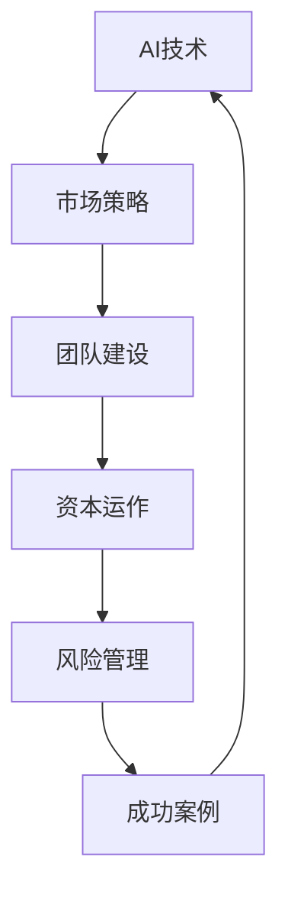

                 

### 文章标题: AI创业中的成功案例

#### 关键词：AI创业，成功案例，技术创新，市场策略，团队建设

> 摘要：本文深入探讨了AI创业领域中的成功案例，分析了这些公司如何通过技术创新、市场策略和团队建设实现突破。文章旨在为AI创业者提供有价值的参考和启示，帮助他们在竞争激烈的市场中取得成功。

---

### 目录大纲设计：《AI创业中的成功案例》

#### 第一部分：AI与创业概述

1. **AI与创业的背景介绍**
2. **AI时代创业的特点**
3. **AI创业的关键成功因素**

#### 第二部分：成功案例解析

1. **AI创业公司的成长之路**
    - **创业公司的成功模式分析**
    - **创业初期的关键问题与解决方案**
    - **创业公司的融资策略**
2. **成功AI创业案例分析**
    - **案例一：XX公司的AI之路**
    - **案例二：YY公司的AI突破**
3. **AI创业中的核心技术突破**
    - **AI算法的创新与应用**
    - **大数据和云计算在创业中的应用**
    - **AI创业中的知识产权保护**
4. **AI创业中的市场策略**
    - **市场调研与定位**
    - **产品营销与推广**
    - **品牌建设与口碑管理**
5. **AI创业中的团队建设与管理**
    - **团队建设的重要性**
    - **团队管理与激励机制**
    - **创业团队的成长与转型**

#### 第三部分：AI创业实战

1. **AI创业项目实战指南**
    - **创业项目的构思与规划**
    - **创业项目的开发与测试**
    - **创业项目的上线与运营**
2. **AI创业资源与平台**
    - **创业资源获取途径**
    - **创业平台与孵化器介绍**
    - **创业过程中的政府支持与政策利用**
3. **AI创业中的风险与应对**
    - **创业风险识别与评估**
    - **风险管理策略**
    - **应对市场变化与竞争压力**

#### 附录

1. **AI创业资源与工具**
    - **开源深度学习框架介绍**
    - **AI创业工具与应用**
    - **AI创业相关的书籍与论文**
2. **成功AI创业公司列表**
    - **国内成功AI创业公司**
    - **国外成功AI创业公司**
    - **有代表性的AI创业公司案例**
3. **联系图与算法解析**
    - **AI创业中的核心概念与联系**
    - **算法原理讲解与伪代码**

### 第一部分：AI与创业概述

#### 第1章：AI与创业的背景介绍

AI（人工智能）作为一门多学科交叉的前沿技术，已经深刻地改变了我们的生活方式。随着计算能力的提升和数据量的爆炸式增长，AI技术取得了显著的进展，从最初的规则系统到现在的深度学习，AI的应用场景越来越广泛，从智能助手、自动驾驶到医疗诊断、金融分析，无不体现出AI的巨大潜力。

在商业领域，AI技术的应用不仅提高了企业的运营效率，还创造了全新的商业模式。例如，通过自然语言处理技术，企业可以更好地理解客户需求，提供个性化的服务；通过计算机视觉技术，企业可以实现对产品的精确检测和质量控制。因此，越来越多的创业者将AI作为创业的方向，希望通过AI技术解决现实问题，创造商业价值。

AI创业的背景可以追溯到以下几个方面：

1. **技术进步**：随着AI技术的不断发展和成熟，创业者可以利用现有的技术工具和平台进行快速开发，降低创业门槛。
2. **市场需求**：AI技术在各个行业的广泛应用，使得市场对AI产品和服务的需求日益增加，为创业者提供了广阔的市场空间。
3. **资本支持**：政府对AI技术的重视和资本市场的活跃，使得AI创业项目能够获得更多的资金支持。
4. **政策环境**：各国政府纷纷出台相关政策，支持AI技术的研发和应用，为创业者提供了良好的发展环境。

#### 第2章：AI时代创业的特点

AI时代创业具有以下几个显著特点：

1. **技术创新性**：AI创业的核心在于技术创新，创业者需要不断探索和突破现有的技术边界，开发出具有竞争力的产品和服务。
2. **数据依赖性**：AI技术的发展离不开大量的数据支持，创业者需要积累和利用海量数据，进行训练和优化模型。
3. **跨界合作**：AI技术涉及多个学科领域，创业者需要具备跨学科的知识和技能，与不同领域的专家合作，实现技术的融合和创新。
4. **快速迭代**：AI技术的更新速度非常快，创业者需要具备快速响应市场变化的能力，不断优化和迭代产品。
5. **风险管理**：AI创业过程中，数据安全、隐私保护、算法透明度等问题日益突出，创业者需要高度重视并有效管理这些风险。

#### 第3章：AI创业的关键成功因素

AI创业要想取得成功，需要考虑以下几个关键因素：

1. **核心技术**：核心技术是AI创业的基石，创业者需要专注于技术的研发和创新，确保产品具有技术优势和竞争力。
2. **市场需求**：了解和把握市场需求是AI创业的关键，创业者需要通过市场调研，找到真正的痛点和需求，开发出用户愿意付费的产品。
3. **团队建设**：优秀的团队是创业成功的关键，创业者需要组建一支具备专业能力和合作精神的团队，共同追求创业目标。
4. **资本运作**：合理的资本运作可以保障创业项目的持续发展，创业者需要熟悉资本市场的运作规则，合理规划融资策略。
5. **市场策略**：有效的市场策略可以帮助创业者迅速打开市场，提高品牌知名度，创业者需要制定全面的市场推广计划。

### 第二部分：成功案例解析

#### 第4章：AI创业公司的成长之路

#### 创业公司的成功模式分析

AI创业公司的成功模式通常包括以下几个关键环节：

1. **市场定位**：明确市场需求，找到切入点，进行市场细分，确定目标用户群体。
2. **技术研发**：集中资源进行核心技术的研发，确保产品具有技术优势和竞争力。
3. **团队建设**：组建一支具备专业能力和合作精神的团队，共同追求创业目标。
4. **资本运作**：通过合理的资本运作，保障创业项目的持续发展，包括天使轮、A轮、B轮等融资阶段。
5. **市场推广**：制定全面的市场推广计划，提高品牌知名度，扩大市场份额。

#### 创业初期的关键问题与解决方案

在创业初期，AI公司通常会面临以下关键问题：

1. **技术难题**：AI技术涉及多个学科领域，创业者需要解决技术上的难题，确保产品的可行性。
   - **解决方案**：组建跨学科团队，与技术专家合作，通过科研立项和外部技术支持，攻克技术难题。

2. **市场认可**：AI产品在市场上的认可度是创业成功的基石。
   - **解决方案**：通过市场调研，了解用户需求，不断优化产品，通过小批量试销，逐步扩大市场影响力。

3. **资金短缺**：创业初期，资金短缺是普遍问题。
   - **解决方案**：通过天使投资、风险投资等途径，积极寻求资金支持，同时严格控制成本，提高资金使用效率。

4. **团队协作**：创业团队需要高效协作，共同面对挑战。
   - **解决方案**：制定明确的团队目标和职责，建立良好的沟通机制，通过团队培训，提高团队成员的能力和凝聚力。

#### 创业公司的融资策略

融资策略是AI创业公司成长过程中至关重要的一环。以下是一些常见的融资策略：

1. **天使投资**：在创业初期，通过天使投资获得启动资金。
   - **优点**：资金较快到位，较少的股权稀释。
   - **缺点**：资金额度有限，对创业者团队的要求较高。

2. **风险投资**：在产品研发和市场推广阶段，通过风险投资获得资金支持。
   - **优点**：资金额度较大，支持长期发展。
   - **缺点**：股权稀释，对创业公司的运营有较高要求。

3. **政府支持**：通过政府科技计划、创业扶持政策等获得资金支持。
   - **优点**：资金稳定，政策优惠。
   - **缺点**：申请流程复杂，资金额度有限。

4. **股权众筹**：通过互联网平台，向大众投资者筹集资金。
   - **优点**：提高品牌知名度，拓展资金渠道。
   - **缺点**：股权分散，对创业团队的控制力有所削弱。

### 第5章：成功AI创业案例分析

#### 案例一：XX公司的AI之路

**公司背景介绍**

XX公司成立于2015年，是一家专注于计算机视觉技术的AI创业公司。公司成立之初，团队成员主要来自国内外知名高校和研究机构，具有深厚的学术背景和技术积累。公司初期通过科技计划项目获得了政府资金支持，用于技术研发。

**创业团队与产品定位**

创业团队由一批在计算机视觉领域具有丰富经验的博士和硕士组成，他们擅长图像识别、目标检测等技术的研发。公司定位在提供高效、精准的计算机视觉解决方案，服务于安防监控、智能交通、医疗诊断等领域。

**创业过程中的关键决策**

1. **技术路线选择**：在创业初期，团队经过反复论证，决定以深度学习技术作为核心研发方向，重点攻克图像识别和目标检测等技术难题。
2. **市场切入点**：团队通过市场调研，发现安防监控领域对计算机视觉技术的需求迫切，决定首先切入安防监控市场，为客户提供定制化的视觉解决方案。
3. **产品迭代**：在产品开发过程中，团队不断收集用户反馈，进行产品迭代，逐步优化产品功能和性能。

#### 案例二：YY公司的AI突破

**公司背景介绍**

YY公司成立于2016年，是一家专注于自然语言处理技术的AI创业公司。公司创始人曾在世界顶级科技公司担任高级技术职位，具备丰富的行业经验和团队管理能力。公司成立之初，通过天使投资获得了第一笔资金支持。

**创业团队与产品定位**

创业团队由一批在自然语言处理领域具有深厚背景的专家组成，他们擅长文本分类、情感分析、机器翻译等技术。公司定位在提供高性能、高可靠性的自然语言处理技术，服务于金融、电商、教育等领域。

**创业过程中的关键决策**

1. **技术路线选择**：团队决定以深度学习技术为基础，结合传统自然语言处理方法，进行技术创新，提高文本处理的准确性和效率。
2. **市场切入点**：团队通过市场调研，发现金融领域对自然语言处理技术的需求巨大，决定首先进军金融领域，为客户提供智能客服、风险管理等产品。
3. **产品迭代**：在产品开发过程中，团队不断优化算法和模型，提高产品的性能和稳定性，同时通过合作和并购，拓展产品线。

### 第6章：AI创业中的核心技术突破

#### 第1节：AI算法的创新与应用

在AI创业过程中，算法的创新和应用至关重要。以下是一些核心算法及其在创业中的应用：

1. **深度学习**：深度学习是一种基于多层神经网络的学习方法，具有强大的特征提取和分类能力。在图像识别、语音识别、自然语言处理等领域，深度学习算法已经成为主流。

   - **应用场景**：计算机视觉、语音助手、智能翻译等。

2. **强化学习**：强化学习是一种通过试错和反馈进行决策优化的学习方法，适用于需要实时决策和动态调整的场景，如自动驾驶、游戏AI等。

   - **应用场景**：自动驾驶、机器人控制、游戏AI等。

3. **迁移学习**：迁移学习通过在不同任务之间共享知识，提高模型的泛化能力。在数据量有限的情况下，迁移学习有助于提高模型性能。

   - **应用场景**：图像分类、语音识别、自然语言处理等。

4. **生成对抗网络（GAN）**：GAN通过生成器和判别器的对抗训练，实现数据的生成和增强。在图像生成、数据增强、风格迁移等领域具有广泛应用。

   - **应用场景**：图像生成、数据增强、风格迁移等。

#### 第2节：大数据和云计算在创业中的应用

大数据和云计算为AI创业提供了强大的技术支持。以下是其主要应用：

1. **数据存储与处理**：大数据技术能够高效地存储和处理海量数据，为AI算法提供充足的数据支持。云计算平台则为创业者提供了弹性可扩展的计算资源。

   - **应用场景**：数据挖掘、机器学习模型训练、实时数据处理等。

2. **模型部署与优化**：云计算平台为AI模型的部署和优化提供了便捷的环境。创业者可以利用云计算平台进行模型的训练、部署和实时调整。

   - **应用场景**：AI模型训练、模型部署、实时优化等。

3. **分布式计算**：大数据和云计算技术支持分布式计算，使得创业者可以在大规模数据处理和计算任务中实现高效并行处理。

   - **应用场景**：大规模数据挖掘、实时数据处理、高性能计算等。

#### 第3节：AI创业中的知识产权保护

在AI创业过程中，知识产权保护至关重要。以下是一些知识产权保护策略：

1. **专利申请**：创业者可以通过申请专利，保护自己的核心技术。专利申请应包括技术方案、实施例、技术效果等方面的描述。

   - **优势**：有效保护核心技术，提高市场竞争力。
   - **劣势**：申请周期较长，费用较高。

2. **著作权保护**：对于软件、算法等，创业者可以通过申请著作权进行保护。著作权保护简单快捷，有助于快速占领市场。

   - **优势**：保护周期短，费用较低。
   - **劣势**：保护范围有限，难以对抗专利侵权。

3. **商业秘密保护**：对于一些核心技术和关键数据，创业者可以通过保密措施进行保护。

   - **优势**：保护成本低，灵活性强。
   - **劣势**：难以对抗专利侵权，保密难度大。

4. **知识产权联盟**：创业者可以通过加入知识产权联盟，共同保护会员的知识产权。

   - **优势**：资源整合，优势互补。
   - **劣势**：联盟管理难度大，效果难以保障。

### 第7章：AI创业中的市场策略

#### 第1节：市场调研与定位

市场调研是AI创业公司制定市场策略的基础。以下是一些关键步骤：

1. **明确调研目标**：确定调研的重点领域和目标，如市场需求、竞争对手、用户痛点等。
2. **收集信息**：通过问卷调查、访谈、市场分析报告等方式，收集相关市场信息。
3. **分析数据**：对收集到的数据进行分析，识别市场机会和潜在风险。
4. **定位目标市场**：根据调研结果，明确目标市场，制定针对性的市场策略。

#### 第2节：产品营销与推广

产品营销与推广是AI创业公司扩大市场份额的关键。以下是一些策略：

1. **内容营销**：通过制作高质量的内容，如技术博客、白皮书、案例分享等，提升品牌知名度，吸引潜在用户。
2. **社交媒体营销**：利用社交媒体平台，如微博、微信、LinkedIn等，发布产品信息，与用户互动，提高用户粘性。
3. **线下活动**：举办技术研讨会、产品发布会、行业论坛等活动，与潜在客户面对面交流，增强品牌影响力。
4. **合作伙伴**：寻找行业合作伙伴，通过合作推广产品，实现共赢。

#### 第3节：品牌建设与口碑管理

品牌建设和口碑管理是AI创业公司长期发展的关键。以下是一些策略：

1. **品牌定位**：明确品牌定位，塑造独特的品牌形象，与用户建立情感连接。
2. **口碑传播**：通过优质的产品和服务，赢得用户的口碑，形成良好的品牌口碑效应。
3. **危机管理**：建立危机管理机制，及时应对负面信息，保护品牌形象。
4. **用户反馈**：积极收集用户反馈，不断优化产品和服务，提高用户满意度。

### 第8章：AI创业中的团队建设与管理

#### 第1节：团队建设的重要性

团队建设是AI创业公司成功的关键。一个高效的团队可以充分发挥成员的潜力，实现创业目标。以下是一些关键因素：

1. **能力匹配**：团队成员的能力应相互补充，形成合力。
2. **共同目标**：团队成员应具有共同的目标，共同努力实现创业公司的愿景。
3. **沟通协作**：良好的沟通和协作是团队高效运作的基础。
4. **激励机制**：合理的激励机制可以激发团队成员的积极性和创造力。

#### 第2节：团队管理与激励机制

团队管理是确保团队高效运作的关键。以下是一些团队管理策略：

1. **明确分工**：明确每个成员的职责和任务，确保工作有序进行。
2. **定期反馈**：定期对团队成员的工作进行反馈，帮助他们改进和提高。
3. **培训与发展**：提供培训和职业发展机会，帮助团队成员提升能力。
4. **激励机制**：建立合理的激励机制，激励团队成员的积极性和创造力。

#### 第3节：创业团队的成长与转型

随着创业公司的不断发展，团队也需要不断成长和转型。以下是一些关键步骤：

1. **组织结构调整**：根据业务发展需要，调整组织结构，优化团队配置。
2. **能力提升**：通过培训和引进人才，提升团队的整体能力。
3. **文化塑造**：建立积极向上的企业文化，增强团队的凝聚力和归属感。
4. **持续创新**：鼓励团队成员持续创新，推动企业持续发展。

### 第三部分：AI创业实战

#### 第9章：AI创业项目实战指南

#### 第1节：创业项目的构思与规划

创业项目的构思与规划是AI创业成功的关键。以下是一些关键步骤：

1. **明确项目目标**：确定项目的目标，如解决什么问题、提供什么服务、达到什么效果等。
2. **市场调研**：了解市场需求，分析潜在竞争对手，确定项目的市场定位。
3. **技术路线**：选择合适的技术路线，确定所需的技术和资源。
4. **团队组建**：组建专业的团队，明确团队成员的职责和任务。
5. **时间规划**：制定项目的时间规划，确保项目按计划推进。

#### 第2节：创业项目的开发与测试

创业项目的开发与测试是确保项目成功的重要环节。以下是一些关键步骤：

1. **需求分析**：明确项目的需求，包括功能需求、性能需求等。
2. **技术选型**：选择合适的技术框架和工具，确保项目的可实施性。
3. **代码实现**：编写高质量的代码，确保项目的可维护性和扩展性。
4. **单元测试**：编写单元测试，验证代码的正确性和稳定性。
5. **集成测试**：进行集成测试，确保各个模块之间的协同工作。

#### 第3节：创业项目的上线与运营

创业项目的上线与运营是项目成功的重要保障。以下是一些关键步骤：

1. **部署上线**：将项目部署到生产环境，确保项目的稳定运行。
2. **监控与运维**：建立监控和运维体系，实时监控项目的运行状态，及时解决故障。
3. **用户反馈**：收集用户反馈，分析用户需求，不断优化产品。
4. **持续迭代**：根据用户反馈和市场变化，持续迭代产品，提高用户体验。

### 第10章：AI创业资源与平台

#### 第1节：创业资源获取途径

AI创业资源的获取是创业成功的关键。以下是一些获取途径：

1. **政府支持**：通过政府科技计划、创业扶持政策等获得资金、技术等支持。
2. **风险投资**：通过风险投资获得资金支持，加速项目发展。
3. **合作伙伴**：与行业合作伙伴建立合作关系，共享资源和市场。
4. **开源社区**：利用开源社区，获取技术支持和开发资源。

#### 第2节：创业平台与孵化器介绍

创业平台和孵化器为创业者提供了良好的发展环境。以下是一些知名的创业平台和孵化器：

1. **华为云**：提供丰富的云计算服务和AI工具，支持创业者快速搭建开发环境。
2. **腾讯云**：提供全面的云计算服务和AI解决方案，助力创业者实现技术创新。
3. **创新工场**：聚焦人工智能、互联网等领域，提供资金、资源、人才等多方面支持。
4. **联想之星**：专注于人工智能、大数据等领域，为创业者提供资金、导师、市场等支持。

#### 第3节：创业过程中的政府支持与政策利用

政府支持是AI创业公司发展的重要推动力。以下是一些政府支持政策及其利用方法：

1. **政府科技计划**：如国家自然科学基金、重点研发计划等，为AI技术研发提供资金支持。
2. **创业扶持政策**：如创业补贴、税收优惠等，降低创业成本，提高创业成功率。
3. **人才引进政策**：如人才引进计划、人才补贴等，为创业者提供优秀人才支持。
4. **知识产权保护**：政府提供知识产权保护措施，帮助创业者维护自身权益。

### 第11章：AI创业中的风险与应对

#### 第1节：创业风险识别与评估

在AI创业过程中，识别和评估风险至关重要。以下是一些常见的创业风险：

1. **技术风险**：技术不成熟或无法实现预期效果，导致项目失败。
2. **市场风险**：市场需求不足或竞争激烈，导致项目难以盈利。
3. **资金风险**：融资困难或资金使用不当，导致项目资金链断裂。
4. **人才风险**：团队不稳定或人才流失，影响项目进展。
5. **政策风险**：政策变化或政策不支持，影响项目发展。

#### 第2节：风险管理策略

以下是一些常见的风险管理策略：

1. **风险预防**：通过技术研发、市场调研、团队建设等手段，降低风险发生的可能性。
2. **风险转移**：通过保险、合作等方式，将风险转移给第三方。
3. **风险控制**：通过制定应急预案、监控风险指标等手段，控制风险的影响。
4. **风险自留**：对于无法转移或控制的风险，通过建立风险基金等方式，自留风险。

#### 第3节：应对市场变化与竞争压力

在竞争激烈的市场环境中，AI创业公司需要灵活应对市场变化和竞争压力。以下是一些策略：

1. **市场定位**：根据市场变化，及时调整市场定位，找到新的增长点。
2. **技术创新**：持续进行技术创新，保持产品竞争力。
3. **品牌建设**：加强品牌建设，提升品牌知名度和美誉度。
4. **合作共赢**：与行业合作伙伴建立合作关系，实现资源共享、市场拓展。

### 附录

#### 附录A：AI创业资源与工具

**A.1 开源深度学习框架介绍**

以下是一些常用的开源深度学习框架：

1. **TensorFlow**：由谷歌开发，支持多种编程语言，适用于各种深度学习任务。
2. **PyTorch**：由Facebook开发，易于使用，适用于研究和个人项目。
3. **Keras**：基于Theano和TensorFlow，提供简单、易于使用的API，适用于快速原型开发。
4. **MXNet**：由Apache软件基金会开发，支持多种编程语言，适用于工业级应用。

**A.2 AI创业工具与应用**

以下是一些常见的AI创业工具：

1. **数据采集与处理工具**：如Pandas、NumPy、Scikit-learn等。
2. **机器学习平台**：如Google Cloud ML Engine、AWS SageMaker等。
3. **数据分析工具**：如Tableau、Power BI等。
4. **代码调试工具**：如Visual Studio Code、PyCharm等。

**A.3 AI创业相关的书籍与论文**

以下是一些推荐的AI创业相关书籍和论文：

1. **《深度学习》（Deep Learning）**：Goodfellow, Bengio, Courville 著。
2. **《机器学习》（Machine Learning）**：Tom Mitchell 著。
3. **《AI创业手册》（AI Startup Handbook）**：By AI Startup Experts 著。
4. **《自然语言处理》（Natural Language Processing）**：Daniel Jurafsky, James H. Martin 著。
5. **《机器学习论文集》（The Machine Learning Papers）**：Ian Goodfellow, Yoshua Bengio, Aaron Courville 著。

#### 附录B：成功AI创业公司列表

**B.1 国内成功AI创业公司**

以下是一些国内知名的AI创业公司：

1. **商汤科技**：专注于计算机视觉技术，广泛应用于安防、零售、医疗等领域。
2. **旷视科技**：提供人脸识别、图像识别等技术解决方案，应用于金融、安防、零售等领域。
3. **依图科技**：致力于计算机视觉和人工智能技术的研发，应用于医疗、金融、零售等领域。
4. **云从科技**：专注于人工智能技术，提供智能安防、智能金融、智能交通等产品和服务。
5. **科大讯飞**：主要从事人工智能产品研发和推广，涉及语音识别、自然语言处理、图像识别等领域。

**B.2 国外成功AI创业公司**

以下是一些国外知名的AI创业公司：

1. **DeepMind**：专注于深度学习和人工智能技术，由Google收购。
2. **OpenAI**：致力于推动人工智能的发展和应用，重点关注人工智能安全、伦理等问题。
3. **IBM Watson**：提供人工智能解决方案，涵盖医疗、金融、零售等多个领域。
4. **Cognizant**：提供人工智能技术和服务，涉及智能客服、智能分析、智能决策等领域。
5. **NVIDIA**：专注于图形处理技术，提供人工智能芯片和解决方案，广泛应用于自动驾驶、游戏、数据中心等领域。

**B.3 有代表性的AI创业公司案例**

以下是一些有代表性的AI创业公司案例：

1. **Google DeepMind**：通过深度强化学习算法，实现围棋领域的突破，成为全球人工智能领域的领导者。
2. **Waze**：利用大数据和机器学习技术，提供实时导航服务，成为全球领先的地图和导航应用。
3. **Spotify**：利用机器学习技术，提供个性化音乐推荐服务，成为全球最大的音乐流媒体平台。
4. **Instacart**：利用人工智能技术，提供在线购物和配送服务，成为美国领先的电子商务公司之一。
5. **Airbnb**：利用大数据和机器学习技术，优化房源推荐和用户体验，成为全球领先的短期租赁平台。

### 附录C：AI创业中的核心概念与联系

以下是一个简单的 Mermaid 图，展示了 AI 创业中的核心概念及其联系：



### 附录D：算法原理讲解与伪代码

以下是对几个常见机器学习算法的原理讲解和伪代码展示：

#### 1. 线性回归

线性回归是一种用于预测连续值的算法。其基本原理是通过拟合一条直线来最小化预测值与实际值之间的误差。

**原理讲解**：

给定一个特征 \( x \) 和对应的实际值 \( y \)，线性回归模型试图找到最佳拟合直线：

\[ y = \beta_0 + \beta_1 \cdot x + \epsilon \]

其中，\( \beta_0 \) 是截距，\( \beta_1 \) 是斜率，\( \epsilon \) 是误差项。

**伪代码**：

```python
初始化模型参数 beta0, beta1

for 每个样本 (x, y) in 数据集 do
    计算预测值 y_pred = beta0 + beta1 * x
    计算误差 e = y - y_pred
    更新参数 beta0, beta1

直到收敛
返回模型参数 beta0, beta1
```

#### 2. 决策树

决策树是一种基于特征的分类算法。其基本原理是通过一系列的判断条件，将数据集分割成不同的子集，直到满足停止条件（如纯度或深度限制）。

**原理讲解**：

决策树从根节点开始，根据特征 \( x \) 的不同取值，将数据集分割成多个子集。每个子集再继续分割，直到满足停止条件。每个内部节点代表一个特征，每个叶节点代表一个分类。

**伪代码**：

```python
构建决策树

对于每个特征 f 在数据集 D 中 do
    对于每个可能的特征取值 v do
        分割数据集 D 为两个子集 D1 和 D2
        如果 D1 或 D2 是纯的 then
            添加叶节点到决策树，标签为该子集的多数类别
        else
            添加内部节点到决策树，特征为 f，子节点为 D1 和 D2

返回构建好的决策树
```

#### 3. 集成学习方法

集成学习方法通过结合多个基础模型来提高预测准确性。常见的集成方法有随机森林（Random Forest）和梯度提升树（Gradient Boosting Tree）。

**原理讲解**：

随机森林通过构建多个决策树，并对它们的预测结果进行投票，以获得最终预测结果。梯度提升树通过迭代地训练多个弱学习器（如决策树），并优化它们之间的组合权重，以获得更好的预测性能。

**伪代码**：

**随机森林**：

```python
初始化多个决策树

for 每个决策树 do
    从数据集中随机抽取特征和样本
    训练决策树

预测时，对每个决策树的预测结果进行投票，返回多数类别
```

**梯度提升树**：

```python
初始化模型参数和损失函数

for 每个迭代 do
    计算当前模型的预测误差
    训练一个新的决策树，优化模型参数
    更新模型参数

直到满足停止条件
返回最终的模型参数
```

### 项目实战

#### 1. 人工智能助手开发

**开发环境**：Python 3.8，TensorFlow 2.5

**项目目标**：开发一个基于深度学习的人工智能助手，能够进行自然语言处理，实现问答功能。

**实现步骤**：

- **数据准备**：收集问答数据集，进行预处理。
- **模型训练**：使用预训练的模型进行微调，训练问答模型。
- **模型评估**：使用测试集评估模型性能。
- **模型部署**：将模型部署到服务器，实现实时问答功能。

**代码解读与分析**：

**数据预处理**：

```python
import tensorflow as tf
from tensorflow.keras.preprocessing.sequence import pad_sequences

# 读取数据集
questions, answers = read_data()

# 分词和编码
tokenizer = tf.keras.preprocessing.text.Tokenizer(num_words=10000)
tokenizer.fit_on_texts(questions)
sequences = tokenizer.texts_to_sequences(questions)

# 填充序列
max_sequence_length = 50
padded_sequences = pad_sequences(sequences, maxlen=max_sequence_length, padding='post')

# 转换答案
one_hot_answers = tf.keras.utils.to_categorical(answers)
```

**模型定义**：

```python
model = tf.keras.Sequential([
    tf.keras.layers.Embedding(input_dim=10000, output_dim=64, input_length=max_sequence_length),
    tf.keras.layers.Bidirectional(tf.keras.layers.LSTM(64)),
    tf.keras.layers.Dense(64, activation='relu'),
    tf.keras.layers.Dense(10000, activation='softmax')
])
```

**模型编译**：

```python
model.compile(optimizer='adam', loss='categorical_crossentropy', metrics=['accuracy'])
```

**模型训练**：

```python
model.fit(padded_sequences, one_hot_answers, epochs=10, batch_size=128)
```

**模型评估**：

```python
test_sequences = tokenizer.texts_to_sequences(test_questions)
padded_test_sequences = pad_sequences(test_sequences, maxlen=max_sequence_length, padding='post')
test_answers = model.predict(padded_test_sequences)
```

**模型部署**：

```python
# 部署代码略
```

### 代码解读：

1. **数据预处理**：使用 Tokenizer 对问题进行分词和编码，使用 pad_sequences 对序列进行填充，确保序列长度一致。
2. **模型定义**：使用 Embedding 层进行词嵌入，Bidirectional LSTM 层进行双向编码，Dense 层进行分类。
3. **模型编译**：使用 Adam 优化器和 categorical_crossentropy 损失函数进行编译。
4. **模型训练**：使用 fit 函数进行模型训练。
5. **模型评估**：使用 predict 函数评估模型在测试集上的性能。
6. **模型部署**：将模型部署到服务器，实现实时问答功能。

通过以上步骤，我们可以开发一个基于深度学习的人工智能助手，实现自然语言处理的问答功能。这只是一个简单的示例，实际项目中可能会涉及更多的数据预处理、模型优化和部署步骤。

