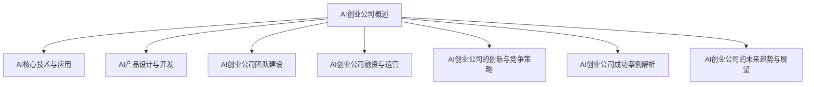

                 

# 文章标题：AI创业公司如何打造核心竞争力?

> 关键词：AI创业、核心竞争力、产品开发、团队建设、融资策略、创新思维

> 摘要：本文将从AI创业公司的概述、核心技术、产品设计与开发、团队建设、融资与运营、创新与竞争策略以及成功案例解析等多个方面，全面探讨AI创业公司如何打造核心竞争力。通过一步步分析推理，提供实用的方法和策略，帮助AI创业公司实现可持续发展。

## 目录大纲

## 第一部分: AI创业公司概述

### 第1章: AI创业背景与机遇

#### 1.1 AI行业发展现状

#### 1.2 创业公司的挑战与优势

#### 1.3 AI创业生态系统分析

#### 1.4 创业公司成功案例分析

### 第2章: AI核心技术与应用

#### 2.1 人工智能基本概念

#### 2.2 机器学习算法原理

#### 2.3 深度学习框架与应用

#### 2.4 计算机视觉与自然语言处理

### 第3章: AI产品设计与开发

#### 3.1 产品设计与用户需求分析

#### 3.2 产品设计与AI技术的融合

#### 3.3 AI产品开发流程与工具

#### 3.4 AI产品的测试与评估

### 第4章: AI创业公司团队建设

#### 4.1 团队成员的技能需求

#### 4.2 团队协作与沟通机制

#### 4.3 人才招聘与培养策略

#### 4.4 团队文化与激励制度

### 第5章: AI创业公司融资与运营

#### 5.1 创业公司融资策略

#### 5.2 运营计划与市场推广

#### 5.3 盈利模式与商业模式创新

#### 5.4 风险管理策略

### 第6章: AI创业公司的创新与竞争策略

#### 6.1 市场研究与竞争对手分析

#### 6.2 创新思维与设计方法论

#### 6.3 技术创新与产品迭代

#### 6.4 跨界合作与生态系统构建

### 第7章: AI创业公司成功案例解析

#### 7.1 案例分析框架与方法论

#### 7.2 深度学习公司案例解析

#### 7.3 自动驾驶公司案例解析

#### 7.4 医疗AI公司案例解析

### 第8章: AI创业公司的未来趋势与展望

#### 8.1 AI技术的发展趋势

#### 8.2 创业公司面临的挑战与机遇

#### 8.3 AI创业公司的可持续发展策略

#### 8.4 全球AI创业生态圈的发展

## 附录

### 附录A: AI创业常用工具与资源

#### A.1 开发工具介绍

#### A.2 数据集与开源代码

#### A.3 学术论文与研究报告

#### A.4 AI创业社区与交流平台

### Mermaid 流程图


### 核心算法原理讲解
```python
# 伪代码：神经网络基本结构
NeuralNetwork():
    # 初始化权重和偏置
    Initialize_Weights_and_Biases()

    # 前向传播
    ForwardPropagation(x):
        z = Activation(Linear(x, weights, biases))
        return z

    # 反向传播
    Backpropagation(y, z):
        delta = (z - y) * ActivationDerivative(z)
        weights -= learning_rate * (delta * x.T)
        biases -= learning_rate * delta

    # 训练模型
    Train(model, dataset):
        for x, y in dataset:
            z = ForwardPropagation(x)
            Backpropagation(y, z)
```

### 数学模型和数学公式

```latex
\section{线性回归模型}

给定一个输入向量 \( x \) 和权重向量 \( w \)，输出为 \( y = wx + b \)。

其中，\( b \) 为偏置，\( w \) 为权重。

损失函数为：
$$
J(w) = \frac{1}{2} \sum_{i=1}^{n} (y_i - wx_i - b)^2
$$

梯度下降算法更新权重和偏置：
$$
w := w - \alpha \frac{\partial J(w)}{\partial w}
$$
$$
b := b - \alpha \frac{\partial J(w)}{\partial b}
$$
```

### 项目实战
```python
# 实际代码：线性回归模型实现

import numpy as np

# 初始化参数
w = np.random.randn(1)  # 权重
b = np.random.randn(1)  # 偏置
learning_rate = 0.01
epochs = 1000

# 数据集
x_train = np.array([1, 2, 3, 4, 5])
y_train = np.array([2, 4, 6, 8, 10])

# 前向传播
def forward(x):
    return x * w + b

# 反向传播
def backward(y, pred):
    error = y - pred
    dw = (error * x) / len(x_train)
    db = (error / len(x_train))
    return dw, db

# 训练模型
for epoch in range(epochs):
    pred = forward(x_train)
    dw, db = backward(y_train, pred)
    w -= learning_rate * dw
    b -= learning_rate * db

print("w:", w)
print("b:", b)
```

### 代码解读与分析

解释线性回归模型的代码实现，并分析其关键步骤和参数设置。

1. **参数初始化**：使用随机数初始化权重 \( w \) 和偏置 \( b \)，以避免模型收敛到较差的局部最小值。

2. **前向传播**：计算模型输出 \( \hat{y} \)，其中 \( \hat{y} = x \cdot w + b \)。

3. **反向传播**：计算误差 \( \delta \) 和权重更新 \( \Delta w \) 以及偏置更新 \( \Delta b \)。

4. **权重更新**：使用梯度下降算法更新权重 \( w \) 和偏置 \( b \)，其中 \( w := w - \alpha \frac{\partial J(w)}{\partial w} \) 和 \( b := b - \alpha \frac{\partial J(w)}{\partial b} \)。

5. **迭代训练**：重复以上步骤 \( epochs \) 次来训练模型。

### 分析代码的关键步骤和参数设置：

- **随机初始化**：随机初始化可以避免模型陷入局部最小值，有助于找到更好的全局最小值。
- **学习率**：学习率是梯度下降算法的关键参数，它决定了权重更新的步长。选择适当的学习率对于模型收敛至关重要。
- **迭代次数**：迭代次数是训练模型的关键参数，它决定了模型在数据上的训练时间。适当的迭代次数可以确保模型收敛到全局最小值。

总之，线性回归模型实现的核心在于随机初始化、前向传播、反向传播和权重更新，这些步骤共同构成了梯度下降算法的核心流程。参数设置包括学习率和迭代次数，这些参数需要根据具体问题进行调整，以达到最佳训练效果。

---

### 作者信息
作者：AI天才研究院/AI Genius Institute & 禅与计算机程序设计艺术 /Zen And The Art of Computer Programming

---

# 第一部分: AI创业公司概述

## 第1章: AI创业背景与机遇

### 1.1 AI行业发展现状

人工智能（AI）作为计算机科学的重要分支，近年来取得了飞速的发展。随着计算能力的提升、大数据的普及以及算法的创新，AI技术已经渗透到各行各业，为人类的生活和工作带来了深刻的变革。

当前，AI技术在多个领域取得了显著的成果，如自动驾驶、智能家居、智能医疗、金融科技等。自动驾驶技术通过深度学习算法，实现了车辆在复杂路况下的自主行驶；智能家居系统通过自然语言处理技术，实现了对家庭设备的智能控制；智能医疗利用AI算法，提高了疾病的诊断和治疗效果；金融科技则通过机器学习算法，提升了风险控制和金融服务效率。

### 1.2 创业公司的挑战与优势

AI创业公司面临的挑战主要有以下几个方面：

1. **技术门槛高**：AI技术涉及多个学科领域，包括计算机科学、数学、统计学等，创业公司需要具备较高的技术储备和研发能力。

2. **数据依赖性强**：AI技术的训练和优化依赖于大量的高质量数据，创业公司需要投入大量资源和时间来获取和处理数据。

3. **市场竞争激烈**：随着AI技术的普及，越来越多的创业公司涌入市场，竞争日益激烈。

4. **资金压力**：AI创业公司的研发和运营需要大量资金支持，尤其是在早期阶段，资金压力较大。

然而，AI创业公司也具有以下优势：

1. **巨大的市场潜力**：AI技术具有广泛的应用前景，市场需求巨大，为创业公司提供了广阔的发展空间。

2. **创新驱动**：AI技术不断推陈出新，创业公司更容易抓住技术趋势，进行创新和突破。

3. **跨界合作机会**：AI技术可以与其他行业进行深度融合，创业公司可以积极探索跨界合作，实现共赢。

### 1.3 AI创业生态系统分析

AI创业生态系统包括以下几个方面：

1. **科研机构**：科研机构为AI创业公司提供理论支撑和技术创新，是创业公司的重要合作伙伴。

2. **投资机构**：投资机构为AI创业公司提供资金支持，助力创业公司发展壮大。

3. **产业链上下游企业**：产业链上下游企业为AI创业公司提供硬件设备、软件工具、数据处理等服务，形成完整的产业链。

4. **创业者与团队**：创业者与团队是AI创业公司的核心，他们具备创新精神和执行力，是公司发展的关键。

### 1.4 创业公司成功案例分析

以下是一些成功的AI创业公司案例：

1. **谷歌旗下的DeepMind**：DeepMind是一家专注于人工智能研究的公司，其核心算法AlphaGo在围棋领域取得了重大突破。DeepMind的成功得益于其强大的技术团队和不断的技术创新。

2. **特斯拉**：特斯拉通过自动驾驶技术，将AI与汽车产业相结合，推动了汽车行业的变革。特斯拉的成功源于其领导者的远见和卓越的技术研发能力。

3. **IBM Watson Health**：IBM Watson Health利用AI技术提高医疗诊断和治疗的准确性，为医疗行业带来了革命性变革。IBM Watson Health的成功得益于其强大的数据处理能力和对医疗领域的深刻理解。

通过以上分析，我们可以看到，AI创业公司在技术、市场、资金等方面具有独特的优势，同时也面临着一系列挑战。在未来的发展中，创业公司需要抓住机遇，不断创新，打造核心竞争力，以实现可持续发展。

## 第2章: AI核心技术与应用

### 2.1 人工智能基本概念

人工智能（AI）是指通过计算机模拟人类智能行为和智能思维方式的技术。人工智能的基本概念包括以下几个方面：

1. **机器学习**：机器学习是AI的核心技术之一，通过算法和模型，让计算机从数据中自动学习和改进。

2. **深度学习**：深度学习是机器学习的一种方法，通过构建多层神经网络，实现复杂模式的自动识别。

3. **自然语言处理**：自然语言处理（NLP）是AI的一个重要分支，旨在使计算机能够理解和处理人类语言。

4. **计算机视觉**：计算机视觉是通过计算机模拟人类的视觉感知和理解能力，实现对图像和视频的分析和处理。

5. **强化学习**：强化学习是一种通过试错和奖励机制，使计算机在特定环境中学习最佳策略的方法。

### 2.2 机器学习算法原理

机器学习算法的基本原理是通过训练模型来从数据中学习规律，然后利用这些规律进行预测和决策。机器学习算法可以分为以下几种类型：

1. **监督学习**：监督学习通过已知输入和输出数据来训练模型，使模型能够对新数据进行预测。常见的监督学习算法包括线性回归、逻辑回归和支持向量机（SVM）。

2. **无监督学习**：无监督学习通过未标记的数据来训练模型，发现数据中的隐藏结构和模式。常见的无监督学习算法包括聚类分析和降维算法。

3. **半监督学习**：半监督学习结合了监督学习和无监督学习，利用少量的标记数据和大量的未标记数据来训练模型。

4. **强化学习**：强化学习通过试错和奖励机制，使计算机在特定环境中学习最佳策略。常见的强化学习算法包括Q学习和深度强化学习。

### 2.3 深度学习框架与应用

深度学习框架是用于实现深度学习算法的工具和库，常见的深度学习框架包括TensorFlow、PyTorch和Keras等。

1. **TensorFlow**：TensorFlow是谷歌开发的开源深度学习框架，具有强大的计算能力和丰富的应用场景。

2. **PyTorch**：PyTorch是Facebook开发的开源深度学习框架，具有动态计算图和灵活的接口，适合研究人员和开发者。

3. **Keras**：Keras是一个高层次的深度学习框架，基于TensorFlow和Theano开发，具有简洁的API和易用的接口。

深度学习在计算机视觉、自然语言处理和语音识别等领域有广泛的应用。例如，在计算机视觉领域，深度学习算法可以用于图像分类、目标检测和图像生成；在自然语言处理领域，深度学习算法可以用于文本分类、机器翻译和情感分析。

### 2.4 计算机视觉与自然语言处理

计算机视觉和自然语言处理是AI的两个重要分支，它们在多个领域有广泛的应用。

1. **计算机视觉**：计算机视觉通过计算机模拟人类的视觉感知和理解能力，实现对图像和视频的分析和处理。计算机视觉的应用包括图像分类、目标检测、图像分割和视频分析等。

2. **自然语言处理**：自然语言处理通过计算机模拟人类的语言理解能力和表达能力，实现对文本数据的处理和分析。自然语言处理的应用包括文本分类、机器翻译、情感分析和语音识别等。

通过以上分析，我们可以看到，AI技术已经渗透到各个领域，为人类的生活和工作带来了巨大的变革。在未来的发展中，AI技术将继续不断创新和突破，为创业公司提供广阔的发展空间。

## 第3章: AI产品设计与开发

### 3.1 产品设计与用户需求分析

在AI产品的设计与开发过程中，用户需求分析是至关重要的一环。了解用户需求有助于确定产品功能、性能和用户体验，从而提高产品的市场竞争力。

1. **用户调研**：通过问卷调查、访谈和用户反馈等方式，收集用户对产品功能的期望、痛点和使用习惯等信息。

2. **需求分类**：将收集到的用户需求进行分类，如基本功能需求、性能需求、安全需求等。

3. **需求优先级排序**：根据用户需求的紧急程度、重要程度和实现难度等因素，对需求进行优先级排序。

4. **需求文档编写**：编写详细的需求文档，明确产品的功能、性能、用户界面和交互逻辑等。

### 3.2 产品设计与AI技术的融合

在AI产品的设计过程中，如何将AI技术与产品功能有机结合，是提升产品价值的关键。

1. **AI技术选型**：根据产品需求和用户需求，选择合适的AI技术，如机器学习、深度学习、计算机视觉、自然语言处理等。

2. **功能模块划分**：将产品功能拆分为若干模块，如数据采集模块、数据处理模块、预测模块和反馈模块等。

3. **AI技术应用**：在每个模块中应用AI技术，如使用机器学习算法进行数据预测、使用计算机视觉算法进行图像识别等。

4. **用户体验设计**：根据用户需求，设计直观、易用的用户界面，提高用户满意度。

### 3.3 AI产品开发流程与工具

AI产品的开发流程与一般软件产品的开发流程相似，主要包括需求分析、设计、开发、测试和部署等环节。

1. **需求分析**：根据需求文档，明确产品的功能和性能要求。

2. **设计**：进行系统设计和模块设计，选择合适的架构和技术栈。

3. **开发**：根据设计文档，编写代码，实现产品功能。

4. **测试**：进行单元测试、集成测试和系统测试，确保产品功能完善、性能稳定。

5. **部署**：将产品部署到生产环境，进行上线和运维。

常用的AI开发工具包括：

1. **集成开发环境（IDE）**：如PyCharm、Visual Studio Code等，用于编写和调试代码。

2. **深度学习框架**：如TensorFlow、PyTorch和Keras等，用于实现AI算法和模型。

3. **数据可视化工具**：如Matplotlib、Seaborn等，用于数据分析和可视化。

4. **持续集成和持续部署（CI/CD）**：如Jenkins、Travis CI等，用于自动化测试和部署。

### 3.4 AI产品的测试与评估

AI产品的测试与评估是确保产品质量和性能的重要环节。

1. **功能测试**：测试产品的功能是否符合需求，包括基本功能、性能和兼容性等。

2. **性能测试**：测试产品的响应时间、吞吐量和并发能力等性能指标。

3. **稳定性测试**：测试产品在长时间运行和极端条件下的稳定性。

4. **安全性测试**：测试产品的安全性和隐私保护能力，包括数据加密、权限控制和异常处理等。

5. **用户反馈**：收集用户对产品的使用体验和意见，及时进行产品优化和改进。

通过以上分析，我们可以看到，AI产品设计与开发是一个复杂而系统性的过程，需要充分考虑用户需求、技术选型、开发流程和测试评估等方面。只有在这些方面都做到位，才能打造出具有核心竞争力的AI产品。

## 第4章: AI创业公司团队建设

### 4.1 团队成员的技能需求

AI创业公司团队建设的关键在于团队成员的技能需求。一个高效的团队需要具备多样化的技能，以满足不同业务场景的需求。

1. **技术团队**：技术团队是AI创业公司的核心，主要包括以下角色：
   - **数据科学家**：负责数据处理、特征工程和模型训练，需要具备深度学习、机器学习和统计学等知识。
   - **算法工程师**：负责算法设计和优化，需要具备较强的数学和编程能力。
   - **软件工程师**：负责产品开发和系统维护，需要熟悉前端和后端技术。

2. **产品团队**：产品团队负责产品的设计、开发和迭代，主要包括以下角色：
   - **产品经理**：负责产品规划、需求分析和用户反馈，需要具备市场洞察力和项目管理能力。
   - **设计师**：负责用户界面和用户体验设计，需要具备设计思维和用户研究能力。
   - **测试工程师**：负责产品的功能测试、性能测试和稳定性测试，需要具备测试方法和工具的运用能力。

3. **运营团队**：运营团队负责产品的市场推广、用户运营和客户服务，主要包括以下角色：
   - **市场经理**：负责市场策略制定、品牌推广和渠道拓展，需要具备市场营销知识和市场策划能力。
   - **运营经理**：负责用户运营、活动策划和数据分析，需要具备用户运营和数据分析能力。
   - **客户服务代表**：负责客户咨询和投诉处理，需要具备良好的沟通能力和服务意识。

### 4.2 团队协作与沟通机制

高效的团队协作和良好的沟通机制是AI创业公司成功的关键。

1. **明确职责分工**：根据团队成员的技能和经验，明确各自的工作职责和任务，确保团队成员各司其职，提高工作效率。

2. **定期会议**：定期召开团队会议，讨论项目进展、问题解决和决策制定，确保团队成员对项目的了解和共识。

3. **信息共享**：建立信息共享平台，如企业内部邮件、即时通讯工具和项目管理软件，确保团队成员之间的信息畅通和协作顺畅。

4. **跨部门合作**：促进不同部门之间的合作，如技术团队与产品团队、运营团队的协作，提高项目的整体效率。

5. **培训与发展**：为团队成员提供培训和发展机会，提升团队整体技能水平，增强团队的凝聚力和执行力。

### 4.3 人才招聘与培养策略

人才招聘和培养是团队建设的重要环节。

1. **招聘策略**：根据团队需求和公司发展阶段，制定合理的招聘策略，如优先考虑具有相关经验和技能的候选人，适当放宽对学历和专业的要求。

2. **招聘渠道**：利用多种招聘渠道，如招聘网站、社交媒体、猎头公司和校园招聘等，扩大招聘范围，提高招聘效率。

3. **面试流程**：建立完善的面试流程，包括初试、复试和综合面试等环节，确保候选人的能力和素质符合岗位要求。

4. **培养计划**：为新员工制定详细的培养计划，包括入职培训、岗位培训和技能提升等，帮助新员工快速融入团队并胜任工作。

5. **激励机制**：建立激励机制，如绩效奖金、股权激励和职业发展机会等，激发员工的积极性和创造力。

6. **团队文化建设**：营造积极向上的团队文化，如鼓励创新、尊重个性、倡导协作等，增强团队的凝聚力和向心力。

### 4.4 团队文化与激励制度

团队文化是团队建设的重要组成部分，它能够影响团队成员的行为和价值观，从而影响团队的整体表现。

1. **价值观**：建立共同的价值观，如客户至上、创新驱动、团队合作等，确保团队成员对公司的使命和愿景有共同的认识。

2. **工作氛围**：营造轻松、开放和包容的工作氛围，鼓励团队成员提出意见和建议，促进创新和协作。

3. **沟通与反馈**：建立有效的沟通与反馈机制，鼓励团队成员之间的交流和互动，及时解决问题和调整方向。

4. **激励制度**：建立合理的激励制度，如绩效奖金、股权激励和职业发展机会等，激发员工的积极性和创造力。

5. **荣誉与表彰**：定期举办表彰活动，对在团队建设中表现突出的个人和团队进行表彰和奖励，增强团队的凝聚力和荣誉感。

通过以上分析，我们可以看到，团队建设是AI创业公司成功的关键因素之一。通过合理的技能需求、高效的协作沟通、科学的人才招聘和培养策略，以及积极的团队文化建设，AI创业公司可以打造出高效、创新的团队，从而在激烈的市场竞争中脱颖而出。

### 第5章: AI创业公司融资与运营

#### 5.1 创业公司融资策略

对于AI创业公司来说，融资策略是其发展过程中至关重要的环节。合理的融资策略能够为公司提供持续的资金支持，助力公司在技术研发、市场拓展等方面取得突破。

1. **天使轮**：天使轮通常是创业公司早期的融资阶段，目标是为公司提供启动资金。在这一阶段，创业者需要寻找有经验的投资者，如天使投资者、风险投资家等。

2. **A轮和B轮**：A轮和B轮是创业公司发展的关键阶段，主要用于技术研发和市场推广。在这一阶段，公司需要证明其技术实力和市场潜力，以吸引更多投资者的关注。

3. **C轮及以后**：C轮及以后的融资阶段，公司通常已经有一定规模和市场份额，融资目标主要是用于扩展业务、加强技术研发和提升品牌知名度。

#### 融资策略建议：

1. **明确融资目标**：在融资前，创业公司需要明确融资目标，包括融资额度、用途和期望回报等。

2. **选择合适的融资渠道**：根据公司的发展阶段和需求，选择合适的融资渠道，如风险投资、私募股权、银行贷款等。

3. **准备充分的融资材料**：包括商业计划书、财务报表、市场分析报告等，以展示公司的核心竞争力和发展潜力。

4. **优化股权结构**：在融资过程中，创业公司需要合理调整股权结构，确保公司控制权稳定。

#### 5.2 运营计划与市场推广

运营计划和市场推广是AI创业公司发展的核心环节，直接关系到公司在市场中的竞争力和品牌知名度。

1. **市场定位**：明确公司的目标市场和用户群体，制定有针对性的市场定位策略。

2. **产品推广**：制定产品推广计划，包括线上推广和线下活动，提升产品的市场认知度和用户粘性。

3. **用户运营**：通过用户调研、用户反馈和数据分析，不断优化产品功能和用户体验，提高用户满意度和忠诚度。

4. **合作伙伴关系**：与行业内的合作伙伴建立良好的合作关系，共享资源，共同推动业务发展。

#### 市场推广策略：

1. **内容营销**：通过撰写高质量的技术博客、发布研究报告和行业分析，提高公司在行业内的知名度。

2. **社交媒体营销**：利用社交媒体平台，如微信、微博、LinkedIn等，进行品牌宣传和用户互动。

3. **线下活动**：举办行业论坛、技术研讨会和产品发布会等，吸引目标用户和潜在合作伙伴的关注。

4. **广告投放**：根据市场需求和预算，选择合适的广告渠道和投放策略，提高产品曝光率。

#### 5.3 盈利模式与商业模式创新

盈利模式和商业模式创新是AI创业公司能否持续盈利和发展的关键。

1. **直接销售**：通过直接销售产品或服务获取收入，如软件销售、咨询服务等。

2. **订阅模式**：通过订阅服务获取收入，如软件订阅、会员服务、数据分析服务等。

3. **广告与推广**：通过广告和推广服务获取收入，如在线广告、推广服务、品牌合作等。

4. **平台模式**：构建平台型商业模式，通过平台交易和增值服务获取收入，如电商平台、金融平台、数据分析平台等。

#### 商业模式创新策略：

1. **跨界合作**：与其他行业进行跨界合作，拓宽业务范围，实现资源整合和互利共赢。

2. **生态系统构建**：构建完整的生态系统，包括产品、服务、合作伙伴等，提供一站式解决方案，提升用户黏性。

3. **平台化运营**：通过平台化运营，实现规模化效应和快速扩展，提高市场竞争力。

#### 5.4 风险管理策略

风险管理是AI创业公司运营过程中不可忽视的重要环节，合理的风险管理策略有助于降低风险，保障公司稳健发展。

1. **市场风险**：对市场变化进行持续监测和分析，及时调整战略和运营计划，以应对市场风险。

2. **技术风险**：加强技术研发和创新能力，确保技术领先性和稳定性，降低技术风险。

3. **资金风险**：合理规划资金使用，确保资金链稳定，避免因资金短缺导致的经营困难。

4. **法律风险**：遵循法律法规，规范公司运营和商业行为，降低法律风险。

5. **人才风险**：建立人才引进和培养机制，确保公司拥有稳定的高素质人才队伍。

#### 风险管理策略：

1. **建立风险预警机制**：通过定期风险评估和监控，及时发现潜在风险，并制定相应的应对措施。

2. **多元化融资渠道**：拓宽融资渠道，降低对单一融资方式的依赖，分散融资风险。

3. **保险保障**：购买相关保险产品，如商业保险、责任保险等，降低意外损失。

4. **法律顾问**：聘请专业法律顾问，确保公司运营和商业行为符合法律法规。

通过以上分析，我们可以看到，AI创业公司的融资与运营是一个复杂而系统性的过程，需要综合考虑融资策略、市场推广、盈利模式和风险管理等方面。只有在这些方面都做到位，AI创业公司才能在激烈的市场竞争中脱颖而出，实现可持续发展。

### 第6章: AI创业公司的创新与竞争策略

#### 6.1 市场研究与竞争对手分析

市场研究和竞争对手分析是AI创业公司制定创新与竞争策略的基础。通过对市场环境和竞争对手的深入分析，创业公司可以明确自身的优势和劣势，找到市场机会和潜在风险，从而制定有效的竞争策略。

1. **市场研究**：
   - **市场趋势**：研究AI行业的发展趋势，如新技术、新应用、新市场等。
   - **市场规模**：评估AI市场的规模和增长潜力，了解市场容量和用户需求。
   - **用户需求**：通过用户调研、问卷调查和数据分析，了解用户的需求、偏好和行为习惯。

2. **竞争对手分析**：
   - **竞争对手的产品和服务**：分析竞争对手的产品特点、优势、劣势和用户评价。
   - **竞争对手的商业模式**：研究竞争对手的盈利模式、收入来源和成本结构。
   - **竞争对手的市场策略**：了解竞争对手的市场推广、定价策略和渠道建设。

#### 竞争分析工具与方法：

1. **SWOT分析**：通过分析公司的优势（Strengths）、劣势（Weaknesses）、机会（Opportunities）和威胁（Threats），制定相应的竞争策略。

2. **五力模型**：根据波特五力模型，分析行业竞争格局、供应商议价能力、买家议价能力、替代品威胁和行业新进入者的威胁。

3. **市场细分**：将市场划分为不同的细分市场，针对每个细分市场的特点，制定有针对性的竞争策略。

#### 6.2 创新思维与设计方法论

创新思维和设计方法论是AI创业公司保持竞争力的重要手段。通过创新思维和设计方法论，创业公司可以不断推出新产品、优化现有产品，提高用户体验和市场竞争力。

1. **创新思维**：
   - **用户中心**：以用户需求为核心，关注用户痛点，提供有价值的产品和服务。
   - **跨界思维**：打破传统行业界限，探索跨领域合作，实现资源共享和优势互补。
   - **敏捷思维**：快速响应市场变化，灵活调整战略和产品方向。

2. **设计方法论**：
   - **设计思维**：通过用户研究、原型设计和迭代优化，不断改进产品，提升用户体验。
   - **敏捷开发**：采用敏捷开发方法，快速迭代产品，提高开发效率和产品质量。
   - **精益创业**：通过验证假设、快速试错和持续优化，降低创业风险，提高市场成功率。

#### 创新策略：

1. **持续创新**：设立创新实验室或创新团队，鼓励员工提出创新项目和创意，持续推动产品创新。

2. **技术储备**：加大技术研发投入，保持技术领先优势，确保公司具备持续创新的能力。

3. **合作伙伴**：与高校、科研机构和企业建立合作关系，共享技术资源和研究成果，共同推动技术创新。

#### 6.3 技术创新与产品迭代

技术创新和产品迭代是AI创业公司保持市场竞争力的重要手段。通过不断的技术创新和产品迭代，创业公司可以提升产品的性能、用户体验和市场占有率。

1. **技术创新**：
   - **算法优化**：持续优化机器学习算法和深度学习模型，提高算法的准确性和效率。
   - **硬件升级**：采用最新的硬件技术和设备，提高产品的计算能力和稳定性。
   - **系统集成**：将多个技术模块集成到一个系统中，提供一站式解决方案，提高用户体验。

2. **产品迭代**：
   - **快速迭代**：采用敏捷开发方法，快速推出产品原型，通过用户反馈不断优化产品。
   - **持续更新**：定期发布新功能和优化，持续提升产品的性能和用户体验。
   - **用户参与**：邀请用户参与产品测试和反馈，根据用户需求调整产品方向和功能。

#### 产品迭代策略：

1. **需求驱动**：根据用户需求和反馈，制定产品迭代计划，确保产品功能与用户需求保持一致。

2. **数据驱动**：通过数据分析，评估产品性能和用户行为，为产品迭代提供数据支持。

3. **团队协作**：建立跨部门的协作机制，确保产品迭代过程中各个部门的紧密配合和高效沟通。

#### 6.4 跨界合作与生态系统构建

跨界合作和生态系统构建是AI创业公司拓展市场、提升竞争力的重要途径。通过跨界合作，创业公司可以整合多方资源，实现优势互补和协同发展。

1. **跨界合作**：
   - **产业链合作**：与上下游企业建立合作关系，共同推进产业链的整合和创新。
   - **跨行业合作**：与其他行业的领军企业建立合作，探索跨界融合的新模式。
   - **跨区域合作**：与国内外合作伙伴建立联系，拓展国际市场，提高公司的全球竞争力。

2. **生态系统构建**：
   - **平台化运营**：建立开放的平台生态系统，吸引开发者、合作伙伴和用户参与，共同推动生态系统的繁荣发展。
   - **资源共享**：通过平台共享技术、数据和资源，降低开发成本，提高开发效率。
   - **生态合作**：与合作伙伴共同打造生态系统，实现互利共赢，提高公司的品牌影响力和市场竞争力。

通过以上分析，我们可以看到，AI创业公司的创新与竞争策略需要从市场研究、竞争对手分析、创新思维与设计方法论、技术创新与产品迭代以及跨界合作与生态系统构建等多个方面入手，综合运用各种方法和策略，提升公司的核心竞争力，实现可持续发展。

### 第7章: AI创业公司成功案例解析

#### 7.1 案例分析框架与方法论

在解析AI创业公司的成功案例时，我们需要采用系统化的分析和评估方法，以全面、深入地理解创业公司的成功因素和经验教训。以下是一个常用的案例分析框架和方法论：

1. **背景分析**：了解创业公司的起源、发展历程、创始团队背景和市场环境等，为后续分析提供基础。

2. **业务模式分析**：研究创业公司的商业模式、盈利模式、市场定位和产品策略，分析其独特的竞争优势和市场份额。

3. **技术分析**：深入探讨创业公司所采用的技术架构、核心技术、研发投入和技术创新，分析其对业务发展的支撑作用。

4. **市场分析**：评估创业公司的市场环境、目标用户群体、市场拓展策略和用户反馈，分析其市场占有率和用户忠诚度。

5. **团队分析**：分析创业公司的人才结构、团队文化、激励机制和管理模式，探讨其对公司发展的影响。

6. **财务分析**：研究创业公司的财务状况、融资历程、资金使用效率、盈利能力和成长潜力，评估其财务健康状况。

7. **风险分析**：识别创业公司面临的市场风险、技术风险、资金风险和管理风险，分析其风险管理和应对策略。

#### 7.2 深度学习公司案例解析

**案例背景**：

一家深度学习公司，成立于2015年，由几位在顶级大学获得博士学位的创始人共同创立。公司专注于提供高效的深度学习解决方案，服务包括自动驾驶、智能医疗和金融科技等领域。

**业务模式分析**：

- **商业模式**：公司采用平台化运营模式，提供开放的深度学习平台和API，为开发者和企业用户提供一站式服务。
- **盈利模式**：公司主要通过提供技术支持和咨询服务获取收入，同时通过技术授权和合作项目获得额外收益。
- **市场定位**：公司定位于高端市场，专注于技术领先和用户体验，通过差异化策略在市场中占据一席之地。

**技术分析**：

- **核心技术**：公司自主研发了一套高效的深度学习框架，支持多种神经网络结构，具有出色的性能和扩展性。
- **研发投入**：公司高度重视技术研发，持续投入大量资源进行技术攻关和创新，确保技术领先优势。
- **技术创新**：公司不断推动技术迭代和优化，如引入新的算法、优化模型结构、提升计算效率等。

**市场分析**：

- **市场环境**：深度学习市场正处于快速发展阶段，市场需求旺盛，但竞争激烈。
- **目标用户群体**：公司的目标用户包括自动驾驶企业、智能医疗企业和金融科技公司等，具有高技术要求和支付能力。
- **市场拓展策略**：公司通过参加行业展会、举办技术研讨会和发布白皮书等手段，提高品牌知名度和市场影响力。

**团队分析**：

- **人才结构**：公司团队主要由顶尖的技术人才组成，具有丰富的行业经验和创新精神。
- **团队文化**：公司倡导开放、创新和协作的文化，鼓励员工提出创新项目和改进建议。
- **激励机制**：公司采用股权激励和绩效奖金等激励机制，激发员工的积极性和创造力。

**财务分析**：

- **财务状况**：公司自成立以来，通过多轮融资获得大量资金支持，财务状况稳定，具备较强的资金使用效率。
- **盈利能力**：公司逐步实现盈利，收入来源稳定，盈利能力不断提升。

**风险分析**：

- **市场风险**：市场竞争加剧可能影响公司市场份额和盈利能力。
- **技术风险**：技术更新迭代快，公司需要持续投入研发，以保持技术领先。
- **资金风险**：公司需要合理规划资金使用，确保资金链稳定。
- **管理风险**：公司需要加强管理，确保公司运营的规范化和高效性。

#### 7.3 自动驾驶公司案例解析

**案例背景**：

一家自动驾驶公司，成立于2016年，由几位在自动驾驶领域有丰富经验的工程师创立。公司致力于研发自动驾驶解决方案，服务包括自动驾驶车辆、自动驾驶系统和自动驾驶地图等。

**业务模式分析**：

- **商业模式**：公司采用B2B模式，为汽车制造商、物流公司和公共交通公司提供自动驾驶解决方案。
- **盈利模式**：公司主要通过销售自动驾驶系统和提供定制化服务获取收入，同时通过技术授权和合作项目获得额外收益。
- **市场定位**：公司定位于中高端市场，提供高质量和高可靠性的自动驾驶解决方案。

**技术分析**：

- **核心技术**：公司自主研发了一套先进的自动驾驶系统，包括感知、决策和控制模块，具有较高的安全性和稳定性。
- **研发投入**：公司持续投入大量资源进行技术研发，特别是在感知技术和控制算法方面，确保技术领先优势。
- **技术创新**：公司不断推动技术迭代和优化，如引入新的传感器、优化算法结构和提升系统性能等。

**市场分析**：

- **市场环境**：自动驾驶市场处于快速发展阶段，但受制于技术和成本等因素，市场尚未大规模爆发。
- **目标用户群体**：公司的目标用户包括汽车制造商、物流公司和公共交通公司等，具有高技术要求和支付能力。
- **市场拓展策略**：公司通过参加国际自动驾驶大会、举办技术研讨会和发布自动驾驶演示等手段，提高品牌知名度和市场影响力。

**团队分析**：

- **人才结构**：公司团队主要由自动驾驶领域的顶尖人才组成，具有丰富的行业经验和创新精神。
- **团队文化**：公司倡导创新、协作和持续学习，鼓励员工提出创新项目和改进建议。
- **激励机制**：公司采用股权激励和绩效奖金等激励机制，激发员工的积极性和创造力。

**财务分析**：

- **财务状况**：公司自成立以来，通过多轮融资获得大量资金支持，财务状况稳定，具备较强的资金使用效率。
- **盈利能力**：公司逐步实现盈利，收入来源稳定，盈利能力不断提升。

**风险分析**：

- **市场风险**：市场竞争加剧可能影响公司市场份额和盈利能力。
- **技术风险**：自动驾驶技术复杂，公司需要持续投入研发，以保持技术领先。
- **资金风险**：公司需要合理规划资金使用，确保资金链稳定。
- **管理风险**：公司需要加强管理，确保公司运营的规范化和高效性。

#### 7.4 医疗AI公司案例解析

**案例背景**：

一家医疗AI公司，成立于2018年，由几位在医疗领域有丰富经验的医生和人工智能专家共同创立。公司专注于研发AI辅助医疗诊断系统，服务包括医学影像分析、疾病预测和个性化治疗方案等。

**业务模式分析**：

- **商业模式**：公司采用B2B模式，为医疗机构和医生提供AI辅助医疗诊断系统，通过技术授权和合作项目获取收益。
- **盈利模式**：公司主要通过销售AI系统、提供定制化服务和培训获取收入，同时通过技术合作和科研支持获得额外收益。
- **市场定位**：公司定位于高端医疗市场，提供高质量的AI辅助医疗诊断服务。

**技术分析**：

- **核心技术**：公司自主研发了一套先进的AI辅助医疗诊断系统，包括图像识别、疾病预测和智能推荐等模块，具有较高的准确性和可靠性。
- **研发投入**：公司持续投入大量资源进行技术研发，特别是在医学影像分析和疾病预测方面，确保技术领先优势。
- **技术创新**：公司不断推动技术迭代和优化，如引入新的算法、扩展疾病预测范围和提升诊断准确性等。

**市场分析**：

- **市场环境**：医疗AI市场正处于快速发展阶段，但受制于技术和法规等因素，市场尚未大规模爆发。
- **目标用户群体**：公司的目标用户包括医院、诊所和医学研究机构等，具有高技术要求和支付能力。
- **市场拓展策略**：公司通过参加国际医疗技术展会、举办技术研讨会和发布AI诊断系统白皮书等手段，提高品牌知名度和市场影响力。

**团队分析**：

- **人才结构**：公司团队主要由医疗领域的顶尖专家和人工智能领域的资深工程师组成，具有丰富的行业经验和创新精神。
- **团队文化**：公司倡导创新、协作和持续学习，鼓励员工提出创新项目和改进建议。
- **激励机制**：公司采用股权激励和绩效奖金等激励机制，激发员工的积极性和创造力。

**财务分析**：

- **财务状况**：公司自成立以来，通过多轮融资获得大量资金支持，财务状况稳定，具备较强的资金使用效率。
- **盈利能力**：公司逐步实现盈利，收入来源稳定，盈利能力不断提升。

**风险分析**：

- **市场风险**：市场竞争加剧可能影响公司市场份额和盈利能力。
- **技术风险**：医疗AI技术复杂，公司需要持续投入研发，以保持技术领先。
- **资金风险**：公司需要合理规划资金使用，确保资金链稳定。
- **法规风险**：医疗AI系统需要遵循严格的法规和标准，公司需要确保系统的合规性。

通过以上案例分析，我们可以看到，AI创业公司的成功离不开合理的商业模式、技术创新、团队建设和市场策略。每个成功案例都有其独特的经验教训，可以为其他创业公司提供宝贵的借鉴和启示。

### 第8章: AI创业公司的未来趋势与展望

#### 8.1 AI技术的发展趋势

人工智能（AI）技术正处于快速发展阶段，未来几年内，AI技术将继续在多个领域取得突破，推动各行各业的数字化转型和创新发展。

1. **深度学习**：深度学习是AI技术的核心，未来将继续向更深、更广的方向发展。随着计算能力的提升和算法的优化，深度学习在计算机视觉、自然语言处理和语音识别等领域的性能将进一步提升。

2. **强化学习**：强化学习是一种通过试错和奖励机制，使计算机在特定环境中学习最佳策略的方法。未来，强化学习将在自动驾驶、智能客服和游戏等领域发挥重要作用。

3. **联邦学习**：联邦学习是一种在分布式环境中进行机器学习的方法，可以保护用户隐私，同时提高模型性能。未来，联邦学习将在医疗健康、金融服务和物联网等领域得到广泛应用。

4. **生成对抗网络（GAN）**：生成对抗网络是一种通过两个对抗网络进行博弈，生成高质量数据的机器学习方法。未来，GAN将在图像生成、视频制作和艺术创作等领域发挥重要作用。

5. **AI芯片**：随着AI应用的普及，AI芯片的发展将推动计算能力的提升。未来，AI芯片将更加高效、低功耗，支持更多复杂的AI算法和应用场景。

#### 8.2 创业公司面临的挑战与机遇

AI创业公司在未来发展中将面临一系列挑战和机遇。

**挑战**：

1. **技术风险**：AI技术快速迭代，创业公司需要持续投入研发，以保持技术领先。同时，AI技术的不确定性和复杂性可能导致研发失败或项目延误。

2. **数据依赖**：AI技术的发展离不开大量高质量数据，创业公司需要投入大量资源和时间来获取和处理数据。数据隐私和伦理问题也将成为重要的挑战。

3. **市场竞争**：随着AI技术的普及，越来越多的创业公司涌入市场，竞争日益激烈。创业公司需要不断优化产品和服务，以保持市场竞争力。

4. **资金压力**：AI创业公司通常需要大量资金支持，尤其是在早期阶段。创业公司需要合理规划资金使用，确保资金链稳定。

**机遇**：

1. **市场潜力**：AI技术具有广泛的应用前景，市场需求巨大。创业公司可以抓住市场机遇，开发具有创新性的AI产品和服务。

2. **跨界合作**：AI技术可以与其他行业进行深度融合，如智能制造、智慧医疗和智慧城市等。创业公司可以通过跨界合作，拓展业务领域，实现共赢。

3. **政策支持**：各国政府对AI技术的发展高度重视，出台了一系列扶持政策和资金支持。创业公司可以积极争取政策支持和资金支持，推动业务发展。

#### 8.3 AI创业公司的可持续发展策略

为了应对挑战和抓住机遇，AI创业公司需要制定可持续发展策略。

1. **技术创新**：持续投入研发，保持技术领先优势。通过技术创新，不断提升产品性能和用户体验，增强市场竞争力。

2. **数据驱动**：加强数据管理和分析能力，提高数据利用效率。通过数据驱动，优化产品和服务，实现精准营销和个性化推荐。

3. **跨界合作**：积极寻求与其他行业的合作，探索跨界融合的新模式。通过跨界合作，拓宽业务领域，实现资源共享和优势互补。

4. **人才培养**：重视人才培养和团队建设，建立高效、协作的团队文化。通过培训和发展，提升员工技能和创新能力，增强团队凝聚力。

5. **风险管理**：建立完善的风险管理机制，识别和应对潜在风险。通过合理规划资金使用和风险控制，确保公司稳健发展。

6. **社会责任**：关注社会责任，推动AI技术的健康发展。遵守法律法规，保护用户隐私，积极履行企业社会责任。

#### 8.4 全球AI创业生态圈的发展

全球AI创业生态圈正在迅速发展，各国纷纷出台政策支持和资金投入，推动AI技术的创新和应用。

1. **美国**：美国是全球AI技术的领军国家，拥有众多顶尖的AI创业公司和科研机构。美国政府出台了一系列政策，支持AI技术的发展和创新。

2. **中国**：中国是全球最大的AI市场，政府高度重视AI技术的发展，出台了一系列扶持政策和资金支持。中国AI创业公司数量众多，发展迅速。

3. **欧洲**：欧洲各国也在积极推进AI技术的发展，欧盟出台了《人工智能伦理准则》，推动AI技术的健康发展。

4. **亚洲其他国家**：亚洲其他国家如日本、韩国等也在积极发展AI技术，出台相关政策和支持措施，推动AI创业生态圈的发展。

通过以上分析，我们可以看到，AI创业公司面临着广阔的发展前景和巨大的市场机遇。在未来的发展中，AI创业公司需要不断技术创新、跨界合作、人才培养和风险管理，以应对挑战和抓住机遇，实现可持续发展。

### 附录A: AI创业常用工具与资源

#### A.1 开发工具介绍

在AI创业过程中，选择合适的开发工具对于提升开发效率、确保项目顺利进行至关重要。以下是一些常用的AI开发工具：

1. **TensorFlow**：由谷歌开发的开源深度学习框架，具有强大的计算能力和丰富的API接口，适用于各种深度学习任务。

2. **PyTorch**：由Facebook开发的深度学习框架，具有动态计算图和灵活的接口，适合研究人员和开发者进行快速原型设计和实验。

3. **Keras**：基于TensorFlow和Theano开发的高层次深度学习框架，提供简洁的API接口，适合快速搭建和训练深度学习模型。

4. **Scikit-learn**：由Scikit-learn团队开发的开源机器学习库，包含多种经典的机器学习算法，适合进行监督学习和无监督学习任务。

5. **Jupyter Notebook**：是一款交互式的计算环境，适用于数据分析和机器学习项目的原型设计和演示。

6. **Docker**：一种容器化技术，可用于构建、运行和分发应用程序，简化了开发、测试和部署流程。

#### A.2 数据集与开源代码

AI项目的发展离不开大量高质量的数据集和开源代码。以下是一些常用的数据集和开源代码资源：

1. **Kaggle**：一个数据科学竞赛平台，提供各种领域的数据集，适合进行数据分析和模型训练。

2. **UCI Machine Learning Repository**：一个提供多种领域数据集的数据库，适合进行机器学习研究和项目开发。

3. **GitHub**：一个代码托管平台，提供大量的开源代码和项目，适合进行技术学习和项目协作。

4. **AI Challenger**：一个提供多种领域数据集和开源代码的竞赛平台，适合进行AI应用开发和创新。

5. **Datawolf**：一个数据集搜索引擎，可以搜索和下载各种领域的数据集。

6. **Papers with Code**：一个提供深度学习论文和代码的平台，适合进行论文阅读和代码复现。

#### A.3 学术论文与研究报告

阅读学术论文和研究报告是了解AI领域最新动态和发展趋势的重要途径。以下是一些常用的学术论文与研究报告资源：

1. **ArXiv**：一个预印本论文平台，涵盖计算机科学、物理学、数学等领域的最新研究成果。

2. **Google Scholar**：一个学术搜索引擎，可以搜索和查看全球范围内的学术论文。

3. **NeurIPS**：一个专注于机器学习和计算神经科学的顶级会议，发布大量的高水平研究成果。

4. **ICML**：一个专注于机器学习和数据科学的顶级会议，发布大量的前沿研究成果。

5. **JMLR**：一个专注于机器学习领域的顶级期刊，发布高质量的学术论文。

6. **NIPS**：一个专注于机器学习和计算神经科学的顶级会议，发布大量的高水平研究成果。

#### A.4 AI创业社区与交流平台

参与AI创业社区和交流平台可以拓展人脉、获取资源和了解行业动态。以下是一些常用的AI创业社区与交流平台：

1. **AI Startup Weekly**：一个发布AI创业公司和新闻的周刊，适合了解AI创业领域最新动态。

2. **AI Startup Digest**：一个发布AI创业公司和新闻的日报，适合了解AI创业领域每日动态。

3. **AI on Startups**：一个专注于AI创业的博客，分享AI创业经验和行业见解。

4. **AI Startup News**：一个发布AI创业公司和新闻的博客，适合了解AI创业领域最新动态。

5. **AI Founders**：一个AI创业者的社区，提供创业指导、资源和人脉。

6. **AI on Campus**：一个面向高校和研究机构的AI创业社区，提供AI创业指导和资源支持。

通过使用以上工具和资源，AI创业公司可以提升开发效率、优化产品和服务，加快项目进展，提高市场竞争力。同时，积极参与社区和交流平台，可以拓展人脉、获取资源和了解行业动态，为创业公司的发展提供有力支持。

