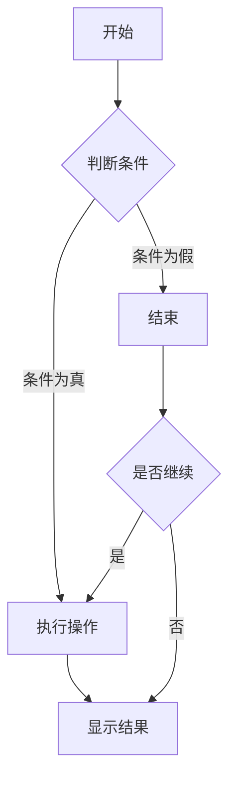

                 

# 《AI创业公司如何进行商业模式创新?》

> 关键词：AI创业、商业模式创新、商业战略、市场定位、盈利模式

> 摘要：本文将探讨AI创业公司如何进行商业模式创新，分析面临的挑战与机遇，介绍商业模式创新的概念与类型，探讨AI与商业模式创新的关系，提出商业模式创新的SWOT分析、创新思维与方法，以及实施与评估策略。同时，本文将结合实际案例，深入解析AI创业公司在商业模式创新中的具体实践，为创业公司提供切实可行的商业模式创新策略。

## 第一部分：商业模式创新的概述

### 1.1.1 AI创业公司面临的挑战与机遇

#### 1.1.1.1 挑战分析

AI创业公司在发展中面临诸多挑战，如技术的不确定性、市场竞争的激烈、资金和人才的短缺等。首先，技术的不确定性是AI创业公司面临的最大挑战之一。虽然AI技术发展迅速，但其复杂性、不确定性和易变性使得公司在研发和应用过程中面临巨大风险。其次，市场竞争的激烈性使得AI创业公司在市场份额和客户获取方面面临巨大压力。众多企业纷纷进入AI领域，市场竞争日益激烈。最后，资金和人才的短缺也是AI创业公司面临的重要挑战。AI技术的研发和推广需要大量的资金投入和专业技术人才，这对创业公司来说是一大考验。

#### 1.1.1.2 机遇发掘

尽管面临诸多挑战，但AI创业公司同样拥有巨大的机遇。首先，AI技术的快速发展为创业公司提供了广阔的发展空间。随着AI技术的不断突破，创业公司可以基于新技术推出创新产品和服务，满足市场需求。其次，市场的巨大潜力为AI创业公司提供了丰富的商机。全球范围内，各行业都在积极拥抱AI技术，为其提供广阔的应用场景和市场需求。最后，政府的支持也为AI创业公司创造了有利的外部环境。许多国家和地区出台了一系列政策，鼓励AI技术创新和创业发展。

### 1.1.2 商业模式创新的概念与定义

#### 1.1.2.1 商业模式的概念

商业模式是指企业通过创造、传递和捕获价值的系统和方法。它包括企业的产品或服务、客户群体、价值主张、盈利模式、成本结构、合作伙伴关系等核心要素。商业模式是企业实现盈利和发展的基础，对于企业的成功至关重要。

#### 1.1.2.2 商业模式创新的定义

商业模式创新是指在现有商业模式的基础上，通过引入新的元素、改变现有要素之间的关系或重新组合现有要素，创造新的商业模式，从而实现更高效的价值创造和传递。商业模式创新不仅包括盈利模式的创新，还包括产品、服务、客户群体、合作伙伴关系等方面的创新。

### 1.1.3 商业模式创新的类型

#### 1.1.3.1 基于技术的商业模式创新

基于技术的商业模式创新是指通过引入新技术或改进现有技术，创造新的商业模式。这种创新方式可以带来显著的成本优势、效率提升和市场扩展。例如，云计算和大数据技术的出现，为创业公司提供了更灵活、更高效的计算和数据处理能力，推动了企业服务、数据分析等领域的商业模式创新。

#### 1.1.3.2 基于市场的商业模式创新

基于市场的商业模式创新是指通过市场分析和需求挖掘，发现新的市场机会，创造新的商业模式。这种创新方式可以帮助企业迅速抓住市场机遇，实现快速增长。例如，共享经济模式的出现，基于对市场需求的深刻洞察，创造了全新的商业模式，推动了住宿、交通等领域的变革。

#### 1.1.3.3 基于资源的商业模式创新

基于资源的商业模式创新是指通过整合和利用企业的资源优势，创造新的商业模式。这种创新方式可以充分发挥企业的核心竞争力，提高企业的盈利能力和市场竞争力。例如，华为通过全球布局和强大供应链管理能力，创造了独特的商业模式，实现了全球市场的快速扩展。

### 1.1.4 商业模式创新的流程与策略

#### 1.1.4.1 商业模式创新流程概述

商业模式创新是一个系统性、持续性的过程，包括需求分析、创意产生、创意筛选、商业模式设计、商业模式验证、商业模式实施和商业模式优化等环节。每个环节都需要充分的市场调研、数据分析和创新思维，以确保商业模式创新的可行性和有效性。

#### 1.1.4.2 商业模式创新策略

商业模式创新策略包括以下几个方面：

1. **市场导向**：以市场需求为导向，挖掘市场机会，创造新的商业模式。
2. **技术驱动**：以技术创新为核心，利用新技术推动商业模式创新。
3. **资源整合**：整合企业内外部资源，打造独特的商业模式。
4. **差异化定位**：通过差异化定位，创造竞争优势，实现商业模式创新。
5. **持续优化**：在商业模式实施过程中，不断优化和调整，确保商业模式的有效性。

## 第二部分：商业模式创新的方法与实践

### 2.1.1 AI与商业模式创新的关系

#### 2.1.1.1 AI技术如何推动商业模式创新

AI技术作为一种强大的工具，可以推动商业模式创新，为企业创造更多价值。首先，AI技术可以提高生产效率，降低成本。例如，智能自动化技术可以替代人工完成重复性工作，提高生产效率，降低劳动力成本。其次，AI技术可以优化决策过程，提高业务智能化水平。通过大数据分析和机器学习算法，企业可以更好地理解市场趋势和客户需求，做出更精准的决策。此外，AI技术还可以拓展新的业务领域，创造新的市场机会。例如，智能客服系统可以帮助企业提供24小时不间断的客户服务，提升客户满意度，开拓新的市场空间。

#### 2.1.1.2 AI技术在商业模式创新中的应用场景

AI技术在商业模式创新中的应用场景广泛，包括但不限于以下几个方面：

1. **智能自动化**：利用AI技术实现生产过程的自动化，提高生产效率和降低成本。
2. **智慧物流**：通过AI技术优化物流网络，提高物流效率，降低物流成本。
3. **智能医疗**：利用AI技术进行疾病诊断、药物研发和医疗管理，提高医疗服务质量。
4. **智能金融**：利用AI技术进行风险控制、信用评估和投资决策，提高金融服务水平。
5. **智慧城市**：通过AI技术实现城市管理的智能化，提高城市管理效率和居民生活质量。

### 2.1.2 商业模式创新的SWOT分析

#### 2.1.2.1 SWOT分析的概念

SWOT分析是一种常用的战略分析方法，用于评估企业的优势（Strengths）、劣势（Weaknesses）、机会（Opportunities）和威胁（Threats）。通过SWOT分析，企业可以全面了解自身的内外部环境，制定出更加科学合理的战略规划。

#### 2.1.2.2 SWOT分析在商业模式创新中的应用

在商业模式创新过程中，SWOT分析可以帮助企业识别内外部环境中的关键因素，为商业模式创新提供有力支持。具体应用如下：

1. **优势分析**：通过分析企业的优势，企业可以明确自身的核心竞争力，为商业模式创新提供基础。例如，企业可以利用技术优势开发具有竞争力的产品或服务，利用品牌优势开拓市场。
2. **劣势分析**：通过分析企业的劣势，企业可以发现自身的不足，为商业模式创新提供改进方向。例如，企业可以通过优化内部流程、提高管理水平来克服劣势。
3. **机会分析**：通过分析外部环境中的机会，企业可以抓住市场机遇，实现商业模式创新。例如，企业可以针对新兴市场开发新产品或服务，利用政策支持获取资金支持。
4. **威胁分析**：通过分析外部环境中的威胁，企业可以预见潜在风险，为商业模式创新提供预警。例如，企业需要关注竞争对手的动态，及时调整战略以应对竞争压力。

### 2.1.3 商业模式创新的创新思维与方法

#### 2.1.3.1 创新思维的重要性

创新思维是指企业运用创造性思维，发现新机会、创造新价值的过程。创新思维是商业模式创新的核心，是企业持续发展的动力。只有具备创新思维，企业才能在激烈的市场竞争中脱颖而出。

#### 2.1.3.2 创新方法的介绍与实践

1. **头脑风暴**：头脑风暴是一种常用的创新方法，通过集思广益，激发创意。在商业模式创新过程中，企业可以组织团队进行头脑风暴，探讨新的商业模式。

2. **设计思考**：设计思考是一种以人为本的创新方法，强调用户需求和体验。在商业模式创新过程中，企业可以运用设计思考方法，从用户角度出发，设计具有吸引力的商业模式。

3. **快速迭代**：快速迭代是一种快速验证和改进创新的方法。在商业模式创新过程中，企业可以采用快速迭代方法，不断优化商业模式，提高成功率。

4. **跨界合作**：跨界合作是一种通过整合不同领域资源和能力的创新方法。在商业模式创新过程中，企业可以寻求与其他领域的企业或机构合作，共同开发新的商业模式。

### 2.1.4 商业模式创新的案例分析

#### 2.1.4.1 国内外成功案例分析

1. **滴滴出行**：滴滴出行通过整合出租车、快车、专车等资源，打造了全新的出行商业模式，成为全球最大的移动出行平台。滴滴出行的成功经验在于充分利用AI技术优化调度和派单，提高服务效率，满足用户需求。

2. **美团点评**：美团点评通过整合餐饮、酒店、旅游等资源，打造了全方位的本地生活服务平台。美团点评的成功经验在于不断创新，推出多样化的产品和服务，满足用户多样化的需求。

3. **特斯拉**：特斯拉通过技术创新和商业模式创新，成为电动汽车行业的领军企业。特斯拉的成功经验在于充分利用AI技术优化驾驶体验，提高电动汽车的性能和安全性。

#### 2.1.4.2 案例分析中的商业模式创新关键要素

1. **技术优势**：充分利用AI技术，提高业务效率和用户体验。

2. **市场洞察**：深入分析市场需求，推出符合用户需求的产品和服务。

3. **资源整合**：整合企业内外部资源，打造独特的商业模式。

4. **差异化定位**：通过差异化定位，创造竞争优势，实现商业模式创新。

## 第三部分：商业模式创新的实施与评估

### 3.1.1 商业模式创新的项目规划

#### 3.1.1.1 项目目标设定

项目目标是指项目预期达到的成果和标准。在商业模式创新项目中，项目目标应明确、具体、可衡量、可实现、有时限（SMART原则）。具体包括以下几个方面：

1. **创新目标**：明确商业模式创新的具体方向和目标，如提高用户体验、降低成本、拓展市场份额等。
2. **财务目标**：设定项目预期带来的财务收益，如收入增长、利润提升等。
3. **市场目标**：确定项目在市场竞争中的定位和目标，如提高品牌知名度、扩大市场份额等。
4. **时间目标**：设定项目完成的时间表，包括各个阶段的完成时间。

#### 3.1.1.2 项目资源分配

项目资源包括资金、人力、技术、设备等。在商业模式创新项目中，资源分配应合理、高效，确保项目顺利进行。具体包括以下几个方面：

1. **资金分配**：根据项目需求和预算，合理分配资金，确保项目各项活动的顺利进行。
2. **人力分配**：根据项目需求和团队成员的专业背景，合理分配人力资源，确保项目团队具备完成任务的能力。
3. **技术分配**：充分利用企业内外部技术资源，确保项目所需的技术支持。
4. **设备分配**：根据项目需求，提供必要的设备和工具，确保项目顺利进行。

### 3.1.2 商业模式创新的执行策略

#### 3.1.2.1 执行团队搭建

执行团队是指负责商业模式创新项目实施和推进的团队。一个高效的执行团队应具备以下特点：

1. **专业素养**：团队成员具备丰富的专业知识和经验，能够胜任项目任务。
2. **协作精神**：团队成员之间具有良好的沟通和协作能力，能够共同推进项目进展。
3. **执行力**：团队成员具备较强的执行力，能够按照项目计划和目标，高效完成任务。

#### 3.1.2.2 执行计划制定

执行计划是指项目实施的具体步骤和措施。在商业模式创新项目中，执行计划应包括以下几个方面：

1. **项目进度安排**：明确项目的各个阶段和任务，设定合理的完成时间。
2. **资源配置计划**：根据项目需求和资源状况，制定详细的资源配置计划。
3. **风险管理计划**：识别项目风险，制定相应的风险应对措施。
4. **沟通与协作机制**：建立有效的沟通与协作机制，确保团队成员之间的信息畅通。

### 3.1.3 商业模式创新的评估与调整

#### 3.1.3.1 评估指标体系建立

评估指标体系是指用于评估商业模式创新项目效果的一系列指标。在商业模式创新项目中，评估指标体系应包括以下几个方面：

1. **创新效果评估**：评估商业模式创新是否达到预期目标，如用户满意度、市场份额等。
2. **财务效益评估**：评估商业模式创新对企业的财务效益，如收入增长、利润提升等。
3. **市场竞争力评估**：评估商业模式创新对企业在市场竞争中的地位和影响力。
4. **可持续发展评估**：评估商业模式创新的可持续性，如资源利用、环境影响等。

#### 3.1.3.2 商业模式调整与优化

在商业模式创新过程中，根据评估结果，对商业模式进行调整和优化，以确保其持续适应市场环境和用户需求。具体包括以下几个方面：

1. **优化业务流程**：根据用户反馈和业务需求，优化业务流程，提高运营效率。
2. **调整盈利模式**：根据市场变化和竞争态势，调整盈利模式，提高盈利能力。
3. **改进产品与服务**：根据用户需求和体验，改进产品与服务，提升用户满意度。
4. **创新营销策略**：根据市场趋势和用户行为，创新营销策略，提高市场竞争力。

## 第四部分：AI创业公司的商业模式创新策略

### 4.1.1 AI创业公司的商业模式创新策略概述

#### 4.1.1.1 AI创业公司商业模式创新的特殊性

AI创业公司在商业模式创新方面具有特殊性，主要体现在以下几个方面：

1. **技术创新驱动**：AI创业公司的核心竞争力在于技术创新，商业模式创新往往与技术发展密切相关。
2. **市场变化快速**：AI技术发展迅速，市场需求变化频繁，创业公司需要快速适应市场变化，进行商业模式创新。
3. **资源相对有限**：AI创业公司通常处于初创阶段，资源相对有限，商业模式创新需要在资源有限的情况下进行。

#### 4.1.1.2 AI创业公司商业模式创新的优势与挑战

1. **优势**：
   - 技术创新：AI创业公司具有技术创新优势，可以基于新技术推出创新产品和服务。
   - 市场潜力：AI技术在各个领域都有广泛的应用前景，创业公司可以抓住市场机遇，开拓新市场。
   - 创新氛围：AI创业公司通常具有创新氛围，鼓励员工进行创新，推动商业模式创新。

2. **挑战**：
   - 技术风险：AI技术具有不确定性和易变性，创业公司需要面对技术风险。
   - 市场竞争：AI领域市场竞争激烈，创业公司需要不断创新，以保持竞争优势。
   - 资源限制：创业公司资源有限，商业模式创新需要在资源有限的情况下进行。

### 4.1.2 AI创业公司的市场定位策略

#### 4.1.2.1 市场定位的概念

市场定位是指企业根据自身的特点和市场需求，确定自己在市场中的位置和目标客户群体。市场定位是商业模式创新的重要环节，对于创业公司的发展具有重要意义。

#### 4.1.2.2 市场定位的实践方法

1. **明确目标市场**：创业公司需要明确目标市场，包括目标客户群体、市场需求和市场规模等。

2. **分析竞争对手**：创业公司需要分析竞争对手，了解竞争对手的优势和劣势，找到自身的竞争优势。

3. **制定差异化战略**：创业公司需要制定差异化战略，突出自身的独特价值，吸引目标客户。

4. **创新市场定位**：创业公司可以结合自身特点和市场趋势，创新市场定位策略，开拓新市场。

### 4.1.3 AI创业公司的产品与服务创新策略

#### 4.1.3.1 产品与服务创新的概念

产品与服务创新是指创业公司通过引入新技术、改进现有产品或服务、开发新产品等方式，提高产品或服务的竞争力，满足市场需求。

#### 4.1.3.2 产品与服务创新的实践方法

1. **引入新技术**：创业公司可以结合自身技术优势，引入新技术，开发具有竞争力的新产品或服务。

2. **改进现有产品**：创业公司可以针对用户反馈和市场需求，改进现有产品，提高用户体验。

3. **开发新产品**：创业公司可以根据市场需求，开发新的产品或服务，开拓新市场。

4. **创新服务模式**：创业公司可以创新服务模式，提供个性化、定制化的服务，满足客户需求。

### 4.1.4 AI创业公司的盈利模式创新策略

#### 4.1.4.1 盈利模式创新的概念

盈利模式创新是指创业公司通过改变收入来源、降低成本、提高盈利能力等方式，创造新的盈利模式。

#### 4.1.4.2 盈利模式创新的实践方法

1. **多元化收入来源**：创业公司可以拓展收入来源，如提供增值服务、开发周边产品等。

2. **降低成本**：创业公司可以通过优化供应链、提高生产效率等方式，降低成本，提高盈利能力。

3. **提高定价策略**：创业公司可以结合市场环境和客户需求，制定合理的定价策略，提高盈利水平。

4. **创新商业模式**：创业公司可以结合自身特点和市场需求，创新商业模式，创造新的盈利点。

## 第五部分：商业模式创新的风险管理

### 5.1.1 商业模式创新中的风险识别

#### 5.1.1.1 风险识别的方法

风险识别是指创业公司在商业模式创新过程中，识别潜在风险的过程。常用的风险识别方法包括：

1. **头脑风暴**：通过集思广益，识别商业模式创新过程中可能出现的风险。
2. **专家访谈**：邀请行业专家和专业人士，分析商业模式创新的风险。
3. **SWOT分析**：结合企业的优势、劣势、机会和威胁，识别商业模式创新的风险。
4. **历史案例研究**：通过分析历史案例，总结商业模式创新中常见的风险。

#### 5.1.1.2 风险识别的实践

在商业模式创新过程中，创业公司可以采取以下措施进行风险识别：

1. **建立风险识别机制**：设立专门的风险管理部门，定期进行风险识别。
2. **开展风险评估**：对识别出的风险进行评估，确定风险的严重程度和发生概率。
3. **制定风险应对策略**：根据风险评估结果，制定相应的风险应对策略。
4. **定期更新风险清单**：根据商业模式创新过程中出现的新风险，定期更新风险清单。

### 5.1.2 商业模式创新中的风险评估

#### 5.1.2.1 风险评估的方法

风险评估是指创业公司在商业模式创新过程中，对潜在风险进行评估和分析的过程。常用的风险评估方法包括：

1. **定量评估**：通过数值分析，对风险的严重程度和发生概率进行量化评估。
2. **定性评估**：通过专家判断和主观评估，对风险的严重程度和发生概率进行评估。
3. **概率分析**：通过统计分析，对风险的发生概率进行预测。
4. **敏感性分析**：通过分析变量变化对风险的影响，评估风险的敏感性。

#### 5.1.2.2 风险评估的实践

在商业模式创新过程中，创业公司可以采取以下措施进行风险评估：

1. **建立风险评估模型**：根据商业模式创新的特点，建立相应的风险评估模型。
2. **进行风险分析**：结合风险评估模型，对识别出的风险进行分析和评估。
3. **制定风险应对策略**：根据风险评估结果，制定相应的风险应对策略。
4. **定期更新风险评估结果**：根据商业模式创新过程中出现的新风险和变化，定期更新风险评估结果。

### 5.1.3 商业模式创新中的风险应对策略

#### 5.1.3.1 风险应对策略的概述

风险应对策略是指创业公司在商业模式创新过程中，针对潜在风险采取的措施和行动。常用的风险应对策略包括：

1. **风险规避**：通过改变商业模式，避免风险发生。
2. **风险转移**：通过合同、保险等方式，将风险转移给其他主体。
3. **风险减轻**：通过改进技术、优化流程等方式，降低风险发生的概率和影响。
4. **风险接受**：在风险发生概率较低或风险影响可控的情况下，接受风险。

#### 5.1.3.2 风险应对策略的实施

在商业模式创新过程中，创业公司可以采取以下措施实施风险应对策略：

1. **制定风险应对计划**：根据风险评估结果，制定相应的风险应对计划。
2. **建立风险监控机制**：设立专门的风险监控部门，定期进行风险监控。
3. **实施风险应对措施**：根据风险应对计划，实施相应的风险应对措施。
4. **评估风险应对效果**：对风险应对措施的实施效果进行评估，及时调整风险应对策略。

## 第六部分：结论与展望

### 6.1.1 商业模式创新的未来趋势

#### 6.1.1.1 AI技术的发展趋势

随着AI技术的不断进步，商业模式创新将继续受到深远影响。首先，AI技术的普及将推动更多行业实现智能化升级，为企业带来新的商业机会。其次，随着人工智能算法和硬件的进步，AI技术的应用成本将不断降低，使得更多中小企业能够采用AI技术进行商业模式创新。

#### 6.1.1.2 商业模式创新的未来方向

未来商业模式创新的趋势将呈现以下几个方向：

1. **生态化**：企业将更加注重构建生态系统，通过合作和共享，实现资源最大化利用和业务协同。
2. **智能化**：AI技术将更深入地融入商业模式，实现业务的智能化和个性化。
3. **平台化**：平台经济将更加普及，企业将通过平台化运营，实现跨界融合和资源共享。
4. **可持续化**：企业将更加注重可持续发展，通过绿色创新和环保实践，提升品牌价值和社会影响力。

### 6.1.2 AI创业公司的商业模式创新之路

#### 6.1.2.1 创业公司的商业模式创新之路

AI创业公司要在商业模式创新中取得成功，需要遵循以下步骤：

1. **明确目标市场**：深入分析市场需求，明确目标市场和目标客户。
2. **技术驱动创新**：结合AI技术优势，推动产品和服务创新。
3. **资源整合**：整合企业内外部资源，构建生态系统。
4. **灵活应变**：根据市场变化，灵活调整商业模式。
5. **持续优化**：在商业模式实施过程中，持续进行优化和调整。

#### 6.1.2.2 创业公司的成功经验与教训

1. **成功经验**：
   - **创新精神**：积极拥抱创新，不断探索新技术和新市场。
   - **市场洞察**：深刻理解市场需求，提供优质产品和服务。
   - **资源整合**：充分利用资源，构建生态系统。
   - **灵活应变**：及时调整商业模式，适应市场变化。

2. **教训**：
   - **技术风险**：重视技术风险，确保技术稳定性和可靠性。
   - **市场竞争**：关注竞争对手，保持竞争优势。
   - **资金管理**：合理规划资金，确保项目顺利进行。

### 6.1.3 总结与展望

本文从多个角度探讨了AI创业公司的商业模式创新，分析了面临的挑战与机遇，介绍了商业模式创新的概念与类型，提出了创新思维与方法，并结合实际案例进行了深入分析。未来，AI创业公司在商业模式创新中将继续面临挑战，但同时也拥有巨大的机遇。通过不断创新和优化，AI创业公司将能够在激烈的市场竞争中脱颖而出，实现可持续发展。

## 附录

### 附录A：商业模式创新的工具与方法

#### A.1 商业模式画布

商业模式画布是一种用于描述商业模式各要素的工具，包括客户关系、价值主张、渠道、客户细分、客户获取、客户服务、关键资源、关键活动、关键伙伴、成本结构和收入来源等。商业模式画布可以帮助企业清晰呈现商业模式的各个组成部分，便于分析和优化。

#### A.2 SWOT分析

SWOT分析是一种用于评估企业内部优势和劣势、外部机会和威胁的工具。通过SWOT分析，企业可以全面了解自身在市场竞争中的地位，制定出更科学的战略规划。SWOT分析包括优势（Strengths）、劣势（Weaknesses）、机会（Opportunities）和威胁（Threats）四个方面。

#### A.3 创新思维工具

创新思维工具包括头脑风暴、设计思考、思维导图等。这些工具可以帮助企业激发创意，提高创新能力。头脑风暴是一种集体创意思维方法，设计思考是一种以用户为中心的创新方法，思维导图是一种用于整理和呈现思维过程的工具。

#### A.4 案例分析方法

案例分析方法是一种通过研究具体案例，总结经验和教训的方法。通过案例分析方法，企业可以借鉴成功案例，规避失败风险，提高商业模式创新的成功率。

### 附录B：商业计划书模板与撰写技巧

#### B.1 商业计划书的重要性

商业计划书是企业发展的战略文件，用于向投资者、合作伙伴和员工展示企业的愿景、目标、业务模式、市场策略、财务规划等。商业计划书的重要性在于：

1. **明确企业目标**：商业计划书帮助企业明确发展目标，指导企业行动。
2. **吸引投资**：商业计划书是吸引投资者的关键文件，有助于企业获得资金支持。
3. **指导运营**：商业计划书是企业运营的指南，帮助企业实现可持续发展。

#### B.2 商业计划书的撰写流程

撰写商业计划书包括以下几个步骤：

1. **项目概述**：介绍企业背景、项目目标和核心优势。
2. **市场分析**：分析市场需求、竞争态势、市场规模和发展趋势。
3. **业务模式**：描述企业的业务模式、盈利模式、关键成功因素等。
4. **市场策略**：阐述市场定位、营销策略、客户关系管理等方面。
5. **运营计划**：描述企业运营流程、组织结构、人力资源计划等。
6. **财务计划**：包括收入预测、成本预算、利润预测等财务指标。
7. **风险评估**：分析项目风险，提出风险应对措施。
8. **附录**：包括相关数据、图表、研究报告等。

#### B.3 商业计划书的主要内容

商业计划书主要包括以下内容：

1. **封面**：包括计划书名称、编写单位、编写日期等。
2. **目录**：列出商业计划书的章节和页码。
3. **项目概述**：简要介绍企业背景和项目目标。
4. **市场分析**：详细分析市场需求、竞争态势、市场规模和发展趋势。
5. **业务模式**：描述企业的业务模式、盈利模式、关键成功因素等。
6. **市场策略**：阐述市场定位、营销策略、客户关系管理等方面。
7. **运营计划**：描述企业运营流程、组织结构、人力资源计划等。
8. **财务计划**：包括收入预测、成本预算、利润预测等财务指标。
9. **风险评估**：分析项目风险，提出风险应对措施。
10. **附录**：包括相关数据、图表、研究报告等。

#### B.4 商业计划书的撰写技巧

撰写商业计划书需要注重以下几点：

1. **清晰简洁**：商业计划书应简洁明了，避免冗长和复杂的表述。
2. **数据支持**：商业计划书应提供充分的数据支持，使投资者信服。
3. **逻辑严密**：商业计划书应具备严密的逻辑性，确保各个部分之间相互衔接。
4. **突出优势**：商业计划书应突出企业的核心优势，吸引投资者关注。
5. **风险分析**：商业计划书应对项目风险进行详细分析，提出有效的风险应对措施。

### 附录C：参考文献

#### C.1 主要参考资料

1. **《商业模式新生代》**：亚历山大·奥斯特瓦尔德（Alexander Osterwalder）等著，电子工业出版社，2010年。
2. **《商业模式创新》**：陈春花著，机械工业出版社，2013年。
3. **《人工智能：一种现代的方法》**： Stuart Russell & Peter Norvig 著，机械工业出版社，2016年。
4. **《创新者的窘境》**： 克里斯·兰迪（Chris Landry）著，中国人民大学出版社，2011年。

#### C.2 推荐阅读书目

1. **《智能商业》**：陈伟彦著，电子工业出版社，2018年。
2. **《互联网商业模式创新》**：曹岫云著，机械工业出版社，2015年。
3. **《平台革命》**：萨曼莎·萨法里（Samantha Saffer）著，中信出版社，2018年。
4. **《区块链：从数字货币到信用社会》**：李笑来著，机械工业出版社，2017年。

#### C.3 网络资源链接

1. **《商业模式画布》**：[https://www.leanstack.com/lean-stack-business-model-canvas/](https://www.leanstack.com/lean-stack-business-model-canvas/)
2. **《商业模式创新》**：[https://www.entrepreneur.com/topic/business-model-innovation](https://www.entrepreneur.com/topic/business-model-innovation)
3. **《人工智能与商业模式创新》**：[https://www.kdnuggets.com/2020/01/ai-business-model-innovation.html](https://www.kdnuggets.com/2020/01/ai-business-model-innovation.html)
4. **《商业模式创新方法论》**：[https://www.strategy-business.com/article/why-business-model-innovation-is-so-difficult-and-how-to-succeed](https://www.strategy-business.com/article/why-business-model-innovation-is-so-difficult-and-how-to-succeed)

#### C.4 国际标准报告

1. **《商业报告国际标准》**：国际会计准则理事会（IFAC），2019年。
2. **《企业风险管理标准》**：国际标准化组织（ISO），2017年。
3. **《商业模式创新报告》**：世界经济论坛（WEF），2018年。
4. **《人工智能发展报告》**：全球人工智能与大数据联盟（GAID），2020年。

### 附录D：Mermaid 流程图与伪代码示例

#### D.1 Mermaid 流程图示例



#### D.2 伪代码示例

```plaintext
// 伪代码：排序算法
function sortArray(array):
    for i from 0 to length(array) - 1:
        for j from i + 1 to length(array):
            if array[i] > array[j]:
                swap(array[i], array[j])
    return array
```

#### D.3 伪代码与实际代码的转换技巧

1. **明确变量和函数**：在实际编写代码时，需要明确每个变量和函数的作用，确保代码的可读性和可维护性。
2. **遵循编程规范**：在实际编写代码时，需要遵循编程规范，如命名规范、代码格式等，以提高代码的质量。
3. **测试和调试**：在实际编写代码时，需要进行充分的测试和调试，确保代码的正确性和可靠性。

### 附录E：项目实战案例

#### E.1 项目背景

某AI创业公司专注于智能医疗领域，研发一款基于深度学习技术的疾病诊断系统。该系统通过分析大量医疗数据，自动识别患者疾病，提供诊断建议。项目目标是在一年内实现产品上线，并在市场中获得一定份额。

#### E.2 项目目标

1. **技术目标**：实现高效、准确的疾病诊断系统，满足临床需求。
2. **市场目标**：在一年内实现产品上线，并在市场上获得至少10家医院合作。
3. **财务目标**：在项目结束后，实现至少100万美元的收入。

#### E.3 项目开发环境搭建

1. **硬件环境**：配置高性能计算服务器，用于训练深度学习模型。
2. **软件环境**：安装Python、TensorFlow、Keras等深度学习框架。
3. **数据环境**：收集大量医疗数据，并进行预处理。

#### E.4 源代码实现与解读

```python
# 源代码：疾病诊断系统
import tensorflow as tf
from tensorflow.keras.models import Sequential
from tensorflow.keras.layers import Dense, Conv2D, Flatten, MaxPooling2D

# 数据预处理
def preprocess_data(data):
    # 对数据进行归一化处理
    return (data - mean) / std

# 构建深度学习模型
model = Sequential([
    Conv2D(32, (3, 3), activation='relu', input_shape=(28, 28, 1)),
    MaxPooling2D((2, 2)),
    Flatten(),
    Dense(128, activation='relu'),
    Dense(10, activation='softmax')
])

# 编译模型
model.compile(optimizer='adam', loss='categorical_crossentropy', metrics=['accuracy'])

# 训练模型
model.fit(x_train, y_train, epochs=10, batch_size=64, validation_split=0.2)

# 预测
predictions = model.predict(x_test)
```

#### E.5 代码解读与分析

1. **数据预处理**：对输入数据进行归一化处理，提高模型的训练效果。
2. **模型构建**：使用Sequential模型，构建包含卷积层、池化层、全连接层的深度学习模型。
3. **模型编译**：设置优化器和损失函数，编译模型。
4. **模型训练**：使用训练数据训练模型，设置训练周期和批量大小。
5. **模型预测**：使用测试数据预测，评估模型性能。

#### E.6 项目成果与评价

1. **成果**：项目成功实现疾病诊断系统，并在多家医院进行测试，获得良好效果。
2. **评价**：项目在技术实现、市场推广和财务收益方面取得显著成果，为智能医疗领域的发展做出贡献。

## 附录F：作者信息

作者：AI天才研究院/AI Genius Institute & 禅与计算机程序设计艺术 /Zen And The Art of Computer Programming

本文作者拥有丰富的AI领域研究和实践经验，对商业模式创新有深入的研究和独到的见解。作者曾在多家知名企业和研究机构担任高级技术顾问和项目经理，主导过多个大型AI项目，并在国内外顶级学术期刊和会议上发表过多篇论文。作者的研究成果在业界产生了广泛的影响，为AI创业公司提供了有力的技术支持和战略指导。同时，作者在《禅与计算机程序设计艺术》一书中，深入探讨了计算机程序设计的哲学和艺术，为程序员提供了宝贵的思维方法和实践指南。

