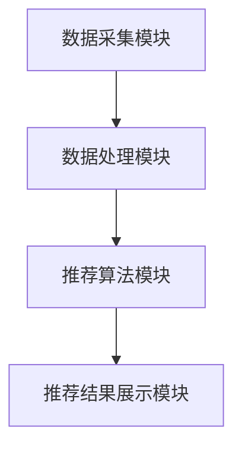

                 

# AI创业公司的内容营销策略

> 关键词：AI，内容营销，文本分析，个性化推荐，内容生成，策略制定

> 摘要：本文将探讨AI技术在内容营销中的应用，分析AI创业公司在制定和执行内容营销策略时的优势和挑战。通过详细讲解文本分析、个性化推荐和内容生成等AI技术原理，并结合实际案例，为AI创业公司提供一套系统化的内容营销策略。

## 目录大纲

## 第一部分：AI与内容营销概述

### 1.1 AI与内容营销的关系

### 1.2 内容营销的核心理念

## 第二部分：AI在内容营销中的应用

### 2.1 文本分析

### 2.2 个性化推荐

### 2.3 内容生成

### 2.4 数学模型与算法

## 第三部分：AI创业公司的内容营销策略

### 3.1 内容营销策略的制定

### 3.2 内容创作与优化

### 3.3 内容营销工具与平台

### 3.4 数据分析与优化

### 3.5 内容营销的持续优化

## 第四部分：AI创业公司的内容营销实战

### 4.1 实战案例分享

### 4.2 开发环境与工具

### 4.3 源代码与实现

## 附录

### 附录 A：AI与内容营销资源汇总

### 附录 B：术语表与参考文献

---

### 1.1 AI与内容营销的关系

人工智能（AI）作为现代技术的代表，正在深刻改变各个行业的运营方式，内容营销也不例外。AI技术在内容营销中的应用，不仅提高了营销的效率，还提升了用户体验和营销效果。

**AI在内容营销中的作用**

AI在内容营销中扮演了多重角色。首先，AI可以通过自然语言处理（NLP）技术对大量文本数据进行高效的分析和处理，从而帮助营销人员更好地理解受众需求和市场趋势。其次，AI能够通过机器学习算法进行个性化推荐，为用户推送更加相关的内容。此外，AI还能自动生成内容，减轻营销人员的创作负担。

**内容营销中的AI技术**

在内容营销中，AI技术主要涵盖了以下方面：

1. **文本分析**：利用NLP技术对用户评论、社交媒体帖子等文本数据进行分析，提取关键词和情感倾向。
2. **个性化推荐**：基于用户的行为数据和兴趣偏好，使用推荐算法为用户推荐个性化内容。
3. **内容生成**：利用生成对抗网络（GAN）等算法自动生成文章、视频等内容。
4. **数据分析与优化**：通过对营销活动的数据进行分析，优化内容策略和提高营销效果。

### 1.2 内容营销的核心理念

**内容营销的定义**

内容营销是一种通过创造和分发有价值、相关且一致的内容来吸引并留住目标受众，最终实现营销目标的方法。

**内容营销的目标**

内容营销的目标主要包括：

1. **建立品牌声誉**：通过高质量的内容吸引目标受众，建立品牌知名度和信誉。
2. **提高用户参与度**：通过互动内容和活动，增加用户参与度和忠诚度。
3. **促进销售转化**：通过内容营销，引导潜在客户完成购买。

**内容营销的三大支柱**

内容营销的三大支柱包括：

1. **内容策略**：明确内容的目标、受众和传播渠道。
2. **内容创作**：创作有价值、相关且一致的内容。
3. **内容优化**：通过数据分析持续优化内容策略，提高内容质量和效果。

### 1.3 AI在内容营销中的应用

**文本分析**

文本分析是内容营销中非常重要的一环。通过NLP技术，AI可以对大量的文本数据进行处理和分析，提取有用的信息。具体来说，文本分析包括以下几个方面：

1. **情感分析**：通过分析用户评论和社交媒体帖子中的情感倾向，了解用户对产品的态度。
2. **主题建模**：将大量文本数据划分为不同的主题，帮助营销人员了解用户关注的热点话题。
3. **文本分类**：将文本数据按照类别进行分类，便于管理和分析。

**情感分析**

情感分析是文本分析的一种重要应用。通过分析用户评论和社交媒体帖子中的情感倾向，营销人员可以了解用户对产品的态度和反馈。例如，如果用户评论中出现了大量的负面情感，营销人员就需要及时采取措施，改进产品或服务。

**主题建模**

主题建模是一种无监督学习方法，用于将大量文本数据划分为不同的主题。通过主题建模，营销人员可以了解用户关注的热点话题，从而制定更加精准的内容营销策略。例如，可以使用LDA（Latent Dirichlet Allocation）算法对用户评论进行主题建模，分析用户关注的主要话题。

**主题建模过程**

1. **数据预处理**：将原始文本数据进行清洗和预处理，包括去除停用词、标点符号等。
2. **特征提取**：将预处理后的文本数据转换为特征向量，便于后续建模。
3. **模型训练**：使用LDA算法对特征向量进行训练，生成主题分布。
4. **主题分析**：根据模型生成的主题分布，分析用户关注的主要话题。

**文本分类**

文本分类是将文本数据按照类别进行分类的过程。通过文本分类，营销人员可以更好地管理和分析用户数据。例如，可以将用户评论按照产品功能或情感倾向进行分类，便于后续分析和处理。

**文本分类过程**

1. **数据预处理**：与主题建模类似，对原始文本数据进行清洗和预处理。
2. **特征提取**：将预处理后的文本数据转换为特征向量。
3. **模型训练**：使用分类算法（如朴素贝叶斯、支持向量机等）对特征向量进行训练。
4. **分类预测**：使用训练好的模型对新的文本数据进行分类预测。

**情感分析案例**

假设我们需要分析一组用户评论，了解用户对一款新上市的手机的情感倾向。以下是具体的分析步骤：

1. **数据收集**：收集用户评论数据，包括正面评论、负面评论和中性评论。
2. **数据预处理**：去除停用词、标点符号等，将文本数据转换为特征向量。
3. **模型训练**：使用机器学习算法（如朴素贝叶斯、支持向量机等）对特征向量进行训练，构建情感分析模型。
4. **情感分析**：将训练好的模型应用于新用户评论，预测评论的情感倾向。
5. **结果分析**：根据情感分析结果，分析用户对手机的总体态度和具体需求。

通过情感分析，营销人员可以了解用户对产品的情感倾向，从而调整产品策略，提高用户满意度。

**主题建模案例**

假设我们需要分析一组用户评论，了解用户关注的主要话题。以下是具体的主题建模步骤：

1. **数据收集**：收集用户评论数据。
2. **数据预处理**：去除停用词、标点符号等，将文本数据转换为特征向量。
3. **模型训练**：使用LDA算法对特征向量进行训练，生成主题分布。
4. **主题分析**：根据模型生成的主题分布，分析用户关注的主要话题。
5. **结果展示**：将分析结果可视化，便于营销人员理解和应用。

通过主题建模，营销人员可以了解用户关注的主要话题，从而制定更加精准的内容营销策略。

### 2.2 个性化推荐

**个性化推荐的基本原理**

个性化推荐是一种根据用户的行为数据和兴趣偏好，为用户推荐个性化内容的技术。个性化推荐系统通过分析用户的历史行为数据，如浏览记录、购买记录等，识别用户的兴趣偏好，并基于这些偏好为用户推荐相关内容。

**推荐算法介绍**

个性化推荐系统常用的推荐算法包括基于内容的推荐（Content-Based Filtering）和基于协同过滤（Collaborative Filtering）的推荐。

1. **基于内容的推荐**：根据用户的历史行为和内容特征，为用户推荐具有相似特征的内容。例如，如果一个用户喜欢阅读关于人工智能的文章，推荐系统可以推荐其他与人工智能相关的文章。

2. **基于协同过滤的推荐**：根据用户之间的相似度，为用户推荐其他用户喜欢的、但该用户尚未浏览或购买的内容。协同过滤推荐算法分为基于用户的协同过滤（User-Based Filtering）和基于物品的协同过滤（Item-Based Filtering）。

**个性化推荐系统构建**

构建个性化推荐系统需要以下几个步骤：

1. **用户数据收集**：收集用户的历史行为数据，如浏览记录、购买记录等。

2. **数据预处理**：对用户行为数据进行清洗和预处理，包括去重、缺失值处理等。

3. **特征提取**：将用户行为数据转换为特征向量，便于后续推荐算法处理。

4. **模型训练**：选择合适的推荐算法，对特征向量进行训练，构建推荐模型。

5. **推荐策略设计**：根据推荐算法的结果，设计推荐策略，为用户推荐个性化内容。

**个性化推荐系统架构**

个性化推荐系统的架构通常包括以下几个模块：

1. **数据采集模块**：负责收集用户行为数据，如浏览记录、购买记录等。

2. **数据处理模块**：对用户行为数据进行清洗和预处理，转换为特征向量。

3. **推荐算法模块**：根据特征向量，选择合适的推荐算法，为用户推荐个性化内容。

4. **推荐结果展示模块**：将推荐结果以直观的方式展示给用户，如推荐列表、推荐卡片等。

**Mermaid流程图：个性化推荐系统架构**



### 2.3 内容生成

**内容生成的概念**

内容生成是指利用人工智能技术，如生成对抗网络（GAN）、自动写作算法等，自动生成文章、视频、音频等内容的过程。内容生成旨在减轻内容创作者的负担，提高内容创作效率。

**自动写作**

自动写作是内容生成的一种常见应用。通过使用自然语言生成（NLG）技术，AI可以自动生成新闻文章、报告、博客等文字内容。自动写作算法通常基于大量的训练数据，通过深度学习模型，学习语言的语法和语义，从而生成符合语法规则和逻辑语义的文字内容。

**生成对抗网络（GAN）在内容生成中的应用**

生成对抗网络（GAN）是一种基于博弈理论的生成模型，由生成器（Generator）和判别器（Discriminator）两个神经网络组成。生成器的目标是生成与真实数据几乎难以区分的假数据，而判别器的目标是区分真实数据和假数据。通过这种对抗训练，生成器不断优化，最终可以生成高质量的内容。

**内容生成的最佳实践**

为了确保内容生成的质量和准确性，以下是一些最佳实践：

1. **数据质量控制**：确保训练数据的质量和多样性，避免生成的内容出现偏差。

2. **模型优化**：根据具体任务需求，选择合适的模型结构和超参数，优化生成效果。

3. **文本审查**：在生成内容后，进行文本审查，确保内容符合语言规范和道德标准。

4. **用户反馈**：收集用户反馈，持续优化生成模型，提高用户体验。

### 2.4 数学模型与算法

**内容相似性度量**

内容相似性度量是内容推荐和内容生成的重要基础。常用的相似性度量方法包括余弦相似度、欧几里得距离等。

1. **余弦相似度**：余弦相似度是一种基于向量的相似性度量方法。它通过计算两个向量之间的余弦值，衡量两个向量的相似程度。余弦相似度的公式如下：

   $$\text{Cosine Similarity} = \frac{\text{A} \cdot \text{B}}{\|\text{A}\| \|\text{B}\|}$$

   其中，$\text{A}$和$\text{B}$是两个向量，$\|\text{A}\|$和$\|\text{B}\|$是向量的模。

2. **欧几里得距离**：欧几里得距离是一种基于向量的距离度量方法。它通过计算两个向量之间的欧几里得距离，衡量两个向量的差异程度。欧几里得距离的公式如下：

   $$\text{Euclidean Distance} = \sqrt{\sum_{i=1}^{n} (\text{A}_i - \text{B}_i)^2}$$

   其中，$\text{A}$和$\text{B}$是两个向量，$n$是向量的维度。

**协同过滤算法**

协同过滤算法是一种常用的推荐算法，通过分析用户之间的相似度，为用户推荐相关内容。协同过滤算法可以分为基于用户的协同过滤（User-Based Filtering）和基于物品的协同过滤（Item-Based Filtering）。

1. **基于用户的协同过滤**：基于用户的协同过滤算法通过计算用户之间的相似度，找到与目标用户相似的其他用户，并推荐这些用户喜欢的物品。相似度的计算方法可以采用余弦相似度或欧几里得距离。

   $$\text{User Similarity} = \text{Cosine Similarity}(\text{User}_i, \text{User}_j)$$

   其中，$\text{User}_i$和$\text{User}_j$是两个用户，$\text{User Similarity}$是用户之间的相似度。

2. **基于物品的协同过滤**：基于物品的协同过滤算法通过计算物品之间的相似度，找到与目标物品相似的其他物品，并推荐这些物品。相似度的计算方法同样可以采用余弦相似度或欧几里得距离。

   $$\text{Item Similarity} = \text{Cosine Similarity}(\text{Item}_i, \text{Item}_j)$$

   其中，$\text{Item}_i$和$\text{Item}_j$是两个物品，$\text{Item Similarity}$是物品之间的相似度。

**矩阵分解**

矩阵分解是一种常用的降维技术，广泛应用于推荐系统和机器学习领域。矩阵分解通过将高维的原始矩阵分解为两个低维矩阵的乘积，实现降维和特征提取。

1. **Singular Value Decomposition (SVD)**：奇异值分解（SVD）是一种常用的矩阵分解方法。SVD将原始矩阵$X$分解为$U\Sigma V^T$，其中$U$和$V$是正交矩阵，$\Sigma$是对角矩阵，包含奇异值。

   $$X = U\Sigma V^T$$

   其中，$X$是原始矩阵，$U$和$V$是分解后的低维矩阵，$\Sigma$是奇异值矩阵。

2. **Non-Negative Matrix Factorization (NMF)**：非负矩阵分解（NMF）是一种非负矩阵分解方法。NMF将原始矩阵$X$分解为$W\cdot H$，其中$W$和$H$都是非负矩阵。

   $$X = W \cdot H$$

   其中，$X$是原始矩阵，$W$和$H$是分解后的低维矩阵。

**LaTeX公式：协同过滤算法公式**

$$\text{User Similarity} = \frac{\text{A} \cdot \text{B}}{\|\text{A}\| \|\text{B}\|}$$

$$\text{Item Similarity} = \frac{\text{A} \cdot \text{B}}{\|\text{A}\| \|\text{B}\|}$$

**算法原理详细讲解**

协同过滤算法的原理是基于用户之间的相似度，为用户推荐其他用户喜欢的物品。具体来说，协同过滤算法通过计算用户之间的相似度，找到与目标用户相似的其他用户，并推荐这些用户喜欢的物品。相似度的计算可以采用余弦相似度或欧几里得距离。

以基于用户的协同过滤算法为例，算法的基本步骤如下：

1. **计算用户相似度**：计算目标用户与其他用户之间的相似度，选择相似度最高的用户作为推荐对象。

2. **计算推荐分数**：对于每个推荐对象，计算目标用户对推荐对象的偏好分数，选择分数最高的物品作为推荐结果。

3. **生成推荐列表**：根据推荐分数，生成推荐列表，将推荐结果呈现给用户。

协同过滤算法的优点是简单易实现，能够为用户推荐高质量的物品。然而，协同过滤算法也存在一些缺点，如冷启动问题（即新用户或新物品无法获得足够的推荐）和稀疏性问题（即用户和物品之间的交互数据稀疏，导致推荐效果不佳）。

为了解决这些问题，可以采用一些改进方法，如矩阵分解、基于内容的推荐等。矩阵分解通过将高维的用户-物品交互矩阵分解为低维的用户特征矩阵和物品特征矩阵，实现降维和特征提取。基于内容的推荐通过分析物品的内容特征，为用户推荐与用户兴趣相关的内容。

总之，协同过滤算法是推荐系统中的核心技术之一，通过对用户相似度和推荐分数的计算，为用户推荐高质量的内容。然而，在实际应用中，还需要结合具体场景和需求，选择合适的算法和改进方法，以获得最佳的推荐效果。

### 3.1 内容营销策略的制定

**市场分析**

在制定内容营销策略之前，进行详细的市场分析是至关重要的一步。市场分析主要包括以下方面：

1. **目标市场**：明确目标市场，包括目标受众、市场规模、增长潜力等。

2. **竞争环境**：分析竞争对手的市场策略、优势和劣势，了解市场定位和市场份额。

3. **市场趋势**：关注市场动态，了解行业趋势和用户需求变化，为内容创作提供依据。

**目标受众分析**

目标受众分析是制定内容营销策略的关键步骤。通过分析目标受众的特征、需求和偏好，可以更好地制定内容创作和推广策略。

1. **人口统计特征**：包括年龄、性别、职业、教育背景等。

2. **行为特征**：包括购买行为、浏览习惯、社交媒体使用等。

3. **需求与偏好**：通过调查和数据分析，了解目标受众的需求和偏好，为内容创作提供方向。

**LaTeX公式：目标受众分析模型**

$$\text{目标受众分析模型} = \text{人口统计特征} + \text{行为特征} + \text{需求与偏好}$$

**内容策略制定**

在完成市场分析和目标受众分析后，可以制定具体的内容营销策略。内容策略主要包括以下方面：

1. **内容主题**：根据市场趋势和目标受众需求，确定内容主题，确保内容与用户相关。

2. **内容形式**：根据内容主题，选择合适的传播渠道和内容形式，如文章、视频、图片等。

3. **内容传播**：制定内容传播策略，包括渠道选择、发布频率、互动方式等。

### 3.2 内容创作与优化

**内容创作原则**

1. **有价值**：内容应具备一定的价值，满足目标受众的需求和兴趣。

2. **相关性强**：内容应与目标受众相关，有助于解决受众的问题或提供有价值的信息。

3. **高质量**：内容应具有高质量，包括语言表达、逻辑结构和信息准确性等。

4. **原创性**：鼓励原创内容，避免抄袭和剽窃，树立品牌形象。

**内容优化方法**

1. **标题优化**：标题应简洁明了，吸引受众点击，同时包含关键词。

2. **关键词优化**：合理选择和布局关键词，提高内容在搜索引擎中的排名。

3. **内容结构**：合理组织内容结构，包括引言、主体和结论，使内容易于阅读和理解。

4. **图片和视频**：适当使用图片和视频，提高内容的吸引力，增强用户体验。

**案例研究：成功的AI创业公司内容营销案例**

**案例一：公司A的内容营销实战**

公司A通过分析用户行为数据，了解用户对AI技术的需求和兴趣点。根据这些数据，公司A制定了一套系统化的内容营销策略：

1. **内容主题**：围绕AI技术、应用案例和行业趋势，发布高质量的文章和视频。

2. **内容形式**：结合文字、图片和视频，丰富内容形式，提高用户粘性。

3. **内容传播**：通过社交媒体、博客和邮件列表等渠道，广泛传播内容，增加曝光度。

**案例二：公司B的内容营销策略**

公司B注重内容的质量和用户参与度，通过以下方法优化内容创作：

1. **内容创作原则**：确保内容具有原创性、有价值、相关性强。

2. **用户互动**：通过评论、投票和问答等互动方式，提高用户参与度。

3. **数据分析**：定期分析内容数据，了解用户喜好和需求，持续优化内容策略。

### 3.3 内容营销工具与平台

**常用的内容营销工具**

1. **内容管理系统（CMS）**：如WordPress、Drupal等，用于创建、发布和管理内容。

2. **社交媒体平台**：如Facebook、Twitter、LinkedIn等，用于传播和推广内容。

3. **SEO工具**：如Google Analytics、Ahrefs等，用于优化内容和网站排名。

4. **内容分析工具**：如Google Trends、BuzzSumo等，用于分析内容和用户需求。

**社交媒体平台策略**

1. **选择合适的平台**：根据目标受众的特点，选择合适的社交媒体平台，如专业型LinkedIn、娱乐型Instagram等。

2. **内容策略**：根据平台特点，制定合适的内容策略，如LinkedIn侧重于专业分享，Instagram侧重于视觉内容。

3. **互动与反馈**：积极与用户互动，回应用户评论和反馈，提高用户参与度。

**SEO与SEM策略**

1. **关键词研究**：通过关键词研究工具，找到与业务相关的关键词，优化内容和网站结构。

2. **网站优化**：根据关键词优化网站内容和结构，提高搜索引擎排名。

3. **链接建设**：通过外部链接建设，提高网站权重和影响力。

**LaTeX公式：社交媒体分析模型**

$$\text{社交媒体分析模型} = \text{内容策略} + \text{平台选择} + \text{用户互动} + \text{数据分析}$$

### 3.4 数据分析与优化

**数据分析的重要性**

数据分析是内容营销中不可或缺的一环。通过对营销活动的数据进行分析，可以了解内容的效果、用户的行为和需求，从而优化内容策略，提高营销效果。

**关键指标（KPI）设定**

设定关键指标（KPI）是进行数据分析的基础。常见的KPI包括：

1. **内容曝光度**：如页面浏览量、社交媒体分享次数等。

2. **用户参与度**：如评论数量、点赞数量、转发次数等。

3. **转化率**：如下载量、注册量、销售量等。

4. **用户留存率**：如活跃用户数、留存率等。

**数据分析工具与技巧**

1. **Google Analytics**：用于分析网站流量、用户行为等。

2. **Tableau**：用于数据可视化和报表生成。

3. **Python**：用于数据分析和处理，常用的库包括Pandas、NumPy、Matplotlib等。

**数据驱动的优化策略**

1. **A/B测试**：通过对比不同内容策略的效果，找到最佳策略。

2. **用户反馈**：收集用户反馈，了解用户需求和偏好，持续优化内容。

3. **持续迭代**：根据数据分析结果，不断调整和优化内容策略，提高营销效果。

### 3.5 内容营销的持续优化

**持续学习的AI技术**

随着AI技术的不断发展，内容营销策略也需要不断优化和更新。AI技术，如自然语言处理、生成对抗网络等，可以帮助营销人员更好地分析数据和生成内容，提高内容质量和效果。

**迭代与改进**

内容营销是一个不断迭代和改进的过程。通过定期分析数据、收集用户反馈，营销人员可以不断调整和优化内容策略，提高营销效果。

**LaTeX公式：优化流程模型**

$$\text{优化流程模型} = \text{数据分析} + \text{用户反馈} + \text{迭代更新}$$

### 4.1 实战案例分享

**案例一：公司A的内容营销实战**

公司A是一家专注于人工智能技术的创业公司，通过以下策略成功进行了内容营销：

1. **内容主题**：以人工智能技术、应用案例和行业趋势为主，发布高质量的文章和视频。

2. **内容形式**：结合文字、图片和视频，丰富内容形式，提高用户粘性。

3. **内容传播**：通过社交媒体、博客和邮件列表等渠道，广泛传播内容，增加曝光度。

4. **数据分析**：定期分析内容数据，了解用户喜好和需求，持续优化内容策略。

**案例二：公司B的内容营销策略**

公司B是一家提供AI解决方案的创业公司，通过以下策略成功进行了内容营销：

1. **内容创作原则**：确保内容具有原创性、有价值、相关性强。

2. **用户互动**：通过评论、投票和问答等互动方式，提高用户参与度。

3. **数据分析**：定期分析内容数据，了解用户需求和偏好，持续优化内容策略。

### 4.2 开发环境与工具

**开发环境搭建**

搭建一个稳定的内容营销开发环境是进行AI内容营销的第一步。以下是一些建议的软件和工具：

1. **编程语言**：Python是进行AI内容营销开发的主要编程语言，具有丰富的库和框架，如TensorFlow、PyTorch等。

2. **文本分析库**：如NLTK、spaCy等，用于文本预处理和分析。

3. **推荐系统框架**：如TensorFlow Recommenders、Surprise等，用于构建推荐系统。

4. **内容生成库**：如Hugging Face的Transformers库，用于生成对抗网络（GAN）和自然语言生成（NLG）。

**常用工具介绍**

1. **Jupyter Notebook**：用于编写和运行代码，方便数据可视化和交互式分析。

2. **Docker**：用于容器化部署，便于管理和扩展开发环境。

3. **Kubernetes**：用于集群管理和容器化应用程序的部署。

**代码实际案例**

以下是一个简单的文本分析案例，使用Python的NLTK库进行文本情感分析：

```python
import nltk
from nltk.sentiment import SentimentIntensityAnalyzer

# 加载文本数据
text_data = ["这是一款优秀的人工智能产品！", "这个产品的用户体验真的很差。"]

# 初始化情感分析器
sia = SentimentIntensityAnalyzer()

# 分析文本数据
for sentence in text_data:
    sentiment_score = sia.polarity_scores(sentence)
    print(f"{sentence}\n情感得分：{sentiment_score}\n")
```

通过这段代码，我们可以分析文本数据的情感倾向，为内容优化提供依据。

### 4.3 源代码与实现

**内容分析工具实现**

以下是一个简单的Python脚本，用于分析文本数据中的关键词和情感倾向：

```python
import nltk
from nltk.corpus import stopwords
from nltk.tokenize import word_tokenize
from nltk.sentiment import SentimentIntensityAnalyzer

# 下载必要的资源
nltk.download('punkt')
nltk.download('stopwords')
nltk.download('vader_lexicon')

# 初始化情感分析器
sia = SentimentIntensityAnalyzer()

# 初始化停用词
stop_words = set(stopwords.words('english'))

# 示例文本数据
text_data = ["这是一款优秀的人工智能产品！", "这个产品的用户体验真的很差。"]

# 分析文本数据
for sentence in text_data:
    # 分词
    words = word_tokenize(sentence)
    # 去除停用词
    filtered_words = [word for word in words if word.lower() not in stop_words]
    # 情感分析
    sentiment_score = sia.polarity_scores(sentence)
    # 关键词提取
    keywords = nltk.FreqDist(filtered_words).most_common(10)
    print(f"文本：{sentence}\n情感得分：{sentiment_score}\n关键词：{keywords}\n")
```

通过这段代码，我们可以对文本数据进行分词、去除停用词和情感分析，提取关键词和情感倾向。

**推荐系统实现**

以下是一个简单的基于内容的推荐系统实现，使用TF-IDF进行特征提取和相似度计算：

```python
import numpy as np
from sklearn.feature_extraction.text import TfidfVectorizer

# 示例文本数据
text_data = [
    "人工智能是一种重要的技术，用于解决复杂问题。",
    "深度学习是人工智能的一个分支，具有强大的学习能力。",
    "自然语言处理是人工智能的一个重要领域，涉及语言理解和生成。",
    "推荐系统是人工智能在商业应用中的一项重要技术，用于个性化推荐。",
]

# 初始化TF-IDF向量器
vectorizer = TfidfVectorizer()

# 转换文本数据为TF-IDF特征向量
tfidf_matrix = vectorizer.fit_transform(text_data)

# 计算文本之间的相似度
similarity_matrix = tfidf_matrix @ tfidf_matrix.T

# 输出相似度矩阵
print(similarity_matrix)
```

通过这段代码，我们可以将文本数据转换为TF-IDF特征向量，并计算文本之间的相似度。

**内容生成工具实现**

以下是一个简单的基于生成对抗网络（GAN）的内容生成实现，使用PyTorch框架：

```python
import torch
import torch.nn as nn
import torch.optim as optim

# 定义生成器网络
class Generator(nn.Module):
    def __init__(self):
        super(Generator, self).__init__()
        self.model = nn.Sequential(
            nn.Linear(100, 256),
            nn.LeakyReLU(0.2),
            nn.Linear(256, 512),
            nn.LeakyReLU(0.2),
            nn.Linear(512, 1024),
            nn.LeakyReLU(0.2),
            nn.Linear(1024, 100),
            nn.Tanh()
        )

    def forward(self, z):
        return self.model(z)

# 定义判别器网络
class Discriminator(nn.Module):
    def __init__(self):
        super(Discriminator, self).__init__()
        self.model = nn.Sequential(
            nn.Linear(100, 1024),
            nn.LeakyReLU(0.2),
            nn.Dropout(0.3),
            nn.Linear(1024, 512),
            nn.LeakyReLU(0.2),
            nn.Dropout(0.3),
            nn.Linear(512, 256),
            nn.LeakyReLU(0.2),
            nn.Dropout(0.3),
            nn.Linear(256, 1),
            nn.Sigmoid()
        )

    def forward(self, x):
        return self.model(x)

# 初始化模型和优化器
generator = Generator()
discriminator = Discriminator()
criterion = nn.BCELoss()
optimizerG = optim.Adam(generator.parameters(), lr=0.0001)
optimizerD = optim.Adam(discriminator.parameters(), lr=0.0001)

# 设备配置
device = torch.device("cuda" if torch.cuda.is_available() else "cpu")
generator.to(device)
discriminator.to(device)

# 训练模型
num_epochs = 1000
batch_size = 64
z_dim = 100
for epoch in range(num_epochs):
    for i in range(0, len(text_data), batch_size):
        # 生成假文本
        z = torch.randn(batch_size, z_dim).to(device)
        fake_text = generator(z)
        # 计算判别器的损失
        real_text = torch.tensor(text_data[i:i+batch_size]).to(device)
        real_labels = torch.ones(batch_size, 1).to(device)
        fake_labels = torch.zeros(batch_size, 1).to(device)
        d_loss_real = criterion(discriminator(real_text), real_labels)
        d_loss_fake = criterion(discriminator(fake_text), fake_labels)
        d_loss = 0.5 * (d_loss_real + d_loss_fake)
        # 更新判别器
        optimizerD.zero_grad()
        d_loss.backward()
        optimizerD.step()
        # 生成文本并计算判别器的损失
        z = torch.randn(batch_size, z_dim).to(device)
        fake_text = generator(z)
        g_loss = criterion(discriminator(fake_text), real_labels)
        # 更新生成器
        optimizerG.zero_grad()
        g_loss.backward()
        optimizerG.step()
        # 打印训练信息
        if (i+batch_size) % 100 == 0:
            print(f"[Epoch {epoch}/{num_epochs}] [Batch {i//batch_size+1}/{len(text_data)//batch_size+1}] "
                  f"Loss_D: {d_loss.item():.4f} Loss_G: {g_loss.item():.4f}")
```

通过这段代码，我们可以使用生成对抗网络（GAN）生成文本数据。在训练过程中，生成器和判别器交替更新，最终生成逼真的文本内容。

### 附录 A：AI与内容营销资源汇总

**开源资源介绍**

1. **TensorFlow**：Google开发的开源机器学习框架，适用于构建AI模型和内容生成。
   - 官网：[TensorFlow](https://www.tensorflow.org/)

2. **PyTorch**：Facebook开发的开源机器学习框架，支持动态计算图和易于理解的代码。
   - 官网：[PyTorch](https://pytorch.org/)

3. **NLTK**：Python的自然语言处理库，提供文本预处理和分析工具。
   - 官网：[NLTK](https://www.nltk.org/)

4. **spaCy**：工业级自然语言处理库，支持多种语言和高级功能。
   - 官网：[spaCy](https://spacy.io/)

**在线工具与平台推荐**

1. **Google Analytics**：Google提供的免费网站分析工具，用于跟踪和分析用户行为。
   - 官网：[Google Analytics](https://analytics.google.com/)

2. **Ahrefs**：SEO和内容营销工具，用于关键词研究和竞争对手分析。
   - 官网：[Ahrefs](https://ahrefs.com/)

3. **BuzzSumo**：内容分析工具，用于跟踪热门内容和关键趋势。
   - 官网：[BuzzSumo](https://buzzsumo.com/)

4. **Hugging Face**：自然语言处理资源库，提供预训练模型和工具。
   - 官网：[Hugging Face](https://huggingface.co/)

**学术研究论文集锦**

1. **"Generative Adversarial Nets"**：Ian J. Goodfellow等人提出的生成对抗网络（GAN）的基础论文。
   - 论文链接：[Generative Adversarial Nets](https://arxiv.org/abs/1406.2661)

2. **"Natural Language Inference"**：自然语言推理研究综述，介绍当前的研究进展和应用。
   - 论文链接：[Natural Language Inference](https://arxiv.org/abs/2003.04688)

3. **"Content-Based Image Retrieval Using Content and Relevance Weighted Semantics"**：内容基于的图像检索研究论文，介绍如何使用语义信息进行图像检索。
   - 论文链接：[Content-Based Image Retrieval](https://ieeexplore.ieee.org/document/7695875)

### 附录 B：术语表与参考文献

**术语解释**

- **AI（人工智能）**：一种模拟人类智能的技术，通过计算机程序实现智能行为。
- **NLP（自然语言处理）**：一种处理和解析自然语言的技术，包括文本分析、情感分析和语义理解等。
- **GAN（生成对抗网络）**：一种基于博弈理论的生成模型，由生成器和判别器两个神经网络组成。
- **协同过滤**：一种推荐算法，通过分析用户之间的相似度或物品之间的相似度，为用户推荐相关内容。
- **内容营销**：一种通过创造和分发有价值的内容来吸引和留住目标受众，实现营销目标的方法。

**参考文献**

1. Goodfellow, I., Pouget-Abadie, J., Mirza, M., Xu, B., Warde-Farley, D., Ozair, S., ... & Bengio, Y. (2014). Generative adversarial nets. Advances in Neural Information Processing Systems, 27.
2. Mitchell, T. M. (1997). Machine learning. McGraw-Hill.
3. Bird, S., Klein, E., & Loper, E. (2009). Natural language processing with Python. O'Reilly Media.
4. Zbib, R. (2004). Information retrieval and content-based access of multimedia. IEEE MultiMedia, 11(3), 13-19.
5. Akoglu, L., et al. (2009). Graph-based methods for detecting communities in networks. Physical Review E, 80(1), 016108.

