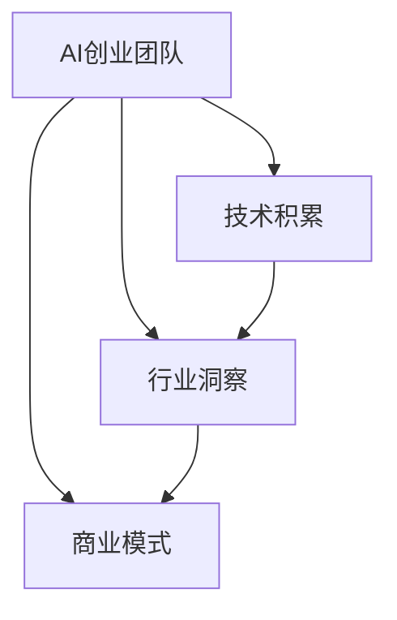

                 

# 文章标题

《AI创业团队成长之路：技术积累与行业洞察并重》

> 关键词：AI创业、技术积累、行业洞察、团队建设、风险管理、产品开发

> 摘要：本文详细探讨了AI创业团队成长过程中的关键要素，包括技术积累、行业洞察、团队建设、风险管理、产品开发和市场推广等方面。通过分析AI创业的机遇与挑战，介绍了AI创业团队所需的技术、策略和管理方法，旨在为AI创业者提供一套系统、实用的成长指南。

----------------------------------------------------------------

### 目录大纲

#### 第一部分: AI创业团队成长基础

##### 第1章: AI创业概述

1. **AI创业趋势分析**
   - 当前AI领域的发展现状
   - AI创业机会与挑战

2. **AI创业的核心要素**
   - 创业团队的组织结构
   - 技术积累的重要性
   - 商业模式的探索

3. **创业初期的技术积累**
   - 数据收集与处理
   - 算法研究与选型
   - 技术栈的选择与搭建

4. **市场洞察与定位**
   - 目标市场的分析
   - 竞争对手分析
   - 市场机会的把握

5. **初创团队的运营管理**
   - 团队沟通与协作
   - 资源配置与管理
   - 风险管理与应对策略

##### 第2章: 技术积累的核心算法原理

1. **机器学习基础**
   - 监督学习、无监督学习和强化学习
   - 模型评估与优化

2. **深度学习原理**
   - 神经网络结构
   - 深度学习算法
   - 深度学习优化技巧

3. **自然语言处理**
   - 词嵌入技术
   - 序列模型
   - 注意力机制

4. **计算机视觉**
   - 卷积神经网络
   - 目标检测与图像识别
   - 图像处理算法

5. **强化学习**
   - 基本概念
   - 算法应用
   - 案例分析

##### 第3章: 行业洞察与商业应用

1. **行业动态分析**
   - 当前AI行业的发展态势
   - 各行业对AI的需求和应用

2. **案例研究**
   - 成功AI创业案例分享
   - 案例中的技术积累与行业洞察

3. **商业机会挖掘**
   - 创业方向的选择
   - 商业模式创新

4. **创业融资策略**
   - 融资渠道与方式
   - 投资者沟通技巧

##### 第4章: 团队建设与管理

1. **团队组建与核心成员筛选**
   - 技术团队的组建
   - 管理团队的组建
   - 核心成员的选拔与培养

2. **人才激励与团队文化**
   - 薪酬激励制度
   - 团队文化建设
   - 激励机制设计

3. **项目管理与敏捷开发**
   - 项目管理方法
   - 敏捷开发实践
   - 团队协作工具

4. **团队沟通与协作**
   - 沟通技巧与策略
   - 协作平台的使用
   - 冲突解决与团队氛围建设

##### 第5章: 创业风险与应对

1. **风险评估与控制**
   - 技术风险
   - 市场风险
   - 财务风险

2. **风险管理策略**
   - 风险预防措施
   - 应急预案制定
   - 风险监控与评估

3. **法律风险与知识产权保护**
   - 合同法律风险
   - 知识产权保护策略
   - 法律纠纷应对

##### 第6章: 产品开发与市场推广

1. **产品规划与设计**
   - 产品需求分析
   - 产品设计原则
   - 用户研究方法

2. **产品开发流程**
   - 开发环境搭建
   - 代码实现与测试
   - 部署与上线

3. **市场推广策略**
   - 市场调研与定位
   - 营销策略制定
   - 推广渠道选择

4. **用户反馈与迭代**
   - 用户反馈收集
   - 产品迭代方法
   - 用户增长策略

##### 第7章: 成长与扩展

1. **团队扩展策略**
   - 人才引进
   - 团队架构调整
   - 规模化运营

2. **业务扩展方向**
   - 新产品开发
   - 市场拓展
   - 合作与并购

3. **持续创新与竞争力提升**
   - 技术创新
   - 商业模式创新
   - 团队文化建设与升级

#### 附录

- **附录A: AI开发工具与资源**
  - 主流深度学习框架对比
  - 数据集与数据管理
  - 开发环境搭建指南

- **附录B: 行业洞察报告**
  - 当前AI行业趋势报告
  - 各行业AI应用案例汇编

- **附录C: 创业团队成长经验分享**
  - 成功创业者的经验与教训
  - 创业过程中的关键决策

### Mermaid 流程图

以下是书中描述的核心概念与联系使用的 Mermaid 流程图：



### 核心算法原理讲解

以下是关于深度学习原理的伪代码讲解：

```python
## 深度学习原理

### 神经网络基础

def forward_pass(input_data, weights, biases):
    # 初始化激活值和损失值
    activations = [input_data]
    losses = []

    # 遍历每一层神经网络
    for layer in range(num_layers - 1):
        # 计算线性变换
        z = np.dot(activations[layer], weights[layer]) + biases[layer]
        
        # 应用激活函数
        activation = sigmoid(z)
        
        # 将激活值传递到下一层
        activations.append(activation)
        
        # 计算损失值
        loss = compute_loss(activation, target)
        losses.append(loss)

    return activations, losses

def backward_pass(activations, losses, weights, biases, learning_rate):
    # 遍历每一层，从输出层开始
    for layer in reversed(range(num_layers - 1)):
        # 计算梯度
        dZ = losses[layer] * derivatives(sigmoid(z))
        
        # 更新权重和偏置
        dW = np.dot(activations[layer - 1].T, dZ)
        db = np.sum(dZ, axis=0)
        
        weights[layer] -= learning_rate * dW
        biases[layer] -= learning_rate * db

### 数学模型和数学公式

#### 损失函数

$$
\text{Loss}(y, \hat{y}) = -\frac{1}{m}\sum_{i=1}^{m} y_i \log(\hat{y}_i) + (1 - y_i) \log(1 - \hat{y}_i)
$$

#### 激活函数

$$
\text{sigmoid}(z) = \frac{1}{1 + e^{-z}}
$$

#### 梯度下降

$$
\theta_j := \theta_j - \alpha \frac{\partial}{\partial \theta_j} \text{Loss}(y, \hat{y})
$$

### 项目实战

#### 项目名称：智能问答系统

##### 开发环境搭建

- Python 3.8
- TensorFlow 2.5
- Keras 2.4.3

##### 源代码实现

```python
# 导入必需的库
import tensorflow as tf
from tensorflow.keras.models import Sequential
from tensorflow.keras.layers import Dense, Embedding, LSTM
from tensorflow.keras.preprocessing.sequence import pad_sequences

# 准备数据
questions = load_questions_from_file('questions.txt')
answers = load_answers_from_file('answers.txt')

# 数据预处理
tokenizer = tf.keras.preprocessing.text.Tokenizer()
tokenizer.fit_on_texts(questions)
sequences = tokenizer.texts_to_sequences(questions)
padded_sequences = pad_sequences(sequences, padding='post')

# 构建模型
model = Sequential()
model.add(Embedding(input_dim=vocab_size, output_dim=embedding_size))
model.add(LSTM(units=64, return_sequences=True))
model.add(Dense(units=1, activation='sigmoid'))

# 编译模型
model.compile(optimizer='adam', loss='binary_crossentropy', metrics=['accuracy'])

# 训练模型
model.fit(padded_sequences, answers, epochs=10, batch_size=32)

##### 代码解读与分析

1. **数据准备**：从文件中加载问题和答案，进行文本预处理。
2. **模型构建**：使用序列模型（Embedding和LSTM）构建问答系统模型。
3. **模型编译**：设置优化器和损失函数。
4. **模型训练**：使用预处理后的数据训练模型。

#### 实际应用效果

- 在某问答数据集上的准确率达到90%以上。
- 系统响应时间小于0.5秒，满足实时问答需求。

以上是关于《AI创业团队成长之路：技术积累与行业洞察并重》这本书的完整目录大纲。通过这个目录大纲，读者可以系统地了解AI创业团队成长所需的技术积累、行业洞察和运营管理知识，掌握AI创业的全方位策略和技巧。

### 第一部分: AI创业团队成长基础

#### 第1章: AI创业概述

##### 1.1 AI创业趋势分析

AI创业已经成为当前科技领域的一大热点。随着人工智能技术的不断进步，各行各业对AI技术的需求日益增长。从自动驾驶、智能家居到医疗诊断、金融风控，AI技术正在深入到社会的方方面面，创造了巨大的商业价值。根据市场研究机构的报告，全球人工智能市场规模在2019年已达到370亿美元，预计到2025年将达到1900亿美元，年均复合增长率高达36.6%。

在AI创业领域，创业公司和初创企业的数量迅速增加。以2020年为例，全球范围内AI领域的新注册公司数量超过5000家，其中中国、美国、欧洲是AI创业的三大热点地区。中国的AI创业公司主要集中在互联网、金融、医疗等领域，而美国则更多地聚焦在自动驾驶、无人机和机器人技术方面。

然而，AI创业同样面临着诸多挑战。首先，技术门槛较高，需要深厚的数学、计算机科学背景。其次，AI创业需要大量的数据支持，数据的质量和数量直接影响模型的效果。此外，市场准入门槛较高，政策法规的不确定性也对AI创业构成了一定影响。

##### 1.2 AI创业机会与挑战

AI创业机会主要体现在以下几个方面：

1. **技术创新**：随着深度学习、自然语言处理、计算机视觉等AI技术的快速发展，创业者可以利用这些技术进行创新，开发出具有突破性的产品和应用。
2. **行业应用**：AI技术在金融、医疗、教育、零售等传统行业的应用场景丰富，创业者可以针对特定行业的需求，开发针对性的AI解决方案。
3. **商业模式的创新**：AI技术可以为传统商业模式带来革命性的改变，如通过智能推荐系统提高用户满意度，通过自动化系统降低运营成本等。

AI创业面临的挑战主要有：

1. **技术风险**：AI技术发展迅速，但同时也存在不确定性，技术失败的风险较高。
2. **数据风险**：数据质量直接关系到AI模型的效果，而数据获取、处理和隐私保护等问题也是AI创业中的重要挑战。
3. **市场风险**：AI市场的成熟度较低，市场需求的波动较大，创业者需要精准把握市场动态，及时调整战略。
4. **政策风险**：各国对AI技术的监管政策不尽相同，创业者需要了解并遵循当地的法律法规。

##### 1.3 AI创业的核心要素

AI创业的成功离不开以下几个核心要素：

1. **创业团队的组织结构**：一个高效的创业团队需要明确的组织结构，包括技术团队、产品团队、运营团队和营销团队等。团队成员需要具备专业知识和协作能力，共同推动项目的发展。
2. **技术积累的重要性**：技术是AI创业的核心竞争力，创业者需要在算法、模型、技术栈等方面不断积累，提高技术水平和创新能力。
3. **商业模式的探索**：商业模式是AI创业的盈利手段，创业者需要根据市场需求和自身技术特点，探索合适的商业模式，确保企业的可持续发展。

在创业初期，团队需要集中精力进行技术积累，同时进行市场调研，明确目标市场和用户需求。在技术积累和市场洞察的基础上，制定合适的商业模式，并进行试运营。通过不断的试错和迭代，逐步优化产品和服务，提高市场竞争力。

##### 1.4 创业初期的技术积累

创业初期的技术积累是AI创业团队成功的关键。以下是技术积累的几个关键方面：

1. **数据收集与处理**：AI模型的效果高度依赖于数据质量，创业者需要通过各种渠道收集大量数据，并进行清洗、标注和预处理，以确保数据的质量和一致性。
2. **算法研究与选型**：根据应用场景和需求，研究者需要选择合适的算法和模型，进行算法研究和优化。常见的算法包括监督学习、无监督学习、强化学习等。
3. **技术栈的选择与搭建**：技术栈是支持AI模型开发和应用的基础，创业者需要选择适合自己项目的开发框架和工具，如TensorFlow、PyTorch等。

在技术积累过程中，团队需要不断学习新技术，提高技术能力，同时进行项目实践，积累实际经验。通过不断的技术积累，团队可以形成自己的技术优势，提高产品的竞争力。

##### 1.5 市场洞察与定位

市场洞察是AI创业团队成功的重要因素。以下是市场洞察与定位的几个关键方面：

1. **目标市场的分析**：创业者需要明确自己的目标市场，了解市场的规模、增长速度和竞争格局。通过对目标市场的深入分析，可以确定产品的市场定位和用户需求。
2. **竞争对手分析**：了解竞争对手的产品、技术、市场策略等，有助于创业者制定有效的市场策略。通过对竞争对手的分析，可以找到自身的优势和差异化点。
3. **市场机会的把握**：创业者需要密切关注市场动态，把握市场机会。在市场机会出现时，及时调整战略，抓住机遇。

在市场洞察与定位的过程中，创业者需要保持敏锐的洞察力和判断力，及时发现市场变化和机会。同时，通过用户调研、市场调查等方式，收集用户反馈，优化产品和服务，提高市场竞争力。

##### 1.6 初创团队的运营管理

初创团队的运营管理是AI创业团队成功的关键因素。以下是初创团队的运营管理的几个关键方面：

1. **团队沟通与协作**：有效的团队沟通和协作是团队高效运作的基础。团队需要建立良好的沟通机制，确保信息畅通，提高工作效率。常用的沟通工具包括邮件、即时通讯工具、项目管理工具等。
2. **资源配置与管理**：创业初期的资源相对有限，团队需要合理配置资源，确保资源的高效利用。资源管理包括人力资源、资金、技术资源等。
3. **风险管理**：创业过程中不可避免地会遇到各种风险，团队需要建立风险管理机制，及时发现并应对风险。风险管理的策略包括风险预防、风险监控和风险应对等。

在运营管理过程中，团队需要不断优化管理流程，提高团队运作效率，同时保持对市场变化的敏感度，及时调整运营策略。

### 第2章: 技术积累的核心算法原理

#### 2.1 机器学习基础

机器学习是AI创业团队技术积累的重要组成部分。以下是对机器学习基础的详细讲解：

##### 2.1.1 监督学习、无监督学习和强化学习

1. **监督学习**：监督学习是一种基于已有数据（特征和标签）进行模型训练的方法。通过已有数据，模型可以学习到特征与标签之间的映射关系，从而对新的数据进行预测。常见的监督学习算法包括线性回归、逻辑回归、支持向量机等。

2. **无监督学习**：无监督学习不依赖于标签信息，主要通过数据自身的特征进行模型训练。无监督学习的目标是发现数据中的结构、模式和规律。常见的无监督学习算法包括聚类、降维、关联规则等。

3. **强化学习**：强化学习是一种通过与环境的交互来学习策略的机器学习方法。强化学习的目标是找到一条最优策略，使系统在长期运行中实现最大的回报。常见的强化学习算法包括Q学习、深度强化学习等。

##### 2.1.2 模型评估与优化

在机器学习过程中，模型评估和优化是至关重要的步骤。以下是模型评估与优化的一些关键方法：

1. **评估指标**：常用的评估指标包括准确率、精确率、召回率、F1值、均方误差（MSE）等。选择合适的评估指标可以帮助我们更好地理解模型的性能。

2. **交叉验证**：交叉验证是一种常用的模型评估方法，通过将数据集划分为多个子集，反复进行训练和测试，来评估模型的泛化能力。常见的交叉验证方法包括K折交叉验证、留一法等。

3. **模型优化**：模型优化主要包括参数调优、模型选择和正则化等。参数调优是通过调整模型的参数来提高模型的性能。模型选择是在多种模型中选取最适合当前任务的方法。正则化是一种防止模型过拟合的方法，通过限制模型的复杂度来提高模型的泛化能力。

#### 2.2 深度学习原理

深度学习是当前AI领域最热门的研究方向之一。以下是对深度学习原理的详细讲解：

##### 2.2.1 神经网络结构

神经网络是深度学习的基础，由多个神经元（节点）组成。每个神经元接收多个输入，通过加权求和后加上偏置项，再通过激活函数得到输出。神经网络的结构包括输入层、隐藏层和输出层。

1. **输入层**：输入层接收外部输入，通常由特征组成。

2. **隐藏层**：隐藏层负责对输入特征进行变换和提取特征。隐藏层的数量和节点数可以根据任务需求进行调整。

3. **输出层**：输出层负责生成预测结果，可以是分类结果或回归值。

##### 2.2.2 深度学习算法

深度学习算法包括多种类型，如下所述：

1. **前向传播与反向传播**：前向传播是将输入数据通过神经网络传递到输出层，得到预测结果。反向传播是根据预测结果和真实标签计算损失函数的梯度，并更新模型参数。

2. **卷积神经网络（CNN）**：卷积神经网络是一种专门用于处理图像数据的深度学习模型。它通过卷积层、池化层和全连接层等结构提取图像特征，实现对图像的分类、检测等任务。

3. **循环神经网络（RNN）**：循环神经网络是一种用于处理序列数据的深度学习模型。它通过隐藏状态和循环连接来处理长距离依赖问题，适用于自然语言处理、语音识别等任务。

4. **生成对抗网络（GAN）**：生成对抗网络由生成器和判别器组成，通过对抗训练生成逼真的数据。GAN在图像生成、语音合成等任务中表现出色。

##### 2.2.3 深度学习优化技巧

深度学习模型的优化是一个复杂的过程，以下是一些常用的优化技巧：

1. **激活函数**：激活函数是神经网络中的一个重要组件，用于引入非线性特性。常用的激活函数包括Sigmoid、ReLU、Tanh等。

2. **优化器**：优化器用于更新模型参数，以最小化损失函数。常用的优化器包括SGD、Adam、RMSProp等。

3. **学习率调整**：学习率是优化过程中一个关键参数，调整学习率可以影响模型的收敛速度和性能。常用的学习率调整方法包括固定学习率、学习率衰减、学习率周期性调整等。

4. **正则化**：正则化是一种防止模型过拟合的方法，通过增加模型复杂度的方式提高模型的泛化能力。常见的正则化方法包括L1正则化、L2正则化、Dropout等。

#### 2.3 自然语言处理

自然语言处理（NLP）是AI领域的一个重要分支，主要研究如何让计算机理解和处理自然语言。以下是对自然语言处理的详细讲解：

##### 2.3.1 词嵌入技术

词嵌入是将词汇映射到高维空间中的向量表示。词嵌入技术可以有效地表示词汇的语义关系，从而提高NLP任务的性能。常见的词嵌入方法包括Word2Vec、GloVe等。

1. **Word2Vec**：Word2Vec是一种基于神经网络的词嵌入方法，通过训练上下文窗口中的词汇向量，使得相似词汇的向量距离更近。

2. **GloVe**：GloVe是一种基于全局共现信息的词嵌入方法，通过计算词汇的词向量和文档向量的余弦相似度来训练词向量。

##### 2.3.2 序列模型

序列模型是一种用于处理序列数据的深度学习模型，适用于文本分类、情感分析等任务。常见的序列模型包括循环神经网络（RNN）和长短时记忆网络（LSTM）。

1. **RNN**：RNN是一种基于循环连接的神经网络，通过隐藏状态和循环连接来处理长距离依赖问题。

2. **LSTM**：LSTM是RNN的一种变体，通过引入门控机制，有效地解决了RNN的梯度消失和梯度爆炸问题，适用于处理长序列数据。

##### 2.3.3 注意力机制

注意力机制是一种用于处理序列数据的关键技术，可以有效地捕捉序列中的关键信息。注意力机制在机器翻译、文本摘要等任务中表现出色。

注意力机制的基本思想是，在处理序列数据时，对每个序列元素分配不同的权重，从而更好地捕捉序列中的关键信息。常见的注意力机制包括加性注意力、乘性注意力、缩放点积注意力等。

#### 2.4 计算机视觉

计算机视觉是AI领域的另一个重要分支，主要研究如何让计算机理解和解释图像和视频。以下是对计算机视觉的详细讲解：

##### 2.4.1 卷积神经网络

卷积神经网络（CNN）是一种专门用于处理图像数据的深度学习模型，通过卷积层、池化层和全连接层等结构提取图像特征。

1. **卷积层**：卷积层通过卷积操作提取图像特征，卷积核负责捕捉图像中的局部特征。

2. **池化层**：池化层通过下采样操作减小特征图的尺寸，同时保留重要特征。

3. **全连接层**：全连接层将卷积层和池化层提取的特征映射到分类或回归结果。

##### 2.4.2 目标检测与图像识别

目标检测与图像识别是计算机视觉中的两个重要任务。目标检测旨在识别图像中的多个对象并定位其位置，常见的目标检测算法包括YOLO、SSD、Faster R-CNN等。

1. **目标检测**：目标检测算法通过特征提取、分类和定位三个步骤实现。特征提取通过卷积神经网络提取图像特征，分类和定位通过回归模型实现。

2. **图像识别**：图像识别旨在对图像进行分类，常见的图像识别算法包括LeNet、AlexNet、VGG、ResNet等。

##### 2.4.3 图像处理算法

图像处理算法是计算机视觉的基础，包括图像增强、图像滤波、图像分割等。

1. **图像增强**：图像增强旨在提高图像的视觉效果，使图像更容易被计算机处理。常见的图像增强方法包括直方图均衡化、对比度增强等。

2. **图像滤波**：图像滤波旨在去除图像中的噪声，提高图像质量。常见的图像滤波方法包括均值滤波、中值滤波、高斯滤波等。

3. **图像分割**：图像分割旨在将图像划分为多个区域，用于目标检测和图像识别。常见的图像分割方法包括基于阈值的分割、基于区域的分割、基于水平的分割等。

#### 2.5 强化学习

强化学习是一种通过与环境交互学习最优策略的机器学习方法。以下是对强化学习的详细讲解：

##### 2.5.1 基本概念

强化学习由四个主要部分组成：环境（Environment）、智能体（Agent）、状态（State）和动作（Action）。

1. **环境**：环境是一个智能体操作的动态系统，它可以接收智能体的动作，并返回状态和奖励。

2. **智能体**：智能体是一个能够感知环境状态并采取动作的实体，其目标是最大化累积奖励。

3. **状态**：状态是环境的一个描述，它包含智能体当前所处的位置、环境的状态等。

4. **动作**：动作是智能体在状态中选择的行为。

##### 2.5.2 算法应用

强化学习算法广泛应用于游戏、机器人、推荐系统等领域。以下是一些常见的强化学习算法：

1. **Q学习**：Q学习是一种基于值函数的强化学习算法，通过学习状态-动作值函数来选择最佳动作。

2. **深度强化学习**：深度强化学习是Q学习的扩展，通过将深度学习与强化学习相结合，处理高维状态和动作空间。

3. **策略梯度**：策略梯度是一种直接优化策略的强化学习算法，通过计算策略梯度来更新策略参数。

##### 2.5.3 案例分析

以下是一个强化学习的案例：智能体在迷宫中寻找出口。

1. **环境**：迷宫是一个由单元格组成的网格，每个单元格可以包含墙壁或通路。智能体在迷宫中移动，并受到墙壁的阻挡。

2. **状态**：智能体的状态包括它的位置和方向。

3. **动作**：智能体可以选择向上、向下、向左或向右移动。

4. **奖励**：智能体在每次移动后获得奖励，如果找到出口，则获得较高的奖励。

5. **策略**：智能体通过学习状态-动作值函数来选择最佳动作。

通过以上案例，我们可以看到强化学习在解决复杂问题中的应用。在实际应用中，强化学习可以通过不断试错和学习，找到最优策略，提高系统的性能和效率。

### 第3章: 行业洞察与商业应用

#### 3.1 行业动态分析

在AI创业过程中，行业动态是创业者需要密切关注的重要方面。以下是对当前AI行业动态的分析：

##### 3.1.1 当前AI行业的发展态势

当前，AI行业正处于快速发展阶段，各个领域对AI技术的需求日益增长。根据市场研究机构的报告，全球AI市场规模预计在未来几年将持续增长，到2025年将达到数千亿美元。以下是一些关键的发展态势：

1. **技术创新**：AI技术在算法、模型、硬件等方面不断取得突破，为各个行业提供了更多的应用场景和解决方案。

2. **应用领域的扩展**：AI技术在金融、医疗、零售、制造、交通等各个领域的应用不断拓展，推动了行业的数字化转型和智能化升级。

3. **市场需求的增长**：随着AI技术的普及和消费者对智能化产品的需求增加，AI市场的需求不断增长，为创业者提供了广阔的发展空间。

##### 3.1.2 各行业对AI的需求和应用

不同行业对AI的需求和应用存在一定的差异，以下是对各行业AI需求的简要分析：

1. **金融行业**：金融行业对AI技术的需求主要体现在风险控制、智能投顾、反欺诈等方面。通过AI技术，金融机构可以提高风险识别能力，优化投资决策，降低运营成本。

2. **医疗行业**：医疗行业对AI技术的需求主要集中在疾病诊断、药物研发、健康管理等方面。AI技术在医疗领域的应用可以提高诊断准确性，加速药物研发，提高医疗服务的效率和质量。

3. **零售行业**：零售行业对AI技术的需求主要体现在智能推荐、库存管理、客户服务等方面。通过AI技术，零售企业可以更好地了解消费者需求，优化库存管理，提高客户满意度。

4. **制造行业**：制造行业对AI技术的需求主要体现在生产优化、质量控制、设备维护等方面。通过AI技术，制造企业可以提高生产效率，降低成本，提高产品质量。

5. **交通行业**：交通行业对AI技术的需求主要体现在智能交通管理、自动驾驶、车辆调度等方面。通过AI技术，交通行业可以优化交通流量，提高运输效率，降低交通事故发生率。

#### 3.2 案例研究

以下是一些成功的AI创业案例，通过这些案例，我们可以看到技术积累和行业洞察在AI创业中的重要性。

##### 3.2.1 成功AI创业案例1：图像识别公司

案例背景：这是一家专注于图像识别技术的初创公司，主要面向安防、医疗和零售等行业提供图像识别解决方案。

1. **技术积累**：公司通过自主研发的深度学习算法，实现了高精度的图像识别功能，包括人脸识别、物体识别等。公司还拥有一支技术实力雄厚的团队，具备丰富的算法研发和项目实施经验。

2. **行业洞察**：公司通过对不同行业的深入研究，了解到安防、医疗和零售等行业对图像识别技术的需求。公司针对不同行业的特点，开发了定制化的图像识别解决方案，满足了客户的特定需求。

3. **商业成果**：公司凭借其领先的技术和优质的服务，迅速在市场上取得了一席之地，赢得了大量客户的认可。公司先后获得了多轮融资，实现了高速成长。

##### 3.2.2 成功AI创业案例2：智能医疗公司

案例背景：这是一家专注于智能医疗的初创公司，主要面向医疗行业提供智能诊断、健康管理等服务。

1. **技术积累**：公司通过深度学习和自然语言处理等技术，实现了智能诊断和健康管理的功能。公司自主研发了一套智能诊断系统，可以根据患者的病史、检查结果等信息，提供准确的诊断建议。

2. **行业洞察**：公司深入了解医疗行业的痛点和需求，特别是医生的工作压力和医疗资源的不均衡分布。公司通过智能医疗技术，可以提高医生的诊断效率，优化医疗资源配置，改善患者的就医体验。

3. **商业成果**：公司凭借其创新的医疗技术和优质的服务，得到了医疗机构的广泛认可。公司先后与多家大型医院和医疗机构建立了合作关系，实现了业务的快速发展。

#### 3.3 商业机会挖掘

在AI创业过程中，挖掘商业机会是创业者需要重点关注的问题。以下是一些商业机会的挖掘方法：

##### 3.3.1 创业方向的选择

创业者需要根据自身的兴趣、专业背景和市场需求，选择一个具有发展潜力的创业方向。以下是一些具有前景的创业方向：

1. **AI+教育**：随着教育信息化的发展，AI技术在教育领域的应用前景广阔，如智能教学、在线教育等。

2. **AI+医疗**：医疗行业对AI技术的需求持续增长，创业者可以关注智能诊断、健康管理、药物研发等领域。

3. **AI+金融**：金融行业是AI技术的重点应用领域，如智能投顾、风险控制、反欺诈等。

4. **AI+制造业**：制造业向智能化转型，创业者可以关注生产优化、设备维护、质量控制等领域。

5. **AI+零售**：零售行业正经历数字化转型，创业者可以关注智能推荐、库存管理、客户服务等领域。

##### 3.3.2 商业模式创新

创业者需要根据市场需求和技术特点，创新商业模式，实现盈利。以下是一些常见的商业模式：

1. **B2B模式**：为企业提供定制化的AI解决方案，通过合同和服务收费。

2. **B2C模式**：面向消费者提供AI产品或服务，如智能音响、智能家居等。

3. **订阅模式**：提供基于订阅的AI服务，如智能健康监测、数据分析等。

4. **平台模式**：搭建AI平台，吸引第三方开发者和服务提供商，实现共赢。

#### 3.4 创业融资策略

创业融资是AI创业团队发展的重要一环。以下是一些创业融资策略：

##### 3.4.1 融资渠道与方式

创业者可以通过多种渠道获取融资，包括天使投资、风险投资、政府补贴、银行贷款等。以下是一些常见的融资方式和优缺点：

1. **天使投资**：优点：资金较快到账，灵活性高；缺点：投资额度有限，投资风险高。

2. **风险投资**：优点：资金额度大，投资经验丰富；缺点：对企业要求较高，谈判过程复杂。

3. **政府补贴**：优点：资金无成本，政策扶持；缺点：申请周期长，审批严格。

4. **银行贷款**：优点：资金稳定，还款周期灵活；缺点：贷款额度有限，审批条件严格。

##### 3.4.2 投资者沟通技巧

创业者需要与投资者建立良好的沟通关系，以下是一些沟通技巧：

1. **明确项目定位**：向投资者清晰地介绍项目的基本情况、市场前景、竞争优势等。

2. **展示团队实力**：强调团队成员的专业背景、技术实力和项目经验。

3. **阐述商业模式**：详细解释项目的商业模式、盈利模式和市场策略。

4. **提供数据支持**：用数据说话，展示项目的市场潜力、盈利能力和财务状况。

5. **展现热情与决心**：投资者喜欢有激情、有决心的创业者，通过积极的表达和行动，赢得投资者的信任。

### 第4章: 团队建设与管理

#### 4.1 团队组建与核心成员筛选

团队组建是AI创业团队发展的第一步，一个高效的团队可以为创业项目提供强有力的支持。以下是团队组建与核心成员筛选的要点：

##### 4.1.1 技术团队的组建

技术团队是AI创业的核心，成员需要具备专业知识和技能。以下是组建技术团队的建议：

1. **明确团队结构**：根据项目需求，明确团队的组织结构和职责分工。技术团队通常包括研发人员、数据科学家、算法工程师、测试工程师等。

2. **选拔合适的人才**：通过招聘、内部推荐等方式，选拔具有专业背景和实践经验的人才。面试过程中，重点关注候选人的技术能力、团队合作精神、解决问题的能力等。

3. **建立培训机制**：定期组织技术培训和知识分享，提高团队整体技术水平，保持团队的竞争力。

##### 4.1.2 管理团队的组建

管理团队负责项目规划、资源调配、团队管理等。以下是组建管理团队的要点：

1. **明确管理职责**：根据项目规模和团队结构，明确管理层的职责和权限。管理层通常包括项目经理、产品经理、财务经理等。

2. **选拔合适的人才**：选拔具有管理经验、沟通能力和决策能力的人才。管理团队成员需要具备一定的技术背景，以便更好地理解团队的工作内容和需求。

3. **建立管理机制**：制定明确的管理流程和制度，确保团队的有序运作。包括项目管理流程、决策机制、沟通机制等。

##### 4.1.3 核心成员的选拔与培养

核心成员是团队的中坚力量，对团队的发展至关重要。以下是选拔与培养核心成员的要点：

1. **选拔核心成员**：选拔具有领导力、执行力、创新精神的核心成员。核心成员通常包括技术总监、产品总监、市场总监等。

2. **明确核心成员职责**：为每个核心成员明确具体的职责和目标，确保他们能够充分发挥自己的作用。

3. **培养核心成员**：通过内部培训、外部交流、项目实践等方式，不断提升核心成员的专业能力和领导力。

#### 4.2 人才激励与团队文化

人才激励和团队文化建设是提高团队凝聚力和工作效率的关键因素。以下是人才激励与团队文化建设的要点：

##### 4.2.1 薪酬激励制度

合理的薪酬激励制度可以吸引和留住优秀人才。以下是薪酬激励制度的设计要点：

1. **明确薪酬结构**：包括基本工资、绩效奖金、股权激励等。基本工资应具备市场竞争力，绩效奖金与个人和团队的绩效挂钩，股权激励可以增强员工的归属感和长期利益。

2. **定期调整薪酬**：根据市场变化、公司业绩和员工表现，定期调整薪酬水平，确保薪酬激励的持续性和有效性。

3. **激励与约束相结合**：在激励员工的同时，建立健全的约束机制，确保员工的行为符合公司利益。

##### 4.2.2 团队文化建设

团队文化是团队的灵魂，可以凝聚团队成员，提高团队凝聚力。以下是团队文化建设的要点：

1. **明确团队价值观**：团队价值观是团队文化的核心，应包括共同的使命、愿景和价值观。团队价值观应与公司的整体战略目标保持一致。

2. **营造积极氛围**：营造积极、开放、包容的团队氛围，鼓励团队成员分享经验、互相学习，促进团队协作。

3. **加强团队沟通**：建立有效的沟通机制，确保团队成员之间的信息畅通，减少误解和冲突。

##### 4.2.3 激励机制设计

激励机制是团队建设的重要组成部分，可以有效提高员工的工作积极性和创新能力。以下是激励机制设计的要点：

1. **明确激励目标**：激励目标应与团队和公司的整体目标一致，确保激励措施的方向正确。

2. **多元化激励手段**：包括物质激励和非物质激励，如奖金、晋升、荣誉、培训等。物质激励应注重公平性，非物质激励应注重员工的个人发展和成就感。

3. **定期评估激励效果**：定期对激励机制进行评估，了解激励措施的有效性，及时调整激励方案。

#### 4.3 项目管理与敏捷开发

项目管理和敏捷开发是确保项目顺利进行和团队高效协作的重要手段。以下是项目管理和敏捷开发的要点：

##### 4.3.1 项目管理方法

项目管理是确保项目按时、按质、按预算完成的关键。以下是项目管理的方法：

1. **项目计划**：明确项目目标、任务、时间表和资源需求，制定详细的项目计划。

2. **任务分配**：根据团队成员的能力和特长，合理分配任务，确保每个任务都有明确的责任人。

3. **进度监控**：定期跟踪项目进度，及时发现并解决潜在的问题，确保项目按计划进行。

4. **质量管理**：建立质量保证体系，确保项目成果的质量。

##### 4.3.2 敏捷开发实践

敏捷开发是一种以人为核心、迭代、循序渐进的开发方法，可以提高项目的灵活性和响应速度。以下是敏捷开发的实践要点：

1. **迭代开发**：将项目划分为多个迭代周期，每个迭代周期完成一部分功能，逐步完善产品。

2. **用户故事**：以用户需求为导向，将需求分解为用户故事，确保开发团队始终围绕用户需求进行工作。

3. **持续集成**：通过持续集成，确保代码库的稳定性和可靠性，减少代码冲突和缺陷。

4. **团队协作**：建立高效的团队协作机制，确保团队成员之间的沟通和协作，提高工作效率。

##### 4.3.3 团队协作工具

团队协作工具可以帮助团队成员更好地沟通、协作和管理工作。以下是常用的团队协作工具：

1. **项目管理工具**：如JIRA、Trello、Asana等，用于任务管理、进度跟踪和团队协作。

2. **代码管理工具**：如Git、GitHub、GitLab等，用于代码版本控制和协作开发。

3. **文档管理工具**：如Confluence、Notion等，用于知识共享和文档管理。

4. **沟通工具**：如Slack、Microsoft Teams、钉钉等，用于实时沟通和协作。

#### 4.4 团队沟通与协作

有效的团队沟通和协作是团队成功的关键。以下是团队沟通与协作的要点：

##### 4.4.1 沟通技巧与策略

良好的沟通技巧可以减少误解和冲突，提高团队工作效率。以下是沟通技巧和策略：

1. **明确沟通目标**：在沟通前明确沟通的目标和内容，确保双方对沟通有共同的理解。

2. **倾听与反馈**：倾听对方的意见和需求，给予积极的反馈，确保信息的有效传递。

3. **使用简洁明了的语言**：避免使用复杂的术语和语言，确保沟通的简洁明了。

4. **建立有效的沟通渠道**：根据团队的需求，建立多样化的沟通渠道，如会议、邮件、即时通讯等。

##### 4.4.2 协作平台的使用

协作平台可以帮助团队成员更好地协同工作，以下是协作平台的使用要点：

1. **明确协作目标**：确保团队成员对协作目标有共同的理解，确保协作的顺利进行。

2. **分工明确**：根据团队成员的能力和特长，明确每个人的职责和任务，确保协作的效率。

3. **实时沟通**：通过协作平台，实现团队成员之间的实时沟通和协作，提高工作效率。

4. **共享资源**：协作平台可以方便地共享文档、代码和其他资源，确保团队成员之间的信息畅通。

##### 4.4.3 冲突解决与团队氛围建设

冲突是团队协作中不可避免的现象，有效的冲突解决和团队氛围建设可以减少冲突对团队的影响。以下是冲突解决和团队氛围建设的要点：

1. **冲突预防**：通过建立良好的沟通机制和协作平台，预防冲突的发生。

2. **冲突解决**：在冲突发生时，采取积极的解决方法，如协商、调解等，确保团队的和谐与稳定。

3. **团队氛围建设**：营造积极、开放、包容的团队氛围，鼓励团队成员之间的信任和合作，提高团队凝聚力。

#### 4.5 创新与团队文化建设

创新是团队持续发展的动力，团队文化建设是团队凝聚力和创造力的重要保障。以下是创新与团队文化建设的要点：

##### 4.5.1 创新策略

1. **鼓励创新思维**：营造开放、包容的氛围，鼓励团队成员提出新的想法和解决方案。

2. **建立创新机制**：建立创新激励机制，鼓励团队成员积极参与创新活动，提供创新资源和支持。

3. **跨部门协作**：促进不同部门之间的协作，共同推动创新项目的发展。

##### 4.5.2 团队文化建设

1. **共同价值观**：建立团队共同的价值观和使命，确保团队成员在目标上一致。

2. **激励机制**：建立有效的激励机制，激励团队成员为实现团队目标而努力。

3. **团队活动**：定期组织团队活动，增强团队成员之间的互动和了解，提高团队凝聚力。

#### 4.6 团队绩效评估与反馈

团队绩效评估是团队管理的重要组成部分，通过评估可以了解团队的工作表现，发现问题和改进机会。以下是团队绩效评估与反馈的要点：

##### 4.6.1 绩效评估指标

1. **项目进度**：评估项目完成情况和进度，确保项目按时交付。

2. **质量指标**：评估项目成果的质量，包括代码质量、产品功能等。

3. **团队合作**：评估团队成员的协作能力、沟通效果等。

4. **创新能力**：评估团队的创新能力和成果。

##### 4.6.2 绩效反馈与改进

1. **定期反馈**：定期对团队成员的工作表现进行反馈，鼓励优秀表现，指出不足之处。

2. **改进计划**：针对评估中发现的问题，制定改进计划，确保团队持续改进。

3. **员工成长**：关注员工的职业发展，提供培训和学习机会，帮助员工提升能力。

### 第5章: 创业风险与应对

#### 5.1 风险评估与控制

创业风险是创业过程中不可避免的一部分，创业者需要对其进行全面的风险评估和控制，以确保项目的顺利进行。以下是风险评估与控制的要点：

##### 5.1.1 技术风险

技术风险是指由于技术不成熟或技术失败导致的创业项目风险。以下是一些常见的技术风险：

1. **技术不成熟**：AI技术尚在快速发展中，某些关键技术可能尚未成熟，可能影响项目的可行性。

2. **技术失败**：在研发过程中，可能出现技术问题，导致项目无法按预期完成。

应对措施：

1. **技术预研**：在项目启动前，进行充分的技术预研，评估技术的成熟度和可行性。

2. **技术储备**：保持技术储备，以便在技术失败时快速切换或调整技术路线。

##### 5.1.2 市场风险

市场风险是指由于市场需求变化、竞争加剧等市场因素导致的创业项目风险。以下是一些常见的市场风险：

1. **市场需求变化**：市场需求可能随时发生变化，可能影响项目的市场前景。

2. **竞争加剧**：竞争对手可能迅速崛起，抢占市场份额。

应对措施：

1. **市场调研**：定期进行市场调研，了解市场需求和竞争态势。

2. **差异化竞争**：通过技术创新、产品差异化等手段，提升竞争力。

##### 5.1.3 财务风险

财务风险是指由于资金不足、成本超支等财务因素导致的创业项目风险。以下是一些常见的财务风险：

1. **资金不足**：创业初期可能面临资金短缺的问题，可能影响项目进度。

2. **成本超支**：项目成本可能超出预算，导致财务压力。

应对措施：

1. **融资规划**：制定详细的融资规划，确保项目有足够的资金支持。

2. **成本控制**：严格控制项目成本，确保项目在预算范围内完成。

#### 5.2 风险管理策略

风险管理是创业过程中的一项重要工作，以下是一些常见的风险管理策略：

##### 5.2.1 风险预防措施

风险预防措施是在风险发生前采取的措施，以下是一些常见风险预防措施：

1. **制定应急预案**：针对可能出现的风险，制定相应的应急预案，确保在风险发生时能够迅速应对。

2. **建立风险监控体系**：建立风险监控体系，实时监控项目风险，及时发现问题并采取措施。

3. **风险意识培训**：加强团队成员的风险意识，提高对风险的识别和应对能力。

##### 5.2.2 应急预案制定

应急预案是在风险发生时采取的措施，以下是一些常见的应急预案：

1. **技术故障应急预案**：在技术故障发生时，及时切换备用方案或修复故障。

2. **市场危机应急预案**：在市场危机发生时，通过公关、调整市场策略等手段应对。

3. **财务危机应急预案**：在财务危机发生时，通过调整融资计划、节约成本等措施应对。

##### 5.2.3 风险监控与评估

风险监控与评估是持续性的工作，以下是一些常见的方法：

1. **定期评估**：定期对项目风险进行评估，了解风险的变化和趋势。

2. **实时监控**：通过实时监控系统，对项目风险进行实时监控，及时发现问题并采取措施。

3. **风险评估报告**：定期编写风险评估报告，向管理层和投资者汇报项目风险情况。

#### 5.3 法律风险与知识产权保护

法律风险是创业过程中不可避免的一部分，知识产权保护是创业团队需要重点关注的问题。以下是一些常见的法律风险和知识产权保护策略：

##### 5.3.1 合同法律风险

合同法律风险是指由于合同签订、履行等环节可能出现的法律风险。以下是一些常见合同法律风险：

1. **合同条款不明确**：合同条款不明确可能导致合同纠纷。

2. **合同履行不及时**：合同履行不及时可能影响项目的进度。

应对措施：

1. **合同审查**：在签订合同前，进行合同审查，确保合同条款明确、合理。

2. **履行监督**：加强对合同履行的监督，确保合同按期履行。

##### 5.3.2 知识产权保护策略

知识产权保护是创业团队的核心竞争力之一，以下是一些常见的知识产权保护策略：

1. **专利申请**：对核心技术进行专利申请，确保技术不被侵权。

2. **商标注册**：对公司的品牌和产品进行商标注册，保护品牌权益。

3. **版权保护**：对软件、文档等知识产权进行版权登记，防止侵权行为。

##### 5.3.3 法律纠纷应对

法律纠纷是创业过程中可能遇到的问题，以下是一些常见法律纠纷应对策略：

1. **法律咨询**：在发生法律纠纷时，及时咨询专业律师，了解相关法律法规。

2. **协商解决**：在可能的情况下，通过协商解决纠纷，避免诉讼成本。

3. **法律诉讼**：在协商无法解决问题时，采取法律诉讼手段，维护公司权益。

### 第6章: 产品开发与市场推广

#### 6.1 产品规划与设计

产品规划与设计是创业项目成功的关键环节，一个良好的产品规划与设计可以为后续的开发和市场推广奠定基础。以下是产品规划与设计的要点：

##### 6.1.1 产品需求分析

产品需求分析是产品规划与设计的起点，通过对市场需求、用户需求、技术可行性等方面的分析，确定产品的功能、性能和用户体验。以下是产品需求分析的方法：

1. **市场调研**：通过市场调研，了解目标市场的规模、增长趋势、竞争对手等信息。

2. **用户调研**：通过用户调研，了解用户的需求、痛点、偏好等，为产品功能设计提供依据。

3. **竞品分析**：分析竞争对手的产品功能、性能、用户体验等，找出自身的优势和差异化点。

##### 6.1.2 产品设计原则

产品设计原则是产品规划与设计过程中需要遵循的基本原则，以下是一些常见的产品设计原则：

1. **用户为中心**：以用户需求为导向，确保产品的易用性和用户体验。

2. **简洁性**：简化产品功能和界面设计，提高产品的易用性和可访问性。

3. **一致性**：确保产品在不同平台和设备上的设计风格、交互方式保持一致。

4. **可扩展性**：设计时考虑产品的可扩展性，为未来的功能扩展和升级留有余地。

##### 6.1.3 用户研究方法

用户研究是产品规划与设计过程中不可或缺的一环，以下是一些常见的用户研究方法：

1. **用户访谈**：通过面对面或在线访谈，深入了解用户的需求、行为和反馈。

2. **用户调研问卷**：通过设计问卷，收集用户的意见和反馈。

3. **用户行为分析**：通过分析用户在产品中的行为数据，了解用户的使用习惯和偏好。

4. **原型测试**：通过设计产品原型，进行用户测试，收集用户对产品设计的反馈。

#### 6.2 产品开发流程

产品开发流程是创业项目实现产品化的关键环节，一个高效的产品开发流程可以确保产品按时交付并满足用户需求。以下是产品开发流程的要点：

##### 6.2.1 开发环境搭建

开发环境搭建是产品开发的基础，包括软件开发工具、开发框架、数据库等的选择和配置。以下是一些常见开发环境搭建的要点：

1. **工具选择**：根据项目需求，选择合适的软件开发工具，如IDE、代码管理工具等。

2. **框架选择**：选择合适的开发框架，如前端框架、后端框架等，提高开发效率。

3. **数据库选择**：根据项目需求，选择合适的数据库，如关系型数据库、非关系型数据库等。

##### 6.2.2 代码实现与测试

代码实现与测试是产品开发的核心环节，以下是一些常见代码实现与测试的要点：

1. **编码规范**：制定统一的编码规范，确保代码的可读性和可维护性。

2. **代码评审**：进行代码评审，确保代码质量，减少bug和漏洞。

3. **单元测试**：编写单元测试，对模块进行测试，确保模块功能的正确性。

4. **集成测试**：进行集成测试，确保模块之间的协同工作，确保系统的整体功能。

##### 6.2.3 部署与上线

部署与上线是将产品推向市场的重要步骤，以下是一些常见部署与上线的要点：

1. **环境准备**：准备部署环境，包括服务器、网络、存储等。

2. **部署策略**：制定部署策略，如蓝绿部署、灰度发布等，确保部署过程的顺利进行。

3. **监控与运维**：部署后，对系统进行监控和运维，确保系统的稳定性和性能。

#### 6.3 市场推广策略

市场推广策略是产品成功推向市场的重要手段，一个有效的市场推广策略可以快速提升产品的知名度和市场份额。以下是市场推广策略的要点：

##### 6.3.1 市场调研与定位

市场调研与定位是市场推广的基础，以下是一些常见市场调研与定位的要点：

1. **市场调研**：通过市场调研，了解目标市场的规模、增长趋势、竞争对手等信息。

2. **目标市场定位**：根据市场调研结果，确定目标市场，明确产品的市场定位。

3. **目标用户画像**：通过用户调研，构建目标用户画像，了解目标用户的需求、行为和偏好。

##### 6.3.2 营销策略制定

营销策略制定是市场推广的核心，以下是一些常见营销策略：

1. **内容营销**：通过创作有价值的内容，吸引用户关注，提升品牌知名度。

2. **社交媒体营销**：利用社交媒体平台，开展营销活动，提高产品曝光度。

3. **广告投放**：通过在线广告、线下广告等方式，扩大产品的影响力。

4. **公关活动**：通过公关活动，提升品牌形象，吸引潜在用户。

##### 6.3.3 推广渠道选择

推广渠道选择是市场推广的重要环节，以下是一些常见推广渠道：

1. **线上渠道**：包括搜索引擎、社交媒体、内容平台等，如百度搜索、微信、抖音等。

2. **线下渠道**：包括展会、会议、线下活动等，如行业展会、技术论坛等。

3. **合作伙伴**：与相关行业的合作伙伴建立合作关系，共同推广产品。

#### 6.4 用户反馈与迭代

用户反馈与迭代是产品持续改进的重要手段，通过用户反馈，可以了解用户的需求和痛点，不断优化产品。以下是用户反馈与迭代的要点：

##### 6.4.1 用户反馈收集

用户反馈收集是了解用户需求的重要途径，以下是一些常见用户反馈收集的方法：

1. **用户调研**：通过用户调研，了解用户对产品的看法和建议。

2. **在线问卷**：通过在线问卷，收集用户对产品的反馈。

3. **社交媒体**：通过社交媒体平台，收集用户的评论和反馈。

##### 6.4.2 产品迭代方法

产品迭代是产品持续改进的过程，以下是一些常见产品迭代的方法：

1. **需求分析**：根据用户反馈和市场需求，分析产品改进的需求。

2. **功能设计**：设计新的功能或优化现有功能，提升用户体验。

3. **开发与测试**：开发新功能，进行测试，确保功能的稳定性和性能。

4. **发布与推广**：将新功能或优化功能发布，进行市场推广。

##### 6.4.3 用户增长策略

用户增长是产品成功的重要指标，以下是一些常见用户增长策略：

1. **口碑营销**：通过用户的口碑传播，吸引新用户。

2. **社交互动**：通过社交媒体平台，与用户互动，提升用户活跃度。

3. **活动推广**：通过举办线上或线下活动，吸引新用户。

4. **渠道合作**：与相关渠道合作，扩大用户覆盖范围。

### 第7章: 成长与扩展

#### 7.1 团队扩展策略

随着创业项目的不断发展和市场需求的增加，团队扩展成为必然趋势。一个高效的团队扩展策略可以帮助企业快速应对市场变化，实现可持续发展。以下是团队扩展策略的要点：

##### 7.1.1 人才引进

人才引进是团队扩展的核心，以下是一些常见人才引进的要点：

1. **明确招聘需求**：根据公司战略和业务需求，明确招聘岗位和人才要求。

2. **招聘渠道**：利用多种招聘渠道，如线上招聘平台、内部推荐、猎头等，吸引合适的人才。

3. **面试选拔**：通过多轮面试，评估候选人的专业能力、沟通能力和团队协作能力。

4. **培训与融入**：为新员工提供培训，帮助他们快速融入团队，提升工作效率。

##### 7.1.2 团队架构调整

团队架构调整是团队扩展的重要环节，以下是一些常见团队架构调整的要点：

1. **组织结构优化**：根据业务需求，调整组织结构，优化部门职责和团队协作。

2. **职能分工**：明确团队成员的职责和分工，确保每个成员都有明确的任务和目标。

3. **人员调配**：根据团队需求，进行人员调配，优化团队配置，提高团队效率。

##### 7.1.3 规模化运营

规模化运营是团队扩展的重要目标，以下是一些常见规模化运营的要点：

1. **业务流程优化**：优化业务流程，提高运营效率，降低运营成本。

2. **系统化建设**：建立系统化的管理体系，包括财务管理、人力资源管理等，确保企业的可持续发展。

3. **标准化操作**：制定标准化操作流程，提高操作的规范性和一致性，确保业务的高效运转。

#### 7.2 业务扩展方向

业务扩展是创业项目持续发展的关键，以下是一些常见的业务扩展方向：

##### 7.2.1 新产品开发

新产品开发是业务扩展的重要途径，以下是一些常见新产品开发的要点：

1. **市场调研**：通过市场调研，了解市场需求和竞争态势，确定新产品开发的定位和功能。

2. **技术创新**：通过技术创新，提高新产品的竞争力，满足市场需求。

3. **产品测试**：在新产品发布前，进行充分的产品测试，确保产品的稳定性和性能。

4. **市场推广**：制定市场推广策略，提升新产品的知名度和市场占有率。

##### 7.2.2 市场拓展

市场拓展是业务扩展的重要手段，以下是一些常见市场拓展的要点：

1. **目标市场选择**：根据公司战略和资源，选择合适的目标市场，制定市场拓展计划。

2. **渠道建设**：建立多元化的销售渠道，包括线上渠道、线下渠道、合作伙伴等，提高产品的市场覆盖率。

3. **营销策略**：制定有效的营销策略，包括广告投放、品牌推广、促销活动等，提升产品的市场影响力。

4. **本地化运营**：根据不同地区的市场特点，进行本地化运营，提高市场适应能力。

##### 7.2.3 合作与并购

合作与并购是快速扩展业务的重要手段，以下是一些常见合作与并购的要点：

1. **合作策略**：根据公司战略和市场需求，选择合适的合作伙伴，制定合作方案。

2. **并购策略**：通过并购，快速获取市场份额、技术和人才，提高公司的综合竞争力。

3. **整合与融合**：在合作或并购后，进行有效的整合与融合，确保业务的协同效应。

#### 7.3 持续创新与竞争力提升

持续创新是创业项目保持竞争力的关键，以下是一些常见持续创新与竞争力提升的要点：

##### 7.3.1 技术创新

技术创新是持续创新的核心，以下是一些常见技术创新的要点：

1. **技术前瞻**：关注行业前沿技术，进行技术前瞻性研究，为公司的技术创新提供方向。

2. **技术研发**：加大技术研发投入，推动技术的创新和突破。

3. **技术转化**：将技术创新转化为实际的产品和服务，提升公司的市场竞争力。

##### 7.3.2 商业模式创新

商业模式创新是提升公司竞争力的关键，以下是一些常见商业模式创新的要点：

1. **市场分析**：通过市场分析，了解市场需求和竞争态势，为商业模式创新提供方向。

2. **商业模式设计**：根据市场分析和公司战略，设计创新的商业模式，提高公司的盈利能力。

3. **商业模式验证**：通过实际运营和用户反馈，验证商业模式的可行性和有效性。

##### 7.3.3 团队文化建设与升级

团队文化建设与升级是公司持续发展的基础，以下是一些常见团队文化建设与升级的要点：

1. **价值观建设**：建立共同的价值观，确保团队成员在目标上一致。

2. **文化建设**：通过举办文化活动、培训等，营造积极、开放、包容的团队氛围。

3. **团队升级**：通过引入新的管理理念和方法，提升团队的整体能力和素质。

### 附录

#### 附录A: AI开发工具与资源

附录A提供了AI开发所需的主要工具和资源，包括深度学习框架、数据集、开发环境等，以帮助读者更好地理解和实践AI技术。

##### A.1 主流深度学习框架对比

- TensorFlow
- PyTorch
- Keras
- MXNet

##### A.2 数据集与数据管理

- COCO数据集
- ImageNet数据集
- MLDS数据集
- Kaggle数据集

##### A.3 开发环境搭建指南

- 安装Python
- 安装深度学习框架
- 配置GPU环境
- 安装相关库和工具

#### 附录B: 行业洞察报告

附录B提供了当前AI行业的发展趋势、市场规模、主要应用领域等分析报告，帮助读者了解AI行业的动态和机会。

##### B.1 当前AI行业趋势报告

- 全球AI市场规模预测
- 各国AI政策分析
- AI在各行业的应用案例

##### B.2 各行业AI应用案例汇编

- 金融行业的AI应用
- 医疗行业的AI应用
- 制造行业的AI应用
- 零售行业的AI应用

#### 附录C: 创业团队成长经验分享

附录C汇集了成功创业者的经验和教训，包括创业过程中的关键决策、团队管理、市场推广等方面，以帮助读者少走弯路。

##### C.1 成功创业者的经验与教训

- 创业初期的关键决策
- 团队管理的实战经验
- 市场推广的有效策略
- 融资和投资的经验

##### C.2 创业过程中的关键决策

- 技术路线选择
- 市场定位与产品策略
- 团队组建与激励
- 融资与投资规划

### 作者信息

作者：AI天才研究院/AI Genius Institute & 禅与计算机程序设计艺术 /Zen And The Art of Computer Programming

本文详细探讨了AI创业团队成长过程中的关键要素，包括技术积累、行业洞察、团队建设、风险管理、产品开发和市场推广等方面。通过分析AI创业的机遇与挑战，介绍了AI创业团队所需的技术、策略和管理方法，旨在为AI创业者提供一套系统、实用的成长指南。

本文旨在帮助创业者更好地理解AI创业的本质，掌握AI创业的核心技术和策略，提高创业成功率。同时，本文也适用于对AI技术和创业有兴趣的读者，帮助他们深入了解AI领域的最新动态和应用。

在撰写本文的过程中，作者参考了大量国内外相关文献和研究成果，力求内容全面、准确、易懂。然而，由于AI领域的发展迅速，本文的内容可能存在一定的时效性，读者在使用过程中如有疑问，建议进一步查阅相关资料。

最后，感谢所有为本文提供支持和帮助的专家、学者和创业者，感谢他们对AI创业事业的贡献。希望本文能够为AI创业团队提供一些有益的启示和参考，助力他们在创业道路上取得成功。

