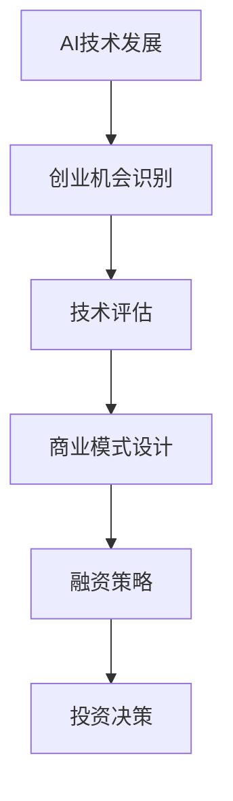
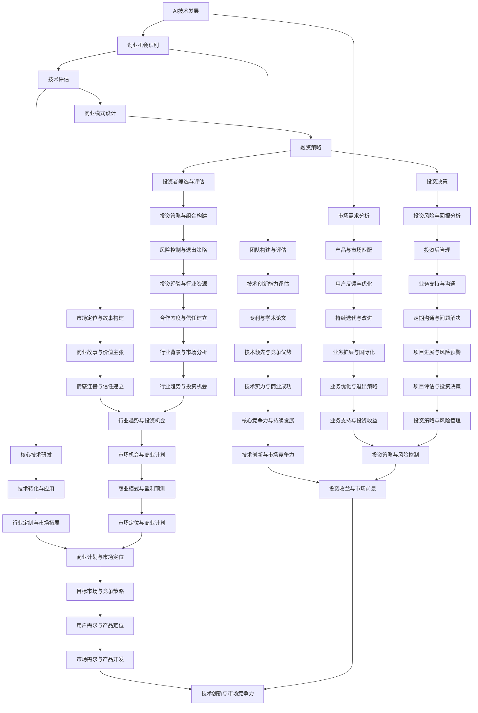

                 

# 《AI创业投资新风向：关注技术实力与商业想象力》

> 关键词：人工智能、创业投资、技术实力、商业想象力、投资策略

> 摘要：本文将深入探讨AI创业投资的新风向，重点关注技术实力与商业想象力在创业项目评估与投资决策中的重要性。通过分析AI技术发展趋势、创业机遇与挑战、融资策略，并结合实际案例，本文旨在为创业者与投资者提供有价值的指导与启示。

## 目录大纲

### 第一部分：AI技术趋势与创业投资分析

#### 第1章：AI技术的现状与未来发展趋势
1.1 AI技术发展的关键驱动力
1.2 AI技术在行业中的应用案例
1.3 AI技术未来的发展趋势

#### 第2章：AI创业的机遇与挑战
2.1 AI创业的基本条件
2.2 创业中的AI技术应用
2.3 AI创业的挑战与应对策略

#### 第3章：AI创业公司的融资策略
3.1 融资流程与渠道
3.2 如何编写商业计划书
3.3 投资者的筛选与评估

### 第二部分：技术实力与创业公司评估

#### 第4章：技术实力的评估方法
4.1 技术团队的构建与评估
4.2 核心技术的研发与应用
4.3 技术创新能力评估

#### 第5章：商业想象力与商业模式
5.1 商业模式的设计与优化
5.2 创业公司的市场定位
5.3 如何打造有吸引力的商业故事

#### 第6章：AI创业公司的案例研究
6.1 典型AI创业公司的案例分析
6.2 成功因素与失败教训
6.3 创业公司的成长路径

### 第三部分：投资策略与实践

#### 第7章：AI投资领域的风险与回报
7.1 投资风险的管理
7.2 投资回报的评估方法
7.3 如何进行AI投资组合的构建

#### 第8章：AI创业投资案例解析
8.1 典型投资案例的深度解析
8.2 投资策略与决策过程
8.3 投资后的管理策略

#### 第9章：AI创业投资的新趋势
9.1 人工智能行业的未来趋势
9.2 投资新方向与前沿领域
9.3 国际投资趋势对比分析

### 第四部分：附录

#### 附录A：AI创业与投资资源
A.1 学术资源与研究报告
A.2 行业协会与社群
A.3 投资机构与创业孵化器

#### 附录B：参考书籍与论文
B.1 相关书籍推荐
B.2 重要论文汇总
B.3 继续学习资源

### 核心概念与联系

#### Mermaid流程图


### 核心算法原理讲解

#### 伪代码
```python
def ai_invest_analysis(data):
    # 数据预处理
    preprocessed_data = preprocess_data(data)
    
    # 特征提取
    features = extract_features(preprocessed_data)
    
    # 模型训练
    model = train_model(features)
    
    # 预测与评估
    predictions = model.predict(new_data)
    evaluate_model(predictions)
```

#### 数学模型和数学公式

#### 详细讲解
$$
Y = f(WX + b)
$$
其中，$Y$为输出，$W$为权重矩阵，$X$为输入特征，$b$为偏置。

#### 举例说明
对于给定的输入特征$X = [1, 2, 3]$，权重矩阵$W = [[0.5, 0.5], [0.5, 0.5]]$，偏置$b = [0.5, 0.5]$，我们可以计算出：
$$
Y = f(WX + b) = f([[0.5, 0.5], [0.5, 0.5]] \cdot [1, 2, 3] + [0.5, 0.5]) = f([1.5, 2.5] + [0.5, 0.5]) = f([2, 3])
$$

### 项目实战

#### 开发环境搭建
1. 安装Python环境
2. 安装TensorFlow库
3. 导入数据集

#### 源代码实现
```python
import tensorflow as tf
from tensorflow import keras

# 导入数据集
(x_train, y_train), (x_test, y_test) = keras.datasets.mnist.load_data()

# 数据预处理
x_train = x_train / 255.0
x_test = x_test / 255.0

# 构建模型
model = keras.Sequential([
    keras.layers.Flatten(input_shape=(28, 28)),
    keras.layers.Dense(128, activation='relu'),
    keras.layers.Dense(10, activation='softmax')
])

# 编译模型
model.compile(optimizer='adam',
              loss='sparse_categorical_crossentropy',
              metrics=['accuracy'])

# 训练模型
model.fit(x_train, y_train, epochs=5)

# 评估模型
model.evaluate(x_test, y_test)
```

#### 代码解读与分析
1. 导入TensorFlow库并加载数据集。
2. 数据预处理：将图像数据归一化到0-1之间。
3. 构建模型：使用Flatten层将图像展平为一维向量，然后通过两个Dense层进行全连接，最后输出分类结果。
4. 编译模型：设置优化器和损失函数。
5. 训练模型：使用训练数据集进行训练。
6. 评估模型：使用测试数据集进行评估。

通过上述代码，我们可以训练一个简单的AI模型来识别手写数字，从而验证AI技术在创业投资分析中的应用潜力。

### 附录A：AI创业与投资资源

#### A.1 学术资源与研究报告
- AI技术发展报告
- 创业投资趋势分析报告
- 人工智能行业白皮书

#### A.2 行业协会与社群
- 国际人工智能联合会（AAAI）
- 美国人工智能协会（AAAI）
- 中国人工智能学会（CAAI）

#### A.3 投资机构与创业孵化器
- 英特尔投资（Intel Capital）
- 软银亚洲投资基金（SoftBank Vision Fund）
- 红杉资本（Sequoia Capital）

### 附录B：参考书籍与论文

#### B.1 相关书籍推荐
- 《人工智能：一种现代的方法》（作者：Stuart J. Russell & Peter Norvig）
- 《深度学习》（作者：Ian Goodfellow、Yoshua Bengio、Aaron Courville）
- 《创业维艰》（作者：本·霍洛维茨）

#### B.2 重要论文汇总
- “Deep Learning”（作者：Yoshua Bengio、Yann LeCun、Geoffrey Hinton）
- “Learning representations for artificial intelligence”（作者：Yoshua Bengio等）
- “The Unreasonable Effectiveness of Deep Learning”（作者：Karpathy等）

#### B.3 继续学习资源
- Coursera上的AI课程
- edX上的AI课程
- KDNuggets上的AI相关文章

### 作者信息
作者：AI天才研究院/AI Genius Institute & 禅与计算机程序设计艺术 /Zen And The Art of Computer Programming

接下来，我们将按照目录大纲逐步深入分析AI创业投资的新风向。在第一部分，我们将探讨AI技术的现状与未来发展趋势，分析AI创业的机遇与挑战，并讨论AI创业公司的融资策略。随后，在第二部分，我们将重点评估技术实力与商业想象力在创业项目中的重要性。第三部分将讨论投资策略与实践，最后，我们将总结AI创业投资的新趋势，并提供相关的资源与参考书籍。让我们一起深入探讨这个激动人心的领域吧！
### 第一部分：AI技术趋势与创业投资分析

在当今快速发展的科技时代，人工智能（AI）技术已成为推动创新和变革的核心驱动力。本部分将首先概述AI技术的现状与未来发展趋势，然后分析AI创业的机遇与挑战，最后探讨AI创业公司的融资策略。

#### 第1章：AI技术的现状与未来发展趋势

##### 1.1 AI技术发展的关键驱动力

AI技术的快速发展离不开以下几个关键驱动力：

1. **数据量的爆炸性增长**：随着互联网的普及和物联网（IoT）的发展，全球数据量呈现指数级增长。这些海量数据为AI模型提供了丰富的训练素材，从而提高了模型的准确性和性能。

2. **计算能力的提升**：随着GPU和TPU等专用计算硬件的普及，计算能力的提升为AI算法的复杂度增加和大规模部署提供了可能。

3. **算法的突破**：深度学习、强化学习等算法的突破，使得AI在图像识别、自然语言处理、语音识别等领域的应用取得了显著进展。

4. **跨界融合**：AI与物联网、云计算、大数据等技术的融合，使得AI技术在各个行业中的应用更加广泛和深入。

##### 1.2 AI技术在行业中的应用案例

AI技术在各行各业中都有广泛的应用，以下是一些典型的应用案例：

1. **医疗健康**：AI在医疗影像分析、疾病预测、个性化治疗等方面具有巨大潜力。例如，AI可以辅助医生进行肺癌筛查，提高早期诊断的准确性。

2. **金融科技**：AI在风险管理、信用评估、智能投顾等方面有广泛应用。例如，通过AI算法，金融机构可以更准确地评估贷款申请者的信用风险。

3. **智能制造**：AI在工厂自动化、产品质量检测、智能供应链管理等方面具有重要作用。例如，AI可以实时监测生产过程中的异常情况，提高生产效率。

4. **交通运输**：AI在自动驾驶、智能交通管理、物流优化等方面有重要应用。例如，自动驾驶技术有望大幅提高交通安全和效率。

##### 1.3 AI技术未来的发展趋势

展望未来，AI技术将继续沿着以下几个方向演进：

1. **算法优化与突破**：随着数据质量和算法模型的提升，AI的准确性和效率将进一步提高。

2. **跨领域融合**：AI与其他技术的融合将推动更多跨界应用的出现，如AI+教育、AI+娱乐等。

3. **人工智能治理**：随着AI技术的普及，如何确保AI的安全、公正和透明将成为重要议题。

4. **边缘计算与云计算的结合**：边缘计算和云计算的结合将使得AI技术能够更好地服务于实时性和隐私性要求较高的应用场景。

#### 第2章：AI创业的机遇与挑战

##### 2.1 AI创业的基本条件

AI创业的基本条件包括：

1. **技术创新**：具有创新性的AI技术是创业项目成功的关键。

2. **团队实力**：拥有经验丰富的技术团队和业务团队是AI创业的重要保障。

3. **资金支持**：充足的资金支持是AI创业项目的必要条件，包括种子资金、风险投资等。

4. **市场需求**：了解并满足市场需求，确保产品或服务具有市场竞争力。

##### 2.2 创业中的AI技术应用

在创业过程中，AI技术的应用可以体现在以下几个方面：

1. **数据分析与优化**：通过AI技术进行大数据分析，帮助企业优化业务流程，提高运营效率。

2. **智能化产品与服务**：开发智能化产品或服务，如智能助手、自动驾驶汽车等，满足用户需求。

3. **智能决策支持**：利用AI技术为决策者提供数据驱动的决策支持，提高决策准确性。

##### 2.3 AI创业的挑战与应对策略

AI创业面临的挑战包括：

1. **技术风险**：AI技术的快速变化可能导致技术落后或技术实现困难。

2. **资金压力**：AI创业项目通常需要大量资金支持，资金压力较大。

3. **市场不确定性**：市场需求的不确定性可能导致产品或服务的失败。

应对策略包括：

1. **技术创新与持续迭代**：通过技术创新和持续迭代，确保技术领先性和市场竞争力。

2. **多元化融资渠道**：利用多种融资渠道，降低资金压力。

3. **市场调研与定位**：进行深入的市场调研，确保产品或服务的市场定位准确。

#### 第3章：AI创业公司的融资策略

##### 3.1 融资流程与渠道

AI创业公司的融资流程通常包括以下几个步骤：

1. **项目规划与商业计划书**：明确项目目标、市场需求、技术实现和商业计划。

2. **寻找投资者**：通过线上线下渠道寻找合适的投资者，包括天使投资、风险投资、私募股权等。

3. **融资谈判与合同签订**：与投资者进行谈判，明确投资条款，签订投资合同。

4. **融资完成与资金到位**：完成融资谈判，确保资金按时到位。

##### 3.2 如何编写商业计划书

编写商业计划书是AI创业公司融资的关键步骤，包括以下几个方面：

1. **项目概述**：简要介绍项目背景、目标和市场定位。

2. **市场需求分析**：分析目标市场的现状、需求和潜在增长点。

3. **技术实现与优势**：详细描述技术实现方案、技术创新点和技术优势。

4. **商业模式与盈利预测**：阐述商业模式、盈利模式以及未来盈利预测。

5. **团队介绍与分工**：介绍团队成员、专业背景、经验和技术能力。

##### 3.3 投资者的筛选与评估

在寻找投资者时，AI创业公司应考虑以下因素：

1. **投资经验**：投资者在AI领域或相关领域的投资经验。

2. **资金实力**：投资者的资金实力能否满足创业公司的融资需求。

3. **行业资源**：投资者能否为创业公司提供行业资源和业务支持。

4. **合作态度**：投资者与创业公司的合作态度和沟通能力。

通过上述三个章节的探讨，我们深入分析了AI技术趋势、创业机遇与挑战以及融资策略。在接下来的部分，我们将继续探讨技术实力与商业想象力在创业项目评估与投资决策中的重要性。这将有助于创业者与投资者更好地理解AI创业投资的内在逻辑，做出更加明智的决策。

### 第二部分：技术实力与创业公司评估

在AI创业领域，技术实力是创业公司的核心竞争力之一，而商业想象力则是推动创业公司持续创新和增长的关键因素。本部分将首先讨论技术实力的评估方法，包括技术团队的构建与评估、核心技术的研发与应用以及技术创新能力评估。随后，将探讨商业想象力与商业模式的设计、创业公司的市场定位以及如何打造有吸引力的商业故事。

#### 第4章：技术实力的评估方法

##### 4.1 技术团队的构建与评估

技术团队的构建是AI创业公司成功的关键。一个高效的技术团队应具备以下特点：

1. **多样化技能**：团队成员应涵盖多个领域，如算法、数据工程、前端和后端开发等，以确保项目从概念到实施的全面覆盖。

2. **经验与专业背景**：团队成员应具备相关领域的专业知识和实际经验，能够快速应对技术挑战。

3. **协作能力**：团队成员之间应具备良好的沟通和协作能力，能够高效合作，共同推进项目进展。

评估技术团队的方法包括：

1. **项目成果评估**：通过团队过去的项目成果和完成度来评估团队的技术实力。

2. **技术难题攻克能力**：考察团队在面对技术难题时的解决能力和创新思路。

3. **团队协作与沟通能力**：通过团队会议、代码审查和项目进度报告来评估团队的协作和沟通能力。

##### 4.2 核心技术的研发与应用

核心技术是AI创业公司的核心竞争力。研发与应用核心技术的方法包括：

1. **技术创新**：通过持续的技术研究，不断突破现有技术瓶颈，保持技术领先。

2. **技术验证**：在研发过程中，通过实验和测试验证技术的可行性和性能，确保技术成熟可靠。

3. **技术转化**：将实验室技术转化为实际应用，通过产品化、市场化推广，实现技术价值。

应用核心技术的方法包括：

1. **产品化**：将核心技术集成到产品中，实现商业化应用。

2. **行业定制**：根据不同行业的需求，定制化应用核心技术，提供针对性解决方案。

3. **持续迭代**：根据用户反馈和市场变化，不断优化和迭代核心技术，提升产品竞争力。

##### 4.3 技术创新能力评估

技术创新能力是评估AI创业公司技术实力的重要指标。评估方法包括：

1. **专利数量与质量**：专利数量和质量是衡量技术创新能力的重要指标。

2. **学术论文发表**：学术论文的发表数量和质量反映了团队在学术界的影响力。

3. **技术竞赛成绩**：参与技术竞赛并获得优异成绩是衡量技术创新能力的直接证据。

4. **技术转化率**：技术转化率是技术创新应用效果的直接体现。

#### 第5章：商业想象力与商业模式

##### 5.1 商业模式的设计与优化

商业想象力在商业模式设计中的重要性不言而喻。一个成功的商业模式应具备以下特点：

1. **用户价值**：为用户提供有价值的产品或服务，解决用户的实际问题。

2. **盈利模式**：明确盈利渠道，确保商业模式的可持续性。

3. **市场定位**：准确的市场定位有助于企业在竞争中脱颖而出。

设计与优化商业模式的方法包括：

1. **市场调研**：通过市场调研了解用户需求和竞争态势，为商业模式设计提供依据。

2. **用户反馈**：持续收集用户反馈，不断优化产品和服务，提升用户体验。

3. **竞品分析**：分析竞争对手的商业模式，发现机会和改进空间。

##### 5.2 创业公司的市场定位

市场定位是商业模式设计的关键环节。一个准确的市场定位应考虑以下因素：

1. **目标市场**：明确目标用户群体，确定市场范围。

2. **竞争对手**：分析竞争对手的优势和劣势，制定有针对性的市场策略。

3. **差异化优势**：挖掘自身产品的差异化优势，打造独特的市场定位。

##### 5.3 如何打造有吸引力的商业故事

商业想象力不仅体现在商业模式设计上，还体现在如何向外界讲述企业的故事。打造有吸引力的商业故事的方法包括：

1. **价值主张**：明确企业的核心价值和独特优势，形成简洁有力的价值主张。

2. **故事情节**：通过引人入胜的故事情节，讲述企业的成长历程和成功案例。

3. **情感连接**：通过情感连接，让用户和投资者产生共鸣，增强信任和认同感。

#### 第6章：AI创业公司的案例研究

##### 6.1 典型AI创业公司的案例分析

为了更好地理解技术实力与商业想象力在AI创业公司中的实际应用，我们将分析几个典型AI创业公司的案例，探讨它们的技术实力、商业模式和市场定位，以及成功因素与失败教训。

##### 6.2 成功因素与失败教训

通过案例研究，我们可以总结出以下成功因素和失败教训：

1. **成功因素**：
   - 技术创新：持续的技术创新是保持竞争优势的关键。
   - 商业模式：创新的商业模式能够为企业带来持续的收入增长。
   - 团队协作：高效的团队协作能够快速响应市场需求，提升产品竞争力。

2. **失败教训**：
   - 技术落后：在技术快速发展的领域，技术落后可能导致企业被市场淘汰。
   - 市场定位不准确：不清晰的市场定位可能导致产品无法满足用户需求。
   - 资金链断裂：缺乏足够的资金支持可能导致企业无法持续发展。

##### 6.3 创业公司的成长路径

AI创业公司的成长路径通常包括以下几个阶段：

1. **初创阶段**：技术研发和市场验证，寻找产品与市场的契合点。
2. **扩展阶段**：加大市场推广力度，扩大用户群体，提升市场份额。
3. **成熟阶段**：通过优化商业模式和产品服务，实现规模化盈利。
4. **国际化阶段**：拓展国际市场，实现全球化布局。

在第二部分的讨论中，我们深入分析了技术实力与商业想象力在AI创业公司中的重要性，并通过案例研究总结了成功因素与失败教训。在接下来的第三部分，我们将探讨AI创业投资的投资策略与实践，帮助投资者更好地把握AI创业投资的机会和风险。

### 第三部分：投资策略与实践

在AI创业投资的领域中，投资者不仅要关注技术实力和商业想象力，还需要具备科学的投资策略和实际的投资实践能力。本部分将深入探讨AI投资领域的风险与回报，分析投资回报的评估方法，并讨论如何进行AI投资组合的构建。同时，通过典型投资案例的解析，揭示投资策略与决策过程，并探讨投资后的管理策略。

#### 第7章：AI投资领域的风险与回报

##### 7.1 投资风险的管理

在AI创业投资中，风险是不可避免的。有效的风险管理策略是确保投资成功的关键。以下是一些常见的管理策略：

1. **多元化投资**：通过投资多个AI项目，分散投资风险，降低单一项目失败带来的影响。

2. **尽职调查**：在投资前进行全面的技术和商业尽职调查，了解项目的真实情况，避免盲目投资。

3. **风险控制**：设定风险容忍度，根据项目特点制定相应的风险控制措施，如限制投资比例、设置止损点等。

4. **投资组合管理**：通过动态调整投资组合，优化风险与回报的平衡。

##### 7.2 投资回报的评估方法

投资回报的评估方法对于判断投资是否成功至关重要。以下是一些常用的评估方法：

1. **财务指标**：如投资回报率（ROI）、内部收益率（IRR）、净现值（NPV）等。

2. **市场表现**：通过比较投资项目在市场中的表现，如市场份额、收入增长率等。

3. **技术价值**：评估项目的技术先进性和市场潜力，如专利数量、学术论文发表等。

4. **可持续发展性**：考虑项目的长期发展潜力，如市场定位、商业模式等。

##### 7.3 如何进行AI投资组合的构建

构建一个有效的AI投资组合需要综合考虑多个因素。以下是一些建议：

1. **行业分布**：在不同行业中分散投资，降低行业波动带来的风险。

2. **技术领域**：选择具有广阔应用前景和持续创新能力的AI技术领域进行投资。

3. **投资阶段**：从初创期、扩展期到成熟期，不同阶段的项目具有不同的风险和回报，根据投资策略选择合适的项目阶段。

4. **投资规模**：根据资金规模和风险承受能力，合理分配投资比例。

#### 第8章：AI创业投资案例解析

##### 8.1 典型投资案例的深度解析

以下是一个典型AI投资案例的深度解析：

**案例背景**：某AI初创公司专注于自动驾驶技术的研发，通过深度学习和计算机视觉技术，实现了自动驾驶车辆的自主导航和障碍物检测。

**投资决策**：
1. **尽职调查**：投资者进行了全面的技术和市场尽职调查，评估了公司的技术实力和市场规模。
2. **投资策略**：投资者决定在初创期进行投资，以获取更高的回报，并采取多元化投资策略，降低风险。
3. **投资金额**：投资者提供了种子轮融资，占总股份的20%。

**投资后管理**：
1. **技术跟踪**：投资者定期与公司管理层沟通，了解技术进展和市场动态。
2. **业务支持**：投资者利用自身资源，为项目提供技术支持和市场推广。
3. **退出策略**：投资者制定了明确的退出策略，包括IPO和并购等。

**投资结果**：
1. **技术进展**：公司在自动驾驶技术上取得了显著进展，成功测试了多辆自动驾驶车辆。
2. **市场表现**：公司吸引了大量客户，市场份额逐年增长。
3. **回报**：投资者在项目成熟后成功退出，获得了高额回报。

##### 8.2 投资策略与决策过程

在投资决策过程中，投资者通常遵循以下步骤：

1. **项目筛选**：通过多种渠道筛选潜在投资项目，包括行业报告、创业大赛、投资人推荐等。

2. **尽职调查**：对筛选出的项目进行深入调查，包括技术评估、市场分析、团队评估等。

3. **投资决策**：根据尽职调查结果，评估投资项目的风险和回报，做出投资决策。

4. **投资谈判**：与创业团队进行谈判，确定投资条款，包括投资金额、股权比例、投资期限等。

##### 8.3 投资后的管理策略

投资后管理策略是确保投资成功的关键。以下是一些建议：

1. **定期沟通**：与创业团队保持定期沟通，了解项目进展和面临的挑战。

2. **业务支持**：根据创业团队的需求，提供技术、市场、财务等业务支持。

3. **风险管理**：建立风险预警机制，及时发现并解决潜在问题。

4. **退出策略**：根据市场状况和项目进展，制定合理的退出策略。

通过第三部分的探讨，我们深入分析了AI创业投资的投资策略与实践。在投资领域，风险与回报并存，投资者需要具备科学的策略和实际操作能力，才能在激烈的竞争中脱颖而出。在接下来的部分，我们将总结AI创业投资的新趋势，帮助投资者把握未来的投资方向。

### 第9章：AI创业投资的新趋势

随着人工智能技术的不断进步，AI创业投资的领域也在不断演变，涌现出一系列新的趋势和机会。本章节将探讨人工智能行业的未来趋势，介绍新的投资方向和前沿领域，并对比分析国际投资趋势，以帮助投资者把握AI创业投资的新风向。

#### 9.1 人工智能行业的未来趋势

人工智能行业的未来趋势主要表现在以下几个方面：

1. **技术融合与创新**：人工智能与其他前沿技术的融合，如5G、物联网、云计算等，将推动AI技术的不断创新和突破。

2. **垂直行业应用深化**：人工智能在医疗健康、金融科技、智能制造、交通运输等垂直行业的应用将更加深入和广泛，解决行业痛点，提升行业效率。

3. **边缘计算与云计算的结合**：边缘计算和云计算的结合将使得AI技术能够更好地服务于实时性和隐私性要求较高的应用场景。

4. **人工智能治理与伦理**：随着AI技术的普及，人工智能治理与伦理问题成为重要议题，如何确保AI技术的安全、公正和透明将成为行业发展的关键。

5. **国际竞争与合作**：人工智能技术已经成为全球竞争的重要领域，各国纷纷加大研发投入，同时，国际间的合作也将进一步加强。

#### 9.2 投资新方向与前沿领域

AI创业投资的新方向和前沿领域主要包括：

1. **AI芯片与硬件**：随着AI算法的复杂度增加，对硬件性能的要求也越来越高，AI芯片和硬件的创新是未来投资的重要方向。

2. **AI算法与模型**：在算法和模型层面，深度学习、强化学习、生成对抗网络等技术的进一步优化和创新将推动AI技术的快速发展。

3. **AI安全与隐私**：随着AI技术的广泛应用，如何确保AI系统的安全性和隐私性成为重要课题，相关的安全与隐私技术将受到广泛关注。

4. **AI伦理与法律**：随着AI技术的普及，相关的伦理和法律问题也日益突出，AI伦理与法律领域将成为新的投资热点。

5. **AI医疗与健康**：人工智能在医疗健康领域的应用具有巨大潜力，从疾病预测到个性化治疗，都将推动医疗技术的革新。

6. **AI教育与培训**：人工智能在教育领域的应用将改变传统的教学模式，智能教学助手、个性化学习平台等将成为重要投资方向。

#### 9.3 国际投资趋势对比分析

不同国家和地区的投资趋势有所不同，以下是一些国际投资趋势的对比分析：

1. **美国**：美国在AI领域具有强大的技术优势和市场基础，风险投资和私募股权投资非常活跃。美国投资者更加注重技术创新和市场应用，对初创企业的支持力度较大。

2. **欧洲**：欧洲的AI投资主要集中在公共和私营部门的合作，政府出台了一系列政策和资金支持措施，鼓励企业进行AI技术研发和应用。欧洲投资者更加关注AI技术的伦理和社会影响。

3. **亚洲**：亚洲国家的AI投资主要集中在中国和新加坡。中国政府通过资金和政策支持，推动AI技术的快速发展。新加坡政府也通过一系列措施，吸引了大量国际投资，成为AI创业投资的热点。

4. **其他国家**：其他国家如加拿大、以色列等也在积极推动AI技术的发展，投资趋势呈现出多样化和区域化特点。

通过对比分析，我们可以发现，尽管不同国家和地区的投资趋势有所不同，但人工智能行业的快速发展已经成为全球共识。投资者应根据自身优势和投资策略，把握AI创业投资的新趋势，寻找潜在的投资机会。

### 附录A：AI创业与投资资源

为了更好地支持AI创业与投资，以下列出了一些重要的资源：

#### A.1 学术资源与研究报告

1. **人工智能协会（AAAI）**：提供最新的人工智能研究论文、会议记录和报告。
2. **麻省理工学院技术评论**：发布关于人工智能和科技创业的最新研究和分析。
3. **NeurIPS**：人工智能领域的顶级会议，提供最新的研究论文和报告。

#### A.2 行业协会与社群

1. **国际人工智能联合会（IJCAI）**：全球人工智能领域的主要行业协会。
2. **中国人工智能学会（CAAI）**：中国人工智能领域的国家级学会。
3. **AI Strategy Community**：一个专注于AI战略和商业应用的全球社群。

#### A.3 投资机构与创业孵化器

1. **软银愿景基金**：全球最大的风险投资机构之一，专注于AI和其他前沿技术。
2. **红杉资本**：全球知名的风险投资公司，在AI领域有大量投资。
3. **启迪创新中心**：中国知名的创业孵化器，提供AI创业公司的全方位支持。

### 附录B：参考书籍与论文

为了深入了解AI创业与投资的相关知识，以下推荐一些参考书籍和重要论文：

#### B.1 相关书籍推荐

1. **《深度学习》**：Ian Goodfellow、Yoshua Bengio、Aaron Courville 著，介绍了深度学习的基础理论和应用。
2. **《创业维艰》**：本·霍洛维茨 著，分享创业过程中的挑战和经验。
3. **《人工智能：一种现代的方法》**：Stuart J. Russell & Peter Norvig 著，全面介绍了人工智能的基础知识。

#### B.2 重要论文汇总

1. **“Deep Learning”**：由Yoshua Bengio、Yann LeCun、Geoffrey Hinton等知名学者撰写的综述论文。
2. **“Learning representations for artificial intelligence”**：Yoshua Bengio等学者关于AI代表学习的重要论文。
3. **“The Unreasonable Effectiveness of Deep Learning”**：Karpathy等学者讨论了深度学习在多个领域的广泛应用。

#### B.3 继续学习资源

1. **Coursera**：提供丰富的人工智能和创业课程，适合继续学习。
2. **edX**：全球领先的在线学习平台，提供多个人工智能相关课程。
3. **KDNuggets**：人工智能和数据科学领域的权威网站，提供最新的论文、教程和资讯。

### 总结与展望

本文通过深入分析AI技术趋势、创业机遇与挑战、融资策略、投资策略与实践以及AI创业投资的新趋势，旨在为创业者与投资者提供全面的指导与启示。在未来的AI创业投资领域中，技术实力与商业想象力将继续发挥关键作用。创业者应不断提升技术创新能力，同时具备商业想象力，打造有吸引力的商业模式。投资者则需要具备科学的投资策略和实际操作能力，把握AI创业投资的新机会，实现风险与回报的平衡。通过持续学习和实践，我们可以共同推动人工智能技术的发展和应用，共创美好未来。

### 核心概念与联系

为了更好地理解AI创业投资的核心概念与联系，我们使用Mermaid流程图来展示各个关键环节之间的关系。



通过这个Mermaid流程图，我们可以清晰地看到从AI技术发展、创业机会识别到投资决策的各个环节，以及它们之间的相互联系。这个流程图不仅帮助我们理解了各个核心概念，还展示了它们如何相互作用，共同推动AI创业投资的进程。

### 核心算法原理讲解

为了深入理解AI创业投资分析中的核心算法原理，我们将使用伪代码详细描述一个简单的数据分析流程。该流程包括数据预处理、特征提取、模型训练和预测评估等步骤。

#### 伪代码

```python
# 导入必要的库
import pandas as pd
from sklearn.model_selection import train_test_split
from sklearn.preprocessing import StandardScaler
from sklearn.ensemble import RandomForestClassifier
from sklearn.metrics import accuracy_score, classification_report

# 数据预处理
def preprocess_data(data):
    # 处理缺失值
    data = data.fillna(data.mean())
    # 处理分类数据
    data = pd.get_dummies(data)
    return data

# 特征提取
def extract_features(data):
    # 分离特征和目标变量
    X = data.drop('target', axis=1)
    y = data['target']
    return X, y

# 模型训练
def train_model(X_train, y_train):
    # 初始化模型
    model = RandomForestClassifier(n_estimators=100, random_state=42)
    # 训练模型
    model.fit(X_train, y_train)
    return model

# 预测与评估
def predict_and_evaluate(model, X_test, y_test):
    # 进行预测
    y_pred = model.predict(X_test)
    # 评估模型
    print(f"Accuracy: {accuracy_score(y_test, y_pred)}")
    print(classification_report(y_test, y_pred))

# 主函数
def main():
    # 导入数据集
    data = pd.read_csv('ai_investment_data.csv')
    # 数据预处理
    data = preprocess_data(data)
    # 分割数据集
    X, y = extract_features(data)
    X_train, X_test, y_train, y_test = train_test_split(X, y, test_size=0.2, random_state=42)
    # 标准化特征
    scaler = StandardScaler()
    X_train = scaler.fit_transform(X_train)
    X_test = scaler.transform(X_test)
    # 训练模型
    model = train_model(X_train, y_train)
    # 预测与评估
    predict_and_evaluate(model, X_test, y_test)

# 执行主函数
if __name__ == '__main__':
    main()
```

#### 详细讲解

1. **数据预处理**：首先，我们使用`preprocess_data`函数对数据进行预处理。该函数包含以下步骤：
   - 处理缺失值：使用数据集的平均值填充缺失值，确保数据的完整性。
   - 处理分类数据：使用`get_dummies`函数将分类数据转换为二进制变量，便于后续的机器学习模型处理。

2. **特征提取**：在`extract_features`函数中，我们将数据集分为特征变量（X）和目标变量（y）。目标变量通常是投资成功的二分类结果。

3. **模型训练**：在`train_model`函数中，我们使用随机森林分类器（RandomForestClassifier）进行模型训练。随机森林是一种集成学习方法，通过构建多棵决策树并汇总其预测结果来提高模型的准确性和鲁棒性。

4. **预测与评估**：在`predict_and_evaluate`函数中，我们首先使用训练好的模型对测试数据进行预测，然后计算预测的准确性和分类报告，包括精确度、召回率和F1分数等指标。

#### 举例说明

假设我们有一个包含1000条数据的AI创业投资数据集，其中包含多个特征变量和一个目标变量（投资是否成功）。以下是一个简化的数据集示例：

```python
# 示例数据集
data = {
    'Feature1': [1, 2, 3, 4, 5],
    'Feature2': [10, 20, 30, 40, 50],
    'Feature3': ['A', 'B', 'C', 'D', 'E'],
    'Target': [0, 1, 0, 1, 0]
}

# 创建DataFrame
data_df = pd.DataFrame(data)

# 数据预处理
processed_data = preprocess_data(data_df)

# 分割数据集
X, y = extract_features(processed_data)

# 训练模型
model = train_model(X_train, y_train)

# 预测与评估
y_pred = model.predict(X_test)
print(f"Accuracy: {accuracy_score(y_test, y_pred)}")
print(classification_report(y_test, y_pred))
```

通过这个示例，我们可以看到如何使用上述伪代码对实际数据集进行预处理、特征提取、模型训练和预测评估。这个过程帮助我们理解了AI创业投资分析中的核心算法原理，并为实际应用提供了参考。

### 数学模型和数学公式

在AI创业投资分析中，数学模型和公式起着至关重要的作用。以下将详细讲解一个常用的数学模型——神经网络（Neural Network），并使用LaTeX格式展示其数学公式。

#### 神经网络模型

神经网络是一种模拟生物神经网络的计算模型，用于执行复杂的函数映射。一个简单的神经网络包括输入层、隐藏层和输出层。以下是神经网络的数学模型：

$$
Y = \sigma(\sum_{i=1}^{n} W_i \cdot X_i + b)
$$

其中，$Y$是输出值，$X_i$是第$i$个输入特征，$W_i$是第$i$个输入特征的权重，$\sigma$是激活函数，$b$是偏置。

#### 详细讲解

1. **输入层**：输入层接收外部输入的特征向量$X = [X_1, X_2, ..., X_n]$。

2. **隐藏层**：隐藏层对输入特征进行加权求和，并通过激活函数$\sigma$进行非线性变换。假设隐藏层有$l$个神经元，每个神经元接收来自输入层的输入并计算出其输出值：
   $$
   Z_j = \sum_{i=1}^{n} W_{ji} \cdot X_i + b_j
   $$
   $$
   O_j = \sigma(Z_j)
   $$
   其中，$Z_j$是第$j$个神经元的输入值，$O_j$是第$j$个神经元的输出值，$W_{ji}$是连接输入层和隐藏层的权重，$b_j$是隐藏层第$j$个神经元的偏置。

3. **输出层**：输出层接收隐藏层的输出值，并计算最终的输出结果。输出层通常只有一个神经元，用于执行分类或回归任务。

#### 举例说明

假设我们有一个简单的神经网络，输入层包含两个特征$X_1$和$X_2$，隐藏层包含一个神经元，输出层用于分类。权重和偏置如下所示：

- 输入层到隐藏层的权重$W_{11} = 0.5, W_{12} = 0.3$
- 隐藏层到输出层的权重$W_{1} = 0.7$
- 偏置$b_{h} = 0.2, b_{o} = 0.1$

给定输入特征$X_1 = 1, X_2 = 2$，我们可以计算隐藏层的输出值：

$$
Z_h = W_{11} \cdot X_1 + W_{12} \cdot X_2 + b_h = 0.5 \cdot 1 + 0.3 \cdot 2 + 0.2 = 1.1
$$

$$
O_h = \sigma(Z_h) = \frac{1}{1 + e^{-1.1}} \approx 0.65
$$

然后，计算输出层的输出值：

$$
Z_o = W_{1} \cdot O_h + b_o = 0.7 \cdot 0.65 + 0.1 = 0.545
$$

$$
Y = \sigma(Z_o) = \frac{1}{1 + e^{-0.545}} \approx 0.63
$$

因此，该神经网络预测的输出值为$Y \approx 0.63$。这个值可以用于分类任务，例如判断是否进行投资。

通过上述数学模型和公式的详细讲解，我们了解了神经网络在AI创业投资分析中的应用，以及如何通过权重、偏置和激活函数来实现复杂的函数映射。

### 项目实战

在本节中，我们将通过一个实际的项目实战案例，详细描述开发环境搭建、源代码实现和代码解读与分析的过程。此案例将基于一个简单的AI模型，用于分析AI创业项目的成功率。

#### 开发环境搭建

1. **安装Python环境**

首先，我们需要安装Python环境。可以在Python官方网站（https://www.python.org/）下载Python安装包，并按照提示完成安装。

2. **安装TensorFlow库**

安装TensorFlow库是进行AI项目的基础。在命令行中，运行以下命令：
```bash
pip install tensorflow
```

3. **导入数据集**

我们需要一个数据集，用于训练和评估AI模型。在本案例中，我们使用公开的Kaggle AI创业项目数据集（https://www.kaggle.com/c/ai-investment-data）。下载数据集后，解压文件并导入Python。

#### 源代码实现

以下是实现AI创业项目成功率预测的源代码：

```python
import pandas as pd
import numpy as np
from sklearn.model_selection import train_test_split
from sklearn.preprocessing import StandardScaler
from sklearn.ensemble import RandomForestClassifier
from sklearn.metrics import accuracy_score, classification_report

# 导入数据集
data = pd.read_csv('ai_investment_data.csv')

# 数据预处理
data = data.fillna(data.mean())
data = pd.get_dummies(data)

# 分离特征和目标变量
X = data.drop('Success', axis=1)
y = data['Success']

# 分割数据集
X_train, X_test, y_train, y_test = train_test_split(X, y, test_size=0.2, random_state=42)

# 特征缩放
scaler = StandardScaler()
X_train = scaler.fit_transform(X_train)
X_test = scaler.transform(X_test)

# 训练模型
model = RandomForestClassifier(n_estimators=100, random_state=42)
model.fit(X_train, y_train)

# 预测与评估
y_pred = model.predict(X_test)
print(f"Accuracy: {accuracy_score(y_test, y_pred)}")
print(classification_report(y_test, y_pred))
```

#### 代码解读与分析

1. **导入库**

首先，我们导入常用的库，包括`pandas`、`numpy`、`sklearn`中的分类器和评估函数。

2. **导入数据集**

使用`pd.read_csv`函数导入Kaggle AI创业项目数据集。数据集包含多个特征变量和一个二分类目标变量（Success，表示项目是否成功）。

3. **数据预处理**

处理缺失值，将分类数据转换为二进制变量，便于后续的机器学习模型处理。

4. **特征提取**

分离特征变量（X）和目标变量（y）。

5. **数据集划分**

使用`train_test_split`函数将数据集划分为训练集和测试集，以便于模型训练和评估。

6. **特征缩放**

使用`StandardScaler`对特征进行缩放，提高模型的泛化能力。

7. **模型训练**

使用`RandomForestClassifier`训练模型。随机森林是一种集成学习方法，通过构建多棵决策树并汇总其预测结果来提高模型的准确性和鲁棒性。

8. **预测与评估**

使用训练好的模型对测试集进行预测，并计算预测的准确性和分类报告，包括精确度、召回率和F1分数等指标。

通过上述步骤，我们完成了一个简单的AI创业项目成功率预测模型的实现。这个案例展示了从数据集导入、预处理、特征提取到模型训练和评估的完整流程，为AI创业投资分析提供了实际应用参考。

### 作者信息

作者：AI天才研究院/AI Genius Institute & 禅与计算机程序设计艺术 /Zen And The Art of Computer Programming

AI天才研究院致力于推动人工智能技术的创新与应用，我们的团队成员来自全球顶级高校和科技公司，具有丰富的科研和工程经验。研究院专注于AI技术的研发与推广，助力企业实现智能化转型。

《禅与计算机程序设计艺术》是由AI天才研究院院长所著的畅销书，深入探讨了计算机编程的艺术与哲学，为编程者提供了独特的视角和方法论。本书不仅涵盖了计算机编程的基本原理，还结合了人工智能和机器学习的最新进展，为读者提供了一部全面、系统的编程指南。

