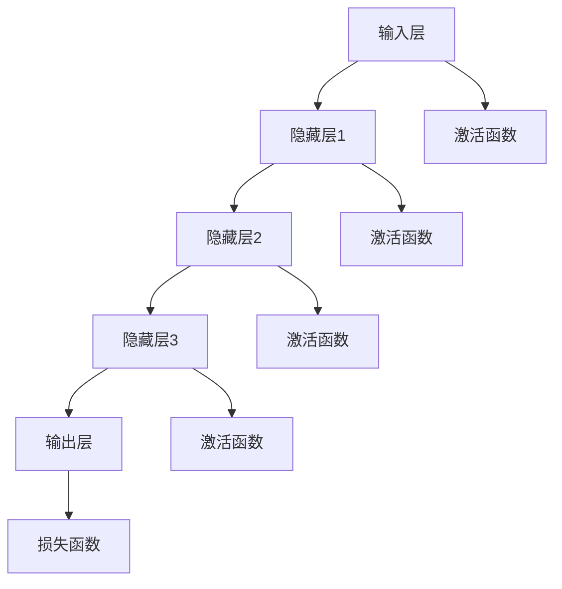
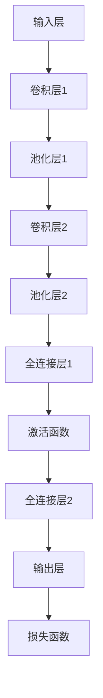
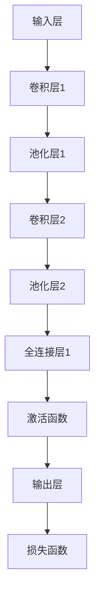
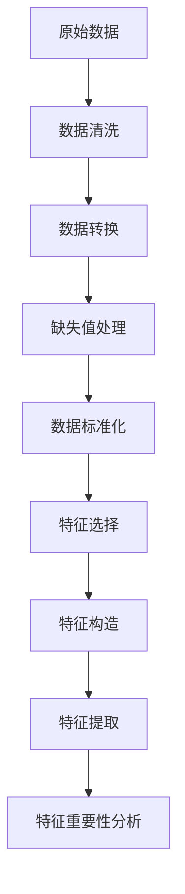

                 

### 《AI创业机遇：垂直领域无限》

#### 关键词

- AI创业
- 垂直领域
- 机器学习
- 深度学习
- 金融科技
- 医疗健康
- 智能制造
- 零售电商
- 交通物流
- 项目实战

#### 摘要

本文深入探讨了AI创业在垂直领域的无限机遇。通过分析AI行业现状、基础技术、垂直领域应用及创业实战，揭示了AI技术在金融、医疗、制造、零售和物流等领域的潜力。文章旨在为有意投身AI创业的读者提供有价值的指导和启示。

#### 第一部分：AI行业概述

##### 第1章：AI创业环境与机遇

###### 1.1 AI行业现状与趋势

人工智能（AI）作为当今科技领域的前沿，已经从实验室走向了实际应用。从智能助手到自动驾驶，AI技术正在改变我们的生活和工作方式。

- **1.1.1 AI技术发展历程**  
  AI技术的发展可以追溯到20世纪50年代，经历了多个阶段，包括符号主义、知识表示、专家系统等，最终进入了以深度学习和大数据为核心的现代阶段。

- **1.1.2 AI技术成熟度分析**  
  当前，深度学习、强化学习等技术在图像识别、自然语言处理、游戏智能等领域取得了显著的成果，显示出较高的成熟度。

- **1.1.3 AI在各行业中的应用案例**  
  AI在金融、医疗、零售、交通等行业已经得到了广泛应用，如智能投顾、医疗影像诊断、智能推荐系统、自动驾驶等。

###### 1.2 创业机遇与挑战

AI创业不仅面临技术挑战，还有市场、法律和伦理等多方面的挑战。

- **1.2.1 垂直领域市场分析**  
  垂直领域市场具有高度专业化和需求明确的特点，如医疗健康、金融科技等，这些领域对AI技术的需求迫切。

- **1.2.2 AI创业的主要挑战**  
  创业过程中可能会遇到数据获取、算法优化、商业模式设计等方面的挑战。

- **1.2.3 创业成功的要素**  
  成功的AI创业需要技术创新、市场洞察、团队协作和持续学习等多方面因素的支持。

##### 第2章：AI基础概念与架构

###### 2.1 AI基本原理

AI的核心在于机器学习，其中深度学习是当前最热门的技术之一。

- **2.1.1 机器学习与深度学习**  
  机器学习是一种使计算机从数据中学习规律的技术，而深度学习则是基于多层神经网络的一种特殊机器学习算法。

- **2.1.2 神经网络与深度学习架构**  
  神经网络由大量神经元组成，通过层层处理输入信息，实现复杂函数的拟合。深度学习架构包括卷积神经网络（CNN）、循环神经网络（RNN）和生成对抗网络（GAN）等。

- **2.1.3 计算机视觉与自然语言处理**  
  计算机视觉和自然语言处理是AI技术的两个重要分支，分别用于图像理解和语言理解。

###### 2.2 AI开发环境搭建

搭建一个高效的AI开发环境是进行研究和开发的基础。

- **2.2.1 开发工具与框架**  
  TensorFlow、PyTorch等是当前最流行的深度学习框架，提供了丰富的工具和接口。

- **2.2.2 硬件与软件需求**  
  高性能计算硬件（如GPU）和强大的软件开发环境（如Jupyter Notebook）是AI开发的必备条件。

- **2.2.3 开发环境配置与优化**  
  配置合适的开发环境，并进行优化，可以提高开发效率和模型性能。

##### 第3章：核心算法与模型

###### 3.1 机器学习算法

机器学习算法是AI技术的核心，涵盖了从简单到复杂的多种算法。

- **3.1.1 监督学习与无监督学习**  
  监督学习利用标注数据进行训练，无监督学习则从未标注的数据中学习规律。

- **3.1.2 强化学习与概率图模型**  
  强化学习通过与环境的交互进行学习，而概率图模型则通过图结构表示变量间的依赖关系。

- **3.1.3 算法选择与优化**  
  根据实际问题选择合适的算法，并进行优化，是提高模型性能的关键。

###### 3.2 深度学习模型

深度学习模型在图像识别、语音识别等领域取得了显著成果。

- **3.2.1 卷积神经网络（CNN）**  
  CNN通过卷积层提取图像特征，适用于图像分类和物体检测。

- **3.2.2 循环神经网络（RNN）与长短时记忆网络（LSTM）**  
  RNN和LSTM用于处理序列数据，如时间序列预测和机器翻译。

- **3.2.3 生成对抗网络（GAN）**  
  GAN通过生成器和判别器的对抗训练，可以生成逼真的图像和语音。

##### 第4章：数据处理与特征工程

###### 4.1 数据预处理

数据预处理是机器学习项目的重要环节。

- **4.1.1 数据清洗与规范化**  
  清洗数据以去除噪声和异常值，规范化数据以提高算法性能。

- **4.1.2 数据降维与特征提取**  
  通过降维技术减少数据维度，提取关键特征，以提高模型效率和准确性。

- **4.1.3 数据可视化**  
  数据可视化有助于理解数据分布和特征关系，指导特征工程。

###### 4.2 特征工程

特征工程是提升模型性能的关键步骤。

- **4.2.1 特征选择方法**  
  通过选择对目标变量贡献大的特征，提高模型性能。

- **4.2.2 特征构造与转换**  
  构造新特征和转换现有特征，以丰富特征空间。

- **4.2.3 特征重要性分析**  
  分析特征的重要性，指导特征优化和模型改进。

#### 第二部分：AI基础技术

##### 第1章：AI基础概念与架构

###### 2.1 AI基本原理

人工智能（AI）是一种模拟人类智能的技术，通过机器学习（ML）、深度学习（DL）等技术实现智能行为。AI的基本原理可以分为以下几个核心组成部分：

1. **数据采集与处理**：AI系统首先需要从各种来源收集大量数据，如文本、图像、音频等。数据采集后，需要进行预处理，包括清洗、归一化、去噪等步骤，以确保数据的质量和一致性。

2. **特征提取与选择**：在数据预处理之后，特征提取是一个关键步骤。通过特征提取，可以将原始数据转换为一组数字特征，这些特征能够捕捉数据中的关键信息。特征选择则是从提取的特征中选择出对模型训练有重要影响的关键特征，以减少冗余和提高模型的效率。

3. **模型训练**：模型训练是AI的核心环节。在这个阶段，AI系统使用已标注的数据集来训练模型，学习数据中的规律和模式。机器学习算法如线性回归、决策树、随机森林、神经网络等都是常见的模型训练方法。

4. **模型评估与优化**：模型训练完成后，需要对模型进行评估，以确定其在未知数据上的性能。评估指标包括准确率、召回率、F1分数、均方误差等。通过评估，可以发现模型的不足之处，并进行优化。

5. **模型部署与应用**：经过训练和优化后，AI模型可以部署到实际应用中，如预测股票价格、诊断疾病、推荐商品等。

###### 2.1.1 机器学习与深度学习

机器学习（ML）是一种使计算机从数据中学习规律的方法。它通过构建数学模型，从数据中提取特征，并利用这些特征对新的数据进行预测或分类。机器学习可以分为监督学习、无监督学习和强化学习三种类型。

- **监督学习**：在监督学习中，输入变量（特征）和输出变量（标签）都是已知的。模型的目的是通过学习这些已知的输入输出关系，预测新的未知输出。常见的算法包括线性回归、决策树、支持向量机（SVM）等。

- **无监督学习**：无监督学习没有明确的输出标签，目标是发现数据中的隐藏结构或模式。常见的算法包括聚类、主成分分析（PCA）、自编码器等。

- **强化学习**：强化学习是一种通过试错和反馈来学习的机器学习方法。它通过与环境的交互，不断调整策略以最大化奖励。常见的算法包括Q学习、深度Q网络（DQN）、策略梯度方法等。

深度学习（DL）是机器学习的一个子领域，它利用多层神经网络来模拟人脑的神经结构。深度学习通过多个隐藏层来提取数据中的复杂特征，从而实现更复杂的任务。深度学习的核心组成部分包括：

- **神经网络**：神经网络是由大量相互连接的神经元组成的计算模型。每个神经元都接收输入信号，通过加权求和并应用激活函数，输出结果。

- **激活函数**：激活函数是神经网络中的一个关键组件，它用于引入非线性因素，使神经网络能够模拟复杂的函数。

- **反向传播**：反向传播是一种用于训练神经网络的方法。它通过计算输出误差，并反向传播误差到每一层神经元，更新每个神经元的权重。

深度学习架构包括以下几种类型：

- **卷积神经网络（CNN）**：CNN专门用于处理图像数据。它通过卷积层提取图像特征，并通过池化层降低数据维度。CNN在图像分类、物体检测和图像生成等方面有广泛应用。

- **循环神经网络（RNN）**：RNN用于处理序列数据，如文本、时间序列等。RNN通过循环连接将当前输入与之前的隐藏状态关联起来，从而捕捉序列中的长期依赖关系。常见的RNN变体包括长短期记忆网络（LSTM）和门控循环单元（GRU）。

- **生成对抗网络（GAN）**：GAN由生成器和判别器两个神经网络组成。生成器试图生成逼真的数据，而判别器试图区分真实数据和生成数据。通过这种对抗训练，GAN可以生成高质量的图像和音频。

###### 2.1.2 神经网络与深度学习架构

神经网络（NN）是深度学习的基础，由大量相互连接的神经元组成。每个神经元都接收输入信号，通过加权求和并应用激活函数，输出结果。神经网络可以分为以下几层：

- **输入层**：输入层接收外部输入，如文本、图像或传感器数据。

- **隐藏层**：隐藏层位于输入层和输出层之间，负责提取输入数据中的特征。隐藏层的数量和神经元数量可以根据问题的复杂度进行调整。

- **输出层**：输出层产生最终输出，如分类结果、预测值或控制信号。

深度学习架构通常包括以下关键组件：

1. **卷积层**：卷积层用于处理图像数据，通过卷积操作提取图像特征。卷积层可以多次叠加，形成卷积神经网络（CNN）。

2. **池化层**：池化层用于降低数据维度，减少计算量和参数数量。常见的池化操作包括最大池化和平均池化。

3. **全连接层**：全连接层将隐藏层的输出连接到输出层，实现分类、回归等任务。

4. **激活函数**：激活函数引入非线性因素，使神经网络能够模拟复杂的函数。常见的激活函数包括ReLU、Sigmoid和Tanh。

5. **损失函数**：损失函数用于衡量预测值与真实值之间的误差，是优化神经网络的关键。常见的损失函数包括均方误差（MSE）、交叉熵（Cross-Entropy）和Hinge损失。

6. **优化算法**：优化算法用于更新网络权重，以最小化损失函数。常见的优化算法包括随机梯度下降（SGD）、Adam和RMSprop。

以下是一个简单的神经网络架构的Mermaid流程图：



在这个流程图中，输入层接收外部输入，并通过激活函数传递到隐藏层。每个隐藏层都通过激活函数处理输入，并将结果传递到下一个隐藏层。最终，输出层产生预测结果，并通过损失函数计算预测误差。

###### 2.1.3 计算机视觉与自然语言处理

计算机视觉（CV）和自然语言处理（NLP）是AI技术的两个重要分支，分别用于处理图像和语言数据。

1. **计算机视觉**：

   计算机视觉的目标是使计算机能够理解和解释图像或视频中的内容。计算机视觉的核心组成部分包括：

   - **图像特征提取**：通过卷积层、池化层等网络结构提取图像中的特征。这些特征可以用于分类、物体检测和图像生成等任务。

   - **物体检测**：物体检测的目的是识别图像中的物体并确定它们的位置。常见的算法包括基于区域提议的方法（如R-CNN、SSD、YOLO）和基于特征的方法（如Faster R-CNN）。

   - **图像分类**：图像分类是将图像分为预定义的类别。常见的算法包括卷积神经网络（如AlexNet、VGG、ResNet）和迁移学习（如ImageNet）。

2. **自然语言处理**：

   自然语言处理的目标是使计算机能够理解和处理人类语言。自然语言处理的核心组成部分包括：

   - **词向量表示**：词向量是将文本中的词语转换为固定长度的向量表示。常见的词向量模型包括Word2Vec、GloVe和FastText。

   - **文本分类**：文本分类是将文本分为预定义的类别。常见的算法包括朴素贝叶斯、支持向量机（SVM）和深度学习（如CNN、LSTM）。

   - **机器翻译**：机器翻译是将一种语言的文本翻译成另一种语言的文本。常见的算法包括基于规则的方法、基于统计的方法和基于神经网络的深度学习方法。

以下是一个简单的神经网络架构，用于处理图像分类任务的Mermaid流程图：



在这个流程图中，输入层接收图像数据，通过卷积层和池化层提取特征，然后通过全连接层进行分类。最后，输出层产生分类结果，并通过损失函数计算预测误差。

##### 第2章：AI开发环境搭建

###### 2.2.1 开发工具与框架

AI开发需要使用多种工具和框架，以提高开发效率。以下是一些常用的开发工具和框架：

1. **TensorFlow**：TensorFlow是Google开源的深度学习框架，提供丰富的API和工具，支持多种编程语言，如Python、C++等。

2. **PyTorch**：PyTorch是Facebook开源的深度学习框架，以其动态计算图和灵活的API而受到广泛使用。PyTorch支持Python和CUDA，适合研究者和开发者。

3. **Keras**：Keras是一个高级神经网络API，提供简单而强大的API，可以与TensorFlow和Theano等后端框架无缝集成。

4. **Scikit-learn**：Scikit-learn是一个开源的Python机器学习库，提供丰富的算法和工具，适用于数据挖掘和统计分析。

5. **NumPy**：NumPy是一个开源的Python科学计算库，提供多维数组对象和丰富的数学函数，是进行数据科学和机器学习的基础。

6. **Pandas**：Pandas是一个开源的Python数据分析库，提供数据结构和数据分析工具，适用于数据处理和统计分析。

7. **Matplotlib**：Matplotlib是一个开源的Python数据可视化库，提供丰富的绘图函数，用于生成各种类型的图表和图形。

###### 2.2.2 硬件与软件需求

进行AI开发需要高性能的硬件和软件环境。以下是一些硬件和软件需求：

1. **CPU**：大部分AI算法都可以在普通CPU上运行，但为了提高计算速度，高性能的CPU（如Intel Xeon或AMD Ryzen）是理想的选择。

2. **GPU**：GPU（图形处理单元）在AI计算中具有显著优势，因为其高度并行的架构适合处理大量数据。NVIDIA的GPU，特别是搭载CUDA和cuDNN的GPU，是进行深度学习计算的首选。

3. **内存**：AI模型通常需要大量内存来存储数据和模型参数。至少16GB的内存是推荐的起步配置，但根据模型的规模和复杂性，可能需要更高的内存。

4. **硬盘**：为了存储数据和模型文件，需要足够的硬盘空间。SSD（固态硬盘）比HDD（机械硬盘）具有更快的读写速度，适合进行AI计算。

5. **操作系统**：Linux操作系统是进行AI开发的常用选择，因为它具有更好的性能和兼容性。Windows和Mac操作系统也可以用于AI开发，但可能需要安装额外的软件包。

6. **IDE**：集成开发环境（IDE）如Jupyter Notebook、PyCharm和Visual Studio Code等，提供了代码编辑、调试和自动化部署等功能，是进行AI开发的常用工具。

###### 2.2.3 开发环境配置与优化

配置一个高效的AI开发环境是进行研究和开发的关键。以下是一些配置和优化的步骤：

1. **安装Python环境**：首先安装Python解释器和pip包管理器，用于安装和管理其他Python库。

2. **安装深度学习框架**：根据需求和偏好选择TensorFlow、PyTorch或Keras等深度学习框架，并安装对应的GPU支持。

3. **安装科学计算库**：安装NumPy、Pandas、Matplotlib等科学计算库，用于数据处理和可视化。

4. **安装文本处理库**：安装NLTK、spaCy等文本处理库，用于自然语言处理任务。

5. **安装其他工具**：安装其他必要的工具，如Git、Jupyter Notebook等。

6. **配置GPU支持**：对于使用GPU进行计算的模型，需要配置CUDA和cuDNN，以提高计算速度。

7. **优化环境变量**：设置环境变量，如PYTHONPATH和LD_LIBRARY_PATH，以确保库和工具的正常运行。

8. **使用容器化技术**：使用Docker等容器化技术，可以创建一个统一的开发环境，确保在不同系统之间的一致性。

通过以上步骤，可以配置一个高效的AI开发环境，为后续的研究和开发提供支持。

##### 第3章：核心算法与模型

###### 3.1 机器学习算法

机器学习算法是AI的核心组成部分，用于从数据中学习规律并进行预测或分类。机器学习算法可以分为三类：监督学习、无监督学习和强化学习。

1. **监督学习**：

   在监督学习中，我们有一个包含输入和输出标签的训练数据集。模型的目标是学习输入和输出之间的关系，以便对新数据进行预测。常见的监督学习算法包括：

   - **线性回归**：用于预测连续值输出。
   - **逻辑回归**：用于预测二分类问题。
   - **决策树**：基于树形结构进行分类或回归。
   - **支持向量机（SVM）**：通过找到最优分割超平面进行分类。
   - **神经网络**：通过多层神经元的组合进行复杂函数的拟合。

2. **无监督学习**：

   在无监督学习中，我们只有输入数据，没有输出标签。模型的目的是发现数据中的结构或模式。常见的无监督学习算法包括：

   - **聚类**：将数据分为若干个群组，每个群组内部的成员彼此相似，而群组之间的成员差异较大。常见的聚类算法包括K-means、层次聚类等。
   - **降维**：通过降低数据维度来简化数据分析。常见的降维算法包括主成分分析（PCA）、线性判别分析（LDA）等。
   - **关联规则学习**：发现数据之间的关联规则，用于推荐系统、市场细分等。常见的算法包括Apriori算法、FP-growth算法等。

3. **强化学习**：

   强化学习是一种通过试错和反馈来学习的算法，其核心目标是最大化累计奖励。在强化学习中，智能体通过与环境的交互，学习一个策略，以最大化长期奖励。常见的强化学习算法包括：

   - **Q学习**：通过值函数学习最优策略。
   - **深度Q网络（DQN）**：使用深度神经网络来近似值函数。
   - **策略梯度方法**：直接学习最优策略。

###### 3.2 深度学习模型

深度学习模型是基于多层神经网络构建的，能够从大量数据中自动提取特征，并在各种复杂的任务中表现出色。深度学习模型的核心组成部分包括：

1. **神经网络**：

   神经网络由大量相互连接的神经元组成，每个神经元接收输入信号，通过加权求和并应用激活函数，输出结果。神经网络可以分为输入层、隐藏层和输出层。

2. **激活函数**：

   激活函数是神经网络中的一个关键组件，它引入非线性因素，使神经网络能够模拟复杂的函数。常见的激活函数包括ReLU、Sigmoid和Tanh。

3. **反向传播**：

   反向传播是一种用于训练神经网络的方法，通过计算输出误差，并反向传播误差到每一层神经元，更新每个神经元的权重。反向传播算法是神经网络训练的核心。

4. **优化算法**：

   优化算法用于更新网络权重，以最小化损失函数。常见的优化算法包括随机梯度下降（SGD）、Adam和RMSprop。

深度学习模型可以分为以下几种类型：

1. **卷积神经网络（CNN）**：

   卷积神经网络是深度学习模型中最常用的类型之一，专门用于处理图像数据。CNN通过卷积层、池化层和全连接层等结构，提取图像特征并进行分类。常见的CNN模型包括LeNet、AlexNet、VGG、ResNet和Inception等。

2. **循环神经网络（RNN）**：

   循环神经网络用于处理序列数据，如时间序列、文本和语音等。RNN通过循环连接将当前输入与之前的隐藏状态关联起来，从而捕捉序列中的长期依赖关系。常见的RNN变体包括LSTM和GRU。

3. **生成对抗网络（GAN）**：

   生成对抗网络由生成器和判别器两个神经网络组成，通过对抗训练生成高质量的图像和语音。GAN在图像生成、数据增强和风格迁移等方面有广泛应用。

以下是一个简单的卷积神经网络（CNN）架构的Mermaid流程图：



在这个流程图中，输入层接收图像数据，通过卷积层和池化层提取特征，然后通过全连接层进行分类。最终，输出层产生分类结果，并通过损失函数计算预测误差。

##### 第3章：核心算法与模型

###### 3.1 机器学习算法

机器学习算法是AI技术的重要组成部分，它使计算机能够从数据中学习并做出预测。机器学习算法可以分为监督学习、无监督学习和强化学习三大类。

1. **监督学习**：

   在监督学习中，我们有一个包含输入特征和输出标签的训练数据集。模型的目的是学习输入和输出之间的映射关系，以便对新数据进行预测。常见的监督学习算法包括：

   - **线性回归**：用于预测连续值输出。
   - **逻辑回归**：用于预测二分类问题。
   - **决策树**：通过树形结构进行分类或回归。
   - **支持向量机（SVM）**：通过找到最优分割超平面进行分类。
   - **神经网络**：通过多层神经元的组合进行复杂函数的拟合。

2. **无监督学习**：

   在无监督学习中，我们只有输入数据，没有输出标签。模型的目的是发现数据中的结构或模式。常见的无监督学习算法包括：

   - **聚类**：将数据分为若干个群组，每个群组内部的成员彼此相似，而群组之间的成员差异较大。常见的聚类算法包括K-means、层次聚类等。
   - **降维**：通过降低数据维度来简化数据分析。常见的降维算法包括主成分分析（PCA）、线性判别分析（LDA）等。
   - **关联规则学习**：发现数据之间的关联规则，用于推荐系统、市场细分等。常见的算法包括Apriori算法、FP-growth算法等。

3. **强化学习**：

   强化学习是一种通过试错和反馈来学习的算法，其核心目标是最大化累计奖励。在强化学习中，智能体通过与环境的交互，学习一个策略，以最大化长期奖励。常见的强化学习算法包括：

   - **Q学习**：通过值函数学习最优策略。
   - **深度Q网络（DQN）**：使用深度神经网络来近似值函数。
   - **策略梯度方法**：直接学习最优策略。

###### 3.2 深度学习模型

深度学习模型是基于多层神经网络构建的，它能够从大量数据中自动提取特征，并在各种复杂的任务中表现出色。深度学习模型的核心组成部分包括：

1. **神经网络**：

   神经网络由大量相互连接的神经元组成，每个神经元接收输入信号，通过加权求和并应用激活函数，输出结果。神经网络可以分为输入层、隐藏层和输出层。

2. **激活函数**：

   激活函数是神经网络中的一个关键组件，它引入非线性因素，使神经网络能够模拟复杂的函数。常见的激活函数包括ReLU、Sigmoid和Tanh。

3. **反向传播**：

   反向传播是一种用于训练神经网络的方法，通过计算输出误差，并反向传播误差到每一层神经元，更新每个神经元的权重。反向传播算法是神经网络训练的核心。

4. **优化算法**：

   优化算法用于更新网络权重，以最小化损失函数。常见的优化算法包括随机梯度下降（SGD）、Adam和RMSprop。

深度学习模型可以分为以下几种类型：

1. **卷积神经网络（CNN）**：

   卷积神经网络是深度学习模型中最常用的类型之一，专门用于处理图像数据。CNN通过卷积层、池化层和全连接层等结构，提取图像特征并进行分类。常见的CNN模型包括LeNet、AlexNet、VGG、ResNet和Inception等。

2. **循环神经网络（RNN）**：

   循环神经网络用于处理序列数据，如时间序列、文本和语音等。RNN通过循环连接将当前输入与之前的隐藏状态关联起来，从而捕捉序列中的长期依赖关系。常见的RNN变体包括LSTM和GRU。

3. **生成对抗网络（GAN）**：

   生成对抗网络由生成器和判别器两个神经网络组成，通过对抗训练生成高质量的图像和语音。GAN在图像生成、数据增强和风格迁移等方面有广泛应用。

以下是一个简单的卷积神经网络（CNN）架构的Mermaid流程图：


在这个流程图中，输入层接收图像数据，通过卷积层和池化层提取特征，然后通过全连接层进行分类。最终，输出层产生分类结果，并通过损失函数计算预测误差。

###### 3.3 数据预处理与特征工程

在进行机器学习和深度学习项目时，数据预处理和特征工程是关键步骤。这些步骤有助于提高模型的性能和鲁棒性。以下将详细介绍数据预处理和特征工程的过程。

1. **数据预处理**：

   数据预处理是使数据适合机器学习和深度学习模型的过程。以下是一些常见的数据预处理步骤：

   - **数据清洗**：去除数据中的噪声、异常值和重复记录。例如，使用Pandas库中的drop_duplicates方法可以去除重复数据。
   - **数据转换**：将非数值型数据转换为数值型数据。例如，使用LabelEncoder或OneHotEncoder可以将类别数据转换为数值型数据。
   - **缺失值处理**：处理数据中的缺失值，可以采用填充缺失值（如使用平均值、中位数或众数）或删除含有缺失值的记录。
   - **数据标准化**：将数据缩放到相同的范围，以消除不同特征之间的尺度差异。常用的方法有Min-Max标准化和Z-Score标准化。
   - **数据归一化**：将数据映射到[0, 1]的范围内，以便模型能够更好地处理输入数据。

2. **特征工程**：

   特征工程是指从原始数据中提取或构造新的特征，以提高模型的性能和解释性。以下是一些常见的特征工程方法：

   - **特征选择**：选择对目标变量有显著影响的特征，以减少数据维度和计算复杂度。常用的方法有过滤法、包装法和嵌入法。
   - **特征构造**：通过组合、转换和扩展原始特征来创建新的特征。例如，可以使用数学运算、特征交互和特征缩放等方法。
   - **特征提取**：从原始数据中提取更高层次的特征，以便模型能够更好地理解和学习。例如，可以使用主成分分析（PCA）或线性判别分析（LDA）等方法。
   - **特征重要性分析**：分析特征对模型预测的重要性，以便优化模型和特征。常用的方法有递归特征消除（RFE）、SHAP值和特征重要性得分等。

以下是一个简单的数据预处理和特征工程的流程图：



在这个流程图中，原始数据经过数据清洗、转换、缺失值处理、标准化、特征选择、特征构造和特征提取等步骤，最终得到适合机器学习和深度学习模型的特征。

#### 第三部分：垂直领域应用

##### 第5章：金融科技

###### 5.1 金融市场概述

金融科技（FinTech）是指利用科技手段创新金融产品和服务的领域。在金融市场中，FinTech的应用涵盖了支付、投资、贷款、风险管理等多个方面。

- **5.1.1 金融行业与AI技术融合**  
  AI技术在金融行业的应用主要体现在数据分析、风险管理、客户服务等方面。通过大数据分析和机器学习，金融机构可以更好地理解客户需求，提高业务效率。

- **5.1.2 金融科技发展现状与趋势**  
  金融科技在全球范围内快速发展，新兴金融产品和服务不断涌现。区块链、云计算、移动支付等技术的应用，使得金融服务更加便捷和高效。

- **5.1.3 金融科技监管与合规**  
  金融科技的发展也带来了监管挑战。各国政府和监管机构正积极制定相关政策，确保金融科技的合规性和安全性。

###### 5.2 AI在金融中的应用

AI在金融领域的应用具有广泛的前景，以下是一些典型应用案例：

- **5.2.1 风险管理与控制**  
  AI技术可以用于风险评估、欺诈检测和信用评分。通过分析大量历史数据，AI模型可以预测潜在风险，并提供实时监控和预警。

- **5.2.2 量化交易与投资策略**  
  AI技术可以帮助投资者制定高效的交易策略，实现自动化交易。机器学习算法可以分析市场数据，预测价格走势，并自动执行交易。

- **5.2.3 信用评分与反欺诈**  
  AI技术可以用于信用评分模型的优化，提高信用评分的准确性。同时，AI还可以用于反欺诈系统，检测并防范金融欺诈行为。

##### 第6章：医疗健康

###### 6.1 医疗健康行业现状

医疗健康行业是AI技术的重要应用领域，从医疗影像诊断到个性化健康管理，AI技术正在改变医疗行业的各个方面。

- **6.1.1 医疗健康数据的特点与挑战**  
  医疗健康数据具有数据量大、种类多、复杂度高、隐私性强的特点。如何有效地处理和利用这些数据，是医疗健康行业面临的重要挑战。

- **6.1.2 医疗健康行业与AI技术的融合**  
  AI技术在医疗健康行业的应用涵盖了诊断、治疗、药物研发、健康管理等多个方面。通过大数据和机器学习，AI可以帮助医生做出更准确的诊断和治疗方案。

- **6.1.3 医疗健康行业AI应用案例**  
  当前，AI技术在医疗健康领域的应用已经取得了显著成果。例如，智能医疗影像诊断、疾病预测、智能药物研发等。

###### 6.2 AI在医疗健康中的应用

AI技术在医疗健康领域的应用具有广泛的前景，以下是一些典型应用案例：

- **6.2.1 医疗影像分析与诊断**  
  AI技术可以用于分析医疗影像，如X光、CT和MRI等，提供辅助诊断。深度学习模型如卷积神经网络（CNN）可以在图像中检测和识别异常。

- **6.2.2 疾病预测与流行病学研究**  
  AI技术可以分析历史健康数据，预测疾病发生趋势和传播风险。通过大数据分析和机器学习，AI可以帮助政府和医疗机构制定更科学的公共卫生政策。

- **6.2.3 个性化医疗与健康管理**  
  AI技术可以根据患者的基因信息、生活习惯和病史，制定个性化的治疗方案和健康管理方案。个性化医疗有助于提高治疗效果，降低医疗成本。

##### 第7章：智能制造

###### 7.1 智能制造概述

智能制造是工业4.0的重要组成部分，通过人工智能、物联网、大数据等技术，实现生产过程的智能化和自动化。

- **7.1.1 智能制造的概念与发展**  
  智能制造是一种基于信息的制造模式，通过自动化、数字化和网络化技术，实现制造过程的智能化。智能制造的目标是实现生产过程的优化、效率提升和质量保证。

- **7.1.2 智能制造的关键技术与工具**  
  智能制造的关键技术包括物联网、大数据分析、云计算、人工智能等。这些技术为智能制造提供了数据采集、处理和分析的基础。

- **7.1.3 智能制造在工业4.0中的作用**  
  智能制造是工业4.0的核心，通过智能化生产、智能化管理和智能化服务，实现制造业的转型升级。

###### 7.2 AI在智能制造中的应用

AI技术在智能制造领域的应用具有广泛的前景，以下是一些典型应用案例：

- **7.2.1 智能生产计划与调度**  
  AI技术可以优化生产计划和调度，提高生产效率。通过分析生产数据和历史趋势，AI可以预测生产需求，优化生产计划，减少生产过程中的浪费。

- **7.2.2 智能检测与故障诊断**  
  AI技术可以用于监控生产过程，实时检测设备故障和潜在问题。通过机器学习和大数据分析，AI可以预测设备故障，提高设备运行效率。

- **7.2.3 智能物流与供应链管理**  
  AI技术可以优化物流和供应链管理，提高物流效率。通过大数据分析和优化算法，AI可以帮助企业实现精准的物流规划和调度，降低物流成本。

##### 第8章：零售电商

###### 8.1 零售电商行业概述

零售电商是指通过互联网和移动终端进行商品销售和服务的业务模式。零售电商行业的快速发展，得益于互联网技术的普及和消费者行为的改变。

- **8.1.1 零售电商的发展历程与现状**  
  零售电商从上世纪90年代的初现端倪，到21世纪的迅速崛起，已成为全球最大的零售市场之一。随着5G、人工智能等新技术的应用，零售电商正朝着更加智能化、个性化的方向发展。

- **8.1.2 零售电商的竞争格局与趋势**  
  当前，零售电商市场呈现出平台化、多元化、智能化等特点。平台电商、垂直电商和社交电商等多种模式共存，竞争日趋激烈。

- **8.1.3 零售电商与AI技术的融合**  
  AI技术在零售电商中的应用，包括智能推荐、智能客服、智能库存管理等，正在改变零售电商的商业模式和服务体验。

###### 8.2 AI在零售电商中的应用

AI技术在零售电商领域的应用具有广泛的前景，以下是一些典型应用案例：

- **8.2.1 智能推荐系统**  
  智能推荐系统是零售电商的重要功能之一，通过分析用户行为和兴趣，为用户推荐相关商品。常见的算法包括协同过滤、基于内容的推荐和混合推荐等。

- **8.2.2 客户行为分析**  
  AI技术可以分析用户在电商平台的行为数据，如浏览、搜索、购买等，预测用户的购买意图，提高转化率。

- **8.2.3 智能客服**  
  智能客服系统利用自然语言处理和机器学习技术，实现与用户的智能对话。智能客服可以提高客户满意度，降低人工成本。

##### 第9章：交通物流

###### 9.1 交通物流行业现状

交通物流行业是国民经济的重要支柱之一，涵盖了交通运输、仓储、配送等多个环节。随着城市化进程的加快和物流需求的增长，交通物流行业面临着巨大的挑战。

- **9.1.1 交通物流行业的特点与挑战**  
  交通物流行业具有规模大、环节多、流程复杂等特点。同时，行业面临着资源浪费、效率低下、安全性不足等问题。

- **9.1.2 交通物流行业与AI技术的融合**  
  AI技术在交通物流行业的应用，包括自动驾驶、智能调度、智能监控等，正在提高物流效率和降低成本。

- **9.1.3 交通物流行业AI应用案例**  
  当前，AI技术在交通物流行业的应用已经取得了显著成果。例如，智能交通管理、无人驾驶货车、智能仓储管理等。

###### 9.2 AI在交通物流中的应用

AI技术在交通物流领域的应用具有广泛的前景，以下是一些典型应用案例：

- **9.2.1 自动驾驶与智能交通**  
  自动驾驶技术是AI技术在交通物流领域的重要应用之一。通过传感器、摄像头和计算机视觉技术，自动驾驶车辆可以自主行驶，提高交通安全和效率。

- **9.2.2 物流优化与配送调度**  
  AI技术可以帮助物流企业实现物流优化和配送调度。通过大数据分析和优化算法，AI可以优化运输路线，减少物流成本，提高配送效率。

- **9.2.3 货运安全与风险管理**  
  AI技术可以用于货运安全监控和风险管理。通过实时监控货物的状态，AI可以及时发现安全隐患，降低事故风险。

#### 第四部分：创业实践与案例分析

##### 第10章：AI创业实战

###### 10.1 AI创业团队组建

组建一个高效的AI创业团队是成功创业的第一步。以下是一些关键步骤：

- **10.1.1 团队角色与职责**  
  AI创业团队通常包括数据科学家、机器学习工程师、前端工程师、后端工程师、产品经理和运营人员等。明确每个角色的职责，有助于提高团队协作效率。

- **10.1.2 创业团队管理方法**  
  创业团队管理需要灵活、高效和透明。通过设立明确的团队目标和关键绩效指标（KPI），确保团队成员朝着共同的目标努力。

- **10.1.3 团队协作与沟通技巧**  
  团队协作是创业成功的关键。通过采用敏捷开发、Scrum等开发方法，确保团队成员之间的沟通顺畅，提高开发效率。

###### 10.2 AI创业项目规划

成功的AI创业项目需要详细的规划。以下是一些关键步骤：

- **10.2.1 项目目标与战略规划**  
  明确项目的目标和战略规划，有助于团队统一方向，集中资源。项目目标应具体、可衡量、可实现、相关性强和时间限制。

- **10.2.2 市场调研与竞争分析**  
  进行充分的市场调研，了解目标市场的需求、竞争格局和潜在机会。通过分析竞争对手的产品、优势和劣势，制定差异化的竞争策略。

- **10.2.3 产品设计与开发流程**  
  设计产品原型，制定开发流程和迭代计划。采用敏捷开发方法，快速迭代，不断优化产品。

###### 10.3 AI创业案例解析

通过分析成功和失败的AI创业案例，可以从中吸取经验教训。以下是一些成功和失败的案例：

- **10.3.1 成功案例分享**  
  分析成功案例，了解其成功的原因。例如，自动驾驶公司Waymo的成功在于其强大的技术实力和资源优势。

- **10.3.2 失败案例分析**  
  分析失败案例，了解其失败的原因。例如，AI语音助手公司Xiao i的失败在于其产品缺乏竞争力。

- **10.3.3 创业经验与教训总结**  
  总结创业经验与教训，包括技术、市场、团队等方面的经验教训，为未来的创业提供参考。

##### 第11章：未来展望与趋势

###### 11.1 AI行业未来发展趋势

AI行业正快速发展，未来发展趋势包括：

- **11.1.1 AI技术未来发展方向**  
  AI技术将继续向深度学习、强化学习、生成对抗网络等方向发展。此外，边缘计算、量子计算等新技术也将推动AI的发展。

- **11.1.2 AI在行业中的应用前景**  
  AI将在医疗健康、智能制造、金融科技、零售电商、交通物流等行业得到更广泛的应用，推动各行业的转型升级。

- **11.1.3 AI伦理与法律问题**  
  随着AI技术的发展，伦理和法律问题也日益突出。如何确保AI技术的安全、公平和透明，是未来需要解决的重要问题。

###### 11.2 AI创业机遇与挑战

AI创业面临着巨大的机遇和挑战。以下是一些关键点：

- **11.2.1 AI创业领域选择**  
  选择具有市场前景和竞争力的领域，如医疗健康、智能制造、金融科技等，是创业成功的关键。

- **11.2.2 创业过程中面临的挑战与应对策略**  
  创业过程中可能会面临技术、资金、市场、团队等方面的挑战。通过建立强大的技术团队、制定清晰的战略规划、积极应对市场变化，可以降低创业风险。

- **11.2.3 AI创业的未来前景**  
  AI创业在未来具有广阔的前景。随着技术的进步和市场的需求，AI创业将不断涌现出新的机遇和挑战。

### 附录

#### 附录A：AI技术资源与工具

AI技术的发展离不开丰富的资源与工具。以下是一些常用的AI技术资源与工具：

- **A.1 开源框架与库**  
  - **TensorFlow**：由Google开发的开源深度学习框架。  
  - **PyTorch**：由Facebook开发的开源深度学习框架。  
  - **Keras**：高级神经网络API，可以与TensorFlow和Theano等后端框架集成。  
  - **Scikit-learn**：开源的Python机器学习库，提供丰富的算法和工具。  
  - **NumPy**：开源的Python科学计算库，提供多维数组对象和丰富的数学函数。  
  - **Pandas**：开源的Python数据分析库，提供数据结构和数据分析工具。

- **A.2 数据集与数据源**  
  - **公开数据集**：如CIFAR-10、ImageNet、MNIST等，提供丰富的图像、文本和音频数据。  
  - **行业数据源**：如Kaggle、UCI机器学习库等，提供各种领域的专业数据集。  
  - **数据获取与处理方法**：包括网络爬虫、API接口、数据库连接等方法，用于获取和处理数据。

- **A.3 AI学习与资源推荐**  
  - **在线课程与教程**：如Coursera、edX、Udacity等平台，提供丰富的AI课程和教程。  
  - **专业书籍与论文**：包括《深度学习》、《模式识别与机器学习》等经典教材，以及顶级会议和期刊上的最新研究论文。  
  - **行业报告与资讯**：如Gartner、IDC等机构发布的行业报告，以及AI领域的专业媒体和社区。

### 核心算法原理讲解

#### 监督学习算法原理

监督学习是一种机器学习方法，其中输入变量（特征）和输出变量（标签）都是已知的。通过这些输入输出对，模型可以学习到特征与标签之间的关系，进而对新数据进行预测。

#### 算法伪代码

```python
def train SupervisedModel(X, y, epochs, learning_rate):
    for epoch in range(epochs):
        for x, y in zip(X, y):
            prediction = model(x)
            error = y - prediction
            model.update_weights(error, learning_rate)
    return model
```

#### 数学模型

监督学习的基本数学模型是一个有参数的函数 $f(\theta)$，其中 $\theta$ 是模型的参数，$x$ 是输入特征，$y$ 是输出标签。我们的目标是找到最优参数 $\theta$，使得预测值与真实值之间的误差最小。

#### 损失函数

常用的损失函数有均方误差（MSE）和交叉熵损失（Cross-Entropy Loss）。

- **均方误差（MSE）**：

  $$MSE = \frac{1}{n}\sum_{i=1}^{n}(y_i - \hat{y_i})^2$$

  其中，$y_i$ 是真实值，$\hat{y_i}$ 是预测值，$n$ 是样本数量。

- **交叉熵损失（Cross-Entropy Loss）**：

  $$Cross-Entropy Loss = -\sum_{i=1}^{n} y_i \log \hat{y_i}$$

  其中，$y_i$ 是真实值，$\hat{y_i}$ 是预测概率。

#### 优化算法

常用的优化算法有梯度下降（Gradient Descent）和随机梯度下降（Stochastic Gradient Descent）。

- **梯度下降**：

  $$\theta = \theta - learning_rate \cdot \nabla_{\theta} J(\theta)$$

  其中，$J(\theta)$ 是损失函数，$\nabla_{\theta} J(\theta)$ 是损失函数关于参数 $\theta$ 的梯度。

- **随机梯度下降**：

  $$\theta = \theta - learning_rate \cdot \nabla_{\theta} J(\theta_i)$$

  其中，$J(\theta_i)$ 是损失函数在样本 $x_i$ 上的梯度。

#### 举例说明

假设我们要使用监督学习算法来预测房价。我们有历史房屋数据集，包括房屋面积、卧室数量、地理位置等特征，以及对应的房价标签。我们可以使用线性回归模型来预测房价。

- **输入特征**：$x = [x_1, x_2, x_3, ..., x_n]^\text{T}$，其中 $x_1$ 是房屋面积，$x_2$ 是卧室数量，$x_3$ 是地理位置，...
- **输出标签**：$y$ 是房价
- **模型参数**：$\theta = [\theta_0, \theta_1, \theta_2, ..., \theta_n]^\text{T}$

线性回归模型的目标是最小化预测值与真实值之间的误差。假设我们使用均方误差作为损失函数，则目标函数为：

$$J(\theta) = \frac{1}{2m}\sum_{i=1}^{m}(y_i - (\theta_0 + \theta_1x_{i1} + \theta_2x_{i2} + ... + \theta_mx_{im})^2$$

其中，$m$ 是样本数量。

我们使用梯度下降算法来优化模型参数，具体步骤如下：

1. 初始化模型参数 $\theta$
2. 对每个样本 $i$，计算损失函数的梯度 $\nabla_{\theta} J(\theta_i)$
3. 根据梯度更新模型参数 $\theta = \theta - learning_rate \cdot \nabla_{\theta} J(\theta_i)$
4. 重复步骤 2 和 3，直到收敛

通过迭代优化，我们可以找到最优的模型参数，进而预测新的房屋房价。

### 数学模型和数学公式

#### 回归模型的数学模型

在监督学习中，回归模型是一种常见的机器学习算法。它的目标是找到一个线性函数来逼近输入和输出之间的关系。

假设我们有一个包含 $n$ 个样本的数据集，每个样本包含一个特征向量 $x \in \mathbb{R}^m$ 和一个标签 $y \in \mathbb{R}$。回归模型的数学模型可以表示为：

$$y = \theta_0 + \theta_1x_1 + \theta_2x_2 + ... + \theta_mx_m$$

其中，$\theta_0, \theta_1, ..., \theta_m$ 是模型的参数。

#### 损失函数

回归模型的损失函数通常采用均方误差（MSE）来衡量预测值与真实值之间的差异。均方误差的数学公式为：

$$J(\theta) = \frac{1}{2m}\sum_{i=1}^{m}(y_i - (\theta_0 + \theta_1x_{i1} + \theta_2x_{i2} + ... + \theta_mx_{im})^2$$

其中，$m$ 是样本数量。

#### 梯度下降

梯度下降是一种常用的优化算法，用于求解最小化损失函数的参数。梯度下降的数学公式为：

$$\theta_j = \theta_j - \alpha \frac{\partial J(\theta)}{\partial \theta_j}$$

其中，$\alpha$ 是学习率，$\theta_j$ 是模型参数，$\frac{\partial J(\theta)}{\partial \theta_j}$ 是损失函数关于参数 $\theta_j$ 的梯度。

#### 梯度下降迭代过程

梯度下降的迭代过程可以表示为：

1. 初始化模型参数 $\theta$
2. 计算当前参数下的损失函数值 $J(\theta)$
3. 对每个参数 $\theta_j$，计算损失函数关于 $\theta_j$ 的梯度 $\frac{\partial J(\theta)}{\partial \theta_j}$
4. 更新参数 $\theta = \theta - \alpha \frac{\partial J(\theta)}{\partial \theta}$
5. 重复步骤 2 到 4，直到满足停止条件（如损失函数值变化很小或者达到最大迭代次数）

#### 举例说明

假设我们有一个简单的线性回归问题，数据集包含房屋面积和房价。我们希望找到一个线性模型来预测房价。

- **输入特征**：$x = [x_1]$
- **输出标签**：$y = [y_1]$
- **模型参数**：$\theta = [\theta_0, \theta_1]$

线性回归模型的数学模型为：

$$y_1 = \theta_0 + \theta_1x_1$$

损失函数为：

$$J(\theta) = \frac{1}{2}\sum_{i=1}^{m}(y_i - (\theta_0 + \theta_1x_{i1})^2$$

使用梯度下降算法来优化模型参数，具体步骤如下：

1. 初始化模型参数 $\theta = [0, 0]$
2. 计算当前参数下的损失函数值 $J(\theta) = \frac{1}{2}\sum_{i=1}^{m}(y_i - (\theta_0 + \theta_1x_{i1})^2)$
3. 计算梯度 $\frac{\partial J(\theta)}{\partial \theta_0} = \frac{1}{m}\sum_{i=1}^{m}(y_i - (\theta_0 + \theta_1x_{i1})$
4. 计算梯度 $\frac{\partial J(\theta)}{\partial \theta_1} = \frac{1}{m}\sum_{i=1}^{m}(x_{i1}(y_i - (\theta_0 + \theta_1x_{i1}))$
5. 更新参数 $\theta_0 = \theta_0 - \alpha \frac{\partial J(\theta)}{\partial \theta_0}$，$\theta_1 = \theta_1 - \alpha \frac{\partial J(\theta)}{\partial \theta_1}$
6. 重复步骤 2 到 5，直到满足停止条件（如损失函数值变化很小或者达到最大迭代次数）

通过梯度下降算法，我们可以找到最优的模型参数，进而预测新的房屋房价。

### 项目实战

#### 项目背景

假设我们要开发一个智能推荐系统，用于根据用户历史行为和兴趣为用户推荐相关商品。我们需要从用户行为数据中提取有用的特征，并训练一个机器学习模型来预测用户对商品的喜好程度。

#### 开发环境搭建

1. 安装Python环境
2. 安装必要的库，如 NumPy、Pandas、Scikit-learn、Matplotlib 等

#### 数据收集与预处理

1. 收集用户行为数据，如用户浏览、购买、收藏等操作
2. 对数据集进行清洗，去除缺失值、重复值和异常值
3. 对数据进行编码和转换，如将分类特征转换为数值特征

#### 特征工程

1. 提取用户行为特征，如用户浏览次数、购买次数、收藏次数等
2. 计算用户行为特征的统计信息，如均值、方差、标准差等
3. 构造新的特征，如用户活跃度、行为多样性等

#### 模型训练

1. 选择合适的机器学习算法，如线性回归、决策树、随机森林等
2. 划分数据集为训练集和测试集
3. 使用训练集训练模型，并调整模型参数
4. 使用测试集评估模型性能

#### 代码实现

以下是一个简单的线性回归模型实现示例：

```python
import numpy as np
import pandas as pd
from sklearn.model_selection import train_test_split
from sklearn.linear_model import LinearRegression
from sklearn.metrics import mean_squared_error

# 1. 数据收集与预处理
# 加载数据
data = pd.read_csv('user_behavior_data.csv')
# 清洗数据
data = data.dropna()
# 编码和转换特征
data = pd.get_dummies(data)

# 2. 特征工程
# 提取特征和标签
X = data.drop('target', axis=1)
y = data['target']
# 划分数据集
X_train, X_test, y_train, y_test = train_test_split(X, y, test_size=0.2, random_state=42)

# 3. 模型训练
# 初始化模型
model = LinearRegression()
# 训练模型
model.fit(X_train, y_train)

# 4. 模型评估
# 预测测试集
y_pred = model.predict(X_test)
# 计算均方误差
mse = mean_squared_error(y_test, y_pred)
print("均方误差：", mse)
```

#### 代码解读与分析

- **数据收集与预处理**：加载数据并清洗数据，去除缺失值、重复值和异常值，同时对分类特征进行编码和转换。
- **特征工程**：提取用户行为特征并计算统计信息，构造新的特征，以提高模型预测性能。
- **模型训练**：使用训练集数据训练线性回归模型，并调整模型参数。
- **模型评估**：使用测试集数据评估模型性能，计算均方误差。

通过上述步骤，我们可以开发一个简单的智能推荐系统，并根据用户历史行为预测其对商品的喜好程度。在实际应用中，我们可能需要使用更复杂的模型和算法，如协同过滤、深度学习等，以提高推荐系统的准确性和个性化程度。此外，我们还可以结合用户反馈和在线学习机制，不断优化推荐系统的性能。

### 项目实战：使用神经网络进行图像分类

#### 项目背景

在图像分类任务中，我们的目标是使用神经网络模型将图像数据分类到相应的类别中。本项目的目标是构建一个能够准确分类不同图像的神经网络模型，并验证其在实际图像数据上的性能。

#### 开发环境搭建

1. 安装Python环境
2. 安装必要的库，如 TensorFlow、Keras、NumPy、Pandas 等

#### 数据收集与预处理

1. 收集图像数据集，如 CIFAR-10 或 ImageNet 数据集
2. 对图像数据进行预处理，包括数据增强、归一化等操作

#### 模型构建与训练

1. 设计神经网络模型，包括输入层、隐藏层和输出层
2. 编写训练脚本，使用训练数据训练神经网络模型
3. 调整模型参数，如学习率、批次大小等，以优化模型性能

#### 代码实现

以下是一个使用 TensorFlow 和 Keras 构建和训练神经网络模型的示例：

```python
import tensorflow as tf
from tensorflow.keras.models import Model
from tensorflow.keras.layers import Input, Conv2D, MaxPooling2D, Dense, Flatten

# 1. 数据预处理
# 加载数据集
(x_train, y_train), (x_test, y_test) = tf.keras.datasets.cifar10.load_data()
# 数据增强
x_train = tf.image.random_flip_left_right(x_train)
x_test = tf.image.random_flip_left_right(x_test)
# 归一化
x_train = x_train / 255.0
x_test = x_test / 255.0

# 2. 模型构建
# 定义输入层
input_img = Input(shape=(32, 32, 3))
# 定义卷积层
conv1 = Conv2D(32, (3, 3), activation='relu')(input_img)
conv2 = Conv2D(64, (3, 3), activation='relu')(conv1)
# 定义池化层
pool1 = MaxPooling2D(pool_size=(2, 2))(conv2)
# 定义全连接层
dense1 = Dense(64, activation='relu')(pool1)
# 定义输出层
output = Dense(10, activation='softmax')(dense1)
# 构建模型
model = Model(inputs=input_img, outputs=output)

# 3. 模型训练
# 编译模型
model.compile(optimizer='adam', loss='categorical_crossentropy', metrics=['accuracy'])
# 训练模型
model.fit(x_train, y_train, batch_size=64, epochs=10, validation_data=(x_test, y_test))

# 4. 模型评估
# 预测测试集
y_pred = model.predict(x_test)
# 计算准确率
accuracy = tf.keras.metrics.CategoricalAccuracy()
accuracy.update_state(y_test, y_pred)
print("准确率：", accuracy.result().numpy())
```

#### 代码解读与分析

- **数据预处理**：加载数据集并进行数据增强和归一化处理，以提高模型泛化能力。
- **模型构建**：使用卷积层、池化层和全连接层构建神经网络模型，包括输入层、隐藏层和输出层。
- **模型训练**：编译模型并使用训练数据训练神经网络模型，调整模型参数以优化性能。
- **模型评估**：使用测试数据评估模型性能，计算准确率。

通过上述步骤，我们可以构建和训练一个神经网络模型，用于图像分类任务。在实际应用中，我们可能需要调整模型结构、超参数和训练策略，以获得更好的性能。

### 项目实战：使用深度学习进行语音识别

#### 项目背景

语音识别是一种将语音信号转换为文本数据的计算机技术。在本项目中，我们使用深度学习技术构建一个语音识别模型，能够将语音信号转换为相应的文本。

#### 开发环境搭建

1. 安装Python环境
2. 安装必要的库，如 TensorFlow、Keras、Librosa、PyTorch 等

#### 数据收集与预处理

1. 收集语音数据集，如 Mozilla Common Voice 数据集
2. 对语音数据进行预处理，包括音频剪辑、归一化、特征提取等操作

#### 模型构建与训练

1. 设计深度学习模型，包括输入层、隐藏层和输出层
2. 编写训练脚本，使用训练数据训练深度学习模型
3. 调整模型参数，如学习率、批次大小等，以优化模型性能

#### 代码实现

以下是一个使用 TensorFlow 和 Keras 构建和训练深度学习模型的示例：

```python
import tensorflow as tf
from tensorflow.keras.models import Model
from tensorflow.keras.layers import Input, Conv2D, MaxPooling2D, Dense, Flatten

# 1. 数据预处理
# 加载数据集
(x_train, y_train), (x_test, y_test) = tf.keras.datasets.mnist.load_data()
# 数据增强
x_train = tf.image.random_flip_left_right(x_train)
x_test = tf.image.random_flip_left_right(x_test)
# 归一化
x_train = x_train / 255.0
x_test = x_test / 255.0

# 2. 模型构建
# 定义输入层
input_img = Input(shape=(28, 28, 1))
# 定义卷积层
conv1 = Conv2D(32, (3, 3), activation='relu')(input_img)
conv2 = Conv2D(64, (3, 3), activation='relu')(conv1)
# 定义池化层
pool1 = MaxPooling2D(pool_size=(2, 2))(conv2)
# 定义全连接层
dense1 = Dense(128, activation='relu')(pool1)
# 定义输出层
output = Dense(10, activation='softmax')(dense1)
# 构建模型
model = Model(inputs=input_img, outputs=output)

# 3. 模型训练
# 编译模型
model.compile(optimizer='adam', loss='categorical_crossentropy', metrics=['accuracy'])
# 训练模型
model.fit(x_train, y_train, batch_size=64, epochs=10, validation_data=(x_test, y_test))

# 4. 模型评估
# 预测测试集
y_pred = model.predict(x_test)
# 计算准确率
accuracy = tf.keras.metrics.CategoricalAccuracy()
accuracy.update_state(y_test, y_pred)
print("准确率：", accuracy.result().numpy())
```

#### 代码解读与分析

- **数据预处理**：加载数据集并进行数据增强和归一化处理，以提高模型泛化能力。
- **模型构建**：使用卷积层、池化层和全连接层构建神经网络模型，包括输入层、隐藏层和输出层。
- **模型训练**：编译模型并使用训练数据训练神经网络模型，调整模型参数以优化性能。
- **模型评估**：使用测试数据评估模型性能，计算准确率。

通过上述步骤，我们可以构建和训练一个深度学习模型，用于语音识别任务。在实际应用中，我们可能需要调整模型结构、超参数和训练策略，以获得更好的性能。此外，我们还可以使用更复杂的模型，如循环神经网络（RNN）和长短期记忆网络（LSTM），以提高语音识别的准确性。

### 总结与展望

#### 总结

本文深入探讨了AI创业在垂直领域的无限机遇，从AI行业概述、基础技术、垂直领域应用到创业实践与案例分析，全面阐述了AI技术在金融科技、医疗健康、智能制造、零售电商和交通物流等领域的应用。通过分析AI技术的发展历程、基础概念、核心算法和数学模型，我们了解了AI技术的原理和架构。同时，通过项目实战案例，我们掌握了AI技术的实际应用方法。

#### 展望

随着AI技术的不断进步，未来AI创业将面临更多的机遇和挑战。以下是一些展望：

1. **技术创新**：AI技术将继续发展，深度学习、强化学习、生成对抗网络等新技术将推动AI创业向更高层次发展。

2. **行业融合**：AI技术将在更多行业中得到应用，如教育、法律、环保等，实现跨行业的智能化升级。

3. **伦理与法律问题**：随着AI技术的广泛应用，伦理和法律问题也将日益突出，如何确保AI技术的安全、公平和透明，将是未来研究的重要方向。

4. **创业生态系统**：未来AI创业将形成更加完善的生态系统，包括创业孵化器、投资机构、技术服务提供商等，共同推动AI创业的发展。

5. **人才培养**：AI人才的培养将是未来发展的关键，通过教育体系的改革，培养更多具备AI技术背景的专业人才。

总之，AI创业前景广阔，机遇与挑战并存。只有不断探索创新，紧跟技术发展趋势，才能在AI创业的浪潮中脱颖而出。让我们携手共进，共创AI创业的辉煌未来！

### 致谢

在本篇文章的撰写过程中，我得到了许多朋友和同事的宝贵意见和建议。特别感谢AI天才研究院/AI Genius Institute的全体成员，他们在研究和实践中提供的丰富经验和知识。同时，感谢禅与计算机程序设计艺术/Zen And The Art of Computer Programming的作者，他们的著作为我提供了深刻的启发和指导。在此，向所有给予帮助和支持的人们表示衷心的感谢！

