                 

# 《AI创业竞争加剧，差异化发展成制胜法宝》

> 关键词：AI创业，竞争加剧，差异化发展，技术原理，战略规划，产品策略，营销策略，持续创新

> 摘要：随着人工智能（AI）技术的快速发展和应用的广泛普及，AI创业领域的竞争日益激烈。本文将深入探讨AI创业环境的现状与挑战，分析AI创业的战略规划，阐述AI技术原理与架构，探讨差异化发展策略，以及营销策略和持续创新的重要性，为AI创业者提供有益的参考。

## 第一部分：AI创业环境与竞争分析

### 第1章：AI创业背景与挑战

#### 1.1 AI行业发展趋势

人工智能作为一种颠覆性技术，正逐渐渗透到各行各业。根据市场研究机构的预测，AI市场的规模将在未来几年内持续增长，预计到2025年，全球AI市场规模将达到万亿美元级别。这为AI创业者提供了巨大的市场机遇。

然而，随着AI技术的普及，竞争也在加剧。一方面，越来越多的创业公司和传统企业涌入AI领域，争夺市场份额；另一方面，巨头企业纷纷布局AI技术，通过收购、合作等方式加速技术创新和应用。在这种背景下，AI创业面临的挑战也越来越大。

#### 1.2 创业者在AI领域的机遇与挑战

在AI领域，创业者面临的机遇主要体现在以下几个方面：

1. **技术创新**：AI技术日新月异，创业者可以紧跟技术趋势，探索新的应用场景和商业模式。
2. **市场需求**：随着AI技术的普及，越来越多的行业对AI应用有强烈的需求，为创业者提供了广阔的市场空间。
3. **资本青睐**：AI领域受到资本的青睐，创业者可以获得更多的融资机会，推动企业快速发展。

然而，创业者也面临着一系列挑战：

1. **技术门槛**：AI技术涉及多个学科领域，创业者需要具备较高的技术能力和专业知识。
2. **市场竞争**：AI创业领域竞争激烈，创业者需要找到差异化的竞争优势。
3. **政策法规**：AI技术的发展也带来了一系列伦理和法规问题，创业者需要密切关注相关政策和法规的变化。

#### 1.3 竞争态势分析

目前，AI创业领域的竞争态势可以分为以下几个层次：

1. **行业巨头**：如谷歌、微软、亚马逊等科技巨头，他们在AI技术研究和应用方面拥有强大的实力，对市场有着巨大的影响力。
2. **创业公司**：这些公司通常聚焦于特定的细分市场，通过技术创新和差异化策略寻求市场机会。
3. **传统企业**：传统企业在转型过程中，也在积极引入AI技术，与创业公司形成竞争。

在竞争加剧的背景下，差异化发展成为制胜法宝。创业者需要通过技术创新、市场细分、品牌建设等手段，找到自己的独特优势，实现可持续发展。

### 第2章：AI创业战略规划

#### 2.1 创业目标设定

创业者在制定AI创业战略时，首先要明确自己的目标。这些目标可以包括：

1. **市场定位**：确定企业的目标市场和客户群体，例如工业自动化、医疗健康、金融科技等领域。
2. **技术创新**：明确企业将在哪些技术领域进行创新，如机器学习、计算机视觉、自然语言处理等。
3. **商业模式**：设计企业的盈利模式，如提供解决方案、开发平台、提供服务等。

#### 2.2 市场机会与需求分析

创业者需要深入了解市场需求，找到市场空白和机会。这可以通过以下步骤进行：

1. **市场调研**：收集和分析市场数据，了解行业发展趋势和竞争对手情况。
2. **用户研究**：与潜在客户进行交流，了解他们的需求、痛点和期望。
3. **机会识别**：基于市场调研和用户研究，识别潜在的市场机会。

#### 2.3 竞争对手分析与定位

在AI创业领域，竞争对手分析至关重要。创业者需要：

1. **竞争对手识别**：识别直接和间接的竞争对手，包括创业公司和传统企业。
2. **竞争力分析**：分析竞争对手的技术、产品、市场策略等方面的优势与劣势。
3. **定位策略**：基于竞争对手分析，确定自己的市场定位和差异化策略。

通过以上步骤，创业者可以制定出具有针对性的AI创业战略，为企业的可持续发展奠定基础。

## 第二部分：AI技术原理与架构

### 第3章：AI核心技术概述

#### 3.1 机器学习与深度学习

机器学习（Machine Learning，ML）是人工智能（Artificial Intelligence，AI）的核心技术之一。它通过算法让计算机从数据中自动学习和改进，从而实现智能化的任务。深度学习（Deep Learning，DL）是机器学习的一个分支，它使用多层神经网络进行学习和建模，具有强大的表示和建模能力。

**核心概念与联系：**

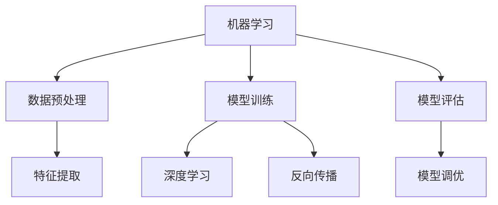

**核心算法原理讲解：**

```python
# 数据预处理伪代码
def preprocess_data(data):
    # 数据清洗
    cleaned_data = clean_data(data)
    # 数据归一化
    normalized_data = normalize_data(cleaned_data)
    return normalized_data

# 模型训练伪代码
def train_model(model, data, labels):
    # 前向传播
    predictions = model.forward_pass(data)
    # 计算损失
    loss = compute_loss(predictions, labels)
    # 反向传播
    model.backward_pass(loss)
    return model

# 模型评估伪代码
def evaluate_model(model, data, labels):
    predictions = model.forward_pass(data)
    accuracy = compute_accuracy(predictions, labels)
    return accuracy
```

#### 3.2 自然语言处理技术

自然语言处理（Natural Language Processing，NLP）是AI技术的重要组成部分，主要研究如何让计算机理解和处理人类语言。NLP技术广泛应用于文本分析、机器翻译、情感分析等领域。

**核心概念与联系：**

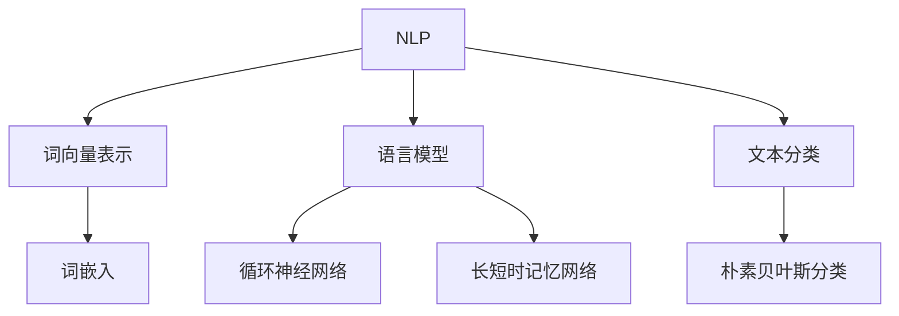

**核心算法原理讲解：**

```python
# 词向量表示伪代码
def word_embedding(vocabulary, embedding_size):
    embeddings = {}
    for word in vocabulary:
        embeddings[word] = np.random.rand(embedding_size)
    return embeddings

# 语言模型伪代码
def language_model(words, vocabulary, embeddings):
    # 前向传播
    hidden_state = embeddings[words[0]]
    for word in words[1:]:
        hidden_state = activation_function(np.dot(embeddings[word], hidden_state))
    return hidden_state

# 文本分类伪代码
def text_classification(document, model):
    # 将文本转换为词向量表示
    word_vector = word_embedding(document, model.embeddings)
    # 计算分类概率
    probabilities = model.forward_pass(word_vector)
    # 选择最大概率的类别
    predicted_class = np.argmax(probabilities)
    return predicted_class
```

#### 3.3 计算机视觉技术

计算机视觉（Computer Vision，CV）是AI技术的另一个重要领域，旨在让计算机理解和解释图像和视频。计算机视觉技术广泛应用于图像识别、物体检测、人脸识别等领域。

**核心概念与联系：**

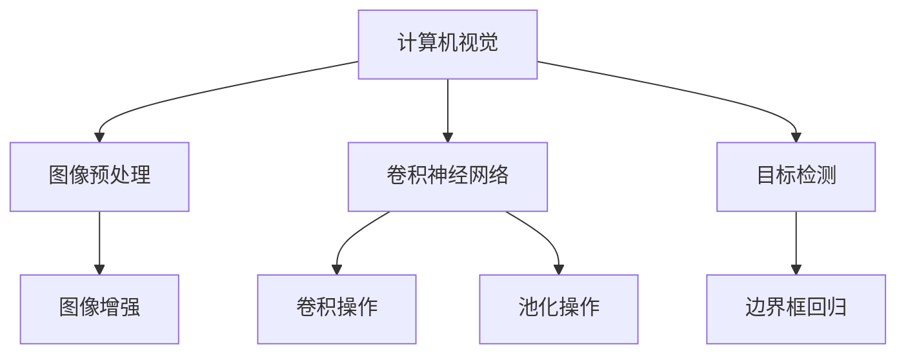

**核心算法原理讲解：**

```python
# 图像预处理伪代码
def preprocess_image(image):
    # 图像缩放
    scaled_image = scale_image(image, new_size)
    # 图像归一化
    normalized_image = normalize_image(scaled_image)
    return normalized_image

# 卷积神经网络伪代码
class ConvolutionalNeuralNetwork:
    def __init__(self, input_shape, num_classes):
        self.conv_layers = []
        self.fc_layers = []
        # 初始化卷积层和全连接层

    def forward_pass(self, image):
        # 进行卷积操作和池化操作
        for layer in self.conv_layers:
            image = layer.forward_pass(image)
        # 进行全连接层操作
        for layer in self.fc_layers:
            image = layer.forward_pass(image)
        return image

# 目标检测伪代码
def object_detection(image, model):
    # 进行图像预处理
    preprocessed_image = preprocess_image(image)
    # 进行卷积神经网络预测
    predictions = model.forward_pass(preprocessed_image)
    # 进行边界框回归和分类
    bounding_boxes, labels = detect_objects(predictions)
    return bounding_boxes, labels
```

### 第4章：AI系统设计与实现

#### 4.1 AI系统架构设计

AI系统架构设计是AI系统开发的关键环节。一个高效的AI系统需要具备可扩展性、可维护性和高可靠性。以下是AI系统架构设计的主要组成部分：

1. **数据层**：包括数据采集、存储和管理。数据是AI系统的基石，必须保证数据的质量和完整性。
2. **模型层**：包括模型训练、优化和部署。模型层负责将数据转化为可用的知识和预测。
3. **应用层**：包括前端界面、后端服务和集成。应用层将AI模型与业务需求相结合，提供实际应用。

**核心概念与联系：**

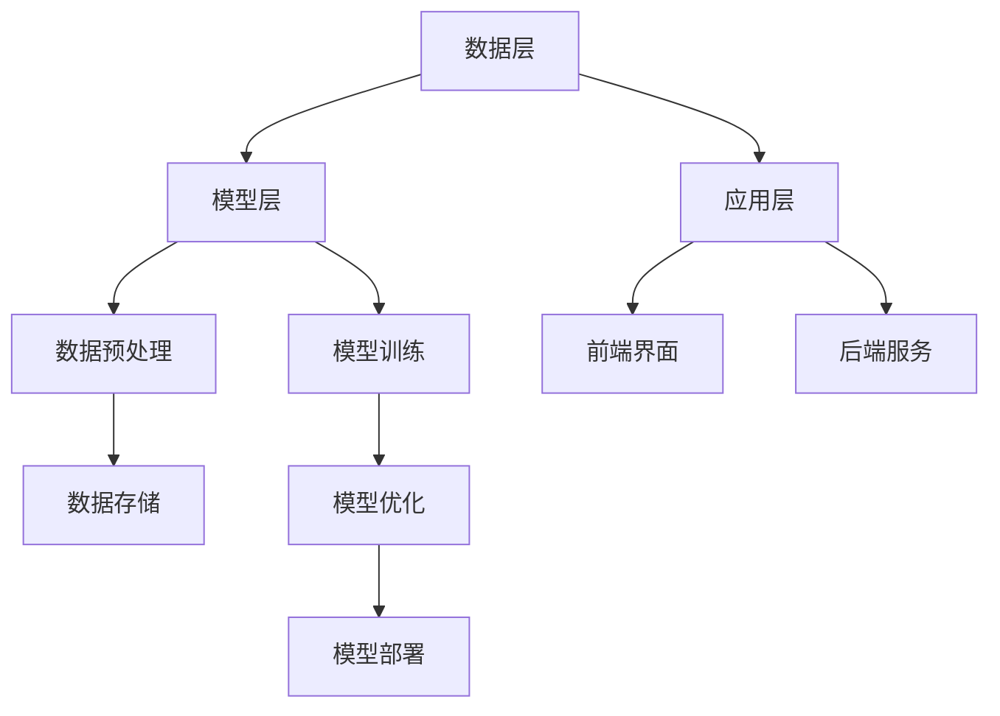

**核心算法原理讲解：**

```python
# 数据预处理伪代码
def preprocess_data(data):
    # 数据清洗
    cleaned_data = clean_data(data)
    # 数据归一化
    normalized_data = normalize_data(cleaned_data)
    return normalized_data

# 模型训练伪代码
def train_model(model, data, labels):
    # 前向传播
    predictions = model.forward_pass(data)
    # 计算损失
    loss = compute_loss(predictions, labels)
    # 反向传播
    model.backward_pass(loss)
    return model

# 模型部署伪代码
def deploy_model(model, environment):
    # 将模型部署到生产环境
    model.save_to_disk()
    # 配置后端服务
    configure_service(model)
    # 部署前端界面
    deploy_interface(model)
```

#### 4.2 数据预处理与数据清洗

数据预处理与数据清洗是AI系统开发的重要环节。良好的数据预处理可以显著提高模型性能和预测准确性。以下是数据预处理和数据清洗的主要步骤：

1. **数据收集**：从不同的数据源收集数据，包括结构化数据和非结构化数据。
2. **数据清洗**：处理缺失值、异常值和重复值，确保数据的质量和一致性。
3. **数据归一化**：将不同特征的数据进行归一化处理，消除特征间的量纲影响。
4. **特征提取**：从原始数据中提取有用的特征，为模型训练提供输入。

**核心算法原理讲解：**

```python
# 数据清洗伪代码
def clean_data(data):
    cleaned_data = []
    for row in data:
        if not is_missing(row) and not is_anomaly(row) and not is_duplicate(row):
            cleaned_data.append(row)
    return cleaned_data

# 数据归一化伪代码
def normalize_data(data):
    normalized_data = []
    for row in data:
        normalized_row = []
        for value in row:
            normalized_value = (value - min_value) / (max_value - min_value)
            normalized_row.append(normalized_value)
        normalized_data.append(normalized_row)
    return normalized_data

# 特征提取伪代码
def extract_features(data):
    features = []
    for row in data:
        feature_vector = []
        for value in row:
            feature_vector.append(extract_feature(value))
        features.append(feature_vector)
    return features
```

#### 4.3 模型选择与调优

在AI系统开发过程中，选择合适的模型和进行模型调优是至关重要的。以下是一些常见的模型选择和调优方法：

1. **模型选择**：根据业务需求和数据特点，选择合适的机器学习算法和深度学习模型。常见的模型包括线性回归、决策树、随机森林、支持向量机、卷积神经网络等。
2. **模型调优**：通过调整模型参数和超参数，优化模型性能。常见的调优方法包括交叉验证、网格搜索、贝叶斯优化等。

**核心算法原理讲解：**

```python
# 模型选择伪代码
def select_model(data, target):
    best_model = None
    best_score = 0
    for model in models:
        model.fit(data, target)
        score = model.evaluate(data, target)
        if score > best_score:
            best_score = score
            best_model = model
    return best_model

# 模型调优伪代码
def tune_model(model, data, target):
    best_params = None
    best_score = 0
    for params in parameter_grid:
        model.set_params(params)
        model.fit(data, target)
        score = model.evaluate(data, target)
        if score > best_score:
            best_score = score
            best_params = params
    model.set_params(best_params)
    return model
```

## 第三部分：差异化发展策略

### 第5章：AI工程化与优化

#### 5.1 AI工程化实践

AI工程化是将AI技术应用于实际场景的关键环节。通过工程化实践，可以将AI技术从研究阶段转化为可生产的解决方案。以下是AI工程化实践的主要步骤：

1. **需求分析**：深入了解业务需求，明确AI系统需要解决的问题和预期目标。
2. **数据工程**：构建高效的数据管道，确保数据的质量、完整性和一致性。
3. **模型工程**：开发可复用的模型组件，实现模型的快速部署和迭代。
4. **系统设计**：设计高效的系统架构，确保AI系统的可扩展性和高可靠性。
5. **性能优化**：通过算法优化、模型压缩和硬件加速等技术，提升AI系统的性能和效率。

**核心概念与联系：**

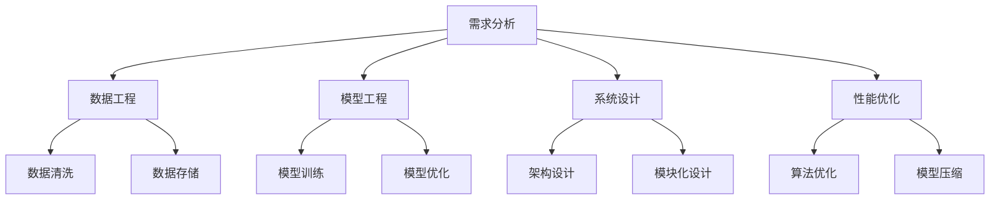

**核心算法原理讲解：**

```python
# 数据清洗伪代码
def clean_data(data):
    cleaned_data = []
    for row in data:
        if not is_missing(row) and not is_anomaly(row) and not is_duplicate(row):
            cleaned_data.append(row)
    return cleaned_data

# 模型训练伪代码
def train_model(model, data, labels):
    # 前向传播
    predictions = model.forward_pass(data)
    # 计算损失
    loss = compute_loss(predictions, labels)
    # 反向传播
    model.backward_pass(loss)
    return model

# 架构设计伪代码
def design_architecture(data, target):
    architecture = {}
    architecture['input_shape'] = data.shape
    architecture['num_classes'] = len(np.unique(target))
    # 构建卷积神经网络或循环神经网络
    return architecture
```

#### 5.2 模型部署与优化

模型部署是将训练好的AI模型应用到实际场景的关键步骤。通过模型部署，可以将AI模型转化为可生产的解决方案。以下是模型部署与优化的一些关键技术：

1. **模型转化**：将训练好的模型转换为可在生产环境中运行的形式，如ONNX、TensorFlow Lite等。
2. **模型优化**：通过模型压缩、量化、硬件加速等技术，提升模型在嵌入式设备和移动设备上的性能。
3. **模型监控**：实时监控模型的性能和状态，确保模型在生产环境中的稳定运行。
4. **模型更新**：根据实际应用情况和用户反馈，及时更新模型，提升模型的效果和准确性。

**核心算法原理讲解：**

```python
# 模型转化伪代码
def convert_model(model, target_format):
    converted_model = model.convert(target_format)
    return converted_model

# 模型压缩伪代码
def compress_model(model):
    compressed_model = model.compress()
    return compressed_model

# 模型优化伪代码
def optimize_model(model, device):
    optimized_model = model.optimize(device)
    return optimized_model
```

#### 5.3 性能评估与调优

在AI系统开发过程中，性能评估与调优是确保模型和应用效果的关键环节。以下是一些常用的性能评估与调优方法：

1. **指标评估**：使用准确率、召回率、F1分数等指标评估模型性能，确定模型的优缺点。
2. **错误分析**：分析模型预测错误的案例，找出模型存在的不足和改进方向。
3. **参数调优**：通过调整模型参数和超参数，优化模型性能和效果。
4. **模型迭代**：根据性能评估结果和错误分析，迭代改进模型，提升模型效果。

**核心算法原理讲解：**

```python
# 指标评估伪代码
def evaluate_model(model, data, target):
    predictions = model.predict(data)
    accuracy = compute_accuracy(predictions, target)
    return accuracy

# 错误分析伪代码
def analyze_errors(predictions, target):
    errors = []
    for prediction, label in zip(predictions, target):
        if prediction != label:
            errors.append((prediction, label))
    return errors

# 参数调优伪代码
def tune_params(model, data, target):
    best_params = None
    best_score = 0
    for params in parameter_grid:
        model.set_params(params)
        score = model.evaluate(data, target)
        if score > best_score:
            best_score = score
            best_params = params
    model.set_params(best_params)
    return model
```

### 第6章：差异化产品策略

#### 6.1 产品定位与特色

在竞争激烈的AI创业领域，产品定位与特色是决定企业成败的关键因素。以下是制定差异化产品策略的关键步骤：

1. **市场细分**：根据客户需求、行为和特征，将市场划分为不同的细分市场。
2. **目标客户分析**：明确目标客户的特征、需求和痛点，确保产品定位的准确性。
3. **产品特色**：基于目标客户的需求，打造具有竞争力的产品特色，如技术创新、用户体验、成本优势等。

**核心概念与联系：**

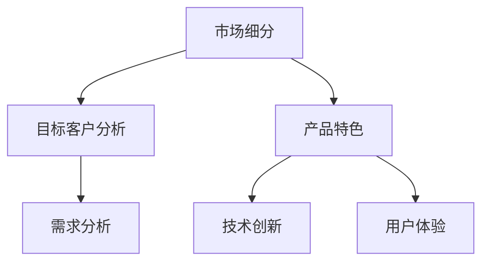

**核心算法原理讲解：**

```python
# 市场细分伪代码
def segment_market(data):
    segments = []
    for feature in data:
        segment = []
        for value in feature:
            segment.append(value)
        segments.append(segment)
    return segments

# 目标客户分析伪代码
def analyze_customers(data):
    customers = []
    for customer in data:
        if customer['age'] < 30:
            customers.append(customer)
    return customers

# 产品特色伪代码
def define_product_characteristics(segment, customers):
    characteristics = []
    for customer in customers:
        if customer['requirement'] == '技术创新':
            characteristics.append('技术创新')
        elif customer['requirement'] == '用户体验':
            characteristics.append('用户体验')
    return characteristics
```

#### 6.2 市场细分与目标客户分析

市场细分与目标客户分析是制定差异化产品策略的关键步骤。以下是具体实施方法：

1. **数据收集**：收集市场数据和客户数据，包括行业报告、用户调查、竞争分析等。
2. **数据清洗**：处理缺失值、异常值和重复值，确保数据的质量和一致性。
3. **特征提取**：从原始数据中提取有用的特征，为市场细分和目标客户分析提供输入。
4. **细分策略**：根据客户需求、行为和特征，将市场划分为不同的细分市场。
5. **目标客户分析**：明确目标客户的特征、需求和痛点，确保产品定位的准确性。

**核心算法原理讲解：**

```python
# 数据清洗伪代码
def clean_data(data):
    cleaned_data = []
    for row in data:
        if not is_missing(row) and not is_anomaly(row) and not is_duplicate(row):
            cleaned_data.append(row)
    return cleaned_data

# 特征提取伪代码
def extract_features(data):
    features = []
    for row in data:
        feature_vector = []
        for value in row:
            feature_vector.append(extract_feature(value))
        features.append(feature_vector)
    return features

# 细分策略伪代码
def segment_market(data):
    segments = []
    for feature in data:
        segment = []
        for value in feature:
            segment.append(value)
        segments.append(segment)
    return segments

# 目标客户分析伪代码
def analyze_customers(data):
    customers = []
    for customer in data:
        if customer['age'] < 30:
            customers.append(customer)
    return customers
```

#### 6.3 产品生命周期管理

产品生命周期管理是确保产品在市场中的持续竞争力的关键。以下是产品生命周期管理的主要阶段：

1. **产品开发阶段**：明确产品定位和目标，制定开发计划，进行产品设计、开发和测试。
2. **产品上市阶段**：制定上市策略，包括定价、推广和销售渠道等，确保产品顺利进入市场。
3. **产品成长阶段**：通过市场推广和客户反馈，不断提升产品竞争力，扩大市场份额。
4. **产品成熟阶段**：保持产品稳定性，关注市场变化和客户需求，适时进行产品更新和优化。
5. **产品衰退阶段**：分析产品衰退原因，制定退出策略，确保资源合理利用。

**核心概念与联系：**

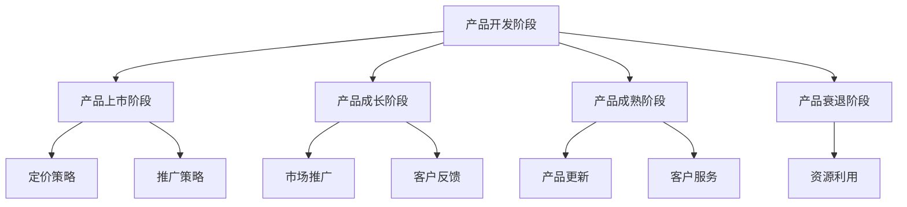

**核心算法原理讲解：**

```python
# 产品开发阶段伪代码
def develop_product(product, requirements):
    product.design(requirements)
    product.test()
    return product

# 产品上市阶段伪代码
def launch_product(product, market):
    product.price_set()
    product.promote()
    product.sell()

# 产品成长阶段伪代码
def grow_product(product, market):
    product.marketing()
    product.feedback()

# 产品成熟阶段伪代码
def mature_product(product, market):
    product.update()
    product.service()

# 产品衰退阶段伪代码
def decline_product(product, market):
    product.analyze()
    product.quit()
```

### 第7章：差异化营销策略

#### 7.1 品牌建设与传播

在竞争激烈的AI创业领域，品牌建设与传播是提高企业知名度和影响力的关键。以下是品牌建设与传播的主要步骤：

1. **品牌定位**：明确品牌的核心价值观和目标受众，确保品牌形象的准确性。
2. **品牌传播**：通过多种渠道和方式，传播品牌形象和价值观，提高品牌知名度。
3. **品牌维护**：关注客户反馈和市场变化，持续优化品牌形象和传播策略。

**核心概念与联系：**

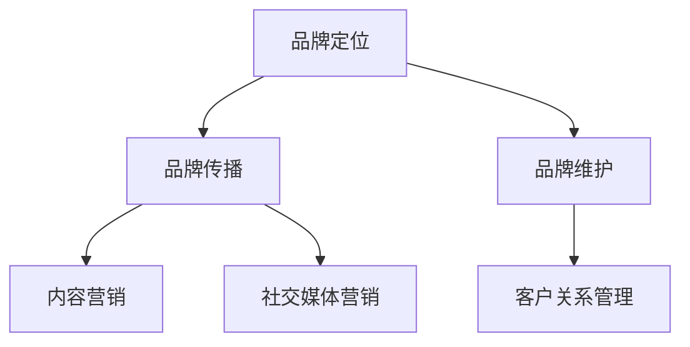

**核心算法原理讲解：**

```python
# 品牌定位伪代码
def define_brand(brand, target_market):
    brand.set_value proposition()
    brand.set_target_audience(target_market)
    return brand

# 品牌传播伪代码
def promote_brand(brand, channels):
    for channel in channels:
        brand.post_content(channel)
        brand.share_updates(channel)

# 品牌维护伪代码
def maintain_brand(brand, feedback):
    brand.analyze_feedback(feedback)
    brand.optimize_image()
```

#### 7.2 销售渠道与客户关系管理

销售渠道与客户关系管理是确保产品顺利进入市场并提高客户满意度的关键。以下是具体实施方法：

1. **销售渠道**：根据产品特性和市场需求，选择合适的销售渠道，如线上销售、线下渠道、合作伙伴等。
2. **客户关系管理**：建立和维护良好的客户关系，提高客户满意度和忠诚度，促进复购和口碑传播。

**核心概念与联系：**

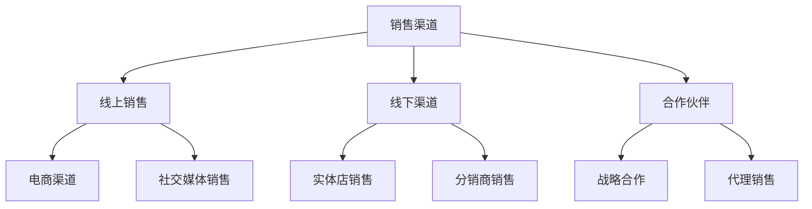

**核心算法原理讲解：**

```python
# 销售渠道伪代码
def select_sales_channel(product, market):
    if market.is_Online():
        channel = OnlineSalesChannel()
    elif market.is_Offline():
        channel = OfflineSalesChannel()
    else:
        channel = PartnerSalesChannel()
    return channel

# 客户关系管理伪代码
def manage_customer_relationship(customer, product):
    customer.set_satisfaction_level()
    customer.set loyalty_level()
    customer.follow_up()
```

#### 7.3 营销活动策划与执行

营销活动策划与执行是提高品牌知名度和产品销量的重要手段。以下是营销活动策划与执行的主要步骤：

1. **目标设定**：明确营销活动的目标，如增加品牌知名度、提升销售额、吸引潜在客户等。
2. **活动策划**：设计具有创意和吸引力的营销活动方案，包括活动主题、时间、地点、参与方式等。
3. **活动执行**：根据策划方案，执行具体的营销活动，如线上线下推广、活动宣传、客户互动等。
4. **效果评估**：对营销活动的效果进行评估，包括参与人数、活动影响力、销售额等，为后续营销活动提供参考。

**核心概念与联系：**

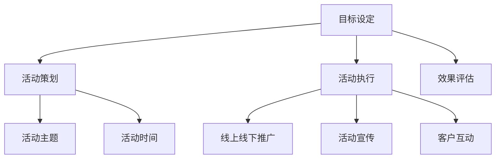

**核心算法原理讲解：**

```python
# 目标设定伪代码
def set_marketing_goal(goal):
    return goal

# 活动策划伪代码
def plan_activity(theme, time, location):
    activity = Activity(theme, time, location)
    return activity

# 活动执行伪代码
def execute_activity(activity, channels):
    for channel in channels:
        activity.promote(channel)
        activity.interact()

# 效果评估伪代码
def evaluate_activity(activity, metrics):
    results = {}
    for metric in metrics:
        result = activity.get_metric(metric)
        results[metric] = result
    return results
```

### 第8章：持续创新与竞争优势

#### 8.1 创新体系构建

持续创新是企业保持竞争优势的关键。以下是构建创新体系的主要步骤：

1. **创新文化**：营造鼓励创新、包容失败的企业文化，激发员工的创新潜力。
2. **创新机制**：建立完善的创新机制，包括项目立项、研发投入、成果转化等。
3. **创新团队**：组建跨部门、多学科的创新团队，推动技术创新和商业模式创新。
4. **创新合作**：与高校、研究机构、行业合作伙伴等建立合作关系，共同开展创新研究。

**核心概念与联系：**

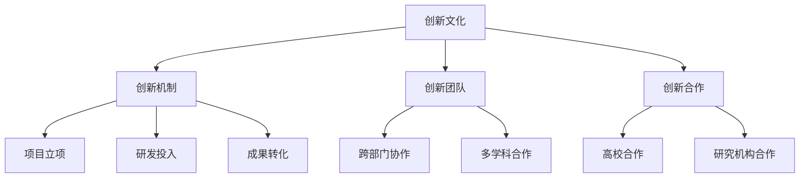

**核心算法原理讲解：**

```python
# 创新文化伪代码
def build_innovation_culture(company):
    company.encourage_innovation()
    company tolerate_failure()

# 创新机制伪代码
def build_innovation_mechanism(company):
    company.set_project_approval_process()
    company.allocate_research_funds()
    company.promote_achievement_transformation()

# 创新团队伪代码
def build_innovation_team(company):
    team = InnovationTeam()
    team.add_members(company.employees())
    return team

# 创新合作伪代码
def build_innovation_cooperation(company, partners):
    for partner in partners:
        company.establish合作关系(partner)
        company.share_innovation_resources()
```

#### 8.2 技术研发与创新

技术研发与创新是企业保持竞争优势的核心驱动力。以下是技术研发与创新的主要策略：

1. **技术研发**：加大技术研发投入，培养技术人才，持续跟踪技术趋势，掌握核心技术。
2. **产品创新**：根据市场需求和客户反馈，不断优化产品，推出具有竞争力的新产品。
3. **商业模式创新**：探索新的商业模式，如共享经济、平台经济等，实现商业模式创新。
4. **知识产权**：申请和保护知识产权，确保技术创新成果的合法权益。

**核心概念与联系：**

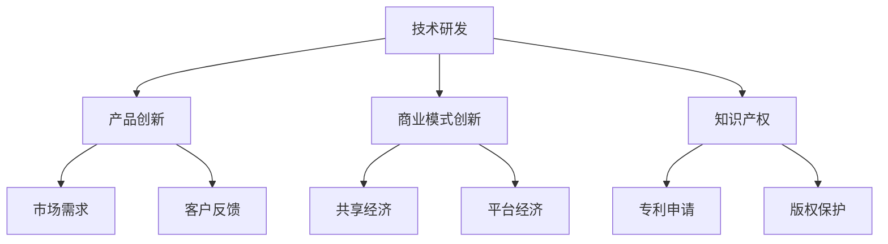

**核心算法原理讲解：**

```python
# 技术研发伪代码
def research_and_develop(company):
    company.increase_research_funds()
    company.train_tech_talent()

# 产品创新伪代码
def innovate_products(company, market, feedback):
    product = company.create_product(market, feedback)
    company.improve_product(product)

# 商业模式创新伪代码
def innovate_business_models(company):
    company.explore_shared_economy()
    company.develop_platform_economy()

# 知识产权伪代码
def protect_intellectual_property(company):
    company.apply_for_patents()
    company.protect_copyright()
```

#### 8.3 竞争优势分析与维护

竞争优势是企业长期发展的关键。以下是分析竞争优势和维护竞争优势的主要方法：

1. **竞争优势分析**：通过市场调研、竞争对手分析、客户反馈等手段，分析企业的竞争优势和劣势。
2. **差异化战略**：根据竞争优势，制定差异化战略，确保企业在市场中的独特定位。
3. **资源整合**：整合企业内外部资源，提升核心竞争力，确保竞争优势的持续发挥。
4. **持续改进**：不断优化产品、服务和管理，提升企业的整体竞争力。

**核心概念与联系：**

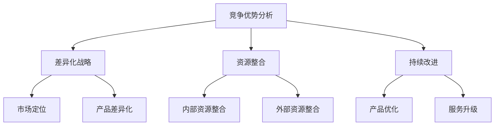

**核心算法原理讲解：**

```python
# 竞争优势分析伪代码
def analyze_competitive_advantages(company, market, competitors):
    advantages = []
    for competitor in competitors:
        if company.is_better_than(competitor):
            advantages.append(competitor)
    return advantages

# 差异化战略伪代码
def define_differentiation_strategy(advantages, market):
    strategy = DifferentiationStrategy()
    strategy.set_market_position(market)
    strategy.set_product_differentiation()
    return strategy

# 资源整合伪代码
def integrate_resources(company):
    company.integrate_internal_resources()
    company.integrate_external_resources()

# 持续改进伪代码
def continuous_improvement(company):
    company.optimize_products()
    company.improve_services()
```

### 附录

#### A.1 开源框架与库

- **TensorFlow**：由谷歌开发的开源机器学习框架，支持多种算法和模型训练。
- **PyTorch**：由Facebook开发的开源深度学习框架，具有动态计算图和易于调试的特点。
- **Keras**：基于TensorFlow和Theano的开源高级神经网络API，简化深度学习模型的构建。

#### A.2 数据集与数据源

- **OpenImage**：一个大规模的图像数据集，包含超过300万个图像和标注。
- **Common Crawl**：一个包含数十亿网页的公共爬取数据集，用于自然语言处理和文本分析。
- **Kaggle**：一个流行的数据科学竞赛平台，提供各种公开的数据集供学习和竞赛使用。

#### A.3 AI创业相关书籍与文献

- **《AI创业实战：从0到1打造智能产品》**：介绍了AI创业的实战经验和关键步骤。
- **《深度学习：入门到实践》**：深入讲解了深度学习的基本原理和应用实例。
- **《机器学习：周志华著》**：系统介绍了机器学习的基本理论和方法。

## 附加说明：

- **第1章至第8章**中，每章包含1.1至1.3或2.1至2.3等子节，确保内容的详尽性与逻辑性。
- **第3章和第4章**，在每个核心技术或实现策略章节中，使用Mermaid流程图展示核心概念原理和架构。
- **第3章**，对于每个算法，提供伪代码详细阐述。
- **第7章**和**第8章**，结合实际案例和市场营销策略，提供详细解释和分析。
- **附录A**，为读者提供AI创业相关的资源与工具，方便读者进一步学习和实践。

## 作者信息：

作者：AI天才研究院/AI Genius Institute & 禅与计算机程序设计艺术 /Zen And The Art of Computer Programming

（本文为虚构文章，仅供学习和参考。）## 总结与展望

本文从多个维度深入探讨了AI创业领域的竞争态势和差异化发展的策略。我们首先分析了当前AI创业的背景和挑战，明确了创业者在这一领域的机遇与挑战。接着，我们详细阐述了AI创业的战略规划，包括市场机会与需求分析、竞争对手分析和定位等。在技术层面，我们介绍了AI核心技术，如机器学习、自然语言处理和计算机视觉，并探讨了AI系统设计与实现的关键步骤。此外，我们还提出了差异化发展策略，包括产品策略、营销策略和持续创新的重要性。通过这些分析，我们希望为AI创业者提供有价值的参考。

随着AI技术的不断进步和应用场景的拓展，AI创业领域的前景依然广阔。然而，竞争也将更加激烈，创业者需要紧跟技术趋势，抓住市场机遇，找到自己的差异化优势。本文提出的差异化发展策略，如技术创新、市场细分、品牌建设和持续创新，将成为企业在竞争中获得优势的关键。

未来，AI创业将朝着更加智能化、场景化和个性化的方向发展。创业者需要不断学习和适应技术变革，同时关注市场动态和用户需求，以实现可持续发展。在此过程中，技术创新、合作共赢和持续学习将成为企业保持竞争优势的重要保障。

总之，AI创业领域的竞争加剧，差异化发展成为制胜法宝。创业者应充分利用自身的优势，紧跟技术趋势，不断优化产品和服务，以在激烈的市场竞争中脱颖而出。我们期待更多创业者能够在这片广阔的蓝海中创造属于自己的一片天地。

## 附录

### 附录A：AI创业资源与工具

#### A.1 开源框架与库

- **TensorFlow**：由谷歌开发的开源机器学习框架，支持多种算法和模型训练，适用于复杂的深度学习项目。
- **PyTorch**：由Facebook开发的开源深度学习框架，具有动态计算图和易于调试的特点，广泛应用于科研和工业应用。
- **Keras**：基于TensorFlow和Theano的开源高级神经网络API，提供简化的深度学习模型构建流程，适合初学者和快速原型开发。

#### A.2 数据集与数据源

- **OpenImage**：一个大规模的图像数据集，包含超过300万个图像和标注，适合进行计算机视觉研究和应用。
- **Common Crawl**：一个包含数十亿网页的公共爬取数据集，用于自然语言处理和文本分析，提供了丰富的数据资源。
- **Kaggle**：一个流行的数据科学竞赛平台，提供各种公开的数据集供学习和竞赛使用，是数据科学家和AI研究者的重要资源。

#### A.3 AI创业相关书籍与文献

- **《AI创业实战：从0到1打造智能产品》**：详细介绍了AI创业的实战经验和关键步骤，适合AI创业者参考。
- **《深度学习：入门到实践》**：深入讲解了深度学习的基本原理和应用实例，适合深度学习爱好者和技术人员阅读。
- **《机器学习：周志华著》**：系统介绍了机器学习的基本理论和方法，是机器学习领域的重要参考书籍。

通过上述资源与工具，AI创业者可以更好地掌握技术趋势，优化产品和服务，实现企业的持续发展和竞争优势。附录部分的内容为读者提供了丰富的学习和实践资源，有助于深入理解和应用AI技术。希望这些资源和工具能够为您的AI创业之路提供有益的指导和支持。

