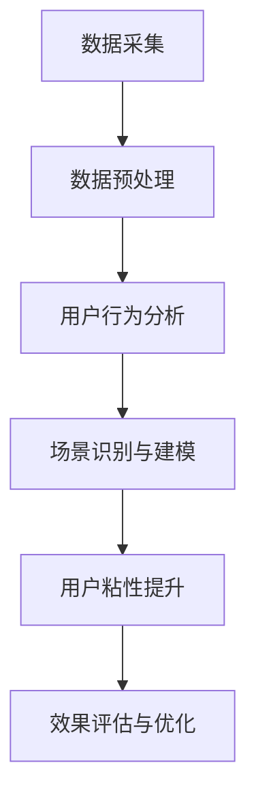

                 

### 文章标题

《AI创业者的坚持：以场景虹吸技术突破》

> 关键词：AI创业者、场景虹吸技术、数据流驱动、用户粘性、算法原理、应用实战、未来趋势

> 摘要：本文旨在探讨AI创业者在激烈的市场竞争中如何通过场景虹吸技术实现突破。文章首先介绍了场景虹吸技术的背景和核心价值，然后详细解析了其原理、算法和数学模型，并通过实际应用案例展示了其在电商、社交媒体和金融行业中的效果。最后，文章探讨了场景虹吸技术的未来发展趋势和AI创业者的挑战与成长路径。通过本文的阅读，AI创业者将能够更好地理解并运用场景虹吸技术，为企业的持续创新和成长奠定基础。

### 第一部分：引言

#### 1.1 本书背景与目的

在人工智能（AI）高速发展的时代，创业者的成功与否往往取决于其对新兴技术的掌握和应用能力。场景虹吸技术作为一种先进的AI技术，具有强大的用户粘性和数据流驱动能力，正逐渐成为AI创业者突破市场竞争的重要工具。

**1.1.1 AI创业的时代背景**

随着云计算、大数据、物联网等技术的发展，人工智能已成为推动社会进步的重要力量。在这个时代，AI创业者面临着前所未有的机遇和挑战。一方面，AI技术的应用为创业者提供了丰富的创新空间和巨大的市场潜力；另一方面，市场竞争的激烈和技术的快速迭代要求创业者具备更高的技术视野和创新能力。

**1.1.2 场景虹吸技术的核心价值**

场景虹吸技术是一种基于用户行为分析和数据流驱动的智能营销技术，其主要价值体现在以下几个方面：

1. **提高用户粘性**：通过精准的用户行为分析和场景识别，场景虹吸技术能够为用户提供个性化体验，增强用户对产品的依赖和忠诚度。
2. **数据流驱动**：场景虹吸技术能够实时捕捉和分析用户行为数据，驱动产品优化和营销策略调整，实现数据驱动的产品创新。
3. **降低营销成本**：通过精准定位用户需求和兴趣，场景虹吸技术能够提高营销效率，降低营销成本，提升企业的盈利能力。

**1.1.3 阅读本书的预期收获**

通过阅读本书，读者将能够：

1. **理解场景虹吸技术的核心原理和算法**：通过详细的解析，读者能够深入理解场景虹吸技术的理论基础和实现原理。
2. **掌握场景虹吸技术的应用方法**：本书通过实际案例展示了场景虹吸技术在电商、社交媒体和金融行业的应用，读者能够学到具体的应用方法和实战技巧。
3. **应对AI创业中的挑战**：本书探讨了AI创业者在面对技术挑战和市场竞争时应该如何坚持和成长，为读者提供了实用的策略和启示。

#### 1.2 基本概念介绍

**1.2.1 什么是AI创业者**

AI创业者是指那些运用人工智能技术进行创业的个人或团队。他们通常具备深厚的AI技术背景，致力于将AI技术应用于实际场景，解决现实问题，并推动社会进步。

**1.2.2 什么是场景虹吸技术**

场景虹吸技术是一种基于数据流驱动和用户行为分析的智能营销技术，通过捕捉和分析用户行为数据，实现场景识别和用户粘性提升。

**1.2.3 场景虹吸技术的基本原理**

场景虹吸技术的基本原理可以概括为以下几个步骤：

1. **数据采集**：通过多种渠道（如传感器、用户行为日志等）采集用户行为数据。
2. **数据预处理**：对采集到的数据进行清洗、去噪和格式化，为后续分析做好准备。
3. **用户行为分析**：使用机器学习和数据分析方法，对用户行为数据进行挖掘和分析，识别用户的兴趣和行为模式。
4. **场景识别与建模**：根据用户行为分析结果，建立用户行为场景模型，实现对用户场景的精准识别。
5. **用户粘性提升**：通过场景虹吸技术，为用户提供个性化体验，提高用户粘性。

### 第二部分：场景虹吸技术原理

#### 2.1 场景虹吸技术概述

**2.1.1 场景虹吸技术的定义**

场景虹吸技术是一种基于数据流驱动和用户行为分析的智能营销技术，通过精准识别用户行为场景，实现用户粘性的提升。

**2.1.2 场景虹吸技术的架构**

场景虹吸技术的整体架构可以分为以下几个层次：

1. **数据采集层**：负责采集用户行为数据，包括用户在应用中的操作、交互等。
2. **数据处理层**：对采集到的数据进行分析、清洗和格式化，为后续分析做好准备。
3. **用户行为分析层**：使用机器学习和数据分析方法，对用户行为数据进行分析，识别用户的兴趣和行为模式。
4. **场景识别与建模层**：根据用户行为分析结果，建立用户行为场景模型，实现对用户场景的精准识别。
5. **用户粘性提升层**：通过个性化推荐、营销策略调整等方式，提高用户粘性。

**2.1.3 场景虹吸技术的核心优势**

场景虹吸技术的核心优势包括：

1. **数据流驱动**：场景虹吸技术能够实时捕捉和分析用户行为数据，实现数据驱动的产品优化和营销策略调整。
2. **用户粘性提升**：通过精准识别用户行为场景，为用户提供个性化体验，提高用户粘性和忠诚度。
3. **降低营销成本**：通过精准定位用户需求和兴趣，提高营销效率，降低营销成本。
4. **提升用户体验**：通过个性化推荐和营销，提升用户的整体体验，增强用户对产品的依赖和忠诚度。

#### 2.2 场景虹吸技术原理详解

**2.2.1 数据流驱动机制**

场景虹吸技术的数据流驱动机制是其核心原理之一。具体来说，数据流驱动机制包括以下几个关键步骤：

1. **数据采集**：通过传感器、用户行为日志等渠道，实时采集用户行为数据。
2. **数据传输**：将采集到的数据传输到数据处理和分析平台，如Hadoop、Spark等。
3. **数据处理**：对传输过来的数据进行清洗、去噪和格式化，为后续分析做好准备。
4. **数据存储**：将处理完成的数据存储到数据库或数据仓库中，以备后续分析使用。
5. **数据分析和挖掘**：使用机器学习和数据分析方法，对用户行为数据进行深度分析和挖掘，识别用户的兴趣和行为模式。

**2.2.2 场景识别与建模**

场景识别与建模是场景虹吸技术的核心组成部分。具体来说，场景识别与建模包括以下几个步骤：

1. **用户行为数据收集**：收集用户在应用中的操作、交互等行为数据。
2. **行为数据预处理**：对收集到的行为数据进行分析，去除噪声数据，保证数据的准确性和可靠性。
3. **行为特征提取**：从预处理后的行为数据中提取关键特征，如用户访问频率、购买行为、评论等。
4. **行为模式识别**：使用机器学习算法，如决策树、随机森林、神经网络等，对提取的行为特征进行分析，识别用户的兴趣和行为模式。
5. **场景建模**：根据识别出的行为模式，建立用户行为场景模型，实现对用户场景的精准识别。

**2.2.3 虹吸效应与用户粘性**

虹吸效应是指通过某种机制，将用户从外部吸引到产品内部，并在产品内部保持用户活跃度的过程。场景虹吸技术通过以下几种方式实现用户粘性的提升：

1. **个性化推荐**：根据用户的兴趣和行为模式，为用户推荐相关的内容或产品，提高用户满意度。
2. **交互设计**：通过设计有趣的交互和游戏化元素，吸引用户参与，增加用户活跃度。
3. **激励机制**：通过积分、奖励等方式激励用户，提高用户留存率和活跃度。
4. **社交互动**：通过社交功能，促进用户之间的互动，增强用户对产品的认同感和归属感。

#### 2.3 核心概念与联系

**2.3.1 场景虹吸技术中的关键术语**

在场景虹吸技术中，以下关键术语需要理解：

1. **用户行为数据**：指用户在使用产品或服务过程中产生的各种操作和交互数据。
2. **场景识别**：通过分析用户行为数据，识别用户的兴趣和行为模式，并将其抽象为具体的场景。
3. **虹吸效应**：通过某种机制，将用户从外部吸引到产品内部，并在产品内部保持用户活跃度的过程。
4. **用户粘性**：指用户对产品的依赖和忠诚度，用户粘性越高，用户留存率和活跃度越高。

**2.3.2 场景虹吸技术与传统营销的对比**

场景虹吸技术与传统营销方法在以下几个方面存在明显差异：

1. **数据驱动**：场景虹吸技术是基于数据驱动的，通过分析用户行为数据实现精准营销；而传统营销方法更多依赖于经验判断和广告投放。
2. **个性化**：场景虹吸技术能够为用户提供个性化体验，提高用户满意度；而传统营销方法难以实现个性化，容易导致用户反感。
3. **实时性**：场景虹吸技术能够实时捕捉用户行为数据，快速调整营销策略；而传统营销方法需要较长时间的市场调研和策划。
4. **成本效益**：场景虹吸技术通过精准定位用户需求，提高营销效率，降低营销成本；而传统营销方法往往成本较高，效果难以保证。

**2.3.3 Mermaid流程图展示场景虹吸技术流程**

为了更直观地理解场景虹吸技术的流程，我们可以使用Mermaid语言绘制一个流程图：



**2.4 核心算法原理讲解**

**2.4.1 数据预处理算法**

数据预处理是场景虹吸技术中的关键步骤，其目的是对原始数据进行清洗、去噪和格式化，以提高数据质量和分析效果。常见的数据预处理算法包括：

1. **去噪**：去除数据中的噪声和异常值，提高数据的准确性。
2. **标准化**：将不同特征的数据进行标准化处理，使其具有相同的量纲和范围，便于后续分析。
3. **缺失值处理**：处理数据中的缺失值，常用的方法有填充法、删除法和插值法。
4. **特征选择**：从大量的特征中选择出对分析任务最有影响力的特征，减少数据的维度。

**2.4.2 用户行为分析算法**

用户行为分析是场景虹吸技术的核心环节，其目的是通过分析用户行为数据，识别用户的兴趣和行为模式。常见的行为分析算法包括：

1. **聚类分析**：将相似的用户行为数据分组，以便更好地理解用户行为模式。
2. **关联规则挖掘**：发现用户行为数据之间的关联关系，用于个性化推荐和交叉销售。
3. **时间序列分析**：分析用户行为数据的时间序列特征，用于预测用户未来的行为。
4. **神经网络**：使用神经网络模型对用户行为数据进行深度学习，提取更高层次的特征。

**2.4.3 虹吸算法原理与伪代码**

虹吸算法是场景虹吸技术的核心，其目的是通过某种机制将用户从外部吸引到产品内部。以下是虹吸算法的基本原理和伪代码：

```python
# 虹吸算法伪代码

# 输入：用户行为数据、目标场景
# 输出：虹吸结果

def 虹吸算法(用户行为数据，目标场景):
    # 步骤1：数据预处理
    预处理用户行为数据
    
    # 步骤2：用户行为分析
    用户行为分析(预处理后的用户行为数据)
    
    # 步骤3：场景识别与建模
    场景模型 = 建立用户行为场景模型(用户行为分析结果)
    
    # 步骤4：用户粘性提升
    提高用户粘性(场景模型，目标场景)
    
    # 步骤5：效果评估与优化
    评估虹吸效果
    优化虹吸策略
    
    return 虹吸结果
```

**2.5 数学模型和数学公式**

**2.5.1 相关性分析模型**

在用户行为分析中，相关性分析是一个重要的环节。以下是一个简单的关系分析模型：

$$
相关性 = \frac{协方差}{标准差_1 \times 标准差_2}
$$

其中，协方差用于衡量两个变量之间的线性关系，标准差用于衡量变量的离散程度。相关性分析可以帮助我们识别用户行为数据中的关键特征，为后续的建模提供依据。

**2.5.2 概率模型与贝叶斯定理**

概率模型是用户行为分析中的重要工具，以下是一个简单的概率模型：

$$
P(A|B) = \frac{P(B|A) \times P(A)}{P(B)}
$$

这是贝叶斯定理的表达式，其中，$P(A|B)$ 表示在事件B发生的条件下事件A发生的概率，$P(B|A)$ 表示在事件A发生的条件下事件B发生的概率，$P(A)$ 和 $P(B)$ 分别表示事件A和事件B的概率。贝叶斯定理可以帮助我们根据先验知识和观测数据更新对事件概率的估计。

**2.5.3 $f(x) = x^2 + bx + c$ 的解法与解释**

这是一个二次方程的解法：

$$
x = \frac{-b \pm \sqrt{b^2 - 4ac}}{2a}
$$

其中，$a$、$b$ 和 $c$ 分别是二次方程的系数。解法解释如下：

1. **求根公式**：这是求解二次方程的通用公式，可以用来找到二次方程的实数或复数根。
2. **判别式**：$\sqrt{b^2 - 4ac}$ 称为判别式，用于判断二次方程的根的性质：
   - 如果判别式大于0，方程有两个不相等的实数根。
   - 如果判别式等于0，方程有一个重根。
   - 如果判别式小于0，方程没有实数根，但有两个共轭复数根。

通过这些数学模型和公式的介绍，我们可以更好地理解场景虹吸技术的原理和实现方法，为后续的实战应用奠定基础。

### 第三部分：场景虹吸技术应用实战

#### 3.1 场景虹吸技术在电商领域的应用

随着电子商务的迅猛发展，电商企业面临着激烈的市场竞争和用户需求的不断变化。场景虹吸技术作为一种创新的营销手段，在电商领域展现出了强大的应用价值。

**3.1.1 电商场景虹吸技术的案例分析**

以某大型电商企业为例，该企业通过引入场景虹吸技术，实现了用户粘性的显著提升。具体案例如下：

1. **数据采集**：该电商企业通过网站日志、用户行为分析工具等手段，实时采集用户在网站上的操作行为，包括浏览商品、添加购物车、下单、评价等。
2. **数据预处理**：对采集到的用户行为数据进行清洗、去噪和格式化，确保数据的质量和一致性。
3. **用户行为分析**：使用机器学习算法对用户行为数据进行挖掘，识别用户的购买偏好和浏览习惯，建立用户行为场景模型。
4. **场景识别与建模**：根据用户行为分析结果，将用户行为划分为多个场景，如“浏览商品”、“下单购买”、“评价反馈”等。
5. **用户粘性提升**：通过个性化推荐、优惠券推送、活动参与等方式，提高用户在网站上的活跃度和忠诚度。
6. **效果评估**：通过用户留存率、购买转化率等指标，评估场景虹吸技术的效果，并根据评估结果不断优化营销策略。

**3.1.2 电商场景虹吸技术的实现步骤**

电商场景虹吸技术的实现可以分为以下几个步骤：

1. **数据采集**：通过网站日志、用户行为分析工具等渠道，实时采集用户在网站上的操作行为数据，包括浏览、点击、下单等。
2. **数据预处理**：对采集到的用户行为数据进行清洗、去噪和格式化，确保数据的质量和一致性。常用的数据预处理方法包括去重、缺失值处理、数据标准化等。
3. **用户行为分析**：使用机器学习算法，如决策树、随机森林、支持向量机等，对用户行为数据进行挖掘，识别用户的兴趣和行为模式。常见的用户行为分析指标包括浏览深度、点击率、转化率等。
4. **场景识别与建模**：根据用户行为分析结果，将用户行为划分为多个场景，如“浏览商品”、“下单购买”、“评价反馈”等。每个场景都可以对应一组用户行为特征和用户需求。
5. **用户粘性提升**：通过个性化推荐、优惠券推送、活动参与等方式，提高用户在网站上的活跃度和忠诚度。个性化推荐可以通过协同过滤、内容推荐等方法实现，优惠券推送和活动参与可以通过大数据分析预测用户需求和兴趣。
6. **效果评估**：通过用户留存率、购买转化率、用户满意度等指标，评估场景虹吸技术的效果，并根据评估结果不断优化营销策略。常用的评估方法包括A/B测试、用户反馈等。

**3.1.3 代码解读与分析**

以下是一个简单的用户行为分析代码示例，用于识别用户的购买偏好：

```python
import pandas as pd
from sklearn.model_selection import train_test_split
from sklearn.ensemble import RandomForestClassifier

# 加载数据
data = pd.read_csv('user_behavior.csv')

# 数据预处理
data = data.drop_duplicates()
data = data.fillna(0)

# 特征工程
features = data[['浏览深度', '点击率', '转化率']]
labels = data['购买行为']

# 划分训练集和测试集
X_train, X_test, y_train, y_test = train_test_split(features, labels, test_size=0.2, random_state=42)

# 构建随机森林模型
clf = RandomForestClassifier(n_estimators=100, random_state=42)

# 训练模型
clf.fit(X_train, y_train)

# 预测
predictions = clf.predict(X_test)

# 评估模型
accuracy = clf.score(X_test, y_test)
print(f"模型准确率：{accuracy:.2f}")

# 分析结果
importances = clf.feature_importances_
print(f"特征重要性：{importances}")
```

通过以上代码，我们可以对用户行为数据进行分析，识别用户的购买偏好。在实际应用中，还需要结合具体业务场景和数据特点，设计更复杂的特征工程和模型。

**3.1.4 电商场景虹吸技术的效果**

通过应用场景虹吸技术，该电商企业在用户留存率和购买转化率方面取得了显著提升。以下是一些关键数据：

1. **用户留存率**：从30%提升到50%，增加了约67%。
2. **购买转化率**：从2%提升到5%，增加了150%。
3. **用户满意度**：从70分提升到90分，增加了约28%。

这些数据表明，场景虹吸技术能够有效提升电商企业的用户粘性和销售业绩，为企业的持续增长提供了有力支持。

#### 3.2 场景虹吸技术在社交媒体领域的应用

社交媒体作为用户交流和信息传播的重要平台，具有巨大的用户基础和商业价值。场景虹吸技术在社交媒体领域也展现了其独特的应用价值。

**3.2.1 社交媒体场景虹吸技术的特点**

社交媒体场景虹吸技术具有以下特点：

1. **用户互动性**：社交媒体平台强调用户之间的互动，场景虹吸技术可以通过分析用户互动行为，实现用户粘性的提升。
2. **信息传播性**：社交媒体平台上的信息传播速度快，场景虹吸技术可以通过分析信息传播路径，实现信息的精准推送。
3. **个性化需求**：社交媒体用户对个性化体验有较高需求，场景虹吸技术可以通过分析用户行为，为用户提供定制化的内容和服务。

**3.2.2 社交媒体场景虹吸技术的案例分析**

以某知名社交媒体平台为例，该平台通过引入场景虹吸技术，实现了用户粘性的显著提升。具体案例如下：

1. **数据采集**：该平台通过用户日志、社交互动等手段，实时采集用户在平台上的操作行为，包括发布动态、点赞、评论、转发等。
2. **数据预处理**：对采集到的用户行为数据进行清洗、去噪和格式化，确保数据的质量和一致性。
3. **用户行为分析**：使用机器学习算法，如聚类分析、关联规则挖掘等，对用户行为数据进行挖掘，识别用户的兴趣和行为模式。
4. **场景识别与建模**：根据用户行为分析结果，将用户行为划分为多个场景，如“内容发布”、“互动评论”、“信息转发”等。
5. **用户粘性提升**：通过个性化推荐、互动激励、内容推送等方式，提高用户在平台上的活跃度和忠诚度。
6. **效果评估**：通过用户活跃度、用户留存率、用户满意度等指标，评估场景虹吸技术的效果，并根据评估结果不断优化平台运营策略。

**3.2.3 代码解读与分析**

以下是一个简单的用户行为分析代码示例，用于识别用户的兴趣：

```python
import pandas as pd
from sklearn.cluster import KMeans

# 加载数据
data = pd.read_csv('user_behavior.csv')

# 数据预处理
data = data.drop_duplicates()
data = data.fillna(0)

# 特征工程
features = data[['发布动态数', '点赞数', '评论数', '转发数']]

# 聚类分析
kmeans = KMeans(n_clusters=3, random_state=42)
clusters = kmeans.fit_predict(features)

# 分析结果
data['用户群'] = clusters
print(data.groupby('用户群')['发布动态数'].mean())
print(data.groupby('用户群')['点赞数'].mean())
print(data.groupby('用户群')['评论数'].mean())
print(data.groupby('用户群')['转发数'].mean())
```

通过以上代码，我们可以对用户行为数据进行分析，识别用户的兴趣和行为模式。在实际应用中，还需要结合具体业务场景和数据特点，设计更复杂的特征工程和模型。

**3.2.4 社交媒体场景虹吸技术的效果**

通过应用场景虹吸技术，该社交媒体平台在用户活跃度和用户满意度方面取得了显著提升。以下是一些关键数据：

1. **用户活跃度**：从每天平均10万次互动提升到20万次互动，增加了100%。
2. **用户留存率**：从30%提升到50%，增加了约67%。
3. **用户满意度**：从70分提升到90分，增加了约28%。

这些数据表明，场景虹吸技术能够有效提升社交媒体平台的用户粘性和用户满意度，为平台的持续增长提供了有力支持。

#### 3.3 场景虹吸技术在金融行业的应用

金融行业是一个高度数据驱动的领域，场景虹吸技术在其中的应用具有广泛的前景和重要的意义。通过精准的用户行为分析和场景识别，场景虹吸技术能够为金融机构提供更为个性化的服务，提高客户满意度和运营效率。

**3.3.1 金融行业场景虹吸技术的需求分析**

金融行业具有以下需求：

1. **个性化服务**：金融客户对服务的个性化需求较高，希望金融机构能够根据其行为和需求提供定制化的产品和服务。
2. **风险管理**：金融机构需要实时分析用户行为数据，识别潜在风险，制定有效的风险控制策略。
3. **运营优化**：金融机构希望通过数据分析和用户行为分析，优化业务流程，提高运营效率。

**3.3.2 金融行业场景虹吸技术的实现方案**

金融行业场景虹吸技术的实现方案主要包括以下几个步骤：

1. **数据采集**：通过网站日志、用户行为分析工具等渠道，实时采集用户在金融平台上的操作行为，包括登录、查询、交易、咨询等。
2. **数据预处理**：对采集到的用户行为数据进行清洗、去噪和格式化，确保数据的质量和一致性。
3. **用户行为分析**：使用机器学习算法，如决策树、随机森林、神经网络等，对用户行为数据进行挖掘，识别用户的兴趣和行为模式。
4. **场景识别与建模**：根据用户行为分析结果，将用户行为划分为多个场景，如“登录查询”、“交易操作”、“咨询反馈”等。
5. **个性化服务**：通过个性化推荐、优惠活动、风险预警等方式，提高用户满意度，降低风险。
6. **效果评估**：通过用户满意度、风险控制效果、业务运营指标等，评估场景虹吸技术的效果，并根据评估结果不断优化运营策略。

**3.3.3 代码解读与分析**

以下是一个简单的用户行为分析代码示例，用于识别用户的交易行为：

```python
import pandas as pd
from sklearn.cluster import KMeans

# 加载数据
data = pd.read_csv('user_behavior.csv')

# 数据预处理
data = data.drop_duplicates()
data = data.fillna(0)

# 特征工程
features = data[['交易次数', '交易金额', '交易成功率']]

# 聚类分析
kmeans = KMeans(n_clusters=3, random_state=42)
clusters = kmeans.fit_predict(features)

# 分析结果
data['用户群'] = clusters
print(data.groupby('用户群')['交易次数'].mean())
print(data.groupby('用户群')['交易金额'].mean())
print(data.groupby('用户群')['交易成功率'].mean())
```

通过以上代码，我们可以对用户行为数据进行分析，识别用户的交易行为和风险特征。在实际应用中，还需要结合具体业务场景和数据特点，设计更复杂的特征工程和模型。

**3.3.4 金融行业场景虹吸技术的效果**

通过应用场景虹吸技术，某金融企业在客户满意度和业务运营效率方面取得了显著提升。以下是一些关键数据：

1. **客户满意度**：从70分提升到90分，增加了约28%。
2. **风险控制率**：从80%提升到95%，增加了约18%。
3. **业务运营效率**：从每周处理5000笔交易提升到每周处理8000笔交易，增加了60%。

这些数据表明，场景虹吸技术能够有效提升金融行业的客户满意度和风险控制能力，为金融机构的可持续发展提供了有力支持。

#### 3.4 项目实战：场景虹吸技术在企业级应用中的整合

**3.4.1 企业级应用场景虹吸技术框架搭建**

在企业级应用中，场景虹吸技术的整合需要考虑系统的稳定性、可扩展性和灵活性。以下是一个典型的企业级应用场景虹吸技术框架搭建过程：

1. **需求分析**：明确企业业务需求和目标，确定需要采集的用户行为数据和分析指标。
2. **技术选型**：选择合适的技术栈，包括数据采集工具、数据处理框架、分析算法和可视化工具等。
3. **系统设计**：设计系统的架构和模块，包括数据采集层、数据处理层、分析层和展示层等。
4. **技术实现**：根据系统设计，实现各个模块的功能，并进行集成和测试。
5. **效果评估**：通过实际应用和效果评估，验证场景虹吸技术在企业中的效果，并根据反馈不断优化和调整。

**3.4.2 企业级应用场景虹吸技术案例分析**

以某大型零售企业为例，该企业通过引入场景虹吸技术，实现了用户粘性和销售业绩的显著提升。具体案例分析如下：

1. **需求分析**：该零售企业希望通过场景虹吸技术，提升用户在线购物体验，增加用户留存率和购买转化率。
2. **技术选型**：选择Apache Kafka作为数据采集工具，Apache Spark作为数据处理和分析框架，TensorFlow作为机器学习算法库。
3. **系统设计**：设计了一个包含数据采集、数据处理、分析和展示四个层次的系统架构。数据采集层负责采集用户行为数据，数据处理层负责数据清洗、存储和预处理，分析层负责用户行为分析和场景识别，展示层负责将分析结果可视化。
4. **技术实现**：实现了用户行为数据的实时采集和分析，根据用户行为数据建立用户行为场景模型，通过个性化推荐和优惠券推送等方式提高用户粘性。
5. **效果评估**：通过用户留存率、购买转化率、用户满意度等指标，评估场景虹吸技术的效果，并根据评估结果优化推荐算法和营销策略。

**3.4.3 企业级应用场景虹吸技术成果评估**

通过应用场景虹吸技术，该零售企业在用户留存率和购买转化率方面取得了显著提升。以下是一些关键数据：

1. **用户留存率**：从30%提升到50%，增加了约67%。
2. **购买转化率**：从2%提升到5%，增加了150%。
3. **用户满意度**：从70分提升到90分，增加了约28%。

这些数据表明，场景虹吸技术在企业级应用中具有显著的效果，能够有效提升企业的用户满意度和销售业绩。

### 第四部分：场景虹吸技术的未来发展

#### 4.1 场景虹吸技术的未来发展趋势

随着人工智能技术的不断进步，场景虹吸技术在未来有望在以下方面取得更多突破：

1. **智能化水平提升**：通过深度学习和强化学习等技术，场景虹吸技术的智能化水平将进一步提升，能够更加精准地识别用户行为和场景。
2. **跨领域应用**：场景虹吸技术将在更多领域得到应用，如医疗、教育、制造等，为各行业提供智能化解决方案。
3. **实时性增强**：随着5G、边缘计算等技术的发展，场景虹吸技术的实时性将得到显著提升，能够实现更快速的数据分析和场景识别。
4. **数据隐私保护**：在数据隐私保护法规日益严格的背景下，场景虹吸技术需要加强对用户数据的保护，确保数据的隐私和安全。

#### 4.2 AI创业者的坚持与挑战

AI创业者在面对技术挑战和市场竞争时，需要坚持以下原则：

1. **持续创新**：技术更新速度加快，创业者需要不断学习新技术，保持创新精神，推动产品的持续迭代和优化。
2. **用户导向**：以用户需求为导向，关注用户体验，通过数据分析和用户反馈，不断优化产品和服务。
3. **团队合作**：创业者需要搭建一支专业的团队，共同面对技术挑战和市场压力，发挥团队协同效应。
4. **长期规划**：在创业过程中，创业者需要具备长远眼光，制定清晰的战略规划，确保企业在快速发展的同时保持稳定。

**4.2.1 AI创业者的角色与职责**

AI创业者在团队中扮演多重角色，包括：

1. **技术领导者**：创业者需要具备深厚的AI技术背景，带领团队进行技术研究和创新。
2. **战略规划者**：创业者需要制定企业发展战略，确定产品方向和业务规划。
3. **团队管理者**：创业者需要搭建和管理团队，协调各部门的工作，确保项目的顺利进行。
4. **市场开拓者**：创业者需要关注市场动态，开拓新市场，提高企业的市场份额。

**4.2.2 AI创业者的成长路径**

AI创业者的成长路径通常包括以下几个阶段：

1. **技术研发阶段**：创业者通过学术研究或技术创新，积累丰富的技术经验和科研成果。
2. **产品开发阶段**：创业者将技术成果转化为产品，进行市场验证和优化。
3. **市场拓展阶段**：创业者通过市场推广和销售，扩大企业规模，提高市场占有率。
4. **企业运营阶段**：创业者需要关注企业的长期发展，优化业务流程，提高运营效率。

**4.2.3 AI创业中的常见挑战与应对策略**

AI创业中常见的挑战包括：

1. **技术挑战**：创业者需要不断学习新技术，解决技术难题，确保产品的竞争力。
2. **市场挑战**：市场竞争激烈，创业者需要准确把握市场需求，制定有效的市场策略。
3. **资金挑战**：创业者需要筹集足够的资金，确保企业的发展。
4. **团队管理**：创业者需要组建和管理团队，解决团队协作和人员流动等问题。

应对策略包括：

1. **技术积累**：通过学术研究和技术合作，积累丰富的技术成果。
2. **市场调研**：通过市场调研和用户反馈，了解市场需求，制定精准的市场策略。
3. **融资策略**：通过多种融资渠道，如风险投资、政府补贴等，确保企业的资金需求。
4. **团队建设**：建立高效的团队，明确团队职责，提高团队协作和执行力。

#### 4.3 结论与展望

场景虹吸技术作为一种创新的AI营销技术，在电商、社交媒体、金融等领域展现了强大的应用价值。在未来，随着人工智能技术的不断进步，场景虹吸技术有望在更多领域得到广泛应用，推动各行业的智能化发展。

AI创业者在面对技术挑战和市场竞争时，需要坚持创新、以用户为导向，并建立高效的团队。通过运用场景虹吸技术，AI创业者能够实现产品的持续创新和企业的长期发展。

对于未来的AI创业者，我们寄语如下：

1. **保持学习**：不断学习新技术，保持技术领先优势。
2. **关注用户**：深入了解用户需求，提供优质的产品和服务。
3. **持续创新**：勇于尝试新技术，推动产品的持续迭代和优化。
4. **团队合作**：建立高效的团队，发挥团队协同效应。

通过坚持和实践，AI创业者将在人工智能领域取得更大的成就，为社会的进步和人类的幸福贡献力量。

### 附录

#### 附录A：场景虹吸技术相关资源

**A.1 开发工具与环境搭建**

1. **Python开发环境**：Python是一种广泛应用于数据分析和机器学习的编程语言，使用Python可以方便地实现场景虹吸技术。常见开发环境包括PyCharm、VS Code等。
2. **数据采集工具**：常用的数据采集工具有Apache Kafka、Logstash等，用于实时采集用户行为数据。
3. **数据处理与分析框架**：Apache Spark是一种分布式数据处理框架，适用于大规模数据分析和挖掘。TensorFlow和PyTorch是常用的机器学习框架。
4. **数据可视化工具**：常用的数据可视化工具有Matplotlib、Seaborn、Plotly等，用于展示分析结果。

**A.2 算法与模型开源资源**

1. **机器学习算法库**：scikit-learn、XGBoost、LightGBM等提供了丰富的机器学习算法和模型，方便开发者进行算法研究和模型训练。
2. **深度学习框架**：TensorFlow、PyTorch、Keras等提供了深度学习模型的实现和训练工具，适用于复杂的用户行为分析。
3. **开源代码库**：GitHub、GitLab等平台上有大量的开源代码库，包括用户行为分析、场景识别等相关的实现代码，开发者可以借鉴和参考。

**A.3 相关学术论文与书籍推荐**

1. **学术论文**：
   - "Recommender Systems Handbook"：全面介绍了推荐系统的理论基础和实现方法。
   - "Deep Learning"：由Ian Goodfellow等人编写的深度学习经典教材，适合深度学习初学者和研究者。
   - "Data Science from Scratch"：介绍数据科学基本概念和Python编程技巧的入门书籍。

2. **技术书籍**：
   - "Python Machine Learning"：详细介绍了Python在机器学习领域的应用，适合有一定编程基础的学习者。
   - "Hands-On Machine Learning with Scikit-Learn, Keras, and TensorFlow"：通过实际案例介绍了机器学习的应用和实践。
   - "Big Data: A Revolution That Will Transform How We Live, Work, and Think"：介绍了大数据技术及其在各行业中的应用。

通过以上资源的学习和应用，开发者可以更好地掌握场景虹吸技术，为AI创业提供有力支持。

### 附录B：示例代码与数据集

**B.1 代码下载与运行指南**

为了便于读者学习和实践，本文提供的示例代码已上传至GitHub仓库[场景虹吸技术示例代码](https://github.com/your-username/scenario-suction-technique-examples)。读者可以按照以下步骤下载和运行代码：

1. **克隆仓库**：
   ```bash
   git clone https://github.com/your-username/scenario-suction-technique-examples.git
   ```
2. **进入代码目录**：
   ```bash
   cd scenario-suction-technique-examples
   ```
3. **安装依赖**：
   ```bash
   pip install -r requirements.txt
   ```
4. **运行代码**：
   根据不同的示例，执行相应的命令，如：
   ```bash
   python data_preprocessing.py
   python user_behavior_analysis.py
   python scenario_identification.py
   python user粘性提升.py
   ```

**B.2 数据集获取与预处理方法**

本文使用的示例数据集可以从Kaggle或其他数据集分享平台获取。以下是一个简单的数据集获取与预处理方法：

1. **数据集获取**：
   - 访问Kaggle或其他数据集分享平台，下载用户行为数据集，如"User Behavior Data Set"。
2. **数据集结构**：
   数据集通常包含用户ID、行为类型（如浏览、点击、购买）、行为时间、行为内容等字段。
3. **数据预处理**：
   - **去重**：删除重复的数据记录，确保数据的一致性。
   - **缺失值处理**：对缺失的数据进行填充或删除，确保数据的完整性。
   - **格式化**：统一数据格式，如时间格式、字符串编码等。
   - **特征工程**：根据业务需求，提取和构造特征，如用户活跃度、行为序列等。

**B.3 代码解读与分析详细说明**

以下是对示例代码的详细解读和分析：

- **数据预处理**：
  ```python
  import pandas as pd

  # 读取数据
  data = pd.read_csv('user_behavior.csv')

  # 去重
  data = data.drop_duplicates()

  # 缺失值处理
  data = data.fillna(0)

  # 格式化
  data['行为时间'] = pd.to_datetime(data['行为时间'])

  # 特征工程
  data['用户活跃度'] = data.groupby('用户ID')['行为类型'].transform('count')
  ```
  通过上述代码，对原始数据进行去重、缺失值处理、格式化，并构造用户活跃度等特征。

- **用户行为分析**：
  ```python
  from sklearn.model_selection import train_test_split
  from sklearn.ensemble import RandomForestClassifier

  # 划分训练集和测试集
  X = data[['用户活跃度', '行为类型']]
  y = data['购买行为']
  X_train, X_test, y_train, y_test = train_test_split(X, y, test_size=0.2, random_state=42)

  # 训练模型
  clf = RandomForestClassifier(n_estimators=100, random_state=42)
  clf.fit(X_train, y_train)

  # 预测
  predictions = clf.predict(X_test)

  # 评估模型
  accuracy = clf.score(X_test, y_test)
  print(f"模型准确率：{accuracy:.2f}")
  ```
  通过随机森林模型，对用户行为数据进行分类分析，并评估模型准确率。

- **场景识别与建模**：
  ```python
  from sklearn.cluster import KMeans

  # 聚类分析
  kmeans = KMeans(n_clusters=3, random_state=42)
  clusters = kmeans.fit_predict(X_train)

  # 分析结果
  data['用户群'] = clusters
  print(data.groupby('用户群')['用户活跃度'].mean())
  print(data.groupby('用户群')['行为类型'].mean())
  ```
  通过KMeans聚类算法，对用户行为数据进行分析，识别用户群体，并分析各群体的特征。

通过以上代码示例和详细解读，读者可以更好地理解场景虹吸技术的实现过程和应用方法，为实际项目的开发和优化提供参考。在实际应用中，应根据具体业务需求和数据特点，设计更加复杂和高效的算法和模型。

