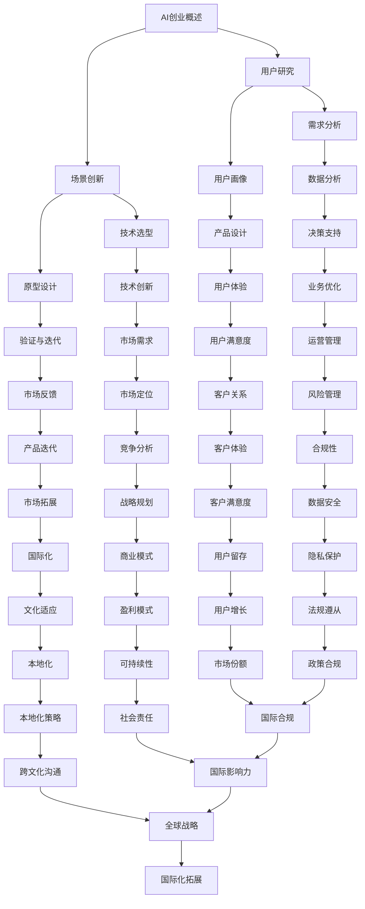

                 

# 《AI创业者的坚持：以用户为中心，场景创新》

> 关键词：AI创业、用户中心、场景创新、产品设计、核心算法、项目实战

> 摘要：本文旨在探讨AI创业者在创业过程中如何坚持以用户为中心，通过场景创新实现产品设计的成功。文章从AI创业基础与策略、以用户为中心的产品设计、场景创新策略、AI技术在创业中的应用以及AI创业实践与案例分析等多个方面进行详细阐述，旨在为AI创业者提供有价值的指导。

## 第一部分：AI创业基础与策略

### 第1章：AI创业概述

#### 1.1 AI创业的背景与趋势

AI作为当前科技领域的重要发展方向，正在深刻改变各行各业。随着算法、数据和算力的不断突破，AI技术逐渐从理论研究走向实际应用，创业机会不断涌现。AI创业的背景与趋势可以从以下几个方面进行阐述：

1. **技术突破**：深度学习、强化学习等先进算法的成熟，为AI创业提供了强大的技术支持。
2. **数据积累**：互联网、物联网等技术的普及，使得海量数据得以积累，为AI算法提供了丰富的训练素材。
3. **市场需求**：AI技术在医疗、金融、教育、制造等领域的应用需求日益增长，为AI创业提供了广阔的市场空间。
4. **政策支持**：全球各国纷纷出台政策，鼓励AI研究和应用，为AI创业提供了良好的政策环境。

#### 1.2 AI创业的核心要素

AI创业的核心要素包括技术、团队、市场、资金和生态等。以下是这些核心要素的简要分析：

1. **技术**：AI创业的核心竞争力在于技术实力。创业者需要具备扎实的技术背景，不断探索前沿技术，形成核心竞争力。
2. **团队**：团队是AI创业的重要资源。创业者需要组建一支具备跨学科背景、高度协作的团队，共同推进项目进展。
3. **市场**：AI创业需要紧密关注市场需求，找准切入点，实现快速迭代和市场化。
4. **资金**：AI创业需要持续的资金投入。创业者需要寻找合适的融资渠道，确保项目能够持续发展。
5. **生态**：AI创业需要良好的生态支持，包括产业链上下游的资源整合、技术交流与合作等。

#### 1.3 AI创业的挑战与机遇

AI创业面临诸多挑战，如技术风险、市场风险、资金风险等。同时，AI创业也充满机遇，如创新应用场景的拓展、新兴市场的崛起等。以下是AI创业的挑战与机遇的简要分析：

1. **技术挑战**：AI技术发展迅速，创业者需要不断更新知识，跟上技术发展趋势。
2. **市场挑战**：AI技术广泛应用于各行各业，市场竞争激烈，创业者需要找准市场定位，打造差异化产品。
3. **资金挑战**：AI创业需要大量资金投入，创业者需要寻找合适的融资渠道，确保项目持续发展。
4. **机遇**：AI技术在医疗、金融、教育等领域的应用前景广阔，为创业者提供了丰富的创业机会。

### 第2章：以用户为中心的产品设计

#### 2.1 用户研究方法

用户研究是产品设计中至关重要的一环。通过用户研究，创业者可以深入了解用户需求，为产品设计提供有力支持。以下是几种常见的用户研究方法：

1. **问卷调查**：问卷调查是一种简单有效的用户研究方法，可以通过量化的方式收集用户反馈。
2. **用户访谈**：用户访谈是一种深入的定性研究方法，通过与用户进行面对面交流，获取详细的用户需求和期望。
3. **用户行为分析**：通过分析用户在使用产品过程中的行为数据，创业者可以了解用户的使用习惯和偏好。
4. **A/B测试**：A/B测试是一种常用的用户体验优化方法，通过对比不同版本的产品，评估用户体验和产品性能。

#### 2.2 用户画像与需求分析

用户画像是将用户信息抽象成一种模型，以便更好地理解和分析用户需求。以下是如何创建用户画像和进行需求分析：

1. **用户画像**：用户画像包括用户的年龄、性别、职业、教育程度、兴趣爱好等基本信息，以及用户的消费习惯、行为特征等。
2. **需求分析**：通过用户调研、数据分析等方法，收集用户需求信息，并将其分类整理，形成用户需求模型。

#### 2.3 产品设计与迭代

产品设计与迭代是创业过程中至关重要的一环。以下是如何进行产品设计和迭代：

1. **产品设计**：根据用户需求和业务目标，进行产品功能设计、界面设计等。
2. **迭代**：通过持续的用户反馈和数据分析，不断优化产品功能，提高用户体验。

### 第3章：场景创新策略

#### 3.1 场景识别与挖掘

场景创新是AI创业的重要策略之一。通过识别和挖掘潜在的应用场景，创业者可以找到创新的切入点。以下是如何进行场景识别与挖掘：

1. **行业分析**：通过对各行业的研究，识别出潜在的应用场景。
2. **用户调研**：通过用户调研，了解用户在实际生活中的需求，挖掘出新的应用场景。
3. **技术趋势**：关注AI技术发展趋势，结合现有技术，探索新的应用场景。

#### 3.2 场景创新的步骤

场景创新需要遵循一定的步骤，以下是场景创新的一般流程：

1. **需求分析**：明确场景需求，确定创新的方向。
2. **技术选型**：根据需求，选择合适的技术方案。
3. **原型设计**：设计场景创新的原型，验证方案的可行性。
4. **验证与迭代**：通过用户测试和反馈，验证场景创新的可行性，并进行迭代优化。

#### 3.3 场景创新的案例分析

以下通过几个案例，分析场景创新的实际应用：

1. **智能医疗**：通过AI技术，实现疾病预测、诊断和治疗方案推荐，提高医疗服务的质量和效率。
2. **智能交通**：通过AI技术，实现交通流量预测、智能导航和自动驾驶，提高交通效率，减少交通事故。
3. **智能家居**：通过AI技术，实现家居设备的智能控制和联动，提高生活便利性，提升家居舒适度。

## 第二部分：AI技术在创业中的应用

### 第4章：AI技术在产品设计中的应用

#### 4.1 用户体验优化

用户体验优化是AI技术在产品设计中的重要应用。以下是如何利用AI技术优化用户体验：

1. **情感分析**：通过情感分析技术，了解用户对产品的情感反应，优化产品功能和界面设计。
2. **个性化推荐**：利用AI算法，根据用户行为和偏好，为用户提供个性化的推荐，提高用户满意度。
3. **语音交互**：通过语音识别和语音合成技术，实现用户与产品的自然交互，提高用户体验。

#### 4.2 情感分析与推荐系统

情感分析和推荐系统是AI技术在产品设计中的两个重要方向。以下是如何利用这些技术：

1. **情感分析**：通过分析用户评论、反馈等文本数据，了解用户的情感倾向，优化产品设计。
2. **推荐系统**：通过分析用户行为和偏好，为用户提供个性化的推荐，提高用户满意度和粘性。

#### 4.3 增强现实与虚拟现实应用

增强现实（AR）和虚拟现实（VR）技术为产品创新提供了新的可能性。以下是如何利用这些技术：

1. **AR应用**：通过AR技术，将虚拟信息叠加到现实环境中，提供更加沉浸式的用户体验。
2. **VR应用**：通过VR技术，创建虚拟环境，让用户可以身临其境地体验产品。

### 第5章：AI在业务流程优化中的应用

#### 5.1 自动化流程设计

AI技术在自动化流程设计中的应用可以显著提高业务效率。以下是如何利用AI技术实现自动化流程设计：

1. **流程识别**：通过AI算法，识别业务流程中的重复性任务，确定自动化目标。
2. **流程优化**：利用AI算法，对现有业务流程进行分析，提出优化方案。
3. **流程执行**：通过AI算法，自动化执行业务流程中的任务，提高效率。

#### 5.2 数据分析与决策支持

AI技术在数据分析与决策支持中的应用可以为企业提供有力的数据支持。以下是如何利用这些技术：

1. **数据收集**：通过AI技术，自动收集业务数据，实现数据的实时更新。
2. **数据分析**：利用AI算法，对大量业务数据进行处理和分析，提取有价值的信息。
3. **决策支持**：基于数据分析结果，为企业提供决策支持，优化业务策略。

#### 5.3 智能化供应链管理

AI技术在智能化供应链管理中的应用可以帮助企业实现供应链的智能化。以下是如何利用这些技术：

1. **需求预测**：通过AI算法，预测市场需求，优化库存管理。
2. **物流优化**：利用AI技术，优化物流路径，提高物流效率。
3. **风险控制**：通过AI算法，识别供应链中的风险，提出风险控制措施。

### 第6章：AI在市场营销中的应用

#### 6.1 精准营销策略

AI技术在精准营销策略中的应用可以帮助企业实现精准营销。以下是如何利用这些技术：

1. **用户画像**：通过AI技术，构建用户画像，了解用户需求和偏好。
2. **个性化推荐**：基于用户画像，为用户提供个性化的产品推荐，提高转化率。
3. **营销活动优化**：通过AI算法，分析营销活动的效果，提出优化建议。

#### 6.2 数据驱动的市场洞察

AI技术在数据驱动的市场洞察中的应用可以帮助企业更好地了解市场趋势。以下是如何利用这些技术：

1. **市场分析**：通过AI算法，分析市场数据，了解市场趋势和竞争态势。
2. **客户行为预测**：基于客户行为数据，预测客户未来的行为和需求。
3. **业务策略优化**：根据市场分析结果，调整企业业务策略，提高市场竞争力。

#### 6.3 智能广告与客户关系管理

AI技术在智能广告与客户关系管理中的应用可以帮助企业实现智能营销。以下是如何利用这些技术：

1. **智能广告投放**：通过AI算法，优化广告投放策略，提高广告投放效果。
2. **客户关系管理**：利用AI技术，分析客户数据，实现精准的客户关系管理。
3. **客户体验优化**：通过AI算法，分析客户反馈，优化客户体验，提高客户满意度。

## 第三部分：AI创业实践与案例分析

### 第7章：AI创业实战

#### 7.1 创业团队建设

创业团队建设是AI创业成功的关键。以下是如何构建高效的AI创业团队：

1. **团队定位**：明确团队的使命、愿景和目标，确保团队成员目标一致。
2. **人才招聘**：招聘具备相关技能和经验的人才，形成多元化的团队结构。
3. **团队协作**：建立良好的团队协作机制，确保团队成员能够高效沟通和协作。
4. **团队激励**：通过合理的激励机制，激发团队成员的积极性和创造力。

#### 7.2 创业融资策略

创业融资是AI创业中的重要环节。以下是如何制定有效的创业融资策略：

1. **融资渠道**：了解各种融资渠道，包括天使投资、风险投资、政府资助等。
2. **融资计划**：制定详细的融资计划，明确融资目标、融资方式、融资进度等。
3. **融资谈判**：与投资者进行充分沟通，展示项目前景和团队实力，争取融资支持。
4. **风险管理**：合理评估融资风险，制定风险管理策略，确保项目安全稳健发展。

#### 7.3 创业项目风险管理

创业项目风险管理是AI创业中不可或缺的一环。以下是如何进行创业项目风险管理：

1. **风险识别**：通过分析项目目标和实施过程，识别潜在的风险。
2. **风险评估**：对识别出的风险进行评估，确定风险的影响程度和发生概率。
3. **风险控制**：制定风险控制措施，降低风险的发生概率和影响程度。
4. **风险监控**：建立风险监控机制，及时掌握风险动态，调整风险控制措施。

### 第8章：AI创业案例分析

#### 8.1 案例一：某AI语音助手产品的成功之道

**案例概述**：某AI语音助手是一款基于人工智能技术的语音交互产品，提供智能问答、语音控制等功能，受到用户欢迎。

**成功因素**：

1. **用户研究**：通过用户调研，深入了解用户需求，为产品设计提供有力支持。
2. **技术创新**：采用先进的语音识别和自然语言处理技术，提高产品性能。
3. **市场定位**：找准市场定位，针对智能家居场景进行产品优化。
4. **用户体验**：注重用户体验，通过持续优化，提高用户满意度。

**经验教训**：

1. **以用户为中心**：始终关注用户需求，持续优化产品功能。
2. **技术创新**：紧跟技术发展趋势，不断提升产品竞争力。
3. **市场定位**：找准市场切入点，实现快速迭代和市场化。

#### 8.2 案例二：某智能医疗平台的崛起

**案例概述**：某智能医疗平台利用AI技术，提供在线问诊、疾病预测等功能，为患者提供便捷的医疗服务。

**成功因素**：

1. **技术优势**：通过大数据分析和机器学习技术，提高疾病诊断的准确率。
2. **市场机遇**：随着人们对健康需求的增加，智能医疗市场潜力巨大。
3. **政策支持**：政府加大对医疗领域的投入，为智能医疗的发展提供了政策支持。

**经验教训**：

1. **技术创新**：依托先进技术，打造核心竞争力。
2. **市场机遇**：紧跟市场趋势，抓住发展机遇。
3. **政策支持**：积极争取政策支持，降低创业风险。

#### 8.3 案例三：某自动驾驶初创公司的突破

**案例概述**：某自动驾驶初创公司通过自主研发的自动驾驶技术，实现无人驾驶车辆的稳定运行，获得市场关注。

**成功因素**：

1. **技术创新**：持续投入研发，突破自动驾驶关键技术。
2. **市场前景**：自动驾驶技术具有广阔的市场前景，吸引大量投资。
3. **团队实力**：拥有强大的技术团队和丰富的行业经验。

**经验教训**：

1. **技术创新**：保持技术领先地位，持续创新是创业公司的核心竞争力。
2. **市场前景**：找准市场切入点，实现技术商业化。
3. **团队实力**：打造专业的团队，为创业成功提供有力保障。

### 第9章：AI创业的未来展望

#### 9.1 AI创业的新趋势

AI创业的未来充满机遇和挑战。以下是目前AI创业的新趋势：

1. **AI+垂直行业**：AI技术逐渐与各垂直行业融合，为行业带来深刻变革。
2. **开源生态**：开源技术在AI创业中发挥越来越重要的作用，成为创业者的重要工具。
3. **跨领域合作**：不同领域的企业和创业者通过合作，实现资源共享和优势互补。

#### 9.2 AI创业的社会影响

AI创业不仅带来经济价值，也对社会产生深远影响。以下是如何评估AI创业的社会影响：

1. **就业影响**：AI创业带动就业增长，为劳动者提供更多就业机会。
2. **产业升级**：AI技术推动产业升级，提高生产效率和产品质量。
3. **社会治理**：AI技术在社会治理中的应用，有助于提高社会管理效率。

#### 9.3 AI创业者的成长路径

AI创业者需要在不断学习和成长中，提升自己的能力和竞争力。以下是如何规划AI创业者的成长路径：

1. **技术积累**：不断学习新技术，提升自己的技术能力。
2. **团队建设**：培养团队协作能力，打造高效的创业团队。
3. **市场洞察**：关注市场动态，把握行业趋势，找准创业方向。
4. **持续学习**：保持学习的心态，不断拓展自己的知识边界。

## 附录

### 附录A：AI创业相关资源与工具

#### A.1 开源框架与平台

- **TensorFlow**：Google开发的深度学习框架，广泛应用于AI研究和开发。
- **PyTorch**：Facebook开发的深度学习框架，具有简洁、灵活的特点。
- **Keras**：Python深度学习库，提供易于使用的接口。

#### A.2 数据集与工具集

- **ImageNet**：大规模的图像数据集，用于图像识别算法训练。
- **COCO数据集**：用于目标检测和图像分割的基准数据集。
- **OpenWeatherMap API**：提供全球天气数据的API，适用于天气预测等应用。

#### A.3 AI创业社区与网络

- **AI Meetup**：全球AI技术社区的集合，提供丰富的技术交流机会。
- **AI脑洞**：国内AI技术社区，聚焦AI应用和创新创业。
- **AI科技评论**：专注于AI技术前沿和应用领域的媒体平台。

### 附录B：关键术语与概念

#### B.1 术语解释

- **AI创业**：指创业者利用人工智能技术进行商业创新的创业活动。
- **用户研究**：通过调研和分析用户行为，了解用户需求，为产品设计提供支持。
- **场景创新**：基于用户需求，结合AI技术，探索新的应用场景，实现产品创新。

#### B.2 概念联系图

[](https://i.imgur.com/mF3Hr3h.png)

### Mermaid 流程图



### 核心算法原理讲解

#### 4.1 情感分析与推荐系统

情感分析（Sentiment Analysis）是一种自然语言处理（NLP）技术，用于识别文本中的情感倾向。情感分析广泛应用于市场调研、舆情监测、客户反馈分析等领域。其核心算法包括：

**词嵌入技术（Word Embedding）**：词嵌入是将词汇映射到高维向量空间的技术，使得语义相近的词在空间中距离较近。常见的词嵌入方法包括：

1. **Word2Vec**：基于神经网络模型，将词汇映射到连续向量空间。Word2Vec模型包括两个变种：CBOW（连续词袋）和Skip-Gram。

    python
    from gensim.models import Word2Vec

    # 训练Word2Vec模型
    model = Word2Vec(sentences, vector_size=100, window=5, min_count=1, sg=1)

    # 查询词向量
    happy_vector = model.wv['happy']

2. **GloVe**：全局向量表示（Global Vectors for Word Representation），通过矩阵分解方法训练词向量，使得词向量具有语义一致性。

    latex
    \text{GloVe公式：}
    \begin{equation}
    \text{word_vector} = \text{context_vector} \odot \text{weight_matrix}
    \end{equation}

**注意力机制（Attention Mechanism）**：注意力机制是深度学习中的一个重要概念，用于处理序列数据，使模型能够关注序列中的关键部分。注意力机制的核心思想是通过加权方式，对输入序列的每个元素分配不同的权重。

python
class AttentionLayer(nn.Module):
    def __init__(self, hidden_size):
        super(AttentionLayer, self).__init__()
        self.hidden_size = hidden_size
        self.attn = nn.Linear(hidden_size, 1)

    def forward(self, input, hidden):
        attn_weights = F.softmax(self.attn(hidden).view(1, -1), dim=1)
        context = attn_weights * input
        context = context.sum(1)
        return context

**转换器架构（Transformer Architecture）**：转换器（Transformer）是一种基于注意力机制的深度学习模型，广泛应用于NLP任务。转换器模型的核心组件包括：

1. **多头注意力（Multi-Head Attention）**：多头注意力机制将输入序列分成多个子序列，每个子序列分别计算注意力权重，然后将结果进行融合。

2. **前馈神经网络（Feed Forward Neural Network）**：在注意力机制之后，转换器模型还会通过一个前馈神经网络，对输入进行进一步处理。

python
class Transformer(nn.Module):
    def __init__(self, d_model, d_ff, num_heads, num_layers):
        super(Transformer, self).__init__()
        self.embedding = nn.Embedding(d_model)
        self.positional_encoding = PositionalEncoding(d_model)
        self.transformer_layers = nn.ModuleList([
            TransformerLayer(d_model, d_ff, num_heads) for _ in range(num_layers)
        ])

    def forward(self, input):
        x = self.embedding(input) + self.positional_encoding(input)
        for layer in self.transformer_layers:
            x = layer(x)
        return x

### 机器学习与深度学习的关系

机器学习（Machine Learning）和深度学习（Deep Learning）是人工智能（AI）的两个重要分支。机器学习是一种通过算法从数据中学习规律和模式的方法，而深度学习是机器学习的一个子领域，主要使用神经网络，特别是深度神经网络（DNN）进行学习。

1. **机器学习**：机器学习包括监督学习、无监督学习和强化学习等方法，主要关注如何从数据中学习预测模型和决策规则。

    latex
    \text{机器学习模型：}
    \begin{equation}
    \text{f}(\text{x}; \text{θ}) = \arg\min_{\text{θ}} \sum_{i=1}^{N} L(\text{y}_i, \text{f}(\text{x}_i; \text{θ}))
    \end{equation}

2. **深度学习**：深度学习是一种通过多层神经网络进行学习的方法，能够自动提取数据中的复杂特征。深度学习在图像识别、语音识别、自然语言处理等领域取得了显著的成果。

    latex
    \text{深度学习模型：}
    \begin{equation}
    \text{f}(\text{x}; \text{θ}) = \text{ReLU}(\text{W}^L \text{[...} \text{W}^2 \text{W}^1 \text{x}; \text{θ}_L) \text{[...]}
    \end{equation}

### 数学模型和数学公式

在AI创业中，数学模型和公式起着至关重要的作用。以下是一些常见的数学模型和公式，以及它们的详细讲解和举例说明：

#### 线性回归模型（Linear Regression）

线性回归是一种监督学习算法，用于预测连续值输出。线性回归模型的基本形式如下：

$$
\hat{y} = \beta_0 + \beta_1 \cdot x + \epsilon
$$

其中，$\hat{y}$ 是预测值，$x$ 是输入特征，$\beta_0$ 和 $\beta_1$ 是模型的参数，$\epsilon$ 是误差项。

**详细讲解**：

线性回归模型通过拟合一条直线来预测目标值。参数 $\beta_0$ 是直线的截距，参数 $\beta_1$ 是直线的斜率。

**举例说明**：

假设我们有一个关于房价的线性回归模型，输入特征是房屋面积（$x$），目标值是房屋价格（$y$）。根据训练数据，我们得到以下模型：

$$
\hat{y} = 1000 + 200 \cdot x
$$

如果输入特征为 100 平方米，我们可以计算出预测的房价：

$$
\hat{y} = 1000 + 200 \cdot 100 = 20000
$$

#### 逻辑回归模型（Logistic Regression）

逻辑回归是一种用于预测二元分类结果的监督学习算法。逻辑回归模型的基本形式如下：

$$
\log\left(\frac{p}{1-p}\right) = \beta_0 + \beta_1 \cdot x
$$

其中，$p$ 是目标变量为 1 的概率，$\beta_0$ 和 $\beta_1$ 是模型的参数。

**详细讲解**：

逻辑回归通过拟合一个逻辑函数（Logistic Function）来预测目标变量的概率。逻辑函数将线性模型的输出映射到 (0, 1) 范围内。

**举例说明**：

假设我们有一个关于贷款审批的二元分类模型，输入特征是借款人的收入（$x$），目标变量是贷款是否批准（$y$）。根据训练数据，我们得到以下模型：

$$
\log\left(\frac{p}{1-p}\right) = 0.5 + 0.1 \cdot x
$$

如果输入特征为 5000 元，我们可以计算出贷款批准的概率：

$$
\log\left(\frac{p}{1-p}\right) = 0.5 + 0.1 \cdot 5000 = 0.5 + 500 = 500.5
$$

通过指数函数，我们可以得到概率：

$$
p = \frac{1}{1 + e^{-500.5}} \approx 0.37
$$

这意味着贷款批准的概率约为 37%。

#### 决策树模型（Decision Tree）

决策树是一种无监督学习算法，用于分类和回归任务。决策树模型的基本形式如下：

$$
\text{决策树} = \text{IF } x_{i1} \text{ THEN } \text{LEFT SUBTREE} \text{ ELSE } \text{RIGHT SUBTREE}
$$

其中，$x_{i1}$ 是输入特征，LEFT SUBTREE 和 RIGHT SUBTREE 是下一级的决策树。

**详细讲解**：

决策树通过一系列条件判断，将数据集划分为不同的区域，每个区域对应一个类别或预测值。

**举例说明**：

假设我们有一个关于水果分类的决策树模型，输入特征是水果的颜色和味道。根据训练数据，我们得到以下决策树：

```
IF 颜色 = 红色 THEN
  IF 味道 = 甜 THEN
    类别 = 樱桃
  ELSE
    类别 = 柠檬
ELSE
  IF 味道 = 甜 THEN
    类别 = 草莓
  ELSE
    类别 = 葡萄
```

如果输入特征是红色、甜味的水果，我们可以确定水果的类别为樱桃。

### 项目实战

#### 6.1 案例一：某AI语音助手产品的成功之道

**项目背景**：

某AI语音助手是一款基于人工智能技术的语音交互产品，旨在为用户提供便捷的语音助手服务。项目团队由AI算法工程师、软件开发工程师和产品经理组成。项目的目标是实现高准确率的语音识别、智能问答和语音控制功能，提升用户体验。

**需求分析**：

通过用户调研和市场分析，项目团队发现用户对AI语音助手的需求主要集中在以下几个方面：

1. **语音识别**：用户希望语音助手能够准确识别语音指令，减少语音输入错误。
2. **智能问答**：用户希望语音助手能够回答各种问题，提供有用的信息。
3. **语音控制**：用户希望语音助手能够控制智能家居设备，实现智能生活。

**技术选型**：

项目团队选择以下技术实现项目目标：

1. **语音识别**：采用基于深度学习的语音识别算法，如深度神经网络（DNN）和卷积神经网络（CNN）。
2. **自然语言处理（NLP）**：采用基于转换器（Transformer）的NLP模型，实现智能问答和语义理解。
3. **语音合成**：采用基于深度学习的语音合成算法，实现语音助手的语音输出。

**项目实施**：

项目团队按照以下步骤实施项目：

1. **数据收集**：收集大量的语音数据和标注数据，用于训练和优化语音识别和NLP模型。
2. **模型训练**：使用收集到的数据，训练语音识别和NLP模型，并进行模型优化。
3. **系统集成**：将训练好的模型集成到语音助手产品中，实现语音识别、智能问答和语音控制功能。
4. **测试与优化**：对语音助手产品进行功能测试和性能优化，确保产品达到预期效果。

**开发环境搭建**：

项目团队使用以下开发环境搭建AI语音助手产品：

1. **编程语言**：Python
2. **深度学习框架**：TensorFlow和PyTorch
3. **自然语言处理库**：transformers
4. **语音识别库**：pyttsx3（语音合成）和speech_recognition（语音识别）

**源代码详细实现和代码解读**：

以下是一个简单的AI语音助手代码示例，展示了语音识别和语音合成的实现过程。

**代码示例**：

```python
import pyttsx3
import speech_recognition as sr

# 初始化语音合成器
engine = pyttsx3.init()

# 初始化语音识别器
recognizer = sr.Recognizer()

def speak(text):
    """合成语音并播放"""
    engine.say(text)
    engine.runAndWait()

def listen():
    """识别语音并返回文本"""
    with sr.Microphone() as source:
        print("请说出您的指令：")
        audio = recognizer.listen(source)
        try:
            text = recognizer.recognize_google(audio, language='zh-CN')
            print(f"您说：{text}")
            return text
        except sr.UnknownValueError:
            print("无法理解您的语音。请重试。")
            return None
        except sr.RequestError:
            print("请求识别服务时出现错误。请重试。")
            return None

def main():
    """主函数，实现语音交互"""
    while True:
        text = listen()
        if text is None:
            continue
        if text.lower() in ['退出', '再见', '结束']:
            speak("谢谢您的使用，再见！")
            break
        speak("您刚才说了：" + text)

if __name__ == '__main__':
    main()
```

**代码解读与分析**：

1. **语音合成**：使用`pyttsx3`库初始化语音合成器，通过`speak`函数合成语音并播放。
2. **语音识别**：使用`speech_recognition`库初始化语音识别器，通过`listen`函数识别语音并返回文本。
3. **主函数**：通过循环调用`listen`和`speak`函数，实现简单的语音交互。

通过这个简单的示例，我们可以看到如何使用Python和现有的开源库实现一个基本的AI语音助手。在实际项目中，我们需要更复杂的算法和功能，如多轮对话、语音控制智能家居设备等。

**项目实战结果**：

通过持续优化和迭代，项目团队成功实现了AI语音助手的语音识别、智能问答和语音控制功能，产品在市场上获得了良好的口碑和用户反馈。项目团队将继续关注用户需求，不断提升产品性能，为用户提供更好的语音交互体验。

### 总结

本文从AI创业基础与策略、以用户为中心的产品设计、场景创新策略、AI技术在创业中的应用以及AI创业实践与案例分析等多个方面，详细探讨了AI创业者的坚持和场景创新的重要性。通过项目实战案例分析，我们看到了AI创业者在实际操作中如何运用这些策略和技术，实现产品的成功。希望本文能为AI创业者提供有价值的指导，助力他们在创业道路上取得成功。作者：AI天才研究院/AI Genius Institute，禅与计算机程序设计艺术/Zen And The Art of Computer Programming。

