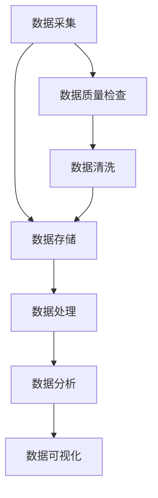
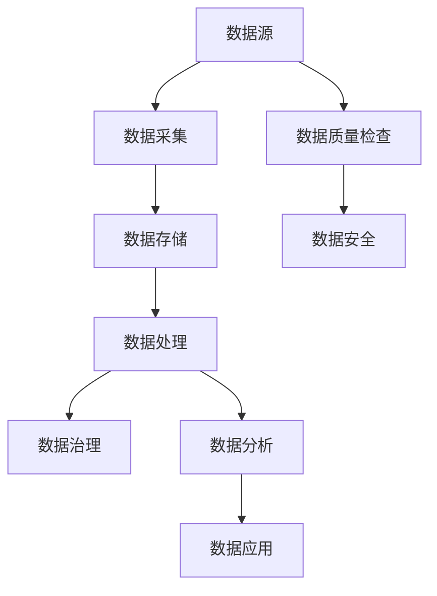

                 

# AI创业：数据管理最佳实践指南

> 关键词：AI创业、数据管理、数据采集、数据处理、数据存储、数据治理

> 摘要：本文旨在为AI创业者提供一份全面的数据管理最佳实践指南，涵盖了数据管理的基础知识、架构设计、数据采集与处理、数据存储与治理，以及数据管理在AI创业中的应用与实践。通过深入分析，本文帮助创业者更好地理解和掌握数据管理的重要性，为AI创业项目的成功奠定坚实基础。

## 第一部分：AI创业背景与数据管理概述

### 第1章：AI创业概述

#### 1.1 AI创业的机遇与挑战

随着人工智能技术的飞速发展，AI创业成为近年来热门的领域。AI创业的机遇体现在以下几个方面：

1. **技术创新**：AI技术的不断突破，为创业公司提供了创新的业务模式和解决方案。
2. **市场需求**：人工智能在各行各业的应用日益广泛，市场需求不断增长，为AI创业提供了广阔的市场空间。
3. **资本支持**：随着人工智能的崛起，资本对AI创业的关注度不断提升，为创业者提供了充足的资金支持。

然而，AI创业也面临着诸多挑战：

1. **技术门槛**：人工智能技术复杂度高，对创业者的技术能力要求较高。
2. **数据依赖**：AI系统的训练和优化依赖于大量高质量的数据，数据采集、处理和存储成为关键挑战。
3. **市场竞争**：AI创业领域竞争激烈，创业者需要具备独特的竞争优势。

#### 1.2 数据管理在AI创业中的重要性

数据管理在AI创业中具有至关重要的地位，主要体现在以下几个方面：

1. **数据质量**：高质量的数据是AI模型训练和优化的基础，数据质量问题直接影响AI系统的性能和效果。
2. **数据安全**：随着数据量的不断增长，数据安全成为AI创业企业面临的重要挑战，需要建立完善的数据安全防护体系。
3. **数据治理**：数据治理是确保数据质量、数据安全和数据合规性的重要手段，有助于企业构建稳健的数据管理体系。
4. **数据价值**：通过有效的数据管理和分析，企业可以挖掘数据背后的价值，为业务决策提供有力支持。

#### 1.3 数据管理的核心目标与关键环节

数据管理的核心目标是确保数据的高质量、高可用性和高安全性，关键环节包括：

1. **数据采集**：通过多种渠道收集数据，包括内部数据、外部数据、实时数据等。
2. **数据处理**：对采集到的数据进行清洗、转换、整合等处理，提高数据质量。
3. **数据存储**：选择合适的存储方案，确保数据的安全、可靠和高效存储。
4. **数据治理**：建立数据治理框架，确保数据质量、数据安全和数据合规性。
5. **数据分析**：运用数据分析技术，挖掘数据背后的价值，为业务决策提供支持。

## 第二部分：数据管理基础知识

### 第2章：数据管理基础知识

#### 2.1 数据管理的基本概念

数据管理是指对数据的采集、存储、处理、分析和应用的全过程，包括数据治理、数据架构、数据质量、数据安全等方面。数据管理的基本概念如下：

1. **数据**：数据是指以电子形式存储和处理的信息，包括结构化数据、半结构化数据和非结构化数据。
2. **数据管理**：数据管理是指对数据的组织、存储、处理、分析和应用的全过程，旨在提高数据质量、数据安全和数据价值。
3. **数据治理**：数据治理是指建立一套制度、流程和技术手段，确保数据质量、数据安全和数据合规性。
4. **数据架构**：数据架构是指数据的组织结构、数据流和数据存储的方案。
5. **数据质量**：数据质量是指数据准确性、完整性、一致性、及时性和可靠性等方面的特征。
6. **数据安全**：数据安全是指保护数据免受未授权访问、泄露、篡改和破坏的措施。
7. **数据分析**：数据分析是指运用统计学、机器学习等方法对数据进行分析和挖掘，提取有价值的信息。

#### 2.2 数据管理生命周期

数据管理生命周期是指数据从产生到最终销毁的整个过程，主要包括以下阶段：

1. **数据采集**：从各种渠道收集数据，包括内部数据、外部数据、实时数据等。
2. **数据存储**：选择合适的存储方案，确保数据的安全、可靠和高效存储。
3. **数据处理**：对采集到的数据进行清洗、转换、整合等处理，提高数据质量。
4. **数据治理**：建立数据治理框架，确保数据质量、数据安全和数据合规性。
5. **数据分析**：运用数据分析技术，挖掘数据背后的价值，为业务决策提供支持。
6. **数据应用**：将分析结果应用于业务决策、产品优化和运营管理等方面。
7. **数据归档与销毁**：对不再需要的数据进行归档或销毁，确保数据安全。

#### 2.3 数据治理与数据质量控制

数据治理是指建立一套制度、流程和技术手段，确保数据质量、数据安全和数据合规性。数据治理的关键内容包括：

1. **数据质量**：数据质量是数据治理的核心目标，包括准确性、完整性、一致性、及时性和可靠性等方面的特征。
2. **数据安全**：数据安全是数据治理的重要组成部分，包括数据访问控制、数据加密、数据备份和恢复等措施。
3. **数据合规**：数据合规是指遵守相关的法律法规和标准，包括数据隐私保护、数据跨境传输等。

数据质量控制是数据治理的重要环节，主要包括以下措施：

1. **数据清洗**：通过清洗算法去除错误数据、重复数据和异常数据。
2. **数据验证**：通过验证算法确保数据的准确性、完整性和一致性。
3. **数据标准化**：通过数据规范化、数据类型转换和数据格式转换等措施，提高数据质量。
4. **数据监控**：建立数据质量监控体系，实时检测和反馈数据质量问题。

### 第3章：数据管理架构设计

#### 3.1 数据架构设计原则

数据架构设计是指根据业务需求，制定数据组织的结构、数据流和数据存储的方案。数据架构设计应遵循以下原则：

1. **业务导向**：数据架构设计应紧密围绕业务需求，确保数据的可用性、一致性和及时性。
2. **分层设计**：将数据架构分为数据源层、数据存储层、数据处理层和数据应用层，实现数据的分级管理和优化。
3. **灵活性**：数据架构设计应具备良好的灵活性，能够适应业务变化和新技术的发展。
4. **可扩展性**：数据架构设计应考虑未来业务规模和数据量的增长，确保系统的可扩展性。
5. **安全性**：数据架构设计应充分考虑数据安全，确保数据的机密性、完整性和可用性。

#### 3.2 数据仓库与数据湖

数据仓库和数据湖是两种常见的数据存储方案，分别适用于不同的场景。

**数据仓库**：

1. **定义**：数据仓库是一个集中存储、管理和分析数据的系统，主要用于支持企业的业务决策。
2. **特点**：
   - 结构化数据：数据仓库主要存储结构化数据，如关系数据库中的数据。
   - 数据集成：数据仓库通过ETL（提取、转换、加载）过程，将不同来源的数据集成到一起。
   - 数据分析：数据仓库支持复杂的查询和分析，提供报表、仪表盘等数据可视化功能。
3. **应用场景**：数据仓库适用于企业内部数据集成、数据分析、数据报表等场景。

**数据湖**：

1. **定义**：数据湖是一个分布式存储系统，用于存储各种类型的数据，包括结构化、半结构化和非结构化数据。
2. **特点**：
   - 多样化数据：数据湖可以存储各种类型的数据，如文本、图片、音频、视频等。
   - 分布式存储：数据湖采用分布式存储架构，具有高可用性和高扩展性。
   - 数据处理：数据湖支持实时数据处理和批处理，提供丰富的数据处理和分析工具。
3. **应用场景**：数据湖适用于大数据处理、实时数据分析、机器学习等场景。

#### 3.3 数据流与数据管道

数据流是指数据从产生到消费的整个过程，包括数据采集、数据传输、数据处理和数据应用等环节。数据管道是实现数据流的一种架构，主要包括以下组件：

1. **数据源**：数据源是数据的产生者，可以是内部系统、外部接口、传感器等。
2. **数据采集**：数据采集是指将数据从数据源抽取到数据存储系统，包括实时采集和批量采集。
3. **数据传输**：数据传输是指将数据从数据源传输到数据存储系统，包括网络传输和分布式传输。
4. **数据处理**：数据处理是指对采集到的数据进行清洗、转换、整合等操作，提高数据质量。
5. **数据存储**：数据存储是指将处理后的数据存储到数据仓库、数据湖或其他数据存储系统。
6. **数据消费**：数据消费是指将数据提供给应用程序、报表、仪表盘等，支持业务决策和数据分析。

数据管道的设计原则包括：

1. **高效性**：数据管道应具备高效的数据传输和处理能力，降低数据延迟。
2. **可靠性**：数据管道应具备高可用性和容错性，确保数据传输和处理的可靠性。
3. **可扩展性**：数据管道应具备良好的扩展性，能够适应数据量的增长和业务需求的变化。
4. **灵活性**：数据管道应具备灵活性，能够支持多种数据源、数据格式和数据类型。

## 第二部分：数据采集与处理

### 第4章：数据采集

#### 4.1 数据采集渠道与策略

数据采集是数据管理的重要环节，选择合适的数据采集渠道和策略对数据质量至关重要。以下介绍几种常见的数据采集渠道和策略：

**内部数据采集**：

1. **业务系统**：从企业的业务系统中抽取数据，包括ERP、CRM、财务系统等。
2. **日志文件**：从系统日志、网络日志等抽取数据，用于监控、分析和优化系统性能。

**外部数据采集**：

1. **公开数据**：从政府、研究机构、社交媒体等公开渠道获取数据，如人口统计数据、行业报告等。
2. **商业数据**：从商业数据提供商获取数据，如市场调研数据、企业信用数据等。
3. **实时数据**：通过API、Web爬虫等方式实时获取互联网上的数据，如股票行情、天气数据等。

**数据采集策略**：

1. **集中式采集**：将数据统一抽取到数据仓库或数据湖，方便后续处理和分析。
2. **分布式采集**：将数据分散到多个存储节点，提高数据采集的效率和可靠性。
3. **增量采集**：只采集新产生或发生变化的数据，减少数据传输和处理的开销。
4. **实时采集**：实时获取数据，支持实时分析和决策。

### 4.2 数据采集工具与平台

数据采集工具和平台是实现数据采集的关键，以下介绍几种常见的工具和平台：

**开源数据采集工具**：

1. **Flume**：Apache Flume是一个分布式、可靠、可扩展的数据采集代理，适用于大规模数据采集。
2. **Kafka**：Apache Kafka是一个分布式流处理平台，支持实时数据采集和传输。
3. **Logstash**：Apache Logstash是一个数据收集和处理的工具，可将数据从各种源提取出来，转化为结构化数据，并将其传输到目标存储系统。

**商业数据采集平台**：

1. **DataXu**：DataXu是一个强大的数据采集和分析平台，支持多种数据源的采集、处理和分析。
2. **Informatica**：Informatica是一个广泛使用的数据集成和数据处理平台，提供丰富的数据采集工具和功能。
3. **Talend**：Talend是一个综合性的数据集成和数据管理平台，支持数据采集、数据清洗、数据转换等功能。

### 4.3 数据质量检查与数据清洗

数据质量检查和数据清洗是数据管理的重要环节，以下介绍几种常见的数据质量检查方法和数据清洗算法：

**数据质量检查方法**：

1. **完整性检查**：检查数据是否完整，包括数据列是否缺失、记录是否缺失等。
2. **一致性检查**：检查数据是否一致，包括同一字段在不同数据源中的值是否一致等。
3. **准确性检查**：检查数据是否准确，包括数据是否符合预期、数据是否真实有效等。
4. **及时性检查**：检查数据是否及时，包括数据是否按时采集、数据是否过期等。

**数据清洗算法**：

1. **缺失值填充**：使用统计方法、插值方法或平均值等方法对缺失值进行填充。
2. **重复值删除**：删除重复的数据记录，确保数据的唯一性。
3. **异常值处理**：识别和处理异常值，包括删除异常值、修正异常值或标记异常值等。
4. **格式转换**：对数据进行格式转换，确保数据格式的一致性。

## 第5章：数据处理

#### 5.1 数据预处理技术

数据预处理是数据处理的重要环节，主要包括数据清洗、数据转换和数据归一化等操作。以下介绍几种常见的数据预处理技术：

**数据清洗**：

1. **缺失值处理**：通过填充、删除或插值等方法处理缺失值。
2. **异常值处理**：通过统计方法、规则方法或可视化方法识别和处理异常值。
3. **重复值删除**：删除重复的数据记录，确保数据的唯一性。

**数据转换**：

1. **数据类型转换**：将不同数据类型的数据转换为同一数据类型，如将字符串转换为数值型。
2. **数据编码转换**：将不同编码格式的数据转换为统一编码格式，如将UTF-8编码转换为ASCII编码。

**数据归一化**：

1. **最小-最大归一化**：将数据映射到[0,1]范围内，公式为 $x' = \frac{x - x_{\text{min}}}{x_{\text{max}} - x_{\text{min}}}$。
2. **平均值-标准差归一化**：将数据映射到标准正态分布范围内，公式为 $x' = \frac{x - \mu}{\sigma}$，其中$\mu$为平均值，$\sigma$为标准差。

#### 5.2 数据融合与数据集成

数据融合与数据集成是将来自不同来源、不同类型的数据整合为一个统一的数据集的过程。以下介绍几种常见的数据融合与数据集成技术：

**数据融合**：

1. **特征级融合**：将不同数据源的特征进行合并，形成新的特征向量。
2. **数据级融合**：将不同数据源的数据记录进行合并，形成新的数据集。

**数据集成**：

1. **全量集成**：将所有数据源的数据合并为一个统一的数据集。
2. **增量集成**：只合并新产生的或发生变化的数据。

**数据集成技术**：

1. **ETL（Extract, Transform, Load）**：将数据从源系统提取到目标系统，进行转换和加载。
2. **ETLL（Extract, Transform, Load, List）**：ETL的扩展，包括对数据进行记录级别的处理。
3. **数据湖**：将结构化、半结构化和非结构化数据存储在同一个系统中，实现数据的统一管理和分析。

#### 5.3 数据规范化与标准化

数据规范化与标准化是确保数据一致性和兼容性的重要手段。以下介绍几种常见的数据规范化与标准化方法：

**数据规范化**：

1. **属性规范化**：将同一属性的数据进行规范化处理，如将薪资数据统一为同一货币单位。
2. **记录规范化**：将不同记录的数据进行规范化处理，如将姓名格式统一为英文字母顺序。

**数据标准化**：

1. **数据格式标准化**：将不同格式的数据转换为统一格式，如将日期格式统一为YYYY-MM-DD。
2. **数据范围标准化**：将不同范围的数据转换为同一范围，如将年龄范围统一为0-100。

**数据规范化与标准化工具**：

1. **Apache NiFi**：Apache NiFi是一个数据流平台，支持数据清洗、转换、归一化等功能。
2. **Talend**：Talend是一个综合性的数据集成和数据管理平台，支持数据规范化与标准化功能。
3. **Informatica**：Informatica是一个广泛使用的数据集成和数据处理平台，提供数据规范化与标准化工具。

## 第6章：数据存储

#### 6.1 数据存储类型与选择

数据存储是数据管理的重要环节，选择合适的数据存储类型对数据性能、安全性和成本具有重要影响。以下介绍几种常见的数据存储类型及其选择依据：

**关系型数据库**：

1. **定义**：关系型数据库是一种基于关系模型的数据库管理系统，如MySQL、Oracle等。
2. **特点**：
   - 结构化数据：关系型数据库适用于结构化数据存储，支持SQL查询。
   - 数据一致性：关系型数据库保证数据的完整性和一致性。
   - 事务支持：关系型数据库支持事务操作，确保数据安全。
3. **适用场景**：关系型数据库适用于企业内部系统、金融系统、在线交易等场景。

**非关系型数据库**：

1. **定义**：非关系型数据库是一种基于非关系模型的数据库管理系统，如MongoDB、Redis等。
2. **特点**：
   - 半结构化/非结构化数据：非关系型数据库适用于半结构化/非结构化数据存储，如JSON、XML等。
   - 数据灵活性：非关系型数据库具有灵活的数据结构，支持快速数据模型调整。
   - 高性能：非关系型数据库具有高性能，适用于大规模数据存储和处理。
3. **适用场景**：非关系型数据库适用于社交媒体、物联网、实时数据处理等场景。

**分布式存储系统**：

1. **定义**：分布式存储系统是一种基于分布式架构的存储系统，如Hadoop、Cassandra等。
2. **特点**：
   - 分布式架构：分布式存储系统采用分布式架构，具有高可用性和高扩展性。
   - 大数据存储：分布式存储系统适用于大规模数据存储，支持PB级别的数据存储。
   - 数据处理：分布式存储系统支持分布式数据处理，如MapReduce、Spark等。
3. **适用场景**：分布式存储系统适用于大数据处理、实时数据处理、分布式计算等场景。

**选择依据**：

1. **数据类型**：根据数据类型选择合适的存储系统，如结构化数据选择关系型数据库，半结构化/非结构化数据选择非关系型数据库。
2. **性能需求**：根据性能需求选择合适的存储系统，如低延迟、高并发选择非关系型数据库，高吞吐量、大规模数据存储选择分布式存储系统。
3. **成本考虑**：根据成本考虑选择合适的存储系统，如开源数据库具有较低的成本，商业数据库提供更全面的功能和售后服务。

#### 6.2 数据库与数据缓存

**数据库**：

1. **定义**：数据库是一个按照数据结构来组织、存储和管理数据的系统，如MySQL、Oracle等。
2. **特点**：
   - 数据组织：数据库采用表、记录和字段等数据结构组织数据，支持SQL查询。
   - 数据安全：数据库提供数据访问控制、数据备份和恢复等功能，确保数据安全。
   - 数据一致性：数据库保证数据的完整性和一致性，支持事务操作。
3. **适用场景**：数据库适用于企业内部系统、金融系统、在线交易等场景。

**数据缓存**：

1. **定义**：数据缓存是一种临时存储数据的技术，如Redis、Memcached等。
2. **特点**：
   - 高性能：数据缓存采用高速存储介质，具有高性能，适用于高并发场景。
   - 数据访问：数据缓存存储热点数据，减少数据库访问压力，提高系统性能。
   - 数据持久化：数据缓存支持数据持久化，将缓存数据保存到数据库或其他存储系统。
3. **适用场景**：数据缓存适用于高并发、低延迟的场景，如Web应用、缓存数据库查询结果、临时数据存储等。

**数据库与数据缓存的关系**：

1. **数据同步**：数据库与数据缓存之间可以实时同步数据，保持数据一致性。
2. **数据分离**：数据库与数据缓存可以分离部署，独立运行，降低数据库负载。
3. **缓存策略**：数据缓存采用不同的缓存策略，如最近最少使用（LRU）、最不经常使用（LFU）等，提高缓存命中率。

#### 6.3 分布式存储系统

**分布式存储系统**：

1. **定义**：分布式存储系统是一种基于分布式架构的存储系统，如Hadoop、Cassandra等。
2. **特点**：
   - 分布式架构：分布式存储系统采用分布式架构，具有高可用性和高扩展性。
   - 数据存储：分布式存储系统将数据分散存储到多个节点，提高数据可靠性和可用性。
   - 数据处理：分布式存储系统支持分布式数据处理，如MapReduce、Spark等。
3. **适用场景**：分布式存储系统适用于大数据处理、实时数据处理、分布式计算等场景。

**分布式存储系统的架构**：

1. **数据分片**：分布式存储系统将数据分片存储到多个节点，提高数据存储和访问性能。
2. **元数据管理**：分布式存储系统管理元数据，包括数据分片信息、节点状态等。
3. **数据复制**：分布式存储系统实现数据复制，提高数据可靠性和容错性。
4. **数据一致性**：分布式存储系统确保数据一致性，采用不同的数据一致性算法，如强一致性、最终一致性等。

**分布式存储系统的优势**：

1. **高可用性**：分布式存储系统采用冗余设计，具有高可用性和容错性。
2. **高扩展性**：分布式存储系统支持水平扩展，能够适应数据量和并发量的增长。
3. **高性能**：分布式存储系统采用分布式架构，提高数据存储和访问性能。
4. **数据冗余**：分布式存储系统实现数据冗余，提高数据可靠性和安全性。

### 第三部分：数据管理技术与实践

#### 第7章：数据仓库与数据湖

#### 7.1 数据仓库的设计与实现

**数据仓库的设计原则**：

1. **业务导向**：数据仓库设计应紧密围绕业务需求，确保数据的业务价值。
2. **分层设计**：数据仓库采用分层设计，包括数据源层、数据仓库层、数据应用层等。
3. **数据一致性**：数据仓库应保证数据一致性，确保数据源与数据仓库之间的数据一致。
4. **数据冗余**：数据仓库应合理设计数据冗余，提高数据查询性能。
5. **数据扩展性**：数据仓库设计应考虑数据量的增长和业务扩展，具备良好的扩展性。

**数据仓库的实现步骤**：

1. **需求分析**：明确业务需求，分析数据来源和数据类型。
2. **数据建模**：设计数据模型，包括维度模型、星型模型、雪花模型等。
3. **数据抽取**：从数据源抽取数据，进行清洗、转换和整合。
4. **数据加载**：将清洗和转换后的数据加载到数据仓库中。
5. **数据查询**：设计数据查询和分析工具，支持业务查询和分析。

**数据仓库的优缺点**：

**优点**：

1. **数据集成**：数据仓库将不同来源的数据集成到一起，支持跨系统、跨部门的数据分析。
2. **数据一致性**：数据仓库保证数据一致性，降低数据冗余，提高数据质量。
3. **查询优化**：数据仓库采用索引、分区等技术，提高数据查询性能。
4. **数据报表**：数据仓库支持数据报表和可视化分析，为业务决策提供支持。

**缺点**：

1. **数据滞后**：数据仓库的数据更新周期较长，可能无法实时反映业务变化。
2. **成本较高**：数据仓库的建设和维护成本较高，需要专业的技术团队。
3. **复杂度高**：数据仓库的设计和实现过程复杂，对开发人员的要求较高。

#### 7.2 数据湖的优势与挑战

**数据湖的优势**：

1. **灵活性**：数据湖采用分布式存储架构，可以存储各种类型的数据，包括结构化、半结构化和非结构化数据。
2. **数据多样性**：数据湖支持多种数据源和数据格式，可以满足不同业务场景的需求。
3. **数据统一管理**：数据湖实现数据的统一管理和分析，降低数据孤岛现象。
4. **数据处理能力**：数据湖支持实时数据处理和批处理，提高数据处理能力。

**数据湖的挑战**：

1. **数据质量**：数据湖中的数据质量参差不齐，需要建立完善的数据治理框架。
2. **数据安全**：数据湖中的数据安全风险较高，需要加强数据安全和隐私保护。
3. **数据存储成本**：数据湖存储的数据量巨大，需要高昂的存储成本。
4. **数据分析复杂性**：数据湖中的数据类型多样，分析复杂性较高，需要专业的技术团队。

#### 7.3 数据仓库与数据湖的融合

数据仓库与数据湖的融合是一种新型的数据架构，旨在结合数据仓库与数据湖的优势，解决各自的缺点。

**数据仓库与数据湖融合的优势**：

1. **数据多样性**：数据仓库与数据湖融合，可以存储多种类型的数据，满足不同业务场景的需求。
2. **数据一致性**：数据仓库与数据湖融合，实现数据的一致性和统一管理，降低数据孤岛现象。
3. **数据处理能力**：数据仓库与数据湖融合，提高数据处理能力，支持实时数据处理和批处理。
4. **数据治理**：数据仓库与数据湖融合，加强数据治理，提高数据质量和数据安全。

**数据仓库与数据湖融合的挑战**：

1. **架构复杂性**：数据仓库与数据湖融合，导致架构复杂性增加，需要专业的技术团队进行维护和管理。
2. **数据质量**：数据仓库与数据湖融合，需要确保数据质量，建立完善的数据治理框架。
3. **数据成本**：数据仓库与数据湖融合，需要高昂的存储成本，特别是数据湖的存储成本较高。

**数据仓库与数据湖融合的实施策略**：

1. **数据分层**：将数据仓库与数据湖分层设计，分别存储不同类型的数据。
2. **数据治理**：建立数据治理框架，确保数据质量、数据安全和数据合规性。
3. **数据处理**：结合实时数据处理和批处理技术，提高数据处理能力。
4. **数据集成**：实现数据仓库与数据湖的数据集成，确保数据一致性。

## 第8章：大数据处理平台

#### 8.1 Hadoop生态系统

Hadoop是一个开源的大数据处理框架，由Apache Software Foundation维护。Hadoop生态系统包括多个组件，用于处理、存储和分析大规模数据。

**核心组件**：

1. **Hadoop分布式文件系统（HDFS）**：HDFS是一个分布式文件系统，用于存储大规模数据，具有高可靠性和高性能。
2. **Hadoop YARN**：YARN是Hadoop的资源调度框架，负责管理计算资源和任务调度。
3. **Hadoop MapReduce**：MapReduce是一种编程模型，用于处理大规模数据集，具有高扩展性和容错性。

**Hadoop的特点**：

1. **分布式存储**：Hadoop使用HDFS存储大规模数据，具有高可用性和高扩展性。
2. **分布式计算**：Hadoop使用MapReduce编程模型，实现分布式计算，具有高扩展性和容错性。
3. **生态系统丰富**：Hadoop拥有丰富的生态系统，包括各种数据处理和分析工具，如Spark、Hive、Pig等。

**Hadoop的应用场景**：

1. **大数据处理**：Hadoop适用于大规模数据处理，如日志分析、搜索引擎等。
2. **数据存储**：Hadoop适用于大规模数据存储，如网站点击流、社交媒体数据等。
3. **数据挖掘**：Hadoop适用于数据挖掘和机器学习，如推荐系统、图像识别等。

#### 8.2 Spark生态系统

Spark是一个开源的分布式计算引擎，由Apache Software Foundation维护。Spark生态系统包括多个组件，用于处理、存储和分析大规模数据。

**核心组件**：

1. **Spark Core**：Spark Core是Spark的核心组件，提供分布式计算基础和内存计算功能。
2. **Spark SQL**：Spark SQL是Spark的数据存储和分析工具，支持SQL查询和数据处理。
3. **Spark Streaming**：Spark Streaming是Spark的实时数据处理组件，支持实时数据流处理。
4. **MLlib**：MLlib是Spark的机器学习库，提供多种机器学习算法和模型。

**Spark的特点**：

1. **内存计算**：Spark使用内存计算，提高数据处理速度，具有高性能。
2. **实时数据处理**：Spark Streaming支持实时数据处理，适用于实时分析和监控。
3. **易用性**：Spark提供多种编程接口，包括Scala、Python、Java等，易于使用和扩展。
4. **生态系统丰富**：Spark拥有丰富的生态系统，包括各种数据处理和分析工具，如DataFrame、Dataset等。

**Spark的应用场景**：

1. **大数据处理**：Spark适用于大规模数据处理，如日志分析、搜索引擎等。
2. **实时数据处理**：Spark Streaming适用于实时数据流处理，如实时监控、实时推荐等。
3. **数据挖掘**：MLlib适用于数据挖掘和机器学习，如推荐系统、图像识别等。

#### 8.3 Flink生态系统

Apache Flink是一个开源的分布式计算引擎，由Apache Software Foundation维护。Flink生态系统包括多个组件，用于处理、存储和分析大规模数据。

**核心组件**：

1. **Flink Core**：Flink Core是Flink的核心组件，提供分布式计算基础和内存计算功能。
2. **Flink SQL**：Flink SQL是Flink的数据存储和分析工具，支持SQL查询和数据处理。
3. **Flink Streaming**：Flink Streaming是Flink的实时数据处理组件，支持实时数据流处理。
4. **Flink ML**：Flink ML是Flink的机器学习库，提供多种机器学习算法和模型。

**Flink的特点**：

1. **实时计算**：Flink支持实时数据处理，具有低延迟和高吞吐量。
2. **流处理与批处理统一**：Flink将流处理和批处理统一到同一个计算引擎中，提高数据处理效率。
3. **内存计算**：Flink使用内存计算，提高数据处理速度，具有高性能。
4. **生态系统丰富**：Flink拥有丰富的生态系统，包括各种数据处理和分析工具，如DataFrame、Gelly等。

**Flink的应用场景**：

1. **实时数据处理**：Flink适用于实时数据处理，如实时监控、实时推荐等。
2. **大数据处理**：Flink适用于大规模数据处理，如日志分析、搜索引擎等。
3. **数据挖掘**：Flink ML适用于数据挖掘和机器学习，如推荐系统、图像识别等。

### 第9章：数据治理与合规

#### 9.1 数据治理框架

数据治理是指建立一套制度、流程和技术手段，确保数据质量、数据安全和数据合规性。一个完整的数据治理框架通常包括以下关键组成部分：

1. **数据治理组织**：建立数据治理委员会、数据管理办公室等组织机构，负责数据治理工作的推进和执行。
2. **数据治理政策**：制定数据治理政策，明确数据治理的目标、原则和具体措施。
3. **数据治理流程**：建立数据治理流程，包括数据采集、数据存储、数据处理、数据分析和数据归档等环节。
4. **数据质量管理**：建立数据质量管理体系，包括数据质量评估、数据质量监控、数据质量改进等。
5. **数据安全与隐私保护**：建立数据安全与隐私保护机制，包括数据加密、访问控制、备份和恢复等。
6. **数据合规性管理**：确保数据管理活动符合相关法律法规和行业标准，包括数据跨境传输、数据隐私保护等。

#### 9.2 数据安全与隐私保护

数据安全与隐私保护是数据治理的重要组成部分，对于保护企业数据资产和用户隐私具有重要意义。以下介绍几种常见的数据安全与隐私保护措施：

1. **数据加密**：对敏感数据进行加密，确保数据在传输和存储过程中的安全性。
2. **访问控制**：实施访问控制策略，确保只有授权用户可以访问特定数据。
3. **数据备份与恢复**：定期备份数据，确保数据在发生意外时可以快速恢复。
4. **审计与监控**：对数据访问和使用情况进行审计和监控，及时发现和防止数据泄露和滥用。
5. **数据匿名化**：对敏感数据进行匿名化处理，确保用户隐私不被泄露。
6. **隐私保护法规**：遵守相关隐私保护法规，如《通用数据保护条例》（GDPR）等，确保数据管理活动合法合规。

#### 9.3 数据合规性与法律法规

数据合规性是指企业在数据管理过程中遵守相关法律法规和行业标准的要求。以下介绍几种常见的法律法规和数据合规要求：

1. **数据保护法规**：如《通用数据保护条例》（GDPR）、《加州消费者隐私法案》（CCPA）等，规定了数据收集、存储、处理和传输过程中应遵守的隐私保护要求。
2. **行业规范**：如金融行业的《巴塞尔协议II》、《反洗钱法》等，规定了金融行业在数据管理过程中应遵守的具体规范和要求。
3. **数据跨境传输**：在数据跨境传输过程中，需要遵守相关法律法规和监管要求，如《通用数据保护条例》（GDPR）中对数据跨境传输的严格要求。
4. **数据质量管理**：如《数据质量管理规范》（GB/T 24388）等，规定了数据质量管理的具体要求和标准。
5. **数据备份与恢复**：如《数据备份与恢复规范》（GB/T 27183）等，规定了数据备份与恢复的具体要求和流程。

### 第10章：数据驱动的决策

#### 10.1 数据分析与可视化

数据分析与可视化是数据驱动决策的重要手段，通过分析数据并呈现可视化图表，帮助企业更好地理解数据背后的信息，支持业务决策。

**数据分析**：

1. **描述性分析**：通过统计方法描述数据的基本特征，如平均值、中位数、标准差等。
2. **诊断性分析**：通过分析数据，找出数据中的异常值、趋势和规律。
3. **预测性分析**：通过历史数据建立预测模型，预测未来数据的发展趋势。

**数据可视化**：

1. **折线图**：展示数据的变化趋势，如时间序列数据。
2. **柱状图**：展示不同类别或不同时间段的数据对比。
3. **饼图**：展示各部分数据在总体中所占的比例。
4. **散点图**：展示两个变量之间的关系。
5. **热力图**：展示数据的分布和密集度。

**数据分析与可视化的应用场景**：

1. **市场营销**：通过数据分析与可视化，了解客户行为、市场需求和竞争态势，支持营销策略制定。
2. **生产管理**：通过数据分析与可视化，监控生产过程、优化生产流程，提高生产效率。
3. **财务分析**：通过数据分析与可视化，监控财务状况、预测财务风险，支持财务决策。
4. **人力资源管理**：通过数据分析与可视化，了解员工绩效、薪酬水平和培训需求，支持人力资源决策。

#### 10.2 数据挖掘与预测建模

数据挖掘与预测建模是利用统计学、机器学习等方法，从大量数据中提取有价值的信息和规律，为业务决策提供支持。

**数据挖掘**：

1. **关联规则挖掘**：发现数据之间的关联关系，如商品组合、用户行为等。
2. **聚类分析**：将相似的数据分组，识别数据的分布和模式。
3. **分类与回归分析**：建立预测模型，预测数据的未来趋势和规律。

**预测建模**：

1. **时间序列预测**：利用历史时间序列数据，预测未来的数值趋势。
2. **回归分析**：利用自变量和因变量的关系，建立回归模型，预测因变量的值。
3. **决策树与随机森林**：利用决策树和随机森林算法，建立分类和回归模型，预测未来数据。

**数据挖掘与预测建模的应用场景**：

1. **客户行为预测**：通过数据挖掘和预测建模，预测客户的购买行为、偏好和需求，支持个性化营销和客户关系管理。
2. **风险预测**：通过数据挖掘和预测建模，识别潜在的风险因素，预测风险的发生概率和影响程度，支持风险管理。
3. **需求预测**：通过数据挖掘和预测建模，预测市场需求和销售趋势，支持库存管理、供应链优化等。
4. **金融市场预测**：通过数据挖掘和预测建模，分析市场数据，预测股价、汇率等金融指标的变化，支持投资决策。

#### 10.3 数据驱动的业务优化

数据驱动的业务优化是指通过数据分析、数据挖掘和预测建模等技术，发现数据背后的价值，支持业务决策和优化。

**业务优化流程**：

1. **数据采集与预处理**：从各种渠道采集数据，并进行数据清洗、转换和归一化等预处理操作。
2. **数据分析和挖掘**：利用统计学、机器学习等方法，对数据进行分析和挖掘，提取有价值的信息和规律。
3. **预测建模**：建立预测模型，对业务指标进行预测，为业务决策提供支持。
4. **业务优化与实施**：根据预测结果，制定优化策略，实施业务优化措施，提高业务绩效。
5. **监控与反馈**：对业务优化效果进行监控和评估，根据反馈进行调整和优化。

**数据驱动的业务优化应用场景**：

1. **市场营销**：通过数据分析，了解客户行为和需求，制定个性化营销策略，提高营销效果。
2. **生产管理**：通过数据分析，优化生产流程、提高生产效率，降低成本。
3. **供应链管理**：通过数据分析，优化库存管理、降低库存成本，提高供应链效率。
4. **人力资源管理**：通过数据分析，优化招聘策略、员工绩效评估和培训计划，提高员工满意度和工作效率。

### 第11章：数据治理案例研究

#### 11.1 案例一：电商公司数据治理实践

**背景**：

一家电商公司在快速发展过程中，积累了大量用户数据、交易数据和商品数据。然而，数据质量参差不齐，数据孤岛现象严重，数据治理成为公司面临的重要挑战。

**解决方案**：

1. **建立数据治理组织**：成立数据治理委员会，负责数据治理工作的推进和执行。
2. **制定数据治理政策**：明确数据治理的目标、原则和具体措施，确保数据质量、数据安全和数据合规性。
3. **数据采集与预处理**：从各种渠道采集数据，并进行数据清洗、转换和归一化等预处理操作，提高数据质量。
4. **数据存储与管理**：建立统一的数据存储和管理平台，实现数据集中存储和统一管理。
5. **数据治理流程**：建立数据采集、数据存储、数据处理、数据分析和数据归档等环节的数据治理流程，确保数据的一致性和完整性。
6. **数据安全与隐私保护**：实施数据加密、访问控制和数据备份等安全措施，确保数据安全。
7. **数据质量监控**：建立数据质量监控系统，实时监测数据质量，及时发现和解决问题。

**效果**：

通过数据治理实践，电商公司实现了以下效果：

1. **数据质量提升**：数据质量显著提升，数据准确性、完整性和一致性得到保证。
2. **数据共享与协同**：实现数据的集中存储和统一管理，提高数据共享和协同效率。
3. **数据安全性提高**：数据安全得到有效保障，降低了数据泄露和滥用的风险。
4. **业务决策支持**：通过数据分析与挖掘，为业务决策提供有力支持，提高业务绩效。

#### 11.2 案例二：金融行业数据治理挑战与对策

**背景**：

金融行业数据治理面临诸多挑战，如数据量大、数据类型多样、数据安全风险等。为了确保数据质量、数据安全和数据合规性，金融行业需要采取有效的数据治理对策。

**挑战**：

1. **数据量大**：金融行业每天产生海量数据，数据存储和管理成为挑战。
2. **数据类型多样**：金融行业涉及多种数据类型，包括结构化数据、半结构化数据和非结构化数据，数据整合和治理复杂。
3. **数据安全风险**：金融行业数据涉及用户隐私和敏感信息，数据泄露和滥用风险高。
4. **数据合规性要求**：金融行业需遵守相关法律法规，如《巴塞尔协议II》、《反洗钱法》等，数据治理需符合合规性要求。

**对策**：

1. **数据分层存储**：采用分层存储策略，将数据分为核心数据、重要数据和一般数据，分别存储和管理。
2. **数据治理框架**：建立完善的数据治理框架，包括数据治理组织、数据治理流程、数据质量管理、数据安全与隐私保护等。
3. **数据质量管理**：建立数据质量管理体系，包括数据质量评估、数据质量监控、数据质量改进等，确保数据质量。
4. **数据安全与隐私保护**：实施数据加密、访问控制、数据备份和恢复等安全措施，确保数据安全。
5. **数据合规性管理**：确保数据管理活动符合相关法律法规和行业标准，包括数据跨境传输、数据隐私保护等。
6. **数据治理工具**：引入数据治理工具，如数据质量管理工具、数据安全工具等，提高数据治理效率。

**效果**：

通过有效的数据治理对策，金融行业实现了以下效果：

1. **数据质量提升**：数据质量显著提升，数据准确性、完整性和一致性得到保证。
2. **数据安全增强**：数据安全得到有效保障，降低了数据泄露和滥用的风险。
3. **业务合规性提高**：确保数据管理活动符合相关法律法规和行业标准，降低合规风险。
4. **业务决策支持**：通过数据分析与挖掘，为业务决策提供有力支持，提高业务绩效。

#### 11.3 案例三：医疗健康行业数据治理方案

**背景**：

医疗健康行业数据治理面临诸多挑战，如数据量大、数据类型多样、数据隐私保护要求高等。为了确保数据质量、数据安全和数据合规性，医疗健康行业需要采取有效的数据治理方案。

**挑战**：

1. **数据量大**：医疗健康行业每天产生海量数据，数据存储和管理成为挑战。
2. **数据类型多样**：医疗健康行业涉及多种数据类型，包括结构化数据、半结构化数据和非结构化数据，数据整合和治理复杂。
3. **数据隐私保护要求**：医疗健康数据涉及用户隐私和敏感信息，数据隐私保护要求高。
4. **数据合规性要求**：医疗健康行业需遵守相关法律法规，如《医疗健康信息保护条例》等，数据治理需符合合规性要求。

**方案**：

1. **数据分层存储**：采用分层存储策略，将数据分为核心数据、重要数据和一般数据，分别存储和管理。
2. **数据治理框架**：建立完善的数据治理框架，包括数据治理组织、数据治理流程、数据质量管理、数据安全与隐私保护等。
3. **数据质量管理**：建立数据质量管理体系，包括数据质量评估、数据质量监控、数据质量改进等，确保数据质量。
4. **数据隐私保护**：实施数据加密、访问控制、数据备份和恢复等安全措施，确保数据安全。
5. **数据合规性管理**：确保数据管理活动符合相关法律法规和行业标准，包括数据跨境传输、数据隐私保护等。
6. **数据治理工具**：引入数据治理工具，如数据质量管理工具、数据安全工具等，提高数据治理效率。

**效果**：

通过有效的数据治理方案，医疗健康行业实现了以下效果：

1. **数据质量提升**：数据质量显著提升，数据准确性、完整性和一致性得到保证。
2. **数据安全增强**：数据安全得到有效保障，降低了数据泄露和滥用的风险。
3. **业务合规性提高**：确保数据管理活动符合相关法律法规和行业标准，降低合规风险。
4. **业务决策支持**：通过数据分析与挖掘，为业务决策提供有力支持，提高业务绩效。

### 第12章：数据管理最佳实践

#### 12.1 数据管理流程与标准化

数据管理流程与标准化是确保数据质量、数据安全和数据合规性的重要手段。以下介绍几种常见的数据管理流程与标准化方法：

**数据管理流程**：

1. **数据采集**：从各种渠道采集数据，包括内部数据、外部数据和实时数据。
2. **数据存储**：选择合适的存储方案，确保数据的安全、可靠和高效存储。
3. **数据处理**：对采集到的数据进行清洗、转换、整合等处理，提高数据质量。
4. **数据治理**：建立数据治理框架，确保数据质量、数据安全和数据合规性。
5. **数据分析**：运用数据分析技术，挖掘数据背后的价值，为业务决策提供支持。
6. **数据应用**：将分析结果应用于业务决策、产品优化和运营管理等方面。

**数据标准化**：

1. **数据类型标准化**：将不同类型的数据转换为统一类型，如将字符串转换为数值型。
2. **数据格式标准化**：将不同格式的数据转换为统一格式，如将日期格式统一为YYYY-MM-DD。
3. **数据编码标准化**：将不同编码格式的数据转换为统一编码格式，如将UTF-8编码转换为ASCII编码。
4. **数据命名标准化**：统一数据命名规范，提高数据可读性和可维护性。

#### 12.2 数据管理团队建设

数据管理团队是数据管理工作的执行者，负责数据采集、数据处理、数据治理和数据分析等工作。以下介绍几种常见的数据管理团队建设方法：

**团队建设目标**：

1. **提高数据质量**：通过团队协作，提高数据采集、处理和治理的效率和质量。
2. **提升数据价值**：通过数据分析与挖掘，发现数据背后的价值，为业务决策提供支持。
3. **确保数据安全**：通过数据安全与隐私保护措施，保障数据安全。
4. **降低数据成本**：通过标准化和数据整合，降低数据存储和处理成本。

**团队建设策略**：

1. **人才引进**：招聘具有数据管理、数据分析等相关专业背景的员工，提升团队专业水平。
2. **培训与发展**：定期组织数据管理培训，提升团队成员的专业能力和技术水平。
3. **团队协作**：建立高效的团队协作机制，促进团队成员之间的沟通与协作。
4. **激励机制**：制定合理的激励机制，激发团队成员的积极性和创造力。
5. **绩效评估**：建立科学的绩效评估体系，对团队成员的工作进行评估和反馈。

#### 12.3 数据管理未来发展趋势

数据管理在未来将继续发展，面临以下趋势：

**1. 数据治理与合规性**：

随着数据量和数据类型的不断增加，数据治理与合规性将越来越重要。企业将加强数据治理体系建设，确保数据质量、数据安全和数据合规性。

**2. 大数据技术与AI结合**：

大数据技术与人工智能（AI）的结合将越来越紧密，数据管理将实现智能化。数据管理工具将具备自学习、自优化和自解释能力，提高数据处理和分析效率。

**3. 数据隐私保护**：

随着数据隐私保护法规的不断完善，数据隐私保护将成为数据管理的重要任务。企业将采取更严格的隐私保护措施，确保用户隐私不被泄露。

**4. 数据治理平台化**：

数据治理将向平台化方向发展，数据治理工具将集成更多功能和组件，提供一站式数据管理解决方案。企业将采用统一的数据治理平台，提高数据管理效率。

**5. 数据驱动业务创新**：

数据管理将更加注重数据价值的挖掘和利用，通过数据驱动业务创新，提高业务绩效。企业将利用数据洞察，优化业务流程，创造新的商业模式。

### 附录

#### 附录A：数据管理工具与资源

**数据库与数据存储工具**：

1. **关系型数据库**：MySQL、Oracle、PostgreSQL、SQL Server等。
2. **非关系型数据库**：MongoDB、Redis、Cassandra、HBase等。
3. **分布式存储系统**：Hadoop、Cassandra、HDFS、Alluxio等。

**数据处理与分析工具**：

1. **数据清洗**：OpenRefine、DataWrangler、Excel等。
2. **数据分析**：Tableau、Power BI、QlikView等。
3. **数据挖掘**：R、Python、SPSS、Orange等。

**数据治理与数据安全工具**：

1. **数据质量管理**：Informatica、Talend、Panoply等。
2. **数据安全**：VeraSafe、IBM Security、Symantec等。

**开源资源**：

1. **数据管理框架**：Apache Atlas、Open Data Management (ODM)等。
2. **数据治理工具**：Apache NiFi、Apache Kafka、Apache HDFS等。

#### 附录B：数据管理流程与模板

**数据采集与处理流程**：

1. **数据采集**：确定数据源、数据类型和数据采集频率，使用工具进行数据采集。
2. **数据清洗**：对采集到的数据进行缺失值处理、异常值处理和重复值删除。
3. **数据转换**：将不同格式、不同类型的数据转换为统一格式，确保数据的一致性。
4. **数据存储**：选择合适的存储系统，将处理后的数据存储到数据库或数据湖中。

**数据存储与备份流程**：

1. **数据存储**：根据数据类型和存储需求，选择合适的存储系统进行数据存储。
2. **数据备份**：定期进行数据备份，确保数据的可靠性和安全性。
3. **备份策略**：制定备份策略，包括备份频率、备份方式和备份存储位置。

**数据治理与合规流程**：

1. **数据治理计划**：制定数据治理计划，明确数据治理的目标、范围和实施步骤。
2. **数据质量评估**：对数据进行质量评估，识别数据质量问题。
3. **数据质量改进**：制定数据质量改进措施，提高数据质量。
4. **数据合规性检查**：确保数据管理活动符合相关法律法规和行业标准。

**数据分析与应用流程**：

1. **数据需求分析**：确定数据分析的目标、需求和关键指标。
2. **数据采集与处理**：采集相关数据，进行数据清洗、转换和整合。
3. **数据分析**：运用数据分析技术，提取有价值的信息和洞察。
4. **数据应用**：将分析结果应用于业务决策、产品优化和运营管理等方面。

### 核心概念与联系

#### 数据管理生命周期



#### 数据管理架构设计



### 核心算法原理讲解

#### 数据清洗算法（伪代码）

```python
def data_cleaning(data_set):
    for record in data_set:
        if is_null(record):
            remove(record)
        elif is_outlier(record):
            correct_outlier(record)
        elif is_invalid_format(record):
            correct_format(record)
    return data_set
```

#### 数据拟合公式

$$
y = a \cdot x^2 + b \cdot x + c
$$

举例说明：假设我们有一组数据点 (1, 2), (2, 3), (3, 4), (4, 5)，我们可以使用最小二乘法来拟合这个二次方程。

### 项目实战

#### 代码实际案例：数据清洗脚本

```python
# 导入所需的库
import pandas as pd

# 加载数据集
data_set = pd.read_csv("data.csv")

# 数据清洗函数
def data_cleaning(data_set):
    for record in data_set:
        if pd.isnull(record['column_name']):
            data_set = data_set[data_set['column_name'].notnull()]
        elif is_outlier(record):
            data_set = data_set[~data_set['column_name'].isin(outliers)]
        elif is_invalid_format(record):
            data_set['column_name'] = data_set['column_name'].apply(correct_format)
    return data_set

# 调用数据清洗函数
cleaned_data_set = data_cleaning(data_set)

# 保存清洗后的数据
cleaned_data_set.to_csv("cleaned_data.csv", index=False)
```

#### 代码解读与分析

这段代码首先导入了pandas库，用于处理数据。接着加载数据集，并定义了一个数据清洗函数`data_cleaning`。在函数中，我们遍历数据集的每一条记录，并执行以下操作：

1. 如果记录中的特定列`column_name`为空，则删除该记录。
2. 如果记录中的特定列存在异常值（`is_outlier`函数判断），则删除该记录。
3. 如果记录中的特定列格式不正确（`is_invalid_format`函数判断），则将格式更正。

最后，我们调用`data_cleaning`函数对数据集进行清洗，并将清洗后的数据集保存为新的CSV文件。

这个实战案例展示了如何使用Python和pandas库对数据进行基本的数据清洗操作，这是数据管理过程中的一个重要步骤。在真实的项目中，数据清洗可能需要更复杂的逻辑和算法，但基本思路是相似的。通过这样的代码示例和解读，读者可以更好地理解数据管理的过程和实践中常用的技术。

### 作者

**作者：** AI天才研究院/AI Genius Institute & 禅与计算机程序设计艺术 /Zen And The Art of Computer Programming**

