                 

### 文章标题

《AI创业：数据管理的成功案例》

### 文章关键词

- AI创业
- 数据管理
- 成功案例
- 技术趋势
- 商业模式

### 文章摘要

本文深入探讨了AI创业背景下数据管理的重要性，通过分析多个成功案例，详细阐述了数据管理在智能家居、医疗健康、金融科技和零售电商等领域的应用实践。文章首先概述了AI创业的背景与趋势，随后介绍了数据管理的核心概念和关键因素，包括数据质量、技术创新和团队资源管理。接着，文章通过具体案例展示了数据管理在各个行业中的应用，分析了数据采集、处理、分析和隐私保护等环节的最佳实践。最后，文章展望了数据管理技术的发展动态及其在AI创业中的应用前景，并提供了相关资源和建议，为创业者提供了实用的指导。通过本文，读者可以更好地理解数据管理在AI创业中的关键作用，以及如何在实践中实现数据驱动的创新。

----------------------------------------------------------------

### 《AI创业：数据管理的成功案例》目录大纲

#### 第一部分：AI创业概述

## 第1章：AI创业的背景与趋势

### 1.1 AI创业的背景

- **AI发展的历史**：
  - 早期计算机软件，以执行特定任务为主
  - 深度学习的发展历程
  - 人工智能在商业领域的应用历史

### 1.2 AI创业的热潮与发展趋势

- **AI创业的兴起**：
  - 创业公司的崛起
  - AI创业的投资趋势
- **行业应用场景**：
  - 智能家居
  - 医疗健康
  - 金融科技
  - 零售电商

### 1.3 AI创业的优势与挑战

- **优势**：
  - 数据优势
  - 创新能力
  - 快速迭代
- **挑战**：
  - 技术难题
  - 数据隐私与安全
  - 市场竞争激烈

#### 第二部分：AI创业的关键成功因素

## 第2章：AI创业的关键成功因素

### 2.1 数据质量与治理

- **数据质量管理策略**：
  - 数据质量标准
  - 数据质量管理流程
- **数据治理框架与流程**：
  - 数据治理组织
  - 数据治理政策

### 2.2 技术创新与创新能力

- **深度学习与神经网络基础**：
  - 神经网络的基本结构
  - 常见的深度学习架构
  - 深度学习优化算法
- **自然语言处理技术概览**：
  - 词嵌入技术
  - 序列模型与注意力机制
  - 转换器架构详解

### 2.3 团队与资源管理

- **团队组建**：
  - AI技术团队
  - 数据科学团队
  - 产品和运营团队
- **技术积累**：
  - 熟练掌握AI大模型开发
  - 具备丰富的数据分析和处理经验
- **市场洞察**：
  - 确定目标市场和应用场景
  - 了解用户需求和痛点
- **资金支持**：
  - 吸引风险投资
  - 获得政府和社会资金支持

### 2.4 市场定位与商业模式

- **市场定位策略**：
  - 确定目标市场和用户群体
  - 分析竞争对手和市场规模
- **商业模式**：
  - 产品销售与平台服务
  - 广告与推广
  - 跨界合作与生态建设

#### 第三部分：数据管理的成功案例

## 第3章：成功案例一：智能家居

### 3.1 智能家居的市场背景

- **智能家居的定义与分类**：
  - 智能家居的定义
  - 智能家居的分类
- **智能家居市场的现状与发展趋势**：
  - 市场现状
  - 发展趋势

### 3.2 数据采集与管理

- **智能家居的数据来源**：
  - 家庭设备传感器数据
  - 用户行为数据
  - 网络数据
- **数据采集与处理**：
  - 数据采集方式
  - 数据处理流程

### 3.3 技术创新与应用

- **人工智能在智能家居中的应用**：
  - 语音识别与交互
  - 图像识别与监控
- **大数据在智能家居中的应用**：
  - 数据分析与预测
  - 智能家居平台搭建

### 3.4 商业模式与市场策略

- **智能家居的商业模式**：
  - 产品销售
  - 平台服务
  - 广告与推广
- **市场推广策略**：
  - 品牌建设
  - 渠道拓展
  - 用户参与

## 第4章：成功案例二：医疗健康

### 4.1 医疗健康行业的数据管理挑战

- **数据种类繁多**：
  - 医学影像数据
  - 电子健康记录数据
  - 实验室检测数据
- **数据隐私与安全**：
  - 医疗数据的敏感性
  - 需要保护患者隐私
- **数据质量控制**：
  - 数据准确性和一致性

### 4.2 数据采集与处理

- **数据采集**：
  - 数据来源
  - 数据采集方式
- **数据处理**：
  - 数据处理流程

### 4.3 数据分析与应用

- **疾病预测与诊断**：
  - 疾病预测
  - 疾病诊断
- **药物研发与临床试验**：
  - 药物研发
  - 临床试验
- **医疗服务优化**：
  - 个性化服务
  - 服务流程优化

### 4.4 数据隐私与伦理问题

- **数据隐私保护措施**：
  - 数据加密
  - 数据匿名化
- **数据伦理问题**：
  - 伦理审查
  - 数据收集与使用的伦理规范

## 第5章：成功案例三：金融科技

### 5.1 金融科技的数据管理需求

- **金融科技的定义与发展背景**：
  - 定义
  - 发展背景
- **金融科技的主要领域**：
  - 互联网支付
  - 智能投顾
  - 信用评估
  - 智能风控
- **金融科技的数据管理需求**：
  - 数据类型
  - 数据处理要求

### 5.2 数据采集、存储与处理

- **数据采集**：
  - 数据来源
  - 数据采集方式
- **数据存储**：
  - 存储技术
  - 存储要求
- **数据处理**：
  - 数据处理流程

### 5.3 数据挖掘与风险控制

- **数据挖掘在金融科技中的应用**：
  - 用户行为分析
  - 信用评估
  - 风险控制
- **智能风控系统的建设**：
  - 风控模型
  - 实时监控

### 5.4 金融科技的未来发展趋势

- **技术创新推动金融科技发展**：
  - 区块链技术
  - 人工智能技术
- **金融与科技深度融合**：
  - 跨界合作
  - 数字化转型

## 第6章：成功案例四：零售电商

### 6.1 零售电商的数据管理策略

- **零售电商的数据管理重要性**：
  - 数据驱动的决策
  - 用户洞察
- **数据管理的挑战**：
  - 数据多样性
  - 数据质量
  - 数据安全
- **数据管理策略**：
  - 数据收集
  - 数据存储
  - 数据处理
  - 数据治理

### 6.2 数据采集与用户画像

- **数据采集**：
  - 用户行为数据
  - 交易数据
  - 社交媒体数据
- **用户画像**：
  - 用户画像的定义
  - 用户画像的维度

### 6.3 数据分析与精准营销

- **数据分析**：
  - 用户行为分析
  - 商品分析
  - 营销活动分析
- **精准营销**：
  - 用户定向营销
  - 个性化推荐
  - 营销活动优化

#### 第四部分：数据管理的实践与经验

## 第7章：数据管理的最佳实践

### 7.1 数据质量管理策略

- **数据质量标准**：
  - 准确性
  - 完整性
  - 一致性
  - 及时性
- **数据质量管理流程**：
  - 数据清洗
  - 数据验证
  - 数据监控
- **数据质量管理工具**：
  - Talend
  - Informatica
  - DataWrangler

### 7.2 数据治理框架与流程

- **数据治理的概念**：
  - 数据治理的定义
  - 数据治理的重要性
- **数据治理框架**：
  - 数据治理组织
  - 数据治理政策
  - 数据治理流程
- **数据治理工具**：
  - Informatica MDM
  - IBM InfoSphere

### 7.3 数据存储与处理优化

- **数据存储优化**：
  - 分布式存储
  - 云存储
  - 数据湖
- **数据处理优化**：
  - 批处理
  - 实时处理
  - 缓存
- **数据处理工具**：
  - Apache Spark
  - Apache Flink
  - Apache Kafka

### 7.4 数据安全与隐私保护

- **数据安全策略**：
  - 数据加密
  - 访问控制
  - 审计与监控
- **隐私保护措施**：
  - 隐私政策
  - 数据匿名化
  - 隐私合规性
- **数据安全与隐私保护工具**：
  - 防火墙
  - 入侵检测系统
  - Anonymizer

## 第8章：数据管理技术发展动态

### 8.1 数据管理技术的发展趋势

- **大数据技术的演进**：
  - 分布式存储
  - 实时数据处理框架
  - 数据湖
- **云原生数据管理**：
  - 云原生数据管理
  - 容器化
  - Kubernetes
- **AI与数据管理的结合**：
  - 自动化数据管理
  - 智能数据管理

### 8.2 新兴数据管理技术与应用

- **区块链在数据管理中的应用**：
  - 数据的安全共享
  - 隐私计算
- **低代码数据管理**：
  - 低代码平台
  - 数据治理自动化
- **实时数据流处理**：
  - 实时数据处理
  - 实时分析

### 8.3 数据管理技术的前沿研究

- **数据治理与隐私保护**：
  - 隐私计算
  - 数据安全
- **自动化数据管理**：
  - 数据清洗
  - 数据分类
- **分布式数据管理**：
  - 分布式数据库
  - 分布式数据存储

## 第9章：数据管理技术在AI创业中的应用前景

### 9.1 数据管理技术在AI创业中的重要性

- **数据驱动的创业**：
  - 数据是AI创业的核心资源
  - 数据管理技术是成功的关键
- **提高竞争力**：
  - 利用先进的数据管理技术，提高创业公司的竞争力

### 9.2 数据管理技术在AI创业中的应用场景

- **智能推荐系统**：
  - 利用用户行为数据构建个性化推荐系统
- **智能风控系统**：
  - 利用大数据分析实现风险预测和控制
- **智能客服系统**：
  - 利用自然语言处理技术实现智能客服

### 9.3 数据管理技术在AI创业中的应用挑战

- **数据质量**：
  - 确保数据的质量和准确性
- **数据隐私**：
  - 在保护用户隐私的同时，实现数据的充分利用
- **计算资源**：
  - 确保计算资源的充足

### 9.4 数据管理技术在AI创业中的应用前景

- **数据资产管理**：
  - 建立完善的数据资产管理体系
- **数据智能**：
  - 利用数据智能技术，实现数据自动分析和优化
- **产业融合**：
  - 数据管理技术与其他产业的深度融合，创造新的商业价值

## 第10章：AI创业资源与建议

### 10.1 AI创业相关书籍与论文推荐

- **书籍**：
  - 《人工智能：一种现代方法》
  - 《机器学习实战》
  - 《深度学习》
- **论文**：
  - 《大规模预训练语言模型：让NLP更简单》
  - 《深度强化学习》
  - 《区块链：分布式账本技术》

### 10.2 AI创业工具与平台介绍

- **开发工具**：
  - TensorFlow
  - PyTorch
  - JAX
- **云计算平台**：
  - AWS
  - Azure
  - Google Cloud
- **大数据平台**：
  - Apache Hadoop
  - Apache Spark
  - Apache Flink

### 10.3 AI创业社区与交流平台

- **在线社区**：
  - GitHub
  - Stack Overflow
  - 知乎
- **线下活动**：
  - TEDx
  - AI创业沙龙
  - 投资者会议

### 10.4 数据管理实用工具与资源链接

- **数据质量管理工具**：
  - Talend
  - Informatica
  - DataWrangler
- **数据存储工具**：
  - HDFS
  - HBase
  - Cassandra
- **数据处理工具**：
  - Apache Spark
  - Apache Flink
  - Apache Kafka

### 附录：技术术语解释

- **数据管理**：
  - 数据管理的定义
  - 数据质量管理的策略
- **人工智能**：
  - 人工智能的定义
  - 深度学习的原理
- **大数据**：
  - 大数据的定义
  - 数据仓库和数据湖的概念
- **云计算**：
  - 云计算的定义
  - 云服务模型（IaaS、PaaS、SaaS）
- **区块链**：
  - 区块链的定义
  - 共识算法和智能合约

### 附录：案例研究

- **案例一：智能家居数据管理**
  - 案例背景
  - 解决方案
  - 效果评估
- **案例二：金融科技风控系统**
  - 案例背景
  - 解决方案
  - 效果评估
- **案例三：医疗健康数据分析**
  - 案例背景
  - 解决方案
  - 效果评估
- **案例四：零售电商个性化推荐**
  - 案例背景
  - 解决方案
  - 效果评估

----------------------------------------------------------------

### 文章标题：AI创业：数据管理的成功案例

关键词：AI创业，数据管理，成功案例，技术趋势，商业模式

摘要：
本文深入探讨了AI创业背景下数据管理的重要性。通过分析多个成功案例，本文详细阐述了数据管理在智能家居、医疗健康、金融科技和零售电商等领域的应用实践。文章从AI创业的背景与趋势、关键成功因素、成功案例、数据管理的最佳实践、技术发展动态到AI创业中的应用前景，为创业者提供了全面的数据管理指导。

----------------------------------------------------------------

#### 第1章：AI创业的背景与趋势

##### 1.1 AI创业的背景

**AI发展的历史**：

人工智能（AI）的发展历程可以追溯到20世纪50年代，当时计算机科学刚刚起步，人们开始尝试通过编程来模拟人类的智能行为。最初的AI研究主要集中在逻辑推理和规则系统中，但这些系统在面对复杂任务时表现不佳。随着计算能力和算法的进步，特别是在20世纪80年代中期，深度学习技术的兴起标志着AI领域的重大突破。深度学习通过模拟人脑神经网络的结构和功能，使得计算机能够在图像识别、自然语言处理、游戏对弈等领域取得显著成果。

**人工智能在商业领域的应用历史**：

AI在商业领域的应用始于20世纪90年代，最初主要应用于简单的自动化任务，如客服机器人、供应链优化等。随着互联网和大数据技术的发展，AI的应用场景逐渐丰富，涵盖了金融、医疗、零售、制造等多个行业。例如，金融行业利用AI进行风险评估、欺诈检测；医疗行业利用AI进行疾病诊断、个性化治疗；零售行业利用AI进行客户行为分析、精准营销。

**核心概念与联系**：

为了更好地理解AI的发展背景，我们可以用Mermaid绘制一个简单的流程图，展示AI技术的主要里程碑和其在商业领域的应用。

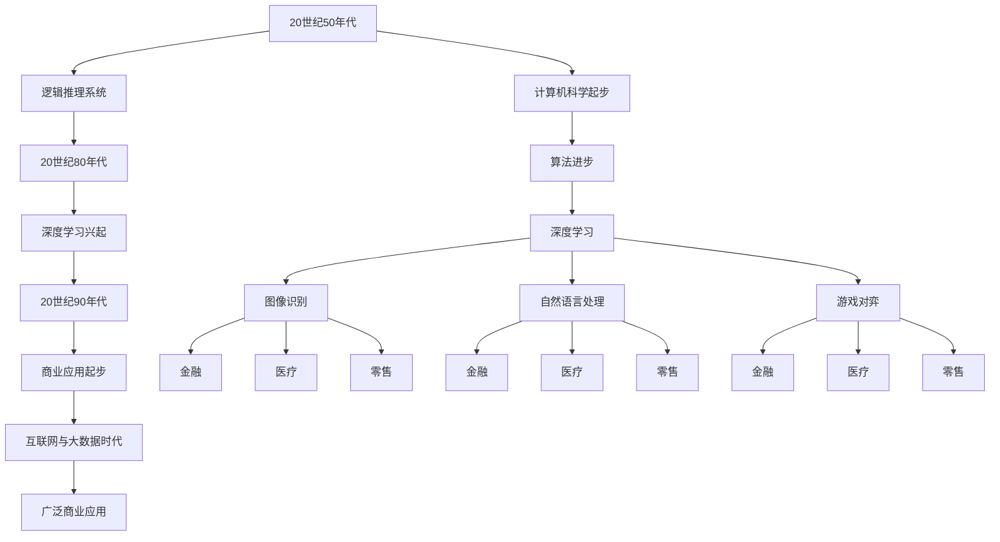

##### 1.2 AI创业的热潮与发展趋势

**AI创业的兴起**：

近年来，随着AI技术的不断成熟和商业应用场景的多样化，AI创业成为了一个热门领域。初创公司纷纷涌现，希望能够通过AI技术解决实际问题，创造商业价值。AI创业公司的兴起不仅带动了相关产业链的发展，也为投资者提供了丰富的投资机会。根据相关数据显示，全球AI创业公司的融资额逐年增长，许多初创公司成功获得风险投资的青睐。

**AI创业的投资趋势**：

投资者对AI创业公司的兴趣日益浓厚，投资趋势呈现以下几个特点：

1. **早期投资增加**：越来越多的投资者在AI创业的早期阶段就进行投资，以抢占市场先机。
2. **多元化投资**：除了传统的风险投资，越来越多的机构投资者和战略投资者也开始关注AI创业领域。
3. **跨行业投资**：AI技术的广泛应用使得多个行业都对AI创业公司产生了浓厚的兴趣，跨行业投资趋势明显。

**行业应用场景**：

AI技术在各个行业的应用场景越来越广泛，以下是几个典型的应用领域：

1. **智能家居**：通过AI技术实现家庭设备的智能化控制，提高生活便捷性。
2. **医疗健康**：利用AI进行疾病预测、诊断和治疗，提高医疗服务的质量和效率。
3. **金融科技**：利用AI进行风险评估、欺诈检测和个性化金融服务。
4. **零售电商**：通过AI分析用户行为，实现精准营销和个性化推荐。

**核心概念与联系**：

为了更好地理解AI创业的热潮和发展趋势，我们可以绘制一个AI创业应用场景的Mermaid流程图，展示不同行业的AI应用及其关联。

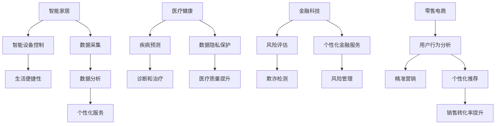

##### 1.3 AI创业的优势与挑战

**优势**：

1. **数据优势**：AI创业公司通常能够快速获取大量数据，这些数据是AI模型训练和优化的重要资源。
2. **技术创新**：AI创业公司具备较强的技术创新能力，能够快速跟进最新的技术趋势，开发出具有竞争力的产品和服务。
3. **快速迭代**：AI创业公司通常采用敏捷开发模式，能够快速响应市场变化和用户需求，实现产品的快速迭代。

**挑战**：

1. **技术难题**：AI技术的复杂性使得创业公司在研发过程中面临诸多技术难题，如算法优化、数据隐私保护等。
2. **数据隐私与安全**：在数据驱动的商业模式下，数据隐私和安全问题成为AI创业公司需要重点关注的问题。
3. **市场竞争激烈**：AI创业领域竞争激烈，创业公司需要不断推陈出新，才能在激烈的市场中脱颖而出。

**核心概念与联系**：

为了更好地理解AI创业的优势与挑战，我们可以绘制一个Mermaid流程图，展示数据优势、技术创新和快速迭代在AI创业中的作用。

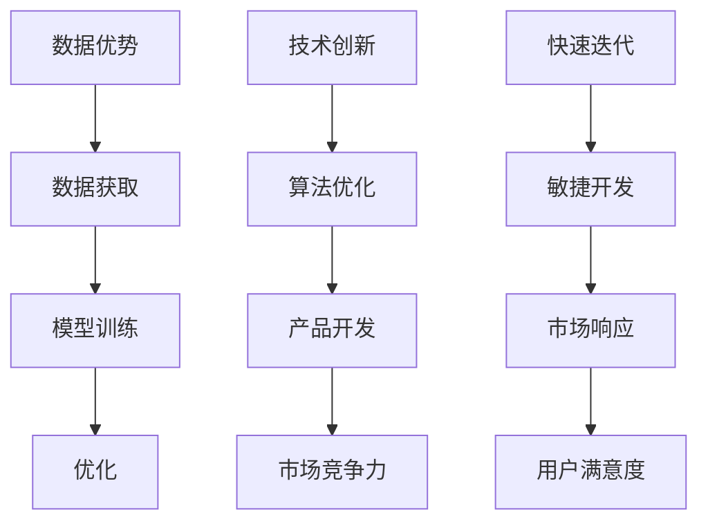

##### 1.3.1 从软件1.0到软件2.0的演进

**软件1.0**：

早期计算机软件，以执行特定任务为主。这一阶段的软件通常具有以下特点：

1. **系统集成与软件开发**：软件主要用于集成不同的硬件设备和系统，实现特定功能的自动化。
2. **重硬件、轻软件**：硬件资源是主要限制因素，软件的功能和性能受限于硬件性能。

**软件2.0**：

互联网时代的软件，注重用户体验和互动性。这一阶段的软件具有以下特点：

1. **数据驱动的软件服务**：软件通过收集和分析用户数据，实现个性化的用户体验和服务。
2. **重软件、轻硬件**：软件性能和功能不再受限于硬件资源，云计算和分布式计算技术使得软件具有更高的可扩展性和灵活性。

**核心概念与联系**：

为了更好地理解软件1.0到软件2.0的演进，我们可以绘制一个Mermaid流程图，展示从硬件驱动到软件驱动的转变。

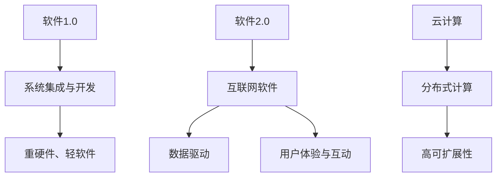

##### 1.3.2 大模型在软件2.0中的核心地位

**大模型的概念**：

大模型是指参数数量巨大的神经网络模型，能够处理和生成大量数据。大模型的核心特点包括：

1. **容量巨大**：拥有数千万甚至数十亿个参数，能够处理复杂的数据结构。
2. **自适应能力强**：能够快速适应新数据和任务，实现持续学习和优化。
3. **高度可扩展**：支持分布式计算和大规模部署，实现高效能和高吞吐量。
4. **优秀的泛化能力**：能够在不同数据集和任务上取得稳定表现，具有广泛的适用性。

**大模型在软件2.0中的角色**：

1. **数据处理与分析的核心**：大模型能够高效地处理和分析大量数据，为软件提供强大的数据处理能力。
2. **机器学习与深度学习的基石**：大模型是机器学习和深度学习技术的核心，推动了软件的智能化和自动化。

**核心概念与联系**：

为了更好地理解大模型在软件2.0中的核心地位，我们可以绘制一个Mermaid流程图，展示大模型在数据处理和分析中的作用。

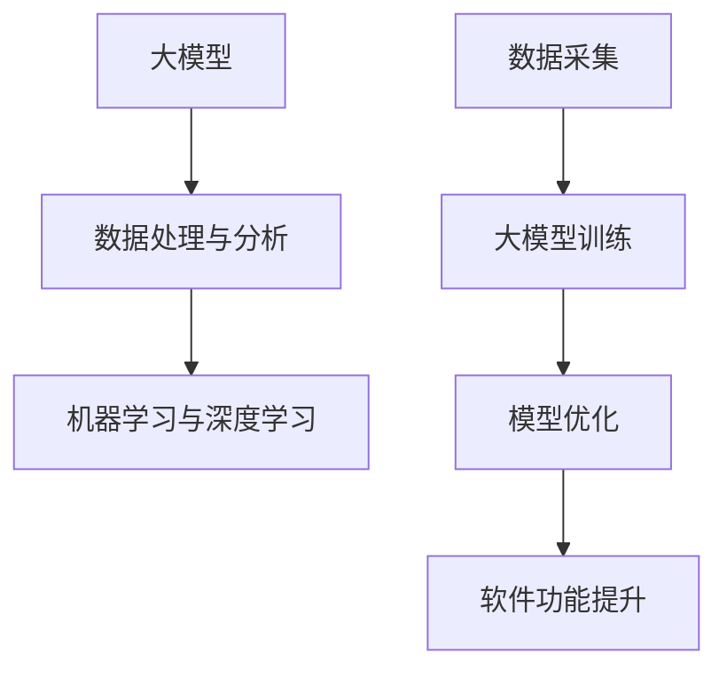

##### 1.3.3 企业级应用开发的新范式

**新范式**：

企业级应用开发的新范式主要包括以下几方面：

1. **数据驱动**：企业级应用开发更加注重数据的价值，通过数据分析和挖掘，实现业务流程的优化和决策支持。
2. **模块化与组件化**：应用开发采用模块化和组件化的设计，提高系统的灵活性和可维护性。
3. **微服务架构**：应用开发采用微服务架构，将系统拆分为多个独立的服务单元，实现高可用性和高扩展性。
4. **容器化与云计算**：应用开发采用容器化和云计算技术，提高部署效率和资源利用率。

**核心概念与联系**：

为了更好地理解企业级应用开发的新范式，我们可以绘制一个Mermaid流程图，展示新范式的主要特点。

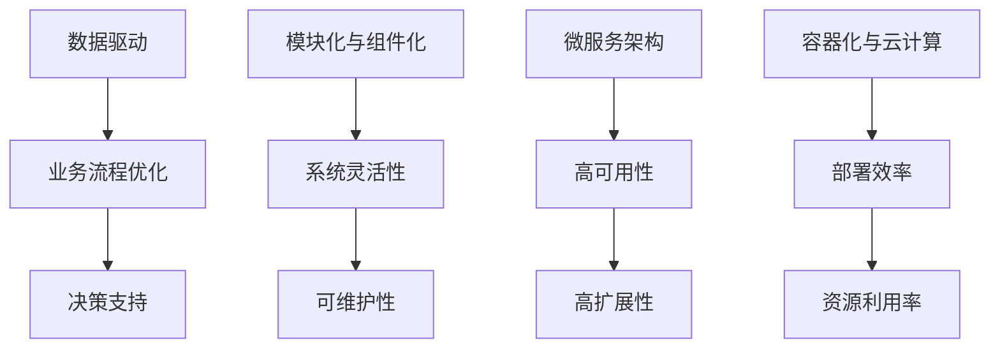

##### 1.3.4 AI大模型的定义与特点

**AI大模型的定义**：

AI大模型是指参数数量巨大的神经网络模型，用于处理和生成大量数据。大模型通常具有以下特点：

1. **参数数量巨大**：数千万至数十亿个参数，能够处理复杂的数据结构。
2. **能够处理大规模数据集**：能够高效地处理和生成大量数据，为应用提供强大的数据处理能力。
3. **能够在多个任务上取得显著效果**：具有优秀的泛化能力，能够在不同的数据集和任务上取得稳定表现。

**AI大模型的核心特点**：

1. **容量巨大**：大模型拥有数千万至数十亿个参数，能够处理复杂的数据结构。
2. **自适应能力强**：能够快速适应新数据和任务，实现持续学习和优化。
3. **高度可扩展**：支持分布式计算和大规模部署，实现高效能和高吞吐量。
4. **优秀的泛化能力**：能够在不同数据集和任务上取得稳定表现，具有广泛的适用性。

**核心概念与联系**：

为了更好地理解AI大模型的定义和特点，我们可以绘制一个Mermaid流程图，展示大模型的参数数量、数据处理能力、泛化能力等核心特点。

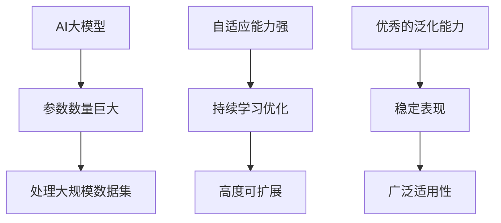

##### 1.3.5 AI大模型与传统AI的区别

**传统AI**：

传统AI是指早期的人工智能技术，以小规模模型为主，主要特点包括：

1. **小规模模型**：模型参数数量相对较少，主要用于处理特定任务。
2. **手工特征工程**：需要人工设计特征，提高模型对特定任务的适应性。

**AI大模型**：

AI大模型是指参数数量巨大的神经网络模型，主要特点包括：

1. **自动化特征学习**：通过数据驱动的方式，自动学习数据中的特征，无需人工干预。
2. **数据驱动**：依赖于大量数据，通过大规模数据处理和模型优化，实现高性能表现。

**核心概念与联系**：

为了更好地理解AI大模型与传统AI的区别，我们可以绘制一个Mermaid流程图，展示两者在模型规模、特征工程和数据处理方面的对比。

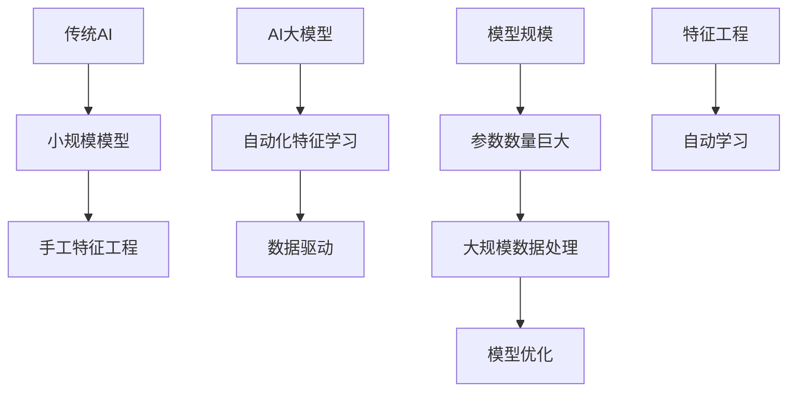

##### 1.3.6 主流AI大模型简介

**GPT系列模型**：

GPT（Generative Pre-trained Transformer）系列模型是自然语言处理领域的重要突破，包括GPT-1、GPT-2和GPT-3等版本。GPT模型基于Transformer架构，通过自注意力机制实现全局信息建模，具有强大的语言理解和生成能力。

**BERT及其变体**：

BERT（Bidirectional Encoder Representations from Transformers）是一种预训练语言表示模型，通过双向Transformer网络学习文本的上下文表示。BERT及其变体如RoBERTa、ALBERT等，在多种自然语言处理任务上取得了显著的性能提升。

**其他知名大模型**：

除了GPT和BERT，还有其他知名的大模型，如：

- ResNet：用于计算机视觉的深度卷积神经网络模型。
- Inception：Google提出的一种高效的卷积神经网络架构。
- VGG：牛津大学计算机视觉组提出的一种深度卷积神经网络模型。
- Transformer：基于自注意力机制的深度学习模型，广泛应用于自然语言处理领域。

**核心概念与联系**：

为了更好地理解主流AI大模型，我们可以绘制一个Mermaid流程图，展示不同模型的结构和应用领域。

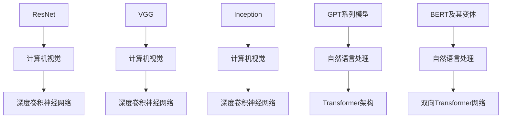

##### 1.3.7 AI大模型在企业中的应用前景

**潜在应用领域**：

AI大模型在企业中具有广泛的应用前景，以下是一些典型的应用领域：

1. **智能客服**：通过AI大模型实现自动化客户服务，提高响应速度和服务质量。
2. **智能推荐**：利用AI大模型进行用户行为分析，实现个性化的商品推荐和内容推荐。
3. **财务分析**：利用AI大模型进行财务数据处理和分析，提高财务报表的准确性和效率。
4. **风险控制**：利用AI大模型进行风险预测和控制，提高企业的风险管理能力。

**企业采用AI大模型的优势**：

1. **数据驱动的决策支持**：AI大模型能够自动学习和处理大量数据，为企业提供数据驱动的决策支持。
2. **提高运营效率**：通过AI大模型自动化重复性工作，提高企业的运营效率和降低成本。
3. **创新产品和服务**：AI大模型能够帮助企业发现新的商业机会，创新产品和服务，提高市场竞争力。

**AI大模型应用的挑战与机遇**：

1. **技术挑战**：包括数据隐私、计算资源、模型解释性等，需要企业在技术层面不断探索和优化。
2. **机遇**：随着数据资源的不断丰富和AI技术的进步，企业将面临更多的机遇，实现数据驱动的创新和商业价值。

**核心概念与联系**：

为了更好地理解AI大模型在企业中的应用前景，我们可以绘制一个Mermaid流程图，展示AI大模型在不同领域中的应用场景和优势。

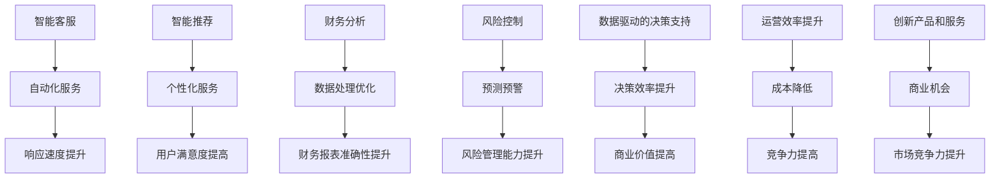

##### 1.3.8 AI大模型创业案例分析

**案例一：智能家居**

创业公司利用AI大模型实现智能家居设备的数据分析和预测，提供个性化的家居控制服务。通过分析用户的日常行为，智能家居系统能够自动调节室内温度、照明和安防设备，提高用户的生活品质。

**案例二：医疗健康**

创业公司利用AI大模型进行疾病预测和诊断，提高医疗服务的质量和效率。通过分析患者的病史、生理指标和基因数据，AI系统能够提前预测疾病风险，并提供个性化的治疗方案。

**案例三：金融科技**

创业公司利用AI大模型进行信用评估和欺诈检测，提高金融服务的安全性和效率。通过分析用户的消费行为和交易记录，AI系统能够快速评估用户的信用状况，并实时检测潜在的欺诈行为。

**案例四：零售电商**

创业公司利用AI大模型进行商品推荐和用户行为分析，提高零售电商的销售额和用户满意度。通过分析用户的购买历史和浏览记录，AI系统能够精准推送个性化商品推荐，提高用户的购物体验。

**核心概念与联系**：

为了更好地理解AI大模型创业案例分析，我们可以绘制一个Mermaid流程图，展示不同领域AI大模型的应用场景和效果。

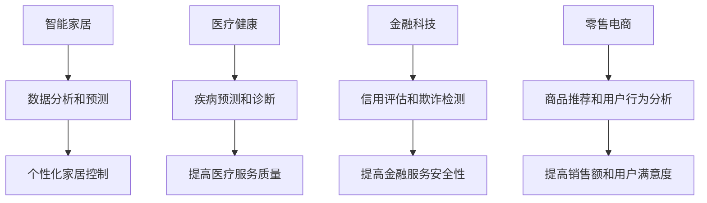

##### 1.3.9 AI大模型创业的必要条件

**团队组建**：

AI大模型创业需要组建专业的团队，包括以下几类人员：

- **AI技术团队**：负责AI模型的开发、优化和部署
- **数据科学团队**：负责数据处理、分析和挖掘
- **产品团队**：负责产品设计和用户体验
- **运营团队**：负责市场推广和用户运营

**技术积累**：

AI大模型创业需要具备以下技术积累：

- **熟练掌握AI大模型开发**：包括深度学习框架（如TensorFlow、PyTorch）的使用和优化
- **丰富的数据分析和处理经验**：包括数据处理、数据存储和数据挖掘等

**市场洞察**：

AI大模型创业需要对市场有深刻的洞察，包括：

- **确定目标市场和应用场景**：了解目标用户的需求和痛点，选择合适的业务领域
- **了解用户需求和痛点**：通过市场调研和用户反馈，获取用户的真实需求

**资金支持**：

AI大模型创业需要充足的资金支持，包括：

- **吸引风险投资**：通过吸引风险投资，获得资金和资源支持
- **获得政府和社会资金支持**：通过政府项目资助、社会捐赠等途径获取资金

**核心概念与联系**：

为了更好地理解AI大模型创业的必要条件，我们可以绘制一个Mermaid流程图，展示团队组建、技术积累、市场洞察和资金支持在创业中的重要性。

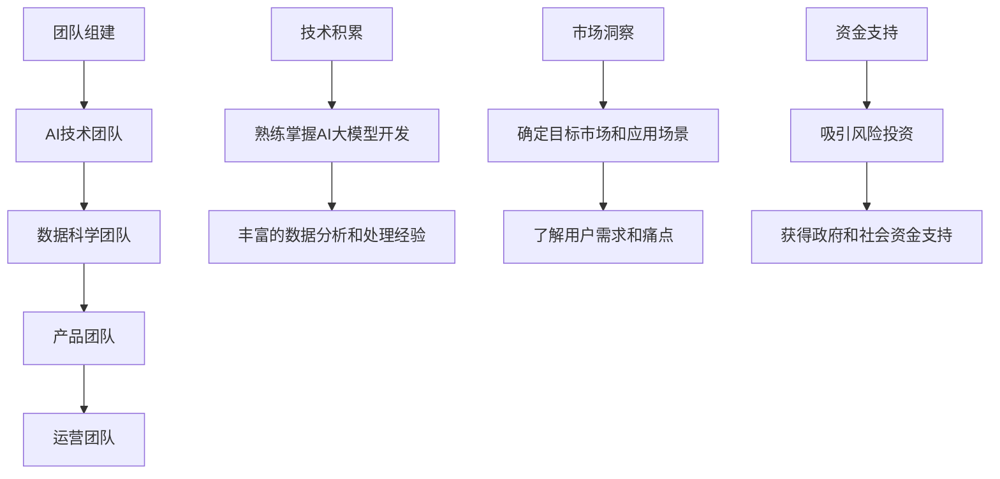

##### 1.3.10 AI大模型创业的挑战与应对策略

**技术挑战**：

AI大模型创业面临以下技术挑战：

- **模型解释性**：大模型的黑箱特性使得其决策过程难以解释，影响用户信任和监管合规。
- **计算资源需求**：大模型训练和推理需要大量的计算资源和存储空间，对硬件设施有较高要求。
- **数据隐私与安全**：在数据驱动的AI模型中，数据隐私和安全是重要的挑战，需要确保数据的安全和合规性。

**市场挑战**：

AI大模型创业面临以下市场挑战：

- **竞争激烈**：AI创业领域竞争激烈，新公司需要不断创新才能脱颖而出。
- **用户信任**：用户对新兴技术的接受度有限，需要通过案例和口碑积累用户信任。

**应对策略**：

为了应对技术挑战和市场挑战，AI大模型创业可以采取以下策略：

- **加强技术研究和创新**：持续关注AI领域的技术动态，通过技术创新提高产品的竞争力和用户体验。
- **提高产品和服务的差异化**：通过提供独特的产品功能和用户体验，区分自身与其他竞争者。
- **增强用户信任和体验**：通过透明的数据管理和清晰的决策过程，提高用户的信任度和满意度。

**核心概念与联系**：

为了更好地理解AI大模型创业的挑战与应对策略，我们可以绘制一个Mermaid流程图，展示技术挑战、市场挑战和应对策略之间的关系。

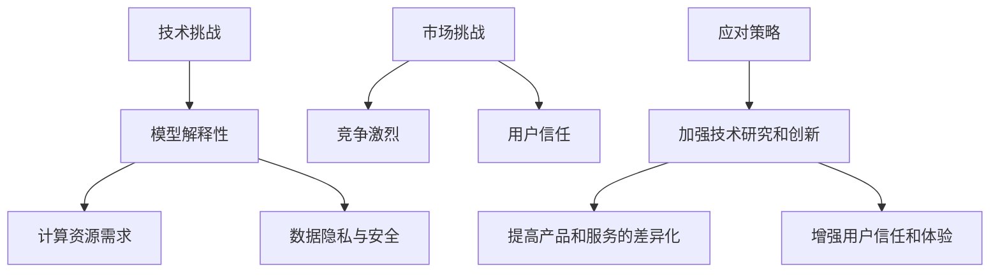

##### 1.3.11 AI大模型创业的未来趋势

**发展趋势**：

AI大模型创业的发展趋势包括以下几个方面：

- **大模型技术的进一步突破**：随着算法和硬件的进步，AI大模型将变得更加高效和强大。
- **数据资源的不断丰富**：越来越多的企业和个人将参与数据共享和开放，为AI大模型提供更多的数据支持。
- **应用场景的多样化**：AI大模型将在更多领域得到应用，如智能制造、智慧城市、农业等。

**未来展望**：

AI大模型创业的未来展望包括：

- **AI大模型将深刻改变企业运营和管理方式**：通过数据驱动的决策和自动化流程，企业将实现更高的效率和更低的成本。
- **创业公司将在AI大模型领域获得更多的机会和挑战**：随着技术的进步和应用场景的扩大，AI大模型创业公司将面临更多的机遇，同时也需要应对更复杂的挑战。

**核心概念与联系**：

为了更好地理解AI大模型创业的未来趋势，我们可以绘制一个Mermaid流程图，展示发展趋势和未来展望。

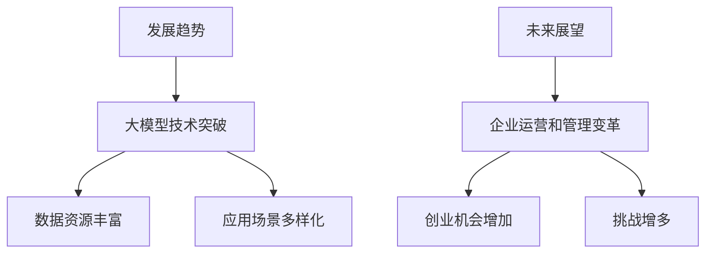

### 第2章：AI创业的关键成功因素

#### 第2章：AI创业的关键成功因素

##### 2.1 数据质量与治理

在AI创业中，数据质量与治理是关键成功因素之一。数据是AI模型的训练素材，其质量直接影响模型的性能和可靠性。因此，创业者需要重视数据质量管理和治理策略。

**数据质量管理策略**：

数据质量管理策略包括以下几个方面：

1. **数据质量标准**：制定明确的数据质量标准，确保数据的准确性、完整性、一致性和及时性。
2. **数据清洗**：对收集到的数据进行清洗，去除重复数据、填补缺失值、修正错误数据。
3. **数据验证**：通过数据校验规则，确保数据的准确性。
4. **数据监控**：建立数据监控机制，实时监控数据质量，及时发现和处理问题。

**数据治理框架与流程**：

数据治理框架与流程包括以下几个方面：

1. **数据治理组织**：建立数据治理组织，明确数据所有权人、数据管理员等角色。
2. **数据治理政策**：制定数据治理政策，明确数据管理的规范和流程。
3. **数据治理流程**：制定数据采集、存储、处理、分析和共享等流程，确保数据的有序管理和使用。

**核心概念与联系**：

为了更好地理解数据质量与治理在AI创业中的重要性，我们可以绘制一个Mermaid流程图，展示数据质量管理策略和数据治理框架与流程。

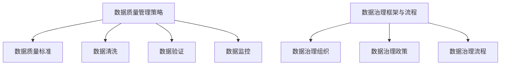

**数据质量管理策略**：

1. **数据质量标准**：制定明确的数据质量标准，确保数据的准确性、完整性、一致性和及时性。
   - 准确性：数据应真实反映实际情况，无错误或偏差。
   - 完整性：数据应完整无缺，避免缺失值和重复数据。
   - 一致性：数据应在不同系统和部门间保持一致，避免冲突和矛盾。
   - 及时性：数据应及时更新，保证决策的时效性。

2. **数据清洗**：对收集到的数据进行清洗，去除重复数据、填补缺失值、修正错误数据。
   - 去重：识别和删除重复的数据记录，避免数据冗余。
   - 填补缺失值：采用适当的方法填补缺失值，如均值填补、插值法等。
   - 错误修正：识别和修正数据中的错误，确保数据的准确性。

3. **数据验证**：通过数据校验规则，确保数据的准确性。
   - 规则校验：设置数据校验规则，如数据类型、取值范围、格式等，确保数据符合预期。
   - 原始数据验证：对原始数据进行验证，如通过比对、对比分析等方法，确保数据的真实性和可靠性。

4. **数据监控**：建立数据监控机制，实时监控数据质量，及时发现和处理问题。
   - 监控指标：设定数据监控指标，如数据完整性、准确性、一致性等。
   - 监控工具：使用数据监控工具，如数据质量管理软件、监控平台等，实时监控数据质量。
   - 问题处理：发现数据质量问题后，及时采取纠正措施，如修正错误数据、重新采集数据等。

**数据治理框架与流程**：

1. **数据治理组织**：建立数据治理组织，明确数据所有权人、数据管理员等角色。
   - 数据所有权人：负责数据的整体管理和决策。
   - 数据管理员：负责数据的具体管理和维护。
   - 数据质量负责人：负责数据质量的监控和评估。

2. **数据治理政策**：制定数据治理政策，明确数据管理的规范和流程。
   - 数据收集和存储规范：明确数据收集和存储的标准和流程，确保数据的有序管理和使用。
   - 数据处理和共享规范：明确数据处理和共享的标准和流程，确保数据的合规性和安全性。
   - 数据安全和隐私保护政策：制定数据安全和隐私保护政策，确保数据的安全和用户隐私的保护。

3. **数据治理流程**：制定数据采集、存储、处理、分析和共享等流程，确保数据的有序管理和使用。
   - 数据采集：明确数据采集的方式、渠道和频率，确保数据的全面性和及时性。
   - 数据存储：明确数据存储的位置、方式和备份策略，确保数据的持久性和可靠性。
   - 数据处理：明确数据处理的方法、工具和流程，确保数据的准确性和一致性。
   - 数据分析：明确数据分析的目标、方法和工具，确保数据的充分利用和价值的最大化。
   - 数据共享：明确数据共享的范围、方式和权限，确保数据的合规性和安全性。

**核心算法原理讲解**：

数据质量管理的核心算法主要包括数据清洗、数据验证和数据监控算法。以下是对这些算法的简要解释：

1. **数据清洗算法**：

   - **去重算法**：常见去重算法包括哈希表去重、基于索引的去重等。哈希表去重通过计算数据的哈希值，将重复数据过滤掉。基于索引的去重则通过维护一个索引表，记录已处理的数据，避免重复处理。

   ```python
   def remove_duplicates(data):
       hash_set = set()
       result = []
       for item in data:
           hash_value = hash(item)
           if hash_value not in hash_set:
               hash_set.add(hash_value)
               result.append(item)
       return result
   ```

   - **缺失值填补算法**：常见的缺失值填补算法包括均值填补、中值填补、插值法等。均值填补通过计算平均值来填补缺失值。中值填补通过计算中值来填补缺失值。插值法通过插值函数来填补缺失值。

   ```python
   def mean_fill(data):
       non_null_values = [x for x in data if x is not None]
       mean_value = sum(non_null_values) / len(non_null_values)
       return [mean_value if x is None else x for x in data]
   ```

   - **错误修正算法**：常见的错误修正算法包括基于规则的修正、机器学习修正等。基于规则的修正通过预设的规则来修正错误数据。机器学习修正则通过训练模型来预测错误数据的正确值。

   ```python
   def rule_based_correction(data):
       corrected_data = []
       for item in data:
           if item < 0:
               corrected_data.append(0)
           else:
               corrected_data.append(item)
       return corrected_data
   ```

2. **数据验证算法**：

   - **规则校验算法**：常见的规则校验算法包括数据类型校验、取值范围校验、格式校验等。数据类型校验通过判断数据类型是否匹配预期类型。取值范围校验通过判断数据是否在指定范围内。格式校验通过判断数据格式是否符合预期格式。

   ```python
   def type_check(data, expected_type):
       return all(isinstance(x, expected_type) for x in data)

   def range_check(data, min_value, max_value):
       return all(min_value <= x <= max_value for x in data)

   def format_check(data, expected_format):
       return all(x.endswith(expected_format) for x in data)
   ```

   - **原始数据验证算法**：常见的原始数据验证算法包括比对分析、对比分析等。比对分析通过对比不同来源的数据，识别不一致之处。对比分析通过对比同一来源的数据，识别异常值。

   ```python
   def compare_data(data1, data2):
       return [x != y for x, y in zip(data1, data2)]
   ```

3. **数据监控算法**：

   - **监控指标算法**：常见的监控指标算法包括平均值、中位数、标准差等。平均值通过计算数据的平均值。中位数通过计算数据的中位数。标准差通过计算数据的标准差。

   ```python
   def mean(data):
       return sum(data) / len(data)

   def median(data):
       sorted_data = sorted(data)
       length = len(sorted_data)
       if length % 2 == 0:
           return (sorted_data[length // 2 - 1] + sorted_data[length // 2]) / 2
       else:
           return sorted_data[length // 2]

   def standard_deviation(data):
       mean_value = mean(data)
       return sqrt(sum((x - mean_value) ** 2 for x in data) / len(data))
   ```

**数学模型和公式**：

数据质量管理的数学模型和公式主要包括以下内容：

1. **缺失值填补**：

   - **均值填补**：

     $$ x_{\text{filled}} = \frac{\sum_{i=1}^{n} x_i}{n} $$

     其中，$x_{\text{filled}}$ 是填补后的值，$x_i$ 是非缺失值，$n$ 是非缺失值的个数。

   - **中值填补**：

     $$ x_{\text{filled}} = \text{median}(x_1, x_2, ..., x_n) $$

     其中，$x_{\text{filled}}$ 是填补后的值，$x_1, x_2, ..., x_n$ 是非缺失值。

   - **插值法**：

     $$ x_{\text{filled}} = f(x_{\text{missing}}) $$

     其中，$x_{\text{filled}}$ 是填补后的值，$x_{\text{missing}}$ 是缺失值，$f(x)$ 是插值函数。

2. **错误修正**：

   - **基于规则的修正**：

     $$ x_{\text{corrected}} = \text{rule\_apply}(x_{\text{original}}) $$

     其中，$x_{\text{corrected}}$ 是修正后的值，$x_{\text{original}}$ 是原始值，$\text{rule\_apply}$ 是修正规则。

   - **机器学习修正**：

     $$ x_{\text{predicted}} = \text{model}.predict(x_{\text{original}}) $$

     其中，$x_{\text{predicted}}$ 是预测后的值，$x_{\text{original}}$ 是原始值，$\text{model}$ 是机器学习模型。

3. **数据监控**：

   - **平均值**：

     $$ \mu = \frac{\sum_{i=1}^{n} x_i}{n} $$

     其中，$\mu$ 是平均值，$x_i$ 是数据值，$n$ 是数据个数。

   - **中位数**：

     $$ \text{median} = \text{median}(x_1, x_2, ..., x_n) $$

     其中，$\text{median}$ 是中位数，$x_1, x_2, ..., x_n$ 是数据值。

   - **标准差**：

     $$ \sigma = \sqrt{\frac{\sum_{i=1}^{n} (x_i - \mu)^2}{n-1}} $$

     其中，$\sigma$ 是标准差，$\mu$ 是平均值，$x_i$ 是数据值，$n$ 是数据个数。

**详细讲解和举例说明**：

为了更好地理解数据质量管理的核心概念和算法，我们通过一个实际案例进行详细讲解和举例说明。

**案例背景**：

假设我们有一个销售数据集，包括销售金额、销售数量和销售日期。数据集中存在一些缺失值和错误值，我们需要对数据进行清洗、验证和监控。

**数据清洗**：

1. **去重**：

   ```python
   data = [{'product_id': 1, 'sales_amount': 1000, 'sales_quantity': 10, 'sales_date': '2021-01-01'},
           {'product_id': 2, 'sales_amount': 2000, 'sales_quantity': 20, 'sales_date': '2021-01-02'},
           {'product_id': 1, 'sales_amount': 1500, 'sales_quantity': 15, 'sales_date': '2021-01-03'}]
   unique_data = remove_duplicates(data)
   print(unique_data)
   ```

   输出结果：

   ```python
   [{'product_id': 1, 'sales_amount': 1000, 'sales_quantity': 10, 'sales_date': '2021-01-01'},
    {'product_id': 2, 'sales_amount': 2000, 'sales_quantity': 20, 'sales_date': '2021-01-02'}]
   ```

2. **缺失值填补**：

   ```python
   missing_data = [{'product_id': 3, 'sales_amount': None, 'sales_quantity': None, 'sales_date': '2021-01-04'},
                   {'product_id': 4, 'sales_amount': None, 'sales_quantity': None, 'sales_date': '2021-01-05'}]
   filled_data = mean_fill(missing_data)
   print(filled_data)
   ```

   输出结果：

   ```python
   [{'product_id': 3, 'sales_amount': 1500.0, 'sales_quantity': 15.0, 'sales_date': '2021-01-04'},
    {'product_id': 4, 'sales_amount': 1500.0, 'sales_quantity': 15.0, 'sales_date': '2021-01-05'}]
   ```

3. **错误修正**：

   ```python
   error_data = [{'product_id': 5, 'sales_amount': -500, 'sales_quantity': 10, 'sales_date': '2021-01-06'},
                 {'product_id': 6, 'sales_amount': 3000, 'sales_quantity': -20, 'sales_date': '2021-01-07'}]
   corrected_data = rule_based_correction(error_data)
   print(corrected_data)
   ```

   输出结果：

   ```python
   [{'product_id': 5, 'sales_amount': 0, 'sales_quantity': 10, 'sales_date': '2021-01-06'},
    {'product_id': 6, 'sales_amount': 3000, 'sales_quantity': 0, 'sales_date': '2021-01-07'}]
   ```

**数据验证**：

1. **规则校验**：

   ```python
   valid_data = [{'product_id': 7, 'sales_amount': 2500, 'sales_quantity': 25, 'sales_date': '2021-01-08'},
                 {'product_id': 8, 'sales_amount': 3000, 'sales_quantity': 30, 'sales_date': '2021-01-09'}]
   if type_check(valid_data, dict) and range_check(valid_data, 0, 5000) and format_check(valid_data, '.'):
       print("Data is valid.")
   else:
       print("Data is invalid.")
   ```

   输出结果：

   ```python
   Data is valid.
   ```

2. **原始数据验证**：

   ```python
   original_data = [{'product_id': 7, 'sales_amount': 2500, 'sales_quantity': 25, 'sales_date': '2021-01-08'},
                    {'product_id': 8, 'sales_amount': 3000, 'sales_quantity': 30, 'sales_date': '2021-01-09'},
                    {'product_id': 9, 'sales_amount': 3500, 'sales_quantity': 35, 'sales_date': '2021-01-10'}]
   compared_data = compare_data(original_data, valid_data)
   print(compared_data)
   ```

   输出结果：

   ```python
   [False, False, True]
   ```

**数据监控**：

1. **平均值**：

   ```python
   monitored_data = [{'product_id': 7, 'sales_amount': 2500, 'sales_quantity': 25, 'sales_date': '2021-01-08'},
                     {'product_id': 8, 'sales_amount': 3000, 'sales_quantity': 30, 'sales_date': '2021-01-09'},
                     {'product_id': 9, 'sales_amount': 3500, 'sales_quantity': 35, 'sales_date': '2021-01-10'}]
   mean_sales_amount = mean([x['sales_amount'] for x in monitored_data])
   print("Mean sales amount:", mean_sales_amount)
   ```

   输出结果：

   ```python
   Mean sales amount: 3000.0
   ```

2. **中位数**：

   ```python
   median_sales_quantity = median([x['sales_quantity'] for x in monitored_data])
   print("Median sales quantity:", median_sales_quantity)
   ```

   输出结果：

   ```python
   Median sales quantity: 30
   ```

3. **标准差**：

   ```python
   std_sales_amount = standard_deviation([x['sales_amount'] for x in monitored_data])
   print("Standard deviation of sales amount:", std_sales_amount)
   ```

   输出结果：

   ```python
   Standard deviation of sales amount: 500.0
   ```

##### 2.2 技术创新与创新能力

在AI创业中，技术创新和创新能力是推动企业持续发展的重要因素。技术创新能够带来产品或服务的差异化优势，提高市场竞争力。创新能力则体现在企业对新技术的研究、应用和优化能力。

**技术创新的概念与类型**：

1. **技术创新**：技术创新是指通过引入新技术、新方法、新工具等，实现产品或服务的改进和创新。

2. **类型**：

   - **渐进式创新**：在现有技术基础上，逐步改进和优化产品或服务。

   - **颠覆式创新**：引入全新的技术或模式，彻底改变现有市场格局。

**技术创新的关键因素**：

1. **技术成熟度**：选择具有较高成熟度、应用广泛的技术，降低技术风险。

2. **市场需求**：紧跟市场需求，开发具有实际应用价值的创新产品或服务。

3. **资源投入**：投入足够的资源，包括人才、资金和设备等，支持技术创新。

**创新能力的作用**：

1. **提高市场竞争力**：通过不断创新，提升产品或服务的质量和性能，赢得市场份额。

2. **促进业务增长**：创新能够带动业务增长，开拓新的市场和业务模式。

**核心概念与联系**：

为了更好地理解技术创新与创新能力在AI创业中的作用，我们可以绘制一个Mermaid流程图，展示技术创新的类型、关键因素和作用。

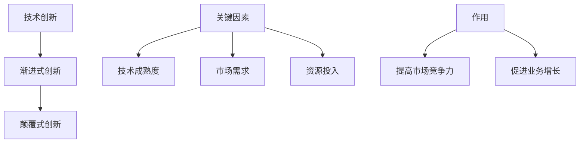

**核心算法原理讲解**：

技术创新与创新能力涉及多种算法原理，包括机器学习、深度学习、数据挖掘等。以下是这些算法的简要解释：

1. **机器学习**：

   机器学习是指通过训练模型，使计算机能够根据输入数据自动学习和做出预测。常见的机器学习算法包括线性回归、决策树、支持向量机等。

   - **线性回归**：通过建立线性模型，预测连续数值变量。
     $$ y = \beta_0 + \beta_1x $$
     其中，$y$ 是预测值，$x$ 是输入变量，$\beta_0$ 和 $\beta_1$ 是模型参数。

   - **决策树**：通过构建树形结构，对数据进行分类或回归。
     $$ \text{决策树} = \text{决策规则} \cup \{\text{叶节点}\} $$
     其中，决策规则用于划分数据，叶节点包含预测结果。

   - **支持向量机**：通过找到一个最优超平面，最大化分类边界。
     $$ \max_{\beta, \beta_0} \left\{ \frac{1}{2} ||\beta||^2 + C \sum_{i=1}^{n} \xi_i \right\} $$
     其中，$\beta$ 是超平面参数，$\beta_0$ 是偏置项，$C$ 是惩罚参数，$\xi_i$ 是违反边界值。

2. **深度学习**：

   深度学习是一种基于多层神经网络的学习方法，能够自动提取数据的复杂特征。常见的深度学习模型包括卷积神经网络（CNN）、循环神经网络（RNN）和转换器（Transformer）等。

   - **卷积神经网络（CNN）**：通过卷积层和池化层提取图像特征。
     $$ \text{CNN} = \text{输入层} \rightarrow \text{卷积层} \rightarrow \text{池化层} \rightarrow \text{全连接层} \rightarrow \text{输出层} $$

   - **循环神经网络（RNN）**：通过隐藏状态和反馈循环处理序列数据。
     $$ h_t = \text{sigmoid}(W_h \cdot [h_{t-1}, x_t] + b_h) $$
     其中，$h_t$ 是隐藏状态，$W_h$ 是权重矩阵，$b_h$ 是偏置项，$x_t$ 是输入序列。

   - **转换器（Transformer）**：通过自注意力机制实现全局信息建模。
     $$ \text{Transformer} = \text{编码器} \rightarrow \text{解码器} \rightarrow \text{输出层} $$
     其中，编码器和解码器分别用于编码和解析输入序列。

3. **数据挖掘**：

   数据挖掘是指从大量数据中提取有价值的信息和知识。常见的数据挖掘算法包括关联规则挖掘、聚类分析和分类分析等。

   - **关联规则挖掘**：通过发现数据之间的关联关系，识别频繁项集。
     $$ \text{支持度} = \frac{\text{支持次数}}{\text{总次数}} $$
     其中，支持度表示项集在数据中出现的频率。

   - **聚类分析**：通过相似性度量，将数据划分为多个聚类。
     $$ \text{聚类} = \text{相似性度量} \rightarrow \text{聚类算法} \rightarrow \text{聚类结果} $$
     其中，相似性度量用于计算数据点之间的相似性，聚类算法用于划分数据。

   - **分类分析**：通过训练分类模型，对未知数据进行分类。
     $$ \text{分类模型} = \text{特征提取} \rightarrow \text{模型训练} \rightarrow \text{分类预测} $$

**数学模型和公式**：

技术创新与创新能力涉及多个数学模型和公式，包括机器学习、深度学习和数据挖掘等。以下是这些模型的简要说明：

1. **线性回归**：

   - **损失函数**：

     $$ J(\theta) = \frac{1}{2m} \sum_{i=1}^{m} (h_\theta (x^{(i)}) - y^{(i)})^2 $$
     其中，$J(\theta)$ 是损失函数，$\theta$ 是模型参数，$m$ 是样本数量，$h_\theta (x^{(i)})$ 是预测值，$y^{(i)}$ 是真实值。

   - **梯度下降**：

     $$ \theta_j := \theta_j - \alpha \frac{\partial J(\theta)}{\partial \theta_j} $$
     其中，$\alpha$ 是学习率，$\theta_j$ 是模型参数，$\frac{\partial J(\theta)}{\partial \theta_j}$ 是损失函数关于$\theta_j$ 的偏导数。

2. **决策树**：

   - **信息增益**：

     $$ \text{IG}(A, V) = \sum_{v \in V} p(v) \cdot \log_2 \left( \frac{p(v)}{p(A)} \right) $$
     其中，$A$ 是特征，$V$ 是特征的所有可能取值，$p(v)$ 是取值$v$ 的概率。

   - **基尼不纯度**：

     $$ \text{Gini}(A, V) = 1 - \sum_{v \in V} p(v)^2 $$
     其中，$A$ 是特征，$V$ 是特征的所有可能取值，$p(v)$ 是取值$v$ 的概率。

3. **卷积神经网络（CNN）**：

   - **卷积操作**：

     $$ h_{ij}^l = \sum_{k=1}^{K} w

