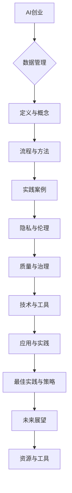

                 

### 文章标题

《AI创业：数据管理的挑战》

> 关键词：AI创业，数据管理，挑战，实践，方法论

摘要：
本文深入探讨了AI创业过程中数据管理的挑战与机遇。通过对AI创业背景、数据管理基础、AI创业中的数据管理挑战以及数据管理实践等方面的详细分析，本文旨在帮助创业者理解数据管理在AI项目中的重要性，掌握数据管理的核心技能，并找到有效的解决方案。文章通过具体案例展示了数据管理在电商和金融行业的应用，提供了实用的最佳实践与策略，为AI创业提供了有力的理论支持和实践指导。

### 目录大纲设计

#### 第一部分：引入与概述

- **第1章：AI创业概述**
  - 1.1 AI创业的背景与意义
  - 1.2 AI创业的现状与挑战
  - 1.3 本书的目的与结构

#### 第二部分：数据管理基础

- **第2章：数据管理基本概念**
  - 2.1 数据的定义与类型
  - 2.2 数据管理的重要性
  - 2.3 数据管理的关键要素

- **第3章：数据管理流程与方法**
  - 3.1 数据采集
  - 3.2 数据存储
  - 3.3 数据处理
  - 3.4 数据分析

- **第4章：数据管理实践案例**
  - 4.1 数据管理实践概述
  - 4.2 案例一：电商平台的数据管理实践
  - 4.3 案例二：金融行业的数据管理实践

#### 第三部分：AI创业中的数据管理挑战

- **第5章：数据隐私与伦理问题**
  - 5.1 数据隐私的重要性
  - 5.2 数据伦理问题

- **第6章：数据质量和数据治理**
  - 6.1 数据质量的概念
  - 6.2 数据治理的框架

- **第7章：数据管理技术与工具**
  - 7.1 数据管理技术
  - 7.2 数据管理工具

#### 第四部分：AI创业中的数据管理实践

- **第8章：数据管理在AI项目中的应用**
  - 8.1 数据管理在AI项目中的关键角色
  - 8.2 数据管理在AI项目中的实践

- **第9章：数据管理最佳实践与策略**
  - 9.1 数据管理最佳实践
  - 9.2 数据管理策略

- **第10章：未来展望与趋势**
  - 10.1 数据管理技术的发展趋势
  - 10.2 AI创业中的数据管理未来

#### 附录

- **附录A：数据管理相关资源与工具**
- **附录B：参考文献**

### Mermaid 流程图



### 数据处理伪代码

```python
def processData(dataSet):
    # 数据清洗
    cleanData = removeNullValues(dataSet)
    cleanData = removeDuplicates(cleanData)

    # 数据转换
    transformedData = convertToStandardFormat(cleanData)

    # 数据聚合
    aggregatedData = aggregateData(transformedData, criteria)

    return aggregatedData
```

### 数据管理的数学公式

$$
Q = \frac{1}{n} \sum_{i=1}^{n} (x_i - \bar{x})^2
$$

### 数据管理实践案例

#### 电商平台数据管理实践

- **数据采集**：通过API接口从用户行为数据、交易数据等渠道收集数据。
- **数据存储**：使用MySQL数据库存储用户数据，使用Hadoop HDFS存储日志数据。
- **数据处理**：使用ETL工具对采集到的数据进行清洗、转换和聚合。
- **数据分析**：使用Python和SQL对处理后的数据进行统计分析，发现用户行为模式。
- **模型训练**：基于用户行为数据训练推荐算法，实现个性化推荐。

#### 金融行业数据管理实践

- **数据采集**：通过API接口从客户交易记录、风险控制数据等渠道收集数据。
- **数据存储**：使用Oracle数据库存储客户数据，使用Google BigQuery存储交易数据。
- **数据处理**：使用Apache Spark进行大规模数据处理，实现实时数据流处理。
- **数据分析**：使用R语言进行风险分析和客户行为分析，为风险控制提供数据支持。
- **模型训练**：基于风险数据和客户行为数据训练信用评分模型，提高贷款审批效率。

### 文章标题：AI创业：数据管理的挑战

> 关键词：AI创业，数据管理，挑战，实践，方法论

摘要：
本文深入探讨了AI创业过程中数据管理的挑战与机遇。通过对AI创业背景、数据管理基础、AI创业中的数据管理挑战以及数据管理实践等方面的详细分析，本文旨在帮助创业者理解数据管理在AI项目中的重要性，掌握数据管理的核心技能，并找到有效的解决方案。文章通过具体案例展示了数据管理在电商和金融行业的应用，提供了实用的最佳实践与策略，为AI创业提供了有力的理论支持和实践指导。文章分为四个部分：引入与概述、数据管理基础、AI创业中的数据管理挑战和数据管理实践。每个部分都涵盖了相关的核心概念、方法和实践，旨在为读者提供全面的视角和深入的理解。通过本文，读者将能够更好地把握数据管理的本质，应对AI创业中的挑战，实现数据驱动的创新与发展。

---

#### 第一部分：引入与概述

##### 第1章：AI创业概述

###### 1.1 AI创业的背景与意义

AI创业在全球范围内正成为一种热门趋势。随着人工智能技术的不断成熟和应用场景的拓宽，越来越多的创业者投身于AI领域，希望通过创新的技术和商业模型来改变世界。那么，AI创业的背景究竟是什么呢？

首先，全球科技发展迅速，人工智能技术的突破为创业提供了新的机遇。从深度学习、自然语言处理到计算机视觉，人工智能技术在各个领域展现出了巨大的潜力。这些技术的快速发展不仅推动了产业升级，也为创业带来了新的灵感。

其次，人工智能在行业中的应用趋势日益明显。在医疗健康、金融、教育、零售等行业，人工智能技术正在改变传统的业务模式，提高效率，降低成本，创造新的价值。例如，医疗领域的AI诊断系统、金融领域的智能投顾、教育领域的在线教育平台等，都是AI技术应用的典范。

此外，政策和市场的推动也为AI创业提供了有利条件。许多国家和地区政府出台了鼓励创新的政策，为创业者提供了资金、人才和技术支持。同时，市场的需求也在不断增长，消费者对智能化产品和服务的需求日益旺盛，这为AI创业公司提供了广阔的市场空间。

在了解了AI创业的背景之后，我们再来看一下AI创业的意义。AI创业不仅能够推动产业升级，提升企业竞争力，还能带动经济增长，促进社会进步。具体来说，AI创业的意义主要体现在以下几个方面：

1. **产业升级**：AI技术可以提升传统产业的效率，推动产业智能化转型。例如，通过人工智能技术，制造业可以实现自动化、智能化生产，提高生产效率和产品质量。

2. **创新经济模式**：AI技术可以创造新的商业模式，推动经济增长。例如，共享经济、电子商务等新型商业模式，都离不开人工智能技术的支持。

3. **提升企业竞争力**：通过人工智能技术，企业可以更好地理解客户需求，优化产品设计，提高市场竞争力。例如，智能客服系统、个性化推荐算法等，都是提升企业竞争力的重要工具。

4. **带动就业**：AI创业不仅创造了新的工作岗位，还促进了相关产业链的发展，带动了就业增长。

总之，AI创业不仅具有重大的经济和社会意义，还为创业者提供了广阔的发展空间。然而，AI创业也面临着诸多挑战，尤其是数据管理方面的挑战。在接下来的章节中，我们将详细探讨数据管理在AI创业中的重要性，以及如何应对这些挑战。

###### 1.2 AI创业的现状与挑战

在当前科技环境下，AI创业呈现出繁荣发展的态势。根据统计，全球AI创业公司数量在近几年内迅速增长，特别是在硅谷、北京、上海等科技中心城市，AI创业公司如雨后春笋般涌现。这些公司涵盖了智能交通、智能医疗、金融科技、智能制造等多个领域，展示出人工智能技术的广泛应用和巨大潜力。

从类型上看，AI创业公司主要分为以下几类：

1. **技术驱动型公司**：这类公司以技术研发为核心，专注于算法优化、硬件设备等底层技术。例如，某些专注于自动驾驶技术的公司，致力于开发更高效、更安全的自动驾驶系统。

2. **应用型公司**：这类公司以应用场景为导向，将人工智能技术应用于具体的行业或领域。例如，智能医疗公司利用AI技术进行疾病诊断、治疗方案推荐等，金融科技公司利用AI技术进行风险管理、信用评估等。

3. **平台型公司**：这类公司构建AI技术平台，为其他企业或开发者提供AI服务。例如，一些提供AI算法云服务、数据平台服务的公司，通过搭建开放平台，助力各行各业实现智能化转型。

尽管AI创业呈现出蓬勃发展的态势，但创业者在实际操作过程中也面临着诸多挑战。以下是AI创业中常见的一些挑战：

1. **技术挑战**：人工智能技术本身具有较高的门槛，创业者需要掌握先进的算法、模型和架构，同时需要不断跟进技术发展的前沿。此外，技术迭代速度较快，创业者需要不断学习新的技术和工具，以保持竞争力。

2. **资金挑战**：AI创业公司通常需要大量的资金投入，包括研发资金、市场推广资金、运营资金等。而在初创阶段，公司的收入通常较低，资金链紧张，如何有效地筹集资金、管理资金成为创业者需要面对的重要问题。

3. **人才挑战**：人工智能领域具有高度的专业性，创业者需要招聘和培养一批具有专业背景和实战经验的人才。然而，优秀人才供不应求，如何吸引、留住人才成为创业者需要解决的关键问题。

4. **市场挑战**：AI创业公司的产品和服务面临着激烈的市场竞争。在众多竞争对手中，如何找到差异化竞争优势，赢得市场份额，成为创业者需要思考和解决的重要问题。

5. **数据挑战**：数据是人工智能的基石，但数据管理也是AI创业中的痛点。如何获取、存储、处理和分析大量数据，确保数据的质量和安全性，成为创业者需要面对的挑战。

6. **法律与伦理挑战**：随着人工智能技术的应用越来越广泛，相关的法律法规和伦理问题也日益凸显。创业者需要关注数据隐私、算法歧视、机器学习模型偏见等法律和伦理问题，确保公司的发展合规、可持续。

总之，AI创业虽然充满机遇，但也面临着诸多挑战。创业者需要具备敏锐的市场洞察力、强大的技术实力、优秀的管理能力，以及应对各种挑战的勇气和智慧。在接下来的章节中，我们将深入探讨数据管理在AI创业中的重要性，以及如何有效应对这些挑战。

###### 1.3 本书的目的与结构

本书旨在为AI创业者提供关于数据管理的系统指南，帮助他们在快速发展的AI领域中找到成功之道。具体目标包括：

1. **理解数据管理的重要性**：通过详细阐述数据管理在AI创业中的关键角色，帮助读者认识到数据是AI项目的核心资源。

2. **掌握数据管理的基本概念和方法**：介绍数据管理的基本概念、流程和方法，帮助读者建立全面的数据管理知识体系。

3. **应对AI创业中的数据管理挑战**：分析AI创业过程中常见的数据管理问题，提供切实可行的解决方案。

4. **提供最佳实践与策略**：分享行业内的成功案例和最佳实践，为读者提供可借鉴的经验和策略。

本书分为四个部分，结构如下：

- **第一部分：引入与概述**：包括AI创业概述、数据管理基础等内容，为读者提供背景信息和基础概念。

- **第二部分：数据管理基础**：详细介绍数据管理的核心概念、流程和方法，包括数据采集、存储、处理、分析等。

- **第三部分：AI创业中的数据管理挑战**：分析AI创业中的数据隐私、数据质量、数据治理等问题，并提供解决方案。

- **第四部分：AI创业中的数据管理实践**：通过具体案例展示数据管理在AI项目中的应用，提供实用的最佳实践和策略。

通过本书的阅读，读者将能够：

1. **全面了解数据管理**：掌握数据管理的基本概念、方法和实践，为AI创业打下坚实的基础。

2. **有效应对数据管理挑战**：理解AI创业中的数据管理难点，掌握应对策略，提高项目成功率。

3. **借鉴最佳实践**：通过分析成功案例，学习最佳实践，为自身的AI创业项目提供参考。

4. **规划数据管理战略**：根据企业的特点和需求，制定合适的数据管理战略，推动企业智能化转型。

通过本书的学习，创业者将能够在AI创业的道路上更加从容，利用数据管理的力量，实现企业的持续发展和创新。

### 第二部分：数据管理基础

#### 第2章：数据管理基本概念

##### 2.1 数据的定义与类型

数据是信息的表现形式，是人工智能项目的基础和核心。数据管理的基本概念和类型对于理解数据管理的重要性至关重要。在这一节中，我们将探讨数据的定义、来源、特点以及数据的主要类型。

###### 数据的定义

数据是指通过记录、存储和传输的信息，这些信息可以是数字、文字、图像、音频、视频等形式。数据本身没有意义，只有通过加工、处理和分析，数据才能转化为有价值的信息，为决策提供支持。

###### 数据的来源

数据的来源非常广泛，可以分为以下几类：

1. **内部数据**：来源于企业内部的各种业务系统，如ERP系统、CRM系统、订单管理系统等。这些数据包括用户行为数据、交易数据、库存数据、财务数据等。

2. **外部数据**：来源于企业外部，如公共数据集、社交媒体数据、市场调研数据、第三方数据服务提供商等。这些数据包括用户画像、市场趋势、竞争对手信息、行业报告等。

3. **实时数据**：通过传感器、物联网设备等实时收集的数据，如气象数据、交通数据、医疗数据等。

4. **历史数据**：过去积累的数据，用于历史分析、趋势预测等。

###### 数据的特点

数据具有以下几大特点：

1. **大量性**：数据量庞大，特别是在大数据时代，数据量呈指数级增长。

2. **多样性**：数据类型丰富，包括结构化数据、非结构化数据、半结构化数据等。

3. **高速性**：数据的产生和处理速度非常快，需要实时或近实时地进行分析和处理。

4. **真实性**：数据必须真实可靠，否则分析结果将失去参考价值。

5. **动态性**：数据是动态变化的，需要不断更新和维护。

###### 数据的类型

数据可以根据不同的标准进行分类，以下是几种常见的数据类型：

1. **结构化数据**：具有明确的数据格式和结构，如数据库中的表格数据。结构化数据便于存储、检索和分析。

2. **非结构化数据**：没有固定格式或结构，如文本、图像、音频、视频等。非结构化数据通常需要通过文本挖掘、图像识别等技术进行解析和分析。

3. **半结构化数据**：部分结构化，部分非结构化的数据，如XML、JSON等格式。

4. **时序数据**：按照时间顺序排列的数据，如股票价格、传感器数据等。

5. **空间数据**：与地理位置相关的数据，如GPS数据、地理信息系统（GIS）数据等。

了解数据的定义、来源、特点以及类型，是进行有效数据管理的前提。在接下来的章节中，我们将进一步探讨数据管理的重要性以及如何进行数据管理。

##### 2.2 数据管理的重要性

数据管理是指对数据的组织、存储、处理、分析和保护的一系列操作，其核心目标是确保数据的质量、可用性和一致性，以便为企业的决策和业务运营提供有力支持。在人工智能（AI）创业的背景下，数据管理的重要性愈发凸显。以下是数据管理在AI创业中的几个关键作用：

###### 数据资产的价值

数据是新时代的石油，是AI创业的核心资产。在AI项目中，数据不仅是训练模型的原料，也是优化算法、提高预测准确性的关键。高质量的数据可以显著提升算法的性能和业务价值，而低质量的数据则可能导致模型失效，甚至带来业务风险。因此，有效的数据管理是确保数据资产价值的必要条件。

###### 数据驱动的决策

数据管理为数据驱动的决策提供了基础。通过收集、整理和分析大量数据，企业可以更准确地理解市场趋势、用户行为和业务模式，从而做出更明智的决策。在AI创业中，数据驱动的决策尤为重要，它能够帮助企业在快速变化的市场环境中迅速调整战略，保持竞争力。

###### 业务流程的优化

数据管理有助于优化业务流程。通过对业务数据的分析，企业可以发现流程中的瓶颈和不足之处，并提出改进方案。例如，在电商平台中，通过分析用户行为数据，可以优化推荐算法，提高用户满意度和转化率。在智能制造领域，通过分析生产数据，可以优化生产流程，提高生产效率和产品质量。

###### 风险管理

数据管理也是风险管理的重要环节。在金融行业，通过数据分析可以识别潜在的风险，如信用风险、市场风险等，并采取相应的措施进行防范。在医疗领域，通过分析医疗数据，可以识别疾病的早期症状，提高诊断的准确性，降低医疗风险。

###### 法律合规性

随着数据隐私和信息安全法规的日益严格，数据管理在法律合规性方面也发挥着重要作用。有效的数据管理可以帮助企业遵守相关法律法规，避免因数据泄露、滥用等行为导致的法律纠纷和罚款。

总之，数据管理在AI创业中具有不可替代的重要作用。通过有效的数据管理，企业可以充分发挥数据的价值，驱动业务发展，提高竞争力，降低风险，实现可持续发展。

##### 2.3 数据管理的关键要素

数据管理是一个复杂而系统的过程，涉及到多个关键要素。这些要素相互关联，共同构成了一个完整的数据管理体系。以下是数据管理中几个重要的关键要素：

###### 数据质量

数据质量是数据管理的核心要素之一。高质量的数据对于有效的数据分析和业务决策至关重要。数据质量包括数据的准确性、完整性、一致性、及时性和可靠性。以下是一些常见的数据质量问题及其解决方案：

- **准确性**：数据值是否正确无误。解决方案包括数据验证、错误检测和修正。
- **完整性**：数据是否完整，没有缺失。解决方案包括数据补全、缺失值填充。
- **一致性**：数据在不同系统和数据源之间是否一致。解决方案包括数据标准化、数据同步。
- **及时性**：数据是否最新，是否能够及时反映业务变化。解决方案包括实时数据同步、数据刷新机制。
- **可靠性**：数据来源是否可靠，数据是否经过验证。解决方案包括数据源审核、数据验证机制。

###### 数据安全

数据安全是保护数据不被未经授权的访问、篡改或泄露的过程。数据安全包括数据加密、访问控制、数据备份和恢复等。以下是一些常见的数据安全问题及其解决方案：

- **数据泄露**：敏感数据被未授权的人员访问或泄露。解决方案包括数据加密、访问控制、网络安全。
- **数据篡改**：数据被未授权的人员修改或破坏。解决方案包括数据备份、完整性校验、权限管理。
- **数据丢失**：由于硬件故障、软件故障或人为错误导致的数据丢失。解决方案包括数据备份、数据恢复、灾难恢复计划。

###### 数据生命周期管理

数据生命周期管理是指对数据从创建到删除的整个过程进行管理。数据生命周期管理包括数据的创建、存储、使用、归档和删除等环节。以下是一些常见的数据生命周期管理问题及其解决方案：

- **数据创建**：如何在数据创建阶段确保数据质量。解决方案包括数据规范、数据质量检查。
- **数据存储**：如何选择合适的存储方案，确保数据安全性和可访问性。解决方案包括数据库管理、云存储。
- **数据使用**：如何确保数据能够在业务流程中被有效使用。解决方案包括数据标准化、数据整合。
- **数据归档**：如何将不再活跃但具有长期价值的数据进行归档。解决方案包括数据归档系统、长期数据存储。
- **数据删除**：如何确保数据在不再需要时被安全删除。解决方案包括数据擦除、数据销毁。

通过以上关键要素的有效管理，企业可以确保数据的高质量、高安全性和高效利用，从而实现数据价值的最大化。

##### 2.4 数据管理的流程与方法

数据管理的流程是指对数据进行采集、存储、处理和分析的一系列步骤，以确保数据的质量和可用性。以下将详细介绍数据管理的各个流程和方法。

###### 数据采集

数据采集是数据管理的第一步，指的是从各种来源获取数据的过程。数据来源可以是内部系统、外部数据源或传感器。数据采集方法包括：

- **在线采集**：通过API接口或实时数据流从在线系统获取数据。
- **离线采集**：定期从本地系统或外部存储设备中获取数据。
- **第三方数据源接入**：通过与其他第三方数据提供商合作，获取数据。

常见的数据采集工具有：

- **Elasticsearch**：用于实时搜索和分析大数据。
- **Kafka**：用于构建实时数据流平台。
- **Apache NiFi**：用于数据集成和自动化。
- **API网关**：用于管理API调用和数据交换。

数据采集的挑战包括数据源多样性、数据传输的稳定性和数据格式的标准化。

###### 数据存储

数据存储是将采集到的数据保存到持久化存储系统的过程。数据存储方案需要考虑数据的访问速度、存储容量、数据安全性和成本。常见的存储方案包括：

- **关系型数据库**：如MySQL、PostgreSQL，适用于结构化数据存储。
- **非关系型数据库**：如MongoDB、Cassandra，适用于大规模、高扩展性的数据存储。
- **分布式存储系统**：如Hadoop HDFS、Apache HBase，适用于大数据存储和处理。

数据存储的挑战包括数据一致性、数据访问性能和存储成本。

###### 数据处理

数据处理是指对存储的数据进行清洗、转换和聚合等操作，以使其适合分析和使用的流程。数据处理方法包括：

- **数据清洗**：去除重复数据、纠正错误数据、填充缺失数据。
- **数据转换**：将数据转换为统一格式或结构。
- **数据聚合**：将多个数据源的数据进行合并或汇总。

常见的数据处理工具有：

- **ETL工具**：如Apache NiFi、Talend，用于数据提取、转换和加载。
- **数据仓库**：如Amazon Redshift、Google BigQuery，用于大规模数据存储和分析。
- **云计算平台**：如Amazon AWS、Google Cloud Platform，提供高效的数据处理服务。

数据处理的挑战包括数据一致性、处理效率和数据质量。

###### 数据分析

数据分析是数据管理的最终目标，指的是通过统计、机器学习等技术对数据进行深入分析和挖掘，以提取有价值的信息和知识。数据分析方法包括：

- **统计分析**：用于描述性分析、趋势分析和假设检验。
- **机器学习**：用于预测、分类、聚类等高级数据分析。
- **数据挖掘**：用于发现数据中的隐藏模式和关联。

常见的数据分析工具有：

- **SQL**：用于关系型数据库的数据查询和分析。
- **Python**：用于数据处理和机器学习。
- **R语言**：用于统计分析和数据可视化。
- **Tableau**：用于数据可视化。

数据分析的挑战包括数据质量、算法选择和模型解释。

通过以上流程和方法，企业可以实现有效的数据管理，充分发挥数据的价值，为业务决策提供有力支持。

### 第3章：数据管理流程与方法

在了解了数据管理的基本概念和重要性之后，我们接下来将深入探讨数据管理的具体流程和方法。数据管理不仅仅是一个概念，更是一个包含多个步骤和环节的动态过程。这一章将详细介绍数据采集、数据存储、数据处理和数据分析等核心环节，并提供实际操作方法和常见工具，帮助读者更好地理解并实践数据管理。

#### 3.1 数据采集

数据采集是数据管理的第一步，指的是从各种来源获取原始数据的过程。有效的数据采集是确保数据质量和管理的基础。以下是数据采集的方法和常见工具：

###### 数据采集方法

1. **在线采集**：通过API接口或实时数据流从在线系统获取数据。
    - **API接口**：许多应用程序和服务都提供API接口，可以通过编写代码直接调用接口获取数据。
    - **实时数据流**：使用消息队列（如Kafka）或流处理框架（如Apache Flink）获取实时数据。

2. **离线采集**：定期从本地系统或外部存储设备中获取数据。
    - **ETL工具**：如Apache NiFi、Talend，用于定期提取、转换和加载数据。

3. **第三方数据源接入**：通过与其他第三方数据提供商合作，获取数据。
    - **数据服务提供商**：如Dataxu、Lotame，提供丰富的第三方数据源。

###### 常见工具

1. **Elasticsearch**：用于实时搜索和分析大数据。
    - **优点**：高扩展性、实时性。
    - **适用场景**：日志分析、搜索引擎。

2. **Kafka**：用于构建实时数据流平台。
    - **优点**：高吞吐量、可扩展性。
    - **适用场景**：实时数据处理、日志收集。

3. **Apache NiFi**：用于数据集成和自动化。
    - **优点**：可视化、易用性。
    - **适用场景**：数据管道、数据集成。

4. **API网关**：用于管理API调用和数据交换。
    - **优点**：统一接口、安全性。
    - **适用场景**：API管理、微服务架构。

###### 数据采集的挑战

- **数据源多样性**：不同数据源可能使用不同的协议和数据格式，增加了数据采集的复杂性。
- **数据传输的稳定性**：数据传输过程中可能遇到网络波动、服务器故障等问题，影响数据采集的稳定性。
- **数据格式的标准化**：需要将不同格式的数据转换为统一格式，以便后续处理和分析。

#### 3.2 数据存储

数据存储是将采集到的数据保存到持久化存储系统的过程。选择合适的存储方案对于数据管理的效率和成本至关重要。以下是数据存储的方式和常见工具：

###### 数据存储方式

1. **关系型数据库**：如MySQL、PostgreSQL，适用于结构化数据存储。
    - **优点**：易于使用、支持复杂查询。
    - **适用场景**：中小规模数据存储、事务处理。

2. **非关系型数据库**：如MongoDB、Cassandra，适用于大规模、高扩展性的数据存储。
    - **优点**：高扩展性、灵活的文档模型。
    - **适用场景**：大规模数据存储、实时查询。

3. **分布式存储系统**：如Hadoop HDFS、Apache HBase，适用于大数据存储和处理。
    - **优点**：高吞吐量、高可靠性。
    - **适用场景**：大规模数据处理、实时分析。

4. **云存储**：如Amazon S3、Google Cloud Storage，提供可扩展的存储服务。
    - **优点**：低成本、高可靠性。
    - **适用场景**：大规模数据存储、备份和归档。

###### 常见工具

1. **MySQL**：用于结构化数据存储。
    - **优点**：成熟、稳定。
    - **适用场景**：数据库应用、在线事务处理。

2. **MongoDB**：用于非结构化数据存储。
    - **优点**：灵活、易于扩展。
    - **适用场景**：大数据应用、内容管理系统。

3. **Hadoop HDFS**：用于分布式存储。
    - **优点**：高吞吐量、高可靠性。
    - **适用场景**：大数据处理、数据仓库。

4. **Amazon S3**：用于云存储。
    - **优点**：可扩展、低成本。
    - **适用场景**：数据备份、大规模数据存储。

###### 数据存储的挑战

- **数据一致性**：特别是在分布式存储系统中，如何保证数据的一致性和可靠性。
- **数据访问性能**：如何优化数据访问性能，提高数据处理的效率。
- **存储成本**：如何合理规划存储资源，控制存储成本。

#### 3.3 数据处理

数据处理是指对存储的数据进行清洗、转换和聚合等操作，以使其适合分析和使用的流程。数据处理是数据管理中一个复杂但至关重要的环节。以下是数据处理的方法和常见工具：

###### 数据处理方法

1. **数据清洗**：去除重复数据、纠正错误数据、填充缺失数据。
    - **方法**：包括删除重复记录、数据格式校验、填补缺失值等。

2. **数据转换**：将数据转换为统一格式或结构。
    - **方法**：包括数据类型转换、数据规范化、数据整合等。

3. **数据聚合**：将多个数据源的数据进行合并或汇总。
    - **方法**：包括数据汇总、分组统计、数据合并等。

###### 常见工具

1. **ETL工具**：如Apache NiFi、Talend，用于数据提取、转换和加载。
    - **优点**：自动化、可视化。
    - **适用场景**：数据集成、数据仓库建设。

2. **数据仓库**：如Amazon Redshift、Google BigQuery，用于大规模数据存储和分析。
    - **优点**：高效、可扩展。
    - **适用场景**：数据分析、报表生成。

3. **云计算平台**：如Amazon AWS、Google Cloud Platform，提供高效的数据处理服务。
    - **优点**：灵活、成本效益高。
    - **适用场景**：大数据处理、实时分析。

###### 数据处理的挑战

- **数据一致性**：在多数据源数据处理过程中，如何保证数据的一致性和准确性。
- **处理效率**：如何优化数据处理流程，提高处理效率。
- **数据质量**：如何确保处理后的数据质量，避免数据错误和偏差。

#### 3.4 数据分析

数据分析是数据管理的最终目标，指的是通过统计、机器学习等技术对数据进行深入分析和挖掘，以提取有价值的信息和知识。数据分析在AI创业中至关重要，以下将介绍数据分析的方法和常见工具：

###### 数据分析方法

1. **统计分析**：用于描述性分析、趋势分析和假设检验。
    - **方法**：包括均值、方差、相关性分析等。

2. **机器学习**：用于预测、分类、聚类等高级数据分析。
    - **方法**：包括线性回归、决策树、神经网络等。

3. **数据挖掘**：用于发现数据中的隐藏模式和关联。
    - **方法**：包括关联规则挖掘、聚类分析等。

###### 常见工具

1. **SQL**：用于关系型数据库的数据查询和分析。
    - **优点**：灵活、通用。
    - **适用场景**：数据库查询、数据报表。

2. **Python**：用于数据处理和机器学习。
    - **优点**：强大、易于使用。
    - **适用场景**：数据清洗、数据分析、机器学习。

3. **R语言**：用于统计分析和数据可视化。
    - **优点**：专业、功能丰富。
    - **适用场景**：统计分析、数据可视化。

4. **Tableau**：用于数据可视化。
    - **优点**：直观、易用。
    - **适用场景**：数据可视化、报表生成。

###### 数据分析的挑战

- **数据质量**：数据质量直接影响分析结果的准确性。
- **算法选择**：选择合适的算法是分析成功的关键。
- **模型解释**：如何解释和验证分析结果，使其具有实际业务价值。

通过以上对数据采集、存储、处理和数据分析的详细探讨，我们可以看到数据管理是一个系统而复杂的过程，每个环节都有其独特的挑战和解决方案。在实际应用中，创业者需要根据自身的业务需求和数据特点，灵活选择合适的方法和工具，实现高效的数据管理，为AI创业项目提供强有力的支持。

#### 3.5 数据管理实践案例

数据管理的理论知识是基础，但实际应用中的成功案例更能展示数据管理的价值和效果。在这一节中，我们将通过具体案例展示数据管理在电商和金融行业中的实际应用，并提供详细的实施过程。

##### 4.1 数据管理实践概述

数据管理实践的意义在于通过具体案例了解数据管理在实际业务中的应用，掌握从数据采集、存储、处理到数据分析的完整流程，以及如何通过数据管理提升业务效率和竞争力。以下是电商和金融行业的两个典型案例：

###### 案例一：电商平台的数据管理实践

电商平台的数据管理实践涵盖了用户行为数据、交易数据、供应链数据等多个方面。通过数据管理，电商平台能够实现精准营销、用户行为分析、库存优化等，提高用户体验和业务效率。

###### 案例二：金融行业的数据管理实践

金融行业的数据管理实践主要涉及客户交易数据、风险数据、市场数据等。通过数据管理，金融机构能够实现精准风控、客户画像、市场预测等，提高业务决策的准确性和效率。

##### 4.2 案例一：电商平台的数据管理实践

**数据采集**：电商平台的数据采集包括用户行为数据（如浏览、搜索、购买等）、交易数据（如订单、支付等）、供应链数据（如库存、物流等）。数据来源包括前端应用、数据库、第三方数据服务提供商等。

- **前端应用**：通过API接口实时采集用户行为数据。
- **数据库**：定期从订单数据库中提取交易数据。
- **第三方数据服务**：接入第三方数据源，如社交媒体数据、市场调研数据等。

**数据存储**：电商平台的数据存储包括关系型数据库（如MySQL）和非关系型数据库（如MongoDB），以及分布式存储系统（如Hadoop HDFS）。

- **关系型数据库**：存储用户数据、订单数据等结构化数据。
- **非关系型数据库**：存储日志数据、用户行为数据等非结构化数据。
- **分布式存储系统**：存储大规模日志数据和供应链数据。

**数据处理**：电商平台的数据处理包括数据清洗、数据转换和数据聚合。

- **数据清洗**：去除重复数据、纠正错误数据、填补缺失数据。
- **数据转换**：将不同格式的数据转换为统一格式。
- **数据聚合**：将用户行为数据、交易数据、供应链数据进行汇总。

**数据分析**：电商平台的数据分析包括用户行为分析、销售预测、库存优化等。

- **用户行为分析**：通过统计分析用户行为数据，发现用户偏好和购买模式。
- **销售预测**：利用时间序列分析和机器学习模型预测未来销售趋势。
- **库存优化**：通过数据分析和预测，优化库存管理，降低库存成本。

##### 4.3 案例二：金融行业的数据管理实践

**数据采集**：金融行业的数据采集包括客户交易数据、风险数据、市场数据等。

- **客户交易数据**：通过交易系统实时采集。
- **风险数据**：通过风险管理系统定期采集。
- **市场数据**：通过市场数据服务提供商获取。

**数据存储**：金融行业的数据存储包括关系型数据库（如Oracle）和非关系型数据库（如MongoDB），以及云存储系统（如Amazon S3）。

- **关系型数据库**：存储客户数据、交易数据等结构化数据。
- **非关系型数据库**：存储日志数据、风险数据等非结构化数据。
- **云存储系统**：存储大量日志数据和备份数据。

**数据处理**：金融行业的数据处理包括数据清洗、数据转换和数据聚合。

- **数据清洗**：去除重复数据、纠正错误数据、填补缺失数据。
- **数据转换**：将不同格式的数据转换为统一格式。
- **数据聚合**：将客户交易数据、风险数据、市场数据进行汇总。

**数据分析**：金融行业的数据分析包括客户画像、风险预测、市场分析等。

- **客户画像**：通过数据分析构建客户画像，了解客户需求和偏好。
- **风险预测**：利用机器学习模型预测信用风险、市场风险等。
- **市场分析**：通过数据分析进行市场趋势预测和竞争对手分析。

通过以上两个案例，我们可以看到数据管理在电商和金融行业中的重要作用。无论是用户行为分析、销售预测，还是风险管理和市场分析，数据管理都是实现业务优化和决策支持的关键。在接下来的章节中，我们将进一步探讨AI创业中的数据管理挑战，并分享最佳实践和策略。

### 第三部分：AI创业中的数据管理挑战

#### 第5章：数据隐私与伦理问题

在AI创业中，数据隐私与伦理问题是一个不容忽视的重要领域。随着人工智能技术的广泛应用，数据隐私和伦理问题日益凸显，不仅关系到用户的个人信息安全，还涉及到社会公平、公正和道德伦理。在这一章中，我们将深入探讨数据隐私的重要性、常见的数据伦理问题，并介绍处理这些问题的法律规范和技术手段。

##### 5.1 数据隐私的重要性

数据隐私是指个人数据的保密性和不可侵犯性，即个人数据的收集、存储、处理和使用应当受到法律和伦理的约束，确保个人不被未经授权的数据访问和使用所侵害。以下是数据隐私的重要性：

###### 法律要求

在全球范围内，越来越多的国家和地区出台了数据隐私保护法规。例如，欧盟的《通用数据保护条例》（GDPR）和美国加州的《消费者隐私法案》（CCPA）等。这些法规明确规定了企业收集、处理和使用个人数据的义务和责任，违反这些规定可能会面临高额罚款和法律诉讼。

###### 商业道德

保护数据隐私是企业社会责任的一部分。企业如果忽视数据隐私问题，不仅可能面临法律风险，还可能损害品牌声誉和消费者信任。诚信和透明的数据管理是建立长期商业合作关系的基础。

###### 用户信任

用户愿意分享数据是基于对企业的信任。如果企业无法保护用户的隐私，用户可能会选择其他竞争对手，导致用户流失和市场份额下降。因此，保护数据隐私是维护用户信任的关键。

###### 风险管理

数据泄露、滥用或不当处理可能导致严重后果，包括经济损失、法律纠纷和品牌损害。有效的数据隐私管理可以帮助企业降低这些风险，确保业务的可持续发展。

##### 5.2 数据伦理问题

数据伦理问题是指在数据收集、处理和应用过程中可能出现的道德和伦理争议。以下是几个常见的数据伦理问题：

###### 数据滥用

数据滥用是指未经授权或违反规定使用个人数据，例如，将用户数据用于未经授权的商业用途、市场推广或个人利益。数据滥用可能导致用户的隐私权受到侵犯，甚至造成经济损失。

###### 算法歧视

算法歧视是指人工智能系统在决策过程中对某些群体存在不公平待遇，例如，通过数据分析进行信用评分时对某些种族、性别或社会阶层存在歧视。算法歧视可能导致社会不公平和歧视现象的加剧。

###### 隐私泄露

隐私泄露是指个人数据在收集、存储、传输过程中被未经授权的第三方访问或泄露。隐私泄露不仅侵犯用户的隐私权，还可能导致严重的经济损失和信誉损害。

###### 数据透明度

数据透明度是指数据收集、处理和使用的全过程应向用户透明，用户有权了解自己的数据被如何使用。缺乏数据透明度可能导致用户对数据管理的不信任，影响企业的公信力。

##### 5.3 数据隐私与伦理问题的处理

为了解决数据隐私和伦理问题，需要从法律规范和技术手段两个方面入手：

###### 法律规范

1. **制定法规**：企业应遵守所在国家或地区的相关数据保护法规，确保数据收集、处理和使用的合法性。
2. **隐私政策**：企业应制定明确的隐私政策，向用户说明数据收集的目的、使用方式和数据保护措施，并获得用户的明确同意。
3. **合规审计**：定期进行合规审计，确保企业的数据管理实践符合相关法律法规的要求。

###### 技术手段

1. **数据加密**：对敏感数据进行加密，确保数据在存储和传输过程中不被未授权访问。
2. **访问控制**：实施严格的访问控制机制，确保只有授权人员才能访问敏感数据。
3. **匿名化处理**：在可能的情况下，对个人数据进行匿名化处理，减少隐私泄露的风险。
4. **隐私增强技术**：采用隐私增强技术，如差分隐私、联邦学习等，保护用户隐私的同时，确保数据分析的准确性。

总之，数据隐私与伦理问题是AI创业中不可忽视的挑战。通过制定合理的法律规范和采用先进的技术手段，企业可以确保数据隐私和伦理问题的有效处理，建立信任、合规、可持续的商业模式。

### 6.1 数据质量的概念

数据质量是指数据满足特定业务需求和使用目的的程度。高质量的数据能够准确、及时地支持业务决策和运营活动，而低质量的数据可能导致错误的分析结果、不准确的预测和无效的业务决策。因此，了解数据质量的概念及其重要性是数据管理的基础。以下是对数据质量定义、衡量标准以及相关概念的详细解释。

##### 数据质量的定义

数据质量通常包括以下几个方面：

1. **准确性**：数据是否真实、准确、可靠。准确性是数据质量的首要指标，确保数据没有错误或偏差。
2. **完整性**：数据是否完整，没有缺失或空白。完整性要求数据能够全面、系统地反映现实情况。
3. **一致性**：数据在不同系统、数据源之间是否保持一致。一致性确保数据在整合和分析时不会出现矛盾或冲突。
4. **及时性**：数据是否能够及时更新和提供，以满足业务需求。及时性影响数据的时效性和决策支持能力。
5. **可靠性**：数据来源是否可靠，数据生成和处理过程是否稳定。可靠性确保数据的稳定性和长期可依赖性。

##### 数据质量的衡量标准

数据质量的衡量标准可以从多个维度进行评估，以下是几个常见的衡量标准：

1. **准确性**：通过对比实际数据和参考数据，计算准确率。例如，在财务数据中，通过对比账目和实际交易记录，计算误差率。
2. **完整性**：计算缺失数据的比例。例如，在客户数据中，检查缺失的联系方式、地址等信息的比例。
3. **一致性**：检查数据在不同系统或数据源之间的差异。例如，在合并多个销售数据源时，检查不同数据源中相同的客户或产品信息是否一致。
4. **及时性**：评估数据更新的频率和延迟时间。例如，在实时交易系统中，检查交易数据是否在短时间内同步到数据库。
5. **可靠性**：评估数据的来源、生成和处理过程的稳定性和一致性。例如，通过监控数据采集系统的错误日志，评估系统的可靠性。

##### 相关概念

1. **数据清洗**：数据清洗是提高数据质量的重要步骤，包括去除重复数据、纠正错误数据、填补缺失数据等。
2. **数据治理**：数据治理是一个系统化的过程，旨在通过制定策略、流程和组织措施，确保数据的质量、安全性和合规性。
3. **数据标准化**：数据标准化是将不同来源、格式和结构的数据转换为统一格式和结构的过程，以实现数据的一致性和互操作性。

##### 数据质量的重要性

数据质量的重要性体现在以下几个方面：

1. **决策支持**：高质量的数据能够为业务决策提供准确、可靠的基础，避免因错误数据导致的错误决策。
2. **运营效率**：数据质量直接影响业务运营的效率和准确性，确保业务流程的顺畅和高效。
3. **合规性**：遵守数据质量标准是企业合规的重要保障，有助于避免因数据问题导致的法律纠纷和罚款。
4. **客户满意度**：高质量的数据能够提高客户服务质量，满足客户的需求和期望，提升客户满意度。
5. **业务创新**：高质量的数据是业务创新和优化的关键，有助于发现新的商业机会和改进业务流程。

通过理解数据质量的定义、衡量标准和相关概念，以及认识到数据质量的重要性，企业可以建立有效的数据质量管理体系，确保数据的有效利用和业务的成功。

### 6.2 数据治理的框架

数据治理是确保数据质量、安全性和合规性的系统化过程。它通过制定策略、流程、组织和技术的集成，确保数据在整个生命周期内得到有效管理。一个健全的数据治理框架对于企业实现数据驱动的决策和业务增长至关重要。以下将介绍数据治理的定义、关键要素和实施步骤。

##### 数据治理的定义

数据治理是指通过制定策略、流程、组织和技术的集成，确保数据的质量、安全性和合规性，从而支持业务目标和战略目标的实现。数据治理的核心目标是确保数据的有效性、可靠性和一致性，使其能够为业务决策提供支持。

##### 数据治理的关键要素

1. **数据治理组织**：数据治理组织是负责制定、执行和监督数据治理策略的机构。常见的组织结构包括数据治理委员会、数据治理办公室和数据治理团队。数据治理组织应包括高层管理者的参与，确保数据治理战略与企业的整体战略保持一致。

2. **数据治理流程**：数据治理流程是确保数据从采集、存储、处理到使用的全生命周期内都得到有效管理的流程。关键流程包括数据质量监控、数据安全控制、数据访问权限管理、数据合规性检查等。这些流程需要明确的责任分配和操作规范，确保流程的执行和监督。

3. **数据治理工具**：数据治理工具是支持数据治理流程的软件和硬件设施。常见的工具包括数据质量管理工具、数据安全工具、数据访问控制工具和数据合规性检查工具等。这些工具可以帮助企业自动化和标准化数据治理流程，提高数据管理的效率。

##### 数据治理的实施步骤

1. **制定数据治理策略**：数据治理策略是数据治理的总体指导方针，包括数据质量标准、数据安全要求、数据合规性要求等。制定策略的过程需要广泛参与各业务部门和IT部门的协作，确保策略的全面性和可执行性。

2. **建立数据治理组织**：根据数据治理策略，建立相应的数据治理组织。数据治理组织应包括数据治理委员会、数据治理办公室和数据治理团队等，明确各组织的职责和权限，确保数据治理的执行和监督。

3. **制定数据治理流程**：根据数据治理策略，制定详细的数据治理流程。流程应覆盖数据采集、存储、处理、使用和销毁的各个阶段，明确各阶段的数据质量要求、安全要求和合规性要求。

4. **部署数据治理工具**：根据数据治理流程，选择和部署相应的数据治理工具。工具的选择应考虑企业的实际需求和预算，确保工具能够支持数据治理流程的自动化和标准化。

5. **培训与宣传**：对员工进行数据治理培训和宣传，确保员工了解和遵守数据治理策略和流程。培训内容应包括数据质量意识、数据安全意识、数据合规性要求等。

6. **监督与改进**：定期监督数据治理流程的执行情况，评估数据治理的效果，并根据反馈进行改进。监督可以采用自动化工具和人工审核相结合的方式，确保数据治理流程的持续优化。

通过以上步骤，企业可以建立有效的数据治理框架，确保数据的质量、安全性和合规性，从而支持企业的业务增长和战略目标实现。

### 7.1 数据管理技术

在数据管理过程中，选择合适的技术是实现高效数据管理的关键。数据管理技术涵盖了数据挖掘、机器学习等先进方法，这些技术可以帮助企业从大量数据中提取有价值的信息，实现数据驱动的决策。以下将详细介绍数据管理技术的分类、核心算法和具体应用。

##### 数据挖掘技术

数据挖掘是指从大量数据中提取有价值信息的过程。数据挖掘技术广泛应用于商业智能、市场分析、风险管理等领域。以下是几种常见的数据挖掘技术：

1. **聚类分析**：聚类分析是一种无监督学习方法，用于将数据集分为多个类群，每个类群内的数据点彼此相似，而不同类群的数据点差异较大。常见的聚类算法包括K-means、DBSCAN、层次聚类等。

2. **分类**：分类是一种监督学习方法，用于将数据集分为预定义的类别。常见的分类算法包括决策树、支持向量机（SVM）、朴素贝叶斯、随机森林等。

3. **关联规则挖掘**：关联规则挖掘用于发现数据集中的关联关系，例如购物篮分析。常见的算法包括Apriori算法和FP-growth算法。

4. **异常检测**：异常检测用于识别数据集中的异常值或异常模式。常见的算法包括孤立森林、孤立点检测（LOF）、本地异常因数（LOF）等。

##### 机器学习技术

机器学习是数据管理的重要组成部分，通过构建和训练模型，实现对数据的自动分析和预测。以下是几种常见的机器学习技术：

1. **监督学习**：监督学习是一种机器学习方法，通过标记数据进行学习，用于分类和回归任务。常见的算法包括线性回归、逻辑回归、决策树、随机森林、支持向量机（SVM）等。

2. **无监督学习**：无监督学习是一种不使用标记数据进行学习的机器学习方法，用于聚类和降维任务。常见的算法包括K-means聚类、层次聚类、主成分分析（PCA）、自编码器等。

3. **强化学习**：强化学习是一种通过试错和学习策略来最大化奖励的机器学习方法，常用于自动驾驶、游戏AI等复杂任务。常见的算法包括Q学习、深度Q网络（DQN）、策略梯度算法等。

##### 数据管理技术具体应用

1. **商业智能**：在商业智能领域，数据挖掘和机器学习技术被广泛用于市场分析、客户行为预测、销售预测等。通过分析大量历史数据，企业可以更好地理解市场趋势和客户需求，制定更有效的营销策略。

2. **金融风险管理**：在金融领域，数据挖掘和机器学习技术被用于信用评分、风险预测、市场分析等。例如，银行可以通过分析客户的交易数据和行为数据，预测客户的信用风险，并采取相应的风险管理措施。

3. **医疗保健**：在医疗领域，数据挖掘和机器学习技术被用于疾病诊断、个性化治疗、健康预测等。通过分析患者的电子健康记录和医疗数据，医生可以更准确地诊断疾病，制定个性化的治疗方案。

4. **智能制造**：在智能制造领域，数据挖掘和机器学习技术被用于设备故障预测、生产优化、供应链管理等。通过实时监测设备数据和生产数据，企业可以预测设备故障，优化生产流程，提高生产效率和产品质量。

总之，数据管理技术是现代企业实现数据驱动的决策和业务优化的重要工具。通过合理应用这些技术，企业可以从大量数据中提取有价值的信息，实现业务增长和竞争优势。

### 7.2 数据管理工具

在数据管理过程中，选择合适的工具是确保数据高效处理、存储和分析的关键。以下将介绍几种常见的数据管理工具，包括数据库管理系统、数据仓库系统、数据分析工具，并分析它们的特点和适用场景。

##### 数据库管理系统

数据库管理系统（DBMS）是用于存储、管理和访问数据的软件系统。根据数据模型的不同，DBMS可以分为关系型数据库和非关系型数据库。

1. **关系型数据库**：关系型数据库基于关系模型，使用表格结构存储数据，具有强大的数据查询能力和事务处理功能。常见的数据库管理系统包括：

    - **MySQL**：开源的关系型数据库，适用于中小型应用程序和网站。
    - **PostgreSQL**：开源的关系型数据库，支持高级功能和复杂查询，适用于企业级应用。
    - **Oracle**：商业化的关系型数据库，具有强大的数据存储和处理能力，适用于大型企业。

2. **非关系型数据库**：非关系型数据库（NoSQL）不遵循关系模型，适用于高扩展性和高并发场景。常见的数据库管理系统包括：

    - **MongoDB**：开源的文档型数据库，适用于大规模数据存储和快速查询。
    - **Cassandra**：开源的分布式宽列数据库，适用于实时分析和大规模数据存储。
    - **Redis**：开源的内存数据库，适用于高速缓存和实时数据处理。

##### 数据仓库系统

数据仓库系统是一种用于存储、管理和分析大量历史数据的系统。数据仓库系统通常用于支持企业级数据分析和决策支持系统。

1. **Amazon Redshift**：Amazon Redshift 是Amazon Web Services提供的大规模数据仓库服务，具有高度可扩展性、高性能和低成本的特点，适用于大规模数据存储和分析。
2. **Google BigQuery**：Google BigQuery 是Google提供的分布式数据仓库服务，适用于快速分析大规模数据，具有强大的查询性能和灵活性。
3. **Snowflake**：Snowflake 是一个基于云的数据仓库平台，提供高性能、高扩展性和低成本的解决方案，适用于各种规模的数据存储和分析。

##### 数据分析工具

数据分析工具用于对存储在数据库或数据仓库中的数据进行处理和分析，以提取有价值的信息。以下是一些常见的数据分析工具：

1. **SQL**：SQL（结构化查询语言）是一种用于查询和操作关系型数据库的标准语言，适用于数据查询、数据清洗和简单数据分析。
2. **Python**：Python 是一种通用编程语言，具有丰富的数据分析和机器学习库（如Pandas、NumPy、Scikit-learn），适用于复杂的数据处理、数据分析和机器学习应用。
3. **R语言**：R语言是一种专门用于统计分析和数据可视化的编程语言，适用于高级统计分析和数据可视化。
4. **Tableau**：Tableau 是一个用于数据可视化的工具，具有直观的用户界面和强大的数据分析功能，适用于创建交互式报表和可视化图表。
5. **Power BI**：Power BI 是Microsoft提供的一个商业智能和分析工具，适用于数据集成、数据分析和可视化。

##### 适用场景

- **关系型数据库**：适用于需要复杂查询和事务处理的应用，如电子商务、金融交易等。
- **非关系型数据库**：适用于需要高扩展性和快速查询的应用，如实时消息系统、物联网数据存储等。
- **数据仓库系统**：适用于需要大规模数据存储和复杂分析的应用，如企业级数据仓库、市场分析等。
- **数据分析工具**：适用于各种规模的数据分析和可视化需求，如业务报表、市场分析、预测分析等。

总之，数据管理工具的选择应根据具体业务需求和数据特点，综合考虑性能、成本、扩展性和易用性等因素。通过合理选择和使用数据管理工具，企业可以高效地管理和分析数据，实现数据驱动的业务决策。

### 第三部分：AI创业中的数据管理挑战

#### 第8章：数据管理在AI项目中的应用

在AI项目中，数据管理不仅是一个基础性工作，更是确保项目成功的关键环节。有效的数据管理能够为AI算法提供高质量的数据，提高模型的预测准确性和稳定性。然而，AI创业中的数据管理面临着诸多独特挑战。本章将深入探讨数据管理在AI项目中的应用，分析其中的关键角色和具体实践，并通过案例展示如何应对这些挑战。

##### 8.1 数据管理在AI项目中的关键角色

在AI项目中，数据管理扮演着多重重要角色，包括数据准备、数据清洗、数据预处理等。

###### 数据准备

数据准备是AI项目中的第一步，也是最为关键的一步。数据准备工作的好坏直接影响后续的模型训练效果。以下是数据准备的关键步骤：

1. **数据收集**：收集用于训练模型的数据集。数据来源可以是公开数据集、企业内部数据、第三方数据提供商等。
2. **数据清洗**：对收集到的数据进行清洗，去除重复数据、处理缺失值、纠正错误数据等，确保数据的质量。
3. **数据预处理**：将原始数据进行标准化、归一化、特征提取等处理，使其适合模型训练。

###### 数据清洗

数据清洗是数据管理中不可或缺的一环。以下是数据清洗的关键步骤：

1. **去除重复数据**：通过去重算法识别和删除重复的数据记录。
2. **处理缺失值**：对缺失值进行填补或删除，确保数据的完整性。
3. **纠正错误数据**：检测并修复数据中的错误，提高数据的准确性。

###### 数据预处理

数据预处理是确保数据适合模型训练的重要环节。以下是数据预处理的关键步骤：

1. **标准化**：将数据缩放至相同范围，消除不同特征之间的量级差异。
2. **归一化**：将数据转换为标准正态分布，提高模型的稳定性和鲁棒性。
3. **特征提取**：从原始数据中提取有用的特征，减少数据的冗余。

##### 8.2 数据管理在AI项目中的实践

数据管理在AI项目中的实践不仅需要理论知识，更需要具体的操作方法。以下将介绍数据管理在AI项目中的具体实践流程，并分享一些成功案例。

###### 实践流程

1. **数据收集**：通过API接口、数据库导出、第三方数据服务等方式收集数据。
2. **数据存储**：将收集到的数据存储到合适的数据库或数据仓库中，确保数据的持久化和可访问性。
3. **数据清洗**：使用ETL工具或编程语言（如Python）对数据进行清洗，处理重复、缺失和错误数据。
4. **数据预处理**：对清洗后的数据执行标准化、归一化等预处理操作，使其适合模型训练。
5. **数据验证**：通过交叉验证、验证集等方法评估数据的质量和模型的性能。
6. **数据监控**：建立数据监控机制，实时监控数据质量和模型性能，确保数据管理过程的持续优化。

###### 成功案例

**案例一：电商平台的个性化推荐系统**

在电商平台上，个性化推荐系统是提高用户满意度和转化率的重要工具。以下是电商平台个性化推荐系统的数据管理实践：

1. **数据收集**：通过用户行为数据（如浏览记录、购买历史、评价等）进行数据收集。
2. **数据存储**：使用MySQL数据库存储用户数据和商品数据，使用Redis缓存热点数据。
3. **数据清洗**：去除重复用户和商品记录，处理缺失的用户行为数据。
4. **数据预处理**：对用户行为数据进行特征提取，如用户活跃度、购买频率等。
5. **模型训练**：使用机器学习算法（如协同过滤、决策树等）训练个性化推荐模型。
6. **数据监控**：通过实时监控系统监控推荐系统的性能，及时调整模型参数和数据清洗策略。

**案例二：金融行业的信用评分系统**

在金融行业，信用评分系统用于评估客户的信用风险，以下是一个金融行业信用评分系统的数据管理实践：

1. **数据收集**：通过客户交易数据、申请数据、信用报告等进行数据收集。
2. **数据存储**：使用Oracle数据库存储客户数据和交易数据，使用MongoDB存储非结构化数据。
3. **数据清洗**：处理重复交易记录、填补缺失的信用评分数据，纠正错误数据。
4. **数据预处理**：对交易数据进行标准化处理，提取有价值的特征，如还款记录、逾期情况等。
5. **模型训练**：使用机器学习算法（如逻辑回归、决策树等）训练信用评分模型。
6. **数据监控**：通过数据监控和风险评估系统，实时监控信用评分模型的性能和信用风险。

通过以上实践案例，我们可以看到数据管理在AI项目中的重要性。无论是电商平台的个性化推荐系统，还是金融行业的信用评分系统，数据管理都是确保项目成功的关键。在接下来的章节中，我们将进一步探讨数据管理最佳实践与策略，帮助读者更好地应对AI创业中的数据管理挑战。

### 9.1 数据管理最佳实践

在AI创业过程中，数据管理不仅需要先进的技术手段，还需要一套完善的管理最佳实践。最佳实践是经过验证、行之有效的方法和策略，可以帮助企业高效、规范地进行数据管理，确保数据的质量、安全性和合规性。以下将介绍数据管理最佳实践的具体内容，包括数据质量保证、数据安全保护、数据生命周期管理等方面。

###### 数据质量保证

1. **数据质量评估**：定期进行数据质量评估，通过数据质量检查工具和自动化脚本，识别数据中的错误、缺失和异常。
2. **数据质量监控**：建立数据质量监控系统，实时监控数据质量，及时发现和处理数据质量问题。
3. **数据质量培训**：对数据管理人员进行数据质量培训，提高数据管理人员的质量意识，确保数据质量的持续提升。

###### 数据安全保护

1. **数据加密**：对敏感数据进行加密处理，确保数据在存储和传输过程中的安全性。
2. **访问控制**：实施严格的访问控制机制，根据用户的角色和权限，限制对数据的访问。
3. **网络安全**：建立网络安全防护体系，防止黑客攻击和数据泄露。

###### 数据生命周期管理

1. **数据备份与恢复**：定期进行数据备份，确保在数据丢失或损坏时能够快速恢复。
2. **数据归档与销毁**：制定数据归档和销毁策略，对不再使用的数据进行归档或安全销毁，确保数据的安全性。
3. **数据质量跟踪**：建立数据质量跟踪机制，记录数据的创建、使用和变更情况，确保数据质量的可追溯性。

通过以上最佳实践，企业可以确保数据的质量、安全性和合规性，从而为AI创业提供强有力的数据支持。在AI创业中，数据管理不仅仅是技术问题，更是业务战略的重要组成部分。通过实施最佳实践，企业可以构建高效、可靠的数据管理体系，为数据驱动的业务决策和持续创新提供保障。

### 9.2 数据管理策略

在AI创业过程中，制定有效的数据管理策略对于确保数据的有效利用和业务的成功至关重要。数据管理策略是企业整体数据管理计划的重要组成部分，它涵盖了数据战略的制定、数据资产的管理、数据合规性和数据安全等方面。以下将详细讨论数据管理策略的关键组成部分和实施步骤。

###### 数据战略的制定

1. **明确数据目标**：制定清晰的数据目标，包括数据质量、数据安全、数据合规性等。这些目标应与企业的业务战略和长期发展目标保持一致。
2. **数据价值评估**：评估数据的价值，确定哪些数据是最为关键的，并制定优先级。数据价值评估可以帮助企业识别并保护最有价值的资产。
3. **数据治理架构**：建立数据治理架构，包括数据治理组织、数据治理流程和数据治理工具。数据治理架构是确保数据管理策略得到有效执行的基础。

###### 数据资产管理

1. **数据目录管理**：建立数据目录，记录数据的来源、格式、用途和所有权等信息。数据目录是管理数据资产的重要工具。
2. **数据标准化**：制定数据标准化策略，确保数据在组织内部和外部的使用保持一致性。数据标准化有助于提高数据的质量和互操作性。
3. **数据生命周期管理**：制定数据生命周期管理策略，包括数据的创建、存储、使用、归档和销毁等环节。数据生命周期管理确保数据的长期可用性和合规性。

###### 数据合规性管理

1. **法律法规遵守**：了解并遵守相关法律法规，如《通用数据保护条例》（GDPR）、《加州消费者隐私法案》（CCPA）等。确保企业在数据收集、处理和存储过程中符合法律要求。
2. **数据隐私保护**：实施隐私保护策略，包括数据加密、访问控制和匿名化处理等。隐私保护措施有助于减少数据泄露和滥用风险。
3. **合规性审计**：定期进行合规性审计，确保企业的数据管理实践符合相关法律法规的要求。合规性审计可以发现潜在的问题，并采取相应的措施进行改进。

###### 数据安全管理

1. **数据备份与恢复**：制定数据备份和恢复策略，确保在数据丢失或损坏时能够快速恢复。数据备份是数据安全的重要组成部分。
2. **访问控制**：实施严格的访问控制机制，根据用户的角色和权限，限制对数据的访问。访问控制可以防止未经授权的访问和数据泄露。
3. **网络安全**：建立网络安全防护体系，包括防火墙、入侵检测系统、数据加密等。网络安全措施有助于防止黑客攻击和数据泄露。

###### 数据管理策略实施步骤

1. **制定数据管理策略**：结合企业的实际情况和业务需求，制定详细的数据管理策略。
2. **建立数据治理组织**：成立数据治理组织，明确数据治理委员会、数据治理办公室和数据治理团队的职责和权限。
3. **制定数据治理流程**：制定数据治理流程，包括数据收集、存储、处理、分析和销毁等各个环节的规范和标准。
4. **部署数据治理工具**：选择和部署数据治理工具，如数据质量管理工具、数据安全工具和数据合规性检查工具等，确保数据治理流程的自动化和标准化。
5. **培训与宣传**：对员工进行数据管理策略和流程的培训，提高员工的数据管理意识和技能。
6. **监督与改进**：定期监督数据管理策略和流程的执行情况，评估数据管理的效果，并根据反馈进行改进。

通过以上步骤，企业可以建立一套完善的数据管理策略，确保数据的有效利用和业务的成功。数据管理策略的实施不仅能够提高企业的竞争力，还能够为企业的发展提供强有力的支持。

### 10.1 数据管理技术的发展趋势

随着人工智能和大数据技术的不断进步，数据管理技术也在不断演进和变革。未来，数据管理将呈现出以下几个主要发展趋势：

##### 大数据技术的融合

大数据技术将继续融合进数据管理领域，使数据管理更加高效和智能化。例如，实时数据处理技术（如流处理框架）将更加普及，使得企业能够实时处理和分析大量数据，从而快速响应市场变化和业务需求。

##### 云计算和边缘计算的融合

云计算和边缘计算的融合将带来数据管理的新模式。企业将越来越多地利用云计算平台进行数据存储和处理，同时，边缘计算将使得数据处理和分析能够在数据产生的源头进行，降低延迟和带宽需求。

##### 人工智能的深度应用

人工智能技术将在数据管理中发挥更加重要的作用。例如，自动化数据清洗、数据分类和预测分析等任务将逐步实现自动化，提高数据处理的效率和质量。此外，智能推荐系统和智能数据挖掘技术也将广泛应用于数据管理领域。

##### 数据隐私保护技术的提升

随着数据隐私保护法规的日益严格，数据隐私保护技术将得到显著提升。例如，差分隐私、联邦学习等新兴技术将提供更高级别的隐私保护，使得数据在共享和分析过程中能够更好地保护个人隐私。

##### 开放数据和区块链技术的应用

开放数据和区块链技术将在数据管理中发挥越来越重要的作用。开放数据将促进数据共享和协作，提高数据的可用性和透明度。区块链技术则将为数据管理提供去中心化、安全和透明的解决方案，有助于解决数据安全和信任问题。

##### 数据治理和合规性的加强

数据治理和合规性管理将成为数据管理的重要趋势。企业将更加重视数据治理，建立完善的数据治理框架和流程，确保数据的合规性和安全性。同时，随着数据隐私保护法规的不断完善，企业将面临更高的合规要求，需要采取更严格的合规措施。

总之，未来数据管理技术将朝着更加智能化、高效化、安全化和合规化的方向发展，为AI创业提供更强大的支持。

### 10.2 AI创业中的数据管理未来

在AI创业的背景下，数据管理不仅是一个重要的技术环节，更是推动企业创新和业务增长的关键驱动力。未来，随着技术的进步和市场的变化，数据管理在AI创业中将呈现出以下几个主要发展趋势和潜在挑战：

##### 数据管理技术将进一步成熟

随着人工智能和大数据技术的不断发展，数据管理技术将变得更加成熟和多样化。例如，自动化数据清洗工具、智能数据仓库和机器学习平台等新技术将不断涌现，帮助创业者更高效地处理和管理大量数据。这些技术的进步将使创业者能够更加专注于数据分析和应用，而不是数据本身的管理。

##### 数据治理和合规性管理将更加严格

随着数据隐私保护法规的日益严格，AI创业企业需要更加重视数据治理和合规性管理。未来的数据管理将更加注重数据的安全性和合规性，企业需要建立完善的数据治理框架和流程，确保数据在收集、存储、处理和分析过程中的合规性。例如，差分隐私、联邦学习和区块链等新兴技术将在数据隐私保护中发挥重要作用。

##### 数据驱动决策将成为主流

未来，数据驱动决策将在AI创业中占据主导地位。创业者将越来越多地依赖数据来指导业务决策，通过数据分析来优化产品和服务，提高用户满意度和转化率。实时数据分析、机器学习预测和智能推荐系统等技术将帮助企业实现更加精准的数据驱动决策。

##### 数据创新将成为重要竞争力

数据创新将成为AI创业企业的重要竞争力。创业者将不断探索如何通过数据创新来创造新的商业模式和价值。例如，通过数据挖掘和机器学习技术，企业可以识别新的市场机会、开发个性化的产品和服务，甚至改变传统的业务模式。

##### 数据安全挑战将日益严峻

尽管数据管理技术不断进步，但数据安全挑战将日益严峻。随着数据量的增加和数据类型的多样化，企业将面临更大的数据泄露和攻击风险。未来的数据管理需要更加注重数据安全和风险控制，采用更加严格的安全措施和监控机制。

##### 数据协作和开放数据将更加普遍

未来的数据管理将更加注重数据协作和开放数据。企业将更多地通过合作和共享数据来提高整体效率和创新能力。开放数据平台和联合数据治理模式将促进数据资源的共享和协同创新，为AI创业提供更广阔的发展空间。

##### 潜在挑战

1. **数据隐私保护**：随着数据隐私法规的加强，企业需要确保数据在收集、处理和存储过程中的合规性，同时保护用户的隐私权。
2. **数据安全**：数据安全挑战将日益严峻，企业需要采取更加严格的安全措施，防范数据泄露和攻击。
3. **数据质量**：高质量的数据是数据管理的基础，但数据质量问题仍然是一个长期挑战，需要持续优化数据采集、处理和分析流程。
4. **数据人才短缺**：随着数据管理技术的复杂化，企业将面临数据人才短缺的问题，需要采取有效的人才培养和引进策略。

总之，未来AI创业中的数据管理将面临新的机遇和挑战。创业者需要不断学习和适应最新的数据管理技术，建立完善的数据治理和合规性管理框架，以实现数据驱动的创新和可持续发展。通过有效地管理数据，企业将能够在竞争激烈的市场中脱颖而出，实现长期的业务增长。

### 附录

#### 附录A：数据管理相关资源与工具

**资源**

1. **书籍**：
   - 《大数据管理：原理与实践》（Big Data Management: Principles and Practices）
   - 《数据挖掘：概念与技术》（Data Mining: Concepts and Techniques）
   - 《机器学习：概率视角》（Machine Learning: A Probabilistic Perspective）

2. **在线课程**：
   - Coursera：数据科学专项课程
   - edX：数据工程与大数据分析
   - Udacity：数据工程师纳米学位

3. **会议**：
   - KDD（知识发现与数据挖掘国际会议）
   - SIGKDD（ACM SIGKDD国际会议）
   - Strata Data Conference

**工具**

1. **数据库管理系统**：
   - MySQL
   - PostgreSQL
   - MongoDB

2. **数据仓库系统**：
   - Amazon Redshift
   - Google BigQuery
   - Snowflake

3. **数据分析工具**：
   - Tableau
   - Power BI
   - Python（Pandas、NumPy、Scikit-learn等库）

4. **数据质量管理工具**：
   - Talend
   - Informatica
   - Alation

5. **数据安全工具**：
   - encryption
   - access control
   - security information and event management (SIEM) tools

#### 附录B：参考文献

1. GDPR（General Data Protection Regulation）：[欧盟官方文件](https://eur-lex.europa.eu/official-docs/en/legal-content/32016R0477/)
2. CCPA（California Consumer Privacy Act）：[加州立法文件](https://leginfo.legislature.ca.gov/faces/codes_displaySection.xhtml?code=CC&section=1798.100)
3. 《大数据管理：原理与实践》（Big Data Management: Principles and Practices），作者：Philip A. Bernstein, Vipin Kumar
4. 《数据挖掘：概念与技术》（Data Mining: Concepts and Techniques），作者：Jiawei Han, Micheline Kamber, Jian Pei
5. 《机器学习：概率视角》（Machine Learning: A Probabilistic Perspective），作者：Kevin P. Murphy
6. Coursera：数据科学专项课程，[课程链接](https://www.coursera.org/specializations/data-science)
7. edX：数据工程与大数据分析，[课程链接](https://www.edx.org/professional-certificate/uc-berkeleyx-data-engineering-bi)
8. Udacity：数据工程师纳米学位，[课程链接](https://www.udacity.com/course/data-engineer-nanodegree--nd118)
9. KDD（知识发现与数据挖掘国际会议），[会议链接](https://kdd.org/)
10. SIGKDD（ACM SIGKDD国际会议），[会议链接](https://www.sigkdd.org/)
11. Strata Data Conference，[会议链接](https://www.strata.data.com/)

