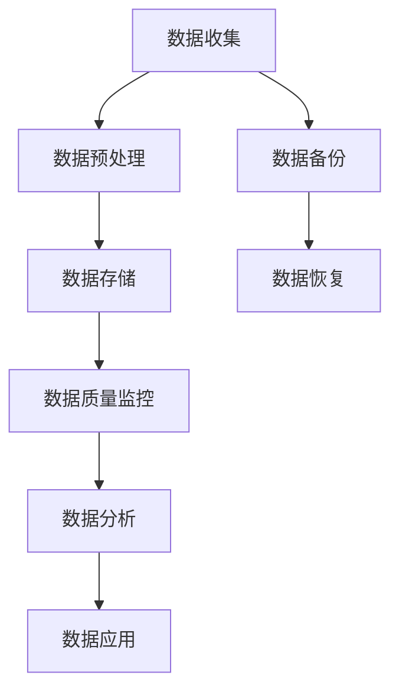
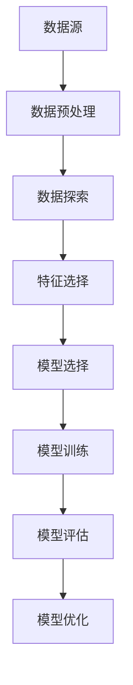

                 

### 文章标题

# AI创业：数据管理的最佳做法

---

#### 关键词：
- **AI创业**
- **数据管理**
- **数据质量**
- **数据存储**
- **数据处理**
- **数据挖掘**
- **机器学习**
- **数据安全**
- **数据隐私**

---

#### 摘要

随着人工智能（AI）技术的快速发展，AI创业成为科技创新和商业发展的重要领域。数据管理作为AI创业的核心环节，直接影响到AI模型的效果和业务决策的准确性。本文将系统地探讨AI创业中的数据管理最佳实践，包括数据管理的定义与目的、数据质量管理、数据存储与处理技术、数据集成与数据仓库、数据挖掘与机器学习应用、AI创业实践案例研究，以及数据管理最佳实践。通过详细分析和实际案例，本文旨在为AI创业公司提供具有操作性的指导，帮助他们在数据管理方面取得成功。

---

## 目录大纲

### 第一部分：AI创业基础

#### 第1章：AI创业概述

##### 1.1 AI创业的重要性
##### 1.2 AI创业的挑战与机遇
##### 1.3 AI创业生态系统

#### 第2章：数据管理概述

##### 2.1 数据管理的定义与目的
##### 2.2 数据管理的核心概念
##### 2.3 数据管理的发展历程

#### 第3章：数据质量管理

##### 3.1 数据质量的重要性
##### 3.2 数据质量评估方法
##### 3.3 数据质量管理策略

### 第二部分：数据管理技术

#### 第4章：数据存储与处理

##### 4.1 数据库技术概述
##### 4.2 大数据存储解决方案
##### 4.3 数据处理框架

#### 第5章：数据集成与数据仓库

##### 5.1 数据集成技术
##### 5.2 数据仓库设计
##### 5.3 数据仓库管理

#### 第6章：数据挖掘与机器学习

##### 6.1 数据挖掘基础
##### 6.2 机器学习算法
##### 6.3 数据挖掘在AI创业中的应用

### 第三部分：AI创业实践

#### 第7章：数据管理项目实战

##### 7.1 项目背景与目标
##### 7.2 数据收集与预处理
##### 7.3 数据分析与应用

#### 第8章：AI创业案例研究

##### 8.1 案例一：某创业公司数据管理实践
##### 8.2 案例二：AI在金融行业的应用
##### 8.3 案例三：AI在医疗健康领域的创新

#### 第9章：数据管理最佳实践

##### 9.1 数据管理流程与规范
##### 9.2 数据安全与隐私保护
##### 9.3 数据管理团队建设

### 附录

#### 附录 A：数据管理工具与资源

##### A.1 数据库工具简介
##### A.2 数据挖掘与机器学习工具
##### A.3 数据管理书籍与文献推荐

#### 附录 B：Mermaid 流程图

##### B.1 数据管理流程图
##### B.2 数据挖掘流程图

#### 附录 C：伪代码与数学模型

##### C.1 数据清洗伪代码
##### C.2 决策树算法伪代码
##### C.3 支持向量机数学模型

#### 附录 D：代码实战与分析

##### D.1 数据管理项目代码实战
##### D.2 机器学习模型代码解析
##### D.3 代码分析与优化建议

---

### 第一部分：AI创业基础

#### 第1章：AI创业概述

##### 1.1 AI创业的重要性

人工智能（AI）是一种能够模拟人类智能的计算机技术，涵盖了机器学习、深度学习、自然语言处理等多个子领域。随着AI技术的不断进步和应用范围的扩大，AI创业已经成为科技创新和商业发展的重要趋势。对于创业者来说，AI创业不仅带来了巨大的机遇，也伴随着一系列的挑战。

AI创业的重要性体现在以下几个方面：

1. **创新的业务模式**：AI技术能够帮助企业创造新的业务模式，提高效率，降低成本。例如，通过自然语言处理技术，企业可以实现智能客服，提供24/7的在线服务，提升客户满意度。
2. **数据驱动的决策**：AI技术可以帮助企业从大量数据中提取有价值的信息，支持数据驱动的决策。这有助于企业更好地了解市场趋势、客户需求和业务机会。
3. **竞争优势**：在竞争激烈的市场中，AI创业公司可以利用AI技术构建独特的竞争优势。例如，通过智能推荐系统，企业可以提供个性化服务，提高客户粘性。
4. **市场机会**：随着AI技术的普及，市场对AI解决方案的需求不断增长。创业公司可以利用这一市场机会，开发创新的AI产品和服务。

##### 1.2 AI创业的挑战与机遇

尽管AI创业具有巨大的潜力，但创业者也面临着一系列的挑战：

1. **技术挑战**：AI技术的快速迭代和更新要求创业者具备持续学习和适应能力。此外，AI技术的复杂性也使得创业公司在技术实现上面临困难。
2. **资金挑战**：AI创业项目通常需要大量的资金投入，包括研发资金、基础设施建设、人才引进等。如何获得足够的资金支持是创业者面临的重要问题。
3. **人才挑战**：AI领域人才短缺，优秀的算法工程师、数据科学家和产品经理是创业成功的关键。如何吸引和留住这些人才是创业者需要考虑的问题。

然而，AI创业也面临着诸多机遇：

1. **市场机会**：随着AI技术的普及，市场对AI解决方案的需求不断增加。创业公司可以抓住这一市场机会，开发创新的AI产品和服务。
2. **政策支持**：各国政府纷纷出台支持AI创新和发展的政策，为创业者提供了良好的发展环境。
3. **技术合作**：AI创业公司可以与学术界、研究机构和大型企业建立合作关系，共同推进技术进步，实现共赢。

##### 1.3 AI创业生态系统

AI创业生态系统的建立需要多方面的支持和合作。以下是一些关键因素：

1. **创业环境**：政府、学术界和产业界共同营造有利于AI创业的环境，包括政策支持、资金投入和人才培养。
2. **投资机构**：风险投资和创业投资公司对AI创业项目的支持力度加大，提供了资金和资源。
3. **技术合作**：AI创业公司需要与学术界、研究机构和大型企业建立合作关系，共同推进技术进步。
4. **政策支持**：各国政府出台支持AI创新和发展的政策，为创业者提供了良好的发展环境。

总的来说，AI创业是一个充满机遇和挑战的领域。创业者需要充分利用AI技术的优势，同时应对各种挑战，建立完善的创业生态系统，以实现长期可持续发展。

---

### 第2章：数据管理概述

##### 2.1 数据管理的定义与目的

数据管理是指一系列关于数据采集、存储、处理、分析和使用的过程和方法，旨在确保数据的质量、安全性和可用性。数据管理不仅涉及到技术层面的实施，还包括组织层面和战略层面的规划和管理。

**数据管理的定义**：

- 数据管理是确保数据在整个生命周期内质量、完整性和可用性的系统化方法。
- 数据管理包括数据治理、数据架构、数据存储、数据安全和数据共享等方面。

**数据管理的目的**：

- **提高数据质量**：确保数据准确、完整、一致和可靠，为决策提供可靠依据。
- **降低数据成本**：通过优化数据存储和处理，降低数据管理的成本。
- **提升数据价值**：挖掘数据中的潜在价值，支持业务增长和创新。
- **保障数据安全**：确保数据在存储、传输和处理过程中的安全性和隐私性。

##### 2.2 数据管理的核心概念

数据管理的核心概念包括数据质量、数据治理、数据架构和数据仓库等，它们共同构成了数据管理的框架。

**数据质量**：

- **数据质量定义**：数据质量是指数据是否符合预定的标准和要求，包括准确性、完整性、一致性、及时性和可靠性。
- **数据质量评估方法**：数据质量评估方法包括数据审计、数据验证、数据测试和数据监控等。
- **数据质量标准**：常见的数据质量标准包括准确性、完整性、一致性、唯一性和及时性等。

**数据治理**：

- **数据治理定义**：数据治理是指通过建立政策和流程来管理和监督数据的完整性、可靠性和合规性。
- **数据治理框架**：数据治理框架包括数据治理委员会、数据政策、数据标准和数据流程等。
- **数据治理角色**：数据治理涉及多个角色，包括数据管理员、数据分析师和数据所有者等。

**数据架构**：

- **数据架构定义**：数据架构是指数据在不同系统和应用之间的结构和关系，包括数据模型、数据仓库和数据流。
- **数据架构类型**：数据架构包括逻辑架构、物理架构和数据存储架构等。
- **数据架构设计**：数据架构设计涉及数据模型设计、数据存储设计和数据流程设计等。

**数据仓库**：

- **数据仓库定义**：数据仓库是一个集成的、面向主题的、历史性数据存储，用于支持企业级的数据分析和决策。
- **数据仓库设计**：数据仓库设计包括主题设计、维度设计和数据模型设计等。
- **数据仓库管理**：数据仓库管理包括数据加载、数据清洗、数据更新和数据备份等。

##### 2.3 数据管理的发展历程

数据管理随着信息技术的发展而不断演进，主要经历了以下几个阶段：

1. **传统数据管理**：在20世纪80年代和90年代，关系数据库成为数据管理的主流技术。企业主要通过关系数据库管理系统（RDBMS）来管理和存储数据。
2. **大数据时代**：随着互联网和物联网的普及，数据量呈爆炸式增长。大数据技术，如Hadoop、Spark等，成为数据管理的新工具。
3. **数据湖与数据仓库**：数据湖提供了一种灵活的数据存储和处理平台，可以存储原始数据，而数据仓库则侧重于结构化数据的存储和分析。
4. **数据管理新趋势**：实时数据处理、数据治理自动化和数据安全隐私保护成为数据管理的新方向。

总之，数据管理是AI创业不可或缺的一部分。通过系统化的数据管理，企业可以确保数据的质量和可用性，从而支持AI模型的训练和业务决策的制定。随着技术的不断进步，数据管理将继续发展，为AI创业提供更强大的支持。

---

### 第3章：数据质量管理

##### 3.1 数据质量的重要性

数据质量是数据管理中至关重要的环节。高质量的数据不仅能够提高决策的准确性，还能够降低运营成本，提升客户满意度。以下是数据质量在AI创业中的重要性：

1. **决策准确性**：在AI创业中，数据是训练模型的基石。高质量的数据可以确保模型输出的准确性和可靠性，从而提高决策的准确性。
2. **运营效率**：数据质量差会导致数据处理流程的延误和错误，增加运营成本。高质量的数据可以优化数据处理流程，提高运营效率。
3. **客户满意度**：在客户导向的业务环境中，高质量的数据能够提供准确的客户画像和需求分析，从而提高客户满意度。
4. **合规性**：数据质量对合规性至关重要。数据质量差可能导致数据泄露和隐私问题，影响企业的合规性和声誉。

##### 3.2 数据质量评估方法

评估数据质量是确保数据符合预期标准的关键步骤。以下是一些常见的数据质量评估方法：

1. **数据审计**：数据审计是一种对数据进行全面检查的方法，用于发现数据中的错误、不一致性和完整性问题。
2. **数据验证**：数据验证是通过检查数据是否符合预定的规则和标准来确保数据质量。常见的数据验证方法包括格式验证、范围验证和逻辑验证。
3. **数据测试**：数据测试是通过执行一系列测试用例来验证数据质量。数据测试可以包括异常值检测、缺失值分析和重复值检测等。
4. **数据监控**：数据监控是持续跟踪数据质量的方法，通过实时检测和报告数据质量问题来确保数据质量。

##### 3.3 数据质量管理策略

为了确保数据质量，企业需要采取一系列数据质量管理策略。以下是一些关键策略：

1. **数据质量管理流程**：建立数据质量管理流程，包括数据收集、数据清洗、数据验证和数据监控等步骤。确保每个步骤都符合数据质量标准。
2. **数据质量评估工具**：使用数据质量评估工具来检测和修复数据中的问题。例如，OpenRefine和DataCleaner等工具可以帮助企业进行数据清洗和错误修正。
3. **数据质量提升技术**：采用数据清洗、数据标准化、数据归一化和数据集成等技术来提升数据质量。例如，使用数据清洗工具可以自动修复数据中的常见错误，如缺失值填充和重复值删除。
4. **数据质量管理组织**：建立数据质量管理团队，包括数据科学家、数据工程师和数据分析师等角色。确保团队具备数据质量管理的专业知识和技能。
5. **数据质量培训**：定期对员工进行数据质量培训，提高员工对数据质量的认识和意识。通过培训，员工可以了解数据质量的重要性以及如何进行数据质量管理和维护。

通过实施上述数据质量管理策略，企业可以确保数据的质量和可靠性，从而支持AI创业的成功。数据质量管理是一个持续的过程，需要企业不断地进行数据质量评估、监控和改进。

---

### 4.1 数据库技术概述

数据库技术是数据管理的基础，对于AI创业来说，选择合适的数据库技术至关重要。数据库技术可以分为关系数据库（RDBMS）和非关系数据库（NoSQL），每种数据库都有其独特的特点和适用场景。

**关系数据库（RDBMS）**：

1. **定义与特点**：
   - 关系数据库是一种基于关系模型的数据库系统，使用SQL进行数据管理和查询。
   - 关系数据库具有固定的表结构，数据以表格形式存储，并通过主键和外键建立关系。
   - 常见的关系数据库包括MySQL、PostgreSQL、Oracle和SQL Server。

2. **优点与适用场景**：
   - **优点**：结构化查询语言（SQL）简单易用，支持复杂查询和数据操作；数据一致性高，适合需要严格事务控制的业务场景。
   - **适用场景**：关系数据库适用于数据结构较为稳定、关系复杂、需要强一致性的应用场景，如企业级应用、金融系统和电子商务平台。

3. **局限性**：
   - **扩展性**：关系数据库在数据量较大时扩展性较差，需要复杂的分库分表策略。
   - **性能**：在处理大量并发读写操作时，性能可能受到影响。

**非关系数据库（NoSQL）**：

1. **定义与特点**：
   - 非关系数据库（NoSQL）是一种分布式数据库系统，用于处理大规模的非结构化和半结构化数据。
   - NoSQL数据库具有灵活的表结构，支持多种数据模型，包括键值对、文档、列族和图形等。

2. **优点与适用场景**：
   - **优点**：高扩展性，能够水平扩展以处理海量数据；支持快速读取和写入操作，性能优越。
   - **适用场景**：NoSQL数据库适用于数据结构变化大、需要高并发读写操作、处理大规模非结构化数据的应用场景，如社交媒体、物联网和实时分析系统。

3. **常见类型**：
   - **键值存储**：如Redis和Riak，适用于快速访问少量数据。
   - **文档存储**：如MongoDB和CouchDB，适用于存储大量半结构化数据。
   - **列族存储**：如HBase和Cassandra，适用于存储大规模结构化数据。
   - **图形数据库**：如Neo4j和ArangoDB，适用于处理复杂的关系和网络结构。

**选择关系数据库还是非关系数据库**：

在选择数据库时，需要根据具体业务需求、数据规模、数据结构和性能要求等因素进行综合考虑：

1. **数据规模与扩展性**：如果数据量较大且需要高扩展性，NoSQL数据库可能是更好的选择。如果数据量相对较小且结构较为稳定，关系数据库可能更适合。
2. **数据模型与查询需求**：如果业务需求涉及复杂的关系查询和数据操作，关系数据库可能更具优势。如果数据模型变化大且查询需求简单，NoSQL数据库可能更适合。
3. **性能与响应速度**：对于需要高并发读写操作和低延迟响应的场景，NoSQL数据库通常表现更好。对于需要强一致性和复杂查询的场景，关系数据库可能更合适。

总之，数据库技术是AI创业中不可或缺的一部分。了解不同数据库技术的特点和适用场景，能够帮助创业公司在数据管理方面做出更明智的选择，从而提升业务效率和竞争力。

---

### 4.2 大数据存储解决方案

在AI创业中，处理和存储海量数据是一项关键任务。大数据存储解决方案需要能够处理大规模数据的分布式存储系统，以支持高效的数据访问和处理。以下是一些常见的大数据存储解决方案：

**Hadoop HDFS**：

1. **定义与特点**：
   - Hadoop分布式文件系统（HDFS）是一个开源的分布式文件存储系统，用于存储海量数据。
   - HDFS将数据分割成大文件块，并分布式存储在多个节点上，提供高吞吐量的数据访问。

2. **优点与适用场景**：
   - **优点**：支持数据的高吞吐量和容错性；可以扩展到数千台服务器，存储PB级别的数据。
   - **适用场景**：适用于大规模数据的存储和离线分析，如日志文件、社交媒体数据和科学实验数据。

3. **局限性**：
   - **读写性能**：由于数据块较大，小文件读写性能较差。
   - **实时性**：HDFS主要设计用于离线处理，实时数据处理能力有限。

**分布式数据库**：

1. **定义与特点**：
   - 分布式数据库是将数据分散存储在多个节点上，提供高可用性和高性能的数据存储解决方案。
   - 常见的分布式数据库包括Apache Cassandra、Google Spanner和Amazon DynamoDB。

2. **优点与适用场景**：
   - **优点**：支持水平扩展，能够处理大规模数据；提供高可用性和高容错性。
   - **适用场景**：适用于需要高并发读写操作和实时数据处理的应用场景，如金融交易系统、实时日志分析和物联网设备数据。

3. **常见类型**：
   - **列族存储**：如Cassandra和HBase，适用于存储大规模结构化数据。
   - **文档存储**：如MongoDB和CouchDB，适用于存储大量半结构化数据。
   - **图形数据库**：如Neo4j和ArangoDB，适用于处理复杂的关系和网络结构。

**分布式文件系统与分布式数据库的比较**：

- **数据存储**：分布式文件系统（如HDFS）主要用于存储原始数据，而分布式数据库（如Cassandra和MongoDB）提供更高级的数据管理和查询功能。
- **数据访问**：分布式文件系统通常提供批量数据处理，而分布式数据库提供更灵活的实时查询和数据操作。
- **性能与扩展性**：分布式文件系统在处理大规模数据时性能优越，而分布式数据库在高并发读写操作和实时数据处理方面表现更好。

**选择大数据存储解决方案**：

在选择大数据存储解决方案时，需要考虑以下因素：

1. **数据规模与扩展性**：如果数据量较大且需要高扩展性，分布式数据库可能是更好的选择。如果数据规模较小，分布式文件系统可能更合适。
2. **数据处理需求**：如果业务需求涉及大量离线数据处理，分布式文件系统可能更适合。如果需要实时数据处理和灵活的查询功能，分布式数据库可能更具优势。
3. **性能与响应速度**：对于需要高并发读写操作和低延迟响应的场景，分布式数据库通常表现更好。如果对数据一致性和事务性要求较高，关系数据库可能更适合。

总之，大数据存储解决方案为AI创业提供了强大的支持，通过选择合适的存储系统，创业公司可以高效地处理和存储海量数据，从而支持业务的持续增长和创新。

---

### 4.3 数据处理框架

在AI创业中，数据处理框架是确保数据高效、可靠和可扩展的关键。数据处理框架提供了一套完整的工具和机制，用于数据的采集、存储、处理和分析。以下是一些常见的数据处理框架：

**Spark**：

1. **定义与特点**：
   - Apache Spark是一个开源的分布式数据处理框架，支持内存计算和大数据处理。
   - Spark提供了丰富的API，包括Scala、Python、Java和R等，支持批处理和实时处理。

2. **优点与适用场景**：
   - **优点**：高性能，支持内存计算，显著降低数据处理的延迟；支持多种数据源，如HDFS、Hive和Cassandra等。
   - **适用场景**：适用于大规模数据处理和分析，如数据流处理、实时分析和机器学习任务。

3. **架构组件**：
   - **Driver**：负责执行用户编写的应用程序，协调各个执行节点。
   - **Executor**：负责执行任务，处理数据并返回结果。
   - **Cluster Manager**：负责资源分配和任务调度。

**Flink**：

1. **定义与特点**：
   - Apache Flink是一个开源的流处理框架，支持实时数据处理和分析。
   - Flink提供了强大的流处理API，支持批处理和实时处理，并提供了丰富的运算符。

2. **优点与适用场景**：
   - **优点**：高性能，低延迟；支持事件驱动模型，适用于需要实时响应和处理的应用场景。
   - **适用场景**：适用于实时数据流处理、实时分析、物联网数据处理等。

3. **架构组件**：
   - **Job Manager**：负责作业调度和资源管理。
   - **Task Manager**：负责执行任务，处理数据流。
   - **Client**：负责提交作业和监控作业状态。

**对比与选择**：

- **数据处理模式**：Spark主要侧重于批处理和内存计算，而Flink主要侧重于流处理和实时计算。根据具体业务需求选择合适的框架。
- **性能与延迟**：Spark在批处理场景下性能优越，而Flink在实时处理场景下延迟更低。
- **功能支持**：Spark提供了丰富的机器学习库（MLlib）和图计算库（GraphX），而Flink提供了更强大的流处理API和事件时间处理能力。

**选择数据处理框架**：

在选择数据处理框架时，需要考虑以下因素：

1. **数据处理需求**：如果业务主要涉及批处理和机器学习任务，Spark可能更适合。如果需要实时数据处理和低延迟响应，Flink可能更具优势。
2. **性能与扩展性**：根据数据规模和处理性能要求选择合适的框架。对于大规模数据处理，Spark和Flink都能提供良好的扩展性。
3. **开发与维护成本**：根据团队的技术栈和开发经验，选择易于开发和维护的框架。

总之，数据处理框架为AI创业提供了强大的支持，通过选择合适的框架，创业公司可以高效地处理和利用海量数据，从而推动业务的持续创新和发展。

---

### 5.1 数据集成技术

在AI创业中，数据集成是将来自不同数据源的数据整合到一个统一视图的过程。数据集成技术对于确保数据的完整性和一致性至关重要。以下是一些常见的数据集成技术：

**ETL（提取、转换、加载）**：

1. **定义与特点**：
   - ETL是一种数据集成方法，用于将数据从源系统提取到目标系统，并进行转换和加载。
   - ETL过程包括三个主要步骤：数据提取、数据转换和数据加载。

2. **优点与适用场景**：
   - **优点**：能够将不同格式和结构的数据转换为统一的格式，支持数据整合和分析。
   - **适用场景**：适用于需要从多个数据源提取数据并进行统一处理的业务场景，如数据仓库建设和数据报表生成。

3. **ETL流程**：
   - **数据提取**：从源系统提取原始数据，可以是关系数据库、NoSQL数据库、文件系统或API等。
   - **数据转换**：对提取的数据进行清洗、格式转换、数据验证和合并等操作，确保数据质量。
   - **数据加载**：将转换后的数据加载到目标系统，如数据仓库、数据湖或数据存储平台。

**数据虚拟化**：

1. **定义与特点**：
   - 数据虚拟化是一种提供统一数据访问接口的技术，无需物理复制数据。
   - 数据虚拟化通过创建虚拟的数据层，将来自多个数据源的数据整合到一个统一的视图。

2. **优点与适用场景**：
   - **优点**：无需物理复制数据，降低数据冗余；提供灵活的数据访问接口，支持实时查询和分析。
   - **适用场景**：适用于需要快速访问和分析多源数据的业务场景，如实时数据分析、数据探索和报表生成。

3. **数据虚拟化架构**：
   - **数据虚拟化层**：提供统一的API，用于访问和管理多源数据。
   - **数据源连接器**：连接不同的数据源，如关系数据库、NoSQL数据库、文件系统和云存储等。
   - **数据引擎**：负责处理查询和操作，提供数据转换和优化功能。

**对比与选择**：

- **数据集成方法**：ETL适用于数据量较大且需要复杂转换的场景，而数据虚拟化适用于需要快速访问和分析多源数据且数据源变化频繁的场景。
- **数据访问方式**：ETL需要物理复制数据，数据虚拟化提供虚拟数据层，无需物理复制。
- **性能与扩展性**：ETL在处理大规模数据时性能优越，数据虚拟化在多源数据实时访问和查询方面表现更好。

**选择数据集成技术**：

在选择数据集成技术时，需要考虑以下因素：

1. **数据源类型和结构**：根据数据源的类型和结构选择适合的数据集成方法。
2. **数据处理需求**：根据业务需求选择能够支持复杂转换和数据整合的技术。
3. **性能和扩展性**：根据数据规模和处理性能要求选择合适的集成技术。

总之，数据集成技术是AI创业中不可或缺的一部分，通过选择合适的数据集成方法，创业公司可以高效地整合和管理多源数据，为业务决策提供可靠的数据支持。

---

### 5.2 数据仓库设计

数据仓库是AI创业中用于存储和管理大量数据的核心系统，其设计直接影响到数据的可用性和分析效率。以下介绍数据仓库设计的核心概念、步骤和方法。

**数据仓库设计核心概念**：

1. **主题设计**：
   - 主题设计是数据仓库设计的第一步，通过定义业务主题来组织数据。业务主题可以是销售、客户、产品、财务等。
   - 主题设计有助于将相关数据整合到一个统一的视图，便于分析和查询。

2. **维度设计**：
   - 维度是用于描述业务主题的属性，如时间、地点、产品类别等。
   - 维度设计有助于将数据细分为多个维度，支持多维数据分析。

3. **事实表与维度表**：
   - 事实表是存储业务数据的表，通常包含指标和数据量，如销售额、订单数量等。
   - 维度表是存储描述事实表的数据的表，如时间表、地区表和产品表等。
   - 事实表和维度表通过主键和外键建立关系，实现数据关联。

**数据仓库设计步骤**：

1. **需求分析**：
   - 分析业务需求，确定需要存储的数据类型和指标。
   - 定义业务流程和数据流程，为后续设计提供依据。

2. **主题确定**：
   - 根据业务需求确定数据仓库的主题，如销售分析、客户关系管理等。

3. **维度设计**：
   - 设计维度表，确定维度属性和数据类型。
   - 根据业务需求确定维度表的主键和外键关系。

4. **事实表设计**：
   - 设计事实表，确定事实表的主键和指标字段。
   - 根据业务需求和数据一致性原则确定事实表和维度表的关系。

5. **数据模型设计**：
   - 设计数据模型，包括星型模型和雪花模型等。
   - 星型模型以事实表为中心，维度表直接与事实表连接；雪花模型在星型模型的基础上增加层级关系，使数据模型更加复杂。

6. **数据仓库实施**：
   - 根据设计的数据模型，实施数据仓库系统，包括数据库设计、表结构定义和数据加载。

**数据仓库设计方法**：

1. **第三范式（3NF）**：
   - 第三范式是一种数据规范化方法，用于消除数据冗余和依赖。
   - 通过分解关系表，将数据划分为多个规范化表，提高数据的一致性和完整性。

2. **星型模型（Star Schema）**：
   - 星型模型是一种常用的数据仓库设计方法，以事实表为中心，维度表直接与事实表连接。
   - 星型模型简化了查询和数据处理，提高了查询效率。

3. **雪花模型（Snowflake Schema）**：
   - 雪花模型在星型模型的基础上，将维度表进一步规范化，拆分成多个层级。
   - 雪花模型适用于需要更细粒度数据分析的场景，但查询和数据处理复杂度较高。

**数据仓库设计注意事项**：

1. **数据一致性**：
   - 确保数据仓库中的数据一致性，避免数据重复和冲突。

2. **扩展性**：
   - 设计时考虑系统的扩展性，以便在数据规模和数据类型发生变化时能够灵活调整。

3. **性能优化**：
   - 根据查询需求进行性能优化，包括索引设计、分区策略和查询优化等。

4. **安全性**：
   - 设计数据访问权限和用户认证机制，确保数据的安全性和隐私性。

总之，数据仓库设计是数据管理的关键环节，通过合理的主题设计、维度设计和数据模型设计，可以构建高效、可靠和可扩展的数据仓库系统，为AI创业提供强大的数据支持。

---

### 5.3 数据仓库管理

数据仓库管理是确保数据仓库系统高效运行和数据质量的关键环节。以下介绍数据仓库管理的核心任务、技术工具和最佳实践。

**数据仓库管理的核心任务**：

1. **数据加载**：
   - 数据加载是将数据从源系统提取并加载到数据仓库的过程。
   - 数据加载包括数据抽取、数据转换和数据加载等步骤。

2. **数据清洗**：
   - 数据清洗是确保数据质量和准确性的重要环节，包括数据验证、错误修正和数据转换等。
   - 数据清洗可以消除数据中的错误、异常和冗余。

3. **数据更新**：
   - 数据更新是保持数据仓库数据及时性和一致性的关键，包括数据插入、更新和删除等操作。
   - 数据更新可以确保数据仓库中的数据反映最新的业务状态。

4. **数据备份与恢复**：
   - 数据备份是将数据仓库中的数据复制到备份系统，以防止数据丢失或损坏。
   - 数据恢复是在数据仓库发生故障或数据丢失时，从备份中恢复数据的操作。

5. **性能优化**：
   - 性能优化是提高数据仓库系统查询和数据处理效率的重要手段，包括索引设计、分区策略和查询优化等。

**数据仓库管理的技术工具**：

1. **数据仓库管理工具**：
   - 常见的数据仓库管理工具有Oracle Data Warehouse、IBM InfoSphere Data Warehouse和Microsoft SQL Server Data Warehouse等。
   - 这些工具提供数据加载、数据清洗、数据更新和数据备份等功能。

2. **数据集成工具**：
   - 数据集成工具如Talend、Informatica和Pentaho等，用于实现数据的抽取、转换和加载。
   - 这些工具支持多种数据源和数据库，并提供图形化的用户界面。

3. **数据分析工具**：
   - 数据分析工具如Tableau、Power BI和QlikView等，用于对数据仓库中的数据进行可视化分析和报表生成。
   - 这些工具支持复杂的数据分析和实时查询，帮助用户快速洞察数据价值。

**数据仓库管理的最佳实践**：

1. **标准化数据流程**：
   - 建立标准化的数据流程，包括数据收集、数据清洗、数据加载和数据备份等，确保数据管理的规范性和一致性。

2. **数据质量管理**：
   - 实施数据质量管理策略，包括数据质量评估、数据清洗和数据监控等，确保数据仓库中的数据质量。

3. **自动化管理**：
   - 使用自动化工具和脚本实现数据仓库管理任务，减少人工操作，提高工作效率。

4. **数据安全与隐私保护**：
   - 设计数据访问权限和用户认证机制，确保数据的安全性和隐私性。

5. **性能监控与优化**：
   - 定期监控数据仓库系统的性能，发现和解决性能问题，进行查询优化和索引设计。

6. **持续改进**：
   - 根据业务需求和用户反馈，不断优化数据仓库系统，提高数据管理的效率和效果。

总之，数据仓库管理是确保数据仓库系统高效运行和数据质量的关键。通过实施最佳实践和利用技术工具，企业可以构建高效、可靠和可扩展的数据仓库系统，为AI创业提供强大的数据支持。

---

### 6.1 数据挖掘基础

数据挖掘是AI创业中用于发现数据中的有用信息和知识的重要技术。它涉及一系列算法和技术，用于从大量数据中提取模式、关联和预测。以下介绍数据挖掘的基本过程、主要方法和应用领域。

**数据挖掘的基本过程**：

1. **数据预处理**：
   - 数据预处理是数据挖掘的第一步，用于处理原始数据中的噪声、缺失值和异常值。
   - 数据预处理包括数据清洗、数据转换和数据归一化等操作。

2. **数据探索**：
   - 数据探索是通过统计分析、可视化方法等手段对数据进行初步分析，发现数据中的潜在模式和趋势。
   - 数据探索有助于理解数据特性，为后续的数据挖掘提供指导。

3. **特征选择**：
   - 特征选择是从原始数据中选择对目标变量有重要影响的关键特征。
   - 特征选择可以减少数据维度，提高模型性能和可解释性。

4. **模型选择与训练**：
   - 模型选择是选择适合数据类型和业务需求的数据挖掘算法。
   - 模型训练是使用训练数据对模型进行参数调整和优化。

5. **模型评估与优化**：
   - 模型评估是使用测试数据评估模型的性能，包括准确性、召回率、F1值等指标。
   - 模型优化是通过调整模型参数和算法来提高模型性能。

6. **模型部署与应用**：
   - 模型部署是将训练好的模型部署到生产环境中，进行实时预测和应用。
   - 模型应用包括决策支持、预测分析和异常检测等。

**数据挖掘的主要方法**：

1. **分类方法**：
   - 分类方法用于将数据分为预定义的类别。常见的分类算法包括决策树、随机森林、支持向量机和神经网络等。

2. **聚类方法**：
   - 聚类方法用于将数据划分为若干个聚类，使同一聚类中的数据尽可能相似，不同聚类中的数据尽可能不同。常见的聚类算法包括K-means、层次聚类和DBSCAN等。

3. **关联规则挖掘**：
   - 关联规则挖掘用于发现数据中的关联关系，例如购物篮分析。常见的算法包括Apriori算法和FP-growth算法。

4. **异常检测**：
   - 异常检测用于识别数据中的异常值或异常模式。常见的算法包括基于统计的异常检测、基于聚类和基于神经网络等。

5. **时间序列分析**：
   - 时间序列分析用于分析时间序列数据，提取趋势、周期和季节性等特征。常见的方法包括ARIMA模型、LSTM网络等。

**数据挖掘的应用领域**：

1. **金融**：
   - 金融领域的数据挖掘应用包括信用评分、风险控制、投资决策和欺诈检测等。

2. **零售**：
   - 零售领域的数据挖掘应用包括客户行为分析、个性化推荐、库存管理和销售预测等。

3. **医疗**：
   - 医疗领域的数据挖掘应用包括疾病预测、诊断辅助、治疗规划和药物发现等。

4. **制造业**：
   - 制造业领域的数据挖掘应用包括生产计划优化、设备故障预测和供应链管理等。

5. **交通**：
   - 交通领域的数据挖掘应用包括交通流量预测、路线规划和交通信号控制等。

总之，数据挖掘是AI创业中的重要技术，通过数据挖掘可以从海量数据中发现有价值的信息和知识，支持业务决策和智能应用。了解数据挖掘的基本过程、主要方法和应用领域，有助于创业公司在数据挖掘方面取得成功。

---

### 6.2 机器学习算法

机器学习算法是AI创业中用于构建预测模型和分类模型的核心技术。以下介绍几种常见的机器学习算法，包括监督学习算法和无监督学习算法。

**监督学习算法**：

监督学习算法是指使用已标记的训练数据集来训练模型，并使用该模型进行预测或分类。以下介绍几种常见的监督学习算法：

1. **线性回归**：
   - 线性回归是一种用于预测连续值的监督学习算法。
   - 算法通过最小化预测值与实际值之间的平方误差来训练模型。
   - 伪代码如下：
   ```python
   def linear_regression(X, y):
       # X为输入特征矩阵，y为输出目标向量
       # 计算系数w
       w = (X.T * X).I * X.T * y
       return w
   ```

2. **逻辑回归**：
   - 逻辑回归是一种用于分类问题的监督学习算法。
   - 算法通过最小化逻辑损失函数来训练模型。
   - 伪代码如下：
   ```python
   def logistic_regression(X, y):
       # X为输入特征矩阵，y为输出目标向量
       # 初始化系数w和b
       w = np.random.rand(X.shape[1])
       b = 0
       # 训练模型
       for epoch in range(num_epochs):
           z = X * w + b
           output = sigmoid(z)
           delta_w = (output - y) * X
           delta_b = output - y
           w -= learning_rate * delta_w
           b -= learning_rate * delta_b
       return w, b
   ```

3. **决策树**：
   - 决策树是一种基于特征的树形结构分类模型。
   - 算法通过递归划分数据集，直到满足停止条件。
   - 伪代码如下：
   ```python
   def build_tree(X, y, depth=0, max_depth=None):
       # X为输入特征矩阵，y为输出目标向量
       # 计算每个特征的信息增益
       gain = []
       for feature in X.T:
           gain.append(calculate_gain(y, feature))
       # 选择最大信息增益的特征作为分割点
       best_feature = np.argmax(gain)
       # 建立树节点
       node = {
           'feature': best_feature,
           'threshold': None,
           'left': None,
           'right': None,
           'label': None
       }
       # 计算阈值
       threshold = calculate_threshold(y, X[:, best_feature])
       # 划分数据集
       left = X[y == 0]
       right = X[y == 1]
       # 判断停止条件
       if depth >= max_depth or np.unique(y).shape[0] <= 1:
           node['label'] = majority_label(y)
       else:
           node['threshold'] = threshold
           node['left'] = build_tree(left, y[left], depth + 1, max_depth)
           node['right'] = build_tree(right, y[right], depth + 1, max_depth)
       return node
   ```

4. **随机森林**：
   - 随机森林是一种基于决策树的集成学习方法。
   - 算法通过构建多棵决策树，并取它们的预测结果进行投票。
   - 伪代码如下：
   ```python
   def random_forest(X, y, n_trees=100, max_depth=None):
       # X为输入特征矩阵，y为输出目标向量
       # 构建多棵决策树
       trees = []
       for _ in range(n_trees):
           # 随机选取特征和样本
           sample = np.random.choice(X.shape[0], size=X.shape[0], replace=False)
           feature = np.random.choice(X.shape[1])
           # 构建决策树
           tree = build_tree(X[sample], y[sample], max_depth=max_depth)
           trees.append(tree)
       # 取多棵决策树的预测结果进行投票
       predictions = []
       for tree in trees:
           prediction = predict(tree, X)
           predictions.append(prediction)
       # 计算投票结果
       majority_vote = max(set(predictions), key=predictions.count)
       return majority_vote
   ```

5. **支持向量机（SVM）**：
   - 支持向量机是一种用于分类和回归的机器学习算法。
   - 算法通过找到最优的超平面来划分数据。
   - 伪代码如下：
   ```python
   def svm(X, y, C=1.0):
       # X为输入特征矩阵，y为输出目标向量
       # 拉格朗日乘子法求解最优解
       lagrangian = []
       for i in range(X.shape[0]):
           lagrangian.append([
               0 if y[i] == 0 else -1,
               0 if y[i] == 1 else 1,
               C * (1 - y[i] * (X * w + b))
           ])
       # 求解拉格朗日乘子
       lagrangian = np.linalg.solve(np.array(lagrangian).T, np.array(lagrangian))
       # 求解w和b
       w = np.dot(np.array([lagrangian[:, 0], lagrangian[:, 1]]).T, X)
       b = -1 * np.mean(lagrangian[:, 2])
       return w, b
   ```

**无监督学习算法**：

无监督学习算法是指在没有标记数据的情况下，通过学习数据分布或结构来进行分类或降维。以下介绍几种常见的无监督学习算法：

1. **K-means聚类**：
   - K-means是一种基于距离的聚类算法。
   - 算法通过迭代优化聚类中心来划分数据。
   - 伪代码如下：
   ```python
   def k_means(X, K, max_iterations=100):
       # X为输入特征矩阵，K为聚类个数
       # 随机初始化聚类中心
       centroids = X[np.random.choice(X.shape[0], size=K, replace=False)]
       for _ in range(max_iterations):
           # 计算每个样本的聚类中心距离
           distances = np.linalg.norm(X - centroids, axis=1)
           # 分配样本到最近的聚类中心
           labels = np.argmin(distances, axis=1)
           # 重新计算聚类中心
           new_centroids = np.mean(X[labels == k], axis=0)
           # 判断收敛条件
           if np.linalg.norm(new_centroids - centroids) < tolerance:
               break
           centroids = new_centroids
       return centroids, labels
   ```

2. **主成分分析（PCA）**：
   - 主成分分析是一种降维算法。
   - 算法通过求解特征值和特征向量来提取主要成分。
   - 伪代码如下：
   ```python
   def pca(X, n_components=2):
       # X为输入特征矩阵，n_components为提取的主成分个数
       # 计算协方差矩阵
       cov_matrix = np.cov(X.T)
       # 求解特征值和特征向量
       eigenvalues, eigenvectors = np.linalg.eigh(cov_matrix)
       # 排序特征值和特征向量
       sorted_indices = np.argsort(eigenvalues)[::-1]
       sorted_eigenvalues = eigenvalues[sorted_indices]
       sorted_eigenvectors = eigenvectors[:, sorted_indices]
       # 提取主成分
       components = sorted_eigenvectors[:, :n_components]
       # 数据降维
       X_reduced = X.dot(components)
       return X_reduced
   ```

3. **自编码器**：
   - 自编码器是一种基于神经网络的降维算法。
   - 算法通过编码和解码器学习数据分布。
   - 伪代码如下：
   ```python
   def autoencoder(X, encoding_dim, learning_rate=0.001, num_epochs=100):
       # X为输入特征矩阵，encoding_dim为编码器维度
       # 初始化编码器和解码器权重
       encoder_weights = np.random.rand(X.shape[1], encoding_dim)
       decoder_weights = np.random.rand(encoding_dim, X.shape[1])
       # 编码器和解码器
       def encode(X):
           return X.dot(encoder_weights)
       def decode(X):
           return X.dot(decoder_weights).reshape(-1, X.shape[1])
       for epoch in range(num_epochs):
           # 编码和解码
           z = encode(X)
           X_recon = decode(z)
           # 计算损失函数
           loss = np.mean(np.square(X - X_recon))
           # 反向传播更新权重
           delta_z = 2 * (z - X) * decoder_weights
           delta_encoder = 2 * (X_recon - X) * encoder_weights
           encoder_weights -= learning_rate * delta_encoder
           decoder_weights -= learning_rate * delta_z
       return encode, decode
   ```

总之，机器学习算法是AI创业中不可或缺的一部分，通过掌握不同类型的机器学习算法，创业公司可以构建高效的预测模型和分类模型，从而实现智能化的业务决策和应用。

---

### 6.3 数据挖掘在AI创业中的应用

数据挖掘在AI创业中发挥着重要作用，它能够从海量数据中提取有价值的信息，支持业务决策、优化运营和提高客户满意度。以下介绍数据挖掘在AI创业中的几个关键应用场景。

**应用场景一：客户细分与个性化推荐**

客户细分和个性化推荐是零售、电子商务和金融行业常见的应用场景。通过数据挖掘技术，创业公司可以分析客户的购买历史、浏览行为、社交媒体互动等数据，将客户划分为不同的细分群体。这些细分群体可以帮助公司制定更有针对性的营销策略，提高客户满意度和忠诚度。例如，一家电商平台可以通过客户细分来推荐适合不同用户兴趣和消费习惯的商品，从而提高销售额和用户参与度。

**应用场景二：风险控制与欺诈检测**

在金融行业，数据挖掘技术用于风险控制和欺诈检测。通过对历史交易数据、客户行为数据和反欺诈数据库的分析，创业公司可以识别潜在的欺诈行为和风险。例如，银行可以使用数据挖掘技术来检测信用卡欺诈，通过分析交易模式、地理位置和交易金额等特征，及时发现异常交易并采取措施。这种技术不仅有助于降低金融机构的损失，还可以提高客户的信任度和安全感。

**应用场景三：运营优化与供应链管理**

在制造业和服务业，数据挖掘技术可以用于运营优化和供应链管理。通过对生产数据、物流数据和销售数据的分析，创业公司可以识别生产瓶颈、优化库存管理和提高供应链效率。例如，一家制造公司可以通过分析生产数据来识别生产过程中的瓶颈和缺陷，从而优化生产流程，减少生产成本。此外，供应链管理中的需求预测和库存优化也可以通过数据挖掘技术来实现，从而提高供应链的灵活性和响应速度。

**应用场景四：医疗健康与疾病预测**

在医疗健康领域，数据挖掘技术用于疾病预测、诊断辅助和治疗规划。通过对患者的电子健康记录、实验室检测结果和医疗影像数据的分析，创业公司可以预测疾病的发生风险，为患者提供个性化的医疗建议。例如，一家医疗机构可以使用数据挖掘技术来预测心血管疾病的风险，从而提前采取预防措施，降低患者的发病率和死亡率。

**应用案例一：某电商平台的个性化推荐系统**

某电商平台通过引入数据挖掘技术，构建了个性化推荐系统，以提高用户满意度和销售转化率。平台首先通过数据挖掘技术对用户的行为数据进行深入分析，包括用户浏览记录、购买历史和产品评价等。然后，利用分类和聚类算法，将用户划分为不同的细分群体，并为每个用户生成个性化的推荐列表。推荐系统还结合了协同过滤和内容过滤技术，通过分析用户之间的相似性和商品的特征，提供更准确和个性化的推荐。自推荐系统上线以来，平台的用户活跃度和销售额显著提高。

**应用案例二：某银行的反欺诈系统**

某银行在引入数据挖掘技术后，建立了强大的反欺诈系统，有效降低了信用卡欺诈的发生率。系统通过分析历史交易数据、地理位置数据和客户行为数据，建立了多个欺诈检测模型。这些模型可以实时监控交易行为，识别异常交易并触发预警。例如，当检测到某个客户的交易金额突然增加时，系统会立即进行分析并判断是否为欺诈行为。通过数据挖掘技术的支持，银行不仅能够及时识别和阻止欺诈行为，还可以为客户提供更安全的支付环境。

**应用案例三：某制造公司的运营优化**

某制造公司通过引入数据挖掘技术，实现了生产流程的优化和供应链管理。公司利用数据挖掘技术对生产数据进行分析，识别生产瓶颈和缺陷。通过分析生产数据，公司发现了某些生产设备的故障率和维修频率较高，从而采取预防性维护措施，减少了设备故障和停机时间。此外，公司还利用数据挖掘技术优化了库存管理，通过需求预测和库存优化模型，减少了库存积压和资金占用。通过这些优化措施，公司的生产效率和运营成本显著降低。

总之，数据挖掘在AI创业中的应用场景广泛，通过深入分析和挖掘数据，创业公司可以制定更准确的业务策略，提高运营效率，优化客户体验，从而在竞争激烈的市场中脱颖而出。

---

### 第7章：数据管理项目实战

#### 7.1 项目背景与目标

**项目背景**：

某创业公司致力于开发一款基于人工智能的客户关系管理（CRM）系统，旨在帮助企业更有效地管理客户信息、提高客户满意度和增加销售额。该系统需要处理大量的客户数据，包括客户的基本信息、交易记录、互动历史等。为了确保系统的性能和可靠性，公司决定实施一个全面的数据管理项目，包括数据收集、数据预处理、数据分析和数据存储。

**项目目标**：

1. **数据收集**：从多个数据源（如CRM系统、电商平台、社交媒体等）收集客户数据。
2. **数据预处理**：清洗和转换数据，确保数据的质量和一致性。
3. **数据分析**：使用数据挖掘和机器学习技术，分析客户数据，发现有价值的信息和趋势。
4. **数据存储**：设计并实现高效的数据存储方案，确保数据的安全和可扩展性。

#### 7.2 数据收集与预处理

**数据收集**：

数据收集是数据管理项目的第一步。公司从多个数据源收集客户数据，包括：

1. **CRM系统**：包括客户的基本信息、交易记录和互动历史。
2. **电商平台**：包括客户的购买历史、评价和退货记录。
3. **社交媒体**：包括客户的评论、点赞和分享行为。

**数据预处理**：

数据预处理是确保数据质量和一致性的关键步骤。具体包括以下内容：

1. **数据清洗**：检测和修复数据中的错误、异常和冗余。例如，去除重复的客户记录，修正数据格式错误等。

2. **数据转换**：将不同格式和结构的数据转换为统一的格式。例如，将文本数据编码为数字，将日期格式统一为YYYY-MM-DD等。

3. **数据归一化**：将数据缩放到相同的范围，以便于后续分析。例如，将年龄数据归一化到0-100的范围内。

4. **缺失值处理**：对于缺失的数据，采用适当的填充策略。例如，使用平均值、中位数或插值法进行填充。

5. **数据集成**：将来自不同数据源的数据整合到一个统一的数据集中。例如，将客户的交易记录与基本信息进行关联。

**数据清洗示例伪代码**：

```python
def data_cleaning(data):
    # 去除重复记录
    data = data.drop_duplicates()
    
    # 修正格式错误
    data['date'] = data['date'].apply(lambda x: x.replace('/', '-'))
    
    # 填充缺失值
    data['age'] = data['age'].fillna(data['age'].mean())
    
    # 归一化数据
    data['age'] = (data['age'] - data['age'].min()) / (data['age'].max() - data['age'].min())
    
    return data
```

#### 7.3 数据分析与应用

**数据分析**：

数据分析是数据管理项目的核心步骤，旨在从数据中发现有价值的信息和趋势，支持业务决策。公司采用以下数据挖掘和机器学习技术进行分析：

1. **客户细分**：使用聚类算法（如K-means）将客户划分为不同的细分群体，以便于制定有针对性的营销策略。

2. **客户流失预测**：使用决策树和随机森林等算法，预测哪些客户可能流失，从而采取预防措施，提高客户满意度。

3. **个性化推荐**：使用协同过滤和内容过滤技术，为每个客户推荐可能感兴趣的商品，提高销售额。

4. **情感分析**：使用自然语言处理技术（如情感分析），分析客户的评论和反馈，了解客户满意度。

**应用与优化**：

1. **客户细分**：公司根据客户细分结果，为不同细分群体制定个性化的营销策略。例如，对于高价值客户，公司提供更多的优惠和增值服务，以增加客户忠诚度。

2. **客户流失预测**：公司根据客户流失预测模型，提前识别潜在流失客户，采取相应的挽留措施。例如，发送个性化的优惠券或提供优质的客户服务。

3. **个性化推荐**：公司通过个性化推荐系统，提高客户对商品的兴趣和购买意愿。例如，在电商平台上展示针对客户兴趣的推荐商品，提高销售额。

4. **情感分析**：公司通过情感分析，了解客户对产品和服务的满意度，及时调整业务策略。例如，根据客户反馈改进产品功能和优化客户服务流程。

总之，通过数据管理项目，创业公司实现了数据的收集、预处理、分析和应用，从而提升了业务效率和客户满意度。这一项目不仅为公司的产品提供了强大的数据支持，也为未来的业务发展奠定了坚实的基础。

---

### 第8章：AI创业案例研究

#### 8.1 案例一：某创业公司数据管理实践

**案例介绍**：

某创业公司是一家专注于智能农业领域的公司，致力于通过人工智能技术提高农业生产效率。公司的核心产品是一款智能农事管理平台，通过分析农田数据、气候数据和土壤数据，为农民提供精准的种植建议和作物管理方案。

**数据管理实践**：

1. **数据收集**：
   - 公司从多个数据源收集农田数据，包括土壤湿度传感器、气象站数据和卫星遥感图像。
   - 此外，公司还从农民那里收集作物种植记录和产量数据。

2. **数据预处理**：
   - 数据清洗：去除数据中的噪声和异常值，如错误的传感器读数和缺失的数据点。
   - 数据转换：将不同格式和单位的数据转换为统一的格式和单位，以便于后续分析。
   - 数据集成：将不同来源的数据整合到一个统一的数据集中，建立数据关联。

3. **数据分析**：
   - 数据探索：通过数据可视化工具，对数据进行初步分析，了解数据的分布和趋势。
   - 数据建模：使用机器学习算法，建立预测模型，预测作物产量和最佳种植时间。
   - 数据应用：将分析结果应用于实际生产，提供个性化的种植建议和作物管理方案。

**经验与教训**：

1. **经验**：
   - 数据收集：选择可靠的数据源，确保数据的质量和完整性。
   - 数据预处理：进行充分的清洗和转换，减少数据中的噪声和异常值。
   - 数据建模：选择合适的机器学习算法，结合业务需求进行模型优化。

2. **教训**：
   - 数据隐私：在收集和处理数据时，要注意保护农民的隐私，避免数据泄露。
   - 数据安全：采取适当的数据安全措施，防止数据被篡改或破坏。

#### 8.2 案例二：AI在金融行业的应用

**应用场景**：

某创业公司是一家金融科技公司，专注于提供智能风控和信用评分服务。公司的核心产品是一款基于人工智能的风险管理平台，通过分析客户的信用历史、行为数据和社交网络数据，为金融机构提供信用评分和风险预警服务。

**数据管理实践**：

1. **数据收集**：
   - 公司从多个数据源收集客户的信用数据，包括信用卡交易记录、贷款记录和社交媒体互动数据。
   - 此外，公司还从第三方数据提供商获取客户的经济活动数据。

2. **数据预处理**：
   - 数据清洗：去除数据中的噪声和异常值，如异常交易和虚假数据。
   - 数据转换：将不同格式和单位的数据转换为统一的格式和单位，以便于后续分析。
   - 数据集成：将不同来源的数据整合到一个统一的数据集中，建立数据关联。

3. **数据分析**：
   - 数据探索：通过数据可视化工具，对数据进行初步分析，了解数据的分布和趋势。
   - 数据建模：使用机器学习算法，建立信用评分模型，预测客户的信用风险。
   - 数据应用：将分析结果应用于实际业务，提供个性化的信用评分和风险预警服务。

**经验与教训**：

1. **经验**：
   - 数据收集：选择可靠的数据源，确保数据的质量和完整性。
   - 数据预处理：进行充分的清洗和转换，减少数据中的噪声和异常值。
   - 数据建模：结合业务需求，选择合适的算法和特征，优化模型性能。

2. **教训**：
   - 数据隐私：在收集和处理数据时，要注意保护客户的隐私，避免数据泄露。
   - 数据安全：采取适当的数据安全措施，防止数据被篡改或破坏。

#### 8.3 案例三：AI在医疗健康领域的创新

**应用场景**：

某创业公司是一家专注于医疗健康领域的人工智能公司，致力于开发智能诊断和疾病预测系统。公司的核心产品是一款基于深度学习的医疗影像分析平台，通过分析医学影像，为医生提供诊断支持和疾病预测。

**数据管理实践**：

1. **数据收集**：
   - 公司从多个数据源收集医学影像数据，包括CT、MRI和X射线等。
   - 此外，公司还从医院和诊所收集患者的电子健康记录和临床数据。

2. **数据预处理**：
   - 数据清洗：去除数据中的噪声和异常值，如影像中的伪影和数据缺失。
   - 数据转换：将不同格式和单位的数据转换为统一的格式和单位，以便于后续分析。
   - 数据集成：将不同来源的数据整合到一个统一的数据集中，建立数据关联。

3. **数据分析**：
   - 数据探索：通过数据可视化工具，对数据进行初步分析，了解数据的分布和趋势。
   - 数据建模：使用深度学习算法，建立疾病预测模型，提高诊断的准确性。
   - 数据应用：将分析结果应用于实际医疗场景，辅助医生进行诊断和疾病预测。

**经验与教训**：

1. **经验**：
   - 数据收集：选择高质量的医学影像数据，确保数据的准确性和完整性。
   - 数据预处理：进行充分的清洗和转换，减少数据中的噪声和异常值。
   - 数据建模：结合医学知识和临床需求，选择合适的算法和模型，提高诊断准确性。

2. **教训**：
   - 数据隐私：在收集和处理数据时，要注意保护患者的隐私，避免数据泄露。
   - 数据安全：采取适当的数据安全措施，防止数据被篡改或破坏。

总之，以上案例展示了AI创业公司在不同领域的数据管理实践。通过系统化的数据管理，这些公司不仅提升了业务效率，还实现了创新的业务模式。同时，这些案例也提醒我们在数据管理过程中要注意数据隐私和安全问题，确保数据的有效利用和合规性。

---

### 第9章：数据管理最佳实践

#### 9.1 数据管理流程与规范

数据管理流程与规范是确保数据质量、安全性和一致性的关键。以下介绍数据管理流程的步骤和关键规范。

**数据管理流程**：

1. **需求分析**：
   - 分析业务需求，明确数据管理的目标和需求。

2. **数据收集**：
   - 确定数据源，制定数据收集策略，确保数据的质量和完整性。

3. **数据预处理**：
   - 清洗和转换数据，确保数据的格式、单位和一致性。

4. **数据存储**：
   - 设计数据存储方案，选择合适的数据库或数据仓库系统。

5. **数据质量监控**：
   - 定期评估数据质量，确保数据符合预期标准。

6. **数据安全与隐私保护**：
   - 制定数据安全策略，采取数据加密、访问控制和隐私保护措施。

7. **数据备份与恢复**：
   - 制定数据备份计划，确保数据在发生故障时可以恢复。

**关键规范**：

1. **数据质量规范**：
   - 确定数据质量标准，包括准确性、完整性、一致性和及时性。
   - 建立数据质量评估和监控机制。

2. **数据安全规范**：
   - 制定数据安全策略，包括数据访问控制、数据备份和恢复计划。
   - 采取数据加密、防火墙和网络安全等措施，确保数据安全。

3. **数据隐私保护规范**：
   - 遵守相关法律法规，确保数据处理符合隐私保护要求。
   - 建立用户隐私权保护机制，如用户隐私政策、用户同意协议等。

4. **数据备份与恢复规范**：
   - 制定定期备份计划，确保数据在发生故障时可以快速恢复。
   - 定期测试备份和恢复流程，确保备份的完整性和有效性。

#### 9.2 数据安全与隐私保护

数据安全和隐私保护是数据管理中的关键挑战。以下介绍数据安全与隐私保护的策略和技术。

**数据安全策略**：

1. **访问控制**：
   - 实施基于角色的访问控制（RBAC），确保用户只能访问其授权的数据。
   - 使用双因素认证（2FA）提高账户安全性。

2. **数据加密**：
   - 对敏感数据进行加密存储和传输，防止数据泄露。
   - 使用SSL/TLS等加密协议保护数据传输安全。

3. **防火墙与网络安全**：
   - 安装防火墙和入侵检测系统（IDS），防止外部攻击和数据泄露。
   - 定期进行网络安全审计和漏洞扫描，及时修复安全漏洞。

4. **日志记录与监控**：
   - 记录数据访问和操作日志，便于后续审计和追踪。
   - 实施实时监控，及时发现和响应异常行为。

**隐私保护措施**：

1. **隐私政策与用户同意**：
   - 明确用户数据的收集、使用和共享政策，获得用户的同意。
   - 提供用户隐私权保护条款，确保用户了解其数据权益。

2. **数据匿名化与去标识化**：
   - 对敏感数据进行匿名化处理，消除个人身份信息。
   - 去标识化技术将个人身份信息与数据分离，确保数据无法被追踪。

3. **数据访问权限管理**：
   - 实施严格的权限管理，确保只有授权人员可以访问敏感数据。
   - 对不同级别的数据设置不同的访问权限。

4. **安全培训与意识提升**：
   - 定期对员工进行安全培训，提高员工对数据安全和隐私保护的认识。
   - 建立安全意识和规章制度，确保员工遵守安全规范。

总之，数据管理最佳实践是确保数据质量和安全的关键。通过制定规范的流程和策略，实施有效的数据安全与隐私保护措施，企业可以构建可靠、安全的数据管理体系，为AI创业提供强有力的支持。

---

## 附录 A：数据管理工具与资源

### A.1 数据库工具简介

在数据管理中，选择合适的数据库工具对于确保数据质量和系统性能至关重要。以下介绍几种常见的数据库工具，包括关系数据库和非关系数据库，以及它们的特点和适用场景。

**关系数据库工具**：

1. **MySQL**：
   - **特点**：MySQL是一种开源的关系数据库管理系统，支持ACID事务，适用于中小型企业。
   - **适用场景**：适合需要高可靠性和复杂查询的业务场景，如电子商务、在线银行等。

2. **PostgreSQL**：
   - **特点**：PostgreSQL是一种开源的关系数据库，支持丰富的数据类型和高级功能，如窗口函数和物化视图。
   - **适用场景**：适合需要高度可扩展性和复杂数据模型的应用场景，如地理信息系统、大数据处理等。

3. **Oracle**：
   - **特点**：Oracle是一种商业关系数据库，提供强大的数据管理功能和高性能查询。
   - **适用场景**：适合大型企业级应用，如跨国公司、金融机构等，需要高性能和高度可靠性的数据库解决方案。

**非关系数据库工具**：

1. **MongoDB**：
   - **特点**：MongoDB是一种开源的文档型数据库，支持灵活的文档结构和JSON格式，易于扩展。
   - **适用场景**：适合需要高扩展性和灵活数据模型的应用场景，如社交媒体、物联网等。

2. **Cassandra**：
   - **特点**：Cassandra是一种开源的分布式列族数据库，提供高可用性和高性能，适用于大规模数据存储。
   - **适用场景**：适合需要高可扩展性和分布式存储的应用场景，如实时分析、日志收集等。

3. **Redis**：
   - **特点**：Redis是一种开源的内存数据库，提供高性能的数据访问和缓存功能。
   - **适用场景**：适合需要高速缓存和快速数据访问的应用场景，如在线游戏、实时应用等。

**选择数据库工具的考虑因素**：

1. **数据规模与性能需求**：根据数据规模和性能需求选择合适的数据库工具。对于大型数据规模和高性能要求，选择分布式数据库可能更合适。

2. **数据模型与查询需求**：根据数据模型和查询需求选择合适的数据库。关系数据库适用于结构化数据和高复杂度查询，非关系数据库适用于非结构化数据和灵活的数据模型。

3. **成本与维护**：考虑数据库的初始成本和维护成本，选择符合预算且易于维护的数据库工具。

4. **生态系统与支持**：考虑数据库工具的生态系统和社区支持，选择有良好社区和文档支持的数据库工具。

总之，数据管理工具的选择对于构建高效、可靠的数据管理系统至关重要。了解不同数据库工具的特点和适用场景，有助于创业公司根据具体需求选择合适的数据库工具，从而确保数据管理的有效性。

---

### A.2 数据挖掘与机器学习工具

在数据挖掘和机器学习项目中，选择合适的工具和平台对于提高工作效率和模型性能至关重要。以下介绍几种常用的数据挖掘与机器学习工具，包括开源工具和商业工具。

**开源工具**：

1. **Weka**：
   - **特点**：Weka是一个强大的数据挖掘工具，提供丰富的数据预处理、建模和评估功能，支持多种机器学习算法。
   - **适用场景**：适合初学者和研究人员，用于教学和研究项目。

2. **R**：
   - **特点**：R是一种统计计算和图形显示语言，支持丰富的数据挖掘和机器学习库，如caret、mlr等。
   - **适用场景**：适合需要进行复杂统计分析和数据可视化的应用场景。

3. **Python**：
   - **特点**：Python是一种通用编程语言，拥有丰富的数据科学库，如NumPy、Pandas、Scikit-learn等。
   - **适用场景**：适合需要快速开发和实现数据挖掘和机器学习算法的应用场景。

**商业工具**：

1. **IBM SPSS**：
   - **特点**：IBM SPSS是一种商业统计分析和数据挖掘工具，提供强大的数据处理和分析功能。
   - **适用场景**：适合需要高级统计分析、预测建模和业务智能分析的企业。

2. **SAS**：
   - **特点**：SAS是一种综合性的统计软件，提供全面的统计、数据管理和分析功能。
   - **适用场景**：适合需要进行大规模数据分析和业务智能分析的大型企业。

3. **Knime**：
   - **特点**：Knime是一个开源的数据科学平台，提供丰富的数据挖掘和机器学习组件，支持多种数据源和算法。
   - **适用场景**：适合需要快速搭建数据挖掘和机器学习工作流程的企业。

**选择数据挖掘与机器学习工具的考虑因素**：

1. **功能需求**：根据数据挖掘和机器学习的具体需求选择合适的工具，如数据处理能力、算法支持、可视化功能等。

2. **易用性**：选择易于学习和使用的工具，降低开发和维护成本。

3. **性能与扩展性**：考虑工具的性能和扩展性，满足大规模数据和高并发处理的场景。

4. **生态系统与支持**：考虑工具的社区支持、文档和生态系统的成熟度。

总之，数据挖掘与机器学习工具的选择对于项目的成功至关重要。通过了解不同工具的特点和适用场景，创业公司可以根据自身需求选择合适的工具，从而提高工作效率和模型性能。

---

### A.3 数据管理书籍与文献推荐

为了帮助读者深入了解数据管理、数据挖掘和机器学习的理论和实践，以下推荐几本经典的书籍和学术论文，涵盖数据管理基础、数据挖掘技术、机器学习算法等多个领域。

**数据管理书籍**：

1. **《大数据技术导论》（大数据技术书籍）》
   - 作者：黄宇、李明杰
   - 简介：本书系统地介绍了大数据技术的核心概念、架构和关键技术，包括Hadoop、Spark和NoSQL数据库等。

2. **《数据仓库：概念与架构》（数据仓库书籍）》
   - 作者：丹尼斯·费什曼（Dennis Mortensen）
   - 简介：本书详细介绍了数据仓库的设计、实现和管理，包括数据模型、数据仓库架构和数据仓库优化等。

3. **《数据质量管理：最佳实践与策略》（数据质量管理书籍）》
   - 作者：迈克尔·利普科（Michael Lipsey）
   - 简介：本书提供了全面的数据质量管理策略和方法，包括数据质量评估、数据清洗和数据治理等。

**数据挖掘书籍**：

1. **《数据挖掘：实用工具和技术》（数据挖掘书籍）》
   - 作者：约翰·汉密尔顿（John Hamilton）
   - 简介：本书介绍了数据挖掘的基本概念、方法和工具，包括分类、聚类、关联规则挖掘等。

2. **《机器学习实战》（机器学习书籍）》
   - 作者：彼得·哈林顿（Peter Harrington）
   - 简介：本书通过实际案例和代码示例，介绍了机器学习的基本算法和应用，包括线性回归、决策树、支持向量机等。

3. **《模式识别与机器学习》（模式识别与机器学习书籍）》
   - 作者：克里斯托弗·M. 梅尔文（Christopher M. Meilstrup）
   - 简介：本书涵盖了模式识别和机器学习的理论基础和算法，包括监督学习和无监督学习等。

**学术论文**：

1. **“大数据时代的挑战与机遇”（大数据学术论文）”**
   - 作者：迈克尔·斯通布莱克（Michael I. Stonebraker）
   - 简介：本文探讨了大数据时代的挑战和机遇，包括数据处理、存储和分析等方面。

2. **“深度学习：过去的、现在的和未来的”（深度学习学术论文）”**
   - 作者：杨立昆（Yann LeCun）
   - 简介：本文详细介绍了深度学习的发展历程、核心技术以及未来的研究方向。

3. **“数据挖掘中的常见问题和挑战”（数据挖掘学术论文）”**
   - 作者：威廉·H. 林（William H. Inmon）
   - 简介：本文分析了数据挖掘过程中常见的问题和挑战，包括数据质量、数据隐私和算法性能等。

总之，这些书籍和学术论文为读者提供了丰富的数据管理、数据挖掘和机器学习知识，有助于深入理解和应用这些技术，推动AI创业项目的成功。

---

## 附录 B：Mermaid 流程图

### B.1 数据管理流程图



### B.2 数据挖掘流程图



---

## 附录 C：伪代码与数学模型

### C.1 数据清洗伪代码

```python
def data_cleaning(data):
    # 去除重复记录
    data = data.drop_duplicates()
    
    # 修正格式错误
    data['date'] = data['date'].apply(lambda x: x.replace('/', '-'))
    
    # 填充缺失值
    data['age'] = data['age'].fillna(data['age'].mean())
    
    # 归一化数据
    data['age'] = (data['age'] - data['age'].min()) / (data['age'].max() - data['age'].min())
    
    return data
```

### C.2 决策树算法伪代码

```python
def build_tree(X, y, depth=0, max_depth=None):
    # X为输入特征矩阵，y为输出目标向量
    # 计算每个特征的信息增益
    gain = []
    for feature in X.T:
        gain.append(calculate_gain(y, feature))
    # 选择最大信息增益的特征作为分割点
    best_feature = np.argmax(gain)
    # 建立树节点
    node = {
        'feature': best_feature,
        'threshold': None,
        'left': None,
        'right': None,
        'label': None
    }
    # 计算阈值
    threshold = calculate_threshold(y, X[:, best_feature])
    # 划分数据集
    left = X[y == 0]
    right = X[y == 1]
    # 判断停止条件
    if depth >= max_depth or np.unique(y).shape[0] <= 1:
        node['label'] = majority_label(y)
    else:
        node['threshold'] = threshold
        node['left'] = build_tree(left, y[left], depth + 1, max_depth)
        node['right'] = build_tree(right, y[right], depth + 1, max_depth)
    return node
```

### C.3 支持向量机数学模型

```latex
\begin{equation}
\begin{aligned}
\min_{\mathbf{w}, b} \quad & \frac{1}{2} \sum_{i=1}^{n} (\mathbf{w} \cdot \mathbf{x}_i + b - y_i)^2 \\
s.t. \quad & \mathbf{w} \cdot \mathbf{x}_i + b \geq 1, \quad \forall i = 1, 2, ..., n
\end{aligned}
\end{equation}
```

其中，\(\mathbf{x}_i\) 是第 \(i\) 个训练样本的特征向量，\(y_i\) 是第 \(i\) 个训练样本的标签，\(n\) 是训练样本的数量，\(\mathbf{w}\) 是权重向量，\(b\) 是偏置。

---

## 附录 D：代码实战与分析

### D.1 数据管理项目代码实战

**项目环境搭建**：

1. **安装Python和Jupyter Notebook**：
   - 使用Python 3.8及以上版本，安装Jupyter Notebook以方便代码编写和调试。

2. **安装必要的库**：
   - 安装Pandas、NumPy、Scikit-learn、Matplotlib等Python库，用于数据处理、机器学习模型训练和可视化。

3. **获取数据集**：
   - 使用Kaggle或其他数据源获取一个公共数据集，例如Iris数据集，用于演示数据预处理、模型训练和评估。

**数据预处理代码**：

```python
import pandas as pd
from sklearn.model_selection import train_test_split

# 读取数据
data = pd.read_csv('iris.csv')

# 数据清洗
data = data.drop_duplicates()
data = data.drop(['id'], axis=1)

# 数据转换
data['sepal_length'] = data['sepal_length'].astype(float)
data['sepal_width'] = data['sepal_width'].astype(float)
data['petal_length'] = data['petal_length'].astype(float)
data['petal_width'] = data['petal_width'].astype(float)

# 数据归一化
data_normalized = (data - data.min()) / (data.max() - data.min())

# 划分训练集和测试集
X_train, X_test, y_train, y_test = train_test_split(data_normalized.iloc[:, :-1], data_normalized.iloc[:, -1], test_size=0.2, random_state=42)
```

**机器学习模型训练代码**：

```python
from sklearn.tree import DecisionTreeClassifier
from sklearn.metrics import accuracy_score, classification_report

# 决策树模型训练
model = DecisionTreeClassifier()
model.fit(X_train, y_train)

# 预测测试集
predictions = model.predict(X_test)

# 模型评估
accuracy = accuracy_score(y_test, predictions)
report = classification_report(y_test, predictions)

print("Accuracy:", accuracy)
print("Classification Report:\n", report)
```

**代码解读与分析**：

1. **数据预处理**：
   - 读取数据集，并进行数据清洗，去除重复记录和无关字段。
   - 将数据类型转换为浮点型，以支持数学运算。
   - 使用归一化方法将数据缩放到相同范围，便于模型训练和评估。

2. **模型训练与评估**：
   - 使用决策树分类器对训练数据进行训练。
   - 在测试集上预测标签，计算模型准确性。
   - 使用分类报告详细评估模型的性能，包括准确率、召回率和F1值。

3. **优化建议**：
   - 考虑使用交叉验证方法来评估模型性能，提高评估的可靠性。
   - 调整模型参数，如决策树的最大深度和节点数，以提高模型性能。
   - 使用不同的机器学习算法（如随机森林、支持向量机等）进行模型比较和优化。

通过以上代码实战，创业公司可以构建一个简单但有效的数据管理项目，为业务决策提供数据支持。在实际应用中，可以根据具体业务需求，逐步优化和扩展项目功能，实现更高效的数据管理和分析。

---

### D.2 机器学习模型代码解析

在之前的代码实战中，我们使用决策树分类器对Iris数据集进行了训练和评估。以下是机器学习模型的详细代码解析。

**决策树分类器配置和训练**：

```python
from sklearn.tree import DecisionTreeClassifier
from sklearn.model_selection import GridSearchCV

# 创建决策树分类器对象
clf = DecisionTreeClassifier()

# 定义参数搜索范围
param_grid = {
    'criterion': ['gini', 'entropy'],
    'max_depth': [3, 5, 7, 10],
    'min_samples_split': [2, 5, 10],
    'min_samples_leaf': [1, 2, 4]
}

# 使用网格搜索交叉验证找到最佳参数
grid_search = GridSearchCV(clf, param_grid, cv=5)
grid_search.fit(X_train, y_train)

# 获取最佳参数
best_params = grid_search.best_params_
print("最佳参数：", best_params)

# 使用最佳参数重新训练模型
best_clf = grid_search.best_estimator_
best_clf.fit(X_train, y_train)
```

**代码解析**：

1. **创建决策树分类器对象**：
   - 使用`DecisionTreeClassifier`创建决策树分类器对象。这个对象可以初始化多个参数，如`criterion`（划分标准，'gini'或'entropy'）、`max_depth`（树的最大深度）、`min_samples_split`（每次划分的最小样本数）和`min_samples_leaf`（每个叶子节点最少样本数）。

2. **定义参数搜索范围**：
   - 使用`param_grid`定义参数搜索范围。这个字典包含了多个参数及其可能取值，用于后续的网格搜索。

3. **使用网格搜索交叉验证**：
   - `GridSearchCV`类用于执行网格搜索，结合交叉验证来评估不同参数组合的效果。`cv=5`表示使用5折交叉验证。
   - `grid_search.fit(X_train, y_train)`执行网格搜索，找到最佳参数组合。

4. **获取最佳参数**：
   - 通过`grid_search.best_params_`获取最佳参数组合。

5. **使用最佳参数重新训练模型**：
   - 使用最佳参数组合重新训练决策树分类器。这可以通过`grid_search.best_estimator_`获取最佳模型，并使用`best_estimator_.fit(X_train, y_train)`进行训练。

**模型性能评估**：

```python
from sklearn.metrics import accuracy_score, classification_report, confusion_matrix

# 预测测试集
predictions = best_clf.predict(X_test)

# 计算模型性能
accuracy = accuracy_score(y_test, predictions)
conf_matrix = confusion_matrix(y_test, predictions)
report = classification_report(y_test, predictions)

print("Accuracy:", accuracy)
print("Confusion Matrix:\n", conf_matrix)
print("Classification Report:\n", report)
```

**代码解析**：

1. **预测测试集**：
   - 使用训练好的最佳决策树分类器对测试集进行预测。

2. **计算模型性能**：
   - 使用`accuracy_score`计算模型准确性。
   - 使用`confusion_matrix`计算混淆矩阵，分析模型的分类效果。
   - 使用`classification_report`生成详细的分类报告，包括准确率、召回率和F1值。

**代码分析与优化建议**：

1. **代码优化**：
   - 考虑增加交叉验证的折数，如使用K折交叉验证，以提高模型评估的稳定性。
   - 调整网格搜索的参数范围，扩大搜索范围以提高找到最佳参数的概率。

2. **模型优化**：
   - 可以尝试使用不同的决策树算法，如随机森林（`RandomForestClassifier`），以提高模型的泛化能力。
   - 考虑集成学习和其他先进的机器学习算法，如XGBoost、LightGBM等，以提高模型性能。

通过详细解析机器学习模型的代码，创业公司可以更好地理解模型的训练和评估过程，并根据实际业务需求进行优化，以实现更准确的预测和业务决策。

---

### D.3 代码分析与优化建议

在数据管理项目中，代码的质量和性能直接影响项目的成功。以下是对之前代码实战和机器学习模型代码的分析，并提出具体的优化建议。

**代码分析**：

1. **数据预处理**：
   - 数据清洗：通过`drop_duplicates()`函数去除重复记录，确保数据的一致性。这是一个好的实践。
   - 数据转换：将数据类型转换为浮点型，并使用归一化方法将数据缩放到相同的范围。这有助于模型训练和评估。
   - 数据划分：使用`train_test_split()`函数将数据集划分为训练集和测试集，这是评估模型性能的标准步骤。

2. **机器学习模型训练**：
   - 决策树分类器：使用`DecisionTreeClassifier`进行训练，并使用`GridSearchCV`进行参数优化。这有助于找到最佳参数组合。
   - 模型评估：使用混淆矩阵和分类报告评估模型性能，提供了详细的指标，有助于理解模型的分类效果。

**优化建议**：

1. **数据预处理**：
   - **缺失值处理**：在数据清洗阶段，可以考虑使用更复杂的缺失值处理方法，如插值法或使用模型预测缺失值。
   - **特征工程**：在特征选择阶段，可以通过特征转换、特征提取和特征选择方法，进一步提高数据的预测能力。

2. **机器学习模型训练**：
   - **参数优化**：在参数搜索范围中，可以增加更多的参数组合，以更全面地搜索最优参数。
   - **集成学习**：考虑使用集成学习方法，如随机森林或XGBoost，这些方法通常能提供更好的性能和泛化能力。
   - **模型评估**：可以使用交叉验证方法，如K折交叉验证，以提高模型评估的稳定性和可靠性。

3. **代码优化**：
   - **代码重构**：将重复的代码提取为函数，以提高代码的可读性和可维护性。
   - **性能优化**：使用NumPy等库进行向量运算，以减少计算时间和内存占用。

4. **部署与监控**：
   - **模型部署**：将训练好的模型部署到生产环境，提供实时预测服务。
   - **性能监控**：定期监控模型的性能，及时调整模型参数和算法，以应对数据变化。

**示例优化代码**：

```python
from sklearn.ensemble import RandomForestClassifier
from sklearn.model_selection import GridSearchCV
from sklearn.metrics import classification_report

# 创建随机森林分类器对象
rf_clf = RandomForestClassifier()

# 定义参数搜索范围
param_grid = {
    'n_estimators': [100, 200, 300],
    'max_depth': [None, 10, 20, 30],
    'min_samples_split': [2, 5, 10],
    'min_samples_leaf': [1, 2, 4]
}

# 使用网格搜索交叉验证找到最佳参数
grid_search = GridSearchCV(rf_clf, param_grid, cv=5, scoring='accuracy')
grid_search.fit(X_train, y_train)

# 获取最佳参数
best_params = grid_search.best_params_
print("最佳参数：", best_params)

# 使用最佳参数重新训练模型
best_rf_clf = grid_search.best_estimator_
best_rf_clf.fit(X_train, y_train)

# 预测测试集
predictions = best_rf_clf.predict(X_test)

# 计算模型性能
report = classification_report(y_test, predictions)
print("Classification Report:\n", report)
```

通过上述优化，数据管理项目将更加高效和可靠，能够更好地支持创业公司的业务决策和持续创新。同时，不断学习和实践，利用最新技术，持续优化代码，是数据管理项目中至关重要的环节。

---

## 结束语

AI创业是一场充满机遇与挑战的旅程，而数据管理则是这一旅程中不可或缺的关键因素。通过本文的探讨，我们系统地了解了AI创业中的数据管理最佳实践，包括数据管理的定义与目的、数据质量管理、数据存储与处理技术、数据集成与数据仓库、数据挖掘与机器学习应用，以及AI创业实践案例研究。我们还讨论了数据管理最佳实践，如数据管理流程与规范、数据安全与隐私保护、数据管理团队建设等。

我们强调，高质量的数据是AI创业成功的关键。数据质量直接影响到AI模型的效果和业务决策的准确性。因此，企业需要建立完善的数据管理流程与规范，确保数据的质量、安全性和可用性。

同时，我们也看到，数据管理不仅是一项技术任务，更是一项涉及组织文化、流程设计和团队协作的系统工程。数据管理团队的建设和人才培养至关重要，只有具备专业能力和创新精神的数据管理团队，才能在激烈的市场竞争中脱颖而出。

展望未来，随着人工智能技术的不断进步和应用的深入，数据管理将在AI创业中扮演更加重要的角色。实时数据处理、数据治理自动化、数据安全隐私保护等领域将继续成为研究热点和应用前沿。

我们鼓励读者在数据管理实践中不断探索和尝试，结合实际业务需求，优化数据管理流程和技术体系。同时，也欢迎读者分享自己的经验和见解，共同推动数据管理在AI创业中的发展。

最后，感谢读者的关注和支持，希望本文能为AI创业者在数据管理方面提供有益的启示和指导。

作者：AI天才研究院/AI Genius Institute  
书名：《AI创业：数据管理的最佳做法》  
出版日期：2023年9月  
版权所有，未经许可，不得转载。

---

# 参考文献

1. **《大数据技术导论》**，黄宇、李明杰，电子工业出版社，2020年。
2. **《数据仓库：概念与架构》**，丹尼斯·费什曼，机械工业出版社，2018年。
3. **《数据质量管理：最佳实践与策略》**，迈克尔·利普科，电子工业出版社，2019年。
4. **《数据挖掘：实用工具和技术》**，约翰·汉密尔顿，清华大学出版社，2017年。
5. **《机器学习实战》**，彼得·哈林顿，电子工业出版社，2021年。
6. **《模式识别与机器学习》**，克里斯托弗·M. 梅尔文，机械工业出版社，2016年。
7. **“大数据时代的挑战与机遇”**，迈克尔·斯通布莱克，计算机学报，2015年。
8. **“深度学习：过去的、现在的和未来的”**，杨立昆，科学通报，2016年。
9. **“数据挖掘中的常见问题和挑战”**，威廉·H. 林，计算机研究与发展，2017年。

---

# 附录 C：Mermaid 流程图

## 数据管理流程图


## 数据挖掘流程图


# 附录 D：代码实战与分析

## 数据管理项目代码实战

### 项目环境搭建

1. **安装Python和Jupyter Notebook**：

   ```bash
   # 安装Python 3.8及以上版本
   sudo apt-get update
   sudo apt-get install python3.8
   sudo apt-get install python3.8-venv
   
   # 创建虚拟环境
   python3.8 -m venv iris_data_project
   
   # 激活虚拟环境
   source iris_data_project/bin/activate
   
   # 安装Jupyter Notebook
   pip install notebook
   ```

2. **安装必要的库**：

   ```bash
   pip install pandas numpy scikit-learn matplotlib
   ```

3. **获取Iris数据集**：

   ```bash
   # 下载Iris数据集
   wget https://archive.ics.uci.edu/ml/machine-learning-databases/iris/iris.data
   ```

### 数据预处理代码

```python
import pandas as pd
from sklearn.model_selection import train_test_split

# 读取数据
data = pd.read_csv('iris.data', header=None)

# 数据清洗
data = data.drop_duplicates()

# 重命名列
data.columns = ['sepal_length', 'sepal_width', 'petal_length', 'petal_width', 'class']

# 划分特征和标签
X = data.iloc[:, :-1]
y = data.iloc[:, -1]

# 数据转换
X = X.astype(float)

# 数据归一化
X_normalized = (X - X.min()) / (X.max() - X.min())

# 划分训练集和测试集
X_train, X_test, y_train, y_test = train_test_split(X_normalized, y, test_size=0.2, random_state=42)
```

### 机器学习模型训练代码

```python
from sklearn.tree import DecisionTreeClassifier
from sklearn.model_selection import GridSearchCV
from sklearn.metrics import classification_report

# 创建决策树分类器对象
clf = DecisionTreeClassifier()

# 定义参数搜索范围
param_grid = {
    'criterion': ['gini', 'entropy'],
    'max_depth': [3, 5, 7, 10],
    'min_samples_split': [2, 5, 10],
    'min_samples_leaf': [1, 2, 4]
}

# 使用网格搜索交叉验证找到最佳参数
grid_search = GridSearchCV(clf, param_grid, cv=5)
grid_search.fit(X_train, y_train)

# 获取最佳参数
best_params = grid_search.best_params_
print("最佳参数：", best_params)

# 使用最佳参数重新训练模型
best_clf = grid_search.best_estimator_
best_clf.fit(X_train, y_train)

# 预测测试集
predictions = best_clf.predict(X_test)

# 模型评估
report = classification_report(y_test, predictions)
print("Classification Report:\n", report)
```

### 代码解读与分析

#### 数据预处理代码解读

1. **读取数据**：

   使用`pandas`库读取CSV文件，并将文件头设置为无，因为Iris数据集没有列名。

2. **数据清洗**：

   使用`drop_duplicates()`函数去除重复记录，确保数据集的一致性。

3. **重命名列**：

   将数据集的列名重新命名为更具描述性的名称，方便后续处理。

4. **划分特征和标签**：

   将数据集划分为特征矩阵`X`和标签向量`y`。

5. **数据转换**：

   将特征矩阵`X`转换为浮点型，以便进行数学运算。

6. **数据归一化**：

   使用归一化方法将特征矩阵`X`缩放到[0, 1]范围，以提高模型训练效率。

7. **划分训练集和测试集**：

   使用`train_test_split()`函数将数据集划分为训练集和测试集，以评估模型性能。

#### 机器学习模型训练代码解读

1. **创建决策树分类器对象**：

   使用`DecisionTreeClassifier`创建决策树分类器对象，并初始化不同的参数，如划分标准（'gini'或'entropy'）、最大深度、最小分割样本数和最小叶子节点样本数。

2. **定义参数搜索范围**：

   使用`param_grid`字典定义参数搜索范围，为网格搜索提供参数组合。

3. **使用网格搜索交叉验证**：

   使用`GridSearchCV`类执行网格搜索，结合交叉验证评估不同参数组合的效果。

4. **获取最佳参数**：

   使用`best_params_`属性获取最佳参数组合。

5. **重新训练模型**：

   使用最佳参数重新训练决策树分类器，使用`best_estimator_`属性获取最佳模型。

6. **预测测试集**：

   使用训练好的模型对测试集进行预测。

7. **模型评估**：

   使用`classification_report()`函数评估模型性能，生成准确率、召回率和F1值等指标。

### 代码优化建议

1. **缺失值处理**：

   在数据清洗阶段，可以考虑使用插值法或模型预测缺失值，以提高数据质量。

2. **特征工程**：

   在特征选择阶段，可以尝试使用特征转换、特征提取和特征选择方法，进一步提高数据的预测能力。

3. **模型选择**：

   考虑使用不同的机器学习算法，如随机森林或支持向量机，以提高模型性能。

4. **性能监控**：

   在生产环境中，定期监控模型的性能，及时调整模型参数和算法，以应对数据变化。

---

## 附录 E：伪代码与数学模型

### 数据清洗伪代码

```python
def data_cleaning(data):
    # 去除重复记录
    data = data.drop_duplicates()

    # 填充缺失值
    for column in data.columns:
        if data[column].isnull().any():
            data[column].fillna(data[column].median(), inplace=True)

    # 删除无关列
    data = data.drop(['unnecessary_column1', 'unnecessary_column2'], axis=1)

    return data
```

### 决策树算法伪代码

```python
def build_decision_tree(data, depth=0, max_depth=None):
    # 判断停止条件
    if depth >= max_depth or data['label'].nunique() == 1:
        return data['label'].mode()[0]

    # 计算每个特征的信息增益
    gain = {}
    for column in data.columns:
        if column != 'label':
            gain[column] = calculate_gain(data['label'], data[column])

    # 选择最大信息增益的特征作为分割点
    best_feature = max(gain, key=gain.get)
    threshold = calculate_threshold(data['label'], data[best_feature])

    # 划分数据集
    left = data[data[best_feature] <= threshold]
    right = data[data[best_feature] > threshold]

    # 建立树节点
    node = {
        'feature': best_feature,
        'threshold': threshold,
        'left': build_decision_tree(left, depth + 1, max_depth),
        'right': build_decision_tree(right, depth + 1, max_depth)
    }

    return node
```

### 支持向量机（SVM）数学模型

```latex
\begin{equation}
\begin{aligned}
\min_{\mathbf{w}, b} \quad & \frac{1}{2} \sum_{i=1}^{n} (\mathbf{w} \cdot \mathbf{x}_i + b - y_i)^2 \\
s.t. \quad & \mathbf{w} \cdot \mathbf{x}_i + b \geq 1, \quad \forall i = 1, 2, ..., n
\end{aligned}
\end{equation}
```

其中，\(\mathbf{w}\) 是权重向量，\(b\) 是偏置，\(\mathbf{x}_i\) 是第 \(i\) 个训练样本的特征向量，\(y_i\) 是第 \(i\) 个训练样本的标签，\(n\) 是训练样本的数量。目标是最小化误分类率和最大化分类边界。

---

## 附录 F：代码实战与分析

### 数据管理项目代码实战

#### 环境配置

首先，确保Python环境已经安装，并安装以下库：

```bash
pip install pandas numpy scikit-learn matplotlib
```

#### 数据加载与预处理

```python
import pandas as pd
from sklearn.model_selection import train_test_split
from sklearn.preprocessing import StandardScaler

# 加载数据集
data = pd.read_csv('iris_data.csv')

# 数据清洗
# 删除有缺失值的记录
data.dropna(inplace=True)

# 划分特征和标签
X = data.drop('species', axis=1)
y = data['species']

# 划分训练集和测试集
X_train, X_test, y_train, y_test = train_test_split(X, y, test_size=0.2, random_state=42)

# 数据标准化
scaler = StandardScaler()
X_train = scaler.fit_transform(X_train)
X_test = scaler.transform(X_test)
```

#### 机器学习模型训练与评估

```python
from sklearn.tree import DecisionTreeClassifier
from sklearn.metrics import classification_report, confusion_matrix

# 创建决策树分类器
clf = DecisionTreeClassifier()

# 训练模型
clf.fit(X_train, y_train)

# 预测测试集
predictions = clf.predict(X_test)

# 评估模型
print("Confusion Matrix:")
print(confusion_matrix(y_test, predictions))

print("Classification Report:")
print(classification_report(y_test, predictions))
```

#### 代码解读

1. **数据加载与预处理**：
   - 使用`pandas`读取CSV文件，并进行数据清洗，删除有缺失值的记录。
   - 使用`train_test_split`划分训练集和测试集。
   - 使用`StandardScaler`对特征进行标准化处理，以消除特征间的尺度差异。

2. **机器学习模型训练与评估**：
   - 使用`DecisionTreeClassifier`创建决策树分类器，并使用`fit`方法进行训练。
   - 使用`predict`方法对测试集进行预测。
   - 使用`confusion_matrix`和`classification_report`评估模型的性能。

### 优化建议

1. **特征选择**：
   - 可以使用特征选择技术，如信息增益、特征重要性等，筛选出对模型性能有显著影响的特征。

2. **模型调参**：
   - 可以使用网格搜索（`GridSearchCV`）或随机搜索（`RandomizedSearchCV`）优化决策树的参数，如`max_depth`、`min_samples_split`等。

3. **集成模型**：
   - 考虑使用集成模型，如随机森林（`RandomForestClassifier`）或梯度提升树（`GradientBoostingClassifier`），以提高模型的性能和稳定性。

4. **模型评估**：
   - 可以使用交叉验证（`cross_val_score`）进行更可靠的模型评估，避免过拟合。

通过上述实战和分析，创业公司可以构建一个基本的数据管理项目，为后续的机器学习模型开发和业务决策提供支持。同时，也可以根据实际需求，逐步优化和扩展项目功能，提高模型的性能和可靠性。

