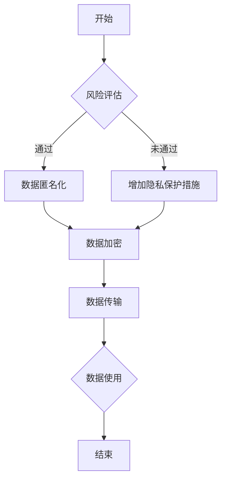

                 

# AI创业：数据隐私管理

> 关键词：人工智能，数据隐私，数据安全，隐私保护技术，AI创业

> 摘要：随着人工智能技术的飞速发展，数据隐私管理成为AI创业领域面临的重要挑战。本文从基础概念、技术实践、法律法规等多个角度，详细探讨了AI数据隐私管理的方法与策略，为创业者提供了有益的参考。

### 《AI创业：数据隐私管理》目录大纲

#### 第一部分：AI与数据隐私管理基础

#### 第二部分：AI数据隐私保护技术

#### 第三部分：AI数据隐私管理实践

#### 第四部分：AI数据隐私管理的未来趋势

#### 第五部分：附录

### 第一部分：AI与数据隐私管理基础

#### 第1章: AI与数据隐私管理概述

### 1.1 AI技术的快速发展
### 1.2 数据隐私保护的必要性
### 1.3 数据隐私管理的重要性

### 1.4 数据隐私管理概念解析

### 1.5 数据隐私与数据安全的区别
### 1.6 数据隐私管理的基本原则

### 1.7 数据隐私法律法规概述

### 1.8 企业合规策略与实施

### 第一部分总结

### 第一部分：AI与数据隐私管理基础

在当今数字化时代，人工智能（AI）技术的快速发展已经成为推动产业变革的重要力量。然而，随着AI技术的广泛应用，数据隐私管理成为一个不可忽视的重要问题。AI创业企业如何在确保数据隐私的前提下，充分利用数据的价值，成为了一个亟待解决的关键课题。

本章将首先介绍AI技术的快速发展，分析数据隐私保护的必要性，探讨数据隐私管理的重要性。接着，我们将对数据隐私管理的基本概念进行深入解析，并探讨数据隐私与数据安全的区别。最后，我们将简要概述数据隐私法律法规的背景和基本内容，为企业制定合规策略提供指导。

通过本章的学习，读者将初步了解AI与数据隐私管理的基础知识，为后续章节的深入探讨奠定基础。

### 1.1 AI技术的快速发展

人工智能技术的快速发展是近年来最为引人注目的科技进步之一。从最初的机器学习、深度学习，到如今的自然语言处理、计算机视觉等，AI技术已经渗透到了各个领域，带来了巨大的变革。AI技术的核心在于通过算法和大量数据的训练，让计算机具备类似人类的智能能力，从而在图像识别、语音识别、决策支持、自动化控制等方面表现出色。

#### 人工智能技术的里程碑

人工智能技术的发展可以分为多个阶段：

1. **符号主义智能（Symbolic AI）**：这是最早的AI研究方法，通过编写规则和逻辑推理来模拟人类智能。虽然这种方法在某些领域表现出色，但因其受限于规则和知识的表达方式，难以处理复杂问题。

2. **知识表示和推理（Knowledge Representation and Reasoning）**：这种方法试图将人类知识和推理过程编码到计算机系统中。专家系统和基于规则的系统是这一阶段的代表性成果。

3. **统计学习（Statistical Learning）**：20世纪90年代以来，统计学习方法，特别是基于监督学习的算法（如决策树、支持向量机等）取得了显著进展。这一阶段标志着机器学习时代的到来。

4. **深度学习（Deep Learning）**：近年来，随着计算力和数据量的提升，深度学习技术迅速崛起。深度神经网络（DNN）、卷积神经网络（CNN）、循环神经网络（RNN）等模型在图像识别、语音识别、自然语言处理等领域表现出惊人的能力。

5. **强化学习（Reinforcement Learning）**：强化学习通过试错和奖励机制来训练模型，使得AI系统能够在动态环境中做出最优决策。AlphaGo在围棋比赛中的表现，展示了强化学习在复杂决策问题上的潜力。

#### AI技术的应用领域

人工智能技术已经在众多领域得到了广泛应用：

1. **医疗健康**：AI技术被用于疾病诊断、药物研发、医疗影像分析等。例如，通过AI算法可以更快速、准确地识别癌症，提高治疗效果。

2. **金融**：AI技术在风险管理、欺诈检测、智能投顾等方面发挥了重要作用。金融机构利用机器学习算法来分析海量数据，提供更加个性化的金融服务。

3. **制造业**：AI技术在工业自动化、质量检测、供应链管理等方面应用广泛。通过机器视觉和智能制造技术，制造业实现了更高的生产效率和产品质量。

4. **交通**：自动驾驶技术是AI在交通领域的重要应用。通过深度学习和传感器技术，自动驾驶汽车能够在复杂的交通环境中安全行驶。

5. **零售**：AI技术在零售业中的应用涵盖了智能推荐、库存管理、客户关系管理等方面。通过分析消费者行为数据，零售企业能够提供更加个性化的购物体验。

#### AI技术的挑战

尽管AI技术在多个领域取得了显著成就，但其发展也面临着一些挑战：

1. **数据隐私和安全**：AI系统需要大量数据来训练，这往往涉及到个人隐私问题。如何确保数据隐私和安全成为AI技术应用的一个重要课题。

2. **算法透明性和可解释性**：AI系统的决策过程往往不透明，缺乏可解释性。这导致用户难以理解AI系统的决策逻辑，甚至可能产生误导。

3. **伦理和道德**：AI技术在某些应用中可能会引发伦理和道德问题，例如自动驾驶汽车的道德决策、智能招聘系统的偏见等。

4. **技术普及和人才短缺**：AI技术的发展需要大量的专业人才，但目前人才供需存在较大缺口。如何培养和吸引AI人才，是AI技术普及的关键。

综上所述，人工智能技术的快速发展为各行业带来了前所未有的机遇，但同时也带来了数据隐私和安全等挑战。在AI创业过程中，企业需要深入理解AI技术的基本概念和发展趋势，同时重视数据隐私保护，以确保技术在合规和伦理的前提下得到广泛应用。

### 1.2 数据隐私保护的必要性

随着人工智能技术的广泛应用，数据隐私保护成为了一个不可忽视的重要问题。在AI创业过程中，如何确保用户数据的隐私，不仅关乎企业的声誉和竞争力，也直接影响到用户的信任和使用体验。以下是数据隐私保护的必要性详细分析。

#### 数据隐私的重要性

数据隐私是指个人数据在收集、存储、处理和传输过程中的保密性和完整性。保护数据隐私的重要性体现在以下几个方面：

1. **用户信任**：数据隐私保护是建立用户信任的基础。当用户使用AI产品或服务时，他们期望自己的个人信息能够得到妥善保护，避免被滥用或泄露。

2. **法律法规要求**：在全球范围内，许多国家和地区已经出台了数据隐私保护的法律和法规，如欧盟的《通用数据保护条例》（GDPR）和中国的《网络安全法》。企业必须遵守这些法律法规，否则将面临巨额罚款和声誉损失。

3. **商业竞争**：在激烈的市场竞争中，数据隐私保护成为企业的重要竞争优势。一家能够提供安全、可靠数据隐私保护服务的公司，更容易获得用户和市场认可。

4. **社会责任**：企业作为社会的一部分，有责任保护用户的隐私，维护社会的公共利益。数据隐私保护不仅是企业的法律责任，也是企业的社会责任。

#### 数据隐私风险

在AI创业过程中，数据隐私面临多种潜在风险，包括：

1. **数据泄露**：由于系统漏洞、不当的数据存储和管理，可能导致敏感数据被未授权人员获取。

2. **数据滥用**：即使数据未被泄露，但如果企业未能妥善管理数据，也可能被内部人员滥用，用于不当用途。

3. **数据交叉引用**：通过不同的数据源进行交叉引用，可能导致用户隐私信息被还原，从而引发隐私泄露。

4. **数据滥用风险**：用户数据可能被用于广告定向、市场细分等商业活动，这可能会对用户隐私造成侵害。

#### 数据隐私保护的必要性

基于上述数据隐私的重要性及风险，数据隐私保护在AI创业中的必要性体现在以下几个方面：

1. **合规性要求**：企业需要遵守相关的数据隐私保护法律法规，确保业务合规运营。

2. **用户体验**：通过提供安全、可靠的数据隐私保护服务，提升用户信任和满意度，从而增强用户体验。

3. **商业价值**：数据隐私保护不仅符合法律法规要求，还能为企业带来商业价值，如建立良好的品牌声誉，吸引更多的用户和投资者。

4. **社会责任**：保护用户隐私是企业社会责任的体现，有助于维护社会公共利益。

综上所述，数据隐私保护在AI创业中具有重要意义。企业必须认识到数据隐私保护的必要性，采取有效的措施来确保用户数据的安全和隐私，这不仅符合法律法规的要求，也是企业长远发展的关键。

### 1.3 数据隐私管理的重要性

在AI创业过程中，数据隐私管理的重要性不容忽视。有效的数据隐私管理不仅能够帮助企业遵守法律法规，降低法律风险，还能增强用户信任，提升用户体验，从而为企业带来长期竞争优势。以下是数据隐私管理的重要性详细探讨。

#### 法律法规的遵守

数据隐私管理的首要任务是确保企业遵守相关的法律法规。在全球范围内，各国已经出台了多项数据隐私保护法律和法规，如欧盟的《通用数据保护条例》（GDPR）和中国的《网络安全法》。这些法律法规对数据的收集、存储、处理和传输等环节提出了严格的要求，企业必须严格遵守。以下是一些关键法规及其要点：

1. **《通用数据保护条例》（GDPR）**：GDPR是欧盟于2018年实施的一项数据隐私保护法规，旨在加强个人数据保护。其主要要求包括：
   - **数据主体权利**：用户有权访问、修改、删除自己的个人数据。
   - **合法基础**：企业必须基于明确、合法的基础收集和处理个人数据。
   - **数据泄露通知**：企业必须在72小时内通知数据保护监管机构和个人数据泄露事件。
   - **数据保护官**：大型企业必须指定数据保护官（DPO）负责数据隐私保护工作。

2. **《网络安全法》**：中国的《网络安全法》于2017年实施，旨在加强网络安全保护。其主要要求包括：
   - **数据本地化**：涉及关键信息基础设施的运营者，其运营的数据应当在中华人民共和国境内存储。
   - **个人信息保护**：网络运营者必须采取技术和管理措施，保障个人信息安全，防止个人信息泄露、毁损。
   - **数据安全评估**：重要数据处理者在项目启动前必须进行数据安全评估。

通过有效实施数据隐私管理，企业能够确保自身业务符合这些法律法规的要求，避免因违规而遭受罚款和声誉损失。

#### 降低法律风险

数据隐私管理的一个重要目标是降低法律风险。随着数据隐私保护法律法规的不断完善，企业面临的监管和处罚力度也在加大。以下是一些常见的法律风险及其应对策略：

1. **数据泄露**：数据泄露是企业面临的主要法律风险之一。为了降低这一风险，企业可以采取以下措施：
   - **数据加密**：对敏感数据进行加密处理，确保数据在存储和传输过程中不被未授权人员读取。
   - **访问控制**：实施严格的访问控制策略，确保只有授权人员能够访问敏感数据。
   - **安全审计**：定期进行安全审计，发现并修复系统漏洞，确保数据安全。

2. **用户投诉**：用户因数据隐私问题投诉或提起诉讼，会给企业带来法律风险和声誉损失。企业可以通过以下措施来应对用户投诉：
   - **透明度**：在收集和处理用户数据时，明确告知用户数据的使用目的和范围，提高透明度。
   - **用户教育**：通过教育和宣传，提高用户的隐私保护意识，减少用户投诉。

3. **跨国数据传输**：企业在进行跨国数据传输时，需要遵守不同国家的数据隐私保护法律法规。例如，GDPR对跨国数据传输有严格限制。企业可以通过以下措施降低跨国数据传输的法律风险：
   - **数据本地化**：将数据存储在本国服务器上，减少跨国传输。
   - **数据传输协议**：签署标准合同条款（Model Contract Clauses），确保数据传输符合GDPR的要求。

#### 增强用户信任

数据隐私管理不仅关乎法律合规性，还直接影响用户的信任和满意度。以下措施可以帮助企业增强用户信任：

1. **用户隐私保护承诺**：企业可以在隐私政策中明确承诺保护用户隐私，增强用户的信任感。

2. **透明度**：通过公开数据隐私政策和实践，提高企业的透明度，让用户了解自己的数据如何被使用和保护。

3. **用户参与**：鼓励用户参与数据隐私管理，例如提供数据访问和删除功能，让用户能够自主管理自己的数据。

#### 提升用户体验

良好的数据隐私管理能够提升用户体验，从而增强用户忠诚度。以下措施可以帮助提升用户体验：

1. **个性化服务**：通过保护用户数据隐私，企业能够提供更加个性化的服务，满足用户需求。

2. **快速响应**：在数据隐私问题出现时，企业能够迅速响应，解决用户问题，提升用户满意度。

3. **用户教育**：通过用户教育，提高用户对数据隐私保护的认识，使用户能够更好地保护自己的数据。

#### 数据隐私管理的长期竞争优势

数据隐私管理不仅关乎当前的合规性和用户体验，还能为企业带来长期竞争优势。以下是一些竞争优势：

1. **品牌声誉**：企业通过有效的数据隐私管理，建立良好的品牌声誉，吸引更多用户和合作伙伴。

2. **市场竞争力**：在数据隐私保护日益重要的今天，提供安全、可靠的数据隐私保护服务，将成为企业的核心竞争力之一。

3. **技术创新**：数据隐私管理需要技术创新，企业可以通过不断优化数据隐私保护技术，推动技术创新，提升企业的技术实力。

综上所述，数据隐私管理在AI创业中具有极其重要的意义。通过有效实施数据隐私管理，企业不仅能够确保合规运营，降低法律风险，还能增强用户信任，提升用户体验，从而获得长期竞争优势。

### 1.4 数据隐私管理概念解析

数据隐私管理是指通过一系列策略、技术和流程来保护个人数据的隐私性、完整性和可用性。理解数据隐私管理的基本概念对于AI创业企业至关重要。以下是数据隐私管理的主要组成部分和其具体定义。

#### 数据隐私

数据隐私是指个人数据在收集、存储、处理和传输过程中保持保密性和私密性的状态。具体来说，数据隐私涉及以下几个方面：

1. **保密性**：确保个人数据不被未授权的人员访问或泄露。
2. **隐私权**：个人对其数据的控制权，包括数据的访问、修改和删除。
3. **匿名性**：通过数据匿名化技术，使得个人数据无法直接识别特定的个人。

#### 数据匿名化

数据匿名化是一种重要的隐私保护技术，通过在保留数据价值的同时去除或隐藏个人身份信息，从而保护数据隐私。数据匿名化技术可以分为以下几类：

1. **k-匿名性**：指在最小化数据信息丢失的同时，确保无法通过单个记录识别个体身份。
2. **l-多样性**：确保一组数据记录中，对于任何一个个体，至少存在l个不同的记录与之相关联，从而防止通过记录集合识别个体。
3. **t-接近性**：确保匿名化后的数据与原始数据在统计上保持相似性，以保留数据的分析价值。

#### 数据安全

数据安全是指通过一系列技术和管理措施来保护数据免受未经授权的访问、使用、泄露、破坏、修改和丢失。数据安全包括以下方面：

1. **访问控制**：通过访问控制列表（ACL）和多因素认证（MFA）等技术，确保只有授权用户可以访问数据。
2. **加密**：使用加密算法对敏感数据进行加密，防止未授权人员读取数据。
3. **防火墙和入侵检测**：部署防火墙和入侵检测系统（IDS），监控并防止网络攻击。

#### 数据隐私与数据安全的区别

虽然数据隐私和数据安全都是保护数据的重要方面，但它们在目标和侧重点上有所不同：

1. **目标不同**：数据隐私的主要目标是保护个人数据的隐私权，确保数据不被未授权人员访问和使用；而数据安全的目标是保护数据的完整性、可用性和保密性，防止数据泄露、篡改和丢失。

2. **措施不同**：数据隐私侧重于通过匿名化、加密等手段减少个人数据的使用，以保护隐私；而数据安全则侧重于通过访问控制、防火墙、加密等手段保护数据不被未授权访问。

3. **范围不同**：数据隐私主要关注个人数据，而数据安全涵盖所有类型的数据，包括个人、企业、国家等。

#### 数据隐私管理的基本原则

数据隐私管理需要遵循一系列基本原则，以确保数据隐私得到有效保护：

1. **最小化原则**：收集和存储的数据量应限制在最少必要范围内，以减少隐私泄露的风险。
2. **目的明确原则**：明确数据收集和处理的目的，并确保数据处理活动符合既定目的。
3. **透明度原则**：对用户告知数据处理活动的目的、方式和范围，提高透明度，增加用户信任。
4. **责任原则**：明确数据隐私管理的责任人和责任范围，确保隐私保护措施得到有效实施。
5. **可审计原则**：建立数据隐私管理的审计机制，确保隐私保护措施得到持续监督和改进。

通过理解数据隐私管理的基本概念，AI创业企业可以制定更加科学、有效的数据隐私保护策略，确保在数据驱动的业务发展过程中，用户隐私得到充分保护。

### 1.5 数据隐私法律法规概述

数据隐私法律法规是各国为了保护个人数据隐私而制定的法律框架和政策。在全球范围内，各国已经出台了多项重要的数据隐私保护法律和法规，如欧盟的《通用数据保护条例》（GDPR）和中国的《网络安全法》。以下是这些法律和法规的基本内容、实施背景及其对企业的影响。

#### 全球数据隐私法规回顾

1. **《通用数据保护条例》（GDPR）**

   - **基本内容**：GDPR是欧盟于2018年5月25日生效的一项全面的数据隐私保护法律。其主要内容包括：
     - **数据主体权利**：用户享有访问、修改、删除自己的个人数据以及数据可携权。
     - **数据最小化原则**：企业必须只收集和处理必要的个人数据，并确保这些数据是准确的、相关的和有限的。
     - **数据泄露通知**：企业在发生数据泄露事件时，必须在72小时内通知数据保护监管机构和受影响的用户。
     - **数据保护官（DPO）**：大型企业必须指定数据保护官，负责监督和确保数据隐私保护合规。
   - **实施背景**：GDPR旨在加强欧盟范围内的个人数据保护，应对数字化时代的隐私挑战。
   - **对企业的影响**：GDPR对企业的数据隐私保护提出了更高的要求，违反GDPR可能导致高额罚款和声誉损失。因此，企业需要投入更多资源来确保合规。

2. **《加州消费者隐私法》（CCPA）**

   - **基本内容**：CCPA是2018年美国加州通过的一项数据隐私保护法律，旨在保护加州居民的隐私权。其主要内容包括：
     - **消费者权利**：消费者有权访问、删除和拒绝出售自己的个人数据。
     - **透明度要求**：企业必须在隐私政策中明确说明个人数据的收集、使用和处理方式。
     - **数据泄露通知**：企业在发生数据泄露事件时，必须在30天内通知受影响的消费者。
   - **实施背景**：CCPA是为了应对消费者对数据隐私保护的日益关注，并推动企业更加透明和负责任地处理个人数据。
   - **对企业的影响**：CCPA要求企业在数据处理方面更加透明和合规，违反CCPA可能导致消费者诉讼和罚款。

3. **《个人信息保护法》（PIPL）**

   - **基本内容**：PIPL是中国于2021年11月1日起实施的一项数据隐私保护法律，旨在保护个人信息权益。其主要内容包括：
     - **个人信息定义**：明确了个人信息的定义和范围，包括姓名、身份证号码、生物识别信息等。
     - **数据处理原则**：企业必须遵循合法、正当、必要的原则处理个人信息。
     - **个人信息保护措施**：企业需要采取技术和管理措施保护个人信息安全，防止泄露、篡改和丢失。
   - **实施背景**：PIPL是中国应对数字化时代隐私挑战的重要举措，旨在保护公民的个人信息权益。
   - **对企业的影响**：PIPL要求企业在个人信息处理方面严格遵守法律规定，违反PIPL可能导致行政处罚和民事责任。

#### 中国数据隐私法规简介

1. **《网络安全法》**

   - **基本内容**：网络安全法于2017年6月1日实施，是中国网络安全领域的基本法律。其主要内容包括：
     - **网络运营者责任**：网络运营者必须采取必要措施保护网络数据和信息安全。
     - **数据本地化**：涉及关键信息基础设施的运营者，其运营的数据应当在中华人民共和国境内存储。
     - **数据安全评估**：重要数据处理者在项目启动前必须进行数据安全评估。
   - **实施背景**：网络安全法旨在加强网络安全保护，维护国家安全和社会公共利益。
   - **对企业的影响**：网络安全法对企业的网络安全和数据保护提出了严格要求，违反网络安全法可能导致行政处罚和民事责任。

2. **《个人信息保护法》（PIPL）**

   - **基本内容**：PIPL于2021年11月1日实施，是中国首部个人信息保护综合性法律。其主要内容包括：
     - **个人信息定义**：明确了个人信息的定义和范围，包括姓名、身份证号码、生物识别信息等。
     - **数据处理原则**：企业必须遵循合法、正当、必要的原则处理个人信息。
     - **个人信息保护措施**：企业需要采取技术和管理措施保护个人信息安全，防止泄露、篡改和丢失。
   - **实施背景**：PIPL是中国应对数字化时代隐私挑战的重要举措，旨在保护公民的个人信息权益。
   - **对企业的影响**：PIPL要求企业在个人信息处理方面严格遵守法律规定，违反PIPL可能导致行政处罚和民事责任。

#### 企业合规策略与实施

为了确保在数据隐私保护方面合规，企业可以采取以下策略：

1. **制定隐私政策**：明确数据收集、使用、存储和共享的规则，并在企业网站上公布。

2. **进行隐私影响评估（PIA）**：在处理个人数据前，进行隐私影响评估，识别潜在的隐私风险。

3. **建立数据保护机制**：包括数据加密、访问控制、安全审计等，确保个人数据安全。

4. **培训员工**：定期进行员工培训，提高员工对数据隐私保护的认识和意识。

5. **遵守跨地域数据传输规定**：对于跨国数据传输，遵守相关法规和标准，确保数据传输合规。

通过了解和遵循全球和中国数据隐私法律法规，企业可以在确保合规的同时，有效保护用户数据隐私，提升企业的社会责任形象和市场竞争力。

### 1.6 数据隐私管理的基本原则

在数据隐私管理中，企业必须遵循一系列基本原则，以确保数据隐私得到有效保护，同时满足法律法规的要求。以下是数据隐私管理的基本原则及其具体应用：

#### 最小化原则

最小化原则要求企业在收集和处理个人数据时，只收集实现特定目的所必需的数据，避免过度收集。这一原则的应用包括：

1. **明确数据收集目的**：在数据收集前，明确数据将如何被使用，并确保收集的数据量最小化。
2. **限制数据存储时间**：数据应在达到存储目的后及时删除，避免长期保留不再使用的数据。

#### 合法性原则

合法性原则要求企业在收集、使用和存储个人数据时，必须基于合法、明确和公正的理由，并获得数据主体的明确同意。

1. **合法基础**：企业必须基于合法基础，如合同、法律义务或合法利益，收集和使用个人数据。
2. **知情同意**：在数据收集和使用过程中，企业应确保数据主体明确了解数据处理的目的、方式、范围和可能的风险，并自愿同意。

#### 目的明确原则

目的明确原则要求企业在数据处理过程中，必须确保数据处理活动与原始数据处理目的保持一致，不得超出既定目的。

1. **数据处理目的明确**：在数据收集前，企业应明确数据处理的目的，并确保数据处理活动符合既定目的。
2. **限制用途变更**：如需变更数据处理目的，企业应重新获得数据主体的同意。

#### 透明度原则

透明度原则要求企业在数据处理活动中，对数据主体公开信息，确保数据主体能够了解其个人数据被如何处理。

1. **隐私政策**：企业应在官方网站或相关平台上公布详细的隐私政策，明确数据收集、使用、存储和共享的规则。
2. **用户告知**：在数据收集和处理过程中，企业应告知数据主体数据处理的具体情况，提高透明度。

#### 责任原则

责任原则要求企业在数据隐私管理中，明确责任人和责任范围，确保数据隐私保护措施得到有效实施。

1. **明确责任人**：企业应指定数据保护官（DPO）或其他责任人，负责监督和实施数据隐私保护措施。
2. **责任追究**：企业应建立责任追究机制，对于违反数据隐私保护规定的行为，应追究相应责任。

#### 可审计原则

可审计原则要求企业建立数据隐私管理的审计机制，确保数据处理活动能够被记录、追踪和审查。

1. **记录保存**：企业应记录数据处理活动的详细信息，包括数据收集、使用、存储和共享等。
2. **安全审计**：定期进行安全审计，评估数据隐私保护措施的执行情况和效果。

通过遵循这些基本原则，企业可以确保数据隐私得到有效保护，同时满足法律法规的要求，提升用户的信任和满意度，为企业的长期发展奠定坚实基础。

### 第一部分总结

本文的第一部分详细探讨了AI与数据隐私管理的基础知识。首先，介绍了AI技术的快速发展及其在各领域的应用，分析了数据隐私保护的必要性。接着，阐述了数据隐私管理的重要性，包括法律法规的遵守、降低法律风险、增强用户信任和提升用户体验等方面。此外，还对数据隐私管理的基本概念进行了深入解析，包括数据隐私、数据匿名化和数据安全，并简要概述了全球和中国的重要数据隐私法律法规。通过本文的讨论，读者可以初步了解AI数据隐私管理的基础知识，为后续更深入的技术和实践探讨奠定基础。

### 第一部分：AI与数据隐私管理基础

#### 第1章: AI与数据隐私管理概述

### 1.1 AI技术的快速发展
### 1.2 数据隐私保护的必要性
### 1.3 数据隐私管理的重要性
### 1.4 数据隐私管理概念解析
### 1.5 数据隐私法律法规概述
### 1.6 数据隐私管理的基本原则
### 第一部分总结

#### 第1章: AI与数据隐私管理概述

在当今数字化时代，人工智能（AI）技术的飞速发展已成为推动产业变革的重要力量。与此同时，数据隐私管理作为一个关键问题，日益受到广泛关注。本章将深入探讨AI与数据隐私管理之间的关系，分析AI技术发展带来的挑战，并介绍数据隐私管理的基本概念和重要性。

### 1.1 AI技术的快速发展

人工智能技术的快速发展是近年来最为引人注目的科技进步之一。从最初的机器学习、深度学习，到如今的自然语言处理、计算机视觉等，AI技术已经渗透到了各个领域，带来了巨大的变革。

#### 人工智能技术的里程碑

人工智能技术的发展可以分为多个阶段：

1. **符号主义智能（Symbolic AI）**：这是最早的AI研究方法，通过编写规则和逻辑推理来模拟人类智能。虽然这种方法在某些领域表现出色，但因其受限于规则和知识的表达方式，难以处理复杂问题。

2. **知识表示和推理（Knowledge Representation and Reasoning）**：这种方法试图将人类知识和推理过程编码到计算机系统中。专家系统和基于规则的系统是这一阶段的代表性成果。

3. **统计学习（Statistical Learning）**：20世纪90年代以来，统计学习方法，特别是基于监督学习的算法（如决策树、支持向量机等）取得了显著进展。这一阶段标志着机器学习时代的到来。

4. **深度学习（Deep Learning）**：近年来，随着计算力和数据量的提升，深度学习技术迅速崛起。深度神经网络（DNN）、卷积神经网络（CNN）、循环神经网络（RNN）等模型在图像识别、语音识别、自然语言处理等领域表现出惊人的能力。

5. **强化学习（Reinforcement Learning）**：强化学习通过试错和奖励机制来训练模型，使得AI系统能够在动态环境中做出最优决策。AlphaGo在围棋比赛中的表现，展示了强化学习在复杂决策问题上的潜力。

#### AI技术的应用领域

人工智能技术已经在众多领域得到了广泛应用：

1. **医疗健康**：AI技术在疾病诊断、药物研发、医疗影像分析等医疗领域得到了广泛应用。例如，通过AI算法可以更快速、准确地识别癌症，提高治疗效果。

2. **金融**：AI技术在风险管理、欺诈检测、智能投顾等方面发挥了重要作用。金融机构利用机器学习算法来分析海量数据，提供更加个性化的金融服务。

3. **制造业**：AI技术在工业自动化、质量检测、供应链管理等方面应用广泛。通过机器视觉和智能制造技术，制造业实现了更高的生产效率和产品质量。

4. **交通**：自动驾驶技术是AI在交通领域的重要应用。通过深度学习和传感器技术，自动驾驶汽车能够在复杂的交通环境中安全行驶。

5. **零售**：AI技术在零售业中的应用涵盖了智能推荐、库存管理、客户关系管理等方面。通过分析消费者行为数据，零售企业能够提供更加个性化的购物体验。

#### AI技术的挑战

尽管AI技术在多个领域取得了显著成就，但其发展也面临着一些挑战：

1. **数据隐私和安全**：AI系统需要大量数据来训练，这往往涉及到个人隐私问题。如何确保数据隐私和安全成为AI技术应用的一个重要课题。

2. **算法透明性和可解释性**：AI系统的决策过程往往不透明，缺乏可解释性。这导致用户难以理解AI系统的决策逻辑，甚至可能产生误导。

3. **伦理和道德**：AI技术在某些应用中可能会引发伦理和道德问题，例如自动驾驶汽车的道德决策、智能招聘系统的偏见等。

4. **技术普及和人才短缺**：AI技术的发展需要大量的专业人才，但目前人才供需存在较大缺口。如何培养和吸引AI人才，是AI技术普及的关键。

综上所述，人工智能技术的快速发展为各行业带来了前所未有的机遇，但同时也带来了数据隐私和安全等挑战。在AI创业过程中，企业需要深入理解AI技术的基本概念和发展趋势，同时重视数据隐私保护，以确保技术在合规和伦理的前提下得到广泛应用。

### 1.2 数据隐私保护的必要性

随着人工智能技术的广泛应用，数据隐私保护成为了一个不可忽视的重要问题。在AI创业过程中，如何确保用户数据的隐私，不仅关乎企业的声誉和竞争力，也直接影响到用户的信任和使用体验。以下是数据隐私保护的必要性详细分析。

#### 数据隐私的重要性

数据隐私是指个人数据在收集、存储、处理和传输过程中的保密性和完整性。保护数据隐私的重要性体现在以下几个方面：

1. **用户信任**：数据隐私保护是建立用户信任的基础。当用户使用AI产品或服务时，他们期望自己的个人信息能够得到妥善保护，避免被滥用或泄露。

2. **法律法规要求**：在全球范围内，许多国家和地区已经出台了数据隐私保护的法律和法规，如欧盟的《通用数据保护条例》（GDPR）和中国的《网络安全法》。企业必须遵守这些法律法规，否则将面临巨额罚款和声誉损失。

3. **商业竞争**：在激烈的市场竞争中，数据隐私保护成为企业的重要竞争优势。一家能够提供安全、可靠数据隐私保护服务的公司，更容易获得用户和市场认可。

4. **社会责任**：企业作为社会的一部分，有责任保护用户的隐私，维护社会的公共利益。数据隐私保护不仅是企业的法律责任，也是企业的社会责任。

#### 数据隐私风险

在AI创业过程中，数据隐私面临多种潜在风险，包括：

1. **数据泄露**：由于系统漏洞、不当的数据存储和管理，可能导致敏感数据被未授权人员获取。

2. **数据滥用**：即使数据未被泄露，但如果企业未能妥善管理数据，也可能被内部人员滥用，用于不当用途。

3. **数据交叉引用**：通过不同的数据源进行交叉引用，可能导致用户隐私信息被还原，从而引发隐私泄露。

4. **数据滥用风险**：用户数据可能被用于广告定向、市场细分等商业活动，这可能会对用户隐私造成侵害。

#### 数据隐私保护的必要性

基于上述数据隐私的重要性及风险，数据隐私保护在AI创业中的必要性体现在以下几个方面：

1. **合规性要求**：企业需要遵守相关的数据隐私保护法律法规，确保业务合规运营。

2. **用户体验**：通过提供安全、可靠的数据隐私保护服务，提升用户信任和满意度，从而增强用户体验。

3. **商业价值**：数据隐私保护不仅符合法律法规的要求，还能为企业带来商业价值，如建立良好的品牌声誉，吸引更多的用户和投资者。

4. **社会责任**：保护用户隐私是企业社会责任的体现，有助于维护社会公共利益。

综上所述，数据隐私保护在AI创业中具有重要意义。企业必须认识到数据隐私保护的必要性，采取有效的措施来确保用户数据的安全和隐私，这不仅符合法律法规的要求，也是企业长远发展的关键。

### 1.3 数据隐私管理的重要性

在AI创业过程中，数据隐私管理的重要性不容忽视。有效的数据隐私管理不仅能够帮助企业遵守法律法规，降低法律风险，还能增强用户信任，提升用户体验，从而为企业带来长期竞争优势。以下是数据隐私管理的重要性详细探讨。

#### 法律法规的遵守

数据隐私管理的首要任务是确保企业遵守相关的法律法规。在全球范围内，各国已经出台了多项数据隐私保护法律和法规，如欧盟的《通用数据保护条例》（GDPR）和中国的《网络安全法》。这些法律法规对数据的收集、存储、处理和传输等环节提出了严格的要求，企业必须严格遵守。以下是一些关键法规及其要点：

1. **《通用数据保护条例》（GDPR）**：GDPR是欧盟于2018年实施的一项数据隐私保护法规，旨在加强个人数据保护。其主要要求包括：
   - **数据主体权利**：用户有权访问、修改、删除自己的个人数据。
   - **合法基础**：企业必须基于明确、合法的基础收集和处理个人数据。
   - **数据泄露通知**：企业必须在72小时内通知数据保护监管机构和个人数据泄露事件。
   - **数据保护官**：大型企业必须指定数据保护官（DPO）负责数据隐私保护工作。

2. **《网络安全法》**：中国的《网络安全法》于2017年实施，旨在加强网络安全保护。其主要要求包括：
   - **数据本地化**：涉及关键信息基础设施的运营者，其运营的数据应当在中华人民共和国境内存储。
   - **个人信息保护**：网络运营者必须采取技术和管理措施，保障个人信息安全，防止个人信息泄露、毁损。
   - **数据安全评估**：重要数据处理者在项目启动前必须进行数据安全评估。

通过有效实施数据隐私管理，企业能够确保自身业务符合这些法律法规的要求，避免因违规而遭受罚款和声誉损失。

#### 降低法律风险

数据隐私管理的一个重要目标是降低法律风险。随着数据隐私保护法律法规的不断完善，企业面临的监管和处罚力度也在加大。以下是一些常见的法律风险及其应对策略：

1. **数据泄露**：数据泄露是企业面临的主要法律风险之一。为了降低这一风险，企业可以采取以下措施：
   - **数据加密**：对敏感数据进行加密处理，确保数据在存储和传输过程中不被未授权人员读取。
   - **访问控制**：实施严格的访问控制策略，确保只有授权人员能够访问敏感数据。
   - **安全审计**：定期进行安全审计，发现并修复系统漏洞，确保数据安全。

2. **用户投诉**：用户因数据隐私问题投诉或提起诉讼，会给企业带来法律风险和声誉损失。企业可以通过以下措施来应对用户投诉：
   - **透明度**：在收集和处理用户数据时，明确告知用户数据的使用目的和范围，提高透明度。
   - **用户教育**：通过教育和宣传，提高用户的隐私保护意识，减少用户投诉。

3. **跨国数据传输**：企业在进行跨国数据传输时，需要遵守不同国家的数据隐私保护法律法规。例如，GDPR对跨国数据传输有严格限制。企业可以通过以下措施降低跨国数据传输的法律风险：
   - **数据本地化**：将数据存储在本国服务器上，减少跨国传输。
   - **数据传输协议**：签署标准合同条款（Model Contract Clauses），确保数据传输符合GDPR的要求。

#### 增强用户信任

数据隐私管理不仅关乎法律合规性，还直接影响用户的信任和满意度。以下措施可以帮助企业增强用户信任：

1. **用户隐私保护承诺**：企业可以在隐私政策中明确承诺保护用户隐私，增强用户的信任感。

2. **透明度**：通过公开数据隐私政策和实践，提高企业的透明度，让用户了解自己的数据如何被使用和保护。

3. **用户参与**：鼓励用户参与数据隐私管理，例如提供数据访问和删除功能，让用户能够自主管理自己的数据。

#### 提升用户体验

良好的数据隐私管理能够提升用户体验，从而增强用户忠诚度。以下措施可以帮助提升用户体验：

1. **个性化服务**：通过保护用户数据隐私，企业能够提供更加个性化的服务，满足用户需求。

2. **快速响应**：在数据隐私问题出现时，企业能够迅速响应，解决用户问题，提升用户满意度。

3. **用户教育**：通过用户教育，提高用户对数据隐私保护的认识，使用户能够更好地保护自己的数据。

#### 数据隐私管理的长期竞争优势

数据隐私管理不仅关乎当前的合规性和用户体验，还能为企业带来长期竞争优势。以下是一些竞争优势：

1. **品牌声誉**：企业通过有效的数据隐私管理，建立良好的品牌声誉，吸引更多用户和合作伙伴。

2. **市场竞争力**：在数据隐私保护日益重要的今天，提供安全、可靠的数据隐私保护服务，将成为企业的核心竞争力之一。

3. **技术创新**：数据隐私管理需要技术创新，企业可以通过不断优化数据隐私保护技术，推动技术创新，提升企业的技术实力。

综上所述，数据隐私管理在AI创业中具有极其重要的意义。通过有效实施数据隐私管理，企业不仅能够确保合规运营，降低法律风险，还能增强用户信任，提升用户体验，从而获得长期竞争优势。

### 1.4 数据隐私管理概念解析

数据隐私管理是指通过一系列策略、技术和流程来保护个人数据的隐私性、完整性和可用性。理解数据隐私管理的基本概念对于AI创业企业至关重要。以下是数据隐私管理的主要组成部分和其具体定义。

#### 数据隐私

数据隐私是指个人数据在收集、存储、处理和传输过程中保持保密性和私密性的状态。具体来说，数据隐私涉及以下几个方面：

1. **保密性**：确保个人数据不被未授权的人员访问或泄露。
2. **隐私权**：个人对其数据的控制权，包括数据的访问、修改和删除。
3. **匿名性**：通过数据匿名化技术，使得个人数据无法直接识别特定的个人。

#### 数据匿名化

数据匿名化是一种重要的隐私保护技术，通过在保留数据价值的同时去除或隐藏个人身份信息，从而保护数据隐私。数据匿名化技术可以分为以下几类：

1. **k-匿名性**：指在最小化数据信息丢失的同时，确保无法通过单个记录识别个体身份。
2. **l-多样性**：确保一组数据记录中，对于任何一个个体，至少存在l个不同的记录与之相关联，从而防止通过记录集合识别个体。
3. **t-接近性**：确保匿名化后的数据与原始数据在统计上保持相似性，以保留数据的分析价值。

#### 数据安全

数据安全是指通过一系列技术和管理措施来保护数据免受未经授权的访问、使用、泄露、破坏、修改和丢失。数据安全包括以下方面：

1. **访问控制**：通过访问控制列表（ACL）和多因素认证（MFA）等技术，确保只有授权用户可以访问数据。
2. **加密**：使用加密算法对敏感数据进行加密，防止未授权人员读取数据。
3. **防火墙和入侵检测**：部署防火墙和入侵检测系统（IDS），监控并防止网络攻击。

#### 数据隐私与数据安全的区别

虽然数据隐私和数据安全都是保护数据的重要方面，但它们在目标和侧重点上有所不同：

1. **目标不同**：数据隐私的主要目标是保护个人数据的隐私权，确保数据不被未授权人员访问和使用；而数据安全的目标是保护数据的完整性、可用性和保密性，防止数据泄露、篡改和丢失。

2. **措施不同**：数据隐私侧重于通过匿名化、加密等手段减少个人数据的使用，以保护隐私；而数据安全则侧重于通过访问控制、防火墙、加密等手段保护数据不被未授权访问。

3. **范围不同**：数据隐私主要关注个人数据，而数据安全涵盖所有类型的数据，包括个人、企业、国家等。

#### 数据隐私管理的基本原则

数据隐私管理需要遵循一系列基本原则，以确保数据隐私得到有效保护，同时满足法律法规的要求：

1. **最小化原则**：收集和存储的数据量应限制在最少必要范围内，以减少隐私泄露的风险。
2. **合法性原则**：企业必须基于明确、合法的基础收集和处理个人数据，并确保数据处理活动符合既定目的。
3. **目的明确原则**：确保数据处理活动与原始数据处理目的保持一致，不得超出既定目的。
4. **透明度原则**：对用户告知数据处理活动的目的、方式和范围，提高透明度，增加用户信任。
5. **责任原则**：明确数据隐私管理的责任人和责任范围，确保隐私保护措施得到有效实施。
6. **可审计原则**：建立数据隐私管理的审计机制，确保数据处理活动能够被记录、追踪和审查。

通过理解数据隐私管理的基本概念，AI创业企业可以制定更加科学、有效的数据隐私保护策略，确保在数据驱动的业务发展过程中，用户隐私得到充分保护。

### 1.5 数据隐私法律法规概述

数据隐私法律法规是各国为了保护个人数据隐私而制定的法律框架和政策。在全球范围内，各国已经出台了多项重要的数据隐私保护法律和法规，如欧盟的《通用数据保护条例》（GDPR）和中国的《网络安全法》。以下是这些法律和法规的基本内容、实施背景及其对企业的影响。

#### 全球数据隐私法规回顾

1. **《通用数据保护条例》（GDPR）**

   - **基本内容**：GDPR是欧盟于2018年5月25日生效的一项全面的数据隐私保护法律。其主要内容包括：
     - **数据主体权利**：用户享有访问、修改、删除自己的个人数据以及数据可携权。
     - **数据最小化原则**：企业必须只收集和处理必要的个人数据，并确保这些数据是准确的、相关的和有限的。
     - **数据泄露通知**：企业在发生数据泄露事件时，必须在72小时内通知数据保护监管机构和受影响的用户。
     - **数据保护官（DPO）**：大型企业必须指定数据保护官，负责监督和确保数据隐私保护合规。
   - **实施背景**：GDPR旨在加强欧盟范围内的个人数据保护，应对数字化时代的隐私挑战。
   - **对企业的影响**：GDPR对企业的数据隐私保护提出了更高的要求，违反GDPR可能导致高额罚款和声誉损失。因此，企业需要投入更多资源来确保合规。

2. **《加州消费者隐私法》（CCPA）**

   - **基本内容**：CCPA是2018年美国加州通过的一项数据隐私保护法律，旨在保护加州居民的隐私权。其主要内容包括：
     - **消费者权利**：消费者有权访问、删除和拒绝出售自己的个人数据。
     - **透明度要求**：企业必须在隐私政策中明确说明个人数据的收集、使用、存储和共享方式。
     - **数据泄露通知**：企业在发生数据泄露事件时，必须在30天内通知受影响的消费者。
   - **实施背景**：CCPA是为了应对消费者对数据隐私保护的日益关注，并推动企业更加透明和负责任地处理个人数据。
   - **对企业的影响**：CCPA要求企业在数据处理方面更加透明和合规，违反CCPA可能导致消费者诉讼和罚款。

3. **《个人信息保护法》（PIPL）**

   - **基本内容**：PIPL是中国于2021年11月1日起实施的一项数据隐私保护法律，旨在保护个人信息权益。其主要内容包括：
     - **个人信息定义**：明确了个人信息的定义和范围，包括姓名、身份证号码、生物识别信息等。
     - **数据处理原则**：企业必须遵循合法、正当、必要的原则处理个人信息。
     - **个人信息保护措施**：企业需要采取技术和管理措施保护个人信息安全，防止泄露、篡改和丢失。
   - **实施背景**：PIPL是中国应对数字化时代隐私挑战的重要举措，旨在保护公民的个人信息权益。
   - **对企业的影响**：PIPL要求企业在个人信息处理方面严格遵守法律规定，违反PIPL可能导致行政处罚和民事责任。

#### 中国数据隐私法规简介

1. **《网络安全法》**

   - **基本内容**：网络安全法于2017年6月1日实施，是中国网络安全领域的基本法律。其主要内容包括：
     - **网络运营者责任**：网络运营者必须采取必要措施保护网络数据和信息安全。
     - **数据本地化**：涉及关键信息基础设施的运营者，其运营的数据应当在中华人民共和国境内存储。
     - **数据安全评估**：重要数据处理者在项目启动前必须进行数据安全评估。
   - **实施背景**：网络安全法旨在加强网络安全保护，维护国家安全和社会公共利益。
   - **对企业的影响**：网络安全法对企业的网络安全和数据保护提出了严格要求，违反网络安全法可能导致行政处罚和民事责任。

2. **《个人信息保护法》（PIPL）**

   - **基本内容**：PIPL于2021年11月1日实施，是中国首部个人信息保护综合性法律。其主要内容包括：
     - **个人信息定义**：明确了个人信息的定义和范围，包括姓名、身份证号码、生物识别信息等。
     - **数据处理原则**：企业必须遵循合法、正当、必要的原则处理个人信息。
     - **个人信息保护措施**：企业需要采取技术和管理措施保护个人信息安全，防止泄露、篡改和丢失。
   - **实施背景**：PIPL是中国应对数字化时代隐私挑战的重要举措，旨在保护公民的个人信息权益。
   - **对企业的影响**：PIPL要求企业在个人信息处理方面严格遵守法律规定，违反PIPL可能导致行政处罚和民事责任。

#### 企业合规策略与实施

为了确保在数据隐私保护方面合规，企业可以采取以下策略：

1. **制定隐私政策**：明确数据收集、使用、存储和共享的规则，并在企业网站上公布。

2. **进行隐私影响评估（PIA）**：在处理个人数据前，进行隐私影响评估，识别潜在的隐私风险。

3. **建立数据保护机制**：包括数据加密、访问控制、安全审计等，确保个人数据安全。

4. **培训员工**：定期进行员工培训，提高员工对数据隐私保护的认识和意识。

5. **遵守跨地域数据传输规定**：对于跨国数据传输，遵守相关法规和标准，确保数据传输合规。

通过了解和遵循全球和中国数据隐私法律法规，企业可以在确保合规的同时，有效保护用户数据隐私，提升企业的社会责任形象和市场竞争力。

### 1.6 数据隐私管理的基本原则

在数据隐私管理中，企业必须遵循一系列基本原则，以确保数据隐私得到有效保护，同时满足法律法规的要求。以下是数据隐私管理的基本原则及其具体应用：

#### 最小化原则

最小化原则要求企业在收集和处理个人数据时，只收集实现特定目的所必需的数据，避免过度收集。这一原则的应用包括：

1. **明确数据收集目的**：在数据收集前，明确数据将如何被使用，并确保收集的数据量最小化。
2. **限制数据存储时间**：数据应在达到存储目的后及时删除，避免长期保留不再使用的数据。

#### 合法性原则

合法性原则要求企业在收集、使用和存储个人数据时，必须基于合法、明确和公正的理由，并获得数据主体的明确同意。

1. **合法基础**：企业必须基于合法基础，如合同、法律义务或合法利益，收集和使用个人数据。
2. **知情同意**：在数据收集和使用过程中，企业应确保数据主体明确了解数据处理的目的、方式、范围和可能的风险，并自愿同意。

#### 目的明确原则

目的明确原则要求企业在数据处理过程中，必须确保数据处理活动与原始数据处理目的保持一致，不得超出既定目的。

1. **数据处理目的明确**：在数据收集前，企业应明确数据处理的目的，并确保数据处理活动符合既定目的。
2. **限制用途变更**：如需变更数据处理目的，企业应重新获得数据主体的同意。

#### 透明度原则

透明度原则要求企业在数据处理活动中，对数据主体公开信息，确保数据主体能够了解其个人数据被如何处理。

1. **隐私政策**：企业应在官方网站或相关平台上公布详细的隐私政策，明确数据收集、使用、存储和共享的规则。
2. **用户告知**：在数据收集和处理过程中，企业应告知数据主体数据处理的具体情况，提高透明度。

#### 责任原则

责任原则要求企业在数据隐私管理中，明确责任人和责任范围，确保数据隐私保护措施得到有效实施。

1. **明确责任人**：企业应指定数据保护官（DPO）或其他责任人，负责监督和实施数据隐私保护措施。
2. **责任追究**：企业应建立责任追究机制，对于违反数据隐私保护规定的行为，应追究相应责任。

#### 可审计原则

可审计原则要求企业建立数据隐私管理的审计机制，确保数据处理活动能够被记录、追踪和审查。

1. **记录保存**：企业应记录数据处理活动的详细信息，包括数据收集、使用、存储和共享等。
2. **安全审计**：定期进行安全审计，评估数据隐私保护措施的执行情况和效果。

通过遵循这些基本原则，企业可以确保数据隐私得到有效保护，同时满足法律法规的要求，提升用户的信任和满意度，为企业的长期发展奠定坚实基础。

### 第一部分总结

本文的第一部分详细探讨了AI与数据隐私管理的基础知识。首先，介绍了AI技术的快速发展及其在各领域的应用，分析了数据隐私保护的必要性。接着，阐述了数据隐私管理的重要性，包括法律法规的遵守、降低法律风险、增强用户信任和提升用户体验等方面。此外，还对数据隐私管理的基本概念进行了深入解析，包括数据隐私、数据匿名化和数据安全，并简要概述了全球和中国的重要数据隐私法律法规。通过本文的讨论，读者可以初步了解AI数据隐私管理的基础知识，为后续更深入的技术和实践探讨奠定基础。

### 第二部分：AI数据隐私保护技术

在第一部分中，我们探讨了AI与数据隐私管理的基础知识，了解了数据隐私保护的重要性。在本部分的第二部分，我们将深入探讨AI数据隐私保护技术，包括数据匿名化技术、加密技术、同态计算和联邦学习。这些技术为企业在处理敏感数据时提供了有效的隐私保护手段。通过本部分的讨论，读者将了解到如何利用这些技术来保护数据隐私，确保AI系统的安全性和合规性。

#### 第2章: AI数据隐私保护技术基础

### 2.1 数据匿名化技术

## 2.1.1 数据匿名化的基本概念

数据匿名化是一种重要的隐私保护技术，旨在通过去除或隐藏个人身份信息，使数据在保留其分析价值的同时，无法识别特定个人。数据匿名化不仅有助于保护个人隐私，还能在数据共享和分析中降低隐私泄露的风险。以下是数据匿名化的基本概念及其应用。

### 2.1.2 数据匿名化技术分类

数据匿名化技术主要分为以下几类：

1. **k-匿名性**：k-匿名性确保在最小的k个记录组合中，无法识别出单个个体。通过k-匿名化，可以防止通过单个记录识别出个人身份，从而在一定程度上保护隐私。然而，k-匿名性可能导致一定程度的数据信息丢失。

2. **l-多样性**：l-多样性要求每个个体在数据集中至少存在l个不同的记录，从而使得通过单个记录无法识别个体。这种方法的优点在于提高了数据的多样性，降低了隐私泄露的风险，但同时也可能导致数据信息的丢失。

3. **t-接近性**：t-接近性确保匿名化后的数据与原始数据在统计上保持相似性，以保留数据的分析价值。这种方法通过调整数据分布和统计特性，实现数据隐私保护与数据可用性之间的平衡。

### 2.1.3 数据匿名化算法分析

数据匿名化算法主要包括以下几种：

1. **泛化（Generalization）**：通过将数据中的具体值替换为泛化值（如将具体年龄替换为年龄范围），降低数据的识别性。这种方法简单易行，但可能导致数据信息的丢失。

2. **抑制（Suppression）**：通过删除某些敏感数据值，从而减少隐私泄露的风险。这种方法能有效保护隐私，但可能影响数据的完整性和分析价值。

3. **随机化（Randomization）**：通过添加随机噪声或对数据值进行随机替换，降低数据的识别性。随机化方法可以保持数据的分析价值，但可能引入噪声，影响数据的准确性。

4. **数据交换（Data Swapping）**：通过交换数据集中的记录，使得敏感数据值变得不易识别。这种方法在保持数据分析价值的同时，提供了一定的隐私保护。

5. **双重匿名化（Double Anonymization）**：结合多种匿名化方法，提高数据的隐私保护效果。双重匿名化方法能够提供更高的隐私保护，但计算复杂度较高。

通过选择合适的匿名化算法，企业可以在确保数据隐私保护的同时，保留数据的分析价值，为数据驱动的业务提供支持。

### 2.2 加密技术及其应用

## 2.2.1 对称加密与非对称加密

加密技术是保护数据隐私的核心手段之一。加密技术通过将明文数据转换为密文，确保数据在传输和存储过程中不被未授权人员读取。根据加密密钥的使用方式，加密技术可以分为对称加密和非对称加密。

### 对称加密

对称加密是指加密和解密过程使用相同的密钥。常见的对称加密算法包括：

1. **DES（数据加密标准）**：DES是一种较早的对称加密算法，使用56位密钥，对数据进行加密和解密。
2. **AES（高级加密标准）**：AES是DES的替代品，使用128、192或256位密钥，具有更高的安全性。
3. **3DES（三重DES）**：3DES通过对DES算法进行三次加密，提高加密强度。

对称加密的优点是加密速度快，适用于大数据量的加密处理。然而，对称加密也存在一些缺点，如密钥管理复杂，难以实现安全密钥分发。

### 非对称加密

非对称加密是指加密和解密过程使用不同的密钥。常见的非对称加密算法包括：

1. **RSA（Rivest-Shamir-Adleman）**：RSA是一种广泛使用的非对称加密算法，基于大整数分解的数学难题。
2. **ECC（椭圆曲线密码学）**：ECC利用椭圆曲线离散对数问题，提供更高的安全性，同时密钥长度较短。

非对称加密的优点是能够实现安全密钥分发，但加密和解密速度相对较慢。

### 同态加密技术介绍

同态加密是一种特殊的加密技术，允许在加密数据上进行计算，而不会破坏加密数据的安全性。同态加密的关键特性是“语义保持”，即在加密数据上执行的计算结果与在明文数据上执行的计算结果相同。

同态加密主要分为以下几类：

1. **部分同态加密**：允许在加密数据上执行有限次数的操作，如加法或乘法。典型的部分同态加密算法包括PEKS（公钥加密方案）和SWIFFT。

2. **适应同态加密**：允许在加密数据上执行任意次数的特定类型操作，如同态加密算法HElib。

3. **全同态加密**：允许在加密数据上执行任意类型的操作，如全同态加密算法GS-WNN。

同态加密在云计算和分布式计算领域具有广泛应用前景，但现有的同态加密算法大多存在性能瓶颈。

### 加密技术在AI中的应用案例分析

加密技术在AI应用中发挥着重要作用，以下是一些实际案例：

1. **医疗健康**：在医疗健康领域，加密技术被用于保护患者数据。例如，利用同态加密技术，医疗数据在传输和存储过程中保持加密状态，从而确保数据隐私。

2. **金融**：在金融领域，加密技术被用于保护交易数据和客户信息。例如，通过使用非对称加密算法，金融机构能够实现安全的数据传输和认证。

3. **零售**：在零售领域，加密技术被用于保护消费者支付信息和隐私。例如，利用对称加密技术，消费者支付数据在传输过程中得到加密保护。

4. **自动驾驶**：在自动驾驶领域，加密技术被用于保护车辆数据通信的安全性。例如，利用同态加密技术，车辆之间传输的数据在加密状态下进行计算，确保数据隐私。

通过上述案例可以看出，加密技术在AI数据隐私保护中具有广泛应用，能够为不同领域提供有效的数据隐私解决方案。

### 2.3 同态计算与联邦学习

## 2.3.1 同态计算原理

同态计算是一种特殊的计算模型，允许在加密数据上进行计算，而不会破坏数据的加密状态。同态计算的原理基于数学函数的同态性质，即某个函数在明文空间和密文空间中具有相同的计算结果。

同态计算可以分为以下几类：

1. **线性同态计算**：线性同态计算允许在加密数据上进行线性运算，如加法和乘法。线性同态计算广泛应用于图像处理和音频处理等领域。

2. **部分同态计算**：部分同态计算允许在加密数据上进行有限次数的特定类型运算，如同态加密算法中的加法同态和乘法同态。

3. **适应同态计算**：适应同态计算允许在加密数据上进行任意次数的特定类型运算，但通常需要复杂的数学模型。

4. **全同态计算**：全同态计算允许在加密数据上进行任意类型的运算，但现有的全同态加密算法大多存在性能瓶颈。

### 2.3.2 联邦学习的基本概念

联邦学习是一种分布式学习框架，通过将数据分布在多个节点上，实现模型的训练和优化。联邦学习的关键特点是能够在不传输原始数据的情况下，实现全局模型的更新和优化。

联邦学习的基本概念包括：

1. **全局模型**：全局模型是所有参与联邦学习节点的共同目标，通过迭代更新和优化，实现全局模型的最佳效果。

2. **本地模型**：本地模型是各个节点在本地训练得到的模型，用于局部数据的拟合和预测。

3. **模型聚合**：模型聚合是指将各个节点的本地模型更新结果进行合并，形成全局模型更新的过程。

4. **安全通信**：联邦学习通常涉及跨网络的通信，安全通信是确保数据传输过程中不被攻击和窃听的关键。

### 2.3.3 联邦学习的优势与挑战

联邦学习在数据隐私保护方面具有显著优势：

1. **隐私保护**：联邦学习通过在不传输原始数据的情况下，实现全局模型的更新，有效保护了数据的隐私。

2. **数据多样性**：联邦学习利用分布在不同节点的数据，提高了模型的泛化能力和预测准确性。

3. **数据整合**：联邦学习能够整合多个节点的数据，实现更大规模的数据分析。

然而，联邦学习也面临一些挑战：

1. **通信成本**：联邦学习需要频繁的节点间通信，通信成本较高，特别是当数据量较大时。

2. **模型一致性**：联邦学习中的模型聚合可能引入噪声和误差，影响模型的一致性和稳定性。

3. **恶意攻击**：联邦学习中的安全通信可能受到恶意攻击，如节点欺骗和协同攻击，影响系统的安全性和可靠性。

通过了解同态计算和联邦学习的基本原理和优势，企业可以探索如何利用这些技术实现数据隐私保护，为AI系统的安全性和合规性提供支持。

### 第二部分总结

本文的第二部分深入探讨了AI数据隐私保护技术，包括数据匿名化技术、加密技术、同态计算和联邦学习。首先，我们介绍了数据匿名化的基本概念、技术分类和算法分析，探讨了如何通过数据匿名化技术保护数据隐私。接着，我们详细介绍了对称加密和非对称加密的基本原理，以及同态加密在数据隐私保护中的应用。此外，我们还探讨了联邦学习的基本概念、优势与挑战，展示了联邦学习在数据隐私保护中的潜力。通过本部分的讨论，读者可以了解到如何利用这些技术手段实现AI数据隐私保护，为企业在数据驱动的发展过程中提供安全可靠的数据隐私解决方案。

### 第三部分：AI数据隐私管理实践

在第二部分中，我们探讨了AI数据隐私保护技术，了解了如何在理论层面保护数据隐私。在本部分的第三部分，我们将进入实践领域，通过分析企业数据隐私管理策略和实际案例，深入探讨AI数据隐私管理的具体方法和实践经验。通过这些实践，读者可以更好地理解如何在实际操作中实施数据隐私管理，确保AI系统在合规和伦理的前提下安全运行。

#### 第3章: 企业AI数据隐私管理策略

#### 3.1 数据隐私管理框架构建

在AI创业过程中，构建一个有效的数据隐私管理框架至关重要。数据隐私管理框架为企业提供了一个系统化的方法和结构，以确保数据隐私保护策略能够全面、持续地实施。以下是构建数据隐私管理框架的关键步骤和要素：

### 3.1.1 数据隐私管理流程

构建数据隐私管理流程是数据隐私管理框架的基础。数据隐私管理流程通常包括以下几个关键步骤：

1. **数据识别**：识别企业内部的所有数据资产，包括个人数据、敏感数据和非敏感数据，明确数据的重要性和处理方式。

2. **风险评估**：评估数据隐私风险，包括数据泄露、数据滥用和隐私侵犯等风险。通过风险评估，确定哪些数据需要特别的隐私保护措施。

3. **合规审查**：审查企业的数据隐私管理策略是否满足相关法律法规的要求，如GDPR、CCPA和PIPL等。

4. **隐私策略制定**：制定具体的数据隐私策略，包括数据收集、使用、存储、共享和销毁的规则，以及应对数据泄露和隐私侵犯的应急响应计划。

5. **实施与监控**：实施数据隐私策略，并持续监控其执行情况，确保数据隐私保护措施得到有效落实。

6. **审计与改进**：定期进行数据隐私管理审计，评估隐私保护措施的有效性，并根据审计结果进行改进。

### 3.1.2 数据隐私风险评估

数据隐私风险评估是数据隐私管理框架的重要组成部分。通过识别和评估数据隐私风险，企业可以采取相应的措施来降低风险。以下是数据隐私风险评估的关键步骤：

1. **风险识别**：识别可能影响数据隐私的各种风险因素，如数据泄露、数据滥用、数据丢失等。

2. **风险分析**：分析每种风险的概率和潜在影响，评估其对企业的业务和用户隐私的潜在影响。

3. **风险评级**：根据风险的概率和影响，对风险进行评级，确定优先处理的风险。

4. **风险应对策略**：制定针对不同风险的应对策略，包括风险规避、风险转移、风险减轻和风险接受等。

### 3.1.3 数据隐私合规体系建设

数据隐私合规体系建设是确保企业数据隐私管理策略符合法律法规要求的关键。以下是构建数据隐私合规体系的关键要素：

1. **法律法规遵守**：确保企业的数据隐私管理策略符合全球和中国的重要数据隐私法律法规，如GDPR、CCPA和PIPL等。

2. **合规审计**：定期进行合规审计，确保企业的数据隐私管理措施符合法律法规的要求。

3. **合规培训**：对员工进行数据隐私保护法律法规的培训，提高员工的合规意识和技能。

4. **合规文档**：建立完善的合规文档体系，包括隐私政策、数据隐私保护计划、合规审计报告等。

5. **合规监督**：设立合规监督机制，确保合规措施得到有效执行。

#### 3.2 数据隐私管理实践案例分析

为了更好地理解企业如何实施数据隐私管理策略，以下将分析三个不同行业的企业在数据隐私管理方面的实际案例。

### 案例一：某电商公司数据隐私管理实践

某电商公司通过以下措施实现了数据隐私管理：

1. **数据收集与使用**：在用户注册和购物过程中，公司仅收集必要的个人信息，并明确告知用户数据的使用目的。

2. **数据存储与加密**：公司使用高级加密算法对用户数据在存储和传输过程中进行加密处理，确保数据安全。

3. **数据匿名化**：公司对部分用户数据进行匿名化处理，减少隐私泄露的风险。

4. **隐私政策透明度**：公司在其官方网站上详细公布了隐私政策，明确数据收集、使用、存储和共享的规则。

5. **用户参与与透明度**：公司鼓励用户参与数据隐私管理，提供数据访问、修改和删除功能，提高数据处理的透明度。

### 案例二：某金融公司数据隐私策略案例分析

某金融公司采取以下措施确保数据隐私保护：

1. **合规审查**：公司定期进行合规审查，确保数据隐私管理策略符合GDPR和CCPA等法律法规的要求。

2. **数据安全措施**：公司实施严格的访问控制策略，确保只有授权人员能够访问敏感数据。同时，公司使用多因素认证（MFA）提高数据安全性。

3. **数据本地化**：公司根据网络安全法的要求，将涉及关键信息基础设施的数据存储在本国服务器上，降低跨国数据传输的风险。

4. **用户隐私保护承诺**：公司在其隐私政策中明确承诺保护用户隐私，增强用户信任。

5. **用户教育**：公司通过内部培训和教育，提高员工的隐私保护意识和技能。

### 案例三：某医疗机构数据隐私保护实践

某医疗机构在数据隐私保护方面采取了以下措施：

1. **数据隐私政策**：医疗机构制定详细的隐私政策，明确数据收集、使用、存储和共享的规则。

2. **数据匿名化**：医疗机构对部分医疗数据进行匿名化处理，减少隐私泄露的风险。

3. **数据加密与访问控制**：医疗机构使用高级加密算法对敏感数据进行加密处理，并实施严格的访问控制策略，确保数据安全。

4. **用户知情同意**：医疗机构在收集和处理患者数据时，确保患者知情并同意。

5. **数据泄露应急响应**：医疗机构建立数据泄露应急响应机制，确保在发生数据泄露事件时能够迅速响应和处置。

通过上述案例分析，我们可以看到不同类型的企业在数据隐私管理方面采取了各种有效的措施，确保用户数据隐私得到充分保护。企业可以根据自身情况和需求，借鉴这些实践案例，制定适合自己的数据隐私管理策略。

### 3.3 数据隐私管理实践中的挑战与应对策略

在数据隐私管理实践中，企业往往面临诸多挑战。以下是一些常见挑战及其应对策略：

#### 挑战一：合规性要求复杂

数据隐私保护法律法规在不同国家和地区存在差异，企业需要应对复杂的合规性要求。应对策略包括：

1. **合规培训**：定期对员工进行合规培训，提高员工的合规意识和技能。
2. **合规审计**：定期进行合规审计，确保企业的数据隐私管理策略符合法律法规的要求。
3. **合规文档**：建立完善的合规文档体系，包括隐私政策、数据隐私保护计划、合规审计报告等。

#### 挑战二：数据隐私风险难以控制

数据隐私风险难以控制，特别是在大型企业和复杂系统中。应对策略包括：

1. **数据识别与分类**：识别企业内部的所有数据资产，并进行分类，明确数据的重要性和处理方式。
2. **风险评估**：定期进行数据隐私风险评估，识别和评估潜在的风险因素。
3. **风险缓解措施**：采取相应的风险缓解措施，如数据加密、访问控制等，降低数据隐私泄露的风险。

#### 挑战三：用户信任难以建立

用户对数据隐私保护的信任是企业面临的重大挑战。应对策略包括：

1. **透明度**：在数据收集、使用、存储和共享过程中，保持透明度，让用户了解数据处理的具体情况。
2. **用户参与**：鼓励用户参与数据隐私管理，例如提供数据访问和删除功能。
3. **隐私政策**：制定详细的隐私政策，明确数据收集、使用、存储和共享的规则，并在企业官方网站上公布。

#### 挑战四：数据隐私保护与业务发展之间的平衡

在数据隐私保护与业务发展之间寻找平衡是企业面临的挑战。应对策略包括：

1. **数据最小化原则**：遵循数据最小化原则，只收集实现特定目的所必需的数据。
2. **数据共享与隐私保护**：在数据共享时，采取适当的隐私保护措施，确保数据隐私不被侵害。
3. **业务需求与隐私保护**：在制定业务策略时，考虑数据隐私保护的要求，确保业务发展与数据隐私保护相协调。

通过采取上述应对策略，企业可以在数据隐私管理实践中克服挑战，确保数据隐私得到有效保护，同时促进业务的发展。

### 第三部分总结

本文的第三部分深入探讨了AI数据隐私管理的实践，通过构建数据隐私管理框架、案例分析以及应对实践中的挑战，展示了如何在实际操作中实施数据隐私管理。首先，我们介绍了构建数据隐私管理框架的关键步骤和要素，包括数据隐私管理流程、风险评估和合规体系建设。接着，通过分析电商、金融和医疗机构等不同企业的实际案例，展示了如何实施有效的数据隐私管理策略。最后，我们讨论了数据隐私管理实践中面临的挑战，并提出了相应的应对策略。通过这些实践，企业可以更好地理解如何保护数据隐私，确保AI系统的合规性和安全性。

### 第四部分：AI数据隐私管理的未来趋势

#### 第4章: AI数据隐私管理挑战与未来趋势

随着人工智能技术的不断进步，数据隐私管理面临着新的挑战和机遇。在这一部分中，我们将探讨AI数据隐私管理面临的新挑战，以及未来的发展趋势。通过分析这些趋势，读者可以更好地理解AI数据隐私管理的未来发展方向，为企业在这一领域的战略规划提供参考。

### 4.1 数据隐私管理面临的新挑战

AI技术的发展带来了数据隐私管理的新挑战，以下是一些主要挑战：

#### 4.1.1 AI技术发展带来的隐私风险

1. **深度学习模型的可解释性不足**：深度学习模型在处理大量数据时表现出色，但其内部工作机制复杂，缺乏透明性和可解释性，导致用户难以了解模型如何使用其数据。

2. **生成对抗网络（GANs）的隐私风险**：GANs可以通过训练生成与真实数据非常相似的数据，从而可能被用于伪造身份或隐私侵犯。

3. **自动化决策系统的隐私风险**：自动化决策系统在金融、医疗等领域得到广泛应用，但这些系统的决策过程缺乏透明性和可解释性，可能导致隐私侵犯和歧视性决策。

#### 4.1.2 跨境数据隐私管理的挑战

1. **数据跨境传输的法律冲突**：不同国家和地区的数据隐私保护法律法规存在差异，跨境数据传输可能面临法律冲突和合规难题。

2. **数据主权与全球合作之间的矛盾**：数据主权成为各国政府关注的焦点，但在全球化和国际合作背景下，如何平衡数据主权与数据共享的需求成为难题。

3. **跨国数据保护监管的协调**：不同国家和地区的数据保护监管机构之间存在沟通和协作的挑战，需要建立有效的国际合作机制。

#### 4.1.3 新型隐私保护技术的研发趋势

1. **零知识证明（Zero-Knowledge Proof）**：零知识证明技术允许证明某个陈述为真，而不透露任何其他信息，成为保护数据隐私的重要工具。

2. **区块链技术**：区块链技术具有去中心化、不可篡改的特点，可以在数据记录和交易中提供隐私保护。

3. **联邦学习（Federated Learning）**：联邦学习通过在分布式设备上训练模型，实现数据隐私保护，成为应对跨境数据隐私管理的重要手段。

### 4.2 数据隐私管理的发展趋势

随着AI技术的不断进步，数据隐私管理也将呈现以下发展趋势：

#### 4.2.1 数据隐私保护法律法规的动态变化

1. **全球数据隐私保护法规的统一**：随着数字化时代的到来，各国正在积极推动数据隐私保护法规的统一，以应对跨国数据隐私管理挑战。

2. **数据隐私保护法规的更新**：各国政府将不断更新和完善数据隐私保护法规，以适应AI技术发展的新需求。

3. **数据隐私保护法规的国际化**：随着国际贸易和合作的加深，数据隐私保护法规将逐步实现国际化，为跨国数据传输和合作提供法律保障。

#### 4.2.2 数据隐私保护技术的创新与应用

1. **同态加密技术的进步**：同态加密技术作为数据隐私保护的重要工具，将在性能和功能方面取得新的突破，提高其在实际应用中的可行性。

2. **隐私增强技术（PETs）的应用**：隐私增强技术，如差分隐私、模糊计算等，将在数据隐私保护中发挥更重要的作用，实现数据隐私与数据可用性之间的平衡。

3. **区块链技术在数据隐私管理中的应用**：区块链技术将在数据记录、交易和隐私保护等方面得到更广泛的应用，为数据隐私管理提供新的解决方案。

#### 4.2.3 企业数据隐私管理的未来展望

1. **数据隐私管理意识的提升**：随着数据隐私保护法律法规的不断完善，企业的数据隐私管理意识将显著提高，企业将更加重视数据隐私保护。

2. **数据隐私保护技术的融合**：企业将采用多种数据隐私保护技术，如加密、匿名化、联邦学习等，形成综合的数据隐私保护体系。

3. **数据隐私保护与业务发展的平衡**：企业将更加注重数据隐私保护与业务发展的平衡，通过技术创新和合规管理，实现数据隐私保护和业务增长的共赢。

通过上述分析，我们可以看到AI数据隐私管理面临着诸多挑战，但也充满了机遇。企业需要密切关注数据隐私管理的最新趋势，积极探索和创新，以确保在AI技术驱动的未来中，数据隐私得到有效保护。

### 第四部分总结

本文的第四部分探讨了AI数据隐私管理的未来趋势，分析了当前面临的新挑战以及技术的发展趋势。我们详细阐述了AI技术发展带来的隐私风险、跨境数据隐私管理的挑战以及新型隐私保护技术的研发趋势。同时，我们也展望了数据隐私保护法律法规的动态变化和未来发展方向，以及企业在数据隐私管理方面的机遇和挑战。通过本文的讨论，读者可以更好地理解AI数据隐私管理的未来趋势，为企业在这一领域的战略规划提供参考。

### 第五部分：附录

#### 附录 A: 数据隐私管理资源与工具

为了帮助读者深入了解数据隐私管理，本文提供了以下资源与工具：

### A.1 主流数据隐私管理工具介绍

1. **Splunk**：Splunk是一款强大的数据分析平台，支持日志分析、监控和报告，帮助企业识别和应对数据隐私风险。

2. **IBM Guardium**：IBM Guardium提供数据发现、分类、加密和监控功能，帮助企业保护敏感数据。

3. **Microsoft Azure Information Protection**：Azure Information Protection（AIP）提供数据分类、标记和加密功能，帮助企业确保数据隐私。

4. **Symantec Data Loss Prevention**：Symantec Data Loss Prevention（DLP）是一款综合性的数据隐私管理工具，支持数据发现、监控和防护。

### A.2 数据隐私管理相关法规汇总

1. **《通用数据保护条例》（GDPR）**：欧盟于2018年实施的全面数据隐私保护法规。

2. **《加州消费者隐私法》（CCPA）**：2018年美国加州通过的一项保护消费者隐私权的法律。

3. **《个人信息保护法》（PIPL）**：中国于2021年实施的首部个人信息保护综合性法律。

4. **《网络安全法》**：中国于2017年实施的基本网络安全保护法律。

### A.3 数据隐私管理开源项目推荐

1. **Panoply**：Panoply是一款开源的数据隐私管理平台，支持数据加密、访问控制和监控。

2. **PyMiner**：PyMiner是一款用于数据隐私分析的开源工具，支持数据挖掘、隐私保护和分析。

3. **Data Privacy Analytics**：Data Privacy Analytics是一款开源的数据隐私分析工具，提供数据隐私评估、风险分析和合规性检查。

通过这些资源和工具，读者可以进一步学习和实践数据隐私管理，提高数据隐私保护能力。

#### 附录 B: Mermaid 流程图与算法伪代码

### B.1 Mermaid 流程图示例

以下是一个使用Mermaid绘制的流程图示例：



### B.2 数据隐私保护算法伪代码示例

以下是一个使用伪代码描述的数据隐私保护算法示例：

```plaintext
算法：数据匿名化

输入：原始数据集D，匿名化等级k
输出：匿名化后的数据集D'

步骤：
1. 对数据集D进行k-匿名化处理：
   1.1. 对数据集D中的每个记录R，找到与其相关的k个记录集合C
   1.2. 对C中的每个记录进行泛化处理，使得C中的记录无法单独识别出原始记录R
2. 对匿名化后的数据集D'进行t-接近性调整：
   2.1. 对D'中的每个记录R'，计算其与原始数据集D中相应记录R的统计差异
   2.2. 根据统计差异对R'进行调整，使得R'与R在统计上保持相似性
3. 输出匿名化后的数据集D'
```

通过这些Mermaid流程图和算法伪代码示例，读者可以更好地理解和实践数据隐私保护技术。这些工具在技术文档和教学过程中具有广泛的应用价值。

