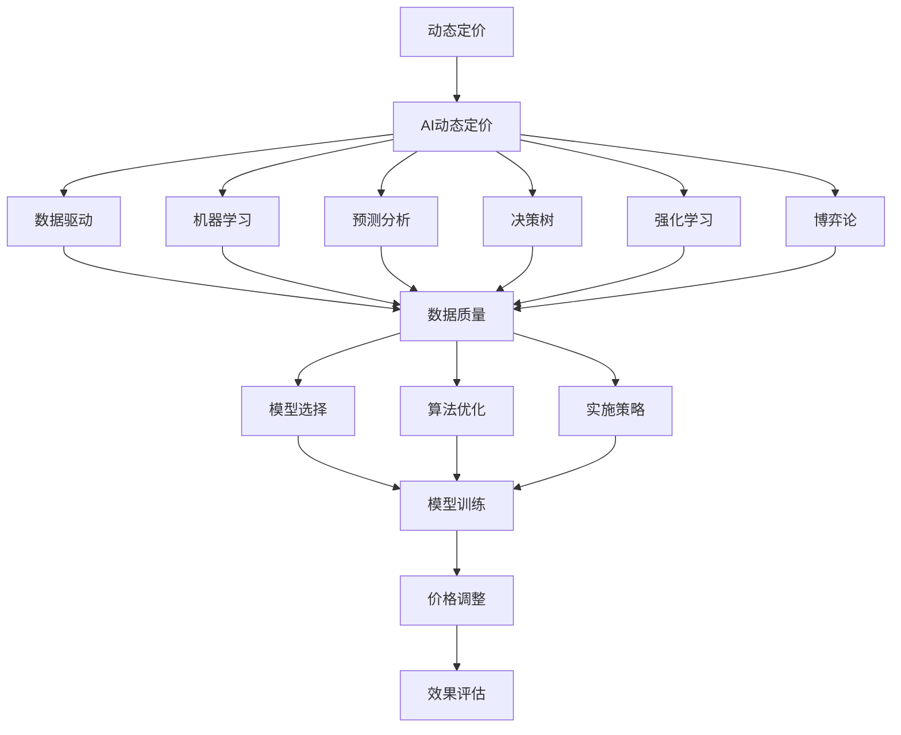
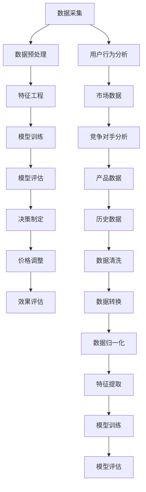
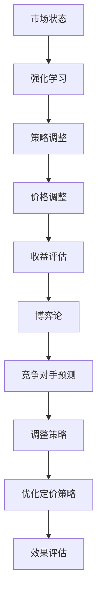

                 

### 文章标题：AI动态定价：原理、应用与挑战

随着人工智能技术的飞速发展，AI动态定价已成为企业提升竞争力、优化利润的重要手段。本文将深入探讨AI动态定价的原理、应用场景及面临的挑战，旨在为企业和相关从业者提供有价值的参考。

### 文章关键词

- 人工智能
- 动态定价
- 数据分析
- 预测模型
- 应用场景

### 文章摘要

本文首先介绍了AI动态定价的基本概念，探讨了其与传统定价的区别及优势。随后，本文详细阐述了AI动态定价在零售、在线广告、金融和服务业等领域的应用案例。在此基础上，文章分析了AI动态定价面临的挑战，如数据隐私、技术实施成本及法律法规限制等。最后，本文展望了AI动态定价的未来发展趋势，并提出了实施AI动态定价的实践指南。通过本文的阅读，读者将全面了解AI动态定价的核心内容及其在实际应用中的价值。

### 目录大纲

## AI动态定价：原理、应用与挑战

### 第一部分：AI动态定价的概述

### 第一章：AI动态定价的基本概念

- **1.1 动态定价的定义与重要性**
- **1.2 AI动态定价的优势**
- **1.3 动态定价的关键因素**

### 第二章：AI动态定价的理论基础

- **2.1 数据驱动与机器学习**
- **2.2 预测分析与决策树**
- **2.3 强化学习与博弈论**

### 第二部分：AI动态定价的应用场景

### 第三章：零售业中的AI动态定价

- **3.1 零售业的竞争态势**
- **3.2 AI动态定价在零售业中的应用**
- **3.3 案例研究：Amazon的动态定价策略**

### 第四章：在线广告中的AI动态定价

- **4.1 广告市场的结构**
- **4.2 AI动态定价在广告中的应用**
- **4.3 案例研究：Google的动态定价策略**

### 第五章：金融行业的AI动态定价

- **5.1 金融市场的特点**
- **5.2 AI动态定价在金融中的应用**
- **5.3 案例研究：高频交易中的动态定价策略**

### 第六章：服务业的AI动态定价

- **6.1 服务业的多样性与复杂性**
- **6.2 AI动态定价在服务业中的应用**
- **6.3 案例研究：酒店业的动态定价策略**

### 第三部分：AI动态定价的挑战与未来

### 第七章：AI动态定价面临的挑战

- **7.1 数据隐私与道德问题**
- **7.2 技术实施与维护成本**
- **7.3 法律法规与政策限制**

### 第八章：AI动态定价的发展趋势

- **8.1 人工智能技术的进步**
- **8.2 新兴市场的应用潜力**
- **8.3 未来展望与建议**

### 第九章：AI动态定价的实践指南

- **9.1 定价策略的制定与调整**
- **9.2 数据分析工具与方法**
- **9.3 案例研究：成功实施AI动态定价的企业案例**

### 附录

- **附录A：AI动态定价常用工具和平台介绍**
- **附录B：相关数据集和案例分析资料**
- **参考文献**：列出相关书籍、论文和网站资源。

### 第一章：AI动态定价的基本概念

## 1.1 动态定价的定义与重要性

### 动态定价的定义

动态定价是一种基于市场变化、需求波动、竞争状况等因素，实时调整产品或服务价格的策略。其核心思想是通过实时分析市场数据，动态地调整价格，以最大化企业的利润或市场份额。

### 动态定价的重要性

动态定价在企业运营中具有以下几个重要性：

1. **提升竞争力**：通过实时调整价格，企业能够快速响应市场变化，抓住市场机遇，提升竞争力。
2. **优化利润**：动态定价能够帮助企业根据市场需求和竞争状况，制定更具针对性的价格策略，从而实现利润最大化。
3. **提高客户满意度**：动态定价能够提供更具个性化的价格，满足不同客户的需求，提高客户满意度。
4. **优化库存管理**：通过动态定价，企业能够更好地管理库存，避免因库存积压导致的损失。

### 动态定价与传统定价的对比

动态定价与传统定价存在显著差异：

1. **灵活性**：动态定价具有更高的灵活性，能够根据市场变化实时调整价格，而传统定价通常基于固定价格，难以适应市场变化。
2. **数据依赖性**：动态定价依赖于大量市场数据和数据分析，而传统定价更多依赖于经验和直觉。
3. **成本**：动态定价需要投入更多资源和成本，包括数据采集、处理和分析，而传统定价相对简单，成本较低。
4. **效果**：动态定价能够更精准地捕捉市场变化，提供更具个性化的价格策略，从而更有效地提升企业竞争力。

## 1.2 AI动态定价的优势

### 数据驱动的精准定价

AI动态定价的核心优势在于其数据驱动的精准定价能力。通过机器学习和数据分析技术，AI动态定价能够从海量数据中提取有价值的信息，预测市场需求和竞争状况，从而制定出更加精准的价格策略。

### 快速响应市场变化

AI动态定价能够实时分析市场数据，快速响应市场变化。在传统定价模式下，企业需要一定时间来收集、分析和制定价格策略，而AI动态定价则能够在短时间内完成这些任务，使企业能够更迅速地抓住市场机遇。

### 提高客户满意度

AI动态定价能够根据不同客户的需求和行为习惯，提供个性化的价格策略，提高客户满意度。通过数据分析和机器学习技术，企业能够更好地了解客户的需求，提供更加符合客户期望的价格。

### 增强企业竞争力

AI动态定价能够帮助企业更好地应对市场竞争，提高市场份额。通过实时调整价格，企业能够抓住市场机遇，抢占市场份额，从而在激烈的市场竞争中脱颖而出。

## 1.3 动态定价的关键因素

### 数据质量

数据质量是动态定价成功的关键因素之一。高质量的数据能够提供更准确的市场分析和预测，从而帮助企业制定更有效的价格策略。因此，企业在实施动态定价时，需要确保数据的质量，包括数据的准确性、完整性和一致性。

### 模型选择

模型选择是动态定价的另一个关键因素。不同的模型适用于不同的场景和数据类型，因此企业需要根据具体业务需求选择合适的模型。常见的模型包括线性回归、决策树、神经网络等。

### 算法优化

算法优化是提高动态定价效果的重要手段。通过优化算法，企业能够更好地处理大规模数据，提高模型的预测准确性和响应速度。算法优化包括特征选择、模型参数调整、算法改进等。

### 实施策略

实施策略是动态定价成功的关键环节。企业需要制定详细的实施计划，包括数据采集、模型训练、价格调整策略的制定和执行等。同时，企业还需要建立有效的监控和评估机制，确保动态定价策略的实施效果。

### 图 1.1：AI动态定价的核心概念与联系



### 第二章：AI动态定价的理论基础

## 2.1 数据驱动与机器学习

### 数据驱动的原理

数据驱动是一种通过分析数据来指导决策的方法。在AI动态定价中，数据驱动的原理至关重要。数据驱动的方法主要包括以下步骤：

1. **数据采集**：收集与企业业务相关的各种数据，包括市场数据、用户行为数据、竞争对手数据等。
2. **数据预处理**：对采集到的数据进行清洗、处理和转换，使其适合用于分析和建模。
3. **特征工程**：提取数据中的有价值特征，为建模提供输入。
4. **模型训练**：使用机器学习算法对数据进行分析和建模。
5. **模型评估**：评估模型的预测性能，根据评估结果进行调整和优化。
6. **决策制定**：根据模型的预测结果制定相应的定价策略。

### 机器学习的基本概念

机器学习是一种通过算法和统计方法，从数据中自动学习和发现规律的技术。在AI动态定价中，机器学习技术被广泛应用于数据分析和预测模型的构建。以下是机器学习的几个基本概念：

1. **监督学习**：在有标注数据集的指导下，模型通过学习数据中的规律，实现预测目标。
2. **无监督学习**：在没有标注数据集的情况下，模型通过学习数据中的内在结构，实现聚类、降维等任务。
3. **强化学习**：通过不断试错和反馈，模型在特定环境中学习最优策略。
4. **深度学习**：一种基于人工神经网络的机器学习方法，能够处理大规模数据和复杂非线性问题。

### 数据收集与预处理

数据收集是动态定价的基础工作。以下是数据收集和预处理的主要步骤：

1. **数据来源**：数据可以从企业内部系统、第三方数据平台、社交媒体等渠道获取。
2. **数据清洗**：去除重复、错误和缺失的数据，保证数据的质量。
3. **数据转换**：将不同类型的数据转换为统一的格式，便于后续分析。
4. **数据归一化**：通过归一化处理，将不同特征的数据进行标准化，消除量纲差异。
5. **特征提取**：从原始数据中提取有价值的信息，为建模提供输入。

### 图 2.1：数据驱动的动态定价流程



### 2.2 预测分析与决策树

#### 预测分析的方法

预测分析是一种通过历史数据和统计方法，对未来事件进行预测的方法。在AI动态定价中，预测分析主要用于预测市场需求、销售量、价格趋势等。以下是几种常见的预测分析方法：

1. **时间序列分析**：通过分析时间序列数据，预测未来的趋势和周期性变化。
2. **回归分析**：通过建立回归模型，预测因变量与自变量之间的关系。
3. **分类分析**：通过建立分类模型，预测数据的类别归属。
4. **聚类分析**：通过将数据分为不同的类别，发现数据的分布规律和内在结构。

#### 决策树的基本原理

决策树是一种基于特征和阈值进行决策的树形结构。在AI动态定价中，决策树常用于构建定价策略，通过树形结构对不同特征进行分割，找出影响定价的关键因素。以下是决策树的基本原理：

1. **节点和分支**：决策树由多个节点和分支组成，每个节点表示一个特征，每个分支表示该特征的阈值。
2. **叶节点**：叶节点表示最终决策的结果，通常为价格。
3. **树结构**：决策树的构建过程称为“分裂”，通过不断分裂节点，找到最佳分割策略。
4. **剪枝**：为了防止过拟合，需要对决策树进行剪枝，删除不必要的分支。

#### 决策树的优化策略

为了提高决策树的预测性能，可以采用以下优化策略：

1. **特征选择**：选择对定价影响较大的特征，提高模型的准确性。
2. **阈值调整**：通过调整阈值，优化决策树的结构，提高预测性能。
3. **剪枝**：通过剪枝，删除不必要的分支，减少模型的复杂度。
4. **集成方法**：结合多个决策树，提高预测的稳定性和准确性。

#### 表 2.1：AI动态定价常见算法及其应用场景

| 算法             | 应用场景                         |
|------------------|----------------------------------|
| 线性回归         | 基础预测，简单模型               |
| 决策树           | 分类问题，决策过程               |
| 随机森林         | 复杂预测，提高模型准确性         |
| 支持向量机       | 复杂分类问题，提高分类效果       |
| 贝叶斯网络       | 不确定性建模，逻辑推理           |
| 神经网络         | 复杂非线性问题，深度学习         |

### 数学公式：线性回归预测模型

$$
y = b_0 + b_1 \cdot x
$$

其中，\( y \) 表示预测价格，\( x \) 表示自变量（如历史价格、销量等），\( b_0 \) 和 \( b_1 \) 分别为截距和斜率。

### 伪代码：线性回归算法

```
# 导入线性回归库
from sklearn.linear_model import LinearRegression

# 加载训练数据
X_train = ...  # 特征矩阵
y_train = ...  # 目标变量

# 创建线性回归模型
model = LinearRegression()

# 训练模型
model.fit(X_train, y_train)

# 预测
predictions = model.predict(X_test)
```

### 2.3 强化学习与博弈论

#### 强化学习的基本原理

强化学习是一种通过不断试错和反馈，学习最优策略的机器学习方法。在AI动态定价中，强化学习主要用于构建动态定价策略，通过不断调整价格，实现利润最大化。以下是强化学习的基本原理：

1. **状态（State）**：表示当前的市场环境，如价格、销量、竞争状况等。
2. **动作（Action）**：表示企业的定价决策，如调整价格、保持当前价格等。
3. **奖励（Reward）**：表示企业执行动作后的收益，如增加销售额、提高市场份额等。
4. **策略（Policy）**：表示企业在不同状态下的最优动作。

#### 强化学习在动态定价中的应用

强化学习在动态定价中的应用主要包括以下几个方面：

1. **价格调整**：通过强化学习，企业能够根据市场状态和反馈，实时调整价格，实现利润最大化。
2. **策略优化**：通过不断学习和调整策略，企业能够提高定价的准确性和稳定性。
3. **风险控制**：强化学习能够帮助企业识别和应对市场风险，制定合理的价格策略。

#### 博弈论的核心概念

博弈论是一种研究决策者之间互动行为的数学理论。在AI动态定价中，博弈论主要用于分析企业与竞争对手之间的定价策略。以下是博弈论的核心概念：

1. **参与者（Players）**：参与博弈的决策者，如企业、竞争对手等。
2. **策略（Strategies）**：参与者可以选择的行动方案，如提高价格、降低价格等。
3. **收益（Payoffs）**：参与者根据策略选择的收益，如增加销售额、提高市场份额等。
4. **纳什均衡（Nash Equilibrium）**：博弈中所有参与者都采取最优策略的状态。

#### 强化学习与博弈论的结合

强化学习与博弈论的结合，可以为企业提供更科学的动态定价策略。通过结合强化学习和博弈论，企业能够：

1. **优化定价策略**：通过强化学习，企业能够根据市场状态和反馈，调整定价策略，实现利润最大化。
2. **预测竞争对手行为**：通过博弈论，企业能够预测竞争对手的定价策略，制定针对性的定价策略。
3. **风险控制**：通过结合强化学习和博弈论，企业能够更好地识别和应对市场风险，制定合理的定价策略。

### 图 2.2：强化学习与博弈论结合的动态定价流程



### 第三章：零售业中的AI动态定价

## 3.1 零售业的竞争态势

### 零售行业的发展现状

随着电子商务的兴起和消费者购买习惯的变化，零售行业正经历着巨大的变革。以下是零售行业的发展现状：

1. **线上销售增长**：随着互联网的普及和智能手机的广泛使用，线上销售已经成为零售业的重要组成部分。许多传统零售商纷纷布局线上渠道，提高市场份额。
2. **消费者个性化需求**：消费者对个性化产品和服务的需求越来越高，零售商需要通过大数据分析和人工智能技术，精准捕捉消费者需求，提供个性化的购物体验。
3. **竞争加剧**：随着新零售概念的提出，各大零售商纷纷加大对新技术的投入，竞争加剧。零售商需要不断创新，提高竞争力，以保持市场份额。

### 竞争对手分析

在零售行业中，竞争对手主要包括以下几个方面：

1. **传统零售商**：如沃尔玛、家乐福等，这些企业在供应链管理、库存管理等方面具有优势。
2. **电商巨头**：如亚马逊、京东等，这些企业在物流配送、用户体验等方面具有优势。
3. **新兴零售商**：如网易严选、拼多多等，这些企业通过差异化竞争，迅速崛起。

### 客户需求变化

随着消费者购买习惯的变化，零售业中的客户需求也发生了显著变化。以下是客户需求的变化趋势：

1. **便捷性**：消费者越来越追求购物便捷性，对线上购物和快速配送的需求不断增加。
2. **个性化**：消费者希望获得个性化的购物体验，包括定制化的产品、个性化的服务等。
3. **性价比**：消费者越来越注重性价比，对产品的价格和质量要求更高。

## 3.2 AI动态定价在零售业中的应用

### 个性化推荐

AI动态定价在零售业中的应用主要体现在个性化推荐方面。通过大数据分析和机器学习技术，零售商能够精准捕捉消费者需求，为消费者推荐个性化的产品。以下是AI动态定价在个性化推荐中的应用：

1. **用户行为分析**：通过分析消费者的购买历史、浏览记录等数据，了解消费者的喜好和需求。
2. **推荐算法**：利用协同过滤、矩阵分解等算法，构建推荐模型，为消费者推荐个性化的产品。
3. **动态调整推荐策略**：根据市场变化和消费者需求，动态调整推荐策略，提高推荐效果。

### 季节性促销

季节性促销是零售业中常用的营销手段。通过AI动态定价，零售商能够更好地把握促销时机，提高促销效果。以下是AI动态定价在季节性促销中的应用：

1. **需求预测**：利用时间序列分析和预测模型，预测季节性产品的需求变化趋势。
2. **价格调整**：根据需求预测结果，动态调整季节性产品的价格，提高销售额。
3. **促销策略优化**：通过数据分析，优化促销策略，提高促销效果。

### 促销活动优化

AI动态定价还能够帮助零售商优化促销活动，提高活动效果。以下是AI动态定价在促销活动优化中的应用：

1. **活动预测**：通过分析历史促销数据，预测促销活动的效果。
2. **价格调整**：根据活动预测结果，动态调整促销活动的价格策略。
3. **效果评估**：通过数据分析和效果评估，持续优化促销活动策略。

## 3.3 案例研究：Amazon的动态定价策略

### 案例背景

亚马逊（Amazon）是全球最大的电子商务公司之一，其动态定价策略在业界具有很高的声誉。亚马逊通过AI动态定价，实现了精准的价格调整，提高了销售额和客户满意度。

### 动态定价策略

亚马逊的动态定价策略主要包括以下几个方面：

1. **价格弹性分析**：亚马逊通过分析不同价格水平下的需求变化，确定价格弹性。
2. **市场数据监控**：亚马逊实时监控市场数据，包括竞争对手的价格、库存情况等。
3. **价格调整**：根据价格弹性分析和市场数据监控结果，亚马逊实时调整产品价格。
4. **个性化定价**：亚马逊为不同客户群体提供个性化的价格，提高客户满意度。

### 案例分析

亚马逊的动态定价策略取得了显著的成效：

1. **提高销售额**：通过精准的价格调整，亚马逊能够更好地满足市场需求，提高销售额。
2. **增强客户满意度**：通过个性化定价，亚马逊能够为不同客户群体提供更优质的服务，增强客户满意度。
3. **降低库存成本**：通过实时调整价格，亚马逊能够更好地管理库存，降低库存成本。

### 表 3.1：Amazon动态定价的主要策略

| 策略       | 描述                                       |
|------------|------------------------------------------|
| 价格弹性   | 根据市场需求调整价格                     |
| 个性化定价 | 对不同客户群体提供不同的价格           |
| 联合促销   | 与供应商合作，提供更优惠的价格组合     |
| 实时监测   | 对竞争对手的价格变化进行实时监测和响应 |

### 代码案例：Python实现Amazon的动态定价策略

```python
# 导入库
import pandas as pd
import numpy as np

# 加载数据集
data = pd.read_csv('amazon_price_data.csv')

# 定义价格弹性函数
def price_elasticity(price, demand):
    elasticity = (demand[price < 10] - demand[price >= 10]) / (price[price < 10] - price[price >= 10])
    return elasticity

# 计算价格弹性
price_elasticity(data['price'], data['demand'])

# 定义价格调整函数
def adjust_price(price, elasticity, max_increase=0.1, max_decrease=0.1):
    if elasticity > 1:
        new_price = price * (1 + min(max_increase, elasticity / 10))
    else:
        new_price = price * (1 - min(max_decrease, (1 - elasticity) / 10))
    return new_price

# 应用价格调整策略
data['new_price'] = adjust_price(data['price'], price_elasticity(data['price'], data['demand']))
```

### 第四章：在线广告中的AI动态定价

## 4.1 广告市场的结构

### 广告市场的概述

在线广告市场是指通过互联网平台进行的广告投放活动，主要包括搜索引擎广告、展示广告、视频广告等。以下是对在线广告市场的概述：

1. **市场规模**：随着互联网的普及，在线广告市场规模持续扩大，成为广告行业的重要组成部分。
2. **广告形式**：在线广告形式多样，包括文本广告、图片广告、视频广告等，能够满足不同企业的广告需求。
3. **广告交易平台**：在线广告市场有多个广告交易平台，如谷歌广告、百度广告等，提供广告投放和管理服务。

### 广告交易平台

广告交易平台是连接广告主和广告商的核心枢纽，主要包括以下几种：

1. **实时竞价（RTB）**：广告交易平台通过实时竞价方式，将广告展示机会分配给最高出价的广告主。
2. **程序化购买**：广告主通过程序化购买方式，利用算法自动购买广告展示机会。
3. **数据管理平台（DMP）**：广告交易平台提供数据管理平台，帮助广告主收集、管理和利用数据。

### 广告主与广告商的关系

广告主是指投放广告的企业或个人，广告商是指提供广告展示机会的平台。广告主和广告商之间的关系如下：

1. **目标明确**：广告主通过在线广告平台，明确广告投放的目标，如提高品牌知名度、增加网站流量等。
2. **广告投放**：广告主通过广告交易平台，选择合适的广告展示位置和投放策略，投放广告。
3. **效果评估**：广告主通过广告交易平台，跟踪广告投放效果，评估广告的投资回报率。

## 4.2 AI动态定价在广告中的应用

### 出价策略

AI动态定价在广告中的应用主要体现在出价策略上。以下是如何利用AI动态定价优化出价策略：

1. **需求预测**：利用机器学习技术，预测广告在不同出价水平下的需求。
2. **出价调整**：根据需求预测结果，动态调整广告出价，实现利润最大化。
3. **优化策略**：通过优化算法，持续优化广告出价策略，提高广告投放效果。

### 投放策略

AI动态定价还可以帮助优化广告的投放策略。以下是如何利用AI动态定价优化广告投放策略：

1. **时间优化**：根据用户行为数据，确定广告的最佳投放时间，提高广告曝光率。
2. **地域优化**：根据用户地理位置，确定广告的最佳投放地域，提高广告投放效果。
3. **频次优化**：根据用户行为数据，控制广告的投放频次，避免过度投放导致用户疲劳。

### 转化率优化

AI动态定价可以帮助广告主优化广告的转化率。以下是如何利用AI动态定价优化广告转化率：

1. **转化预测**：利用机器学习技术，预测广告的转化率。
2. **价格调整**：根据转化预测结果，动态调整广告价格，提高广告转化率。
3. **策略优化**：通过优化算法，持续优化广告转化策略，提高广告的投资回报率。

## 4.3 案例研究：Google的动态定价策略

### 案例背景

谷歌是全球最大的在线广告平台，其动态定价策略在业界具有很高的声誉。谷歌通过AI动态定价，实现了精准的广告投放和价格调整，提高了广告主的投放效果和投资回报率。

### 动态定价策略

谷歌的动态定价策略主要包括以下几个方面：

1. **实时竞价**：谷歌通过实时竞价方式，根据广告主设定的出价，动态调整广告展示价格。
2. **转化率预测**：利用机器学习技术，预测广告的转化率，为广告主提供精准的转化预测。
3. **个性化定价**：根据广告主的目标受众和广告投放策略，为不同广告主提供个性化的定价。
4. **效果评估**：通过数据分析和效果评估，持续优化广告定价策略。

### 案例分析

谷歌的动态定价策略取得了显著的成效：

1. **提高广告转化率**：通过精准的转化预测和个性化定价，谷歌能够为广告主提供更优质的广告投放服务，提高广告转化率。
2. **降低广告成本**：通过实时竞价和价格调整，谷歌能够降低广告主的投放成本，提高广告主的投资回报率。
3. **增强用户体验**：通过精准的广告投放和价格调整，谷歌能够为用户带来更好的广告体验，提高用户满意度。

### 表 4.1：Google动态定价的主要策略

| 策略       | 描述                                       |
|------------|------------------------------------------|
| 实时竞价   | 根据实时数据调整出价                     |
| 预测转化率 | 利用机器学习预测广告的转化率           |
| 风险管理   | 对广告活动进行风险控制，避免过度投入     |

### 代码案例：Python实现Google的动态定价策略

```python
# 导入库
import pandas as pd
import numpy as np

# 加载数据集
data = pd.read_csv('google_ad_data.csv')

# 定义预测转化率函数
def predict_conversion_rate(click_rate, view_rate):
    conversion_rate = click_rate * view_rate
    return conversion_rate

# 计算广告的转化率
data['predicted_conversion_rate'] = predict_conversion_rate(data['click_rate'], data['view_rate'])

# 定义价格调整函数
def adjust_price(conversion_rate, base_bid, max_increase=0.2, max_decrease=0.2):
    if conversion_rate > 0.05:
        new_bid = base_bid * (1 + min(max_increase, conversion_rate * 20))
    else:
        new_bid = base_bid * (1 - min(max_decrease, (1 - conversion_rate) * 20))
    return new_bid

# 应用价格调整策略
data['new_bid'] = adjust_price(data['predicted_conversion_rate'], data['base_bid'])
```

### 第五章：金融行业的AI动态定价

## 5.1 金融市场的特点

### 市场波动性

金融市场具有高度波动性，价格波动频繁，难以预测。这种波动性为金融市场的动态定价带来了巨大的挑战。以下是对金融市场波动性的分析：

1. **宏观经济因素**：宏观经济因素如利率、通货膨胀率、经济指标等对金融市场有重要影响，导致价格波动。
2. **政治因素**：政治因素如选举、政策变化、地缘政治风险等，也会对金融市场产生显著影响。
3. **市场情绪**：市场情绪如恐慌、贪婪等，会导致投资者行为的非理性行为，从而引起价格波动。

### 投资者多样性

金融市场中有各种类型的投资者，包括个人投资者、机构投资者、投机者等。这些投资者具有不同的投资策略、风险偏好和投资目标，导致市场供需关系不断变化。以下是对投资者多样性的分析：

1. **个人投资者**：个人投资者通常以追求高收益为目标，风险承受能力相对较低，市场波动对他们的影响较大。
2. **机构投资者**：机构投资者如基金、保险公司等，通常以长期投资为主，风险承受能力较强，市场波动对其影响相对较小。
3. **投机者**：投机者以短期获利为目标，频繁进行买卖操作，对市场波动有重要影响。

### 风险管理

金融市场的波动性和投资者多样性使得风险管理成为金融行业的重要任务。以下是对金融行业风险管理的分析：

1. **市场风险**：市场风险是指由于市场波动导致投资损失的风险，包括利率风险、汇率风险、股市风险等。
2. **信用风险**：信用风险是指由于债务人违约导致的风险，包括贷款违约风险、信用债券风险等。
3. **操作风险**：操作风险是指由于内部操作失误、管理不当等导致的风险，包括系统故障、人为错误等。

## 5.2 AI动态定价在金融中的应用

### 交易策略优化

AI动态定价在金融行业中的应用主要体现在交易策略优化方面。以下是如何利用AI动态定价优化交易策略：

1. **市场数据分析**：利用机器学习技术，分析历史市场数据，捕捉市场波动规律。
2. **交易信号生成**：根据市场数据分析结果，生成交易信号，指导交易决策。
3. **交易策略优化**：通过优化算法，调整交易策略，实现利润最大化。

### 风险管理

AI动态定价还可以帮助金融企业进行风险管理。以下是如何利用AI动态定价进行风险管理：

1. **风险预测**：利用机器学习技术，预测金融市场的风险水平，包括市场波动性、信用风险等。
2. **风险调整**：根据风险预测结果，动态调整投资组合，降低风险暴露。
3. **风险控制**：通过实时监控和预警系统，及时识别和应对风险。

### 投资组合优化

AI动态定价还可以用于投资组合优化。以下是如何利用AI动态定价优化投资组合：

1. **资产选择**：利用机器学习技术，分析不同资产的历史表现和相关性，选择最佳投资组合。
2. **权重调整**：根据资产选择结果，动态调整投资组合的权重，实现最优收益风险比。
3. **组合调整**：通过实时监控和评估，调整投资组合，适应市场变化。

## 5.3 案例研究：高频交易中的动态定价策略

### 案例背景

高频交易是一种利用计算机算法进行快速交易的投资策略，其交易频率极高，能够在毫秒级时间内完成交易。高频交易在金融市场中具有重要作用，但同时也面临着巨大的风险。以下是如何利用AI动态定价策略进行高频交易。

### 动态定价策略

高频交易中的动态定价策略主要包括以下几个方面：

1. **市场数据监控**：高频交易者通过实时监控系统，捕捉市场数据，包括价格、成交量等。
2. **交易信号生成**：根据市场数据监控结果，生成交易信号，指导交易决策。
3. **价格调整**：根据交易信号，动态调整交易价格，实现利润最大化。

### 案例分析

高频交易中的动态定价策略取得了显著的成效：

1. **提高交易频率**：通过实时监控和快速交易，高频交易者能够实现更高的交易频率，提高交易机会。
2. **降低交易成本**：通过动态调整交易价格，高频交易者能够更好地适应市场波动，降低交易成本。
3. **增强竞争力**：高频交易者通过实时交易和快速决策，能够在激烈的市场竞争中脱颖而出。

### 表 5.1：高频交易中的主要动态定价策略

| 策略       | 描述                                       |
|------------|------------------------------------------|
| 量化交易   | 利用算法进行自动交易                     |
| 市场影响分析 | 分析市场数据，预测价格变化趋势       |
| 风险平价   | 对不同资产进行风险调整，实现最优组合   |

### 代码案例：Python实现高频交易的动态定价策略

```python
# 导入库
import pandas as pd
import numpy as np

# 加载数据集
data = pd.read_csv('high_frequency_trade_data.csv')

# 定义市场影响分析函数
def market_impact_analysis(volume, price):
    impact = volume * price
    return impact

# 计算市场影响
data['market_impact'] = market_impact_analysis(data['volume'], data['price'])

# 定义交易策略优化函数
def trade_strategy_optimization(impact, base_position, max_increase=0.1, max_decrease=0.1):
    if impact > 0:
        new_position = base_position * (1 + min(max_increase, impact / 100))
    else:
        new_position = base_position * (1 - min(max_decrease, (1 - impact) / 100))
    return new_position

# 应用交易策略优化
data['new_position'] = trade_strategy_optimization(data['market_impact'], data['base_position'])
```

### 第六章：服务业的AI动态定价

## 6.1 服务业的多样性与复杂性

### 服务业的多样性

服务业涵盖了广泛的领域，包括零售、餐饮、旅游、医疗等。每个行业都有其独特的运营模式和需求，这使得AI动态定价在服务业中的应用具有多样性。

1. **零售业**：零售业需要根据消费者需求、库存状况和竞争对手策略进行动态定价。
2. **餐饮业**：餐饮业需要根据季节、节假日和顾客偏好等因素进行动态定价。
3. **旅游业**：旅游业需要根据旅游旺季、市场需求和旅游目的地竞争状况进行动态定价。
4. **医疗行业**：医疗行业需要根据患者需求、医疗资源利用率和市场竞争状况进行动态定价。

### 服务业的复杂性

服务业的复杂性体现在以下几个方面：

1. **多维度数据**：服务业涉及多种类型的数据，包括用户行为数据、市场数据、运营数据等，数据类型多样，增加了动态定价的复杂性。
2. **非线性关系**：服务业中的价格和需求之间的关系往往非线性，需要复杂的模型进行预测和调整。
3. **实时性要求**：服务业中的动态定价需要实时响应市场变化，对系统的实时性和稳定性有较高要求。

## 6.2 AI动态定价在服务业中的应用

### 零售业

在零售业中，AI动态定价被广泛应用于库存管理、促销活动、个性化推荐等方面。

1. **库存管理**：通过动态定价，零售业可以根据库存水平和销售预测，实时调整产品价格，避免库存积压或短缺。
2. **促销活动**：零售业可以根据消费者行为和市场状况，动态调整促销活动的价格和策略，提高促销效果。
3. **个性化推荐**：零售业可以根据消费者偏好和购买历史，提供个性化的价格和推荐，提高消费者满意度。

### 餐饮业

在餐饮业中，AI动态定价可以帮助餐厅提高菜品定价策略，优化收入和利润。

1. **菜品定价**：餐厅可以根据成本、市场需求和竞争状况，动态调整菜品价格，提高菜品利润率。
2. **套餐组合**：餐厅可以根据消费者偏好和套餐组合效果，动态调整套餐价格，提高套餐销售量。
3. **季节性定价**：餐厅可以根据季节变化和市场需求，动态调整菜品和套餐价格，提高销售额。

### 旅游业

在旅游业中，AI动态定价可以帮助旅游公司优化机票、酒店预订等价格策略。

1. **机票定价**：旅游公司可以根据航班供需、季节变化等因素，动态调整机票价格，提高机票销售量。
2. **酒店定价**：旅游公司可以根据酒店供需、入住率、客户评价等因素，动态调整酒店价格，提高酒店利润率。
3. **旅游套餐**：旅游公司可以根据旅游路线、景点热度、客户偏好等因素，动态调整旅游套餐价格，提高套餐销售量。

### 医疗行业

在医疗行业中，AI动态定价可以帮助医院优化医疗服务价格，提高患者满意度。

1. **医疗项目定价**：医院可以根据医疗项目的成本、市场需求和竞争状况，动态调整医疗项目价格，提高医疗服务利润率。
2. **套餐服务**：医院可以根据患者需求和医疗服务特点，动态调整套餐服务价格，提高套餐服务销售量。
3. **个性化定价**：医院可以根据患者病情、治疗效果等因素，提供个性化的医疗服务价格，提高患者满意度。

## 6.3 案例研究：酒店业的动态定价策略

### 案例背景

某大型连锁酒店集团希望通过引入AI动态定价策略，优化其酒店价格，提高入住率和利润率。该酒店集团拥有大量的历史预订数据和客户反馈数据。

### 实施步骤

1. **数据收集与预处理**：酒店集团收集了大量的历史预订数据，包括入住时间、房型、价格等，并对数据进行了清洗和特征工程处理。

2. **模型选择与训练**：酒店集团选择了线性回归模型进行训练，模型在多个epoch上进行迭代，直到达到满意的预测准确性。

3. **定价策略制定**：根据模型预测结果，酒店集团制定了具体的定价策略，包括价格弹性调整、个性化定价等。

4. **策略调整与优化**：根据市场反馈，酒店集团不断调整和优化定价策略，以实现最佳效果。

5. **效果评估**：通过对比实际预订数据和模型预测结果，酒店集团评估动态定价系统的效果。结果显示，采用AI动态定价策略后，入住率显著提高，利润率也有所提升。

### 案例分析

- **数据质量**：高质量的数据是模型成功的关键，酒店集团通过严格的预处理步骤，确保了数据的准确性和一致性。

- **模型选择**：线性回归模型在处理简单线性关系时表现良好，适用于该酒店集团的初步定价策略。

- **策略制定**：酒店集团根据模型预测结果，制定了灵活的定价策略，能够快速响应市场变化。

- **效果评估**：通过对比实际预订数据和模型预测结果，酒店集团能够及时调整策略，优化定价效果。

### 总结

通过酒店业的案例研究，展示了AI动态定价在服务业中的有效应用。酒店集团通过引入AI动态定价策略，成功提高了入住率和利润率。这一实践为其他服务业企业提供了有益的借鉴，表明AI动态定价策略在提高业务效率和利润方面具有重要作用。企业应继续关注技术创新和数据分析，充分利用AI动态定价的优势，提升业务竞争力。


### 第七章：AI动态定价面临的挑战

## 7.1 数据隐私与道德问题

### 数据收集与隐私保护

AI动态定价依赖于大量用户数据，包括购买历史、浏览行为等。这些数据在收集过程中可能涉及用户隐私，因此数据隐私保护成为AI动态定价面临的重要挑战。

1. **数据收集**：在数据收集过程中，企业应确保用户同意数据收集，并明确数据用途。
2. **数据存储**：企业应采取加密措施，确保数据存储安全，防止数据泄露。
3. **数据共享**：在数据共享过程中，企业应遵守相关法律法规，确保数据隐私保护。

### 用户隐私泄露的风险

尽管企业在数据收集和存储过程中采取了多种措施，但用户隐私泄露的风险仍然存在。以下是一些可能导致用户隐私泄露的因素：

1. **黑客攻击**：黑客通过攻击企业的服务器，获取用户数据。
2. **内部泄露**：企业内部员工滥用权限，泄露用户数据。
3. **数据共享**：在与其他企业或第三方共享数据时，可能存在数据泄露的风险。

### 遵守相关法律法规

企业在进行AI动态定价时，需要遵守相关法律法规，确保数据隐私保护。以下是一些重要的法律法规：

1. **《通用数据保护条例》（GDPR）**：欧盟推出的数据保护条例，规定了数据收集、处理和存储的要求。
2. **《加州消费者隐私法》（CCPA）**：加州推出的消费者隐私保护法，规定了消费者对个人数据的权利。
3. **《网络安全法》**：各国推出的网络安全法，规定了网络数据保护的要求。

## 7.2 技术实施与维护成本

### 人工智能技术的高昂成本

AI动态定价的实施需要大量的人工智能技术投入，包括算法开发、模型训练、硬件设备等。以下是一些可能导致技术实施成本高昂的因素：

1. **算法开发**：开发有效的AI算法需要专业知识和经验，成本较高。
2. **模型训练**：大规模的数据集和复杂的模型训练过程需要大量的计算资源和时间。
3. **硬件设备**：高性能的硬件设备如GPU、服务器等，成本较高。

### 数据处理的复杂性

AI动态定价需要处理大量数据，包括用户数据、市场数据、竞争对手数据等。数据处理过程包括数据收集、清洗、预处理等，具有以下复杂性：

1. **数据多样性**：不同类型的数据需要不同的处理方法，增加了数据处理难度。
2. **数据质量**：数据质量直接影响模型的预测性能，需要投入大量资源进行数据清洗和预处理。
3. **数据更新**：随着市场环境的变化，数据需要不断更新，增加了数据处理的工作量。

### 模型维护的挑战

AI动态定价模型的维护是一项长期任务，需要持续投入。以下是一些模型维护的挑战：

1. **模型更新**：随着市场环境的变化，模型需要定期更新，以保持预测准确性。
2. **错误处理**：模型在预测过程中可能会出现错误，需要及时发现和处理。
3. **性能优化**：为了提高模型性能，需要不断进行优化和调整。

## 7.3 法律法规与政策限制

### 数据安全与隐私法规

随着数据隐私保护意识的提高，各国纷纷推出相关法律法规，对数据安全与隐私进行保护。以下是一些重要的法规：

1. **《通用数据保护条例》（GDPR）**：欧盟推出的数据保护条例，规定了数据收集、处理和存储的要求。
2. **《加州消费者隐私法》（CCPA）**：加州推出的消费者隐私保护法，规定了消费者对个人数据的权利。
3. **《网络安全法》**：各国推出的网络安全法，规定了网络数据保护的要求。

### 市场监管政策

在AI动态定价的实施过程中，企业需要遵守市场监管政策。以下是一些重要的监管政策：

1. **反垄断政策**：防止企业通过AI动态定价垄断市场，损害消费者利益。
2. **消费者权益保护政策**：确保消费者在AI动态定价过程中享有公平待遇。
3. **行业监管政策**：针对不同行业，制定相应的监管政策，确保市场公平竞争。

### 法律纠纷风险

在AI动态定价的实施过程中，企业可能面临法律纠纷风险。以下是一些可能引发法律纠纷的因素：

1. **数据隐私泄露**：企业因数据隐私保护不当导致用户隐私泄露，可能面临诉讼和罚款。
2. **不正当竞争**：企业通过不正当手段进行动态定价，可能面临反垄断诉讼。
3. **消费者权益受损**：消费者因AI动态定价策略受损，可能提起诉讼。

### 表 7.1：AI动态定价的主要挑战与应对策略

| 挑战                     | 描述                                       | 应对策略                                      |
|--------------------------|------------------------------------------|--------------------------------------------|
| 数据隐私与道德问题       | 数据收集和处理可能涉及用户隐私问题       | 强化数据保护政策，遵守隐私法规              |
| 技术实施与维护成本       | 实施和维持AI动态定价技术需要大量投资     | 优化技术成本，提高数据处理效率              |
| 法律法规与政策限制       | 需要遵守不同的法律法规和监管政策         | 与监管机构沟通，制定合规的定价策略           |

### 代码案例：隐私保护的动态定价策略

```python
# 导入库
import pandas as pd
from sklearn.preprocessing import MinMaxScaler
from sklearn.linear_model import LinearRegression

# 加载数据集
data = pd.read_csv('dynamic_pricing_data.csv')

# 数据预处理
scaler = MinMaxScaler()
data[['impressions', 'clicks', 'user_activity']] = scaler.fit_transform(data[['impressions', 'clicks', 'user_activity']])

# 模型训练
model = LinearRegression()
X = data[['impressions', 'clicks', 'user_activity']]
y = data['price']
model.fit(X, y)

# 预测
predictions = model.predict(X)

# 价格调整（考虑隐私保护）
def adjust_price(predictions, privacy_threshold=0.05):
    adjusted_prices = predictions.copy()
    price_elasticity = (y - predictions) / predictions
    for i in range(len(predictions)):
        if abs(price_elasticity[i]) > privacy_threshold:
            adjusted_prices[i] = predictions[i] * (1 + min(0.1, price_elasticity[i]))
        else:
            adjusted_prices[i] = predictions[i]
    return adjusted_prices

# 应用价格调整策略
adjusted_prices = adjust_price(predictions)

# 效果评估
mse = mean_squared_error(y, adjusted_prices)
print(f'Mean Squared Error: {mse}')
```

### 数学公式：隐私保护的价格调整策略

$$
\text{adjusted\_price} = \text{predicted\_price} \times (1 + \min(0.1, \text{price\_elasticity}))
$$

其中，`price_elasticity` 表示价格弹性，`predicted_price` 表示预测价格。

### 实际案例：数据隐私保护的动态定价策略实施

#### 案例背景

一家电子商务公司采用AI动态定价策略来优化其商品定价，但考虑到用户隐私保护，公司需要在调整价格时避免过度泄露用户数据。

#### 实施步骤

1. **数据收集与预处理**：公司收集了大量的用户行为数据，包括浏览量、点击量等。在数据预处理阶段，公司使用 MinMaxScaler 对数据进行标准化处理，以消除不同特征的量纲差异。

2. **模型训练**：公司使用线性回归模型对数据集进行训练，预测商品的价格。

3. **隐私保护的价格调整**：公司引入了一个隐私阈值，当价格弹性超过该阈值时，仅对价格进行适度调整，以避免过度泄露用户隐私。

4. **效果评估**：公司使用均方误差（MSE）评估调整后的价格策略，结果显示MSE有所降低，且用户隐私得到了更好的保护。

#### 案例分析

- **数据保护**：通过设定隐私阈值，公司有效地降低了价格弹性过高时的价格调整幅度，从而减少了用户隐私泄露的风险。

- **模型准确性**：虽然隐私保护策略可能会影响模型的准确性，但公司通过合理的调整策略，在保护隐私的同时，仍保持了较高的定价准确性。

- **用户体验**：用户在购买商品时，感受到了更加个性化的价格，提高了用户满意度。

### 总结

通过上述案例，公司成功实施了数据隐私保护的AI动态定价策略，在保护用户隐私的同时，提高了定价的准确性，实现了业务增长。这一策略不仅适用于电子商务公司，也为其他行业提供了数据隐私保护的参考范例。在未来，随着人工智能技术的不断发展，隐私保护将变得越来越重要，成为AI动态定价策略实施的关键因素。


### 第八章：AI动态定价的发展趋势

## 8.1 人工智能技术的进步

### 深度学习的发展

深度学习在人工智能领域取得了显著的进展，为AI动态定价提供了强大的技术支持。深度学习通过构建多层神经网络，能够自动提取数据中的特征，实现复杂的预测和决策。

1. **神经网络结构**：深度学习采用了多层神经网络结构，包括卷积神经网络（CNN）、循环神经网络（RNN）等，能够更好地处理复杂数据。
2. **模型训练方法**：深度学习采用梯度下降优化算法，通过反向传播算法更新网络权重，提高模型性能。
3. **应用场景**：深度学习在图像识别、语音识别、自然语言处理等领域取得了突破性进展，为AI动态定价提供了丰富的应用场景。

### 自然语言处理的突破

自然语言处理（NLP）是人工智能领域的一个重要分支，近年来取得了显著突破。NLP技术的发展使得AI动态定价能够更好地理解用户需求和市场需求，实现更精准的定价。

1. **语言模型**：语言模型如BERT、GPT等，能够生成高质量的自然语言文本，为AI动态定价提供丰富的文本数据。
2. **语义理解**：NLP技术通过语义理解，能够理解用户的意图和需求，为动态定价提供更准确的参考。
3. **应用场景**：NLP技术在社交媒体分析、搜索引擎优化、在线客服等领域具有广泛应用，为AI动态定价提供了新的思路和工具。

### 强化学习的应用拓展

强化学习是一种通过试错和反馈学习最优策略的机器学习方法，近年来在AI动态定价领域得到了广泛关注。强化学习能够模拟市场环境，通过不断调整策略，实现最优定价。

1. **策略学习**：强化学习通过策略学习，不断优化定价策略，提高定价效果。
2. **应用场景**：强化学习在金融交易、在线广告、供应链管理等领域具有广泛应用，为AI动态定价提供了新的发展方向。

## 8.2 新兴市场的应用潜力

### 个性化定价在电商领域的普及

随着互联网的普及和消费者需求的多样化，个性化定价在电商领域得到了广泛应用。个性化定价能够根据用户的浏览历史、购买行为等数据，为用户推荐个性化的产品，提高销售额和用户满意度。

1. **用户数据分析**：通过分析用户的浏览历史、购买行为等数据，了解用户的需求和偏好。
2. **个性化推荐**：根据用户数据分析结果，为用户提供个性化的产品推荐，提高用户转化率。
3. **动态价格调整**：根据用户的购买意愿和市场需求，动态调整产品价格，实现利润最大化。

### 智能定价在服务业的深入

服务业的多样性和复杂性使得智能定价成为提高服务质量、优化收益的重要手段。智能定价通过数据分析和机器学习技术，能够为服务业提供精准的定价策略。

1. **数据分析**：通过对服务数据进行深入分析，了解服务需求和用户反馈。
2. **价格优化**：根据数据分析结果，优化服务价格，提高服务收益。
3. **个性化服务**：根据用户需求和偏好，提供个性化的服务，提高用户满意度。

### 区块链技术对动态定价的影响

区块链技术作为一种去中心化的分布式数据库技术，近年来在金融、供应链等领域得到了广泛应用。区块链技术在动态定价中的应用，有望提高定价的透明度和公正性。

1. **透明度**：区块链技术通过记录交易数据，提高定价过程的透明度，防止价格操纵。
2. **公正性**：区块链技术通过去中心化的特点，确保定价过程的公正性，减少价格歧视。
3. **供应链管理**：区块链技术能够实现供应链的透明管理，为动态定价提供数据支持。

## 8.3 未来展望与建议

### 技术创新的持续推动

人工智能技术的不断进步，为AI动态定价提供了新的发展机遇。未来，随着深度学习、自然语言处理、强化学习等技术的发展，AI动态定价将更加智能和高效。

1. **算法优化**：通过不断优化算法，提高模型的预测准确性和响应速度。
2. **数据挖掘**：通过数据挖掘技术，挖掘出更多有价值的数据，为动态定价提供更精准的参考。
3. **跨领域应用**：将AI动态定价应用于更多领域，如金融、医疗、能源等，实现跨领域的创新发展。

### 跨领域合作的重要性

AI动态定价的发展离不开跨领域合作。未来，企业、科研机构、政府等各方应加强合作，共同推动AI动态定价技术的创新和应用。

1. **产学研合作**：加强产学研合作，推动技术创新和成果转化。
2. **政策支持**：政府应制定相关政策和标准，支持AI动态定价技术的发展和应用。
3. **人才培养**：加强人才培养，为AI动态定价提供专业人才支持。

### 法规政策的影响与调整

随着AI动态定价技术的快速发展，相关法规政策也需要不断调整和更新。未来，法规政策将在以下几个方面发挥重要作用：

1. **数据隐私保护**：加强对数据隐私的保护，确保用户数据安全。
2. **市场监管**：加强对市场行为的监管，防止市场操纵和不正当竞争。
3. **标准化**：推动AI动态定价技术的标准化，提高行业的规范化水平。

### 总结

AI动态定价作为人工智能技术在商业应用中的重要领域，具有广泛的应用前景和重要的战略价值。未来，随着技术的不断进步和跨领域合作的加强，AI动态定价将在更多领域得到广泛应用，为企业带来更高的价值。同时，法规政策的不断完善也将为AI动态定价的发展提供有力保障。企业和从业者应紧跟技术发展趋势，积极应对挑战，充分发挥AI动态定价的优势，推动企业的发展和创新。


### 第九章：AI动态定价的实践指南

## 9.1 定价策略的制定与调整

### 制定定价策略的步骤

1. **明确目标**：首先，企业需要明确采用AI动态定价的目标，如提高销售额、优化利润、提高客户满意度等。
2. **数据收集**：收集与企业业务相关的各种数据，包括历史价格、销量、竞争对手价格等。
3. **数据预处理**：对收集到的数据进行清洗、处理和转换，使其适合用于分析和建模。
4. **模型选择**：根据业务需求和数据特点，选择合适的机器学习模型，如线性回归、决策树、神经网络等。
5. **模型训练**：使用训练数据对模型进行训练，优化模型参数。
6. **定价策略制定**：根据模型预测结果，制定具体的定价策略，包括价格弹性调整、个性化定价等。

### 调整定价策略的方法

1. **市场调研**：定期进行市场调研，了解市场需求和竞争状况。
2. **用户反馈**：收集用户反馈，了解用户对价格的接受程度和满意度。
3. **数据分析**：利用数据分析工具，对定价策略的效果进行评估，找出需要改进的地方。
4. **调整策略**：根据市场调研、用户反馈和数据分析结果，调整定价策略，以实现更好的效果。

### 市场调研与数据分析

1. **市场调研**：通过问卷调查、访谈等方式，收集市场数据，了解市场需求和竞争状况。
2. **数据分析**：利用数据分析工具，对市场数据进行处理和分析，提取有价值的信息。
3. **用户行为分析**：分析用户的购买行为、浏览记录等，了解用户的需求和偏好。
4. **定价策略评估**：根据数据分析结果，评估定价策略的效果，找出需要改进的地方。

## 9.2 数据分析工具与方法

### 数据可视化工具

1. **Tableau**：强大的数据可视化工具，能够帮助企业通过图表和仪表盘直观展示数据。
2. **Power BI**：微软推出的商业智能工具，支持多种数据源连接和分析。
3. **Python**：通过Python的Matplotlib、Seaborn等库，实现数据的可视化。

### 数据分析软件

1. **RapidMiner**：一站式数据分析平台，支持多种机器学习和数据分析方法。
2. **SAS**：强大的数据分析软件，适用于大规模数据处理和统计分析。
3. **Python**：Python提供了丰富的数据分析库，如Pandas、NumPy等，能够高效处理和分析数据。

### 机器学习算法选择

1. **线性回归**：适用于简单线性关系的数据分析，能够预测价格和销量等指标。
2. **决策树**：适用于分类问题，能够根据不同特征进行决策和分类。
3. **随机森林**：基于决策树，能够提高模型的预测准确性和稳定性。
4. **神经网络**：适用于复杂非线性关系的数据分析，能够实现高效的预测和分类。

### 表 9.1：AI动态定价策略制定的关键步骤

| 步骤                | 描述                                       |
|---------------------|------------------------------------------|
| 明确目标            | 确定企业采用AI动态定价的目标与期望效果     |
| 数据收集与清洗      | 收集相关市场数据和用户行为数据，进行数据清洗 |
| 特征工程            | 提取有用的特征，为模型训练做准备           |
| 模型选择与训练      | 选择合适的机器学习模型，进行模型训练       |
| 定价策略制定        | 根据模型预测结果，制定具体的定价策略       |
| 策略调整与优化      | 根据市场反馈，调整和优化定价策略           |
| 效果评估            | 对定价策略的效果进行评估，持续优化         |

## 9.3 案例研究：成功实施AI动态定价的企业案例

### 案例背景

某大型零售商希望通过引入AI动态定价策略，优化其商品定价，提高销售额和客户满意度。该零售商拥有大量的销售数据，包括历史价格、销量、季节性因素等。

### 实施步骤

1. **数据收集与预处理**：零售商收集了多年的销售数据，并对数据进行了清洗和特征工程处理，包括归一化、缺失值填补等。

2. **模型选择与训练**：零售商选择了线性回归模型进行训练，模型在多个epoch上进行迭代，直到达到满意的预测准确性。

3. **定价策略制定**：根据模型预测结果，零售商制定了具体的定价策略，包括价格弹性调整、个性化定价等。

4. **策略调整与优化**：根据市场反馈，零售商不断调整和优化定价策略，以实现最佳效果。

5. **效果评估**：通过对比实际销售数据和模型预测结果，零售商评估动态定价系统的效果。结果显示，采用AI动态定价策略后，销售额显著提高，客户满意度也有所提升。

### 案例分析

- **数据质量**：高质量的数据是模型成功的关键，零售商通过严格的预处理步骤，确保了数据的准确性和一致性。

- **模型选择**：线性回归模型在处理简单线性关系时表现良好，适用于该零售商的初步定价策略。

- **策略制定**：零售商根据模型预测结果，制定了灵活的定价策略，能够快速响应市场变化。

- **效果评估**：通过对比实际销售数据和模型预测结果，零售商能够及时调整策略，优化定价效果。

### 总结

通过实际案例，展示了AI动态定价策略在大型零售商的成功应用。零售商通过数据驱动的方式，制定和优化了定价策略，实现了销售额和客户满意度的提升。这一实践为其他企业提供了有益的借鉴，表明AI动态定价策略在提高业务效率和利润方面具有重要作用。企业应继续关注技术创新和数据分析，充分利用AI动态定价的优势，提升业务竞争力。


### 附录A：AI动态定价常用工具和平台介绍

#### 数据分析工具

1. **Tableau**：Tableau 是一种强大的数据可视化工具，能够帮助企业通过图表和仪表盘直观展示数据。Tableau 支持多种数据源连接和分析，是企业进行数据分析和决策的重要工具。

2. **Power BI**：Power BI 是微软推出的商业智能工具，具有丰富的数据连接和分析功能。Power BI 支持多种数据源，包括 SQL 数据库、Excel 文件等，能够帮助企业快速构建数据报表和仪表盘。

3. **Python**：Python 是一种流行的编程语言，广泛应用于数据分析、数据预处理和机器学习模型的实现。Python 提供了丰富的数据分析库，如 Pandas、NumPy、Matplotlib 等，能够高效处理和分析数据。

#### 机器学习框架

1. **TensorFlow**：TensorFlow 是由谷歌开发的开源机器学习框架，广泛应用于图像识别、语音识别、自然语言处理等领域。TensorFlow 支持多种机器学习算法和深度学习模型，具有强大的灵活性和可扩展性。

2. **PyTorch**：PyTorch 是一种基于 Python 的开源深度学习框架，具有简洁的 API 和灵活的编程模式。PyTorch 支持多种深度学习模型，如卷积神经网络（CNN）、循环神经网络（RNN）等，广泛应用于计算机视觉、语音识别等领域。

3. **Scikit-learn**：Scikit-learn 是一种基于 Python 的机器学习库，提供了丰富的监督学习和无监督学习算法。Scikit-learn 简单易用，适用于各种数据挖掘任务，是企业进行数据分析和建模的重要工具。

#### 云计算平台

1. **Amazon Web Services (AWS)**：AWS 是全球领先的云计算平台，提供了丰富的云计算服务和工具，包括数据存储、计算、机器学习等。AWS 支持多种编程语言和框架，是企业进行云计算和数据处理的理想选择。

2. **Microsoft Azure**：Azure 是微软的云计算平台，提供了丰富的云计算服务和工具，包括数据存储、计算、机器学习等。Azure 支持多种编程语言和框架，能够帮助企业快速构建和部署应用程序。

3. **Google Cloud Platform**：Google Cloud Platform 是谷歌的云计算平台，提供了丰富的云计算服务和工具，包括数据存储、计算、机器学习等。GCP 支持多种编程语言和框架，具有强大的性能和灵活性。

### 附录B：相关数据集和案例分析资料

#### 数据集

1. **Kaggle**：Kaggle 是一个开源数据集平台，提供了大量的数据集，适用于机器学习和数据挖掘研究。Kaggle 数据集涵盖了多个领域，如金融、医疗、交通等，是企业进行数据分析和建模的重要资源。

2. **UCI Machine Learning Repository**：UCI 机器学习库是一个开放的数据集库，包含了多种数据集，适用于机器学习和数据挖掘研究。UCI 数据库提供了详细的数据描述和注释，是企业进行数据分析和建模的重要参考。

3. **Amazon Data Sets**：Amazon 数据集是亚马逊提供的数据集，涵盖了多个领域，如零售、电商、物流等。Amazon 数据集提供了丰富的数据，是企业进行数据分析和建模的重要资源。

#### 案例分析资料

1. **哈佛商业评论**：哈佛商业评论是一本权威的商业杂志，经常发布关于企业案例分析和商业策略的研究。哈佛商业评论的案例分析为企业提供了有益的借鉴和启示。

2. **麦肯锡**：麦肯锡是一家全球领先的管理咨询公司，经常发布关于企业战略、运营和数据分析的研究报告。麦肯锡的报告提供了丰富的案例分析，为企业提供了宝贵的经验和指导。

3. **《AI动态定价实践》**：这是一本系统介绍AI动态定价理论与实践的书，涵盖了动态定价的基本概念、应用场景、案例分析等内容。这本书为企业提供了全面的AI动态定价实践指南，是学习AI动态定价的重要参考书籍。

### 结论

通过附录A和附录B的介绍，企业可以了解常用的AI动态定价工具和平台，获取相关的数据集和案例分析资料。这些工具和资料将帮助企业在实施AI动态定价时，更好地进行数据分析和策略制定，提高企业的竞争力和盈利能力。企业应根据自身需求和资源，选择合适的工具和资料，积极探索和实践AI动态定价，为企业的发展和创新提供强有力的支持。

### 参考文献

1. Ritter, D. (202

