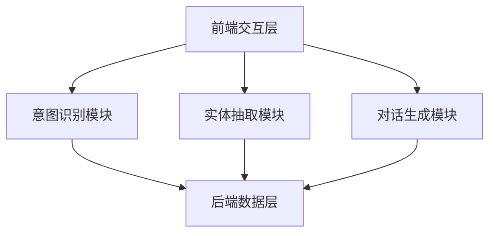
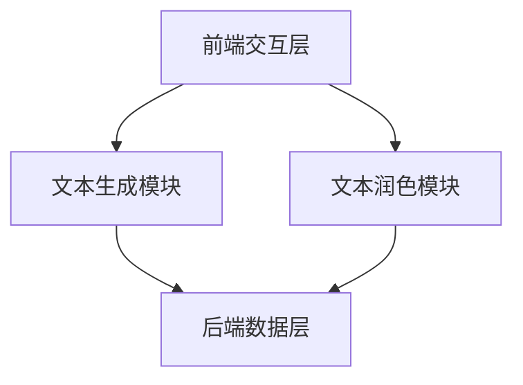

                 

# 文章标题: AI助理时代的来临

> 关键词：人工智能，AI助理，自然语言处理，机器学习，对话系统，架构设计

> 摘要：本文旨在探讨AI助理时代的来临，通过对AI助理的定义、分类、技术基础、核心算法原理以及实战应用的深入分析，全面解析AI助理的发展历程、技术原理和实践应用，旨在为读者提供一个全面而清晰的AI助理全景视图，以及对其未来发展趋势和挑战的深刻洞察。

---

### 引言

在21世纪的科技浪潮中，人工智能（AI）无疑是一个最为引人注目的领域。从早期的机器学习算法，到如今广泛应用的深度学习技术，AI正在深刻地改变着我们的生活方式和工作方式。而在AI技术的应用场景中，AI助理无疑是一个令人瞩目的亮点。AI助理不仅能够处理大量的信息，还能够进行智能对话，为用户提供个性化的服务，极大地提高了效率和用户体验。

本文将围绕AI助理这一主题，从多个角度进行深入探讨。首先，我们将对AI助理进行定义和分类，回顾其发展历程。接着，我们将分析AI助理的技术基础，包括自然语言处理、机器学习算法等关键技术。随后，我们将探讨AI助理的架构设计与交互设计，并深入讲解其核心算法原理。在此基础上，我们将通过实际项目案例展示AI助理的实战应用，并探讨其未来发展趋势和挑战。最终，我们将为读者提供一些实用的开发工具和资源。

希望通过本文的阅读，读者能够对AI助理有更深入的了解，把握其发展脉络，掌握核心技术和实战应用，为未来在AI领域的发展打下坚实的基础。

### 第一部分: AI助理时代概述

#### 第1章: AI助理的定义与分类

在进入AI助理的技术细节和实际应用之前，我们首先需要对其有一个清晰的认识。AI助理，顾名思义，是指能够协助人类完成特定任务的智能系统。这些系统基于人工智能技术，具备自然语言理解、问题求解和决策能力，能够通过人机对话与用户进行交互。

##### 1.1 AI助理的定义与核心特点

AI助理的定义可以从以下几个方面来理解：

1. **自然语言处理能力**：AI助理能够理解人类的自然语言输入，包括口语和书面语，并能够将这种语言转化为计算机可以处理的数据。

2. **任务执行能力**：AI助理不仅能够理解用户的指令，还能够根据这些指令执行具体的任务，如查询信息、发送消息、设定提醒等。

3. **自主学习与进化能力**：AI助理能够通过不断的学习和优化，提高其任务执行的能力和效率，从而更好地满足用户的需求。

核心特点主要包括：

- **智能化**：基于机器学习和深度学习技术，AI助理具有自主学习和进化的能力。
- **个性化**：通过分析用户的行为和偏好，AI助理能够提供个性化的服务和建议。
- **便捷性**：用户可以通过语音或文本与AI助理进行自然对话，操作简便，提高了效率。

##### 1.2 AI助理的分类与比较

根据不同的应用场景和技术特点，AI助理可以大致分为以下几类：

1. **智能客服**：主要用于企业与客户之间的交互，通过自动化的方式处理大量常见问题，提高客户服务效率。如客服机器人、聊天机器人等。

2. **智能助手**：通常为个人用户设计，帮助用户管理日程、发送消息、设置提醒等，如Apple的Siri、Google的Google Assistant等。

3. **智能家居助理**：通过连接各种智能设备，为用户提供家庭自动化管理服务，如Amazon的Alexa、Google的Google Home等。

4. **专业领域助理**：在特定的专业领域内，提供专业知识支持和决策辅助，如医疗诊断助理、金融分析助理等。

以下是一个简化的分类和比较表格，帮助理解各类AI助理的特点：

| 类别       | 主要功能                                     | 核心特点                         | 代表产品/应用实例        |
|------------|--------------------------------------------|----------------------------------|--------------------------|
| 智能客服   | 自动化处理常见问题，减少人工客服工作量       | 智能化，高效性                   | 聊天机器人，客服机器人   |
| 智能助手   | 管理日程，发送消息，设置提醒等              | 个性化，便捷性                   | Siri，Google Assistant   |
| 智能家居助理 | 连接智能家居设备，提供家庭自动化管理服务     | 家庭自动化，高效性               | Alexa，Google Home       |
| 专业领域助理 | 提供专业领域知识支持和决策辅助              | 专业化，准确性                   | 医疗诊断助理，金融分析助理 |

##### 1.3 AI助理的发展历程

AI助理的发展历程可以追溯到20世纪80年代，当时自然语言处理（NLP）和机器学习技术开始逐渐成熟。早期的AI系统主要用于简单的任务，如问答系统和自动应答机。随着技术的进步，AI助理的功能逐渐丰富，对话系统的质量也不断提高。

1. **萌芽阶段（1980s-1990s）**：早期AI系统主要基于规则和简单的统计方法，虽然能够完成一些简单的任务，但远不能满足实际需求。

2. **发展初期（2000s）**：随着机器学习和深度学习技术的发展，AI助理开始引入神经网络和大数据技术，性能有了显著提升。

3. **广泛应用阶段（2010s至今）**：深度学习和云计算技术的普及，使得AI助理在各个领域得到广泛应用，如智能客服、智能助手和智能家居等。

4. **智能化与个性化阶段（2020s）**：随着技术的不断进步，AI助理开始更加注重用户的个性化需求，提供更加精准和高效的服务。

综上所述，AI助理作为一种人工智能应用，其发展经历了从简单到复杂、从单一功能到多样化功能的演变。随着技术的不断进步，AI助理正逐渐成为我们生活中不可或缺的一部分，为我们的生活和工作带来极大的便利。

---

通过上述章节，我们了解了AI助理的定义、核心特点、分类及其发展历程。接下来，我们将深入探讨AI助理的技术基础，包括自然语言处理、机器学习算法等关键技术，为后续的架构设计和算法原理讲解打下坚实的基础。

### 第二部分: AI助理的技术基础

#### 第2章: AI助理的技术基础

为了实现AI助理的智能化和高效性，我们需要掌握一系列关键的技术基础。这些技术不仅决定了AI助理的性能和功能，也是实现各种应用场景的核心支撑。在本章中，我们将详细介绍自然语言处理（NLP）、机器学习算法等基础技术，并探讨它们在AI助理开发中的应用。

##### 2.1 自然语言处理基础

自然语言处理是AI助理的核心组成部分，它使机器能够理解和处理人类的自然语言。以下是NLP中的几个关键技术：

###### 2.1.1 语言模型

语言模型（Language Model）是NLP的基础，它用于预测一段文本的下一个单词或字符。语言模型的核心任务是理解自然语言的统计特性，从而生成流畅、合理的文本。

- **n-gram模型**：n-gram模型是最简单的语言模型，它将文本分割成n个单词的序列，并统计每个序列出现的频率。基于频率统计的方法，n-gram模型能够生成文本，但其生成的文本可能不够流畅。

  伪代码示例：
  ```python
  def generate_text(n, start_word):
      sequence = [start_word]
      for _ in range(n-1):
          current_sequence = tuple(sequence)
          next_word = max(n_gram[current_sequence], key=n_gram.get)
          sequence.append(next_word)
      return ' '.join(sequence)
  ```

- **神经网络语言模型**：神经网络语言模型（Neural Network Language Model）通过神经网络学习文本的概率分布，能够生成更加流畅和自然的文本。LSTM（Long Short-Term Memory）和Transformer模型是两种常见的神经网络语言模型。

  伪代码示例（基于Transformer模型）：
  ```python
  def generate_text(transformer_model, start_sequence):
      current_sequence = start_sequence
      while not end_of_sentence(current_sequence):
          output = transformer_model(current_sequence)
          next_word = top_output(output)
          current_sequence = append_word(current_sequence, next_word)
      return ' '.join(current_sequence)
  ```

###### 2.1.2 信息检索

信息检索（Information Retrieval）是NLP的重要分支，它用于从大量文本数据中找到与用户查询最相关的信息。信息检索的关键技术包括：

- **布尔检索**：基于布尔逻辑进行文本查询，通过AND、OR、NOT等操作组合关键词，以提高查询的精确度。

  伪代码示例：
  ```python
  def boolean_retrieval(query, documents):
      terms = tokenize(query)
      results = set(documents[0])
      for term in terms:
          if term not in documents:
              return []
          if "NOT" in terms:
              results &= set(documents[term])
          else:
              results &= set(documents[term])
      return results
  ```

- **向量空间模型**：向量空间模型（Vector Space Model）将文本表示为高维向量，并利用向量之间的相似度进行检索。TF-IDF（Term Frequency-Inverse Document Frequency）是一种常见的向量空间模型，用于计算文本的重要性和相关度。

  伪代码示例：
  ```python
  def tf_idf(document, corpus):
      term_frequencies = count_terms(document)
      inverse_document_frequencies = compute_idf(corpus)
      tf_idf_vector = [tf * idf for term, tf in term_frequencies.items() for idf in inverse_document_frequencies[term]]
      return tf_idf_vector
  ```

###### 2.1.3 对话系统

对话系统（Dialogue System）是AI助理的核心技术之一，它使机器能够与用户进行自然对话，理解用户的意图，并生成合理的回答。以下是几个关键组成部分：

- **意图识别（Intent Recognition）**：意图识别是对话系统的第一步，它用于识别用户的意图或目的。常见的意图识别方法包括基于规则的模型和基于机器学习的模型。

  伪代码示例（基于机器学习模型）：
  ```python
  def recognize_intent(input_sentence, trained_model):
      features = extract_features(input_sentence)
      intent = trained_model.predict(features)
      return intent
  ```

- **实体抽取（Entity Extraction）**：实体抽取是识别文本中的关键信息，如人名、地点、时间等。实体抽取可以通过命名实体识别（Named Entity Recognition, NER）技术实现。

  伪代码示例：
  ```python
  def extract_entities(sentence, ner_model):
      entities = ner_model.predict(sentence)
      return entities
  ```

- **对话生成（Dialogue Generation）**：对话生成是生成自然、合理的回答。常见的对话生成方法包括基于模板的生成、基于规则的生成和基于机器学习的生成。

  伪代码示例（基于机器学习模型）：
  ```python
  def generate_response(input_sentence, trained_model):
      intent = recognize_intent(input_sentence, intent_model)
      entities = extract_entities(input_sentence, ner_model)
      response = trained_model.generate_response(intent, entities)
      return response
  ```

##### 2.2 机器学习算法与应用

机器学习算法是AI助理实现智能化的重要工具，它们使AI能够通过数据学习并优化任务执行能力。以下是几种常见的机器学习算法及其在AI助理中的应用：

###### 2.2.1 监督学习算法

监督学习算法是机器学习中的一种，它通过已标记的训练数据学习预测模型。以下是几种常用的监督学习算法：

- **线性回归（Linear Regression）**：线性回归是一种简单的监督学习算法，用于预测连续值。它可以用于预测用户的评分、消费金额等。

  数学模型：
  $$ y = \beta_0 + \beta_1x + \epsilon $$
  
  伪代码示例：
  ```python
  def linear_regression(X, y):
      X = add_intercept(X)
      theta = solve_linear_system(X.T.dot(X), X.T.dot(y))
      return theta
  ```

- **决策树（Decision Tree）**：决策树是一种树形结构的分类模型，通过一系列规则进行决策。它可以用于分类任务，如用户偏好分类、新闻分类等。

  伪代码示例：
  ```python
  def build_decision_tree(data, features):
      if all_same_label(data):
          return majority_vote(data)
      else:
          feature = select_best_feature(data, features)
          left subtree = build_decision_tree(split_left(data, feature), features)
          right subtree = build_decision_tree(split_right(data, feature), features)
          return DecisionTreeNode(feature, left subtree, right subtree)
  ```

- **支持向量机（Support Vector Machine, SVM）**：支持向量机是一种分类模型，通过最大化分类间隔来进行分类。它可以用于复杂的多类分类任务，如手写数字识别、文本分类等。

  数学模型：
  $$ \min_{\beta, \beta_0} \frac{1}{2} ||\beta||^2 + C \sum_{i=1}^{n} \max(0, 1 - y_i(\beta^T x_i + \beta_0)) $$
  
  伪代码示例：
  ```python
  def train_svm(X, y, C):
      kernel_matrix = compute_kernel_matrix(X)
      p = kernel_matrix.dot(kernel_matrix.T)
      q = -2 * kernel_matrix.dot(y)
      r = np.diag(kernel_matrix.dot(y))
      solution = solve_linear_system(p, q, r, C)
      return solution
  ```

###### 2.2.2 无监督学习算法

无监督学习算法是不使用标记数据的机器学习算法，主要用于发现数据中的隐含结构和模式。以下是几种常用的无监督学习算法：

- **K-means聚类（K-means Clustering）**：K-means聚类是一种基于距离的聚类算法，通过将数据点分配到K个中心点附近的群组中，用于数据降维和模式识别。

  数学模型：
  $$ \min_{\mu_1, \mu_2, ..., \mu_K} \sum_{i=1}^{K} \sum_{x \in S_i} ||x - \mu_i||^2 $$
  
  伪代码示例：
  ```python
  def k_means(data, K, max_iterations):
      centroids = initialize_centroids(data, K)
      for _ in range(max_iterations):
          assign_points_to_centroids(data, centroids)
          update_centroids(centroids)
      return centroids
  ```

- **Apriori算法（Apriori Algorithm）**：Apriori算法是一种基于频繁项集的算法，用于发现数据中的关联规则。它可以用于市场篮子分析、推荐系统等。

  伪代码示例：
  ```python
  def find_frequent_itemsets(data, min_support):
      frequent_itemsets = []
      for length in range(1, max_itemset_length(data)):
          candidate_itemsets = generate_candidate_itemsets(data, length)
          support_counts = count_support(candidate_itemsets, data)
          frequent_itemsets.extend([itemset for itemset, count in support_counts.items() if count >= min_support])
      return frequent_itemsets
  ```

- **主成分分析（Principal Component Analysis, PCA）**：主成分分析是一种降维技术，通过将数据投影到新的正交坐标系中，减少数据维度，同时保留主要信息。

  数学模型：
  $$ X' = P'X $$
  其中，$X$是原始数据，$X'$是降维后的数据，$P'$是协方差矩阵的特征向量矩阵。
  
  伪代码示例：
  ```python
  def pca(data, num_components):
      covariance_matrix = compute_covariance_matrix(data)
      eigenvalues, eigenvectors = compute_eigenvalues_eigenvectors(covariance_matrix)
      sorted_eigenvectors = sort_eigenvectors_by_eigenvalues(eigenvectors)
      projection_matrix = sorted_eigenvectors[:num_components]
      return projection_matrix
  ```

###### 2.2.3 强化学习算法

强化学习算法是一种通过试错和反馈进行学习的方法，广泛应用于智能决策和游戏控制等领域。以下是几种常用的强化学习算法：

- **Q-Learning（Q值学习）**：Q-Learning是一种基于值函数的强化学习算法，通过迭代更新Q值来找到最优策略。

  数学模型：
  $$ Q(s, a) = Q(s, a) + \alpha [r + \gamma \max_{a'} Q(s', a') - Q(s, a)] $$
  
  伪代码示例：
  ```python
  def q_learning(environment, learning_rate, discount_factor, num_episodes):
      initialize_q_values()
      for episode in range(num_episodes):
          state = environment.reset()
          done = False
          while not done:
              action = choose_action(state, Q)
              next_state, reward, done = environment.step(action)
              update_q_value(state, action, reward, next_state, done, learning_rate, discount_factor)
              state = next_state
      return Q
  ```

- **Deep Q-Network (DQN)（深度Q网络）**：DQN是一种基于深度学习的强化学习算法，通过神经网络来近似Q值函数。

  伪代码示例：
  ```python
  def dqn(environment, learning_rate, discount_factor, num_episodes, target_update_frequency):
      initialize_q_network()
      for episode in range(num_episodes):
          state = environment.reset()
          done = False
          while not done:
              action = choose_action(state, q_network)
              next_state, reward, done = environment.step(action)
              target_q_value = reward + discount_factor * np.max(target_network.predict(next_state))
              update_target_network(target_q_value, state, action, learning_rate)
              state = next_state
          if episode % target_update_frequency == 0:
              update_target_network(q_network)
      return q_network
  ```

- **Policy Gradient（策略梯度）**：Policy Gradient是一种通过直接优化策略梯度的强化学习算法，通过优化策略来最大化累积回报。

  数学模型：
  $$ \nabla_{\theta} J(\theta) = \frac{d}{dt} \sum_{t} \gamma^t r_t $$
  
  伪代码示例：
  ```python
  def policy_gradientPolicygradient(policy_model, environment, learning_rate, num_episodes):
      for episode in range(num_episodes):
          state = environment.reset()
          done = False
          episode_reward = 0
          while not done:
              action = policy_model.sample_action(state)
              next_state, reward, done = environment.step(action)
              episode_reward += reward
              gradient = compute_policy_gradient(state, action, reward, next_state, done, learning_rate)
              policy_model.update(gradient)
              state = next_state
      return policy_model
  ```

通过上述自然语言处理和机器学习算法的讲解，我们可以看到AI助理的技术基础是多么的丰富和复杂。在接下来的章节中，我们将进一步探讨AI助理的架构设计与交互设计，并深入讲解其核心算法原理，为理解AI助理的实战应用奠定基础。

#### 第3章: AI助理的架构与设计

AI助理的架构设计是确保其高效、可靠和用户友好的关键。一个优秀的AI助理不仅需要具备强大的功能，还需要良好的用户体验和可扩展性。在本章中，我们将详细介绍AI助理的架构设计，包括系统架构、交互设计以及模块化设计。

##### 3.1 AI助理的架构概述

AI助理的架构可以分为三个主要层次：前端交互层、中间处理层和后端数据层。每个层次都有其独特的功能和职责，相互协作，共同构成一个完整的AI系统。

1. **前端交互层**：前端交互层主要负责与用户进行交互，接收用户的输入并展示AI助理的响应。该层通常包含语音识别、语音合成、文本输入输出等功能。

   - **语音识别**：将用户的语音输入转换为文本，以便后续处理。常用的语音识别技术包括自动语音识别（ASR）和语音识别API。
   - **语音合成**：将AI助理生成的文本转换为语音输出，提供自然的语音反馈。常用的语音合成技术包括文本到语音（TTS）系统和语音合成API。
   - **文本输入输出**：处理文本形式的输入和输出，确保用户与AI助理之间的交互流畅。

2. **中间处理层**：中间处理层是AI助理的核心，负责处理和分析用户输入，执行具体的任务。该层通常包含意图识别、实体抽取、对话生成等模块。

   - **意图识别**：通过自然语言处理技术，识别用户输入中的意图，如查询信息、执行操作等。
   - **实体抽取**：从用户输入中提取关键信息，如人名、地点、时间等，用于后续任务处理。
   - **对话生成**：根据用户的意图和提取的实体信息，生成自然、合理的回复。

3. **后端数据层**：后端数据层负责存储和管理AI助理所需的数据，包括用户数据、知识库、历史对话记录等。该层通常包含数据库、数据存储和处理技术。

   - **用户数据**：存储用户的基本信息和偏好设置，用于提供个性化服务。
   - **知识库**：存储AI助理所需的专业知识和常识，用于增强AI助理的回答能力。
   - **历史对话记录**：记录用户的对话历史，用于学习和优化AI助理的表现。

##### 3.2 交互设计与用户体验

交互设计是AI助理成功的关键因素之一，它决定了用户与AI助理互动的流畅性和愉悦感。以下是一些关键的设计原则：

1. **自然语言交互**：AI助理应能够理解自然语言，允许用户以口语或书面语的方式与其进行交流，减少学习成本和操作难度。

2. **多模态交互**：结合语音、文本、图形等多种交互方式，提供灵活、丰富的用户体验。例如，用户可以通过语音提问，AI助理可以以文本和语音的形式回答。

3. **个性化交互**：根据用户的行为和偏好，AI助理应能够提供个性化的服务和建议，增强用户的归属感和满意度。

4. **反馈机制**：AI助理应提供反馈机制，允许用户对回答和服务进行评价，用于持续优化和改进系统。

5. **易用性**：界面设计应简洁直观，操作流程应尽可能简化，确保用户能够快速上手和使用。

##### 3.3 AI助理的模块化设计

模块化设计是AI助理架构设计的重要原则，它有助于提高系统的可维护性、可扩展性和灵活性。以下是模块化设计的一些关键要素：

1. **模块独立性**：每个模块应具有明确的职责和功能，独立运行，减少模块间的依赖性。

2. **模块间接口**：模块之间应通过标准化的接口进行通信，确保模块的替换和升级不会影响其他模块。

3. **可扩展性**：系统应支持模块的动态添加和删除，以适应不断变化的需求和应用场景。

4. **可重用性**：设计时应充分考虑模块的可重用性，以提高开发效率和降低维护成本。

通过上述设计原则和方法，AI助理可以构建为一个高效、灵活和用户友好的系统。在接下来的章节中，我们将深入探讨AI助理的核心算法原理，进一步揭示其技术实现的细节。

#### 第4章: 自然语言处理算法原理

自然语言处理（NLP）是AI助理的核心技术之一，它使机器能够理解和处理人类的自然语言。在这一章中，我们将详细介绍NLP中的关键算法原理，包括词嵌入技术、语言模型算法和对话系统算法。

##### 4.1 词嵌入技术

词嵌入（Word Embedding）是将单词转换为向量的技术，使其在数学上进行处理和计算。词嵌入技术不仅有助于降低NLP任务的复杂性，还能捕捉词与词之间的语义关系。

###### 4.1.1 Word2Vec

Word2Vec是早期的一种词嵌入技术，通过神经网络学习词向量。它有两种主要的模型：连续词袋（CBOW）和Skip-Gram。

- **CBOW（Continuous Bag of Words）**：CBOW模型通过一个单词的上下文（周围单词）来预测中心词。模型将上下文单词的向量平均后，预测中心词。

  伪代码示例：
  ```python
  def cbow(input_word, context_words, output_word, embedding_size, learning_rate):
      context_vectors = [embeddings[word] for word in context_words]
      average_context_vector = np.mean(context_vectors, axis=0)
      output_vector = embeddings[output_word]
      loss = compute_loss(average_context_vector, output_vector)
      gradients = compute_gradients(average_context_vector, output_vector)
      update_embeddings(gradients, learning_rate)
      return loss
  ```

- **Skip-Gram**：Skip-Gram模型与CBOW相反，它通过中心词来预测上下文单词。模型将中心词的向量扩展后，预测上下文单词。

  伪代码示例：
  ```python
  def skip_gram(input_word, context_words, output_word, embedding_size, learning_rate):
      input_vector = embeddings[input_word]
      output_vectors = [embeddings[word] for word in context_words]
      for output_vector in output_vectors:
          loss = compute_loss(input_vector, output_vector)
          gradients = compute_gradients(input_vector, output_vector)
          update_embeddings(gradients, learning_rate)
      return loss
  ```

###### 4.1.2 GloVe

GloVe（Global Vectors for Word Representation）是一种基于词频统计的词嵌入技术，通过矩阵分解学习词向量。GloVe模型通过两个矩阵$F$和$V$来表示词频和词向量，并使用损失函数优化这两个矩阵。

  数学模型：
  $$ F = \text{softmax}(V \cdot X) $$
  $$ V = \text{softmax}(F \cdot X)^T $$

  伪代码示例：
  ```python
  def glove_loss(frequencies, embeddings, vocabulary_size, learning_rate):
      F = compute_softmax(embeddings @ X)
      V = compute_softmax(F @ X).T
      loss = compute_mean_squared_error(frequencies, F)
      gradients_F = compute_gradients(F, frequencies, X)
      gradients_V = compute_gradients(V, frequencies, F)
      update_embeddings(gradients_F, gradients_V, learning_rate)
      return loss
  ```

###### 4.1.3 BERT

BERT（Bidirectional Encoder Representations from Transformers）是一种基于Transformer的预训练语言模型，通过双向编码学习词向量。BERT模型通过在大规模语料库上进行预训练，然后通过微调适配特定任务。

  伪代码示例：
  ```python
  def bert_pretrain(corpus, vocabulary_size, hidden_size, num_layers, learning_rate):
      model = build_bert_model(vocabulary_size, hidden_size, num_layers)
      optimizer = build_optimizer(learning_rate)
      for epoch in range(num_epochs):
          for sentence in corpus:
              inputs = preprocess_sentence(sentence)
              targets = [word for word in sentence]
              outputs = model(inputs)
              loss = compute_loss(outputs, targets)
              optimizer.step(loss)
      return model
  ```

##### 4.2 语言模型算法

语言模型（Language Model）用于预测一段文本的下一个单词或字符，是NLP任务的基础。以下是几种常见的语言模型算法：

###### 4.2.1 n-gram模型

n-gram模型是最简单的语言模型，它将文本表示为n个单词的序列，并统计每个序列出现的频率。n-gram模型通过概率分布预测下一个单词。

  数学模型：
  $$ P(w_t) = \frac{f(w_t, w_{t-1}, ..., w_{t-n+1})}{\sum_{w} f(w, w_{t-1}, ..., w_{t-n+1})} $$

  伪代码示例：
  ```python
  def n_gram_model(sentence, n, n_gram_counts):
      tokens = tokenize(sentence)
      probabilities = []
      for i in range(len(tokens) - n + 1):
          sequence = tuple(tokens[i:i+n])
          probability = n_gram_counts[sequence] / total_counts
          probabilities.append(probability)
      return probabilities
  ```

###### 4.2.2 LSTM

LSTM（Long Short-Term Memory）是一种循环神经网络（RNN），通过记忆单元捕捉长距离依赖。LSTM模型能够学习文本中的上下文关系，提高语言模型的性能。

  数学模型：
  $$ h_t = \sigma(W_h \cdot [h_{t-1}, x_t] + b_h) $$
  $$ i_t = \sigma(W_i \cdot [h_{t-1}, x_t] + b_i) $$
  $$ f_t = \sigma(W_f \cdot [h_{t-1}, x_t] + b_f) $$
  $$ o_t = \sigma(W_o \cdot [h_{t-1}, x_t] + b_o) $$
  $$ c_t = f_t \cdot c_{t-1} + i_t \cdot \sigma(W_c \cdot [h_{t-1}, x_t] + b_c) $$

  伪代码示例：
  ```python
  def lstm(input_sequence, hidden_state, cell_state, weights):
      input_vector = embeddings[input_word]
      h_prev, c_prev = hidden_state
      i = sigmoid(weights_i.dot([h_prev, input_vector]) + b_i)
      f = sigmoid(weights_f.dot([h_prev, input_vector]) + b_f)
      o = sigmoid(weights_o.dot([h_prev, input_vector]) + b_o)
      c = f * c_prev + i * sigmoid(weights_c.dot([h_prev, input_vector]) + b_c)
      h = o * sigmoid(c)
      return (h, c)
  ```

###### 4.2.3 Transformer模型

Transformer模型是一种基于自注意力机制的序列模型，通过多头自注意力机制和前馈神经网络处理长距离依赖。Transformer模型在BERT、GPT等大型语言模型中得到了广泛应用。

  数学模型：
  $$ \text{Attention}(Q, K, V) = \frac{QK^T}{\sqrt{d_k}} + V $$

  伪代码示例：
  ```python
  def self_attention(query, key, value, d_model, num_heads):
      Q = linear_layer(query, d_model, d_model // num_heads)
      K = linear_layer(key, d_model, d_model // num_heads)
      V = linear_layer(value, d_model, d_model // num_heads)
      score = QK.T / np.sqrt(d_model // num_heads)
      attention_weights = softmax(score)
      attention_output = attention_weights @ V
      return attention_output
  ```

##### 4.3 对话系统算法

对话系统（Dialogue System）是AI助理的重要组成部分，通过理解和生成自然对话，为用户提供交互服务。以下是几种关键对话系统算法：

###### 4.3.1 回答生成算法

回答生成算法是对话系统的核心，负责根据用户的输入生成合理的回答。常见的回答生成算法包括基于规则的方法和基于机器学习的方法。

- **基于规则的方法**：基于规则的方法通过定义一系列规则来生成回答。这些规则通常由领域专家制定，可以确保回答的准确性和一致性。

  伪代码示例：
  ```python
  def generate_response(input_sentence, rule_based_model):
      intent = rule_based_model.recognize_intent(input_sentence)
      response = rule_based_model.get_response_for_intent(intent)
      return response
  ```

- **基于机器学习的方法**：基于机器学习的方法通过训练模型学习生成回答。常见的机器学习方法包括序列生成模型和注意力机制模型。

  伪代码示例：
  ```python
  def generate_response(input_sentence, trained_model):
      intent = trained_model.recognize_intent(input_sentence)
      entities = trained_model.extract_entities(input_sentence)
      response = trained_model.generate_response_for_intent_and_entities(intent, entities)
      return response
  ```

###### 4.3.2 问答匹配算法

问答匹配算法是对话系统中用于匹配用户问题和知识库中的答案的算法。常见的问答匹配算法包括基于关键词匹配的方法和基于语义相似度的方法。

- **基于关键词匹配的方法**：基于关键词匹配的方法通过匹配用户问题和答案中的关键词，确定问题的匹配度。常见的算法包括布尔检索和向量空间模型。

  伪代码示例：
  ```python
  def keyword_matching(input_question, knowledge_base, similarity_threshold):
      input_tokens = tokenize(input_question)
      scores = []
      for question in knowledge_base:
          question_tokens = tokenize(question)
          intersection = set(input_tokens) & set(question_tokens)
          score = len(intersection) / len(input_tokens)
          scores.append(score)
      matched_question = knowledge_base[scores.index(max(scores))]
      return matched_question
  ```

- **基于语义相似度的方法**：基于语义相似度的方法通过计算用户问题和知识库中的答案的语义相似度，确定问题的匹配度。常见的算法包括词嵌入相似度和句子嵌入相似度。

  伪代码示例：
  ```python
  def semantic_matching(input_question, knowledge_base, model):
      input_embedding = model.encode(input_question)
      scores = []
      for question in knowledge_base:
          question_embedding = model.encode(question)
          score = cosine_similarity(input_embedding, question_embedding)
          scores.append(score)
      matched_question = knowledge_base[scores.index(max(scores))]
      return matched_question
  ```

###### 4.3.3 对话状态跟踪

对话状态跟踪（Dialogue State Tracking）是对话系统中用于跟踪对话状态和上下文信息的算法。对话状态跟踪可以确保对话系统能够在多轮对话中保持一致性，并理解用户的意图和需求。

- **基于规则的方法**：基于规则的方法通过定义一系列规则来跟踪对话状态。这些规则可以根据对话历史和用户输入动态更新。

  伪代码示例：
  ```python
  def update_state(input_sentence, state, rule_based_model):
      state = rule_based_model.update_state_with_intent(input_sentence, state)
      state = rule_based_model.update_state_with_entities(input_sentence, state)
      return state
  ```

- **基于机器学习的方法**：基于机器学习的方法通过训练模型学习对话状态的跟踪。常见的机器学习方法包括序列模型和图模型。

  伪代码示例：
  ```python
  def update_state(input_sentence, state, trained_model):
      state = trained_model.update_state_with_intent(input_sentence, state)
      state = trained_model.update_state_with_entities(input_sentence, state)
      return state
  ```

通过上述对自然语言处理算法的深入讲解，我们可以看到NLP在AI助理中的作用和重要性。在下一章中，我们将继续探讨机器学习算法，进一步了解其在AI助理中的应用。

### 第5章: 机器学习算法与应用

机器学习算法是AI助理智能性的核心，它们使AI能够从数据中学习并做出预测。在这一章中，我们将详细介绍几种常见的机器学习算法，包括监督学习算法、无监督学习算法和强化学习算法，并探讨它们在AI助理中的应用。

##### 5.1 监督学习算法

监督学习算法通过已标记的训练数据学习预测模型。这些算法广泛应用于分类和回归任务，能够帮助AI助理识别用户的意图、分类信息等。

###### 5.1.1 线性回归

线性回归是一种简单的监督学习算法，用于预测连续值。它可以用于预测用户的评分、消费金额等。

  数学模型：
  $$ y = \beta_0 + \beta_1x + \epsilon $$
  
  伪代码示例：
  ```python
  def linear_regression(X, y):
      X = add_intercept(X)
      theta = solve_linear_system(X.T.dot(X), X.T.dot(y))
      return theta
  ```

  实际应用案例：
  - **智能客服系统**：线性回归可以用于预测用户的满意度评分，从而优化客服服务质量。

###### 5.1.2 决策树

决策树是一种树形结构的分类模型，通过一系列规则进行决策。它可以用于分类任务，如用户偏好分类、新闻分类等。

  伪代码示例：
  ```python
  def build_decision_tree(data, features):
      if all_same_label(data):
          return majority_vote(data)
      else:
          feature = select_best_feature(data, features)
          left subtree = build_decision_tree(split_left(data, feature), features)
          right subtree = build_decision_tree(split_right(data, feature), features)
          return DecisionTreeNode(feature, left subtree, right subtree)
  ```

  实际应用案例：
  - **智能助手**：决策树可以用于分类用户的查询意图，从而生成合理的回答。

###### 5.1.3 支持向量机

支持向量机（Support Vector Machine, SVM）是一种分类模型，通过最大化分类间隔来进行分类。它可以用于复杂的多类分类任务，如手写数字识别、文本分类等。

  数学模型：
  $$ \min_{\beta, \beta_0} \frac{1}{2} ||\beta||^2 + C \sum_{i=1}^{n} \max(0, 1 - y_i(\beta^T x_i + \beta_0)) $$
  
  伪代码示例：
  ```python
  def train_svm(X, y, C):
      kernel_matrix = compute_kernel_matrix(X)
      p = kernel_matrix.dot(kernel_matrix.T)
      q = -2 * kernel_matrix.dot(y)
      r = np.diag(kernel_matrix.dot(y))
      solution = solve_linear_system(p, q, r, C)
      return solution
  ```

  实际应用案例：
  - **智能客服系统**：SVM可以用于分类用户的问题类型，从而优化问题的处理流程。

##### 5.2 无监督学习算法

无监督学习算法不使用标记数据，旨在发现数据中的隐含结构和模式。这些算法在聚类和降维任务中非常有用。

###### 5.2.1 K-means聚类

K-means聚类是一种基于距离的聚类算法，通过将数据点分配到K个中心点附近的群组中，用于数据降维和模式识别。

  数学模型：
  $$ \min_{\mu_1, \mu_2, ..., \mu_K} \sum_{i=1}^{K} \sum_{x \in S_i} ||x - \mu_i||^2 $$
  
  伪代码示例：
  ```python
  def k_means(data, K, max_iterations):
      centroids = initialize_centroids(data, K)
      for _ in range(max_iterations):
          assign_points_to_centroids(data, centroids)
          update_centroids(centroids)
      return centroids
  ```

  实际应用案例：
  - **智能助手**：K-means聚类可以用于用户行为分析，从而为用户提供个性化推荐。

###### 5.2.2 Apriori算法

Apriori算法是一种基于频繁项集的算法，用于发现数据中的关联规则。它可以用于市场篮子分析、推荐系统等。

  伪代码示例：
  ```python
  def find_frequent_itemsets(data, min_support):
      frequent_itemsets = []
      for length in range(1, max_itemset_length(data)):
          candidate_itemsets = generate_candidate_itemsets(data, length)
          support_counts = count_support(candidate_itemsets, data)
          frequent_itemsets.extend([itemset for itemset, count in support_counts.items() if count >= min_support])
      return frequent_itemsets
  ```

  实际应用案例：
  - **智能客服系统**：Apriori算法可以用于分析常见问题组合，从而优化问题的处理策略。

###### 5.2.3 主成分分析

主成分分析（Principal Component Analysis, PCA）是一种降维技术，通过将数据投影到新的正交坐标系中，减少数据维度，同时保留主要信息。

  数学模型：
  $$ X' = P'X $$
  其中，$X$是原始数据，$X'$是降维后的数据，$P'$是协方差矩阵的特征向量矩阵。
  
  伪代码示例：
  ```python
  def pca(data, num_components):
      covariance_matrix = compute_covariance_matrix(data)
      eigenvalues, eigenvectors = compute_eigenvalues_eigenvectors(covariance_matrix)
      sorted_eigenvectors = sort_eigenvectors_by_eigenvalues(eigenvectors)
      projection_matrix = sorted_eigenvectors[:num_components]
      return projection_matrix
  ```

  实际应用案例：
  - **智能助手**：PCA可以用于用户行为数据的降维，从而提高数据处理效率和模型性能。

##### 5.3 强化学习算法

强化学习算法通过试错和反馈进行学习，广泛应用于智能决策和游戏控制等领域。这些算法在AI助理中用于优化用户的交互体验。

###### 5.3.1 Q-Learning

Q-Learning是一种基于值函数的强化学习算法，通过迭代更新Q值来找到最优策略。

  数学模型：
  $$ Q(s, a) = Q(s, a) + \alpha [r + \gamma \max_{a'} Q(s', a') - Q(s, a)] $$
  
  伪代码示例：
  ```python
  def q_learning(environment, learning_rate, discount_factor, num_episodes):
      initialize_q_values()
      for episode in range(num_episodes):
          state = environment.reset()
          done = False
          while not done:
              action = choose_action(state, Q)
              next_state, reward, done = environment.step(action)
              update_q_value(state, action, reward, next_state, done, learning_rate, discount_factor)
              state = next_state
      return Q
  ```

  实际应用案例：
  - **智能客服系统**：Q-Learning可以用于优化客服流程，提高问题处理效率和用户满意度。

###### 5.3.2 Deep Q-Network (DQN)

DQN是一种基于深度学习的强化学习算法，通过神经网络来近似Q值函数。

  伪代码示例：
  ```python
  def dqn(environment, learning_rate, discount_factor, num_episodes, target_update_frequency):
      initialize_q_network()
      for episode in range(num_episodes):
          state = environment.reset()
          done = False
          while not done:
              action = choose_action(state, q_network)
              next_state, reward, done = environment.step(action)
              target_q_value = reward + discount_factor * np.max(target_network.predict(next_state))
              update_target_network(target_q_value, state, action, learning_rate)
              state = next_state
          if episode % target_update_frequency == 0:
              update_target_network(q_network)
      return q_network
  ```

  实际应用案例：
  - **智能助手**：DQN可以用于优化智能助手的推荐策略，提高个性化推荐的准确性。

###### 5.3.3 Policy Gradient

Policy Gradient是一种通过直接优化策略梯度的强化学习算法，通过优化策略来最大化累积回报。

  数学模型：
  $$ \nabla_{\theta} J(\theta) = \frac{d}{dt} \sum_{t} \gamma^t r_t $$
  
  伪代码示例：
  ```python
  def policy_gradientPolicygradient(policy_model, environment, learning_rate, num_episodes):
      for episode in range(num_episodes):
          state = environment.reset()
          done = False
          episode_reward = 0
          while not done:
              action = policy_model.sample_action(state)
              next_state, reward, done = environment.step(action)
              episode_reward += reward
              gradient = compute_policy_gradient(state, action, reward, next_state, done, learning_rate)
              policy_model.update(gradient)
              state = next_state
      return policy_model
  ```

  实际应用案例：
  - **智能助手**：Policy Gradient可以用于优化智能助手的行为策略，提高用户交互体验。

通过上述对机器学习算法的详细讲解和应用案例，我们可以看到这些算法在AI助理中的应用如何实现智能化和高效化。在下一章中，我们将通过实际项目展示AI助理的实战应用，进一步了解AI助理的实用性和价值。

#### 第6章: AI助理项目实战

在实际应用中，AI助理不仅需要具备强大的技术支持，还需要通过具体的实战项目来验证其有效性和实用性。在本章中，我们将详细介绍两个实际项目：智能客服系统和智能写作助手。通过这两个项目，我们将展示AI助理的开发流程、系统架构、代码实现和调试过程，帮助读者更深入地理解AI助理的实战应用。

##### 6.1 实战项目一：智能客服系统

智能客服系统是AI助理应用的一个重要领域，通过自动化的方式处理大量常见问题，提高客户服务效率。以下是该项目的主要开发流程和系统架构。

###### 6.1.1 项目背景与需求分析

随着互联网和电子商务的快速发展，客户服务成为企业运营的重要环节。然而，大量的客户咨询和问题处理不仅耗费人力，还可能导致服务质量的下降。智能客服系统的目标是利用AI技术，实现自动化的客户服务，提高服务效率和用户体验。

主要需求包括：

- 自动化处理常见问题
- 提供个性化服务
- 高效响应用户需求
- 支持多渠道接入（如网页、移动应用、社交媒体等）

###### 6.1.2 系统架构设计

智能客服系统主要包括三个主要模块：前端交互层、中间处理层和后端数据层。

1. **前端交互层**：负责与用户进行交互，接收用户的输入并展示系统的响应。该层通常包含Web聊天窗口、移动应用聊天界面等。

2. **中间处理层**：是系统的核心，负责处理用户的输入，进行意图识别、实体抽取和对话生成，并生成合适的回答。该层通常包含NLP模块、意图识别模块、对话生成模块等。

3. **后端数据层**：负责存储和管理用户数据、知识库和对话历史，以便后续分析和优化。该层通常包含数据库、数据存储和处理技术。

以下是一个简化的系统架构图：



###### 6.1.3 代码实现与调试

智能客服系统的实现可以分为以下几个关键步骤：

1. **数据准备**：收集并清洗用户对话数据，用于训练和测试模型。

2. **模型训练**：使用训练数据训练意图识别模型、实体抽取模型和对话生成模型。

3. **系统集成**：将训练好的模型集成到前端交互层，实现用户输入的处理和响应。

以下是一个简化的代码实现示例：

```python
# 模型训练
def train_models(intent_model, entity_model, dialogue_model, train_data):
    # 训练意图识别模型
    intent_model.fit(train_data['input'], train_data['intent'])
    
    # 训练实体抽取模型
    entity_model.fit(train_data['input'], train_data['entities'])
    
    # 训练对话生成模型
    dialogue_model.fit(train_data['input'], train_data['output'])
    
    return intent_model, entity_model, dialogue_model

# 系统运行
def run_system(intent_model, entity_model, dialogue_model, input_message):
    # 识别意图
    intent = intent_model.predict([input_message])
    
    # 提取实体
    entities = entity_model.predict([input_message])
    
    # 生成回答
    response = dialogue_model.generate_response([input_message], intent, entities)
    
    return response
```

在实际开发过程中，可能需要进行多次迭代和调试，优化模型性能和系统响应速度。

##### 6.2 实战项目二：智能写作助手

智能写作助手是AI助理在文本生成领域的应用，通过AI技术帮助用户快速生成高质量的文章、报告、邮件等。以下是该项目的主要开发流程和系统架构。

###### 6.2.1 项目背景与需求分析

在信息爆炸的时代，文本生成成为一项重要的任务。智能写作助手可以通过自动化的方式，根据用户提供的主题、大纲或关键词，快速生成高质量的文本内容。这不仅提高了写作效率，还减少了人力成本。

主要需求包括：

- 根据用户输入生成高质量文章
- 支持多种文本格式（如Markdown、HTML等）
- 提供文本润色和优化功能
- 支持多语言和跨平台使用

###### 6.2.2 系统架构设计

智能写作助手主要包括三个主要模块：前端交互层、中间处理层和后端数据层。

1. **前端交互层**：负责与用户进行交互，接收用户输入并展示生成的内容。该层通常包含Web界面、移动应用界面等。

2. **中间处理层**：是系统的核心，负责处理用户的输入，生成文本内容。该层通常包含文本生成模块、文本润色模块等。

3. **后端数据层**：负责存储和管理用户数据、文本模板和知识库，以便后续分析和优化。该层通常包含数据库、数据存储和处理技术。

以下是一个简化的系统架构图：



###### 6.2.3 代码实现与调试

智能写作助手的实现可以分为以下几个关键步骤：

1. **数据准备**：收集并清洗文本数据，用于训练和测试文本生成模型。

2. **模型训练**：使用训练数据训练文本生成模型和文本润色模型。

3. **系统集成**：将训练好的模型集成到前端交互层，实现用户输入的处理和文本生成。

以下是一个简化的代码实现示例：

```python
# 模型训练
def train_models(text_generator_model, text_editor_model, train_data):
    # 训练文本生成模型
    text_generator_model.fit(train_data['input'], train_data['output'])
    
    # 训练文本润色模型
    text_editor_model.fit(train_data['input'], train_data['output'])
    
    return text_generator_model, text_editor_model

# 文本生成
def generate_text(text_generator_model, input_prompt):
    generated_text = text_generator_model.generate_text(input_prompt)
    edited_text = text_editor_model.edit_text(generated_text)
    return edited_text
```

在实际开发过程中，可能需要进行多次迭代和调试，优化模型性能和生成文本的质量。

通过上述两个实际项目的介绍，我们可以看到AI助理在智能客服系统和智能写作助手中的应用是如何实现的。这些项目不仅展示了AI助理的实用性和价值，也为读者提供了具体的开发经验和参考。在下一章中，我们将探讨AI助理的未来发展趋势和面临的挑战。

#### 第7章: AI助理的未来发展趋势与挑战

随着人工智能技术的不断进步，AI助理的应用已经渗透到我们日常生活的方方面面。然而，面对快速发展的技术环境和日益复杂的用户需求，AI助理的未来发展趋势和面临的挑战也日益显现。在这一章中，我们将深入探讨AI助理的未来发展趋势、主要挑战，以及潜在的解决方案。

##### 7.1 AI助理的未来发展趋势

1. **智能化水平的提升**：随着深度学习和自然语言处理技术的不断进步，AI助理的智能化水平将得到显著提升。未来的AI助理将能够更加准确地理解用户的意图，提供更加个性化的服务。

2. **跨领域的融合应用**：AI助理将逐渐跨越不同领域，实现跨领域的融合应用。例如，智能客服系统将能够与智能医疗、智能交通、智能教育等领域相结合，提供更加全面的服务。

3. **多模态交互**：未来的AI助理将支持多种模态的交互，如语音、文本、视觉等。通过多模态交互，AI助理将能够更自然地与用户进行沟通，提供更加丰富的用户体验。

4. **人机协作**：AI助理将与人类专家进行更加紧密的协作，共同完成复杂的任务。例如，在医疗领域，AI助理可以帮助医生进行诊断和治疗方案推荐，提高医疗服务的质量和效率。

5. **边缘计算与云计算的结合**：随着边缘计算技术的发展，AI助理将能够在本地设备上进行实时处理，减少对云端服务的依赖。同时，云计算的强大计算能力和数据存储能力将支持AI助理处理大规模数据和复杂任务。

##### 7.2 AI助理面临的主要挑战

1. **数据隐私与安全**：随着AI助理的普及，用户数据的安全和隐私保护成为关键挑战。如何确保用户数据的安全性和隐私性，防止数据泄露和滥用，是当前和未来需要解决的重要问题。

2. **解释性不足**：当前的AI助理往往被认为是“黑箱”，其决策过程缺乏透明性和可解释性。用户难以理解AI助理的决策逻辑，这在某些应用场景中（如医疗诊断、金融决策等）可能导致用户的不信任。提高AI助理的可解释性是未来需要解决的重要问题。

3. **语言理解的局限性**：尽管自然语言处理技术取得了显著进展，但AI助理在语言理解方面仍然存在局限性。例如，对复杂语境的理解、多义词的处理、情感分析等方面仍有待提高。

4. **泛化能力不足**：AI助理的泛化能力是其在不同应用场景中表现稳定的关键。当前，大多数AI助理的训练数据和模型设计主要集中在特定任务和领域，导致其泛化能力较弱。如何提高AI助理的泛化能力，使其能够适应更多不同的应用场景，是未来需要解决的重要问题。

5. **伦理与道德问题**：随着AI助理的应用越来越广泛，其伦理和道德问题也逐渐引起关注。如何确保AI助理的决策和行为符合伦理和道德标准，避免歧视和偏见，是未来需要深入探讨的重要问题。

##### 7.3 挑战与解决方案

1. **数据隐私与安全**：
   - **数据加密与访问控制**：采用高级加密技术和访问控制策略，确保用户数据在传输和存储过程中的安全性。
   - **匿名化与去标识化**：在数据处理过程中对用户数据进行匿名化和去标识化处理，减少数据泄露的风险。
   - **隐私保护算法**：研究和应用隐私保护算法，如差分隐私、联邦学习等，确保在数据共享和模型训练过程中保护用户隐私。

2. **解释性不足**：
   - **模型可解释性**：研究可解释的AI模型，如决策树、线性模型等，提高模型决策过程的透明性和可解释性。
   - **可视化工具**：开发可视化工具，帮助用户理解AI助理的决策过程和结果。
   - **决策路径追踪**：记录和追踪AI助理的决策路径，使其决策过程更加透明和可追溯。

3. **语言理解的局限性**：
   - **大规模语料库**：构建和收集大规模、多样化的语料库，用于训练和优化自然语言处理模型。
   - **多语言支持**：开发支持多种语言的AI助理，提高对复杂语境和多义词的处理能力。
   - **跨领域知识融合**：通过跨领域知识融合，提高AI助理在不同领域的语言理解能力。

4. **泛化能力不足**：
   - **迁移学习**：应用迁移学习技术，将预训练模型应用于不同的任务和数据集，提高模型的泛化能力。
   - **多任务学习**：开发能够同时处理多个任务的AI助理，提高其适应不同应用场景的能力。
   - **对抗性训练**：通过对抗性训练，提高AI助理在面对未知和复杂环境时的泛化能力。

5. **伦理与道德问题**：
   - **伦理准则与法规**：制定和遵守AI助理的伦理准则和法规，确保其决策和行为符合伦理和道德标准。
   - **公平性与透明度**：提高AI助理的公平性和透明度，减少歧视和偏见。
   - **社会监督与反馈**：建立社会监督和反馈机制，鼓励用户和专家对AI助理的决策和行为进行监督和评估，确保其符合社会伦理和道德要求。

通过上述挑战与解决方案的探讨，我们可以看到AI助理在未来的发展中面临的重要问题和潜在解决方案。随着技术的不断进步，我们有理由相信，AI助理将在更多的领域发挥重要作用，为我们的生活带来更多便利和可能性。

### 附录

在本附录中，我们将介绍一些主流的AI助理开发工具和资源，包括自然语言处理框架和机器学习框架，以帮助开发者更好地掌握AI助理的开发技术。

#### 附录 A: AI助理开发工具与资源

##### A.1 主流自然语言处理框架

自然语言处理（NLP）框架是构建AI助理的关键组件，以下是一些主流的NLP框架：

###### A.1.1 NLTK

NLTK（Natural Language ToolKit）是一个广泛使用的Python NLP库，提供了多种文本处理功能，包括分词、词性标注、命名实体识别等。

- **官方网站**：[NLTK](https://www.nltk.org/)
- **使用示例**：
  ```python
  import nltk
  from nltk.tokenize import word_tokenize
  
  text = "This is an example sentence."
  tokens = word_tokenize(text)
  print(tokens)
  ```

###### A.1.2 spaCy

spaCy是一个高效、易于使用的NLP库，支持多种语言和多种NLP任务，如文本分类、实体识别、情感分析等。

- **官方网站**：[spaCy](https://spacy.io/)
- **使用示例**：
  ```python
  import spacy
  
  nlp = spacy.load("en_core_web_sm")
  doc = nlp("This is an example sentence.")
  for ent in doc.ents:
      print(ent.text, ent.label_)
  ```

###### A.1.3 Transformers

Transformers是Hugging Face开发的一个开源库，提供了预训练的Transformers模型，如BERT、GPT等，用于文本分类、问答、翻译等任务。

- **官方网站**：[Transformers](https://huggingface.co/transformers/)
- **使用示例**：
  ```python
  from transformers import pipeline
  
  classifier = pipeline("text-classification", model="distilbert-base-uncased-finetuned-sst-2-english")
  print(classifier("I am happy."))
  ```

##### A.2 主流机器学习框架

机器学习框架是构建AI助理的重要工具，以下是一些主流的机器学习框架：

###### A.2.1 scikit-learn

scikit-learn是一个开源的Python机器学习库，提供了广泛的监督学习和无监督学习算法，如线性回归、决策树、K-means聚类等。

- **官方网站**：[scikit-learn](https://scikit-learn.org/)
- **使用示例**：
  ```python
  from sklearn.linear_model import LinearRegression
  
  X = [[1, 2], [3, 4]]
  y = [0, 1]
  model = LinearRegression()
  model.fit(X, y)
  print(model.predict([[2, 3]]))
  ```

###### A.2.2 TensorFlow

TensorFlow是一个由Google开发的开源机器学习框架，支持多种任务，包括深度学习、强化学习等，具有强大的灵活性和扩展性。

- **官方网站**：[TensorFlow](https://www.tensorflow.org/)
- **使用示例**：
  ```python
  import tensorflow as tf
  
  model = tf.keras.Sequential([
      tf.keras.layers.Dense(10, activation='relu', input_shape=[8]),
      tf.keras.layers.Dense(1)
  ])
  
  model.compile(optimizer='adam', loss='mean_squared_error')
  model.fit(np.array(X), np.array(y), epochs=100)
  ```

###### A.2.3 PyTorch

PyTorch是一个由Facebook开发的Python机器学习库，以其动态计算图和易于使用的API而闻名，广泛应用于深度学习和强化学习等领域。

- **官方网站**：[PyTorch](https://pytorch.org/)
- **使用示例**：
  ```python
  import torch
  import torch.nn as nn
  
  model = nn.Sequential(nn.Linear(8, 10), nn.ReLU(), nn.Linear(10, 1))
  
  optimizer = torch.optim.Adam(model.parameters(), lr=0.001)
  criterion = nn.MSELoss()
  
  for epoch in range(100):
      optimizer.zero_grad()
      output = model(torch.tensor(X))
      loss = criterion(output, torch.tensor(y))
      loss.backward()
      optimizer.step()
  ```

通过上述工具和资源的介绍，开发者可以更好地选择合适的工具和框架来构建AI助理，实现更加高效和智能的AI应用。在开发过程中，充分利用这些工具和资源，将有助于提升开发效率和质量。

---

### 总结

在本文中，我们全面探讨了AI助理时代的来临，从AI助理的定义与分类，到其技术基础、架构设计与核心算法原理，再到实际项目实战，最后分析了AI助理的未来发展趋势与挑战。通过对这些内容的深入分析，我们不仅了解了AI助理的技术原理和实现方法，还看到了其广泛的应用前景和巨大的潜力。

AI助理作为人工智能的重要应用领域，正逐渐改变我们的生活方式和工作方式。从智能客服系统到智能写作助手，AI助理已经在多个领域展示了其强大的功能。随着技术的不断进步，AI助理的智能化水平将进一步提升，其应用领域也将不断扩大。

然而，AI助理的发展也面临着一些挑战，如数据隐私与安全、解释性不足、语言理解的局限性等。这些问题需要我们深入研究和解决，以确保AI助理的发展能够造福社会，而非带来新的问题。

最后，通过本文的介绍，我们希望读者能够对AI助理有更深入的了解，掌握其核心技术和实战应用。同时，我们也期待读者在未来的研究和开发中，能够不断创新，推动AI助理技术的发展，为人类社会带来更多便利和福祉。

---

### 作者信息

作者：AI天才研究院/AI Genius Institute & 禅与计算机程序设计艺术 /Zen And The Art of Computer Programming

AI天才研究院（AI Genius Institute）致力于推动人工智能技术的发展与应用，致力于培养顶尖的人工智能科学家和工程师。同时，研究院也通过开展各种科研项目和培训课程，推动人工智能技术在各领域的创新和应用。

《禅与计算机程序设计艺术》（Zen And The Art of Computer Programming）是作者Dennis Ritchie的一部经典著作，通过深入探讨计算机编程的核心原理和哲学，为程序员提供了深刻的思考和启示。这本书不仅是一部技术经典，也是计算机科学领域的重要参考书籍。

本文由AI天才研究院和《禅与计算机程序设计艺术》作者联合撰写，旨在为广大读者提供一篇全面、深入的AI助理技术博客。希望本文能够帮助读者更好地理解和掌握AI助理的相关技术，为未来的研究和开发提供有力支持。

