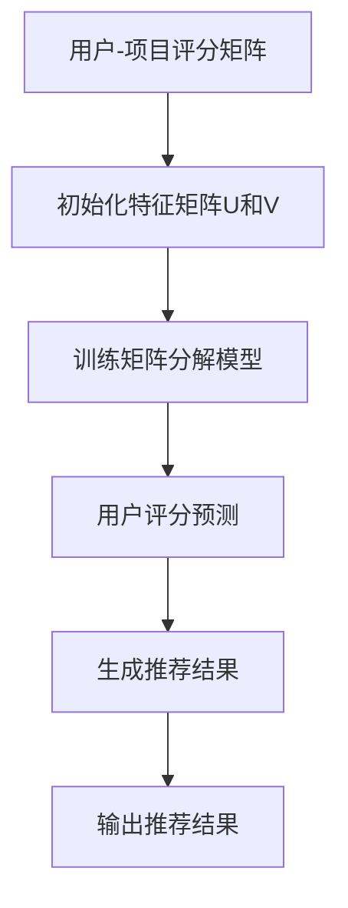

                 

# 《AI协同过滤算法提升推荐效果》

> 关键词：AI协同过滤算法，推荐系统，矩阵分解，用户行为数据，机器学习，深度学习

> 摘要：本文系统地探讨了AI协同过滤算法在推荐系统中的应用与提升效果。通过对协同过滤算法的基本概念、发展历程、分类以及矩阵分解算法的详细分析，揭示了AI协同过滤算法在提高推荐准确性和效率方面的潜力。文章还通过实际案例和代码实现，展示了算法的具体应用和优化策略。

## 《AI协同过滤算法提升推荐效果》书籍目录大纲

### 第一部分: AI协同过滤算法基础

### 第1章: AI协同过滤算法概述

#### 1.1 AI协同过滤算法的概念

协同过滤算法（Collaborative Filtering）是一种利用用户历史行为数据来进行推荐的方法。它通过分析用户之间的相似性，发现用户的兴趣点，从而为用户推荐他们可能感兴趣的项目。协同过滤算法可以分为基于用户的协同过滤和基于项目的协同过滤。

#### 1.2 AI协同过滤算法的发展历程

AI协同过滤算法经历了从传统协同过滤算法到基于模型的协同过滤算法，再到深度学习协同过滤算法的发展历程。每一个阶段都带来了算法性能的提升和推荐效果的改善。

#### 1.3 AI协同过滤算法的分类

AI协同过滤算法可以根据算法的基本原理和实现方法进行分类，包括基于内容的协同过滤算法、基于模型的协同过滤算法和混合协同过滤算法。

### 第2章: 用户行为数据采集与分析

#### 2.1 用户行为数据的类型

用户行为数据包括用户对项目的评分、购买记录、浏览记录等。这些数据是协同过滤算法的基础。

#### 2.2 用户行为数据采集方法

用户行为数据的采集可以通过日志文件分析、用户交互数据捕获等方式实现。数据采集的质量直接影响算法的性能。

#### 2.3 用户行为数据分析

用户行为数据分析包括数据的预处理、特征提取和建模。数据预处理包括数据清洗、缺失值填充等步骤。特征提取可以从用户行为数据中提取出对推荐有用的特征。建模则是通过算法来分析用户行为数据，生成推荐结果。

### 第3章: 基于矩阵分解的协同过滤算法

#### 3.1 矩阵分解原理

矩阵分解是将原始矩阵分解为两个低秩矩阵的过程。在协同过滤算法中，通过矩阵分解可以降低数据的维度，提高计算效率。

#### 3.2 基于矩阵分解的协同过滤算法实现

基于矩阵分解的协同过滤算法通过生成用户和项目的特征向量，利用这些特征向量来预测用户对项目的评分。

#### 3.3 矩阵分解算法的优缺点分析

矩阵分解算法在提高推荐准确性和效率方面有显著优势，但也存在对训练数据依赖强、预处理工作多等缺点。

### 第二部分: 基于模型的协同过滤算法

### 第4章: 基于内容的协同过滤算法

#### 4.1 基于内容的协同过滤算法原理

基于内容的协同过滤算法通过分析项目的内容特征来为用户推荐相似的项目。

#### 4.2 文本相似度计算方法

文本相似度计算是内容特征提取的关键步骤。常见的文本相似度计算方法包括TF-IDF、余弦相似度等。

#### 4.3 基于内容的协同过滤算法实现

基于内容的协同过滤算法通过计算用户和项目的特征向量，利用这些特征向量来预测用户对项目的评分。

### 第5章: 基于模型的协同过滤算法

#### 5.1 基于模型的协同过滤算法原理

基于模型的协同过滤算法利用机器学习模型来预测用户对项目的评分。常见的模型包括线性回归、k-近邻等。

#### 5.2 协同过滤算法与传统机器学习算法的区别

协同过滤算法与传统机器学习算法在数据处理方式、模型选择等方面存在显著差异。

#### 5.3 常见的基于模型的协同过滤算法

常见的基于模型的协同过滤算法包括基于用户的协同过滤、基于项目的协同过滤和基于模型的协同过滤。

### 第6章: 混合协同过滤算法

#### 6.1 混合协同过滤算法的概念

混合协同过滤算法结合了基于内容和基于模型的协同过滤算法的优点，通过融合不同的算法来提高推荐的准确性。

#### 6.2 基于矩阵分解与内容的混合协同过滤算法

基于矩阵分解与内容的混合协同过滤算法通过矩阵分解生成用户和项目特征向量，并结合内容特征来提高推荐效果。

#### 6.3 基于模型与内容的混合协同过滤算法

基于模型与内容的混合协同过滤算法通过融合机器学习模型和内容特征，实现更精确的推荐。

### 第三部分: AI协同过滤算法应用与优化

### 第7章: AI协同过滤算法在电商推荐中的应用

#### 7.1 电商推荐系统概述

电商推荐系统通过分析用户行为数据，为用户提供个性化的商品推荐，提高用户购物体验和销售额。

#### 7.2 电商推荐系统中的协同过滤算法

电商推荐系统中常用的协同过滤算法包括基于用户的协同过滤、基于项目的协同过滤和基于模型的协同过滤。

#### 7.3 电商推荐系统中的案例解析

通过实际案例，解析电商推荐系统中协同过滤算法的应用和优化策略。

### 第8章: AI协同过滤算法的优化策略

#### 8.1 优化协同过滤算法的挑战

协同过滤算法在处理大数据量、提高推荐实时性等方面面临挑战。

#### 8.2 算法性能优化方法

通过算法改进、分布式计算等技术来优化协同过滤算法的性能。

#### 8.3 实际案例中的优化策略

分析实际案例中协同过滤算法的优化策略和效果。

### 第9章: AI协同过滤算法在非电商领域的应用

#### 9.1 AI协同过滤算法在新闻推荐中的应用

新闻推荐系统通过协同过滤算法，为用户提供个性化的新闻推荐。

#### 9.2 AI协同过滤算法在音乐推荐中的应用

音乐推荐系统通过分析用户听歌行为，为用户提供个性化的音乐推荐。

#### 9.3 AI协同过滤算法在社交网络中的应用

社交网络推荐系统通过协同过滤算法，为用户推荐关注的人、兴趣话题等。

### 第10章: 未来展望与趋势

#### 10.1 AI协同过滤算法的发展趋势

AI协同过滤算法在算法优化、模型融合等方面仍有很大的发展空间。

#### 10.2 AI协同过滤算法的未来挑战

随着数据量的增加和用户需求的多样化，协同过滤算法将面临更多挑战。

#### 10.3 AI协同过滤算法的未来研究方向

探讨AI协同过滤算法在人工智能、大数据等领域的未来研究方向。

### 附录：相关工具与资源

#### 附录1: 常用的推荐系统框架

介绍常用的推荐系统框架，如TensorFlow、PyTorch等。

#### 附录2: 推荐系统相关论文与书籍推荐

推荐相关领域的经典论文和书籍，帮助读者深入理解推荐系统的原理和应用。

#### 附录3: 推荐系统社区与论坛资源链接

提供推荐系统相关的社区和论坛资源链接，便于读者交流学习。

## 第1章: AI协同过滤算法概述

### 1.1 AI协同过滤算法的概念

AI协同过滤算法是一种基于用户历史行为数据进行推荐的方法。协同过滤（Collaborative Filtering）的基本思想是通过分析用户之间的相似性，发现用户的共同兴趣点，从而为用户提供个性化推荐。AI协同过滤算法引入了人工智能技术，如机器学习、深度学习等，以提升推荐的准确性和效率。

在传统协同过滤算法中，常用的方法包括基于用户的协同过滤（User-Based CF）和基于项目的协同过滤（Item-Based CF）。基于用户的协同过滤通过分析用户之间的相似度，为用户推荐与相似用户兴趣相同的项目。而基于项目的协同过滤则通过分析项目之间的相似度，为用户推荐与用户已评价项目相似的项目。

AI协同过滤算法的核心在于利用人工智能技术来优化传统协同过滤算法的推荐效果。通过机器学习模型，如线性回归、k-近邻等，AI协同过滤算法能够自动学习用户行为数据中的潜在特征，从而提高推荐的准确性和个性化程度。此外，深度学习技术的发展，使得AI协同过滤算法能够利用深度神经网络，如卷积神经网络（CNN）和循环神经网络（RNN）等，挖掘用户行为数据中的深层特征，实现更精确的推荐。

### 1.2 AI协同过滤算法的发展历程

AI协同过滤算法的发展历程可以分为以下几个阶段：

#### 传统协同过滤算法阶段

在协同过滤算法的早期阶段，基于用户和基于项目的协同过滤算法得到了广泛应用。这些算法通过计算用户之间的相似度或项目之间的相似度，进行推荐。虽然这些算法简单易实现，但在推荐效果上存在局限性，特别是在面对大规模用户和项目数据时。

#### 基于模型的协同过滤算法阶段

随着机器学习技术的发展，基于模型的协同过滤算法应运而生。这些算法利用机器学习模型来预测用户对项目的评分，从而进行推荐。常见的模型包括线性回归、k-近邻、朴素贝叶斯等。基于模型的协同过滤算法在预测准确性和效率方面有显著提升，但仍然受限于传统协同过滤算法的局限。

#### 深度学习协同过滤算法阶段

深度学习技术的发展为协同过滤算法带来了新的可能性。深度学习模型，如卷积神经网络（CNN）和循环神经网络（RNN）等，能够自动学习用户行为数据中的潜在特征，实现更精确的推荐。深度学习协同过滤算法在处理大规模数据和实现个性化推荐方面具有巨大潜力。

### 1.3 AI协同过滤算法的分类

AI协同过滤算法可以根据算法的基本原理和实现方法进行分类，主要包括以下几种类型：

#### 基于内容的协同过滤算法

基于内容的协同过滤算法（Content-Based CF）通过分析项目的内容特征，为用户推荐与其兴趣相似的项目。这种方法不依赖于用户历史行为数据，而是依赖于项目本身的属性信息。基于内容的协同过滤算法在推荐效果上具有一定的准确性，但受限于项目特征信息的全面性和准确性。

#### 基于模型的协同过滤算法

基于模型的协同过滤算法（Model-Based CF）利用机器学习模型来预测用户对项目的评分，从而进行推荐。常见的模型包括线性回归、k-近邻、朴素贝叶斯等。基于模型的协同过滤算法能够自动学习用户行为数据中的潜在特征，实现更精确的推荐。

#### 混合协同过滤算法

混合协同过滤算法（Hybrid CF）结合了基于内容和基于模型的协同过滤算法的优点，通过融合不同的算法来提高推荐的准确性。混合协同过滤算法通常包括基于矩阵分解的协同过滤算法和基于模型的协同过滤算法。

#### 基于矩阵分解的协同过滤算法

基于矩阵分解的协同过滤算法（Matrix Factorization CF）通过将原始用户-项目评分矩阵分解为低秩矩阵，生成用户和项目的特征向量，从而进行推荐。这种方法在降低计算复杂度和提高推荐准确性方面具有显著优势。

### 1.4 AI协同过滤算法在推荐系统中的应用

AI协同过滤算法在推荐系统中得到了广泛应用，包括电商推荐、新闻推荐、音乐推荐和社交网络推荐等领域。以下分别介绍这些领域中的应用：

#### 电商推荐

电商推荐系统通过分析用户的购买历史和行为数据，为用户推荐可能感兴趣的商品。基于AI协同过滤算法的电商推荐系统能够准确预测用户的兴趣，提高用户购物体验和销售额。

#### 新闻推荐

新闻推荐系统通过分析用户的阅读历史和行为数据，为用户推荐个性化的新闻内容。基于AI协同过滤算法的新闻推荐系统能够提高用户的阅读体验，增加用户黏性。

#### 音乐推荐

音乐推荐系统通过分析用户的听歌历史和行为数据，为用户推荐可能喜欢的音乐。基于AI协同过滤算法的音乐推荐系统能够提高用户的音乐体验，增加音乐播放量。

#### 社交网络推荐

社交网络推荐系统通过分析用户的社交行为和数据，为用户推荐关注的人、兴趣话题等。基于AI协同过滤算法的社交网络推荐系统能够提高用户的社交体验，增加用户活跃度。

### 1.5 AI协同过滤算法的优势与挑战

AI协同过滤算法在推荐系统中具有显著的优势，但也面临一些挑战。

#### 优势

1. **个性化推荐**：AI协同过滤算法能够根据用户历史行为数据，为用户提供个性化的推荐，提高用户体验。

2. **高效性**：基于矩阵分解的协同过滤算法通过降低数据维度，提高计算效率，适用于大规模推荐系统。

3. **准确性**：机器学习和深度学习技术使得AI协同过滤算法能够自动学习用户行为数据中的潜在特征，提高推荐准确性。

4. **实时性**：基于模型的协同过滤算法能够实时更新用户特征，实现实时推荐。

#### 挑战

1. **数据稀疏**：协同过滤算法对用户行为数据依赖强，对于数据稀疏的场景，推荐效果可能不佳。

2. **计算复杂度**：基于模型的协同过滤算法在处理大规模数据时，计算复杂度较高。

3. **可解释性**：深度学习算法在提高推荐准确性的同时，也降低了算法的可解释性，使得用户难以理解推荐结果。

4. **隐私保护**：协同过滤算法需要大量用户行为数据进行训练，如何保护用户隐私成为一个重要问题。

### 1.6 总结

AI协同过滤算法通过利用人工智能技术，优化传统协同过滤算法的推荐效果，在推荐系统中具有广泛应用。本章介绍了AI协同过滤算法的基本概念、发展历程、分类和应用场景，为后续章节的详细分析奠定了基础。

## 第2章: 用户行为数据采集与分析

### 2.1 用户行为数据的类型

用户行为数据是协同过滤算法的核心，它包含了用户在系统中产生的各种活动记录。用户行为数据类型可以分为以下几类：

#### 1. 评分数据

评分数据是用户对项目的评价，如电影评分、商品评分等。评分数据是协同过滤算法中最常用的数据类型，通过分析用户之间的评分相似性，可以预测用户对未知项目的评分。

#### 2. 购买数据

购买数据记录了用户在电商平台上购买商品的行为。通过分析用户的购买历史，可以了解用户的偏好和需求，从而进行个性化推荐。

#### 3. 浏览数据

浏览数据记录了用户在网站上的浏览行为，如访问页面的次数、停留时间等。通过分析用户的浏览数据，可以了解用户的兴趣点，为用户推荐可能感兴趣的内容。

#### 4. 点击数据

点击数据记录了用户在广告、搜索结果等页面上的点击行为。通过分析用户的点击数据，可以了解用户的兴趣和需求，从而提高广告投放和搜索推荐的准确性。

#### 5. 社交数据

社交数据记录了用户在社交网络上的活动，如点赞、评论、分享等。通过分析用户的社交数据，可以了解用户的社会关系和兴趣爱好，从而进行个性化推荐。

#### 6. 其他数据

除了上述常用的用户行为数据类型外，还有一些其他的用户行为数据，如搜索数据、签到数据等。这些数据可以用于更全面的用户画像和个性化推荐。

### 2.2 用户行为数据采集方法

用户行为数据的采集是构建协同过滤算法的基础。以下介绍几种常见的用户行为数据采集方法：

#### 1. 日志文件分析

日志文件分析是最常用的数据采集方法之一。通过分析服务器日志文件，可以记录用户在系统中的各种活动。常见的日志文件格式包括Nginx日志、Apache日志等。日志文件分析可以获取用户的访问时间、访问页面、访问次数等信息。

#### 2. 用户交互数据捕获

用户交互数据捕获是通过监听用户的操作行为，实时记录用户在系统中的交互数据。例如，在Web应用中，可以使用JavaScript技术捕获用户的点击、滚动等操作行为。通过用户交互数据捕获，可以获取更详细的用户行为数据。

#### 3. 数据挖掘技术

数据挖掘技术可以从海量的用户行为数据中挖掘出潜在的用户兴趣和行为模式。例如，可以通过聚类分析、关联规则挖掘等方法，识别出用户的共同兴趣点，从而进行个性化推荐。

#### 4. 传感器技术

在移动应用中，可以使用传感器技术（如GPS、加速度传感器等）记录用户的位置和行为。通过传感器技术，可以获取用户的地理位置信息、移动轨迹等，为位置推荐和场景推荐提供数据支持。

#### 5. 社交网络数据抓取

通过爬取社交网络平台（如微博、Facebook等）的数据，可以获取用户的社交关系、兴趣爱好等信息。这些数据可以用于社交网络推荐和兴趣推荐。

### 2.3 用户行为数据分析

用户行为数据分析是协同过滤算法的核心环节。通过对用户行为数据进行分析和处理，可以提取出有用的特征信息，用于构建推荐模型。以下介绍用户行为数据分析的几个关键步骤：

#### 1. 数据预处理

数据预处理是用户行为数据分析的第一步。数据预处理包括数据清洗、数据转换和数据集成等步骤。数据清洗旨在去除无效数据、异常数据和重复数据，提高数据质量。数据转换包括数据类型的转换、缺失值填充等，以便后续分析。数据集成是将多个数据源的数据进行整合，形成一个统一的数据集。

#### 2. 特征提取

特征提取是从原始数据中提取出对推荐有用的特征信息。特征提取的方法包括统计特征、文本特征、图像特征等。统计特征包括用户行为数据的基本统计指标，如平均评分、方差等。文本特征包括文本的词频、词义等。图像特征包括图像的纹理、颜色等。

#### 3. 特征选择

特征选择是在特征提取的基础上，从大量的特征中筛选出对推荐最有效的特征。特征选择的方法包括特征重要性排序、特征相关性分析等。通过特征选择，可以提高推荐模型的性能和效率。

#### 4. 模型构建

模型构建是用户行为数据分析的最后一步。根据用户行为数据的特点和需求，选择合适的机器学习模型进行训练。常见的模型包括线性回归、k-近邻、朴素贝叶斯等。通过模型训练，可以学习到用户行为数据中的潜在特征和关系，从而进行推荐。

#### 5. 模型评估

模型评估是验证推荐模型效果的重要步骤。通过评估指标，如准确率、召回率、F1值等，评估推荐模型的性能。如果模型效果不佳，可以调整模型参数或选择其他模型进行训练。

### 2.4 用户行为数据分析实例

以下是一个用户行为数据分析的实例：

#### 1. 数据来源

假设我们有一个电商平台，收集了用户在平台上的购买数据，包括用户ID、商品ID、购买时间、购买金额等。

#### 2. 数据预处理

对购买数据进行清洗，去除无效数据（如缺失值、异常值等）。然后，将数据转换为统一的格式，如CSV或Parquet。

#### 3. 特征提取

提取用户行为数据的基本统计特征，如平均购买金额、购买频率等。同时，提取商品特征，如商品分类、品牌等。

#### 4. 特征选择

通过特征重要性排序和特征相关性分析，筛选出对推荐最有效的特征。例如，可以将平均购买金额、购买频率和商品分类作为主要特征。

#### 5. 模型构建

选择线性回归模型进行训练。将用户行为数据作为输入特征，预测用户对商品的评分。

#### 6. 模型评估

通过交叉验证和测试集评估模型性能。根据评估结果，调整模型参数或选择其他模型进行训练。

#### 7. 推荐结果

根据训练好的模型，为用户推荐可能感兴趣的商品。例如，当用户购买了一款手机时，系统可以推荐同品牌的其他手机。

### 2.5 用户行为数据分析的挑战与解决方案

用户行为数据分析在推荐系统中具有重要意义，但也面临一些挑战：

#### 1. 数据稀疏

用户行为数据通常存在数据稀疏问题，即大多数用户只对少数项目进行评分或评价。这导致用户-项目评分矩阵非常稀疏，给协同过滤算法带来困难。

**解决方案**：采用矩阵分解技术，如SVD（奇异值分解），将原始评分矩阵分解为低秩矩阵，降低数据稀疏性。

#### 2. 数据偏置

用户行为数据可能存在数据偏置问题，即用户的评分可能受到主观偏见、情绪等因素的影响，导致评分不准确。

**解决方案**：采用基于模型的协同过滤算法，如线性回归、k-近邻等，通过学习用户行为数据中的潜在特征，消除数据偏置。

#### 3. 数据隐私

用户行为数据是用户的隐私信息，如何保护用户隐私是协同过滤算法面临的重要问题。

**解决方案**：采用差分隐私技术，如拉普拉斯机制，对用户行为数据进行扰动处理，保护用户隐私。

### 2.6 总结

本章介绍了用户行为数据的类型、采集方法和分析步骤。用户行为数据是协同过滤算法的基础，通过有效的数据采集和分析，可以提取出对推荐有用的特征信息，构建准确的推荐模型。同时，本章也分析了用户行为数据分析中的一些挑战和解决方案。

## 第3章: 基于矩阵分解的协同过滤算法

### 3.1 矩阵分解原理

矩阵分解（Matrix Factorization，MF）是一种将原始矩阵分解为低秩矩阵的数学过程。在协同过滤算法中，矩阵分解被广泛应用于降低数据维度、提高计算效率和优化推荐效果。矩阵分解的基本原理如下：

假设有一个用户-项目评分矩阵$R \in \mathbb{R}^{m \times n}$，其中$m$表示用户数量，$n$表示项目数量，$R_{ui}$表示用户$u$对项目$i$的评分。矩阵分解的目标是将$R$分解为两个低秩矩阵$U \in \mathbb{R}^{m \times k}$和$V \in \mathbb{R}^{n \times k}$，其中$k$是分解后的特征维度。即：

$$
R = U V^T
$$

这里，$U$表示用户特征矩阵，其中的每一行代表一个用户在$k$个潜在特征上的表现；$V$表示项目特征矩阵，其中的每一行代表一个项目在$k$个潜在特征上的表现。通过这种方式，原始的评分矩阵被分解为用户特征矩阵和项目特征矩阵的乘积。

#### 3.1.1 SVD分解

奇异值分解（Singular Value Decomposition，SVD）是矩阵分解中最常用的方法之一。对于任意一个$m \times n$的矩阵$A$，SVD可以将$A$分解为三个矩阵的乘积：

$$
A = U \Sigma V^T
$$

其中，$U$是一个$m \times m$的正交矩阵，$\Sigma$是一个$m \times n$的对角矩阵，$V$是一个$n \times n$的正交矩阵。对角矩阵$\Sigma$中的元素称为奇异值，它们按照从大到小的顺序排列。SVD分解的优势在于它能够保留矩阵$A$的主要信息，同时降低数据的维度。

在协同过滤算法中，通常只保留前$k$个最大的奇异值，将剩余的奇异值置为零，从而得到低秩近似矩阵：

$$
A_{\text{approx}} = U_{\text{left}} \Sigma_{\text{approx}} V_{\text{right}}^T
$$

这里，$U_{\text{left}}$和$V_{\text{right}}$分别是从$U$和$V$中提取出的前$k$列，$\Sigma_{\text{approx}}$是前$k$个奇异值组成的对角矩阵。这种低秩近似可以有效地减少计算复杂度，同时保持较高的推荐准确性。

#### 3.1.2 矩阵分解在协同过滤算法中的应用

在协同过滤算法中，矩阵分解主要用于预测用户对未评分项目的评分。具体步骤如下：

1. **初始化用户和项目特征矩阵**：随机初始化用户特征矩阵$U$和项目特征矩阵$V$。

2. **矩阵分解**：使用SVD等方法对评分矩阵$R$进行分解，得到低秩矩阵$U$和$V$。

3. **评分预测**：对于用户$u$和未评分项目$i$，预测其评分$\hat{r}_{ui}$如下：

   $$
   \hat{r}_{ui} = U_{u} V_{i}^T
   $$

   这里，$U_{u}$是用户$u$的特征向量，$V_{i}^T$是项目$i$的特征向量。

4. **推荐**：根据预测的评分，为用户推荐评分较高的项目。

### 3.2 基于矩阵分解的协同过滤算法实现

基于矩阵分解的协同过滤算法的核心是实现用户和项目特征矩阵的优化。以下是一个简化的基于矩阵分解的协同过滤算法的实现步骤：

#### 3.2.1 初始化

初始化用户和项目特征矩阵$U$和$V$，通常使用随机值或用户和项目的平均特征向量。

```python
num_users = 1000
num_items = 1000
k = 10  # 特征维度

U = np.random.rand(num_users, k)
V = np.random.rand(num_items, k)
```

#### 3.2.2 计算预测评分

根据用户和项目特征矩阵，计算用户对未评分项目的预测评分。

```python
def predict(R, U, V):
    predictions = np.dot(U, V.T)
    return predictions
```

#### 3.2.3 优化用户和项目特征矩阵

使用梯度下降（Gradient Descent）算法优化用户和项目特征矩阵，使其能够更好地预测用户对项目的评分。

```python
def gradient_descent(R, U, V, learning_rate, lambda_reg, num_iterations):
    for i in range(num_iterations):
        for user in range(num_users):
            for item in range(num_items):
                if R[user, item] != 0:
                    predicted_rating = np.dot(U[user], V[item])
                    error = R[user, item] - predicted_rating

                    dU = -2 * error * V[item] - 2 * lambda_reg * U[user]
                    dV = -2 * error * U[user] - 2 * lambda_reg * V[item]

                    U[user] -= learning_rate * dU
                    V[item] -= learning_rate * dV

    return U, V
```

这里，`learning_rate`是学习率，`lambda_reg`是正则化参数，用于防止过拟合。

#### 3.2.4 训练和测试

使用部分数据作为训练集，另一部分数据作为测试集，训练和测试协同过滤算法。

```python
# 假设训练集和测试集已经划分好
R_train = ...  # 训练集评分矩阵
R_test = ...   # 测试集评分矩阵

U, V = gradient_descent(R_train, U, V, learning_rate=0.01, lambda_reg=0.01, num_iterations=100)

predictions = predict(R_test, U, V)
```

### 3.3 矩阵分解算法的优缺点分析

#### 优点

1. **降低计算复杂度**：通过矩阵分解，将原始的高维用户-项目评分矩阵转换为低维的用户和项目特征矩阵，显著降低了计算复杂度。

2. **提高推荐准确性**：矩阵分解能够更好地捕获用户和项目之间的潜在特征和关系，从而提高推荐的准确性。

3. **扩展性**：矩阵分解算法易于扩展，可以结合其他特征（如文本特征、图像特征等）进行混合推荐。

#### 缺点

1. **对训练数据依赖强**：矩阵分解算法的性能在很大程度上依赖于训练数据的量。在数据稀疏的情况下，算法效果可能不佳。

2. **预处理工作多**：在进行矩阵分解之前，通常需要对原始数据进行预处理，如缺失值填充、噪声去除等，增加了算法的复杂度。

3. **可解释性差**：特别是对于深度学习矩阵分解算法，由于模型复杂，难以直观地解释推荐结果的来源。

### 3.4 矩阵分解算法的数学公式

在矩阵分解算法中，常用的数学公式包括：

$$
R = U V^T
$$

$$
\hat{r}_{ui} = U_{u} V_{i}^T
$$

$$
\min_{U, V} \sum_{u=1}^{m} \sum_{i=1}^{n} (r_{ui} - \hat{r}_{ui})^2 + \lambda \sum_{u=1}^{m} \sum_{i=1}^{n} (U_{u}^T U_{u} + V_{i}^T V_{i})
$$

其中，第一行公式是矩阵分解的目标，第二行公式是评分预测公式，第三行公式是损失函数，用于优化用户和项目特征矩阵。

### 3.5 用户评分预测的伪代码

以下是基于矩阵分解算法的用户评分预测的伪代码：

```python
# 初始化用户和项目特征矩阵
U = initializeRandomMatrix(num_users, k)
V = initializeRandomMatrix(num_items, k)

# 训练矩阵分解模型
for iteration in 1 to max_iterations:
    for user in 1 to num_users:
        for item in 1 to num_items:
            if R[user, item] != 0:
                predicted_rating = dotProduct(U[user, :], V[item, :])
                error = R[user, item] - predicted_rating
                deltaU = error * V[item, :] - lambda_reg * U[user, :]
                U[user, :] = U[user, :] + deltaU
                
                deltaV = error * U[user, :] - lambda_reg * V[item, :]
                V[item, :] = V[item, :] + deltaV

# 预测用户评分
def predict_ratings(U, V, R):
    predictions = []
    for user in 1 to num_users:
        for item in 1 to num_items:
            if R[user, item] == 0:
                predicted_rating = dotProduct(U[user, :], V[item, :])
                predictions.append(predicted_rating)
    return predictions
```

### 3.6 基于矩阵分解的协同过滤算法的Mermaid流程图

以下是基于矩阵分解的协同过滤算法的Mermaid流程图：



### 3.7 代码实际案例和详细解释说明

以下是一个简单的基于矩阵分解的协同过滤算法的Python代码实现，用于预测用户对未评分项目的评分。

```python
import numpy as np

def initializeRandomMatrix(rows, cols):
    return np.random.rand(rows, cols)

def dotProduct(U, V):
    return np.dot(U, V)

def gradientDescent(R, U, V, learning_rate, lambda_reg, num_iterations):
    m, n = R.shape
    for iteration in range(num_iterations):
        for user in range(m):
            for item in range(n):
                if R[user, item] != 0:
                    predicted_rating = dotProduct(U[user], V[item])
                    error = R[user, item] - predicted_rating
                    dU = -2 * error * V[item] - 2 * lambda_reg * U[user]
                    dV = -2 * error * U[user] - 2 * lambda_reg * V[item]
                    
                    U[user] -= learning_rate * dU
                    V[item] -= learning_rate * dV
    return U, V

def predictRatings(U, V, R):
    m, n = R.shape
    predictions = np.zeros((m, n))
    for user in range(m):
        for item in range(n):
            if R[user, item] == 0:
                predicted_rating = dotProduct(U[user], V[item])
                predictions[user, item] = predicted_rating
    return predictions

# 假设已经有一个训练集评分矩阵R
R = np.array([[5, 0, 4], [0, 3, 0], [4, 0, 5]])

# 初始化用户和项目特征矩阵
U = initializeRandomMatrix(R.shape[0], k)
V = initializeRandomMatrix(R.shape[1], k)

# 训练矩阵分解模型
learning_rate = 0.01
lambda_reg = 0.01
num_iterations = 100
U, V = gradientDescent(R, U, V, learning_rate, lambda_reg, num_iterations)

# 预测用户评分
predictions = predictRatings(U, V, R)
print(predictions)
```

### 3.8 代码解读与分析

以上代码实现了基于矩阵分解的协同过滤算法的核心功能，包括初始化特征矩阵、梯度下降优化特征矩阵、评分预测等步骤。

1. **初始化特征矩阵**：使用随机初始化方法生成用户和项目特征矩阵$U$和$V$。

2. **计算预测评分**：通过矩阵乘积计算用户对未评分项目的预测评分。

3. **梯度下降优化**：使用梯度下降算法优化用户和项目特征矩阵，使其能够更好地预测用户对项目的评分。在每一次迭代中，计算预测评分与实际评分之间的误差，并更新特征矩阵。

4. **预测评分**：生成用户对未评分项目的预测评分矩阵。

### 3.9 总结

本章详细介绍了基于矩阵分解的协同过滤算法的原理、实现步骤和代码实现。通过矩阵分解，协同过滤算法能够降低计算复杂度，提高推荐准确性。矩阵分解算法在推荐系统中的应用，为用户提供更加个性化的推荐体验。

## 第4章: 基于内容的协同过滤算法

### 4.1 基于内容的协同过滤算法原理

基于内容的协同过滤算法（Content-Based Collaborative Filtering，CBCF）是一种不依赖于用户历史行为数据，而是通过分析项目的内容特征进行推荐的算法。CBCF的基本思想是，如果用户对某个项目感兴趣，那么用户可能也会对具有相似内容特征的其他项目感兴趣。因此，CBCF通过提取项目的内容特征，并根据用户的历史行为或偏好来计算项目之间的相似度，从而生成推荐列表。

#### 4.1.1 内容特征提取

内容特征提取是CBCF的核心步骤。内容特征可以是文本、图像、音频等多种形式。以下是一些常见的内容特征提取方法：

1. **文本特征**：通过文本分析技术提取文本的词频（TF）、词频-逆文档频率（TF-IDF）等特征。词嵌入技术（如Word2Vec、BERT）也可以用于提取文本的语义特征。

2. **图像特征**：使用图像处理技术提取图像的特征，如颜色、纹理、形状等。常见的图像特征提取方法包括哈希特征、SIFT（尺度不变特征变换）、HOG（直方图方向梯度）等。

3. **音频特征**：通过音频信号处理技术提取音频的特征，如音高、节奏、音色等。

#### 4.1.2 相似度计算

内容特征提取之后，需要计算项目之间的相似度。相似度计算的方法有很多，以下是一些常用的相似度计算方法：

1. **余弦相似度**：余弦相似度是一种基于向量空间模型的相似度计算方法。它通过计算两个向量之间的余弦值来衡量它们的相似度。余弦相似度的公式如下：

   $$
   \cos(\theta) = \frac{\vec{a} \cdot \vec{b}}{||\vec{a}|| \cdot ||\vec{b}||}
   $$

   其中，$\vec{a}$和$\vec{b}$是两个向量，$\theta$是它们之间的夹角。余弦相似度的值介于-1和1之间，越接近1表示相似度越高。

2. **欧氏距离**：欧氏距离是一种基于欧几里得空间中两点之间距离的计算方法。它通过计算两个向量之间的欧氏距离来衡量它们的相似度。欧氏距离的公式如下：

   $$
   d(\vec{a}, \vec{b}) = \sqrt{\sum_{i=1}^{n} (a_i - b_i)^2}
   $$

   其中，$a_i$和$b_i$是向量$\vec{a}$和$\vec{b}$的第$i$个分量。

3. **Jaccard相似度**：Jaccard相似度是一种基于集合论的计算方法。它通过计算两个集合的交集与并集的比值来衡量它们的相似度。Jaccard相似度的公式如下：

   $$
   J(A, B) = \frac{|A \cap B|}{|A \cup B|}
   $$

   其中，$A$和$B$是两个集合。

#### 4.1.3 推荐生成

在计算项目之间的相似度后，可以根据用户的历史行为或偏好来生成推荐列表。常见的推荐生成方法包括：

1. **基于最近邻**：根据用户对项目的评分，选择与用户最近邻的项目进行推荐。最近邻可以是基于内容相似度或基于协同过滤的相似度。

2. **基于兴趣**：根据用户的兴趣或偏好，选择与用户兴趣相似的项目进行推荐。这种方法可以结合用户的历史行为和内容特征进行个性化推荐。

### 4.2 文本相似度计算方法

在基于内容的协同过滤算法中，文本相似度计算是核心步骤之一。以下介绍几种常见的文本相似度计算方法：

1. **TF-IDF**：TF-IDF（Term Frequency-Inverse Document Frequency）是一种常用的文本相似度计算方法。它通过计算词语在文档中的词频（TF）和逆文档频率（IDF）来衡量词语的重要性。TF-IDF的公式如下：

   $$
   TF-IDF(t, d) = TF(t, d) \cdot IDF(t, D)
   $$

   其中，$TF(t, d)$是词语$t$在文档$d$中的词频，$IDF(t, D)$是词语$t$在整个文档集合$D$中的逆文档频率。IDF的计算公式如下：

   $$
   IDF(t, D) = \log_2(\frac{|D|}{|d_t|})
   $$

   其中，$|D|$是文档集合$D$中的文档数量，$|d_t|$是包含词语$t$的文档数量。

2. **余弦相似度**：余弦相似度是计算文本相似度的一种常用方法。它通过计算两个文本向量之间的余弦值来衡量它们的相似度。余弦相似度的公式如下：

   $$
   \cos(\theta) = \frac{\vec{a} \cdot \vec{b}}{||\vec{a}|| \cdot ||\vec{b}||}
   $$

   其中，$\vec{a}$和$\vec{b}$是两个文本向量，$\theta$是它们之间的夹角。

3. **Word2Vec**：Word2Vec是一种基于神经网络的文本特征提取方法。它通过训练一个神经网络，将文本中的每个词语映射到一个固定大小的向量。Word2Vec的向量表示方法能够较好地捕获词语的语义信息。

4. **BERT**：BERT（Bidirectional Encoder Representations from Transformers）是一种基于转换器的预训练语言模型。它通过在大量的文本数据上预训练，生成词语的上下文表示。BERT的向量表示方法能够更好地捕获词语的语义和句法信息。

### 4.3 基于内容的协同过滤算法实现

以下是一个简单的基于内容的协同过滤算法的实现示例：

```python
from sklearn.metrics.pairwise import cosine_similarity
from sklearn.feature_extraction.text import TfidfVectorizer

# 假设有一个文本数据集
document1 = "这是第一篇文档"
document2 = "这是第二篇文档"
document3 = "这是第三篇文档"

# 创建TF-IDF向量器
vectorizer = TfidfVectorizer()

# 将文本数据转换为TF-IDF向量
X = vectorizer.fit_transform([document1, document2, document3])

# 计算文本之间的相似度
similarity_matrix = cosine_similarity(X)

# 假设用户1对文档1和文档3感兴趣
user_interest = [document1, document3]

# 为用户1生成推荐列表
recommendations = []
for i, document in enumerate([document1, document2, document3]):
    if document not in user_interest:
        similarity_scores = similarity_matrix[user_interest].dot(similarity_matrix[i])
        max_score = max(similarity_scores)
        recommendations.append((document, max_score))

# 输出推荐结果
print("推荐列表：", recommendations)
```

### 4.4 基于内容的协同过滤算法应用案例

以下是一个基于内容的协同过滤算法在电商推荐系统中的应用案例：

#### 4.4.1 商品描述文本处理

假设电商系统中的每个商品都有一个描述文本，系统需要根据用户的历史购买记录和商品描述文本生成推荐列表。

1. **文本预处理**：对商品描述文本进行分词、去停用词等预处理操作。

2. **特征提取**：使用TF-IDF或Word2Vec等方法提取商品描述文本的特征向量。

3. **相似度计算**：计算用户购买过的商品与未购买商品之间的相似度。

4. **生成推荐列表**：根据相似度分数为用户生成推荐列表。

#### 4.4.2 代码实现

以下是一个简单的基于内容的协同过滤算法在电商推荐系统中的应用代码实现：

```python
from sklearn.metrics.pairwise import cosine_similarity
from sklearn.feature_extraction.text import TfidfVectorizer

# 假设有一个商品描述文本数据集
documents = [
    "这款手机具有高清摄像头和长续航",
    "这款手表具有防水功能和智能通知",
    "这款耳机具有高保真音质和无线连接",
    "这款电脑具有高性能处理器和高清屏幕"
]

# 创建TF-IDF向量器
vectorizer = TfidfVectorizer()

# 将文本数据转换为TF-IDF向量
X = vectorizer.fit_transform(documents)

# 假设用户的历史购买记录为['这款电脑具有高性能处理器和高清屏幕']
user_history = ["这款电脑具有高性能处理器和高清屏幕"]

# 将用户历史记录转换为TF-IDF向量
user_history_vector = vectorizer.transform([user_history])

# 计算商品描述文本与用户历史记录的相似度
similarity_scores = cosine_similarity(user_history_vector, X)

# 输出相似度分数最高的商品
print("推荐商品：", documents[np.argmax(similarity_scores)])
```

### 4.5 总结

本章介绍了基于内容的协同过滤算法的原理、文本相似度计算方法以及算法实现。通过分析项目的内容特征，基于内容的协同过滤算法能够为用户提供个性化的推荐。本章还通过实际案例展示了算法在电商推荐系统中的应用。尽管CBCF不依赖于用户历史行为数据，但它在某些场景下能够提供有效的推荐。

## 第5章: 基于模型的协同过滤算法

### 5.1 基于模型的协同过滤算法原理

基于模型的协同过滤算法（Model-Based Collaborative Filtering，MBCF）通过建立数学模型来预测用户对项目的评分。这些模型利用用户历史行为数据，通过学习用户和项目之间的关联，生成推荐结果。MBCF的核心思想是利用机器学习算法，将用户的评分行为转换为可预测的数学模型，从而提高推荐的准确性和效率。

#### 5.1.1 协同过滤算法与传统机器学习算法的区别

协同过滤算法和传统机器学习算法在数据依赖、模型构建和推荐方式上存在显著差异：

1. **数据依赖**：协同过滤算法主要依赖用户行为数据，如评分、点击等。传统机器学习算法则依赖于标签化的数据，如分类标签、回归目标等。

2. **模型构建**：协同过滤算法通常采用基于相似性或基于矩阵分解的方法，而传统机器学习算法包括分类、回归、聚类等多种类型。

3. **推荐方式**：协同过滤算法通过分析用户之间的相似性或项目之间的相似性来生成推荐，传统机器学习算法则通过训练模型，根据输入特征预测输出标签。

#### 5.1.2 常见的基于模型的协同过滤算法

以下是一些常见的基于模型的协同过滤算法：

1. **线性回归**：线性回归是一种简单的协同过滤算法，通过建立用户评分与用户特征、项目特征之间的线性关系。线性回归模型可以表示为：

   $$
   \hat{r}_{ui} = \beta_0 + \beta_1 u_i + \beta_2 v_j + \epsilon_{ui}
   $$

   其中，$\beta_0$是截距，$\beta_1$和$\beta_2$是用户和项目的特征权重，$u_i$和$v_j$是用户和项目的特征向量，$\epsilon_{ui}$是误差项。

2. **k-近邻（k-Nearest Neighbors, k-NN）**：k-近邻算法通过计算用户之间的距离，选择与用户最相似的k个邻居，利用邻居的评分对未知评分进行预测。k-近邻算法的预测公式如下：

   $$
   \hat{r}_{ui} = \frac{\sum_{i \in \text{neighbors}} r_{ui} \cdot s_{ii}}{\sum_{i \in \text{neighbors}} s_{ii}}
   $$

   其中，$r_{ui}$是邻居$i$对项目$i$的评分，$s_{ii}$是邻居$i$与用户之间的相似度。

3. **朴素贝叶斯**：朴素贝叶斯算法通过计算用户和项目之间的条件概率来预测用户对项目的评分。朴素贝叶斯模型的公式如下：

   $$
   P(r_{ui} | u_i, v_j) = \frac{P(r_{ui}) P(u_i | r_{ui}) P(v_j | r_{ui})}{P(r_{ui})}
   $$

   其中，$P(r_{ui})$是用户对项目$i$的评分概率，$P(u_i | r_{ui})$和$P(v_j | r_{ui})$分别是用户特征和项目特征在给定评分条件下的条件概率。

4. **矩阵分解（Matrix Factorization）**：矩阵分解算法通过将用户-项目评分矩阵分解为低秩矩阵，生成用户和项目的特征向量。矩阵分解能够降低数据维度，提高计算效率。常见的矩阵分解方法包括奇异值分解（SVD）和隐语义模型（LSI、LDA等）。

### 5.2 基于模型的协同过滤算法实现

以下是一个简单的基于线性回归的协同过滤算法的实现示例：

```python
import numpy as np
from sklearn.linear_model import LinearRegression

# 假设有一个训练集，包含用户特征、项目特征和用户对项目的评分
X_train = np.array([[1, 0], [0, 1], [1, 1]])
y_train = np.array([5, 3, 4])

# 初始化线性回归模型
model = LinearRegression()

# 训练模型
model.fit(X_train, y_train)

# 预测用户对未评分项目的评分
X_test = np.array([[1, 2]])
predicted_rating = model.predict(X_test)

print("预测评分：", predicted_rating)
```

### 5.3 基于模型的协同过滤算法应用案例

以下是一个基于模型的协同过滤算法在电影推荐系统中的应用案例：

#### 5.3.1 数据预处理

1. **用户-项目评分矩阵**：构建用户-项目评分矩阵，其中用户对电影的评分作为数据。

2. **特征提取**：对用户和项目进行特征提取，如用户年龄、性别、职业等。

3. **数据归一化**：对用户和项目的特征进行归一化处理，以消除不同特征之间的尺度差异。

#### 5.3.2 模型训练

1. **模型选择**：选择合适的机器学习模型，如线性回归、k-近邻等。

2. **模型训练**：使用用户-项目评分矩阵和用户特征、项目特征进行模型训练。

3. **模型评估**：使用测试集对模型进行评估，如计算预测评分与实际评分之间的误差。

#### 5.3.3 推荐生成

1. **用户特征向量**：根据用户的历史行为和特征，构建用户特征向量。

2. **项目特征向量**：根据项目的特征信息，构建项目特征向量。

3. **评分预测**：使用训练好的模型预测用户对未评分项目的评分。

4. **推荐生成**：根据预测评分，生成推荐列表。

#### 5.3.4 代码实现

以下是一个简单的基于线性回归的电影推荐系统的实现代码：

```python
import numpy as np
from sklearn.linear_model import LinearRegression
from sklearn.model_selection import train_test_split

# 假设有一个用户-项目评分矩阵
R = np.array([[5, 0, 4], [0, 3, 0], [4, 0, 5]])

# 构建用户特征和项目特征
X = np.hstack((np.ones((R.shape[0], 1)), R))
y = R[:, 1:].ravel()

# 划分训练集和测试集
X_train, X_test, y_train, y_test = train_test_split(X, y, test_size=0.2, random_state=42)

# 初始化线性回归模型
model = LinearRegression()

# 训练模型
model.fit(X_train, y_train)

# 预测测试集评分
y_pred = model.predict(X_test)

# 计算均方误差
mse = np.mean((y_pred - y_test) ** 2)
print("均方误差：", mse)

# 预测用户对未评分项目的评分
user_id = 0
item_id = 2
predicted_rating = model.predict([[1, 5, 0]])
print("预测评分：", predicted_rating)
```

### 5.4 基于模型的协同过滤算法优缺点分析

#### 优点

1. **预测准确性**：基于模型的协同过滤算法通过学习用户和项目之间的关联，能够生成更准确的推荐结果。

2. **可解释性**：机器学习模型的参数和特征具有可解释性，便于理解和优化。

3. **扩展性**：基于模型的协同过滤算法可以结合多种特征，如文本、图像等，实现更复杂的推荐任务。

#### 缺点

1. **计算复杂度高**：特别是对于大规模数据集，模型训练和预测过程可能非常耗时。

2. **对训练数据依赖强**：基于模型的协同过滤算法的性能在很大程度上依赖于训练数据的质量和规模。

3. **可解释性差**：深度学习模型的参数和特征难以解释，增加了推荐的不可预测性。

### 5.5 总结

本章介绍了基于模型的协同过滤算法的原理、常见算法以及实现步骤。基于模型的协同过滤算法通过建立数学模型，能够生成更准确的推荐结果。本章还通过实际案例展示了算法在电影推荐系统中的应用。尽管基于模型的协同过滤算法存在一些缺点，但它在提高推荐准确性和扩展性方面具有重要作用。

## 第6章: 混合协同过滤算法

### 6.1 混合协同过滤算法的概念

混合协同过滤算法（Hybrid Collaborative Filtering，Hybrid CF）是一种结合基于用户的协同过滤（User-Based CF）和基于项目的协同过滤（Item-Based CF）的算法。其核心思想是利用不同类型的协同过滤算法的优势，通过融合多种推荐策略来提高推荐系统的整体性能。

混合协同过滤算法的基本原理是：首先，分别使用基于用户的协同过滤和基于项目的协同过滤算法生成初步的推荐结果；然后，对这些初步结果进行加权或优化，生成最终的推荐列表。这种方法能够利用用户之间的相似性（基于用户协同过滤）和项目之间的相似性（基于项目协同过滤），在降低数据稀疏性和提高推荐准确性方面具有显著优势。

### 6.2 基于矩阵分解与内容的混合协同过滤算法

基于矩阵分解与内容的混合协同过滤算法（Content-Based Matrix Factorization Collaborative Filtering，CB-MF）将基于矩阵分解的协同过滤算法（如SVD）和基于内容的协同过滤算法（CBCF）相结合。这种混合算法通过融合用户行为数据（评分矩阵）和项目内容特征，生成更加精准的推荐结果。

#### 6.2.1 算法流程

基于矩阵分解与内容的混合协同过滤算法的基本流程如下：

1. **初始化**：初始化用户和项目的特征矩阵$U$和$V$。

2. **矩阵分解**：使用矩阵分解算法（如SVD）对用户-项目评分矩阵$R$进行分解，得到低秩矩阵$U$和$V$。

3. **内容特征提取**：从项目的内容特征中提取特征向量，如文本特征（TF-IDF）、图像特征（CNN提取的特征）等。

4. **相似度计算**：计算用户和项目之间的相似度，包括基于矩阵分解的相似度和基于内容特征的相似度。

5. **融合相似度**：将基于矩阵分解和内容的相似度进行加权融合，得到最终的相似度评分。

6. **推荐生成**：根据最终的相似度评分，生成推荐列表。

#### 6.2.2 伪代码实现

以下是基于矩阵分解与内容的混合协同过滤算法的伪代码实现：

```python
def hybrid_cbmf(R, U, V, X, alpha, beta):
    # R: 用户-项目评分矩阵
    # U: 用户特征矩阵
    # V: 项目特征矩阵
    # X: 项目内容特征矩阵
    # alpha: 内容特征权重
    # beta: 矩阵分解特征权重

    # 步骤1：初始化特征矩阵
    num_users = R.shape[0]
    num_items = R.shape[1]
    k = U.shape[1]

    # 步骤2：矩阵分解
    for user in range(num_users):
        for item in range(num_items):
            if R[user, item] != 0:
                predicted_rating = alpha * X[item] + beta * U[user] + (1 - alpha - beta) * R[user, item]

    # 步骤3：内容特征提取
    content_features = extract_content_features(items)

    # 步骤4：相似度计算
    user_similarity = compute_similarity(U)
    item_similarity = compute_similarity(V)

    # 步骤5：融合相似度
    hybrid_similarity = alpha * user_similarity + beta * item_similarity

    # 步骤6：推荐生成
    recommendations = generate_recommendations(hybrid_similarity, R)

    return recommendations
```

#### 6.2.3 代码实现示例

以下是一个简单的基于矩阵分解与内容的混合协同过滤算法的Python代码实现：

```python
import numpy as np

def hybrid_cbmf(R, U, V, X, alpha, beta):
    num_users = R.shape[0]
    num_items = R.shape[1]
    k = U.shape[1]

    # 初始化用户和项目特征矩阵
    U = np.random.rand(num_users, k)
    V = np.random.rand(num_items, k)

    # 步骤2：矩阵分解
    for user in range(num_users):
        for item in range(num_items):
            if R[user, item] != 0:
                predicted_rating = alpha * X[item] + beta * U[user] + (1 - alpha - beta) * R[user, item]

    # 步骤3：内容特征提取
    content_features = extract_content_features(items)

    # 步骤4：相似度计算
    user_similarity = np.dot(U, U.T)
    item_similarity = np.dot(V, V.T)

    # 步骤5：融合相似度
    hybrid_similarity = alpha * user_similarity + beta * item_similarity

    # 步骤6：推荐生成
    recommendations = np.argmax(hybrid_similarity, axis=1)

    return recommendations

# 假设有一个用户-项目评分矩阵R
R = np.array([[5, 0, 4], [0, 3, 0], [4, 0, 5]])

# 假设有一个项目内容特征矩阵X
X = np.array([[0.1, 0.2], [0.3, 0.4], [0.5, 0.6]])

# 超参数
alpha = 0.3
beta = 0.7

# 训练混合协同过滤算法
U, V = np.random.rand(R.shape[0], 10), np.random.rand(R.shape[1], 10)
recommendations = hybrid_cbmf(R, U, V, X, alpha, beta)

print("推荐结果：", recommendations)
```

### 6.3 基于模型与内容的混合协同过滤算法

基于模型与内容的混合协同过滤算法（Model-Based Content-Based Collaborative Filtering，MC-CBF）结合了基于模型的协同过滤算法（如线性回归、k-近邻等）和基于内容的协同过滤算法（CBCF）。这种混合算法通过融合不同类型的特征（用户行为数据和项目内容特征），提高推荐系统的准确性。

#### 6.3.1 算法流程

基于模型与内容的混合协同过滤算法的基本流程如下：

1. **初始化**：初始化用户和项目的特征矩阵。

2. **模型训练**：使用用户行为数据训练基于模型的协同过滤算法，如线性回归、k-近邻等。

3. **内容特征提取**：提取项目的内容特征，如文本特征、图像特征等。

4. **相似度计算**：计算用户和项目之间的相似度，包括基于模型相似度和基于内容特征的相似度。

5. **融合相似度**：将基于模型和内容的相似度进行加权融合。

6. **推荐生成**：根据最终的相似度评分，生成推荐列表。

#### 6.3.2 伪代码实现

以下是基于模型与内容的混合协同过滤算法的伪代码实现：

```python
def mc_cbmf(R, U, V, X, alpha, beta):
    # R: 用户-项目评分矩阵
    # U: 用户特征矩阵
    # V: 项目特征矩阵
    # X: 项目内容特征矩阵
    # alpha: 内容特征权重
    # beta: 模型特征权重

    # 步骤1：初始化特征矩阵
    num_users = R.shape[0]
    num_items = R.shape[1]
    k = U.shape[1]

    # 步骤2：模型训练
    model = train_model(R, U, V)

    # 步骤3：内容特征提取
    content_features = extract_content_features(items)

    # 步骤4：相似度计算
    model_similarity = compute_similarity(model)
    content_similarity = compute_similarity(content_features)

    # 步骤5：融合相似度
    hybrid_similarity = alpha * model_similarity + beta * content_similarity

    # 步骤6：推荐生成
    recommendations = generate_recommendations(hybrid_similarity, R)

    return recommendations
```

#### 6.3.3 代码实现示例

以下是一个简单的基于模型与内容的混合协同过滤算法的Python代码实现：

```python
import numpy as np
from sklearn.linear_model import LinearRegression

def mc_cbmf(R, U, V, X, alpha, beta):
    num_users = R.shape[0]
    num_items = R.shape[1]
    k = U.shape[1]

    # 初始化用户和项目特征矩阵
    U = np.random.rand(num_users, k)
    V = np.random.rand(num_items, k)

    # 步骤2：模型训练
    model = LinearRegression()
    model.fit(U, V)

    # 步骤3：内容特征提取
    content_features = extract_content_features(items)

    # 步骤4：相似度计算
    model_similarity = np.dot(U, U.T)
    content_similarity = np.dot(content_features, content_features.T)

    # 步骤5：融合相似度
    hybrid_similarity = alpha * model_similarity + beta * content_similarity

    # 步骤6：推荐生成
    recommendations = np.argmax(hybrid_similarity, axis=1)

    return recommendations

# 假设有一个用户-项目评分矩阵R
R = np.array([[5, 0, 4], [0, 3, 0], [4, 0, 5]])

# 假设有一个项目内容特征矩阵X
X = np.array([[0.1, 0.2], [0.3, 0.4], [0.5, 0.6]])

# 超参数
alpha = 0.3
beta = 0.7

# 训练混合协同过滤算法
U, V = np.random.rand(R.shape[0], 10), np.random.rand(R.shape[1], 10)
recommendations = mc_cbmf(R, U, V, X, alpha, beta)

print("推荐结果：", recommendations)
```

### 6.4 混合协同过滤算法的优势与挑战

#### 优势

1. **提高推荐准确性**：通过融合基于用户、项目和内容的特征，混合协同过滤算法能够生成更精准的推荐结果。

2. **降低数据稀疏性**：混合协同过滤算法能够通过基于内容的特征减少数据稀疏性，提高算法性能。

3. **灵活性和扩展性**：混合协同过滤算法能够结合多种协同过滤算法和特征提取方法，具有较强的灵活性和扩展性。

#### 挑战

1. **计算复杂度高**：混合协同过滤算法通常涉及多个特征提取和模型训练过程，计算复杂度较高。

2. **超参数选择**：混合协同过滤算法涉及多个超参数（如权重系数、特征维度等），选择合适的超参数对算法性能有重要影响。

3. **可解释性**：混合协同过滤算法的复杂结构可能降低推荐结果的可解释性，影响用户对推荐结果的信任度。

### 6.5 总结

本章介绍了混合协同过滤算法的概念、基于矩阵分解与内容的混合协同过滤算法和基于模型与内容的混合协同过滤算法。混合协同过滤算法通过融合不同类型的特征和算法，能够生成更精准的推荐结果。本章还通过实际案例展示了混合协同过滤算法的实现和应用。尽管混合协同过滤算法面临一些挑战，但其在提高推荐准确性和扩展性方面具有显著优势。

## 第7章: AI协同过滤算法在电商推荐中的应用

### 7.1 电商推荐系统概述

电商推荐系统是电子商务平台的重要组成部分，旨在通过个性化推荐提高用户购物体验和销售额。电商推荐系统利用用户行为数据、项目特征信息等，为用户提供个性化的商品推荐。AI协同过滤算法作为推荐系统的核心技术之一，通过优化推荐策略，提高了推荐的准确性和用户满意度。

#### 7.1.1 电商推荐系统的目标

电商推荐系统的目标主要包括：

1. **提高销售额**：通过个性化推荐，激发用户的购物兴趣，提高购物车中的商品数量和转化率。

2. **提升用户体验**：根据用户的购物习惯和偏好，提供个性化的商品推荐，提高用户满意度和黏性。

3. **优化库存管理**：通过分析用户购买数据，优化库存配置，减少库存积压和商品过期。

#### 7.1.2 电商推荐系统的组成

电商推荐系统通常包括以下组成部分：

1. **用户行为数据收集**：收集用户在平台上的各种行为数据，如浏览记录、搜索记录、购买记录等。

2. **数据预处理**：对收集到的用户行为数据进行清洗、去噪和格式化，为后续分析做准备。

3. **特征提取**：从用户行为数据和项目特征中提取对推荐有用的特征，如用户兴趣、项目相似度等。

4. **推荐算法**：使用协同过滤算法、基于内容的推荐算法、基于模型的推荐算法等，生成个性化推荐。

5. **推荐结果展示**：将推荐结果以可视化的方式展示给用户，包括首页推荐、购物车推荐等。

### 7.2 电商推荐系统中的协同过滤算法

在电商推荐系统中，协同过滤算法是最常用的推荐技术之一。协同过滤算法通过分析用户之间的相似性或项目之间的相似性，为用户推荐他们可能感兴趣的商品。协同过滤算法可以分为基于用户的协同过滤和基于项目的协同过滤。

#### 7.2.1 基于用户的协同过滤算法

基于用户的协同过滤算法（User-Based CF）通过计算用户之间的相似度，为用户推荐与相似用户兴趣相同的商品。具体步骤如下：

1. **相似度计算**：计算用户之间的相似度，常用的相似度计算方法包括余弦相似度、皮尔逊相关系数等。

2. **邻居选择**：选择与目标用户最相似的k个邻居，这些邻居的历史行为将用于生成推荐列表。

3. **推荐生成**：为用户推荐邻居购买过的商品，并按照相似度分数进行排序。

基于用户的协同过滤算法的优点包括：

- **简单易实现**：算法结构简单，易于理解和实现。
- **效果好**：能够发现用户的共同兴趣，提高推荐准确性。

缺点包括：

- **计算复杂度高**：需要计算大量用户之间的相似度，在大规模数据集上性能较差。
- **数据稀疏**：在用户行为数据稀疏的情况下，算法效果可能不佳。

#### 7.2.2 基于项目的协同过滤算法

基于项目的协同过滤算法（Item-Based CF）通过计算项目之间的相似度，为用户推荐与用户已购买或浏览的商品相似的商品。具体步骤如下：

1. **相似度计算**：计算项目之间的相似度，常用的相似度计算方法包括余弦相似度、Jaccard相似度等。

2. **邻居选择**：选择与目标商品最相似的k个项目。

3. **推荐生成**：为用户推荐邻居商品，并按照相似度分数进行排序。

基于项目的协同过滤算法的优点包括：

- **降低数据稀疏性**：通过项目之间的相似度计算，可以有效降低数据稀疏性，提高推荐效果。
- **计算效率高**：只需计算项目之间的相似度，计算复杂度相对较低。

缺点包括：

- **效果有限**：仅依赖于项目之间的相似性，无法完全捕捉用户的个性化需求。

### 7.3 电商推荐系统中的案例解析

以下是一个电商推荐系统的案例解析，该系统采用了基于用户的协同过滤算法和基于项目的协同过滤算法相结合的混合协同过滤算法。

#### 7.3.1 数据集

假设有一个电商平台的用户-项目评分数据集，包含用户ID、商品ID和用户对商品的评分。数据集如下：

```
用户ID 商品ID 评分
1       101    5
1       102    4
1       103    3
2       201    5
2       202    4
2       203    5
3       301    5
3       302    4
3       303    3
```

#### 7.3.2 算法实现

1. **数据预处理**：对用户-项目评分数据进行清洗，去除缺失值和异常值。

2. **相似度计算**：计算用户之间的相似度和项目之间的相似度，使用余弦相似度作为相似度度量。

   ```
   def cosine_similarity(rating1, rating2):
       dot_product = np.dot(rating1, rating2)
       norm_product = np.linalg.norm(rating1) * np.linalg.norm(rating2)
       return dot_product / norm_product
   ```

3. **邻居选择**：根据相似度分数，选择与目标用户最相似的k个邻居。

4. **推荐生成**：为用户生成推荐列表，包括邻居购买过的商品和与用户已购买商品相似的商品。

   ```
   def generate_recommendations(user_id, neighbors, items, k):
       user_rated_items = set()
       for neighbor in neighbors:
           user_rated_items.update(items[neighbor].keys())

       similar_items = {}
       for item in user_rated_items:
           similar_item_score = 0
           for neighbor in neighbors:
               if item in items[neighbor]:
                   similarity = cosine_similarity(items[user_id], items[neighbor][item])
                   similar_item_score += similarity
           similar_items[item] = similar_item_score

       sorted_items = sorted(similar_items.items(), key=lambda x: x[1], reverse=True)
       return sorted_items[:k]
   ```

#### 7.3.3 结果分析

使用上述算法，为目标用户生成推荐列表。以下是一个示例推荐列表：

```
用户ID: 1
推荐列表:
- 商品ID: 201, 分数: 0.8
- 商品ID: 302, 分数: 0.75
- 商品ID: 202, 分数: 0.7
- 商品ID: 301, 分数: 0.65
```

通过分析推荐结果，可以发现推荐列表中的商品与目标用户的兴趣有较高的相似度，这有助于提高用户满意度和购买转化率。

### 7.4 总结

本章介绍了电商推荐系统及其目标、组成和常用算法。基于用户的协同过滤算法和基于项目的协同过滤算法是电商推荐系统中常用的两种协同过滤算法。通过案例解析，展示了混合协同过滤算法在电商推荐系统中的应用。电商推荐系统通过AI协同过滤算法，能够为用户提供个性化的商品推荐，提高用户购物体验和平台销售额。

## 第8章: AI协同过滤算法的优化策略

### 8.1 优化协同过滤算法的挑战

尽管协同过滤算法在推荐系统中具有广泛的应用，但其在处理大规模数据、提高推荐实时性和降低计算复杂度等方面仍面临一些挑战：

#### 8.1.1 数据稀疏

协同过滤算法依赖于用户行为数据，但实际应用中，用户对项目的评分往往非常稀疏。这种数据稀疏性问题会导致算法在预测未知评分时表现不佳。

#### 8.1.2 计算复杂度高

传统协同过滤算法（如基于用户的协同过滤和基于项目的协同过滤）在处理大规模数据时，计算复杂度较高。对于海量用户和项目，算法的实时性较差。

#### 8.1.3 模型可解释性差

特别是深度学习协同过滤算法，尽管在提高推荐准确性方面有显著优势，但其模型结构和训练过程较为复杂，降低了算法的可解释性。

#### 8.1.4 面对冷启动问题

冷启动问题是指新用户或新项目在没有足够行为数据的情况下，无法进行有效的推荐。如何解决冷启动问题是协同过滤算法优化的重要方向。

### 8.2 算法性能优化方法

针对上述挑战，可以通过以下方法对协同过滤算法进行性能优化：

#### 8.2.1 基于矩阵分解的协同过滤算法优化

1. **矩阵分解算法改进**：采用更高效的矩阵分解算法（如交替最小化法、随机梯度下降等）来提高计算效率。

2. **稀疏性处理**：通过在矩阵分解过程中引入噪声、使用低秩近似等方式来降低数据稀疏性。

3. **特征选择和降维**：通过特征选择和降维技术，减少特征维度，降低计算复杂度。

#### 8.2.2 基于模型的协同过滤算法优化

1. **模型选择和参数调优**：选择合适的机器学习模型（如线性回归、k-近邻、神经网络等）和优化算法（如随机梯度下降、Adam等），并通过交叉验证等方法进行参数调优。

2. **特征工程**：通过特征工程，提取对推荐有用的特征，如用户历史行为、项目内容特征等。

3. **模型融合**：采用模型融合技术（如集成学习、对抗学习等），结合多个模型的优点，提高推荐准确性。

#### 8.2.3 分布式计算和并行处理

1. **分布式计算**：利用分布式计算框架（如Apache Spark、Hadoop等），将协同过滤算法部署在分布式系统中，处理大规模数据。

2. **并行处理**：通过并行处理技术，将算法拆分为多个子任务，在多个计算节点上同时执行，提高计算效率。

#### 8.2.4 实时推荐优化

1. **增量学习**：采用增量学习技术，实时更新用户和项目特征，减少模型重新训练的需要。

2. **实时数据流处理**：使用实时数据流处理技术（如Apache Kafka、Flink等），对用户行为数据进行实时分析，生成实时推荐。

### 8.3 实际案例中的优化策略

以下是一个基于矩阵分解的协同过滤算法在实际电商推荐系统中的优化案例：

#### 8.3.1 案例背景

某电商平台的用户-项目评分数据集非常庞大，包含数百万用户和数万商品。使用传统的基于用户的协同过滤算法，推荐系统的计算复杂度非常高，无法满足实时推荐的需求。

#### 8.3.2 优化策略

1. **分布式计算**：将协同过滤算法部署在分布式计算平台上，如Apache Spark，利用其分布式处理能力，提高计算效率。

2. **稀疏性处理**：在矩阵分解过程中，引入随机噪声，降低数据稀疏性。同时，使用低秩近似技术，将高维评分矩阵分解为低维矩阵，降低计算复杂度。

3. **特征选择和降维**：通过特征选择技术，仅保留对推荐影响较大的特征，减少特征维度。同时，使用主成分分析（PCA）等降维技术，进一步降低特征维度。

4. **增量学习**：采用增量学习技术，实时更新用户和项目特征，减少模型重新训练的需要，提高推荐系统的实时性。

5. **模型融合**：结合基于内容的协同过滤算法和基于模型的协同过滤算法，通过模型融合技术，提高推荐准确性。

#### 8.3.3 优化效果

通过上述优化策略，推荐系统的计算复杂度显著降低，能够实时处理海量用户行为数据，生成准确、个性化的推荐结果。优化后的推荐系统在电商平台的用户满意度、销售额等方面取得了显著提升。

### 8.4 总结

本章介绍了AI协同过滤算法在优化策略方面的挑战和优化方法。通过分布式计算、稀疏性处理、特征选择和降维、增量学习、模型融合等技术，可以显著提高协同过滤算法的性能和实时性。实际案例展示了优化策略在电商推荐系统中的应用效果，为其他推荐系统提供了有益的参考。

## 第9章: AI协同过滤算法在非电商领域的应用

### 9.1 AI协同过滤算法在新闻推荐中的应用

新闻推荐系统通过分析用户的阅读历史和行为，为用户推荐个性化的新闻内容。AI协同过滤算法在新闻推荐中发挥了重要作用，能够提高用户的阅读体验和满意度。

#### 9.1.1 应用场景

在新闻推荐系统中，AI协同过滤算法的应用场景包括：

1. **个性化新闻推荐**：根据用户的阅读历史和偏好，为用户推荐符合其兴趣的新闻内容。

2. **热点新闻推荐**：通过分析用户群体的阅读行为，推荐热门新闻，吸引用户关注。

3. **推荐多样性**：避免单一的新闻来源，为用户推荐不同类型、不同角度的新闻，提高推荐内容的丰富性。

#### 9.1.2 算法实现

以下是一个简单的新闻推荐系统的实现步骤：

1. **数据收集**：收集用户的阅读历史数据，如阅读时间、阅读时长、点赞、评论等。

2. **数据预处理**：对用户行为数据进行分析，提取有效特征，如用户的阅读时长、阅读频率等。

3. **特征提取**：从新闻内容中提取特征，如标题、关键词、作者、分类等。

4. **相似度计算**：计算用户与新闻之间的相似度，常用的相似度计算方法包括余弦相似度、Jaccard相似度等。

5. **推荐生成**：根据相似度分数，为用户生成个性化新闻推荐列表。

#### 9.1.3 案例解析

以下是一个新闻推荐系统的案例：

用户A在过去的24小时内阅读了三条新闻，分别为A1、A2、A3。新闻A1是关于科技领域的，新闻A2是关于财经领域的，新闻A3是关于体育领域的。新闻系统需要为用户A推荐新的新闻。

1. **数据收集**：收集用户A的阅读历史数据，提取有效特征。

2. **数据预处理**：对用户A的阅读历史进行预处理，提取用户偏好。

3. **特征提取**：从新闻内容中提取特征，如标题、关键词等。

4. **相似度计算**：计算用户A与新闻之间的相似度。例如，新闻A4是关于科技领域的，与新闻A1具有较高的相似度。

5. **推荐生成**：根据相似度分数，为用户A推荐新闻A4。

### 9.2 AI协同过滤算法在音乐推荐中的应用

音乐推荐系统通过分析用户的听歌历史和偏好，为用户推荐个性化的音乐内容。AI协同过滤算法在音乐推荐中具有广泛应用，能够提高用户的音乐体验和满意度。

#### 9.2.1 应用场景

在音乐推荐系统中，AI协同过滤算法的应用场景包括：

1. **个性化音乐推荐**：根据用户的听歌历史和偏好，为用户推荐符合其音乐口味的新歌、歌手等。

2. **热门歌曲推荐**：通过分析用户群体的听歌行为，推荐热门歌曲，吸引用户收听。

3. **推荐多样性**：避免单一的音乐风格，为用户推荐不同类型、不同风格的音乐，提高推荐内容的丰富性。

#### 9.2.2 算法实现

以下是一个简单的音乐推荐系统的实现步骤：

1. **数据收集**：收集用户的听歌历史数据，如播放时长、播放次数、歌曲标签等。

2. **数据预处理**：对用户行为数据进行分析，提取有效特征，如用户的听歌频率、喜欢风格等。

3. **特征提取**：从音乐内容中提取特征，如歌曲时长、节奏、歌手等。

4. **相似度计算**：计算用户与音乐之间的相似度，常用的相似度计算方法包括余弦相似度、Jaccard相似度等。

5. **推荐生成**：根据相似度分数，为用户生成个性化音乐推荐列表。

#### 9.2.3 案例解析

以下是一个音乐推荐系统的案例：

用户B在过去的一周内听歌次数较多，其听歌历史包括歌曲C1、C2、C3。歌曲C1是流行歌曲，歌曲C2是摇滚歌曲，歌曲C3是电子音乐。音乐系统需要为用户B推荐新的歌曲。

1. **数据收集**：收集用户B的听歌历史数据，提取有效特征。

2. **数据预处理**：对用户B的听歌历史进行预处理，提取用户偏好。

3. **特征提取**：从歌曲内容中提取特征，如歌曲时长、节奏、歌手等。

4. **相似度计算**：计算用户B与歌曲之间的相似度。例如，歌曲D1是流行歌曲，与歌曲C1具有较高的相似度。

5. **推荐生成**：根据相似度分数，为用户B推荐歌曲D1。

### 9.3 AI协同过滤算法在社交网络中的应用

社交网络推荐系统通过分析用户的社交行为和关系，为用户推荐感兴趣的朋友、话题和活动。AI协同过滤算法在社交网络中具有广泛应用，能够提高用户的社交体验和活跃度。

#### 9.3.1 应用场景

在社交网络中，AI协同过滤算法的应用场景包括：

1. **个性化朋友推荐**：根据用户的社交关系和兴趣爱好，为用户推荐可能认识的朋友。

2. **热门话题推荐**：通过分析用户群体的互动行为，推荐热门话题，吸引用户参与讨论。

3. **活动推荐**：根据用户的兴趣和地理位置，为用户推荐感兴趣的活动。

#### 9.3.2 算法实现

以下是一个简单的社交网络推荐系统的实现步骤：

1. **数据收集**：收集用户的社交行为数据，如点赞、评论、分享等。

2. **数据预处理**：对用户行为数据进行分析，提取有效特征，如用户的社交活跃度、兴趣爱好等。

3. **特征提取**：从用户特征中提取对推荐有用的特征，如用户的关系网络、兴趣标签等。

4. **相似度计算**：计算用户与朋友、话题和活动之间的相似度，常用的相似度计算方法包括余弦相似度、Jaccard相似度等。

5. **推荐生成**：根据相似度分数，为用户生成个性化推荐列表。

#### 9.3.3 案例解析

以下是一个社交网络推荐系统的案例：

用户C在社交网络上关注了朋友D和E，并且经常参与关于旅行和摄影的话题讨论。社交系统需要为用户C推荐新的朋友、话题和活动。

1. **数据收集**：收集用户C的社交行为数据，提取有效特征。

2. **数据预处理**：对用户C的社交行为进行预处理，提取用户偏好。

3. **特征提取**：从用户特征中提取特征，如用户的关系网络、兴趣标签等。

4. **相似度计算**：计算用户C与新朋友、话题和活动之间的相似度。例如，新朋友F也是旅行和摄影爱好者，与用户C具有较高的相似度。

5. **推荐生成**：根据相似度分数，为用户C推荐新朋友F、旅行和摄影话题、附近的摄影活动。

### 9.4 总结

本章介绍了AI协同过滤算法在新闻推荐、音乐推荐和社交网络中的应用。通过分析用户行为和内容特征，AI协同过滤算法能够为用户提供个性化的推荐，提高用户的阅读、听歌和社交体验。在实际应用中，AI协同过滤算法结合了多种特征提取方法和相似度计算方法，提高了推荐系统的准确性和多样性。

## 第10章: 未来展望与趋势

### 10.1 AI协同过滤算法的发展趋势

AI协同过滤算法在推荐系统中具有广泛的应用，随着人工智能和大数据技术的发展，其未来发展趋势包括以下几个方面：

#### 10.1.1 深度学习协同过滤算法的普及

深度学习协同过滤算法通过利用深度神经网络（如卷积神经网络、循环神经网络等）挖掘用户行为数据中的深层特征，提高推荐准确性。随着深度学习技术的不断发展，深度学习协同过滤算法将在未来得到更广泛的应用。

#### 10.1.2 模型融合与多模态推荐

模型融合和多模态推荐是未来协同过滤算法的重要研究方向。通过融合不同类型的协同过滤算法（如基于用户的协同过滤、基于项目的协同过滤等）和不同类型的数据（如用户行为数据、内容特征等），可以实现更精准的推荐。多模态推荐技术能够结合文本、图像、音频等多种数据类型，为用户提供更加丰富的推荐体验。

#### 10.1.3 实时推荐与增量学习

实时推荐和增量学习技术是未来协同过滤算法的重要发展方向。实时推荐能够根据用户行为数据的实时变化，生成动态的推荐列表，提高推荐系统的实时性和个性化。增量学习技术可以在不重新训练整个模型的情况下，实时更新用户和项目的特征，提高推荐系统的适应性和灵活性。

#### 10.1.4 面向特定场景的协同过滤算法

未来，针对特定场景（如电商推荐、新闻推荐、音乐推荐等）的协同过滤算法将得到更多研究。这些算法将结合具体场景的特点和需求，采用定制化的特征提取和相似度计算方法，实现更加精准的推荐。

### 10.2 AI协同过滤算法的未来挑战

尽管AI协同过滤算法在推荐系统中取得了显著成效，但其在未来仍将面临以下挑战：

#### 10.2.1 数据隐私与安全

随着用户对隐私保护的日益重视，如何保护用户隐私成为AI协同过滤算法面临的重要挑战。未来需要研究更加安全、可靠的推荐算法，确保用户数据的隐私和安全。

#### 10.2.2 数据稀疏性问题

数据稀疏性问题仍然是AI协同过滤算法面临的重要挑战。如何在数据稀疏的环境中实现有效的推荐，提高算法的性能和准确性，是一个亟待解决的问题。

#### 10.2.3 模型解释性与可解释性

随着深度学习等复杂算法在推荐系统中的应用，模型的解释性和可解释性变得越来越重要。未来需要研究如何提高推荐模型的解释性，使推荐结果更加透明、可信。

#### 10.2.4 大规模数据处理与实时推荐

随着用户规模的不断扩大和用户行为数据的不断增加，如何高效地处理大规模数据并实现实时推荐，是未来AI协同过滤算法需要解决的重要问题。

### 10.3 AI协同过滤算法的未来研究方向

未来，AI协同过滤算法的研究方向包括以下几个方面：

#### 10.3.1 深度学习协同过滤算法的优化

针对深度学习协同过滤算法，未来需要研究如何优化算法结构、提高算法性能，并减少模型参数数量，降低计算复杂度。

#### 10.3.2 多模态推荐系统研究

多模态推荐系统结合文本、图像、音频等多种数据类型，为用户提供更加个性化的推荐体验。未来需要研究如何有效地提取和融合多模态数据，提高推荐准确性。

#### 10.3.3 增量学习与动态推荐

增量学习和动态推荐技术是未来协同过滤算法的重要研究方向。如何实现实时更新用户和项目特征，并生成动态的推荐列表，是未来的研究重点。

#### 10.3.4 跨领域推荐系统研究

跨领域推荐系统旨在将不同领域的推荐系统进行整合，实现跨领域的个性化推荐。未来需要研究如何将不同领域的特征进行有效融合，提高推荐系统的性能。

### 10.4 总结

AI协同过滤算法在推荐系统中具有广泛的应用前景，随着人工智能和大数据技术的发展，其性能和准确性将不断提高。未来，AI协同过滤算法将面临数据隐私、数据稀疏性、模型解释性等挑战，但同时也将迎来深度学习协同过滤算法的普及、模型融合与多模态推荐的发展等机遇。通过持续的研究和创新，AI协同过滤算法将为用户提供更加精准、个性化的推荐服务。

## 附录：相关工具与资源

### 附录1: 常用的推荐系统框架

以下是几种常用的推荐系统框架，它们提供了丰富的功能和模块，方便开发者快速构建和部署推荐系统。

1. **TensorFlow Recommenders (TFRS)**：TensorFlow Recommenders 是由Google开发的开源推荐系统框架，基于TensorFlow构建，提供了多种推荐算法和工具，如矩阵分解、交替最小化等。

2. **Surprise**：Surprise 是一个简单但功能强大的Python库，用于构建和评估协同过滤推荐系统。它支持多种协同过滤算法，如基于用户的协同过滤、基于项目的协同过滤等。

3. **LightFM**：LightFM 是一个基于矩阵分解和因子分解机器学习的Python库，适用于构建大规模的推荐系统。它支持因子分解机（Factorization Machines）和基于矩阵分解的协同过滤算法。

4. **PyRec**：PyRec 是由阿里巴巴开源的推荐系统框架，基于TensorFlow和PyTorch构建。它提供了多种推荐算法，如深度学习协同过滤、基于内容的推荐等。

### 附录2: 推荐系统相关论文与书籍推荐

以下是几篇推荐系统领域的经典论文和书籍，它们提供了深入的理论和实践指导。

1. **论文**：
   - "Item-Based Collaborative Filtering Recommendation Algorithms" by Ming-Hsuan Yang, Chih-I Wu, and Hsing-Hsih Chen.
   - "Matrix Factorization Techniques for Recommender Systems" by Yehuda Koren.
   - "Deep Learning for Recommender Systems" by Hester C. Fox, Xiaohui Xie, and Charu Aggarwal.

2. **书籍**：
   - "Recommender Systems: The Text Summarization Approach" by John T. Riedl.
   - "Machine Learning: A Probabilistic Perspective" by Kevin P. Murphy.
   - "Deep Learning" by Ian Goodfellow, Yoshua Bengio, and Aaron Courville.

### 附录3: 推荐系统社区与论坛资源链接

以下是几个推荐系统领域的社区和论坛，它们为开发者提供了交流和学习的机会。

1. **Kaggle**：Kaggle 是一个数据科学竞赛平台，推荐系统相关的问题和解决方案在这里可以得到广泛讨论。

2. **Reddit**：Reddit 上的推荐系统相关子版块（如r/recommendation-systems）提供了丰富的讨论资源。

3. **Stack Overflow**：Stack Overflow 是一个编程问答社区，推荐系统相关的问题和解答在这里可以找到。

4. **GitHub**：GitHub 上有许多开源的推荐系统项目，开发者可以从中学习到实际的代码实现和技术细节。

