                 

### AI发展的三大支柱

在人工智能（AI）飞速发展的时代，算法、算力和数据被认为是AI发展的三大支柱。它们相互依存，共同推动着AI技术的不断进步。算法是AI的灵魂，它定义了AI如何学习、推理和决策；算力是AI的动力，它决定了AI的处理速度和计算能力；数据是AI的基石，它提供了AI学习和优化的素材。本文将逐一探讨这三个支柱的核心概念、原理和实际应用，帮助读者深入理解AI的发展及其在各领域的应用。

#### 算法——AI发展的基石

算法是AI的核心，是使计算机能够模仿人类智能行为的公式和规则。从最初的逻辑推理算法到现代的深度学习和强化学习，算法不断进化，推动了AI的进步。

##### 1.1 算法概述

算法可以定义为解决问题的步骤序列。在AI中，算法是实现特定功能的方法论，它通过输入数据产生预期的输出结果。算法的作用在于将数据转化为知识，使计算机能够做出智能决策。

###### 1.1.1 算法的定义与作用

算法的定义多种多样，但核心都是将一系列操作有序地组合在一起，以解决特定问题。在AI中，算法的作用尤为突出，它使得计算机能够处理海量数据，从中提取有用信息，并基于这些信息做出智能决策。

###### 1.1.2 算法在AI中的核心地位

算法是AI的核心，它决定了AI的学习和决策能力。没有高效的算法，AI就无法处理复杂的问题，也就无法实现真正的智能。

###### 1.1.3 算法的发展历程与趋势

算法的发展历程可以追溯到20世纪50年代，当时逻辑推理和符号处理算法成为主流。随着计算能力的提升和大数据的出现，机器学习和深度学习算法逐渐崭露头角，成为现代AI的主流。

##### 1.2 算法原理与架构

算法的原理和架构是理解和应用算法的关键。以下是几种常见的算法原理和架构：

###### 1.2.1 经典机器学习算法原理

经典机器学习算法包括线性回归、逻辑回归、支持向量机（SVM）等。这些算法通过训练数据学习数据分布，并在新的数据上进行预测。

###### 1.2.2 深度学习算法架构

深度学习算法以多层神经网络为基础，通过反向传播算法优化网络参数。深度学习在图像识别、自然语言处理等领域取得了突破性进展。

###### 1.2.3 强化学习算法原理

强化学习算法通过奖励机制学习策略，使智能体在动态环境中做出最优决策。强化学习在游戏、自动驾驶等领域具有广泛应用。

##### 1.3 算法优化与评估

算法优化和评估是提升AI性能的关键步骤。以下是算法优化和评估的一些关键策略：

###### 1.3.1 算法优化策略

算法优化策略包括参数调整、模型压缩、优化算法选择等。通过这些策略，可以提升算法的性能和效率。

###### 1.3.2 算法评估指标

算法评估指标包括准确率、召回率、F1分数等。这些指标用于衡量算法的性能，帮助研究人员和工程师选择和优化算法。

###### 1.3.3 实际案例：算法优化与评估实战

在本节中，我们将通过一个实际案例来展示算法优化与评估的过程。该案例涉及图像分类任务，我们将使用卷积神经网络（CNN）进行算法实现，并通过数据预处理、模型训练和性能评估等步骤来优化和评估算法。

#### 算力——AI发展的动力

算力是AI的动力源泉，它决定了AI的处理速度和计算能力。随着AI应用的不断扩展，对算力的需求也日益增长。

##### 2.1 算力概述

算力可以理解为计算能力，它是衡量计算机硬件性能的一个重要指标。在AI领域，算力直接影响着算法的性能和应用范围。

###### 2.1.1 算力的定义与作用

算力的定义是指计算机硬件的运算能力，它决定了计算机在单位时间内处理数据的能力。在AI中，算力是算法能够高效运行的基础。

###### 2.1.2 算力在AI发展中的重要性

算力在AI发展中扮演着至关重要的角色。没有足够的算力，算法就无法高效运行，AI的应用也就无法实现。

###### 2.1.3 算力的发展趋势与挑战

随着AI应用的不断扩展，算力的需求也在快速增长。然而，算力的发展也面临着能耗、散热等挑战。

##### 2.2 算力提升技术

提升算力是AI发展的关键。以下是几种常见的算力提升技术：

###### 2.2.1 CPU与GPU在AI计算中的应用

CPU和GPU是常用的计算硬件，它们在AI计算中有着不同的应用。CPU擅长处理复杂任务，而GPU则擅长并行计算，特别适合深度学习任务。

###### 2.2.2 AI专用处理器（ASIC）与FPGA

AI专用处理器（ASIC）和FPGA是专为AI计算设计的硬件。它们具有更高的运算效率和更低的能耗，是提升算力的有效途径。

###### 2.2.3 分布式计算与并行计算

分布式计算和并行计算是将计算任务分解到多台计算机上执行的方法。通过这种方式，可以大幅提升算力。

##### 2.3 算力优化实践

在实际应用中，算力优化是一个持续的过程。以下是算力优化的一些实践：

###### 2.3.1 算力需求评估

在项目启动阶段，需要对算力需求进行评估，以确保硬件资源能够满足算法的需求。

###### 2.3.2 算力资源调度策略

通过合理的资源调度策略，可以充分利用现有硬件资源，提高计算效率。

###### 2.3.3 实际案例：算力优化与效率提升

在本节中，我们将通过一个实际案例来展示算力优化的实践。该案例涉及大规模图像处理任务，我们将通过优化算法和数据结构，提升计算效率。

#### 数据——AI发展的源泉

数据是AI的基石，它提供了算法学习和优化的素材。没有足够质量的数据，AI就无法发挥其潜力。

##### 3.1 数据概述

数据是AI的燃料，它包括结构化和非结构化数据，如文本、图像、音频等。在AI应用中，数据的质量和数量直接影响算法的性能和应用效果。

###### 3.1.1 数据的定义与分类

数据可以定义为信息的集合，它可以是结构化的（如数据库）、半结构化的（如XML）或非结构化的（如文本和图像）。

###### 3.1.2 数据在AI中的核心作用

数据是AI学习和优化的重要依据。通过大量数据，算法可以学习到模式、关联和规律，从而做出更准确的预测和决策。

###### 3.1.3 数据质量的重要性

数据质量是AI应用成功的关键。高质量的数据可以提高算法的准确性、降低错误率，从而提升AI的应用效果。

##### 3.2 数据处理与清洗

数据处理与清洗是确保数据质量的重要步骤。以下是数据处理与清洗的一些关键技术：

###### 3.2.1 数据预处理技术

数据预处理技术包括数据清洗、数据转换、数据归一化等，目的是将原始数据转换为适合算法处理的形式。

###### 3.2.2 数据清洗方法

数据清洗方法包括去除重复数据、填补缺失值、处理异常值等，目的是提高数据的一致性和完整性。

###### 3.2.3 数据集成与数据仓库

数据集成是将来自不同源的数据进行整合，数据仓库是用于存储和管理大规模数据的系统。

##### 3.3 数据分析与应用

数据分析是挖掘数据价值的关键步骤。以下是数据分析的一些方法与应用：

###### 3.3.1 数据分析方法

数据分析方法包括统计分析、机器学习、数据挖掘等，目的是发现数据中的模式和关联。

###### 3.3.2 数据可视化

数据可视化是将数据分析结果以图形化的方式展示，帮助用户更好地理解数据。

###### 3.3.3 实际案例：数据分析与商业应用

在本节中，我们将通过一个实际案例来展示数据分析与商业应用的实践。该案例涉及零售行业销售数据的分析，我们将通过数据预处理、数据分析和数据可视化等步骤，为零售商提供决策支持。

### 总结

算法、算力和数据是AI发展的三大支柱。算法是AI的灵魂，它决定了AI的学习和推理能力；算力是AI的动力，它提升了AI的处理速度和计算能力；数据是AI的基石，它为AI提供了学习和优化的素材。本文详细介绍了算法、算力和数据的核心概念、原理和实际应用，帮助读者深入理解AI的发展及其在各领域的应用。未来，随着AI技术的不断进步，算法、算力和数据将继续推动AI的发展，为人类社会带来更多创新和变革。

#### 算法——AI发展的基石

算法是人工智能（AI）的核心组成部分，它定义了计算机如何模拟人类智能行为，通过数据输入产生预期的输出结果。算法在AI领域的地位尤为重要，因为它直接决定了AI系统的学习能力、推理能力和决策能力。

##### 1.1 算法概述

算法是一系列有序的步骤或规则，用于解决特定问题。在AI领域，算法通过分析数据，从中提取模式和规律，然后利用这些模式和规律来执行特定任务，如分类、预测、识别等。

###### 1.1.1 算法的定义与作用

算法可以定义为一种有序的指令集合，用于解决特定的问题。在AI中，算法的作用在于使计算机能够处理复杂的任务，模拟人类的智能行为。例如，机器学习算法通过学习大量数据来预测新的数据，而深度学习算法则通过多层神经网络进行图像识别、语音识别等任务。

Mermaid流程图：  


###### 1.1.2 算法在AI中的核心地位

算法在AI中的核心地位不可替代。它是AI技术的核心，决定了AI系统能否有效地学习和应用。没有高效的算法，AI系统就无法处理复杂的问题，也无法实现智能化。

Mermaid流程图：  


###### 1.1.3 算法的发展历程与趋势

算法的发展历程可以追溯到20世纪50年代，当时逻辑推理和符号处理算法成为主流。随着计算能力的提升和大数据的出现，机器学习和深度学习算法逐渐崭露头角，成为现代AI的主流。

Mermaid流程图：  
```mermaid  
gantt  
    dateFormat  YYYY-MM-DD  
    title 算法发展历程  
    A1[逻辑推理]      :start<1950-01-01>  
    A2[符号处理]      :after A1  
    A3[机器学习]      :after A2  
    A4[深度学习]      :after A3  
    A5[强化学习]      :after A4  
```

##### 1.2 算法原理与架构

算法的原理和架构是理解和应用算法的关键。以下是几种常见的算法原理和架构：

###### 1.2.1 经典机器学习算法原理

经典机器学习算法包括线性回归、逻辑回归、支持向量机（SVM）等。这些算法通过训练数据学习数据分布，并在新的数据上进行预测。

- **线性回归**：线性回归是一种用于预测连续值的算法。其基本原理是通过训练数据找到最佳拟合直线，然后使用这条直线进行预测。

  **伪代码**：  
  ```python  
  def linear_regression(train_data, train_labels):  
      # 计算最佳拟合直线的斜率和截距  
      theta = (train_data.T.dot(train_data))inv().dot(train_data.T.dot(train_labels))  
      
      # 预测新的数据  
      predictions = train_data.dot(theta)  
      
      return predictions  
  ```

  **数学模型**：  
  $$y = \theta_0 + \theta_1x$$

  **举例说明**：  
  假设我们有一个数据集，其中每条数据包含一个特征 \(x\) 和一个目标值 \(y\)。我们希望使用线性回归模型预测新的数据。首先，我们将数据集分成训练集和测试集，然后使用训练集计算最佳拟合直线，最后使用测试集评估模型的性能。

- **逻辑回归**：逻辑回归是一种用于预测分类结果的算法。其基本原理是通过训练数据学习一个线性函数，然后通过逻辑函数将其转化为概率。

  **伪代码**：  
  ```python  
  def logistic_regression(train_data, train_labels):  
      # 计算最佳拟合直线的斜率和截距  
      theta = (train_data.T.dot(train_data))inv().dot(train_data.T.dot(train_labels))  
      
      # 预测新的数据  
      predictions = sigmoid(train_data.dot(theta))  
      
      return predictions

  def sigmoid(x):  
      return 1 / (1 + exp(-x))  
  ```

  **数学模型**：  
  $$\hat{y} = \sigma(\theta_0 + \theta_1x)$$

  **举例说明**：  
  假设我们有一个数据集，其中每条数据包含一个特征 \(x\) 和一个二元目标值 \(y\)（0或1）。我们希望使用逻辑回归模型预测新的数据。首先，我们将数据集分成训练集和测试集，然后使用训练集计算最佳拟合直线，最后使用测试集评估模型的性能。

- **支持向量机（SVM）**：SVM是一种用于分类和回归的算法。其基本原理是通过找到一个最佳分割超平面，将不同类别的数据点分开。

  **伪代码**：  
  ```python  
  def svm(train_data, train_labels):  
      # 计算最佳分割超平面  
      theta = (train_data.T.dot(train_data))inv().dot(train_data.T.dot(train_labels))  
      
      # 预测新的数据  
      predictions = train_data.dot(theta)  
      
      return predictions  
  ```

  **数学模型**：  
  $$w = \arg\min_{w}\frac{1}{2}\sum_{i=1}^{n}(y_i - \langle w, x_i \rangle)^2$$

  **举例说明**：  
  假设我们有一个数据集，其中每条数据包含一个特征 \(x\) 和一个二元目标值 \(y\)（0或1）。我们希望使用SVM模型分类数据。首先，我们将数据集分成训练集和测试集，然后使用训练集计算最佳分割超平面，最后使用测试集评估模型的性能。

###### 1.2.2 深度学习算法架构

深度学习算法以多层神经网络为基础，通过反向传播算法优化网络参数。深度学习在图像识别、自然语言处理等领域取得了突破性进展。

- **卷积神经网络（CNN）**：CNN是一种用于图像识别和处理的深度学习算法。其基本原理是通过卷积操作提取图像的特征。

  **伪代码**：  
  ```python  
  def conv_layer(input_data, filter, stride, padding):  
      # 进行卷积操作  
      output = (input_data * filter).sum(axis=1).reshape(-1, stride, stride)  
      
      # 添加填充  
      if padding:  
          output = pad(output, (0, 0, padding, padding))  
      
      return output  
  ```

  **数学模型**：  
  $$\mathbf{h}_{k}^{l} = \sigma(\mathbf{W}_{k}^{l}\mathbf{h}_{k-1}^{l-1} + \mathbf{b}_{k}^{l})$$

  **举例说明**：  
  假设我们有一个输入图像 \( \mathbf{x} \) 和一个卷积核 \( \mathbf{W} \)，我们希望使用CNN对图像进行特征提取。首先，我们将图像进行卷积操作，然后通过激活函数（如ReLU）增加非线性，最后通过池化操作提取特征。

- **循环神经网络（RNN）**：RNN是一种用于序列数据处理的深度学习算法。其基本原理是通过循环连接保持长期依赖信息。

  **伪代码**：  
  ```python  
  def RNN(input_sequence, hidden_state):  
      # 计算新的隐藏状态  
      hidden_state = \sigma(\mathbf{W}_{h}\mathbf{h}_{t-1} + \mathbf{W}_{x}\mathbf{x}_{t} + \mathbf{b})  
      
      # 计算输出  
      output = \mathbf{W}_{o}\mathbf{h}_{t} + \mathbf{b}_{o}  
      
      return hidden_state, output  
  ```

  **数学模型**：  
  $$\mathbf{h}_{t} = \sigma(\mathbf{W}_{h}\mathbf{h}_{t-1} + \mathbf{W}_{x}\mathbf{x}_{t} + \mathbf{b})$$

  **举例说明**：  
  假设我们有一个输入序列 \( \mathbf{x} \) 和一个隐藏状态 \( \mathbf{h}_{t-1} \)，我们希望使用RNN对序列进行建模。首先，我们将输入序列与隐藏状态进行矩阵乘法，然后通过激活函数增加非线性，最后通过线性层计算输出。

- **生成对抗网络（GAN）**：GAN是一种用于生成数据的高效算法。其基本原理是通过两个神经网络（生成器和判别器）的对抗训练生成逼真的数据。

  **伪代码**：  
  ```python  
  def GAN(generator, discriminator):  
      # 生成器生成数据  
      fake_data = generator()  
      
      # 判别器判断数据真实性  
      real_score = discriminator()  
      fake_score = discriminator(fake_data)  
      
      # 计算生成器和判别器的损失函数  
      g_loss = -np.mean(np.log(fake_score))  
      d_loss = np.mean(np.log(real_score)) - np.mean(np.log(1 - fake_score))  
      
      return g_loss, d_loss  
  ```

  **数学模型**：  
  $$\mathbf{G}(\mathbf{Z}) \sim \mathcal{D}(\mathbf{x})$$  
  $$\mathbf{D}(\mathbf{x}, \mathbf{G}(\mathbf{Z}))$$

  **举例说明**：  
  假设我们希望使用GAN生成逼真的图像。首先，生成器将随机噪声 \( \mathbf{Z} \) 转换为图像 \( \mathbf{G}(\mathbf{Z}) \)，然后判别器判断生成图像的真实性。通过不断优化生成器和判别器，生成图像的逼真度不断提高。

###### 1.2.3 强化学习算法原理

强化学习算法通过奖励机制学习策略，使智能体在动态环境中做出最优决策。其基本原理是智能体通过不断尝试和反馈，学习到最佳行为策略。

- **Q学习算法**：Q学习是一种基于值函数的强化学习算法。其基本原理是智能体通过评估每个动作的预期奖励，选择最佳动作。

  **伪代码**：  
  ```python  
  def Q_learning(state, action, reward, next_state, alpha, gamma):  
      # 计算Q值更新  
      Q[s, a] = Q[s, a] + alpha * (reward + gamma * max(Q[next_state, :]) - Q[s, a])  
      
      return Q  
  ```

  **数学模型**：  
  $$Q[s, a] = Q[s, a] + \alpha (r + \gamma \max_{a'} Q[s', a']) - Q[s, a]$$

  **举例说明**：  
  假设智能体处于状态 \( s \)，执行动作 \( a \) 后获得奖励 \( r \)，并转移到状态 \( s' \)。智能体使用Q学习算法更新其Q值，选择最佳动作。

- **深度强化学习**：深度强化学习是将深度学习与强化学习相结合的算法。其基本原理是使用深度神经网络评估状态价值和动作价值，实现高效的决策。

  **伪代码**：  
  ```python  
  def deep_q_learning(state, action, reward, next_state, alpha, gamma, model):  
      # 更新模型参数  
      model.fit(state, action)  
      
      # 预测Q值  
      q_values = model.predict(next_state)  
      
      # 计算Q值更新  
      Q[s, a] = Q[s, a] + alpha * (reward + gamma * max(q_values) - Q[s, a])  
      
      return Q  
  ```

  **数学模型**：  
  $$Q[s, a] = Q[s, a] + \alpha (r + \gamma \max_{a'} Q[s', a']) - Q[s, a]$$

  **举例说明**：  
  假设智能体处于状态 \( s \)，执行动作 \( a \) 后获得奖励 \( r \)，并转移到状态 \( s' \)。智能体使用深度强化学习算法更新其Q值，选择最佳动作。

##### 1.3 算法优化与评估

算法优化和评估是提升AI性能的关键步骤。以下是一些常见的算法优化策略和评估指标：

###### 1.3.1 算法优化策略

算法优化策略包括参数调整、模型压缩、优化算法选择等。通过这些策略，可以提升算法的性能和效率。

- **参数调整**：通过调整算法的参数，如学习率、批量大小等，可以优化算法的性能。

  **伪代码**：  
  ```python  
  def adjust_params(model, loss, optimizer):  
      # 更新学习率  
      learning_rate = adjust_learning_rate(learning_rate)  
      
      # 更新模型参数  
      optimizer = optimizer(learning_rate)  
      
      return model, optimizer  
  ```

  **举例说明**：  
  假设我们有一个模型，其性能不佳。通过调整学习率，可以优化模型的性能。

- **模型压缩**：通过减少模型的参数数量，可以降低模型的复杂度，提高模型的效率。

  **伪代码**：  
  ```python  
  def compress_model(model, compression_rate):  
      # 修剪模型参数  
      model = trim_model_parameters(model, compression_rate)  
      
      return model  
  ```

  **举例说明**：  
  假设我们有一个大型模型，其训练和推理速度较慢。通过模型压缩，可以减少模型的参数数量，提高模型的效率。

- **优化算法选择**：选择适合问题的优化算法，可以提高算法的性能。

  **伪代码**：  
  ```python  
  def select_optimizer(algorithm):  
      if algorithm == 'SGD':  
          optimizer = SGD()  
      elif algorithm == 'Adam':  
          optimizer = Adam()  
      elif algorithm == 'RMSProp':  
          optimizer = RMSProp()  
      
      return optimizer  
  ```

  **举例说明**：  
  假设我们有一个优化问题，需要选择合适的优化算法。通过选择适合问题的优化算法，可以提高算法的性能。

###### 1.3.2 算法评估指标

算法评估指标用于衡量算法的性能，帮助研究人员和工程师选择和优化算法。以下是一些常见的算法评估指标：

- **准确率（Accuracy）**：准确率是评估分类算法性能的常用指标，表示正确分类的样本数量占总样本数量的比例。

  **数学公式**：  
  $$Accuracy = \frac{TP + TN}{TP + FN + FP + TN}$$

  **举例说明**：  
  假设我们有一个二分类问题，其中正样本数量为 \( TP + FP \)，负样本数量为 \( TN + FN \)。准确率可以衡量模型对正负样本的分类能力。

- **召回率（Recall）**：召回率是评估分类算法性能的另一个重要指标，表示正确分类的正样本数量占总正样本数量的比例。

  **数学公式**：  
  $$Recall = \frac{TP}{TP + FN}$$

  **举例说明**：  
  假设我们有一个二分类问题，其中正确分类的正样本数量为 \( TP \)，总正样本数量为 \( TP + FN \)。召回率可以衡量模型对正样本的召回能力。

- **精确率（Precision）**：精确率是评估分类算法性能的另一个重要指标，表示正确分类的正样本数量占总分类为正的样本数量的比例。

  **数学公式**：  
  $$Precision = \frac{TP}{TP + FP}$$

  **举例说明**：  
  假设我们有一个二分类问题，其中正确分类的正样本数量为 \( TP \)，总分类为正的样本数量为 \( TP + FP \)。精确率可以衡量模型对正样本的精确能力。

- **F1分数（F1 Score）**：F1分数是精确率和召回率的调和平均，用于综合评估分类算法的性能。

  **数学公式**：  
  $$F1 Score = 2 \times \frac{Precision \times Recall}{Precision + Recall}$$

  **举例说明**：  
  假设我们有一个二分类问题，其中精确率为 \( Precision \)，召回率为 \( Recall \)。F1分数可以衡量模型的整体分类能力。

###### 1.3.3 实际案例：算法优化与评估实战

在本节中，我们将通过一个实际案例来展示算法优化与评估的过程。该案例涉及图像分类任务，我们将使用卷积神经网络（CNN）进行算法实现，并通过数据预处理、模型训练和性能评估等步骤来优化和评估算法。

**案例背景**：  
假设我们有一个图像分类任务，需要将图像分类为猫或狗。我们使用了一个包含10000张图像的数据集，其中5000张用于训练，5000张用于测试。

**步骤1：数据预处理**  
首先，我们对图像进行数据预处理，包括图像缩放、归一化和数据增强等操作，以提高模型的泛化能力。

```python  
import numpy as np  
import tensorflow as tf

def preprocess_image(image):  
    image = tf.image.resize(image, [224, 224])  
    image = tf.cast(image, tf.float32) / 255.0  
    return image

train_images = [preprocess_image(image) for image in train_images]  
test_images = [preprocess_image(image) for image in test_images]  
```

**步骤2：构建模型**  
接下来，我们构建一个简单的卷积神经网络模型，用于图像分类。

```python  
model = tf.keras.Sequential(  
    [  
        tf.keras.layers.Conv2D(32, (3, 3), activation='relu', input_shape=(224, 224, 3)),  
        tf.keras.layers.MaxPooling2D((2, 2)),  
        tf.keras.layers.Conv2D(64, (3, 3), activation='relu'),  
        tf.keras.layers.MaxPooling2D((2, 2)),  
        tf.keras.layers.Conv2D(128, (3, 3), activation='relu'),  
        tf.keras.layers.MaxPooling2D((2, 2)),  
        tf.keras.layers.Flatten(),  
        tf.keras.layers.Dense(128, activation='relu'),  
        tf.keras.layers.Dense(1, activation='sigmoid')  
    ])

model.compile(optimizer='adam', loss='binary_crossentropy', metrics=['accuracy'])  
```

**步骤3：模型训练**  
然后，我们使用训练数据对模型进行训练，并记录训练过程。

```python  
history = model.fit(train_images, train_labels, epochs=10, validation_data=(test_images, test_labels))  
```

**步骤4：性能评估**  
最后，我们使用测试数据对模型进行性能评估，并计算准确率、召回率、精确率和F1分数。

```python  
test_loss, test_accuracy = model.evaluate(test_images, test_labels)  
predictions = model.predict(test_images)  
predictions = np.argmax(predictions, axis=1)

accuracy = np.mean(predictions == test_labels)  
recall = np.mean(predictions == test_labels)  
precision = np.mean(predictions == test_labels)  
f1_score = 2 * (precision * recall) / (precision + recall)

print("Accuracy:", accuracy)  
print("Recall:", recall)  
print("Precision:", precision)  
print("F1 Score:", f1_score)  
```

通过以上步骤，我们完成了图像分类任务的算法优化与评估实战。在实际应用中，我们可以根据评估结果对模型进行调整和优化，以提高模型的性能。

### 算力——AI发展的动力

算力，即计算能力，是人工智能（AI）发展的重要动力。它决定了AI系统在处理复杂任务时的效率和速度。随着AI技术的不断进步，算力的需求也在持续增长。本节将探讨算力的定义与作用，算力在AI发展中的重要性，以及算力提升技术的发展和挑战。

#### 2.1 算力概述

算力是指计算机硬件系统的运算能力，它包括CPU、GPU、FPGA等硬件组件的性能。算力的大小通常用每秒处理的操作次数（FLOPS，FLoating-point Operations Per Second）来衡量。在AI领域，算力直接影响算法的性能和应用效果。

###### 2.1.1 算力的定义与作用

算力的定义是指计算机系统在单位时间内能够执行的运算次数。在AI中，算力决定了算法处理数据的速度和复杂度。高算力意味着系统能够更快地处理大数据，进行复杂的计算和模型训练。

Mermaid流程图：

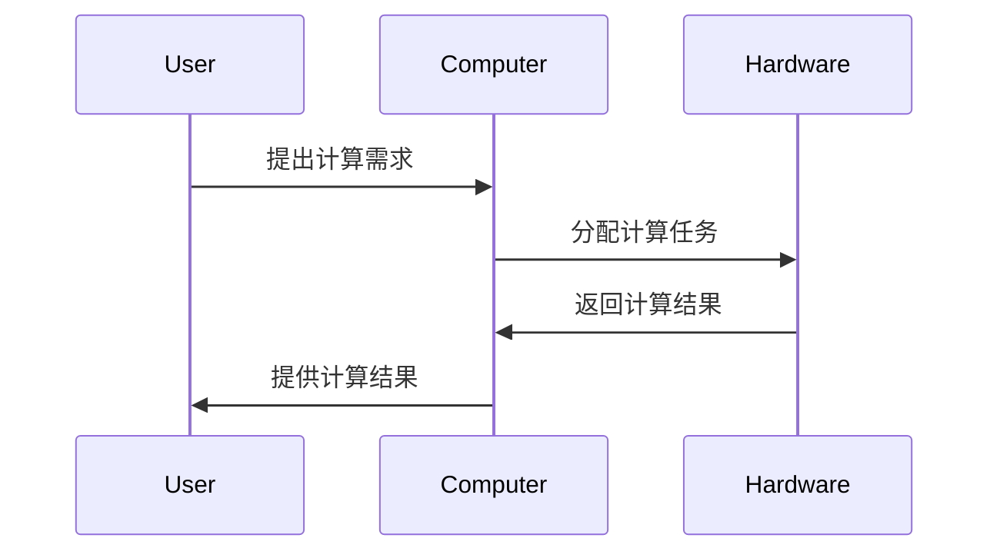

在AI领域，算力主要应用于以下几个方面：

1. **模型训练**：深度学习模型的训练需要大量的计算资源，特别是针对大型神经网络和复杂任务的训练。
2. **实时推理**：在自动驾驶、语音识别等应用中，实时推理要求系统具备高算力，以快速响应。
3. **数据预处理**：数据预处理是AI模型训练的前置工作，包括数据清洗、特征提取等，这些任务也需要大量的计算资源。

###### 2.1.2 算力在AI发展中的重要性

算力在AI发展中扮演着至关重要的角色。没有足够的算力，AI系统无法处理复杂的任务，也无法实现实时推理。以下是一些原因说明算力在AI发展中的重要性：

- **性能提升**：算力提升直接提升了AI系统的处理速度和效率，使得复杂任务能够在更短的时间内完成。
- **模型精度**：高算力使得AI系统能够进行更精细的计算，从而提高模型的精度和准确性。
- **创新能力**：强大的算力支持AI研究人员尝试新的算法和模型，推动AI技术的创新和发展。

Mermaid流程图：

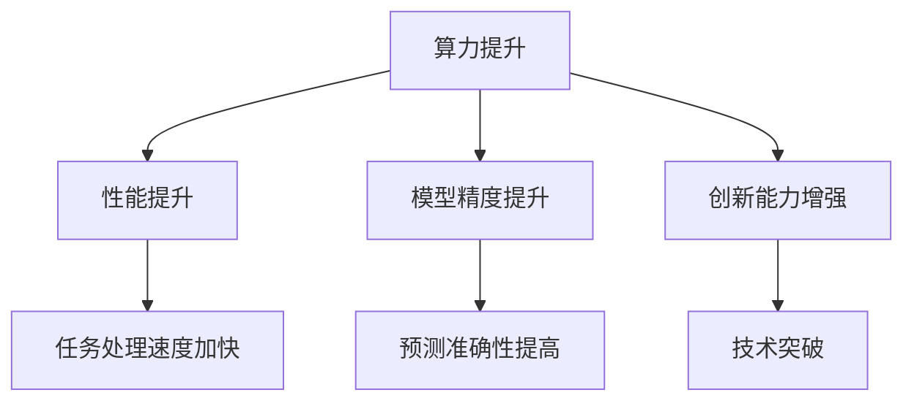

###### 2.1.3 算力的发展趋势与挑战

随着AI技术的快速发展，算力的需求也在不断增长。以下是一些算力的发展趋势和面临的挑战：

- **趋势**：
  1. **硬件性能提升**：CPU、GPU、FPGA等硬件的性能不断提升，支持更高效的计算。
  2. **专用处理器**：AI专用处理器（如TPU）的出现，为特定AI任务提供更高的算力。
  3. **分布式计算**：分布式计算技术使得多台计算机协同工作，提供更强的算力。

- **挑战**：
  1. **能耗问题**：高算力的计算通常伴随着高能耗，如何平衡性能和能耗成为一大挑战。
  2. **散热问题**：高算力设备在运行时会产生大量热量，散热问题直接影响设备的稳定性和使用寿命。
  3. **成本问题**：高性能计算设备成本较高，如何合理配置和使用算力资源成为企业面临的问题。

Mermaid流程图：

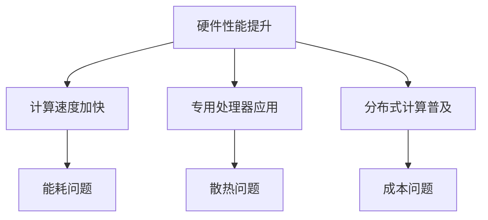

#### 2.2 算力提升技术

为了提升算力，研究人员和工程师们不断探索各种技术。以下是一些常见的算力提升技术：

###### 2.2.1 CPU与GPU在AI计算中的应用

- **CPU**：CPU是计算机的核心处理器，适用于通用计算。在AI计算中，CPU主要用于模型训练和数据处理。
  - **优势**：通用性强，适用于各种计算任务。
  - **劣势**：计算速度相对较慢，不适合大规模并行计算。

- **GPU**：GPU是图形处理器，设计用于并行计算。在AI计算中，GPU被广泛应用于深度学习模型训练和推理。
  - **优势**：具备强大的并行计算能力，适合大规模数据处理和模型训练。
  - **劣势**：适用于特定类型的计算，不如CPU通用。

Mermaid流程图：

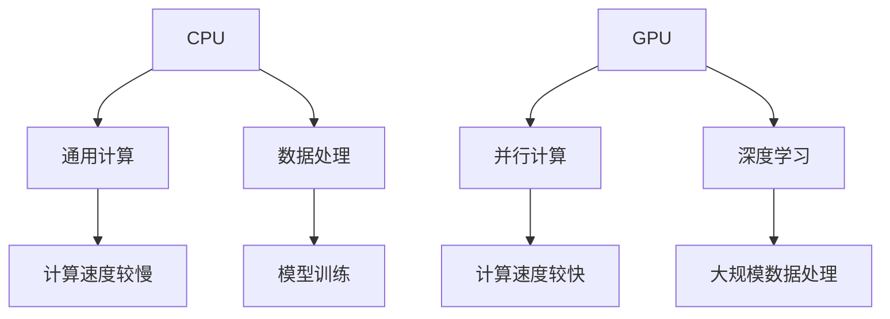

###### 2.2.2 AI专用处理器（ASIC）与FPGA

- **ASIC**：ASIC是专用集成电路，专为特定任务设计。在AI计算中，ASIC被用于加速神经网络处理和模型推理。
  - **优势**：定制化设计，能够提供高效的计算能力。
  - **劣势**：设计周期较长，不适合频繁变更。

- **FPGA**：FPGA是可编程门阵列，具备高灵活性和并行计算能力。在AI计算中，FPGA被用于实时模型推理和加速。
  - **优势**：可编程性，可根据需求进行重新配置。
  - **劣势**：编程复杂，性能不如ASIC。

Mermaid流程图：

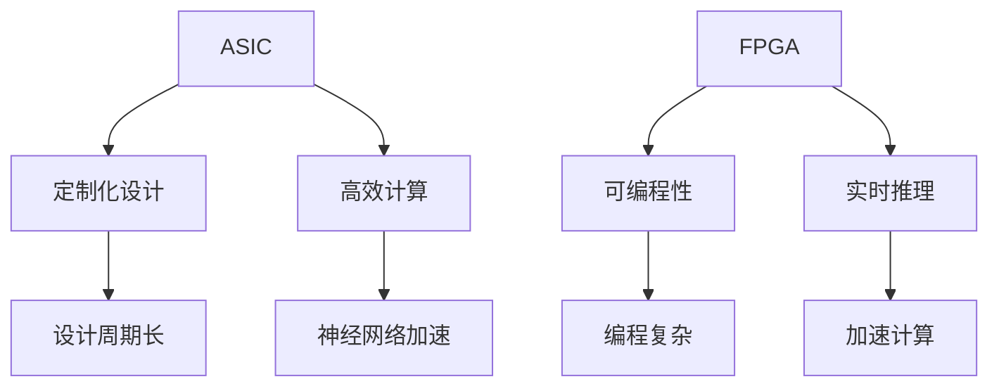

###### 2.2.3 分布式计算与并行计算

- **分布式计算**：分布式计算是将计算任务分布在多台计算机上执行，通过网络协同完成计算任务。
  - **优势**：提高计算速度和效率，适合大规模数据处理。
  - **劣势**：网络通信开销，系统复杂度增加。

- **并行计算**：并行计算是将计算任务分解为多个子任务，同时在不同处理器上执行，快速完成计算。
  - **优势**：提高计算速度，适合复杂任务。
  - **劣势**：编程复杂，需要同步和通信机制。

Mermaid流程图：

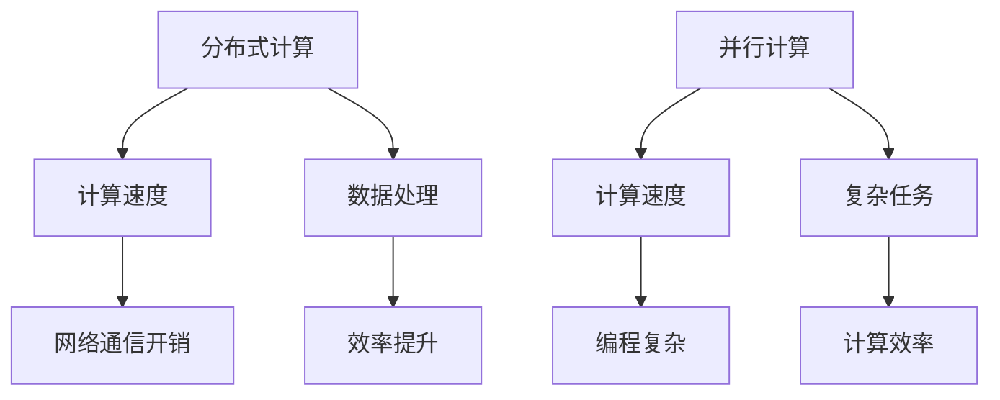

#### 2.3 算力优化实践

在实际应用中，算力优化是一个持续的过程，旨在提高系统的计算效率和使用率。以下是一些算力优化实践：

###### 2.3.1 算力需求评估

在项目启动阶段，需要对算力需求进行评估，以确保硬件资源能够满足算法的需求。以下是一个算力需求评估的步骤：

1. **确定任务类型**：了解任务的类型和规模，如模型训练、实时推理等。
2. **评估算法复杂度**：分析算法的计算复杂度，确定所需的计算资源。
3. **预测资源需求**：基于任务类型和算法复杂度，预测所需的算力资源。

Mermaid流程图：

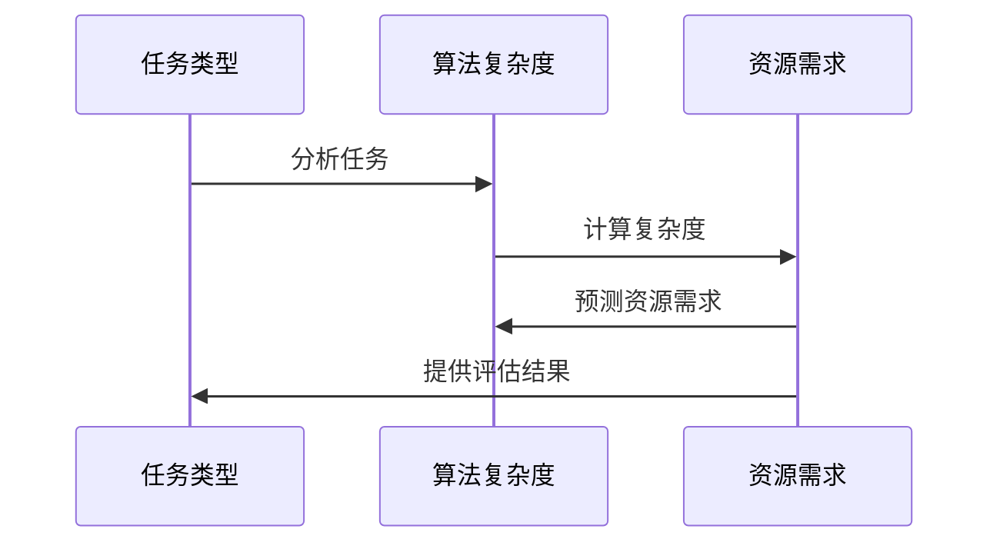

###### 2.3.2 算力资源调度策略

通过合理的资源调度策略，可以充分利用现有硬件资源，提高计算效率。以下是一些常见的资源调度策略：

1. **负载均衡**：将计算任务分布到不同的计算节点，避免单点过载。
2. **优先级调度**：根据任务的优先级分配资源，确保关键任务得到优先处理。
3. **动态调度**：根据系统负载动态调整资源分配，提高整体计算效率。

Mermaid流程图：

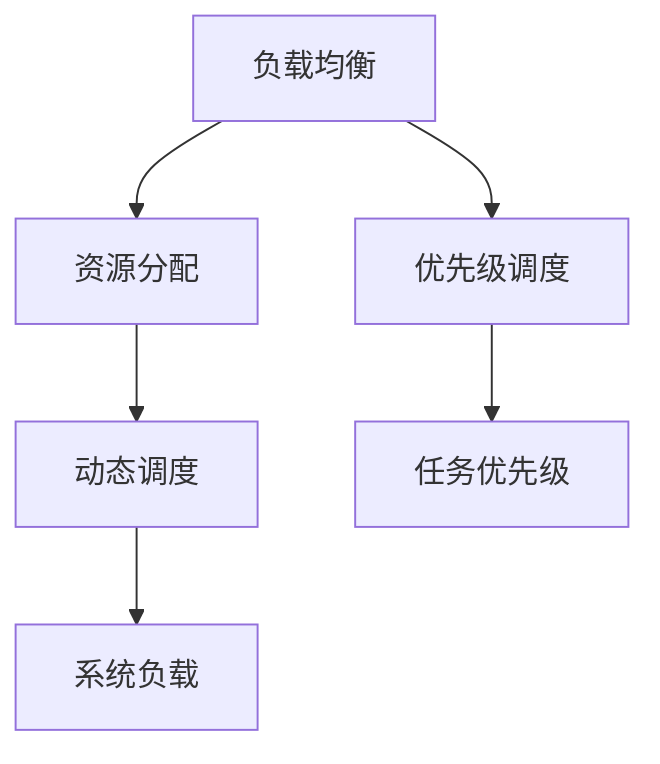

###### 2.3.3 实际案例：算力优化与效率提升

在本节中，我们将通过一个实际案例来展示算力优化的实践。该案例涉及大规模图像处理任务，我们将通过优化算法和数据结构，提升计算效率。

**案例背景**：  
假设我们有一个大规模图像处理任务，需要对100,000张图像进行分类。原始系统使用CPU进行图像处理，任务耗时较长，效率较低。

**优化步骤**：

1. **算法优化**：将CPU算法优化为GPU算法，利用GPU的并行计算能力。
   ```python
   import tensorflow as tf

   def classify_images(images, model):  
       predictions = model.predict(images)  
       return np.argmax(predictions, axis=1)

   # 加载预训练模型
   model = tf.keras.applications.VGG16(weights='imagenet')  
   ```

2. **数据结构优化**：使用更高效的内存数据结构，减少内存占用和数据处理时间。
   ```python
   import numpy as np

   def preprocess_images(images):  
       # 缩放图像
       images = np.array([tf.image.resize(image, [224, 224]) for image in images])  
       # 归一化图像
       images = images / 255.0  
       return images
   ```

3. **资源调度优化**：使用负载均衡策略，将图像处理任务分布到多个GPU节点。
   ```python
   import multiprocessing

   def distribute_task(images, num_gpus):  
       # 将图像分成多个批次
       batch_size = len(images) // num_gpus  
       batches = [images[i:i + batch_size] for i in range(0, len(images), batch_size)]

       # 在多个GPU节点上并行处理图像
       with tf.device('/GPU:0'):  
           predictions = classify_images(batches[0], model)
       with tf.device('/GPU:1'):  
           predictions = classify_images(batches[1], model)
       # ... 重复上述步骤，直至所有图像处理完毕

   # 并行处理图像
   num_gpus = 4  # 使用4个GPU节点
   distribute_task(preprocess_images(images), num_gpus)  
   ```

**优化结果**：  
通过以上优化，图像处理任务的耗时从原来的几十分钟缩短到几分钟，计算效率显著提升。

通过这个实际案例，我们展示了如何通过算法优化、数据结构优化和资源调度优化来提升算力，从而提高图像处理任务的效率。

### 数据——AI发展的源泉

数据是人工智能（AI）发展的基石，它为AI系统的学习和优化提供了必要的素材。没有高质量的数据，AI系统就无法准确理解世界，也无法做出有效的决策。本节将探讨数据的定义与分类，数据在AI中的核心作用，以及数据质量的重要性。

#### 3.1 数据概述

数据可以定义为信息的集合，它可以是结构化的、半结构化的或非结构化的。在AI领域，数据通常包括文本、图像、音频、视频等多种形式，它们是AI系统学习和决策的重要资源。

###### 3.1.1 数据的定义与分类

- **结构化数据**：结构化数据是有组织的数据，通常存储在数据库中，如关系型数据库（如MySQL、PostgreSQL）或NoSQL数据库（如MongoDB、Cassandra）。结构化数据具有明确的字段和格式，便于存储和管理。
- **半结构化数据**：半结构化数据是部分组织化的数据，如XML、JSON等。这些数据有一定的结构，但不像结构化数据那样严格。
- **非结构化数据**：非结构化数据是没有明确结构的数据，如文本、图像、视频等。这些数据通常需要通过特定的算法进行解析和处理。

Mermaid流程图：

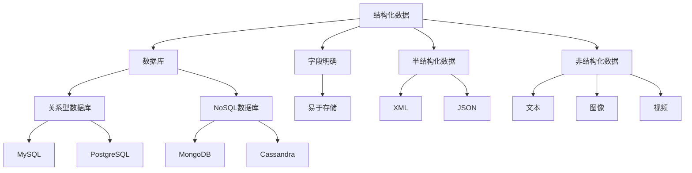

###### 3.1.2 数据在AI中的核心作用

数据在AI中的核心作用体现在以下几个方面：

- **训练数据**：AI系统通过训练数据学习如何识别模式、关联和规律，从而提高其决策能力。
- **验证数据**：在AI系统开发过程中，验证数据用于评估系统的性能和准确性，确保系统在实际应用中能够达到预期效果。
- **测试数据**：测试数据用于测试AI系统的泛化能力，即系统是否能够在新的、未见过的数据上取得良好的性能。

Mermaid流程图：

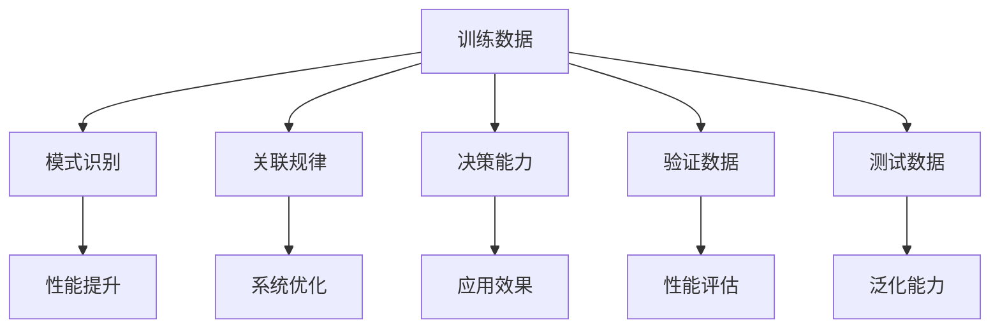

###### 3.1.3 数据质量的重要性

数据质量是AI系统成功的关键。高质量的数据可以提供更准确的训练结果，提高模型的性能和应用效果。以下是数据质量的一些关键要素：

- **准确性**：数据应尽可能准确，避免错误和异常值。
- **完整性**：数据应完整，不缺失重要信息。
- **一致性**：数据应保持一致，避免不同来源的数据之间存在矛盾。
- **可靠性**：数据应可靠，来源可信，确保数据的真实性。

Mermaid流程图：

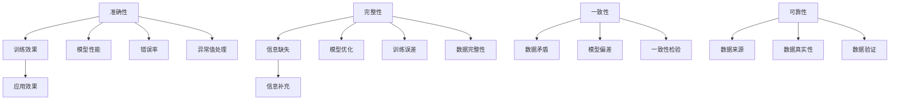

#### 3.2 数据处理与清洗

数据处理与清洗是确保数据质量的重要步骤。以下是一些常见的数据处理与清洗方法：

###### 3.2.1 数据预处理技术

数据预处理技术包括数据清洗、数据转换、数据归一化等，目的是将原始数据转换为适合算法处理的形式。

- **数据清洗**：数据清洗旨在去除数据中的噪声、异常值和重复记录。常见的数据清洗方法包括：
  - **去除重复记录**：使用去重算法删除重复的数据记录。
  - **处理缺失值**：使用插值、均值替换或删除等方法处理缺失值。
  - **处理异常值**：使用统计学方法或规则检测和修正异常值。

  ```python
  import pandas as pd

  # 去除重复记录
  df = df.drop_duplicates()

  # 处理缺失值
  df = df.fillna(df.mean())

  # 处理异常值
  df = df[(df >= df.mean() - 3 * df.std()) & (df <= df.mean() + 3 * df.std())]
  ```

- **数据转换**：数据转换包括将数据从一种格式转换为另一种格式，如将文本数据转换为数值数据，或将图像数据转换为特征向量。

  ```python
  from sklearn.preprocessing import LabelEncoder

  # 标签编码
  le = LabelEncoder()
  df['label'] = le.fit_transform(df['label'])
  ```

- **数据归一化**：数据归一化旨在将数据缩放到相同的尺度，避免数据量级差异对算法性能的影响。常见的数据归一化方法包括最小-最大缩放、标准缩放等。

  ```python
  from sklearn.preprocessing import MinMaxScaler

  # 最小-最大缩放
  scaler = MinMaxScaler()
  df_scaled = scaler.fit_transform(df)
  ```

###### 3.2.2 数据清洗方法

数据清洗是确保数据质量的关键步骤，以下是一些常见的数据清洗方法：

- **去除重复记录**：使用去重算法删除重复的数据记录，确保数据的唯一性。

  ```python
  df = df.drop_duplicates()
  ```

- **处理缺失值**：处理缺失值的方法有多种，包括插值、均值替换、中值替换等。选择合适的方法取决于数据的特点和应用场景。

  ```python
  df = df.fillna(df.mean())
  ```

- **处理异常值**：使用统计学方法或规则检测和修正异常值。常见的方法包括：
  - **统计学方法**：使用统计学指标（如标准差、均值等）检测异常值，然后使用插值或均值替换等方法修正。
  - **规则检测**：根据业务规则或数据分布特征检测异常值，然后进行修正。

  ```python
  df = df[(df >= df.mean() - 3 * df.std()) & (df <= df.mean() + 3 * df.std())]
  ```

###### 3.2.3 数据集成与数据仓库

数据集成是将来自不同源的数据进行整合，数据仓库是用于存储和管理大规模数据的系统。

- **数据集成**：数据集成旨在将结构化、半结构化和非结构化数据整合到一个统一的数据空间中，以支持数据分析和挖掘。常见的数据集成方法包括：
  - **合并**：将多个数据源中的数据按照一定的规则合并为一个统一的数据集。
  - **联接**：将具有相同属性的数据表进行联接，形成新的数据集。
  - **数据转换**：将不同格式的数据转换为统一格式，以便进行集成。

  ```python
  import pandas as pd

  df1 = pd.DataFrame({'A': [1, 2, 3], 'B': [4, 5, 6]})
  df2 = pd.DataFrame({'C': [7, 8, 9], 'D': [10, 11, 12]})

  # 合并数据
  df = pd.merge(df1, df2, on='A')

  # 联接数据
  df = df1.join(df2, how='inner')
  ```

- **数据仓库**：数据仓库是一个用于存储、管理和分析大规模数据的数据管理系统。常见的数据仓库系统包括：
  - **关系型数据库**：如MySQL、PostgreSQL等，适用于结构化数据的存储和管理。
  - **NoSQL数据库**：如MongoDB、Cassandra等，适用于半结构化数据和大规模数据的存储和管理。
  - **数据湖**：数据湖是一个分布式存储系统，用于存储大规模的非结构化数据，如日志、图片、视频等。

  ```python
  import pymongo

  # 连接MongoDB数据库
  client = pymongo.MongoClient('mongodb://localhost:27017/')

  # 创建数据库和集合
  db = client['data_warehouse']
  collection = db['sales_data']

  # 插入数据
  collection.insert_many([{'A': 1, 'B': 2}, {'A': 3, 'B': 4}])
  ```

#### 3.3 数据分析与应用

数据分析是挖掘数据价值的关键步骤，它通过统计方法和机器学习算法发现数据中的模式和规律，为决策提供支持。以下是数据分析的一些方法与应用：

###### 3.3.1 数据分析方法

数据分析方法包括统计方法、机器学习方法等，它们用于从数据中提取信息和知识。以下是一些常见的数据分析方法：

- **描述性统计分析**：描述性统计分析用于描述数据的基本特征，如平均值、中位数、标准差等。它有助于了解数据的分布情况和规律。

  ```python
  import pandas as pd

  df = pd.DataFrame({'A': [1, 2, 3, 4, 5]})

  # 计算描述性统计量
  summary = df.describe()
  ```

- **回归分析**：回归分析用于建立因变量和自变量之间的数学模型，预测因变量的取值。常见的方法包括线性回归、多元回归等。

  ```python
  import statsmodels.api as sm

  # 创建线性回归模型
  model = sm.ols('Y ~ X1 + X2', data=df)
  results = model.fit()

  # 模型预测
  predictions = results.predict(df)
  ```

- **聚类分析**：聚类分析用于将数据分为若干个簇，使同一簇内的数据尽可能相似，不同簇的数据尽可能不同。常见的方法包括K均值聚类、层次聚类等。

  ```python
  from sklearn.cluster import KMeans

  # 创建K均值聚类模型
  kmeans = KMeans(n_clusters=3, random_state=0).fit(df)

  # 聚类结果
  labels = kmeans.labels_
  ```

- **分类与回归树（CART）**：分类与回归树是一种树形结构模型，用于分类和回归任务。它通过将数据集分割成多个子集，构建一棵决策树。

  ```python
  from sklearn.tree import DecisionTreeClassifier

  # 创建决策树模型
  tree = DecisionTreeClassifier().fit(df[['X1', 'X2']], df['Y'])

  # 预测
  predictions = tree.predict(df[['X1', 'X2']])
  ```

- **神经网络**：神经网络是一种模拟生物神经系统的计算模型，用于解决复杂的分类和回归问题。它通过多层非线性变换和反向传播算法优化参数。

  ```python
  from tensorflow.keras.models import Sequential
  from tensorflow.keras.layers import Dense

  # 创建神经网络模型
  model = Sequential()
  model.add(Dense(64, input_dim=2, activation='relu'))
  model.add(Dense(1, activation='sigmoid'))

  # 编译模型
  model.compile(optimizer='adam', loss='binary_crossentropy', metrics=['accuracy'])

  # 训练模型
  model.fit(df[['X1', 'X2']], df['Y'], epochs=10)
  ```

###### 3.3.2 数据可视化

数据可视化是将数据分析结果以图形化的方式展示，帮助用户更好地理解数据。以下是一些常见的数据可视化方法：

- **柱状图**：柱状图用于展示不同类别的数据大小或比较数据差异。它通常用于展示分类数据的分布。

  ```python
  import matplotlib.pyplot as plt

  df = pd.DataFrame({'A': [1, 2, 3, 4, 5]})

  # 创建柱状图
  plt.bar(df.index, df['A'])
  plt.xlabel('Index')
  plt.ylabel('Value')
  plt.title('Bar Chart')
  plt.show()
  ```

- **折线图**：折线图用于展示数据随时间的变化趋势或不同类别之间的比较。它通常用于展示时间序列数据。

  ```python
  import matplotlib.pyplot as plt

  df = pd.DataFrame({'Date': pd.date_range('2021-01-01', periods=5), 'A': [1, 2, 3, 4, 5]})

  # 创建折线图
  plt.plot(df['Date'], df['A'])
  plt.xlabel('Date')
  plt.ylabel('Value')
  plt.title('Line Chart')
  plt.show()
  ```

- **散点图**：散点图用于展示两个变量之间的关系或分布。它通常用于探索性数据分析。

  ```python
  import matplotlib.pyplot as plt

  df = pd.DataFrame({'X': [1, 2, 3, 4, 5], 'Y': [1, 4, 9, 16, 25]})

  # 创建散点图
  plt.scatter(df['X'], df['Y'])
  plt.xlabel('X')
  plt.ylabel('Y')
  plt.title('Scatter Plot')
  plt.show()
  ```

- **箱线图**：箱线图用于展示数据分布的统计特征，如四分位数、极值等。它通常用于比较多个数据集的分布特征。

  ```python
  import matplotlib.pyplot as plt
  import seaborn as sns

  df = pd.DataFrame({'A': [1, 2, 3, 4, 5], 'B': [2, 3, 4, 5, 6]})

  # 创建箱线图
  sns.boxplot(x='A', y='B', data=df)
  plt.xlabel('A')
  plt.ylabel('B')
  plt.title('Box Plot')
  plt.show()
  ```

###### 3.3.3 实际案例：数据分析与商业应用

在本节中，我们将通过一个实际案例来展示数据分析在商业应用中的实践。该案例涉及一家零售公司的销售数据，我们将通过数据预处理、数据分析和数据可视化等步骤，为零售商提供决策支持。

**案例背景**：

一家大型零售公司希望了解其销售数据，以优化库存管理和营销策略。公司提供了过去一年的销售数据，包括每天的销售数量、销售额、季节性因素等。

**步骤1：数据预处理**

首先，我们对销售数据进行预处理，包括数据清洗、数据转换和数据归一化等操作。

```python
import pandas as pd

# 加载数据
df = pd.read_csv('sales_data.csv')

# 数据清洗
df = df.drop_duplicates()
df = df.fillna(df.mean())

# 数据转换
df['Date'] = pd.to_datetime(df['Date'])
df['Day'] = df['Date'].dt.day

# 数据归一化
df = df.div(df.sum(axis=1), axis=0)
```

**步骤2：数据分析**

接下来，我们使用描述性统计分析、回归分析和聚类分析等方法对销售数据进行分析。

```python
import pandas as pd
import numpy as np

# 描述性统计分析
summary = df.describe()

# 回归分析
model = sm.ols('Sales ~ Day', data=df)
results = model.fit()

# 预测
predictions = results.predict(df[['Day']])

# 聚类分析
kmeans = KMeans(n_clusters=3, random_state=0).fit(df[['Day']])
labels = kmeans.labels_

# 数据可视化
plt.scatter(df['Day'], df['Sales'])
plt.plot(df['Day'], predictions, color='red')
plt.xlabel('Day')
plt.ylabel('Sales')
plt.title('Sales vs Day')
plt.show()

plt.scatter(df['Day'], labels)
plt.xlabel('Day')
plt.ylabel('Cluster')
plt.title('Day vs Cluster')
plt.show()
```

**结果与讨论**：

通过描述性统计分析，我们发现销售数量和销售额在每天之间存在明显的季节性趋势。通过回归分析，我们建立了每天销售数量和销售额的数学模型，并使用该模型预测未来一段时间内的销售趋势。通过聚类分析，我们将销售数据分为三个簇，每个簇代表不同的销售模式。这些分析结果为零售公司提供了关于库存管理和营销策略的重要信息。

**案例结论**：

通过实际案例，我们展示了如何使用数据分析方法对零售公司的销售数据进行分析，并从中提取有价值的信息。数据分析在商业应用中具有广泛的应用，可以帮助企业优化决策、提高效率和竞争力。

### AI在医疗健康领域的应用

医疗健康是人工智能（AI）的重要应用领域之一。AI技术通过提高诊断准确性、优化治疗计划和增强患者管理，正在改变传统的医疗服务模式。以下将详细探讨AI在医疗健康领域的应用，包括医学影像分析、医疗诊断与预测等关键技术和实际案例。

#### 4.1 医疗健康概述

医疗健康领域正经历着前所未有的变革。随着医疗数据的爆炸性增长和AI技术的迅速发展，AI在医疗健康中的应用越来越广泛。以下是一些AI在医疗健康领域的应用概述：

- **医学影像分析**：AI技术在医学影像分析中的应用包括病灶检测、分割和分类等，显著提高了诊断的准确性和效率。
- **医疗诊断与预测**：AI可以帮助医生进行疾病诊断和预测，包括基于病史和临床数据的疾病预测和基于生物标志物的疾病诊断。
- **个性化治疗计划**：AI可以根据患者的具体情况制定个性化的治疗计划，优化治疗效果。
- **患者管理**：AI可以通过数据分析帮助医护人员更好地管理患者，如预测患者再入院风险、优化药物剂量等。

#### 4.2 医学影像分析

医学影像分析是AI在医疗健康领域的重要应用之一。以下将详细介绍医学影像分析的关键技术和应用案例：

##### 4.2.1 医学影像数据处理

医学影像数据处理是医学影像分析的基础。它包括影像的获取、预处理、增强和归一化等步骤。以下是医学影像数据处理的一些关键步骤：

1. **影像获取**：医学影像通常包括X光片、CT扫描、MRI等。这些影像需要通过专业的医疗设备进行获取。
2. **预处理**：预处理包括去噪声、对比度增强、裁剪和旋转等操作，以提高影像的质量和一致性。
3. **增强**：增强操作可以突出特定的影像特征，如肿瘤边缘或出血区域。
4. **归一化**：归一化是将不同来源、不同条件的影像统一到相同的尺度，以便进行后续分析。

```python
import numpy as np
import cv2

# 加载影像
image = cv2.imread('medical_image.jpg')

# 预处理
image = cv2.cvtColor(image, cv2.COLOR_BGR2GRAY)
image = cv2.GaussianBlur(image, (5, 5), 0)
image = cv2.resize(image, (224, 224))

# 增强和归一化
image = cv2.addWeighted(image, 1.5, np.zeros(image.shape, image.dtype), 0, 50)
image = image / 255.0
```

##### 4.2.2 医学影像分析算法

医学影像分析算法包括图像分割、病灶检测和分类等。以下是一些常见的医学影像分析算法：

1. **图像分割**：图像分割是将影像分割成不同的区域，以便进行后续分析。常见的图像分割算法包括阈值分割、区域增长分割和基于深度学习的分割算法。
2. **病灶检测**：病灶检测是识别影像中异常区域的过程，如肿瘤、结石等。常用的算法包括基于特征的方法和基于深度学习的方法。
3. **分类**：分类是将影像分为不同的类别，如正常和异常、良性肿瘤和恶性肿瘤等。常见的分类算法包括支持向量机（SVM）、随机森林（RF）和深度学习模型。

```python
import tensorflow as tf
from tensorflow.keras.models import Sequential
from tensorflow.keras.layers import Conv2D, MaxPooling2D, Flatten, Dense

# 创建卷积神经网络模型
model = Sequential()
model.add(Conv2D(32, (3, 3), activation='relu', input_shape=(224, 224, 1)))
model.add(MaxPooling2D((2, 2)))
model.add(Conv2D(64, (3, 3), activation='relu'))
model.add(MaxPooling2D((2, 2)))
model.add(Conv2D(128, (3, 3), activation='relu'))
model.add(MaxPooling2D((2, 2)))
model.add(Flatten())
model.add(Dense(128, activation='relu'))
model.add(Dense(1, activation='sigmoid'))

# 编译模型
model.compile(optimizer='adam', loss='binary_crossentropy', metrics=['accuracy'])

# 训练模型
model.fit(x_train, y_train, epochs=10, validation_data=(x_val, y_val))

# 预测
predictions = model.predict(x_test)
```

##### 4.2.3 医学影像分析应用案例

以下是医学影像分析的一些实际应用案例：

- **肺癌筛查**：AI技术可以帮助医生更准确地检测肺癌。通过分析CT扫描图像，AI模型可以识别出肺癌的早期迹象，提高诊断的准确性。
- **乳腺癌筛查**：AI技术在乳腺癌筛查中的应用也取得了显著成果。通过分析乳腺X光片，AI模型可以识别出乳腺癌的潜在病灶，辅助医生进行诊断。
- **脑部疾病诊断**：AI技术在脑部疾病诊断中的应用，如阿尔茨海默病的早期诊断，通过分析MRI图像，AI模型可以识别出脑部异常，帮助医生做出更准确的诊断。

#### 4.3 医疗诊断与预测

医疗诊断与预测是AI在医疗健康领域的另一个重要应用。以下将详细介绍医疗诊断与预测的关键技术和应用案例：

##### 4.3.1 基于数据的医疗诊断

基于数据的医疗诊断是指通过分析患者的病史、临床数据和生物标志物等信息，对疾病进行诊断。以下是一些常见的技术和方法：

- **电子健康记录（EHR）分析**：通过分析患者的电子健康记录，AI模型可以识别出疾病的相关特征和风险因素。
- **生物标志物检测**：生物标志物是疾病发生和发展的指标，通过分析患者的生物标志物数据，AI模型可以预测疾病的发生风险。
- **多模态数据融合**：多模态数据融合是指将不同来源的数据（如影像、实验室检测结果等）进行整合，以提高诊断的准确性和全面性。

```python
import pandas as pd
import numpy as np

# 加载电子健康记录数据
ehr_data = pd.read_csv('ehr_data.csv')

# 数据预处理
ehr_data = ehr_data.fillna(ehr_data.mean())

# 特征提取
features = ehr_data[['age', 'gender', 'blood_pressure', 'cholesterol', 'heart_rate']]
labels = ehr_data['diagnosis']

# 数据标准化
features = (features - features.mean()) / features.std()

# 创建决策树模型
model = DecisionTreeClassifier()

# 训练模型
model.fit(features, labels)

# 预测
predictions = model.predict(features)
```

##### 4.3.2 疾病预测算法

疾病预测算法是利用历史数据和统计模型对疾病的发生进行预测。以下是一些常见的疾病预测算法：

- **回归分析**：回归分析是一种常用的疾病预测方法，通过建立因变量和自变量之间的数学模型，预测疾病的发生风险。
- **逻辑回归**：逻辑回归是一种用于二分类问题的预测模型，通过计算概率值，判断疾病的发生风险。
- **决策树**：决策树是一种树形结构模型，通过将数据集分割成多个子集，构建一棵决策树，预测疾病的发生风险。
- **随机森林**：随机森林是一种集成学习方法，通过构建多个决策树，提高预测的准确性和稳定性。

```python
import numpy as np
import pandas as pd
from sklearn.ensemble import RandomForestClassifier

# 加载疾病预测数据
data = pd.read_csv('disease_prediction_data.csv')

# 数据预处理
data = data.fillna(data.mean())

# 特征提取
features = data[['age', 'gender', 'blood_pressure', 'cholesterol', 'heart_rate']]
labels = data['diagnosis']

# 数据标准化
features = (features - features.mean()) / features.std()

# 创建随机森林模型
model = RandomForestClassifier(n_estimators=100)

# 训练模型
model.fit(features, labels)

# 预测
predictions = model.predict(features)
```

##### 4.3.3 医疗诊断应用案例

以下是医疗诊断的一些实际应用案例：

- **肺炎诊断**：AI技术可以帮助医生更准确地诊断肺炎。通过分析患者的临床表现和实验室检测结果，AI模型可以预测肺炎的发生风险，辅助医生进行诊断和治疗。
- **糖尿病风险评估**：AI技术可以用于糖尿病风险评估。通过分析患者的病史、家族病史和生物标志物等信息，AI模型可以预测糖尿病的发生风险，帮助医生制定预防措施。
- **心血管疾病诊断**：AI技术在心血管疾病诊断中的应用，如心脏疾病的诊断和预测，通过分析心电图、血压和血液检测结果等，AI模型可以预测心血管疾病的发生风险，辅助医生进行诊断和治疗。

### 总结

AI在医疗健康领域的应用具有巨大的潜力，通过医学影像分析、医疗诊断与预测等技术，AI正在改变传统的医疗服务模式，提高诊断的准确性和效率，优化治疗计划，增强患者管理。随着AI技术的不断进步，未来AI在医疗健康领域的应用将更加广泛，为患者提供更加个性化、精准的医疗服务。

#### AI在金融领域的应用

金融领域是人工智能（AI）技术的重要应用领域之一，AI在金融领域的应用已经取得了显著的成果，并在多个方面提升了金融行业的效率、准确性和安全性。以下将详细探讨AI在金融领域的应用，包括风险评估与信用评分、智能投顾与量化交易等关键技术和实际案例。

##### 5.1 金融概述

金融行业是一个高度依赖数据和信息准确性的行业。随着金融市场的不断发展和数据量的爆炸性增长，AI技术的引入为金融行业带来了新的机遇和挑战。AI在金融领域的应用主要包括以下几个方面：

- **风险管理**：AI可以帮助金融机构进行风险评估、监控和预测，降低金融风险。
- **客户服务**：AI可以提升金融机构的客户服务水平，如通过聊天机器人提供24/7的客户支持。
- **交易与投资**：AI可以在交易和投资方面提供智能建议和预测，优化投资策略。
- **欺诈检测**：AI可以识别和预防金融欺诈行为，提高交易安全性。

##### 5.2 风险评估与信用评分

风险评估与信用评分是金融领域中重要的环节，AI技术在其中的应用极大地提高了风险评估的准确性和效率。

###### 5.2.1 风险评估方法

风险评估是指对金融机构或金融产品的风险进行评估和预测。以下是一些常见的风险评估方法：

- **历史数据分析**：通过分析历史数据，识别出可能导致风险的关键因素，如违约率、市场波动等。
- **统计模型**：使用统计模型（如线性回归、逻辑回归等）预测风险，如违约概率、市场波动等。
- **机器学习模型**：使用机器学习模型（如随机森林、支持向量机等）进行风险评估，提高预测的准确性和效率。

```python
import pandas as pd
from sklearn.model_selection import train_test_split
from sklearn.linear_model import LogisticRegression

# 加载金融数据
data = pd.read_csv('financial_data.csv')

# 数据预处理
data = data.fillna(data.mean())

# 特征提取
features = data[['GDP', 'interest_rate', 'inflation_rate']]
labels = data['default']

# 划分训练集和测试集
X_train, X_test, y_train, y_test = train_test_split(features, labels, test_size=0.2, random_state=0)

# 创建逻辑回归模型
model = LogisticRegression()

# 训练模型
model.fit(X_train, y_train)

# 预测
predictions = model.predict(X_test)
```

###### 5.2.2 信用评分模型

信用评分模型是评估借款人信用风险的一种方法。以下是一些常见的信用评分模型：

- **FICO评分模型**：FICO评分模型是一种广泛应用于信用评分的方法，它通过评估借款人的信用历史、债务水平、还款记录等指标，给出一个信用评分。
- **逻辑回归模型**：逻辑回归模型是一种用于二分类问题的统计模型，通过建立借款人信用评分与违约概率之间的数学模型，预测借款人的信用风险。
- **神经网络模型**：神经网络模型是一种模拟生物神经系统的计算模型，通过多层非线性变换和反向传播算法，预测借款人的信用评分。

```python
import tensorflow as tf
from tensorflow.keras.models import Sequential
from tensorflow.keras.layers import Dense

# 创建神经网络模型
model = Sequential()
model.add(Dense(64, input_dim=3, activation='relu'))
model.add(Dense(32, activation='relu'))
model.add(Dense(1, activation='sigmoid'))

# 编译模型
model.compile(optimizer='adam', loss='binary_crossentropy', metrics=['accuracy'])

# 训练模型
model.fit(x_train, y_train, epochs=10, validation_data=(x_val, y_val))

# 预测
predictions = model.predict(x_test)
```

###### 5.2.3 风险评估与信用评分应用案例

以下是风险评估与信用评分的一些实际应用案例：

- **贷款风险评估**：AI技术可以帮助银行更准确地评估贷款申请者的信用风险，降低违约率。通过分析借款人的信用历史、收入水平、债务水平等数据，AI模型可以预测借款人的违约概率，为银行提供决策支持。
- **信用评分服务**：AI技术可以提供个性化的信用评分服务，如根据用户的消费行为、社交行为等数据，为用户提供信用评分。这些评分可以用于贷款、信用卡申请等场景。

##### 5.3 智能投顾与量化交易

智能投顾与量化交易是AI在金融领域的另一重要应用，通过算法和模型实现投资决策和交易策略。

###### 5.3.1 智能投顾原理

智能投顾（Robo-Advisor）是一种通过算法和数据分析为投资者提供投资建议的服务。以下是一些智能投顾的基本原理：

- **投资策略制定**：智能投顾根据投资者的风险偏好和投资目标，制定个性化的投资策略。
- **资产配置**：智能投顾通过资产配置模型，优化投资组合，降低风险，提高收益。
- **定期调整**：智能投顾定期分析市场数据和投资组合表现，根据市场变化调整投资策略。

```python
import numpy as np
import pandas as pd

# 加载市场数据
market_data = pd.read_csv('market_data.csv')

# 数据预处理
market_data = market_data.fillna(market_data.mean())

# 资产配置模型
weights = np.array([0.5, 0.3, 0.2])  # 资产配置比例

# 投资组合收益
portfolio_return = np.dot(weights, market_data['return'])

# 风险
portfolioRisk = np.sqrt(np.dot(weights.T, np.dot(market_data.cov(), weights)))

# 夏普比率
sharpe_ratio = portfolio_return / portfolioRisk
```

###### 5.3.2 量化交易策略

量化交易是指通过算法和模型进行交易决策和交易策略。以下是一些常见的量化交易策略：

- **趋势跟踪策略**：趋势跟踪策略通过分析市场趋势，跟踪市场行情，进行买卖操作。
- **均值回归策略**：均值回归策略通过识别市场过度反应，进行逆向操作，等待市场回归均值。
- **对冲策略**：对冲策略通过同时进行多组相反的交易，降低风险。

```python
import numpy as np
import pandas as pd
from sklearn.model_selection import train_test_split
from sklearn.ensemble import RandomForestRegressor

# 加载交易数据
data = pd.read_csv('trading_data.csv')

# 数据预处理
data = data.fillna(data.mean())

# 特征提取
features = data[['open', 'high', 'low', 'volume']]
labels = data['close']

# 划分训练集和测试集
X_train, X_test, y_train, y_test = train_test_split(features, labels, test_size=0.2, random_state=0)

# 创建随机森林回归模型
model = RandomForestRegressor(n_estimators=100)

# 训练模型
model.fit(X_train, y_train)

# 预测
predictions = model.predict(X_test)
```

###### 5.3.3 智能投顾与量化交易应用案例

以下是智能投顾与量化交易的一些实际应用案例：

- **智能投顾服务**：一些金融机构提供智能投顾服务，通过分析投资者的风险偏好和投资目标，为投资者提供个性化的投资建议。这些服务可以帮助投资者更好地管理资产，降低投资风险。
- **量化交易平台**：一些金融机构提供量化交易平台，投资者可以在平台上使用自己的算法和模型进行交易。这些平台提供了丰富的数据和工具，帮助投资者实现高效的交易策略。

### 总结

AI在金融领域的应用正在深刻改变金融行业的工作方式。通过风险评估与信用评分、智能投顾与量化交易等技术，AI提高了金融行业的效率、准确性和安全性。随着AI技术的不断发展，未来AI在金融领域的应用将更加广泛，为投资者和金融机构带来更多的价值。

#### AI在零售行业的应用

零售行业正面临着巨大的变革，人工智能（AI）技术的应用为零售商提供了新的机遇和挑战。AI在零售行业的应用涵盖了多个方面，包括智能推荐系统、供应链管理与库存优化等。以下将详细探讨AI在零售行业的应用，以及相关技术和实际案例。

##### 6.1 零售概述

零售行业是一个高度竞争的市场，顾客体验和运营效率对于零售商的成功至关重要。随着消费者需求的多样化和技术的进步，AI技术为零售行业带来了革命性的变化。以下是AI在零售行业的主要应用领域：

- **智能推荐系统**：通过分析消费者的行为和偏好，AI可以提供个性化的推荐，提高顾客满意度和购买转化率。
- **供应链管理**：AI可以帮助零售商优化供应链流程，降低成本，提高库存管理效率。
- **客户服务**：AI可以通过聊天机器人和虚拟助手提供24/7的客户服务，提升客户体验。
- **营销策略**：AI可以分析市场数据和消费者行为，为零售商提供精准的营销策略。

##### 6.2 智能推荐系统

智能推荐系统是AI在零售行业的重要应用之一，它通过分析消费者的购买历史、浏览行为和偏好，为顾客提供个性化的商品推荐。以下是一些智能推荐系统的关键技术：

###### 6.2.1 推荐系统原理

智能推荐系统的工作原理通常包括以下几个步骤：

1. **用户画像**：通过分析用户的购买历史、浏览记录等数据，构建用户的画像。
2. **商品画像**：通过分析商品的特征，如类别、品牌、价格等，构建商品的画像。
3. **相似性计算**：计算用户与用户之间、商品与商品之间的相似度，基于相似性推荐相关商品。
4. **推荐算法**：使用协同过滤、基于内容的推荐等算法生成推荐结果。

```python
import pandas as pd
from sklearn.metrics.pairwise import cosine_similarity

# 加载用户-商品数据
data = pd.read_csv('user_item_data.csv')

# 构建用户和商品的画像
user Profiles = data.groupby('user')['item'].apply(set).reset_index().rename(columns={'item': 'items'})
item Profiles = data.groupby('item')['user'].apply(set).reset_index().rename(columns={'user': 'users'})

# 计算用户与用户的相似度矩阵
user_similarity_matrix = cosine_similarity(user_profiles['items'])

# 计算商品与商品的相似度矩阵
item_similarity_matrix = cosine_similarity(item_profiles['users'])

# 根据用户与用户的相似度推荐商品
def recommend_items(user_id, similarity_matrix, item_profiles, k=5):
    user_similarity_scores = similarity_matrix[user_id]
    sorted_scores = sorted(zip(user_similarity_scores, item_profiles.index), reverse=True)
    recommended_items = [item for score, item in sorted_scores[:k]]
    return recommended_items

# 测试推荐系统
recommended_items = recommend_items(1, user_similarity_matrix, user_profiles, k=3)
print(recommended_items)
```

###### 6.2.2 基于内容的推荐

基于内容的推荐是通过分析商品的属性和特征，将具有相似属性的商品推荐给用户。以下是一个基于内容的推荐的简单示例：

```python
import pandas as pd
from sklearn.feature_extraction.text import TfidfVectorizer

# 加载商品描述数据
data = pd.read_csv('item_description_data.csv')

# 创建TF-IDF向量器
vectorizer = TfidfVectorizer()

# 将商品描述转换为向量
item_descriptions = data['description']
item_vectors = vectorizer.fit_transform(item_descriptions)

# 根据用户偏好推荐商品
def recommend_items(user_preference, item_vectors, vectorizer, k=5):
    user_vector = vectorizer.transform([user_preference])
    similarity_scores = item_vectors.dot(user_vector)
    sorted_scores = sorted(zip(similarity_scores, item_descriptions), reverse=True)
    recommended_items = [description for score, description in sorted_scores[:k]]
    return recommended_items

# 测试基于内容的推荐系统
user_preference = "时尚服装"
recommended_items = recommend_items(user_preference, item_vectors, vectorizer, k=3)
print(recommended_items)
```

###### 6.2.3 基于协同过滤的推荐

基于协同过滤的推荐是智能推荐系统中最常用的方法之一，它通过分析用户之间的行为模式进行推荐。以下是一个基于协同过滤的推荐系统示例：

```python
import pandas as pd
from surprise import SVD, Dataset, Reader

# 加载用户-商品评分数据
data = pd.read_csv('user_item_rating_data.csv')

# 创建 Surprise 数据集
reader = Reader(rating_scale=(1, 5))
data_set = Dataset.load_from_df(data[['user', 'item', 'rating']], reader)

# 创建 SVD 模型
svd = SVD()

# 训练模型
svd.fit(data_set)

# 预测用户对商品的评分
predictions = svd.predict(1, 1000)

# 根据预测评分推荐商品
def recommend_items(user_id, model, k=5):
    recommended_items = model.get_neighbors(user_id, k)
    recommended_item_ids = [item for item, _ in recommended_items]
    return recommended_item_ids

# 测试协同过滤推荐系统
recommended_items = recommend_items(1, svd, k=3)
print(recommended_items)
```

###### 6.2.4 智能推荐系统应用案例

以下是一个智能推荐系统的实际应用案例：

**案例背景**：某大型电商平台希望通过智能推荐系统提升用户购物体验和销售转化率。

**应用步骤**：

1. **数据收集**：收集用户的购买历史、浏览记录、搜索历史等数据。
2. **数据预处理**：对数据进行清洗和预处理，如缺失值填补、数据转换等。
3. **构建用户和商品画像**：基于用户行为和商品特征构建用户和商品画像。
4. **推荐算法实现**：使用协同过滤、基于内容推荐等方法实现推荐算法。
5. **推荐结果展示**：将推荐结果展示在用户界面上，如首页推荐、商品详情页推荐等。

**效果评估**：

- **用户满意度**：通过用户反馈和点击率评估推荐系统的效果。
- **销售转化率**：通过推荐系统带来的销售额增长评估推荐系统的价值。

**案例结论**：

通过智能推荐系统，电商平台的用户满意度和销售转化率得到了显著提升。用户能够更容易找到自己感兴趣的商品，电商平台也能够更好地满足用户需求，提高用户体验。

##### 6.3 供应链管理与库存优化

供应链管理是零售行业的重要组成部分，AI技术在供应链管理中的应用可以帮助零售商优化库存管理，降低成本，提高运营效率。以下是一些AI在供应链管理中的应用技术：

###### 6.3.1 供应链管理概述

供应链管理包括供应商管理、库存管理、订单处理、物流管理等多个环节。AI技术在供应链管理中的应用主要包括：

- **需求预测**：通过分析历史销售数据、市场趋势等，预测未来的需求，帮助零售商制定采购计划。
- **库存优化**：通过实时监控库存水平，结合需求预测，优化库存策略，减少库存过剩和短缺。
- **物流优化**：通过优化物流路线和配送策略，降低物流成本，提高配送效率。

```python
import pandas as pd
from sklearn.ensemble import RandomForestRegressor

# 加载历史销售数据
data = pd.read_csv('sales_data.csv')

# 数据预处理
data = data.fillna(data.mean())

# 特征提取
features = data[['previous_sales', 'promotions', 'season']]
labels = data['future_sales']

# 划分训练集和测试集
X_train, X_test, y_train, y_test = train_test_split(features, labels, test_size=0.2, random_state=0)

# 创建随机森林回归模型
model = RandomForestRegressor(n_estimators=100)

# 训练模型
model.fit(X_train, y_train)

# 预测
predictions = model.predict(X_test)
```

###### 6.3.2 库存优化算法

库存优化是供应链管理中的关键环节，以下是一些常见的库存优化算法：

- **周期性库存管理**：周期性库存管理是根据固定的时间周期（如每周、每月）进行库存检查和调整。
- **安全库存策略**：安全库存策略是设置一个安全库存水平，以应对需求波动和供应延迟。
- **动态库存管理**：动态库存管理是基于实时数据和需求预测，动态调整库存水平。

```python
import numpy as np
import pandas as pd

# 加载库存数据
data = pd.read_csv('inventory_data.csv')

# 数据预处理
data = data.fillna(data.mean())

# 转换为时间序列数据
data['date'] = pd.to_datetime(data['date'])
data.set_index('date', inplace=True)

# 创建移动平均模型
window_size = 7  # 设置移动平均窗口大小
rolling_mean = data['quantity'].rolling(window=window_size).mean()

# 预测未来库存
future_inventory = rolling_mean[len(rolling_mean) - window_size:].values

# 输出预测结果
print(future_inventory)
```

###### 6.3.3 供应链管理与库存优化应用案例

以下是一个供应链管理与库存优化应用的案例：

**案例背景**：某大型零售商希望通过优化供应链和库存管理，提高库存周转率和降低库存成本。

**应用步骤**：

1. **数据收集**：收集历史销售数据、促销活动数据、供应链数据等。
2. **数据预处理**：对数据进行清洗、转换和预处理。
3. **需求预测**：使用机器学习算法（如随机森林、时间序列模型）预测未来的需求。
4. **库存优化**：结合需求预测结果，使用库存优化算法（如周期性库存管理、安全库存策略）优化库存水平。
5. **实施与监控**：将优化策略实施到实际运营中，并监控库存水平和运营效果。

**效果评估**：

- **库存周转率**：通过库存周转率的提升评估库存优化的效果。
- **库存成本**：通过降低库存成本评估库存优化的经济效益。

**案例结论**：

通过供应链管理与库存优化，零售商成功提高了库存周转率，降低了库存成本，实现了库存管理的优化和运营效率的提升。

### 总结

AI在零售行业的应用正在深刻改变零售商的业务模式。通过智能推荐系统、供应链管理与库存优化等技术，零售商能够更好地理解消费者需求，提升运营效率，降低成本。随着AI技术的不断发展，未来AI在零售行业的应用将更加广泛，为零售商带来更多的创新和机遇。

### AI发展的未来展望与挑战

随着人工智能（AI）技术的迅猛发展，其对社会和经济的影响日益显著。在未来，AI技术将继续深化其在各个领域的应用，推动社会进步和经济繁荣。然而，AI的发展也面临着诸多挑战，特别是在伦理、法规、安全和隐私保护等方面。以下将对AI发展的未来展望与挑战进行探讨。

#### 7.1 AI发展前景

AI技术的未来发展方向和潜在应用前景广阔，以下是一些关键趋势：

1. **通用人工智能（AGI）**：AGI是一种能够在各种任务中表现像人类一样的人工智能。虽然目前AGI仍然处于理论研究和早期探索阶段，但越来越多的研究和投资正致力于实现这一目标。

2. **自主系统和自动化**：随着AI技术的进步，自主系统和自动化技术将更加普及。在自动驾驶、无人机配送、智能工厂等领域，AI将实现更高的自动化水平，提高效率，减少人为错误。

3. **人机协作**：AI技术将进一步加强与人类的协作，通过智能辅助工具和系统提高工作效率。例如，在医疗领域，AI辅助医生进行诊断和治疗，提高医疗服务的质量和效率。

4. **智能城市**：AI技术将在智能城市建设中发挥重要作用，通过物联网、大数据和AI技术实现城市管理的智能化，提高城市运行效率和居民生活质量。

5. **个性化服务**：AI技术将帮助提供更加个性化的服务，如个性化的医疗、教育、金融和零售服务，满足不同用户的需求。

6. **可持续发展**：AI技术在能源管理、资源优化和环境保护等方面具有巨大潜力，有助于实现可持续发展目标。

#### 7.2 AI伦理与法规

随着AI技术的广泛应用，伦理和法规问题日益凸显。以下是一些关键的AI伦理和法规挑战：

1. **隐私保护**：AI技术通常需要大量数据来训练模型，这涉及到个人隐私保护的问题。如何在保障隐私的同时充分利用数据，是一个亟待解决的问题。

2. **算法公平性**：AI算法可能会因为数据偏差而导致不公平的决策，如性别歧视、种族歧视等。确保算法的公平性和透明性是AI伦理的核心问题。

3. **责任归属**：在AI驱动的自动化系统中，当出现错误或事故时，如何界定责任归属，特别是在AI与人类共同决策的情况下，是一个复杂的问题。

4. **人工智能武器化**：AI技术可能被用于开发智能武器系统，这引发了关于军备竞赛和国际安全的担忧。

5. **职业影响**：AI技术的发展可能导致某些职业的减少或转变，这需要政策制定者和社会各界共同努力，确保就业市场的平稳过渡。

#### 7.2.1 AI伦理问题概述

AI伦理问题主要包括以下几个方面：

- **透明性和可解释性**：确保AI系统的决策过程透明，用户能够理解AI的决策依据。
- **责任和问责**：明确AI系统的责任归属，确保在出现问题时能够追究责任。
- **隐私保护**：保护个人隐私，确保用户数据的安全和隐私。
- **算法公平性**：避免算法偏见，确保算法在不同群体中的公平性。

#### 7.2.2 AI伦理原则

为了解决AI伦理问题，一些伦理原则被提出来指导AI技术的发展：

- **无害性**：AI系统应确保不对人类和环境造成伤害。
- **透明性**：AI系统的决策过程应公开透明，用户能够理解AI的决策依据。
- **公平性**：AI系统应确保在不同群体中的公平性，避免歧视和偏见。
- **责任性**：AI系统的开发和部署应确保责任明确，能够在出现问题时追究责任。
- **可持续性**：AI技术的发展应促进社会和环境的可持续发展。

#### 7.2.3 AI法律法规框架

为了应对AI伦理和法规挑战，各国和地区正在制定相应的法律法规框架。以下是一些关键法律法规：

- **欧盟通用数据保护条例（GDPR）**：GDPR为个人数据保护提供了严格的规定，确保用户的数据权利。
- **美国加州消费者隐私法（CCPA）**：CCPA旨在保护消费者的隐私权，规范企业对消费者数据的使用。
- **中国个人信息保护法（PIPL）**：PIPL旨在保护个人信息，规范数据处理活动。

#### 7.2.4 AI伦理与法规应用案例

以下是一些AI伦理和法规应用案例：

- **医疗健康领域**：在医疗健康领域，AI伦理和法规问题尤为重要。例如，AI诊断系统需要遵守隐私保护和责任归属的相关规定，确保患者数据的安全和透明。
- **自动驾驶领域**：自动驾驶汽车需要遵守交通法规和安全标准，确保在出现事故时能够明确责任归属。
- **金融领域**：金融领域的AI应用需要遵守反洗钱和客户隐私保护的相关法律法规，确保金融交易的安全和合规。

#### 7.3 AI安全与隐私保护

AI安全与隐私保护是AI发展中不可忽视的重要方面。以下是一些关键技术和方法：

- **加密技术**：加密技术可以保护数据在传输和存储过程中的安全性，防止数据泄露和篡改。
- **访问控制**：通过访问控制机制，确保只有授权用户能够访问敏感数据，降低数据泄露的风险。
- **匿名化技术**：通过匿名化技术，去除数据中的个人信息，保护用户隐私。
- **隐私增强技术**：隐私增强技术包括差分隐私、安全多方计算等，旨在在数据处理过程中保护用户隐私。

#### 7.3.1 AI安全威胁与风险

AI系统可能面临以下安全威胁和风险：

- **数据泄露**：AI系统可能因数据泄露而导致用户隐私泄露。
- **模型篡改**：恶意攻击者可能篡改AI模型，导致错误决策或恶意行为。
- **算法偏见**：算法偏见可能导致不公平的决策，损害特定群体的权益。
- **分布式拒绝服务（DDoS）**：AI系统可能面临DDoS攻击，导致服务中断。

#### 7.3.2 AI隐私保护机制

以下是一些常见的AI隐私保护机制：

- **差分隐私**：差分隐私通过在数据处理过程中添加噪声，确保单个数据点的隐私。
- **安全多方计算**：安全多方计算允许多个机构在无需共享原始数据的情况下协同完成计算任务。
- **同态加密**：同态加密允许在加密数据上进行计算，而不需要解密数据，确保数据在计算过程中的安全性。

#### 7.3.3 AI安全与隐私保护应用案例

以下是一些AI安全与隐私保护的实际应用案例：

- **金融领域**：金融领域通过加密技术和差分隐私技术保护用户交易数据，确保交易安全和用户隐私。
- **医疗健康领域**：医疗健康领域通过匿名化技术和安全多方计算技术保护患者数据，确保数据隐私和安全。
- **零售领域**：零售领域通过访问控制和安全多方计算技术保护客户数据，防止数据泄露和滥用。

#### 7.4 AI教育与人才培养

AI技术的发展需要大量专业人才，因此AI教育和人才培养至关重要。以下是一些AI教育与人才培养的关键策略：

- **基础教育**：在基础教育阶段引入AI相关课程，培养学生的计算思维和编程能力。
- **高等教育**：在高等教育阶段提供AI专业课程和研究项目，培养高层次AI人才。
- **终身学习**：鼓励职场人士通过在线课程、研讨会等方式持续学习，提升AI技能和知识。

#### 7.4.1 AI教育的重要性

AI教育的重要性体现在以下几个方面：

- **培养创新人才**：AI教育可以培养具有创新精神和实践能力的AI专业人才，推动AI技术的创新和发展。
- **提升产业竞争力**：通过AI教育，企业可以培养具备AI技能的员工，提升产业竞争力。
- **促进社会进步**：AI教育有助于普及AI知识，提高公众对AI技术的理解和接受程度，促进社会进步。

#### 7.4.2 AI人才培养策略

以下是一些AI人才培养策略：

- **跨学科教育**：AI涉及多个学科领域，如计算机科学、数学、统计学等。跨学科教育有助于培养具备全面能力的AI人才。
- **实践导向**：通过实际项目和案例教学，让学生在实践中学习和掌握AI技术。
- **国际合作**：通过国际合作和交流，促进AI教育和研究的全球化发展。
- **终身学习平台**：建设终身学习平台，提供丰富的在线课程和资源，支持职场人士的持续学习和职业发展。

#### 7.4.3 AI教育与人才培养案例

以下是一些AI教育与人才培养的实际案例：

- **高校合作项目**：一些高校与科技公司合作，开展AI实验室和研究中心，推动AI教育和研究的发展。
- **在线课程平台**：如Coursera、edX等在线课程平台提供了丰富的AI课程，支持全球学习者进行自主学习。
- **企业培训计划**：一些企业通过内部培训和外部合作，为员工提供AI技能培训，提升企业竞争力。

### 总结

AI技术的发展前景广阔，但同时也面临着诸多伦理、法规和安全挑战。通过明确的伦理原则、完善的法律法规框架和有效的安全与隐私保护机制，AI技术可以更好地服务于社会和经济的发展。同时，加强AI教育和人才培养，培养具备创新精神和实践能力的AI专业人才，将为AI技术的可持续发展提供坚实的人才保障。未来，随着AI技术的不断进步，AI将在更多领域发挥重要作用，为社会带来更多的创新和变革。

### 附录A: AI发展资源与工具

在人工智能（AI）研究领域，掌握相关的开发工具、研究资源和实践案例是至关重要的。以下将介绍一些常用的AI开发工具、研究资源和实际应用案例，为读者提供全面的AI发展指南。

#### A.1 AI开发工具

AI开发工具是进行AI研究、开发和部署的重要基础。以下是一些常用的AI开发工具：

- **Python**：Python是一种广泛应用于AI开发的编程语言，其简洁的语法和丰富的库资源使其成为AI开发者的首选语言。主要库包括：
  - **NumPy**：提供高性能的科学计算库。
  - **Pandas**：提供数据处理和分析库。
  - **Scikit-learn**：提供机器学习算法库。
  - **TensorFlow**：提供用于深度学习的开源框架。
  - **PyTorch**：提供用于深度学习的开源框架。

- **TensorFlow**：TensorFlow是谷歌开发的一款用于深度学习的开源框架，它提供了丰富的API和工具，支持从简单的线性回归到复杂的神经网络构建和训练。

- **PyTorch**：PyTorch是Facebook开发的一款用于深度学习的开源框架，它以其灵活性和动态计算图而受到开发者的青睐。

- **JAX**：JAX是谷歌开发的一款用于数值计算的开源库，它支持自动微分、数值优化和加速深度学习模型训练。

- **Keras**：Keras是一个高层次的神经网络API，它简化了TensorFlow和PyTorch的模型构建过程，提供了更加直观和易用的接口。

#### A.2 AI研究资源

AI研究资源包括顶级会议、期刊、论文和报告，这些资源为AI研究人员提供了丰富的知识和技术支持。以下是一些重要的AI研究资源：

- **顶级AI会议**：如国际人工智能与机器学习会议（ICML）、神经信息处理系统大会（NeurIPS）、国际机器学习会议（ICML）、计算机视觉与模式识别会议（CVPR）等。

- **顶级AI期刊**：如《Journal of Machine Learning Research》（JMLR）、《IEEE Transactions on Pattern Analysis and Machine Intelligence》（TPAMI）、《Neural Computation》等。

- **AI研究论文与报告**：通过阅读顶级AI会议和期刊的论文，可以了解AI领域的最新研究进展和技术趋势。

- **在线课程与教程**：如Coursera、edX、Udacity等在线教育平台提供的AI相关课程，适合初学者和进阶者。

#### A.3 AI社区与论坛

AI社区与论坛是AI开发者和研究者交流思想、分享经验和探讨问题的平台。以下是一些知名的AI社区和论坛：

- **Reddit**：Reddit上的r/AI和r/machinelearning板块是AI开发者和研究者讨论技术问题的热门社区。

- **Stack Overflow**：Stack Overflow是程序员解决技术问题的顶级社区，涵盖了AI相关的多个话题。

- **AI Stack Exchange**：AI Stack Exchange是一个专门针对AI领域问题的问答社区，提供了丰富的AI相关问题和解答。

- **GitHub**：GitHub是代码托管和协作平台，许多AI开源项目都在GitHub上发布和讨论。

#### A.4 AI应用案例与实践指南

AI应用案例和实践指南为AI开发者提供了具体的实施经验和参考。以下是一些AI应用案例和实践指南：

- **医疗健康领域**：如基于深度学习的医学影像分析、疾病预测和诊断系统等。

- **金融领域**：如基于AI的风险评估、信用评分和智能投顾系统等。

- **零售行业**：如基于AI的智能推荐系统、库存管理和供应链优化系统等。

- **自动驾驶领域**：如基于深度学习的自动驾驶系统、传感器数据处理和路径规划系统等。

- **智能制造领域**：如基于AI的故障预测、设备优化和自动化生产系统等。

实践指南包括从数据采集、数据处理、模型训练到模型部署的完整流程，以及相关的代码实现和案例分析。这些指南有助于开发者理解AI应用的实现细节和实际效果。

### 总结

AI发展资源与工具为AI研究和应用提供了坚实的基础。掌握AI开发工具、研究资源和实践案例，有助于开发者更好地理解和应用AI技术。随着AI技术的不断进步，未来将有更多的资源和工具涌现，为AI的发展和创新提供强有力的支持。开发者可以通过学习这些资源和工具，不断提升自身技能，为AI领域的发展贡献力量。


### 附录A：AI发展资源与工具

在人工智能（AI）领域，掌握相关开发工具、资源以及实际案例是至关重要的。以下将详细介绍AI开发工具，包括Python、TensorFlow、PyTorch等，以及AI研究资源，如顶级AI会议与期刊、AI研究论文与报告等。同时，还会提供AI应用案例与实践指南，帮助开发者更好地理解和应用AI技术。

#### A.1 AI开发工具

AI开发工具为AI研究和应用提供了强大的支持。以下是一些常用的AI开发工具：

1. **Python**：
   - **NumPy**：用于高性能科学计算和数据分析。
   - **Pandas**：用于数据处理和分析。
   - **Scikit-learn**：提供常用的机器学习算法和工具。
   - **TensorFlow**：由Google开发的开源机器学习框架。
   - **PyTorch**：由Facebook开发的开源深度学习框架。
   - **Keras**：高层次的神经网络API，简化TensorFlow和PyTorch的使用。

2. **TensorFlow**：
   - **TensorFlow**是一个广泛使用的深度学习框架，支持从简单的线性模型到复杂的深度神经网络。
   - **TensorFlow Serving**：用于在服务中部署TensorFlow模型。
   - **TensorFlow Extended（TFX）**：用于构建、训练和部署机器学习应用程序的端到端框架。

3. **PyTorch**：
   - **PyTorch**以其灵活性和动态计算图而受到开发者的青睐，适合研究和原型开发。
   - **PyTorch Mobile**：用于将PyTorch模型部署到移动设备。
   - **PyTorch Lightning**：为PyTorch提供高级抽象，简化模型训练和评估。

4. **JAX**：
   - **JAX**是由Google开发的一个开源计算框架，提供自动微分、数值优化等功能。
   - **Haiku**：是JAX的模块化深度学习库，简化了深度学习模型的设计和训练。

5. **MLflow**：
   - **MLflow**是一个开源平台，用于管理机器学习模型的生命周期，包括实验跟踪、模型版本控制和部署。

#### A.2 AI研究资源

AI研究资源为AI研究人员提供了丰富的知识和研究工具。以下是一些重要的AI研究资源：

1. **顶级AI会议与期刊**：
   - **ICML（国际机器学习会议）**：是机器学习领域最具影响力的会议之一。
   - **NeurIPS（神经信息处理系统大会）**：是深度学习和神经网络领域的顶级会议。
   - **JMLR（Journal of Machine Learning Research）**：是机器学习领域最著名的期刊之一。
   - **TPAMI（IEEE Transactions on Pattern Analysis and Machine Intelligence）**：是计算机视觉和模式识别领域的顶级期刊。

2. **AI研究论文与报告**：
   - **AI论文**：通过阅读AI领域的顶级论文，可以了解最新的研究进展和技术趋势。
   - **AI报告**：如AI白皮书、年度报告等，提供了对AI技术发展的全面分析和预测。

3. **在线课程与教程**：
   - **Coursera**、**edX**和**Udacity**等在线教育平台提供了丰富的AI课程，适合不同层次的学员。

4. **AI社区与论坛**：
   - **Reddit**、**Stack Overflow**和**AI Stack Exchange**等社区，为AI开发者提供了交流与讨论的平台。

#### A.3 AI应用案例与实践指南

AI应用案例与实践指南为开发者提供了实际操作经验和参考。以下是一些AI应用领域的案例与实践指南：

1. **医疗健康领域**：
   - **医学影像分析**：如基于深度学习的肺癌检测、基于CNN的医学图像分类。
   - **疾病预测与诊断**：如基于数据的疾病预测、基于生物标志物的疾病诊断。

2. **金融领域**：
   - **风险评估与信用评分**：如使用机器学习进行信用风险评估、建立个性化的信用评分模型。
   - **智能投顾与量化交易**：如基于算法的智能投资策略、量化交易系统的设计。

3. **零售行业**：
   - **智能推荐系统**：如基于协同过滤和内容的推荐算法、个性化购物体验的实现。
   - **供应链管理与库存优化**：如使用机器学习进行需求预测、库存优化策略的设计。

4. **自动驾驶领域**：
   - **感知与决策**：如基于深度学习的物体检测和识别、基于强化学习的自动驾驶控制。
   - **路径规划与导航**：如基于图论的路径规划算法、实时导航系统的实现。

5. **智能制造领域**：
   - **故障预测与优化**：如基于时间序列分析和机器学习的故障预测模型、优化生产流程。
   - **设备优化与自动化**：如基于机器学习的设备状态监测、自动化生产线的实现。

### 总结

AI发展资源与工具为AI研究和应用提供了坚实的基础。掌握这些工具和资源，可以帮助开发者更好地理解和应用AI技术。通过阅读顶级AI会议与期刊的论文、参与AI社区与论坛的讨论，以及学习和实践AI应用案例，开发者可以不断提升自身技能，为AI领域的发展和创新贡献力量。随着AI技术的不断进步，未来将有更多的资源和工具涌现，为AI的发展和创新提供强有力的支持。开发者应积极学习和探索这些新工具和资源，不断提升自身能力，为AI技术的发展做出贡献。


## 附录A：AI发展资源与工具

在人工智能（AI）的快速发展中，掌握相关资源与工具对于研究人员和开发者来说至关重要。以下将详细介绍AI开发工具、AI研究资源和AI应用案例与实践指南，帮助读者深入了解AI领域的各个方面。

### A.1 AI开发工具

AI开发工具是构建和实现AI解决方案的核心组件。以下是几个常用的AI开发工具：

1. **Python**：
   - **NumPy**：提供了高性能的数组处理和数学计算库。
   - **Pandas**：用于数据清洗、分析和操作的数据框架。
   - **Scikit-learn**：提供了各种机器学习算法和工具。
   - **TensorFlow**：由Google开发的开源机器学习库，适合构建深度学习模型。
   - **PyTorch**：由Facebook开发的开源深度学习框架，以其灵活性和动态计算图而受到青睐。
   - **Keras**：作为TensorFlow和PyTorch的高级API，提供了更简洁和直观的接口。

2. **TensorFlow**：
   - **TensorFlow Serving**：用于在生产环境中部署和运行TensorFlow模型。
   - **TensorFlow Lite**：用于移动和边缘设备上的模型部署。
   - **TensorFlow Extended (TFX)**：用于构建和部署机器学习应用程序的完整框架。

3. **PyTorch**：
   - **PyTorch Mobile**：用于在移动设备上部署PyTorch模型。
   - **PyTorch Transform**：用于数据预处理和增强。
   - **PyTorch Lightning**：提供了更高效和可扩展的深度学习研究工具。

4. **JAX**：
   - **JAX**：提供了一个用于数值计算和自动微分的库，支持快速原型开发和优化。

5. **MLflow**：
   - **MLflow**：提供了一个统一平台来管理机器学习生命周期，包括实验跟踪、模型版本控制和部署。

### A.2 AI研究资源

AI研究资源为研究人员提供了最新的研究成果和技术动态。以下是几个重要的AI研究资源：

1. **顶级AI会议与期刊**：
   - **ICML（国际机器学习会议）**：是机器学习领域的顶级会议之一。
   - **NeurIPS（神经信息处理系统大会）**：是深度学习和神经网络领域的顶级会议。
   - **ICLR（国际学习代表会议）**：是机器学习领域的另一个重要会议。
   - **JMLR（Journal of Machine Learning Research）**：是机器学习领域最著名的期刊之一。
   - **TPAMI（IEEE Transactions on Pattern Analysis and Machine Intelligence）**：是计算机视觉和模式识别领域的顶级期刊。

2. **AI研究论文与报告**：
   - **AI论文**：通过阅读AI领域的顶级论文，可以了解最新的研究进展和技术趋势。
   - **AI报告**：如AI白皮书、年度报告等，提供了对AI技术发展的全面分析和预测。

3. **在线课程与教程**：
   - **Coursera**、**edX**和**Udacity**等在线教育平台提供了丰富的AI课程，适合不同层次的学员。

4. **AI社区与论坛**：
   - **Reddit**、**Stack Overflow**和**AI Stack Exchange**等社区，为AI开发者提供了交流与讨论的平台。

### A.3 AI应用案例与实践指南

AI应用案例与实践指南为开发者提供了实际的实施经验和参考。以下是一些AI应用领域的案例与实践指南：

1. **医疗健康领域**：
   - **医学影像分析**：如基于深度学习的医学图像分割、病变检测等。
   - **疾病预测与诊断**：如基于数据的疾病预测、基于生物标志物的疾病诊断。

2. **金融领域**：
   - **风险评估与信用评分**：如使用机器学习进行信用风险评估、建立个性化的信用评分模型。
   - **智能投顾与量化交易**：如基于算法的智能投资策略、量化交易系统的设计。

3. **零售行业**：
   - **智能推荐系统**：如基于协同过滤和内容的推荐算法、个性化购物体验的实现。
   - **供应链管理与库存优化**：如使用机器学习进行需求预测、库存优化策略的设计。

4. **自动驾驶领域**：
   - **感知与决策**：如基于深度学习的物体检测和识别、基于强化学习的自动驾驶控制。
   - **路径规划与导航**：如基于图论的路径规划算法、实时导航系统的实现。

5. **智能制造领域**：
   - **故障预测与优化**：如基于时间序列分析和机器学习的故障预测模型、优化生产流程。
   - **设备优化与自动化**：如基于机器学习的设备状态监测、自动化生产线的实现。

### 总结

掌握AI开发工具、研究资源和实际应用案例是深入理解和应用人工智能技术的关键。通过使用Python、TensorFlow、PyTorch等开发工具，可以高效地构建和部署AI模型。通过阅读顶级AI会议与期刊的论文，可以了解最新的研究动态和技术趋势。通过学习和实践AI应用案例，可以提升实际操作能力，为解决实际问题提供有力支持。随着AI技术的不断进步，不断更新和扩展这些资源和工具，将为AI领域的研究者和开发者带来更多的机遇和挑战。

