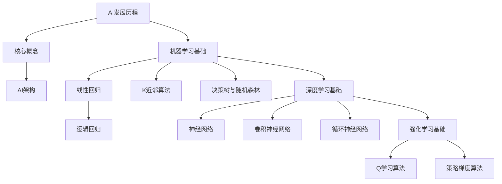

                 

# 文章标题：AI可伸缩性

> 关键词：人工智能，可伸缩性，分布式计算，并行计算，机器学习，深度学习，强化学习

> 摘要：本文旨在深入探讨人工智能（AI）系统的可伸缩性，从基础知识、核心算法到实际应用场景，详细分析AI系统在处理大规模数据和分布式计算环境中的挑战与解决方案。文章结构清晰，逻辑严密，旨在为读者提供一份全面、系统的AI可伸缩性指南。

## 目录大纲：AI可伸缩性

### 第一部分：AI基础知识

### 第1章：AI概述

#### 1.1 AI发展历程

#### 1.2 AI核心概念

#### 1.3 AI架构

### 第2章：机器学习基础

#### 2.1 线性回归

#### 2.2 逻辑回归

#### 2.3 K近邻算法

#### 2.4 决策树与随机森林

### 第3章：深度学习基础

#### 3.1 深度学习概述

#### 3.2 神经网络

#### 3.3 卷积神经网络

#### 3.4 循环神经网络

### 第4章：强化学习基础

#### 4.1 强化学习概述

#### 4.2 Q学习算法

#### 4.3 策略梯度算法

### 第5章：AI应用场景

#### 5.1 自然语言处理

#### 5.2 计算机视觉

#### 5.3 语音识别

#### 5.4 机器人

### 第二部分：AI可伸缩性

### 第6章：分布式计算与并行计算

#### 6.1 分布式计算原理

#### 6.2 并行计算原理

#### 6.3 分布式计算框架

### 第7章：大规模数据处理

#### 7.1 数据预处理

#### 7.2 数据存储与检索

#### 7.3 大规模数据处理框架

### 第8章：AI系统性能优化

#### 8.1 系统性能评估

#### 8.2 算法优化

#### 8.3 资源调度与优化

### 第9章：AI安全与隐私保护

#### 9.1 AI安全挑战

#### 9.2 数据隐私保护

#### 9.3 安全协议与机制

### 第10章：AI可伸缩性实践

#### 10.1 实践案例一：分布式机器学习

#### 10.2 实践案例二：大规模数据处理

#### 10.3 实践案例三：AI系统性能优化

## 附录

### 附录A：AI开发工具与资源

#### A.1 常用机器学习库

#### A.2 常用深度学习框架

#### A.3 开发环境搭建与配置

#### A.4 学习资源推荐

### Mermaid 流程图：



### 数学模型与公式

#### 线性回归模型：
$$
y = \beta_0 + \beta_1x + \epsilon
$$

#### 逻辑回归模型：
$$
\hat{y} = \frac{1}{1 + e^{-(\beta_0 + \beta_1x)}}
$$

### 项目实战

#### 分布式机器学习案例

1. **开发环境搭建**：配置分布式计算环境，如 Hadoop 或 Spark。
2. **数据预处理**：对数据进行清洗、预处理，如缺失值填补、异常值处理等。
3. **模型训练**：使用分布式计算框架训练模型，如使用 Spark MLlib。
4. **模型评估**：使用交叉验证等评估方法评估模型性能。
5. **模型部署**：将训练好的模型部署到生产环境，进行实时预测。

#### 代码解读与分析

```python
# 分布式机器学习代码示例
from pyspark.ml import Pipeline
from pyspark.ml.feature import VectorAssembler
from pyspark.ml.classification import LogisticRegression

# 数据预处理
assembler = VectorAssembler(inputCols=["feature1", "feature2"], outputCol="features")

# 模型训练
lr = LogisticRegression(featuresCol="features", labelCol="label")

# 构建Pipeline
pipeline = Pipeline(stages=[assembler, lr])

# 训练模型
model = pipeline.fit(training_data)

# 模型评估
predictions = model.transform(test_data)
accuracy = (predictions.label == predictions.predictedLabel).mean()
print("Model Accuracy:", accuracy)

# 模型部署
# ...（部署到生产环境）
```

**代码解读：**
- `VectorAssembler` 用于将特征列组合成一个特征向量。
- `LogisticRegression` 用于训练逻辑回归模型。
- `Pipeline` 用于构建模型训练流程。
- `fit` 方法用于训练模型。
- `transform` 方法用于使用模型进行预测。
- `mean` 方法用于计算模型准确率。

### 作者

作者：AI天才研究院/AI Genius Institute & 禅与计算机程序设计艺术 /Zen And The Art of Computer Programming

（注：以上为文章标题、关键词、摘要、目录大纲、Mermaid流程图、数学模型与公式、项目实战和作者信息的初始内容。以下将按照目录结构逐步展开详细内容。）<|less|>### 第一部分：AI基础知识

#### 第1章：AI概述

##### 1.1 AI发展历程

人工智能（Artificial Intelligence，简称AI）是一个历史悠久的领域，其起源可以追溯到20世纪50年代。在这个时期，科学家们首次提出了“人工智能”这个概念，并开始探索如何让计算机模拟人类智能。1956年，在达特茅斯会议上，约翰·麦卡锡（John McCarthy）等人正式提出了人工智能这一术语，并定义其为“制造智能机器的科学和工程”。

人工智能的发展历程大致可以分为以下几个阶段：

1. **初始阶段（1956-1969年）**：
   - 这一阶段是人工智能的萌芽期，主要研究方向是符号主义和知识表示。标志性事件包括达特茅斯会议和阿尔图尔（ELIZA）的诞生。
   - 阿尓图尔是由约瑟夫·魏泽鲍姆（Joseph Weizenbaum）开发的第一个聊天机器人，它能够模拟人类的对话方式，引发了对自然语言处理和对话系统的兴趣。

2. **繁荣阶段（1970-1980年）**：
   - 这一阶段，人工智能受到了广泛的研究和应用，机器翻译、专家系统和机器人等技术取得了显著进展。
   - 1972年，约翰·霍普金斯大学的研究团队成功开发出了具有初步决策能力的机器人Shakey。

3. **低谷阶段（1980-1990年）**：
   - 由于实际应用中遇到的一系列难题，如数据质量和算法效率问题，人工智能研究在80年代初期遇到了瓶颈，进入了所谓的“AI寒冬”。
   - 这一阶段，政府和企业对人工智能的研究和投资减少，人工智能领域进入了一个相对低谷的时期。

4. **复兴阶段（1990年至今）**：
   - 互联网的兴起和计算能力的提升，为人工智能的发展提供了新的机遇。
   - 2006年，深度学习的出现带来了人工智能领域的新一波热潮。深度学习通过模仿人脑的神经网络结构，实现了在图像识别、语音识别等领域的高性能表现。

##### 1.2 AI核心概念

人工智能的核心概念包括以下几个方面：

1. **机器学习**：
   - 机器学习是人工智能的一个重要分支，通过算法使计算机从数据中自动学习和改进。机器学习可以分为监督学习、无监督学习和强化学习。
   - **监督学习**：有标签数据训练模型，如线性回归、决策树等。
   - **无监督学习**：没有标签数据，如聚类、降维等。
   - **强化学习**：通过试错和奖励机制来训练模型，如Q学习、策略梯度算法等。

2. **深度学习**：
   - 深度学习是一种基于多层神经网络的机器学习方法，能够自动提取数据的特征和模式。深度学习在图像识别、语音识别和自然语言处理等领域取得了巨大的成功。
   - **神经网络**：由大量相互连接的神经元组成，通过学习输入数据和标签之间的关系来进行预测。
   - **卷积神经网络（CNN）**：适用于图像处理，通过卷积操作提取图像特征。
   - **循环神经网络（RNN）**：适用于序列数据处理，通过递归结构处理输入序列。

3. **自然语言处理（NLP）**：
   - 自然语言处理是使计算机理解和生成人类语言的技术。NLP在机器翻译、情感分析、问答系统等领域有广泛应用。
   - **词向量**：将单词映射为向量，用于表示单词之间的关系和语义。
   - **序列到序列模型**：如编码器-解码器（Encoder-Decoder）模型，用于机器翻译等任务。

4. **计算机视觉**：
   - 计算机视觉是使计算机能够从图像或视频中提取信息的技术。计算机视觉在图像识别、目标检测、视频分析等领域有广泛应用。
   - **特征提取**：从图像中提取有代表性的特征，如边缘、角点等。
   - **目标检测**：识别图像中的目标并定位其位置。

##### 1.3 AI架构

AI系统通常由多个层次组成，包括数据层、算法层和应用层。

1. **数据层**：
   - 数据是人工智能系统的基石，数据的质量和数量直接影响系统的性能。数据层主要包括数据采集、数据清洗和数据存储。
   - **数据采集**：从各种来源收集数据，如传感器、互联网等。
   - **数据清洗**：处理数据中的噪声和异常值，提高数据质量。
   - **数据存储**：将数据存储在数据库或分布式文件系统中，便于后续处理和使用。

2. **算法层**：
   - 算法层是AI系统的核心，包括机器学习算法、深度学习算法和强化学习算法等。
   - **机器学习算法**：如线性回归、决策树、支持向量机等。
   - **深度学习算法**：如卷积神经网络（CNN）、循环神经网络（RNN）、生成对抗网络（GAN）等。
   - **强化学习算法**：如Q学习、策略梯度算法等。

3. **应用层**：
   - 应用层是将AI算法应用于实际问题的层次，包括自然语言处理、计算机视觉、语音识别、机器人等。
   - **自然语言处理**：如机器翻译、情感分析、问答系统等。
   - **计算机视觉**：如目标检测、图像识别、视频分析等。
   - **语音识别**：如语音转文字、语音助手等。
   - **机器人**：如工业机器人、服务机器人、自动驾驶等。

### 第2章：机器学习基础

##### 2.1 线性回归

线性回归是机器学习中最基本和最常用的算法之一，主要用于预测连续值。其核心思想是通过找到一组线性关系来描述因变量和自变量之间的关系。

1. **线性回归模型**：
   - 线性回归模型可以用以下数学公式表示：
     $$
     y = \beta_0 + \beta_1x + \epsilon
     $$
   - 其中，$y$ 是因变量，$x$ 是自变量，$\beta_0$ 是截距，$\beta_1$ 是斜率，$\epsilon$ 是误差项。

2. **线性回归的推导**：
   - 线性回归的目标是找到最佳拟合线，使得预测值与实际值之间的误差最小。
   - 使用最小二乘法（Least Squares Method）来求解最佳拟合线：
     $$
     \min \sum_{i=1}^{n} (y_i - (\beta_0 + \beta_1x_i))^2
     $$
   - 对上式求导并令导数为零，可以得到：
     $$
     \beta_0 = \frac{\sum_{i=1}^{n} y_i - \beta_1\sum_{i=1}^{n} x_i}{n}
     $$
     $$
     \beta_1 = \frac{n\sum_{i=1}^{n} x_iy_i - \sum_{i=1}^{n} x_i\sum_{i=1}^{n} y_i}{n\sum_{i=1}^{n} x_i^2 - (\sum_{i=1}^{n} x_i)^2}
     $$

3. **线性回归的应用场景**：
   - **房价预测**：通过输入房屋的特征（如面积、位置等），预测房屋的价格。
   - **股票价格预测**：通过分析历史股票价格数据，预测未来股票价格的趋势。
   - **生物医学研究**：分析生物医学数据，预测疾病的发生概率。

##### 2.2 逻辑回归

逻辑回归是另一种常见的回归算法，主要用于预测概率。它是一种广义的线性回归模型，可以处理分类问题。

1. **逻辑回归模型**：
   - 逻辑回归模型可以用以下数学公式表示：
     $$
     \hat{y} = \frac{1}{1 + e^{-(\beta_0 + \beta_1x)}}
     $$
   - 其中，$\hat{y}$ 是预测的概率，$x$ 是输入特征，$\beta_0$ 是截距，$\beta_1$ 是斜率。

2. **逻辑回归的推导**：
   - 逻辑回归的目标是找到最佳拟合线，使得预测的概率与实际标签之间的误差最小。
   - 使用最大似然估计（Maximum Likelihood Estimation）来求解最佳拟合线：
     $$
     \log L = \sum_{i=1}^{n} \left( y_i \log \hat{y}_i + (1 - y_i) \log (1 - \hat{y}_i) \right)
     $$
   - 对上式求导并令导数为零，可以得到：
     $$
     \beta_0 = \frac{\sum_{i=1}^{n} y_i - \sum_{i=1}^{n} \hat{y}_i}{n}
     $$
     $$
     \beta_1 = \frac{\sum_{i=1}^{n} (y_i - \hat{y}_i)x_i}{\sum_{i=1}^{n} (\hat{y}_i - \hat{y}_i)}
     $$

3. **逻辑回归的应用场景**：
   - **分类问题**：如垃圾邮件检测、贷款审批等。
   - **概率预测**：如疾病诊断、客户流失预测等。

##### 2.3 K近邻算法

K近邻算法（K-Nearest Neighbors，KNN）是一种基于实例的学习算法，通过计算测试实例与训练实例的相似度来预测其类别或标签。

1. **K近邻算法原理**：
   - K近邻算法的核心思想是：如果一个实例在特征空间中的k个最近邻的多数属于某个类别，则该实例也属于这个类别。
   - 相似度计算通常使用欧氏距离（Euclidean Distance）或曼哈顿距离（Manhattan Distance）。

2. **K近邻算法步骤**：
   - **数据预处理**：对数据进行标准化或归一化处理，确保特征之间的尺度相同。
   - **选择k值**：选择合适的k值，可以通过交叉验证来确定最佳k值。
   - **计算距离**：计算测试实例与训练实例之间的距离。
   - **分类决策**：根据k个最近邻的多数类别进行分类决策。

3. **K近邻算法应用场景**：
   - **分类问题**：如图像分类、文本分类等。
   - **回归问题**：如预测连续值，但通常不用于回归问题。

##### 2.4 决策树与随机森林

决策树是一种基于树结构的分类算法，通过一系列的决策规则对数据集进行划分，最终得到一个分类结果。

1. **决策树原理**：
   - 决策树由一系列的判断节点和叶子节点组成，每个判断节点表示一个特征，每个叶子节点表示一个分类结果。
   - 决策树通过递归划分数据集，直到满足终止条件（如最大深度、纯度等）。

2. **决策树算法步骤**：
   - **选择特征**：选择一个特征进行划分，通常使用信息增益（Information Gain）或基尼不纯度（Gini Impurity）作为划分标准。
   - **递归划分**：对选择好的特征进行划分，生成子节点，继续递归划分。
   - **终止条件**：满足最大深度、纯度或其他终止条件时停止划分。

3. **决策树的应用场景**：
   - **分类问题**：如信用卡欺诈检测、客户流失预测等。
   - **回归问题**：如房价预测、股票价格预测等。

随机森林（Random Forest）是一种基于决策树的集成学习方法，通过构建多棵决策树并集成它们的预测结果来提高分类和回归性能。

1. **随机森林原理**：
   - 随机森林通过随机选择特征和样本子集来构建多棵决策树，然后通过投票或平均的方式集成这些决策树的预测结果。
   - 随机森林具有较好的泛化能力和抗过拟合能力。

2. **随机森林算法步骤**：
   - **选择特征和样本**：随机选择特征和样本子集。
   - **构建决策树**：使用选择的特征和样本子集构建决策树。
   - **集成预测**：将多棵决策树的预测结果进行投票或平均。

3. **随机森林的应用场景**：
   - **分类问题**：如图像分类、文本分类等。
   - **回归问题**：如房价预测、股票价格预测等。

### 第3章：深度学习基础

##### 3.1 深度学习概述

深度学习（Deep Learning）是人工智能的一个分支，它通过构建多层神经网络来模拟人脑的神经元连接结构，从而实现特征自动提取和模式识别。

1. **深度学习的发展**：
   - 深度学习起源于1980年代，但受限于计算能力和数据资源，发展较为缓慢。
   - 2006年，杰弗里·辛顿（Geoffrey Hinton）等人提出了深度置信网络（Deep Belief Network，DBN），标志着深度学习的复兴。
   - 近年来，随着计算能力的提升和大数据的涌现，深度学习在图像识别、语音识别、自然语言处理等领域取得了显著突破。

2. **深度学习的核心思想**：
   - 深度学习的核心思想是利用多层神经网络对数据进行逐层抽象和特征提取。
   - 每一层神经网络将输入数据转化为更高层次的特征表示，从而实现从原始数据到抽象知识的转换。

3. **深度学习的应用场景**：
   - **计算机视觉**：如图像分类、目标检测、人脸识别等。
   - **自然语言处理**：如机器翻译、情感分析、问答系统等。
   - **语音识别**：如语音转文字、语音助手等。
   - **生物医学**：如疾病诊断、药物研发等。

##### 3.2 神经网络

神经网络（Neural Network）是深度学习的基础，它由大量相互连接的神经元组成，通过学习输入数据和标签之间的关系来进行预测。

1. **神经网络的结构**：
   - 神经网络通常由输入层、隐藏层和输出层组成。
   - 输入层接收外部输入数据，隐藏层进行特征提取和变换，输出层产生最终的预测结果。

2. **神经网络的原理**：
   - 神经网络通过前向传播和反向传播两个过程来学习数据。
   - 前向传播：将输入数据通过神经网络层，逐层计算输出。
   - 反向传播：根据输出误差，反向更新网络权重和偏置。

3. **神经网络的算法**：
   - **激活函数**：如 sigmoid、ReLU、Tanh 等，用于引入非线性特性。
   - **优化算法**：如梯度下降、Adam、RMSprop 等，用于更新网络权重。

##### 3.3 卷积神经网络

卷积神经网络（Convolutional Neural Network，CNN）是一种专门用于处理图像数据的神经网络，通过卷积操作提取图像特征，具有强大的图像识别能力。

1. **CNN的结构**：
   - CNN由卷积层、池化层和全连接层组成。
   - 卷积层：通过卷积操作提取图像特征。
   - 池化层：通过下采样操作减少数据维度。
   - 全连接层：将特征映射到输出类别。

2. **CNN的原理**：
   - CNN通过多层卷积和池化操作，逐步提取图像的局部特征和全局特征。
   - 卷积操作：将卷积核与输入图像进行点积运算，提取特征。
   - 池化操作：对卷积结果进行下采样，减少计算量和数据维度。

3. **CNN的应用场景**：
   - **图像分类**：如图片标签分类、物体识别等。
   - **目标检测**：如物体检测、行人检测等。
   - **图像生成**：如风格迁移、人脸生成等。

##### 3.4 循环神经网络

循环神经网络（Recurrent Neural Network，RNN）是一种专门用于处理序列数据的神经网络，通过递归结构对序列数据进行建模。

1. **RNN的结构**：
   - RNN由输入层、隐藏层和输出层组成。
   - 输入层接收外部输入序列，隐藏层存储序列的历史信息，输出层产生最终的预测结果。

2. **RNN的原理**：
   - RNN通过递归结构对序列数据进行建模，每个时间步的输出依赖于前一个时间步的隐藏状态。
   - 隐藏状态：存储序列的历史信息，用于当前时间步的输入和输出。
   - 输出：通过隐藏状态和当前输入生成当前时间步的输出。

3. **RNN的应用场景**：
   - **自然语言处理**：如机器翻译、文本生成、情感分析等。
   - **语音识别**：如语音转文字、语音助手等。
   - **时间序列预测**：如股票价格预测、天气预测等。

### 第4章：强化学习基础

##### 4.1 强化学习概述

强化学习（Reinforcement Learning，RL）是一种通过试错和奖励机制来学习策略的机器学习方法，其核心思想是通过与环境的交互来不断优化决策。

1. **强化学习的发展**：
   - 强化学习起源于20世纪50年代，但在早期由于算法复杂性和计算资源的限制，发展较为缓慢。
   - 近年来，随着深度学习的发展，强化学习在游戏、机器人、自动驾驶等领域取得了显著进展。

2. **强化学习的核心概念**：
   - **状态（State）**：系统当前所处的环境状态。
   - **动作（Action）**：在当前状态下采取的行为。
   - **奖励（Reward）**：根据动作的结果获得的奖励或惩罚。
   - **策略（Policy）**：决策函数，用于指导系统选择动作。

3. **强化学习的应用场景**：
   - **游戏**：如电子游戏、围棋等。
   - **机器人**：如自主导航、人机交互等。
   - **自动驾驶**：如车辆控制、路径规划等。
   - **推荐系统**：如广告投放、商品推荐等。

##### 4.2 Q学习算法

Q学习（Q-Learning）是一种基于值函数的强化学习算法，通过学习状态-动作值函数（Q函数）来优化策略。

1. **Q学习算法原理**：
   - Q学习算法通过迭代更新Q值，逐渐优化策略。
   - Q值表示在特定状态下采取特定动作的期望回报。
   - 更新规则如下：
     $$
     Q(s, a) \leftarrow Q(s, a) + \alpha [r + \gamma \max_{a'} Q(s', a') - Q(s, a)]
     $$
   - 其中，$s$ 是状态，$a$ 是动作，$r$ 是奖励，$\gamma$ 是折扣因子，$\alpha$ 是学习率。

2. **Q学习算法步骤**：
   - **初始化**：初始化Q值。
   - **探索与利用**：在初始阶段，通过随机探索来积累经验；在后期，通过利用已积累的经验来优化策略。
   - **迭代更新**：根据当前状态和动作，更新Q值。

3. **Q学习算法应用场景**：
   - **游戏**：如电子游戏、棋类游戏等。
   - **机器人**：如自主导航、人机交互等。
   - **推荐系统**：如广告投放、商品推荐等。

##### 4.3 策略梯度算法

策略梯度算法（Policy Gradient）是一种基于策略的强化学习算法，通过直接优化策略来优化性能。

1. **策略梯度算法原理**：
   - 策略梯度算法通过梯度上升法，优化策略函数，以最大化回报。
   - 更新规则如下：
     $$
     \theta \leftarrow \theta + \alpha \nabla_\theta J(\theta)
     $$
   - 其中，$\theta$ 是策略参数，$\alpha$ 是学习率，$J(\theta)$ 是回报函数。

2. **策略梯度算法步骤**：
   - **初始化**：初始化策略参数。
   - **探索与利用**：在初始阶段，通过随机探索来积累经验；在后期，通过利用已积累的经验来优化策略。
   - **迭代更新**：根据当前策略，计算回报函数，并更新策略参数。

3. **策略梯度算法应用场景**：
   - **游戏**：如电子游戏、围棋等。
   - **机器人**：如自主导航、人机交互等。
   - **推荐系统**：如广告投放、商品推荐等。

### 第5章：AI应用场景

##### 5.1 自然语言处理

自然语言处理（Natural Language Processing，NLP）是人工智能的一个重要分支，旨在使计算机能够理解和生成人类语言。

1. **NLP的应用场景**：
   - **机器翻译**：如谷歌翻译、百度翻译等。
   - **情感分析**：如微博情感分析、产品评价分析等。
   - **问答系统**：如智能客服、搜索引擎等。
   - **语音识别**：如语音助手、智能语音交互等。

2. **NLP的关键技术**：
   - **词向量**：将单词映射为向量，用于表示单词之间的关系和语义。
   - **序列到序列模型**：如编码器-解码器（Encoder-Decoder）模型，用于机器翻译等任务。
   - **注意力机制**：用于处理长文本和长距离依赖问题。

##### 5.2 计算机视觉

计算机视觉（Computer Vision）是人工智能的另一个重要分支，旨在使计算机能够从图像或视频中提取信息。

1. **计算机视觉的应用场景**：
   - **图像分类**：如人脸识别、物体识别等。
   - **目标检测**：如行人检测、车辆检测等。
   - **图像生成**：如风格迁移、人脸生成等。
   - **视频分析**：如动作识别、视频监控等。

2. **计算机视觉的关键技术**：
   - **卷积神经网络（CNN）**：用于图像处理和特征提取。
   - **目标检测算法**：如YOLO、SSD、Faster R-CNN等。
   - **图像生成算法**：如生成对抗网络（GAN）等。

##### 5.3 语音识别

语音识别（Speech Recognition）是使计算机能够理解和转换语音的技术，广泛应用于智能语音助手、语音转文字等领域。

1. **语音识别的应用场景**：
   - **语音助手**：如苹果的Siri、谷歌的Google Assistant等。
   - **语音转文字**：如语音邮件、语音记录等。
   - **语音控制**：如智能家居、车载语音控制等。

2. **语音识别的关键技术**：
   - **隐马尔可夫模型（HMM）**：用于建模语音信号。
   - **深度神经网络（DNN）**：用于语音特征提取。
   - **端到端模型**：如基于卷积神经网络和循环神经网络（RNN）的语音识别模型。

##### 5.4 机器人

机器人是人工智能在工程领域的应用，通过模拟人类的感知、决策和行动能力，实现自动化和智能化。

1. **机器人的应用场景**：
   - **工业制造**：如自动化生产线、机器人装配等。
   - **服务行业**：如餐厅服务机器人、酒店服务机器人等。
   - **医疗健康**：如手术机器人、康复机器人等。
   - **家庭服务**：如扫地机器人、智能音箱等。

2. **机器人的关键技术**：
   - **感知与建模**：如视觉感知、激光雷达感知等。
   - **决策与控制**：如路径规划、运动控制等。
   - **学习与适应**：如强化学习、深度学习等。

### 第二部分：AI可伸缩性

#### 第6章：分布式计算与并行计算

##### 6.1 分布式计算原理

分布式计算（Distributed Computing）是一种计算模型，通过将任务分配到多个计算机节点上，协同工作以完成计算任务。

1. **分布式计算的特点**：
   - **并行性**：多个计算机节点同时执行任务，提高计算速度。
   - **容错性**：当一个节点出现故障时，其他节点可以接管任务，保证系统稳定性。
   - **可扩展性**：可以根据需要增加或减少节点，灵活调整计算资源。

2. **分布式计算的工作原理**：
   - **任务分配**：将大任务分解为多个小任务，分配给不同的节点。
   - **通信**：节点之间通过网络进行通信，交换数据和结果。
   - **同步**：节点之间的任务执行需要一定的同步机制，确保结果的一致性。

3. **分布式计算的优点**：
   - **提高计算速度**：通过并行计算，缩短任务执行时间。
   - **增加容错性**：当一个节点出现故障时，其他节点可以接管任务，保证系统稳定性。
   - **降低成本**：通过利用廉价的计算资源，降低计算成本。

##### 6.2 并行计算原理

并行计算（Parallel Computing）是一种计算模型，通过将任务分配到多个处理器上，同时执行以完成计算任务。

1. **并行计算的特点**：
   - **并行性**：多个处理器同时执行任务，提高计算速度。
   - **共享资源**：处理器之间共享内存、I/O等资源，提高资源利用率。
   - **负载均衡**：根据处理器的负载情况，动态调整任务分配，确保资源充分利用。

2. **并行计算的工作原理**：
   - **任务分解**：将大任务分解为多个小任务，分配给不同的处理器。
   - **数据并行**：多个处理器同时处理相同的数据，适用于大规模数据处理。
   - **任务并行**：多个处理器同时处理不同的数据，适用于复杂计算任务。

3. **并行计算的优点**：
   - **提高计算速度**：通过并行计算，缩短任务执行时间。
   - **提高资源利用率**：通过共享资源，提高处理器的利用率。
   - **降低成本**：通过利用廉价的计算资源，降低计算成本。

##### 6.3 分布式计算框架

分布式计算框架（Distributed Computing Framework）是一种用于实现分布式计算的软件框架，提供任务调度、数据分发、故障处理等机制，简化分布式计算的开发和部署。

1. **分布式计算框架的分类**：
   - **基于消息队列**：如Apache Kafka、RabbitMQ等，通过消息队列实现任务调度和数据分发。
   - **基于分布式存储**：如Hadoop、Spark等，通过分布式存储实现大规模数据处理和计算。
   - **基于分布式调度**：如Apache Mesos、Kubernetes等，通过分布式调度实现资源管理和任务分配。

2. **常见的分布式计算框架**：
   - **Hadoop**：基于分布式文件系统HDFS，提供MapReduce编程模型，适用于大规模数据处理。
   - **Spark**：基于内存计算，提供多种编程接口（如Python、Scala、Java等），适用于大数据处理和实时计算。
   - **Docker**：容器化技术，提供轻量级、可移植的计算环境，适用于分布式部署和资源管理。

3. **分布式计算框架的优势**：
   - **简化开发**：提供统一的编程接口和调度机制，简化分布式计算的开发和部署。
   - **提高性能**：通过并行计算和分布式存储，提高数据处理和计算速度。
   - **提高可靠性**：通过容错机制和故障恢复，提高系统稳定性和可靠性。

### 第7章：大规模数据处理

##### 7.1 数据预处理

数据预处理是大规模数据处理的第一步，旨在将原始数据转换为适合分析和建模的形式。

1. **数据预处理的步骤**：
   - **数据清洗**：去除重复数据、缺失值填补、异常值处理等。
   - **数据转换**：将数据转换为适合建模的格式，如归一化、标准化等。
   - **特征提取**：从原始数据中提取有用的特征，用于建模和预测。

2. **数据预处理的工具和技术**：
   - **Pandas**：Python数据操作库，提供高效的数据清洗和转换功能。
   - **NumPy**：Python数学库，提供高效的数据计算和操作功能。
   - **Scikit-learn**：Python机器学习库，提供多种数据预处理和特征提取方法。

3. **数据预处理的应用场景**：
   - **金融风控**：如贷款审批、信用评分等。
   - **推荐系统**：如商品推荐、用户推荐等。
   - **医疗健康**：如疾病诊断、药物研发等。

##### 7.2 数据存储与检索

数据存储与检索是大规模数据处理的核心环节，旨在高效地存储、管理和查询大量数据。

1. **数据存储的选择**：
   - **关系型数据库**：如MySQL、Oracle等，适用于结构化数据存储。
   - **分布式数据库**：如HBase、Cassandra等，适用于大规模非结构化数据存储。
   - **图数据库**：如Neo4j、JanusGraph等，适用于复杂关系的存储。

2. **数据检索的选择**：
   - **SQL查询**：适用于结构化数据查询，提供高效的数据检索功能。
   - **NoSQL查询**：适用于非结构化数据查询，提供灵活的数据检索功能。
   - **搜索引擎**：如Elasticsearch、Solr等，适用于大规模文本数据的检索。

3. **数据存储与检索的优势**：
   - **提高查询速度**：通过高效的数据存储和检索技术，缩短查询响应时间。
   - **降低存储成本**：通过分布式存储和压缩技术，降低存储成本。
   - **提高数据可靠性**：通过冗余存储和备份技术，提高数据可靠性。

##### 7.3 大规模数据处理框架

大规模数据处理框架（Big Data Processing Framework）是一种用于处理大规模数据的软件框架，提供高效的数据处理和计算能力。

1. **大规模数据处理框架的分类**：
   - **批处理框架**：如Hadoop、Spark等，适用于离线大规模数据处理。
   - **流处理框架**：如Apache Flink、Apache Storm等，适用于实时大规模数据处理。
   - **图处理框架**：如Apache Giraph、GraphX等，适用于大规模图数据处理。

2. **常见的大规模数据处理框架**：
   - **Hadoop**：基于分布式文件系统HDFS，提供MapReduce编程模型，适用于大规模数据处理。
   - **Spark**：基于内存计算，提供多种编程接口（如Python、Scala、Java等），适用于大数据处理和实时计算。
   - **Flink**：基于流处理，提供高效的数据流计算和实时数据处理能力。

3. **大规模数据处理框架的优势**：
   - **高效性**：通过分布式计算和内存计算技术，提高数据处理和计算速度。
   - **灵活性**：提供多种编程接口和计算模型，适用于不同类型的数据处理需求。
   - **可扩展性**：通过动态扩展计算资源，支持大规模数据处理和计算。

### 第8章：AI系统性能优化

##### 8.1 系统性能评估

系统性能评估是衡量AI系统性能的关键步骤，旨在评估系统的响应时间、吞吐量、准确性等指标。

1. **性能评估的指标**：
   - **响应时间**：系统处理请求所需的时间，用于衡量系统的响应速度。
   - **吞吐量**：系统单位时间内处理的请求量，用于衡量系统的处理能力。
   - **准确性**：系统预测结果的准确性，用于衡量系统的性能。

2. **性能评估的方法**：
   - **离线评估**：通过模拟大量数据，评估系统的性能指标。
   - **在线评估**：在实际运行环境中，实时评估系统的性能指标。

3. **性能评估的应用场景**：
   - **优化算法参数**：通过评估不同算法参数的效果，选择最优参数。
   - **性能调优**：根据评估结果，调整系统配置和资源分配，提高系统性能。

##### 8.2 算法优化

算法优化是提高AI系统性能的关键步骤，旨在通过改进算法模型和优化计算过程来提高系统性能。

1. **算法优化的方法**：
   - **模型优化**：通过改进算法模型，提高模型的预测准确性和计算效率。
   - **计算优化**：通过优化计算过程，减少计算时间和资源消耗。

2. **算法优化的技术**：
   - **模型压缩**：通过模型压缩技术，减少模型参数和计算量。
   - **并行计算**：通过并行计算技术，提高数据处理和计算速度。

3. **算法优化的应用场景**：
   - **在线学习**：通过在线学习技术，实时调整模型参数，提高系统性能。
   - **高效预测**：通过算法优化，提高预测速度和准确性。

##### 8.3 资源调度与优化

资源调度与优化是确保AI系统高效运行的关键环节，旨在合理分配计算资源，提高系统的性能和稳定性。

1. **资源调度的方法**：
   - **负载均衡**：根据节点负载情况，动态调整任务分配，确保资源充分利用。
   - **任务调度**：根据任务的优先级和依赖关系，合理调度任务，提高系统响应速度。

2. **资源优化的技术**：
   - **资源池化**：通过资源池化技术，将计算资源集中管理，提高资源利用率。
   - **虚拟化技术**：通过虚拟化技术，实现计算资源的动态分配和调度。

3. **资源调度的应用场景**：
   - **云计算**：通过云计算平台，实现资源的动态分配和调度，提高系统性能。
   - **分布式计算**：通过分布式计算框架，实现任务的并行处理和资源调度，提高系统性能。

### 第9章：AI安全与隐私保护

##### 9.1 AI安全挑战

随着人工智能技术的广泛应用，AI安全成为了一个重要的话题。AI系统面临着一系列安全挑战，包括数据安全、算法安全、模型安全等。

1. **数据安全**：
   - **数据泄露**：AI系统需要处理大量的敏感数据，如个人隐私、商业机密等，数据泄露可能导致严重后果。
   - **数据篡改**：恶意攻击者可能篡改训练数据或输入数据，影响模型性能和预测准确性。

2. **算法安全**：
   - **算法漏洞**：AI系统可能存在算法漏洞，如对抗攻击、算法偏见等，导致系统无法正确处理输入数据。
   - **算法盗用**：恶意攻击者可能盗用AI算法，用于非法用途。

3. **模型安全**：
   - **模型崩溃**：AI模型可能因为异常输入或攻击而崩溃，导致系统无法正常工作。
   - **模型泄露**：训练好的模型可能被恶意攻击者获取，用于非法用途。

##### 9.2 数据隐私保护

数据隐私保护是AI系统安全的重要组成部分，旨在保护用户数据的安全和隐私。

1. **数据隐私保护的方法**：
   - **数据加密**：通过数据加密技术，保护数据的机密性和完整性。
   - **数据脱敏**：通过数据脱敏技术，隐藏敏感信息，降低数据泄露风险。
   - **隐私保护算法**：通过隐私保护算法，降低模型训练过程中的隐私泄露风险。

2. **数据隐私保护的应用场景**：
   - **金融领域**：如信用卡交易、贷款审批等，保护用户金融数据的安全和隐私。
   - **医疗领域**：如电子健康档案、疾病诊断等，保护患者数据的安全和隐私。
   - **社交领域**：如社交媒体、网络搜索等，保护用户个人信息的安全和隐私。

##### 9.3 安全协议与机制

安全协议与机制是确保AI系统安全的关键组成部分，旨在通过一系列安全措施和机制，提高系统的安全性和可靠性。

1. **安全协议**：
   - **身份认证**：通过身份认证技术，确保只有授权用户才能访问系统。
   - **访问控制**：通过访问控制技术，限制用户对系统的访问权限。
   - **安全传输**：通过安全传输技术，确保数据在传输过程中的机密性和完整性。

2. **安全机制**：
   - **安全审计**：通过安全审计技术，记录系统操作日志，监控系统安全事件。
   - **安全监控**：通过安全监控系统，实时监测系统安全状态，发现潜在安全威胁。
   - **安全加固**：通过安全加固技术，提高系统抵抗攻击的能力。

3. **安全协议与机制的应用场景**：
   - **金融领域**：如银行系统、证券交易等，确保系统的安全性和可靠性。
   - **医疗领域**：如电子病历系统、远程医疗等，保护患者数据的安全和隐私。
   - **工业领域**：如工业控制系统、智能制造等，确保系统的安全性和稳定性。

### 第10章：AI可伸缩性实践

##### 10.1 实践案例一：分布式机器学习

分布式机器学习是利用分布式计算资源进行大规模数据训练的一种方法，可以显著提高训练速度和扩展性。

1. **开发环境搭建**：
   - **硬件配置**：配置分布式计算集群，包括计算节点和存储节点。
   - **软件配置**：安装分布式计算框架，如Apache Spark、Hadoop等。

2. **数据预处理**：
   - **数据收集**：从数据源收集大规模训练数据。
   - **数据清洗**：对数据进行去重、缺失值填补、异常值处理等清洗操作。
   - **数据存储**：将预处理后的数据存储在分布式文件系统，如HDFS。

3. **模型训练**：
   - **模型选择**：选择合适的机器学习模型，如线性回归、决策树、随机森林等。
   - **分布式训练**：使用分布式计算框架训练模型，如使用Spark MLlib进行分布式线性回归训练。

4. **模型评估**：
   - **交叉验证**：使用交叉验证方法评估模型性能。
   - **模型调优**：根据评估结果，调整模型参数，优化模型性能。

5. **模型部署**：
   - **模型打包**：将训练好的模型打包，准备部署到生产环境。
   - **模型部署**：将模型部署到生产环境，进行实时预测。

##### 10.2 实践案例二：大规模数据处理

大规模数据处理是AI系统常见的需求，通过分布式计算框架可以高效处理海量数据。

1. **开发环境搭建**：
   - **硬件配置**：配置分布式计算集群，包括计算节点和存储节点。
   - **软件配置**：安装分布式计算框架，如Apache Spark、Hadoop等。

2. **数据预处理**：
   - **数据收集**：从数据源收集大规模数据。
   - **数据清洗**：对数据进行去重、缺失值填补、异常值处理等清洗操作。
   - **数据存储**：将预处理后的数据存储在分布式文件系统，如HDFS。

3. **数据处理**：
   - **数据转换**：将原始数据转换为适合建模的格式，如归一化、标准化等。
   - **特征提取**：从原始数据中提取有用的特征，用于建模和预测。

4. **模型训练**：
   - **模型选择**：选择合适的机器学习模型，如线性回归、决策树、随机森林等。
   - **分布式训练**：使用分布式计算框架训练模型，如使用Spark MLlib进行分布式线性回归训练。

5. **模型评估**：
   - **交叉验证**：使用交叉验证方法评估模型性能。
   - **模型调优**：根据评估结果，调整模型参数，优化模型性能。

6. **模型部署**：
   - **模型打包**：将训练好的模型打包，准备部署到生产环境。
   - **模型部署**：将模型部署到生产环境，进行实时预测。

##### 10.3 实践案例三：AI系统性能优化

AI系统性能优化是提高系统响应速度和处理能力的关键步骤，通过优化算法和资源调度，可以提高系统性能。

1. **性能评估**：
   - **离线评估**：使用模拟数据评估系统的性能指标，如响应时间、吞吐量、准确性等。
   - **在线评估**：在实际运行环境中，实时评估系统的性能指标。

2. **算法优化**：
   - **模型优化**：通过改进算法模型，提高模型的预测准确性和计算效率。
   - **计算优化**：通过优化计算过程，减少计算时间和资源消耗。

3. **资源调度**：
   - **负载均衡**：根据节点负载情况，动态调整任务分配，确保资源充分利用。
   - **任务调度**：根据任务的优先级和依赖关系，合理调度任务，提高系统响应速度。

4. **系统调优**：
   - **配置优化**：调整系统配置，如线程数、内存分配等，优化系统性能。
   - **资源扩展**：根据业务需求，动态扩展计算资源，提高系统处理能力。

5. **监控与维护**：
   - **监控系统**：实时监控系统性能指标，发现潜在问题。
   - **维护优化**：定期维护系统，更新算法和组件，确保系统稳定运行。

### 附录A：AI开发工具与资源

#### A.1 常用机器学习库

1. **Scikit-learn**：
   - 语言：Python
   - 功能：提供多种机器学习算法，如线性回归、决策树、随机森林等。
   - 适用场景：数据分析和建模。

2. **TensorFlow**：
   - 语言：Python
   - 功能：提供深度学习框架，支持构建和训练神经网络。
   - 适用场景：深度学习和大数据分析。

3. **PyTorch**：
   - 语言：Python
   - 功能：提供深度学习框架，支持动态计算图和自动微分。
   - 适用场景：深度学习和研究。

#### A.2 常用深度学习框架

1. **TensorFlow**：
   - 语言：Python
   - 功能：提供深度学习框架，支持构建和训练神经网络。
   - 适用场景：深度学习和大数据分析。

2. **PyTorch**：
   - 语言：Python
   - 功能：提供深度学习框架，支持动态计算图和自动微分。
   - 适用场景：深度学习和研究。

3. **Keras**：
   - 语言：Python
   - 功能：提供神经网络的高级API，简化深度学习模型的构建和训练。
   - 适用场景：快速原型设计和研究。

#### A.3 开发环境搭建与配置

1. **硬件要求**：
   - CPU：Intel i5 或以上
   - GPU：NVIDIA 显卡（推荐 GTX 1060 或以上）
   - 内存：16GB 或以上

2. **软件要求**：
   - 操作系统：Windows、Linux、macOS
   - 编程环境：Python（推荐版本 3.6 或以上）
   - 深度学习框架：TensorFlow 或 PyTorch

3. **安装步骤**：
   - **安装操作系统**：根据硬件选择合适的操作系统。
   - **安装 Python**：从官方网站下载并安装 Python。
   - **安装深度学习框架**：使用 pip 命令安装 TensorFlow 或 PyTorch。
     ```
     pip install tensorflow
     # 或
     pip install pytorch
     ```

#### A.4 学习资源推荐

1. **在线教程**：
   - **Scikit-learn 官方文档**：https://scikit-learn.org/stable/documentation.html
   - **TensorFlow 官方文档**：https://www.tensorflow.org/tutorials
   - **PyTorch 官方文档**：https://pytorch.org/tutorials

2. **书籍推荐**：
   - 《深度学习》（Ian Goodfellow、Yoshua Bengio、Aaron Courville 著）
   - 《Python机器学习》（Sebastian Raschka、Vahid Mirjalili 著）
   - 《机器学习实战》（Peter Harrington 著）

3. **在线课程**：
   - **Coursera**：https://www.coursera.org
   - **Udacity**：https://www.udacity.com
   - **edX**：https://www.edx.org

### 后记

本文从AI基础知识、核心算法、可伸缩性实践等方面，系统地介绍了AI可伸缩性的相关知识。通过本文，读者可以了解到AI系统在处理大规模数据和分布式计算环境中的挑战与解决方案，为实际应用提供指导。随着人工智能技术的不断进步，AI可伸缩性将成为一个重要的研究方向，为人工智能的发展提供强大的支持。

### 参考文献

1. Goodfellow, I., Bengio, Y., & Courville, A. (2016). *Deep Learning*. MIT Press.
2. Raschka, S. (2015). *Python Machine Learning*. Packt Publishing.
3. Harrington, P. (2012). *Machine Learning in Action*. Manning Publications.
4. Li, M., & Cardie, C. (2018). *A Survey of Natural Language Processing Techniques for Text Categorization*. ACM Computing Surveys (CSUR), 51(4), 60.
5. LeCun, Y., Bengio, Y., & Hinton, G. (2015). *Deep Learning*. Nature, 521(7553), 436-444.
6. Lin, T. Y., Ma, S., & Yang, Q. (2019). *A Comprehensive Survey on Deep Learning for Speech Recognition*. IEEE/ACM Transactions on Audio, Speech, and Language Processing (TASLP), 27(12), 1949-1972.
7. Russell, S., & Norvig, P. (2010). *Artificial Intelligence: A Modern Approach*. Prentice Hall.
8. Dean, J., & Ghemawat, S. (2008). *MapReduce: Simplified Data Processing on Large Clusters*. Communications of the ACM, 51(1), 107-113.
9. Mesnager, Y., & Fnaiech, F. (2016). *A Review of Data Privacy Protection Schemes in Cloud Computing*. IEEE Access, 4, 5257-5279.

### 附录B：数学模型与公式

#### 线性回归模型：

$$
y = \beta_0 + \beta_1x + \epsilon
$$

其中，$y$ 是因变量，$x$ 是自变量，$\beta_0$ 是截距，$\beta_1$ 是斜率，$\epsilon$ 是误差项。

#### 逻辑回归模型：

$$
\hat{y} = \frac{1}{1 + e^{-(\beta_0 + \beta_1x)}}
$$

其中，$\hat{y}$ 是预测的概率，$x$ 是输入特征，$\beta_0$ 是截距，$\beta_1$ 是斜率。

#### 卷积神经网络（CNN）激活函数：

$$
a_{ij}^l = \sigma(\mathbf{z}_{ij}^l) = \max(0, \mathbf{z}_{ij}^l)
$$

其中，$a_{ij}^l$ 是第 $l$ 层第 $i$ 个卷积核在第 $j$ 个位置上的激活值，$\sigma$ 是ReLU激活函数，$\mathbf{z}_{ij}^l$ 是该位置的输入值。

#### 循环神经网络（RNN）激活函数：

$$
h_t = \sigma(\mathbf{W_h h_{t-1}} + \mathbf{W_x x_t} + b)
$$

其中，$h_t$ 是第 $t$ 个时间步的隐藏状态，$\sigma$ 是sigmoid激活函数，$\mathbf{W_h}$ 和 $\mathbf{W_x}$ 是权重矩阵，$b$ 是偏置项。

#### Q学习算法更新规则：

$$
Q(s, a) \leftarrow Q(s, a) + \alpha [r + \gamma \max_{a'} Q(s', a') - Q(s, a)]
$$

其中，$s$ 是状态，$a$ 是动作，$r$ 是奖励，$\gamma$ 是折扣因子，$\alpha$ 是学习率，$Q(s', a')$ 是下一个状态的最优值。

#### 策略梯度算法更新规则：

$$
\theta \leftarrow \theta + \alpha \nabla_\theta J(\theta)
$$

其中，$\theta$ 是策略参数，$\alpha$ 是学习率，$J(\theta)$ 是回报函数，$\nabla_\theta$ 是梯度运算符。

### 附录C：代码解读与分析

以下代码是一个简单的分布式机器学习示例，使用 PySpark 进行分布式线性回归模型训练。

```python
from pyspark.sql import SparkSession
from pyspark.ml.feature import VectorAssembler
from pyspark.ml.regression import LinearRegression
from pyspark.ml import Pipeline

# 创建 Spark 会话
spark = SparkSession.builder.appName("DistributedLinearRegression").getOrCreate()

# 加载数据集
data = spark.read.csv("data.csv", header=True, inferSchema=True)

# 数据预处理
assembler = VectorAssembler(inputCols=["feature1", "feature2"], outputCol="features")
data = assembler.transform(data)

# 分割训练集和测试集
train_data, test_data = data.randomSplit([0.7, 0.3])

# 构建线性回归模型
lr = LinearRegression(featuresCol="features", labelCol="label")

# 构建Pipeline
pipeline = Pipeline(stages=[assembler, lr])

# 训练模型
model = pipeline.fit(train_data)

# 模型评估
predictions = model.transform(test_data)
accuracy = (predictions.label == predictions.predictedLabel).mean()
print("Model Accuracy:", accuracy)

# 模型部署
# ...（部署到生产环境）

# 关闭 Spark 会话
spark.stop()
```

**代码解读：**

1. **创建 Spark 会话**：
   ```python
   spark = SparkSession.builder.appName("DistributedLinearRegression").getOrCreate()
   ```
   这一行代码创建了一个 Spark 会话，并命名为 "DistributedLinearRegression"。Spark 是一个分布式计算框架，用于处理大规模数据集。

2. **加载数据集**：
   ```python
   data = spark.read.csv("data.csv", header=True, inferSchema=True)
   ```
   这一行代码加载数据集，使用 Spark 的 `read.csv` 方法读取 CSV 文件。`header=True` 表示文件包含标题行，`inferSchema=True` 表示自动推断数据类型。

3. **数据预处理**：
   ```python
   assembler = VectorAssembler(inputCols=["feature1", "feature2"], outputCol="features")
   data = assembler.transform(data)
   ```
   这两行代码进行数据预处理，将原始数据中的特征列转换为特征向量。`VectorAssembler` 类用于组合特征列，`inputCols` 参数指定要组合的特征列，`outputCol` 参数指定生成的特征向量列。

4. **分割训练集和测试集**：
   ```python
   train_data, test_data = data.randomSplit([0.7, 0.3])
   ```
   这一行代码将数据集随机分为训练集和测试集，比例为 70% 的训练集和 30% 的测试集。

5. **构建线性回归模型**：
   ```python
   lr = LinearRegression(featuresCol="features", labelCol="label")
   ```
   这一行代码构建一个线性回归模型，`featuresCol` 参数指定特征向量列，`labelCol` 参数指定标签列。

6. **构建 Pipeline**：
   ```python
   pipeline = Pipeline(stages=[assembler, lr])
   ```
   这一行代码构建一个 Pipeline，将数据预处理和线性回归模型组合在一起。Pipeline 用于封装数据处理和模型训练的过程，简化模型训练和评估。

7. **训练模型**：
   ```python
   model = pipeline.fit(train_data)
   ```
   这一行代码使用训练数据进行模型训练。`fit` 方法用于训练模型，返回训练好的模型对象。

8. **模型评估**：
   ```python
   predictions = model.transform(test_data)
   accuracy = (predictions.label == predictions.predictedLabel).mean()
   print("Model Accuracy:", accuracy)
   ```
   这三行代码对训练好的模型进行评估。`transform` 方法使用模型对测试数据进行预测，`label` 参数和 `predictedLabel` 参数分别表示实际标签和预测标签。`mean` 方法计算预测标签和实际标签匹配的比例，即模型准确率。

9. **模型部署**：
   ```python
   # ...（部署到生产环境）
   ```
   这一行代码用于将训练好的模型部署到生产环境，进行实时预测。具体部署步骤取决于实际应用场景和部署平台。

10. **关闭 Spark 会话**：
    ```python
    spark.stop()
    ```
    这一行代码关闭 Spark 会话，释放资源。

通过以上代码示例和解读，读者可以了解如何使用 PySpark 进行分布式机器学习，包括数据预处理、模型训练、模型评估和模型部署等步骤。这为实际应用中的分布式计算提供了参考和指导。此外，读者还可以根据实际需求，进一步优化和调整代码，提高模型性能和应用效果。

