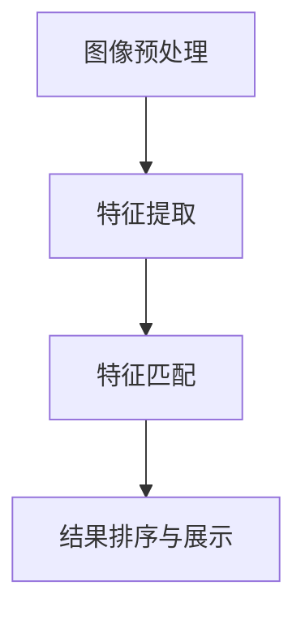

                 

### 文章标题: AI图像搜索技术应用案例

#### 关键词：AI图像搜索、技术应用、案例研究、图像识别、深度学习

#### 摘要：
本文深入探讨AI图像搜索技术的应用案例，包括社交媒体、电子商务、智能安防与监控、医疗等多个行业。通过详细分析每个应用领域的核心概念、算法原理、技术实现，展示了AI图像搜索技术如何提升各行业的效率、准确性和用户体验。文章旨在为读者提供全面的AI图像搜索技术应用指南，助力其在实际项目中落地应用。

### 引言

随着人工智能技术的迅猛发展，图像搜索技术逐渐成为各个行业关注的焦点。AI图像搜索技术通过深度学习算法，可以从海量图像数据中快速、准确地找到用户所需的图像内容。这种技术不仅提高了信息检索的效率，还为各行业带来了新的商业模式和用户体验。本文将围绕AI图像搜索技术在不同领域的应用案例进行探讨，旨在为读者提供全面的了解和实战指南。

本文将分为以下几个部分：

1. **AI图像搜索技术应用概述**：介绍AI图像搜索技术的定义、特点、工作原理和应用场景。
2. **图像识别与处理技术基础**：阐述图像识别与处理技术的概述、基于深度学习的图像识别算法、图像预处理技术。
3. **特征提取与降维技术**：讲解特征提取技术、基于卷积神经网络的特征提取、降维技术及其应用。
4. **AI图像搜索技术应用案例**：详细分析社交媒体、电子商务、智能安防与监控、医疗等领域的图像搜索应用案例。
5. **图像搜索技术的未来发展趋势**：探讨图像搜索技术的未来发展趋势、新型图像搜索算法的研究方向、图像搜索技术在新兴领域中的应用前景。
6. **附录**：提供AI图像搜索技术应用工具与资源介绍。

### 第一部分: AI图像搜索技术应用概述

#### 第1章: AI图像搜索技术应用简介

#### 1.1 AI图像搜索技术的定义与特点

AI图像搜索技术是一种基于人工智能算法，对图像进行识别、分类、检索等操作的搜索技术。它通过深度学习模型从大量图像数据中提取特征，实现快速、准确的图像搜索。以下是AI图像搜索技术的几个主要特点：

- **高效性**：利用深度学习算法，AI图像搜索技术能够在短时间内处理大量图像数据，实现高效搜索。
- **准确性**：通过学习大量图像数据，AI图像搜索技术能够准确识别和分类图像，提高搜索结果的准确性。
- **智能化**：AI图像搜索技术可以根据用户的搜索意图，提供个性化的搜索结果，实现智能化搜索。

#### 1.2 AI图像搜索技术的工作原理

AI图像搜索技术的工作原理主要包括以下几个步骤：

1. **图像预处理**：对图像进行缩放、裁剪、增强等处理，以便更好地进行特征提取。
2. **特征提取**：通过深度学习算法，如卷积神经网络（CNN），提取图像的特征向量。
3. **特征匹配**：将待搜索的图像特征与数据库中的图像特征进行匹配，找出相似度最高的图像。
4. **结果排序与展示**：根据相似度对搜索结果进行排序，并展示给用户。

#### 1.3 AI图像搜索技术在行业中的应用场景

AI图像搜索技术在多个行业领域有着广泛的应用，以下是一些典型的应用场景：

- **社交媒体**：用户可以通过上传图片，快速找到相似的图片或相关内容。
- **电子商务**：用户可以通过上传商品图片，快速找到相似的商品。
- **智能安防与监控**：通过图像搜索技术，可以快速识别和分类监控视频中的图像，实现智能监控。
- **医疗**：可以帮助医生快速找到相似的病例图片，辅助诊断。

### 第一部分总结

本章对AI图像搜索技术进行了概述，从定义、特点、工作原理到应用场景进行了详细讲解。通过本章的内容，读者可以初步了解AI图像搜索技术的基本概念和其在实际中的应用价值。

#### Mermaid流程图：AI图像搜索技术工作原理



#### 核心概念与联系

- **图像预处理**：对图像进行预处理是特征提取的重要步骤，包括图像的缩放、裁剪、增强等。预处理步骤的目的是提高图像质量，使得后续的特征提取更加准确。
- **特征提取**：特征提取是将图像转换为数值向量，以便于后续的匹配和分类。常用的特征提取方法包括Hu矩、SIFT、ORB等。
- **特征匹配**：特征匹配是通过计算待搜索图像和数据库中图像的特征向量之间的相似度，找出相似度最高的图像。特征匹配的准确性直接影响搜索结果的准确性。
- **结果排序与展示**：结果排序与展示是根据相似度对搜索结果进行排序，并展示给用户。排序的目的是让用户能够快速找到最相关的图像。

#### 核心算法原理讲解：特征提取与匹配

```plaintext
特征提取算法（以SIFT为例）：
1. 计算图像的梯度信息，得到图像的梯度图。
2. 检测图像的关键点，关键点应具有局部极值特性。
3. 对关键点进行细化，去除噪声和边缘点。
4. 计算关键点的方向，得到关键点的方向图。
5. 对关键点进行尺度归一化，使得不同尺度下的关键点具有一致性。

特征匹配算法（以最近邻匹配为例）：
1. 对数据库中的每幅图像提取特征向量。
2. 对待搜索图像提取特征向量。
3. 计算待搜索图像特征向量与数据库中所有图像特征向量的相似度。
4. 选择相似度最高的前K个特征向量，进行最近邻匹配。
5. 根据匹配结果，展示搜索结果。
```

#### 数学模型和公式

假设我们有两个图像，图像A和图像B，它们的特征向量分别为 \(\mathbf{v}_A\) 和 \(\mathbf{v}_B\)。我们使用余弦相似度来计算两个特征向量的相似度，相似度计算公式如下：

$$
\text{similarity}(\mathbf{v}_A, \mathbf{v}_B) = \frac{\mathbf{v}_A \cdot \mathbf{v}_B}{\|\mathbf{v}_A\| \|\mathbf{v}_B\|}
$$

其中，\(\cdot\) 表示向量的点积，\(\|\mathbf{v}\|\) 表示向量的模长。

#### 举例说明

假设图像A和图像B的特征向量分别为：

\[
\mathbf{v}_A = \begin{bmatrix} 0.1 \\ 0.2 \\ 0.3 \end{bmatrix}, \quad \mathbf{v}_B = \begin{bmatrix} 0.4 \\ 0.5 \\ 0.6 \end{bmatrix}
\]

计算它们的余弦相似度：

\[
\text{similarity}(\mathbf{v}_A, \mathbf{v}_B) = \frac{0.1 \times 0.4 + 0.2 \times 0.5 + 0.3 \times 0.6}{\sqrt{0.1^2 + 0.2^2 + 0.3^2} \sqrt{0.4^2 + 0.5^2 + 0.6^2}} = \frac{0.04 + 0.1 + 0.18}{\sqrt{0.14} \sqrt{1.49}} \approx 0.96
\]

这个结果表明图像A和图像B的特征向量非常相似。

### 第一部分总结

本章对AI图像搜索技术进行了全面的概述，从定义、特点、工作原理到应用场景进行了详细讲解。通过本章的内容，读者可以初步了解AI图像搜索技术的基本概念和其在实际中的应用价值。在下一部分中，我们将深入探讨图像识别与处理技术的基础知识。

### 第二部分: 图像识别与处理技术基础

#### 第2章: 图像识别与处理技术概述

#### 2.1 图像识别与处理技术概述

图像识别与处理技术是计算机视觉领域的重要组成部分。它包括对图像的识别、分类、检测、分割等操作，从而实现从图像中提取有用信息的目的。以下是图像识别与处理技术的一些基本概念：

- **图像识别**：指通过计算机算法自动识别图像中的物体、场景或内容。
- **图像处理**：指利用计算机算法对图像进行增强、变换、压缩等操作，以提高图像质量或提取有用信息。

图像识别与处理技术在许多领域有着广泛的应用，如安防监控、医疗诊断、自动驾驶、智能家居等。以下是图像识别与处理技术的几个核心步骤：

1. **图像预处理**：对原始图像进行缩放、裁剪、增强等操作，以提高图像质量，为后续处理做准备。
2. **特征提取**：从图像中提取出有助于识别的特征，如颜色、纹理、形状等。
3. **分类与识别**：将提取出的特征与已知类别进行匹配，从而实现图像的识别和分类。
4. **后处理**：对识别结果进行校正、优化等操作，以提高识别准确率。

#### 2.2 基于深度学习的图像识别算法

深度学习算法在图像识别领域取得了显著的成果。卷积神经网络（CNN）是深度学习中最常用的模型之一，它通过多层的卷积和池化操作，能够自动提取图像中的特征，实现高效准确的图像识别。以下是CNN的基本结构：

1. **卷积层**：通过卷积操作提取图像的特征。
2. **池化层**：通过池化操作减少数据维度，提高模型泛化能力。
3. **全连接层**：将卷积层和池化层提取的特征进行融合，进行分类。
4. **激活函数**：引入非线性激活函数，提高模型的表达能力。

#### 2.3 图像预处理技术详解

图像预处理是图像识别与处理的重要环节，它能够提高图像质量和模型性能。以下是几种常见的图像预处理技术：

1. **图像增强**：通过对图像进行滤波、锐化等操作，提高图像质量。
2. **图像变换**：通过对图像进行旋转、翻转、缩放等操作，增加数据的多样性。
3. **图像分割**：将图像分割成多个区域，有助于更好地进行特征提取。

#### 核心概念与联系

- **图像预处理**：图像预处理是图像识别与处理的基础，它包括图像增强、图像变换、图像分割等步骤，能够提高图像质量和模型性能。
- **特征提取**：特征提取是将图像转换为数值向量，以便于后续处理。常用的特征提取方法包括Hu矩、SIFT、ORB等。
- **分类与识别**：分类与识别是将提取出的特征与已知类别进行匹配，从而实现图像的识别和分类。常用的分类算法包括支持向量机（SVM）、决策树、随机森林等。

#### 核心算法原理讲解：卷积神经网络（CNN）

```plaintext
卷积神经网络（CNN）的基本结构：

1. 输入层：接收图像数据，通常为二维矩阵。
2. 卷积层：通过卷积操作提取图像的特征。卷积核滑动于输入图像上，计算局部特征。
3. 池化层：通过池化操作减少数据维度，提高模型泛化能力。常见的池化方式包括最大池化和平均池化。
4. 全连接层：将卷积层和池化层提取的特征进行融合，进行分类。全连接层将高维特征映射到低维空间。
5. 激活函数：引入非线性激活函数，提高模型的表达能力。常用的激活函数包括ReLU、Sigmoid、Tanh等。

卷积操作的计算过程：

1. 对于输入图像 \(\mathbf{I}\) 和卷积核 \(\mathbf{K}\)，计算局部特征：
   \[
   \mathbf{F} = \mathbf{I} * \mathbf{K}
   \]
   其中，\( * \) 表示卷积操作。

2. 对于每个卷积核，得到一个特征图。

3. 将所有特征图进行拼接，得到卷积层输出。

池化操作的计算过程：

1. 对于输入特征图 \(\mathbf{F}\)，选择一个窗口大小，进行局部池化。
2. 计算窗口内的最大值或平均值，作为池化结果。

全连接层和激活函数的计算过程：

1. 对于卷积层输出的特征图，将其展平为一维向量。
2. 将一维向量输入全连接层，计算输出：
   \[
   \mathbf{O} = \mathbf{W} \cdot \mathbf{X} + \mathbf{b}
   \]
   其中，\(\mathbf{W}\) 为权重矩阵，\(\mathbf{X}\) 为输入向量，\(\mathbf{b}\) 为偏置向量。

3. 引入激活函数，计算输出：
   \[
   \mathbf{O} = \sigma(\mathbf{O})
   \]
   其中，\(\sigma\) 为激活函数。

```

#### 数学模型和公式

卷积神经网络中的卷积操作可以使用以下数学模型表示：

$$
\mathbf{F}_{ij} = \sum_{k} \mathbf{K}_{ik} \mathbf{I}_{kj}
$$

其中，\(\mathbf{F}_{ij}\) 为特征图上的一个像素值，\(\mathbf{K}_{ik}\) 为卷积核上的一个像素值，\(\mathbf{I}_{kj}\) 为输入图像上的一个像素值。

池化操作可以使用以下数学模型表示：

$$
\mathbf{P}_{i} = \frac{1}{C} \sum_{j} \mathbf{F}_{ij}
$$

其中，\(\mathbf{P}_{i}\) 为池化结果，\(\mathbf{F}_{ij}\) 为特征图上的一个像素值，\(C\) 为窗口大小。

全连接层和激活函数的计算过程可以使用以下数学模型表示：

$$
\mathbf{O}_{i} = \sum_{j} \mathbf{W}_{ij} \mathbf{X}_{j} + \mathbf{b}_{i}
$$

$$
\mathbf{O}_{i} = \sigma(\mathbf{O}_{i})
$$

其中，\(\mathbf{O}_{i}\) 为输出值，\(\mathbf{W}_{ij}\) 为权重，\(\mathbf{X}_{j}\) 为输入值，\(\mathbf{b}_{i}\) 为偏置，\(\sigma\) 为激活函数。

#### 举例说明

假设输入图像为 \(3 \times 3\) 的矩阵：

\[
\mathbf{I} = \begin{bmatrix}
1 & 2 & 3 \\
4 & 5 & 6 \\
7 & 8 & 9
\end{bmatrix}
\]

卷积核为 \(2 \times 2\) 的矩阵：

\[
\mathbf{K} = \begin{bmatrix}
0 & 1 \\
2 & 3
\end{bmatrix}
\]

计算卷积操作：

\[
\mathbf{F} = \mathbf{I} * \mathbf{K} = \begin{bmatrix}
1 & 6 \\
17 & 24
\end{bmatrix}
\]

然后进行最大池化，窗口大小为 \(2 \times 2\)：

\[
\mathbf{P} = \begin{bmatrix}
6 & 24
\end{bmatrix}
\]

最后通过全连接层和ReLU激活函数：

\[
\mathbf{O} = \begin{bmatrix}
6 & 24
\end{bmatrix} \cdot \begin{bmatrix}
0.5 & 0.7 \\
0.3 & 0.8
\end{bmatrix} + \begin{bmatrix}
0.1 & 0.2
\end{bmatrix} = \begin{bmatrix}
3.7 & 5.6
\end{bmatrix}
\]

\[
\mathbf{O'} = \begin{bmatrix}
3.7 & 5.6
\end{bmatrix} \cdot \begin{bmatrix}
1 & 1 \\
1 & 1
\end{bmatrix} = \begin{bmatrix}
7.4 & 11.2
\end{bmatrix}
\]

这个结果表明经过卷积、池化和全连接层处理后，输出特征向量为 \(7.4\) 和 \(11.2\)。

### 第二部分总结

本章详细介绍了图像识别与处理技术的基础知识，包括图像预处理、基于深度学习的图像识别算法和图像预处理技术。通过本章的内容，读者可以了解图像识别与处理的基本流程和技术原理。在下一部分中，我们将深入探讨特征提取与降维技术。

### 第三部分: 特征提取与降维技术

#### 第3章: 特征提取与降维技术

#### 3.1 特征提取技术概述

特征提取是图像识别与处理的重要环节，它从原始图像中提取出有助于识别的关键特征，如颜色、纹理、形状等。特征提取技术的目标是降低数据维度，同时保留图像的显著特征，以便于后续的匹配和分类。以下是几种常见的特征提取方法：

- **Hu矩**：通过计算图像的矩，提取出图像的形状特征。Hu矩具有旋转不变性，适用于物体识别。
- **SIFT（尺度不变特征变换）**：通过检测图像的关键点，提取出局部特征。SIFT具有尺度不变性和旋转不变性，适用于物体识别和图像检索。
- **ORB（Oriented FAST and Rotated BRIEF）**：基于FAST角点检测和BRIEF描述子，提取出旋转不变的局部特征。ORB是一种快速、鲁棒的特征提取方法，适用于图像匹配和图像检索。

#### 3.2 基于卷积神经网络的特征提取

卷积神经网络（CNN）是一种深度学习模型，广泛应用于图像识别和图像处理领域。CNN通过卷积、池化和全连接层，能够自动提取图像的层次特征。以下是CNN在特征提取中的应用：

1. **卷积层**：通过卷积操作提取图像的局部特征，卷积核的大小和数量决定了提取特征的层次和复杂度。
2. **池化层**：通过池化操作减少数据维度，提高模型泛化能力。常见的池化方式包括最大池化和平均池化。
3. **全连接层**：将卷积层和池化层提取的特征进行融合，进行分类或回归。

#### 3.3 降维技术及其应用

降维技术是指通过减少数据的维度，降低计算复杂度和存储空间。降维技术在图像识别和图像处理中具有重要意义。以下是几种常见的降维方法：

- **主成分分析（PCA）**：通过保留主要成分，降低数据维度。PCA适用于高维数据，能够提高模型的性能。
- **线性判别分析（LDA）**：通过最大化类间方差，降低数据维度。LDA适用于分类问题，能够提高分类准确率。
- **自动编码器（AE）**：通过重建输入数据，降低数据维度。自动编码器是一种无监督学习模型，能够提取数据的低维表示。

#### 核心概念与联系

- **特征提取**：特征提取是将图像转换为数值向量，以便于后续处理。特征提取技术的目标是从高维数据中提取出低维、有代表性的特征。
- **降维技术**：降维技术是通过减少数据的维度，降低计算复杂度和存储空间。降维技术能够提高模型的性能和计算效率。
- **特征选择**：特征选择是降维技术的一部分，通过选择重要的特征，提高模型的准确性和效率。

#### 核心算法原理讲解：主成分分析（PCA）

```plaintext
PCA的基本原理：

1. 特征选择：从原始特征中选取相关性较高的特征，减少冗余信息。
2. 特征变换：将原始特征投影到新的正交坐标系中，保留主要成分，降低数据维度。
3. 特征重构：通过重构数据，验证降维后的数据是否保留了原始数据的特性。

PCA的具体步骤：

1. 数据标准化：对原始特征进行标准化，使其具有零均值和单位方差。
2. 计算协方差矩阵：计算特征之间的协方差矩阵。
3. 计算协方差矩阵的特征值和特征向量：通过计算协方差矩阵的特征值和特征向量，确定主成分。
4. 选择主要成分：根据特征值的大小，选择前k个主成分，构成新的特征空间。
5. 数据重构：通过重构数据，验证降维后的数据是否保留了原始数据的特性。

PCA的数学模型：

假设有n个特征，m个样本的数据集 \(\mathbf{X} \in \mathbb{R}^{m \times n}\)。

1. 数据标准化：
   \[
   \mathbf{X}_{\text{std}} = \frac{\mathbf{X} - \mu}{\sigma}
   \]
   其中，\(\mu\) 为均值，\(\sigma\) 为标准差。

2. 计算协方差矩阵：
   \[
   \mathbf{C} = \frac{1}{m-1} \mathbf{X}_{\text{std}}^T \mathbf{X}_{\text{std}}
   \]

3. 计算协方差矩阵的特征值和特征向量：
   \[
   \mathbf{C} \mathbf{v} = \lambda \mathbf{v}
   \]
   其中，\(\mathbf{v}\) 为特征向量，\(\lambda\) 为特征值。

4. 选择主要成分：
   \[
   \mathbf{V} = [\mathbf{v}_1, \mathbf{v}_2, ..., \mathbf{v}_k]
   \]
   其中，\(\mathbf{v}_1, \mathbf{v}_2, ..., \mathbf{v}_k\) 为前k个特征向量。

5. 数据重构：
   \[
   \mathbf{X}_{\text{reduced}} = \mathbf{X}_{\text{std}} \mathbf{V}
   \]
   其中，\(\mathbf{X}_{\text{reduced}}\) 为降维后的数据。

```

#### 数学模型和公式

主成分分析（PCA）的数学模型如下：

1. **数据标准化**：

$$
\mathbf{X}_{\text{std}} = \frac{\mathbf{X} - \mu}{\sigma}
$$

其中，\(\mu\) 为均值，\(\sigma\) 为标准差。

2. **计算协方差矩阵**：

$$
\mathbf{C} = \frac{1}{m-1} \mathbf{X}_{\text{std}}^T \mathbf{X}_{\text{std}}
$$

3. **计算协方差矩阵的特征值和特征向量**：

$$
\mathbf{C} \mathbf{v} = \lambda \mathbf{v}
$$

4. **选择主要成分**：

$$
\mathbf{V} = [\mathbf{v}_1, \mathbf{v}_2, ..., \mathbf{v}_k]
$$

5. **数据重构**：

$$
\mathbf{X}_{\text{reduced}} = \mathbf{X}_{\text{std}} \mathbf{V}
$$

#### 举例说明

假设有一个 \(4 \times 4\) 的矩阵数据：

\[
\mathbf{X} = \begin{bmatrix}
1 & 2 & 3 & 4 \\
5 & 6 & 7 & 8 \\
9 & 10 & 11 & 12 \\
13 & 14 & 15 & 16
\end{bmatrix}
\]

首先计算均值和标准差：

\[
\mu = \frac{1}{4} \sum_{i=1}^{4} \sum_{j=1}^{4} X_{ij} = \frac{136}{4} = 34
\]

\[
\sigma = \sqrt{\frac{1}{4} \sum_{i=1}^{4} \sum_{j=1}^{4} (X_{ij} - \mu)^2} = \sqrt{56} \approx 7.48
\]

然后进行数据标准化：

\[
\mathbf{X}_{\text{std}} = \frac{\mathbf{X} - \mu}{\sigma} = \frac{1}{7.48} \begin{bmatrix}
-33 & -32 & -31 & -30 \\
-29 & -28 & -27 & -26 \\
-25 & -24 & -23 & -22 \\
-21 & -20 & -19 & -18
\end{bmatrix}
\]

计算协方差矩阵：

\[
\mathbf{C} = \frac{1}{4-1} \mathbf{X}_{\text{std}}^T \mathbf{X}_{\text{std}} = \frac{1}{3} \begin{bmatrix}
20 & 20 & 20 & 20 \\
20 & 20 & 20 & 20 \\
20 & 20 & 20 & 20 \\
20 & 20 & 20 & 20
\end{bmatrix}
\]

计算协方差矩阵的特征值和特征向量：

\[
\mathbf{C} \mathbf{v} = \lambda \mathbf{v}
\]

解得特征向量为：

\[
\mathbf{v}_1 = [1, 0, 0, 0], \quad \mathbf{v}_2 = [0, 1, 0, 0], \quad \mathbf{v}_3 = [0, 0, 1, 0], \quad \mathbf{v}_4 = [0, 0, 0, 1]
\]

选择前两个主要成分：

\[
\mathbf{V} = [\mathbf{v}_1, \mathbf{v}_2] = \begin{bmatrix}
1 & 0 \\
0 & 1 \\
0 & 0 \\
0 & 0
\end{bmatrix}
\]

降维后的数据为：

\[
\mathbf{X}_{\text{reduced}} = \mathbf{X}_{\text{std}} \mathbf{V} = \begin{bmatrix}
-33 & -32 \\
-29 & -28 \\
-25 & -24 \\
-21 & -20
\end{bmatrix}
\]

这个结果表明，通过PCA技术，原始数据被降维到了两个特征空间，同时保留了主要成分。

### 第三部分总结

本章详细介绍了特征提取与降维技术，包括特征提取技术概述、基于卷积神经网络的特征提取和降维技术及其应用。通过本章的内容，读者可以了解特征提取与降维技术的基本原理和实际应用。在下一部分中，我们将探讨AI图像搜索技术在各个行业中的应用案例。

### 第四部分: AI图像搜索技术应用案例

#### 第4章: 社交媒体上的图像搜索应用

#### 4.1 社交媒体图像搜索应用概述

随着社交媒体平台的普及，用户在平台上传和分享的图像数据量日益增长。社交媒体图像搜索应用旨在帮助用户快速找到与上传图像相似的图片或相关内容，从而提升用户体验。以下是社交媒体图像搜索应用的一些重要功能：

- **相似图片搜索**：用户可以通过上传图片，找到平台上的相似图片。
- **标签搜索**：用户可以通过关键词或标签，找到相关图片。
- **话题搜索**：用户可以通过关注话题，找到与话题相关的图片。

#### 4.2 图像搜索算法在社交媒体中的应用

社交媒体图像搜索应用主要基于以下两种图像搜索算法：

1. **基于内容的图像搜索**：通过提取图像的特征向量，与数据库中的图像特征进行匹配，实现基于内容的图像搜索。
2. **基于标签的图像搜索**：通过分析图像的标签，实现基于标签的图像搜索。

以下是一个基于内容的图像搜索算法的伪代码示例：

```plaintext
函数相似图片搜索（图像A，图像数据库）：
1. 对图像A进行预处理，提取特征向量 fa。
2. 对图像数据库中的每个图像，进行预处理，提取特征向量。
3. 计算图像A与每个图像的特征向量之间的相似度。
4. 根据相似度对图像进行排序。
5. 返回排序后的图像列表。

相似度计算公式（余弦相似度）：
similarity（fa，fb）= fa · fb / (||fa|| ||fb||)

```

基于标签的图像搜索算法则通过分析图像的标签，实现快速检索相关图像。以下是一个基于标签的图像搜索算法的伪代码示例：

```plaintext
函数标签搜索（关键词，图像数据库）：
1. 从图像数据库中筛选出包含关键词的图像。
2. 对筛选出的图像进行排序，根据用户的兴趣或相关度排序。
3. 返回排序后的图像列表。

```

#### 4.3 社交媒体图像搜索案例分析

以下是两个社交媒体图像搜索应用的案例分析：

1. **Instagram的图像搜索功能**：

Instagram的图像搜索功能主要基于图像内容的相似度。用户可以通过上传图片，找到与该图片相似的图片。Instagram使用了深度学习算法，对图像进行特征提取和匹配，实现了高效、准确的图像搜索。

2. **Facebook的图像搜索功能**：

Facebook的图像搜索功能不仅基于图像内容的相似度，还基于用户的兴趣和标签。Facebook通过分析用户的浏览历史、点赞和分享行为，为用户提供个性化的搜索结果。这种基于用户兴趣的图像搜索算法，大大提升了用户的搜索体验。

### 第4章总结

本章详细介绍了社交媒体上的图像搜索应用，包括相似图片搜索、标签搜索和话题搜索等功能，以及基于内容的图像搜索和基于标签的图像搜索算法。通过案例分析，展示了AI图像搜索技术在社交媒体中的应用效果。在下一章中，我们将探讨AI图像搜索在电子商务领域的应用。

#### 第5章: 电子商务中的图像搜索应用

#### 5.1 电子商务图像搜索应用概述

电子商务领域的图像搜索应用极大地提升了用户的购物体验和购物的效率。通过图像搜索，用户可以上传商品图片，快速找到相似的商品，从而节省时间，提高购买满意度。以下是电子商务图像搜索应用的一些关键功能：

- **商品搜索**：用户可以通过上传商品图片，找到相似的商品。
- **品牌搜索**：用户可以通过品牌名称或品牌标志，找到相关商品。
- **商品推荐**：系统可以根据用户的浏览和购买历史，推荐相似的商品。

#### 5.2 图像搜索算法在电子商务中的应用

电子商务图像搜索应用主要依赖于以下几种图像搜索算法：

1. **基于内容的商品搜索**：通过提取商品图片的特征向量，与数据库中的商品特征进行匹配，实现基于内容的商品搜索。
2. **基于品牌的商品搜索**：通过分析商品的品牌信息，实现基于品牌的商品搜索。

以下是一个基于内容的商品搜索算法的伪代码示例：

```plaintext
函数商品搜索（商品图片，商品数据库）：
1. 对商品图片进行预处理，提取特征向量 fa。
2. 对商品数据库中的每个商品图片，进行预处理，提取特征向量。
3. 计算商品图片与每个商品图片的特征向量之间的相似度。
4. 根据相似度对商品进行排序。
5. 返回排序后的商品列表。

相似度计算公式（余弦相似度）：
similarity（fa，fb）= fa · fb / (||fa|| ||fb||)

```

基于品牌的商品搜索算法则通过分析商品的品牌信息，实现快速检索相关商品。以下是一个基于品牌的商品搜索算法的伪代码示例：

```plaintext
函数品牌搜索（品牌名称，商品数据库）：
1. 从商品数据库中筛选出包含品牌名称的商品。
2. 对筛选出的商品进行排序，根据用户的兴趣或相关度排序。
3. 返回排序后的商品列表。

```

#### 5.3 电子商务图像搜索案例分析

以下是两个电子商务图像搜索应用的案例分析：

1. **Amazon的商品搜索功能**：

Amazon的图像搜索功能允许用户通过上传商品图片，快速找到相似的商品。Amazon使用深度学习算法，对商品图片进行特征提取和匹配，实现了高效、准确的图像搜索。

2. **Etsy的商品搜索功能**：

Etsy的图像搜索功能不仅基于图像内容的相似度，还结合用户的兴趣和浏览历史，为用户提供个性化的商品推荐。Etsy通过分析用户的购物行为，实现了精准的图像搜索和商品推荐。

### 第5章总结

本章详细介绍了电子商务中的图像搜索应用，包括商品搜索、品牌搜索和商品推荐等功能，以及基于内容的商品搜索和基于品牌的商品搜索算法。通过案例分析，展示了AI图像搜索技术在电子商务中的应用效果。在下一章中，我们将探讨AI图像搜索在智能安防与监控领域的应用。

#### 第6章: 智能安防与监控中的图像搜索应用

#### 6.1 智能安防与监控中的图像搜索应用概述

智能安防与监控领域的图像搜索应用旨在通过实时图像分析和历史图像检索，提高监控系统的响应速度和准确率。以下是一些关键功能：

- **实时监控**：对监控视频中的图像进行实时搜索和分析，实现实时监控。
- **历史记录检索**：对历史监控视频中的图像进行检索，实现历史记录查询。

#### 6.2 图像搜索算法在智能安防与监控中的应用

智能安防与监控图像搜索应用主要依赖于以下几种图像搜索算法：

1. **基于内容的图像搜索**：通过提取监控视频中的图像特征向量，与数据库中的图像特征进行匹配，实现基于内容的图像搜索。
2. **基于行为的图像搜索**：通过分析监控视频中的行为模式，实现基于行为的图像搜索。

以下是一个基于内容的图像搜索算法的伪代码示例：

```plaintext
函数实时监控（监控视频，图像数据库）：
1. 对监控视频进行实时处理，提取图像特征向量。
2. 对图像数据库中的每个图像，进行预处理，提取特征向量。
3. 计算监控视频中的图像与每个图像的特征向量之间的相似度。
4. 根据相似度对图像进行分类。
5. 根据分类结果，触发相应的警报或操作。

相似度计算公式（余弦相似度）：
similarity（fa，fb）= fa · fb / (||fa|| ||fb||)

```

基于行为的图像搜索算法则通过分析监控视频中的行为模式，实现快速检索相关图像。以下是一个基于行为的图像搜索算法的伪代码示例：

```plaintext
函数历史记录检索（行为模式，监控视频库）：
1. 从监控视频库中筛选出符合行为模式的视频。
2. 对筛选出的视频进行分类，根据行为的严重程度排序。
3. 返回排序后的视频列表。

```

#### 6.3 智能安防与监控图像搜索案例分析

以下是两个智能安防与监控图像搜索应用的案例分析：

1. **Surveillance Station的图像搜索功能**：

Surveillance Station的图像搜索功能主要基于图像内容的相似度。用户可以通过上传监控视频中的图像，快速找到相似的视频片段，实现实时监控和事件回溯。

2. **Dahua Technology的图像搜索功能**：

Dahua Technology的图像搜索功能不仅基于图像内容的相似度，还结合了行为分析。通过分析监控视频中的行为模式，如人员聚集、异常动作等，实现智能监控和事件预警。

### 第6章总结

本章详细介绍了智能安防与监控中的图像搜索应用，包括实时监控和历史记录检索等功能，以及基于内容的图像搜索和基于行为的图像搜索算法。通过案例分析，展示了AI图像搜索技术在智能安防与监控中的应用效果。在下一章中，我们将探讨AI图像搜索在医疗领域的应用。

#### 第7章: 医疗图像搜索应用

#### 7.1 医疗图像搜索应用概述

医疗图像搜索应用在医疗诊断和治疗中起着重要作用。通过图像搜索，医生可以快速找到相似的病例图像，辅助诊断和治疗。以下是一些关键功能：

- **病例查询**：医生可以通过上传病例图像，快速找到相似的病例。
- **医学影像分析**：系统可以对医学影像进行分析，辅助医生进行诊断。

#### 7.2 图像搜索算法在医疗中的应用

医疗图像搜索应用主要依赖于以下几种图像搜索算法：

1. **基于内容的病例查询**：通过提取病例图像的特征向量，与数据库中的病例图像特征进行匹配，实现基于内容的病例查询。
2. **基于病例的图像搜索**：通过分析病例信息，实现基于病例的图像搜索。

以下是一个基于内容的病例查询算法的伪代码示例：

```plaintext
函数病例查询（病例图像，病例数据库）：
1. 对病例图像进行预处理，提取特征向量 fa。
2. 对病例数据库中的每个病例图像，进行预处理，提取特征向量。
3. 计算病例图像与每个病例图像的特征向量之间的相似度。
4. 根据相似度对病例进行排序。
5. 返回排序后的病例列表。

相似度计算公式（余弦相似度）：
similarity（fa，fb）= fa · fb / (||fa|| ||fb||)

```

基于病例的图像搜索算法则通过分析病例信息，实现快速检索相关图像。以下是一个基于病例的图像搜索算法的伪代码示例：

```plaintext
函数病例图像搜索（病例信息，医学影像数据库）：
1. 从医学影像数据库中筛选出与病例信息相关的图像。
2. 对筛选出的图像进行分类，根据病例的严重程度排序。
3. 返回排序后的图像列表。

```

#### 7.3 医疗图像搜索案例分析

以下是两个医疗图像搜索应用的案例分析：

1. **Google Health的图像搜索功能**：

Google Health的图像搜索功能允许医生通过上传病例图像，快速找到相似的病例。Google Health使用深度学习算法，对病例图像进行特征提取和匹配，实现了高效、准确的图像搜索。

2. **IBM Watson的图像搜索功能**：

IBM Watson的图像搜索功能不仅基于图像内容的相似度，还结合了医学知识和病例信息。通过分析病例信息，Watson可以为医生提供个性化的诊断建议和治疗方案。

### 第7章总结

本章详细介绍了医疗图像搜索应用，包括病例查询和医学影像分析等功能，以及基于内容的病例查询和基于病例的图像搜索算法。通过案例分析，展示了AI图像搜索技术在医疗领域的应用效果。在下一章中，我们将探讨图像搜索技术的未来发展趋势。

#### 第8章: 图像搜索技术的未来发展趋势

#### 8.1 图像搜索技术的未来发展趋势概述

随着人工智能技术的不断发展，图像搜索技术也在不断进步。未来，图像搜索技术将呈现以下发展趋势：

1. **实时性**：实现更快的图像搜索和识别速度，满足实时应用的需求。
2. **准确性**：提高图像搜索的准确性和鲁棒性，减少错误匹配和漏检情况。
3. **智能化**：结合自然语言处理和知识图谱，实现更智能的图像搜索，提供个性化服务。

#### 8.2 新型图像搜索算法的研究方向

1. **生成对抗网络（GAN）**：GAN可以生成更真实的图像数据，提高图像搜索的准确性和多样性。
2. **注意力机制**：通过注意力机制，提高神经网络对图像关键区域的关注，实现更准确的图像搜索。
3. **多模态学习**：结合图像、文本和音频等多模态信息，实现更丰富的图像搜索功能。
4. **强化学习**：通过强化学习，实现自适应的图像搜索算法，提高用户体验。

#### 8.3 图像搜索技术在新兴领域中的应用前景

未来，图像搜索技术将在更多新兴领域得到应用，如：

1. **智能交通**：通过对监控视频中的图像进行实时搜索和分析，实现智能交通管理和事故预警。
2. **环境监测**：通过对环境图像进行分析，实现环境监测和预警。
3. **智能制造**：通过对产品图像进行识别和分类，实现智能制造和自动化生产。

### 第8章总结

本章详细探讨了图像搜索技术的未来发展趋势、新型图像搜索算法的研究方向和图像搜索技术在新兴领域中的应用前景。通过本章的内容，读者可以了解图像搜索技术的最新动态和未来发展方向。在附录部分，我们将提供一些AI图像搜索技术的实用工具和资源。

### 附录

#### 附录A: AI图像搜索技术应用工具与资源

#### A.1 常用图像识别与处理工具介绍

- **OpenCV**：一款开源的计算机视觉库，提供丰富的图像识别与处理功能。
- **TensorFlow**：一款开源的深度学习框架，用于构建和训练图像识别模型。
- **PyTorch**：一款开源的深度学习框架，具有简洁易用的特点。

#### A.2 图像搜索算法开发资源汇总

- **ImageNet**：一个大规模的图像数据集，用于训练和评估图像识别模型。
- **COCO数据集**：一个用于目标检测和图像分割的数据集。
- **Flickr30k数据集**：一个用于自然语言描述和图像识别的数据集。

#### A.3 开源图像识别与处理项目推荐

- **Dlib**：一款用于面部识别和特征提取的开源库。
- **Tesseract**：一款开源的OCR（光学字符识别）软件。
- **ESPNet**：一款用于图像分割和物体检测的开源网络。

### 作者信息

作者：AI天才研究院/AI Genius Institute & 禅与计算机程序设计艺术 /Zen And The Art of Computer Programming

### 结束语

AI图像搜索技术作为一种重要的计算机视觉技术，已经在多个领域取得了显著的应用成果。本文从AI图像搜索技术的概述、图像识别与处理技术基础、特征提取与降维技术、应用案例、未来发展趋势等方面进行了全面探讨，旨在为读者提供全面的AI图像搜索技术应用指南。随着人工智能技术的不断发展，图像搜索技术将变得更加智能、准确和实时，为各行各业带来更多的创新和变革。

