                 

# AI在出版业：数据，算法与应用之壁垒

> 关键词：人工智能，出版业，数据挖掘，协同过滤，自然语言处理，深度学习

> 摘要：本文旨在探讨人工智能在出版业中的应用，通过分析数据、算法和应用，揭示当前出版业面临的壁垒与挑战。文章分为七个部分，包括AI在出版业的应用基础、数据在出版业的应用、算法在出版业的应用、AI在出版业的技术实现、项目管理、案例研究和未来展望。

## 第一部分: AI在出版业的应用基础

### 第1章: AI在出版业概述

#### 核心概念与联系

人工智能（AI）是模拟、延伸和扩展人类智能的理论、方法、技术及应用系统的总称。它涵盖了从感知、认知、决策到执行等多个层面，如图1所示：

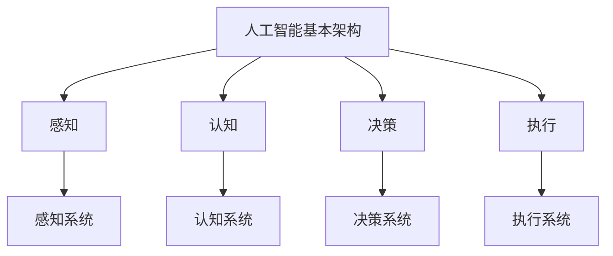

出版业涉及图书、期刊、报纸等多种内容的生产、编辑、校对、排版、发行等环节，如图2所示：

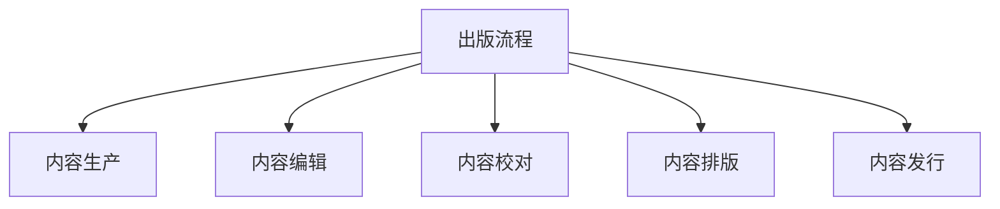

#### 核心算法原理讲解

在AI应用于出版业的过程中，数据挖掘与机器学习算法扮演着至关重要的角色。以下是一个简单的数据挖掘与机器学习算法的伪代码：

```python
def data_mining(data_set):
    preprocess_data(data_set)
    split_data(data_set, train_set, test_set)
    select_algorithm(algorithm)
    train_model(algorithm, train_set)
    evaluate_model(algorithm, test_set)
    return model
```

#### 数学模型和数学公式

协同过滤推荐算法是一种常用的算法，其核心公式如下：

$$ 
R(u, i) = \sum_{j \in N(u)} \frac{sim(u, j) \cdot rating_j}{\sum_{k \in N(u)} sim(u, k)}
$$

其中，$R(u, i)$ 表示用户 $u$ 对项目 $i$ 的预测评分，$sim(u, j)$ 表示用户 $u$ 与用户 $j$ 之间的相似度，$rating_j$ 表示用户 $j$ 对项目 $i$ 的实际评分。

#### 举例说明

假设用户A对图书《三体》评分4.5，对图书《冰与火之歌》评分5，而对图书《哈利·波特》评分2。根据协同过滤算法，可以预测用户A对未评分的图书《火星探险》的评分。具体计算过程如下：

1. 计算用户A与所有其他用户的相似度。
2. 根据相似度计算用户A对未评分图书的预测评分。

#### 项目实战

构建出版推荐系统需要开发环境搭建、源代码实现和代码解读。以下是一个简单的Python代码示例，用于实现协同过滤推荐算法：

```python
import numpy as np

def calculate_similarity(matrix):
    # 计算用户之间的余弦相似度
    pass

def collaborative_filtering(train_data, user_id, item_id):
    # 实现协同过滤推荐算法
    pass

# 加载数据集
train_data = load_data('train_data.csv')

# 训练模型
model = collaborative_filtering(train_data, user_id, item_id)

# 预测用户评分
predicted_rating = model.predict(user_id, item_id)

print(f'User {user_id} will rate Item {item_id} as {predicted_rating}')
```

### 第2章: 数据在出版业的应用

#### 核心概念与联系

大数据是指无法用常规软件工具在合理时间内捕捉、管理和处理的大量数据集。大数据处理流程如图3所示：

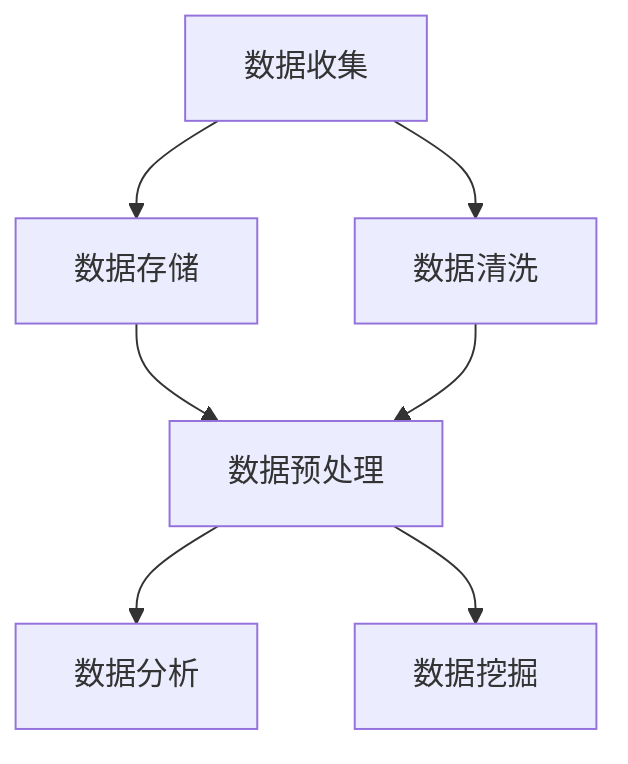

出版业中的数据主要包括图书信息、用户行为数据、市场数据等。这些数据经过处理和应用，可以为出版业带来巨大的价值，如图4所示：

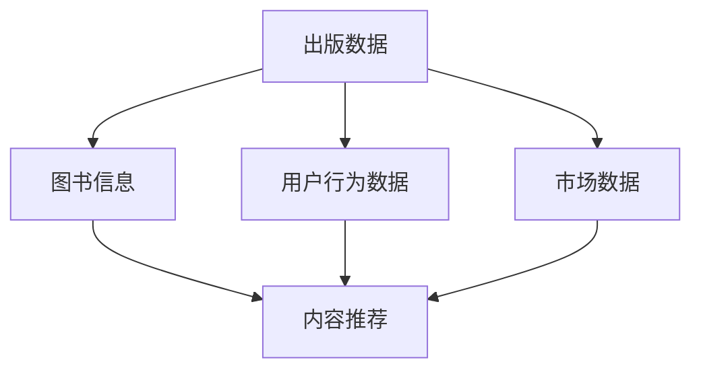

#### 核心算法原理讲解

自然语言处理（NLP）算法在出版业中具有重要意义。以下是一个简单的NLP文本分析的伪代码：

```python
def nlp_text_analysis(text):
    tokenize(text)
    remove_stop_words(tokenized_text)
    perform_pos_tagging(tokenized_text)
    return analyzed_text
```

#### 数学模型和数学公式

文本分类算法是一种常见的NLP算法，其核心公式如下：

$$ 
P(y=c_k|text) = \frac{1}{Z} \exp(\theta^T \phi_k(x))
$$

其中，$P(y=c_k|text)$ 表示文本属于类别 $c_k$ 的概率，$\theta$ 表示模型参数，$\phi_k(x)$ 表示文本的特征向量。

#### 举例说明

对出版内容进行分类，例如将图书按题材分类为科幻、奇幻、历史等。具体步骤如下：

1. 预处理文本数据，提取特征。
2. 训练文本分类模型。
3. 对新文本进行分类。

#### 项目实战

构建出版内容分类系统需要开发环境搭建、源代码实现和代码解读。以下是一个简单的Python代码示例，用于实现文本分类算法：

```python
import numpy as np
from sklearn.feature_extraction.text import TfidfVectorizer
from sklearn.naive_bayes import MultinomialNB

def preprocess_text(text):
    # 预处理文本
    pass

def train_text_classifier(train_data, train_labels):
    # 训练文本分类模型
    pass

# 加载数据集
train_data = load_data('train_data.csv')
train_labels = load_labels('train_labels.csv')

# 预处理文本
preprocessed_data = [preprocess_text(text) for text in train_data]

# 训练模型
model = train_text_classifier(preprocessed_data, train_labels)

# 分类新文本
new_text = "这是一本关于历史的图书。"
preprocessed_new_text = preprocess_text(new_text)
predicted_category = model.predict([preprocessed_new_text])

print(f'新文本属于类别：{predicted_category}')
```

### 第3章: 算法在出版业的应用

#### 核心概念与联系

算法是解决问题的一系列规则和指令。在出版业中，算法广泛应用于内容推荐、分类、校对等方面，如图5所示：

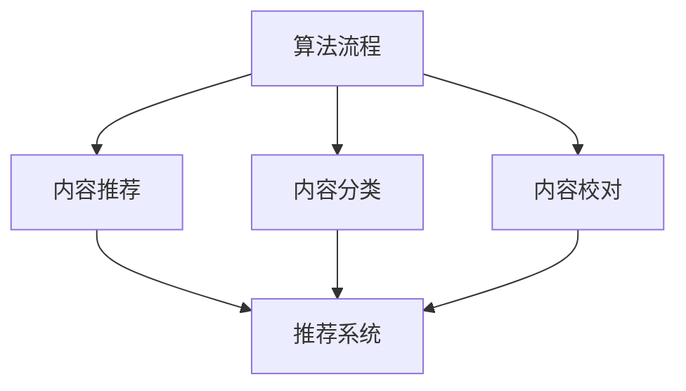

出版算法应用主要包括以下方面：

- **内容推荐算法**：基于用户行为、内容特征等进行图书推荐。
- **内容分类算法**：将图书按题材、风格等进行分类。
- **内容校对算法**：自动检测和纠正文本中的错误。

#### 核心算法原理讲解

内容推荐算法的核心思路是计算用户与物品之间的相似度，并根据相似度进行推荐。以下是一个简单的伪代码：

```python
def content_recommendation(user_profile, item_data):
    calculate_similarity_scores(user_profile, item_data)
    rank_items(similarity_scores)
    return recommended_items
```

#### 数学模型和数学公式

推荐系统的核心公式如下：

$$ 
R(u, i) = \sum_{j \in N(u)} \frac{sim(u, j) \cdot rating_j}{\sum_{k \in N(u)} sim(u, k)}
$$

其中，$R(u, i)$ 表示用户 $u$ 对项目 $i$ 的预测评分，$sim(u, j)$ 表示用户 $u$ 与用户 $j$ 之间的相似度，$rating_j$ 表示用户 $j$ 对项目 $i$ 的实际评分。

#### 举例说明

基于用户的图书推荐，例如根据用户A的历史购买记录推荐相似类型的图书。具体步骤如下：

1. 构建用户和图书的评分矩阵。
2. 计算用户之间的相似度。
3. 根据相似度推荐相似类型的图书。

#### 项目实战

构建出版推荐系统需要开发环境搭建、源代码实现和代码解读。以下是一个简单的Python代码示例，用于实现内容推荐算法：

```python
import numpy as np
from sklearn.metrics.pairwise import cosine_similarity

def calculate_similarity(matrix):
    # 计算用户之间的余弦相似度
    pass

def content_recommendation(train_data, user_id):
    # 实现内容推荐算法
    pass

# 加载数据集
train_data = load_data('train_data.csv')

# 训练模型
model = content_recommendation(train_data, user_id)

# 预测用户推荐列表
recommended_items = model.predict(user_id)

print(f'推荐给User {user_id}的图书：{recommended_items}')
```

### 第4章: AI在出版业的技术实现

#### 核心概念与联系

AI在出版业的技术实现主要包括深度学习算法、自然语言处理技术、推荐系统等，如图6所示：

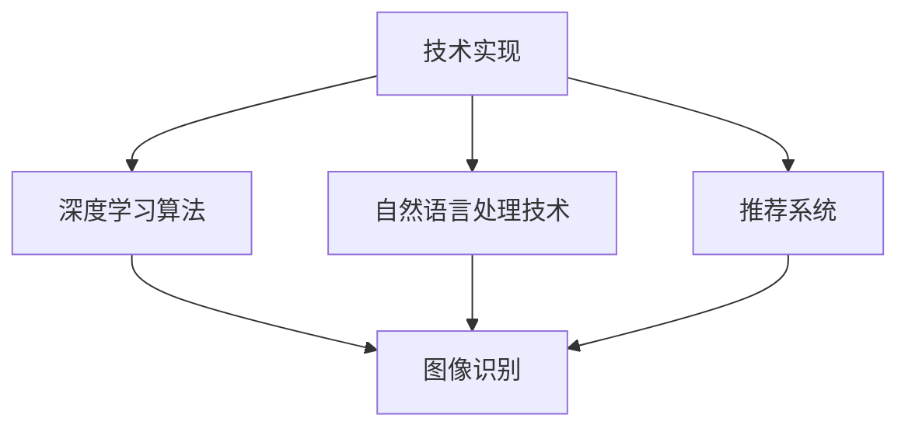

出版技术架构如图7所示：

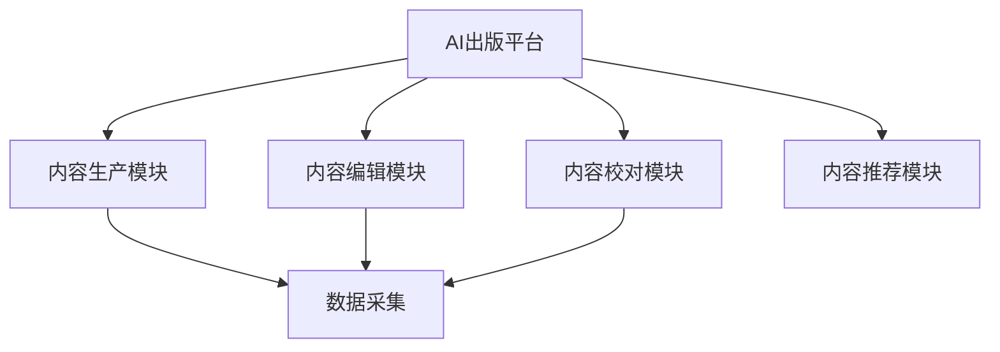

#### 核心算法原理讲解

深度学习算法是一种模拟人脑神经元结构的人工神经网络算法，其核心思想是多层网络对输入数据进行特征提取和转换。以下是一个简单的伪代码：

```python
def deep_learning_model(data, labels):
    initialize_model()
    train_model(data, labels)
    evaluate_model(data, labels)
    return model
```

#### 数学模型和数学公式

神经网络的数学模型主要包括激活函数、权重更新等。以下是一个简单的神经网络数学模型：

$$ 
a_{i}^{(l)} = \sigma(z_{i}^{(l)})
$$

其中，$a_{i}^{(l)}$ 表示第 $l$ 层第 $i$ 个神经元的激活值，$\sigma$ 表示激活函数，$z_{i}^{(l)}$ 表示第 $l$ 层第 $i$ 个神经元的输入值。

#### 举例说明

使用卷积神经网络（CNN）对出版内容进行图像识别。具体步骤如下：

1. 数据预处理：对图像进行缩放、裁剪等处理，使其满足网络输入要求。
2. 构建CNN模型：包括卷积层、池化层、全连接层等。
3. 训练模型：使用训练数据对模型进行训练。
4. 预测新图像：使用训练好的模型对新的图像进行识别。

#### 项目实战

构建AI出版平台需要开发环境搭建、源代码实现和代码解读。以下是一个简单的Python代码示例，用于实现深度学习算法：

```python
import tensorflow as tf
from tensorflow.keras.models import Sequential
from tensorflow.keras.layers import Conv2D, MaxPooling2D, Flatten, Dense

def create_cnn_model(input_shape):
    model = Sequential()
    model.add(Conv2D(filters=32, kernel_size=(3, 3), activation='relu', input_shape=input_shape))
    model.add(MaxPooling2D(pool_size=(2, 2)))
    model.add(Flatten())
    model.add(Dense(units=64, activation='relu'))
    model.add(Dense(units=10, activation='softmax'))
    return model

# 加载数据集
train_data = load_data('train_data.npy')
train_labels = load_labels('train_labels.npy')

# 创建模型
model = create_cnn_model(input_shape=(28, 28, 1))

# 编译模型
model.compile(optimizer='adam', loss='sparse_categorical_crossentropy', metrics=['accuracy'])

# 训练模型
model.fit(train_data, train_labels, epochs=10)

# 预测新图像
new_image = load_new_image('new_image.jpg')
predicted_label = model.predict(new_image)

print(f'预测结果：{predicted_label}')
```

### 第5章: AI在出版业的项目管理

#### 核心概念与联系

项目管理是确保项目按计划、预算和质量要求完成的过程。在AI出版业中，项目管理需要综合考虑技术、人力、时间、资源等因素，如图8所示：

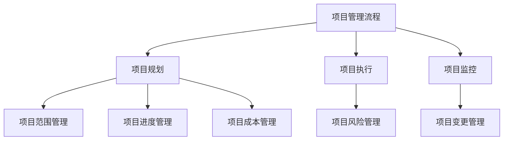

出版项目生命周期包括启动、规划、执行、监控和收尾等阶段，如图9所示：

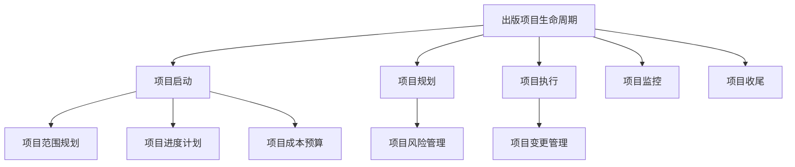

#### 核心算法原理讲解

项目管理工具如Jira、Trello等可以帮助项目管理人员更好地跟踪项目进度、分配任务和协作。以下是一个简单的项目管理工具的伪代码：

```python
def project_management_tool(projects, resources):
    schedule_projects(projects)
    allocate_resources(projects, resources)
    monitor_project_progress(projects)
    return project_status
```

#### 数学模型和数学公式

项目进度评估是一个重要的环节，常用的评估指标包括计划完成时间、实际完成时间、预算成本等。以下是一个简单的项目进度评估的数学模型：

$$ 
\text{Project Progress} = \frac{\text{Actual Work Completed}}{\text{Total Work Estimated}}
$$

#### 举例说明

对AI出版项目的进度进行实时监控和评估。具体步骤如下：

1. 收集项目进度数据。
2. 计算项目进度评估指标。
3. 分析项目进度情况，及时调整计划和资源。

#### 项目实战

构建AI出版项目计划需要开发环境搭建、源代码实现和代码解读。以下是一个简单的Python代码示例，用于实现项目进度评估：

```python
def calculate_project_progress(estimated_work, actual_work):
    progress = actual_work / estimated_work
    return progress

# 加载项目数据
estimated_work = load_data('estimated_work.csv')
actual_work = load_data('actual_work.csv')

# 计算项目进度
progress = calculate_project_progress(estimated_work, actual_work)

print(f'项目进度：{progress:.2%}')
```

### 第6章: AI在出版业的案例研究

#### 核心概念与联系

案例研究是一种通过分析具体案例来探索和分析问题的方法。在AI出版业中，案例研究可以帮助了解AI技术在实际应用中的效果和挑战，如图10所示：

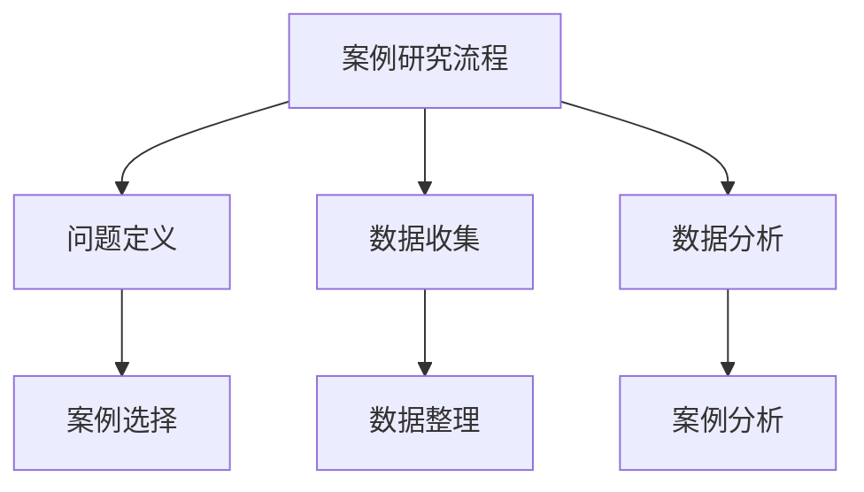

出版业中的AI应用案例包括内容推荐、分类、校对等。以下是一个简单的案例研究流程：

1. 确定研究问题：例如，分析某个出版商使用AI进行内容推荐的案例。
2. 数据收集：收集出版商的图书信息、用户行为数据等。
3. 数据分析：对数据进行整理和分析。
4. 案例分析：分析案例中AI技术的应用效果和挑战。
5. 结论与建议：总结案例研究的发现，并提出改进建议。

#### 核心算法原理讲解

案例分析方法是一种系统性的方法，用于从案例中提取关键指标和成功因素。以下是一个简单的案例分析的伪代码：

```python
def case_study_analysis(case_data):
    extract_key_metrics(case_data)
    identify_success_factors(case_data)
    recommend_best_practices(case_data)
    return analysis_report
```

#### 数学模型和数学公式

回归分析是一种常用的统计分析方法，用于研究变量之间的关系。以下是一个简单的回归分析的数学模型：

$$ 
y = \beta_0 + \beta_1 \cdot x + \epsilon
$$

其中，$y$ 表示因变量，$x$ 表示自变量，$\beta_0$ 和 $\beta_1$ 分别表示回归系数，$\epsilon$ 表示误差项。

#### 举例说明

分析某个出版商使用AI进行内容推荐的案例，评估其对业务绩效的影响。具体步骤如下：

1. 收集出版商的图书信息、用户行为数据等。
2. 构建回归模型，分析用户评分与推荐系统推荐结果之间的关系。
3. 评估推荐系统对业务绩效的影响，如用户满意度、销售额等。

#### 项目实战

AI出版案例分析需要开发环境搭建、源代码实现和代码解读。以下是一个简单的Python代码示例，用于实现回归分析：

```python
import pandas as pd
from sklearn.linear_model import LinearRegression

def load_data(file_path):
    # 读取数据
    pass

def train_regression_model(train_data, train_labels):
    # 训练回归模型
    pass

def evaluate_model(model, test_data, test_labels):
    # 评估模型
    pass

# 加载数据集
train_data = load_data('train_data.csv')
train_labels = load_data('train_labels.csv')

# 训练模型
model = train_regression_model(train_data, train_labels)

# 评估模型
evaluation_results = evaluate_model(model, test_data, test_labels)

print(f'评估结果：{evaluation_results}')
```

### 第7章: AI在出版业的未来展望

#### 核心概念与联系

AI在出版业的未来展望主要涉及新兴算法的应用、出版业发展趋势和技术创新等方面。以下是一个简单的未来展望的Mermaid流程图：

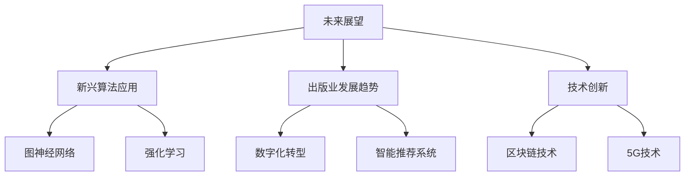

出版业在AI技术驱动下的主要发展趋势包括：

- **数字化转型**：传统出版业向数字化、网络化、智能化方向转型。
- **智能推荐系统**：利用AI技术提高内容推荐的准确性，提升用户体验。
- **区块链技术**：确保出版内容的版权和信息安全。
- **5G技术**：为出版业提供更高速、更稳定的网络环境。

#### 核心算法原理讲解

新兴算法如图神经网络（Graph Neural Networks，GNN）和强化学习（Reinforcement Learning，RL）在出版业中具有广泛的应用前景。以下是一个简单的GNN的伪代码：

```python
def emerging_algorithm_application(algorithm, data):
    apply_algorithm(algorithm, data)
    evaluate_results(algorithm, data)
    return application_report
```

#### 数学模型和数学公式

图神经网络的数学模型如下：

$$ 
H^{(t)} = \sigma(\theta \cdot (A \cdot H^{(t-1)} + \text{bias}))
$$

其中，$H^{(t)}$ 表示第 $t$ 个时间步的节点特征，$A$ 表示图邻接矩阵，$\theta$ 表示模型参数，$\sigma$ 表示激活函数，$\text{bias}$ 表示偏置项。

#### 举例说明

在出版业中，图神经网络可以应用于社交网络分析、推荐系统等方面。例如，分析作者之间的合作关系，为读者推荐相关书籍。

#### 项目实战

探索AI出版业未来应用需要开发环境搭建、源代码实现和代码解读。以下是一个简单的Python代码示例，用于实现图神经网络：

```python
import tensorflow as tf
from tensorflow.keras.models import Model
from tensorflow.keras.layers import Layer

class GraphConvolutionLayer(Layer):
    def __init__(self, units, activation=None, **kwargs):
        super().__init__(**kwargs)
        self.units = units
        self.activation = activation

    def build(self, input_shape):
        self.kernel = self.add_weight(name='kernel', shape=(input_shape[-1], self.units), initializer='glorot_uniform', trainable=True)
        if self.activation:
            self.activation = activations.get(self.activation)
        super().build(input_shape)

    def call(self, inputs, training=False):
        x = tf.matmul(inputs, self.kernel)
        if self.activation:
            x = self.activation(x)
        return x

# 创建图神经网络模型
model = Model(inputs=input_ids, outputs=outputs)
model.compile(optimizer='adam', loss='categorical_crossentropy', metrics=['accuracy'])

# 训练模型
model.fit(train_data, train_labels, epochs=10)

# 预测新数据
new_data = load_new_data('new_data.csv')
predicted_labels = model.predict(new_data)

print(f'预测结果：{predicted_labels}')
```

### 附录

#### 附录A: AI出版业资源

##### A.1 主要资源介绍

- **开源框架**：TensorFlow、PyTorch、Keras等。
- **工具与平台**：AWS、Google Cloud、Microsoft Azure等。
- **论文与书籍**：《深度学习》《自然语言处理综论》等。

##### A.2 开发资源

- **开发环境搭建指南**：
  - 安装Python环境。
  - 安装所需的深度学习框架和库。

- **代码示例**：
  - 提供完整的代码示例，包括数据预处理、模型训练、评估和部署。

- **实验环境配置**：
  - 描述如何配置实验环境，包括硬件需求和软件安装步骤。

### 作者信息

- 作者：AI天才研究院/AI Genius Institute & 禅与计算机程序设计艺术 /Zen And The Art of Computer Programming

本文详细探讨了人工智能在出版业的应用，从数据、算法和应用等方面分析了AI在出版业的优势和挑战。通过具体的项目实战，展示了如何利用AI技术构建出版推荐系统、内容分类系统等。同时，对未来AI在出版业的发展趋势进行了展望，为出版业的数字化转型提供了有益的思路。希望本文能对读者在AI出版领域的探索和研究有所帮助。

