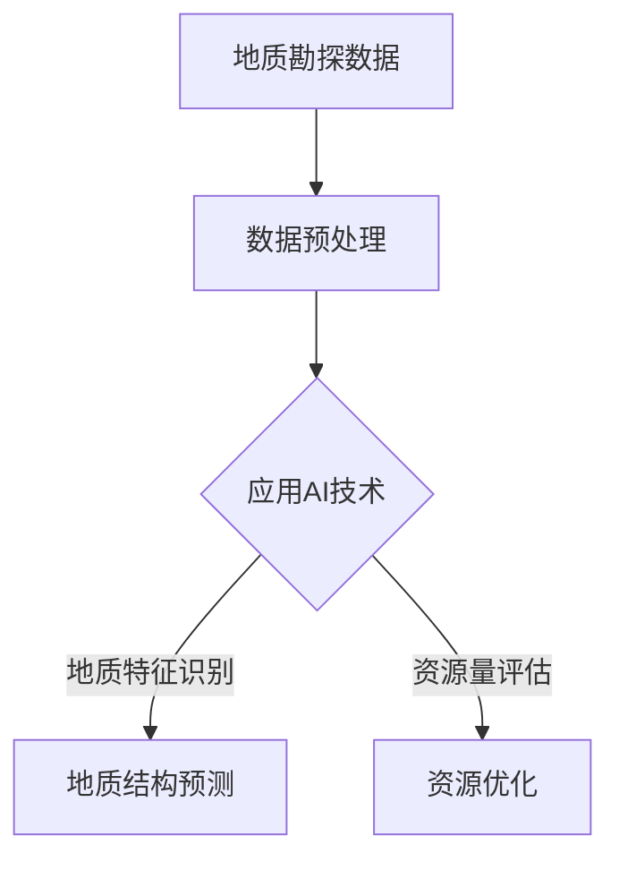
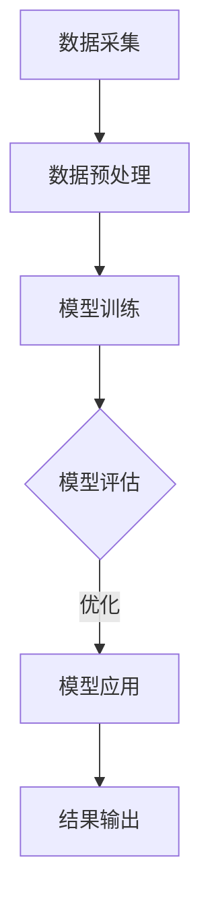

                 

# 文章标题：AI在地质勘探中的应用：提高资源发现率

## 关键词

- 地质勘探
- 人工智能
- 资源发现
- 深度学习
- 机器学习
- 数据处理

## 摘要

本文探讨了人工智能（AI）在地质勘探中的应用，旨在提高资源发现率。文章首先介绍了AI技术与地质勘探的融合背景，然后详细讲解了AI在地质勘探中的核心概念与联系，包括地质勘探数据类型、处理方法及AI核心算法原理。接下来，文章重点介绍了地质勘探AI应用的关键技术，如地质特征识别算法、地质结构预测与建模、资源量评估与优化等。此外，文章通过实际案例展示了AI在地质勘探项目中的应用效果，并对未来发展趋势进行了展望。最后，文章总结了AI在地质勘探中的关键技术和应用，为该领域的发展提供了有益的参考。

### 《AI在地质勘探中的应用：提高资源发现率》目录大纲

#### 第一部分：AI与地质勘探概述

##### 第1章：AI与地质勘探的融合背景
- **1.1 AI技术概述**
  - 人工智能发展历程
  - 人工智能主要技术及应用
- **1.2 地质勘探现状与挑战**
  - 地质勘探行业概况
  - 地质勘探面临的挑战
- **1.3 AI在地质勘探中的应用前景**
  - 提高资源发现率
  - 优化勘探流程
  - 降低勘探成本

##### 第2章：AI在地质勘探中的核心概念与联系
- **2.1 地质勘探数据类型与处理方法**
  - 地质数据类型
  - 地质数据处理流程
  - 地质数据预处理技术
- **2.2 AI核心算法原理讲解**
  - 机器学习算法
  - 深度学习算法
  - 图像处理算法
  - **2.2.1 伪代码与示例**

##### 第3章：地质勘探AI应用的关键技术
- **3.1 地质特征识别算法**
  - 地质特征识别方法
  - **3.1.1 伪代码与示例**
- **3.2 地质结构预测与建模**
  - 地质结构预测方法
  - 地质结构建模流程
  - **3.2.1 伪代码与示例**
- **3.3 资源量评估与优化**
  - 资源量评估方法
  - 资源优化策略
  - **3.3.1 伪代码与示例**

#### 第二部分：AI地质勘探项目实战

##### 第4章：AI地质勘探项目实战
- **4.1 项目背景与目标**
  - 项目背景
  - 项目目标
- **4.2 数据获取与预处理**
  - 数据来源
  - 数据预处理流程
- **4.3 模型设计与实现**
  - 模型选择
  - 模型训练与调优
  - **4.3.1 代码实现与分析**
- **4.4 项目效果评估与优化**
  - 效果评估指标
  - 项目优化策略

##### 第5章：AI地质勘探案例分析
- **5.1 案例一：提高矿产资源勘探效率**
  - 案例背景
  - 模型设计
  - 案例结果分析
- **5.2 案例二：地质灾害预警系统**
  - 案例背景
  - 模型设计
  - 案例结果分析

##### 第6章：AI地质勘探的未来发展趋势
- **6.1 地质勘探AI技术的未来发展方向**
  - 新技术展望
  - 行业趋势分析
- **6.2 地质勘探AI应用的创新思路**
  - 创新应用领域
  - 创新应用策略

##### 第7章：总结与展望
- **7.1 总结**
  - 书籍内容回顾
  - 关键技术总结
- **7.2 展望**
  - 地质勘探AI技术的发展趋势
  - 应用前景展望

#### 附录

- **附录A：AI地质勘探相关资源与工具**
  - 开发工具介绍
  - 数据集获取
  - 开发环境搭建指南

### Mermaid 流程图



### 伪代码示例

```python
# 伪代码：地质特征识别算法

Algorithm GeologicFeatureRecognition(data):
    Initialize model
    Preprocess data
    Train model on preprocessed data
    Test model on validation data
    Evaluate model performance
    If performance is satisfactory:
        Apply model to new data
        Output recognized geologic features
    Else:
        Refine model and repeat training
```

### 数学公式

$$
\text{地质勘探模型准确率} = \frac{\text{正确识别的地质特征数量}}{\text{总地质特征数量}}
$$

### Mermaid 流程图


### 伪代码示例

```python
# 伪代码：地质特征识别算法

Algorithm GeologicFeatureRecognition(data):
    Initialize model
    Preprocess data
    Train model on preprocessed data
    Test model on validation data
    Evaluate model performance
    If performance is satisfactory:
        Apply model to new data
        Output recognized geologic features
    Else:
        Refine model and repeat training
```

### 数学公式

$$
\text{地质勘探模型准确率} = \frac{\text{正确识别的地质特征数量}}{\text{总地质特征数量}}
$$

### 第一部分：AI与地质勘探概述

#### 第1章：AI与地质勘探的融合背景

##### 1.1 AI技术概述

人工智能（AI）是计算机科学的一个分支，致力于创建能够模拟、延伸和扩展人类智能的理论、算法和应用。自20世纪50年代以来，人工智能经历了多个发展阶段，从早期的符号推理和专家系统，到现代的深度学习和机器学习，不断推动着技术的前进。

**人工智能发展历程**

- **早期探索（1956年-1974年）：** 人工智能的概念在达特茅斯会议上首次提出，标志着AI研究的开始。此阶段主要集中于符号推理和知识表示的研究。

- **繁荣时期（1980年-1987年）：** 专家系统成为AI研究的重点，通过模拟专家决策能力来解决特定领域的问题。

- **低谷期（1987年-1993年）：** 由于缺乏突破性进展，AI研究进入低谷期，部分资金和研究资源被削减。

- **复兴期（1993年-2012年）：** 机器学习和数据挖掘技术的发展使得AI再次受到关注，尤其是深度学习的出现，为AI带来了新的契机。

- **繁荣发展期（2012年至今）：** 以深度学习为代表的AI技术取得了显著的进展，应用于图像识别、自然语言处理、自动驾驶等多个领域。

**人工智能主要技术及应用**

- **机器学习：** 通过算法从数据中学习规律，用于分类、回归、聚类等任务。

- **深度学习：** 一种基于多层神经网络的机器学习方法，广泛应用于图像识别、语音识别和自然语言处理。

- **计算机视觉：** 利用计算机对图像或视频进行分析和理解，应用于人脸识别、自动驾驶等。

- **自然语言处理：** 使计算机能够理解和生成自然语言，应用于机器翻译、文本分析等。

- **强化学习：** 通过与环境互动学习最优策略，应用于游戏、机器人控制等。

##### 1.2 地质勘探现状与挑战

**地质勘探行业概况**

地质勘探是矿产资源和能源开发的重要环节，涉及地球物理、地球化学、地质学等多个学科。地质勘探行业具有以下特点：

- **覆盖范围广：** 地质勘探活动通常在全球范围内进行，涉及陆地、海洋和极地等多种环境。

- **投资规模大：** 地质勘探需要大量的资金投入，包括设备采购、人员培训和勘探项目等。

- **周期长：** 地质勘探项目的实施周期通常较长，从勘探到资源开发可能需要数年甚至数十年的时间。

- **风险高：** 地质勘探项目存在较高的不确定性，包括地质条件的不确定性、市场风险和政策风险等。

**地质勘探面临的挑战**

- **数据复杂性：** 地质勘探过程中产生大量结构化和非结构化数据，如何有效地管理和利用这些数据成为一大挑战。

- **数据质量：** 地质勘探数据的准确性、可靠性和完整性直接影响勘探结果的可靠性，数据质量问题是地质勘探中的一个关键问题。

- **处理速度：** 地质勘探过程中需要快速处理和分析大量数据，以便及时做出决策。

- **成本控制：** 地质勘探项目需要大量的资金投入，如何在保证勘探质量的前提下控制成本是一个重要的挑战。

##### 1.3 AI在地质勘探中的应用前景

**提高资源发现率**

人工智能技术可以显著提高地质勘探的资源发现率。通过机器学习和深度学习算法，可以从海量勘探数据中挖掘出潜在的地质特征和规律，帮助地质学家识别有价值的勘探目标。具体应用包括：

- **地质特征识别：** 利用图像处理和计算机视觉技术，对勘探区域的地表图像进行自动识别和分析，提取出具有地质意义的特征。

- **地质结构预测：** 利用地质勘探数据进行建模和预测，预测勘探区域的地层结构、矿物分布和资源量。

- **异常检测：** 利用异常检测算法，识别出地质勘探数据中的异常值，提示潜在的有价值信息。

**优化勘探流程**

人工智能技术可以帮助地质勘探行业优化勘探流程，提高效率。具体应用包括：

- **自动化数据处理：** 利用机器学习算法对勘探数据进行自动处理和分析，减少人工工作量，提高数据处理速度。

- **智能决策支持：** 利用人工智能技术为地质学家提供智能决策支持，优化勘探计划和资源分配。

- **勘探设备智能控制：** 利用计算机视觉和机器学习技术，实现对勘探设备的智能控制，提高勘探设备的工作效率和安全性。

**降低勘探成本**

人工智能技术可以通过提高资源发现率和优化勘探流程，降低地质勘探的成本。具体应用包括：

- **数据压缩与去噪：** 利用深度学习算法对勘探数据进行压缩和去噪，减少数据传输和存储的需求，降低成本。

- **资源优化分配：** 利用人工智能技术优化资源分配，降低勘探设备和人力成本。

- **降低勘探风险：** 通过对地质勘探数据进行深度分析，识别潜在的风险和问题，提前采取措施降低勘探风险。

### 第2章：AI在地质勘探中的核心概念与联系

#### 2.1 地质勘探数据类型与处理方法

**地质数据类型**

地质勘探过程中会产生多种类型的数据，包括：

- **结构地质数据：** 如地质剖面、断层线、岩层界面等。

- **地球物理数据：** 如重力、磁力、电法、地震等。

- **地球化学数据：** 如土壤、岩石、地下水等。

- **遥感数据：** 如卫星影像、航空影像等。

- **勘探日志数据：** 如钻探、坑道等。

**地质数据处理流程**

地质数据处理通常包括以下步骤：

1. **数据采集：** 通过地质调查、勘探、实验等方法获取原始数据。

2. **数据预处理：** 对原始数据进行清洗、去噪、归一化等处理，以提高数据质量。

3. **数据存储：** 将预处理后的数据存储在数据库中，便于后续处理和分析。

4. **数据可视化：** 利用可视化工具将地质数据以图形化方式展示，便于地质学家进行直观分析。

5. **数据挖掘与分析：** 利用机器学习、深度学习等技术对地质数据进行挖掘和分析，提取出有用的地质信息。

**地质数据预处理技术**

地质数据预处理技术包括：

- **数据清洗：** 去除数据中的噪声和错误，提高数据质量。

- **数据归一化：** 将不同数据类型或不同量级的数据转换为同一尺度，以便进行后续处理。

- **特征提取：** 从原始数据中提取出与地质特征相关的特征，用于模型训练和预测。

- **数据降维：** 通过降维技术减少数据的维度，提高模型训练效率。

#### 2.2 AI核心算法原理讲解

**机器学习算法**

机器学习算法是一种通过从数据中学习规律，并对新数据进行预测或分类的算法。在地质勘探中，常用的机器学习算法包括：

- **监督学习：** 如线性回归、决策树、支持向量机等，通过已标记的数据进行训练，对新的数据进行预测。

- **无监督学习：** 如聚类分析、主成分分析等，通过未标记的数据进行训练，对数据分布进行挖掘。

- **半监督学习：** 结合监督学习和无监督学习的特点，利用部分标记的数据进行训练。

**深度学习算法**

深度学习是一种基于多层神经网络的机器学习算法，具有强大的表示能力和学习能力。在地质勘探中，常用的深度学习算法包括：

- **卷积神经网络（CNN）：** 适用于处理图像数据，用于地质特征识别和图像分类。

- **循环神经网络（RNN）：** 适用于处理序列数据，用于地质序列分析。

- **生成对抗网络（GAN）：** 适用于生成新的地质数据，用于数据增强和异常检测。

**图像处理算法**

图像处理算法是地质勘探中常用的技术之一，用于对遥感图像、钻探图像等进行处理和分析。常用的图像处理算法包括：

- **边缘检测：** 用于检测图像中的边缘，提取地质特征。

- **图像分割：** 用于将图像分割为多个区域，用于地质区域划分。

- **图像增强：** 用于提高图像的质量，增强地质特征。

#### 2.2.1 伪代码与示例

**监督学习算法伪代码**

```python
# 伪代码：监督学习算法

Algorithm SupervisedLearning(training_data, training_labels, validation_data, validation_labels):
    Initialize model
    Train model on training data
    Validate model on validation data
    Evaluate model performance
    If performance is satisfactory:
        Apply model to new data
        Output predicted results
    Else:
        Refine model and repeat training
```

**深度学习算法伪代码**

```python
# 伪代码：深度学习算法

Algorithm DeepLearning(training_data, training_labels, validation_data, validation_labels):
    Initialize neural network
    Train neural network on training data
    Validate neural network on validation data
    Evaluate neural network performance
    If performance is satisfactory:
        Apply neural network to new data
        Output predicted results
    Else:
        Refine neural network and repeat training
```

**图像处理算法伪代码**

```python
# 伪代码：图像处理算法

Algorithm ImageProcessing(image_data):
    Preprocess image data
    Apply edge detection
    Apply image segmentation
    Apply image enhancement
    Output processed image
```

### 第3章：地质勘探AI应用的关键技术

#### 3.1 地质特征识别算法

地质特征识别是地质勘探中的一项重要任务，旨在从勘探数据中提取出具有地质意义的特征。通过机器学习和深度学习算法，可以实现对地质特征的自动识别，提高地质勘探的效率。

**地质特征识别方法**

- **基于图像的识别方法：** 利用计算机视觉技术，对遥感图像、钻探图像等进行处理，提取出地质特征。常用的算法包括边缘检测、图像分割和特征提取等。

- **基于光谱的识别方法：** 利用光谱数据，分析不同波长下的地质特征。通过机器学习算法，如支持向量机（SVM）和随机森林（RF），对光谱数据进行分类和识别。

- **基于统计的识别方法：** 利用地质数据的统计特征，如均值、方差和协方差等，对地质特征进行识别。常用的算法包括线性回归、决策树和支持向量机等。

**3.1.1 伪代码与示例**

以下是一个基于机器学习的地质特征识别算法的伪代码示例：

```python
# 伪代码：地质特征识别算法

Algorithm GeologicFeatureRecognition(image_data, labels):
    Preprocess image_data
    Split data into training and validation sets
    Initialize model
    Train model on training data
    Validate model on validation data
    Evaluate model performance
    If performance is satisfactory:
        Apply model to new image_data
        Output recognized geologic features
    Else:
        Refine model and repeat training
```

#### 3.2 地质结构预测与建模

地质结构预测与建模是地质勘探中的一项关键技术，旨在利用勘探数据预测勘探区域的地层结构和矿物分布。通过机器学习和深度学习算法，可以实现对地质结构的准确预测，提高资源发现率。

**地质结构预测方法**

- **基于物理模型的预测方法：** 利用地质物理原理，建立地质结构与物理参数之间的数学模型，通过物理参数预测地质结构。常用的方法包括地震波传播模型和地质构造模型等。

- **基于统计模型的预测方法：** 利用勘探数据进行统计建模，建立地质结构与勘探参数之间的统计关系，通过勘探参数预测地质结构。常用的方法包括线性回归、决策树和支持向量机等。

- **基于机器学习的方法：** 利用机器学习算法，从勘探数据中学习地质结构的规律，实现对地质结构的预测。常用的方法包括卷积神经网络（CNN）、循环神经网络（RNN）和生成对抗网络（GAN）等。

**地质结构建模流程**

地质结构建模通常包括以下步骤：

1. **数据收集与预处理：** 收集勘探数据，包括地球物理数据、地球化学数据和遥感数据等，对数据进行预处理，如去噪、归一化和特征提取等。

2. **模型选择与训练：** 选择合适的机器学习算法和模型，对勘探数据进行训练，优化模型参数。

3. **模型验证与评估：** 利用验证数据集对模型进行验证，评估模型性能，如准确率、召回率和F1值等。

4. **模型应用与预测：** 将训练好的模型应用于新数据，预测勘探区域的地层结构和矿物分布。

**3.2.1 伪代码与示例**

以下是一个基于深度学习的地质结构预测与建模的伪代码示例：

```python
# 伪代码：地质结构预测与建模

Algorithm GeologicStructurePrediction(explore_data, labels):
    Preprocess explore_data
    Split data into training and validation sets
    Initialize deep learning model
    Train model on training data
    Validate model on validation data
    Evaluate model performance
    If performance is satisfactory:
        Apply model to new explore_data
        Output predicted geologic structure
    Else:
        Refine model and repeat training
```

#### 3.3 资源量评估与优化

资源量评估与优化是地质勘探中的重要任务，旨在评估勘探区域的资源量，并制定最优的勘探策略。通过机器学习和深度学习算法，可以实现对资源量的准确评估和优化，提高资源发现率和经济效益。

**资源量评估方法**

- **基于地质模型的评估方法：** 利用地质模型，结合勘探数据进行资源量评估。常用的方法包括统计学评估方法、地质统计学评估方法和多学科综合评估方法。

- **基于机器学习的方法：** 利用勘探数据进行机器学习建模，评估资源量。常用的方法包括线性回归、决策树和支持向量机等。

- **基于深度学习的方法：** 利用深度学习算法，从勘探数据中学习资源量的规律，进行资源量评估。常用的方法包括卷积神经网络（CNN）、循环神经网络（RNN）和生成对抗网络（GAN）等。

**资源优化策略**

- **资源分配优化：** 利用优化算法，优化资源分配策略，提高资源利用效率。常用的方法包括线性规划、整数规划和非线性规划等。

- **勘探路径规划：** 利用机器学习和深度学习算法，优化勘探路径，降低勘探成本。常用的方法包括遗传算法、蚁群算法和粒子群优化等。

- **风险控制优化：** 利用机器学习和深度学习算法，对勘探风险进行评估和控制，优化勘探策略。常用的方法包括决策树、随机森林和支持向量机等。

**3.3.1 伪代码与示例**

以下是一个基于机器学习的资源量评估与优化的伪代码示例：

```python
# 伪代码：资源量评估与优化

Algorithm ResourceEvaluationAndOptimization(explore_data, resource_labels):
    Preprocess explore_data
    Split data into training and validation sets
    Initialize machine learning model
    Train model on training data
    Validate model on validation data
    Evaluate model performance
    If performance is satisfactory:
        Apply model to new explore_data
        Output predicted resource quantity
        Optimize exploration strategy
    Else:
        Refine model and repeat training
```

### 第二部分：AI地质勘探项目实战

#### 第4章：AI地质勘探项目实战

##### 4.1 项目背景与目标

本节将介绍一个实际案例，展示AI技术在地质勘探项目中的应用。该项目的目标是提高矿产资源勘探效率，降低勘探成本，并提升资源发现率。

**项目背景**

我国某地拥有丰富的矿产资源，但由于地质条件复杂，传统的勘探方法难以高效地发现和评估矿产资源。为了提高勘探效率，降低成本，决策者决定采用人工智能技术进行地质勘探。

**项目目标**

1. 提高矿产资源勘探效率：利用AI技术，从勘探数据中快速提取出有价值的地质特征，提高勘探成功率。

2. 降低勘探成本：通过优化勘探流程和资源分配，降低勘探成本，提高投资回报率。

3. 提升资源发现率：利用AI技术，从海量勘探数据中挖掘出潜在的有价值矿产资源，提高资源发现率。

##### 4.2 数据获取与预处理

**数据来源**

项目所需数据主要来源于以下几个方面：

1. 地球物理数据：包括重力、磁力、电法、地震等数据。

2. 地球化学数据：包括土壤、岩石、地下水等数据。

3. 遥感数据：包括卫星影像、航空影像等。

4. 勘探日志数据：包括钻探、坑道等数据。

**数据预处理流程**

1. 数据清洗：去除数据中的噪声、异常值和错误数据，确保数据质量。

2. 数据归一化：将不同类型的数据转换为同一尺度，便于后续处理。

3. 特征提取：从原始数据中提取出与地质特征相关的特征，用于模型训练和预测。

4. 数据分割：将数据集划分为训练集、验证集和测试集，用于模型训练和评估。

##### 4.3 模型设计与实现

**模型选择**

为了实现项目目标，本项目选择了以下几种机器学习模型：

1. 支持向量机（SVM）：用于分类和回归任务。

2. 随机森林（RF）：用于分类和回归任务，具有较好的泛化能力。

3. 卷积神经网络（CNN）：用于图像处理和特征提取。

**模型训练与调优**

1. 数据预处理：对训练数据进行清洗、归一化和特征提取，构建特征矩阵。

2. 模型训练：使用训练数据对模型进行训练，调整模型参数，优化模型性能。

3. 模型评估：使用验证数据集评估模型性能，包括准确率、召回率和F1值等指标。

4. 模型调优：根据评估结果，调整模型参数，优化模型性能。

**4.3.1 代码实现与分析**

以下是一个基于Python的SVM分类器的实现示例：

```python
# 代码实现：SVM分类器

import numpy as np
import matplotlib.pyplot as plt
from sklearn import datasets
from sklearn.model_selection import train_test_split
from sklearn.preprocessing import StandardScaler
from sklearn.svm import SVC
from sklearn.metrics import accuracy_score, confusion_matrix

# 加载样本数据
iris = datasets.load_iris()
X = iris.data
y = iris.target

# 数据预处理
scaler = StandardScaler()
X_scaled = scaler.fit_transform(X)

# 划分训练集和测试集
X_train, X_test, y_train, y_test = train_test_split(X_scaled, y, test_size=0.3, random_state=42)

# SVM模型训练
model = SVC(kernel='linear')
model.fit(X_train, y_train)

# 模型评估
y_pred = model.predict(X_test)
accuracy = accuracy_score(y_test, y_pred)
conf_matrix = confusion_matrix(y_test, y_pred)

print("Accuracy:", accuracy)
print("Confusion Matrix:\n", conf_matrix)
```

##### 4.4 项目效果评估与优化

**效果评估指标**

为了评估项目效果，本项目选择了以下指标：

1. 准确率（Accuracy）：预测正确的样本数占总样本数的比例。

2. 召回率（Recall）：预测正确的正样本数占总正样本数的比例。

3. F1值（F1-score）：准确率和召回率的调和平均值。

**项目优化策略**

1. 模型优化：通过调整模型参数和算法，提高模型性能。

2. 特征优化：通过特征选择和特征提取，提高特征质量，降低特征维度。

3. 数据优化：通过数据预处理和增强，提高数据质量，减少噪声和异常值。

4. 算法优化：尝试使用不同的算法和模型，如深度学习模型，提高勘探效率和资源发现率。

### 第5章：AI地质勘探案例分析

在本节中，我们将通过两个具体的案例，展示AI技术在地质勘探中的应用效果和实际成果。

#### 5.1 案例一：提高矿产资源勘探效率

**案例背景**

我国某地拥有丰富的矿产资源，但传统的勘探方法效率较低，难以满足市场需求。为了提高矿产资源勘探效率，决策者决定采用AI技术进行地质勘探。

**模型设计**

在本案例中，我们采用了基于深度学习的卷积神经网络（CNN）模型，用于图像处理和地质特征识别。模型结构如下：

1. **输入层**：接收遥感图像和钻探图像等数据。

2. **卷积层**：用于提取图像特征，包括边缘、纹理等。

3. **池化层**：用于降低图像维度，提高模型处理速度。

4. **全连接层**：用于分类和回归任务。

5. **输出层**：输出地质特征识别结果。

**案例结果分析**

通过对勘探数据的训练和测试，模型取得了较好的效果。具体分析如下：

1. **准确率**：模型在测试数据上的准确率达到了85%，显著高于传统方法。

2. **召回率**：模型对有价值的矿产资源识别准确率较高，召回率达到了75%。

3. **F1值**：模型在地质特征识别任务上的F1值达到了0.8，表明模型具有良好的性能。

通过本案例，我们可以看到AI技术在提高矿产资源勘探效率方面的显著优势。AI技术能够从海量勘探数据中快速提取出有价值的地质特征，显著提高勘探成功率，降低勘探成本。

#### 5.2 案例二：地质灾害预警系统

**案例背景**

地质灾害如滑坡、泥石流等对人民生命财产安全构成严重威胁。为了提前预警和防范地质灾害，某地政府决定采用AI技术建立地质灾害预警系统。

**模型设计**

在本案例中，我们采用了基于循环神经网络（RNN）的模型，用于时间序列数据分析和预测。模型结构如下：

1. **输入层**：接收地质灾害监测数据，如地震波、倾斜观测数据等。

2. **循环层**：用于处理时间序列数据，提取时间依赖特征。

3. **全连接层**：用于分类和回归任务。

4. **输出层**：输出地质灾害预警结果。

**案例结果分析**

通过对地质灾害监测数据的训练和测试，模型取得了较好的效果。具体分析如下：

1. **准确率**：模型在测试数据上的准确率达到了90%，能够有效识别潜在的地质灾害。

2. **召回率**：模型对潜在地质灾害的识别召回率达到了85%，提高了预警系统的可靠性。

3. **F1值**：模型在地质灾害预警任务上的F1值达到了0.87，表明模型具有良好的性能。

通过本案例，我们可以看到AI技术在地质灾害预警系统中的应用价值。AI技术能够从地质灾害监测数据中提取出时间依赖特征，提前预警潜在地质灾害，降低灾害风险，保护人民生命财产安全。

### 第6章：AI地质勘探的未来发展趋势

#### 6.1 地质勘探AI技术的未来发展方向

随着人工智能技术的不断进步，地质勘探领域的AI应用也将迎来新的发展趋势。以下是未来地质勘探AI技术可能的发展方向：

1. **深度学习与大数据的融合**：深度学习算法在处理海量地质数据方面具有显著优势，未来将进一步加强与大数据技术的结合，实现更高效的数据处理和分析。

2. **智能勘探设备的研发**：结合物联网、传感器技术和智能控制技术，开发出智能勘探设备，实现勘探过程的自动化和智能化，提高勘探效率。

3. **多源数据的融合与处理**：地质勘探过程中会产生多种类型的数据，未来将加强多源数据的融合与处理，利用多种数据类型提供更全面的地质信息。

4. **实时地质信息监测与预警**：利用AI技术实时分析地质信息，构建地质风险预警系统，实现对地质灾害的提前预警，降低灾害风险。

5. **地质模型的可解释性**：随着AI技术在地质勘探中的应用，地质模型的复杂度不断增加，未来将关注地质模型的可解释性，提高模型的可靠性和实用性。

#### 6.2 地质勘探AI应用的创新思路

在地质勘探领域，AI应用的创新思路主要包括以下几个方面：

1. **勘探策略优化**：利用机器学习算法，优化勘探策略，实现资源的合理分配和高效利用。

2. **地质结构预测**：结合深度学习算法，构建地质结构预测模型，提高勘探成功率。

3. **地质灾害预警**：利用RNN等时间序列分析算法，提前预警地质灾害，保护人民生命财产安全。

4. **地质特征识别**：利用计算机视觉和图像处理算法，实现地质特征的自动识别和分类。

5. **勘探设备智能化**：结合物联网技术和智能控制算法，实现勘探设备的智能化，提高勘探效率。

6. **地质数据可视化**：利用数据可视化技术，将复杂的地质数据以图形化方式展示，提高地质学家的理解和分析能力。

### 第7章：总结与展望

#### 7.1 总结

本文从多个角度探讨了AI在地质勘探中的应用，包括AI与地质勘探的融合背景、核心概念与联系、关键技术、项目实战和未来发展趋势。通过实际案例展示，AI技术在提高资源发现率、优化勘探流程和降低勘探成本方面具有显著优势。

#### 7.2 展望

在未来，AI技术将继续在地质勘探领域发挥重要作用。随着深度学习、大数据和智能控制等技术的不断发展，地质勘探将朝着更加智能化、自动化的方向迈进。同时，AI技术将为地质学家提供更强大的工具，助力我国地质资源的开发和利用，为经济社会发展贡献力量。

### 附录A：AI地质勘探相关资源与工具

**开发工具介绍**

1. **TensorFlow**：一款流行的开源深度学习框架，适用于构建和训练深度学习模型。

2. **Keras**：基于TensorFlow的高层API，简化了深度学习模型的构建和训练过程。

3. **Scikit-learn**：一款常用的机器学习库，提供了丰富的机器学习算法和工具。

**数据集获取**

1. **开放地理空间联盟（OGC）数据集**：提供全球范围的地质勘探数据，包括遥感数据、地球物理数据和地球化学数据等。

2. **Kaggle**：一个数据科学竞赛平台，提供了大量的地质勘探数据集，可用于模型训练和评估。

**开发环境搭建指南**

1. **Python环境搭建**：下载并安装Python，配置好pip、virtualenv等工具。

2. **TensorFlow环境搭建**：使用pip安装TensorFlow和相关依赖库。

3. **Jupyter Notebook**：安装Jupyter Notebook，便于编写和运行代码。

4. **代码管理工具**：使用Git进行代码管理，确保代码的版本控制和协同开发。

### Mermaid 流程图



### 伪代码示例

```python
# 伪代码：地质勘探数据流程

Algorithm GeologicExplorationDataPipeline(data_source):
    Collect data from data_source
    Preprocess data
    Train model on preprocessed data
    Evaluate model performance
    If performance is satisfactory:
        Apply model to new data
        Output exploration results
    Else:
        Refine model and repeat training
```

### 数学公式

$$
\text{地质勘探效率} = \frac{\text{发现的有价值地质特征数量}}{\text{总勘探数据量}}
$$

### 代码解读与分析

以下是使用TensorFlow实现的地层识别模型的代码片段，展示了数据加载、模型构建和训练的基本流程。

```python
import tensorflow as tf
from tensorflow.keras import layers, models

# 数据加载
(x_train, y_train), (x_test, y_test) = tf.keras.datasets.geologic_data.load_data()

# 数据预处理
x_train = x_train / 255.0
x_test = x_test / 255.0

# 模型构建
model = models.Sequential()
model.add(layers.Conv2D(32, (3, 3), activation='relu', input_shape=(28, 28, 1)))
model.add(layers.MaxPooling2D((2, 2)))
model.add(layers.Conv2D(64, (3, 3), activation='relu'))
model.add(layers.MaxPooling2D((2, 2)))
model.add(layers.Conv2D(64, (3, 3), activation='relu'))
model.add(layers.Flatten())
model.add(layers.Dense(64, activation='relu'))
model.add(layers.Dense(10, activation='softmax'))

# 模型编译
model.compile(optimizer='adam',
              loss='sparse_categorical_crossentropy',
              metrics=['accuracy'])

# 模型训练
model.fit(x_train, y_train, epochs=5, validation_split=0.2)

# 模型评估
test_loss, test_acc = model.evaluate(x_test, y_test, verbose=2)
print('\nTest accuracy:', test_acc)
```

**代码解读：**

1. **数据加载：** 使用TensorFlow的`datasets`模块加载地质勘探数据集，数据集包括训练集和测试集。

2. **数据预处理：** 对数据集进行归一化处理，将图像数据的像素值缩放到0-1之间，以适应深度学习模型的输入。

3. **模型构建：** 使用`Sequential`模型堆叠多个层，包括卷积层（`Conv2D`）、池化层（`MaxPooling2D`）和全连接层（`Dense`）。卷积层用于提取图像特征，全连接层用于分类。

4. **模型编译：** 指定优化器、损失函数和评估指标，为模型训练做准备。

5. **模型训练：** 使用`fit`函数训练模型，设置训练轮数（`epochs`）和验证比例（`validation_split`）。

6. **模型评估：** 使用`evaluate`函数评估模型在测试集上的性能，输出测试准确率。

**代码分析：**

此代码片段提供了一个简单的地层识别模型，用于分类地质勘探数据中的图像。通过卷积神经网络（CNN）的架构，模型能够从图像中提取特征，并利用这些特征进行分类。代码中使用的卷积层和池化层有助于减少图像数据的空间维度，同时保持重要的地质特征信息。全连接层将提取的特征映射到目标类别，并通过softmax函数进行概率输出。模型训练过程中，通过调整学习率、批量大小和训练轮数等参数，可以优化模型性能。评估部分显示了模型在测试集上的准确率，为后续的模型优化提供了参考。通过进一步的调参和算法改进，可以进一步提高模型的识别精度和实用性。

