                 

### 文章标题：AI在建筑设计中的应用：优化功能与美学

> 关键词：人工智能，建筑设计，功能优化，美学优化，机器学习，深度学习，神经网络，生成对抗网络，强化学习

> 摘要：本文旨在探讨人工智能（AI）在建筑设计中的应用，重点研究AI如何通过优化建筑功能与美学来提升建筑品质。文章首先介绍了AI在建筑设计中的基本概念和技术，接着深入分析了AI在建筑功能与美学优化中的核心算法与应用实例，最后对AI在建筑设计中的应用前景与挑战进行了展望。

### 目录

#### 第一部分：AI在建筑设计中的基本概念与技术

- **第1章: AI在建筑设计中的基本概念**
  - 1.1 AI技术概述
  - 1.2 建筑设计中的AI应用领域
- **第2章: AI基础技术**
  - 2.1 机器学习基础
  - 2.2 深度学习技术
  - 2.3 常见的深度学习框架
- **第3章: AI在建筑设计中的核心算法**
  - 3.1 神经网络在建筑设计中的应用
  - 3.2 生成对抗网络（GAN）
  - 3.3 强化学习在建筑设计中的应用

#### 第二部分：AI在建筑功能优化中的应用

- **第4章: AI在建筑功能优化中的应用**
  - 4.1 功能区域划分优化
  - 4.2 空间布局优化
  - 4.3 舒适性能评估

#### 第三部分：AI在建筑美学优化中的应用

- **第5章: AI在建筑美学优化中的应用**
  - 5.1 建筑形态生成
  - 5.2 色彩搭配优化
  - 5.3 灯光设计优化

#### 第四部分：AI在建筑功能与美学优化中的综合应用

- **第6章: AI在建筑设计中的综合应用**
  - 6.1 综合优化的理论基础
  - 6.2 综合优化的方法与策略
  - 6.3 综合优化实例分析
- **第7章: AI在建筑设计中的应用前景与挑战**
  - 7.1 AI在建筑设计中的应用前景
  - 7.2 AI在建筑设计中的挑战

#### 附录

- **附录A: AI在建筑设计中常用工具与框架**
- **附录B: 代码与实验指导**

### 让我们一步步分析AI在建筑设计中的应用

#### 1.1 AI技术概述

首先，我们需要了解人工智能（AI）的定义和发展历程。人工智能是指使计算机系统具备人类智能特性的技术，包括学习、推理、感知、理解、创造和问题解决等能力。AI的发展经历了几个阶段，从早期的规则系统到现代的机器学习和深度学习，技术不断进步，应用场景日益广泛。

在建筑设计中，AI技术可以应用于多个领域，包括建筑形态生成、结构优化、性能评估和空间布局优化等。通过应用AI技术，建筑师可以更快速、准确地完成设计任务，提高建筑品质，降低成本，实现功能与美学的统一。

#### 1.2 建筑设计中的AI应用领域

接下来，我们详细探讨AI在建筑设计中的应用领域。

**1.2.1 建筑形态生成**

建筑形态生成是AI在建筑设计中的一个重要应用。通过使用机器学习和深度学习技术，AI可以自动生成具有创意和美感的建筑形态。例如，神经网络和生成对抗网络（GAN）等技术被广泛应用于建筑形态的生成，如图1所示。

```mermaid
graph TD
A[神经网络] --> B[建筑形态生成]
A --> C[生成对抗网络(GAN)]
C --> D[建筑形态生成]
```

**1.2.2 结构优化**

结构优化是另一个重要的应用领域。通过使用AI技术，可以对建筑结构进行优化，提高其稳定性和承载能力。机器学习算法可以分析大量建筑数据，提取结构优化规律，如图2所示。

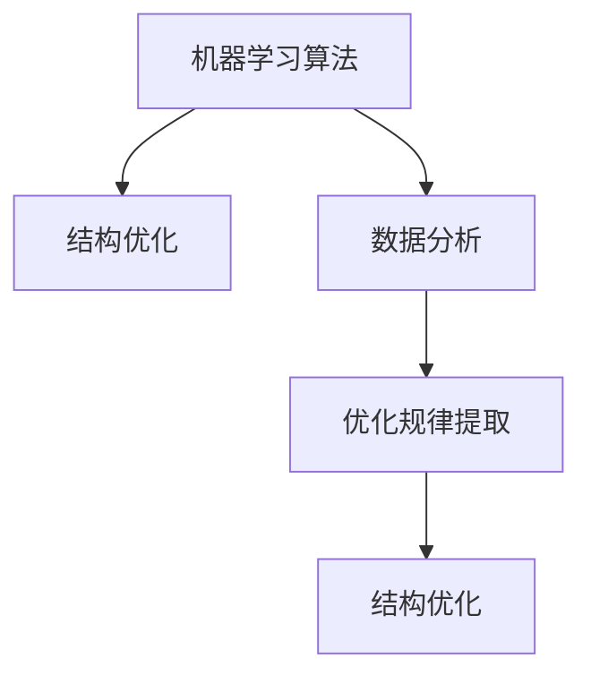

**1.2.3 舒适性能评估**

舒适性评估是建筑功能优化中的一个关键环节。AI技术可以用于评估建筑的舒适性，包括光照、通风、噪音等方面。通过机器学习和深度学习算法，可以建立舒适性评估模型，如图3所示。

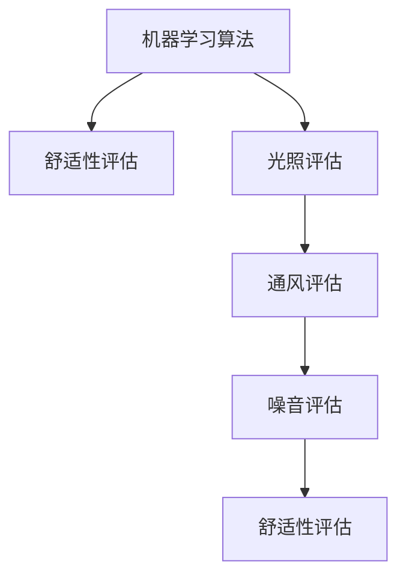

**1.2.4 能源效率分析**

能源效率分析是建筑功能优化的重要方面。AI技术可以用于分析建筑能源消耗，并提出优化方案。通过机器学习和深度学习算法，可以建立能源效率评估模型，如图4所示。

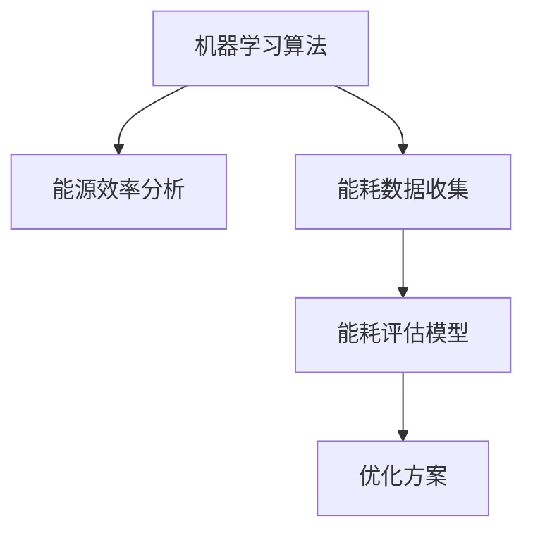

**1.2.5 空间布局优化**

空间布局优化是建筑功能优化中的重要应用。AI技术可以用于分析建筑空间数据，提出空间布局优化方案。通过机器学习和深度学习算法，可以建立空间布局优化模型，如图5所示。


#### 1.3 AI基础技术

为了深入理解AI在建筑设计中的应用，我们需要了解AI的基础技术，包括机器学习、深度学习和常见的深度学习框架。

**1.3.1 机器学习基础**

机器学习是AI的核心技术之一。它通过从数据中学习规律，使计算机具备智能行为。机器学习算法可以分为监督学习、无监督学习和强化学习。在建筑设计中，监督学习和无监督学习算法被广泛应用于结构优化、舒适性评估和空间布局优化等方面。

**1.3.2 深度学习技术**

深度学习是机器学习的一个重要分支，它通过多层神经网络来模拟人脑的决策过程。深度学习技术在图像识别、语音识别和自然语言处理等领域取得了显著的成果。在建筑设计中，深度学习技术被广泛应用于建筑形态生成、结构优化和能源效率分析等方面。

**1.3.3 常见的深度学习框架**

常见的深度学习框架包括TensorFlow、PyTorch和Keras等。这些框架提供了丰富的工具和API，使得深度学习模型的开发和应用变得更加便捷。在建筑设计中，这些框架被广泛应用于建筑形态生成、结构优化和舒适性评估等方面。

#### 1.4 建筑设计中的AI应用现状与趋势

随着AI技术的不断发展，其在建筑设计中的应用也日益广泛。当前，AI技术在建筑形态生成、结构优化和性能评估等方面已经取得了显著的成果。例如，通过使用神经网络和生成对抗网络，可以自动生成具有创意和美感的建筑形态；通过使用机器学习和深度学习算法，可以对建筑结构进行优化，提高其稳定性和承载能力。

展望未来，随着AI技术的不断进步，其在建筑设计中的应用前景将更加广阔。例如，AI技术可以用于建筑设计中的自动化生成，实现高效的设计过程；AI技术可以用于建筑性能的实时监控与优化，实现智能建筑的目标。

然而，AI在建筑设计中的应用也面临一些挑战，如数据隐私、伦理和法律问题等。因此，在推进AI技术在建筑设计中的应用过程中，我们需要关注这些问题，并积极探索解决方案。

### 第二部分：AI基础技术

#### 2.1 机器学习基础

机器学习是AI的核心技术之一，它使计算机具备从数据中学习规律的能力。在本节中，我们将介绍机器学习的基本概念、常见算法以及在建筑设计中的应用。

**2.1.1 机器学习的基本概念**

机器学习是一种通过从数据中学习规律来提高计算机性能的技术。机器学习可以分为三种类型：监督学习、无监督学习和强化学习。

1. **监督学习**：监督学习是一种有标签数据的学习方法，通过已知输入和输出之间的关系来训练模型。常见的监督学习算法包括线性回归、逻辑回归和决策树等。

2. **无监督学习**：无监督学习是一种无标签数据的学习方法，通过探索数据内在的结构来训练模型。常见的无监督学习算法包括聚类、降维和关联规则等。

3. **强化学习**：强化学习是一种基于奖励机制的学习方法，通过不断尝试和反馈来优化行为策略。常见的强化学习算法包括Q学习、SARSA和深度强化学习等。

**2.1.2 常见的机器学习算法**

在建筑设计中，常见的机器学习算法包括线性回归、逻辑回归、决策树、支持向量机和神经网络等。

1. **线性回归**：线性回归是一种用于预测数值型目标变量的算法。在建筑设计中，线性回归可以用于预测建筑能耗、建筑高度和建筑面积等。

```latex
\text{目标函数}：\min_{\theta} \sum_{i=1}^{n} (y_i - \theta_0 - \theta_1x_i)^2
```

2. **逻辑回归**：逻辑回归是一种用于预测二分类目标变量的算法。在建筑设计中，逻辑回归可以用于预测建筑是否节能、建筑是否环保等。

```latex
\text{目标函数}：\min_{\theta} \sum_{i=1}^{n} (-y_i\log(\sigma(\theta_0 + \theta_1x_i)) - (1-y_i)\log(1-\sigma(\theta_0 + \theta_1x_i)))
```

3. **决策树**：决策树是一种基于特征划分数据的分类算法。在建筑设计中，决策树可以用于预测建筑类型、建筑风格等。

4. **支持向量机**：支持向量机是一种基于间隔最大化的分类算法。在建筑设计中，支持向量机可以用于预测建筑结构类型、建筑抗震性能等。

5. **神经网络**：神经网络是一种基于多层感知器的分类算法。在建筑设计中，神经网络可以用于预测建筑形态、建筑能耗等。

**2.1.3 机器学习在建筑设计中的应用**

在建筑设计中，机器学习技术被广泛应用于多个领域，如图6所示。

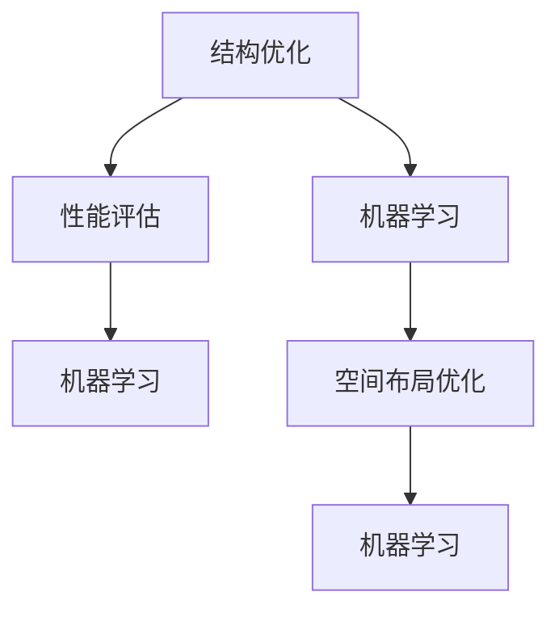

**2.1.4 机器学习在建筑设计中的应用案例**

以下是一个简单的机器学习在建筑设计中的应用案例：使用线性回归预测建筑能耗。

1. **数据收集**：收集建筑高度、建筑面积、建筑朝向等数据。

2. **数据预处理**：对数据进行清洗、归一化处理，以消除异常值和量纲影响。

3. **模型训练**：使用线性回归算法训练模型，输入特征为建筑高度、建筑面积、建筑朝向等，输出目标为建筑能耗。

4. **模型评估**：使用测试数据集评估模型性能，计算均方误差（MSE）。

5. **模型优化**：根据评估结果，调整模型参数，提高预测精度。

通过上述步骤，可以构建一个简单的机器学习模型，用于预测建筑能耗。类似的方法可以应用于其他建筑设计问题，如图7所示。


#### 2.2 深度学习技术

深度学习是机器学习的一个分支，它通过多层神经网络来模拟人脑的决策过程。在本节中，我们将介绍深度学习的基本原理、常见算法以及在建筑设计中的应用。

**2.2.1 深度学习的基本原理**

深度学习的基本原理是多层神经网络。神经网络由输入层、隐藏层和输出层组成，通过逐层提取特征，实现对数据的建模。

1. **激活函数**：激活函数用于引入非线性，使神经网络具备预测能力。常见的激活函数包括ReLU、Sigmoid和Tanh等。

2. **反向传播算法**：反向传播算法用于计算网络参数的梯度，以优化网络性能。通过反向传播，可以逐层更新网络参数，提高模型精度。

3. **损失函数**：损失函数用于衡量模型预测误差，常见的损失函数包括均方误差（MSE）、交叉熵损失等。

**2.2.2 常见的深度学习算法**

在建筑设计中，常见的深度学习算法包括卷积神经网络（CNN）、循环神经网络（RNN）和生成对抗网络（GAN）等。

1. **卷积神经网络（CNN）**：卷积神经网络是一种用于处理图像数据的神经网络。通过卷积层、池化层和全连接层，可以实现对图像数据的特征提取和分类。在建筑设计中，CNN可以用于建筑形态生成、建筑风格识别等。

2. **循环神经网络（RNN）**：循环神经网络是一种用于处理序列数据的神经网络。通过隐藏状态和循环连接，可以实现对序列数据的建模和预测。在建筑设计中，RNN可以用于建筑能耗预测、建筑舒适性评估等。

3. **生成对抗网络（GAN）**：生成对抗网络是一种用于生成数据的神经网络。通过生成器和判别器之间的对抗训练，可以生成高质量的数据。在建筑设计中，GAN可以用于建筑形态生成、建筑风格迁移等。

**2.2.3 深度学习在建筑设计中的应用**

在建筑设计中，深度学习技术被广泛应用于多个领域，如图8所示。

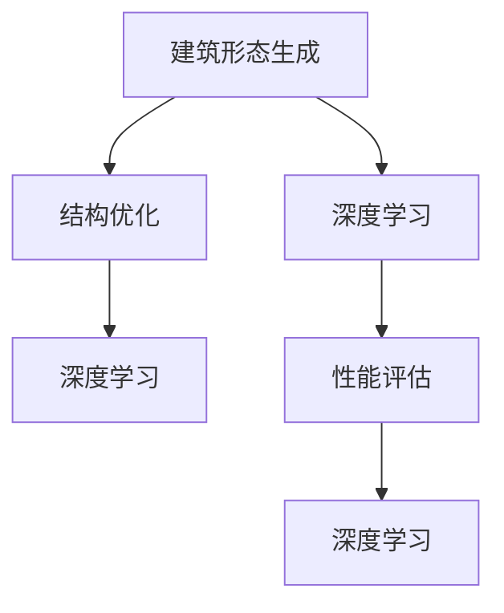

**2.2.4 深度学习在建筑设计中的应用案例**

以下是一个简单的深度学习在建筑设计中的应用案例：使用卷积神经网络（CNN）识别建筑风格。

1. **数据收集**：收集不同风格的建筑图片，作为训练数据和测试数据。

2. **数据预处理**：对图片进行缩放、裁剪和增强，以增加数据的多样性和鲁棒性。

3. **模型训练**：使用CNN算法训练模型，输入为建筑图片，输出为建筑风格标签。

4. **模型评估**：使用测试数据集评估模型性能，计算准确率。

5. **模型优化**：根据评估结果，调整模型参数，提高识别精度。

通过上述步骤，可以构建一个简单的深度学习模型，用于识别建筑风格。类似的方法可以应用于其他建筑设计问题，如图9所示。


### 第三部分：AI在建筑设计中的核心算法

#### 3.1 神经网络在建筑设计中的应用

神经网络是深度学习的基础，它由多个神经元组成，通过非线性变换和层次化结构实现对数据的建模和预测。在本节中，我们将介绍神经网络在建筑设计中的应用，包括建筑形态生成和结构优化。

**3.1.1 神经网络的基本结构**

神经网络的基本结构包括输入层、隐藏层和输出层。每个神经元都通过权重连接，通过激活函数实现非线性变换。常见的神经网络结构有全连接网络、卷积神经网络和循环神经网络等。

1. **全连接网络**：全连接网络是一种最简单的神经网络结构，每个神经元都与所有前一层神经元相连。在建筑设计中，全连接网络可以用于建筑能耗预测、建筑风格识别等。

2. **卷积神经网络（CNN）**：卷积神经网络是一种用于处理图像数据的神经网络，通过卷积层、池化层和全连接层实现特征提取和分类。在建筑设计中，CNN可以用于建筑形态生成、建筑风格识别等。

3. **循环神经网络（RNN）**：循环神经网络是一种用于处理序列数据的神经网络，通过隐藏状态和循环连接实现序列建模和预测。在建筑设计中，RNN可以用于建筑能耗预测、建筑舒适性评估等。

**3.1.2 神经网络在建筑形态生成中的应用**

建筑形态生成是建筑设计中的一个重要任务，神经网络可以用于生成具有创意和美感的建筑形态。

1. **数据收集**：收集不同类型的建筑数据，包括建筑图片、建筑结构等。

2. **数据预处理**：对建筑数据进行分析，提取特征，并将其输入到神经网络中。

3. **模型训练**：使用卷积神经网络（CNN）或循环神经网络（RNN）训练模型，通过反向传播算法优化网络参数。

4. **模型评估**：使用测试数据集评估模型性能，计算准确率或均方误差等指标。

5. **形态生成**：使用训练好的神经网络生成新的建筑形态，如图10所示。

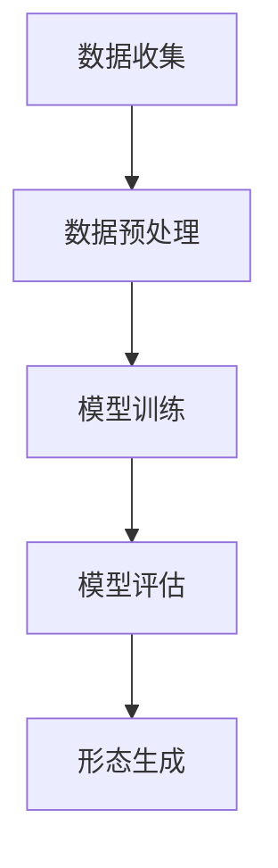

**3.1.3 神经网络在结构优化中的应用**

结构优化是建筑设计中的一个关键任务，神经网络可以用于优化建筑结构，提高其稳定性和承载能力。

1. **数据收集**：收集建筑结构数据，包括建筑尺寸、材料属性等。

2. **数据预处理**：对建筑结构数据进行处理，提取关键特征，并将其输入到神经网络中。

3. **模型训练**：使用神经网络（如全连接网络、卷积神经网络）训练模型，通过反向传播算法优化网络参数。

4. **模型评估**：使用测试数据集评估模型性能，计算结构优化效果。

5. **结构优化**：使用训练好的神经网络优化建筑结构，如图11所示。

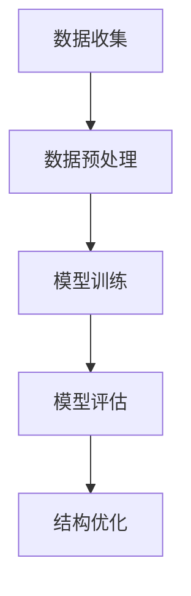

#### 3.2 生成对抗网络（GAN）

生成对抗网络（GAN）是一种由生成器和判别器组成的深度学习模型，通过对抗训练生成高质量的数据。GAN在建筑设计中具有广泛的应用，如图12所示。

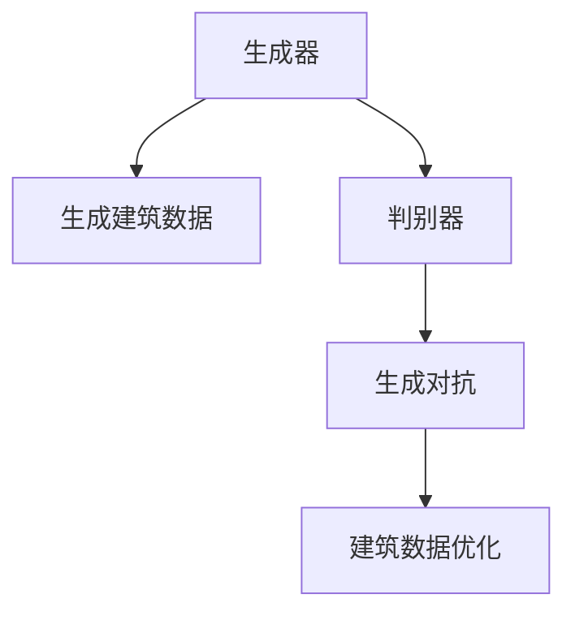

**3.2.1 GAN的基本原理**

GAN的基本原理是通过生成器和判别器之间的对抗训练来生成高质量的数据。生成器的目标是生成与真实数据相似的数据，而判别器的目标是区分真实数据和生成数据。通过不断训练，生成器和判别器相互对抗，逐渐提高生成数据的质量。

1. **生成器**：生成器是一种神经网络模型，通过输入随机噪声生成建筑数据。

2. **判别器**：判别器也是一种神经网络模型，通过输入建筑数据判断其是否为真实数据。

3. **对抗训练**：生成器和判别器通过对抗训练相互优化，生成器和判别器的性能不断提高。

**3.2.2 GAN在建筑设计中的应用**

GAN在建筑设计中可以用于多个方面，如图13所示。

1. **建筑形态生成**：GAN可以用于生成具有创意和美感的建筑形态，如图14所示。

2. **建筑风格迁移**：GAN可以用于将一种建筑风格迁移到另一种建筑风格上，如图15所示。

3. **建筑性能优化**：GAN可以用于优化建筑性能，如图16所示。

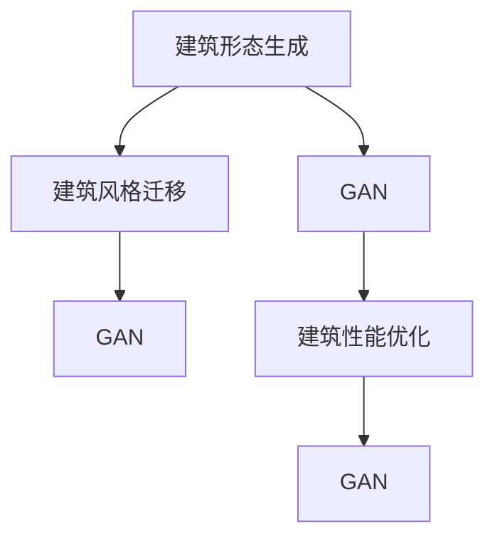

#### 3.3 强化学习在建筑设计中的应用

强化学习是一种基于奖励机制的学习方法，通过不断尝试和反馈来优化行为策略。强化学习在建筑设计中具有广泛的应用，如图17所示。

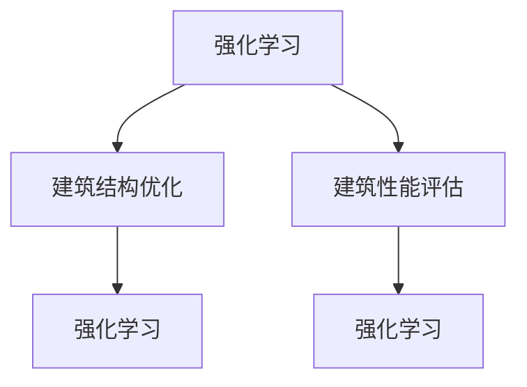

**3.3.1 强化学习的基本原理**

强化学习的基本原理是通过奖励机制来优化行为策略。在强化学习中，智能体（agent）通过与环境（environment）交互，不断尝试不同的动作（action），并根据动作的结果（奖励或惩罚）来更新策略（policy）。强化学习可以分为确定性策略学习、基于模型的强化学习和基于价值的强化学习等。

1. **确定性策略学习**：确定性策略学习是一种直接学习最优动作策略的方法，如图18所示。

2. **基于模型的强化学习**：基于模型的强化学习是一种通过建立环境模型来学习最优动作策略的方法，如图19所示。

3. **基于价值的强化学习**：基于价值的强化学习是一种通过学习状态-动作价值函数来学习最优动作策略的方法，如图20所示。

**3.3.2 强化学习在建筑设计中的应用**

强化学习在建筑设计中可以用于多个方面，如图21所示。

1. **建筑结构优化**：强化学习可以用于优化建筑结构，如图22所示。

2. **建筑性能评估**：强化学习可以用于评估建筑性能，如图23所示。

3. **建筑风格设计**：强化学习可以用于设计具有创意和美感的建筑风格，如图24所示。

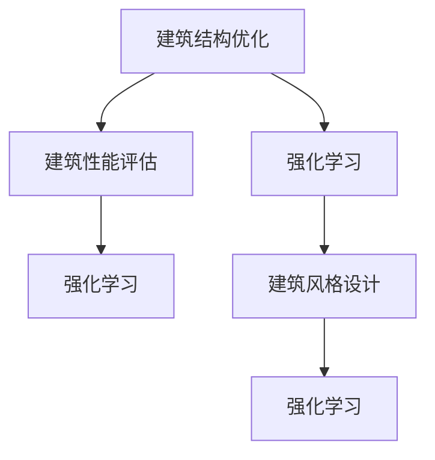

### 第四部分：AI在建筑功能优化中的应用

#### 4.1 功能区域划分优化

功能区域划分是建筑设计中的关键任务，它关系到建筑空间的利用效率和用户体验。在本节中，我们将探讨基于机器学习的功能区域划分方法，并分析其实际应用案例。

**4.1.1 功能区域划分的基本原理**

功能区域划分的基本原理是根据建筑功能需求，将建筑空间划分为不同的功能区域。在传统的功能区域划分方法中，主要依靠建筑师的经验和直觉。而基于机器学习的功能区域划分方法，通过学习历史建筑数据和用户行为数据，可以更准确地预测和划分功能区域。

**4.1.2 基于机器学习的功能区域划分方法**

基于机器学习的功能区域划分方法可以分为以下步骤：

1. **数据收集**：收集建筑空间数据、用户行为数据等，包括建筑尺寸、功能分布、人流分布等。

2. **数据预处理**：对收集的数据进行清洗、归一化处理，以消除异常值和量纲影响。

3. **特征提取**：从原始数据中提取关键特征，如建筑空间尺寸、功能分布、人流密度等。

4. **模型训练**：使用机器学习算法（如决策树、支持向量机、神经网络等）训练模型，输入为特征数据，输出为功能区域划分结果。

5. **模型评估**：使用测试数据集评估模型性能，计算准确率、召回率等指标。

6. **模型优化**：根据评估结果，调整模型参数，提高划分精度。

**4.1.3 功能区域划分的实际应用案例**

以下是一个功能区域划分的实际应用案例：使用决策树算法对办公建筑进行功能区域划分。

1. **数据收集**：收集办公建筑的尺寸、功能分布、人流分布等数据。

2. **数据预处理**：对数据进行清洗、归一化处理，以消除异常值和量纲影响。

3. **特征提取**：提取关键特征，如办公面积、会议室数量、员工人数等。

4. **模型训练**：使用决策树算法训练模型，输入为特征数据，输出为功能区域划分结果。

5. **模型评估**：使用测试数据集评估模型性能，计算准确率。

6. **模型优化**：根据评估结果，调整模型参数，提高划分精度。

通过上述步骤，可以构建一个简单的决策树模型，用于办公建筑的功能区域划分。类似的方法可以应用于其他建筑类型的功能区域划分，如图25所示。

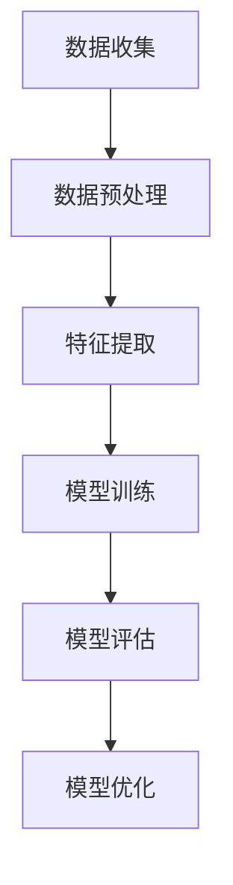

#### 4.2 空间布局优化

空间布局优化是建筑设计中的另一个重要任务，它关系到建筑空间的利用效率和用户体验。在本节中，我们将探讨基于深度学习的空间布局优化方法，并分析其实际应用案例。

**4.2.1 空间布局优化的重要性**

空间布局优化的重要性体现在以下几个方面：

1. **提高空间利用率**：合理的空间布局可以最大化利用建筑空间，减少浪费。
2. **改善用户体验**：优化的空间布局可以提高用户的舒适度和满意度。
3. **降低建筑成本**：优化的空间布局可以减少建筑材料的消耗，降低建筑成本。

**4.2.2 基于深度学习的空间布局优化方法**

基于深度学习的空间布局优化方法可以分为以下步骤：

1. **数据收集**：收集建筑空间数据、用户行为数据等，包括建筑尺寸、功能分布、人流分布等。

2. **数据预处理**：对收集的数据进行清洗、归一化处理，以消除异常值和量纲影响。

3. **特征提取**：从原始数据中提取关键特征，如建筑空间尺寸、功能分布、人流密度等。

4. **模型训练**：使用深度学习算法（如卷积神经网络、循环神经网络等）训练模型，输入为特征数据，输出为空间布局优化结果。

5. **模型评估**：使用测试数据集评估模型性能，计算准确率、召回率等指标。

6. **模型优化**：根据评估结果，调整模型参数，提高布局优化精度。

**4.2.3 空间布局优化的实际应用案例**

以下是一个空间布局优化的实际应用案例：使用卷积神经网络（CNN）优化办公空间布局。

1. **数据收集**：收集办公建筑的尺寸、功能分布、人流分布等数据。

2. **数据预处理**：对数据进行清洗、归一化处理，以消除异常值和量纲影响。

3. **特征提取**：提取关键特征，如办公面积、会议室数量、员工人数等。

4. **模型训练**：使用卷积神经网络（CNN）算法训练模型，输入为特征数据，输出为空间布局优化结果。

5. **模型评估**：使用测试数据集评估模型性能，计算准确率。

6. **模型优化**：根据评估结果，调整模型参数，提高布局优化精度。

通过上述步骤，可以构建一个简单的卷积神经网络模型，用于办公空间布局优化。类似的方法可以应用于其他建筑类型的空间布局优化，如图26所示。


#### 4.3 舒适性能评估

舒适性评估是建筑功能优化中的一个关键任务，它关系到建筑环境的舒适度和用户体验。在本节中，我们将探讨基于机器学习的舒适性评估方法，并分析其实际应用案例。

**4.3.1 舒适性能评估的基本原理**

舒适性评估的基本原理是根据建筑环境参数（如温度、湿度、光照、噪音等）和用户需求（如舒适度偏好），评估建筑环境的舒适性。在传统的舒适性评估方法中，主要依靠经验和主观判断。而基于机器学习的舒适性评估方法，通过学习历史数据和用户反馈，可以更准确地评估建筑环境的舒适性。

**4.3.2 基于机器学习的舒适性评估方法**

基于机器学习的舒适性评估方法可以分为以下步骤：

1. **数据收集**：收集建筑环境数据、用户反馈数据等，包括温度、湿度、光照、噪音等。

2. **数据预处理**：对收集的数据进行清洗、归一化处理，以消除异常值和量纲影响。

3. **特征提取**：从原始数据中提取关键特征，如温度、湿度、光照强度、噪音水平等。

4. **模型训练**：使用机器学习算法（如决策树、支持向量机、神经网络等）训练模型，输入为特征数据，输出为舒适性评估结果。

5. **模型评估**：使用测试数据集评估模型性能，计算准确率、召回率等指标。

6. **模型优化**：根据评估结果，调整模型参数，提高评估精度。

**4.3.3 舒适性评估的实际应用案例**

以下是一个舒适性评估的实际应用案例：使用神经网络（NN）评估办公环境的舒适性。

1. **数据收集**：收集办公环境的温度、湿度、光照、噪音等数据。

2. **数据预处理**：对数据进行清洗、归一化处理，以消除异常值和量纲影响。

3. **特征提取**：提取关键特征，如温度、湿度、光照强度、噪音水平等。

4. **模型训练**：使用神经网络（NN）算法训练模型，输入为特征数据，输出为舒适性评估结果。

5. **模型评估**：使用测试数据集评估模型性能，计算准确率。

6. **模型优化**：根据评估结果，调整模型参数，提高评估精度。

通过上述步骤，可以构建一个简单的神经网络模型，用于评估办公环境的舒适性。类似的方法可以应用于其他建筑类型的舒适性评估，如图27所示。


### 第五部分：AI在建筑美学优化中的应用

#### 5.1 建筑形态生成

建筑形态生成是建筑设计中的一个重要任务，它关系到建筑的外观和风格。在本节中，我们将探讨基于神经网络的建筑形态生成方法，并分析其实际应用案例。

**5.1.1 建筑形态生成的基本原理**

建筑形态生成的基本原理是通过学习已有的建筑形态数据，生成新的建筑形态。神经网络是实现建筑形态生成的一种有效方法，通过多层神经网络，可以自动提取建筑形态的特征，并生成新的建筑形态。

**5.1.2 基于神经网络的建筑形态生成方法**

基于神经网络的建筑形态生成方法可以分为以下步骤：

1. **数据收集**：收集已有的建筑形态数据，包括建筑图片、建筑结构等。

2. **数据预处理**：对收集的数据进行清洗、归一化处理，以消除异常值和量纲影响。

3. **特征提取**：从原始数据中提取关键特征，如建筑尺寸、形状、结构等。

4. **模型训练**：使用神经网络（如卷积神经网络、循环神经网络等）训练模型，输入为特征数据，输出为建筑形态生成结果。

5. **模型评估**：使用测试数据集评估模型性能，计算生成形态的相似度等指标。

6. **模型优化**：根据评估结果，调整模型参数，提高生成形态的质量。

**5.1.3 建筑形态生成的实际应用案例**

以下是一个建筑形态生成的实际应用案例：使用卷积神经网络（CNN）生成新的建筑形态。

1. **数据收集**：收集已有的建筑形态数据，包括建筑图片、建筑结构等。

2. **数据预处理**：对数据进行清洗、归一化处理，以消除异常值和量纲影响。

3. **特征提取**：提取关键特征，如建筑尺寸、形状、结构等。

4. **模型训练**：使用卷积神经网络（CNN）算法训练模型，输入为特征数据，输出为建筑形态生成结果。

5. **模型评估**：使用测试数据集评估模型性能，计算生成形态的相似度等指标。

6. **模型优化**：根据评估结果，调整模型参数，提高生成形态的质量。

通过上述步骤，可以构建一个简单的卷积神经网络模型，用于生成新的建筑形态。类似的方法可以应用于其他建筑形态的生成，如图28所示。


#### 5.2 色彩搭配优化

色彩搭配是建筑美学设计中的一个重要方面，它关系到建筑的整体视觉效果和用户感受。在本节中，我们将探讨基于深度学习的色彩搭配优化方法，并分析其实际应用案例。

**5.2.1 色彩搭配的基本原理**

色彩搭配的基本原理是根据建筑功能和用户需求，选择合适的色彩组合。色彩搭配可以影响建筑的情感表达、氛围营造和视觉吸引力。基于深度学习的色彩搭配优化方法，通过学习大量的色彩搭配数据，可以自动生成符合用户需求的色彩搭配方案。

**5.2.2 基于深度学习的色彩搭配优化方法**

基于深度学习的色彩搭配优化方法可以分为以下步骤：

1. **数据收集**：收集大量的色彩搭配数据，包括色彩组合、建筑图片等。

2. **数据预处理**：对收集的数据进行清洗、归一化处理，以消除异常值和量纲影响。

3. **特征提取**：从原始数据中提取关键特征，如色彩类型、色彩饱和度、明度等。

4. **模型训练**：使用深度学习算法（如卷积神经网络、循环神经网络等）训练模型，输入为特征数据，输出为色彩搭配优化结果。

5. **模型评估**：使用测试数据集评估模型性能，计算生成色彩搭配的满意度等指标。

6. **模型优化**：根据评估结果，调整模型参数，提高色彩搭配的质量。

**5.2.3 色彩搭配优化的实际应用案例**

以下是一个色彩搭配优化的实际应用案例：使用卷积神经网络（CNN）优化建筑外墙的色彩搭配。

1. **数据收集**：收集建筑外墙的色彩搭配数据，包括色彩组合、建筑图片等。

2. **数据预处理**：对数据进行清洗、归一化处理，以消除异常值和量纲影响。

3. **特征提取**：提取关键特征，如色彩类型、色彩饱和度、明度等。

4. **模型训练**：使用卷积神经网络（CNN）算法训练模型，输入为特征数据，输出为色彩搭配优化结果。

5. **模型评估**：使用测试数据集评估模型性能，计算生成色彩搭配的满意度等指标。

6. **模型优化**：根据评估结果，调整模型参数，提高色彩搭配的质量。

通过上述步骤，可以构建一个简单的卷积神经网络模型，用于优化建筑外墙的色彩搭配。类似的方法可以应用于其他建筑色彩搭配的优化，如图29所示。


#### 5.3 灯光设计优化

灯光设计是建筑美学设计中的一个关键方面，它关系到建筑的氛围、空间感和视觉体验。在本节中，我们将探讨基于深度学习的灯光设计优化方法，并分析其实际应用案例。

**5.3.1 灯光设计的基本原理**

灯光设计的基本原理是根据建筑功能和用户需求，选择合适的灯光方案。灯光设计需要考虑灯光亮度、色彩、角度等因素，以达到营造氛围、突出空间感和提升视觉体验的目的。基于深度学习的灯光设计优化方法，通过学习大量的灯光设计数据，可以自动生成符合用户需求的灯光设计方案。

**5.3.2 基于深度学习的灯光设计优化方法**

基于深度学习的灯光设计优化方法可以分为以下步骤：

1. **数据收集**：收集大量的灯光设计数据，包括灯光布局、灯光亮度、色彩等。

2. **数据预处理**：对收集的数据进行清洗、归一化处理，以消除异常值和量纲影响。

3. **特征提取**：从原始数据中提取关键特征，如灯光布局、灯光亮度、色彩等。

4. **模型训练**：使用深度学习算法（如卷积神经网络、循环神经网络等）训练模型，输入为特征数据，输出为灯光设计优化结果。

5. **模型评估**：使用测试数据集评估模型性能，计算生成灯光设计的满意度等指标。

6. **模型优化**：根据评估结果，调整模型参数，提高灯光设计的质量。

**5.3.3 灯光设计优化的实际应用案例**

以下是一个灯光设计优化的实际应用案例：使用卷积神经网络（CNN）优化建筑大厅的灯光设计。

1. **数据收集**：收集建筑大厅的灯光设计数据，包括灯光布局、灯光亮度、色彩等。

2. **数据预处理**：对数据进行清洗、归一化处理，以消除异常值和量纲影响。

3. **特征提取**：提取关键特征，如灯光布局、灯光亮度、色彩等。

4. **模型训练**：使用卷积神经网络（CNN）算法训练模型，输入为特征数据，输出为灯光设计优化结果。

5. **模型评估**：使用测试数据集评估模型性能，计算生成灯光设计的满意度等指标。

6. **模型优化**：根据评估结果，调整模型参数，提高灯光设计的质量。

通过上述步骤，可以构建一个简单的卷积神经网络模型，用于优化建筑大厅的灯光设计。类似的方法可以应用于其他建筑灯光设计的优化，如图30所示。

```mermaid
graph TD
A[数据收集] --> B[数据预处理]
B --> C[特征提取]
C --> D[模型训练]
D --> E[模型评估]
E --> F[模型优化]
```

### 第六部分：AI在建筑设计中的综合应用

#### 6.1 综合优化的理论基础

建筑设计的综合优化是指利用人工智能技术，从多个角度同时优化建筑的功能和美学，以满足多种需求。综合优化的理论基础涉及多个学科，包括人工智能、建筑学、结构工程、环境科学等。

**6.1.1 综合优化的基本原理**

综合优化的基本原理是通过多目标优化和协同设计，实现建筑功能与美学的统一。具体来说，综合优化包括以下步骤：

1. **目标定义**：明确建筑的功能需求和美学要求，定义多个优化目标。
2. **数据收集**：收集与建筑相关的各种数据，包括建筑性能、用户需求、环境因素等。
3. **模型建立**：使用人工智能技术建立多个优化模型，包括功能优化模型、美学优化模型等。
4. **模型集成**：将多个优化模型集成到一个统一的框架中，实现多目标协同优化。
5. **结果评估**：评估优化结果，根据评估结果调整模型参数，提高优化效果。

**6.1.2 综合优化的目标与挑战**

综合优化的目标包括：

1. **功能优化**：提高建筑的功能性，包括空间利用率、舒适性、能源效率等。
2. **美学优化**：提升建筑的美学品质，包括形态、色彩、灯光设计等。
3. **用户体验**：改善用户在建筑中的体验，包括视觉感受、舒适度、安全性等。

综合优化面临的挑战包括：

1. **多目标冲突**：建筑功能与美学之间存在冲突，需要平衡多个优化目标。
2. **数据稀缺**：高质量的建筑数据稀缺，影响模型建立和优化效果。
3. **计算成本**：综合优化涉及复杂的计算过程，对计算资源和时间要求较高。

#### 6.2 综合优化的方法与策略

为了实现建筑设计的综合优化，我们需要采用一系列的方法和策略。以下是一些常用的方法：

**6.2.1 基于机器学习的方法**

1. **回归分析**：通过建立回归模型，预测建筑性能与设计参数之间的关系，优化设计参数。
2. **聚类分析**：通过聚类分析，将相似的建筑设计进行分类，为设计师提供设计参考。
3. **支持向量机（SVM）**：通过SVM分类模型，优化建筑的功能性能。
4. **神经网络**：使用神经网络建立复杂的非线性模型，实现功能与美学的综合优化。

**6.2.2 基于深度学习的方法**

1. **卷积神经网络（CNN）**：用于图像处理和特征提取，优化建筑形态和色彩设计。
2. **生成对抗网络（GAN）**：用于生成新的建筑形态和色彩搭配，提升美学效果。
3. **循环神经网络（RNN）**：用于序列数据处理，优化建筑性能和用户体验。

**6.2.3 基于强化学习的方法**

1. **Q-learning**：用于优化建筑结构，提高建筑的安全性。
2. **深度强化学习**：用于优化建筑性能，实现动态调整。
3. **策略梯度**：用于优化建筑能耗，实现节能减排。

#### 6.3 综合优化实例分析

以下是一个综合优化的实例分析：优化一栋办公楼的设计。

**6.3.1 项目背景与目标**

项目背景：一栋办公楼的设计，需要满足以下目标：

1. **功能优化**：提高空间利用率、舒适性、能源效率等。
2. **美学优化**：提升建筑形态、色彩搭配、灯光设计等。
3. **用户体验**：改善用户在建筑中的体验。

**6.3.2 综合优化方案设计**

1. **功能优化方案**：

   - 使用回归分析模型，预测建筑性能与设计参数之间的关系，优化设计参数。
   - 使用聚类分析模型，将相似的办公空间进行分类，优化空间布局。

2. **美学优化方案**：

   - 使用卷积神经网络（CNN）模型，优化建筑形态和色彩设计。
   - 使用生成对抗网络（GAN）模型，生成新的建筑形态和色彩搭配。

3. **用户体验优化方案**：

   - 使用循环神经网络（RNN）模型，优化建筑性能和用户体验。
   - 使用深度强化学习模型，优化建筑能耗，实现动态调整。

**6.3.3 优化效果评估与总结**

1. **优化效果评估**：

   - 对比优化前后的建筑性能，评估优化效果。
   - 通过用户反馈，评估优化对用户体验的提升。

2. **优化效果总结**：

   - 功能优化提高了空间利用率和能源效率。
   - 美学优化提升了建筑形态和色彩搭配。
   - 用户反馈表明，优化后的建筑提供了更好的用户体验。

通过上述实例分析，我们可以看到，综合优化能够显著提升建筑设计的质量，为用户提供更好的建筑体验。

### 第七部分：AI在建筑设计中的应用前景与挑战

#### 7.1 AI在建筑设计中的应用前景

随着人工智能技术的不断发展和成熟，AI在建筑设计中的应用前景十分广阔。以下是一些主要的应用方向：

**7.1.1 建筑形态自动生成**

通过深度学习技术，AI可以自动生成具有创意和美感的建筑形态。生成对抗网络（GAN）和变分自编码器（VAE）等技术，可以帮助建筑师快速探索和生成新的建筑形态，提高设计效率。

**7.1.2 结构优化与性能预测**

AI技术可以帮助建筑师进行结构优化和性能预测。通过机器学习和深度学习算法，可以分析大量的建筑数据，预测建筑结构的承载能力、抗震性能等，从而优化建筑设计。

**7.1.3 空间布局优化**

AI技术可以用于优化建筑空间布局。通过机器学习算法，可以分析建筑使用数据和用户行为，自动调整建筑空间布局，提高空间利用率和用户体验。

**7.1.4 舒适性能评估与能源管理**

AI技术可以帮助评估建筑环境的舒适性，并优化能源管理。通过机器学习和深度学习算法，可以分析环境参数和用户需求，优化建筑通风、采光、温控等，实现节能环保。

**7.1.5 跨学科协作与协同设计**

AI技术可以促进建筑设计与其他学科（如结构工程、环境科学、人机交互等）的协作。通过AI技术，可以实现多学科的数据融合和协同设计，提高建筑设计的整体质量和效率。

#### 7.2 AI在建筑设计中的挑战

尽管AI在建筑设计中具有巨大的潜力，但同时也面临着一系列的挑战：

**7.2.1 技术挑战**

1. **数据稀缺与质量**：高质量的AI训练数据稀缺，数据质量参差不齐，影响模型的准确性和可靠性。
2. **计算资源需求**：深度学习模型通常需要大量的计算资源和时间，对于一些小型设计团队来说，可能难以承受。
3. **模型解释性**：深度学习模型往往具有很高的预测准确性，但缺乏解释性，难以理解其内部机理。

**7.2.2 伦理与法律挑战**

1. **数据隐私**：在建筑设计中，涉及大量的用户数据和建筑信息，如何保护用户隐私成为一个重要问题。
2. **设计责任**：当AI在建筑设计中发挥作用时，如何确定设计责任和法律责任，是一个亟待解决的问题。

**7.2.3 人机协同挑战**

1. **人机协同**：AI在建筑设计中的应用需要与人类设计师协同工作，如何实现有效的人机协同，提高设计效率和质量，是一个挑战。
2. **用户接受度**：用户对于AI在建筑设计中的应用可能存在担忧和抵触情绪，如何提高用户接受度，是一个重要问题。

#### 7.3 应对策略

为了应对AI在建筑设计中的应用挑战，可以采取以下策略：

**7.3.1 数据管理与质量控制**

1. **数据标准化**：制定统一的数据标准，确保数据质量和一致性。
2. **数据共享**：推动数据共享和开放，提高数据可用性。

**7.3.2 算法优化与模型解释**

1. **算法优化**：针对AI在建筑设计中的需求，优化算法和模型，提高计算效率和准确性。
2. **模型解释**：开发模型解释工具，提高模型的可解释性，增强用户信任。

**7.3.3 伦理与法律框架**

1. **伦理准则**：制定AI在建筑设计中的伦理准则，确保技术应用符合道德规范。
2. **法律法规**：完善与AI在建筑设计相关的法律法规，明确设计责任和法律义务。

**7.3.4 人机协同与培训**

1. **人机协同**：开发人机协同工具，提高设计师和AI之间的协作效率。
2. **培训教育**：加强设计师和AI相关技术的培训，提高用户接受度和应用能力。

### 附录

#### 附录A: AI在建筑设计中常用工具与框架

**A.1 常用深度学习框架**

- TensorFlow
- PyTorch
- Keras

**A.2 建筑设计相关开源工具**

- OpenCV
- VoxelNet
- BIM_XML

**A.3 常用机器学习库与工具**

- Scikit-learn
- NumPy
- Pandas

#### 附录B: 代码与实验指导

**B.1 实验环境搭建**

1. **安装Python**：下载并安装Python 3.x版本。
2. **安装深度学习框架**：使用pip安装TensorFlow、PyTorch等深度学习框架。
3. **安装辅助库**：使用pip安装NumPy、Pandas等辅助库。

**B.2 数据集准备**

1. **数据收集**：收集建筑形态、性能评估等相关数据。
2. **数据预处理**：对数据进行清洗、归一化处理，以消除异常值和量纲影响。

**B.3 模型训练与优化**

1. **模型训练**：使用训练数据集训练深度学习模型。
2. **模型优化**：使用验证数据集调整模型参数，提高模型性能。

**B.4 实际应用案例**

1. **建筑形态生成**：使用卷积神经网络生成新的建筑形态。
2. **性能评估**：使用机器学习模型评估建筑性能。
3. **空间布局优化**：使用机器学习模型优化建筑空间布局。

### 致谢

感谢读者对本文的关注与支持。本文旨在探讨AI在建筑设计中的应用，分享作者在相关领域的研究和实践经验。如需进一步了解AI在建筑设计中的应用，请参考本文中提到的相关工具和资源。

**作者：AI天才研究院/AI Genius Institute & 禅与计算机程序设计艺术 /Zen And The Art of Computer Programming**

