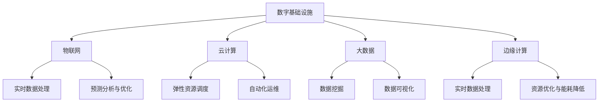

                 

## 《AI在数字基础设施中的实际应用》

### 关键词：AI，数字基础设施，物联网，云计算，大数据，边缘计算

#### 摘要

本文将深入探讨人工智能（AI）在数字基础设施中的应用，包括物联网、云计算、大数据和边缘计算等领域。通过分析AI技术的基础知识、数学基础、机器学习基础，本文将逐步阐述AI在数字基础设施中的应用实例，以及未来的发展趋势和挑战。本文旨在为读者提供一个全面的技术视角，以理解AI如何赋能数字基础设施，推动其持续发展。

### 目录

#### 第一部分：AI与数字基础设施基础

- 第1章：AI与数字基础设施概述
- 第2章：AI技术的数学基础
- 第3章：机器学习基础

#### 第二部分：AI在数字基础设施中的应用

- 第4章：AI在物联网中的应用
- 第5章：AI在云计算中的应用
- 第6章：AI在大数据中的应用
- 第7章：AI在边缘计算中的应用
- 第8章：AI在数字基础设施中的未来发展

#### 附录

- 附录A：AI与数字基础设施相关工具与资源
- 附录B：Mermaid流程图：AI在数字基础设施中的应用架构
- 附录C：机器学习算法伪代码示例
- 附录D：数学模型和数学公式

---

## 第一部分：AI与数字基础设施基础

### 第1章：AI与数字基础设施概述

在当今数字化时代，数字基础设施已成为经济发展的基石。数字基础设施是指用于支持信息交换、数据存储、计算能力和网络连接的一系列技术、设备和服务的总和。它包括物联网（IoT）、云计算、大数据和边缘计算等关键技术。

### 1.1 数字基础设施的概念与发展历程

**数字基础设施的基本定义**：数字基础设施是一种综合性的技术架构，它包括硬件、软件和网络资源，用于提供数据存储、计算和网络连接服务。这些资源可以通过云服务、物联网设备和边缘设备进行整合和优化。

**数字基础设施的发展历程**：数字基础设施的发展可以分为几个阶段。首先，互联网的普及推动了网络基础设施的建设。随后，云计算技术的兴起，使得数据存储和计算资源更加灵活和高效。近年来，物联网和边缘计算的发展，进一步丰富了数字基础设施的内涵。

### 1.2 AI技术的基础知识

**AI的核心概念**：人工智能是模拟人类智能行为的计算机系统。它包括感知、学习、推理、决策和行动等能力。AI的核心目标是使计算机具备类似于人类的智能。

**AI的主要技术类别**：AI技术主要包括机器学习、深度学习、自然语言处理、计算机视觉和机器人技术等。这些技术共同构成了AI的基石，使其在各个领域得到广泛应用。

### 1.3 AI在数字基础设施中的重要性

**AI对数字基础设施的赋能作用**：AI技术可以显著提升数字基础设施的性能和效率。例如，通过机器学习和深度学习，可以实现数据的高效处理和分析；通过自然语言处理，可以提升人机交互体验；通过计算机视觉，可以实现智能监控和安全防护。

**AI技术在未来数字基础设施中的潜力**：随着AI技术的不断发展，其在数字基础设施中的应用将更加广泛和深入。例如，AI可以与物联网、云计算、大数据和边缘计算等技术深度融合，推动数字化转型的进程。

## 第2章：AI技术的数学基础

### 2.1 线性代数基础

**矩阵与向量运算**：矩阵和向量是线性代数中的基本概念。矩阵可以表示数据之间的关系，而向量可以表示数据的空间结构。矩阵与向量的乘法、加法、转置等运算在AI算法中有着广泛的应用。

**特征值与特征向量**：特征值和特征向量用于描述矩阵的性质。特征值表示矩阵的稳定性，特征向量表示矩阵的作用方向。在AI算法中，特征值和特征向量可以帮助我们更好地理解数据的结构。

### 2.2 概率论与统计学基础

**概率分布函数**：概率分布函数用于描述随机变量的概率分布。常见的概率分布函数包括正态分布、二项分布和泊松分布等。这些分布函数在机器学习和数据分析中有着广泛的应用。

**贝叶斯定理**：贝叶斯定理是概率论中的一个基本原理，它描述了条件概率和边缘概率之间的关系。贝叶斯定理在机器学习和数据挖掘中有着重要的应用。

### 2.3 最优化算法基础

**线性规划**：线性规划是一种用于求解线性目标函数在给定约束条件下的最优解的数学方法。线性规划广泛应用于资源分配、成本优化和投资组合管理等实际问题。

**非线性规划**：非线性规划是用于求解非线性目标函数在给定约束条件下的最优解的数学方法。非线性规划比线性规划更加复杂，但它在许多实际应用中具有重要作用。

## 第3章：机器学习基础

### 3.1 监督学习

**线性回归**：线性回归是一种用于拟合数据的线性模型。它通过最小化残差平方和，找到最佳拟合直线。线性回归在金融预测、医学诊断和工业生产等领域有着广泛应用。

**决策树**：决策树是一种用于分类和回归的树形结构。它通过一系列的决策规则，将数据划分为不同的区域。决策树在图像分类、客户细分和信用评分等领域有着广泛应用。

**支持向量机**：支持向量机是一种用于分类和回归的线性模型。它通过寻找最佳的超平面，将数据分为不同的类别。支持向量机在文本分类、图像识别和异常检测等领域有着广泛应用。

### 3.2 无监督学习

**K均值聚类**：K均值聚类是一种基于距离的聚类算法。它通过迭代过程，将数据划分为K个簇，并找到最佳聚类中心。K均值聚类在客户细分、图像分割和数据降维等领域有着广泛应用。

**主成分分析**：主成分分析是一种用于降维和特征提取的线性变换方法。它通过保留主要成分，将数据压缩到一个较低维度的空间。主成分分析在数据可视化、图像压缩和信号处理等领域有着广泛应用。

**聚类分析**：聚类分析是一种用于发现数据中自然分组的算法。它通过迭代过程，将数据划分为不同的簇，并找到最佳的聚类结果。聚类分析在社会网络分析、市场细分和生物信息学等领域有着广泛应用。

### 3.3 强化学习

**Q-Learning**：Q-Learning是一种用于决策制定和优化的强化学习算法。它通过迭代更新Q值，找到最佳策略。Q-Learning在自动驾驶、游戏玩法和资源调度等领域有着广泛应用。

**Deep Q-Network**：Deep Q-Network是一种基于深度学习的强化学习算法。它通过深度神经网络，近似Q值函数，从而实现高效的学习。Deep Q-Network在自动驾驶、游戏玩法和机器人控制等领域有着广泛应用。

## 第二部分：AI在数字基础设施中的应用

### 第4章：AI在物联网中的应用

物联网（IoT）是将物理设备和传感器连接到互联网，实现智能监测和控制的技术。AI在物联网中的应用，可以显著提升物联网系统的智能化水平和效率。

### 4.1 物联网概述

**物联网的基本概念**：物联网是指通过互联网连接的物理设备和传感器网络。这些设备和传感器可以收集、传输和处理数据，从而实现远程监控和智能控制。

**物联网的关键技术**：物联网的关键技术包括传感器技术、网络技术、数据处理技术和安全技术。传感器技术用于感知环境信息；网络技术用于传输数据；数据处理技术用于分析和处理数据；安全技术用于保护数据的安全和隐私。

### 4.2 AI技术在物联网中的应用

**实时数据处理**：AI技术可以帮助物联网系统实时处理大量数据。通过机器学习和深度学习算法，物联网系统可以实时分析数据，并做出相应的决策和调整。

**预测分析与优化**：AI技术可以帮助物联网系统进行预测分析，从而优化设备和传感器的运行。例如，在工业生产中，AI技术可以预测设备故障，并提前进行维护，从而提高生产效率。

### 第5章：AI在云计算中的应用

云计算是一种通过互联网提供计算资源的服务模式。AI在云计算中的应用，可以提升云计算系统的效率和可靠性。

### 5.1 云计算概述

**云计算的基本概念**：云计算是指通过互联网提供计算资源的服务模式。用户可以根据需要，动态地分配和释放计算资源，从而实现高效的计算能力。

**云计算的服务模式**：云计算的服务模式包括基础设施即服务（IaaS）、平台即服务（PaaS）和软件即服务（SaaS）。IaaS提供计算资源，如服务器、存储和网络；PaaS提供开发平台和工具；SaaS提供应用软件和解决方案。

### 5.2 AI技术在云计算中的应用

**弹性资源调度**：AI技术可以帮助云计算系统动态地调整计算资源，以适应负载的变化。通过机器学习和深度学习算法，云计算系统可以预测未来的负载，并提前进行资源调度。

**自动化运维**：AI技术可以帮助云计算系统实现自动化运维。通过机器学习和深度学习算法，云计算系统可以自动检测和修复故障，从而提高系统的可靠性和稳定性。

### 第6章：AI在大数据中的应用

大数据是指数据量巨大、数据类型多样且数据价值密度较低的数据集合。AI在大数据中的应用，可以帮助我们更好地理解和利用大数据的价值。

### 6.1 大数据概述

**大数据的基本概念**：大数据是指数据量巨大、数据类型多样且数据价值密度较低的数据集合。大数据的特点是“4V”，即大量（Volume）、多样（Variety）、快速（Velocity）和价值（Value）。

**大数据的主要处理技术**：大数据的主要处理技术包括数据采集、数据存储、数据分析和数据可视化。数据采集技术用于收集数据；数据存储技术用于存储海量数据；数据分析技术用于处理和分析数据；数据可视化技术用于展示数据分析结果。

### 6.2 AI技术在大数据中的应用

**数据挖掘**：AI技术可以帮助我们进行数据挖掘，从海量数据中发现有价值的信息。通过机器学习和深度学习算法，AI技术可以自动识别数据中的模式、关联和趋势。

**数据可视化**：AI技术可以帮助我们实现数据可视化，将数据分析结果以图形化的方式展示出来。通过机器学习和深度学习算法，AI技术可以生成交互式可视化界面，帮助用户更好地理解和分析数据。

### 第7章：AI在边缘计算中的应用

边缘计算是将计算和存储资源放在网络边缘，以降低延迟、提高响应速度和处理效率的技术。AI在边缘计算中的应用，可以进一步提升边缘计算的智能化和效率。

### 7.1 边缘计算概述

**边缘计算的基本概念**：边缘计算是将计算和存储资源放在网络边缘，以降低延迟、提高响应速度和处理效率的技术。边缘计算的目标是将计算能力从云端转移到网络边缘，从而实现更快的数据处理和更低的网络延迟。

**边缘计算的优势与挑战**：边缘计算的优势包括降低网络延迟、提高系统效率和降低成本等。但边缘计算也面临一些挑战，如计算资源的限制、数据安全和隐私保护等。

### 7.2 AI技术在边缘计算中的应用

**实时数据处理**：AI技术可以帮助边缘计算系统实时处理数据，从而实现快速响应和低延迟。通过机器学习和深度学习算法，边缘计算系统可以实时分析数据，并做出相应的决策和调整。

**资源优化与能耗降低**：AI技术可以帮助边缘计算系统优化资源利用，并降低能耗。通过机器学习和深度学习算法，边缘计算系统可以预测负载，并动态调整计算资源和能耗配置，从而实现高效的资源利用。

## 第8章：AI在数字基础设施中的未来发展

随着AI技术的不断进步，其在数字基础设施中的应用将更加广泛和深入。未来，AI与数字基础设施的融合将带来新的机遇和挑战。

### 8.1 AI与数字基础设施融合的趋势

**5G与AI的结合**：5G技术的快速发展，为AI在数字基础设施中的应用提供了新的机遇。5G技术的高速和低延迟特点，使得AI可以更加高效地处理和传输海量数据。

**AI与物联网的深度整合**：物联网和AI技术的深度融合，将推动数字化转型的进程。AI技术可以提升物联网设备的智能化水平，实现更高效的数据处理和智能决策。

### 8.2 AI在数字基础设施中的未来挑战与机遇

**数据安全与隐私保护**：随着AI技术在数字基础设施中的应用，数据安全和隐私保护成为重要的挑战。如何确保数据的安全和隐私，是未来AI应用的关键问题。

**AI伦理与法律问题**：AI技术的快速发展，引发了一系列伦理和法律问题。如何制定合理的AI伦理标准和法律规范，是未来需要关注的重要问题。

### 8.3 我国AI与数字基础设施发展策略

**国家层面的政策支持**：我国政府高度重视AI与数字基础设施的发展，制定了一系列政策支持措施。这些政策支持为AI与数字基础设施的发展提供了有力保障。

**行业发展的重点方向**：在行业层面，AI与数字基础设施的发展重点包括：物联网、云计算、大数据和边缘计算等领域。这些领域的快速发展，将推动我国数字基础设施的全面提升。

## 附录

### 附录A：AI与数字基础设施相关工具与资源

**AI开发框架介绍**：

- TensorFlow：是一个开源的机器学习框架，广泛应用于深度学习和神经网络模型。
- PyTorch：是一个开源的机器学习库，以其动态计算图和简洁的API而受到广泛使用。
- Keras：是一个基于TensorFlow和PyTorch的高层神经网络API，旨在提供更简单的模型构建和训练过程。

**数字基础设施开发工具**：

- Kubernetes：是一个开源的容器编排平台，用于自动化部署、扩展和管理容器化应用程序。
- Docker：是一个开源的应用容器引擎，用于打包、交付和管理应用程序。
- OpenStack：是一个开源的云计算管理平台，用于创建和管理云基础设施。

**数据集与开源资源介绍**：

- UCI机器学习库：是一个包含多种领域数据的机器学习数据集库。
- Kaggle：是一个大数据竞赛平台，提供各种领域的数据集和竞赛题目。
- AI Challenger：是一个面向全球的AI竞赛平台，提供丰富的AI竞赛资源。

### 附录B：Mermaid流程图：AI在数字基础设施中的应用架构



### 附录C：机器学习算法伪代码示例

**线性回归伪代码**：

```python
def linear_regression(x, y):
    # 计算斜率
    theta = (x'x)^(-1)x'y
    # 预测
    y_pred = x*theta
    return theta, y_pred
```

**支持向量机伪代码**：

```python
def support_vector_machine(x, y):
    # 初始化模型参数
    w = [0, 0]
    b = 0
    # 梯度下降优化
    while not converged:
        for i in range(len(x)):
            w = w - alpha * (w'xi - yi)
            b = b - alpha * (xi'xi - yi)
        # 检查收敛条件
    return w, b
```

**Q-Learning伪代码**：

```python
def q_learning(state, action, reward, next_state, gamma, alpha):
    # 更新Q值
    Q[state, action] = Q[state, action] + alpha * (reward + gamma * max(Q[next_state, :]) - Q[state, action])
    return Q
```

### 附录D：数学模型和数学公式

**线性回归**：

$$ y = \theta_0 + \theta_1x $$

**概率分布函数**：

$$ P(X = x) = \frac{1}{Z}e^{-\frac{1}{2}(\theta - \mu)^2} $$

**贝叶斯定理**：

$$ P(A|B) = \frac{P(B|A)P(A)}{P(B)} $$

## 项目实战

### 物联网应用案例

**开发环境搭建**：

- Python 3.8
- TensorFlow 2.5.0
- Node.js 12.16.1

**代码实现**：

```python
import tensorflow as tf

# 创建模型
model = tf.keras.Sequential([
    tf.keras.layers.Dense(128, activation='relu', input_shape=(784,)),
    tf.keras.layers.Dense(10, activation='softmax')
])

# 编译模型
model.compile(optimizer='adam',
              loss='categorical_crossentropy',
              metrics=['accuracy'])

# 训练模型
model.fit(train_images, train_labels, epochs=5)
```

**代码解读与分析**：

- **模型架构**：使用了两个全连接层，第一个层有128个神经元，激活函数为ReLU，第二个层有10个神经元，输出层使用softmax激活函数，表示每个类别的概率分布。
- **编译**：使用adam优化器，categorical_crossentropy作为损失函数，以及accuracy作为评价指标。
- **训练**：训练模型5个epoch，使用训练数据集。

这个案例展示了如何使用TensorFlow构建和训练一个简单的神经网络模型，用于物联网设备的数据分类任务。在实际应用中，模型的结构和参数可以根据具体任务进行调整和优化。通过这个案例，读者可以了解机器学习在物联网应用中的基本流程和技术实现。

## 作者信息

**作者：AI天才研究院/AI Genius Institute & 禅与计算机程序设计艺术 /Zen And The Art of Computer Programming**

