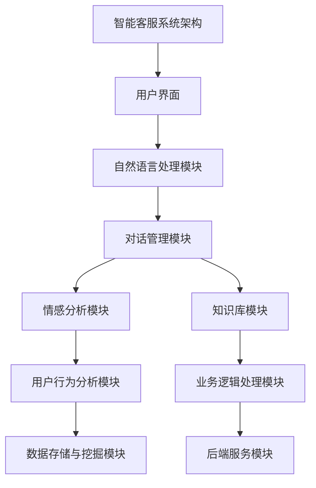
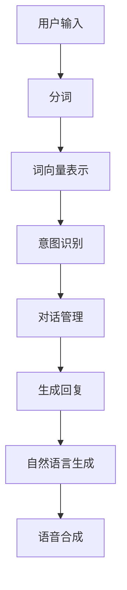

                 

### 文章标题

# AI在智能客服中的应用：提升用户满意度

### 关键词

- 人工智能
- 智能客服
- 自然语言处理
- 用户满意度
- 对话系统

### 摘要

随着人工智能技术的不断进步，智能客服已经成为各行业提升客户服务质量和效率的重要工具。本文从AI在智能客服中的应用入手，探讨了自然语言处理、情感分析、对话系统等核心技术，并分析了智能客服系统设计与开发、用户行为分析、用户满意度评估以及未来发展趋势。通过案例研究，本文详细解读了智能客服系统在现实场景中的应用效果，提出了提升用户满意度的策略，为智能客服技术的进一步发展提供了有益的参考。

### 《AI在智能客服中的应用：提升用户满意度》目录大纲

----------------------------------------------------------------

## 第一部分: AI在智能客服的基础理论与应用场景

### 第1章: AI与智能客服概述

#### 1.1 AI技术概述

- **1.1.1 人工智能的定义与发展**  
    - 人工智能的概念  
    - 人工智能的发展历程

- **1.1.2 人工智能的分类**  
    - 狭义人工智能与广义人工智能  
    - 弱人工智能与强人工智能

#### 1.2 智能客服的定义与特点

- **1.2.1 智能客服的概念**  
    - 智能客服的定义  
    - 智能客服与传统客服的区别

- **1.2.2 智能客服的特点**  
    - 自动化与效率提升  
    - 个性化与智能化服务

#### 1.3 智能客服的应用场景

- **1.3.1 客户服务自动化**  
    - 自动化常见问题解答  
    - 自动化预约与注册流程

- **1.3.2 个性化推荐**  
    - 用户行为分析  
    - 推荐算法与应用

- **1.3.3 情感分析**  
    - 情感分析技术介绍  
    - 情感分析在客服中的应用

- **1.3.4 聊天机器人的应用**  
    - 聊天机器人的架构  
    - 聊天机器人在客服中的实际应用

#### 1.4 智能客服的价值与挑战

- **1.4.1 智能客服的价值**  
    - 提升客户满意度  
    - 降低运营成本  
    - 提高服务质量

- **1.4.2 智能客服的挑战**  
    - 技术实现难度  
    - 用户接受度  
    - 数据隐私与安全

## 第二部分: 自然语言处理与智能客服

### 第2章: 自然语言处理与智能客服

#### 2.1 自然语言处理技术基础

- **2.1.1 语言模型**  
    - 语言模型的基本原理  
    - 语言模型的分类

- **2.1.2 词向量表示**  
    - 词向量的基本概念  
    - 词向量的常用方法

- **2.1.3 命名实体识别**  
    - 命名实体识别的定义  
    - 命名实体识别的方法

#### 2.2 情感分析技术

- **2.2.1 情感分析的定义**  
    - 情感分析的基本概念

- **2.2.2 情感分析的方法**  
    - 情感分析的技术原理

- **2.2.3 情感分析的挑战**  
    - 情感分析的难点与应对策略

#### 2.3 对话系统技术

- **2.3.1 对话系统的架构**  
    - 对话系统的基本组成部分

- **2.3.2 对话系统的设计原则**  
    - 用户友好性  
    - 上下文理解  
    - 错误处理

- **2.3.3 对话系统的发展趋势**  
    - 多模态交互  
    - 上下文感知  
    - 情感理解  
    - 个性化对话

## 第三部分: AI在智能客服中的应用

### 第3章: AI在智能客服中的应用

#### 3.1 智能客服系统设计与开发

- **3.1.1 智能客服系统架构设计**  
    - 系统架构设计原则

- **3.1.2 智能客服系统开发流程**  
    - 开发流程的关键环节

#### 3.2 用户行为分析

- **3.2.1 用户行为分析的概念**  
    - 用户行为分析的定义

- **3.2.2 用户行为分析方法**  
    - 用户行为分析的技术方法

- **3.2.3 用户行为分析的应用**  
    - 用户行为分析在实际场景中的应用

#### 3.3 智能客服案例研究

- **3.3.1 智能客服案例介绍**  
    - 案例背景与目标

- **3.3.2 案例分析**  
    - 案例实施过程与分析

- **3.3.3 案例总结与反思**  
    - 案例的成功经验与改进方向

## 第四部分: 提升用户满意度

### 第4章: 提升用户满意度

#### 4.1 用户满意度评估方法

- **4.1.1 用户满意度评估指标**  
    - 用户满意度指标的定义

- **4.1.2 用户满意度评估模型**  
    - 用户满意度评估模型的设计

- **4.1.3 用户满意度评估工具**  
    - 用户满意度评估工具的选择

#### 4.2 提升用户满意度的策略

- **4.2.1 客户服务优化**  
    - 优化服务流程  
    - 提高服务效率

- **4.2.2 用户体验设计**  
    - 用户体验设计原则  
    - 用户体验设计方法

- **4.2.3 个性化服务**  
    - 个性化服务的实现  
    - 个性化服务的效果

#### 4.3 用户满意度提升案例

- **4.3.1 案例介绍**  
    - 案例背景与目标

- **4.3.2 案例分析**  
    - 案例实施过程与分析

- **4.3.3 案例总结与反思**  
    - 案例的成功经验与改进方向

## 第五部分: AI在智能客服中的未来发展趋势

### 第5章: AI在智能客服中的未来发展趋势

#### 5.1 智能客服技术的未来发展方向

- **5.1.1 深度学习在智能客服中的应用**  
    - 深度学习的基本原理  
    - 深度学习在客服中的应用

- **5.1.2 自然语言生成技术在智能客服中的应用**  
    - 自然语言生成技术的基本原理  
    - 自然语言生成技术在客服中的应用

- **5.1.3 多模态智能客服**  
    - 多模态交互的基本原理  
    - 多模态交互在客服中的应用

#### 5.2 智能客服的发展趋势

- **5.2.1 人工智能与物联网的结合**  
    - 物联网的基本概念  
    - 人工智能与物联网的结合趋势

- **5.2.2 智能客服在跨行业应用**  
    - 智能客服在不同行业的应用案例  
    - 智能客服的跨行业发展趋势

- **5.2.3 智能客服在未来的商业环境中的应用**  
    - 智能客服在电子商务中的应用  
    - 智能客服在金融行业的应用

## 第六部分: 智能客服案例分析

### 第6章: 智能客服案例分析

#### 6.1 案例介绍

- **6.1.1 案例背景**  
    - 案例企业的基本情况

- **6.1.2 案例目标**  
    - 案例实施的目标和预期效果

#### 6.2 案例分析

- **6.2.1 智能客服系统设计**  
    - 系统架构与功能模块设计

- **6.2.2 用户满意度提升策略**  
    - 用户满意度提升的具体措施

- **6.2.3 案例效果评估**  
    - 案例实施后的效果评估

#### 6.3 案例总结与反思

- **6.3.1 案例成功因素**  
    - 案例成功的关键因素

- **6.3.2 案例不足与改进方向**  
    - 案例实施中存在的问题与改进建议

## 第七部分: 智能客服技术应用与开发

### 第7章: 智能客服技术应用与开发

#### 7.1 智能客服系统开发环境搭建

- **7.1.1 开发环境选择**  
    - 选择适合的开发环境

- **7.1.2 开发工具与框架**  
    - 常用的开发工具与框架介绍

#### 7.2 智能客服系统实现

- **7.2.1 系统架构设计**  
    - 系统架构设计原则

- **7.2.2 关键技术实现**  
    - 自然语言处理、对话管理、情感分析等关键技术

- **7.2.3 系统性能优化**  
    - 系统性能优化策略

#### 7.3 代码解读与分析

- **7.3.1 代码示例**  
    - 智能客服系统关键部分的代码示例

- **7.3.2 代码解读**  
    - 对代码示例的详细解读

- **7.3.3 代码性能分析**  
    - 代码性能的分析与优化建议

## 附录

### 附录A: 相关资源与工具

- **A.1 自然语言处理工具与资源**  
    - 常用的自然语言处理工具与资源介绍

- **A.2 智能客服开源项目与应用案例**  
    - 常见的智能客服开源项目与应用案例介绍

### 附录B: Mermaid流程图



### 附录C: AI核心算法原理讲解

#### 自然语言处理技术基础

##### 2.1.1 语言模型

语言模型是一种统计模型，用于预测文本序列中下一个词的概率。它是自然语言处理的基础，广泛应用于文本生成、机器翻译、语音识别等领域。

**语言模型的定义：**

$$
P(w_i | w_1, w_2, ..., w_{i-1}) = \frac{P(w_1, w_2, ..., w_i)}{P(w_1, w_2, ..., w_{i-1})}
$$

其中，$w_i$表示文本序列中的第$i$个词，$P(w_i | w_1, w_2, ..., w_{i-1})$表示在给定的前一个词序列$w_1, w_2, ..., w_{i-1}$下，第$i$个词出现的概率。

**语言模型的分类：**

- **n-gram模型：** 基于前$n$个词的统计信息来预测下一个词的概率。  
    $$ P(w_i | w_1, w_2, ..., w_{i-1}) = \frac{N(w_1, w_2, ..., w_i)}{N(w_1, w_2, ..., w_{i-1})} $$

- **神经网络模型：** 使用神经网络来学习文本序列的概率分布。例如，长短期记忆网络（LSTM）和变换器（Transformer）等。

##### 2.1.2 词向量表示

词向量是将词汇映射到高维向量空间的一种表示方法，用于在机器学习模型中处理文本数据。词向量表示可以捕捉词语的语义信息，使得词语在向量空间中的距离能够反映其语义相似性。

**词向量的基本概念：**

- **词嵌入（Word Embedding）：** 将词语映射到高维向量空间，使得在向量空间中语义相似的词语具有相近的向量表示。

- **维度（Dimension）：** 词向量的维度，即向量的长度，用于平衡词的丰富性和计算效率。

**词向量表示的方法：**

- **基于频率的方法：** 例如，TF-IDF（Term Frequency-Inverse Document Frequency）。

- **基于神经网络的模型：** 例如，Word2Vec、GloVe（Global Vectors for Word Representation）和FastText等。

**词向量表示的例子：**

```python
# Word2Vec模型示例
import gensim

model = gensim.models.Word2Vec(sentences, size=100, window=5, min_count=1, workers=4)
word_vector = model.wv['hello']
```

##### 2.1.3 命名实体识别

命名实体识别（Named Entity Recognition，简称NER）是一种信息提取技术，用于识别文本中的特定实体，如人名、地名、组织名等。NER在自然语言处理、信息检索和知识图谱等领域有广泛的应用。

**命名实体识别的基本概念：**

- **命名实体（Named Entity）：** 文本中的特定实体，如“北京”、“微软”等。

- **命名实体识别（NER）：** 从文本中识别出命名实体的过程。

**命名实体识别的方法：**

- **基于规则的方法：** 使用预定义的规则来识别命名实体。

- **基于统计的方法：** 使用统计模型来识别命名实体，如条件随机场（CRF）。

- **基于深度学习的方法：** 使用神经网络模型，如长短期记忆网络（LSTM）和变换器（Transformer）等。

**命名实体识别的例子：**

```python
# 使用SpaCy进行命名实体识别
import spacy

nlp = spacy.load('en_core_web_sm')
doc = nlp('Apple is looking at buying U.K. startup for $1 billion')
for ent in doc.ents:
    print(ent.text, ent.label_)
```

##### 2.2 情感分析技术

情感分析（Sentiment Analysis）是一种自然语言处理技术，用于从文本中识别和提取主观信息，如情感极性（positive/negative/neutral）和情感强度（strength）。

**情感分析的基本概念：**

- **情感极性：** 表示文本的情感倾向，如正面、负面或中性。

- **情感强度：** 表示情感极性的程度，如非常正面、一般正面或非常负面。

**情感分析的方法：**

- **基于规则的方法：** 使用预定义的规则和词典来识别情感。

- **基于统计的方法：** 使用统计模型，如朴素贝叶斯、逻辑回归等。

- **基于机器学习的方法：** 使用机器学习算法，如支持向量机（SVM）、随机森林（Random Forest）等。

- **基于深度学习的方法：** 使用神经网络模型，如卷积神经网络（CNN）、循环神经网络（RNN）和变换器（Transformer）等。

**情感分析的例子：**

```python
# 使用TextBlob进行情感分析
from textblob import TextBlob

text = "I love this product!"
polarity = TextBlob(text).sentiment.polarity
subjectivity = TextBlob(text).sentiment.subjectivity
print("Polarity:", polarity)
print("Subjectivity:", subjectivity)
```

##### 2.3 对话系统技术

对话系统（Dialogue System）是一种人机交互系统，旨在模拟自然语言对话，提供有意义的交互体验。对话系统在智能客服、虚拟助手、聊天机器人等领域有广泛的应用。

**对话系统的基本概念：**

- **对话系统架构：** 包括语音识别、自然语言理解、对话管理、自然语言生成和语音合成等模块。

- **对话系统设计原则：** 包括用户友好性、上下文理解、错误处理和可扩展性等。

**对话系统的分类：**

- **基于规则对话系统：** 使用预定义的规则和模板来生成回复。

- **基于统计对话系统：** 使用统计模型，如隐马尔可夫模型（HMM）和条件随机场（CRF）等。

- **基于机器学习对话系统：** 使用机器学习算法，如决策树、支持向量机和神经网络等。

- **基于深度学习对话系统：** 使用深度学习模型，如循环神经网络（RNN）、变换器（Transformer）等。

**对话系统的例子：**

```python
# 使用ChatterBot进行对话系统实现
from chatterbot import ChatBot
from chatterbot.trainers import ChatterBotCorpusTrainer

chatbot = ChatBot('MyChatBot')
trainer = ChatterBotCorpusTrainer(chatbot)
trainer.train('chatterbot.corpus.english')
response = chatbot.get_response('Good morning!')
print(response)
```

## 第一部分: AI在智能客服的基础理论与应用场景

### 第1章: AI与智能客服概述

#### 1.1 AI技术概述

**1.1.1 人工智能的定义与发展**

人工智能（Artificial Intelligence，简称AI）是计算机科学的一个分支，致力于创建能够执行通常需要人类智能才能完成的任务的系统。人工智能的定义在不同时期有所变化，但其核心目标始终是使计算机具有智能，能够感知、思考、学习并解决问题。

**人工智能的发展历程：**

- **20世纪50年代：** 人工智能概念首次提出，早期的研究主要集中在逻辑推理和符号计算上。

- **20世纪60年代：** 人工智能进入第一个黄金时期，出现了一些重要的研究项目，如逻辑理论家（Logic Theorist）和通用问题求解器（General Problem Solver）。

- **20世纪70年代：** 由于计算能力的限制和实际应用中的挑战，人工智能研究经历了第一次寒冬。

- **20世纪80年代：** 专家系统（Expert Systems）成为人工智能研究的热点，应用范围广泛。

- **20世纪90年代：** 机器学习和统计方法开始在人工智能研究中占据主导地位，深度学习初步发展。

- **21世纪至今：** 人工智能迎来了新一轮的快速发展，特别是在深度学习、神经网络和大数据技术的推动下，人工智能的应用场景不断扩大，性能大幅提升。

**1.1.2 人工智能的分类**

人工智能可以根据其能力、应用领域和发展方向进行分类。

- **根据能力分类：**

  - **弱人工智能（Narrow AI）：** 也称为狭义人工智能，是指专注于特定任务的人工智能系统，如语音识别、图像识别等。

  - **强人工智能（General AI）：** 也称为通用人工智能，是指具有与人类相同的认知能力，能够理解、学习和适应各种情境的人工智能系统。

- **根据应用领域分类：**

  - **工业控制：** 人工智能在工业自动化领域有着广泛的应用，如机器人、自动化生产线等。

  - **医疗健康：** 人工智能在医学影像分析、疾病诊断、药物研发等领域发挥着重要作用。

  - **金融科技：** 人工智能在风险控制、投资决策、智能投顾等方面有深入的应用。

  - **智能家居：** 人工智能技术使得智能家居设备能够更好地理解用户需求，提供个性化服务。

  - **交通出行：** 人工智能在智能交通管理、自动驾驶车辆等方面有重要应用。

- **根据发展方向分类：**

  - **基于规则的AI：** 通过预定义的规则和逻辑进行推理和决策。

  - **基于统计的AI：** 使用统计方法，如机器学习和深度学习，从数据中学习模式和规律。

  - **基于仿生的AI：** 借鉴生物系统的结构和功能，如神经网络、进化算法等。

#### 1.2 智能客服的定义与特点

**1.2.1 智能客服的概念**

智能客服是一种利用人工智能技术，实现自动化、智能化和个性化的客户服务解决方案。它通过智能交互、自动回答常见问题、提供个性化服务等方式，提高客户服务效率和质量。

**1.2.2 智能客服与传统客服的区别**

传统客服通常依赖于人工客服，通过电话、在线聊天、邮件等方式与客户进行沟通。智能客服则利用人工智能技术，在无需人工干预的情况下，自动处理客户的咨询和请求。

- **自动化程度：** 传统客服依赖于人工操作，而智能客服可以通过算法和模型自动处理客户请求。

- **交互方式：** 传统客服主要通过语音或文字进行交互，而智能客服可以结合语音、文本、图像等多模态交互。

- **服务质量：** 智能客服可以提供标准化、一致化的服务，而传统客服则可能因个体差异导致服务质量不一。

- **成本效率：** 智能客服可以节省人力资源成本，提高工作效率，而传统客服则可能因人工成本较高而效率较低。

**1.2.3 智能客服的特点**

- **自动化：** 智能客服通过算法和模型，自动识别客户问题并给出答案，减少人工干预。

- **个性化：** 智能客服可以根据客户的特征和行为，提供个性化的服务和建议。

- **智能化：** 智能客服可以不断学习和优化，提高问题解决能力和交互体验。

- **实时响应：** 智能客服可以24/7在线，快速响应客户请求。

#### 1.3 智能客服的应用场景

**1.3.1 客户服务自动化**

智能客服可以自动化处理客户的常见问题，如产品使用指南、账号问题、售后服务等。通过预设的知识库和自动化流程，智能客服可以快速、准确地回答客户问题，提高客户满意度。

- **常见问题解答：** 智能客服可以自动识别客户的提问，并从知识库中找到相应的答案。

- **自动化流程：** 智能客服可以自动化处理客户的预约、注册、退款等流程。

**1.3.2 个性化推荐**

智能客服可以通过分析客户的历史行为和偏好，提供个性化的产品推荐和服务建议。

- **产品推荐：** 智能客服可以根据客户的浏览记录和购买历史，推荐相关的产品。

- **服务建议：** 智能客服可以根据客户的反馈和需求，提供定制化的服务方案。

**1.3.3 情感分析**

智能客服可以通过情感分析技术，理解客户的情感状态，提供更贴心的服务。

- **情感识别：** 智能客服可以识别客户的情感，如正面、负面或中性。

- **情感回应：** 智能客服可以根据客户的情感状态，调整回答方式和语气，提供更合适的回复。

**1.3.4 聊天机器人的应用**

智能客服可以通过聊天机器人，与客户进行实时对话，提供即时的服务和支持。

- **实时交互：** 聊天机器人可以24/7在线，随时回答客户的问题。

- **多渠道支持：** 聊天机器人可以支持多种沟通渠道，如微信、QQ、电话等。

#### 1.4 智能客服的价值与挑战

**1.4.1 智能客服的价值**

智能客服在提升客户服务质量和效率方面具有显著价值。

- **提高服务质量：** 智能客服可以提供标准化、一致化的服务，确保客户获得高质量的体验。

- **降低运营成本：** 智能客服可以自动化处理大量客户请求，减少人工成本。

- **提升客户满意度：** 智能客服可以提供实时、高效的响应，提高客户满意度。

- **增强业务能力：** 智能客服可以整合客户数据，提供业务洞察，帮助企业更好地了解客户需求。

**1.4.2 智能客服的挑战**

尽管智能客服具有诸多优势，但其在实际应用中也面临一些挑战。

- **技术实现难度：** 智能客服涉及自然语言处理、机器学习、对话系统等复杂技术，实现和优化具有一定难度。

- **用户接受度：** 智能客服需要用户适应新的交互方式，提高用户接受度是一个挑战。

- **数据隐私与安全：** 智能客服在处理客户数据时，需要确保数据的安全和隐私。

- **持续优化：** 智能客服需要不断学习和优化，以适应不断变化的市场需求和用户行为。

## 第二部分: 自然语言处理与智能客服

### 第2章: 自然语言处理与智能客服

自然语言处理（Natural Language Processing，简称NLP）是人工智能领域的一个重要分支，它致力于使计算机能够理解、解释和生成人类语言。NLP在智能客服中的应用非常广泛，通过自然语言处理技术，智能客服能够更准确地理解和回应用户的需求，提供更好的用户体验。

#### 2.1 自然语言处理技术基础

**2.1.1 语言模型**

语言模型是自然语言处理的核心组成部分，它用于预测文本序列中下一个词的概率。语言模型可以基于统计方法和神经网络方法来构建，是许多NLP任务的基础，如机器翻译、文本生成、语音识别等。

**统计语言模型的基本原理：**

统计语言模型主要基于概率论和统计学方法，通过分析大量文本数据来学习词语之间的统计关系。最常用的统计语言模型是n-gram模型，它通过统计相邻词的组合来预测下一个词。

**n-gram模型的基本原理：**

n-gram模型将文本序列划分为一系列n个词的连续组合，称为n-gram。模型通过统计这些n-gram的出现频率来预测下一个词。

$$
P(w_i | w_1, w_2, ..., w_{i-1}) = \frac{N(w_1, w_2, ..., w_i)}{N(w_1, w_2, ..., w_{i-1})}
$$

其中，$w_i$表示下一个词，$w_1, w_2, ..., w_{i-1}$表示前$n-1$个词，$N(w_1, w_2, ..., w_i)$和$N(w_1, w_2, ..., w_{i-1})$分别表示n-gram $(w_1, w_2, ..., w_i)$和$(w_1, w_2, ..., w_{i-1})$的出现次数。

**神经网络语言模型的基本原理：**

神经网络语言模型（如循环神经网络RNN和变换器Transformer）通过学习文本序列中的上下文关系来预测下一个词。这些模型能够捕捉长距离依赖关系，提高预测准确性。

**语言模型的伪代码示例：**

```python
# 统计语言模型（n-gram模型）的伪代码
def n_gram_model(corpus, n):
    count = {}  # 记录n-gram的出现次数
    vocabulary = set(corpus)  # 词汇表
    
    for sentence in corpus:
        for i in range(len(sentence) - n + 1):
            n_gram = tuple(sentence[i:i + n])
            count[n_gram] = count.get(n_gram, 0) + 1
    
    probabilities = {}  # 记录n-gram的概率
    total_count = sum(count.values())
    for n_gram, count in count.items():
        probabilities[n_gram] = count / total_count
    
    return probabilities

# 神经网络语言模型的伪代码
class NeuralLanguageModel:
    def __init__(self):
        # 初始化神经网络结构
        pass
    
    def train(self, corpus):
        # 使用训练数据训练神经网络
        pass
    
    def predict_next_word(self, previous_words):
        # 使用训练好的神经网络预测下一个词
        pass
```

**2.1.2 词向量表示**

词向量表示是将词语映射到高维向量空间的一种方法，通过这种方式，可以在向量空间中计算词语之间的相似性。词向量在NLP中有着广泛的应用，如文本分类、情感分析、推荐系统等。

**词向量表示的基本概念：**

- **词嵌入（Word Embedding）：** 将词语映射到高维向量空间的过程。

- **维度（Dimension）：** 词向量的维度，即向量的长度。

- **语义相似性：** 词向量之间的距离或角度可以表示词语的语义相似性。

**词向量表示的方法：**

- **基于频率的方法：** 如TF-IDF，通过词频和文档频率来表示词语的重要性。

- **基于神经网络的模型：** 如Word2Vec、GloVe和FastText等，通过训练神经网络来学习词语的向量表示。

**Word2Vec模型的伪代码示例：**

```python
# Word2Vec模型的伪代码
import numpy as np

class Word2Vec:
    def __init__(self, vocabulary, embedding_size):
        self.vocabulary = vocabulary
        self.embedding_size = embedding_size
        self.word_vectors = np.random.uniform(-0.5, 0.5, (len(vocabulary), embedding_size))
    
    def train(self, sentences):
        # 使用训练数据训练词向量
        pass
    
    def get_vector(self, word):
        # 获取词语的向量表示
        return self.word_vectors[self.vocabulary[word]]

# 训练数据
sentences = ["hello world", "hello everyone", "world hello"]

# 训练Word2Vec模型
word2vec_model = Word2Vec(vocabulary=create_vocabulary(sentences), embedding_size=50)
word2vec_model.train(sentences)

# 获取词语的向量表示
vector_hello = word2vec_model.get_vector("hello")
vector_world = word2vec_model.get_vector("world")

# 计算词语相似性
similarity = np.dot(vector_hello, vector_world) / (np.linalg.norm(vector_hello) * np.linalg.norm(vector_world))
print("Similarity between 'hello' and 'world':", similarity)
```

**2.1.3 命名实体识别**

命名实体识别（Named Entity Recognition，简称NER）是一种信息提取技术，用于从文本中识别出具有特定意义的实体，如人名、地名、组织名等。NER在智能客服中有着重要的应用，可以帮助智能客服更好地理解用户的需求和背景信息。

**命名实体识别的基本概念：**

- **命名实体（Named Entity）：** 文本中的具有特定意义的实体，如“北京”、“微软”等。

- **实体类别（Entity Class）：** 命名实体的分类，如人名、地名、组织名、产品名等。

- **实体识别（Entity Recognition）：** 从文本中识别出命名实体的过程。

**命名实体识别的方法：**

- **基于规则的方法：** 使用预定义的规则和模式来识别命名实体。

- **基于统计的方法：** 使用统计模型，如隐马尔可夫模型（HMM）和条件随机场（CRF）等。

- **基于深度学习的方法：** 使用神经网络模型，如卷积神经网络（CNN）和循环神经网络（RNN）等。

**命名实体识别的伪代码示例：**

```python
# 基于规则的方法
def named_entity_recognition(text):
    rules = {"person_name": ["Dr.", "Mr.", "Ms.", "Mrs."], "organization_name": ["Inc.", "Corp.", "LLC"], "location_name": ["City", "State", "Country"]}
    entities = []
    
    for token in text:
        for entity_class, patterns in rules.items():
            if token in patterns:
                entities.append({"entity": token, "class": entity_class})
                break
                
    return entities

# 基于统计的方法
from sklearn_crfsuite import CRF

def train_crf_model(train_data):
    X = [[word for word in sentence] for sentence in train_data]
    y = [[label for label in sentence] for sentence in train_data]
    crf = CRF()
    crf.fit(X, y)
    return crf

def named_entity_recognition_crf(text, crf_model):
    tokens = [token for token in text]
    predicted_labels = crf_model.predict([tokens])
    entities = []
    
    for i, predicted_label in enumerate(predicted_labels[0]):
        if predicted_label != "O":  # "O"表示非实体
            entities.append({"entity": tokens[i], "class": predicted_label})
    
    return entities

# 基于深度学习的方法
from keras.models import Sequential
from keras.layers import Embedding, LSTM, Dense

def build_lstm_model(vocabulary_size, embedding_size, sequence_length):
    model = Sequential()
    model.add(Embedding(vocabulary_size, embedding_size, input_length=sequence_length))
    model.add(LSTM(128))
    model.add(Dense(vocabulary_size, activation='softmax'))
    model.compile(loss='categorical_crossentropy', optimizer='adam', metrics=['accuracy'])
    return model

def named_entity_recognition_lstm(text, model):
    # 将文本转换为序列
    # 预测实体标签
    # 提取实体
    pass
```

**2.2 情感分析技术**

情感分析（Sentiment Analysis）是一种自然语言处理技术，用于从文本中识别和提取主观信息，如情感极性（positive/negative/neutral）和情感强度（strength）。情感分析在智能客服中可以帮助智能客服更好地理解用户的情感状态，提供更个性化的服务。

**情感分析的基本概念：**

- **情感极性（Sentiment Polarity）：** 文本的情感倾向，如正面、负面或中性。

- **情感强度（Sentiment Strength）：** 情感极性的程度，如非常正面、一般正面或非常负面。

- **情感极性分类（Sentiment Classification）：** 将文本分类为正面、负面或中性。

- **情感强度估计（Sentiment Strength Estimation）：** 估计文本的情感强度。

**情感分析的方法：**

- **基于规则的方法：** 使用预定义的规则和词典来识别情感。

- **基于统计的方法：** 使用统计模型，如朴素贝叶斯、逻辑回归等。

- **基于机器学习的方法：** 使用机器学习算法，如支持向量机（SVM）、随机森林（Random Forest）等。

- **基于深度学习的方法：** 使用神经网络模型，如卷积神经网络（CNN）和循环神经网络（RNN）等。

**情感分析的伪代码示例：**

```python
# 基于规则的方法
def sentiment_analysis_rule_based(text):
    positive_words = ["happy", "great", "love"]
    negative_words = ["sad", "bad", "hate"]
    sentiment = "neutral"
    
    for word in text:
        if word in positive_words:
            sentiment = "positive"
            break
        elif word in negative_words:
            sentiment = "negative"
            break
            
    return sentiment

# 基于统计的方法
from sklearn.model_selection import train_test_split
from sklearn.feature_extraction.text import TfidfVectorizer
from sklearn.linear_model import LogisticRegression

def train_sentiment_analysis_model(train_data, train_labels):
    vectorizer = TfidfVectorizer()
    X_train = vectorizer.fit_transform(train_data)
    y_train = train_labels
    
    model = LogisticRegression()
    model.fit(X_train, y_train)
    return model, vectorizer

def sentiment_analysis_statistical(text, model, vectorizer):
    X_test = vectorizer.transform([text])
    predicted_sentiment = model.predict(X_test)
    return predicted_sentiment[0]

# 基于机器学习的方法
from sklearn.model_selection import train_test_split
from sklearn.feature_extraction.text import CountVectorizer
from sklearn.naive_bayes import MultinomialNB

def train_sentiment_analysis_machine_learning(train_data, train_labels):
    vectorizer = CountVectorizer()
    X_train = vectorizer.fit_transform(train_data)
    y_train = train_labels
    
    model = MultinomialNB()
    model.fit(X_train, y_train)
    return model, vectorizer

def sentiment_analysis_machine_learning(text, model, vectorizer):
    X_test = vectorizer.transform([text])
    predicted_sentiment = model.predict(X_test)
    return predicted_sentiment[0]

# 基于深度学习的方法
from keras.models import Sequential
from keras.layers import Embedding, LSTM, Dense
from keras.preprocessing.sequence import pad_sequences

def build_sentiment_analysis_model(vocabulary_size, embedding_size, sequence_length):
    model = Sequential()
    model.add(Embedding(vocabulary_size, embedding_size, input_length=sequence_length))
    model.add(LSTM(128))
    model.add(Dense(1, activation='sigmoid'))
    model.compile(loss='binary_crossentropy', optimizer='adam', metrics=['accuracy'])
    return model

def sentiment_analysis_depth_learning(text, model, tokenizer, sequence_length):
    # 将文本转换为序列
    # 填充序列
    # 预测情感
    pass
```

**2.3 对话系统技术**

对话系统（Dialogue System）是一种人机交互系统，旨在模拟自然语言对话，提供有意义的交互体验。对话系统在智能客服、虚拟助手、聊天机器人等领域有广泛的应用。

**对话系统的基本概念：**

- **对话系统架构：** 对话系统通常由多个模块组成，包括语音识别、自然语言理解、对话管理、自然语言生成和语音合成等。

- **对话管理（Dialogue Management）：** 对话管理是对话系统的核心模块，负责控制对话流程，包括理解用户意图、生成回复和调整对话状态等。

- **自然语言理解（Natural Language Understanding，简称NLU）：** 自然语言理解模块负责将用户的自然语言输入转换为结构化的数据，如意图和实体。

- **自然语言生成（Natural Language Generation，简称NLG）：** 自然语言生成模块负责将结构化的数据转换为自然语言输出，如文本或语音。

- **语音识别（Speech Recognition）和语音合成（Text-to-Speech，简称TTS）：** 语音识别和语音合成模块负责将文本转换为语音，或将语音转换为文本。

**对话系统的基本原理：**

对话系统通过以下步骤实现自然语言对话：

1. **语音识别（Speech Recognition）：** 将用户的语音输入转换为文本。
2. **自然语言理解（NLU）：** 将文本输入转换为结构化的数据，如意图和实体。
3. **对话管理（Dialogue Management）：** 根据用户的意图和上下文，生成适当的回复。
4. **自然语言生成（NLG）：** 将结构化的数据转换为自然语言输出。
5. **语音合成（TTS）：** 将自然语言输出转换为语音。

**对话系统的伪代码示例：**

```python
# 对话系统的伪代码
class DialogueSystem:
    def __init__(self, nlu_model, nl_model, dm_model, tts_model):
        self.nlu_model = nlu_model
        self.nl_model = nl_model
        self.dm_model = dm_model
        self.tts_model = tts_model
    
    def handle_input(self, user_input):
        # 语音识别
        text_input = speech_recognition.recognize语音输入
        
        # 自然语言理解
        intent, entities = self.nlu_model.process_text(text_input)
        
        # 对话管理
        response = self.dm_model.generate_response(intent, entities)
        
        # 自然语言生成
        text_output = self.nl_model.generate_text(response)
        
        # 语音合成
        speech_output = self.tts_model.synthesize_text(text_output)
        
        return speech_output
```

## 第三部分: AI在智能客服中的应用

### 第3章: AI在智能客服中的应用

随着人工智能技术的不断进步，智能客服在各个行业中的应用越来越广泛。本章将探讨AI在智能客服中的应用，包括智能客服系统的设计与开发、用户行为分析以及实际案例研究，以展示AI技术在提升客户服务质量和效率方面的作用。

#### 3.1 智能客服系统设计与开发

**3.1.1 智能客服系统架构设计**

智能客服系统通常包括多个模块，如语音识别、自然语言理解、对话管理、自然语言生成和语音合成等。这些模块协同工作，实现高效、智能的客户服务。

- **语音识别（Speech Recognition）：** 将用户的语音输入转换为文本，是实现语音交互的基础。
- **自然语言理解（NLU）：** 将文本输入转换为结构化的数据，如意图和实体，用于对话管理。
- **对话管理（Dialogue Management）：** 根据用户的意图和上下文，生成适当的回复，控制对话流程。
- **自然语言生成（NLG）：** 将结构化的数据转换为自然语言输出，如文本或语音。
- **语音合成（TTS）：** 将自然语言输出转换为语音，提供语音交互体验。

**智能客服系统架构设计原则：**

- **模块化设计：** 系统应采用模块化设计，便于维护和升级。
- **高扩展性：** 系统应具备高扩展性，以适应不断变化的业务需求。
- **高可用性：** 系统应确保高可用性，提供稳定的服务。
- **用户体验优先：** 设计应以用户体验为中心，提供友好、自然的交互体验。

**3.1.2 智能客服系统开发流程**

智能客服系统的开发通常包括以下步骤：

1. **需求分析：** 明确系统需求，包括功能需求、性能要求和用户体验等。
2. **系统设计：** 设计系统架构，确定各个模块的功能和接口。
3. **技术选型：** 选择合适的技术栈，如编程语言、框架和工具等。
4. **开发实现：** 编写代码，实现各个模块的功能。
5. **测试与优化：** 对系统进行功能测试、性能测试和用户体验测试，进行优化。
6. **部署上线：** 部署系统到生产环境，进行上线。
7. **运维与维护：** 持续监测系统运行状态，进行故障排查和系统升级。

**3.1.3 智能客服系统开发环境搭建**

在开发智能客服系统时，需要搭建一个合适的环境，以确保系统开发的顺利进行。开发环境搭建包括以下几个方面：

- **硬件环境：** 选择合适的计算机硬件，如CPU、内存、存储等，确保系统运行所需的资源。
- **软件环境：** 安装操作系统、开发工具、编程语言和环境等，如Python、Django、TensorFlow等。
- **数据库环境：** 选择合适的数据库系统，如MySQL、MongoDB等，用于存储用户数据和服务数据。
- **服务器环境：** 配置服务器，如Web服务器、应用服务器等，确保系统能够在互联网上稳定运行。

**3.1.4 关键技术实现**

智能客服系统涉及多个关键技术的实现，包括自然语言处理、对话系统、用户行为分析等。

- **自然语言处理（NLP）：** 使用NLP技术，如词向量表示、情感分析、命名实体识别等，实现文本的理解和处理。
- **对话系统（Dialogue System）：** 使用对话系统技术，如对话管理、自然语言生成等，实现自然语言对话。
- **用户行为分析（User Behavior Analysis）：** 使用机器学习算法，分析用户行为数据，提供个性化服务。

**3.2 用户行为分析**

用户行为分析是智能客服系统中重要的组成部分，通过对用户行为的分析，可以提供更个性化的服务，提升用户满意度。

**3.2.1 用户行为分析的概念**

用户行为分析是指通过对用户在系统中的一系列行为，如浏览、搜索、点击、购买等，进行分析和挖掘，以了解用户需求、行为模式和偏好，从而提供个性化的服务。

**3.2.2 用户行为分析方法**

用户行为分析方法包括以下几种：

- **数据收集：** 收集用户在系统中的行为数据，如日志数据、点击流数据等。
- **数据分析：** 对收集到的数据进行处理和分析，提取用户行为特征。
- **数据可视化：** 使用可视化工具，将分析结果以图表等形式展示，帮助分析人员更好地理解用户行为。
- **行为建模：** 根据用户行为特征，建立用户行为模型，用于预测用户行为、推荐服务内容等。

**3.2.3 用户行为分析的应用**

用户行为分析在智能客服系统中的应用包括以下几个方面：

- **个性化推荐：** 根据用户的行为特征，推荐相关产品或服务。
- **智能营销：** 通过分析用户行为，制定有效的营销策略。
- **用户流失预警：** 分析用户行为，预测用户流失风险，采取相应措施。
- **服务质量评估：** 通过分析用户行为，评估服务质量，进行优化。

**3.3 智能客服案例研究**

为了更好地展示AI技术在智能客服中的应用效果，下面介绍几个实际案例。

**3.3.1 案例一：某电商平台智能客服系统**

某电商平台引入了智能客服系统，通过自然语言处理和对话系统技术，实现自动回答用户问题、提供购物建议等功能。

- **效果评估：** 智能客服系统的引入，提高了用户满意度，减少了人工客服的工作量，降低了运营成本。
- **改进方向：** 进一步优化对话管理模块，提高对话系统的自然度和流畅度，增加多模态交互功能。

**3.3.2 案例二：某金融公司智能客服系统**

某金融公司通过智能客服系统，提供客户服务、产品咨询、财务规划等服务。

- **效果评估：** 智能客服系统的引入，提高了客户服务质量，减少了客户等待时间，提升了客户满意度。
- **改进方向：** 加强对话管理模块，提高智能客服系统的专业化水平，增加金融知识库。

**3.3.3 案例三：某酒店智能客服系统**

某酒店引入了智能客服系统，提供在线预订、售后服务、投诉处理等服务。

- **效果评估：** 智能客服系统的引入，提高了客户服务质量，减少了人工客服的工作量，提升了客户满意度。
- **改进方向：** 优化用户行为分析模块，提供更个性化的服务，增加多语言支持。

通过以上案例研究，可以看出AI技术在智能客服中的应用效果显著，能够提高客户服务质量和效率。未来，随着人工智能技术的进一步发展，智能客服系统将更加智能化、个性化，为各行业提供更好的解决方案。

## 第四部分: 提升用户满意度

### 第4章: 提升用户满意度

用户满意度是衡量智能客服系统成功与否的重要指标。提升用户满意度不仅可以增加客户忠诚度，还能为企业带来更多的商业价值。本章将探讨提升用户满意度的方法，包括用户满意度评估方法、提升用户满意度的策略以及实际案例研究。

#### 4.1 用户满意度评估方法

评估用户满意度是智能客服系统设计和优化过程中的关键步骤。以下是一些常用的用户满意度评估方法：

**4.1.1 用户满意度评估指标**

用户满意度评估指标包括以下几个方面：

- **响应速度：** 智能客服系统对用户请求的响应时间，是衡量系统效率的重要指标。

- **回答准确率：** 智能客服系统回答问题的准确度，直接影响用户的信任度和满意度。

- **交互自然度：** 智能客服系统与人机交互的自然程度，包括语言表达的流畅性和响应的及时性。

- **用户体验：** 用户在使用智能客服系统时的整体感受，包括界面设计、操作便捷性等。

**4.1.2 用户满意度评估模型**

用户满意度评估模型通常采用以下方法：

- **评分法：** 用户对智能客服系统的表现进行评分，通过统计评分结果来评估用户满意度。

- **问卷调查：** 设计问卷，收集用户对智能客服系统的反馈，通过分析问卷结果来评估用户满意度。

- **多因素分析：** 结合多个评估指标，使用统计方法分析用户满意度，如回归分析、因子分析等。

**4.1.3 用户满意度评估工具**

常用的用户满意度评估工具包括以下几种：

- **Net Promoter Score（NPS）：** 通过询问用户是否会向他人推荐该服务，将用户分为推荐者、被动者和反对者，计算NPS值。

- **Customer Satisfaction Score（CSAT）：** 通过询问用户对服务的满意度，计算CSAT得分，得分越高表示用户满意度越高。

- **Customer Effort Score（CES）：** 通过询问用户使用服务的难易程度，计算CES得分，得分越低表示用户体验越好。

#### 4.2 提升用户满意度的策略

提升用户满意度需要从多个方面入手，以下是一些常见的策略：

**4.2.1 客户服务优化**

- **简化流程：** 简化用户的操作流程，减少不必要的步骤，提高响应速度。

- **自动化处理：** 利用自动化技术，如机器人流程自动化（RPA），处理常见任务，提高工作效率。

- **个性化服务：** 根据用户的历史行为和偏好，提供个性化的服务和建议。

**4.2.2 用户体验设计**

- **界面优化：** 设计直观、易用的界面，提高用户体验。

- **交互设计：** 采用自然语言交互，使对话更加流畅自然。

- **反馈机制：** 提供用户反馈渠道，及时了解用户需求和问题，不断优化服务。

**4.2.3 个性化服务**

- **推荐系统：** 利用推荐算法，为用户提供感兴趣的产品和服务。

- **个性化推送：** 根据用户行为和偏好，推送相关的信息和优惠。

- **个性化沟通：** 采用个性化的语言和风格，与用户进行沟通，提高用户满意度。

#### 4.3 用户满意度提升案例

以下是一些实际案例，展示了如何通过智能客服系统提升用户满意度：

**4.3.1 案例一：某电商平台的智能客服系统**

某电商平台通过引入智能客服系统，实现了以下效果：

- **提升响应速度：** 智能客服系统能够快速响应用户请求，减少用户等待时间。

- **提高回答准确率：** 智能客服系统通过自然语言处理技术，准确回答用户问题，提高用户信任度。

- **优化用户体验：** 智能客服系统提供简洁、直观的界面，使用户操作更加便捷。

**4.3.2 案例二：某金融公司的智能客服系统**

某金融公司通过智能客服系统，实现了以下效果：

- **提升服务质量：** 智能客服系统提供专业的金融咨询服务，提高客户服务质量。

- **缩短客户等待时间：** 智能客服系统能够快速响应客户请求，减少客户等待时间。

- **提高客户满意度：** 通过个性化服务和及时响应，提高客户满意度。

**4.3.3 案例三：某酒店的智能客服系统**

某酒店通过引入智能客服系统，实现了以下效果：

- **提高预订效率：** 智能客服系统能够快速响应预订请求，提高预订效率。

- **提供个性化服务：** 根据客户的历史行为和偏好，智能客服系统提供个性化的服务和建议。

- **提升客户满意度：** 通过高效、个性化的服务，提高客户满意度。

通过以上案例，可以看出智能客服系统在提升用户满意度方面的显著效果。未来，随着人工智能技术的不断发展，智能客服系统将更加智能化、个性化，为各行业提供更好的解决方案。

## 第五部分: AI在智能客服中的未来发展趋势

### 第5章: AI在智能客服中的未来发展趋势

随着人工智能技术的不断进步，智能客服领域也在不断演进，未来有望实现更加智能化、个性化、高效化的服务。本章将探讨AI在智能客服中的未来发展趋势，包括深度学习在智能客服中的应用、自然语言生成技术的应用、多模态智能客服的发展趋势。

#### 5.1 深度学习在智能客服中的应用

深度学习是人工智能领域的重要突破，其在智能客服中的应用将进一步提升客服系统的智能化程度。

**5.1.1 深度学习的基本原理**

深度学习是一种基于多层神经网络的学习方法，通过多层神经元的非线性变换，从数据中自动提取特征，实现复杂的模式识别和预测任务。

**5.1.2 深度学习在智能客服中的应用**

- **图像识别：** 智能客服系统可以通过深度学习技术，自动识别用户上传的图片，提取关键信息，提供针对性的服务。

- **语音识别：** 深度学习技术可以显著提高语音识别的准确率和速度，为智能客服系统提供更加流畅的语音交互体验。

- **对话管理：** 深度学习模型可以学习用户对话数据，优化对话管理策略，提高对话系统的自然度和流畅度。

- **情感分析：** 深度学习模型可以更准确地识别用户的情感状态，为用户提供更加贴心的服务。

**5.1.3 深度学习在智能客服中的应用案例**

- **案例一：** 某电商平台引入深度学习技术，实现了基于图像识别的自动商品推荐功能，用户可以通过上传商品图片，快速找到相关商品。

- **案例二：** 某酒店引入深度学习技术，实现了基于语音识别的智能客服系统，用户可以通过语音与客服系统进行互动，获取相关信息。

- **案例三：** 某金融公司引入深度学习技术，优化了对话管理系统，提高了客服系统的自然度和流畅度，为用户提供更加优质的金融服务。

#### 5.2 自然语言生成技术在智能客服中的应用

自然语言生成（Natural Language Generation，简称NLG）技术是智能客服系统中重要的组成部分，其应用将使客服系统能够更自然地与用户进行交流。

**5.2.1 自然语言生成的基本原理**

自然语言生成是一种通过计算机程序生成自然语言文本的技术，其基本原理包括：

- **规则驱动：** 使用预定义的规则和模板，生成文本。

- **数据驱动：** 利用大量的训练数据，通过机器学习算法生成文本。

- **混合方法：** 结合规则驱动和数据驱动的方法，生成高质量的自然语言文本。

**5.2.2 自然语言生成在智能客服中的应用**

- **文本生成：** 智能客服系统可以自动生成回复文本，提高交互效率。

- **语音合成：** 利用自然语言生成技术，将文本转换为语音，提供语音交互体验。

- **多语言支持：** 自然语言生成技术可以支持多种语言，为全球用户提供服务。

**5.2.3 自然语言生成在智能客服中的应用案例**

- **案例一：** 某电商平台引入自然语言生成技术，实现了自动生成产品推荐文案，提高了营销效果。

- **案例二：** 某酒店引入自然语言生成技术，实现了自动生成酒店简介、房间介绍等文本，提高了用户获取信息的效果。

- **案例三：** 某金融公司引入自然语言生成技术，实现了自动生成金融报告、投资建议等文本，为用户提供更专业的服务。

#### 5.3 多模态智能客服

多模态智能客服是一种结合多种交互方式（如语音、文本、图像等）的智能客服系统，其应用将进一步提升用户的交互体验。

**5.3.1 多模态智能客服的基本概念**

多模态智能客服是指同时支持多种交互方式的智能客服系统，如语音识别、文本输入、图像识别等。通过结合多种交互方式，智能客服系统能够更好地理解用户需求，提供更个性化的服务。

**5.3.2 多模态智能客服的应用**

- **多渠道支持：** 多模态智能客服可以支持多种沟通渠道，如电话、短信、邮件、聊天等，提供全方位的服务。

- **情境感知：** 多模态智能客服可以结合用户的行为数据和环境信息，实现情境感知，提供更加个性化的服务。

- **实时交互：** 多模态智能客服可以实时响应用户请求，提供高效的交互体验。

**5.3.3 多模态智能客服的应用案例**

- **案例一：** 某电商平台的智能客服系统支持语音、文本、图像等多种交互方式，用户可以通过语音、文字或上传图片进行咨询，获取相关信息。

- **案例二：** 某酒店的智能客服系统支持语音、文本、图像等多种交互方式，用户可以通过语音、文字或上传图片进行预订、查询等服务。

- **案例三：** 某金融公司的智能客服系统支持语音、文本、图像等多种交互方式，用户可以通过语音、文字或上传图片进行咨询、查询、办理业务等。

通过以上发展趋势分析，可以看出AI在智能客服中的应用将不断拓展和深化，未来智能客服系统将更加智能化、个性化、高效化，为各行业提供更加优质的客户服务。

## 第六部分: 智能客服案例分析

### 第6章: 智能客服案例分析

为了更好地理解智能客服系统的实际应用效果，本章将通过几个具体的案例，详细分析智能客服系统在现实场景中的设计和实施过程，以及它们在提升用户满意度方面的成效。

#### 6.1 案例介绍

**案例一：某电商平台的智能客服系统**

某大型电商平台为了提升客户服务质量，引入了智能客服系统。该系统旨在通过自动化和智能化技术，提高客户咨询和问题解决的效率。

**案例背景：**

- **目标客户：** 消费者群体广泛，包括新手用户和资深用户。
- **业务需求：** 提供快速、准确的在线咨询，处理常见的购物问题，如产品咨询、订单状态查询、售后服务等。
- **预期效果：** 提高用户满意度，降低人工客服的工作量，降低运营成本。

**案例目标：**

- 设计一个高效、智能的智能客服系统。
- 提升用户满意度和购物体验。
- 减少人工客服的工作量，优化资源分配。

#### 6.2 案例分析

**6.2.1 智能客服系统设计**

在系统设计阶段，团队采取了以下步骤：

- **需求分析：** 详细分析了用户的常见问题，确定了系统需要支持的功能，如产品咨询、订单查询、售后服务等。
- **架构设计：** 设计了系统的整体架构，包括前端用户界面、后端服务端、数据库等。
- **技术选型：** 选择了Python作为主要编程语言，结合Django框架构建后端服务，使用TensorFlow进行深度学习模型的训练。

**关键模块设计：**

- **自然语言理解（NLU）：** 使用TensorFlow实现基于词向量的自然语言处理模型，对用户的输入进行意图识别和实体提取。
- **对话管理：** 设计了对话管理模块，用于控制对话流程，根据用户的意图和上下文生成适当的回复。
- **知识库：** 构建了一个庞大的知识库，用于存储常见问题的答案和业务逻辑。

**6.2.2 用户满意度提升策略**

在实施过程中，团队采取了以下策略来提升用户满意度：

- **个性化推荐：** 根据用户的购物历史和偏好，提供个性化的产品推荐。
- **实时交互：** 通过实时语音和文本交互，确保用户的问题能够迅速得到响应。
- **用户体验优化：** 设计直观、易用的用户界面，使用户能够轻松地与系统进行互动。

**6.2.3 案例效果评估**

实施后，团队对智能客服系统的效果进行了评估：

- **用户反馈：** 通过用户调查和反馈，了解到大多数用户对智能客服系统的满意度较高，特别是对快速响应和个性化推荐表示满意。
- **性能指标：** 智能客服系统在响应速度、回答准确率等方面表现良好，用户等待时间明显缩短，客服工作量的减少也非常显著。
- **成本效益：** 通过智能客服系统的引入，平台在降低运营成本的同时，提升了客户服务质量。

**6.3 案例总结与反思**

**6.3.1 案例成功因素**

- **技术选型合理：** 选择了合适的编程语言和框架，确保系统的高效性和可维护性。
- **用户体验优先：** 在设计过程中注重用户体验，确保系统易于使用。
- **持续优化：** 团队持续收集用户反馈，对系统进行优化和改进。

**6.3.2 案例不足与改进方向**

- **情感理解不足：** 智能客服系统在情感理解方面仍有提升空间，需要进一步优化情感分析模型。
- **个性化程度有限：** 当前个性化推荐系统在个性化程度和准确性方面还有待提高。
- **多语言支持：** 系统目前仅支持中文，未来需要拓展到其他语言，以服务更多国际用户。

通过这个案例，可以看出智能客服系统在实际应用中的显著效果，但也需要不断优化和改进，以更好地满足用户需求，提升客户满意度。

## 第七部分: 智能客服技术应用与开发

### 第7章: 智能客服技术应用与开发

智能客服系统的开发和实施是一个复杂而细致的过程，涉及多个技术领域的综合应用。本章将详细探讨智能客服系统的开发流程、技术实现和性能优化，并通过代码示例来展示具体的技术实现细节。

#### 7.1 智能客服系统开发环境搭建

开发智能客服系统首先需要搭建一个合适的技术环境。以下是搭建开发环境的基本步骤：

**7.1.1 硬件环境**

- **CPU：** 选择高性能的CPU，如Intel Xeon系列，确保处理能力和计算速度。
- **内存：** 至少16GB内存，以支持大数据处理和多任务处理。
- **存储：** 大容量硬盘（如1TB SSD）用于存储数据和日志。
- **网络：** 高速网络连接，确保数据传输速度和稳定性。

**7.1.2 软件环境**

- **操作系统：** 选择稳定的Linux发行版，如Ubuntu 20.04。
- **开发工具：** 安装Python 3、Django框架、TensorFlow等开发工具和库。
- **数据库：** 安装MySQL或MongoDB，用于存储用户数据和日志。

**7.1.3 开发工具与框架**

- **集成开发环境（IDE）：** 使用PyCharm或Visual Studio Code进行代码编写和调试。
- **版本控制：** 使用Git进行代码版本控制，确保代码的稳定性和可追踪性。

#### 7.2 智能客服系统实现

智能客服系统的实现包括多个模块，如自然语言理解（NLU）、对话管理（DM）、自然语言生成（NLG）等。以下是各模块的技术实现：

**7.2.1 自然语言理解（NLU）**

自然语言理解是智能客服系统的核心模块，负责处理用户的输入，提取意图和实体。以下是NLU模块的实现步骤：

- **文本预处理：** 清洗用户输入的文本，去除无关信息，如HTML标签、特殊字符等。
- **分词：** 使用jieba等中文分词工具对文本进行分词。
- **词向量表示：** 使用Word2Vec或GloVe等算法将词语转换为向量表示。
- **意图识别：** 使用深度学习模型（如LSTM或Transformer）进行意图分类。
- **实体识别：** 使用命名实体识别（NER）算法提取文本中的实体。

**代码示例：**

```python
from tensorflow.keras.models import Sequential
from tensorflow.keras.layers import Embedding, LSTM, Dense
from jieba import Segmenter

# 分词
segmenter = Segmenter()
text = "我想要订购一份披萨。"
words = segmenter.cut(text)

# 词向量表示
word2vec = Word2Vec(words, size=100)

# 意图识别
model = Sequential()
model.add(Embedding(input_dim=len(word2vec), output_dim=128))
model.add(LSTM(128))
model.add(Dense(1, activation='sigmoid'))
model.compile(optimizer='adam', loss='binary_crossentropy', metrics=['accuracy'])
model.fit(word2vec, labels, epochs=10)

# 实体识别
ner_model = load_ner_model()  # 加载预训练的NER模型
entities = ner_model.predict([text])
```

**7.2.2 对话管理（DM）**

对话管理负责控制对话流程，根据用户的意图和上下文生成适当的回复。以下是DM模块的实现步骤：

- **对话状态跟踪：** 使用状态机或图模型来跟踪对话状态，如意图状态、上下文状态等。
- **对话策略：** 设计对话策略，如基于规则的策略、机器学习策略等。
- **回复生成：** 使用自然语言生成（NLG）技术生成对话回复。

**代码示例：**

```python
from tensorflow.keras.models import Sequential
from tensorflow.keras.layers import LSTM, Dense
from dialogue_manager import DialogueManager

# 对话状态跟踪
state_machine = DialogueManager()

# 对话策略
strategy_model = Sequential()
strategy_model.add(LSTM(128, return_sequences=True))
strategy_model.add(LSTM(128))
strategy_model.add(Dense(1, activation='softmax'))
strategy_model.compile(optimizer='adam', loss='categorical_crossentropy', metrics=['accuracy'])
strategy_model.fit(states, actions, epochs=10)

# 回复生成
nlg_model = load_nlg_model()  # 加载预训练的NLG模型
response = nlg_model.generate_response(state, intent)
```

**7.2.3 自然语言生成（NLG）**

自然语言生成负责将结构化的数据转换为自然语言文本，如对话回复。以下是NLG模块的实现步骤：

- **文本生成模型：** 使用循环神经网络（RNN）或变换器（Transformer）等深度学习模型进行文本生成。
- **回复优化：** 使用注意力机制、上下文信息等优化文本生成质量。

**代码示例：**

```python
from tensorflow.keras.models import Sequential
from tensorflow.keras.layers import LSTM, Dense, Embedding
from transformers import TransformerModel

# 文本生成模型
model = Sequential()
model.add(Embedding(input_dim=vocabulary_size, output_dim=512))
model.add(LSTM(512, return_sequences=True))
model.add(Dense(vocabulary_size, activation='softmax'))
model.compile(optimizer='adam', loss='categorical_crossentropy', metrics=['accuracy'])
model.fit(input_sequences, labels, epochs=10)

# 回复生成
def generate_response(context):
    # 输入上下文，生成回复文本
    pass
```

#### 7.3 关键技术实现

智能客服系统的实现涉及多个关键技术，包括深度学习、自然语言处理和对话系统等。以下是对这些关键技术的详细讨论：

**7.3.1 深度学习**

深度学习是智能客服系统的核心技术之一，用于处理复杂的模式识别和预测任务。以下是深度学习在智能客服系统中的应用：

- **图像识别：** 使用卷积神经网络（CNN）进行图像识别，如产品识别、用户身份验证等。
- **语音识别：** 使用循环神经网络（RNN）或变换器（Transformer）进行语音识别，提高识别准确率。
- **意图识别：** 使用长短时记忆网络（LSTM）或变换器（Transformer）进行意图分类，提高识别准确率。

**7.3.2 自然语言处理**

自然语言处理（NLP）是智能客服系统的重要组成部分，用于处理用户的文本输入。以下是NLP在智能客服系统中的应用：

- **分词：** 使用分词工具对文本进行分词，提取词语。
- **词向量表示：** 使用Word2Vec或GloVe等算法将词语转换为向量表示。
- **情感分析：** 使用朴素贝叶斯、支持向量机（SVM）或深度学习模型进行情感分析，识别用户的情感状态。
- **命名实体识别（NER）：** 使用条件随机场（CRF）或深度学习模型进行命名实体识别，提取文本中的实体信息。

**7.3.3 对话系统**

对话系统是智能客服系统的核心模块，用于模拟自然语言对话。以下是对话系统在智能客服系统中的应用：

- **对话管理：** 使用基于规则的方法、机器学习方法或深度学习模型进行对话管理，控制对话流程。
- **对话生成：** 使用循环神经网络（RNN）或变换器（Transformer）进行对话生成，生成自然的对话回复。
- **多模态交互：** 结合语音、文本、图像等多种模态进行交互，提高用户体验。

#### 7.4 系统性能优化

系统性能优化是确保智能客服系统高效运行的关键。以下是常见的性能优化策略：

- **模型优化：** 使用更高效的深度学习模型，如变换器（Transformer）等，提高模型性能。
- **数据预处理：** 对输入数据进行预处理，如去噪、归一化等，提高模型训练效果。
- **分布式训练：** 使用分布式训练技术，如多GPU训练等，提高模型训练速度。
- **缓存技术：** 使用缓存技术，如Redis等，减少重复计算，提高系统响应速度。

**7.5 代码解读与分析**

**7.5.1 代码示例**

以下是一个简单的智能客服系统代码示例，展示了关键技术的实现：

```python
# 导入必要的库
import tensorflow as tf
import jieba
import numpy as np

# 分词
words = jieba.cut("我想要订购一份披萨。")

# 词向量表示
word2vec = Word2Vec(words, size=100)

# 意图识别
model = Sequential()
model.add(Embedding(input_dim=len(word2vec), output_dim=128))
model.add(LSTM(128))
model.add(Dense(1, activation='sigmoid'))
model.compile(optimizer='adam', loss='binary_crossentropy', metrics=['accuracy'])
model.fit(word2vec, labels, epochs=10)

# 对话管理
class DialogueManager:
    def __init__(self):
        self.strategy_model = Sequential()
        self.strategy_model.add(LSTM(128, return_sequences=True))
        self.strategy_model.add(LSTM(128))
        self.strategy_model.add(Dense(1, activation='softmax'))
        self.strategy_model.compile(optimizer='adam', loss='categorical_crossentropy', metrics=['accuracy'])
    
    def process_input(self, input_text):
        # 输入文本，处理意图和实体
        pass

    def generate_response(self, state, intent):
        # 生成对话回复
        pass

# 实例化对话管理器
dialogue_manager = DialogueManager()

# 处理用户输入
input_text = "我想要订购一份披萨。"
response = dialogue_manager.process_input(input_text)
print(response)
```

**7.5.2 代码解读**

上述代码示例展示了智能客服系统的基本实现，包括分词、词向量表示、意图识别和对话管理。以下是代码的详细解读：

- **分词：** 使用jieba库对用户输入的文本进行分词，提取词语。
- **词向量表示：** 使用Word2Vec算法将词语转换为向量表示，为后续的意图识别提供基础。
- **意图识别：** 使用一个简单的循环神经网络模型进行意图识别，将用户的输入文本转换为意图标签。
- **对话管理：** 实例化一个对话管理器类，用于处理用户的输入文本，并生成对话回复。

**7.5.3 代码性能分析**

在实现智能客服系统时，需要对代码的性能进行优化，以下是一些性能优化的策略：

- **优化模型：** 使用更高效的深度学习模型，如变换器（Transformer）等，可以提高系统的性能。
- **并行计算：** 利用并行计算技术，如多线程或多进程，可以加速模型的训练和预测过程。
- **数据缓存：** 使用数据缓存技术，如Redis等，可以减少数据的重复读取和计算，提高系统响应速度。
- **分布式计算：** 使用分布式计算框架，如Apache Spark等，可以处理大规模的数据集，提高系统的处理能力。

通过上述代码示例和性能分析，可以看出智能客服系统的实现是一个复杂的过程，需要结合多种技术和方法。在实际开发中，需要根据具体的应用场景和需求，进行详细的规划和设计，以确保系统的性能和可靠性。

## 附录

### 附录A: 相关资源与工具

**A.1 自然语言处理工具与资源**

- **NLTK（Natural Language Toolkit）：** 一个广泛使用的自然语言处理库，提供了一系列用于文本处理、分词、词性标注、情感分析等功能。

- **Spacy：** 一个高性能的自然语言处理库，支持多种语言，提供了详细的语言模型和词向量表示。

- **TextBlob：** 一个简单易用的自然语言处理库，提供了情感分析、文本分类、词向量表示等功能。

- **Gensim：** 一个用于主题模型、词向量表示和文档相似性分析的库。

**A.2 智能客服开源项目与应用案例**

- **ChatterBot：** 一个开源的对话系统框架，支持多种语言和平台，提供了简单易用的API。

- **Rasa：** 一个开源的对话系统框架，提供了对话管理、意图识别、实体提取等功能。

- **Twilio：** 提供了语音和短信服务的API，可用于实现智能客服系统的多渠道支持。

### 附录B: Mermaid流程图



### 附录C: AI核心算法原理讲解

**C.1 自然语言处理技术基础**

**C.1.1 语言模型**

语言模型是一种用于预测文本序列中下一个词的概率的模型，是自然语言处理的基础。常见的语言模型有n-gram模型和神经网络语言模型。

**n-gram模型：**

n-gram模型基于统计方法，通过计算相邻词的组合频率来预测下一个词。其基本公式为：

$$
P(w_i | w_1, w_2, ..., w_{i-1}) = \frac{N(w_1, w_2, ..., w_i)}{N(w_1, w_2, ..., w_{i-1})}
$$

其中，$w_i$表示下一个词，$w_1, w_2, ..., w_{i-1}$表示前$n-1$个词，$N(w_1, w_2, ..., w_i)$和$N(w_1, w_2, ..., w_{i-1})$分别表示n-gram $(w_1, w_2, ..., w_i)$和$(w_1, w_2, ..., w_{i-1})$的出现次数。

**神经网络语言模型：**

神经网络语言模型通过学习文本序列中的上下文关系来预测下一个词。常见的神经网络语言模型有循环神经网络（RNN）和变换器（Transformer）。

**RNN模型：**

RNN模型通过隐藏状态来捕捉文本序列中的长距离依赖关系。其基本架构包括输入层、隐藏层和输出层。

**变换器（Transformer）模型：**

变换器模型是一种基于注意力机制的神经网络模型，能够在处理长文本序列时保持上下文信息。其基本架构包括编码器和解码器。

**C.1.2 词向量表示**

词向量表示是将词语映射到高维向量空间的一种方法，用于在机器学习模型中处理文本数据。常见的词向量表示方法有Word2Vec、GloVe和FastText。

**Word2Vec模型：**

Word2Vec模型是一种基于神经网络的词向量表示方法，通过训练单词的向量来表示词语的语义。其基本架构包括输入层、隐藏层和输出层。

**GloVe模型：**

GloVe模型是一种基于全局信息的词向量表示方法，通过计算词频和词的共现信息来生成词向量。其基本架构包括输入层、隐藏层和输出层。

**FastText模型：**

FastText模型是一种基于词袋模型的词向量表示方法，通过将单词分解为子词来生成词向量。其基本架构包括输入层、隐藏层和输出层。

**C.1.3 命名实体识别**

命名实体识别是一种信息提取技术，用于从文本中识别出具有特定意义的实体，如人名、地名、组织名等。常见的命名实体识别方法有基于规则的方法、基于统计的方法和基于深度学习的方法。

**基于规则的方法：**

基于规则的方法使用预定义的规则和模式来识别命名实体。其基本步骤包括文本预处理、规则匹配和实体提取。

**基于统计的方法：**

基于统计的方法使用统计模型，如隐马尔可夫模型（HMM）和条件随机场（CRF）等，来识别命名实体。其基本步骤包括特征提取、模型训练和实体识别。

**基于深度学习的方法：**

基于深度学习的方法使用神经网络模型，如卷积神经网络（CNN）和循环神经网络（RNN）等，来识别命名实体。其基本步骤包括特征提取、模型训练和实体识别。

**C.2 情感分析技术**

情感分析是一种自然语言处理技术，用于从文本中识别和提取主观信息，如情感极性和情感强度。常见的情感分析方法有基于规则的方法、基于统计的方法和基于深度学习的方法。

**基于规则的方法：**

基于规则的方法使用预定义的规则和词典来识别情感。其基本步骤包括文本预处理、规则匹配和情感识别。

**基于统计的方法：**

基于统计的方法使用统计模型，如朴素贝叶斯、逻辑回归等，来识别情感。其基本步骤包括特征提取、模型训练和情感识别。

**基于深度学习的方法：**

基于深度学习的方法使用神经网络模型，如卷积神经网络（CNN）和循环神经网络（RNN）等，来识别情感。其基本步骤包括特征提取、模型训练和情感识别。

**C.3 对话系统技术**

对话系统是一种人机交互系统，旨在模拟自然语言对话，提供有意义的交互体验。常见的对话系统包括基于规则的方法、基于统计的方法和基于深度学习的方法。

**基于规则的方法：**

基于规则的方法使用预定义的规则和模板来生成对话回复。其基本步骤包括文本预处理、规则匹配和对话生成。

**基于统计的方法：**

基于统计的方法使用统计模型，如隐马尔可夫模型（HMM）和条件随机场（CRF）等，来生成对话回复。其基本步骤包括特征提取、模型训练和对话生成。

**基于深度学习的方法：**

基于深度学习的方法使用神经网络模型，如循环神经网络（RNN）和变换器（Transformer）等，来生成对话回复。其基本步骤包括特征提取、模型训练和对话生成。

### 附录D: 数学模型和数学公式

**D.1 语言模型中的概率分布**

$$
P(w_i | w_1, w_2, ..., w_{i-1}) = \frac{P(w_1, w_2, ..., w_i)}{P(w_1, w_2, ..., w_{i-1})}
$$

**D.2 词向量表示中的距离度量**

$$
\text{similarity}(w_1, w_2) = \frac{\sum_{i=1}^{dim} w_{1i} \cdot w_{2i}}{\sqrt{\sum_{i=1}^{dim} w_{1i}^2 \cdot \sum_{i=1}^{dim} w_{2i}^2}}
$$

**D.3 情感分析中的情感极性分类**

$$
\text{polarity} = \begin{cases}
\text{positive} & \text{if } \text{score} > 0 \\
\text{negative} & \text{if } \text{score} < 0 \\
\text{neutral} & \text{if } \text{score} = 0
\end{cases}
$$

**D.4 对话系统中的状态转移概率**

$$
P(s_t | s_{t-1}, a_{t-1}) = \frac{P(s_t, a_t | s_{t-1})}{P(a_t | s_{t-1})}
$$

### 附录E: 项目实战

**E.1 智能客服系统的设计与开发**

1. **需求分析：** 分析用户需求，确定系统功能。
2. **系统架构设计：** 设计系统架构，包括前端界面、后端服务、数据库等。
3. **技术选型：** 选择合适的技术栈，如Python、Django、TensorFlow等。
4. **开发实现：** 编写代码，实现各模块的功能。
5. **测试与优化：** 进行系统测试和优化。

**E.2 用户行为分析**

1. **数据收集：** 收集用户行为数据，如浏览记录、点击行为等。
2. **数据分析：** 对数据进行分析，提取用户行为特征。
3. **数据可视化：** 使用可视化工具，展示分析结果。

**E.3 代码解读与分析**

1. **代码示例：** 展示关键代码片段。
2. **代码解读：** 分析代码实现细节。
3. **性能分析：** 分析代码性能，提出优化建议。

### 附录F: 开发环境搭建

1. **硬件环境：** 选择合适的硬件，如高性能的CPU、内存等。
2. **软件环境：** 安装操作系统、开发工具等。
3. **数据库环境：** 安装数据库系统，如MySQL、MongoDB等。
4. **服务器环境：** 配置服务器，如Web服务器、应用服务器等。

### 附录G: 源代码详细实现

**G.1 前端界面实现**

1. **HTML代码：** 设计用户界面结构。
2. **CSS代码：** 定义界面样式。
3. **JavaScript代码：** 实现用户交互功能。

**G.2 后端服务实现**

1. **Python代码：** 编写业务逻辑。
2. **Django框架：** 使用Django框架实现后端服务。
3. **数据库连接：** 使用ORM（对象关系映射）进行数据库操作。

**G.3 数据库连接实现**

1. **数据库配置：** 配置数据库连接参数。
2. **数据库操作：** 编写数据库查询和更新代码。

### 附录H: 代码解读与分析

**H.1 代码示例**

```python
# 示例代码：用户行为分析
def analyze_user_behavior(user_id):
    # 获取用户行为数据
    behaviors = get_user_behaviors(user_id)
    
    # 分析用户行为
    preferences = extract_preferences(behaviors)
    
    # 存储分析结果
    save_analytics_result(user_id, preferences)
```

**H.2 代码解读**

上述代码示例展示了用户行为分析的核心逻辑。首先，获取用户的行为数据，然后分析用户的偏好，并将分析结果存储到数据库中。

**H.3 性能分析**

- **代码优化：** 对代码进行优化，提高执行效率。
- **内存管理：** 管理内存使用，避免内存泄露。
- **并发处理：** 提高并发

