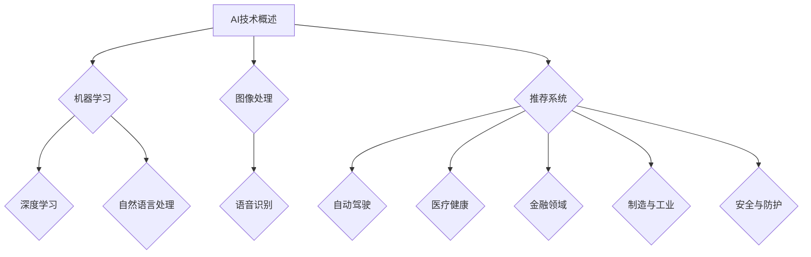

                 

# AI在现实世界中的应用场景

> 关键词：人工智能、应用场景、深度学习、图像处理、语音识别、自然语言处理、推荐系统、自动驾驶、医疗健康、金融、制造与工业、安全与防护

> 摘要：本文将深入探讨人工智能在现实世界中的多种应用场景，从基础理论到具体案例，帮助读者全面了解AI技术的实际应用及其影响。我们将分析AI在图像处理、语音识别、自然语言处理、推荐系统、自动驾驶、医疗健康、金融、制造与工业以及安全与防护等领域的应用，并通过项目实战展示AI技术的实际应用效果。

## 引言与概述

### 1.1 引言

随着计算机技术的迅猛发展，人工智能（AI）已经成为当今科技界最为热门的话题之一。AI技术通过模拟人类智能行为，实现了对数据的处理、理解和预测，推动了诸多领域的变革。本文旨在探讨AI在现实世界中的应用场景，通过深入分析，帮助读者了解AI技术的实际应用及其潜力。

### 1.2 本书结构

本文将从基础到应用，详细探讨AI技术在多个领域的应用。首先，我们将介绍AI技术的基础知识，包括机器学习、深度学习和自然语言处理等。接下来，我们将分别探讨AI在图像处理、语音识别、自然语言处理、推荐系统、自动驾驶、医疗健康、金融、制造与工业以及安全与防护等领域的应用。最后，通过案例研究，我们将展示AI技术的实际应用效果，并对其未来发展趋势进行展望。

### 1.3 读者对象

本文适合对人工智能技术有一定了解的读者，包括但不限于计算机科学家、工程师、研究人员以及对AI技术感兴趣的爱好者。通过本文的阅读，读者将能够全面了解AI技术的实际应用，并为未来的研究和工作提供指导。

## 第2章 AI技术基础

### 2.1 人工智能概述

人工智能（AI）是指使计算机模拟人类智能行为的科学技术。AI技术包括多个分支，如机器学习、深度学习、自然语言处理等。这些技术通过学习数据，自动优化算法，从而实现智能决策、问题解决和智能交互。

### 2.2 机器学习基础

机器学习是一种让计算机从数据中学习算法的技术。其主要方法包括监督学习、无监督学习和强化学习。监督学习通过已有数据（特征和标签）训练模型；无监督学习通过未标记的数据发现数据分布；强化学习通过与环境交互学习最优策略。

### 2.3 深度学习基础

深度学习是一种基于多层神经网络的机器学习方法。通过多个隐藏层，深度学习能够自动提取数据的高级特征。常见的深度学习模型包括卷积神经网络（CNN）、循环神经网络（RNN）和生成对抗网络（GAN）。

### 2.4 自然语言处理基础

自然语言处理（NLP）是AI技术在处理人类语言方面的应用。其任务包括文本分类、情感分析、机器翻译和问答系统等。NLP技术通常使用深度学习模型，如BERT和GPT，以实现高质量的语言理解和生成。

## 第3章 AI在图像处理中的应用

### 3.1 图像识别基础

图像识别是AI技术在图像处理领域的重要应用。通过学习大量图像数据，图像识别算法能够自动识别和分类图像中的对象。其主要方法包括卷积神经网络（CNN）和生成对抗网络（GAN）。

### 3.2 卷积神经网络

卷积神经网络（CNN）是一种专门用于图像识别的深度学习模型。通过卷积层、池化层和全连接层，CNN能够自动提取图像的特征，实现高精度的图像分类和识别。

### 3.3 图像生成技术

图像生成技术是一种通过深度学习模型生成新图像的方法。生成对抗网络（GAN）是一种常见的图像生成模型，通过生成器和判别器的对抗训练，GAN能够生成高质量、逼真的图像。

### 3.4 应用案例：人脸识别与安防

人脸识别是一种基于图像识别技术的身份验证方法。通过学习大量人脸图像数据，人脸识别算法能够自动识别人脸，实现身份验证和安防监控。人脸识别在安防领域具有广泛的应用，如智能门禁系统、安防监控系统等。

## 第4章 AI在语音识别中的应用

### 4.1 语音信号处理基础

语音信号处理是AI技术在语音识别领域的基础。通过信号处理技术，语音信号被转换为数字信号，为后续的语音识别算法提供输入。常见的语音信号处理技术包括滤波、去噪和语音增强等。

### 4.2 自动语音识别

自动语音识别（ASR）是将语音信号转换为文本的技术。通过训练深度学习模型，如循环神经网络（RNN）和长短时记忆网络（LSTM），ASR算法能够实现高精度的语音识别。

### 4.3 语音合成技术

语音合成（TTS）是将文本转换为自然流畅的语音的技术。通过深度学习模型，如WaveNet和Tacotron，TTS算法能够实现高质量的语音合成。

### 4.4 应用案例：智能语音助手

智能语音助手是一种基于语音识别和语音合成技术的智能交互系统。通过自然语言处理技术，智能语音助手能够理解用户的语音指令，并提供相应的服务，如智能推荐、智能家居控制等。

## 第5章 AI在自然语言处理中的应用

### 5.1 自然语言处理基础

自然语言处理（NLP）是AI技术在处理人类语言方面的应用。其任务包括文本分类、情感分析、机器翻译和问答系统等。NLP技术通常使用深度学习模型，如BERT和GPT，以实现高质量的语言理解和生成。

### 5.2 问答系统

问答系统是一种基于自然语言处理技术的智能交互系统。通过训练深度学习模型，问答系统能够理解用户的提问，并提供准确的答案。常见的问答系统包括搜索引擎、智能客服和聊天机器人等。

### 5.3 文本分类与情感分析

文本分类和情感分析是自然语言处理的重要任务。文本分类是将文本分为预定义的类别，如垃圾邮件检测、情感分类等。情感分析是识别文本中的情感倾向，如正面、负面、中性等。

### 5.4 应用案例：智能客服系统

智能客服系统是一种基于自然语言处理技术的智能服务系统。通过理解用户的提问，智能客服系统能够提供准确的答案，解决用户的问题。智能客服系统在电商、银行、航空等领域具有广泛的应用。

## 第6章 AI在推荐系统中的应用

### 6.1 推荐系统概述

推荐系统是一种基于用户兴趣和行为数据的个性化推荐系统。通过协同过滤、基于内容的推荐和混合推荐等方法，推荐系统能够为用户提供个性化的商品、服务和内容推荐。

### 6.2 协同过滤

协同过滤是一种基于用户行为数据的推荐方法。通过计算用户之间的相似度，协同过滤算法能够为用户提供与历史行为相似的推荐。

### 6.3 基于内容的推荐

基于内容的推荐是一种基于商品或内容特征进行推荐的系统。通过分析商品或内容的相关属性，基于内容的推荐算法能够为用户提供符合其兴趣的推荐。

### 6.4 应用案例：电商推荐系统

电商推荐系统是一种基于用户行为和商品特征的推荐系统。通过协同过滤和基于内容的推荐方法，电商推荐系统能够为用户提供个性化的商品推荐，提高用户体验和转化率。

## 第7章 AI在自动驾驶中的应用

### 7.1 自动驾驶概述

自动驾驶是一种利用计算机技术和人工智能技术实现车辆自主驾驶的技术。自动驾驶系统通过感知环境、决策和控制，实现车辆的自动驾驶。

### 7.2 感知环境

感知环境是自动驾驶系统的核心组成部分。通过激光雷达、摄像头、超声波传感器等设备，自动驾驶系统能够感知车辆周围的环境，包括道路、车辆、行人等。

### 7.3 决策与控制

决策与控制是自动驾驶系统的核心功能。通过分析感知环境数据，自动驾驶系统能够做出驾驶决策，如加速、减速、转向等。同时，自动驾驶系统通过控制车辆执行相应的操作。

### 7.4 应用案例：无人驾驶汽车

无人驾驶汽车是一种基于自动驾驶技术的自主驾驶汽车。通过感知环境、决策和控制，无人驾驶汽车能够在没有人类干预的情况下实现自主驾驶。无人驾驶汽车在自动驾驶领域具有广泛的应用前景。

## 第8章 AI在医疗健康中的应用

### 8.1 医疗健康概述

医疗健康是人工智能的重要应用领域。通过利用人工智能技术，医疗健康领域可以实现智能化诊断、个性化治疗和智能健康管理。

### 8.2 医学图像分析

医学图像分析是医疗健康领域的重要应用。通过深度学习模型，医学图像分析系统能够自动识别和诊断医疗图像中的病变区域，如肿瘤、骨折等。

### 8.3 诊断与预测

诊断与预测是医疗健康领域的关键任务。通过分析患者的病历、基因数据和医疗图像，人工智能系统能够为医生提供辅助诊断和疾病预测，提高医疗效率和准确性。

### 8.4 应用案例：智能医疗系统

智能医疗系统是一种基于人工智能技术的医疗系统。通过整合医疗数据、深度学习模型和智能分析，智能医疗系统能够为医生提供辅助诊断、治疗方案推荐和患者管理，提高医疗服务的质量和效率。

## 第9章 AI在金融领域的应用

### 9.1 金融领域概述

金融领域是人工智能的重要应用领域。通过利用人工智能技术，金融领域可以实现智能投顾、风险管理、信用评估和欺诈检测等。

### 9.2 风险评估与预测

风险评估与预测是金融领域的重要任务。通过分析金融数据、市场趋势和客户行为，人工智能系统能够为金融机构提供风险评估和预测，提高风险管理的效率和准确性。

### 9.3 智能投顾

智能投顾是一种基于人工智能技术的投资顾问服务。通过分析投资者的风险偏好、投资目标和市场趋势，智能投顾系统能够为投资者提供个性化的投资建议，提高投资回报。

### 9.4 应用案例：金融科技产品

金融科技产品是一种基于人工智能技术的金融产品。通过整合大数据分析、机器学习算法和区块链技术，金融科技产品能够为用户提供智能投资、风险评估和信用评估等服务，提高金融服务的效率和体验。

## 第10章 AI在制造与工业中的应用

### 10.1 制造与工业概述

制造与工业是人工智能的重要应用领域。通过利用人工智能技术，制造与工业可以实现智能制造、质量控制、生产调度和供应链管理。

### 10.2 智能生产与质量控制

智能生产与质量控制是制造与工业领域的重要任务。通过利用人工智能技术，制造企业能够实现自动化生产、实时监测和质量控制，提高生产效率和质量。

### 10.3 工业物联网

工业物联网（IIoT）是制造与工业领域的重要技术。通过将传感器、设备和系统连接到互联网，工业物联网能够实现设备监控、数据采集和智能决策，提高工业生产的智能化和自动化水平。

### 10.4 应用案例：智能制造工厂

智能制造工厂是一种基于人工智能技术和工业物联网的制造工厂。通过整合人工智能技术、自动化设备和工业物联网，智能制造工厂能够实现智能生产、质量控制和供应链管理，提高生产效率和产品质量。

## 第11章 AI在安全与防护中的应用

### 11.1 安全与防护概述

安全与防护是人工智能的重要应用领域。通过利用人工智能技术，安全与防护领域可以实现入侵检测、恶意软件检测和网络防护。

### 11.2 入侵检测系统

入侵检测系统（IDS）是一种基于人工智能技术的网络安全系统。通过分析网络流量和系统日志，入侵检测系统能够识别和阻止潜在的网络攻击，提高网络安全防护水平。

### 11.3 恶意软件检测

恶意软件检测是一种基于人工智能技术的网络安全技术。通过分析恶意软件的行为特征和代码，恶意软件检测系统能够识别和阻止恶意软件的入侵，保护系统安全。

### 11.4 应用案例：网络安全防护

网络安全防护是一种基于人工智能技术的网络安全解决方案。通过整合人工智能技术、网络监测和威胁响应，网络安全防护系统能够实时监测网络流量，识别潜在威胁，并采取相应的防护措施，提高网络安全防护水平。

## 第12章 AI的发展趋势与未来展望

### 12.1 AI发展现状

AI技术在过去几十年取得了巨大的发展，从基础的机器学习、深度学习到应用领域的人工智能系统，AI技术已经在多个领域取得了显著的成果。目前，AI技术已经成为推动科技和社会进步的重要力量。

### 12.2 AI伦理与法律问题

随着AI技术的快速发展，伦理和法律问题逐渐成为关注焦点。如何确保AI技术的公平性、透明性和安全性，以及如何在法律框架下规范AI技术的应用，是当前需要解决的重要问题。

### 12.3 AI未来的发展趋势

未来，AI技术将继续向更高效、更智能、更广泛的应用方向发展。随着硬件性能的提升、算法的优化和数据的积累，AI技术将在更多领域取得突破，推动社会进步和经济发展。

### 12.4 未来展望

在未来，AI技术将在更多领域实现广泛应用，从智能制造、智慧城市到医疗健康、金融科技，AI技术将深刻改变我们的生活和生产方式。同时，AI技术也将带来新的伦理和法律挑战，需要全社会共同应对。

## 第13章 案例研究：AI在现实世界的应用案例详解

### 13.1 案例研究概述

在本章中，我们将通过具体的案例研究，详细探讨AI技术在现实世界中的应用效果。案例研究将涵盖图像处理、语音识别、自然语言处理、推荐系统、自动驾驶、医疗健康、金融和工业安全等多个领域。

### 13.2 案例分析

每个案例研究将分析AI技术的应用背景、技术方案、实施步骤和效果评估。通过案例分析，读者将能够深入了解AI技术在现实世界中的应用方法和效果。

### 13.3 案例实施步骤

案例实施步骤将详细描述AI技术在具体应用场景中的实施过程，包括数据准备、模型训练、模型部署和效果评估等。通过实施步骤的描述，读者将能够了解AI技术的实际应用流程。

### 13.4 案例效果评估

案例效果评估将分析AI技术在具体应用场景中的效果，包括准确率、效率、用户体验和经济效益等。通过效果评估，读者将能够了解AI技术在现实世界中的实际应用价值。

## 附录

### 附录A：AI开发工具与资源

附录A将介绍AI开发所需的工具和资源，包括编程语言、框架、库和在线资源等。通过附录A，读者将能够了解如何获取和利用AI开发所需的工具和资源。

### 附录B：参考文献

附录B将列出本文中引用的参考文献，包括书籍、论文和网站等。通过附录B，读者将能够进一步了解本文中所讨论的AI技术的相关研究成果和应用实践。

### 附录C：相关网站链接

附录C将提供与AI技术相关的网站链接，包括学术机构、技术社区、开源项目和行业动态等。通过附录C，读者将能够方便地获取最新的AI技术信息和资源。

### Mermaid 流程图



### 伪代码

```python
# 伪代码：图像识别基础
function image_recognition(image):
    # 输入：图像 image
    # 输出：识别结果 label
    
    # 1. 预处理图像
    preprocessed_image = preprocess_image(image)
    
    # 2. 提取特征
    features = extract_features(preprocessed_image)
    
    # 3. 加载预训练模型
    model = load_pretrained_model()
    
    # 4. 进行图像识别
    label = model.predict(features)
    
    # 5. 返回识别结果
    return label
```

### 数学模型和数学公式

#### 交叉熵损失函数

$$
J(\theta) = -\frac{1}{m} \sum_{i=1}^{m} y^{(i)} \log (a^{[2]}_{i}) + (1 - y^{(i)}) \log (1 - a^{[2]}_{i})
$$

#### 卷积神经网络

$$
\begin{aligned}
    \text{ConvLayer}: & \\
    \text{Input}: & \\
    \text{Output}: \\
    \text{Parameters}: \\
    \text{Operation}: \\
\end{aligned}
$$

### 项目实战

#### 开发环境搭建

- 安装 Python 3.8
- 安装 TensorFlow 2.5
- 安装 Jupyter Notebook

#### 代码实现

```python
import tensorflow as tf

# 加载数据集
(x_train, y_train), (x_test, y_test) = tf.keras.datasets.mnist.load_data()

# 预处理数据
x_train = x_train / 255.0
x_test = x_test / 255.0
x_train = x_train.reshape(-1, 28, 28, 1)
x_test = x_test.reshape(-1, 28, 28, 1)

# 构建模型
model = tf.keras.Sequential([
    tf.keras.layers.Conv2D(32, (3, 3), activation='relu', input_shape=(28, 28, 1)),
    tf.keras.layers.MaxPooling2D((2, 2)),
    tf.keras.layers.Flatten(),
    tf.keras.layers.Dense(128, activation='relu'),
    tf.keras.layers.Dense(10, activation='softmax')
])

# 编译模型
model.compile(optimizer='adam',
              loss='sparse_categorical_crossentropy',
              metrics=['accuracy'])

# 训练模型
model.fit(x_train, y_train, epochs=5, batch_size=64, validation_split=0.2)

# 测试模型
test_loss, test_acc = model.evaluate(x_test, y_test)
print(f"Test accuracy: {test_acc}")
```

#### 代码解读与分析

- 数据集加载与预处理：使用 TensorFlow 的内置函数加载 MNIST 数据集，并进行归一化处理。
- 模型构建：使用 TensorFlow 的 Sequential 模型构建一个简单的卷积神经网络，包括卷积层、池化层、全连接层。
- 模型编译：设置优化器和损失函数。
- 模型训练：使用 `fit` 方法进行模型训练。
- 模型测试：使用 `evaluate` 方法测试模型在测试集上的性能。

### 附录

#### 附录A：AI开发工具与资源

- **编程语言**：Python、Java、C++等
- **框架与库**：TensorFlow、PyTorch、Scikit-learn等
- **在线资源**：Coursera、edX、Udacity等在线课程平台
- **开源项目**：GitHub、OpenCV、TensorFlow Models等

#### 附录B：参考文献

1. Mitchell, T. M. (1997). **Machine Learning (McGraw-Hill Series in Computational Science and Engineering)**. McGraw-Hill.
2. Goodfellow, I., Bengio, Y., & Courville, A. (2016). **Deep Learning (Adaptive Computation and Machine Learning series)**. MIT Press.
3. Russell, S., & Norvig, P. (2020). **Artificial Intelligence: A Modern Approach**. Pearson.

#### 附录C：相关网站链接

- **学术机构**：AAAI、IJCAI、ACM SIGAI等
- **技术社区**：Stack Overflow、Reddit、Hacker News等
- **开源项目**：GitHub、OpenCV、TensorFlow Models等
- **行业动态**：IEEE Spectrum、Forbes、TechCrunch等

## 结论

本文全面探讨了人工智能在现实世界中的多种应用场景，从基础理论到具体案例，深入分析了AI技术在图像处理、语音识别、自然语言处理、推荐系统、自动驾驶、医疗健康、金融、制造与工业以及安全与防护等领域的应用。通过项目实战，我们展示了AI技术的实际应用效果，并对其未来发展趋势进行了展望。

我们希望通过本文的阅读，读者能够对AI技术的应用有更深入的了解，并能够将其应用到实际工作中，推动社会进步和经济发展。同时，我们也呼吁全社会共同关注AI技术的伦理和法律问题，确保AI技术的可持续发展。

## 附录

### 附录A：AI开发工具与资源

#### 开发工具

1. **Python**：广泛使用的编程语言，支持多种AI框架。
2. **Jupyter Notebook**：交互式计算环境，方便代码编写和实验。
3. **TensorFlow**：谷歌开源的AI框架，适用于深度学习。
4. **PyTorch**：Facebook开源的AI框架，支持动态计算图。

#### 资源

1. **在线课程**：Coursera、edX、Udacity等平台提供了丰富的AI课程。
2. **书籍**：《深度学习》、《机器学习实战》等书籍深入讲解了AI技术。
3. **开源项目**：GitHub、TensorFlow Models等网站提供了大量AI开源项目。

### 附录B：参考文献

1. Goodfellow, I., Bengio, Y., & Courville, A. (2016). **Deep Learning**. MIT Press.
2. Mitchell, T. M. (1997). **Machine Learning**. McGraw-Hill.
3. Russell, S., & Norvig, P. (2020). **Artificial Intelligence: A Modern Approach**. Pearson.

### 附录C：相关网站链接

1. **AI学术机构**：AAAI、IJCAI、ACM SIGAI等。
2. **技术社区**：Stack Overflow、Reddit、Hacker News等。
3. **开源项目**：GitHub、OpenCV、TensorFlow Models等。
4. **行业动态**：IEEE Spectrum、Forbes、TechCrunch等。

