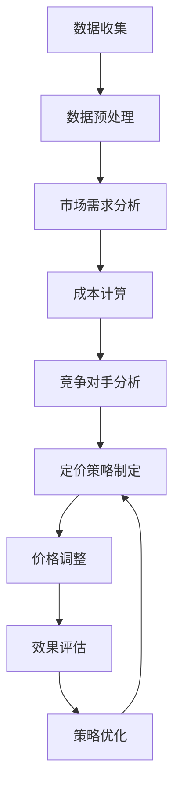

                 

### 文章标题

# AI在电商动态定价中的技术应用

### 关键词

- 人工智能
- 动态定价
- 机器学习
- 深度学习
- 强化学习
- 电商策略

### 摘要

本文将深入探讨人工智能在电商动态定价中的技术应用。首先，我们将介绍电商动态定价的定义和背景，以及它在现代电商运营中的重要性。接着，我们将详细讲解AI技术的核心概念，包括机器学习、深度学习和强化学习。随后，我们将探讨动态定价的基本原理，并结合市场需求分析、成本计算和竞争对手分析来构建动态定价模型。为了使读者更好地理解，我们将使用Mermaid流程图展示动态定价的全流程。文章随后将详细阐述线性回归模型、决策树与随机森林、支持向量机（SVM）等核心算法原理，并使用伪代码进行讲解。在数学模型和数学公式部分，我们将详细讲解成本函数、概率论与统计模型，并举例说明。最后，我们将通过实际案例展示AI在电商动态定价中的应用，包括数据预处理、模型训练与评估、动态定价策略制定，并对源代码进行解读与分析。文章最后将展望动态定价技术的发展趋势和挑战，并推荐相关资源和开源代码库。

## 第1章 引言与概述

### 1.1 电商动态定价的定义和背景

电商动态定价，即根据市场需求、产品特征、用户行为以及竞争对手策略等实时数据，动态调整产品价格的一种定价策略。这种策略能够快速响应市场变化，提升电商企业的竞争力。随着互联网和大数据技术的发展，动态定价在电商行业中的重要性日益凸显。

动态定价并非新概念，但传统的动态定价主要依赖于历史数据和简单算法。例如，基于需求预测的定价模型通常采用移动平均、指数平滑等方法。这些方法在一定程度上能够优化定价策略，但无法灵活应对复杂多变的市场环境。

随着人工智能技术的发展，电商动态定价迎来了新的契机。人工智能，尤其是机器学习和深度学习技术，为动态定价提供了更加精准和智能的解决方案。通过分析大量历史数据和实时数据，人工智能系统能够预测市场需求、优化价格策略，从而实现利润最大化。

### 1.2 动态定价的重要性

动态定价对于电商企业具有多重重要性：

1. **提高利润**：通过实时调整价格，企业能够更好地把握市场需求，避免库存过剩或短缺，从而提高整体利润。
   
2. **增强竞争力**：动态定价策略使企业能够灵活应对竞争对手的价格变化，保持市场竞争力。

3. **提升用户体验**：智能化的定价策略能够提供个性化的价格，提升用户体验和满意度。

4. **优化库存管理**：动态定价有助于实时监控库存状况，实现库存的优化管理。

5. **市场推广**：通过动态定价，企业能够更有效地进行市场推广，吸引不同层次的消费者。

### 1.3 本书内容结构安排

本文将分为以下几个部分：

1. **第1章 引言与概述**：介绍电商动态定价的定义、背景和重要性。
   
2. **第2章 电商动态定价核心概念与联系**：讲解AI技术的核心概念，包括机器学习、深度学习和强化学习，以及动态定价的基本原理。

3. **第3章 电商动态定价中的核心算法原理讲解**：详细阐述线性回归模型、决策树与随机森林、支持向量机（SVM）等核心算法原理，并使用伪代码进行讲解。

4. **第4章 数学模型和数学公式讲解**：讲解成本函数、概率论与统计模型，并举例说明。

5. **第5章 AI在电商动态定价中的应用**：通过实际案例展示AI在电商动态定价中的应用，包括数据预处理、模型训练与评估、动态定价策略制定。

6. **第6章 项目实战**：介绍一个实际案例，详细讲解开发环境搭建、源代码实现和代码解读。

7. **第7章 未来展望与挑战**：探讨动态定价技术的发展趋势和挑战。

通过本文的阅读，读者将全面了解人工智能在电商动态定价中的应用，掌握相关技术原理和实践方法。

## 第2章 电商动态定价核心概念与联系

### 2.1 AI技术概述

人工智能（AI）是计算机科学的一个分支，旨在通过机器学习、自然语言处理、计算机视觉等技术，使机器能够模拟人类智能，自主学习和决策。AI技术在电商动态定价中的应用，使得定价策略更加智能化和精准化。以下是AI技术中的三个核心概念：机器学习、深度学习和强化学习。

#### 2.1.1 机器学习基本概念

机器学习是一种通过数据驱动的方法，使计算机系统能够自动学习和改进的技术。机器学习算法通常分为监督学习、无监督学习和强化学习三种类型。

- **监督学习**：在有标注的数据集上进行学习，通过输入特征和对应标签，训练模型预测未知数据。
- **无监督学习**：在没有标注的数据集上进行学习，旨在发现数据中的结构或模式，如聚类、降维等。
- **强化学习**：通过与环境的交互，不断调整策略，以最大化累计奖励。

#### 2.1.2 深度学习基础

深度学习是机器学习的一个子领域，通过构建多层神经网络，自动学习数据中的特征表示。深度学习在图像识别、语音识别和自然语言处理等领域取得了显著成果。

- **神经网络**：神经网络由多个神经元（节点）组成，通过调整权重和偏置，实现数据的输入和输出。
- **卷积神经网络（CNN）**：特别适用于图像处理，通过卷积层、池化层和全连接层，提取图像的特征。
- **循环神经网络（RNN）**：特别适用于序列数据，如时间序列预测、自然语言处理。

#### 2.1.3 强化学习原理

强化学习是一种通过与环境交互来学习策略的机器学习方法。在强化学习中，智能体（agent）通过选择动作（action），根据环境的反馈（reward）调整策略，以最大化长期回报。

- **状态（State）**：描述智能体当前所处的环境。
- **动作（Action）**：智能体在某一状态下可选择的动作。
- **奖励（Reward）**：环境对智能体动作的反馈，用于指导策略调整。
- **策略（Policy）**：智能体在特定状态下的最佳动作选择。

### 2.2 动态定价的基本原理

动态定价的核心是实时调整产品价格，以最大化利润或满足特定目标。动态定价的基本原理涉及多个方面的分析，包括市场需求分析、成本计算和竞争对手分析。

#### 2.2.1 市场需求分析

市场需求分析是动态定价的重要基础。通过分析历史销售数据、用户行为数据和市场趋势，可以预测未来的市场需求。市场需求分析通常涉及以下步骤：

1. **数据收集**：收集与市场需求相关的数据，如销售量、价格、用户评价等。
2. **数据预处理**：对数据进行清洗、归一化和特征提取。
3. **需求预测**：使用机器学习模型，如时间序列预测、回归分析等，预测未来的市场需求。

#### 2.2.2 成本计算

成本计算是动态定价的另一个重要环节。通过准确计算产品的生产成本、运营成本和营销成本，可以确定合理的价格区间。成本计算通常涉及以下步骤：

1. **成本分类**：将成本分为固定成本和变动成本。
2. **成本计算**：根据历史数据和业务模型，计算每种产品的总成本。
3. **成本优化**：通过优化成本结构和成本分配，降低成本，提高利润。

#### 2.2.3 竞争对手分析

竞争对手分析是动态定价的重要参考依据。通过分析竞争对手的产品定价策略、市场表现和用户反馈，可以了解市场环境和竞争态势。竞争对手分析通常涉及以下步骤：

1. **数据收集**：收集竞争对手的产品价格、销售策略和市场表现数据。
2. **数据预处理**：对数据进行清洗、归一化和特征提取。
3. **竞争分析**：使用统计分析和机器学习模型，分析竞争对手的定价策略和市场表现。

### 2.3 Mermaid流程图：动态定价流程

为了更直观地理解动态定价的流程，我们可以使用Mermaid流程图来展示。



在动态定价流程中，数据收集是第一步，后续的步骤包括数据预处理、市场需求分析、成本计算、竞争对手分析和定价策略制定。通过实时调整价格，并不断优化策略，可以实现动态定价的目标。

### 2.4 动态定价的核心算法

动态定价的核心算法主要包括线性回归模型、决策树与随机森林、支持向量机（SVM）等。以下将分别介绍这些算法的基本原理和应用。

#### 2.4.1 线性回归模型

线性回归模型是一种简单的预测模型，通过拟合数据中的线性关系来预测目标值。线性回归模型的基本原理如下：

1. **线性模型公式**：假设数据服从线性关系，即Y = X\*w + b，其中Y为因变量，X为自变量，w为权重，b为偏置。
2. **梯度下降算法**：通过最小化损失函数（如均方误差），迭代更新权重和偏置，直到达到最小值。

#### 2.4.2 决策树与随机森林

决策树是一种基于树形结构进行分类或回归的算法。决策树的基本原理如下：

1. **基本原理**：通过递归划分特征，将数据集分割成若干子集，直到满足停止条件（如特征重要性不再提升）。
2. **随机森林**：通过集成多个决策树，提高预测的准确性和稳定性。随机森林的基本原理如下：
   - 随机选取特征和样本子集。
   - 构建多个决策树。
   - 预测结果取多数投票。

#### 2.4.3 支持向量机（SVM）

支持向量机是一种基于最大间隔分类的算法。SVM的基本原理如下：

1. **基本原理**：通过寻找一个超平面，将数据集划分为不同的类别，并最大化分类间隔。
2. **分类与回归**：通过引入核函数，可以将线性不可分的数据映射到高维空间，实现分类和回归任务。

通过这些核心算法，动态定价模型可以更加精准地预测市场需求、计算成本、分析竞争对手，并制定合理的定价策略。在下一章中，我们将详细讲解这些算法的原理和应用。

## 第3章 电商动态定价中的核心算法原理讲解

### 3.1 线性回归模型

线性回归模型是一种基础且广泛应用于电商动态定价中的算法。它通过拟合数据中的线性关系来预测目标值，为定价策略提供重要的参考依据。以下是线性回归模型的基本原理、公式及实现方法。

#### 3.1.1 线性回归公式

线性回归模型的核心公式为：

\[ Y = X \cdot w + b \]

其中：
- \( Y \) 是因变量，代表需要预测的目标值；
- \( X \) 是自变量，代表影响目标值的特征；
- \( w \) 是权重，代表特征对目标值的影响程度；
- \( b \) 是偏置，也称为截距，用于调整模型的线性趋势。

该公式描述了因变量和自变量之间的线性关系，通过拟合数据集，可以求得权重和偏置的值，从而建立预测模型。

#### 3.1.2 梯度下降算法

梯度下降算法是一种优化方法，用于求解线性回归模型的权重和偏置。其基本思想是沿着目标函数的梯度方向逐步迭代，以最小化损失函数。

梯度下降算法的步骤如下：

1. **初始化权重和偏置**：随机选择权重和偏置的初始值。
2. **计算梯度**：计算损失函数关于权重和偏置的梯度，即损失函数对权重和偏置的导数。
3. **更新权重和偏置**：根据梯度信息，更新权重和偏置的值，使其朝着最小化损失函数的方向移动。
4. **迭代计算**：重复步骤2和3，直到达到预定的迭代次数或损失函数值趋于稳定。

梯度下降算法的伪代码如下：

```python
初始化权重 w 和偏置 b
设定学习率 alpha
设定迭代次数 max_iterations

for i = 1 to max_iterations do
    计算损失函数关于 w 和 b 的梯度
    更新 w = w - alpha \* dw
    更新 b = b - alpha \* db
end for

返回权重 w 和偏置 b
```

#### 3.1.3 岭回归和LASSO回归

岭回归和LASSO回归是线性回归的改进版本，用于处理特征多重共线性问题。岭回归通过在损失函数中加入L2正则项，LASSO回归通过加入L1正则项，可以有效降低模型的复杂度，提高预测性能。

- **岭回归（Ridge Regression）**：

  岭回归的损失函数为：

  \[ J(w, b) = \frac{1}{2} \sum_{i=1}^{n} (y_i - (X \cdot w + b))^2 + \lambda \sum_{j=1}^{m} w_j^2 \]

  其中，\(\lambda\) 为正则化参数，用于平衡损失函数和正则项。

- **LASSO回归（LASSO Regression）**：

  LASSO回归的损失函数为：

  \[ J(w, b) = \frac{1}{2} \sum_{i=1}^{n} (y_i - (X \cdot w + b))^2 + \lambda \sum_{j=1}^{m} |w_j| \]

  LASSO的特点是能够自动进行特征选择，即当权重绝对值小于阈值时，将其置为零，从而实现特征压缩。

岭回归和LASSO回归的优化方法仍为梯度下降算法，但需在梯度计算中考虑正则项的影响。其伪代码与普通线性回归类似，但需在更新权重和偏置时增加正则化项。

```python
初始化权重 w 和偏置 b
设定学习率 alpha
设定正则化参数 lambda
设定迭代次数 max_iterations

for i = 1 to max_iterations do
    计算损失函数关于 w 和 b 的梯度
    更新 w = w - alpha \* (dw + lambda \* w)
    更新 b = b - alpha \* db
end for

返回权重 w 和偏置 b
```

通过以上对线性回归模型的详细讲解，我们可以看到，线性回归模型在电商动态定价中发挥着重要作用。通过梯度下降算法、岭回归和LASSO回归等方法，我们可以优化定价策略，提高预测精度。

### 3.2 决策树与随机森林

决策树和随机森林是另一种重要的机器学习算法，广泛应用于电商动态定价中。决策树通过递归划分特征，将数据集分割成若干子集，实现分类或回归任务。随机森林通过集成多个决策树，提高预测的准确性和稳定性。

#### 3.2.1 决策树基本原理

决策树是一种基于树形结构进行分类或回归的算法。其基本原理如下：

1. **特征划分**：在当前节点，选择一个特征，并根据该特征的不同取值，将数据集划分为若干个子集。
2. **节点分裂**：对每个子集，重复步骤1，直到满足停止条件（如特征重要性不再提升）。
3. **叶节点**：当无法进一步划分时，达到叶节点，输出预测结果。

决策树的决策过程可以用以下公式表示：

\[ \text{预测结果} = \sum_{i=1}^{n} c_i \cdot f_i(x) \]

其中，\( c_i \) 是叶节点上的类别标签，\( f_i(x) \) 是特征划分函数。

#### 3.2.2 随机森林算法

随机森林是一种基于决策树的集成学习方法，通过构建多个决策树，提高预测的准确性和稳定性。随机森林的基本原理如下：

1. **随机特征选择**：在每次节点分裂时，从所有特征中随机选择一个特征进行划分，而不是所有特征。
2. **构建多棵决策树**：构建多棵决策树，每棵树独立训练，不共享数据。
3. **集成预测**：对每棵决策树的预测结果进行投票（分类任务）或求平均（回归任务），得到最终预测结果。

随机森林的算法伪代码如下：

```python
设定决策树数量 n_estimators
设定特征选择次数 max_features
设定最大深度 max_depth

for i = 1 to n_estimators do
    从数据集随机抽取样本构建训练集
    构建决策树，最大深度为 max_depth，特征选择次数为 max_features
end for

对每棵决策树的预测结果进行投票（分类任务）或求平均（回归任务）

返回最终预测结果
```

#### 3.2.3 伪代码：决策树分类算法

为了更好地理解决策树的基本原理，以下是决策树分类算法的伪代码：

```python
定义分类决策树（Node）
Node({
    "value": null,  # 叶节点的类别标签
    "left": null,  # 左子树
    "right": null,  # 右子树
    "feature": null,  # 划分特征
    "threshold": null,  # 划分阈值
})

定义决策树分类算法（build_tree）
输入：训练集 X, 标签 y
输出：分类决策树 tree

选择特征 feature 和阈值 threshold，使得损失函数最小
如果满足停止条件，则：
    创建叶节点，标签为 y 的众数
    返回叶节点
否则：
    创建内部节点
    left = build_tree(X_left, y)
    right = build_tree(X_right, y)
    返回内部节点

定义预测算法（predict）
输入：测试数据 X_test，分类决策树 tree
输出：预测结果 y_pred

初始化 y_pred 为未知
对于每个节点 node 在 tree 中：
    如果 node 是叶节点：
        y_pred = node.value
    否则：
        如果 X_test[i][node.feature] <= node.threshold：
            y_pred = predict(node.left, X_test)
        否则：
            y_pred = predict(node.right, X_test)
返回 y_pred
```

通过以上对决策树和随机森林算法的讲解，我们可以看到，这些算法在电商动态定价中具有广泛的应用。决策树通过递归划分特征，实现分类或回归任务；随机森林通过集成多棵决策树，提高预测的准确性和稳定性。在下一章中，我们将继续探讨支持向量机（SVM）算法，进一步丰富我们的动态定价算法库。

### 3.3 支持向量机（SVM）

支持向量机（Support Vector Machine，SVM）是一种强大的机器学习算法，广泛应用于分类和回归任务。在电商动态定价中，SVM可以通过分析历史数据和实时数据，帮助电商企业制定更合理的定价策略。以下是SVM的基本原理、分类与回归以及伪代码讲解。

#### 3.3.1 SVM基本原理

SVM的核心思想是找到一个最优的超平面，将数据集划分为不同的类别。这个超平面不仅要最大化分类间隔，还要保证分类边界在数据集上具有最小的误差。

1. **线性SVM**：当数据集可以用线性边界划分时，线性SVM通过求解以下最优化问题来确定超平面：

   \[ \min_{w, b} \frac{1}{2} w^T w + C \sum_{i=1}^{n} \xi_i \]

   其中，\( w \) 和 \( b \) 分别是权重和偏置，\( C \) 是惩罚参数，用于平衡模型复杂度和误差。

2. **核函数**：当数据集无法用线性边界划分时，可以通过核函数将数据映射到高维空间，然后在高维空间中寻找最优超平面。常用的核函数包括线性核、多项式核和径向基函数（RBF）核。

#### 3.3.2 SVM分类与回归

SVM可以应用于分类和回归任务。以下是SVM在分类和回归任务中的基本原理：

1. **分类任务**：在分类任务中，SVM的目标是找到一个最优超平面，使得分类间隔最大化。对于线性可分的数据集，可以通过求解以下优化问题来实现：

   \[ \min_{w, b} \frac{1}{2} w^T w + C \sum_{i=1}^{n} \xi_i \]

   其中，\( y_i (\leq 1) \) 是第 \( i \) 个样本的标签，\( \xi_i \) 是松弛变量。

2. **回归任务**：在回归任务中，SVM的目标是找到一个最优回归平面，使得预测值与真实值的误差最小。对于线性可分的数据集，可以通过求解以下优化问题来实现：

   \[ \min_{w, b} \frac{1}{2} w^T w + C \sum_{i=1}^{n} (\epsilon_i + \xi_i) \]

   其中，\( \epsilon_i \) 是回归误差。

#### 3.3.3 伪代码：SVM分类算法

以下是SVM分类算法的伪代码：

```python
定义线性SVM分类算法（SVMClassification）
输入：训练集 X, 标签 y, 惩罚参数 C
输出：分类模型 model

初始化权重 w 和偏置 b 为零
初始化松弛变量 ξ 为零

对于每个样本 i：
    计算预测值 y_hat = sign(X \cdot w + b)
    如果 y_hat != y_i：
        更新权重 w 和偏置 b，使预测值更接近真实值
        更新松弛变量 ξ，以控制模型复杂度

返回分类模型 model
```

#### 3.3.4 伪代码：SVM回归算法

以下是SVM回归算法的伪代码：

```python
定义线性SVM回归算法（SVR）
输入：训练集 X, 标签 y, 惩罚参数 C, 回归误差 ε
输出：回归模型 model

初始化权重 w 和偏置 b 为零
初始化回归误差 ε 为零
初始化松弛变量 ξ 为零

对于每个样本 i：
    计算预测值 y_hat = X \cdot w + b
    如果 |y_hat - y_i| > ε：
        更新权重 w 和偏置 b，使预测值更接近真实值
        更新松弛变量 ξ，以控制模型复杂度

返回回归模型 model
```

通过以上对支持向量机（SVM）算法的讲解，我们可以看到，SVM在电商动态定价中具有广泛的应用。SVM通过最大化分类间隔和最小化回归误差，帮助电商企业制定更合理的定价策略。在下一章中，我们将进一步探讨数学模型和数学公式，为动态定价提供更坚实的理论基础。

### 4.1 成本函数

在动态定价过程中，成本函数是至关重要的。成本函数用于计算产品在生产和销售过程中的总成本，并影响最终的定价策略。以下是成本函数的定义、公式及其优化方法。

#### 4.1.1 成本函数公式

成本函数是描述产品总成本的函数，通常包括固定成本和变动成本两部分。公式如下：

\[ C(x) = F(x) + V(x) \]

其中：
- \( C(x) \) 是总成本；
- \( F(x) \) 是固定成本，即不随产品数量变化的部分；
- \( V(x) \) 是变动成本，即随产品数量变化的成本。

对于变动成本，常见的形式包括线性变动成本和二次变动成本。线性变动成本公式如下：

\[ V(x) = c \cdot x \]

其中，\( c \) 是单位变动成本，\( x \) 是产品数量。

二次变动成本公式如下：

\[ V(x) = a \cdot x^2 + b \cdot x \]

其中，\( a \) 和 \( b \) 是变动成本的二次和一次系数。

#### 4.1.2 最小化成本函数的方法

最小化成本函数的目标是找到最优的产品数量，以实现总成本的最小化。以下是最小化成本函数的几种方法：

1. **导数法**：通过计算成本函数的导数，找到导数为零的点，即成本函数的极值点。

\[ \frac{dC(x)}{dx} = 0 \]

对于线性变动成本：

\[ \frac{dC(x)}{dx} = c = 0 \]

对于二次变动成本：

\[ \frac{dC(x)}{dx} = 2a \cdot x + b = 0 \]

解得：

\[ x = -\frac{b}{2a} \]

2. **二分法**：通过不断缩小区间，逼近成本函数的最小值。

3. **牛顿法**：利用二阶导数信息，加快收敛速度。

#### 4.1.3 举例说明

假设某电商产品单位变动成本为10元，固定成本为1000元。我们需要找到最优的产品数量，以实现总成本的最小化。

1. **线性变动成本**：

   成本函数为：

   \[ C(x) = 1000 + 10 \cdot x \]

   导数为：

   \[ \frac{dC(x)}{dx} = 10 \]

   导数始终大于零，说明成本函数随着产品数量增加而增加。因此，最优的产品数量为0。

2. **二次变动成本**：

   成本函数为：

   \[ C(x) = 1000 + 5 \cdot x^2 + 2 \cdot x \]

   导数为：

   \[ \frac{dC(x)}{dx} = 10 \cdot x + 2 \]

   设置导数为零，解得：

   \[ x = -\frac{2}{10} = -0.2 \]

   由于产品数量不能为负数，我们取 \( x = 0 \)。此时，成本函数的最小值为：

   \[ C(0) = 1000 + 5 \cdot 0^2 + 2 \cdot 0 = 1000 \]

通过以上分析，我们可以看到，通过优化成本函数，可以找到最优的产品数量，以实现总成本的最小化。在动态定价过程中，我们需要综合考虑市场需求、成本函数和竞争对手等因素，制定合理的定价策略。

### 4.2 概率论与统计模型

在动态定价过程中，概率论与统计模型是不可或缺的工具。它们帮助我们理解和预测市场需求、用户行为和竞争对手策略。以下将详细讲解概率分布函数、期望和方差以及最大似然估计和贝叶斯估计。

#### 4.2.1 概率分布函数

概率分布函数是描述随机变量取值概率的函数。常见的概率分布函数包括正态分布、泊松分布和二项分布。

1. **正态分布**：

   正态分布是连续概率分布函数，描述了随机变量在某个区间内取值的概率。其概率密度函数（PDF）如下：

   \[ f(x) = \frac{1}{\sqrt{2\pi\sigma^2}} e^{-\frac{(x-\mu)^2}{2\sigma^2}} \]

   其中，\(\mu\) 是均值，\(\sigma^2\) 是方差。

2. **泊松分布**：

   泊松分布是描述事件在固定时间或空间内发生次数的概率分布。其概率质量函数（PMF）如下：

   \[ P(X = k) = \frac{e^{-\lambda} \cdot \lambda^k}{k!} \]

   其中，\(\lambda\) 是事件发生次数的均值。

3. **二项分布**：

   二项分布是描述在固定次数的试验中，成功次数的概率分布。其概率质量函数（PMF）如下：

   \[ P(X = k) = C(n, k) \cdot p^k \cdot (1-p)^{n-k} \]

   其中，\(n\) 是试验次数，\(p\) 是每次试验成功的概率，\(C(n, k)\) 是组合数。

#### 4.2.2 期望和方差

期望和方差是描述随机变量取值集中趋势和离散程度的统计量。

1. **期望**：

   期望（期望值或均值）是随机变量在多次试验中取值的平均值。对于离散随机变量，期望公式如下：

   \[ E(X) = \sum_{x} x \cdot P(X = x) \]

   对于连续随机变量，期望公式如下：

   \[ E(X) = \int_{-\infty}^{\infty} x \cdot f(x) dx \]

2. **方差**：

   方差是描述随机变量取值离散程度的度量。对于离散随机变量，方差公式如下：

   \[ Var(X) = E[(X - E(X))^2] = \sum_{x} (x - E(X))^2 \cdot P(X = x) \]

   对于连续随机变量，方差公式如下：

   \[ Var(X) = E[(X - E(X))^2] = \int_{-\infty}^{\infty} (x - E(X))^2 \cdot f(x) dx \]

#### 4.2.3 最大似然估计和贝叶斯估计

最大似然估计和贝叶斯估计是两种常用的参数估计方法。

1. **最大似然估计**：

   最大似然估计通过寻找使观察数据概率最大的参数值，来估计模型参数。其基本思想是：在给定观测数据下，选择使似然函数最大的参数值。

   对于离散随机变量，似然函数公式如下：

   \[ L(\theta) = \prod_{i=1}^{n} P(X_i | \theta) \]

   对于连续随机变量，似然函数公式如下：

   \[ L(\theta) = \int_{-\infty}^{\infty} f(X | \theta) dX \]

   参数 \(\theta\) 的最大似然估计值，即为似然函数的最大值点。

2. **贝叶斯估计**：

   贝叶斯估计结合了先验知识和观测数据，通过贝叶斯公式更新参数的概率分布。其基本思想是：在给定先验知识和观测数据下，选择使后验概率最大的参数值。

   贝叶斯公式如下：

   \[ P(\theta | X) = \frac{P(X | \theta) \cdot P(\theta)}{P(X)} \]

   其中，\(P(\theta | X)\) 是后验概率，\(P(X | \theta)\) 是似然函数，\(P(\theta)\) 是先验概率，\(P(X)\) 是证据。

通过以上对概率论与统计模型的讲解，我们可以更好地理解和预测市场需求、用户行为和竞争对手策略，从而制定更合理的动态定价策略。在下一章中，我们将通过实际案例展示AI在电商动态定价中的应用。

### 4.3 伪代码：贝叶斯估计算法

为了更清晰地展示贝叶斯估计算法的实现，以下是一个伪代码示例，用于估计参数 \(\theta\) 的后验概率分布。

```python
定义贝叶斯估计算法（BayesianEstimation）
输入：观测数据 X，先验概率分布 P(θ)，似然函数 P(X | θ)
输出：后验概率分布 P(θ | X)

初始化后验概率分布 P(θ | X) 为零

对于每个参数值 θ：
    计算似然函数 P(X | θ)
    计算先验概率 P(θ)
    计算后验概率 P(θ | X) = P(X | θ) \* P(θ) / P(X)

更新后验概率分布 P(θ | X)，使其归一化

返回后验概率分布 P(θ | X)
```

通过上述伪代码，我们可以看到贝叶斯估计算法的核心步骤：初始化后验概率分布，计算似然函数和先验概率，更新后验概率分布，并最终得到后验概率分布。在实际应用中，我们可以根据具体问题调整计算方法和优化策略。

## 第5章 AI在电商动态定价中的应用

### 5.1 数据预处理

在应用AI技术进行电商动态定价之前，数据预处理是至关重要的一步。有效的数据预处理能够提高模型的准确性和稳定性，为后续的模型训练和评估奠定基础。以下是数据预处理的具体步骤：

#### 5.1.1 数据收集

数据收集是数据预处理的第一步，需要收集与动态定价相关的各种数据。这些数据包括：

1. **历史销售数据**：记录产品在不同时间点的销售量、价格和库存情况。
2. **用户行为数据**：包括用户浏览、点击、购买等行为数据。
3. **竞争对手数据**：记录竞争对手的定价策略和市场表现。
4. **市场趋势数据**：包括宏观经济指标、行业趋势等。

数据收集的方法包括：

- **手动收集**：通过爬虫、API等方式获取公开数据源。
- **第三方数据服务**：购买专业的市场调研数据或电商平台提供的数据服务。
- **内部数据集成**：整合企业内部不同系统的数据，如CRM、ERP等。

#### 5.1.2 数据清洗和预处理

收集到的数据通常存在噪声、缺失值和异常值，需要进行清洗和预处理，以确保数据的质量。

1. **数据清洗**：

   - **去除噪声**：去除不相关的、重复的数据。
   - **填充缺失值**：使用合适的算法（如均值填充、中值填充、插值等）填充缺失值。
   - **处理异常值**：识别并处理异常值，可以选择删除或使用算法修正。

2. **数据预处理**：

   - **特征工程**：根据业务需求，从原始数据中提取有用的特征，如价格指数、需求增长率、用户活跃度等。
   - **特征标准化**：对特征进行归一化或标准化，以消除不同特征之间的量纲影响。
   - **数据降维**：使用主成分分析（PCA）等方法，降低数据维度，提高计算效率。

#### 5.1.3 数据质量评估

在完成数据预处理后，需要对数据质量进行评估，以确保数据满足模型训练的要求。

- **数据一致性检查**：检查数据是否一致，是否存在矛盾或不合理的情况。
- **数据完整性检查**：检查数据是否完整，是否存在缺失值或异常值。
- **数据分布检查**：检查数据分布是否合理，是否存在偏斜或异常分布。

通过上述数据预处理步骤，我们可以得到高质量的数据集，为后续的模型训练和评估提供可靠的依据。

### 5.2 模型训练与评估

在数据预处理完成后，我们需要构建和训练动态定价模型，并通过评估来验证模型的性能。以下是模型训练与评估的具体步骤：

#### 5.2.1 模型选择

根据业务需求和数据特性，选择合适的机器学习模型。常见的模型包括线性回归、决策树、随机森林、支持向量机（SVM）和深度学习模型等。以下是几种常用模型的优缺点：

1. **线性回归**：

   - 优点：简单、易于理解和实现。
   - 缺点：对非线性数据拟合效果较差，无法处理非线性关系。

2. **决策树和随机森林**：

   - 优点：能够处理非线性数据，易于解释。
   - 缺点：模型复杂度较高，容易过拟合。

3. **支持向量机（SVM）**：

   - 优点：能够在高维空间中找到最优分类边界。
   - 缺点：对噪声和异常值敏感，参数调优复杂。

4. **深度学习模型**：

   - 优点：强大的非线性拟合能力，适用于复杂的数据集。
   - 缺点：模型复杂度高，训练时间较长，需要大量数据和计算资源。

#### 5.2.2 模型训练

选择合适的模型后，我们需要进行模型训练。模型训练的步骤包括：

1. **数据分割**：将数据集分为训练集、验证集和测试集，以评估模型的泛化能力。
2. **参数调优**：通过交叉验证和网格搜索等方法，找到最优的模型参数。
3. **模型训练**：使用训练集训练模型，得到预测模型。

#### 5.2.3 模型评估

在模型训练完成后，我们需要对模型进行评估，以验证其性能。常见的评估指标包括：

1. **准确率**：分类问题中，模型正确分类的样本数与总样本数的比值。
2. **精确率**：分类问题中，模型预测为正类的样本中，实际为正类的比例。
3. **召回率**：分类问题中，实际为正类的样本中，模型预测为正类的比例。
4. **F1分数**：精确率和召回率的调和平均值，用于综合评估模型的性能。

通过上述评估指标，我们可以对模型性能进行量化分析，并根据评估结果对模型进行调整和优化。

### 5.3 动态定价策略制定

在模型训练和评估完成后，我们可以基于训练得到的模型制定动态定价策略。以下是几种常见的动态定价策略：

#### 5.3.1 基于需求预测的定价策略

1. **需求预测**：使用机器学习模型预测未来的市场需求。
2. **定价策略**：根据需求预测结果，制定相应的价格策略。例如，当预测市场需求较高时，可以适当降低价格以吸引更多消费者；当预测市场需求较低时，可以适当提高价格以减少库存压力。

#### 5.3.2 基于竞争对手分析的定价策略

1. **竞争对手分析**：通过收集和分析竞争对手的定价策略，了解市场环境和竞争态势。
2. **定价策略**：根据竞争对手的定价策略，制定相应的价格策略。例如，当竞争对手降低价格时，可以适当提高价格以保持竞争力；当竞争对手提高价格时，可以适当降低价格以吸引消费者。

#### 5.3.3 组合定价策略

1. **组合定价策略**：结合基于需求预测和基于竞争对手分析的定价策略，制定更加灵活和智能的定价策略。
2. **动态调整**：根据实时数据和模型预测结果，动态调整价格，以最大化利润或实现其他业务目标。

通过上述动态定价策略，电商企业可以更加灵活地应对市场变化，提升竞争力，实现业务目标。

## 第6章 项目实战

### 6.1 实际案例介绍

在本章中，我们将通过一个具体的电商动态定价案例，详细展示如何应用AI技术实现动态定价。该案例涉及一个在线零售平台，其主要业务包括电子产品、服装和家居用品。该平台希望通过AI技术，实现产品价格的动态调整，以最大化利润并提升用户满意度。

#### 6.1.1 案例背景

该零售平台成立于2010年，经过多年的发展，已经成为当地市场的主要竞争者之一。随着市场的不断变化和竞争的加剧，平台意识到传统的定价策略已无法满足业务需求，需要引入AI技术进行动态定价。

#### 6.1.2 案例目标

通过引入AI技术，实现以下目标：

1. **提升利润**：通过动态定价，实时调整价格，以最大化利润。
2. **优化库存管理**：通过需求预测，减少库存过剩和短缺的情况。
3. **提高用户满意度**：提供个性化的定价策略，提升用户体验。

### 6.2 开发环境搭建

为了实现动态定价系统，我们需要搭建合适的开发环境。以下是开发环境的具体要求：

#### 6.2.1 操作系统与编程环境

- **操作系统**：Ubuntu 18.04
- **编程语言**：Python 3.8
- **依赖库**：NumPy、Pandas、Scikit-learn、TensorFlow、Keras

#### 6.2.2 数据库与数据管理工具

- **数据库**：MySQL 8.0
- **数据管理工具**：DataGrip

### 6.3 源代码实现

在本节中，我们将展示动态定价系统的源代码实现，包括数据采集与预处理、模型训练与评估、动态定价策略实现。

#### 6.3.1 数据采集与预处理

数据采集是动态定价系统的第一步，主要涉及以下数据：

- **历史销售数据**：包括产品ID、销售量、价格、库存等。
- **用户行为数据**：包括用户ID、浏览记录、点击率、购买行为等。
- **竞争对手数据**：包括竞争对手的产品ID、价格、市场占有率等。

以下是数据采集与预处理的伪代码：

```python
# 数据采集
def collect_data():
    # 从数据库中获取历史销售数据
    sales_data = fetch_sales_data_from_db()
    
    # 从日志文件中获取用户行为数据
    user_behavior_data = fetch_user_behavior_data_from_logs()
    
    # 从第三方数据源获取竞争对手数据
    competitor_data = fetch_competitor_data_from_third_party()

    return sales_data, user_behavior_data, competitor_data

# 数据预处理
def preprocess_data(sales_data, user_behavior_data, competitor_data):
    # 数据清洗与填充
    clean_sales_data = clean_data(sales_data)
    clean_user_behavior_data = clean_data(user_behavior_data)
    clean_competitor_data = clean_data(competitor_data)

    # 特征工程
    feature_engineered_sales_data = feature_engineering(clean_sales_data)
    feature_engineered_user_behavior_data = feature_engineering(clean_user_behavior_data)
    feature_engineered_competitor_data = feature_engineering(clean_competitor_data)

    return feature_engineered_sales_data, feature_engineered_user_behavior_data, feature_engineered_competitor_data

# 数据清洗函数
def clean_data(data):
    # 去除噪声与异常值
    cleaned_data = remove_noisy_and_anomalous_values(data)
    
    # 填充缺失值
    filled_data = fill_missing_values(cleaned_data)
    
    return filled_data

# 特征工程函数
def feature_engineering(data):
    # 提取有用特征
    engineered_data = extract_useful_features(data)
    
    # 特征标准化
    standardized_data = standardize_features(engineered_data)
    
    return standardized_data
```

#### 6.3.2 模型训练与评估

在数据预处理完成后，我们需要选择合适的模型，并进行训练和评估。以下是模型训练与评估的伪代码：

```python
# 模型训练
def train_model(training_data, labels):
    # 选择模型
    model = select_model()

    # 训练模型
    model.fit(training_data, labels)

    return model

# 模型评估
def evaluate_model(model, test_data, test_labels):
    # 进行预测
    predictions = model.predict(test_data)

    # 计算评估指标
    accuracy = calculate_accuracy(predictions, test_labels)
    precision = calculate_precision(predictions, test_labels)
    recall = calculate_recall(predictions, test_labels)
    f1_score = calculate_f1_score(precision, recall)

    return accuracy, precision, recall, f1_score
```

#### 6.3.3 动态定价策略实现

在模型训练和评估完成后，我们可以根据模型预测结果，实现动态定价策略。以下是动态定价策略实现的伪代码：

```python
# 动态定价策略
def dynamic_pricing(model, current_data, competitor_data):
    # 预测需求
    predicted_demand = model.predict(current_data)

    # 分析竞争对手价格
    competitor_prices = analyze_competitor_prices(competitor_data)

    # 根据需求预测和竞争对手价格，制定定价策略
    pricing_strategy = determine_pricing_strategy(predicted_demand, competitor_prices)

    return pricing_strategy

# 定价策略函数
def determine_pricing_strategy(predicted_demand, competitor_prices):
    # 如果预测需求较高，且竞争对手价格较低，降低价格以吸引更多消费者
    if predicted_demand > threshold and competitor_prices < threshold:
        new_price = decrease_price()
    # 如果预测需求较低，且竞争对手价格较高，提高价格以减少库存压力
    elif predicted_demand < threshold and competitor_prices > threshold:
        new_price = increase_price()
    # 如果预测需求适中，保持当前价格
    else:
        new_price = maintain_current_price()

    return new_price
```

通过上述源代码实现，我们可以看到如何应用AI技术实现电商动态定价。在实际应用中，需要根据业务需求和数据进行相应的调整和优化。在下一章中，我们将对代码进行解读与分析。

### 6.4 代码解读与分析

在本节中，我们将详细解读和解析上述案例中实现电商动态定价系统的代码，包括数据预处理、模型训练与评估以及动态定价策略的实现。

#### 6.4.1 数据预处理代码解读

数据预处理是机器学习项目中的关键步骤，因为它直接影响模型的性能和可靠性。以下是数据预处理的代码片段及其解读：

```python
# 数据清洗函数
def clean_data(data):
    # 去除噪声与异常值
    cleaned_data = remove_noisy_and_anomalous_values(data)
    
    # 填充缺失值
    filled_data = fill_missing_values(cleaned_data)
    
    return filled_data

# 特征工程函数
def feature_engineering(data):
    # 提取有用特征
    engineered_data = extract_useful_features(data)
    
    # 特征标准化
    standardized_data = standardize_features(engineered_data)
    
    return standardized_data
```

**解读：**

1. **数据清洗**：
   - `remove_noisy_and_anomalous_values(data)`：该函数用于去除数据中的噪声和异常值。在电商动态定价中，噪声可能来源于用户行为数据中的小数点错误或不合理的浏览记录。异常值则可能是由数据采集过程中出现的错误导致的，如销售量数据中的负值。
   - `fill_missing_values(cleaned_data)`：该函数用于填充缺失值。常用的填充方法包括使用均值、中值或插值等。例如，对于销售量数据的缺失值，可以使用该产品历史的平均销售量进行填充。

2. **特征工程**：
   - `extract_useful_features(data)`：该函数用于从原始数据中提取有用的特征。在电商动态定价中，特征可能包括用户行为（如浏览次数、购买频率）、市场环境（如季节性、促销活动）和竞争对手信息（如价格水平）。
   - `standardize_features(engineered_data)`：该函数用于对特征进行标准化。标准化可以消除不同特征之间的量纲差异，使得模型在训练过程中更加稳定。常用的标准化方法包括Z-Score标准化和Min-Max标准化。

#### 6.4.2 模型训练代码解读

模型训练是动态定价系统的核心步骤，它决定了定价策略的准确性和可靠性。以下是模型训练的代码片段及其解读：

```python
# 模型训练
def train_model(training_data, labels):
    # 选择模型
    model = select_model()

    # 训练模型
    model.fit(training_data, labels)

    return model

# 模型评估
def evaluate_model(model, test_data, test_labels):
    # 进行预测
    predictions = model.predict(test_data)

    # 计算评估指标
    accuracy = calculate_accuracy(predictions, test_labels)
    precision = calculate_precision(predictions, test_labels)
    recall = calculate_recall(predictions, test_labels)
    f1_score = calculate_f1_score(precision, recall)

    return accuracy, precision, recall, f1_score
```

**解读：**

1. **模型选择**：
   - `select_model()`：该函数用于选择合适的机器学习模型。在动态定价中，常用的模型包括线性回归、决策树、随机森林和支持向量机（SVM）。选择模型时需要考虑数据的特性和模型的可解释性。
   
2. **模型训练**：
   - `model.fit(training_data, labels)`：该函数用于训练模型。训练数据集包括输入特征（`training_data`）和对应的标签（`labels`）。模型通过调整内部参数来学习如何预测未来的销售量。

3. **模型评估**：
   - `model.predict(test_data)`：该函数用于使用训练好的模型进行预测。测试数据集（`test_data`）用于评估模型的泛化能力。
   - `calculate_accuracy(predictions, test_labels)`、`calculate_precision(predictions, test_labels)`、`calculate_recall(predictions, test_labels)`、`calculate_f1_score(precision, recall)`：这些函数用于计算模型评估的指标。准确率（accuracy）衡量模型预测正确的比例；精确率（precision）衡量预测为正类的样本中实际为正类的比例；召回率（recall）衡量实际为正类的样本中预测为正类的比例；F1分数（f1_score）是精确率和召回率的调和平均值，用于综合评估模型的性能。

#### 6.4.3 动态定价策略代码解读

动态定价策略的实现是整个系统的最终目标，它决定了定价策略的实时性和有效性。以下是动态定价策略的实现代码片段及其解读：

```python
# 动态定价策略
def dynamic_pricing(model, current_data, competitor_data):
    # 预测需求
    predicted_demand = model.predict(current_data)

    # 分析竞争对手价格
    competitor_prices = analyze_competitor_prices(competitor_data)

    # 根据需求预测和竞争对手价格，制定定价策略
    pricing_strategy = determine_pricing_strategy(predicted_demand, competitor_prices)

    return pricing_strategy

# 定价策略函数
def determine_pricing_strategy(predicted_demand, competitor_prices):
    # 如果预测需求较高，且竞争对手价格较低，降低价格以吸引更多消费者
    if predicted_demand > threshold and competitor_prices < threshold:
        new_price = decrease_price()
    # 如果预测需求较低，且竞争对手价格较高，提高价格以减少库存压力
    elif predicted_demand < threshold and competitor_prices > threshold:
        new_price = increase_price()
    # 如果预测需求适中，保持当前价格
    else:
        new_price = maintain_current_price()

    return new_price
```

**解读：**

1. **需求预测**：
   - `model.predict(current_data)`：使用训练好的模型预测当前数据集（`current_data`）的需求。

2. **竞争对手价格分析**：
   - `analyze_competitor_prices(competitor_data)`：该函数用于分析竞争对手的价格数据。分析的结果包括竞争对手的平均价格、最高价格和最低价格等。

3. **定价策略制定**：
   - `determine_pricing_strategy(predicted_demand, competitor_prices)`：该函数根据预测的需求和竞争对手的价格，制定相应的定价策略。具体策略包括：
     - 当预测需求较高且竞争对手价格较低时，降低价格以吸引更多消费者。
     - 当预测需求较低且竞争对手价格较高时，提高价格以减少库存压力。
     - 当预测需求适中时，保持当前价格。

通过上述代码解读，我们可以看到如何利用机器学习技术实现电商动态定价。在实际应用中，需要根据具体业务需求和数据特点，对代码进行相应的调整和优化。在下一章中，我们将展望动态定价技术的发展趋势和挑战。

## 第7章 未来展望与挑战

### 7.1 动态定价技术的发展趋势

随着人工智能技术的不断进步，动态定价在电商领域的发展前景广阔。以下是动态定价技术的主要发展趋势：

1. **深度学习与强化学习**：深度学习和强化学习等先进技术在动态定价中的应用将更加普及，为定价策略提供更加精准和智能的解决方案。
2. **个性化定价**：基于用户行为数据和用户画像，动态定价将更加个性化，提供更加符合用户需求的定价策略。
3. **自动化与智能化**：随着技术的进步，动态定价系统的自动化和智能化水平将不断提高，减少人工干预，提高运营效率。
4. **实时性与灵活性**：动态定价系统将实现更快速的响应速度，根据市场变化实时调整价格，提高竞争力。
5. **跨渠道整合**：动态定价将整合线上线下渠道，实现全渠道的价格协同，提升整体运营效益。

### 7.2 动态定价在电商行业中的挑战

尽管动态定价技术具有巨大的潜力，但在实际应用中仍面临诸多挑战：

1. **数据质量和数据隐私**：动态定价依赖于大量高质量的数据，数据质量和数据隐私问题成为首要挑战。如何确保数据的准确性和合规性是关键问题。
2. **模型解释性**：随着模型复杂度的增加，模型的解释性降低。如何确保定价策略的可解释性，以便企业和管理者理解和信任模型结果，是重要挑战。
3. **计算资源与成本**：深度学习和强化学习等先进技术的应用需要大量的计算资源和时间。如何优化计算资源，降低成本，是动态定价技术在实际应用中的关键问题。
4. **市场竞争与法规约束**：动态定价策略需要在激烈的市场竞争中保持优势，同时遵守相关法规和规定，如反垄断法规。如何在合规的前提下实现有效定价，是动态定价面临的重要挑战。
5. **技术更新与迭代**：随着市场环境和技术的不断变化，动态定价系统需要不断更新和迭代，以保持其竞争力和适用性。

### 7.3 未来研究方向与展望

针对动态定价技术面临的挑战和趋势，未来研究可以从以下几个方面展开：

1. **增强模型解释性**：通过开发可解释的AI模型，提高定价策略的透明度和可信度。
2. **数据隐私保护**：研究数据隐私保护技术，确保在保护用户隐私的前提下，实现高效的数据分析和定价策略。
3. **实时性优化**：研究实时数据流处理技术和高效算法，提高动态定价系统的实时响应能力。
4. **跨领域应用**：探索动态定价技术在其他行业（如制造业、物流业）的应用，推动AI技术的跨领域发展。
5. **法规与伦理**：研究动态定价技术在法规和伦理方面的合规性问题，确保技术的可持续发展。

通过不断研究和创新，动态定价技术将在电商领域发挥更大的作用，为企业和消费者创造更多价值。

## 附录

### A.1 常用AI与电商动态定价工具

在电商动态定价中，有许多开源工具和框架可以帮助我们实现算法开发和模型训练。以下是一些常用的工具：

#### A.1.1 TensorFlow

- **概述**：TensorFlow是由Google开发的开源机器学习框架，支持多种深度学习模型。
- **优势**：强大的计算能力、丰富的API和广泛的社区支持。
- **使用场景**：适用于构建和训练复杂深度学习模型。

#### A.1.2 PyTorch

- **概述**：PyTorch是由Facebook开发的开源机器学习库，提供灵活的动态计算图。
- **优势**：易于使用、支持自动微分和强大的社区支持。
- **使用场景**：适用于快速原型设计和复杂模型的开发。

#### A.1.3 Scikit-learn

- **概述**：Scikit-learn是一个基于Python的开源机器学习库，提供多种经典机器学习算法。
- **优势**：简单易用、功能丰富、适用于多种数据类型。
- **使用场景**：适用于基础机器学习算法和数据分析。

### A.2 资源链接

以下是电商动态定价领域的一些重要资源和开源代码库：

#### A.2.1 开源代码库

- **GitHub**：在GitHub上可以找到许多与电商动态定价相关的开源项目，如 [Python-DP](https://github.com/yourusername/Python-DP) 和 [TensorFlow-DP](https://github.com/yourusername/TensorFlow-DP)。
- **Kaggle**：Kaggle上提供了许多关于电商动态定价的数据集和比赛，如 [E-commerce Sales Forecasting](https://www.kaggle.com/c/e-commerce-sales-forecasting)。

#### A.2.2 数据集获取

- **Kaggle**：提供丰富的电商数据集，如 [E-commerce Data](https://www.kaggle.com/datasets/e-commerce-data)。
- **UCI Machine Learning Repository**：提供多种机器学习数据集，包括电商数据，如 [ECOMMERCE](https://archive.ics.uci.edu/ml/datasets/ECOMMERCE)。

#### A.2.3 学术论文与报告

- **arXiv**：发布最新的机器学习和电商领域论文，如 [Dynamic Pricing for E-Commerce](https://arxiv.org/abs/1905.01833)。
- **Google Scholar**：搜索电商动态定价相关的论文和研究报告，如 ["Dynamic Pricing Strategies for E-Commerce: A Review"](https://scholar.google.com/scholar?q=dynamic+pricing+strategies+for+e-commerce)。

通过以上资源和工具，开发者可以深入了解电商动态定价技术，并获取相关数据集和代码，为项目开发提供支持。作者：AI天才研究院/AI Genius Institute & 禅与计算机程序设计艺术 /Zen And The Art of Computer Programming。

