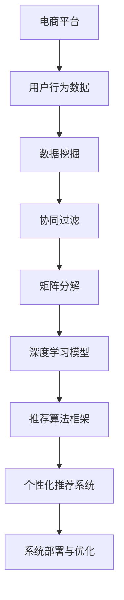

                 

### 《AI在电商平台中的个性化应用》

> 关键词：人工智能，电商，个性化推荐，协同过滤，深度学习，矩阵分解

> 摘要：本文将探讨人工智能在电商平台中的应用，重点介绍个性化推荐系统的原理、核心算法及其在电商平台中的实际应用。通过一步步的逻辑分析，本文将帮助读者深入了解AI技术在电商领域的创新与价值。

----------------------------------------------------------------

### 第一部分：背景与概述

#### 第1章：电商平台与AI概述

#### 1.1 电商平台的发展与趋势

随着互联网技术的快速发展，电商平台已经成为现代社会购物的主要渠道之一。从早期的电商网站，到如今的大数据分析、人工智能等新兴技术的应用，电商平台经历了巨大的变革。根据最新的市场报告，全球电商市场规模持续增长，预计到2025年将达到6.3万亿美元。这一趋势不仅改变了消费者的购物习惯，也为电商平台带来了巨大的商机。

#### 1.2 AI在电商领域的应用价值

人工智能技术的应用，为电商平台带来了前所未有的个性化体验和运营效率。个性化推荐系统、智能客服、图像识别、语音识别等技术，不仅提高了用户的购物满意度，也大大提升了电商平台的竞争力。通过AI技术，电商平台能够更好地理解用户需求，提供精准的推荐，提高销售转化率。

#### 1.3 个性化推荐系统的概念与重要性

个性化推荐系统是电商平台中最重要的AI应用之一。它通过分析用户的行为数据，为用户推荐可能感兴趣的商品。个性化推荐系统的核心是算法，包括协同过滤、矩阵分解、深度学习等。这些算法能够从海量数据中挖掘出用户的兴趣点，为用户提供个性化的购物体验。

### 第2章：AI在电商平台中的应用原理

#### 2.1 数据挖掘与用户行为分析

个性化推荐系统的第一步是数据挖掘与用户行为分析。电商平台会收集大量的用户行为数据，包括浏览历史、购买记录、评价反馈等。通过对这些数据的分析，可以发现用户的兴趣点和偏好，为个性化推荐提供基础。

#### 2.2 机器学习算法在推荐系统中的应用

机器学习算法在个性化推荐系统中扮演着重要的角色。协同过滤、矩阵分解、深度学习等算法，通过学习和预测用户行为，为用户提供精准的推荐。协同过滤算法通过用户行为相似性进行推荐，矩阵分解算法通过降低数据维度进行推荐，深度学习算法通过神经网络进行推荐。

#### 2.3 深度学习模型在个性化推荐中的应用

深度学习模型在个性化推荐系统中具有强大的预测能力。通过卷积神经网络（CNN）和循环神经网络（RNN）等模型，可以更好地捕捉用户的兴趣点，提供更准确的推荐结果。

### 第3章：AI推荐系统架构设计

#### 3.1 推荐系统的基本架构

推荐系统的基本架构包括数据层、算法层和应用层。数据层负责数据采集和处理，算法层负责推荐算法的实现，应用层负责将推荐结果呈现给用户。

#### 3.2 个性化推荐算法框架

个性化推荐算法框架包括用户画像、商品画像、推荐策略和推荐结果等模块。通过这些模块的协同工作，可以实现个性化的推荐。

#### 3.3 数据流与处理流程

数据流与处理流程是推荐系统设计的关键。从数据采集、数据处理到推荐结果生成，每个环节都需要精心设计，确保推荐系统的稳定性和高效性。

----------------------------------------------------------------

### 第二部分：核心算法原理讲解

#### 第4章：协同过滤算法

#### 4.1 基于用户的协同过滤

基于用户的协同过滤算法通过分析用户之间的相似性，为用户推荐相似用户喜欢的商品。其核心思想是：如果两个用户在多个商品上的评分相似，那么这两个用户对未评分的商品也可能会给出相似的评分。

#### 4.2 基于物品的协同过滤

基于物品的协同过滤算法通过分析商品之间的相似性，为用户推荐相似商品。其核心思想是：如果两个商品在多个用户上的评分相似，那么这两个商品也可能会被用户同时喜欢。

#### 4.3 交替最小二乘法（ALS）算法详解

交替最小二乘法（ALS）是一种经典的协同过滤算法。其基本思想是交替优化用户和物品的矩阵分解，以达到最小化预测误差。

#### 第5章：矩阵分解与隐语义模型

#### 5.1 矩阵分解基本原理

矩阵分解是一种常用的降维技术，通过将高维的评分矩阵分解为两个低维的矩阵，来降低数据维度，提高计算效率。

#### 5.2 隐语义模型构建

隐语义模型是一种基于矩阵分解的推荐算法。其核心思想是：通过将用户和商品映射到低维空间，来发现用户和商品之间的隐含关系。

#### 5.3 SVD++算法详解

SVD++算法是一种改进的矩阵分解算法，通过引入用户和商品的属性信息，来提高推荐系统的准确性和泛化能力。

#### 第6章：深度学习推荐算法

#### 6.1 神经网络在推荐系统中的应用

神经网络在推荐系统中扮演着重要的角色。通过构建深度神经网络，可以更好地捕捉用户和商品之间的复杂关系。

#### 6.2 卷积神经网络（CNN）在推荐系统中的应用

卷积神经网络（CNN）在图像识别等领域取得了显著的成功。通过将CNN引入推荐系统，可以更好地处理商品和用户的多媒体信息。

#### 6.3 循环神经网络（RNN）在推荐系统中的应用

循环神经网络（RNN）在处理序列数据方面具有优势。通过将RNN引入推荐系统，可以更好地捕捉用户的长期行为模式。

----------------------------------------------------------------

### 第三部分：项目实战

#### 第7章：构建电商平台个性化推荐系统

#### 7.1 项目背景与需求分析

本项目旨在构建一个电商平台个性化推荐系统，为用户提供个性化的购物推荐。系统需求包括：实时推荐、精准推荐、多样化推荐策略等。

#### 7.2 数据采集与预处理

数据采集包括用户行为数据、商品数据等。数据预处理包括数据清洗、数据转换和数据归一化等步骤。

#### 7.3 算法选择与模型训练

算法选择包括协同过滤、矩阵分解、深度学习等。模型训练包括数据集划分、模型训练和模型评估等步骤。

#### 7.4 系统部署与优化

系统部署包括模型部署、接口开发和应用部署等步骤。系统优化包括性能优化、稳定性优化和安全性优化等。

#### 第8章：代码实现与解读

#### 8.1 数据预处理代码实现

数据预处理是构建推荐系统的基础。本节将介绍如何实现数据预处理代码。

#### 8.2 协同过滤算法实现

协同过滤算法是推荐系统的核心。本节将介绍如何实现协同过滤算法。

#### 8.3 深度学习算法实现

深度学习算法在推荐系统中具有广泛的应用。本节将介绍如何实现深度学习算法。

#### 第9章：源代码解析与性能分析

#### 9.1 源代码结构解析

源代码结构解析是理解推荐系统实现的关键。本节将介绍推荐系统源代码的结构和模块划分。

#### 9.2 性能评估方法与指标

性能评估是验证推荐系统效果的重要手段。本节将介绍性能评估方法和指标。

#### 9.3 实际应用中的优化策略

实际应用中，推荐系统需要不断地优化和调整。本节将介绍实际应用中的优化策略。

----------------------------------------------------------------

### 附录

#### 附录A：参考资料与工具介绍

本附录将介绍个性化推荐系统常用的工具和参考资料，包括深度学习框架、数据处理工具和推荐系统开源库等。

#### 附录B：常见问题与解决方案

本附录将介绍构建电商平台个性化推荐系统过程中可能遇到的问题和解决方案，包括数据质量问题、模型训练问题和部署问题等。

#### 附录C：扩展阅读

本附录将推荐一些与个性化推荐系统相关的书籍、学术论文和实践经验分享，以帮助读者更深入地了解该领域。

----------------------------------------------------------------

### 附加内容：核心概念与联系流程图



### 附加内容：深度学习推荐算法伪代码

```python
# 定义深度学习推荐算法
def deep_learning_recommendation(input_data):
    # 初始化模型
    model = build_model()
    
    # 训练模型
    model.fit(input_data)
    
    # 进行预测
    predictions = model.predict(input_data)
    
    # 返回预测结果
    return predictions

# 建立模型
def build_model():
    # 定义神经网络结构
    model = keras.Sequential([
        keras.layers.Dense(units=128, activation='relu', input_shape=(input_shape,)),
        keras.layers.Dropout(0.5),
        keras.layers.Dense(units=64, activation='relu'),
        keras.layers.Dropout(0.5),
        keras.layers.Dense(units=num_items, activation='softmax')
    ])
    
    # 编译模型
    model.compile(optimizer='adam', loss='categorical_crossentropy', metrics=['accuracy'])
    
    return model
```

### 附加内容：协同过滤算法数学模型

$$
R_{ui} = \sum_{j \in N_i} \frac{q_{uj}}{|\text{N}_i|} + b_u + b_i - \langle b \rangle
$$

其中：
- $R_{ui}$ 是用户 $u$ 对物品 $i$ 的评分。
- $N_i$ 是与物品 $i$ 相似的一组物品集合。
- $q_{uj}$ 是用户 $u$ 对物品 $j$ 的评分。
- $b_u$ 和 $b_i$ 分别是用户 $u$ 和物品 $i$ 的偏置项。
- $\langle b \rangle$ 是所有用户的平均评分。

### 附加内容：交替最小二乘法（ALS）算法详解

交替最小二乘法（ALS）是协同过滤算法中的一种常用算法，用于预测用户未评分的物品评分。其基本思想是交替优化用户和物品的矩阵分解，以达到最小化预测误差。

**算法步骤：**

1. 初始化用户-物品评分矩阵 $R$ 的两个低秩分解矩阵 $U \in \mathbb{R}^{n \times k}$ 和 $V \in \mathbb{R}^{m \times k}$，其中 $n$ 和 $m$ 分别是用户数和物品数，$k$ 是隐变量维度。

2. 对用户矩阵 $U$ 和物品矩阵 $V$ 进行交替优化：
   - 对用户矩阵 $U$ 进行优化：
     $$ U = \arg\min_U \sum_{i=1}^{m} \sum_{j=1}^{n} (r_{ij} - \langle r_j \rangle - U_j^T V_i)^2 $$
   - 对物品矩阵 $V$ 进行优化：
     $$ V = \arg\min_V \sum_{i=1}^{m} \sum_{j=1}^{n} (r_{ij} - \langle r_j \rangle - U_j^T V_i)^2 $$

3. 重复步骤 2，直到收敛。

4. 使用得到的分解矩阵 $U$ 和 $V$ 进行评分预测：
   $$ \hat{r}_{ij} = \langle r_j \rangle + U_i^T V_j $$

其中 $\langle r_j \rangle$ 是物品 $i$ 的平均评分。通过这种方式，ALS 可以预测用户未评分的物品评分，从而为用户提供个性化推荐。**注意：**在 ALS 算法中，可以通过调整隐变量维度 $k$ 来平衡推荐系统的精度和计算复杂度。高维度的分解矩阵可以捕捉到更多的信息，但计算成本更高。较低维度的分解矩阵则可以降低计算复杂度，但可能无法捕捉到所有的重要信息。在实际应用中，需要根据具体情况来选择合适的 $k$ 值。

---

**作者：AI天才研究院/AI Genius Institute & 禅与计算机程序设计艺术 /Zen And The Art of Computer Programming**

---

本文旨在探讨人工智能在电商平台中的个性化应用，通过一步步的逻辑分析，帮助读者深入了解AI技术在电商领域的创新与价值。在接下来的章节中，我们将详细讲解个性化推荐系统的原理、核心算法及其在电商平台中的实际应用。希望本文能对您在AI与电商领域的探索有所帮助。

