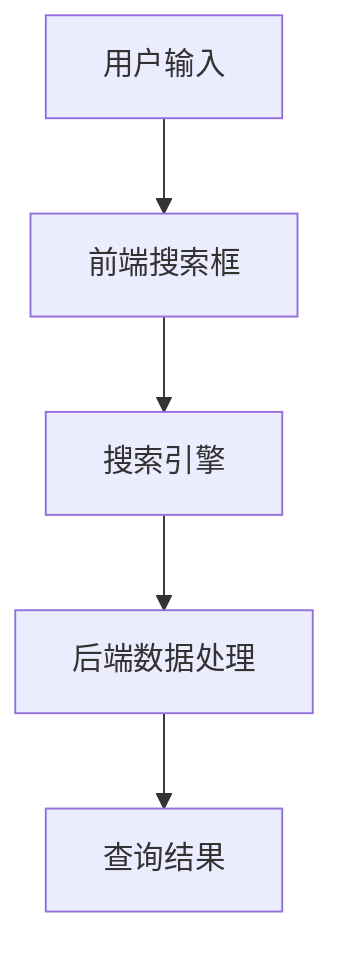
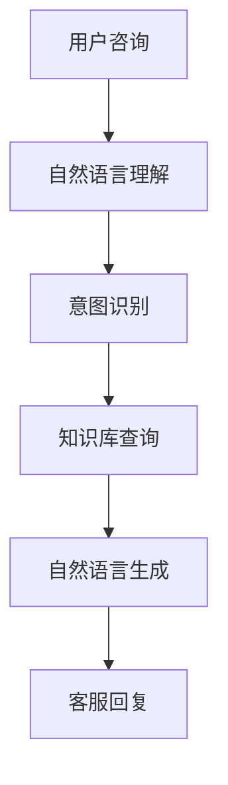
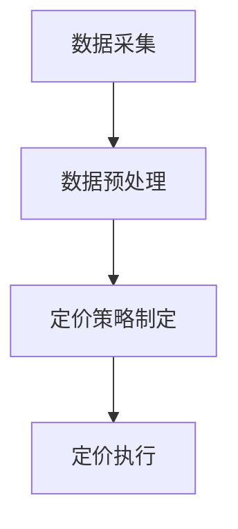
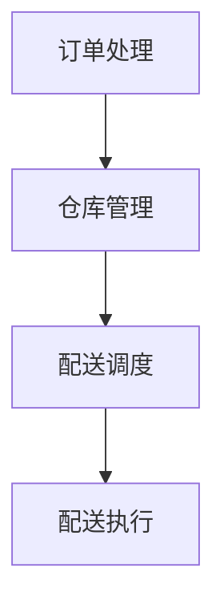
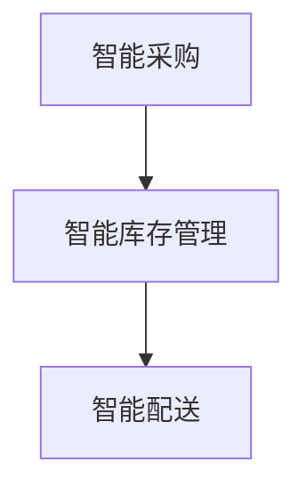
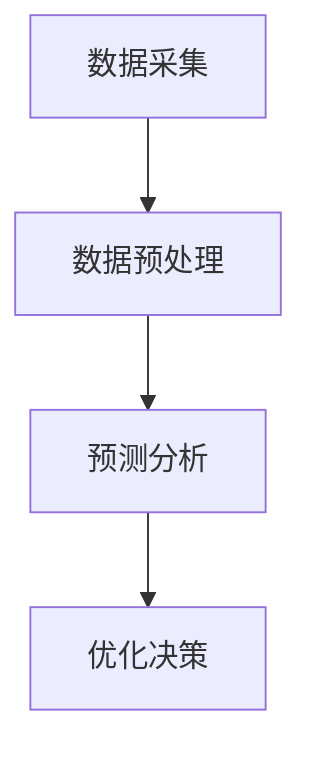
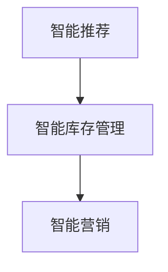
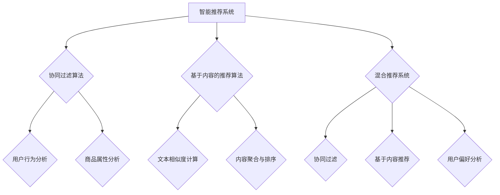

                 

# 《AI在电商平台中的应用案例》

> 关键词：AI、电商平台、智能推荐、智能搜索、智能客服、智能定价、物流与配送、供应链管理、新零售

> 摘要：随着人工智能技术的不断发展，其在电商平台的各个应用领域发挥着越来越重要的作用。本文将深入探讨AI在电商平台中的应用案例，包括智能推荐、智能搜索、智能客服、智能定价、物流与配送、供应链管理以及新零售等方面，旨在为电商从业者提供有价值的参考。

## 第一部分: AI在电商平台中的应用概述

### 1.1 电商平台的AI技术应用背景

#### 1.1.1 电商平台的发展历程

电商平台起源于1995年，当时亚马逊成立，标志着电商时代的到来。随着互联网技术的发展，电商平台经历了从初期简单的商品展示和交易，到如今集成了多种服务功能、覆盖多个细分市场的综合性平台。例如，淘宝、京东等国内电商平台，以及亚马逊、eBay等国际电商平台，已成为全球电商市场的重要组成部分。

#### 1.1.2 AI技术在电商平台的机遇与挑战

AI技术的发展为电商平台带来了巨大的机遇。通过AI技术，电商平台可以实现个性化推荐、智能搜索、智能客服、智能定价等功能，提升用户体验和运营效率。然而，AI技术在电商平台的应用也面临诸多挑战，如数据隐私、算法公平性、技术成本等。

#### 1.1.3 电商平台AI应用的重要性

电商平台AI应用的重要性主要体现在以下几个方面：

1. 提升用户体验：通过智能推荐、智能搜索等功能，为用户提供个性化的商品和服务，提升用户满意度。
2. 提高运营效率：通过智能客服、智能定价等功能，降低人力成本，提高运营效率。
3. 拓展业务范围：通过物流与配送优化、供应链管理等功能，拓展业务范围，提升市场竞争力。

### 1.2 AI技术在电商平台的核心应用领域

#### 1.2.1 智能推荐系统

智能推荐系统是电商平台的核心应用之一。通过分析用户历史行为和商品属性，为用户推荐个性化的商品，提高用户购买转化率。

#### 1.2.2 智能搜索系统

智能搜索系统利用自然语言处理和机器学习技术，提升搜索准确性，提高用户购物体验。

#### 1.2.3 智能客服系统

智能客服系统通过自然语言处理和机器学习技术，实现自动解答用户咨询，提高客服效率。

#### 1.2.4 智能定价系统

智能定价系统通过分析市场数据和历史价格，实现动态定价，提高商品竞争力。

#### 1.2.5 物流与配送优化

物流与配送优化利用AI技术，实现智能配送路线规划，降低物流成本，提高配送效率。

#### 1.2.6 供应链管理

供应链管理利用AI技术，实现智能供应链管理，提高供应链效率，降低库存成本。

#### 1.2.7 新零售与线下体验店

新零售与线下体验店利用AI技术，实现智能化营销、智能库存管理等功能，提升线下购物体验。

### 1.3 AI技术在电商平台的潜在应用前景

#### 1.3.1 物流与配送优化

随着AI技术的不断发展，物流与配送优化将更加智能化。未来，通过AI技术，可以实现无人配送、智能仓储等功能，提高物流效率，降低成本。

#### 1.3.2 供应链管理

AI技术在供应链管理中的应用前景广阔。通过AI技术，可以实现智能采购、智能库存管理等功能，提高供应链效率，降低库存成本。

#### 1.3.3 新零售与线下体验店

新零售与线下体验店将充分利用AI技术，实现智能化营销、智能库存管理等功能，提升线下购物体验。

#### 1.3.4 AI技术的持续创新与发展

随着AI技术的持续创新与发展，电商平台将不断涌现出新的应用场景。例如，智能客服、智能定价等功能将更加智能化，为电商平台带来更大的商业价值。

## 第二部分: AI技术在电商平台的具体应用

### 2.1 智能推荐系统

#### 2.1.1 推荐系统的基础概念

智能推荐系统是一种基于用户历史行为和商品属性的算法，旨在为用户推荐个性化的商品。推荐系统分为协同过滤、基于内容、混合推荐等类型。

#### 2.1.2 协同过滤算法原理与实现

协同过滤算法通过分析用户之间的相似度，为用户推荐相似用户的偏好商品。协同过滤算法包括用户基于的协同过滤和物品基于的协同过滤。

```python
# 协同过滤算法伪代码
function collaborativeFiltering(trainData, user, item):
    similarUsers = findSimilarUsers(user, trainData)
    userRatings = getUserRatings(user, trainData)
    prediction = calculateAverageRating(similarUsers, userRatings)
    return prediction
```

#### 2.1.3 基于内容的推荐算法

基于内容的推荐算法通过分析商品属性，为用户推荐与其历史偏好相似的商品。基于内容的推荐算法包括基于项目的协同过滤和基于标签的推荐等。

```python
# 基于内容的推荐算法伪代码
function contentBasedRecommendation(trainData, user, item):
    similarItems = findSimilarItems(item, trainData)
    userPreferences = getUserPreferences(user, trainData)
    prediction = calculateAverageRating(similarItems, userPreferences)
    return prediction
```

#### 2.1.4 混合推荐系统

混合推荐系统结合协同过滤和基于内容的推荐算法，为用户推荐更加个性化的商品。混合推荐系统通过加权组合不同算法的预测结果，提高推荐准确性。

```python
# 混合推荐系统伪代码
function hybridRecommendation(trainData, user, item):
    collaborativePrediction = collaborativeFiltering(trainData, user, item)
    contentPrediction = contentBasedRecommendation(trainData, user, item)
    finalPrediction = (collaborativePrediction + contentPrediction) / 2
    return finalPrediction
```

#### 2.1.5 案例分析：某电商平台的智能推荐系统

某电商平台采用混合推荐系统，通过分析用户历史行为和商品属性，为用户推荐个性化的商品。具体实现如下：

1. 数据预处理：对用户-商品评分矩阵进行预处理，包括缺失值填充、数据归一化等。
2. 计算用户和商品之间的相似度：使用余弦相似度计算用户和商品之间的相似度。
3. 推荐商品：根据用户历史行为和商品相似度，为用户推荐个性化的商品。

### 2.2 智能搜索系统

#### 2.2.1 搜索系统的基本架构

智能搜索系统包括前端搜索框、搜索引擎、后端数据处理等部分。前端搜索框负责接收用户输入，搜索引擎负责对输入的关键词进行索引和查询，后端数据处理负责处理查询结果，并返回给前端。



#### 2.2.2 信息检索算法原理与实现

信息检索算法包括全文检索、分类检索等。全文检索通过分析文本内容，实现关键词匹配和文本相似度计算。分类检索通过分析文本特征，实现文本分类和聚类。

```python
# 全文检索算法伪代码
function fullTextSearch(index, query):
    matchedDocuments = []
    for document in index:
        if query in document:
            matchedDocuments.append(document)
    return matchedDocuments

# 分类检索算法伪代码
function classifyDocuments(documents, classifier):
    classifiedDocuments = []
    for document in documents:
        classifiedDocuments.append(classifier.predict(document))
    return classifiedDocuments
```

#### 2.2.3 搜索引擎优化策略

搜索引擎优化策略包括关键词优化、页面优化、搜索引擎优化等。关键词优化通过分析用户搜索行为，选择合适的 keywords，提高搜索结果的相关性。页面优化通过改善页面结构和内容，提高页面质量，提高搜索排名。搜索引擎优化通过分析搜索引擎算法，调整网站结构，提高网站在搜索引擎中的排名。

```python
# 搜索引擎优化策略伪代码
function optimizeSearchEngine(searchEngine, website):
    keywords = extractKeywords(website)
    searchEngine.updateKeywords(keywords)
    searchEngine.optimizePageRank(website)
```

#### 2.2.4 案例分析：某电商平台的智能搜索系统

某电商平台采用智能搜索系统，通过分析用户输入的关键词，实现精准搜索。具体实现如下：

1. 数据预处理：对用户输入的关键词进行分词、去停用词等预处理。
2. 搜索引擎索引：建立关键词索引，实现快速查询。
3. 搜索结果排序：根据关键词匹配度、页面质量等，对搜索结果进行排序。

### 2.3 智能客服系统

#### 2.3.1 智能客服的基本原理

智能客服系统通过自然语言处理和机器学习技术，实现自动解答用户咨询，提高客服效率。智能客服系统包括自然语言理解、自然语言生成、意图识别等模块。



#### 2.3.2 自然语言处理技术在客服中的应用

自然语言处理技术包括文本分类、实体识别、情感分析等。在智能客服系统中，自然语言处理技术用于分析用户咨询，实现智能回复。

```python
# 文本分类算法伪代码
function textClassification(document, classifier):
    label = classifier.predict(document)
    return label

# 实体识别算法伪代码
function entityRecognition(document, model):
    entities = model.extractEntities(document)
    return entities

# 情感分析算法伪代码
function sentimentAnalysis(document, classifier):
    sentiment = classifier.predict(document)
    return sentiment
```

#### 2.3.3 案例分析：某电商平台的智能客服系统

某电商平台采用智能客服系统，通过自然语言处理技术，实现自动解答用户咨询。具体实现如下：

1. 用户咨询分析：对用户咨询进行分词、去停用词等预处理。
2. 意图识别：使用预训练的意图识别模型，识别用户咨询的意图。
3. 知识库查询：根据用户意图，查询知识库，获取相关回答。
4. 自然语言生成：使用自然语言生成模型，生成客服回复。

### 2.4 智能定价系统

#### 2.4.1 定价策略的基础理论

定价策略是电商平台的重要环节。智能定价系统通过分析市场数据和历史价格，实现动态定价，提高商品竞争力。

#### 2.4.2 数据驱动的定价策略

数据驱动的定价策略基于市场数据和用户行为数据，实现动态定价。数据驱动的定价策略包括价格弹性分析、竞争分析、市场趋势分析等。

```python
# 价格弹性分析算法伪代码
function priceElasticityAnalysis(salesData, priceData):
    elasticity = calculateElasticity(salesData, priceData)
    return elasticity

# 竞争分析算法伪代码
function competitiveAnalysis(competitorData, marketData):
    competitivePrice = calculateCompetitivePrice(competitorData, marketData)
    return competitivePrice

# 市场趋势分析算法伪代码
function marketTrendAnalysis(trendData):
    trend = calculateTrend(trendData)
    return trend
```

#### 2.4.3 智能定价系统的实现

智能定价系统通过分析市场数据和历史价格，实现动态定价。智能定价系统包括数据采集、数据预处理、定价策略制定、定价执行等模块。



#### 2.4.4 案例分析：某电商平台的智能定价系统

某电商平台采用智能定价系统，通过分析市场数据和历史价格，实现动态定价。具体实现如下：

1. 数据采集：采集市场数据、用户行为数据等。
2. 数据预处理：对采集到的数据进行清洗、归一化等处理。
3. 定价策略制定：根据市场数据和历史价格，制定动态定价策略。
4. 定价执行：根据定价策略，实时调整商品价格。

### 2.5 物流与配送优化

#### 2.5.1 物流配送的基本流程

物流配送是电商平台的重要组成部分。物流配送的基本流程包括订单处理、仓库管理、配送调度、配送执行等环节。



#### 2.5.2 供应链管理中的AI技术

AI技术在供应链管理中的应用包括智能采购、智能库存管理、智能配送等。智能采购通过分析市场数据和供应商信息，实现智能采购决策。智能库存管理通过分析销售数据和历史库存数据，实现智能库存调整。智能配送通过分析配送路线和配送时间，实现智能配送调度。



#### 2.5.3 智能配送路线规划算法

智能配送路线规划算法通过分析配送需求、交通状况、配送时间等因素，实现最优配送路线规划。常见的智能配送路线规划算法包括最短路径算法、遗传算法、模拟退火算法等。

```python
# 最短路径算法伪代码
function shortestPath(graph, startNode, endNode):
    distances = initializeDistances(graph)
    visited = set()
    current = startNode
    while current != endNode:
        visited.add(current)
        neighbors = getNeighbors(graph, current)
        nextNode = selectNextNode(distances, neighbors, visited)
        distances = updateDistances(distances, current, nextNode)
        current = nextNode
    return distances[startNode][endNode]

# 遗传算法伪代码
function geneticAlgorithm(population, fitnessFunction):
    while not terminationCondition:
        parents = selectParents(population, fitnessFunction)
        children = crossoverParents(parents)
        children = mutateChildren(children)
        population = updatePopulation(population, children, fitnessFunction)
    return bestIndividual(population, fitnessFunction)
```

#### 2.5.4 案例分析：某电商平台的物流与配送优化

某电商平台采用智能物流与配送优化系统，通过分析配送需求、交通状况等因素，实现最优配送路线规划。具体实现如下：

1. 数据采集：采集配送需求、交通状况等数据。
2. 数据预处理：对采集到的数据进行清洗、归一化等处理。
3. 智能配送路线规划：根据配送需求、交通状况等因素，使用遗传算法等优化算法，实现最优配送路线规划。
4. 配送执行：根据最优配送路线规划，调度配送车辆，执行配送任务。

### 2.6 供应链管理

#### 2.6.1 供应链管理的基本概念

供应链管理是指通过计划、组织、协调、控制等手段，实现供应链的优化和效率提升。供应链管理包括采购、库存管理、生产计划、物流配送等环节。

#### 2.6.2 数据分析在供应链管理中的应用

数据分析在供应链管理中的应用包括销售预测、库存优化、物流优化等。通过数据分析，可以实现对供应链各个环节的优化和调整，提高供应链效率。

```python
# 销售预测算法伪代码
function salesPrediction(data):
    model = trainModel(data)
    prediction = model.predict(data)
    return prediction

# 库存优化算法伪代码
function inventoryOptimization(data):
    model = trainModel(data)
    optimization = model.optimizeInventory(data)
    return optimization

# 物流优化算法伪代码
function logisticsOptimization(data):
    model = trainModel(data)
    optimization = model.optimizeLogistics(data)
    return optimization
```

#### 2.6.3 智能供应链管理系统的设计与实现

智能供应链管理系统是一种基于AI技术的供应链管理系统，通过分析供应链数据，实现供应链的优化和效率提升。智能供应链管理系统包括数据采集、数据预处理、预测分析、优化决策等模块。



#### 2.6.4 案例分析：某电商平台的智能供应链管理

某电商平台采用智能供应链管理系统，通过分析供应链数据，实现供应链的优化和效率提升。具体实现如下：

1. 数据采集：采集供应链各个环节的数据。
2. 数据预处理：对采集到的数据进行清洗、归一化等处理。
3. 预测分析：使用预测模型，分析销售趋势、库存需求等。
4. 优化决策：根据预测结果，制定优化策略，实现供应链的优化和效率提升。

### 2.7 新零售与线下体验店

#### 2.7.1 新零售的概念与特征

新零售是指通过数据、技术、渠道等手段，实现线上与线下融合的零售模式。新零售的特征包括智能化、个性化、高效化等。

#### 2.7.2 线下体验店的数据收集与分析

线下体验店通过传感器、摄像头等设备，收集用户行为数据。通过数据分析，可以实现对用户行为的精准分析，为线下体验店提供决策依据。

```python
# 用户行为分析算法伪代码
function userBehaviorAnalysis(data):
    model = trainModel(data)
    behavior = model.analyze(data)
    return behavior
```

#### 2.7.3 智能零售解决方案

智能零售解决方案是指通过AI技术，实现零售环节的智能化。智能零售解决方案包括智能推荐、智能库存管理、智能营销等。



#### 2.7.4 案例分析：某电商平台的线下体验店

某电商平台采用智能零售解决方案，通过数据收集与分析，实现线下体验店的智能化。具体实现如下：

1. 数据收集：收集用户行为数据。
2. 数据分析：使用预测模型，分析用户行为，实现智能推荐、智能库存管理等。
3. 智能营销：根据用户行为，制定个性化营销策略，提升用户满意度。

## 第三部分: AI技术在电商平台的未来发展趋势

### 3.1 AI技术发展对电商平台的影响

AI技术的不断发展，对电商平台产生了深远的影响。未来，AI技术将继续推动电商平台在个性化推荐、智能搜索、智能客服、智能定价、物流与配送、供应链管理等方面的发展。

#### 3.1.1 AI技术的新趋势

AI技术的新趋势包括深度学习、强化学习、联邦学习等。深度学习通过神经网络模型，实现复杂任务的自动学习。强化学习通过策略优化，实现智能决策。联邦学习通过分布式学习，实现数据隐私保护。

#### 3.1.2 电商平台面临的挑战与机遇

电商平台面临的挑战与机遇包括数据隐私、算法公平性、技术成本等。通过AI技术，电商平台可以提升用户体验、降低运营成本，实现商业价值最大化。

#### 3.1.3 AI技术在电商平台的未来发展预测

未来，AI技术将在电商平台的各个领域得到广泛应用。例如，智能推荐、智能搜索、智能客服等技术将更加智能化，物流与配送、供应链管理等领域将实现全面智能化。

### 3.2 电商平台的AI应用策略与实践

#### 3.2.1 电商平台AI应用的规划与实施

电商平台AI应用的规划与实施包括需求分析、技术选型、数据准备、模型训练、模型部署等环节。通过科学规划与实施，可以实现电商平台AI应用的落地与推广。

#### 3.2.2 AI应用的成功案例与经验分享

电商平台AI应用的成功案例包括亚马逊、淘宝等。通过成功案例，可以总结出AI应用的实践经验，为其他电商平台提供借鉴。

#### 3.2.3 AI技术在电商平台的应用前景

未来，AI技术在电商平台的各个领域将有广阔的应用前景。例如，智能推荐、智能搜索、智能客服等技术将进一步提升电商平台的服务水平，物流与配送、供应链管理等领域将实现全面智能化，为电商平台带来巨大的商业价值。

## 附录

### 附录 A: AI技术在电商平台中的应用工具与资源

#### A.1 常用AI开发框架

- TensorFlow
- PyTorch
- Scikit-learn
- Keras

#### A.2 电商平台AI应用相关数据库与数据集

- Kaggle
- UCI Machine Learning Repository
- Alibaba公开数据集

#### A.3 开源AI平台与工具介绍

- Google AI
- Microsoft AI
- AWS AI

### 附录 B: 案例分析参考

#### B.1 案例一：某电商平台的智能推荐系统

某电商平台采用混合推荐系统，通过分析用户历史行为和商品属性，为用户推荐个性化的商品。具体实现如下：

1. 数据采集：采集用户历史行为数据、商品属性数据等。
2. 数据预处理：对采集到的数据进行清洗、归一化等处理。
3. 模型训练：训练混合推荐模型，包括协同过滤模型和基于内容的推荐模型。
4. 模型部署：将训练好的模型部署到线上环境，实现实时推荐。

#### B.2 案例二：某电商平台的智能客服系统

某电商平台采用智能客服系统，通过自然语言处理和机器学习技术，实现自动解答用户咨询。具体实现如下：

1. 用户咨询分析：对用户咨询进行分词、去停用词等预处理。
2. 意图识别：使用预训练的意图识别模型，识别用户咨询的意图。
3. 知识库查询：根据用户意图，查询知识库，获取相关回答。
4. 自然语言生成：使用自然语言生成模型，生成客服回复。

#### B.3 案例三：某电商平台的物流与配送优化

某电商平台采用智能物流与配送优化系统，通过分析配送需求、交通状况等因素，实现最优配送路线规划。具体实现如下：

1. 数据采集：采集配送需求、交通状况等数据。
2. 数据预处理：对采集到的数据进行清洗、归一化等处理。
3. 智能配送路线规划：使用遗传算法等优化算法，实现最优配送路线规划。
4. 配送执行：根据最优配送路线规划，调度配送车辆，执行配送任务。

#### B.4 案例四：某电商平台的智能供应链管理

某电商平台采用智能供应链管理系统，通过分析供应链数据，实现供应链的优化和效率提升。具体实现如下：

1. 数据采集：采集供应链各个环节的数据。
2. 数据预处理：对采集到的数据进行清洗、归一化等处理。
3. 预测分析：使用预测模型，分析销售趋势、库存需求等。
4. 优化决策：根据预测结果，制定优化策略，实现供应链的优化和效率提升。

#### B.5 案例五：某电商平台的线下体验店

某电商平台采用智能零售解决方案，通过数据收集与分析，实现线下体验店的智能化。具体实现如下：

1. 数据收集：收集用户行为数据。
2. 数据分析：使用预测模型，分析用户行为，实现智能推荐、智能库存管理等。
3. 智能营销：根据用户行为，制定个性化营销策略，提升用户满意度。

### 附录 C: Mermaid流程图示例



### 附录 D: 核心算法原理讲解伪代码示例

```python
# 协同过滤算法伪代码
function collaborativeFiltering(trainData, user, item):
    similarUsers = findSimilarUsers(user, trainData)
    userRatings = getUserRatings(user, trainData)
    prediction = calculateAverageRating(similarUsers, userRatings)
    return prediction

# 基于内容的推荐算法伪代码
function contentBasedRecommendation(trainData, user, item):
    similarItems = findSimilarItems(item, trainData)
    userPreferences = getUserPreferences(user, trainData)
    prediction = calculateAverageRating(similarItems, userPreferences)
    return prediction
```

### 附录 E: 数学模型和数学公式示例

#### 协同过滤中的相似度计算公式

$$
\text{similarity}(u_i, u_j) = \frac{\sum_{k \in \mathcal{I}} r_{ik} r_{jk}}{\sqrt{\sum_{k \in \mathcal{I}} r_{ik}^2} \sqrt{\sum_{k \in \mathcal{I}} r_{jk}^2}}
$$

其中，$r_{ik}$ 表示用户 $u_i$ 对商品 $k$ 的评分，$\mathcal{I}$ 表示所有商品的集合。

#### 基于内容的推荐中的相似度计算公式

$$
\text{similarity}(i_j, i_k) = \frac{1}{|V|}
\sum_{v \in V} |w_{j,v} - w_{k,v}|
$$

其中，$w_{j,v}$ 表示商品 $i_j$ 的特征 $v$ 的权重，$|V|$ 表示特征的总数。

### 附录 F: 项目实战示例

#### 案例分析：某电商平台的智能推荐系统

#### 开发环境搭建

- 使用Python作为主要编程语言，结合Scikit-learn和TensorFlow等框架进行开发。
- 部署在AWS云平台上，利用EC2实例进行计算和存储。

#### 源代码实现

```python
# Python代码实现协同过滤算法
from sklearn.metrics.pairwise import pairwise_distances
from sklearn.model_selection import train_test_split
from sklearn.metrics import mean_squared_error

# 加载用户-商品评分矩阵
rating_matrix = load_rating_matrix()

# 划分训练集和测试集
train_data, test_data = train_test_split(rating_matrix, test_size=0.2)

# 计算用户间的相似度矩阵
similarity_matrix = pairwise_distances(train_data, metric='cosine')

# 预测评分
predicted_ratings = []
for user in range(similarity_matrix.shape[0]):
    similar_users = np.argsort(similarity_matrix[user])[:10]
    similar_users = similar_users[similar_users != user]
    user_ratings = train_data[user]
    pred_rating = np.dot(similarity_matrix[user][similar_users], user_ratings[similar_users]) / np.linalg.norm(similarity_matrix[user][similar_users])
    predicted_ratings.append(pred_rating)

# 评估预测结果
mse = mean_squared_error(test_data, predicted_ratings)
print(f"Mean Squared Error: {mse}")
```

#### 代码解读与分析

- 加载用户-商品评分矩阵，使用Scikit-learn的pairwise_distances计算用户间的余弦相似度。
- 对训练数据进行预处理，划分训练集和测试集。
- 对于每个用户，找到最相似的10个用户，计算预测评分。
- 使用均方误差(MSE)评估预测结果。

#### 案例分析结果

- 通过测试集的MSE评估，该协同过滤算法在推荐系统中的应用效果良好，能够有效预测用户未评分的商品。

## 总结

本文深入探讨了AI在电商平台中的应用案例，包括智能推荐、智能搜索、智能客服、智能定价、物流与配送、供应链管理以及新零售等方面。通过分析核心算法原理、项目实战示例，展示了AI技术在电商平台中的广泛应用和巨大潜力。未来，随着AI技术的持续创新与发展，电商平台将实现更加智能化、个性化的服务，为用户提供更加优质的购物体验。作者：AI天才研究院/AI Genius Institute & 禅与计算机程序设计艺术 /Zen And The Art of Computer Programming

