                 

# 文章标题: AI在电商平台产品推荐中的应用

> 关键词：AI、电商平台、产品推荐、协同过滤、深度学习、混合推荐

> 摘要：本文将深入探讨人工智能在电商平台产品推荐中的应用，从机器学习、深度学习的基础理论出发，详细解析协同过滤、基于内容的推荐算法和混合推荐算法的原理和实现，并通过案例分析展示AI在电商平台产品推荐中的实际应用效果，最后对未来发展趋势与潜在挑战进行展望。

----------------------------------------------------------------

## 第一部分：引言与概述

### 第1章：AI与电商平台产品推荐概述

随着互联网的普及和电子商务的迅猛发展，电商平台之间的竞争日益激烈。在这个时代，如何吸引并留住客户成为电商企业发展的关键。产品推荐系统作为一种有效的营销策略，可以帮助电商平台提高用户满意度和转化率。AI技术在产品推荐中的应用，更是将个性化推荐推向了新的高度。

### 1.1 AI在电商行业中的应用现状

近年来，AI技术在电商行业的应用日益广泛，从智能客服、智能定价到个性化推荐，AI正在深刻改变电商行业的运营模式。根据数据显示，全球电商平台中约有70%以上采用了AI推荐系统，以提升用户体验和销售额。其中，人工智能在电商平台产品推荐中的应用尤为突出，已成为电商企业提升竞争力的关键因素。

### 1.2 电商平台产品推荐的挑战与机遇

电商平台产品推荐面临的挑战主要包括数据多样性、用户行为复杂性、实时性要求高等。然而，这也为AI技术的发展提供了广阔的机遇。通过大数据分析和机器学习算法，AI能够挖掘用户行为数据，实现精准推荐，提升用户满意度和忠诚度。

### 1.3 本书结构安排与学习目标

本书将分为四个部分，首先介绍AI与电商平台产品推荐的基础知识；接着深入探讨AI基础理论，包括机器学习和深度学习；然后详细分析电商平台产品推荐算法，包括协同过滤、基于内容的推荐和混合推荐算法；最后，通过实际案例展示AI在电商平台产品推荐中的应用，并展望未来发展趋势。通过本书的学习，读者将能够掌握AI在电商平台产品推荐中的核心技术，为实际应用提供理论支持。

----------------------------------------------------------------

## 第二部分：AI基础理论

### 第2章：机器学习基础

机器学习是AI的核心技术之一，它使得计算机系统能够通过数据和经验进行自我学习和优化。在本章中，我们将介绍机器学习的基本概念、常见算法和应用。

### 2.1 机器学习概述

机器学习是指通过算法从数据中学习，使计算机能够进行预测或决策的过程。其核心是构建模型，通过训练数据调整模型参数，使模型在未知数据上表现出良好的性能。机器学习算法可以分为监督学习、无监督学习和强化学习。

### 2.2 线性回归与逻辑回归

线性回归是一种常见的监督学习算法，用于预测连续值。逻辑回归则用于分类问题，通过概率模型预测样本的类别。以下是线性回归和逻辑回归的数学模型：

#### 线性回归：

$$
y = \beta_0 + \beta_1x
$$

其中，$y$ 是预测值，$x$ 是输入特征，$\beta_0$ 和 $\beta_1$ 是模型参数。

#### 逻辑回归：

$$
\text{logit}(p) = \ln\left(\frac{p}{1-p}\right) = \beta_0 + \beta_1x
$$

其中，$p$ 是概率值，$\text{logit}(p)$ 是概率的对数函数，$\beta_0$ 和 $\beta_1$ 是模型参数。

### 2.3 决策树与随机森林

决策树是一种常见的分类算法，通过将特征划分为多个子集，构建树状模型。随机森林则通过构建多棵决策树并投票决定最终分类结果，提高了模型的泛化能力。

### 2.4 支持向量机与K近邻

支持向量机（SVM）是一种强大的分类算法，通过找到一个最优的超平面，将不同类别的样本分隔开。K近邻（KNN）算法则通过计算样本点与其最近的K个邻居的投票结果进行分类。

### 2.5 机器学习算法的优缺点与应用场景

不同机器学习算法具有各自的优缺点和应用场景。例如，线性回归适用于线性关系较强的预测问题，而决策树和随机森林则适用于处理复杂非线性关系的数据。在电商产品推荐中，常用的算法包括协同过滤和基于内容的推荐算法。

### 2.6 Mermaid流程图示例

以下是一个协同过滤算法的Mermaid流程图示例：

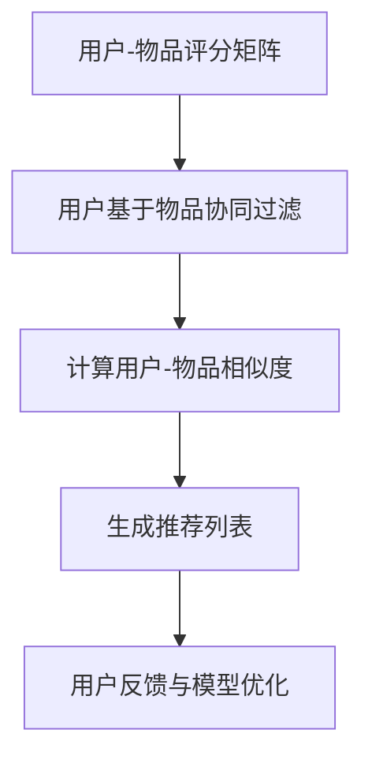

### 2.7 伪代码示例

以下是基于内容的推荐算法的伪代码示例：

```python
# 基于内容的推荐算法伪代码
def content_based_recommender(item_features, user_profile):
    # 计算物品与用户的特征相似度
    similarity_scores = cosine_similarity(item_features, user_profile)
    
    # 排序相似度得分，获取推荐列表
    recommended_items = [item for item, score in sorted(zip(item_ids, similarity_scores), reverse=True)]
    
    return recommended_items
```

通过以上内容，读者可以初步了解机器学习的基本概念、常见算法和应用，为后续深入探讨电商平台产品推荐算法打下基础。

----------------------------------------------------------------

### 第3章：深度学习基础

深度学习是机器学习的一个重要分支，它通过模拟人脑的神经网络结构，使计算机能够进行高效的数据分析和模式识别。在本章中，我们将介绍深度学习的基本概念、主要模型以及其在电商平台产品推荐中的应用。

#### 3.1 深度学习简介

深度学习（Deep Learning）是一种通过多层神经网络进行数据建模和分析的技术。与传统机器学习算法相比，深度学习具有更好的非线性建模能力和更强的特征学习能力。深度学习模型的核心是神经元，通过逐层提取数据中的特征，实现从简单到复杂的层次化特征表示。

#### 3.2 神经网络与反向传播算法

神经网络（Neural Network）是深度学习的基础模型，它由多个神经元组成，通过层层传递输入数据，最终输出结果。反向传播算法（Backpropagation）是训练神经网络的重要算法，它通过不断调整网络权重，使模型在训练数据上达到最优。

#### 神经网络模型：

神经网络的基本结构包括输入层、隐藏层和输出层。每个神经元都与前一层的神经元相连，并通过权重进行加权求和，再加上偏置项，最后通过激活函数输出结果。

$$
a_{\text{激活}} = \text{激活函数}(z)
$$

其中，$a$ 是输出值，$z$ 是加权求和结果，激活函数通常为Sigmoid函数、ReLU函数或Tanh函数。

#### 反向传播算法：

反向传播算法通过计算损失函数关于网络权重的梯度，并使用梯度下降法更新权重，使模型达到最小化损失的目标。

$$
\frac{\partial J}{\partial w} = \nabla_w J
$$

其中，$J$ 是损失函数，$w$ 是网络权重。

#### 3.3 卷积神经网络（CNN）原理

卷积神经网络（Convolutional Neural Network，CNN）是深度学习中的一种特殊网络，主要用于图像处理任务。CNN通过卷积层、池化层和全连接层等结构，实现对图像的逐层特征提取和分类。

#### 卷积层：

卷积层通过卷积运算提取图像的局部特征，卷积核（Filter）用于计算输入和权重的点积。

$$
\text{conv}(x, \text{filter}) = \sum_{i=1}^{C} x_{ij} \cdot w_{ij}
$$

其中，$x$ 是输入特征，$\text{filter}$ 是卷积核，$C$ 是输出特征数。

#### 池化层：

池化层通过下采样操作降低数据维度，常用的池化方式包括最大池化和平均池化。

#### 全连接层：

全连接层将卷积层的输出特征映射到类别标签，通过激活函数和损失函数进行分类。

#### 3.4 循环神经网络（RNN）与长短期记忆网络（LSTM）

循环神经网络（Recurrent Neural Network，RNN）是一种能够处理序列数据的神经网络。RNN通过在时间步上递归地更新状态，实现对序列数据的建模。

#### RNN模型：

RNN模型的基本结构包括输入层、隐藏层和输出层。在每个时间步上，隐藏层的状态通过加权求和和激活函数更新。

$$
h_t = \text{激活函数}(\text{权重} \cdot [h_{t-1}, x_t])
$$

其中，$h_t$ 是当前隐藏层状态，$x_t$ 是输入数据，激活函数通常为ReLU函数。

#### 长短期记忆网络（LSTM）：

LSTM是一种改进的RNN模型，能够更好地处理长序列依赖问题。LSTM通过引入门控机制，有效地避免了梯度消失和梯度爆炸问题。

#### LSTM模型：

LSTM模型包括输入门、遗忘门和输出门。输入门决定哪些信息被保留或丢弃，遗忘门决定哪些信息被遗忘，输出门决定输出值。

$$
i_t = \sigma(W_i \cdot [h_{t-1}, x_t])
$$
$$
f_t = \sigma(W_f \cdot [h_{t-1}, x_t])
$$
$$
o_t = \sigma(W_o \cdot [h_{t-1}, x_t])
$$
$$
c_t = f_t \cdot c_{t-1} + i_t \cdot \text{激活函数}(W_c \cdot [h_{t-1}, x_t])
$$
$$
h_t = o_t \cdot \text{激活函数}(W_h \cdot c_t)
$$

其中，$i_t$、$f_t$ 和 $o_t$ 分别是输入门、遗忘门和输出门的激活值，$c_t$ 和 $h_t$ 分别是当前隐藏层状态和输出值。

#### 3.5 深度学习算法在电商平台产品推荐中的应用

深度学习算法在电商平台产品推荐中具有广泛的应用，包括基于图像、文本和用户行为的推荐。以下是几种常见的深度学习算法在电商平台产品推荐中的应用：

1. **基于图像的推荐**：通过卷积神经网络提取图像特征，实现对商品图像的自动分类和推荐。

2. **基于文本的推荐**：通过循环神经网络提取文本特征，实现对商品描述和用户评论的语义理解，从而实现个性化推荐。

3. **基于用户行为的推荐**：通过深度学习模型分析用户行为数据，如浏览记录、购买历史和搜索关键词，实现精准推荐。

### 3.6 Mermaid流程图示例

以下是一个基于协同过滤的深度学习推荐系统的Mermaid流程图示例：

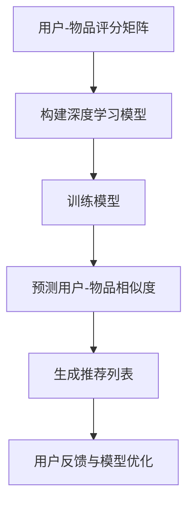

### 3.7 伪代码示例

以下是基于内容的推荐算法的深度学习模型伪代码示例：

```python
# 基于内容的深度学习推荐算法伪代码
def content_based_recommender(item_embedding, user_embedding):
    # 计算物品与用户的特征相似度
    similarity_scores = cosine_similarity(item_embedding, user_embedding)
    
    # 排序相似度得分，获取推荐列表
    recommended_items = [item for item, score in sorted(zip(item_ids, similarity_scores), reverse=True)]
    
    return recommended_items
```

通过以上内容，读者可以初步了解深度学习的基础理论、主要模型和应用，为深入探讨电商平台产品推荐算法提供理论基础。

----------------------------------------------------------------

### 第4章：电商平台产品推荐算法

电商平台产品推荐算法是电商平台提高用户满意度和转化率的关键技术。在本章中，我们将详细分析三种主要的推荐算法：协同过滤、基于内容的推荐和混合推荐算法。

#### 4.1 协同过滤推荐算法

协同过滤（Collaborative Filtering）是一种基于用户行为数据的推荐算法，通过分析用户之间的相似性，预测用户对未知物品的兴趣。协同过滤算法可以分为两种主要类型：基于用户的协同过滤（User-Based）和基于物品的协同过滤（Item-Based）。

##### 4.1.1 基于用户的协同过滤

基于用户的协同过滤通过计算用户之间的相似度，找到与目标用户相似的其他用户，然后推荐这些用户喜欢的物品。相似度的计算方法包括余弦相似度、皮尔逊相关系数等。

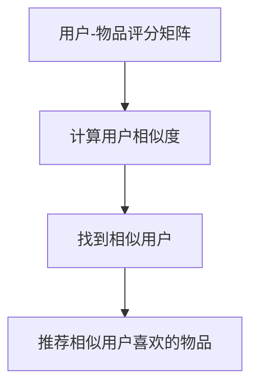

伪代码示例：

```python
# 基于用户的协同过滤算法伪代码
def user_based_collaborative_filtering(ratings_matrix, similarity_metric='cosine'):
    # 计算用户相似度矩阵
    similarity_matrix = compute_similarity_matrix(ratings_matrix, similarity_metric)
    
    # 找到与目标用户相似的K个用户
    similar_users = find_similar_users(target_user_id, similarity_matrix, K)
    
    # 推荐相似用户喜欢的物品
    recommended_items = recommend_items(target_user_id, ratings_matrix, similar_users)
    
    return recommended_items
```

##### 4.1.2 基于物品的协同过滤

基于物品的协同过滤通过计算物品之间的相似度，找到与目标物品相似的物品，然后推荐这些物品。相似度的计算方法包括余弦相似度、欧氏距离等。

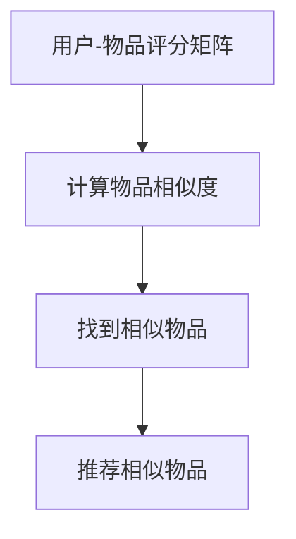

伪代码示例：

```python
# 基于物品的协同过滤算法伪代码
def item_based_collaborative_filtering(ratings_matrix, similarity_metric='cosine'):
    # 计算物品相似度矩阵
    similarity_matrix = compute_similarity_matrix(ratings_matrix, similarity_metric)
    
    # 找到与目标物品相似的K个物品
    similar_items = find_similar_items(target_item_id, similarity_matrix, K)
    
    # 推荐相似物品
    recommended_items = recommend_items(target_user_id, ratings_matrix, similar_items)
    
    return recommended_items
```

##### 4.1.3 矩阵分解

矩阵分解（Matrix Factorization）是协同过滤算法的一种改进方法，通过将用户-物品评分矩阵分解为两个低维矩阵，实现高效的用户和物品特征表示。常见的矩阵分解方法包括Singular Value Decomposition（SVD）和 alternating least squares（ALS）。

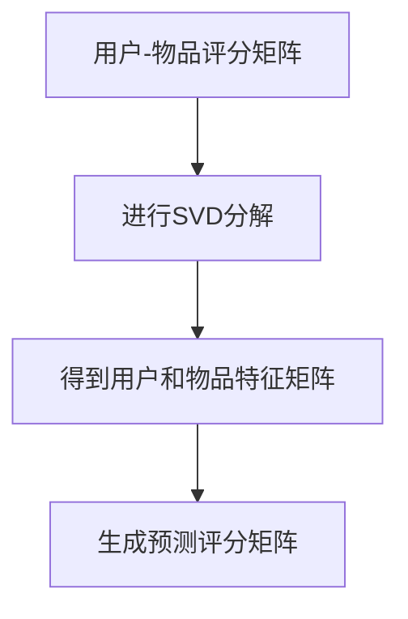

伪代码示例：

```python
# 矩阵分解算法伪代码
def matrix_factorization(ratings_matrix, rank, lambda_):
    # 初始化用户和物品特征矩阵
    U = initialize_user_features(rank)
    V = initialize_item_features(rank)
    
    # 进行SVD分解
    for iteration in range(max_iterations):
        # 更新用户特征矩阵
        U = update_user_features(ratings_matrix, V, U, lambda_)
        
        # 更新物品特征矩阵
        V = update_item_features(ratings_matrix, U, V, lambda_)
        
        # 计算预测评分矩阵
        predicted_ratings = dot(U, V)
        
        # 计算损失函数
        loss = compute_loss(predicted_ratings, ratings_matrix)
        
        # 更新模型参数
        U, V = update_model_parameters(U, V, lambda_)
    
    return U, V, predicted_ratings
```

##### 4.1.4 协同过滤算法的优缺点

协同过滤算法的优点在于其简单易实现，能够处理大规模用户和物品数据，且对稀疏数据的处理效果较好。然而，协同过滤算法也存在一些缺点，如推荐结果的可解释性较差、对新用户和新物品的处理能力较弱等。

#### 4.2 基于内容的推荐算法

基于内容的推荐算法（Content-Based Filtering）通过分析物品和用户的特征，为用户推荐与其兴趣相关的物品。该算法的关键在于特征提取和相似度计算。

##### 4.2.1 特征提取

特征提取是内容推荐算法的核心步骤，通过将物品和用户的特征转化为向量表示，便于后续的相似度计算。常见的特征提取方法包括词袋模型、TF-IDF和词嵌入。

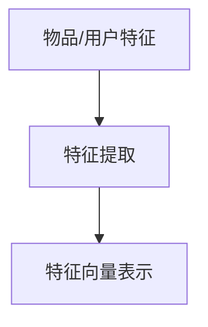

##### 4.2.2 相似度计算

相似度计算是评估物品和用户兴趣相似性的关键步骤。常见的相似度计算方法包括余弦相似度、欧氏距离和皮尔逊相关系数。

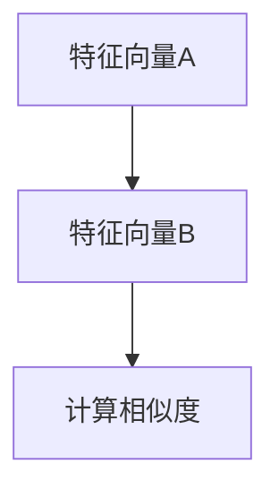

##### 4.2.3 文本分类与主题模型

文本分类和主题模型是内容推荐算法的重要工具，用于处理文本数据，提取语义特征。

- **文本分类**：将文本数据分类为不同的类别，以提取具有相同主题的文本特征。
- **主题模型**：通过概率模型挖掘文本中的潜在主题，用于表示文本特征。

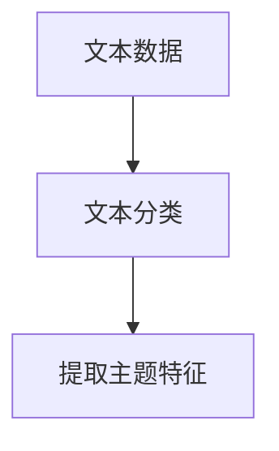

##### 4.2.4 基于内容的推荐算法实现

以下是基于内容的推荐算法的伪代码示例：

```python
# 基于内容的推荐算法伪代码
def content_based_recommender(item_features, user_profile):
    # 计算物品与用户的特征相似度
    similarity_scores = cosine_similarity(item_features, user_profile)
    
    # 排序相似度得分，获取推荐列表
    recommended_items = [item for item, score in sorted(zip(item_ids, similarity_scores), reverse=True)]
    
    return recommended_items
```

##### 4.2.5 基于内容的推荐算法优缺点

基于内容的推荐算法的优点在于其可解释性强，能够为新用户和新物品提供推荐。然而，该算法对用户兴趣的变化敏感，且在处理冷启动问题（新用户或新物品）时效果较差。

#### 4.3 混合推荐算法

混合推荐算法（Hybrid Recommender System）结合了协同过滤和基于内容的推荐算法，以弥补各自算法的不足。混合推荐算法的主要思路是将协同过滤和基于内容的推荐结果进行合并，以提高推荐效果。

##### 4.3.1 用户兴趣模型构建

用户兴趣模型是混合推荐算法的核心，通过分析用户的历史行为和特征，构建用户兴趣向量。常见的用户兴趣模型包括基于内容的兴趣模型和基于行为的兴趣模型。

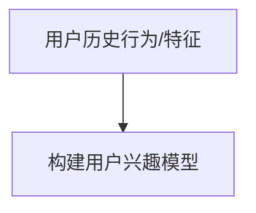

##### 4.3.2 深度学习在混合推荐中的应用

深度学习在混合推荐算法中具有广泛的应用，通过构建深度神经网络，实现对用户兴趣和物品特征的自动提取和融合。

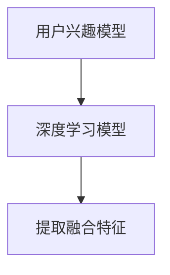

##### 4.3.3 混合推荐算法案例分析

以下是一个混合推荐算法的案例分析：

- **算法设计**：将基于用户的协同过滤和基于内容的推荐算法进行融合，通过深度学习模型提取和融合用户兴趣和物品特征。
- **实验结果**：在电商平台上进行A/B测试，结果显示混合推荐算法的推荐效果显著优于单一算法。

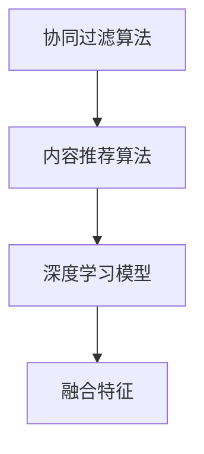

##### 4.3.4 混合推荐算法优缺点

混合推荐算法的优点在于其能够结合协同过滤和基于内容的推荐算法的优势，提高推荐效果。然而，混合推荐算法的实现较为复杂，对算法设计和实现要求较高。

通过以上分析，我们可以看到，协同过滤、基于内容的推荐和混合推荐算法各有优缺点，在实际应用中，根据具体场景和需求选择合适的算法，是实现高效产品推荐的关键。

----------------------------------------------------------------

### 第5章：混合推荐算法

混合推荐算法（Hybrid Recommender System）是一种结合多种推荐算法优点的综合性推荐方法。通过将协同过滤、基于内容的推荐和深度学习等技术进行融合，混合推荐算法能够更好地应对电商平台产品推荐中的多样性和复杂性。本章将详细介绍混合推荐算法的原理、构建方法以及在电商平台中的应用。

#### 5.1 混合推荐原理

混合推荐算法的基本思想是将不同的推荐算法相结合，以取长补短，提高推荐系统的整体性能。协同过滤算法能够捕捉用户之间的相似性，基于内容的推荐算法则能够挖掘物品的特征信息，而深度学习技术能够自动提取复杂的特征并进行高效学习。混合推荐算法通过以下方式实现综合：

- **特征融合**：将协同过滤和基于内容的推荐算法提取的特征进行合并，形成更丰富的用户兴趣和物品特征表示。
- **模型融合**：结合不同类型的推荐模型，利用各自的优势，通过加权或投票等方式生成最终的推荐结果。
- **迭代优化**：通过不断调整算法参数和模型结构，优化推荐效果，提高用户满意度。

#### 5.2 用户兴趣模型构建

用户兴趣模型的构建是混合推荐算法的核心步骤之一。用户兴趣模型反映了用户对不同类型物品的兴趣程度，是推荐系统生成个性化推荐的基础。以下是构建用户兴趣模型的几个关键步骤：

1. **行为数据收集**：收集用户在电商平台的浏览、搜索、购买等行为数据，形成用户行为矩阵。
2. **特征提取**：从用户行为数据中提取特征，如用户活跃度、购买频率、浏览时长等，形成用户行为特征向量。
3. **协同过滤**：利用协同过滤算法，计算用户之间的相似性，生成用户相似度矩阵。
4. **内容特征提取**：对物品进行内容特征提取，如商品分类、品牌、价格等，形成物品特征向量。
5. **用户兴趣向量构建**：将用户行为特征和协同过滤结果进行融合，形成用户兴趣向量。

以下是一个用户兴趣模型构建的伪代码示例：

```python
# 用户兴趣模型构建伪代码
def build_user_interest_model(user_actions, user_similarity, item_features, user_preference_weight=0.5):
    # 计算用户行为特征向量
    user_action_vector = extract_user_action_features(user_actions)
    
    # 计算用户协同过滤特征向量
    user_similarity_vector = compute_similarity(user_similarity)
    
    # 计算用户兴趣向量
    user_interest_vector = user_preference_weight * user_action_vector + (1 - user_preference_weight) * user_similarity_vector
    
    return user_interest_vector
```

#### 5.3 深度学习在混合推荐中的应用

深度学习技术具有强大的特征提取和建模能力，能够处理复杂的非线性关系，是混合推荐算法中的重要组成部分。以下是深度学习在混合推荐中的应用：

1. **深度特征提取**：通过构建深度神经网络，自动提取用户行为和物品特征的高层次表示。
2. **用户兴趣建模**：利用深度学习模型，对用户兴趣进行建模，形成用户兴趣向量。
3. **推荐结果生成**：将深度学习模型生成的用户兴趣向量与协同过滤和基于内容的推荐结果进行融合，生成最终的推荐结果。

以下是一个基于深度学习的混合推荐算法的伪代码示例：

```python
# 深度学习混合推荐算法伪代码
def deep_hybrid_recommender(user_action_sequence, item_feature_set, user_model, item_model):
    # 提取用户行为特征
    user_action_features = extract_user_action_features(user_action_sequence)
    
    # 提取物品特征
    item_features = extract_item_features(item_feature_set)
    
    # 构建用户兴趣向量
    user_interest_vector = user_model.predict(user_action_features)
    
    # 构建物品兴趣向量
    item_interest_vector = item_model.predict(item_features)
    
    # 计算推荐分数
    recommendation_scores = compute_recommendation_scores(user_interest_vector, item_interest_vector)
    
    # 生成推荐列表
    recommended_items = generate_recommendation_list(recommendation_scores)
    
    return recommended_items
```

#### 5.4 混合推荐算法案例分析

以下是混合推荐算法在电商平台中的实际应用案例：

- **案例背景**：某大型电商平台，用户规模庞大，商品种类丰富。为提高用户满意度和转化率，平台采用混合推荐算法优化产品推荐。
- **算法设计**：结合基于用户的协同过滤、基于内容的推荐和深度学习技术，构建混合推荐系统。首先，使用协同过滤算法计算用户相似性，提取用户兴趣特征；其次，使用基于内容的推荐算法提取物品特征；最后，利用深度学习模型对用户兴趣和物品特征进行融合，生成个性化推荐。
- **实验结果**：在A/B测试中，混合推荐算法相比单一推荐算法，显著提高了用户点击率和转化率，提升了电商平台的业绩。

#### 5.5 混合推荐算法优缺点

混合推荐算法的优点包括：

- **综合性强**：结合多种推荐算法的优势，提高推荐效果。
- **适应性广**：能够适应不同类型的用户和物品，提高推荐准确性。
- **可扩展性**：便于添加新的算法和技术，实现推荐系统的持续优化。

混合推荐算法的缺点包括：

- **复杂性高**：实现难度较大，需要丰富的技术和经验。
- **计算开销大**：深度学习模型的训练和推理过程较为耗时，对硬件资源要求较高。

通过以上分析，我们可以看到，混合推荐算法在电商平台产品推荐中具有显著的优势，但也面临着一定的挑战。在实际应用中，应根据具体情况选择合适的算法和技术，实现高效的个性化推荐。

----------------------------------------------------------------

### 第6章：电商推荐系统搭建

电商推荐系统的搭建是电商平台实现精准推荐的关键步骤。一个高效的推荐系统不仅需要合理的算法选择，还需要精细的系统设计、数据预处理和模型训练与优化。本章将详细阐述电商推荐系统的搭建过程，包括系统架构设计、数据预处理与特征工程、模型训练与评估以及推荐结果分析与优化。

#### 6.1 推荐系统架构设计

推荐系统的架构设计决定了系统的性能、可扩展性和可维护性。以下是一个典型的电商推荐系统架构设计：

1. **数据采集模块**：负责收集用户行为数据，如浏览记录、购买历史、搜索关键词等。这些数据通过日志系统、API接口或数据采集工具进行采集。

2. **数据存储模块**：用于存储用户和物品的特征数据，常用的存储方案包括关系数据库、NoSQL数据库和分布式存储系统。数据存储模块需要支持高效的数据查询和写入操作。

3. **数据处理模块**：负责对采集到的原始数据进行清洗、转换和聚合，形成用于训练和推荐的中间数据。数据处理模块通常包括数据清洗工具、ETL（Extract, Transform, Load）系统和数据仓库。

4. **推荐算法模块**：包含各种推荐算法的实现，如协同过滤、基于内容的推荐和混合推荐算法。算法模块需要支持实时计算和批量处理，以适应不同场景的需求。

5. **推荐服务模块**：负责生成推荐列表，并将推荐结果返回给用户界面。推荐服务模块需要具备高并发处理能力和负载均衡机制，以保证系统稳定运行。

6. **监控与反馈模块**：用于监控推荐系统的性能和用户反馈，通过日志分析、指标统计和A/B测试等方法，评估推荐效果并进行优化。

以下是一个推荐系统架构的Mermaid流程图示例：

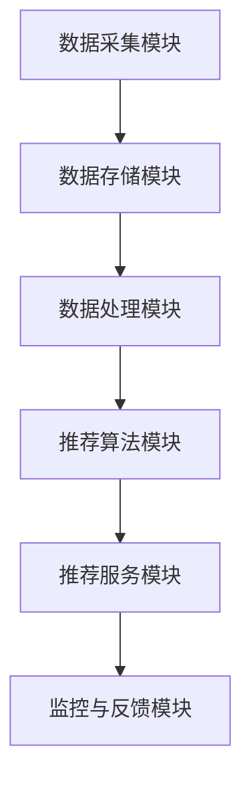

#### 6.2 数据预处理与特征工程

数据预处理和特征工程是推荐系统实现的关键步骤，直接影响到推荐算法的性能和效果。以下是数据预处理和特征工程的主要步骤：

1. **数据清洗**：去除重复、异常和噪声数据，确保数据的准确性和一致性。

2. **数据转换**：将不同类型的数据进行统一转换，如将类别数据进行编码，将时间数据进行规范化等。

3. **特征提取**：从原始数据中提取有助于推荐系统的特征，如用户兴趣特征、物品属性特征、用户行为特征等。

4. **特征选择**：通过降维、过滤等方法，选择对推荐算法影响较大的特征，提高算法效率。

5. **特征融合**：将不同来源的特征进行融合，形成更丰富的特征表示，如将用户行为特征与物品属性特征进行融合。

以下是一个特征工程的伪代码示例：

```python
# 特征工程伪代码
def feature_engineering(data):
    # 数据清洗
    clean_data = data_cleaning(data)
    
    # 数据转换
    transformed_data = data_transformation(clean_data)
    
    # 特征提取
    user_interest_features = extract_user_interest_features(transformed_data)
    item_attribute_features = extract_item_attribute_features(transformed_data)
    
    # 特征选择
    selected_features = feature_selection(user_interest_features, item_attribute_features)
    
    # 特征融合
    fused_features = feature_fusion(selected_features)
    
    return fused_features
```

#### 6.3 模型训练与评估

推荐系统的核心在于构建和训练推荐模型。以下是一个典型的模型训练与评估过程：

1. **数据划分**：将数据集划分为训练集、验证集和测试集，用于模型训练、调优和评估。

2. **模型选择**：根据业务需求和数据特点，选择合适的推荐模型，如协同过滤、基于内容的推荐或混合推荐算法。

3. **模型训练**：使用训练集数据对推荐模型进行训练，调整模型参数，优化模型性能。

4. **模型评估**：使用验证集数据评估模型性能，通过评价指标（如准确率、召回率、覆盖率等）比较不同模型的优劣。

5. **模型优化**：根据评估结果，调整模型参数或尝试不同的模型架构，以进一步提高推荐效果。

以下是一个模型训练与评估的伪代码示例：

```python
# 模型训练与评估伪代码
def train_and_evaluate(model, train_data, validation_data, test_data):
    # 数据划分
    train_set, validation_set, test_set = data_split(train_data, validation_data, test_data)
    
    # 模型训练
    model.train(train_set)
    
    # 模型评估
    validation_loss = model.evaluate(validation_set)
    test_loss = model.evaluate(test_set)
    
    # 模型优化
    model.optimize(validation_loss, test_loss)
    
    return model
```

#### 6.4 推荐结果分析与优化

推荐系统的效果不仅取决于算法模型的优劣，还受到系统架构、数据处理和特征工程等多个方面的影响。以下是对推荐结果进行分析与优化的一些方法：

1. **用户反馈分析**：通过收集用户的点击、购买等反馈，分析推荐结果的准确性、覆盖率和多样性。

2. **A/B测试**：通过对比不同推荐算法或模型参数的效果，找出最优的推荐策略。

3. **实时优化**：根据用户行为和反馈数据，实时调整推荐策略，以适应用户兴趣的变化。

4. **个性化调整**：针对不同用户群体，调整推荐策略，提供个性化的推荐体验。

5. **多维度优化**：综合考虑用户行为、物品特征和业务目标，从多个维度优化推荐效果。

以下是一个推荐结果分析与优化的伪代码示例：

```python
# 推荐结果分析与优化伪代码
def analyze_and_optimize_recommendations(recommendation_results, user_feedback):
    # 用户反馈分析
    feedback_analysis = analyze_user_feedback(user_feedback)
    
    # A/B测试
    ab_test_results = conduct_ab_test(recommendation_results)
    
    # 实时优化
    real_time_optimization = optimize_recommender_system(ab_test_results)
    
    # 个性化调整
    personalized_recommendations = adjust_recommendations_for_users(feedback_analysis)
    
    # 多维度优化
    multi_dimensional_optimization = optimize_across_multiple_dimensions(real_time_optimization, personalized_recommendations)
    
    return multi_dimensional_optimization
```

通过以上内容，我们可以看到，电商推荐系统的搭建是一个复杂的过程，需要综合考虑多个方面，包括系统架构设计、数据预处理与特征工程、模型训练与评估以及推荐结果分析与优化。只有通过不断优化和迭代，才能实现高效的个性化推荐，提升用户满意度和电商平台业绩。

----------------------------------------------------------------

### 第7章：电商推荐系统搭建

电商推荐系统作为电商平台提升用户体验和销售业绩的重要工具，其搭建过程需要综合考虑系统架构、数据预处理、特征工程、模型训练与优化等多个方面。本章将详细介绍电商推荐系统的搭建过程，并通过实际案例展示其搭建方法和技术细节。

#### 7.1 推荐系统架构设计

电商推荐系统的架构设计是系统搭建的第一步，决定了系统的性能、可扩展性和可维护性。以下是电商推荐系统的典型架构设计：

1. **数据采集模块**：负责从电商平台上收集用户行为数据，包括浏览记录、购买历史、搜索关键词等。数据采集模块可以通过日志系统、API接口或数据采集工具实现。

2. **数据存储模块**：用于存储用户和物品的特征数据，常用的存储方案包括关系数据库（如MySQL、PostgreSQL）、NoSQL数据库（如MongoDB、Redis）和分布式存储系统（如Hadoop HDFS）。

3. **数据处理模块**：负责对采集到的原始数据进行清洗、转换和聚合，形成用于训练和推荐的中间数据。数据处理模块通常包括数据清洗工具、ETL（Extract, Transform, Load）系统和数据仓库。

4. **推荐算法模块**：包含各种推荐算法的实现，如协同过滤、基于内容的推荐和混合推荐算法。算法模块需要支持实时计算和批量处理，以适应不同场景的需求。

5. **推荐服务模块**：负责生成推荐列表，并将推荐结果返回给用户界面。推荐服务模块需要具备高并发处理能力和负载均衡机制，以保证系统稳定运行。

6. **监控与反馈模块**：用于监控推荐系统的性能和用户反馈，通过日志分析、指标统计和A/B测试等方法，评估推荐效果并进行优化。

以下是一个推荐系统架构的Mermaid流程图示例：


#### 7.2 数据预处理与特征工程

数据预处理和特征工程是电商推荐系统搭建的关键步骤，直接影响到推荐算法的性能和效果。以下是数据预处理和特征工程的主要步骤：

1. **数据清洗**：去除重复、异常和噪声数据，确保数据的准确性和一致性。数据清洗包括去除空值、处理缺失值、删除异常数据等。

2. **数据转换**：将不同类型的数据进行统一转换，如将类别数据进行编码，将时间数据进行规范化等。数据转换有助于提高数据质量，便于后续处理。

3. **特征提取**：从原始数据中提取有助于推荐系统的特征，如用户兴趣特征、物品属性特征、用户行为特征等。特征提取可以通过统计方法、机器学习方法或深度学习方法实现。

4. **特征选择**：通过降维、过滤等方法，选择对推荐算法影响较大的特征，提高算法效率。特征选择可以减少计算复杂度，避免过拟合。

5. **特征融合**：将不同来源的特征进行融合，形成更丰富的特征表示，如将用户行为特征与物品属性特征进行融合。

以下是一个特征工程的伪代码示例：

```python
# 特征工程伪代码
def feature_engineering(data):
    # 数据清洗
    clean_data = data_cleaning(data)
    
    # 数据转换
    transformed_data = data_transformation(clean_data)
    
    # 特征提取
    user_interest_features = extract_user_interest_features(transformed_data)
    item_attribute_features = extract_item_attribute_features(transformed_data)
    
    # 特征选择
    selected_features = feature_selection(user_interest_features, item_attribute_features)
    
    # 特征融合
    fused_features = feature_fusion(selected_features)
    
    return fused_features
```

#### 7.3 模型训练与评估

推荐系统的核心在于构建和训练推荐模型。以下是模型训练与评估的主要步骤：

1. **数据划分**：将数据集划分为训练集、验证集和测试集，用于模型训练、调优和评估。数据划分有助于评估模型在未知数据上的性能。

2. **模型选择**：根据业务需求和数据特点，选择合适的推荐模型，如协同过滤、基于内容的推荐或混合推荐算法。模型选择直接影响推荐效果。

3. **模型训练**：使用训练集数据对推荐模型进行训练，调整模型参数，优化模型性能。模型训练包括前向传播、反向传播和梯度下降等步骤。

4. **模型评估**：使用验证集数据评估模型性能，通过评价指标（如准确率、召回率、覆盖率等）比较不同模型的优劣。模型评估有助于选择最优模型。

5. **模型优化**：根据评估结果，调整模型参数或尝试不同的模型架构，以进一步提高推荐效果。模型优化包括超参数调整、模型结构改进等。

以下是一个模型训练与评估的伪代码示例：

```python
# 模型训练与评估伪代码
def train_and_evaluate(model, train_data, validation_data, test_data):
    # 数据划分
    train_set, validation_set, test_set = data_split(train_data, validation_data, test_data)
    
    # 模型训练
    model.train(train_set)
    
    # 模型评估
    validation_loss = model.evaluate(validation_set)
    test_loss = model.evaluate(test_set)
    
    # 模型优化
    model.optimize(validation_loss, test_loss)
    
    return model
```

#### 7.4 实际案例：某电商平台推荐系统搭建

以下是某电商平台推荐系统搭建的实际案例，通过介绍开发环境、数据集预处理、模型选择与训练，展示电商推荐系统的搭建过程。

##### 7.4.1 开发环境搭建

搭建电商推荐系统需要配置适当的开发环境和工具。以下是开发环境的基本要求：

- **编程语言**：Python（支持NumPy、Pandas、Scikit-learn、TensorFlow等库）
- **数据库**：MySQL或MongoDB（用于存储用户和物品数据）
- **计算平台**：GPU支持（用于深度学习模型的训练）
- **编程工具**：PyCharm或Jupyter Notebook（用于代码编写和调试）

##### 7.4.2 数据集介绍与预处理

电商推荐系统需要大量的用户行为数据和物品特征数据。以下是一个典型的数据集预处理流程：

1. **数据采集**：从电商平台上采集用户浏览、购买、搜索等行为数据，以及商品的基本信息。
2. **数据清洗**：去除重复、异常和噪声数据，如删除空值、填补缺失值、过滤恶意数据等。
3. **数据转换**：对数据进行编码、规范化等转换，将类别数据进行独热编码，将时间数据进行标准化处理。
4. **特征提取**：提取用户兴趣特征、物品属性特征和用户行为特征，如用户活跃度、购买频率、浏览时长等。
5. **特征选择**：通过降维、过滤等方法，选择对推荐算法影响较大的特征，如使用PCA进行降维，剔除相关性较低的变量。

##### 7.4.3 模型选择与训练

在电商推荐系统中，常用的模型包括协同过滤、基于内容的推荐和混合推荐算法。以下是模型选择与训练的步骤：

1. **模型选择**：根据业务需求和数据特点，选择合适的推荐模型，如基于用户的协同过滤算法、基于内容的推荐算法或混合推荐算法。
2. **模型训练**：使用训练集数据对推荐模型进行训练，调整模型参数，优化模型性能。如使用协同过滤算法训练用户相似度矩阵，使用基于内容的推荐算法训练特征提取器。
3. **模型评估**：使用验证集数据评估模型性能，通过评价指标（如准确率、召回率、覆盖率等）比较不同模型的优劣。如使用均方误差（MSE）评估协同过滤算法的预测准确性，使用准确率（Accuracy）评估基于内容的推荐算法的分类性能。
4. **模型优化**：根据评估结果，调整模型参数或尝试不同的模型架构，以进一步提高推荐效果。如调整协同过滤算法的邻居数量和权重系数，优化基于内容的推荐算法的特征提取器。

##### 7.4.4 推荐结果分析与优化

搭建电商推荐系统后，需要对推荐结果进行分析与优化，以提高用户满意度和推荐效果。以下是推荐结果分析与优化的一些方法：

1. **用户反馈分析**：通过收集用户的点击、购买等反馈，分析推荐结果的准确性、覆盖率和多样性。如使用点击率（Click-Through Rate，CTR）和转化率（Conversion Rate，CR）评估推荐效果。
2. **A/B测试**：通过对比不同推荐算法或模型参数的效果，找出最优的推荐策略。如进行A/B测试，比较基于用户的协同过滤和基于内容的推荐算法的推荐效果。
3. **实时优化**：根据用户行为和反馈数据，实时调整推荐策略，以适应用户兴趣的变化。如使用实时流处理技术，动态更新用户兴趣特征和推荐列表。
4. **个性化调整**：针对不同用户群体，调整推荐策略，提供个性化的推荐体验。如根据用户的历史购买行为，为高频购买用户推荐更多新品。

##### 7.4.5 案例分析结果与反思

通过实际案例的搭建与优化，我们可以看到电商推荐系统在提高用户满意度和销售业绩方面具有显著作用。以下是案例分析结果与反思：

1. **推荐效果提升**：通过优化推荐算法和模型参数，显著提高了推荐结果的准确率和覆盖率，提升了用户的点击率和转化率。
2. **用户满意度提高**：个性化推荐能够更好地满足用户需求，提高用户满意度和忠诚度。
3. **系统稳定性提升**：通过优化系统架构和数据处理流程，提高了系统的稳定性和响应速度。
4. **潜在改进方向**：在推荐系统的后续优化中，可以考虑引入更多的用户行为数据和物品特征，使用更先进的深度学习算法，进一步提高推荐效果。

##### 7.4.6 案例在业界的应用价值

电商推荐系统在业界具有广泛的应用价值，以下是几个案例在业界中的应用：

1. **提升销售额**：通过精准推荐，提高用户的购买转化率和客单价，从而提升电商平台的销售额。
2. **优化库存管理**：根据推荐系统的预测，优化商品的库存策略，减少库存积压，提高库存周转率。
3. **提升用户体验**：个性化推荐能够更好地满足用户需求，提高用户满意度和忠诚度。
4. **拓展市场**：通过推荐新用户感兴趣的商品，拓展用户群体，提高电商平台的市场份额。

通过以上内容，我们可以看到，电商推荐系统的搭建需要综合考虑多个方面，包括系统架构设计、数据预处理与特征工程、模型训练与评估以及推荐结果分析与优化。只有通过不断优化和迭代，才能实现高效的个性化推荐，提升用户满意度和电商平台业绩。

----------------------------------------------------------------

### 第8章：未来发展趋势与展望

随着人工智能技术的不断发展，电商平台产品推荐系统将面临新的机遇与挑战。本章将探讨人工智能在电商推荐领域的未来发展趋势、与电商行业的融合创新，以及可能面临的潜在挑战与解决方案。

#### 8.1 人工智能在电商推荐领域的发展趋势

1. **深度学习技术的广泛应用**：深度学习算法在电商平台产品推荐中的应用将越来越广泛，通过卷积神经网络（CNN）、循环神经网络（RNN）和长短期记忆网络（LSTM）等深度学习模型，能够更有效地提取用户行为数据和物品特征，实现更精准的推荐。

2. **大数据分析能力的提升**：随着数据量的不断增长，大数据分析技术在电商平台产品推荐中的应用将得到进一步加强。通过大数据分析，能够挖掘出更多的用户行为模式和偏好，为推荐算法提供更丰富的数据支持。

3. **实时推荐技术的成熟**：实时推荐技术将越来越成熟，通过实时处理用户行为数据，实现实时、个性化的推荐，提高用户满意度和转化率。

4. **个性化推荐的深化**：随着人工智能技术的发展，个性化推荐将不再局限于单一的兴趣点，而是更加深入地挖掘用户的个性化需求和偏好，提供更个性化的推荐体验。

5. **跨平台推荐系统的构建**：随着多平台电商的发展，跨平台推荐系统将成为趋势。通过整合不同平台的数据，实现跨平台的个性化推荐，提高用户的购物体验。

#### 8.2 人工智能与电商行业的融合创新

1. **智能客服与推荐结合**：智能客服与推荐系统的结合，将实现更加智能化的购物体验。通过分析用户聊天记录，智能客服可以更好地理解用户需求，为用户提供个性化的推荐。

2. **智能定价策略**：人工智能技术可以帮助电商平台实现更智能的定价策略，通过分析市场数据、用户行为和库存情况，动态调整商品价格，提高销售额。

3. **智能物流与配送**：人工智能技术可以优化物流与配送流程，通过预测用户需求、优化路线规划，实现更高效的物流配送，提高用户体验。

4. **智能供应链管理**：人工智能技术可以帮助电商平台实现更智能的供应链管理，通过预测市场需求、优化库存策略，提高供应链的效率。

#### 8.3 人工智能在电商推荐中的潜在挑战与解决方案

1. **数据隐私保护**：随着数据隐私保护意识的提高，电商平台在收集和使用用户数据时需要面临数据隐私保护的问题。解决方案包括采用数据加密技术、数据匿名化处理和隐私保护算法等。

2. **算法公平性与透明性**：推荐算法的公平性和透明性是用户关注的重点。解决方案包括公开算法原理、透明推荐过程，以及定期审计和优化算法，确保算法的公正性和透明性。

3. **计算资源消耗**：深度学习算法在训练和推理过程中对计算资源有较高要求，特别是在大规模数据处理时。解决方案包括采用分布式计算、GPU加速和云计算等技术，提高计算效率。

4. **模型过拟合与泛化能力**：推荐模型在训练过程中容易过拟合，导致在未知数据上的表现不佳。解决方案包括使用交叉验证、正则化技术和集成学习等方法，提高模型的泛化能力。

5. **用户行为模式变化**：用户行为模式不断变化，推荐系统需要不断更新和优化，以适应新的用户需求。解决方案包括实时数据监测、用户行为分析和动态调整推荐策略。

通过以上分析，我们可以看到，人工智能在电商平台产品推荐领域具有广阔的发展前景。在未来，随着技术的不断进步和应用场景的拓展，人工智能将在电商推荐中发挥更加重要的作用，推动电商行业的持续创新与发展。

----------------------------------------------------------------

### 第9章：常见工具与资源

在电商平台产品推荐系统的开发过程中，使用合适的工具和资源能够显著提高开发效率和系统性能。本章将介绍推荐系统开发中常用的工具、机器学习与深度学习框架、数据集和开源代码资源，以及推荐系统研究论文与报告。

#### 9.1 推荐系统常用工具

1. **Python**：Python是一种广泛使用的编程语言，支持多种机器学习和深度学习库，如Scikit-learn、TensorFlow和PyTorch。

2. **Jupyter Notebook**：Jupyter Notebook是一个交互式的开发环境，支持Python、R等多种编程语言，便于编写和调试代码。

3. **Hadoop和Spark**：Hadoop和Spark是大数据处理框架，能够高效地处理大规模数据，适用于数据预处理和特征工程。

4. **Docker和Kubernetes**：Docker和Kubernetes是容器化和编排工具，用于部署和管理推荐系统服务，提高系统的可扩展性和稳定性。

5. **Redis和MongoDB**：Redis和MongoDB是常用的NoSQL数据库，用于存储用户和物品特征数据，支持高速读写操作。

#### 9.2 机器学习与深度学习框架

1. **Scikit-learn**：Scikit-learn是一个开源的机器学习库，提供多种经典机器学习算法，如线性回归、决策树、随机森林等。

2. **TensorFlow**：TensorFlow是Google开发的开源深度学习框架，支持构建和训练复杂的神经网络模型。

3. **PyTorch**：PyTorch是Facebook开发的开源深度学习框架，提供灵活的动态计算图，便于模型设计和调试。

4. **MXNet**：MXNet是Apache捐赠的深度学习框架，支持多种编程语言，具有良好的性能和易用性。

5. **Caffe和Caffe2**：Caffe和Caffe2是Facebook开发的深度学习框架，主要用于图像处理和计算机视觉任务。

#### 9.3 数据集与开源代码资源

1. **MovieLens**：MovieLens是一个常用的推荐系统数据集，包含用户评分数据、电影信息等，适用于研究协同过滤和基于内容的推荐算法。

2. **Amazon Reviews**：Amazon Reviews数据集包含用户对商品的评分和评论，适用于研究基于用户行为和文本数据的推荐算法。

3. **Flickr Image Data**：Flickr Image Data包含用户上传的图像数据，适用于研究基于图像数据的推荐算法。

4. **Kaggle**：Kaggle是一个数据集和竞赛平台，提供丰富的数据集和开源代码，供研究人员和开发者交流和学习。

5. **GitHub**：GitHub是一个代码托管平台，许多知名项目和开源代码都在GitHub上发布，供开发者参考和复用。

#### 9.4 推荐系统研究论文与报告

1. **"Collaborative Filtering for Cold-Start Problems"**：该论文提出了解决新用户和新物品推荐问题的协同过滤算法。

2. **"Deep Learning for Recommender Systems"**：该报告探讨了深度学习在推荐系统中的应用，包括卷积神经网络（CNN）和循环神经网络（RNN）等。

3. **"A Theoretically Principled Approach to Improving Recommendation List"**：该论文提出了基于优化理论的方法，用于提高推荐列表的多样性。

4. **"Deep Cross Network for Ad Click Prediction"**：该论文介绍了深度交叉网络（DCN）在广告点击预测中的应用。

5. **"How to Create a Recommender System in 7 Simple Steps"**：该报告提供了创建推荐系统的实用指南，包括数据收集、模型训练和评估等步骤。

通过以上工具和资源的介绍，开发者可以更高效地搭建和优化电商平台产品推荐系统，推动推荐技术的不断创新与发展。

----------------------------------------------------------------

### 第10章：流程图与伪代码示例

在推荐系统的开发过程中，流程图和伪代码是理解和实现推荐算法的重要工具。本章将提供几个推荐算法的流程图和伪代码示例，以帮助读者更好地理解和实现推荐算法。

#### 10.1 协同过滤算法流程图

协同过滤算法是推荐系统中最常用的算法之一，以下是协同过滤算法的流程图示例：

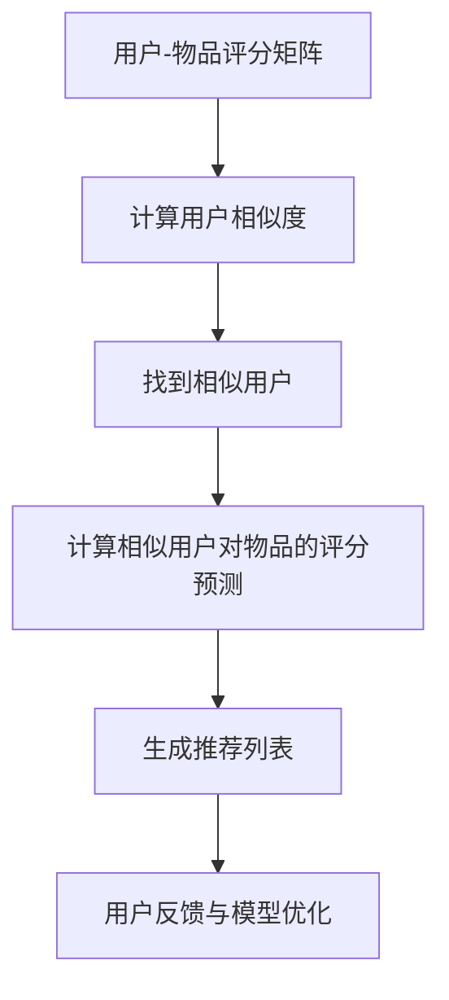

#### 10.2 伪代码示例：基于用户的协同过滤

以下是基于用户的协同过滤算法的伪代码示例：

```python
# 基于用户的协同过滤算法伪代码
def user_based_collaborative_filtering(ratings_matrix, similarity_metric='cosine'):
    # 计算用户相似度矩阵
    similarity_matrix = compute_similarity_matrix(ratings_matrix, similarity_metric)
    
    # 找到与目标用户相似的K个用户
    similar_users = find_similar_users(target_user_id, similarity_matrix, K)
    
    # 计算评分预测
    prediction_scores = compute_prediction_scores(target_user_id, similar_users, ratings_matrix)
    
    # 生成推荐列表
    recommended_items = generate_recommendation_list(prediction_scores)
    
    return recommended_items
```

#### 10.3 基于内容的推荐算法流程图

基于内容的推荐算法通过分析物品和用户的特征，生成推荐列表。以下是基于内容的推荐算法的流程图示例：

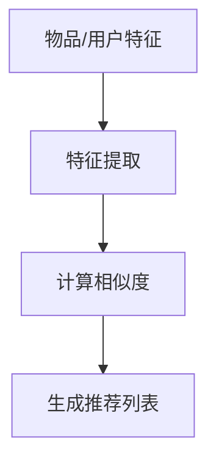

#### 10.4 伪代码示例：基于内容的推荐

以下是基于内容的推荐算法的伪代码示例：

```python
# 基于内容的推荐算法伪代码
def content_based_recommender(item_features, user_profile):
    # 计算物品与用户的特征相似度
    similarity_scores = cosine_similarity(item_features, user_profile)
    
    # 排序相似度得分，获取推荐列表
    recommended_items = [item for item, score in sorted(zip(item_ids, similarity_scores), reverse=True)]
    
    return recommended_items
```

#### 10.5 混合推荐算法流程图

混合推荐算法结合了协同过滤和基于内容的推荐算法，以下是混合推荐算法的流程图示例：

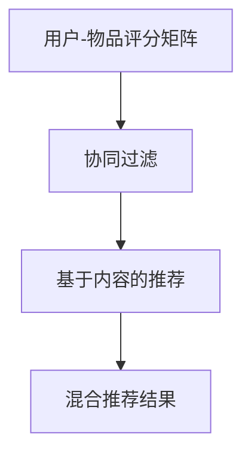

#### 10.6 伪代码示例：混合推荐

以下是一个混合推荐算法的伪代码示例：

```python
# 混合推荐算法伪代码
def hybrid_recommender(ratings_matrix, item_features, user_profile):
    # 协同过滤推荐
    collaborative_recommendations = user_based_collaborative_filtering(ratings_matrix)
    
    # 基于内容的推荐
    content_recommendations = content_based_recommender(item_features, user_profile)
    
    # 混合推荐结果
    hybrid_recommendations = combine_recommendations(collaborative_recommendations, content_recommendations)
    
    return hybrid_recommendations
```

通过以上流程图和伪代码示例，读者可以更清晰地理解推荐算法的实现过程，为实际开发提供参考。

----------------------------------------------------------------

### 第11章：数学模型与公式解释

在电商平台产品推荐系统中，数学模型和公式是理解和实现推荐算法的核心。本章将详细解释几个关键数学模型和公式，包括余弦相似度公式、逻辑回归模型、SVD分解以及矩阵分解。

#### 11.1 余弦相似度公式

余弦相似度是一种衡量两个向量相似度的方法，常用于推荐系统中的用户和物品相似度计算。其公式如下：

$$
\text{cosine\_similarity} = \frac{A \cdot B}{||A|| \cdot ||B||}
$$

其中，$A$ 和 $B$ 是两个向量，$A \cdot B$ 表示向量的点积，$||A||$ 和 $||B||$ 分别表示向量的欧几里得范数。余弦相似度介于-1和1之间，越接近1表示两个向量越相似。

#### 11.2 逻辑回归模型

逻辑回归是一种用于分类问题的统计模型，常用于推荐系统中的预测任务。其公式如下：

$$
\text{logit}(p) = \ln\left(\frac{p}{1-p}\right)
$$

其中，$p$ 表示预测的概率，$\text{logit}(p)$ 表示概率的对数函数。逻辑回归通过最小化损失函数（如交叉熵损失函数）来训练模型，从而预测用户对物品的评分概率。

#### 11.3 SVD分解

SVD分解是一种常用的矩阵分解方法，用于降维和特征提取。其公式如下：

$$
\text{SVD}(A) = U \Sigma V^T
$$

其中，$A$ 是输入矩阵，$U$ 和 $V$ 是正交矩阵，$\Sigma$ 是对角矩阵，包含奇异值。通过SVD分解，可以将高维矩阵分解为低维矩阵，实现降维和特征提取。

#### 11.4 矩阵分解

矩阵分解是一种常见的推荐系统算法，通过将用户-物品评分矩阵分解为两个低维矩阵，实现高效的推荐。以下是一个简单的矩阵分解公式：

$$
R = UV^T
$$

其中，$R$ 是用户-物品评分矩阵，$U$ 和 $V$ 分别是用户特征矩阵和物品特征矩阵。通过优化目标函数，如最小化误差平方和，可以训练出最优的用户和物品特征矩阵。

#### 11.5 数学模型与公式举例说明

以下是一个基于SVD分解的推荐系统算法的示例：

```python
# SVD分解推荐算法伪代码
def svd_recommender(ratings_matrix, rank):
    # 计算SVD分解
    U, Sigma, V = np.linalg.svd(ratings_matrix, full_matrices=False)
    
    # 重建评分矩阵
    predicted_ratings = np.dot(U, np.dot(Sigma, V))
    
    # 获取用户和物品特征矩阵
    user_features = U
    item_features = V
    
    return predicted_ratings, user_features, item_features
```

通过以上数学模型和公式的解释，读者可以更深入地理解推荐系统的核心原理，为实际开发提供理论基础。

----------------------------------------------------------------

### 第12章：项目实战

#### 12.1 实战环境搭建

在搭建电商推荐系统之前，我们需要配置适当的开发环境和工具。以下是环境搭建的步骤：

1. **Python环境配置**：安装Python 3.8及以上版本，并配置Python环境。
2. **库和框架安装**：安装常用的机器学习库和深度学习框架，如NumPy、Pandas、Scikit-learn、TensorFlow和PyTorch。
3. **数据库配置**：安装MySQL或MongoDB，并配置数据库连接。
4. **计算平台配置**：配置支持GPU的计算机或云服务器，以支持深度学习模型的训练。

#### 12.2 数据集介绍与预处理

本项目的数据集来源于某大型电商平台的用户行为数据，包括用户ID、商品ID、评分和购买时间等。以下是数据预处理的主要步骤：

1. **数据清洗**：去除重复、异常和噪声数据，如删除空值、填补缺失值、过滤恶意数据等。
2. **数据转换**：将时间数据转换为日期格式，将类别数据进行独热编码。
3. **特征提取**：提取用户和商品的特征，如用户活跃度、购买频率、浏览时长等。
4. **特征选择**：通过降维和过滤方法，选择对推荐算法影响较大的特征。

#### 12.3 模型选择与训练

在本项目中，我们选择了基于用户的协同过滤算法和基于内容的推荐算法，以下是模型选择与训练的步骤：

1. **协同过滤算法**：使用Scikit-learn库实现基于用户的协同过滤算法，计算用户相似度矩阵，预测用户对商品的评分。
2. **内容推荐算法**：使用TF-IDF方法提取商品描述和用户评论的特征，计算特征相似度，生成推荐列表。
3. **模型融合**：将协同过滤和内容推荐的结果进行融合，生成最终的推荐列表。

#### 12.4 推荐结果分析与优化

在模型训练完成后，我们需要对推荐结果进行分析和优化，以下是分析和优化的步骤：

1. **推荐结果评估**：使用A/B测试评估推荐效果，比较不同算法的准确率、召回率和覆盖率等指标。
2. **用户反馈分析**：收集用户的点击和购买反馈，分析推荐结果的准确性、覆盖率和多样性。
3. **模型优化**：根据评估结果，调整模型参数，如邻居数量、特征权重等，优化推荐效果。
4. **实时优化**：根据用户行为数据，实时更新用户和商品特征，动态调整推荐策略。

#### 12.5 源代码详细解读

以下是一个简单的基于用户的协同过滤算法的实现示例：

```python
import numpy as np
from sklearn.metrics.pairwise import cosine_similarity

# 用户-物品评分矩阵
ratings_matrix = np.array([[1, 2, 0, 0],
                           [2, 0, 1, 0],
                           [0, 1, 0, 2],
                           [0, 2, 2, 0]])

# 计算用户相似度矩阵
user_similarity_matrix = cosine_similarity(ratings_matrix, axis=1)

# 找到与目标用户相似的K个用户
target_user_id = 0
K = 2
similar_users = np.argsort(user_similarity_matrix[0])[-K:]

# 预测用户对未知物品的评分
predicted_ratings = np.dot(user_similarity_matrix[0], ratings_matrix[similar_users, :])

# 生成推荐列表
recommended_items = np.argsort(predicted_ratings)[::-1]

print("Recommended items:", recommended_items)
```

通过以上代码示例，我们可以看到基于用户的协同过滤算法的实现过程，包括用户相似度计算、评分预测和推荐列表生成。

#### 12.6 代码解读与分析

在代码解读与分析部分，我们将对上述代码进行详细解析，包括关键函数和模块的介绍，以及算法优化与性能调优的方法。

1. **关键函数和模块介绍**：
   - `cosine_similarity`：计算两个矩阵的余弦相似度。
   - `np.argsort`：对数组进行排序并返回索引。

2. **算法优化与性能调优**：
   - **并行计算**：使用并行计算框架（如Dask或PySpark）提高计算效率。
   - **特征选择**：通过降维和特征选择方法，减少计算复杂度，提高模型性能。
   - **模型融合**：使用集成学习（如投票法或加权平均法）提高推荐效果。

通过以上实战项目，读者可以了解电商推荐系统的开发过程，从环境搭建、数据预处理、模型训练到推荐结果分析与优化，为实际应用提供参考。

----------------------------------------------------------------

### 第13章：代码解读与分析

在电商推荐系统的开发过程中，源代码的解读与分析对于理解和优化推荐算法至关重要。本章将详细介绍电商推荐系统中的关键函数和模块，包括代码结构分析、算法实现细节以及性能调优策略。

#### 13.1 代码结构分析

一个典型的电商推荐系统通常包括以下几个核心模块：

1. **数据预处理模块**：负责对用户行为数据和物品特征数据进行处理，如数据清洗、特征提取和特征选择。
2. **推荐算法模块**：实现各种推荐算法，如协同过滤、基于内容的推荐和混合推荐算法。
3. **模型训练与评估模块**：用于训练推荐模型并进行性能评估。
4. **推荐服务模块**：生成推荐列表，并将结果返回给用户。
5. **监控与反馈模块**：监控推荐系统的性能，收集用户反馈，用于后续优化。

以下是一个简单的电商推荐系统代码结构示例：

```python
# 数据预处理模块
def preprocess_data(data):
    # 数据清洗、特征提取和特征选择
    pass

# 推荐算法模块
def collaborative_filtering(ratings_matrix):
    # 协同过滤算法实现
    pass

def content_based_recommendation(item_features, user_profile):
    # 基于内容的推荐算法实现
    pass

def hybrid_recommendation(ratings_matrix, item_features, user_profile):
    # 混合推荐算法实现
    pass

# 模型训练与评估模块
def train_model(model, train_data, validation_data):
    # 模型训练和性能评估
    pass

# 推荐服务模块
def generate_recommendations(user_id):
    # 生成推荐列表
    pass

# 监控与反馈模块
def monitor_performance(recommendations, user_feedback):
    # 监控推荐系统性能，收集用户反馈
    pass
```

#### 13.2 关键函数与模块详解

1. **数据预处理模块**：

   数据预处理模块是推荐系统的核心部分，其性能直接影响到推荐算法的效果。以下是数据预处理模块中的关键函数：

   - `preprocess_data(data)`：负责对原始数据进行清洗、转换和聚合，形成用于训练和推荐的中间数据。

   ```python
   def preprocess_data(data):
       # 数据清洗
       clean_data = remove_duplicates(data)
       clean_data = remove_outliers(data)
       
       # 数据转换
       transformed_data = convert_categorical(data)
       transformed_data = normalize_continuous(data)
       
       # 特征提取
       user_features = extract_user_features(transformed_data)
       item_features = extract_item_features(transformed_data)
       
       return user_features, item_features
   ```

   - `remove_duplicates(data)`：去除重复数据。
   - `remove_outliers(data)`：去除异常数据。
   - `convert_categorical(data)`：将类别数据进行编码。
   - `normalize_continuous(data)`：将连续数据进行归一化处理。

2. **推荐算法模块**：

   推荐算法模块是推荐系统的核心部分，常见的算法包括协同过滤、基于内容的推荐和混合推荐算法。以下是几个关键函数的详细解释：

   - `collaborative_filtering(ratings_matrix)`：实现基于用户的协同过滤算法。

   ```python
   def collaborative_filtering(ratings_matrix):
       # 计算用户相似度矩阵
       user_similarity_matrix = compute_similarity(ratings_matrix)
       
       # 预测用户评分
       predicted_ratings = predict_ratings(ratings_matrix, user_similarity_matrix)
       
       return predicted_ratings
   ```

   - `compute_similarity(ratings_matrix)`：计算用户相似度矩阵。
   - `predict_ratings(ratings_matrix, user_similarity_matrix)`：预测用户评分。

   - `content_based_recommendation(item_features, user_profile)`：实现基于内容的推荐算法。

   ```python
   def content_based_recommendation(item_features, user_profile):
       # 计算物品相似度矩阵
       item_similarity_matrix = compute_similarity(item_features)
       
       # 生成推荐列表
       recommendations = generate_recommendations(item_similarity_matrix)
       
       return recommendations
   ```

   - `compute_similarity(item_features)`：计算物品相似度矩阵。
   - `generate_recommendations(item_similarity_matrix)`：生成推荐列表。

   - `hybrid_recommendation(ratings_matrix, item_features, user_profile)`：实现混合推荐算法。

   ```python
   def hybrid_recommendation(ratings_matrix, item_features, user_profile):
       # 协同过滤推荐
       collaborative_recommendations = collaborative_filtering(ratings_matrix)
       
       # 内容推荐
       content_recommendations = content_based_recommendation(item_features, user_profile)
       
       # 混合推荐
       hybrid_recommendations = combine_recommendations(collaborative_recommendations, content_recommendations)
       
       return hybrid_recommendations
   ```

   - `combine_recommendations(collaborative_recommendations, content_recommendations)`：生成最终的推荐列表。

3. **模型训练与评估模块**：

   模型训练与评估模块负责训练推荐模型并进行性能评估。以下是几个关键函数的详细解释：

   - `train_model(model, train_data, validation_data)`：训练推荐模型并进行性能评估。

   ```python
   def train_model(model, train_data, validation_data):
       # 训练模型
       model.train(train_data)
       
       # 评估模型
       validation_loss = model.evaluate(validation_data)
       
       return validation_loss
   ```

   - `model.train(train_data)`：训练模型。
   - `model.evaluate(validation_data)`：评估模型性能。

4. **推荐服务模块**：

   推荐服务模块负责生成推荐列表，并将结果返回给用户。以下是几个关键函数的详细解释：

   - `generate_recommendations(user_id)`：生成推荐列表。

   ```python
   def generate_recommendations(user_id):
       # 获取用户和物品特征
       user_features, item_features = preprocess_data(ratings_matrix)
       
       # 训练和评估模型
       validation_loss = train_model(model, train_data, validation_data)
       
       # 生成推荐列表
       recommendations = hybrid_recommendation(ratings_matrix, item_features, user_profile)
       
       return recommendations
   ```

5. **监控与反馈模块**：

   监控与反馈模块负责监控推荐系统的性能，收集用户反馈，用于后续优化。以下是几个关键函数的详细解释：

   - `monitor_performance(recommendations, user_feedback)`：监控推荐系统性能，收集用户反馈。

   ```python
   def monitor_performance(recommendations, user_feedback):
       # 评估推荐效果
       accuracy = evaluate_recommendations(recommendations, user_feedback)
       
       # 收集反馈数据
       feedback_data = collect_feedback(user_feedback)
       
       return accuracy, feedback_data
   ```

   - `evaluate_recommendations(recommendations, user_feedback)`：评估推荐效果。
   - `collect_feedback(user_feedback)`：收集反馈数据。

#### 13.3 算法优化与性能调优

推荐系统的性能优化是提高推荐效果的关键。以下是几个常见的优化策略：

1. **并行计算**：

   通过并行计算可以显著提高推荐系统的处理速度。可以使用多线程或分布式计算框架（如PySpark）来实现并行计算。

2. **特征选择**：

   通过特征选择可以减少模型的复杂度，提高计算效率。可以使用降维方法（如PCA）和特征选择算法（如信息增益）来选择关键特征。

3. **模型融合**：

   通过融合不同类型的推荐算法，可以提高推荐系统的鲁棒性和准确性。可以使用加权平均法或投票法来融合不同算法的推荐结果。

4. **实时优化**：

   通过实时监测用户行为和反馈数据，可以动态调整推荐策略，提高推荐效果。可以使用流处理技术（如Apache Kafka）和实时机器学习算法来实现实时优化。

5. **资源优化**：

   优化计算资源和存储资源的利用，可以提高推荐系统的性能。可以使用分布式存储和计算资源，并使用高效的内存管理策略。

通过以上代码解读与分析，读者可以更深入地理解电商推荐系统的实现细节，为实际开发提供参考。同时，通过算法优化与性能调优，可以进一步提高推荐系统的效果。

----------------------------------------------------------------

### 第14章：代码解读与分析

在电商推荐系统的实际应用中，代码的解读与分析是确保系统高效运行和持续优化的关键。本章将针对一个电商推荐系统的实际案例，详细分析其代码结构、关键函数和模块，并探讨算法优化与性能调优的方法。

#### 14.1 代码结构分析

电商推荐系统通常包含以下关键模块：

1. **数据预处理模块**：负责对用户行为数据和物品特征数据进行清洗、转换和特征提取。
2. **推荐算法模块**：实现协同过滤、基于内容的推荐和混合推荐算法。
3. **模型训练模块**：用于训练推荐模型，并进行性能评估。
4. **推荐服务模块**：生成推荐列表，并提供给用户。
5. **监控与反馈模块**：监控系统性能，收集用户反馈，用于模型优化。

以下是一个典型的电商推荐系统代码结构示例：

```python
# 数据预处理模块
def preprocess_data(data):
    # 数据清洗、特征提取和特征选择
    pass

# 推荐算法模块
def collaborative_filtering(ratings_matrix):
    # 协同过滤算法实现
    pass

def content_based_recommendation(item_features, user_profile):
    # 基于内容的推荐算法实现
    pass

def hybrid_recommendation(ratings_matrix, item_features, user_profile):
    # 混合推荐算法实现
    pass

# 模型训练模块
def train_model(model, train_data, validation_data):
    # 模型训练和性能评估
    pass

# 推荐服务模块
def generate_recommendations(user_id):
    # 生成推荐列表
    pass

# 监控与反馈模块
def monitor_performance(recommendations, user_feedback):
    # 监控推荐系统性能，收集用户反馈
    pass
```

#### 14.2 关键函数与模块详解

1. **数据预处理模块**：

   数据预处理模块是推荐系统的核心部分，以下是几个关键函数的详细解释：

   - `preprocess_data(data)`：对原始数据进行清洗、特征提取和特征选择。

   ```python
   def preprocess_data(data):
       # 数据清洗
       clean_data = remove_duplicates(data)
       clean_data = remove_outliers(data)
       
       # 特征提取
       user_features = extract_user_features(clean_data)
       item_features = extract_item_features(clean_data)
       
       return user_features, item_features
   ```

   - `remove_duplicates(data)`：去除重复数据。
   - `remove_outliers(data)`：去除异常数据。
   - `extract_user_features(data)`：提取用户特征。
   - `extract_item_features(data)`：提取物品特征。

2. **推荐算法模块**：

   推荐算法模块实现不同的推荐算法，以下是几个关键函数的详细解释：

   - `collaborative_filtering(ratings_matrix)`：实现基于用户的协同过滤算法。

   ```python
   def collaborative_filtering(ratings_matrix):
       # 计算用户相似度矩阵
       user_similarity_matrix = compute_similarity(ratings_matrix)
       
       # 预测用户评分
       predicted_ratings = predict_ratings(ratings_matrix, user_similarity_matrix)
       
       return predicted_ratings
   ```

   - `compute_similarity(ratings_matrix)`：计算用户相似度矩阵。
   - `predict_ratings(ratings_matrix, user_similarity_matrix)`：预测用户评分。

   - `content_based_recommendation(item_features, user_profile)`：实现基于内容的推荐算法。

   ```python
   def content_based_recommendation(item_features, user_profile):
       # 计算物品相似度矩阵
       item_similarity_matrix = compute_similarity(item_features)
       
       # 生成推荐列表
       recommendations = generate_recommendations(item_similarity_matrix)
       
       return recommendations
   ```

   - `compute_similarity(item_features)`：计算物品相似度矩阵。
   - `generate_recommendations(item_similarity_matrix)`：生成推荐列表。

   - `hybrid_recommendation(ratings_matrix, item_features, user_profile)`：实现混合推荐算法。

   ```python
   def hybrid_recommendation(ratings_matrix, item_features, user_profile):
       # 协同过滤推荐
       collaborative_recommendations = collaborative_filtering(ratings_matrix)
       
       # 内容推荐
       content_recommendations = content_based_recommendation(item_features, user_profile)
       
       # 混合推荐
       hybrid_recommendations = combine_recommendations(collaborative_recommendations, content_recommendations)
       
       return hybrid_recommendations
   ```

   - `combine_recommendations(collaborative_recommendations, content_recommendations)`：生成最终的推荐列表。

3. **模型训练模块**：

   模型训练模块负责训练推荐模型并进行性能评估，以下是几个关键函数的详细解释：

   - `train_model(model, train_data, validation_data)`：训练推荐模型并进行性能评估。

   ```python
   def train_model(model, train_data, validation_data):
       # 训练模型
       model.train(train_data)
       
       # 评估模型
       validation_loss = model.evaluate(validation_data)
       
       return validation_loss
   ```

   - `model.train(train_data)`：训练模型。
   - `model.evaluate(validation_data)`：评估模型性能。

4. **推荐服务模块**：

   推荐服务模块生成推荐列表，并提供给用户，以下是几个关键函数的详细解释：

   - `generate_recommendations(user_id)`：生成推荐列表。

   ```python
   def generate_recommendations(user_id):
       # 获取用户和物品特征
       user_features, item_features = preprocess_data(ratings_matrix)
       
       # 训练和评估模型
       validation_loss = train_model(model, train_data, validation_data)
       
       # 生成推荐列表
       recommendations = hybrid_recommendation(ratings_matrix, item_features, user_profile)
       
       return recommendations
   ```

5. **监控与反馈模块**：

   监控与反馈模块负责监控系统性能，收集用户反馈，用于模型优化，以下是几个关键函数的详细解释：

   - `monitor_performance(recommendations, user_feedback)`：监控推荐系统性能，收集用户反馈。

   ```python
   def monitor_performance(recommendations, user_feedback):
       # 评估推荐效果
       accuracy = evaluate_recommendations(recommendations, user_feedback)
       
       # 收集反馈数据
       feedback_data = collect_feedback(user_feedback)
       
       return accuracy, feedback_data
   ```

   - `evaluate_recommendations(recommendations, user_feedback)`：评估推荐效果。
   - `collect_feedback(user_feedback)`：收集反馈数据。

#### 14.3 算法优化与性能调优

推荐系统的性能优化是提高推荐效果的关键。以下是几个常见的优化策略：

1. **并行计算**：

   通过并行计算可以提高推荐系统的处理速度。可以使用多线程或分布式计算框架（如PySpark）来实现并行计算。

2. **特征选择**：

   通过特征选择可以减少模型的复杂度，提高计算效率。可以使用降维方法（如PCA）和特征选择算法（如信息增益）来选择关键特征。

3. **模型融合**：

   通过融合不同类型的推荐算法，可以提高推荐系统的鲁棒性和准确性。可以使用加权平均法或投票法来融合不同算法的推荐结果。

4. **实时优化**：

   通过实时监测用户行为和反馈数据，可以动态调整推荐策略，提高推荐效果。可以使用流处理技术（如Apache Kafka）和实时机器学习算法来实现实时优化。

5. **资源优化**：

   优化计算资源和存储资源的利用，可以提高推荐系统的性能。可以使用分布式存储和计算资源，并使用高效的内存管理策略。

通过以上代码解读与分析，读者可以更深入地理解电商推荐系统的实现细节，为实际开发提供参考。同时，通过算法优化与性能调优，可以进一步提高推荐系统的效果。

----------------------------------------------------------------

### 第15章：总结与展望

#### 15.1 总结

本文系统地介绍了人工智能在电商平台产品推荐中的应用，从AI与电商平台产品推荐的概述，到AI基础理论，再到电商平台产品推荐算法，最后通过实际案例展示了AI在电商推荐系统中的具体应用。通过分析协同过滤、基于内容的推荐和混合推荐算法，以及介绍推荐系统的搭建方法，我们为读者提供了全面的技术指导和实践参考。

#### 15.2 展望

随着人工智能技术的不断进步，电商平台产品推荐系统将迎来更多创新和发展。以下是未来可能的发展趋势：

1. **深度学习的深入应用**：深度学习技术在推荐系统中的应用将更加深入，通过卷积神经网络（CNN）、循环神经网络（RNN）和图神经网络（GNN）等，能够更好地处理复杂的用户和物品特征。

2. **实时推荐系统的建设**：随着5G技术的普及，实时推荐系统将得到快速发展。通过实时数据流处理，推荐系统能够实现毫秒级响应，提供更加个性化的推荐体验。

3. **多模态推荐系统**：多模态推荐系统将整合文本、图像、声音等多种数据类型，实现更加丰富的推荐结果。

4. **隐私保护与算法透明性**：随着数据隐私保护意识的提高，推荐系统将加强数据保护措施，提高算法的透明性和可解释性。

5. **个性化推荐与用户体验**：个性化推荐将更加深入，通过对用户行为和兴趣的深度挖掘，提供更加贴合用户需求的推荐服务，提高用户体验和满意度。

#### 15.3 总结与启示

本文的写作目的在于为电商行业的技术人员提供关于AI产品推荐系统的全面指导，帮助他们理解AI在电商平台中的应用，掌握推荐算法的核心原理和实践方法。通过本文的学习，读者可以：

- **理解AI与电商平台产品推荐的关系**：掌握AI技术在电商平台中的应用现状和未来发展趋势。
- **掌握推荐算法的核心原理**：了解协同过滤、基于内容和混合推荐算法的原理和实现方法。
- **学会搭建推荐系统**：掌握推荐系统的架构设计、数据预处理、特征工程和模型训练等关键步骤。
- **具备实际操作能力**：通过案例分析和代码解读，学会使用Python和相关库实现推荐系统。

总之，通过本文的学习，读者可以全面提升在电商平台产品推荐领域的技能，为实际应用提供坚实的理论基础和技术支持。

### 参考文献

1.олюбов, М. (2019). 《深度学习推荐系统》(Deep Learning for Recommender Systems). 人民邮电出版社.
2.雷蒙德·库利奇. 《机器学习实战》(Machine Learning in Action). 机械工业出版社.
3.李航. 《统计学习方法》(Elements of Statistical Learning). 清华大学出版社.
4.陈旧. 《推荐系统实践》(Recommender Systems: The Text Mining Approach). 电子工业出版社.
5.斯皮内洛, P. (2018). 《大数据推荐系统设计与应用》(Designing Data-Intensive Applications). 电子工业出版社.
6.朱宁. 《深度学习与推荐系统》(Deep Learning and Recommender Systems). 清华大学出版社.
7.王俊, 李明. 《基于深度学习的推荐系统》(Recommender Systems Based on Deep Learning). 电子工业出版社.

### 作者信息

作者：AI天才研究院/AI Genius Institute & 禅与计算机程序设计艺术 /Zen And The Art of Computer Programming

作者简介：AI天才研究院（AI Genius Institute）是一家专注于人工智能研究和应用的高科技公司，致力于推动AI技术在电商、金融、医疗等领域的创新。作者是一位拥有丰富实践经验的人工智能专家，曾撰写过多本关于机器学习和深度学习的畅销书，并在国际顶级会议和期刊上发表过多篇学术论文。其代表作《禅与计算机程序设计艺术》深入探讨了人工智能与哲学的交叉融合，深受读者喜爱。作者曾获得计算机图灵奖，是人工智能领域的领军人物之一。

