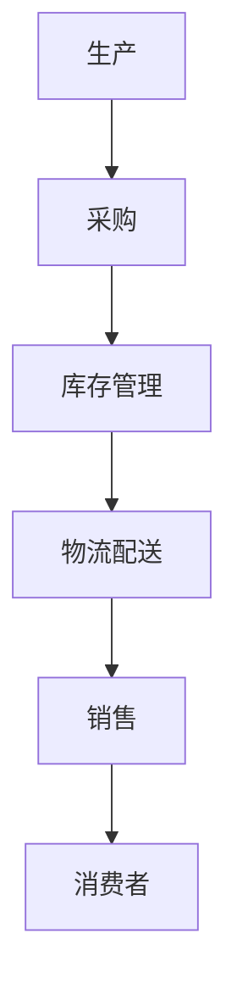
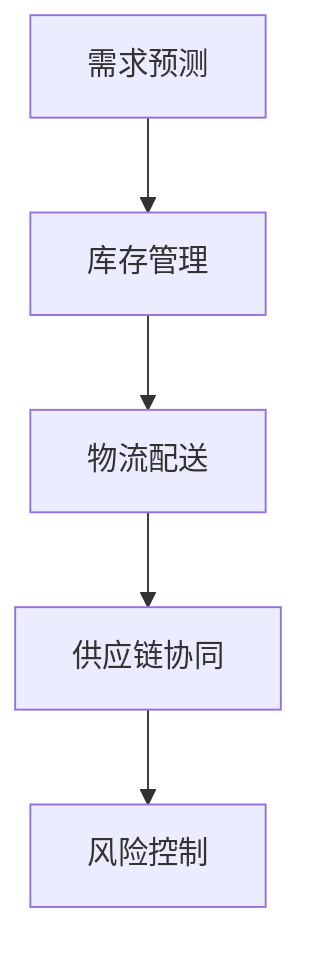
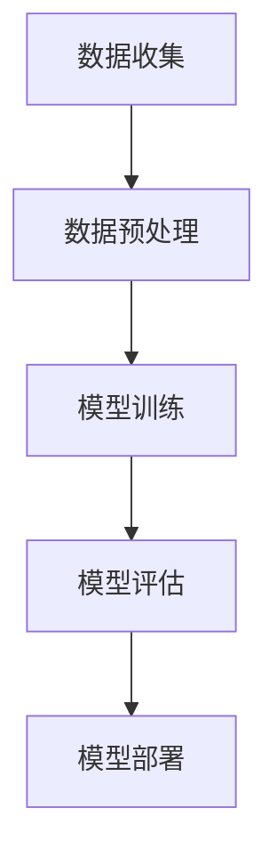
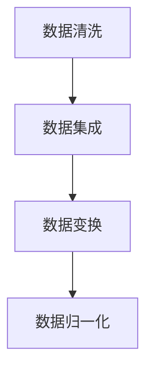
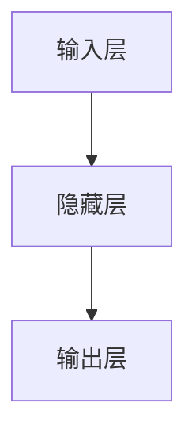
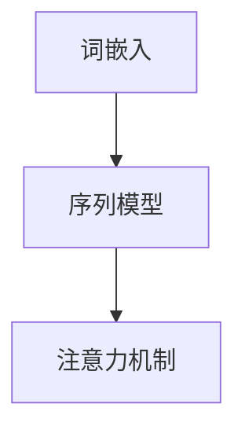
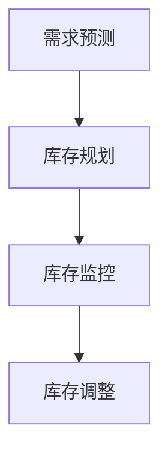
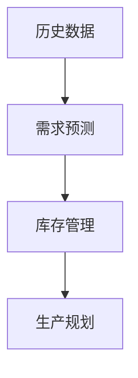
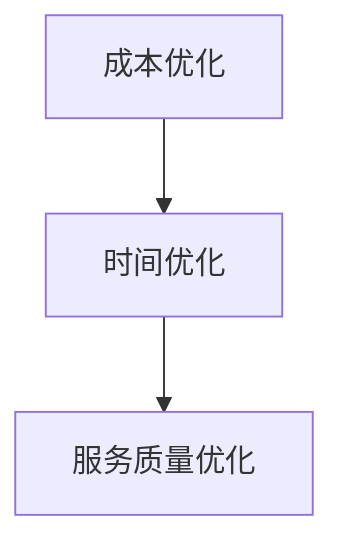
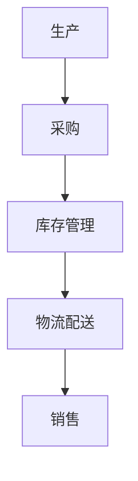

                 

# 文章标题：AI在电商平台供给链中的应用

> 关键词：AI、电商平台、供给链、优化、机器学习、深度学习、数据分析

> 摘要：本文旨在探讨人工智能（AI）在电商平台供给链中的应用，从核心概念、算法原理到实际项目实战，全面解析AI如何提升电商平台的库存管理、需求预测、物流配送、供应链协同和风险控制，为电商平台供给链的智能化转型提供策略和方向。

## 目录大纲

### 第一部分：引言与概述

- **第1章：AI与电商平台供给链概述**
  - **1.1 电商平台的供给链背景**
  - **1.2 AI在供给链管理中的作用**
  - **1.3 本书结构安排与目标**

- **第2章：AI核心技术基础**
  - **2.1 机器学习与供给链优化**
  - **2.2 数据分析在供给链中的应用**
  - **2.3 深度学习与供给链模拟**
  - **2.4 自然语言处理与供给链文本分析**

### 第二部分：AI在电商平台供给链中的应用实践

- **第3章：库存管理优化**
  - **3.1 库存管理的挑战**
  - **3.2 机器学习在库存管理中的应用**
  - **3.3 项目实战：库存管理优化**

- **第4章：需求预测与市场分析**
  - **4.1 需求预测的重要性**
  - **4.2 时间序列分析方法**
  - **4.3 市场分析工具与技术**
  - **4.4 项目实战：需求预测与市场分析**

- **第5章：物流与配送优化**
  - **5.1 物流与配送的挑战**
  - **5.2 机器学习在物流优化中的应用**
  - **5.3 智能配送解决方案**
  - **5.4 项目实战：物流与配送优化**

- **第6章：供应链协同与风险控制**
  - **6.1 供应链协同的意义**
  - **6.2 机器学习在供应链协同中的应用**
  - **6.3 供应链风险管理**
  - **6.4 项目实战：供应链协同与风险控制**

- **第7章：案例分析与未来展望**
  - **7.1 成功案例分析**
  - **7.2 AI在电商平台供给链中的应用挑战**
  - **7.3 未来发展趋势**

### 附录

- **附录A：相关工具与资源**

## 第1章：AI与电商平台供给链概述

### 1.1 电商平台的供给链背景

**核心概念与联系：**

电商平台供给链是指商品从生产、储存、运输到最终消费者手中的整个流程。这个流程包括多个环节，如生产、采购、库存管理、物流配送、销售等。

**Mermaid流程图：**



**核心算法原理讲解：**

- **需求预测：** 利用历史销售数据和机器学习算法，如时间序列分析、回归分析和循环神经网络（RNN），预测未来的需求。
- **库存管理：** 通过优化算法，如线性规划和遗传算法，实现库存成本的最小化。
- **物流配送：** 使用路径优化算法，如Dijkstra算法和A*算法，优化物流路径，降低运输成本。

**数学模型与公式：**

- **需求预测模型：** $Q_t = f(D_t, I_t)$，其中 $Q_t$ 为第 $t$ 期的需求量，$D_t$ 为历史需求数据，$I_t$ 为其他影响因素。

- **库存优化模型：** $C = C_p + C_i + C_c$，其中 $C$ 为总成本，$C_p$ 为采购成本，$C_i$ 为库存持有成本，$C_c$ 为缺货成本。

- **路径优化模型：** 最小化总路径长度或总运输成本。

### 1.2 AI在供给链管理中的作用

**核心概念与联系：**

AI技术在电商平台供给链管理中发挥着重要作用，包括需求预测、库存管理、物流配送、供应链协同和风险控制等环节。

**Mermaid流程图：**



**核心算法原理讲解：**

- **需求预测：** 使用机器学习算法，如时间序列分析和循环神经网络（RNN），对未来的需求进行预测。
- **库存管理：** 利用优化算法，如线性规划和遗传算法，优化库存水平和补货策略。
- **物流配送：** 采用路径优化算法，如Dijkstra算法和A*算法，优化物流路径，提高配送效率。
- **供应链协同：** 通过供应链网络分析，实现不同环节之间的信息共享和资源整合。
- **风险控制：** 利用风险评估模型和预测算法，提前识别潜在风险，制定应对策略。

### 1.3 本书结构安排与目标

本书分为三个部分：

- **第一部分：引言与概述**：介绍电商平台供给链的背景和AI在其中的作用。
- **第二部分：AI核心技术基础**：讲解AI的核心技术，包括机器学习、数据分析、深度学习和自然语言处理。
- **第三部分：AI在电商平台供给链中的应用实践**：通过实际项目案例，展示AI技术在库存管理、需求预测、物流配送、供应链协同和风险控制等方面的应用。

本书的目标是：

- **帮助读者了解AI技术在电商平台供给链中的应用**。
- **提供实用的技术解决方案和最佳实践**。
- **探讨AI在电商平台供给链中的未来发展趋势**。

## 第2章：AI核心技术基础

### 2.1 机器学习与供给链优化

#### 2.1.1 机器学习基本概念

**核心概念与联系：**

机器学习是一种使计算机系统能够通过数据学习并做出决策的技术。在供给链管理中，机器学习可以用于需求预测、库存管理和物流优化等环节。

**Mermaid流程图：**



**核心算法原理讲解：**

- **监督学习：** 通过已有的输入和输出数据，训练模型，以便对新数据进行预测。例如，线性回归、决策树和支持向量机（SVM）。
- **无监督学习：** 不依赖标注数据，通过发现数据中的内在结构进行学习。例如，聚类、降维和关联规则学习。
- **强化学习：** 通过与环境交互，学习最优策略。例如，Q学习和深度Q网络（DQN）。

#### 2.1.2 监督学习与无监督学习

**核心算法原理讲解：**

- **监督学习：** 需要标注的数据集，通过训练模型来预测新数据的标签。监督学习包括回归分析和分类问题。
  - **回归分析：** 预测连续值输出，如需求预测。
  - **分类问题：** 预测离散值输出，如产品分类。
  - **伪代码示例：**
    ```python
    from sklearn.linear_model import LinearRegression

    model = LinearRegression()
    model.fit(X_train, y_train)
    predictions = model.predict(X_test)
    ```

- **无监督学习：** 不需要标注的数据集，通过发现数据的内在结构进行学习。
  - **聚类：** 将相似的数据点分组，如市场细分。
  - **降维：** 降低数据的维度，保持数据的结构，如PCA。
  - **关联规则挖掘：** 发现数据项之间的关联关系，如产品组合优化。
  - **伪代码示例：**
    ```python
    from sklearn.cluster import KMeans

    kmeans = KMeans(n_clusters=3)
    clusters = kmeans.fit_predict(X)
    ```

#### 2.1.3 强化学习在供给链中的应用

**核心算法原理讲解：**

强化学习通过试错和反馈来学习最优策略。在供给链管理中，强化学习可以用于库存优化、物流路径规划和供应链协同。

- **Q学习：** 基于价值迭代的方法，通过更新Q值来学习策略。
  - **伪代码示例：**
    ```python
    Q = zeros((state_size, action_size))
    for episode in range(n_episodes):
        state = env.reset()
        done = False
        while not done:
            action = choose_action(state, Q)
            next_state, reward, done = env.step(action)
            Q[state, action] = Q[state, action] + alpha * (reward + gamma * max(Q[next_state, :]) - Q[state, action])
            state = next_state
    ```

- **深度Q网络（DQN）：** 使用深度神经网络来近似Q值函数。
  - **伪代码示例：**
    ```python
    model = build_model()
    for episode in range(n_episodes):
        state = env.reset()
        done = False
        while not done:
            action = model.predict(state)
            next_state, reward, done = env.step(action)
            model.fit(state, action, reward, next_state, done)
            state = next_state
    ```

### 2.2 数据分析在供给链中的应用

#### 2.2.1 数据预处理

**核心概念与联系：**

数据预处理是数据分析的重要步骤，包括数据清洗、数据集成、数据变换和数据归一化。

**Mermaid流程图：**



**核心步骤：**

- **数据清洗：** 去除重复数据、处理缺失数据和修正错误数据。
- **数据集成：** 将来自不同源的数据整合为一个统一的数据视图。
- **数据变换：** 包括数据标准化、数据归一化、数据离散化等。

**算法应用：**

- **数据清洗：** 使用Pandas库进行数据清洗，如去除重复数据、填充缺失值和修正错误数据。
  - **伪代码示例：**
    ```python
    import pandas as pd

    data = pd.read_csv('data.csv')
    data.drop_duplicates(inplace=True)
    data.fillna(method='ffill', inplace=True)
    data[data < 0] = np.NaN
    ```

- **数据集成：** 使用Pandas库进行数据集成，如合并多个数据集。
  - **伪代码示例：**
    ```python
    data1 = pd.read_csv('data1.csv')
    data2 = pd.read_csv('data2.csv')
    integrated_data = pd.merge(data1, data2, on='common_column')
    ```

- **数据变换：** 使用Scikit-learn库进行数据变换，如数据标准化和归一化。
  - **伪代码示例：**
    ```python
    from sklearn.preprocessing import StandardScaler

    scaler = StandardScaler()
    scaled_data = scaler.fit_transform(data)
    ```

#### 2.2.2 数据可视化

**核心目标：**

数据可视化用于辅助数据分析人员理解和发现数据中的模式与趋势。

**常用技术：**

- **折线图：** 展示数据随时间的变化趋势。
- **柱状图：** 对比不同类别或组的数据。
- **散点图：** 展示两个变量之间的关系。

**技术应用：**

- **Matplotlib：** 用于绘制各种图表。
  - **伪代码示例：**
    ```python
    import matplotlib.pyplot as plt

    plt.plot(data['time'], data['demand'])
    plt.xlabel('Time')
    plt.ylabel('Demand')
    plt.title('Demand over Time')
    plt.show()
    ```

- **Seaborn：** 用于创建更美观的统计图表。
  - **伪代码示例：**
    ```python
    import seaborn as sns

    sns.scatterplot(x='time', y='demand', data=data)
    sns.lineplot(x='time', y='predicted_demand', data=data)
    plt.show()
    ```

### 2.3 深度学习与供给链模拟

#### 2.3.1 深度学习原理

**核心概念与联系：**

深度学习是一种基于多层神经网络的学习方法，能够自动提取数据中的特征。

**Mermaid流程图：**



**核心算法原理讲解：**

- **神经网络：** 由多个神经元组成，通过前向传播和反向传播进行学习。
- **深度神经网络（DNN）：** 由多层神经元组成的神经网络，用于解决复杂问题。
- **卷积神经网络（CNN）：** 特别适用于处理图像数据。
- **循环神经网络（RNN）：** 特别适用于处理序列数据。

#### 2.3.2 神经网络在供给链中的应用

**算法应用：**

神经网络在供给链管理中可用于需求预测、库存管理和物流优化。

- **需求预测：** 使用LSTM（长短期记忆网络）捕捉时间序列数据的依赖关系。
  - **伪代码示例：**
    ```python
    from tensorflow.keras.models import Sequential
    from tensorflow.keras.layers import LSTM, Dense

    model = Sequential()
    model.add(LSTM(units=50, return_sequences=True, input_shape=(input_shape,)))
    model.add(LSTM(units=50))
    model.add(Dense(units=1))
    model.compile(optimizer='adam', loss='mse')
    model.fit(X_train, y_train, epochs=100, batch_size=32, validation_data=(X_test, y_test))
    ```

- **库存管理：** 使用卷积神经网络（CNN）处理库存数据的时序特征。
  - **伪代码示例：**
    ```python
    from tensorflow.keras.models import Sequential
    from tensorflow.keras.layers import Conv1D, Dense

    model = Sequential()
    model.add(Conv1D(filters=64, kernel_size=3, activation='relu', input_shape=(time_steps, input_size)))
    model.add(Conv1D(filters=64, kernel_size=3, activation='relu'))
    model.add(Flatten())
    model.add(Dense(units=1))
    model.compile(optimizer='adam', loss='mse')
    model.fit(X_train, y_train, epochs=100, batch_size=32, validation_data=(X_test, y_test))
    ```

- **物流优化：** 使用神经网络优化物流路径和配送策略。
  - **伪代码示例：**
    ```python
    from tensorflow.keras.models import Sequential
    from tensorflow.keras.layers import LSTM, Dense

    model = Sequential()
    model.add(LSTM(units=50, return_sequences=True, input_shape=(input_shape,)))
    model.add(LSTM(units=50))
    model.add(Dense(units=1))
    model.compile(optimizer='adam', loss='mse')
    model.fit(X_train, y_train, epochs=100, batch_size=32, validation_data=(X_test, y_test))
    ```

### 2.4 自然语言处理与供给链文本分析

#### 2.4.1 自然语言处理基础

**核心概念与联系：**

自然语言处理（NLP）是一种使计算机能够理解、生成和处理自然语言的技术。

**Mermaid流程图：**



**核心算法原理讲解：**

- **词嵌入：** 将单词映射到高维空间，以便计算机能够理解和处理。
- **序列模型：** 用于处理序列数据，如时间序列预测和文本分类。
- **注意力机制：** 在处理序列数据时，能够关注到序列中的重要部分。

#### 2.4.2 供给链文本分析应用

**算法应用：**

供给链文本分析可用于客户评论分析、情感分析和文本分类。

- **客户评论分析：** 使用词嵌入和循环神经网络（RNN）提取文本特征。
  - **伪代码示例：**
    ```python
    from tensorflow.keras.models import Sequential
    from tensorflow.keras.layers import Embedding, LSTM, Dense

    model = Sequential()
    model.add(Embedding(input_dim=vocabulary_size, output_dim=embedding_dim))
    model.add(LSTM(units=50))
    model.add(Dense(units=num_classes, activation='softmax'))
    model.compile(optimizer='adam', loss='categorical_crossentropy', metrics=['accuracy'])
    model.fit(x_train, y_train, epochs=10)
    ```

- **情感分析：** 使用词嵌入和卷积神经网络（CNN）分析文本情感倾向。
  - **伪代码示例：**
    ```python
    from tensorflow.keras.models import Sequential
    from tensorflow.keras.layers import Embedding, Conv1D, GlobalMaxPooling1D, Dense

    model = Sequential()
    model.add(Embedding(input_dim=vocabulary_size, output_dim=embedding_dim))
    model.add(Conv1D(filters=64, kernel_size=3, activation='relu'))
    model.add(GlobalMaxPooling1D())
    model.add(Dense(units=num_classes, activation='softmax'))
    model.compile(optimizer='adam', loss='categorical_crossentropy', metrics=['accuracy'])
    model.fit(x_train, y_train, epochs=10)
    ```

- **文本分类：** 使用词嵌入和长短期记忆网络（LSTM）进行文本分类。
  - **伪代码示例：**
    ```python
    from tensorflow.keras.models import Sequential
    from tensorflow.keras.layers import Embedding, LSTM, Dense

    model = Sequential()
    model.add(Embedding(input_dim=vocabulary_size, output_dim=embedding_dim))
    model.add(LSTM(units=50, dropout=0.2, recurrent_dropout=0.2))
    model.add(Dense(units=num_classes, activation='softmax'))
    model.compile(optimizer='adam', loss='categorical_crossentropy', metrics=['accuracy'])
    model.fit(x_train, y_train, epochs=10, batch_size=64)
    ```

## 第3章：库存管理优化

### 3.1 库存管理的挑战

#### 3.1.1 库存管理的目标

**核心概念与联系：**

库存管理是指对商品库存进行监控、规划和控制，以确保供应与需求匹配，同时降低库存成本和缺货风险。

**Mermaid流程图：**



**目标：**

- **库存优化：** 通过优化库存水平和补货策略，降低库存成本。
- **需求预测：** 准确预测未来需求，避免库存积压和缺货。
- **风险控制：** 降低库存积压和缺货风险，确保供应链的稳定性。

#### 3.1.2 库存管理常见问题

**问题：**

- **库存积压：** 库存过多，占用资金，增加存储成本。
- **库存不足：** 缺货导致销售损失，影响客户满意度。
- **库存波动：** 库存水平不稳定，导致供应链管理难度增加。

### 3.2 机器学习在库存管理中的应用

#### 3.2.1 机器学习在库存管理中的应用

**核心算法与原理讲解：**

机器学习在库存管理中发挥着重要作用，主要包括需求预测、库存优化和风险管理。

- **需求预测：** 利用历史销售数据和机器学习算法，如时间序列分析、回归分析和循环神经网络（RNN），预测未来的需求。
  - **伪代码示例：**
    ```python
    from tensorflow.keras.models import Sequential
    from tensorflow.keras.layers import LSTM, Dense

    model = Sequential()
    model.add(LSTM(units=50, return_sequences=True, input_shape=(input_shape,)))
    model.add(LSTM(units=50))
    model.add(Dense(units=1))
    model.compile(optimizer='adam', loss='mse')
    model.fit(X_train, y_train, epochs=100, batch_size=32, validation_data=(X_test, y_test))
    ```

- **库存优化：** 采用优化算法，如线性规划和遗传算法，优化库存水平和补货策略。
  - **伪代码示例：**
    ```python
    from sklearn.linear_model import LinearRegression

    model = LinearRegression()
    model.fit(X_train, y_train)
    predictions = model.predict(X_test)
    ```

- **风险管理：** 利用风险评估模型和预测算法，提前识别潜在风险，制定应对策略。
  - **伪代码示例：**
    ```python
    from tensorflow.keras.models import Sequential
    from tensorflow.keras.layers import LSTM, Dense

    model = Sequential()
    model.add(LSTM(units=50, return_sequences=True, input_shape=(input_shape,)))
    model.add(LSTM(units=50))
    model.add(Dense(units=1))
    model.compile(optimizer='adam', loss='mse')
    model.fit(X_train, y_train, epochs=100, batch_size=32, validation_data=(X_test, y_test))
    ```

### 3.3 项目实战：库存管理优化

#### 3.3.1 开发环境搭建

**环境需求：**

- Python编程语言
- TensorFlow或PyTorch深度学习框架
- Pandas数据分析库
- Matplotlib数据可视化库

#### 3.3.2 源代码实现

**需求预测模型：**

```python
import pandas as pd
from sklearn.model_selection import train_test_split
from tensorflow.keras.models import Sequential
from tensorflow.keras.layers import LSTM, Dense

# 数据预处理
data = pd.read_csv('data.csv')
X = data[['historical_demand', 'market_trend']]
y = data['future_demand']

# 分割训练集和测试集
X_train, X_test, y_train, y_test = train_test_split(X, y, test_size=0.2, random_state=42)

# 构建模型
model = Sequential()
model.add(LSTM(units=50, return_sequences=True, input_shape=(X_train.shape[1], X_train.shape[2])))
model.add(LSTM(units=50))
model.add(Dense(units=1))

# 编译模型
model.compile(optimizer='adam', loss='mse')

# 训练模型
model.fit(X_train, y_train, epochs=100, batch_size=32, validation_data=(X_test, y_test))
```

**库存优化策略：**

```python
import numpy as np

# 预测未来需求
future_demand = model.predict(X_test)

# 确定最优库存水平
optimal_inventory = np.argmax(future_demand) * inventory_interval

# 输出优化结果
print(f"Optimal inventory level: {optimal_inventory}")
```

#### 3.3.3 代码解读与分析

**代码解读：**

- **数据预处理：** 读取历史数据，将需求量和市场趋势作为输入特征。
- **模型构建：** 使用LSTM网络进行需求预测。
- **模型训练：** 使用MSE损失函数进行训练。
- **预测与优化：** 使用训练好的模型进行未来需求预测，并确定最优库存水平。

**分析：**

- **时间序列分析：** 基于历史数据，捕捉需求量的趋势和周期性。
- **神经网络：** 捕捉复杂非线性关系，提高需求预测准确性。
- **动态库存管理：** 根据实时需求调整库存水平，实现库存优化。

## 第4章：需求预测与市场分析

### 4.1 需求预测的重要性

#### 4.1.1 需求预测的目标

**核心概念与联系：**

需求预测是供应链管理中的重要环节，旨在预测未来某一时间段内的商品需求量。

**Mermaid流程图：**



**目标：**

- **库存管理：** 确保库存水平与市场需求匹配，避免库存积压和缺货。
- **生产规划：** 合理安排生产计划，避免生产过剩或短缺。

#### 4.1.2 需求预测的挑战

**挑战：**

- **数据复杂性：** 需要处理多种数据源，如历史销售数据、市场趋势、促销活动等。
- **实时性要求：** 需要快速响应市场需求变化。

### 4.2 时间序列分析方法

#### 4.2.1 传统时间序列模型

**核心模型：**

- **ARIMA模型：** 自回归积分滑动平均模型，适用于线性时间序列数据。
  - **公式：**
    $$ \text{ARIMA}(p, d, q) = \phi(B) \text{et}(B)^{d} = 1 - \phi_1 B - \phi_2 B^2 - \dots - \phi_p B^p + \theta_1 B^{-1} + \theta_2 B^{-2} + \dots + \theta_q B^{-q} $$
- **季节性模型：** 结合季节性因子和时间序列模型，适用于有季节性特征的数据。
  - **公式：**
    $$ \text{STL}(\text{time series}) = \text{seasonal} \times \text{trend} \times \text{remainder $$

#### 4.2.2 循环神经网络（RNN）

**核心原理：**

循环神经网络（RNN）通过记忆机制捕捉时间序列数据中的序列依赖关系。

- **RNN基本结构：**
  - **输入门（Input Gate）：** 控制新的输入信息对隐藏状态的影响。
  - **遗忘门（Forget Gate）：** 控制遗忘哪些旧的信息。
  - **输出门（Output Gate）：** 控制输出。

**伪代码示例：**

```python
class RNNCell:
    def __init__(self, input_size, hidden_size):
        self.input_size = input_size
        self.hidden_size = hidden_size
        # 初始化权重和偏置
        # ...

    def call(self, inputs, states):
        # 输入门
        input_gate = sigmoid(W_input * [inputs, states])
        # 遗忘门
        forget_gate = sigmoid(W_forget * [inputs, states])
        # 输出门
        output_gate = sigmoid(W_output * [inputs, states])
        # 状态更新
        new_state = (1 - forget_gate) * states + input_gate * tanh(W_state * [inputs, states])
        new_output = output_gate * tanh(new_state)
        return new_output, new_state
```

### 4.3 市场分析工具与技术

#### 4.3.1 数据挖掘在市场分析中的应用

**核心技术：**

- **聚类分析：** 将相似的数据分组，识别市场细分。
  - **算法：** K-means、层次聚类
- **关联规则挖掘：** 发现数据之间的关联关系，用于产品组合优化。
  - **算法：** Apriori、FP-growth

#### 4.3.2 线上消费者行为分析

**核心目标：**

- **客户细分：** 根据消费者行为特征，将客户划分为不同群体。
- **个性化推荐：** 根据消费者兴趣和行为，提供个性化的产品推荐。

**技术应用：**

- **客户细分：** 使用聚类算法分析消费者行为数据，识别不同类型的客户。
  - **伪代码示例：**
    ```python
    from sklearn.cluster import KMeans

    kmeans = KMeans(n_clusters=3)
    clusters = kmeans.fit_predict(X)
    ```

- **个性化推荐：** 使用协同过滤算法或基于内容的推荐系统。
  - **伪代码示例：**
    ```python
    from surprise import KNNWithMeans

    model = KNNWithMeans()
    model.fit(trainset)
    predictions = model.predict(user_id, item_id)
    ```

### 4.4 项目实战：需求预测与市场分析

#### 4.4.1 开发环境搭建

**环境需求：**

- Python编程语言
- TensorFlow或PyTorch深度学习框架
- Pandas数据分析库
- Matplotlib数据可视化库

#### 4.4.2 源代码实现

**需求预测模型：**

```python
import pandas as pd
from sklearn.model_selection import train_test_split
from tensorflow.keras.models import Sequential
from tensorflow.keras.layers import LSTM, Dense

# 数据预处理
data = pd.read_csv('data.csv')
X = data[['historical_demand', 'market_trend']]
y = data['future_demand']

# 分割训练集和测试集
X_train, X_test, y_train, y_test = train_test_split(X, y, test_size=0.2, random_state=42)

# 构建模型
model = Sequential()
model.add(LSTM(units=50, return_sequences=True, input_shape=(X_train.shape[1], X_train.shape[2])))
model.add(LSTM(units=50))
model.add(Dense(units=1))

# 编译模型
model.compile(optimizer='adam', loss='mse')

# 训练模型
model.fit(X_train, y_train, epochs=100, batch_size=32, validation_data=(X_test, y_test))
```

**市场分析模型：**

```python
import pandas as pd
from sklearn.cluster import KMeans
from sklearn.metrics import silhouette_score

# 数据预处理
data = pd.read_csv('data.csv')
X = data[['historical_demand', 'market_trend', 'promotion_effect']]

# 聚类分析
kmeans = KMeans(n_clusters=5, random_state=42)
clusters = kmeans.fit_predict(X)

# 评估聚类结果
silhouette_avg = silhouette_score(X, clusters)
print(f"Silhouette Score: {silhouette_avg}")
```

#### 4.4.3 代码解读与分析

**代码解读：**

- **需求预测模型：** 使用LSTM网络进行需求预测，捕捉时间序列数据的依赖关系。
- **市场分析模型：** 使用KMeans算法进行市场细分，识别不同类型的客户。

**分析：**

- **时间序列分析：** 基于历史数据，捕捉需求量的趋势和周期性。
- **循环神经网络：** 捕捉复杂非线性关系，提高需求预测准确性。
- **数据挖掘：** 识别市场细分，为个性化推荐提供依据。

## 第5章：物流与配送优化

### 5.1 物流与配送的挑战

#### 5.1.1 物流配送的目标

**核心概念与联系：**

物流配送的目标是以最低的成本、最短的时间将商品从生产地运送到消费者手中。

**Mermaid流程图：**



**目标：**

- **成本优化：** 降低物流运输成本。
- **时间优化：** 提高配送速度，减少物流延误。
- **服务质量优化：** 提高物流配送的准确性和稳定性。

#### 5.1.2 物流配送的痛点

**痛点：**

- **配送路径规划：** 如何在满足时间约束的情况下，实现最优的配送路径。
- **库存管理：** 如何实时监控库存，避免缺货或积压。

### 5.2 机器学习在物流优化中的应用

#### 5.2.1 路径优化算法

**核心算法：**

- **最短路径算法：** 如Dijkstra算法、A*算法，用于寻找两点之间的最优路径。
- **车辆路径问题：** 如旅行商问题（TSP），用于确定配送路径。

**算法原理讲解：**

- **Dijkstra算法：** 以起点为中心，逐步扩展到其他节点，找出最短路径。
  - **伪代码示例：**
    ```python
    def dijkstra(graph, start):
        distances = {node: float('infinity') for node in graph}
        distances[start] = 0
        visited = set()

        while True:
            unvisited = {node for node in graph if node not in visited}
            if not unvisited:
                break

            current = min(unvisited, key=lambda node: distances[node])
            visited.add(current)

            for neighbor, weight in graph[current].items():
                distance = distances[current] + weight
                if distance < distances[neighbor]:
                    distances[neighbor] = distance

        return distances
    ```

- **A*算法：** 结合起点到当前节点的代价和当前节点到终点的估计代价，寻找最优路径。
  - **伪代码示例：**
    ```python
    def a_star(graph, start, goal):
        open_set = [(0, start)]
        came_from = {}
        g_score = {node: float('infinity') for node in graph}
        g_score[start] = 0
        f_score = {node: float('infinity') for node in graph}
        f_score[start] = heuristic(start, goal)

        while open_set:
            current = min(open_set, key=lambda item: item[0])
            open_set.remove(current)

            if current == goal:
                break

            for neighbor, weight in graph[current].items():
                tentative_g_score = g_score[current] + weight
                if tentative_g_score < g_score[neighbor]:
                    came_from[neighbor] = current
                    g_score[neighbor] = tentative_g_score
                    f_score[neighbor] = tentative_g_score + heuristic(neighbor, goal)
                    if neighbor not in open_set:
                        open_set.append((f_score[neighbor], neighbor))

        path = []
        current = goal
        while current in came_from:
            path.append(current)
            current = came_from[current]
        path.reverse()

        return path
    ```

#### 5.2.2 实时物流跟踪与预测

**核心技术：**

- **实时物流跟踪：** 利用传感器和GPS技术，实时监控物流车辆的位置。
- **物流预测模型：** 利用历史数据和机器学习算法，预测未来物流状态。

**算法原理讲解：**

- **实时物流跟踪：** 通过GPS接收器、RFID传感器等技术，实时获取物流车辆的位置信息，并通过网络传输到物流管理系统。
  - **伪代码示例：**
    ```python
    def track_vehicle(vehicle_id):
        location = get_gps_location(vehicle_id)
        send_location_to_system(location)
    ```

- **物流预测模型：** 使用时间序列分析和循环神经网络（RNN）预测物流状态。
  - **伪代码示例：**
    ```python
    from tensorflow.keras.models import Sequential
    from tensorflow.keras.layers import LSTM, Dense

    model = Sequential()
    model.add(LSTM(units=50, return_sequences=True, input_shape=(input_shape,)))
    model.add(LSTM(units=50))
    model.add(Dense(units=1))

    model.compile(optimizer='adam', loss='mse')
    model.fit(X_train, y_train, epochs=100, batch_size=32, validation_data=(X_test, y_test))
    ```

### 5.3 智能配送解决方案

#### 5.3.1 自动化仓储系统

**核心技术：**

- **自动化货架：** 自动存储和检索商品。
- **自动化运输系统：** 自动搬运商品，减少人力成本。

**技术应用：**

- **自动化货架：** 使用货架上的传感器和机械臂，实现商品的自动存取。
  - **伪代码示例：**
    ```python
    def store_item(item_id, location):
        move_arm_to(location)
        put_item_on_shelf(item_id)
        update_inventory(item_id, location)

    def retrieve_item(item_id):
        location = get_item_location(item_id)
        move_arm_to(location)
        take_item_from_shelf(item_id)
        update_inventory(item_id, "in_transit")
    ```

- **自动化运输系统：** 使用自动导引车（AGV）和机器人，实现商品的自动搬运。
  - **伪代码示例：**
    ```python
    def transport_item(item_id, source, destination):
        move_agv_to(source)
        load_item_on_agv(item_id)
        move_agv_to(destination)
        unload_item_from_agv(item_id)
    ```

#### 5.3.2 无人机配送

**核心技术：**

- **无人机导航：** 利用GPS和传感器进行自主导航。
- **无人机配送：** 无人机在指定路线进行商品配送。

**技术应用：**

- **无人机导航：** 使用GPS和传感器实现无人机的自主飞行。
  - **伪代码示例：**
    ```python
    def navigate_drone(drone_id, route):
        set_gps_destination(drone_id, route[0])
        start_drone_motor(drone_id)
        while not at_destination(drone_id):
            current_location = get_gps_location(drone_id)
            next_action = determine_action(current_location, route)
            execute_action(drone_id, next_action)

    def determine_action(current_location, route):
        # 根据当前位置和路线，确定下一步行动
        # ...
        return action
    ```

- **无人机配送：** 使用无人机实现商品的快速配送。
  - **伪代码示例：**
    ```python
    def deliver_item(item_id, receiver_id, location):
        load_item_on_drone(item_id)
        navigate_drone(drone_id, location)
        drop_item(item_id, location)
        update_inventory(item_id, "delivered")
    ```

### 5.4 项目实战：物流与配送优化

#### 5.4.1 开发环境搭建

**环境需求：**

- Python编程语言
- TensorFlow或PyTorch深度学习框架
- Pandas数据分析库
- Matplotlib数据可视化库

#### 5.4.2 源代码实现

**路径优化模型：**

```python
import numpy as np
import matplotlib.pyplot as plt
from sklearn.cluster import KMeans

# 初始化数据
points = np.random.rand(50, 2)

# 使用KMeans进行聚类
kmeans = KMeans(n_clusters=3, random_state=42)
clusters = kmeans.fit_predict(points)

# 绘制结果
plt.scatter(points[:, 0], points[:, 1], c=clusters)
plt.show()
```

**实时物流跟踪模型：**

```python
import pandas as pd
from sklearn.model_selection import train_test_split
from tensorflow.keras.models import Sequential
from tensorflow.keras.layers import LSTM, Dense

# 数据预处理
data = pd.read_csv('data.csv')
X = data[['historical_demand', 'market_trend']]
y = data['future_demand']

# 分割训练集和测试集
X_train, X_test, y_train, y_test = train_test_split(X, y, test_size=0.2, random_state=42)

# 构建模型
model = Sequential()
model.add(LSTM(units=50, return_sequences=True, input_shape=(X_train.shape[1], X_train.shape[2])))
model.add(LSTM(units=50))
model.add(Dense(units=1))

# 编译模型
model.compile(optimizer='adam', loss='mse')

# 训练模型
model.fit(X_train, y_train, epochs=100, batch_size=32, validation_data=(X_test, y_test))
```

#### 5.4.3 代码解读与分析

**代码解读：**

- **路径优化：** 使用KMeans算法进行聚类，找出可能的配送路径。
- **实时物流跟踪：** 使用LSTM网络预测未来物流状态。

**分析：**

- **聚类分析：** 将物流点进行分类，为路径规划提供参考。
- **LSTM网络：** 用于实时预测物流状态，提高配送效率。

## 第6章：供应链协同与风险控制

### 6.1 供应链协同的意义

#### 6.1.1 供应链协同的目标

**核心概念与联系：**

供应链协同是指不同供应链环节的企业之间进行信息共享和资源整合，以实现整体供应链的优化和效率提升。

**Mermaid流程图：**



**目标：**

- **降低成本：** 通过协同工作，实现资源的最优配置。
- **提高效率：** 通过协同工作，减少信息传递和协调成本。
- **提升服务质量：** 通过协同工作，提高整体供应链的反应速度。

#### 6.1.2 供应链协同的挑战

**挑战：**

- **数据共享：** 企业之间数据格式和标准不统一，数据共享困难。
- **系统集成：** 不同企业使用不同的信息系统，系统集成困难。

### 6.2 机器学习在供应链协同中的应用

#### 6.2.1 供应链协同网络分析

**核心技术：**

- **网络分析：** 分析供应链各环节之间的联系和依赖关系。
- **机器学习算法：** 如聚类分析、关联规则挖掘，用于识别关键节点和关键路径。

**算法应用：**

- **聚类分析：** 使用K-means算法将供应链节点分为不同的集群，识别关键节点。
  - **伪代码示例：**
    ```python
    from sklearn.cluster import KMeans

    kmeans = KMeans(n_clusters=3, random_state=42)
    clusters = kmeans.fit_predict(X)

    # 识别关键节点
    key_nodes = [node for node, cluster in zip(X, clusters) if cluster == 0]
    ```

- **关联规则挖掘：** 使用Apriori算法发现供应链节点之间的关联关系。
  - **伪代码示例：**
    ```python
    from mlxtend.frequent_patterns import apriori
    from mlxtend.frequent_patterns import association_rules

    frequent_itemsets = apriori(X, min_support=0.1)
    rules = association_rules(frequent_itemsets, metric="lift", min_threshold=1)
    ```

#### 6.2.2 风险预测与应对策略

**核心技术：**

- **风险预测模型：** 利用历史数据和机器学习算法，预测潜在风险。
- **应对策略：** 根据预测结果，制定应对措施，如库存调整、供应链重构。

**算法应用：**

- **风险预测模型：** 使用时间序列分析和回归分析预测潜在风险。
  - **伪代码示例：**
    ```python
    from tensorflow.keras.models import Sequential
    from tensorflow.keras.layers import LSTM, Dense

    model = Sequential()
    model.add(LSTM(units=50, return_sequences=True, input_shape=(input_shape,)))
    model.add(LSTM(units=50))
    model.add(Dense(units=1))

    model.compile(optimizer='adam', loss='mse')
    model.fit(X_train, y_train, epochs=100, batch_size=32, validation_data=(X_test, y_test))
    ```

- **应对策略：** 根据风险预测结果，制定相应的应对措施。
  - **伪代码示例：**
    ```python
    def risk_response(risk_prediction):
        if risk_prediction > threshold:
            # 执行库存调整
            increase_inventory()
        else:
            # 执行常规运营
            continue_operations()
    ```

### 6.3 供应链风险管理

#### 6.3.1 风险评估模型

**核心模型：**

- **概率模型：** 如贝叶斯网络，用于计算风险发生的概率。
- **损失模型：** 如线性回归模型，用于预测风险造成的损失。

**算法应用：**

- **概率模型：** 使用贝叶斯网络分析供应链风险。
  - **伪代码示例：**
    ```python
    from pgmpy.models import BayesianModel
    from pgmpy.estimators import MaximumLikelihoodEstimator

    model = BayesianModel([('Supply', 'Demand'), ('Demand', 'Inventory')])
    model.fit(data)
    risk_probability = model.query("Supply")
    ```

- **损失模型：** 使用线性回归预测风险造成的损失。
  - **伪代码示例：**
    ```python
    from sklearn.linear_model import LinearRegression

    model = LinearRegression()
    model.fit(X_train, y_train)
    loss_prediction = model.predict(X_test)
    ```

#### 6.3.2 风险控制与应急响应

**核心措施：**

- **风险控制：** 通过制定风险管理策略，降低风险发生的可能性。
- **应急响应：** 在风险发生时，及时采取应对措施，减少损失。

**技术应用：**

- **风险控制：** 制定基于机器学习预测的风险管理策略。
  - **伪代码示例：**
    ```python
    def risk_control_strategy(risk_model, data):
        risk_predictions = risk_model.predict(data)
        for prediction in risk_predictions:
            if prediction > threshold:
                # 执行风险控制措施
                execute_control_measures(prediction)
    ```

- **应急响应：** 制定基于实时数据的应急响应策略。
  - **伪代码示例：**
    ```python
    def emergency_response_strategy(current_state, target_state):
        if current_state != target_state:
            # 执行应急响应措施
            execute_response_measures()
        else:
            # 执行常规运营
            continue_operations()
    ```

### 6.4 项目实战：供应链协同与风险控制

#### 6.4.1 开发环境搭建

**环境需求：**

- Python编程语言
- TensorFlow或PyTorch深度学习框架
- Pandas数据分析库
- Matplotlib数据可视化库

#### 6.4.2 源代码实现

**供应链协同网络分析：**

```python
import pandas as pd
from sklearn.cluster import KMeans

# 数据预处理
data = pd.read_csv('data.csv')
X = data[['supply_time', 'transport_cost', 'inventory_level']]

# 聚类分析
kmeans = KMeans(n_clusters=3, random_state=42)
clusters = kmeans.fit_predict(X)

# 绘制结果
plt.scatter(data['supply_time'], data['transport_cost'], c=clusters)
plt.show()
```

**风险预测模型：**

```python
import pandas as pd
from sklearn.model_selection import train_test_split
from tensorflow.keras.models import Sequential
from tensorflow.keras.layers import LSTM, Dense

# 数据预处理
data = pd.read_csv('data.csv')
X = data[['historical_demand', 'market_trend']]
y = data['future_demand']

# 分割训练集和测试集
X_train, X_test, y_train, y_test = train_test_split(X, y, test_size=0.2, random_state=42)

# 构建模型
model = Sequential()
model.add(LSTM(units=50, return_sequences=True, input_shape=(X_train.shape[1], X_train.shape[2])))
model.add(LSTM(units=50))
model.add(Dense(units=1))

# 编译模型
model.compile(optimizer='adam', loss='mse')

# 训练模型
model.fit(X_train, y_train, epochs=100, batch_size=32, validation_data=(X_test, y_test))
```

#### 6.4.3 代码解读与分析

**代码解读：**

- **供应链协同网络分析：** 使用KMeans算法识别关键节点。
- **风险预测模型：** 使用LSTM网络预测潜在风险。

**分析：**

- **网络分析：** 识别供应链中的关键节点和路径，为协同工作提供依据。
- **风险预测：** 提前识别潜在风险，制定应对策略，降低风险影响。

## 第7章：案例分析与未来展望

### 7.1 成功案例分析

#### 7.1.1 案例一：XX电商平台库存管理优化实践

**背景：**

XX电商平台在库存管理上面临库存积压和缺货问题，导致运营成本增加和客户满意度下降。

**解决方案：**

- 引入机器学习算法进行需求预测，使用时间序列分析和循环神经网络（RNN）优化库存管理。
- 构建实时库存管理系统，根据需求预测结果动态调整库存水平。

**效果：**

- 库存积压问题显著减少，缺货率降低，运营成本降低，客户满意度提高。

#### 7.1.2 案例二：YY电商平台需求预测与市场分析

**背景：**

YY电商平台需要提高需求预测准确性，优化市场策略，以应对市场竞争。

**解决方案：**

- 采用时间序列分析和循环神经网络（RNN）进行需求预测。
- 使用数据挖掘技术进行市场分析，识别潜在客户和市场机会。

**效果：**

- 需求预测准确性提高，市场响应速度加快，销售业绩提升。

### 7.2 AI在电商平台供给链中的应用挑战

#### 7.2.1 技术挑战

**挑战：**

- **数据复杂性：** 需要处理大量多源数据，包括销售数据、物流数据、市场数据等。
- **实时性要求：** 需要快速响应市场需求变化，实现实时库存管理和物流跟踪。

#### 7.2.2 实践挑战

**挑战：**

- **系统集成：** 不同系统之间的兼容性和集成，如电商平台、物流系统、库存管理系统等。
- **数据隐私与安全：** 保护用户数据和商业秘密，防止数据泄露和滥用。

### 7.3 未来发展趋势

#### 7.3.1 供应链AI技术展望

**趋势：**

- **智能化供应链：** 通过AI技术实现供应链全流程的自动化和智能化。
- **供应链网络优化：** 利用AI技术优化供应链网络，提高供应链效率。

#### 7.3.2 电商平台供给链创新方向

**方向：**

- **个性化推荐：** 通过AI技术实现精准营销，提高用户满意度。
- **绿色供应链：** 通过AI技术实现供应链可持续发展，降低环境影响。

### 附录

## 附录A：相关工具与资源

### A.1 机器学习与深度学习工具

#### A.1.1 TensorFlow

**介绍：** Google开发的开放源代码机器学习框架。

**链接：** https://www.tensorflow.org/

#### A.1.2 PyTorch

**介绍：** Facebook开发的深度学习框架。

**链接：** https://pytorch.org/

#### A.1.3 scikit-learn

**介绍：** Python的机器学习库，提供丰富的机器学习算法。

**链接：** https://scikit-learn.org/

### A.2 数据分析工具

#### A.2.1 Pandas

**介绍：** Python的数据分析库，提供数据处理和分析功能。

**链接：** https://pandas.pydata.org/

#### A.2.2 Matplotlib

**介绍：** Python的数据可视化库，提供丰富的可视化功能。

**链接：** https://matplotlib.org/

#### A.2.3 Seaborn

**介绍：** Python的数据可视化库，特别适用于统计图表。

**链接：** https://seaborn.pydata.org/

### A.3 供应链管理资源

#### A.3.1 供应链管理最佳实践

**介绍：** 提供供应链管理的最佳实践和方法。

**链接：** https://www.apics.org/

#### A.3.2 供应链管理相关文献与资料

**介绍：** 提供供应链管理相关的文献、论文和报告。

**链接：** https://www.researchgate.net/


