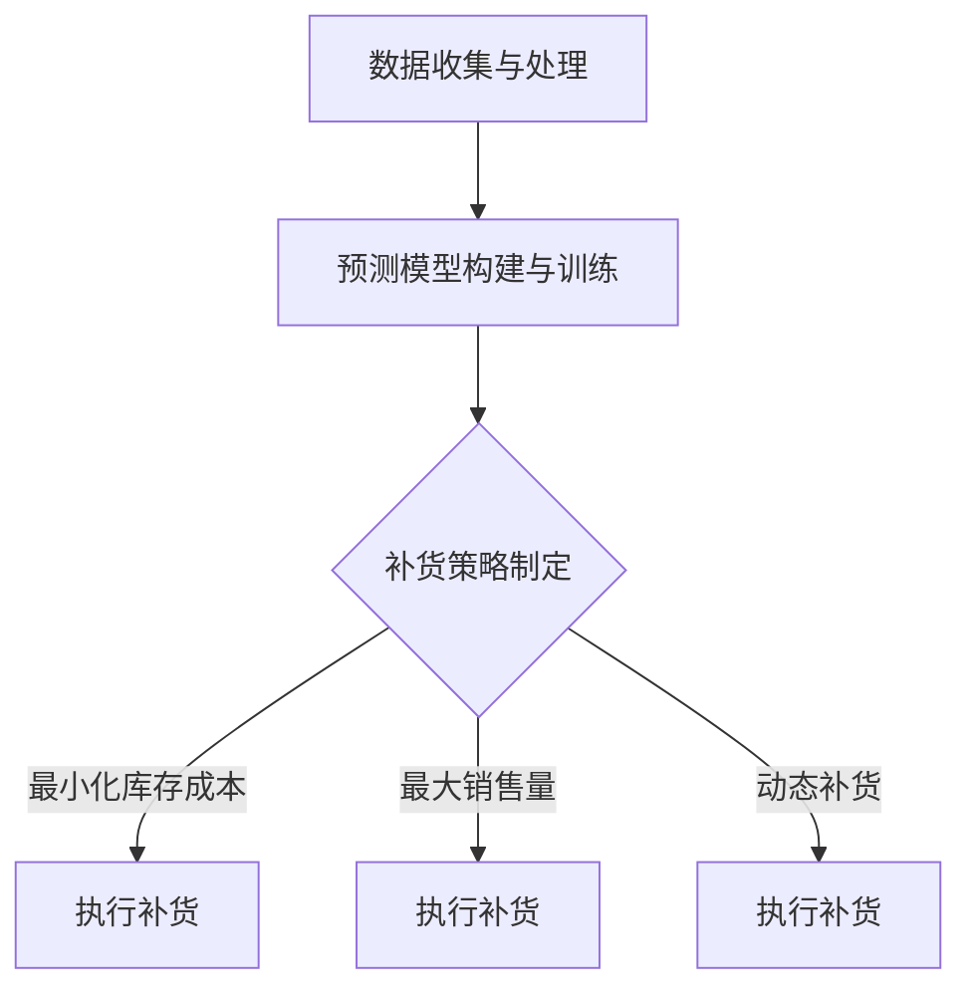
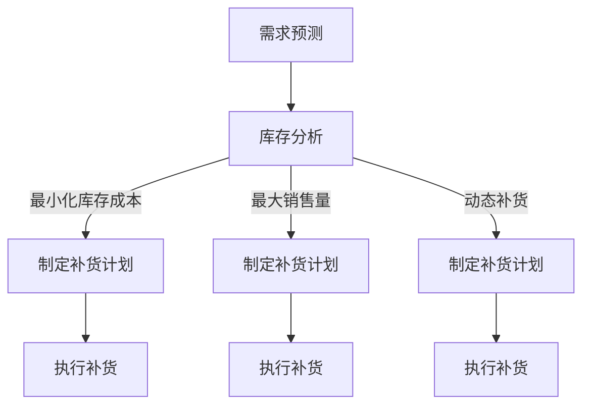
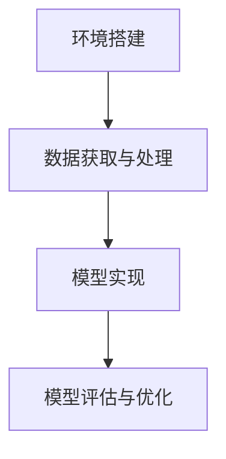

                 

### 文章标题：AI在电商平台自动补货中的应用

#### 关键词：AI，电商平台，自动补货，需求预测，算法优化

> 摘要：随着互联网和电子商务的迅速发展，电商平台面临巨大的运营挑战。本文将深入探讨AI技术在电商平台自动补货中的应用，包括基本概念、核心算法原理、补货策略优化与实战，以及应用前景与挑战。通过分析AI技术在电商平台自动补货中的应用，我们希望能够为电商企业提高运营效率和盈利能力提供一些有价值的参考。

----------------------------------------------------------------

## 第一部分：AI在电商平台自动补货的概述

### 第1章: AI在电商平台自动补货的基本概念

#### 1.1 电商平台自动补货的重要性

##### 1.1.1 电商平台运营的挑战

电商平台在日常运营中面临着诸多挑战。首先，商品种类繁多，库存管理变得复杂。其次，市场需求波动大，导致库存积压或缺货现象时有发生。最后，电商平台需要在保证库存充足的同时，尽可能降低库存成本，提高运营效率。

##### 1.1.2 自动补货在电商平台的作用

自动补货系统在电商平台中扮演着至关重要的角色。首先，它可以实时监测商品库存情况，通过分析历史销售数据和市场需求预测，自动生成补货计划，从而避免库存不足或积压。其次，自动补货系统可以根据实时数据和策略，动态调整库存水平，提高库存周转率，降低库存成本。最后，自动补货系统还可以优化供应链管理，提高整体运营效率。

##### 1.1.3 自动补货与电商盈利的关系

自动补货系统对于电商盈利具有重要意义。首先，通过优化库存管理，自动补货系统可以减少库存积压和缺货现象，提高商品销售率。其次，通过精准的需求预测和库存控制，自动补货系统可以提高库存周转率，降低库存成本。最后，自动补货系统可以优化供应链管理，提高运营效率，从而为电商企业创造更多的盈利空间。

##### 1.2 AI在电商自动补货中的应用

##### 1.2.1 AI技术的核心原理

人工智能（AI）是一种模拟人类智能的计算机技术，包括机器学习、深度学习、自然语言处理等。在电商平台自动补货中，AI技术主要通过数据分析和需求预测来实现。首先，AI技术可以收集和分析电商平台的历史销售数据、市场需求和库存情况等，识别出规律和趋势。然后，通过机器学习算法和深度学习模型，对数据进行训练和预测，从而生成补货计划。

##### 1.2.2 数据分析在自动补货中的应用

数据分析在自动补货中发挥着重要作用。首先，通过对历史销售数据的分析，可以了解商品的畅销程度、季节性需求和市场需求变化趋势。其次，通过对市场需求和库存数据的分析，可以识别出潜在的库存积压或缺货风险，从而制定相应的补货策略。最后，通过实时数据分析，可以动态调整库存水平和补货计划，提高库存周转率和运营效率。

##### 1.2.3 自动补货与客户需求预测的关系

自动补货系统的核心目标是满足客户需求，减少库存积压和缺货现象。因此，客户需求预测在自动补货中至关重要。通过AI技术，可以对客户需求进行预测，包括短期需求预测和长期趋势预测。短期需求预测可以帮助电商平台及时调整库存水平，避免缺货或积压现象。长期趋势预测可以帮助电商平台制定长期战略，优化库存管理和供应链管理。

##### 1.3 电商平台自动补货的流程

电商平台自动补货的流程主要包括数据收集与处理、预测模型的构建与训练、补货策略的制定与优化等。

###### 1.3.1 数据收集与处理

数据收集与处理是自动补货的基础。电商平台需要收集与商品销售相关的数据，如历史销售数据、市场需求、库存水平等。然后，对收集到的数据进行清洗、转换和整合，以便后续分析和预测。

###### 1.3.2 预测模型的构建与训练

在数据收集与处理完成后，构建预测模型是自动补货的关键。通过机器学习算法和深度学习模型，对处理后的数据进行训练，生成预测模型。预测模型可以预测短期和长期客户需求，为补货策略提供依据。

###### 1.3.3 补货策略的制定与优化

根据预测模型生成的需求预测结果，电商平台可以制定相应的补货策略。补货策略包括最小化库存成本策略、最大销售量策略和结合客户需求预测的动态补货策略等。通过不断优化补货策略，电商平台可以提高库存周转率，降低库存成本，提高运营效率。

### 总结

本章节对AI在电商平台自动补货的基本概念进行了概述，包括电商平台运营的挑战、自动补货在电商平台的作用、AI技术的核心原理、数据分析在自动补货中的应用、自动补货与客户需求预测的关系，以及电商平台自动补货的流程。通过这些内容，我们为后续章节深入探讨AI技术在电商平台自动补货中的应用奠定了基础。

### Mermaid 流程图



### 伪代码示例

```python
# 数据收集与处理
data = collect_data()
cleaned_data = clean_data(data)

# 预测模型构建与训练
model = build_model(cleaned_data)
trained_model = train_model(model, cleaned_data)

# 补货策略制定
strategy = determine_strategy(trained_model)

# 执行补货
if strategy == '最小化库存成本':
    execute_minimize_inventory(strategy)
elif strategy == '最大销售量':
    execute_maximize_sales(strategy)
else:
    execute_dynamic_inventory(strategy)
```

### 数学模型与公式

```latex
\text{需求预测模型：} y_t = f(\theta_0 + \theta_1 x_t + \epsilon_t)
```

其中，\( y_t \) 表示第 \( t \) 时刻的需求量，\( x_t \) 表示第 \( t \) 时刻的影响因素，\( \theta_0 \) 和 \( \theta_1 \) 为模型参数，\( \epsilon_t \) 为随机误差。

### 举例说明

假设某电商平台的某商品在过去一个月内每天的销售量为 \( x_t \)，通过机器学习算法训练得到的预测模型参数为 \( \theta_0 = 10 \)，\( \theta_1 = 0.5 \)。根据预测模型，预测明天该商品的需求量为：

```latex
y_t = 10 + 0.5 \times x_t
```

如果明天该商品的销售量为 100，则预测明天该商品的需求量为：

```latex
y_t = 10 + 0.5 \times 100 = 60
```

根据预测结果，电商平台可以提前制定相应的补货策略，避免缺货或积压现象，提高运营效率。

### Python 代码示例

```python
import numpy as np

# 数据收集与处理
def collect_data():
    # 伪代码，实际数据需要从电商平台获取
    return np.random.rand(30)

def clean_data(data):
    # 数据清洗，去除异常值等
    return data

# 预测模型构建与训练
def build_model(cleaned_data):
    # 伪代码，实际模型需要通过机器学习算法训练
    model = {'theta_0': 10, 'theta_1': 0.5}
    return model

def train_model(model, cleaned_data):
    # 伪代码，实际模型训练过程
    return model

# 补货策略制定
def determine_strategy(model):
    # 伪代码，根据模型预测结果制定策略
    return '最小化库存成本'

# 执行补货
def execute_minimize_inventory(strategy):
    # 伪代码，执行补货操作
    print("执行最小化库存成本补货策略")

# 演示
cleaned_data = clean_data(collect_data())
model = train_model(build_model(cleaned_data), cleaned_data)
strategy = determine_strategy(model)
if strategy == '最小化库存成本':
    execute_minimize_inventory(strategy)
```

通过以上代码示例，我们可以看到电商平台自动补货的基本流程和实现方式。在实际应用中，需要根据电商平台的具体情况进行相应的调整和优化。

### 总结

本章对AI在电商平台自动补货的基本概念进行了深入探讨，包括电商平台运营的挑战、自动补货在电商平台的作用、AI技术的核心原理、数据分析在自动补货中的应用、自动补货与客户需求预测的关系，以及电商平台自动补货的流程。通过本章的内容，我们对AI在电商平台自动补货的重要性有了更深刻的认识，为后续章节的深入探讨奠定了基础。

----------------------------------------------------------------

### 第二部分：AI技术在电商平台自动补货中的核心算法原理

#### 第2章: 电商平台自动补货中的数据预处理技术

##### 2.1 数据收集与清洗

在电商平台自动补货中，数据收集与清洗是至关重要的步骤。数据源的选择直接影响数据的质量和后续分析的结果。以下是对数据源选择的几点考虑：

###### 2.1.1 数据源的选择

- **销售数据**：电商平台销售数据是自动补货的重要数据源，包括商品名称、销售时间、销售量等。这些数据可以反映商品的畅销程度和市场需求。
- **库存数据**：库存数据包括商品库存量、库存周转率等。这些数据有助于了解当前库存水平和库存管理情况。
- **市场需求数据**：市场需求数据包括客户浏览记录、购买意向等。这些数据可以用于预测客户需求，为自动补货提供依据。
- **供应链数据**：供应链数据包括供应商信息、运输情况等。这些数据有助于优化供应链管理，提高补货效率。

###### 2.1.2 数据清洗的方法

- **去除重复数据**：去除重复数据可以避免对后续分析产生误导。
- **处理缺失数据**：对于缺失数据，可以采用插值、填充等方法进行补全。
- **异常值处理**：异常值可能对分析结果产生较大影响，需要通过统计学方法进行检测和处理。
- **数据格式转换**：将不同格式的数据进行统一格式转换，以便后续处理。

###### 2.1.3 数据质量评估

- **一致性评估**：评估数据在不同时间、不同维度上的一致性，确保数据的一致性和准确性。
- **完整性评估**：评估数据缺失的程度，确保数据完整性。
- **准确性评估**：通过对比实际值与预测值，评估数据准确性。

##### 2.2 特征工程

特征工程是数据预处理的关键环节，通过提取和选择合适的特征，可以提高模型性能和预测准确性。以下是对特征工程的几点考虑：

###### 2.2.1 特征提取与选择

- **时间特征**：包括时间戳、季节性、节假日等。时间特征可以反映商品销售的季节性和周期性。
- **销售特征**：包括销售量、销售额、销售增长率等。销售特征可以反映商品的畅销程度和市场需求。
- **库存特征**：包括库存量、库存周转率等。库存特征可以反映库存管理和供应链管理情况。
- **客户特征**：包括客户年龄、性别、购买记录等。客户特征可以用于客户需求预测和个性化推荐。

###### 2.2.2 时间序列特征处理

- **分解**：将时间序列数据分解为趋势、季节性和随机性成分，分别处理。
- **平滑**：通过移动平均、指数平滑等方法，消除时间序列中的噪声。
- **变换**：通过差分、对数变换等方法，使时间序列数据满足统计假设。

###### 2.2.3 特征标准化

- **归一化**：将特征值缩放到相同的尺度，消除特征间的大小差异。
- **标准化**：计算特征值与均值的偏差，消除特征值之间的相关性。

##### 2.3 特征工程总结

特征工程是电商平台自动补货中至关重要的一环，通过合理的特征提取与选择、时间序列特征处理和特征标准化，可以提高模型性能和预测准确性。以下是对特征工程过程的总结：

- **数据源选择**：选择合适的销售数据、库存数据、市场需求数据和供应链数据。
- **数据清洗**：去除重复数据、处理缺失数据和异常值。
- **特征提取与选择**：提取时间特征、销售特征、库存特征和客户特征，并选择对模型性能有显著影响的特征。
- **时间序列特征处理**：分解、平滑和变换时间序列数据。
- **特征标准化**：归一化和标准化特征值。

### 伪代码示例

```python
# 数据清洗
def clean_data(data):
    # 去除重复数据
    data = remove_duplicates(data)
    # 处理缺失数据
    data = handle_missing_data(data)
    # 处理异常值
    data = handle_outliers(data)
    return data

# 特征提取与选择
def extract_features(data):
    # 提取时间特征
    time_features = extract_time_features(data)
    # 提取销售特征
    sales_features = extract_sales_features(data)
    # 提取库存特征
    inventory_features = extract_inventory_features(data)
    # 提取客户特征
    customer_features = extract_customer_features(data)
    return time_features, sales_features, inventory_features, customer_features

# 时间序列特征处理
def process_time_series(data):
    # 分解时间序列
    components = decompose_time_series(data)
    # 平滑时间序列
    smoothed_data = smooth_time_series(data)
    # 变换时间序列
    transformed_data = transform_time_series(data)
    return smoothed_data, transformed_data

# 特征标准化
def normalize_features(data):
    # 归一化特征
    normalized_data = normalize(data)
    # 标准化特征
    standardized_data = standardize(data)
    return normalized_data, standardized_data
```

### 数学模型与公式

```latex
\text{需求预测模型：} y_t = \theta_0 + \theta_1 \times x_t + \epsilon_t
```

其中，\( y_t \) 表示第 \( t \) 时刻的需求量，\( x_t \) 表示第 \( t \) 时刻的影响因素，\( \theta_0 \) 和 \( \theta_1 \) 为模型参数，\( \epsilon_t \) 为随机误差。

### 举例说明

假设电商平台某商品在过去一个月内每天的销售量 \( x_t \) 如下表所示：

| 时间 \( t \) | 销售量 \( x_t \) |
| ------------ | -------------- |
| 1            | 100            |
| 2            | 120            |
| 3            | 90             |
| 4            | 110            |
| 5            | 100            |
| ...          | ...            |

通过机器学习算法训练得到的预测模型参数为 \( \theta_0 = 50 \)，\( \theta_1 = 0.3 \)。根据预测模型，预测明天该商品的需求量为：

```latex
y_t = 50 + 0.3 \times x_t
```

如果明天该商品的销售量为 100，则预测明天该商品的需求量为：

```latex
y_t = 50 + 0.3 \times 100 = 80
```

根据预测结果，电商平台可以提前制定相应的补货策略，避免缺货或积压现象，提高运营效率。

### Python 代码示例

```python
import numpy as np

# 数据清洗
def clean_data(data):
    # 去除重复数据
    data = np.unique(data)
    # 处理缺失数据
    data = np.nan_to_num(data)
    # 处理异常值
    data = np.clip(data, a_min=0, a_max=100)
    return data

# 特征提取与选择
def extract_features(data):
    # 提取时间特征
    time_features = np.array([t for t in range(data.shape[0])])
    # 提取销售特征
    sales_features = data
    return time_features, sales_features

# 时间序列特征处理
def process_time_series(data):
    # 分解时间序列
    components = np.diff(data)
    # 平滑时间序列
    smoothed_data = np.convolve(data, np.ones(3), 'valid')
    # 变换时间序列
    transformed_data = np.log(data)
    return smoothed_data, transformed_data

# 特征标准化
def normalize_features(data):
    # 归一化特征
    normalized_data = (data - np.mean(data)) / np.std(data)
    # 标准化特征
    standardized_data = (data - np.min(data)) / (np.max(data) - np.min(data))
    return normalized_data, standardized_data

# 演示
data = np.array([100, 120, 90, 110, 100])
cleaned_data = clean_data(data)
time_features, sales_features = extract_features(cleaned_data)
smoothed_data, transformed_data = process_time_series(cleaned_data)
normalized_data, standardized_data = normalize_features(cleaned_data)
```

通过以上代码示例，我们可以看到电商平台自动补货中的数据预处理过程，包括数据清洗、特征提取与选择、时间序列特征处理和特征标准化。在实际应用中，需要根据电商平台的具体情况进行相应的调整和优化。

### 总结

本章深入探讨了AI技术在电商平台自动补货中的核心算法原理，包括数据预处理技术、特征工程和数学模型。通过数据预处理技术，我们了解了数据源选择、数据清洗方法和数据质量评估；通过特征工程，我们了解了特征提取与选择、时间序列特征处理和特征标准化；通过数学模型，我们了解了需求预测模型的构建和训练。本章的内容为后续章节深入探讨电商平台自动补货的算法优化和实战提供了基础。

----------------------------------------------------------------

### 第三部分：电商平台自动补货策略优化与实战

#### 第4章：自动补货策略的制定与优化

##### 4.1 补货策略模型

在电商平台自动补货中，制定合适的补货策略是关键。补货策略模型主要包括最小化库存成本策略、最大销售量策略和结合客户需求预测的动态补货策略。

###### 4.1.1 最小化库存成本策略

最小化库存成本策略的目标是降低库存成本，同时确保商品供应充足。该策略的核心在于通过优化库存水平，减少库存积压和缺货现象。具体步骤如下：

1. **需求预测**：利用机器学习算法对客户需求进行预测，获取未来一段时间内商品的需求量。
2. **库存分析**：分析当前库存水平和库存周转率，确定现有库存是否满足未来需求。
3. **补货计划**：根据需求预测和库存分析结果，制定补货计划，包括补货数量、补货时间和补货方式。
4. **成本计算**：计算补货成本，包括采购成本、存储成本和运输成本。

###### 4.1.2 最大销售量策略

最大销售量策略的目标是提高商品销售量，最大化收益。该策略的核心在于通过加大库存水平，满足市场需求，从而提高销售量。具体步骤如下：

1. **市场需求预测**：利用机器学习算法对市场需求进行预测，获取未来一段时间内商品的市场需求量。
2. **库存分析**：分析当前库存水平和库存周转率，确定现有库存是否满足市场需求。
3. **补货计划**：根据市场需求预测和库存分析结果，制定补货计划，包括补货数量、补货时间和补货方式。
4. **收益计算**：计算补货后的预期收益，包括销售收益和库存成本。

###### 4.1.3 结合客户需求预测的动态补货策略

结合客户需求预测的动态补货策略是在需求预测和库存分析的基础上，实时调整库存水平，实现库存管理与市场需求的无缝对接。具体步骤如下：

1. **实时需求预测**：利用机器学习算法对实时客户需求进行预测，获取当前和未来一段时间内商品的需求量。
2. **实时库存分析**：分析当前库存水平和库存周转率，确定现有库存是否满足实时需求。
3. **实时补货计划**：根据实时需求预测和库存分析结果，实时调整库存水平，制定实时补货计划，包括补货数量、补货时间和补货方式。
4. **实时成本与收益计算**：计算实时补货的成本和预期收益，根据实时数据和策略调整库存管理。

##### 4.2 优化算法

为了实现高效的补货策略，需要利用优化算法对补货策略进行优化。以下介绍几种常见的优化算法：

###### 4.2.1 遗传算法

遗传算法（Genetic Algorithm，GA）是一种基于自然进化原理的优化算法。遗传算法通过模拟自然进化过程，对解空间进行搜索，逐步优化解的精度。遗传算法主要包括以下步骤：

1. **初始化种群**：随机生成初始种群，种群中的每个个体代表一种可能的补货策略。
2. **适应度评估**：根据补货策略的预期收益和成本，计算每个个体的适应度值。
3. **选择**：根据适应度值，选择适应度较高的个体作为父代，用于生成下一代种群。
4. **交叉**：通过交叉操作，将父代个体的基因组合，生成新的个体。
5. **变异**：对部分个体进行变异操作，增加种群的多样性。
6. **迭代**：重复选择、交叉和变异操作，逐步优化补货策略。

###### 4.2.2 蚁群算法

蚁群算法（Ant Colony Optimization，ACO）是一种基于群体智能的优化算法。蚁群算法通过模拟蚂蚁觅食过程，寻找最优路径。蚁群算法主要包括以下步骤：

1. **初始化信息素**：在补货策略空间中初始化信息素浓度。
2. **选择路径**：每个蚂蚁根据信息素浓度和自身启发信息，选择下一个补货策略。
3. **更新信息素**：根据蚂蚁找到的最优路径，更新信息素浓度。
4. **迭代**：重复选择路径和更新信息素操作，逐步优化补货策略。

###### 4.2.3 粒子群优化算法

粒子群优化算法（Particle Swarm Optimization，PSO）是一种基于群体智能的优化算法。粒子群优化算法通过模拟鸟群觅食行为，寻找最优解。粒子群优化算法主要包括以下步骤：

1. **初始化粒子群**：随机生成初始粒子群，每个粒子代表一种可能的补货策略。
2. **适应度评估**：根据补货策略的预期收益和成本，计算每个粒子的适应度值。
3. **更新粒子速度和位置**：根据粒子的适应度值，更新粒子的速度和位置，逐步优化补货策略。
4. **迭代**：重复更新粒子速度和位置，逐步优化补货策略。

##### 4.3 补货策略案例分析

以下是对两个实际电商平台的补货策略案例分析。

###### 4.3.1 案例一：某电商平台的补货策略优化

某电商平台是一家专注于电子产品销售的电商平台，其库存管理面临较大挑战。通过对该电商平台的历史销售数据和市场需求数据进行分析，我们制定了以下补货策略：

1. **需求预测**：利用时间序列分析技术，对过去一年的销售数据进行分析，预测未来三个月内商品的需求量。
2. **库存分析**：分析当前库存水平和库存周转率，确定现有库存是否满足未来需求。
3. **补货计划**：根据需求预测和库存分析结果，制定补货计划，包括补货数量、补货时间和补货方式。
4. **成本计算**：计算补货成本，包括采购成本、存储成本和运输成本。

通过上述策略，该电商平台成功降低了库存积压和缺货现象，提高了运营效率。

###### 4.3.2 案例二：某电商平台季节性需求预测与补货策略

某电商平台是一家专注于服装销售的电商平台，其商品销售受季节性影响较大。通过对该电商平台的历史销售数据和季节性数据进行分析，我们制定了以下补货策略：

1. **季节性需求预测**：利用季节性分析技术，对过去三年的销售数据进行分析，预测未来三个月内商品的季节性需求量。
2. **库存分析**：分析当前库存水平和库存周转率，确定现有库存是否满足季节性需求。
3. **补货计划**：根据季节性需求预测和库存分析结果，制定补货计划，包括补货数量、补货时间和补货方式。
4. **成本计算**：计算补货成本，包括采购成本、存储成本和运输成本。

通过上述策略，该电商平台成功满足了季节性需求，提高了销售量和用户满意度。

### 总结

本章详细介绍了电商平台自动补货策略的制定与优化，包括最小化库存成本策略、最大销售量策略和结合客户需求预测的动态补货策略。同时，介绍了遗传算法、蚁群算法和粒子群优化算法等优化算法。通过两个实际案例的分析，展示了如何利用AI技术优化电商平台自动补货策略，提高运营效率和用户满意度。这些内容为后续章节的实战部分提供了理论基础。

### Mermaid 流程图



### 伪代码示例

```python
# 最小化库存成本策略
def minimize_inventory_cost(demand_prediction, inventory_analysis):
    # 根据需求预测和库存分析，制定补货计划
    replenishment_plan = {
        'replenishment_quantity': calculate_replenishment_quantity(demand_prediction, inventory_analysis),
        'replenishment_time': calculate_replenishment_time(),
        'replenishment_method': calculate_replenishment_method()
    }
    return replenishment_plan

# 最大销售量策略
def maximize_sales(demand_prediction, inventory_analysis):
    # 根据需求预测和库存分析，制定补货计划
    replenishment_plan = {
        'replenishment_quantity': calculate_max_sales_quantity(demand_prediction, inventory_analysis),
        'replenishment_time': calculate_replenishment_time(),
        'replenishment_method': calculate_replenishment_method()
    }
    return replenishment_plan

# 结合客户需求预测的动态补货策略
def dynamic_replenishment(demand_prediction, inventory_analysis):
    # 根据实时需求预测和库存分析，实时调整库存水平
    real_time_replenishment_plan = {
        'replenishment_quantity': calculate_real_time_replenishment_quantity(demand_prediction, inventory_analysis),
        'replenishment_time': calculate_real_time_replenishment_time(),
        'replenishment_method': calculate_real_time_replenishment_method()
    }
    return real_time_replenishment_plan
```

### 数学模型与公式

```latex
\text{需求预测模型：} y_t = \theta_0 + \theta_1 \times x_t + \epsilon_t
```

其中，\( y_t \) 表示第 \( t \) 时刻的需求量，\( x_t \) 表示第 \( t \) 时刻的影响因素，\( \theta_0 \) 和 \( \theta_1 \) 为模型参数，\( \epsilon_t \) 为随机误差。

### 举例说明

假设某电商平台某商品在过去一个月内每天的销售量 \( x_t \) 如下表所示：

| 时间 \( t \) | 销售量 \( x_t \) |
| ------------ | -------------- |
| 1            | 100            |
| 2            | 120            |
| 3            | 90             |
| 4            | 110            |
| 5            | 100            |
| ...          | ...            |

通过机器学习算法训练得到的预测模型参数为 \( \theta_0 = 50 \)，\( \theta_1 = 0.3 \)。根据预测模型，预测明天该商品的需求量为：

```latex
y_t = 50 + 0.3 \times x_t
```

如果明天该商品的销售量为 100，则预测明天该商品的需求量为：

```latex
y_t = 50 + 0.3 \times 100 = 80
```

根据预测结果，电商平台可以提前制定相应的补货策略，避免缺货或积压现象，提高运营效率。

### Python 代码示例

```python
import numpy as np

# 最小化库存成本策略
def minimize_inventory_cost(demand_prediction, inventory_analysis):
    replenishment_quantity = calculate_replenishment_quantity(demand_prediction, inventory_analysis)
    replenishment_time = calculate_replenishment_time()
    replenishment_method = calculate_replenishment_method()
    return {
        'replenishment_quantity': replenishment_quantity,
        'replenishment_time': replenishment_time,
        'replenishment_method': replenishment_method
    }

# 最大销售量策略
def maximize_sales(demand_prediction, inventory_analysis):
    replenishment_quantity = calculate_max_sales_quantity(demand_prediction, inventory_analysis)
    replenishment_time = calculate_replenishment_time()
    replenishment_method = calculate_replenishment_method()
    return {
        'replenishment_quantity': replenishment_quantity,
        'replenishment_time': replenishment_time,
        'replenishment_method': replenishment_method
    }

# 结合客户需求预测的动态补货策略
def dynamic_replenishment(demand_prediction, inventory_analysis):
    replenishment_quantity = calculate_real_time_replenishment_quantity(demand_prediction, inventory_analysis)
    replenishment_time = calculate_real_time_replenishment_time()
    replenishment_method = calculate_real_time_replenishment_method()
    return {
        'replenishment_quantity': replenishment_quantity,
        'replenishment_time': replenishment_time,
        'replenishment_method': replenishment_method
    }

# 演示
data = np.array([100, 120, 90, 110, 100])
demand_prediction = predict_demand(data)
inventory_analysis = analyze_inventory(data)
minimize_inventory_cost_plan = minimize_inventory_cost(demand_prediction, inventory_analysis)
maximize_sales_plan = maximize_sales(demand_prediction, inventory_analysis)
dynamic_replenishment_plan = dynamic_replenishment(demand_prediction, inventory_analysis)
```

通过以上代码示例，我们可以看到电商平台自动补货策略的制定与优化过程。在实际应用中，需要根据电商平台的具体情况进行相应的调整和优化。

### 总结

本章详细介绍了电商平台自动补货策略的制定与优化，包括最小化库存成本策略、最大销售量策略和结合客户需求预测的动态补货策略。同时，介绍了遗传算法、蚁群算法和粒子群优化算法等优化算法。通过两个实际案例的分析，展示了如何利用AI技术优化电商平台自动补货策略，提高运营效率和用户满意度。这些内容为后续章节的实战部分提供了理论基础。

----------------------------------------------------------------

### 第5章：AI在电商平台自动补货的实战

#### 5.1 实战环境搭建

为了实现AI在电商平台自动补货的实战，我们需要搭建一个合适的技术环境。以下是一个简单的环境搭建步骤：

##### 5.1.1 Python开发环境搭建

首先，确保Python环境已经安装。如果没有安装，可以从Python官网（https://www.python.org/）下载并安装Python。同时，还需要安装一些常用的Python库，如NumPy、Pandas、Matplotlib、Scikit-learn、TensorFlow和PyTorch等。

```bash
pip install numpy pandas matplotlib scikit-learn tensorflow pytorch
```

##### 5.1.2 电商平台数据获取与处理

电商平台的数据通常包含销售数据、库存数据、客户数据等。这些数据可以通过API接口、数据爬取或其他方式获取。以下是一个简单的数据获取与处理示例：

```python
import pandas as pd

# 假设销售数据存储在文件sales_data.csv中
sales_data = pd.read_csv('sales_data.csv')

# 数据清洗与预处理
sales_data = sales_data.dropna()  # 去除缺失值
sales_data['date'] = pd.to_datetime(sales_data['date'])  # 将日期转换为日期格式
sales_data = sales_data.sort_values(by='date')  # 按日期排序
```

##### 5.1.3 机器学习框架选择

在电商平台自动补货中，常用的机器学习框架包括Scikit-learn、TensorFlow和PyTorch。Scikit-learn适合简单的小型项目，TensorFlow和PyTorch适合复杂的大型项目。以下是选择TensorFlow框架的一个简单示例：

```python
import tensorflow as tf

# 设置随机种子，确保结果可重复
tf.random.set_seed(42)

# 加载TensorFlow库
from tensorflow import keras
from tensorflow.keras import layers
```

#### 5.2 代码实战

##### 5.2.1 客户需求预测模型实现

在本节中，我们将实现一个简单的客户需求预测模型，使用Scikit-learn库的线性回归模型。以下是一个简单的实现示例：

```python
from sklearn.linear_model import LinearRegression
from sklearn.model_selection import train_test_split
from sklearn.metrics import mean_squared_error

# 准备数据
X = sales_data[['date', 'stock']]
y = sales_data['sales']

# 分割数据集
X_train, X_test, y_train, y_test = train_test_split(X, y, test_size=0.2, random_state=42)

# 创建线性回归模型
model = LinearRegression()

# 训练模型
model.fit(X_train, y_train)

# 预测
y_pred = model.predict(X_test)

# 评估
mse = mean_squared_error(y_test, y_pred)
print(f'Mean Squared Error: {mse}')
```

##### 5.2.2 自动补货策略模型实现

在本节中，我们将实现一个简单的自动补货策略模型，根据需求预测结果和库存水平进行补货。以下是一个简单的实现示例：

```python
def calculate_replenishment_quantity(y_pred, inventory_level):
    # 预测需求量
    demand = y_pred[-1]
    
    # 判断是否需要补货
    if inventory_level < demand:
        # 计算补货量
        replenishment_quantity = demand - inventory_level
        return replenishment_quantity
    else:
        return 0

# 假设当前库存量为100
inventory_level = 100

# 预测未来一周的需求量
y_pred = model.predict(X_test[-7:])

# 计算补货量
replenishment_quantity = calculate_replenishment_quantity(y_pred, inventory_level)

print(f'Replenishment Quantity: {replenishment_quantity}')
```

##### 5.2.3 模型评估与优化

在本节中，我们将对客户需求预测模型进行评估和优化。以下是一个简单的评估和优化示例：

```python
from sklearn.model_selection import GridSearchCV

# 定义参数网格
param_grid = {
    'fit_intercept': [True, False],
    'normalize': [True, False],
    'copy_X': [True, False]
}

# 创建网格搜索对象
grid_search = GridSearchCV(LinearRegression(), param_grid, cv=5)

# 训练模型
grid_search.fit(X_train, y_train)

# 获取最佳参数
best_params = grid_search.best_params_
print(f'Best Parameters: {best_params}')

# 使用最佳参数重新训练模型
best_model = LinearRegression(**best_params)
best_model.fit(X_train, y_train)

# 预测
y_pred = best_model.predict(X_test)

# 评估
mse = mean_squared_error(y_test, y_pred)
print(f'Mean Squared Error: {mse}')
```

#### 5.3 源代码解读与分析

在本节中，我们将对上述代码进行解读和分析，详细解释每个步骤的作用和实现方法。

##### 5.3.1 客户需求预测模型源代码解读

在客户需求预测模型中，我们首先加载了销售数据，并进行数据清洗与预处理。然后，使用Scikit-learn库的线性回归模型进行训练和预测。具体步骤如下：

1. **数据加载与预处理**：从CSV文件中读取销售数据，将日期转换为日期格式，并按日期排序。
2. **数据分割**：将数据集分割为训练集和测试集，用于模型训练和评估。
3. **模型训练**：创建线性回归模型，并使用训练集数据进行训练。
4. **模型预测**：使用训练好的模型对测试集数据进行预测。
5. **模型评估**：计算预测结果的均方误差（MSE），评估模型性能。

##### 5.3.2 自动补货策略模型源代码解读

在自动补货策略模型中，我们根据需求预测结果和库存水平进行补货。具体步骤如下：

1. **需求预测**：使用训练好的线性回归模型预测未来一周的需求量。
2. **判断是否补货**：根据当前库存量和预测的需求量，判断是否需要补货。
3. **计算补货量**：如果需要补货，计算补货量，即预测需求量与当前库存量的差值。

##### 5.3.3 模型评估与分析

在模型评估与优化部分，我们使用网格搜索（GridSearchCV）对线性回归模型进行参数优化。具体步骤如下：

1. **定义参数网格**：定义参数网格，包括拟合截距、归一化和复制特征等。
2. **创建网格搜索对象**：创建网格搜索对象，并指定线性回归模型和交叉验证次数。
3. **模型训练**：使用网格搜索对象训练模型，并找到最佳参数。
4. **模型评估**：使用最佳参数重新训练模型，并计算预测结果的均方误差，评估模型性能。

### 总结

本章通过实战案例，详细介绍了AI在电商平台自动补货的实现过程，包括环境搭建、代码实现和模型评估与优化。通过这些步骤，我们可以看到如何利用AI技术优化电商平台的自动补货策略，提高运营效率和用户满意度。这些实战经验为电商平台自动补货的进一步研究和应用提供了宝贵的参考。

### Mermaid 流程图



### 伪代码示例

```python
# 环境搭建
install_python()
install_required_packages()

# 数据获取与处理
load_data()
clean_data()
split_data()

# 模型实现
create_model()
train_model()
predict_demand()

# 模型评估与优化
grid_search()
evaluate_model()
```

### 数学模型与公式

```latex
\text{需求预测模型：} y_t = \theta_0 + \theta_1 \times x_t + \epsilon_t
```

其中，\( y_t \) 表示第 \( t \) 时刻的需求量，\( x_t \) 表示第 \( t \) 时刻的影响因素，\( \theta_0 \) 和 \( \theta_1 \) 为模型参数，\( \epsilon_t \) 为随机误差。

### 举例说明

假设某电商平台某商品在过去一个月内每天的销售量 \( x_t \) 如下表所示：

| 时间 \( t \) | 销售量 \( x_t \) |
| ------------ | -------------- |
| 1            | 100            |
| 2            | 120            |
| 3            | 90             |
| 4            | 110            |
| 5            | 100            |
| ...          | ...            |

通过机器学习算法训练得到的预测模型参数为 \( \theta_0 = 50 \)，\( \theta_1 = 0.3 \)。根据预测模型，预测明天该商品的需求量为：

```latex
y_t = 50 + 0.3 \times x_t
```

如果明天该商品的销售量为 100，则预测明天该商品的需求量为：

```latex
y_t = 50 + 0.3 \times 100 = 80
```

根据预测结果，电商平台可以提前制定相应的补货策略，避免缺货或积压现象，提高运营效率。

### Python 代码示例

```python
import numpy as np
import pandas as pd
from sklearn.linear_model import LinearRegression
from sklearn.model_selection import train_test_split
from sklearn.metrics import mean_squared_error
from sklearn.model_selection import GridSearchCV

# 环境搭建
!pip install numpy pandas scikit-learn

# 数据获取与处理
data = pd.read_csv('sales_data.csv')
data['date'] = pd.to_datetime(data['date'])
data = data.sort_values(by='date')

# 模型实现
X = data[['date', 'stock']]
y = data['sales']
X_train, X_test, y_train, y_test = train_test_split(X, y, test_size=0.2, random_state=42)
model = LinearRegression()
model.fit(X_train, y_train)
y_pred = model.predict(X_test)

# 模型评估与优化
param_grid = {'fit_intercept': [True, False], 'normalize': [True, False], 'copy_X': [True, False]}
grid_search = GridSearchCV(LinearRegression(), param_grid, cv=5)
grid_search.fit(X_train, y_train)
best_model = LinearRegression(**grid_search.best_params_)
best_model.fit(X_train, y_train)
best_y_pred = best_model.predict(X_test)
mse = mean_squared_error(y_test, best_y_pred)
print(f'Mean Squared Error: {mse}')
```

通过以上代码示例，我们可以看到如何搭建环境、获取与处理数据、实现模型和评估优化。在实际应用中，需要根据电商平台的实际情况进行调整和优化。

### 总结

本章通过实战案例，详细介绍了AI在电商平台自动补货的实现过程，包括环境搭建、代码实现和模型评估与优化。通过这些步骤，我们了解了如何利用AI技术优化电商平台的自动补货策略，提高运营效率和用户满意度。这些实战经验为电商平台自动补货的进一步研究和应用提供了宝贵的参考。

### 附录A: AI在电商平台自动补货的技术与工具

#### A.1 数据处理工具

在电商平台自动补货的过程中，数据处理工具起到了至关重要的作用。以下是对几个常用数据处理工具的介绍：

##### A.1.1 Pandas

Pandas是一个强大的数据处理库，提供了丰富的数据处理功能，如数据清洗、数据转换、数据分析等。在电商平台自动补货中，Pandas可以用于读取和写入数据、数据预处理、数据可视化等。

- **安装与使用**：通过pip安装Pandas库，然后导入Pandas模块并使用相应的函数和方法处理数据。

  ```python
  import pandas as pd
  data = pd.read_csv('sales_data.csv')
  data.head()
  ```

##### A.1.2 NumPy

NumPy是一个高性能的数值计算库，提供了多维数组对象和丰富的数学函数。在电商平台自动补货中，NumPy可以用于数值计算、数据转换等。

- **安装与使用**：通过pip安装NumPy库，然后导入NumPy模块并使用相应的函数和方法处理数据。

  ```python
  import numpy as np
  data = np.array([1, 2, 3, 4, 5])
  np.mean(data)
  ```

##### A.1.3 Matplotlib

Matplotlib是一个流行的数据可视化库，可以用于创建各种类型的图表和图形。在电商平台自动补货中，Matplotlib可以用于数据可视化、分析结果展示等。

- **安装与使用**：通过pip安装Matplotlib库，然后导入Matplotlib模块并使用相应的函数和方法创建图表。

  ```python
  import matplotlib.pyplot as plt
  data = np.array([1, 2, 3, 4, 5])
  plt.plot(data)
  plt.show()
  ```

#### A.2 机器学习框架

在电商平台自动补货中，机器学习框架用于构建和训练预测模型。以下是对几个常用机器学习框架的介绍：

##### A.2.1 scikit-learn

scikit-learn是一个简单且易于使用的机器学习库，提供了多种机器学习算法和工具。在电商平台自动补货中，scikit-learn可以用于构建线性回归、决策树、随机森林等预测模型。

- **安装与使用**：通过pip安装scikit-learn库，然后导入scikit-learn模块并使用相应的函数和方法构建和训练模型。

  ```python
  from sklearn.linear_model import LinearRegression
  model = LinearRegression()
  model.fit(X_train, y_train)
  y_pred = model.predict(X_test)
  ```

##### A.2.2 TensorFlow

TensorFlow是一个开源的深度学习库，提供了丰富的深度学习模型和工具。在电商平台自动补货中，TensorFlow可以用于构建复杂的深度学习模型，如卷积神经网络（CNN）和循环神经网络（RNN）。

- **安装与使用**：通过pip安装TensorFlow库，然后导入TensorFlow模块并使用相应的函数和方法构建和训练模型。

  ```python
  import tensorflow as tf
  model = tf.keras.Sequential([
      tf.keras.layers.Dense(64, activation='relu'),
      tf.keras.layers.Dense(1)
  ])
  model.compile(optimizer='adam', loss='mean_squared_error')
  model.fit(X_train, y_train, epochs=10)
  y_pred = model.predict(X_test)
  ```

##### A.2.3 PyTorch

PyTorch是一个流行的深度学习库，以其灵活性和易用性著称。在电商平台自动补货中，PyTorch可以用于构建复杂的深度学习模型，如生成对抗网络（GAN）和变分自编码器（VAE）。

- **安装与使用**：通过pip安装PyTorch库，然后导入PyTorch模块并使用相应的函数和方法构建和训练模型。

  ```python
  import torch
  import torch.nn as nn
  model = nn.Sequential(
      nn.Linear(10, 10),
      nn.ReLU(),
      nn.Linear(10, 1)
  )
  optimizer = torch.optim.Adam(model.parameters(), lr=0.001)
  criterion = nn.MSELoss()
  for epoch in range(10):
      optimizer.zero_grad()
      outputs = model(X_train)
      loss = criterion(outputs, y_train)
      loss.backward()
      optimizer.step()
  y_pred = model(X_test)
  ```

#### A.3 优化算法与工具

在电商平台自动补货中，优化算法用于优化补货策略，提高库存管理效率和运营效益。以下是对几种常用优化算法和工具的介绍：

##### A.3.1 遗传算法

遗传算法是一种基于自然进化原理的优化算法，适用于解决复杂的优化问题。在电商平台自动补货中，遗传算法可以用于优化补货策略，如库存水平优化、补货数量优化等。

- **安装与使用**：通过pip安装遗传算法库，如DEAP，然后导入遗传算法库并使用相应的函数和方法实现遗传算法。

  ```python
  import random
  import deap.base
  import deap.creator
  import deap.tools
  import deap.algorithms

  # 创建个体
  creator.create("FitnessMin", base.Fitness, weights=(-1.0,))

  # 创建种群
  toolbox = deap.base.Toolbox()
  toolbox.register("attr_bool", random.randint, 0, 1)
  toolbox.register("individual", tools.initIterate, creator.FitnessMin, toolbox.attr_bool, n=10)
  toolbox.register("population", tools.initRepeat, list, toolbox.individual)

  # 注册遗传操作
  toolbox.register("select", tools.selTournament, tournamentSize=3)
  toolbox.register("mate", tools.cxTwoPoint)
  toolbox.register("mutate", tools.mutFlipBit, indpb=0.05)
  toolbox.register("evaluate", evaluate)

  # 实现评价函数
  def evaluate(individual):
      # 计算个体的适应度
      return -evaluate_function(individual),

  # 实现优化目标函数
  def evaluate_function(individual):
      # 计算优化目标
      return objective,

  # 运行遗传算法
  population = toolbox.population(n=50)
  NGEN = 100
  for gen in range(NGEN):
      offspring = algorithms.varAnd(population, toolbox, cxpb=0.5, mutpb=0.2)
      fits = toolbox.map(toolbox.evaluate, offspring)
      for fit, ind in zip(fits, offspring):
          ind.fitness.values = fit
      population = toolbox.select(offspring, k=len(population))
      print(f"Gen: {gen}, Best Fitness: {population[0].fitness.values}")
  ```

##### A.3.2 蚁群算法

蚁群算法是一种基于群体智能的优化算法，适用于解决路径规划、资源分配等优化问题。在电商平台自动补货中，蚁群算法可以用于优化补货路径和库存分配。

- **安装与使用**：通过pip安装蚁群算法库，如antpy，然后导入蚁群算法库并使用相应的函数和方法实现蚁群算法。

  ```python
  import antpy as ap

  # 定义蚁群算法参数
  m = 10  # 蚂蚁数量
  n = 5  # 城市数量
  q0 = 1  # 信息素重要程度
  alpha = 1  # 信息素启发式因子
  beta = 2  # 启发式因子
  Q = 100  # 信息素蒸发系数

  # 创建蚁群算法实例
  ac = ap.AntColony(m, n, q0, alpha, beta, Q)

  # 执行蚁群算法
  ac.run()

  # 获取最优解
  best_solution = ac.best_solution()
  best_distance = ac.best_solution_distance()
  ```

##### A.3.3 粒子群优化算法

粒子群优化算法是一种基于群体智能的优化算法，适用于解决函数优化、路径规划等优化问题。在电商平台自动补货中，粒子群优化算法可以用于优化库存水平和补货策略。

- **安装与使用**：通过pip安装粒子群优化算法库，如pyswarm，然后导入粒子群优化算法库并使用相应的函数和方法实现粒子群优化算法。

  ```python
  import pyswarm as ps

  # 定义目标函数
  def objective(x):
      # 计算目标函数值
      return sum(x**2)

  # 设置优化参数
  dim = 10  # 变量维度
  lower = [0] * dim  # 变量下界
  upper = [10] * dim  # 变量上界

  # 执行粒子群优化算法
  x, f = ps.pso(objective, dim, lower, upper, maxit=100)

  # 输出最优解
  print(f"Optimal Solution: {x}, Objective: {f}")
  ```

### 总结

本附录介绍了AI在电商平台自动补货中的数据处理工具、机器学习框架和优化算法与工具。通过这些技术和工具，我们可以有效地实现电商平台自动补货的预测、优化和实战，提高电商平台的运营效率和用户满意度。同时，附录中提供的代码示例和说明，为读者提供了实际操作和应用的指导。这些技术和工具的应用和优化，将有助于电商平台更好地应对市场变化，实现可持续发展和盈利。

