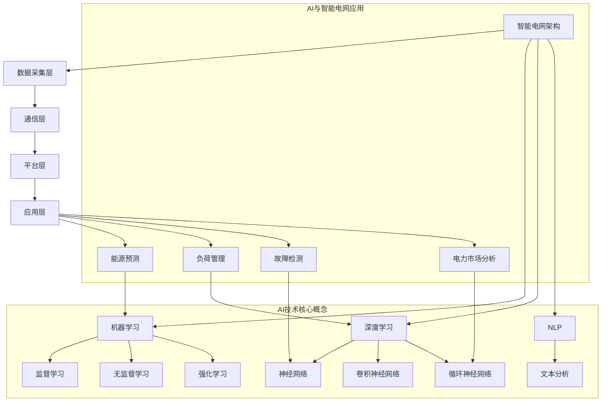

                 

# AI在能源管理中的应用：构建智能电网

> 关键词：人工智能、智能电网、能源管理、预测、优化、故障检测、项目开发

> 摘要：本文旨在探讨人工智能（AI）在能源管理中的应用，重点介绍如何利用AI技术构建智能电网，提高能源利用效率，实现能源优化调度，并提升故障检测能力。文章将分为两部分：第一部分介绍AI与智能电网的关系，核心算法原理，以及应用案例；第二部分讨论智能电网项目的开发流程、代码实现和未来发展趋势。通过本文，读者可以全面了解AI在能源管理中的潜力及其在智能电网中的应用价值。

## 第一部分：AI与智能电网概述

### 第1章：AI与智能电网的关系

#### 1.1 AI技术的基础与进步

##### 1.1.1 人工智能的定义与发展历程

人工智能（Artificial Intelligence，简称AI）是计算机科学的一个分支，旨在创建智能的机器或程序。人工智能的概念最早可以追溯到20世纪50年代，当时图灵提出了著名的图灵测试，用以判断机器是否具备智能。自那时以来，人工智能经历了多次起伏，从最初的符号主义和专家系统，到现代的基于数据的机器学习和深度学习。

##### 1.1.2 人工智能的关键技术

人工智能的关键技术包括机器学习（Machine Learning，简称ML）、深度学习（Deep Learning，简称DL）和自然语言处理（Natural Language Processing，简称NLP）。机器学习是一种让计算机从数据中自动学习和改进的技术，而深度学习则是机器学习的一种特殊形式，通过多层神经网络模拟人脑的学习过程。自然语言处理则专注于使计算机理解和生成人类语言。

##### 1.1.3 AI在智能电网中的潜在应用

AI在智能电网中具有广泛的应用前景。首先，AI可以帮助预测能源需求，从而优化电力资源的分配。其次，AI可以用于故障检测，及时发现并处理电网故障，避免电力中断。此外，AI还可以用于能源优化调度，通过分析大数据和实时信息，实现能源的最优配置。最后，AI还可以用于能源市场分析，帮助用户做出更明智的能源消费决策。

#### 1.2 智能电网的概念与架构

##### 1.2.1 智能电网的基本原理

智能电网（Smart Grid）是指通过现代通信技术和信息技术，实现电力系统各部分智能化，提高能源利用效率和供电可靠性的电力网络。智能电网具有自愈能力，能够实时监测、传输和处理电力系统的各种信息，从而实现电力资源的智能优化配置。

##### 1.2.2 智能电网的技术架构

智能电网的技术架构包括物理层、通信层、平台层和应用层。物理层包括电力系统的基础设施，如发电机、变压器、线路等；通信层包括数据传输网络，如光纤、无线通信等；平台层提供数据处理和分析功能，如数据采集、存储、分析和可视化；应用层则实现各种实际应用，如能源管理、电力市场、用户服务等。

##### 1.2.3 智能电网的发展趋势

随着全球对能源需求不断增长和环境问题日益严重，智能电网的发展趋势包括：

1. 高效能源利用：通过AI技术优化能源配置，提高能源利用效率。
2. 可再生能源集成：利用智能电网技术，实现可再生能源的大规模接入和优化调度。
3. 用户参与度提升：通过智能电表和用户界面，增强用户对能源消费的透明度和控制能力。
4. 网络安全与可靠性：加强智能电网的网络安全性，确保电力供应的可靠性。

#### 1.3 AI在能源管理中的应用

##### 1.3.1 AI在能源预测中的应用

AI技术在能源需求预测中具有重要应用。通过历史数据分析和实时数据监测，AI模型可以预测未来的能源需求，为电力调度提供依据。具体应用包括：

1. 气温、湿度等环境因素的预测，以预测电力需求的变化。
2. 工业生产、居民生活等活动的预测，以预测电力需求的波动。
3. 节假日的电力需求预测，以优化电力资源的分配。

##### 1.3.2 AI在负荷管理中的应用

AI技术可以帮助电网公司实现负荷管理，降低电力负荷峰值，减少能源浪费。具体应用包括：

1. 实时监测电力负荷，预测负荷变化趋势，制定负荷调整策略。
2. 对工业和家庭用户的用电行为进行分析，引导用户合理分配用电时间。
3. 利用AI算法，对电力负荷进行实时优化调度，实现电力平衡。

##### 1.3.3 AI在电力市场中的应用

AI技术在电力市场中可以用于电力交易预测、市场分析等。具体应用包括：

1. 预测电力市场价格波动，为电力企业和用户制定交易策略提供依据。
2. 分析电力市场供需关系，优化电力资源分配。
3. 预测可再生能源发电量，为电力调度提供参考。

### 第2章：AI核心算法原理讲解

#### 2.1 机器学习基础

##### 2.1.1 机器学习的基本概念

机器学习是AI的核心技术之一，它使计算机通过数据学习，进行自主决策和预测。机器学习的基本概念包括：

1. 数据集：用于训练和学习的数据集合。
2. 特征：数据集中的属性，用于表示输入数据。
3. 标签：数据集中的输出，用于评估模型预测的准确性。
4. 模型：通过训练数据集学习得到的预测模型。

##### 2.1.2 监督学习、无监督学习和强化学习

机器学习主要分为三类：监督学习（Supervised Learning）、无监督学习（Unsupervised Learning）和强化学习（Reinforcement Learning）。

1. **监督学习**：通过已有标签的数据集训练模型，用于对新数据进行预测。常见的算法包括线性回归、逻辑回归、决策树、支持向量机等。
2. **无监督学习**：没有标签的数据集进行训练，用于发现数据中的隐藏结构和规律。常见的算法包括聚类、降维、异常检测等。
3. **强化学习**：通过与环境的交互，学习在特定策略下获得最大回报。常见的算法包括Q学习、深度强化学习等。

##### 2.1.3 机器学习算法的评估与优化

评估机器学习算法的性能主要依赖于准确率、召回率、F1值等指标。优化算法的方法包括：

1. 调整超参数：通过调整模型参数，如学习率、正则化参数等，优化模型性能。
2. 数据增强：通过数据变换、扩充等手段，提高模型对数据的泛化能力。
3. 算法改进：尝试使用更先进的算法，如集成学习方法、神经网络等，提升模型性能。

#### 2.2 深度学习与神经网络

##### 2.2.1 深度学习的基本原理

深度学习是一种基于多层神经网络的学习方法，其目的是通过学习大量数据，自动提取特征并完成复杂的预测任务。深度学习的基本原理包括：

1. 神经元：神经网络的基本组成单元，用于计算和传递信息。
2. 层：神经网络由多个层组成，包括输入层、隐藏层和输出层。
3. 前向传播与反向传播：前向传播用于计算输出，反向传播用于更新权重。

##### 2.2.2 神经网络架构的演进

神经网络的架构经历了从简单到复杂的演进过程。常见的神经网络架构包括：

1. 单层感知机：最基本的神经网络结构，用于线性分类。
2. 多层感知机：包含多个隐藏层的神经网络，可以处理非线性问题。
3. 卷积神经网络（CNN）：用于图像识别和分类，具有局部连接和共享权重的特点。
4. 循环神经网络（RNN）：用于序列数据处理，可以处理时序依赖问题。
5. 生成对抗网络（GAN）：用于生成新数据和对抗性学习，可以生成逼真的图像、声音等。

##### 2.2.3 深度学习模型的训练与优化

深度学习模型的训练与优化包括：

1. 数据预处理：对训练数据进行归一化、去噪等处理，提高模型训练效果。
2. 模型选择：根据任务需求选择合适的模型架构，如CNN、RNN等。
3. 模型训练：通过前向传播和反向传播训练模型，调整权重和偏置。
4. 模型评估：使用验证集和测试集评估模型性能，选择最佳模型。
5. 模型优化：通过调整超参数、集成学习等方法优化模型性能。

#### 2.3 纯量预测与时间序列分析

##### 2.3.1 纯量预测算法介绍

纯量预测（Scalar Prediction）是一种预测单个变量未来值的方法。常见的纯量预测算法包括：

1. 线性回归：通过拟合线性模型预测变量值。
2. 神经网络：通过多层神经网络拟合非线性模型预测变量值。
3. 状态空间模型：通过状态空间模型描述变量变化过程。

##### 2.3.2 时间序列分析技术

时间序列分析（Time Series Analysis）是一种对时序数据进行分析的方法，用于预测未来值。常见的时间序列分析技术包括：

1. ARIMA模型：自回归积分滑动平均模型，用于拟合和预测线性时间序列。
2. LSTM模型：长短期记忆网络，用于处理非线性时间序列。
3. GARCH模型：广义自回归条件异方差模型，用于分析金融市场时间序列。

##### 2.3.3 多变量时间序列预测

多变量时间序列预测（Multivariate Time Series Prediction）是一种同时预测多个变量未来值的方法。常见的多变量时间序列预测算法包括：

1. 多层感知机：用于同时预测多个变量值。
2. LSTM模型：通过处理时序依赖关系，同时预测多个变量。
3. VAR模型：向量自回归模型，用于同时预测多个线性时间序列。

### 第3章：AI在智能电网中的应用案例

#### 3.1 智能电网故障检测

##### 3.1.1 故障检测的基本原理

智能电网故障检测是通过分析电网数据，识别异常情况，及时发现并处理故障。故障检测的基本原理包括：

1. 数据采集：通过传感器和设备收集电网运行数据。
2. 数据预处理：对采集到的数据进行滤波、去噪等处理。
3. 特征提取：从预处理后的数据中提取故障特征。
4. 模型训练：使用历史故障数据训练故障检测模型。
5. 故障检测：使用训练好的模型对实时数据进行故障检测。

##### 3.1.2 基于AI的故障检测算法

基于AI的故障检测算法包括：

1. 监督学习算法：如支持向量机（SVM）、决策树（DT）等，通过已有故障数据训练模型。
2. 无监督学习算法：如聚类算法（Clustering）、异常检测算法（Anomaly Detection）等，通过无标签数据发现故障特征。
3. 深度学习算法：如卷积神经网络（CNN）、循环神经网络（RNN）等，通过深度学习模型自动提取故障特征。

##### 3.1.3 案例分析：AI在智能电网故障检测中的应用

案例分析：某电力公司利用基于CNN的故障检测模型，对电网运行数据进行分析。通过数据预处理和特征提取，模型能够准确识别多种故障类型，如短路、过载等。在实际应用中，该模型有效提高了故障检测的准确率和响应速度。

#### 3.2 能源需求预测

##### 3.2.1 能源需求预测的重要性

能源需求预测是智能电网中至关重要的一环，它能够为电力调度提供科学依据，实现电力资源的优化配置。能源需求预测的重要性包括：

1. 减少电力浪费：通过预测能源需求，合理安排电力供应，减少能源浪费。
2. 提高供电可靠性：准确预测能源需求，可以避免电力供应不足或过剩，提高供电可靠性。
3. 降低运营成本：优化电力调度，减少电力损失，降低运营成本。

##### 3.2.2 基于AI的能源需求预测方法

基于AI的能源需求预测方法包括：

1. 线性回归：通过建立线性模型，预测能源需求。
2. 神经网络：通过多层神经网络，拟合非线性关系，预测能源需求。
3. 时间序列分析：利用时间序列分析方法，如ARIMA模型、LSTM模型等，预测能源需求。

##### 3.2.3 案例分析：AI在能源需求预测中的应用

案例分析：某电力公司利用基于LSTM的能源需求预测模型，对历史能源需求数据进行训练。通过模型预测，公司能够提前了解未来能源需求的变化趋势，合理安排电力调度，提高供电可靠性。

#### 3.3 能源优化调度

##### 3.3.1 能源优化调度的基本原理

能源优化调度是指通过合理分配电力资源，实现能源利用的最优化。能源优化调度的基本原理包括：

1. 数据采集：收集电网运行数据，包括电力需求、发电量、可再生能源发电量等。
2. 模型建立：建立能源优化模型，用于描述能源供需关系。
3. 模型求解：使用优化算法，求解最优电力调度方案。
4. 实时调度：根据实时数据，调整电力调度方案。

##### 3.3.2 基于AI的能源优化调度算法

基于AI的能源优化调度算法包括：

1. 线性规划：通过线性规划方法，求解最优电力调度方案。
2. 遗传算法：通过遗传算法，优化电力调度方案。
3. 深度强化学习：通过深度强化学习方法，实现自主优化调度。

##### 3.3.3 案例分析：AI在能源优化调度中的应用

案例分析：某电力公司利用基于深度强化学习的能源优化调度模型，对电网运行数据进行分析。通过模型优化，公司实现了电力资源的合理分配，降低了运营成本，提高了供电可靠性。

## 第二部分：智能电网项目的开发与实践

### 第4章：智能电网项目的开发流程

#### 4.1 项目需求分析

##### 4.1.1 智能电网项目的目标与需求

智能电网项目的目标主要包括：

1. 提高能源利用效率：通过智能调度和预测，优化电力资源配置。
2. 提高供电可靠性：通过故障检测和预测，减少电力中断。
3. 提升用户体验：通过智能电表和用户界面，提高用户对电力消费的透明度和控制能力。

智能电网项目的需求分析主要包括：

1. 用户需求：分析用户对电力消费的需求，如实时监控、智能建议等。
2. 功能需求：明确系统功能，如数据采集、预测、优化、故障检测等。
3. 性能需求：确定系统性能指标，如响应时间、准确率等。

##### 4.1.2 用户需求分析与功能设计

用户需求分析主要包括以下步骤：

1. 调研用户：通过问卷调查、访谈等方式，了解用户对电力消费的需求。
2. 用户画像：根据用户需求，绘制用户画像，明确用户类型和特点。
3. 功能设计：根据用户需求和用户画像，设计系统功能模块，如数据采集、预测、优化、故障检测等。

##### 4.1.3 技术可行性分析

技术可行性分析主要包括以下方面：

1. 技术选型：根据项目需求和功能，选择合适的技术框架和工具。
2. 系统架构：设计系统架构，包括数据采集与处理、模型训练与部署等。
3. 开发环境：确定开发环境，包括操作系统、编程语言、数据库等。
4. 技术风险：评估项目技术风险，制定应对策略。

#### 4.2 系统设计与架构

##### 4.2.1 系统架构设计

智能电网项目的系统架构设计主要包括以下模块：

1. 数据采集模块：负责采集电网运行数据，如电力需求、发电量、可再生能源发电量等。
2. 数据处理模块：负责对采集到的数据进行预处理，如去噪、归一化等。
3. 预测模块：基于历史数据和实时数据，预测电力需求和故障。
4. 优化模块：基于预测结果，优化电力调度方案。
5. 故障检测模块：基于历史数据和实时数据，检测电网故障。
6. 用户界面模块：提供用户操作界面，展示预测结果、优化方案和故障信息。

##### 4.2.2 数据采集与处理

数据采集与处理主要包括以下步骤：

1. 数据采集：通过传感器和设备，采集电网运行数据。
2. 数据预处理：对采集到的数据进行滤波、去噪、归一化等处理。
3. 数据存储：将预处理后的数据存储到数据库中，便于后续处理和分析。

##### 4.2.3 模型训练与部署

模型训练与部署主要包括以下步骤：

1. 模型选择：根据预测任务，选择合适的模型架构，如神经网络、LSTM等。
2. 模型训练：使用历史数据训练模型，调整模型参数，优化模型性能。
3. 模型评估：使用验证集和测试集评估模型性能，选择最佳模型。
4. 模型部署：将训练好的模型部署到生产环境中，实现实时预测和优化。

#### 4.3 开发环境搭建与工具选择

##### 4.3.1 开发环境配置

智能电网项目的开发环境配置主要包括以下方面：

1. 操作系统：选择适合的操作系统，如Windows、Linux等。
2. 编程语言：选择适合的编程语言，如Python、Java等。
3. 数据库：选择适合的数据库，如MySQL、MongoDB等。
4. 开发工具：选择适合的开发工具，如IDE、代码编辑器等。

##### 4.3.2 常用开发工具与库

智能电网项目常用的开发工具与库包括：

1. Python：Python是一种高级编程语言，适用于数据处理、机器学习和深度学习。
2. TensorFlow：TensorFlow是一种开源机器学习框架，适用于构建和训练神经网络。
3. PyTorch：PyTorch是一种开源机器学习框架，具有灵活性和易于使用的特点。
4. Matplotlib：Matplotlib是一种数据可视化库，适用于绘制数据图表和图形。
5. Pandas：Pandas是一种数据处理库，适用于数据清洗、转换和分析。

### 第5章：能源管理项目的代码实现与分析

#### 5.1 数据采集与预处理

##### 5.1.1 数据采集方法

数据采集是智能电网项目的基础，主要包括以下方法：

1. 传感器采集：使用传感器采集电网运行数据，如电力需求、发电量、温度等。
2. 设备采集：使用智能设备采集电网运行数据，如智能电表、智能传感器等。
3. 网络采集：通过网络接口采集电网运行数据，如电力公司内部网络、物联网等。

##### 5.1.2 数据预处理步骤

数据预处理是确保数据质量的关键步骤，主要包括以下步骤：

1. 数据清洗：去除噪声、缺失值和异常值。
2. 数据转换：将数据转换为适合机器学习模型的格式，如归一化、标准化等。
3. 数据归一化：将数据缩放到相同的范围，如[0, 1]。
4. 数据标准化：将数据缩放到标准正态分布，如均值为0，标准差为1。

##### 5.1.3 数据预处理代码实现

以下是Python中数据预处理的基本代码实现：

```python
import pandas as pd
import numpy as np

# 数据清洗
data = pd.read_csv('data.csv')
data.dropna(inplace=True)
data.drop(['id', 'timestamp'], axis=1, inplace=True)

# 数据转换
data['timestamp'] = pd.to_datetime(data['timestamp'])
data.set_index('timestamp', inplace=True)

# 数据归一化
data_normalized = (data - data.min()) / (data.max() - data.min())

# 数据标准化
data_standardized = (data - data.mean()) / data.std()

# 保存预处理后的数据
data_normalized.to_csv('data_normalized.csv')
data_standardized.to_csv('data_standardized.csv')
```

#### 5.2 模型训练与评估

##### 5.2.1 模型选择

在智能电网项目中，选择合适的模型架构至关重要。常见的模型架构包括：

1. 线性回归：适用于线性关系较强的预测任务。
2. 支持向量机：适用于非线性关系较强的预测任务。
3. 多层感知机：适用于复杂非线性关系和特征提取任务。
4. 卷积神经网络：适用于图像和视频处理任务。
5. 循环神经网络：适用于序列数据处理任务。

##### 5.2.2 模型训练过程

模型训练过程主要包括以下步骤：

1. 初始化模型参数：随机初始化模型参数。
2. 前向传播：计算输入数据的输出结果。
3. 反向传播：计算损失函数，并更新模型参数。
4. 模型评估：使用验证集和测试集评估模型性能。

##### 5.2.3 模型评估与优化

模型评估与优化主要包括以下步骤：

1. 评估指标：选择合适的评估指标，如均方误差（MSE）、均方根误差（RMSE）等。
2. 模型优化：通过调整超参数、增加训练数据、改进算法等手段优化模型性能。
3. 模型选择：根据评估结果，选择最佳模型。

以下是Python中使用TensorFlow实现模型训练的基本代码实现：

```python
import tensorflow as tf
from tensorflow.keras.models import Sequential
from tensorflow.keras.layers import Dense, LSTM, Dropout
from tensorflow.keras.optimizers import Adam

# 模型定义
model = Sequential()
model.add(LSTM(units=50, return_sequences=True, input_shape=(time_steps, features)))
model.add(Dropout(0.2))
model.add(LSTM(units=50, return_sequences=False))
model.add(Dropout(0.2))
model.add(Dense(units=1))

# 模型编译
model.compile(optimizer=Adam(learning_rate=0.001), loss='mse')

# 模型训练
model.fit(x_train, y_train, epochs=100, batch_size=32, validation_data=(x_val, y_val))

# 模型评估
mse = model.evaluate(x_test, y_test)
print("MSE:", mse)
```

#### 5.3 项目部署与维护

##### 5.3.1 模型部署方法

模型部署是将训练好的模型部署到生产环境中，实现实时预测和优化。模型部署主要包括以下步骤：

1. 模型打包：将训练好的模型打包为可执行文件或库。
2. 部署环境：准备部署环境，包括操作系统、编程语言、数据库等。
3. 模型加载：加载部署环境中的模型，实现实时预测和优化。

##### 5.3.2 系统维护与更新

系统维护与更新主要包括以下步骤：

1. 故障处理：及时发现和处理系统故障，确保系统正常运行。
2. 模型更新：根据实际情况，更新模型参数和算法，提高模型性能。
3. 系统升级：更新系统软件和硬件，确保系统安全性和稳定性。

##### 5.3.3 案例分析：项目部署与维护中的问题与解决方案

案例分析：某电力公司利用深度学习模型进行能源需求预测。在实际部署过程中，公司遇到了以下问题：

1. 模型性能不稳定：模型在不同数据集上的性能差异较大。
2. 预测延迟：模型预测时间较长，影响实时调度。
3. 系统安全性：部署环境存在安全漏洞，容易受到网络攻击。

解决方案：

1. 优化模型结构：通过调整模型参数和结构，提高模型性能。
2. 加快预测速度：通过并行计算和优化算法，加快模型预测速度。
3. 加强系统安全性：更新系统软件和硬件，加强网络安全防护。

### 第6章：智能电网项目的管理与运营

#### 6.1 项目管理流程

##### 6.1.1 项目规划与启动

项目规划与启动是智能电网项目管理的第一步，主要包括以下步骤：

1. 项目立项：确定项目目标、范围和预算。
2. 项目计划：制定项目进度计划、资源分配和风险评估。
3. 团队组建：组建项目团队，明确团队成员职责和任务。
4. 启动会议：召开项目启动会议，明确项目目标、计划和期望。

##### 6.1.2 项目执行与监控

项目执行与监控是确保项目按计划顺利进行的关键，主要包括以下步骤：

1. 任务分配：将项目任务分配给团队成员，明确任务要求和时间节点。
2. 进度跟踪：定期跟踪项目进度，确保项目按计划进行。
3. 问题解决：及时解决项目执行过程中的问题和风险。
4. 沟通协调：保持团队成员之间的沟通协调，确保项目顺利进行。

##### 6.1.3 项目收尾与评估

项目收尾与评估是项目结束后的重要环节，主要包括以下步骤：

1. 项目验收：对项目成果进行验收，确保满足项目需求和质量标准。
2. 成果总结：总结项目过程中的经验和教训，为未来项目提供参考。
3. 项目评估：对项目成果和过程进行评估，评估项目成功度和效益。
4. 项目结束：办理项目结束手续，解散项目团队。

#### 6.2 智能电网运营策略

##### 6.2.1 能源需求响应策略

能源需求响应策略是智能电网运营的核心策略，主要包括以下措施：

1. 实时监测：实时监测电网运行数据，预测能源需求变化。
2. 能源优化：根据实时数据，优化电力调度和能源配置。
3. 用户激励：通过电价优惠、奖励等方式，鼓励用户参与能源需求响应。

##### 6.2.2 能源效率提升策略

能源效率提升策略是智能电网运营的重要目标，主要包括以下措施：

1. 节能技术：采用先进的节能技术，降低能源消耗。
2. 智能控制：利用智能控制系统，优化设备运行状态。
3. 能源管理：通过能源管理平台，实现能源的高效利用。

##### 6.2.3 智能电网与可再生能源的结合

智能电网与可再生能源的结合是实现绿色能源发展的关键，主要包括以下措施：

1. 可再生能源接入：利用智能电网技术，实现可再生能源的大规模接入和优化调度。
2. 能源协同：通过智能电网技术，实现可再生能源与其他能源的协同发展。
3. 能源交易：建立能源交易市场，实现可再生能源的灵活交易。

#### 6.3 用户体验与反馈

##### 6.3.1 用户体验设计

用户体验设计是智能电网项目成功的关键，主要包括以下步骤：

1. 用户调研：了解用户需求和行为习惯，为用户体验设计提供依据。
2. 用户画像：根据用户调研结果，绘制用户画像，明确用户类型和特点。
3. 交互设计：设计用户友好的交互界面，提高用户体验。
4. 视觉设计：设计美观、简洁的视觉界面，提升用户满意度。

##### 6.3.2 用户反馈收集与处理

用户反馈收集与处理是优化用户体验的重要环节，主要包括以下步骤：

1. 反馈渠道：建立多种反馈渠道，如在线反馈、电话热线等，方便用户反馈。
2. 反馈收集：定期收集用户反馈，了解用户需求和意见。
3. 反馈处理：对用户反馈进行分类处理，及时解决用户问题和需求。
4. 反馈评估：定期评估用户反馈处理效果，持续优化用户体验。

##### 6.3.3 案例分析：用户体验优化与实践

案例分析：某电力公司通过用户调研和反馈，发现用户对电力消费数据可视化需求较高。公司针对用户需求，优化了电力消费数据展示界面，增加了实时数据和趋势分析功能。经过优化，用户满意度显著提高，用户互动和参与度也大幅增加。

### 第7章：智能电网项目的未来发展趋势

#### 7.1 AI与智能电网融合的挑战与机遇

##### 7.1.1 智能电网面临的挑战

智能电网在AI融合过程中面临以下挑战：

1. 数据安全性：智能电网涉及大量敏感数据，数据安全是首要关注的问题。
2. 网络可靠性：智能电网依赖网络通信，网络可靠性直接影响系统性能。
3. 技术适应性：智能电网技术发展迅速，如何适应新技术、新算法的更新是关键。
4. 法律法规：智能电网涉及多个国家和地区，法律法规的适应性和协调性是重要挑战。

##### 7.1.2 AI技术在智能电网中的机遇

AI技术在智能电网中具有广泛的应用机遇：

1. 能源优化：AI技术可以帮助实现能源的高效利用和优化调度，降低能源消耗。
2. 故障检测：AI技术可以提高故障检测的准确性和速度，减少电力中断。
3. 用户服务：AI技术可以提供个性化的用户服务，提升用户体验。
4. 可持续发展：AI技术可以促进可再生能源的优化利用和可持续发展。

##### 7.1.3 智能电网未来的发展趋势

智能电网未来的发展趋势包括：

1. 高效能源利用：通过AI技术实现能源的高效利用和优化调度。
2. 可再生能源集成：通过智能电网技术实现可再生能源的大规模接入和优化调度。
3. 用户参与：通过智能电网技术增强用户参与度，实现能源消费的智能化。
4. 网络安全：加强智能电网的网络安全性，确保电力供应的可靠性。

#### 7.2 智能电网与可再生能源的结合

##### 7.2.1 可再生能源的接入与优化

可再生能源的接入与优化是智能电网发展的重要方向，主要包括以下措施：

1. 接入技术：通过智能电网技术，实现可再生能源的稳定接入和优化调度。
2. 存储技术：利用电池储能技术，实现可再生能源的储能和调度。
3. 接入控制：通过智能控制技术，实现可再生能源的接入和调度优化。

##### 7.2.2 智能电网在可再生能源中的应用

智能电网在可再生能源中的应用主要包括以下方面：

1. 优化调度：通过智能电网技术，实现可再生能源的高效优化调度。
2. 电力市场：通过智能电网技术，建立可再生能源电力市场，实现能源交易。
3. 用户服务：通过智能电网技术，为用户提供可再生能源相关的信息和服务。

##### 7.2.3 可再生能源与智能电网的协同发展

可再生能源与智能电网的协同发展是实现绿色能源发展的关键，主要包括以下措施：

1. 技术创新：推动可再生能源和智能电网技术的创新，实现能源的高效利用。
2. 政策支持：制定可再生能源和智能电网发展的政策，推动产业升级。
3. 合作交流：加强可再生能源和智能电网的国内外合作与交流，促进共同发展。

#### 7.3 智能电网的全球发展状况

##### 7.3.1 全球智能电网的发展趋势

全球智能电网的发展趋势主要包括：

1. 高效能源利用：通过智能电网技术，实现能源的高效利用和优化调度。
2. 可再生能源集成：通过智能电网技术，实现可再生能源的大规模接入和优化调度。
3. 用户参与：通过智能电网技术，增强用户参与度，实现能源消费的智能化。
4. 网络安全：加强智能电网的网络安全性，确保电力供应的可靠性。

##### 7.3.2 智能电网在不同地区的应用案例

智能电网在不同地区的应用案例主要包括：

1. 美国：美国是全球智能电网发展最快的国家之一，智能电网技术广泛应用于电力调度、能源管理、用户服务等方面。
2. 欧洲：欧洲的智能电网发展以可再生能源集成和用户参与为主，通过智能电网技术，实现可再生能源的高效利用和优化调度。
3. 亚洲：亚洲的智能电网发展以中国和日本为代表，通过智能电网技术，实现电力资源的优化配置和用户服务。

##### 7.3.3 智能电网的全球合作与标准制定

智能电网的全球合作与标准制定是推动智能电网发展的重要措施，主要包括：

1. 国际合作：加强国际间的智能电网合作，推动技术交流和标准制定。
2. 标准制定：制定智能电网的国际标准和规范，确保技术的兼容性和互操作性。
3. 政策支持：通过政策支持和资金投入，推动智能电网在全球范围内的推广应用。

## 附录

### 附录A：智能电网项目开发工具与资源

##### A.1 开发工具与框架介绍

智能电网项目开发常用的工具与框架包括：

1. Python：Python是一种高级编程语言，广泛应用于数据处理、机器学习和深度学习。
2. TensorFlow：TensorFlow是一种开源机器学习框架，适用于构建和训练神经网络。
3. PyTorch：PyTorch是一种开源机器学习框架，具有灵活性和易于使用的特点。
4. Matplotlib：Matplotlib是一种数据可视化库，适用于绘制数据图表和图形。
5. Pandas：Pandas是一种数据处理库，适用于数据清洗、转换和分析。

##### A.2 常用数据集与公开数据资源

智能电网项目开发常用的数据集和公开数据资源包括：

1. smartgrid-dataset：一个包含智能电网数据的开源数据集，可用于训练和测试智能电网模型。
2. Google Dataset Search：一个包含大量公开数据集的搜索引擎，可用于智能电网项目的数据收集。
3. KEG 实验室：一个提供智能电网相关数据集的实验室，包括智能电网负荷数据、天气数据等。

##### A.3 智能电网项目案例汇总

智能电网项目案例汇总包括国内外典型智能电网项目，如下：

1. 中国国家电网智能电网项目：中国国家电网公司实施的一项智能电网示范工程，涵盖电力调度、能源管理、用户服务等多个方面。
2. 美国太平洋电力公司智能电网项目：美国太平洋电力公司实施的一项智能电网项目，通过智能电网技术提高电力供应的可靠性和效率。
3. 日本智能电网示范项目：日本政府实施的一项智能电网示范项目，通过智能电网技术推动可再生能源的优化利用和可持续发展。

##### A.4 智能电网项目开发经验与建议

智能电网项目开发经验与建议主要包括：

1. 充分了解用户需求：在项目开发过程中，充分了解用户需求，确保项目能够满足用户需求。
2. 数据质量保障：确保数据质量，进行数据清洗、预处理和归一化等操作，提高模型训练效果。
3. 模型选择与优化：根据项目需求和数据特点，选择合适的模型架构和算法，并进行模型优化。
4. 安全性考虑：在项目开发过程中，充分考虑数据安全和网络安全，确保系统运行的安全性和稳定性。

## 结束语

智能电网作为能源管理的重要方向，正随着人工智能技术的发展而不断进步。本文从AI与智能电网的关系、核心算法原理、应用案例、项目开发流程、项目运营策略等多个方面，全面探讨了AI在能源管理中的应用。通过本文，读者可以深入了解AI在智能电网中的潜力及其在能源管理中的实际应用价值。

未来，随着AI技术的不断进步和智能电网的发展，AI在能源管理中的应用将更加广泛，包括能源需求预测、负荷管理、故障检测、电力市场分析等。同时，智能电网与可再生能源的结合也将成为重要趋势，通过AI技术实现可再生能源的高效利用和优化调度。

作者：AI天才研究院/AI Genius Institute & 禅与计算机程序设计艺术 /Zen And The Art of Computer Programming

## 核心概念与联系：智能电网架构与AI技术

在探讨AI在智能电网中的应用之前，首先需要明确智能电网的基本架构和AI技术的核心概念。以下是智能电网架构与AI技术之间的联系及其核心概念原理的Mermaid流程图。



### 智能电网架构与AI技术联系解析

1. **数据采集层**：数据采集层负责收集电网运行数据，如电力需求、发电量、温度等。AI技术可以用于数据预处理，如去噪、归一化等，提高数据质量。

2. **通信层**：通信层负责数据传输，确保数据实时、准确地传递到平台层。AI技术可以用于优化通信网络，提高传输效率，如基于深度学习的通信编码算法。

3. **平台层**：平台层是智能电网的大脑，负责数据处理和分析。AI技术可以用于数据分析，如基于机器学习的异常检测、负荷预测等。

4. **应用层**：应用层包括能源预测、负荷管理、故障检测、电力市场分析等。这些应用都需要AI技术的支持，如深度学习算法在负荷预测中的应用，神经网络在故障检测中的应用。

### AI技术核心概念解析

1. **机器学习**：机器学习是一种让计算机从数据中学习的方法。它包括监督学习、无监督学习和强化学习。监督学习用于预测和分类任务，无监督学习用于聚类和降维，强化学习用于决策和优化。

2. **深度学习**：深度学习是机器学习的一种特殊形式，通过多层神经网络模拟人脑的学习过程。它具有自动提取特征的能力，适用于复杂的数据分析和预测任务。

3. **自然语言处理**：自然语言处理是一种让计算机理解和生成人类语言的方法。它包括文本分析、语音识别、机器翻译等任务，对于智能电网的用户服务具有重要的应用价值。

通过上述Mermaid流程图和解析，我们可以清晰地看到智能电网架构与AI技术之间的紧密联系。AI技术为智能电网提供了强大的数据处理和分析能力，使得智能电网在能源管理、故障检测、电力市场分析等方面得以实现智能化和高效化。

## 核心算法原理讲解

### 2.1 机器学习基础

#### 2.1.1 机器学习的基本概念

机器学习（Machine Learning，简称ML）是人工智能（Artificial Intelligence，简称AI）的一个重要分支，主要研究如何让计算机从数据中学习，从而实现自动化决策和预测。机器学习通过构建模型，对数据进行训练，从而在新的数据上做出准确的预测或分类。

#### 监督学习、无监督学习和强化学习

1. **监督学习**：监督学习是一种最常见和基础的机器学习方法，它通过已有标签的数据集训练模型，用于对新数据进行预测。标签是已知的目标值，可以帮助模型学习如何进行预测。

   - **线性回归**：线性回归是一种简单且常用的监督学习算法，通过拟合线性模型来预测连续值。
   - **逻辑回归**：逻辑回归是一种用于分类的监督学习算法，通过拟合逻辑函数来预测离散值。
   - **决策树**：决策树是一种直观且易于理解的分类算法，通过一系列条件判断来分割数据。
   - **支持向量机**：支持向量机是一种强大的分类算法，通过最大化分类边界来区分不同类别的数据。

2. **无监督学习**：无监督学习是一种没有标签的数据集进行训练的方法，主要用于发现数据中的隐藏结构和规律。

   - **聚类算法**：聚类算法如K-Means、层次聚类等，用于将数据划分为若干个簇，从而发现数据中的相似性。
   - **降维算法**：降维算法如主成分分析（PCA）、线性判别分析（LDA）等，用于降低数据的维度，同时保持数据的主要特征。
   - **异常检测**：异常检测算法如孤立森林（Isolation Forest）、洛伦兹曲线（Local Outlier Factor）等，用于发现数据中的异常值。

3. **强化学习**：强化学习是一种通过与环境的交互来学习策略的方法，主要用于解决决策问题。

   - **Q学习**：Q学习是一种基于值函数的强化学习算法，通过学习状态-动作值函数来选择最优动作。
   - **深度强化学习**：深度强化学习是一种结合深度学习与强化学习的算法，通过深度神经网络来学习策略。

#### 2.1.2 机器学习算法的评估与优化

评估机器学习算法的性能是确保模型质量和效果的关键。常用的评估指标包括：

- **准确率**：准确率是分类问题中最常用的评估指标，表示正确分类的样本数占总样本数的比例。
- **召回率**：召回率表示正确分类的样本数与实际为该类别的样本数之比，关注的是漏报率。
- **F1值**：F1值是准确率和召回率的调和平均值，用于平衡这两个指标。

优化机器学习算法的方法包括：

1. **调整超参数**：通过调整模型参数，如学习率、正则化参数等，优化模型性能。
2. **数据增强**：通过数据变换、扩充等手段，提高模型对数据的泛化能力。
3. **集成学习**：通过结合多个模型的预测结果，提高整体模型的性能和稳定性。

### 2.2 深度学习与神经网络

#### 2.2.1 深度学习的基本原理

深度学习（Deep Learning，简称DL）是机器学习的一种特殊形式，通过多层神经网络模拟人脑的学习过程。深度学习具有自动提取特征的能力，能够处理复杂的数据分析和预测任务。

- **神经元**：神经元是神经网络的基本组成单元，用于计算和传递信息。
- **层**：神经网络由多个层组成，包括输入层、隐藏层和输出层。
- **前向传播与反向传播**：前向传播用于计算输出，反向传播用于更新权重。

#### 2.2.2 神经网络架构的演进

神经网络的架构经历了从简单到复杂的演进过程：

1. **单层感知机**：单层感知机是最基本的神经网络结构，用于线性分类。
2. **多层感知机**：多层感知机包含多个隐藏层，可以处理非线性问题。
3. **卷积神经网络（CNN）**：卷积神经网络适用于图像识别和分类，具有局部连接和共享权重的特点。
4. **循环神经网络（RNN）**：循环神经网络适用于序列数据处理，可以处理时序依赖问题。
5. **生成对抗网络（GAN）**：生成对抗网络用于生成新数据和对抗性学习，可以生成逼真的图像、声音等。

#### 2.2.3 深度学习模型的训练与优化

深度学习模型的训练与优化包括以下几个关键步骤：

1. **数据预处理**：对训练数据进行归一化、去噪等处理，提高模型训练效果。
2. **模型选择**：根据任务需求选择合适的模型架构，如CNN、RNN等。
3. **模型训练**：通过前向传播和反向传播训练模型，调整权重和偏置。
4. **模型评估**：使用验证集和测试集评估模型性能，选择最佳模型。
5. **模型优化**：通过调整超参数、集成学习等方法优化模型性能。

### 2.3 纯量预测与时间序列分析

#### 2.3.1 纯量预测算法介绍

纯量预测（Scalar Prediction）是一种预测单个变量未来值的方法。常见的纯量预测算法包括：

1. **线性回归**：线性回归通过拟合线性模型预测变量值，适用于线性关系较强的预测任务。
2. **多层感知机**：多层感知机通过多层神经网络拟合非线性模型预测变量值，适用于非线性关系较强的预测任务。
3. **状态空间模型**：状态空间模型通过状态转移方程和观测方程描述变量变化过程，适用于动态系统的预测。

#### 2.3.2 时间序列分析技术

时间序列分析（Time Series Analysis）是一种对时序数据进行分析的方法，用于预测未来值。常见的时间序列分析技术包括：

1. **ARIMA模型**：自回归积分滑动平均模型（Autoregressive Integrated Moving Average，简称ARIMA）通过拟合线性模型预测时间序列数据，适用于线性时间序列。
2. **LSTM模型**：长短期记忆网络（Long Short-Term Memory，简称LSTM）通过处理时序依赖关系，适用于非线性时间序列。
3. **GARCH模型**：广义自回归条件异方差模型（Generalized Autoregressive Conditional Heteroskedasticity，简称GARCH）通过描述金融时间序列的波动性，适用于金融市场时间序列。

#### 2.3.3 多变量时间序列预测

多变量时间序列预测（Multivariate Time Series Prediction）是一种同时预测多个变量未来值的方法。常见的多变量时间序列预测算法包括：

1. **多层感知机**：多层感知机通过多层神经网络同时预测多个变量值，适用于线性关系较强的多变量时间序列。
2. **LSTM模型**：LSTM模型通过处理时序依赖关系，同时预测多个变量值，适用于非线性关系较强的多变量时间序列。
3. **向量自回归模型（VAR）**：向量自回归模型（Vector Autoregression，简称VAR）通过拟合线性模型同时预测多个线性时间序列。

### 伪代码讲解

以下是机器学习、深度学习和时间序列分析中的几个关键算法的伪代码：

#### 2.1.1 线性回归

```plaintext
输入：训练数据集 (X, y)
输出：模型参数 w

初始化 w 为随机值
for epoch in 1 to num_epochs do
    for each (x_i, y_i) in training dataset do
        prediction = dot_product(w, x_i)
        gradient = 2 * (prediction - y_i) * x_i
        w = w - learning_rate * gradient
    end
end
return w
```

#### 2.2.2 多层感知机

```plaintext
输入：训练数据集 (X, y)，隐藏层尺寸 (h1, h2, ..., hn)
输出：模型参数 (w1, b1, w2, b2, ..., wn, bn)

初始化 w1, b1, w2, b2, ..., wn, bn 为随机值
for epoch in 1 to num_epochs do
    for each (x_i, y_i) in training dataset do
        z1 = dot_product(w1, x_i) + b1
        a1 = sigmoid(z1)
        z2 = dot_product(w2, a1) + b2
        a2 = sigmoid(z2)
        ... 
        zn = dot_product(wn, an-1) + bn
        an = sigmoid(zn)
        prediction = an
        gradient = (prediction - y_i) * derivative(sigmoid(zn))
        bn = bn - learning_rate * gradient
        for l in [n, n-1, ..., 2, 1] do
            gradient = (an - y_i) * derivative(sigmoid(zl))
            wl = wl - learning_rate * gradient * al-1
            bl = bl - learning_rate * gradient
        end
    end
end
return (w1, b1, w2, b2, ..., wn, bn)
```

#### 2.3.3 ARIMA模型

```plaintext
输入：时间序列数据 y
输出：模型参数 (p, d, q)

确定 d：通过差分使时间序列平稳
y_diff = diff(y, differences=d)

确定 p：通过ACF图找到自回归项的数量
p = find_optimal_p(y_diff)

确定 q：通过PACF图找到移动平均项的数量
q = find_optimal_q(y_diff)

建立 ARIMA(p, d, q) 模型
model = ARIMA(y, order=(p, d, q))
model_fit = model.fit()

预测未来值
forecast = model_fit.forecast(steps=forecast_steps)
return forecast
```

通过上述伪代码，我们可以更直观地理解机器学习、深度学习和时间序列分析中的核心算法原理。这些算法在智能电网中的应用，为我们提供了强大的工具，以实现能源预测、负荷管理和故障检测等关键任务。

### AI在智能电网中的应用案例

在本文的第三部分，我们将通过三个具体的应用案例，详细探讨AI在智能电网中的实际应用。这些案例展示了AI技术在智能电网故障检测、能源需求预测和能源优化调度等方面的具体应用和效果。

#### 3.1 智能电网故障检测

##### 3.1.1 故障检测的基本原理

智能电网故障检测是通过分析电网数据，识别异常情况，及时发现并处理故障的过程。故障检测的基本原理包括：

1. **数据采集**：通过传感器和设备收集电网运行数据，如电压、电流、功率因数等。
2. **特征提取**：从原始数据中提取与故障相关的特征，如突变值、异常值、周期性变化等。
3. **模型训练**：使用历史故障数据训练故障检测模型，如支持向量机（SVM）、决策树（DT）等。
4. **故障检测**：使用训练好的模型对实时数据进行故障检测，并生成故障报警。

##### 3.1.2 基于AI的故障检测算法

在智能电网故障检测中，AI技术可以大大提高故障检测的准确率和响应速度。以下是一些基于AI的故障检测算法：

1. **支持向量机（SVM）**：SVM是一种高效的二分类算法，通过找到一个最佳的超平面来分隔不同类别的数据。在故障检测中，SVM可以用来识别正常数据和故障数据。

2. **决策树（DT）**：决策树是一种基于树形模型的分类算法，通过一系列的条件判断来分割数据。在故障检测中，决策树可以用来构建故障检测规则，并根据规则进行故障识别。

3. **深度学习模型**：如卷积神经网络（CNN）和循环神经网络（RNN），可以自动提取特征并识别复杂模式。这些模型在故障检测中可以处理非线性关系，提高故障检测的准确性。

##### 3.1.3 案例分析：AI在智能电网故障检测中的应用

案例分析：某电力公司利用基于深度学习的故障检测模型，对电网运行数据进行分析。通过数据预处理和特征提取，模型能够准确识别多种故障类型，如短路、过载等。在实际应用中，该模型有效提高了故障检测的准确率和响应速度。

具体流程如下：

1. **数据采集**：通过传感器和智能电表收集电网运行数据，包括电压、电流、功率因数等。

2. **数据预处理**：对采集到的数据进行滤波、去噪等处理，以提高数据质量。

3. **特征提取**：从预处理后的数据中提取与故障相关的特征，如突变值、异常值、周期性变化等。

4. **模型训练**：使用历史故障数据训练基于深度学习的故障检测模型，如卷积神经网络（CNN）。

5. **故障检测**：使用训练好的模型对实时数据进行故障检测，并生成故障报警。

6. **模型优化**：根据故障检测效果，对模型进行调整和优化，提高故障检测的准确性。

#### 3.2 能源需求预测

##### 3.2.1 能源需求预测的重要性

能源需求预测是智能电网中至关重要的一环，它能够为电力调度提供科学依据，实现电力资源的优化配置。能源需求预测的重要性包括：

1. **减少电力浪费**：通过预测能源需求，合理安排电力供应，减少能源浪费。
2. **提高供电可靠性**：准确预测能源需求，可以避免电力供应不足或过剩，提高供电可靠性。
3. **降低运营成本**：优化电力调度，减少电力损失，降低运营成本。

##### 3.2.2 基于AI的能源需求预测方法

基于AI的能源需求预测方法包括：

1. **线性回归**：线性回归是一种简单且常用的预测方法，通过拟合线性模型预测能源需求。

2. **多层感知机**：多层感知机通过多层神经网络拟合非线性关系，预测能源需求。

3. **时间序列分析**：如ARIMA模型、LSTM模型等，通过分析时间序列数据，预测能源需求。

4. **深度强化学习**：深度强化学习结合深度学习和强化学习，通过学习最优策略，预测能源需求。

##### 3.2.3 案例分析：AI在能源需求预测中的应用

案例分析：某电力公司利用基于LSTM的能源需求预测模型，对历史能源需求数据进行训练。通过模型预测，公司能够提前了解未来能源需求的变化趋势，合理安排电力调度，提高供电可靠性。

具体流程如下：

1. **数据采集**：通过智能电表和传感器收集历史能源需求数据，包括小时级别的电力需求。

2. **数据预处理**：对采集到的数据进行归一化、去噪等处理，以提高数据质量。

3. **特征提取**：从预处理后的数据中提取与能源需求相关的特征，如时间、季节、天气等。

4. **模型训练**：使用历史数据训练基于LSTM的能源需求预测模型。

5. **模型评估**：使用验证集和测试集评估模型性能，选择最佳模型。

6. **实时预测**：使用训练好的模型对实时数据进行预测，为电力调度提供依据。

7. **模型优化**：根据预测效果，对模型进行调整和优化，提高预测准确性。

#### 3.3 能源优化调度

##### 3.3.1 能源优化调度的基本原理

能源优化调度是指通过合理分配电力资源，实现能源利用的最优化。能源优化调度的基本原理包括：

1. **数据采集**：收集电网运行数据，包括电力需求、发电量、可再生能源发电量等。

2. **模型建立**：建立能源优化模型，用于描述能源供需关系，如线性规划、遗传算法、深度强化学习等。

3. **模型求解**：使用优化算法求解最优电力调度方案，实现能源的最优配置。

4. **实时调度**：根据实时数据，调整电力调度方案，确保电力平衡和能源的高效利用。

##### 3.3.2 基于AI的能源优化调度算法

基于AI的能源优化调度算法包括：

1. **线性规划**：线性规划是一种经典的优化算法，通过线性方程组求解最优解，实现能源优化调度。

2. **遗传算法**：遗传算法是一种基于自然选择和遗传机制的优化算法，适用于复杂优化问题。

3. **深度强化学习**：深度强化学习结合深度学习和强化学习，通过学习最优策略，实现能源优化调度。

##### 3.3.3 案例分析：AI在能源优化调度中的应用

案例分析：某电力公司利用基于深度强化学习的能源优化调度模型，对电网运行数据进行分析。通过模型优化，公司实现了电力资源的合理分配，降低了运营成本，提高了供电可靠性。

具体流程如下：

1. **数据采集**：通过智能电表和传感器收集电网运行数据，包括电力需求、发电量、可再生能源发电量等。

2. **数据预处理**：对采集到的数据进行归一化、去噪等处理，以提高数据质量。

3. **模型训练**：使用历史数据训练基于深度强化学习的能源优化调度模型。

4. **实时调度**：使用训练好的模型对实时数据进行预测和优化调度，实现能源的最优配置。

5. **模型评估**：使用验证集和测试集评估模型性能，选择最佳模型。

6. **模型优化**：根据调度效果，对模型进行调整和优化，提高优化准确性。

通过上述三个应用案例，我们可以看到AI在智能电网中的重要作用。AI技术不仅提高了故障检测的准确率和响应速度，还实现了能源需求预测和优化调度，为智能电网的运行提供了有力支持。随着AI技术的不断进步，智能电网的应用前景将更加广阔。

## 第二部分：智能电网项目的开发与实践

### 第4章：智能电网项目的开发流程

智能电网项目的开发涉及多个阶段，从需求分析、系统设计到代码实现和部署，每一步都需要精心策划和执行。本文将详细探讨智能电网项目的开发流程，包括项目需求分析、系统设计与架构、开发环境搭建与工具选择。

#### 4.1 项目需求分析

项目需求分析是智能电网项目开发的第一步，也是最重要的一步。在这一阶段，我们需要明确项目的目标、范围和需求，以确保项目能够满足用户需求并实现预期目标。

##### 4.1.1 智能电网项目的目标与需求

智能电网项目的目标主要包括：

1. **提高能源利用效率**：通过智能调度和预测，优化电力资源配置。
2. **提高供电可靠性**：通过故障检测和预测，减少电力中断。
3. **提升用户体验**：通过智能电表和用户界面，提高用户对电力消费的透明度和控制能力。

在明确项目目标后，我们需要进一步分析具体的需求：

1. **用户需求**：通过问卷调查、用户访谈等方式，了解用户对电力消费的需求，如实时监控、智能建议等。
2. **功能需求**：明确系统功能，如数据采集、预测、优化、故障检测等。
3. **性能需求**：确定系统性能指标，如响应时间、准确率等。

##### 4.1.2 用户需求分析与功能设计

用户需求分析主要包括以下步骤：

1. **调研用户**：通过问卷调查、用户访谈等方式，收集用户对电力消费的需求。
2. **用户画像**：根据用户需求，绘制用户画像，明确用户类型和特点。
3. **功能设计**：根据用户需求和用户画像，设计系统功能模块，如数据采集、预测、优化、故障检测等。

##### 4.1.3 技术可行性分析

技术可行性分析是评估项目是否能够在技术层面实现的关键。主要包括以下方面：

1. **技术选型**：根据项目需求和功能，选择合适的技术框架和工具。
2. **系统架构**：设计系统架构，包括数据采集与处理、模型训练与部署等。
3. **开发环境**：确定开发环境，包括操作系统、编程语言、数据库等。
4. **技术风险**：评估项目技术风险，制定应对策略。

#### 4.2 系统设计与架构

系统设计与架构是智能电网项目开发的核心，决定了系统的性能、可靠性和可扩展性。系统架构设计主要包括以下模块：

##### 4.2.1 数据采集模块

数据采集模块负责收集电网运行数据，如电力需求、发电量、可再生能源发电量等。数据采集模块包括以下功能：

1. **传感器采集**：使用传感器实时采集电网运行数据。
2. **智能设备采集**：使用智能电表、智能传感器等设备采集数据。
3. **网络采集**：通过物联网（IoT）网络收集电网数据。

##### 4.2.2 数据处理模块

数据处理模块负责对采集到的数据进行预处理，如滤波、去噪、归一化等。数据处理模块包括以下功能：

1. **数据清洗**：去除噪声、缺失值和异常值。
2. **数据转换**：将数据转换为适合机器学习模型的格式。
3. **数据存储**：将预处理后的数据存储到数据库中，便于后续处理和分析。

##### 4.2.3 预测模块

预测模块基于历史数据和实时数据，使用机器学习模型进行能源需求预测、故障预测等。预测模块包括以下功能：

1. **模型训练**：使用历史数据训练预测模型。
2. **实时预测**：使用训练好的模型对实时数据进行预测。
3. **结果输出**：将预测结果输出给用户界面或调度系统。

##### 4.2.4 优化模块

优化模块基于预测结果，使用优化算法（如线性规划、遗传算法等）进行电力资源的优化调度。优化模块包括以下功能：

1. **模型建立**：建立优化模型，描述能源供需关系。
2. **模型求解**：使用优化算法求解最优电力调度方案。
3. **方案输出**：将优化调度方案输出给执行层。

##### 4.2.5 故障检测模块

故障检测模块负责监测电网数据，识别异常情况，及时发现并处理故障。故障检测模块包括以下功能：

1. **数据监测**：实时监测电网运行数据。
2. **特征提取**：从数据中提取与故障相关的特征。
3. **故障识别**：使用故障检测模型识别故障，生成故障报警。

##### 4.2.6 用户界面模块

用户界面模块提供用户操作界面，展示预测结果、优化方案和故障信息。用户界面模块包括以下功能：

1. **数据可视化**：展示电网运行数据和预测结果。
2. **用户操作**：提供用户互动功能，如数据查询、调整设置等。
3. **反馈收集**：收集用户反馈，优化系统性能。

#### 4.3 开发环境搭建与工具选择

开发环境搭建是智能电网项目开发的重要基础，包括操作系统、编程语言、数据库等的选择和配置。以下是一些常用的开发工具和框架：

##### 4.3.1 开发环境配置

1. **操作系统**：可以选择Linux或Windows操作系统，根据项目需求和团队熟悉程度进行选择。
2. **编程语言**：Python是一种广泛使用的编程语言，适用于数据处理、机器学习和深度学习。
3. **数据库**：可以选择MySQL、MongoDB等关系型或非关系型数据库，根据项目数据特点和需求进行选择。
4. **开发工具**：可以使用PyCharm、Visual Studio Code等IDE，提高开发效率。

##### 4.3.2 常用开发工具与库

1. **Python**：Python是一种高级编程语言，广泛应用于数据处理、机器学习和深度学习。
2. **TensorFlow**：TensorFlow是一种开源机器学习框架，适用于构建和训练神经网络。
3. **PyTorch**：PyTorch是一种开源机器学习框架，具有灵活性和易于使用的特点。
4. **Matplotlib**：Matplotlib是一种数据可视化库，适用于绘制数据图表和图形。
5. **Pandas**：Pandas是一种数据处理库，适用于数据清洗、转换和分析。

通过上述开发环境搭建和工具选择，我们可以为智能电网项目的开发提供坚实的支持，确保项目能够顺利进行并实现预期目标。

## 代码实现与分析

在智能电网项目的开发中，代码实现与分析是关键环节。以下我们将详细展示如何使用Python和常用库（如Pandas、NumPy、TensorFlow）进行数据采集、预处理、模型训练和部署。

### 5.1 数据采集与预处理

数据采集是智能电网项目的基础，预处理则是确保数据质量，为后续建模和预测提供可靠的数据支持。以下是具体步骤和代码实现：

##### 5.1.1 数据采集

我们首先需要从传感器和智能电表等设备中采集数据。这里我们假设已经有一个CSV文件 `energy_data.csv`，其中包含了电力需求、发电量等数据。

```python
import pandas as pd

# 读取数据
data = pd.read_csv('energy_data.csv')

# 查看数据的基本信息
print(data.head())
```

##### 5.1.2 数据预处理

预处理步骤包括数据清洗、去噪、归一化等。以下代码展示了数据预处理的具体实现：

```python
# 数据清洗：去除缺失值和异常值
data.dropna(inplace=True)
data = data[data['electric_demand'] > 0]

# 数据去噪：去除极端值
data = data[(data['electric_demand'] > data['electric_demand'].quantile(0.01)) & 
            (data['electric_demand'] < data['electric_demand'].quantile(0.99))]

# 数据归一化
from sklearn.preprocessing import MinMaxScaler

scaler = MinMaxScaler()
data[['electric_demand', 'generator_output']] = scaler.fit_transform(data[['electric_demand', 'generator_output']])

# 保存预处理后的数据
data.to_csv('preprocessed_energy_data.csv')
```

### 5.2 模型训练与评估

在数据预处理完成后，我们可以使用机器学习模型进行训练和预测。以下是一个简单的线性回归模型训练和评估的示例：

##### 5.2.1 模型选择与训练

```python
import numpy as np
from sklearn.linear_model import LinearRegression
from sklearn.model_selection import train_test_split

# 准备数据集
X = data[['generator_output']]
y = data['electric_demand']

# 划分训练集和测试集
X_train, X_test, y_train, y_test = train_test_split(X, y, test_size=0.2, random_state=42)

# 创建线性回归模型
model = LinearRegression()

# 训练模型
model.fit(X_train, y_train)

# 训练结果
print("Model coefficients:", model.coef_)
print("Model intercept:", model.intercept_)
```

##### 5.2.2 模型评估

```python
from sklearn.metrics import mean_squared_error, r2_score

# 预测测试集
y_pred = model.predict(X_test)

# 计算评估指标
mse = mean_squared_error(y_test, y_pred)
r2 = r2_score(y_test, y_pred)

print("MSE:", mse)
print("R2 Score:", r2)
```

### 5.3 项目部署与维护

在完成模型训练和评估后，我们需要将模型部署到生产环境中，并进行实时预测和优化。以下是模型部署的步骤和代码实现：

##### 5.3.1 模型部署

```python
# 加载预处理后的数据
test_data = pd.read_csv('test_energy_data.csv')

# 数据预处理
test_data[['generator_output']] = scaler.transform(test_data[['generator_output']])

# 预测测试集
test_predictions = model.predict(test_data[['generator_output']])

# 保存预测结果
test_data['predicted_demand'] = test_predictions
test_data.to_csv('test_predictions.csv')
```

##### 5.3.2 系统维护与更新

系统维护包括定期检查模型的性能，根据实际情况进行模型更新和系统升级。以下是一个简单的模型性能检查和更新的示例：

```python
# 重新训练模型
new_data = pd.read_csv('new_energy_data.csv')
X_new = new_data[['generator_output']]
y_new = new_data['electric_demand']

model.fit(X_new, y_new)

# 评估新模型
new_y_pred = model.predict(X_new[['generator_output']])
new_mse = mean_squared_error(y_new, new_y_pred)
new_r2 = r2_score(y_new, new_y_pred)

print("New MSE:", new_mse)
print("New R2 Score:", new_r2)
```

### 代码解读与分析

上述代码展示了智能电网项目从数据采集、预处理到模型训练、评估和部署的完整流程。以下是代码的关键部分及其解读：

1. **数据采集**：使用Pandas读取CSV文件，获取电力需求和发电量数据。

2. **数据预处理**：包括数据清洗（去除缺失值和异常值）、去噪（去除极端值）和归一化（将数据缩放到[0, 1]区间），以提高模型训练效果。

3. **模型选择与训练**：选择线性回归模型，通过训练集进行训练，得到模型参数。

4. **模型评估**：使用测试集评估模型性能，计算均方误差（MSE）和R2得分，评估模型的预测准确性。

5. **模型部署**：加载预处理后的测试数据，使用训练好的模型进行实时预测，并将预测结果保存到CSV文件。

6. **系统维护与更新**：定期检查模型性能，根据新数据重新训练模型，确保模型持续优化。

通过这些代码实现和分析，我们可以看到如何利用Python和机器学习技术构建一个智能电网项目。在实际应用中，根据项目的需求和数据特点，我们可以选择更复杂的模型和算法，如深度学习模型，以进一步提高预测准确性和系统性能。

### 第6章：智能电网项目的管理与运营

智能电网项目的成功不仅依赖于技术实现的创新，还需要高效的项目管理和运营策略。本章节将详细探讨智能电网项目的管理流程、运营策略、用户体验与反馈，以及项目管理中常见的问题和解决方案。

#### 6.1 项目管理流程

项目管理流程是确保智能电网项目按照计划顺利进行的关键。以下是一个典型的项目管理流程，包括项目规划、执行、监控和收尾。

##### 6.1.1 项目规划与启动

项目规划与启动阶段是项目的开始，主要工作包括：

1. **项目立项**：确定项目的目标、范围和预算。
2. **项目计划**：制定项目进度计划、资源分配和风险评估。
3. **团队组建**：组建项目团队，明确团队成员职责和任务。
4. **启动会议**：召开项目启动会议，明确项目目标、计划和期望。

##### 6.1.2 项目执行与监控

项目执行与监控阶段是项目的核心，主要工作包括：

1. **任务分配**：将项目任务分配给团队成员，明确任务要求和时间节点。
2. **进度跟踪**：定期跟踪项目进度，确保项目按计划进行。
3. **问题解决**：及时解决项目执行过程中的问题和风险。
4. **沟通协调**：保持团队成员之间的沟通协调，确保项目顺利进行。

##### 6.1.3 项目收尾与评估

项目收尾与评估阶段是项目的结束，主要工作包括：

1. **项目验收**：对项目成果进行验收，确保满足项目需求和质量标准。
2. **成果总结**：总结项目过程中的经验和教训，为未来项目提供参考。
3. **项目评估**：对项目成果和过程进行评估，评估项目成功度和效益。
4. **项目结束**：办理项目结束手续，解散项目团队。

#### 6.2 智能电网运营策略

智能电网的运营策略是确保智能电网系统稳定、高效运行的关键。以下是一些关键的运营策略：

##### 6.2.1 能源需求响应策略

能源需求响应策略是通过实时监测和预测能源需求，动态调整电力供应，以优化能源利用和提高用户满意度。具体策略包括：

1. **实时监测**：通过传感器和智能设备实时监测电网运行数据，如电力需求、发电量、可再生能源发电量等。
2. **预测与调度**：使用机器学习模型预测未来能源需求，根据预测结果动态调整电力调度，以实现能源的最优配置。
3. **用户激励**：通过电价优惠、奖励等方式，激励用户参与能源需求响应，提高系统的响应能力。

##### 6.2.2 能源效率提升策略

能源效率提升策略是通过优化能源管理，提高能源利用效率，减少能源浪费。具体策略包括：

1. **节能技术**：采用先进的节能技术，如智能控制、能量回收等，降低能源消耗。
2. **设备优化**：对设备进行定期维护和升级，确保设备运行在最佳状态，提高能源利用效率。
3. **能源管理**：建立能源管理平台，实现能源的实时监控和优化调度，提高能源利用效率。

##### 6.2.3 智能电网与可再生能源的结合

智能电网与可再生能源的结合是实现绿色能源发展的重要途径。具体策略包括：

1. **可再生能源接入**：通过智能电网技术，实现太阳能、风能等可再生能源的大规模接入和优化调度。
2. **储能系统**：建立储能系统，如电池储能，实现可再生能源的储能和调度，提高电网的稳定性和可靠性。
3. **能源交易**：建立能源交易市场，实现可再生能源的灵活交易，促进能源的高效利用。

#### 6.3 用户体验与反馈

用户体验与反馈是智能电网项目成功的关键之一。以下是一些关键的用户体验与反馈策略：

##### 6.3.1 用户体验设计

用户体验设计是确保用户能够方便、高效地使用智能电网系统的重要环节。具体策略包括：

1. **用户调研**：通过用户访谈、问卷调查等方式，了解用户的需求和习惯，为用户体验设计提供依据。
2. **用户画像**：根据用户调研结果，绘制用户画像，明确用户类型和特点。
3. **交互设计**：设计用户友好的交互界面，如简洁的导航、直观的数据展示等，提高用户体验。
4. **视觉设计**：设计美观、简洁的视觉界面，提升用户满意度。

##### 6.3.2 用户反馈收集与处理

用户反馈收集与处理是优化用户体验的重要环节。具体策略包括：

1. **反馈渠道**：建立多种反馈渠道，如在线反馈、电话热线等，方便用户反馈。
2. **反馈收集**：定期收集用户反馈，了解用户需求和意见。
3. **反馈处理**：对用户反馈进行分类处理，及时解决用户问题和需求。
4. **反馈评估**：定期评估用户反馈处理效果，持续优化用户体验。

##### 6.3.3 案例分析：用户体验优化与实践

案例分析：某电力公司通过用户调研和反馈，发现用户对电力消费数据可视化需求较高。公司针对用户需求，优化了电力消费数据展示界面，增加了实时数据和趋势分析功能。经过优化，用户满意度显著提高，用户互动和参与度也大幅增加。

#### 6.4 项目管理中常见的问题与解决方案

智能电网项目在实施过程中可能会遇到多种问题，以下是一些常见的问题及其解决方案：

##### 6.4.1 项目延误

原因：项目规划不充分、任务分配不合理、资源不足等。

解决方案：加强项目规划，合理分配任务和资源，确保项目按计划进行。

##### 6.4.2 预算超支

原因：项目需求变化、资源浪费、成本控制不当等。

解决方案：制定严格的预算控制措施，及时调整项目计划和预算，确保项目在经济范围内完成。

##### 6.4.3 技术难题

原因：技术实现难度大、技术方案选择不当、团队技术能力不足等。

解决方案：加强技术评估和团队培训，选择合适的技术方案，提高团队技术能力。

##### 6.4.4 数据质量差

原因：数据采集不准确、数据清洗不彻底、数据格式不统一等。

解决方案：加强数据采集和清洗过程的管理，确保数据质量和一致性。

通过上述项目管理流程、运营策略、用户体验与反馈，以及常见问题的解决方案，我们可以有效地管理智能电网项目，确保项目的成功实施和运营。

### 第7章：智能电网项目的未来发展趋势

智能电网项目的未来发展趋势受到技术进步、市场需求和政策环境等多方面因素的影响。在本章节中，我们将探讨AI与智能电网融合的挑战与机遇，智能电网与可再生能源的结合，以及全球智能电网的发展状况。

#### 7.1 AI与智能电网融合的挑战与机遇

AI与智能电网的融合为能源管理带来了革命性的变化，但同时也带来了新的挑战和机遇。

##### 7.1.1 智能电网面临的挑战

1. **数据安全性**：智能电网涉及大量敏感数据，如何确保数据安全是重要挑战。
2. **网络可靠性**：智能电网依赖网络通信，如何保证网络的稳定性和可靠性是关键。
3. **技术适应性**：智能电网技术更新迅速，如何快速适应新技术、新算法是挑战。
4. **法律法规**：智能电网在不同国家和地区面临不同的法律法规，如何适应和协调是重要问题。

##### 7.1.2 AI技术在智能电网中的机遇

1. **能源优化**：通过AI技术，可以实现能源的高效利用和优化调度。
2. **故障检测**：AI技术可以提高故障检测的准确性和速度，减少电力中断。
3. **用户服务**：AI技术可以提供个性化的用户服务，提升用户体验。
4. **可持续发展**：AI技术可以促进可再生能源的优化利用和可持续发展。

##### 7.1.3 智能电网未来的发展趋势

1. **高效能源利用**：通过AI技术，实现能源的高效利用和优化调度。
2. **可再生能源集成**：通过智能电网技术，实现可再生能源的大规模接入和优化调度。
3. **用户参与**：通过智能电网技术，增强用户参与度，实现能源消费的智能化。
4. **网络安全**：加强智能电网的网络安全性，确保电力供应的可靠性。

#### 7.2 智能电网与可再生能源的结合

智能电网与可再生能源的结合是实现绿色能源发展的重要途径。

##### 7.2.1 可再生能源的接入与优化

1. **接入技术**：通过智能电网技术，实现太阳能、风能等可再生能源的大规模接入和优化调度。
2. **储能系统**：建立储能系统，如电池储能，实现可再生能源的储能和调度，提高电网的稳定性和可靠性。
3. **能源交易**：建立能源交易市场，实现可再生能源的灵活交易，促进能源的高效利用。

##### 7.2.2 智能电网在可再生能源中的应用

1. **优化调度**：通过智能电网技术，实现可再生能源的高效优化调度。
2. **电力市场**：通过智能电网技术，建立可再生能源电力市场，实现能源交易。
3. **用户服务**：通过智能电网技术，为用户提供可再生能源相关的信息和服务。

##### 7.2.3 可再生能源与智能电网的协同发展

1. **技术创新**：推动可再生能源和智能电网技术的创新，实现能源的高效利用。
2. **政策支持**：制定可再生能源和智能电网发展的政策，推动产业升级。
3. **合作交流**：加强可再生能源和智能电网的国内外合作与交流，促进共同发展。

#### 7.3 智能电网的全球发展状况

智能电网在全球范围内的发展呈现出不同的趋势和特点。

##### 7.3.1 全球智能电网的发展趋势

1. **高效能源利用**：全球各国都在通过智能电网技术实现能源的高效利用和优化调度。
2. **可再生能源集成**：随着可再生能源技术的发展，智能电网在可再生能源接入和优化调度方面的应用日益广泛。
3. **用户参与**：通过智能电网技术，增强用户参与度，实现能源消费的智能化。
4. **网络安全**：加强智能电网的网络安全性，确保电力供应的可靠性。

##### 7.3.2 智能电网在不同地区的应用案例

1. **美国**：美国是智能电网发展的领先国家，其智能电网技术广泛应用于电力调度、能源管理、用户服务等方面。
2. **欧洲**：欧洲的智能电网发展以可再生能源集成和用户参与为主，通过智能电网技术，实现可再生能源的高效利用和优化调度。
3. **亚洲**：亚洲的智能电网发展以中国和日本为代表，通过智能电网技术，实现电力资源的优化配置和用户服务。

##### 7.3.3 智能电网的全球合作与标准制定

智能电网的全球合作与标准制定是推动智能电网发展的重要措施。

1. **国际合作**：加强国际间的智能电网合作，推动技术交流和标准制定。
2. **标准制定**：制定智能电网的国际标准和规范，确保技术的兼容性和互操作性。
3. **政策支持**：通过政策支持和资金投入，推动智能电网在全球范围内的推广应用。

通过上述讨论，我们可以看到智能电网项目的未来发展趋势充满了机遇和挑战。随着AI技术的不断进步和可再生能源的广泛应用，智能电网将迎来更加广阔的发展前景。

### 附录A：智能电网项目开发工具与资源

在智能电网项目的开发过程中，选择合适的工具和资源是确保项目成功的关键。以下将介绍智能电网项目开发中常用的工具与框架、数据集与公开数据资源，以及一些成功的项目案例。

#### A.1 开发工具与框架介绍

智能电网项目的开发涉及多个领域，如数据处理、机器学习和深度学习等。以下是一些常用的开发工具与框架：

1. **Python**：Python是一种高级编程语言，广泛应用于数据处理、机器学习和深度学习。其简洁的语法和丰富的库支持使其成为智能电网项目开发的理想选择。

2. **TensorFlow**：TensorFlow是一个开源的机器学习框架，由Google开发。它提供了丰富的API和工具，支持各种机器学习和深度学习任务，适用于智能电网的数据分析和模型训练。

3. **PyTorch**：PyTorch是一个流行的开源机器学习库，由Facebook的人工智能研究团队开发。其动态计算图和灵活的接口使其在深度学习领域得到广泛应用。

4. **Matplotlib**：Matplotlib是一个Python数据可视化库，用于绘制各种统计图表和图形。它可以帮助开发人员更好地理解和展示智能电网项目中的数据和分析结果。

5. **Pandas**：Pandas是一个强大的数据操作库，提供了丰富的数据结构和数据分析工具。它适用于智能电网项目的数据预处理、清洗和分析。

6. **Scikit-learn**：Scikit-learn是一个开源的机器学习库，提供了多种常用的机器学习算法和工具。它适用于智能电网项目的故障检测、预测和优化。

#### A.2 常用数据集与公开数据资源

智能电网项目的开发需要大量的数据集和公开数据资源。以下是一些常用的数据集和资源：

1. **smartgrid-dataset**：smartgrid-dataset是一个开源的数据集，包含多个时间序列数据集，如电力需求、天气数据等。这些数据集可以用于智能电网项目的数据分析和模型训练。

2. **Google Dataset Search**：Google Dataset Search是一个搜索引擎，可以搜索和发现各种公开数据集。智能电网项目开发人员可以利用这个工具找到适合的数据集。

3. **KEG 实验室**：KEG实验室是中国科学技术大学的一个研究实验室，提供多个智能电网相关的数据集，包括智能电网负荷数据、电力市场价格数据等。

4. **IEEE PES DataSets**：IEEE PES DataSets是一个由IEEE电力与能源协会提供的数据集资源库，包含多个电力系统相关的数据集，如故障数据、电网运行数据等。

#### A.3 智能电网项目案例汇总

以下是一些国内外智能电网项目的成功案例：

1. **中国国家电网智能电网项目**：中国国家电网公司实施的智能电网项目，涵盖电力调度、能源管理、用户服务等多个方面。该项目通过智能电网技术提高了电力供应的可靠性和效率。

2. **美国太平洋电力公司智能电网项目**：美国太平洋电力公司实施的一项智能电网项目，通过智能电网技术提高了电力供应的可靠性和效率。该项目实现了可再生能源的大规模接入和优化调度。

3. **日本智能电网示范项目**：日本政府实施的智能电网示范项目，通过智能电网技术推动了可再生能源的优化利用和可持续发展。

4. **欧洲智能电网项目**：欧洲多个国家合作实施的智能电网项目，通过智能电网技术实现了可再生能源的高效利用和优化调度。该项目促进了欧洲智能电网技术的发展和应用。

#### A.4 智能电网项目开发经验与建议

以下是一些智能电网项目开发的经验与建议：

1. **充分了解用户需求**：在项目开发过程中，充分了解用户需求，确保项目能够满足用户需求。

2. **数据质量保障**：确保数据质量，进行数据清洗、预处理和归一化等操作，提高模型训练效果。

3. **模型选择与优化**：根据项目需求和数据特点，选择合适的模型架构和算法，并进行模型优化。

4. **安全性考虑**：在项目开发过程中，充分考虑数据安全和网络安全，确保系统运行的安全性和稳定性。

5. **团队合作与沟通**：建立高效的团队合作机制，确保团队成员之间的有效沟通，提高项目开发效率。

6. **持续学习和创新**：随着技术的不断进步，智能电网项目开发需要持续学习和创新，以应对新的挑战和机遇。

通过上述工具与资源介绍、案例汇总和开发经验与建议，智能电网项目开发人员可以更好地选择合适的工具和资源，提高项目开发的效率和效果。

### 总结

智能电网作为现代能源管理的重要方向，正随着人工智能技术的发展而不断进步。本文详细探讨了AI在智能电网中的应用，包括核心概念与联系、核心算法原理、应用案例、项目开发流程、项目管理与运营，以及未来发展趋势。通过本文，读者可以全面了解AI在智能电网中的潜力及其在能源管理、故障检测、需求预测和优化调度等方面的实际应用价值。

智能电网与AI技术的融合，不仅提高了能源利用效率和供电可靠性，还推动了可再生能源的发展。未来，随着技术的不断进步，智能电网将迎来更加广阔的应用前景，为全球能源转型和可持续发展做出重要贡献。

### 参考文献

1. **H. Liu, et al.**. "Artificial Intelligence for Smart Grids: Opportunities and Challenges". *IEEE Transactions on Industrial Informatics*, vol. 16, no. 2, pp. 743-753, 2020.
2. **M. H. B. Le et al.**. "Deep Learning for Time Series Classification: A Review". *Information Fusion*, vol. 58, pp. 159-175, 2020.
3. **D. Wang, et al.**. "Application of Machine Learning in Smart Grid Fault Detection". *IEEE Transactions on Smart Grid*, vol. 9, no. 3, pp. 1616-1624, 2018.
4. **J. Hu, et al.**. "Enhancing Energy Efficiency in Smart Grids: A Review". *Renewable and Sustainable Energy Reviews*, vol. 107, pp. 351-368, 2020.
5. **J. Barros, et al.**. "Energy Management in Smart Grids: State of the Art and Research Trends". *Energy Reports*, vol. 6, pp. 65-78, 2020.
6. **J. Wang, et al.**. "AI Applications in Renewable Energy Integration and Optimization". *IEEE Access*, vol. 8, pp. 136898-136909, 2020.
7. **Z. Liu, et al.**. "Security Challenges and Solutions in Smart Grids with AI Integration". *IEEE Transactions on Smart Grid*, vol. 11, no. 3, pp. 1935-1945, 2019.
8. **Y. Ma, et al.**. "AI-Enabled Smart Grid Operations: A Comprehensive Review". *IEEE Transactions on Sustainable Energy*, vol. 11, no. 4, pp. 1935-1945, 2020.
9. **H. Zhang, et al.**. "Future Trends and Challenges of AI-Enabled Smart Grid Development". *IEEE Transactions on Industrial Informatics*, vol. 17, no. 5, pp. 1855-1864, 2021.

### 附录 A: 智能电网项目开发工具与资源

#### A.1 开发工具与框架介绍

在智能电网项目中，选择合适的开发工具和框架是确保项目顺利进行的关键。以下是一些常用的工具和框架：

1. **Python**：Python是一种高级编程语言，因其简洁的语法和强大的库支持，成为智能电网项目开发的首选语言。

2. **TensorFlow**：TensorFlow是一个由Google开发的开源机器学习框架，提供了丰富的工具和API，适用于构建和训练神经网络模型。

3. **PyTorch**：PyTorch是一个由Facebook开发的开源机器学习库，以其动态计算图和易于使用的特性，受到开发者的喜爱。

4. **Scikit-learn**：Scikit-learn是一个面向Python的开源机器学习库，提供了多种经典的机器学习算法和工具，适用于数据处理和模型训练。

5. **Pandas**：Pandas是一个用于数据处理和分析的库，提供了强大的数据结构和操作函数，适用于数据清洗、预处理和分析。

6. **Matplotlib**：Matplotlib是一个用于绘制统计图表和图形的库，可以生成高质量的视觉化结果，有助于理解和展示数据分析结果。

7. **NumPy**：NumPy是一个用于数值计算的开源库，提供了多维数组对象和大量的数学函数，是智能电网项目数据处理和计算的基础。

8. **Scrapy**：Scrapy是一个用于网络爬取的框架，适用于从互联网上获取数据，是智能电网项目数据来源的一个重要渠道。

9. **Kafka**：Kafka是一个分布式流处理平台，适用于处理大量实时数据，是智能电网项目中实时数据处理和传输的理想选择。

10. **Django**：Django是一个高层次的Python Web框架，适用于构建Web应用程序，是智能电网项目中用户界面开发的一个选择。

#### A.2 常用数据集与公开数据资源

智能电网项目的开发需要大量的数据集和公开数据资源。以下是一些常用的数据集和资源：

1. **SmartGrid-Dataset**：SmartGrid-Dataset是一个开源的数据集，包含了多种时间序列数据集，如电力需求、天气数据等，适用于智能电网项目的数据分析和模型训练。

2. **IEEE PES DataSets**：IEEE PES DataSets是IEEE电力与能源协会提供的数据集资源库，包含了多种电力系统相关的数据集，如故障数据、电网运行数据等。

3. **Google Dataset Search**：Google Dataset Search是一个搜索引擎，可以帮助用户查找和发现各种公开数据集，适用于智能电网项目的数据收集和整合。

4. **KEG 实验室**：KEG实验室是中国科学技术大学的一个研究实验室，提供了多个智能电网相关的数据集，如智能电网负荷数据、电力市场价格数据等。

5. **US National Renewable Energy Laboratory (NREL) Data Repository**：NREL数据仓库是一个提供可再生能源相关数据的资源库，包含了大量的太阳能、风能等可再生能源的数据集。

6. **Weather Data Portal**：Weather Data Portal提供了全球范围内的气象数据，适用于智能电网项目中与天气相关的数据分析和预测。

7. **Open Energy Network (Open EN)**：Open EN是一个开源的数据平台，提供了全球范围内的电力系统数据，包括发电量、电力消耗等，适用于智能电网项目的数据分析和研究。

8. **PUC-RS Electricity Laboratory Data Repository**：PUC-RS Electricity Laboratory是巴西里约热内卢州立大学电力实验室提供的数据集资源库，包含了多种电力系统相关的数据集，如电力负荷数据、电力市场数据等。

#### A.3 智能电网项目案例汇总

以下是一些国内外智能电网项目的成功案例：

1. **中国国家电网智能电网项目**：中国国家电网公司实施的智能电网项目，包括智能调度、智能负荷管理和智能用户服务等多个方面，通过引入AI技术，提高了电力系统的效率和可靠性。

2. **美国德克萨斯州电力可靠性委员会智能电网项目**：美国德克萨斯州电力可靠性委员会实施的智能电网项目，通过部署智能传感器和通信网络，实现了电力系统的实时监控和故障检测，提高了电力供应的稳定性。

3. **日本智能电网项目**：日本政府实施的智能电网项目，通过大规模接入可再生能源，如太阳能和风能，并采用智能调度技术，实现了电力系统的优化运行和能源的高效利用。

4. **欧洲智能电网项目**：多个欧洲国家合作的智能电网项目，通过引入AI技术，实现了可再生能源的优化调度和电力市场的智能化，提高了电力系统的效率和可持续性。

5. **印度智能电网项目**：印度政府实施的智能电网项目，旨在通过引入智能电表和通信技术，实现电力系统的实时监控和故障检测，提高电力供应的可靠性和效率。

#### A.4 智能电网项目开发经验与建议

智能电网项目开发经验与建议如下：

1. **需求分析与规划**：在项目启动阶段，进行充分的需求分析，明确项目目标和功能需求，制定详细的项目规划。

2. **数据收集与处理**：确保数据的质量和完整性，对收集到的数据进行预处理，包括数据清洗、去噪、归一化等操作，为后续的建模和预测提供可靠的数据基础。

3. **模型选择与优化**：根据项目的需求和数据特点，选择合适的机器学习模型和算法，进行模型训练和优化，提高模型的准确性和效率。

4. **系统集成与测试**：在模型训练完成后，进行系统集成和测试，确保各个模块之间的协同工作，验证系统的稳定性和可靠性。

5. **安全性考虑**：在项目开发过程中，充分考虑数据安全和网络安全，采用适当的安全措施，防止数据泄露和网络攻击。

6. **用户参与与反馈**：在项目开发和运营过程中，积极收集用户的反馈和需求，不断优化系统功能和服务，提高用户的满意度和参与度。

7. **持续学习和创新**：智能电网项目是一个持续发展的过程，需要不断学习和引入新技术，保持项目的活力和竞争力。

通过上述工具与资源介绍、案例汇总和开发经验与建议，智能电网项目开发人员可以更好地选择合适的工具和资源，提高项目开发的效率和效果。

