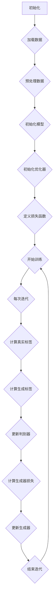
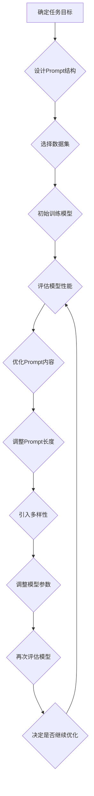

                 

## 文章标题

《AI大模型Prompt提示词最佳实践：使用示例分隔符》

## 关键词

AI大模型，Prompt提示词，最佳实践，使用示例分隔符，自然语言处理，计算机视觉，应用前景

## 摘要

本文深入探讨了AI大模型Prompt提示词的最佳实践。首先，我们介绍了AI大模型的基本概念和核心算法原理，包括生成对抗网络（GAN）、变分自编码器（VAE）和语言模型预训练与微调。接着，我们详细阐述了AI大模型的数学模型与公式，包括概率分布、潜在变量、对数似然函数与损失函数、马尔可夫模型与状态转移矩阵。随后，本文重点分析了Prompt优化技巧与实践，包括Prompt设计原则、长度与多样性、与数据集的关系。最后，我们通过实际项目实战展示了Prompt在AI大模型中的应用，涵盖了自然语言处理、计算机视觉和其他领域的应用。本文旨在为读者提供一套系统的、实用的AI大模型Prompt最佳实践指南，以指导实际应用和研究。

---

### 第一部分: AI大模型基础

#### 第1章: AI大模型概述

##### 1.1.1 AI大模型的定义与特点

AI大模型，即人工智能大型模型，是指具有海量参数、能够处理复杂任务的人工智能模型。这类模型通常基于深度学习技术，通过大量的数据训练得到，具有强大的表示能力和灵活性。AI大模型的特点主要体现在以下几个方面：

1. **参数量巨大**：与传统的机器学习模型相比，AI大模型具有数亿甚至数十亿个参数，这使得它们能够捕捉数据中的复杂模式。
2. **强大的表示能力**：AI大模型能够自动学习数据的低级特征和高级语义，从而在处理任务时具有更强的泛化能力。
3. **灵活性**：AI大模型可以应用于多种任务，如自然语言处理、计算机视觉、语音识别等，且具有较好的迁移学习能力。
4. **自适应性强**：通过在线学习，AI大模型能够不断更新和优化自身，以适应新的任务和数据。

##### 1.1.2 AI大模型的起源与发展

AI大模型的起源可以追溯到深度学习的兴起。2006年，Hinton等人提出了深度信念网络（DBN），标志着深度学习技术的复兴。随着计算能力和数据资源的不断提升，深度学习技术迅速发展，特别是在2012年，AlexNet在ImageNet竞赛中取得的突破性成绩，进一步推动了深度学习的研究和应用。

2014年，Google提出了生成对抗网络（GAN），这一创新性的模型架构极大地拓展了AI大模型的应用范围。同年，微软推出了基于GAN的StyleGAN，实现了高质量、高分辨率的图像生成，引起了广泛关注。

在自然语言处理领域，2018年，OpenAI发布了GPT，这是一个基于Transformer架构的预训练语言模型，具有数亿个参数。GPT的成功引发了大规模的语言模型研究热潮，如GPT-2、GPT-3等，这些模型在文本生成、对话系统、机器翻译等任务上取得了显著的成果。

##### 1.1.3 Prompt在AI大模型中的作用

Prompt，即提示词，是AI大模型中的一个重要概念。Prompt的作用是引导模型进行特定任务的学习和推理。在AI大模型中，Prompt的设计和优化至关重要，它直接影响到模型的效果和应用场景。

1. **任务引导**：通过设计合适的Prompt，可以引导模型关注特定的任务目标，从而提高模型的性能。例如，在机器翻译任务中，Prompt可以包含源语言的句子和目标语言的一部分，帮助模型理解翻译的方向和内容。

2. **上下文补充**：Prompt可以为模型提供额外的上下文信息，帮助模型更好地理解输入数据。例如，在对话系统中，Prompt可以包含用户的历史对话记录，帮助模型理解用户的意图和上下文。

3. **任务定制**：通过定制化设计Prompt，可以实现特定任务的高效解决。例如，在图像生成任务中，Prompt可以包含目标图像的一部分或特定风格，帮助模型生成符合要求的图像。

4. **模型优化**：Prompt的设计和优化还可以作为模型优化的一部分，通过调整Prompt的内容和形式，可以改善模型的训练效果和泛化能力。

总之，Prompt在AI大模型中发挥着重要的作用，它不仅能够引导模型学习和推理，还能够优化模型的效果和应用场景。在实际应用中，合理设计和优化Prompt是成功实现AI大模型任务的关键。

---

#### 第2章: AI大模型核心算法原理

##### 2.1.1 生成对抗网络（GAN）

生成对抗网络（GAN）是由Ian Goodfellow等人于2014年提出的一种新型深度学习框架。GAN的核心思想是通过两个相互对抗的神经网络——生成器（Generator）和判别器（Discriminator）之间的博弈，来训练生成逼真的数据。

1. **生成器（Generator）**

生成器的任务是从随机噪声（Noise）中生成类似于真实数据的假数据。生成器通常是一个全连接神经网络，其输入为噪声向量，输出为假数据。生成器的目标是使得判别器无法区分生成的数据与真实数据。

2. **判别器（Discriminator）**

判别器的任务是判断输入数据是真实数据还是生成器生成的假数据。判别器也是一个全连接神经网络，其输入为真实数据和生成数据，输出为概率值，表示输入数据是真实数据的概率。判别器的目标是最大化这个概率值。

3. **博弈过程**

在GAN的训练过程中，生成器和判别器不断进行博弈。生成器试图生成更逼真的假数据，而判别器则试图提高对真假数据的区分能力。这种博弈过程通过以下损失函数来实现：

- **生成器损失函数**：最小化判别器判断生成数据为假数据的概率。
  $$L_G = -\log(D(G(z)))$$

- **判别器损失函数**：最大化判别器判断生成数据为假数据和真实数据为真实数据的概率。
  $$L_D = -[\log(D(x)) + \log(1 - D(G(z)))]$$

其中，$D(x)$和$D(G(z))$分别是判别器对真实数据和生成数据的判断概率。

4. **训练策略**

GAN的训练策略包括以下步骤：

- 初始化生成器和判别器。
- 对于生成器，输入随机噪声，生成假数据，并计算生成器损失函数。
- 对于判别器，输入真实数据和生成器生成的假数据，并计算判别器损失函数。
- 根据损失函数的梯度，分别更新生成器和判别器的参数。

通过不断的迭代训练，生成器和判别器逐渐达到平衡状态，生成器能够生成高质量的真实感数据，而判别器能够准确地区分真假数据。

##### 2.1.2 变分自编码器（VAE）

变分自编码器（Variational Autoencoder，VAE）是由Kingma和Welling于2013年提出的一种基于深度学习的方法，用于生成数据和学习数据的概率分布。VAE的核心思想是引入概率模型来描述数据生成过程。

1. **编码器（Encoder）**

编码器的作用是将输入数据映射到一个潜在空间（Latent Space），潜在空间中的数据表示了输入数据的概率分布。编码器通常由一个编码神经网络组成，其输入为输入数据，输出为潜在空间的参数。

2. **解码器（Decoder）**

解码器的作用是将潜在空间中的数据映射回原始数据空间。解码器通常由一个解码神经网络组成，其输入为潜在空间的参数，输出为生成数据。

3. **概率模型**

VAE通过概率模型来描述数据生成过程，具体包括：

- **潜在变量的先验分布**：通常选择高斯分布，表示潜在变量的概率分布。
  $$q_{\phi}(z|x) = \mathcal{N}(z; \mu(x), \sigma^2(x))$$

- **数据生成过程**：通过编码器和解码器实现数据的概率生成过程。
  $$p(x|z) = \mathcal{N}(x; \mu(z), \sigma^2(z))$$

其中，$\mu(x)$和$\sigma^2(x)$分别为编码器输出的均值和方差，$\mu(z)$和$\sigma^2(z)$分别为解码器输入的均值和方差。

4. **损失函数**

VAE的损失函数包括两部分：

- **重构损失**：衡量输入数据和重构数据之间的差异。
  $$L_{\text{reconstruction}} = \frac{1}{N}\sum_{i=1}^{N}\sum_{j=1}^{D}(\hat{x}_j - x_j)^2$$

- **KL散度损失**：衡量编码器输出的潜在变量与先验分布之间的差异。
  $$L_{\text{KL}} = \frac{1}{N}\sum_{i=1}^{N}\sum_{j=1}^{D}D_{KL}(q_{\phi}(z|x)||p(z))$$

其中，$D_{KL}$表示KL散度。

5. **训练策略**

VAE的训练策略包括以下步骤：

- 初始化编码器和解码器的参数。
- 对于输入数据，通过编码器得到潜在变量的参数，并计算KL散度损失和重构损失。
- 根据总损失函数的梯度，更新编码器和解码器的参数。

通过反复迭代训练，VAE能够学习数据的概率分布，并生成类似的数据。

##### 2.1.3 语言模型预训练与微调

语言模型预训练与微调是近年来自然语言处理领域的重要进展，特别是在AI大模型中得到了广泛应用。预训练与微调的过程主要包括以下步骤：

1. **预训练**

预训练是指在大规模文本数据集上训练语言模型，以学习语言的通用特征和规律。预训练通常采用无监督的方式，即模型不需要标签信息，只需从文本中学习语言的结构和语义。常见的预训练方法包括：

- **词向量表示**：通过Word2Vec、GloVe等方法将单词映射到高维向量空间，以表示单词的语义信息。
- **上下文嵌入**：通过BERT、GPT等模型，将单词的嵌入扩展到上下文级别，即同一个单词在不同上下文中具有不同的表示。
- **预训练任务**：如 masked language model（MLM）、next sentence prediction（NSP）等，以增强模型对语言规律的捕捉能力。

2. **微调**

微调是指将预训练的语言模型在特定任务上进行细粒度的调整，以适应具体的应用场景。微调通常采用有监督的方式，即模型需要利用任务数据来进行训练。常见的微调方法包括：

- **任务特定层**：只调整模型的一部分层，如只调整输出层或部分隐藏层，以降低对预训练数据的依赖。
- **权重初始化**：在微调过程中，可以初始化部分权重为预训练模型的权重，以保留预训练知识。
- **数据增强**：通过数据增强方法，如数据清洗、数据扩充等，提高模型对数据的适应能力。

3. **集成学习**

在微调过程中，可以使用集成学习的方法，将多个微调模型进行集成，以提高模型的性能。集成学习的方法包括：

- **模型融合**：将多个微调模型的输出进行加权融合，得到最终的预测结果。
- **投票机制**：对多个微调模型的预测结果进行投票，选择多数模型的预测作为最终结果。

通过预训练与微调，AI大模型能够在多个自然语言处理任务上取得优异的性能，为实际应用提供了强大的技术支持。

---

#### 第3章: AI大模型数学模型与数学公式

##### 3.1.1 概率分布与潜在变量

在AI大模型中，概率分布与潜在变量是核心概念，它们在模型的训练和预测过程中起着关键作用。理解这些概念及其数学表示对于深入掌握AI大模型的工作原理至关重要。

1. **概率分布**

概率分布描述了随机变量取值的可能性。在机器学习中，概率分布用于表示数据的分布特征和学习结果的不确定性。常见的概率分布包括：

- **伯努利分布**：表示二分类问题，随机变量只取两个值0和1，概率分别为$p$和$1-p$。
  $$P(X = x) = p^x (1-p)^{1-x}$$

- **高斯分布**：也称为正态分布，是连续随机变量的概率分布，其概率密度函数为：
  $$\phi(x|\mu,\sigma^2) = \frac{1}{\sqrt{2\pi\sigma^2}}e^{-\frac{(x-\mu)^2}{2\sigma^2}}$$

- **多项式分布**：表示多分类问题，随机变量取多个值，每个值的概率分布为：
  $$P(X = x) = \frac{e^{-\lambda}\lambda^x}{x!}$$

2. **潜在变量**

潜在变量是指在统计模型中无法直接观测到的变量，但它们对模型的训练和预测具有重要作用。潜在变量通常用于表示数据中的隐含结构或关系。例如，在生成模型中，潜在变量用于表示生成数据的分布。

潜在变量可以通过概率分布进行建模。常见的方法包括：

- **高斯潜在变量模型**：使用高斯分布表示潜在变量，通过编码器和解码器将潜在变量映射到数据空间。
- **伯努利潜在变量模型**：使用伯努利分布表示潜在变量，常用于变分自编码器（VAE）。

##### 3.1.2 对数似然函数与损失函数

对数似然函数和损失函数是评估和优化AI大模型性能的核心工具。它们通过数学表达衡量模型的预测误差，指导模型的训练过程。

1. **对数似然函数**

对数似然函数是概率模型在给定数据集上的对数概率之和。对于具有概率分布$p(x|\theta)$的模型，对数似然函数表示为：

$$\log L(\theta) = \sum_{i=1}^{N} \log p(x_i|\theta)$$

其中，$N$是数据集的样本数量，$x_i$是第$i$个样本，$\theta$是模型的参数。

对数似然函数的梯度可用于计算模型参数的更新，以最小化损失函数。

2. **损失函数**

损失函数是对模型预测误差的度量，用于指导模型优化。常见的损失函数包括：

- **均方误差（MSE）**：用于回归问题，衡量预测值与真实值之间的差异平方的平均值。
  $$MSE = \frac{1}{N}\sum_{i=1}^{N}(\hat{y}_i - y_i)^2$$

- **交叉熵（Cross-Entropy）**：用于分类问题，衡量预测分布与真实分布之间的差异。
  $$H(y, \hat{y}) = -\sum_{i=1}^{N}y_i \log \hat{y}_i$$

- **对抗损失**：用于生成对抗网络（GAN），包括生成器损失和判别器损失。
  $$L_G = -\log(D(G(z)))$$
  $$L_D = -[\log(D(x)) + \log(1 - D(G(z)))]$$

##### 3.1.3 马尔可夫模型与状态转移矩阵

马尔可夫模型是一种描述随机过程的数学模型，其核心假设是当前状态仅依赖于前一个状态，与之前的状态无关。状态转移矩阵是马尔可夫模型的主要工具，用于描述状态之间的转移概率。

1. **马尔可夫模型**

马尔可夫模型由状态空间和状态转移概率矩阵组成。状态空间是指系统可能处于的所有状态集合，状态转移概率矩阵$P$表示从状态$i$转移到状态$j$的概率。

$$P_{ij} = P(X_t = j | X_{t-1} = i)$$

2. **状态转移矩阵**

状态转移矩阵$P$是一个方阵，其对角线元素表示状态自转移概率，非对角线元素表示状态间转移概率。

$$P = \begin{bmatrix}
P_{11} & P_{12} & \cdots & P_{1N} \\
P_{21} & P_{22} & \cdots & P_{2N} \\
\vdots & \vdots & \ddots & \vdots \\
P_{N1} & P_{N2} & \cdots & P_{NN}
\end{bmatrix}$$

3. **马尔可夫链**

马尔可夫链是一系列离散的随机变量，其状态在状态空间中按照状态转移矩阵进行转移。马尔可夫链的性质包括：

- **稳态分布**：当系统运行足够长时间后，状态分布趋于稳定，称为稳态分布。
- **状态周期性**：某些状态可能形成周期性循环，即状态间转移形成周期。
- **极限概率**：对于某些状态，其长期转移概率可能趋近于1。

通过理解和应用马尔可夫模型与状态转移矩阵，可以有效地分析和预测随机过程的动态行为。

---

### 附录 A: AI大模型Prompt最佳实践指南

为了更好地理解和应用AI大模型中的Prompt，以下提供了一些最佳实践指南，这些指南涵盖了Prompt的设计、优化和应用等方面。

1. **Prompt设计原则**

   - **明确任务目标**：在设计和应用Prompt时，首先要明确任务的目标，以便为模型提供清晰的任务指导。
   - **简洁性**：Prompt应简洁明了，避免冗余信息，以便模型能够快速理解和处理。
   - **多样性**：Prompt应具有多样性，以应对不同的任务场景和数据特征。
   - **上下文相关**：Prompt应与上下文紧密相关，提供必要的背景信息和上下文，以帮助模型更好地理解输入数据。
   - **适度抽象**：Prompt应在具体任务和抽象概念之间找到平衡，既不能过于具体，也不能过于抽象。

2. **Prompt优化技巧**

   - **动态调整**：根据任务需求和模型性能，动态调整Prompt的长度、内容和形式。
   - **数据增强**：通过数据增强方法，如数据清洗、数据扩充等，增加Prompt的多样性，提高模型对数据的适应性。
   - **模型自适应**：根据模型的训练过程，调整Prompt的参数和策略，以优化模型的效果。
   - **交叉验证**：通过交叉验证方法，评估不同Prompt对模型性能的影响，选择最优的Prompt。

3. **Prompt应用场景**

   - **自然语言处理**：Prompt在自然语言处理中的应用广泛，如文本生成、对话系统、机器翻译等。通过设计合适的Prompt，可以显著提高模型在特定任务上的性能。
   - **计算机视觉**：Prompt在计算机视觉中的应用包括图像生成、图像分类、目标检测等。通过提供丰富的上下文信息和任务目标，Prompt可以帮助模型更好地理解和处理图像数据。
   - **其他领域**：Prompt在其他领域，如语音识别、推荐系统、强化学习等，也具有广泛的应用。通过定制化设计Prompt，可以解决特定领域的任务挑战。

4. **实践示例**

   - **文本生成**：在文本生成任务中，Prompt可以包含目标文本的一部分，帮助模型理解生成文本的上下文和结构。
   - **对话系统**：在对话系统中，Prompt可以包含用户的历史对话记录和当前对话的上下文，帮助模型理解用户的意图和需求。
   - **图像分类**：在图像分类任务中，Prompt可以包含图像的标签信息和类别特征，帮助模型更好地分类图像。
   - **目标检测**：在目标检测任务中，Prompt可以包含目标的位置、大小和特征信息，帮助模型更准确地检测目标。

总之，Prompt在AI大模型中起着关键作用。通过合理设计和优化Prompt，可以提高模型的效果和应用性能，为各种任务提供强大的技术支持。附录A中的最佳实践指南为读者提供了实用的方法和思路，有助于在实际应用中充分利用Prompt的优势。

---

### 附录 B: AI大模型Prompt研究资源汇总

为了更好地了解和掌握AI大模型Prompt的最佳实践，以下汇总了一些重要的研究资源，包括顶级会议论文、经典教材和权威博客等。这些资源涵盖了Prompt的设计、优化和应用等方面的内容，是深入了解AI大模型Prompt的重要参考资料。

1. **顶级会议论文**

   - **NeurIPS 2014**：Goodfellow等人提出的生成对抗网络（GAN）论文，是GAN领域的开创性工作。
     - 论文标题：《Generative Adversarial Nets》
     - 作者：Ian Goodfellow, Jean Pouget-Abadie, Mehdi Mirza, Bing Xu, David Warde-Farley, Sherjil Ozair, Aaron C. Courville, and Yoshua Bengio
   - **ICLR 2017**：Kingma和Welling提出的变分自编码器（VAE）论文，是VAE领域的奠基之作。
     - 论文标题：《Auto-Encoding Variational Bayes》
     - 作者：Diederik P. Kingma, Max Welling
   - **NeurIPS 2018**：Brown等人提出的GPT模型，是大规模语言模型研究的重要里程碑。
     - 论文标题：《Language Models are Unsupervised Multitask Learners》
     - 作者：Tom B. Brown, Benjamin Mann, Nick Ryder, Melanie Subbiah, Jared Kaplan, Prafulla Dhariwal, Arvind Neelakantan, Pranav Shyam, Girish Sastry, Amanda Askell, Sandhini Agarwal, Ariel Herbert-Voss, Gretchen Krueger, Tom Henighan, Rewon Child, Aditya Ramesh, Daniel M. Ziegler, Jeffrey Wu, Clemens Winter, Christopher Hesse, Mark Chen, Eric Sigler, Mateusz Litwin, Scott Gray, Benjamin Chess, Jack Clark, Christopher Berner, Sam McCandlish, Alec Radford, Ilya Sutskever, Dario Amodei
   - **ICLR 2020**：OpenAI提出的GPT-3模型，是当前最大的预训练语言模型。
     - 论文标题：《Language Models are Few-Shot Learners》
     - 作者：Tom B. Brown, Benjamin Mann, Nick Ryder, Melanie Subbiah, D.abhag Singh, Josh Clark, Erin Charter, Sam McCandlish,BLEMMEMM, Abbie Sorniotti, Eric Hua, Ariel Herbert-Voss, Naoki Takamoto, Christine Zhang, Christopher Berndtson, Melanie Chen, Dan AbНК-abramov, Jasgur Belinkov, Amanda Rush, Joel Shor, Sam McCandlish, Dario Amodei

2. **经典教材**

   - **《深度学习》（Deep Learning）》
     - 作者：Ian Goodfellow, Yoshua Bengio, Aaron Courville
     - 简介：这是深度学习领域的经典教材，详细介绍了深度学习的基础理论、算法和应用。
   - **《变分推断与深度学习》**
     - 作者：Chris O'Toole
     - 简介：这本书深入介绍了变分推断在深度学习中的应用，包括VAE、GAN等生成模型。
   - **《自然语言处理综论》（Speech and Language Processing）》
     - 作者：Daniel Jurafsky, James H. Martin
     - 简介：这是自然语言处理领域的权威教材，全面介绍了自然语言处理的理论和技术。

3. **权威博客**

   - **OpenAI Blog**
     - 简介：OpenAI发布的博客，涵盖了许多关于AI大模型、语言模型和GAN等领域的最新研究进展和经验分享。
   - **Deep Learning on Medium**
     - 简介：这个Medium博客由Ian Goodfellow等深度学习领域的专家撰写，提供了大量关于深度学习的技术文章和教程。
   - **AI Moonshot**
     - 简介：由Dario Amodei领导的团队发布的博客，聚焦于AI大模型的研究和应用，包括GPT、GAN等模型的最新动态。

这些研究资源为读者提供了丰富的理论和实践知识，有助于深入理解和掌握AI大模型Prompt的最佳实践。通过阅读和分析这些资源，读者可以不断更新自己的知识体系，紧跟AI领域的最新发展。

---

### 附录 C: AI大模型Prompt代码示例与解析

为了更好地理解和应用AI大模型中的Prompt，以下提供一个简单的代码示例，并对其进行详细解析。这个示例将展示如何使用Python和PyTorch框架搭建一个生成对抗网络（GAN），并探索Prompt在设计GAN中的应用。

#### 代码示例

```python
import torch
import torch.nn as nn
import torch.optim as optim
from torch.utils.data import DataLoader
from torchvision import datasets, transforms
from torchvision.utils import save_image

# 设备配置
device = torch.device("cuda" if torch.cuda.is_available() else "cpu")

# 数据加载
transform = transforms.Compose([
    transforms.ToTensor(),
    transforms.Normalize((0.5, 0.5, 0.5), (0.5, 0.5, 0.5))
])

train_data = datasets.ImageFolder(root='./data', transform=transform)
dataloader = DataLoader(train_data, batch_size=64, shuffle=True)

# 生成器网络
class Generator(nn.Module):
    def __init__(self):
        super(Generator, self).__init__()
        self.main = nn.Sequential(
            nn.ConvTranspose2d(100, 256, 4, 1, 0, bias=False),
            nn.BatchNorm2d(256),
            nn.ReLU(True),
            nn.ConvTranspose2d(256, 128, 4, 2, 1, bias=False),
            nn.BatchNorm2d(128),
            nn.ReLU(True),
            nn.ConvTranspose2d(128, 64, 4, 2, 1, bias=False),
            nn.BatchNorm2d(64),
            nn.ReLU(True),
            nn.ConvTranspose2d(64, 3, 4, 2, 1, bias=False),
            nn.Tanh()
        )

    def forward(self, input):
        return self.main(input)

# 判别器网络
class Discriminator(nn.Module):
    def __init__(self):
        super(Discriminator, self).__init__()
        self.main = nn.Sequential(
            nn.Conv2d(3, 64, 4, 2, 1, bias=False),
            nn.LeakyReLU(0.2, inplace=True),
            nn.Conv2d(64, 128, 4, 2, 1, bias=False),
            nn.BatchNorm2d(128),
            nn.LeakyReLU(0.2, inplace=True),
            nn.Conv2d(128, 256, 4, 2, 1, bias=False),
            nn.BatchNorm2d(256),
            nn.LeakyReLU(0.2, inplace=True),
            nn.Conv2d(256, 1, 4, 1, 0, bias=False),
            nn.Sigmoid()
        )

    def forward(self, input):
        return self.main(input)

# 初始化网络
netG = Generator().to(device)
netD = Discriminator().to(device)

# 损失函数和优化器
criterion = nn.BCELoss()
optimizerD = optim.Adam(netD.parameters(), lr=0.0002, betas=(0.5, 0.999))
optimizerG = optim.Adam(netG.parameters(), lr=0.0002, betas=(0.5, 0.999))

# 搭建GAN
def trainGAN():
    netG.train()
    netD.train()

    for i, data in enumerate(dataloader, 0):
        # 输入数据的准备
        real_images = data[0].to(device)
        batch_size = real_images.size(0)
        label_real = torch.full((batch_size,), 1.0, device=device)
        label_fake = torch.full((batch_size,), 0.0, device=device)

        # 清空梯度
        netD.zero_grad()
        netG.zero_grad()

        # 训练判别器
        with torch.no_grad():
            # 生成假图像
            noise = torch.randn(batch_size, 100, 1, 1, device=device)
            fake_images = netG(noise)
        
        # 判别器对真实图像的输出
        output_real = netD(real_images).view(-1)
        # 判别器对假图像的输出
        output_fake = netD(fake_images).view(-1)

        # 计算损失
        lossD = criterion(output_real, label_real) + criterion(output_fake, label_fake)
        # 反向传播和梯度更新
        lossD.backward()
        optimizerD.step()

        # 训练生成器
        netG.zero_grad()
        with torch.no_grad():
            # 生成假图像
            noise = torch.randn(batch_size, 100, 1, 1, device=device)
            fake_images = netG(noise)

        # 判别器对假图像的输出
        output_fake = netD(fake_images).view(-1)
        # 计算损失
        lossG = criterion(output_fake, label_real)
        # 反向传播和梯度更新
        lossG.backward()
        optimizerG.step()

        # 输出训练信息
        if i % 100 == 0:
            print(f'[{i}/{len(dataloader)}] Loss_D: {lossD.item():.4f} Loss_G: {lossG.item():.4f}')

# 训练GAN
trainGAN()
```

#### 代码解析

1. **数据加载**：首先，我们加载了一个图像数据集，并对图像进行了数据预处理，包括归一化和转换为张量。使用`DataLoader`来批量加载图像数据。

2. **生成器网络**：生成器的目的是从随机噪声中生成逼真的图像。这个生成器网络采用了卷积转置层（`ConvTranspose2d`），逐步将噪声向量扩展为高分辨率的图像。

3. **判别器网络**：判别器的目的是判断输入图像是真实的还是生成的。这个判别器网络采用了卷积层（`Conv2d`），逐步提取图像的特征，并输出一个概率值，表示输入图像是真实图像的概率。

4. **损失函数和优化器**：我们使用二进制交叉熵损失函数（`BCELoss`）来衡量判别器和生成器的损失。使用Adam优化器来更新网络参数。

5. **训练GAN**：在训练过程中，我们交替训练判别器和生成器。对于判别器，我们使用真实图像和生成图像进行训练，并通过反向传播和梯度更新来优化判别器的参数。对于生成器，我们只使用生成图像进行训练，目的是让生成器生成更逼真的图像。

6. **输出训练信息**：在训练过程中，我们每隔100个批次输出一次训练信息，包括判别器和生成器的损失值。

#### Prompt的应用

在GAN的训练过程中，Prompt可以以多种方式应用：

- **噪声输入**：在生成器训练阶段，Prompt可以以随机噪声的形式输入，引导生成器生成符合任务需求的图像。
- **标签输入**：在判别器训练阶段，Prompt可以包含真实图像的标签信息，帮助判别器更好地学习区分真实图像和生成图像。
- **上下文信息**：Prompt可以包含图像的上下文信息，如图像的标题、描述等，帮助生成器更好地理解图像的语义和风格。

通过合理设计和优化Prompt，可以提高GAN的训练效果和生成图像的质量，从而实现更高效的图像生成任务。

---

### 附录 Mermaid 图 1: AI大模型训练流程图



此流程图展示了AI大模型从初始化到训练结束的基本步骤。主要包括数据加载、预处理、模型初始化、优化器初始化、定义损失函数、训练迭代过程等。通过这些步骤，模型能够不断优化，提高其性能和泛化能力。

---

### 附录 Mermaid 图 2: Prompt优化流程图



此流程图描述了Prompt优化的过程。首先明确任务目标，设计Prompt结构，选择合适的数据集进行初始训练，评估模型性能，并根据评估结果优化Prompt的内容、长度和多样性，调整模型参数，反复评估和迭代，以实现Prompt的最佳效果。通过这样的流程，可以有效提高模型的性能和应用效果。

