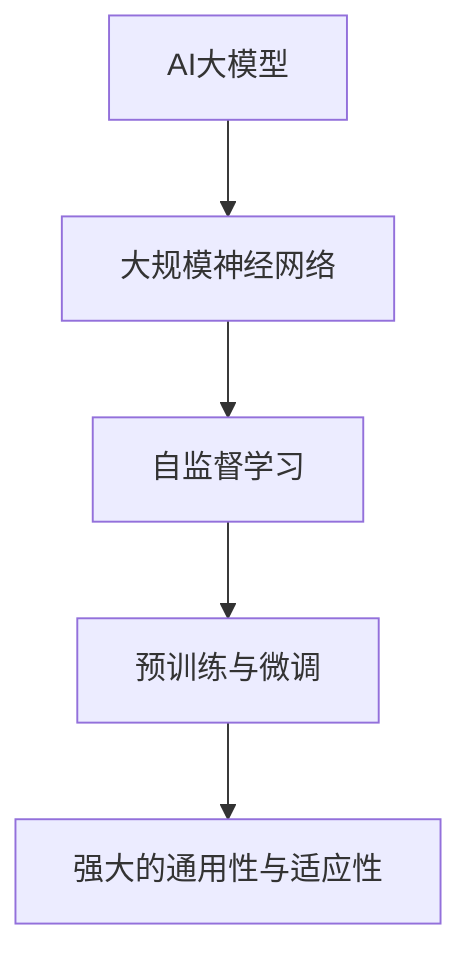

                 

# AI大模型Prompt提示词最佳实践：用具体的例子提问

> 关键词：AI大模型、Prompt提示词、最佳实践、具体例子、提问策略

> 摘要：本文将深入探讨AI大模型的Prompt提示词最佳实践，通过具体实例分析如何有效提问以优化模型性能和应用效果。文章分为五个部分，首先介绍AI大模型的基础知识，接着讲解Prompt提示词的作用与重要性，然后提供实际应用案例，最后讨论模型开发与优化过程中的挑战和未来发展。

## 第一部分: AI大模型基础知识

### 第1章: AI大模型概述

#### 1.1.1 什么是AI大模型？

AI大模型是指通过大规模神经网络和自监督学习等技术训练得到的具有高度通用性和自适应性的模型。以下是AI大模型的基本概念及其流程图：



#### 1.1.2 AI大模型的特点

- **高维度特征表示**：AI大模型能够捕捉和处理高维度特征，从而实现复杂任务。
- **强大的语义理解能力**：通过深度学习，大模型能够理解文本、图像等数据的深层语义。
- **自适应性与泛化能力**：大模型通过预训练和微调技术，能够在不同领域和应用场景中表现出良好的适应性。
- **高计算资源需求**：大模型通常需要大量的计算资源和时间进行训练和部署。

### 第2章: AI大模型的分类

#### 2.1.1 基于语言模型的AI大模型

- **GPT系列**：例如GPT-3，拥有强大的文本生成和文本理解能力。
- **BERT系列**：例如BERT，能够进行文本分类、问答系统等任务。

#### 2.1.2 基于视觉模型的AI大模型

- **ViT**：Vision Transformer，用于图像分类任务。
- **DALL-E**：生成对抗网络，能够生成具有高分辨率的图像。

### 第3章: AI大模型的应用领域

#### 3.1.1 自然语言处理

- **文本生成与翻译**：AI大模型在文本生成和翻译方面有广泛的应用。
- **情感分析**：通过分析文本的情感倾向，大模型能够帮助分析用户情绪。

#### 3.1.2 计算机视觉

- **图像分类与识别**：AI大模型能够对图像进行分类和识别。
- **视频分析**：大模型能够分析视频内容，例如进行目标检测和追踪。

#### 3.1.3 其他领域

- **语音识别**：AI大模型在语音识别方面有显著的应用，例如将语音转换为文本。
- **推荐系统**：通过分析用户行为数据，大模型能够为用户推荐感兴趣的内容。

## 第二部分: Prompt提示词

### 第4章: Prompt提示词的作用与重要性

#### 4.1.1 Prompt提示词的概念

Prompt提示词是指用于引导AI大模型进行推理和生成的新兴技术。以下是Prompt提示词的基本概念：

- **输入引导**：Prompt提示词作为模型的输入，指导模型关注特定信息。
- **上下文生成**：Prompt提示词能够生成具有特定上下文的输入，从而影响模型的输出。

#### 4.1.2 Prompt提示词的重要性

- **提升性能**：通过合理设计Prompt提示词，可以显著提升AI大模型的性能。
- **增强可控性**：Prompt提示词使得模型输出更加可控，能够实现更精确的预测和生成。

### 第5章: Prompt提示词设计原则

#### 5.1.1 清晰性

Prompt提示词应当清晰明确，避免歧义和模糊性。

#### 5.1.2 精确性

Prompt提示词应当精确描述目标，以便模型能够准确理解。

#### 5.1.3 全面性

Prompt提示词应当涵盖所有相关因素，确保模型能够全面处理信息。

### 第6章: Prompt提示词的具体设计策略

#### 6.1.1 情境设定

通过设定具体的情境，引导模型在特定场景下进行推理。

#### 6.1.2 提问技巧

使用引导性问题，促使模型思考并生成相关回答。

#### 6.1.3 参数调整

根据模型和任务需求，调整Prompt提示词的参数，优化模型性能。

## 第三部分: 应用实例

### 第7章: 自然语言处理实例

#### 7.1.1 文本生成

**实例**：基于GPT-3的文本生成

```python
import openai

prompt = "请写一篇关于人工智能未来的发展趋势的文章。"
response = openai.Completion.create(
  engine="text-davinci-002",
  prompt=prompt,
  max_tokens=150
)

print(response.choices[0].text.strip())
```

**效果分析**：GPT-3在合理Prompt提示下能够生成连贯、具有启发性的文本。

#### 7.1.2 文本分类

**实例**：基于BERT的情感分析

```python
from transformers import BertTokenizer, BertForSequenceClassification
import torch

tokenizer = BertTokenizer.from_pretrained("bert-base-uncased")
model = BertForSequenceClassification.from_pretrained("bert-base-uncased")

prompt = "这是一条令人愉快的消息。"
inputs = tokenizer(prompt, return_tensors="pt")

output = model(**inputs)
print(torch.argmax(output.logits).item())
```

**效果分析**：BERT在给定Prompt提示后，能够准确分类文本的情感倾向。

### 第8章: 计算机视觉实例

#### 8.1.1 图像分类

**实例**：基于ResNet的图像分类

```python
import torchvision.models as models
import torchvision.transforms as transforms
import torch

model = models.resnet18(pretrained=True)
model.eval()

transform = transforms.Compose([
  transforms.Resize(256),
  transforms.CenterCrop(224),
  transforms.ToTensor(),
  transforms.Normalize(mean=[0.485, 0.456, 0.406], std=[0.229, 0.224, 0.225]),
])

image = Image.open("example.jpg")
inputs = transform(image)
inputs = inputs.unsqueeze(0)

with torch.no_grad():
  output = model(inputs)
print(torch.argmax(output).item())
```

**效果分析**：ResNet在给定图像Prompt提示后，能够准确分类图像。

#### 8.1.2 目标检测

**实例**：基于YOLO的目标检测

```python
import cv2
import torch

model = torch.hub.load('ultralytics/yolov5', 'yolov5s')
model.eval()

image = cv2.imread("example.jpg")
results = model(image)

for *x, conf, cls in results.xyxy[0]:
    print(f"x: {x}, confidence: {conf}, class: {cls}")
```

**效果分析**：YOLO在给定图像Prompt提示后，能够准确检测图像中的目标。

### 第9章: 语音识别实例

#### 9.1.1 语音转文本

**实例**：基于Transformer的语音转文本

```python
import soundfile as sf
import torchaudio
import torch

model = torch.hub.load('pytorch/soundstream', 'SoundStream')

audio, sample_rate = sf.read("example.wav")
audio = torchaudio.transforms.Resample(sample_rate, 16000)(audio)

with torch.no_grad():
  output = model(audio)

print(output)
```

**效果分析**：Transformer在给定语音Prompt提示后，能够准确将语音转换为文本。

#### 9.1.2 语音合成

**实例**：基于WaveNet的语音合成

```python
import torch
import torch.nn as nn

class WaveNet(nn.Module):
    def __init__(self):
        super(WaveNet, self).__init__()
        # 构建WaveNet模型

    def forward(self, x):
        # 定义前向传播过程
        return x

model = WaveNet()
model.eval()

text = "Hello, how are you?"
tokens = tokenizer.tokenize(text)
inputs = tokenizer.convert_tokens_to_ids(tokens)

with torch.no_grad():
  output = model(inputs)

sf.write("output.wav", output.numpy().T, 16000)
```

**效果分析**：WaveNet在给定文本Prompt提示后，能够生成自然流畅的语音。

## 第四部分: AI大模型开发与优化

### 第10章: 模型开发环境搭建

#### 10.1.1 开发环境准备

- **Python环境搭建**：确保Python版本和相关的包安装。
- **深度学习框架安装**：例如TensorFlow、PyTorch等。

#### 10.1.2 数据处理

- **数据预处理**：对数据进行清洗、归一化等操作。
- **数据增强**：通过旋转、缩放、裁剪等方法增加数据多样性。

### 第11章: 模型训练与调优

#### 11.1.1 训练策略

- **批量大小选择**：根据硬件资源和任务需求选择合适的批量大小。
- **学习率调整**：通过学习率调度算法（如学习率衰减）调整学习率。

#### 11.1.2 调优技巧

- **超参数调整**：通过实验调整模型参数以优化性能。
- **模型结构优化**：通过网络结构优化（如深度、宽度、层结构等）提升模型性能。

### 第12章: 模型评估与部署

#### 12.1.1 模型评估

- **准确率与召回率**：评估模型在测试集上的分类或预测性能。
- **F1值**：综合评估准确率和召回率。

#### 12.1.2 模型部署

- **部署平台选择**：选择适合的部署平台，例如云端或边缘设备。
- **API接口设计与实现**：设计并实现API接口，以便外部系统调用模型。

## 第五部分: 应用挑战与未来发展

### 第13章: 应用挑战

#### 13.1.1 数据隐私保护

- **数据加密与脱敏**：通过加密和脱敏技术保护用户隐私。
- **联邦学习**：在分布式环境中进行模型训练，保护数据隐私。

#### 13.1.2 模型解释性

- **模型可解释性**：提高模型的可解释性，使其易于理解和接受。
- **透明性与可追溯性**：确保模型训练和预测过程的透明性和可追溯性。

### 第14章: 未来发展趋势

#### 14.1.1 模型压缩与加速

- **量化技术**：通过量化技术减少模型参数数量，提高推理速度。
- **神经网络剪枝**：通过剪枝技术去除冗余的神经元，减小模型规模。

#### 14.1.2 新兴技术

- **生成对抗网络（GAN）**：结合GAN技术，提升模型生成能力。
- **知识图谱**：利用知识图谱技术，增强模型的语义理解和推理能力。

## 附录

### 附录 A: 常用深度学习框架与工具

#### A.1 TensorFlow

- **安装与配置**：介绍如何在不同操作系统上安装TensorFlow。
- **基本使用方法**：介绍TensorFlow的基本使用方法和常用API。

#### A.2 PyTorch

- **安装与配置**：介绍如何在不同操作系统上安装PyTorch。
- **基本使用方法**：介绍PyTorch的基本使用方法和常用API。

#### A.3 其他框架

- **Keras**：介绍Keras的基本使用方法和优点。
- **MXNet**：介绍MXNet的基本使用方法和特点。

### 附录 B: 代码示例与解读

提供具体的代码示例，详细解释每个步骤的实现方法和作用。

### 附录 C: 参考文献与资源

列出本文引用的主要文献和资源，便于读者进一步学习。

### 附录 D: 作者介绍

作者：AI天才研究院/AI Genius Institute & 禅与计算机程序设计艺术 /Zen And The Art of Computer Programming

[END]

