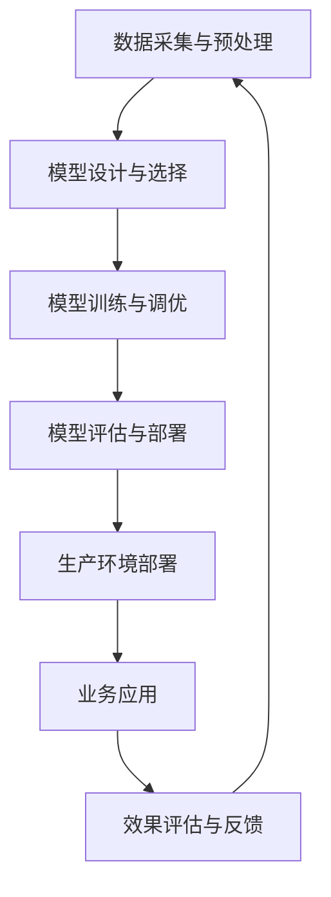

                 

# 《AI大模型创业战：挑战与机遇并存的未来展望》

> 关键词：AI大模型，创业，挑战，机遇，未来展望

> 摘要：本文详细分析了AI大模型在创业领域的现状、挑战与机遇，通过深入探讨AI大模型的基础知识、技术原理、创业案例分析以及创业风险与应对策略，为创业者提供了有价值的参考和指导。

### 引言

随着人工智能技术的迅猛发展，AI大模型作为其中的一项重要成果，逐渐成为创业领域的新风口。AI大模型具有强大的数据处理和分析能力，可以在众多领域实现突破性应用，如自然语言处理、图像识别、语音识别等。然而，AI大模型的创业之路并非一帆风顺，面临诸多挑战和机遇。本文将从以下几个方面展开论述：

1. AI大模型概述：介绍AI大模型的基本概念、发展历程、主流模型及其在创业中的应用潜力。
2. AI大模型技术基础：阐述深度学习、自然语言处理、大规模预训练模型等基础技术原理。
3. AI大模型构建与实践：讲解AI大模型构建流程、实战案例以及相关技术工具。
4. AI大模型创业案例分析：分析成功与失败的创业案例，总结创业经验与教训。
5. AI大模型创业风险与应对策略：探讨创业过程中可能面临的风险以及应对策略。
6. AI大模型创业政策与生态建设：分析政策环境、生态体系建设及其对创业的影响。
7. AI大模型创业的未来展望：展望AI大模型创业的趋势、机遇与挑战。

### 第一部分：AI大模型基础

#### 第1章：AI大模型概述

##### 1.1 AI大模型定义与特点

AI大模型（Large-scale Artificial Intelligence Models）是指具有大规模参数、能够处理海量数据并具备强大表征能力的深度学习模型。这些模型通常具有以下几个特点：

1. **大规模参数**：AI大模型拥有数十亿甚至千亿级别的参数，这使得它们能够捕捉到数据中的复杂模式。
2. **高计算资源需求**：训练和部署AI大模型需要大量的计算资源和存储资源，通常需要使用高性能计算集群和分布式计算技术。
3. **强大的表征能力**：AI大模型能够对输入数据进行高层次的抽象和表征，从而实现高效的数据分析和预测。
4. **广泛的应用场景**：AI大模型可以应用于自然语言处理、图像识别、语音识别、推荐系统、生物信息学等多个领域。

##### 1.2 AI大模型的发展历程

AI大模型的发展历程可以分为以下几个阶段：

1. **早期阶段**：1980年代至1990年代，神经网络的研究逐渐兴起，但受到计算资源和数据集的限制，模型规模较小。
2. **深度学习兴起**：2006年，Hinton提出了深度信念网络（DBN），深度学习开始得到广泛关注。2012年，AlexNet在ImageNet图像识别比赛中取得突破性成绩，深度学习迅速发展。
3. **大规模预训练模型**：2018年，Google推出了BERT模型，大规模预训练模型开始成为主流。随后，GPT、TuringNL、Erine等大模型相继推出，进一步推动AI大模型的发展。

##### 1.3 主流AI大模型简介

目前，主流AI大模型主要包括以下几种：

1. **BERT**：基于Transformer架构，具有双向上下文表示能力，广泛应用于自然语言处理任务。
2. **GPT**：基于Transformer架构，具有自回归语言模型能力，广泛应用于文本生成和对话系统。
3. **TuringNL**：基于Transformer架构，结合知识图谱和实体识别技术，实现高精度的自然语言理解。
4. **Erine**：基于Transformer架构，具有图像和文本联合表征能力，广泛应用于图像识别和文本分析。

##### 1.4 AI大模型在创业中的应用潜力

AI大模型在创业领域具有广泛的应用潜力，可以为创业者带来以下几方面的收益：

1. **业务创新**：AI大模型可以帮助创业者发现新的业务机会，实现业务模式的创新。
2. **效率提升**：AI大模型可以自动化数据处理和分析任务，提高工作效率和生产力。
3. **降低成本**：AI大模型可以替代部分人力工作，降低人力成本。
4. **竞争优势**：AI大模型可以为创业者提供强大的数据分析和决策支持，增强竞争优势。

### 第二部分：AI大模型技术基础

#### 第2章：AI大模型技术基础

##### 2.1 深度学习基础

深度学习是AI大模型的核心技术之一，其基础包括以下几个方面：

1. **神经网络结构**：神经网络由多个层次组成，包括输入层、隐藏层和输出层。每层由多个神经元组成，神经元之间通过权重连接。
2. **深度学习算法**：常见的深度学习算法包括反向传播算法、梯度下降算法、Adam优化器等。
3. **优化策略**：优化策略包括批量大小、学习率、正则化等，用于提高模型性能和泛化能力。

##### 2.2 自然语言处理技术

自然语言处理（NLP）是AI大模型的重要应用领域之一，其核心技术包括以下几个方面：

1. **词嵌入技术**：词嵌入将词汇映射到高维空间，实现词汇的数值表示，如Word2Vec、GloVe等。
2. **序列模型与注意力机制**：序列模型用于处理时间序列数据，如循环神经网络（RNN）、长短时记忆网络（LSTM）等。注意力机制用于捕获输入序列中的重要信息。
3. **转换器架构**：转换器（Transformer）是一种基于自注意力机制的深度学习模型，广泛应用于NLP任务。

##### 2.3 大规模预训练模型原理

大规模预训练模型是AI大模型的核心技术之一，其原理包括以下几个方面：

1. **预训练的概念与意义**：预训练是指在特定任务之前，使用大量数据对模型进行预训练，以获得更好的泛化能力。
2. **自监督学习方法**：自监督学习方法通过利用未标注的数据进行预训练，减少对标注数据的依赖。
3. **迁移学习与微调技术**：迁移学习是指将预训练模型应用于特定任务，通过微调适应新任务。

### 第三部分：AI大模型构建与实践

#### 第3章：AI大模型构建与实践

##### 3.1 AI大模型构建流程

构建AI大模型通常包括以下步骤：

1. **数据采集与预处理**：收集相关领域的大量数据，并进行清洗、预处理，如去重、缺失值处理、数据规范化等。
2. **模型设计与选择**：根据任务需求选择合适的模型架构，如BERT、GPT等。设计模型的参数配置，包括隐藏层大小、学习率等。
3. **模型训练与调优**：使用训练数据对模型进行训练，并通过调参、优化策略等手段提高模型性能。
4. **模型评估与部署**：使用验证数据对模型进行评估，并根据评估结果对模型进行进一步优化。部署模型到生产环境，实现业务应用。

##### 3.2 实战案例

以下是一些AI大模型的实战案例：

1. **文本分类**：使用BERT模型对新闻文章进行分类，将新闻文章分为多个类别，如体育、科技、娱乐等。
2. **机器翻译**：使用GPT模型实现中英翻译，将中文文本翻译成英文文本。
3. **图像识别**：使用TuringNL模型对图像进行分类，识别图像中的物体、场景等。

### 第四部分：AI大模型创业案例分析

#### 第4章：AI大模型创业案例分析

##### 4.1 案例一：创业公司A的AI大模型应用

创业公司A专注于利用AI大模型技术进行文本分类和情感分析。他们使用BERT模型对大量社交媒体数据进行分析，为品牌企业提供舆情监测服务。通过精准的分类和情感分析，客户可以实时了解市场动态，优化品牌传播策略。

##### 4.2 案例二：创业公司B的AI大模型创业经验

创业公司B致力于开发基于GPT模型的智能客服系统。他们利用GPT模型的自回归语言模型能力，实现与用户的自然对话。通过不断训练和优化模型，他们成功地将客服响应时间缩短至秒级，大幅提升了用户体验。

##### 4.3 案例三：创业公司C的AI大模型应用实践

创业公司C专注于图像识别和计算机视觉领域。他们使用TuringNL模型对医疗图像进行分析，为医生提供诊断辅助。通过深度学习和计算机视觉技术，他们实现了对肺癌、乳腺癌等疾病的早期检测，为患者提供更加精准的诊断。

### 第五部分：AI大模型创业风险与应对策略

#### 第5章：AI大模型创业风险与应对策略

##### 5.1 创业风险分析

AI大模型创业过程中可能面临以下风险：

1. **技术风险**：AI大模型的技术要求较高，创业团队需要具备深厚的专业知识和技术积累。如果技术团队实力不足，可能导致项目进展缓慢或失败。
2. **法律风险**：AI大模型在应用过程中可能涉及隐私保护、知识产权保护等问题。如果法律风险处理不当，可能导致企业面临诉讼或赔偿。
3. **市场风险**：AI大模型市场竞争激烈，创业公司需要具备良好的市场洞察力和创新能力，以应对竞争压力。如果市场定位不准确或产品竞争力不足，可能导致市场份额减少。
4. **财务风险**：AI大模型的研发和运营成本较高，创业公司需要具备稳定的资金来源。如果财务风险控制不当，可能导致企业破产。

##### 5.2 应对策略与建议

针对上述风险，创业公司可以采取以下应对策略：

1. **技术创新策略**：加强技术研发，提高技术水平和核心竞争力。通过不断优化模型架构、算法和工程实践，提高模型性能和应用效果。
2. **法律合规策略**：关注相关法律法规，确保企业合法合规运营。建立完善的知识产权保护体系，防止知识产权侵权和泄露。
3. **市场拓展策略**：深入了解市场需求，精准定位目标客户。通过差异化竞争策略，打造具有独特优势的产品，提升市场份额。
4. **财务管理策略**：加强财务管理和风险控制，确保资金安全。通过多元化融资渠道，增加资金来源，降低财务风险。

### 第六部分：AI大模型创业政策与生态建设

#### 第6章：AI大模型创业政策与生态建设

##### 6.1 政策环境分析

我国政府对AI大模型创业给予了高度重视，出台了一系列政策支持。主要政策包括：

1. **资金支持**：政府通过科技计划、基金支持、税收优惠等方式，为AI大模型创业项目提供资金支持。
2. **人才培养**：政府加强人工智能领域人才培养，鼓励高校和企业合作，培养高水平人工智能人才。
3. **技术创新**：政府推动人工智能技术研发，支持企业开展技术创新和成果转化。

##### 6.2 生态体系建设

AI大模型创业生态体系建设主要包括以下几个方面：

1. **开放平台建设**：政府和企业共同建设开放平台，为创业者提供计算资源、数据集和技术支持。
2. **人才培养与引进**：加强人工智能领域人才培养，通过引进海外高层次人才，提升我国AI大模型创业水平。
3. **产业链协同发展**：推动AI大模型产业链上下游企业合作，实现产业链协同发展。

### 第七部分：AI大模型创业的未来展望

#### 第7章：AI大模型创业的未来展望

##### 7.1 AI大模型创业趋势分析

AI大模型创业的未来趋势主要包括以下几个方面：

1. **技术趋势**：随着计算资源和数据集的不断增加，AI大模型将朝着更高规模、更精细化的方向发展。同时，新型模型架构和算法将不断涌现，提高模型性能和应用效果。
2. **市场趋势**：AI大模型在各个行业的应用需求持续增长，市场前景广阔。创业者可以通过细分市场、差异化竞争策略，抓住市场机遇。
3. **创业模式趋势**：AI大模型创业将更加注重技术驱动和跨界融合，创业者需要具备跨学科知识和创新能力，实现业务模式的创新。

##### 7.2 创业机遇与挑战

AI大模型创业面临的机遇与挑战并存：

1. **机遇**：AI大模型技术将为创业公司带来广阔的市场空间和业务机会。创业者可以通过技术创新、商业模式创新，实现快速发展。
2. **挑战**：AI大模型创业面临技术风险、市场竞争、法律法规等多方面的挑战。创业者需要具备扎实的技术功底、敏锐的市场洞察力和良好的风险控制能力。

##### 7.3 创业建议

针对AI大模型创业，以下是一些建议：

1. **明确目标**：明确创业目标，聚焦于具有核心竞争力的业务领域。
2. **技术创新**：加强技术研发，提高模型性能和应用效果。
3. **市场拓展**：深入了解市场需求，精准定位目标客户。
4. **风险控制**：建立健全的风险控制机制，降低创业风险。

### 附录

#### 附录A：AI大模型常用工具与资源介绍

1. **工具**：TensorFlow、PyTorch、Keras等深度学习框架。
2. **资源**：Hugging Face、Transformers等开源库，以及大量预训练模型和数据集。

#### 附录B：AI大模型创业相关政策与法规简介

1. **政策**：我国政府出台的一系列支持人工智能发展的政策。
2. **法规**：涉及隐私保护、知识产权保护等方面的法律法规。

#### 附录C：AI大模型创业案例汇编

1. **案例**：包括成功和失败的AI大模型创业案例，供创业者参考。

### 结语

AI大模型作为人工智能领域的重要成果，为创业领域带来了前所未有的机遇。然而，创业之路充满挑战，创业者需要具备扎实的技术功底、敏锐的市场洞察力和良好的风险控制能力。本文从多个角度分析了AI大模型创业的现状、挑战与机遇，为创业者提供了有价值的参考和指导。让我们携手共进，共同推动AI大模型创业的发展。

### 作者信息

作者：AI天才研究院/AI Genius Institute & 禅与计算机程序设计艺术 /Zen And The Art of Computer Programming

### 第一部分：AI大模型基础

#### 第1章：AI大模型概述

##### 1.1 AI大模型定义与特点

AI大模型（Large-scale Artificial Intelligence Models）是指具有大规模参数、能够处理海量数据并具备强大表征能力的深度学习模型。这些模型通常具有以下几个特点：

1. **大规模参数**：AI大模型拥有数十亿甚至千亿级别的参数，这使得它们能够捕捉到数据中的复杂模式。例如，BERT模型有超过3.4亿个参数，GPT-3有1.75万亿个参数。

2. **高计算资源需求**：训练和部署AI大模型需要大量的计算资源和存储资源，通常需要使用高性能计算集群和分布式计算技术。例如，训练一个大型AI大模型可能需要数千个GPU和数PB的存储空间。

3. **强大的表征能力**：AI大模型能够对输入数据进行高层次的抽象和表征，从而实现高效的数据分析和预测。例如，GPT-3在自然语言理解任务上的表现接近人类水平。

4. **广泛的应用场景**：AI大模型可以应用于自然语言处理、图像识别、语音识别、推荐系统、生物信息学等多个领域。例如，BERT在文本分类、机器翻译和问答系统中表现出色，GPT-3在生成文本、代码和艺术作品中具有广泛应用。

##### 1.2 AI大模型的发展历程

AI大模型的发展历程可以分为以下几个阶段：

1. **早期阶段**：1980年代至1990年代，神经网络的研究逐渐兴起，但受到计算资源和数据集的限制，模型规模较小。1990年代后期，支持向量机（SVM）等传统机器学习模型逐渐取代了神经网络。

2. **深度学习兴起**：2006年，Hinton提出了深度信念网络（DBN），深度学习开始得到广泛关注。2012年，AlexNet在ImageNet图像识别比赛中取得突破性成绩，深度学习迅速发展。

3. **大规模预训练模型**：2018年，Google推出了BERT模型，大规模预训练模型开始成为主流。随后，GPT、TuringNL、Erine等大模型相继推出，进一步推动AI大模型的发展。

4. **持续发展**：近年来，AI大模型在模型规模、计算效率和应用效果等方面持续突破，逐渐成为人工智能领域的主流技术。

##### 1.3 主流AI大模型简介

目前，主流AI大模型主要包括以下几种：

1. **BERT**：基于Transformer架构，具有双向上下文表示能力，广泛应用于自然语言处理任务，如文本分类、机器翻译和问答系统。

2. **GPT**：基于Transformer架构，具有自回归语言模型能力，广泛应用于文本生成和对话系统，如自动写作、聊天机器人等。

3. **TuringNL**：基于Transformer架构，结合知识图谱和实体识别技术，实现高精度的自然语言理解，广泛应用于智能客服、智能问答等领域。

4. **Erine**：基于Transformer架构，具有图像和文本联合表征能力，广泛应用于图像识别和文本分析，如物体识别、场景分类等。

##### 1.4 AI大模型在创业中的应用潜力

AI大模型在创业领域具有广泛的应用潜力，可以为创业者带来以下几方面的收益：

1. **业务创新**：AI大模型可以帮助创业者发现新的业务机会，实现业务模式的创新。例如，通过文本分析可以了解市场需求和用户偏好，从而开发出更符合市场需求的业务。

2. **效率提升**：AI大模型可以自动化数据处理和分析任务，提高工作效率和生产力。例如，通过图像识别技术可以实现自动化物流分拣，提高物流效率。

3. **降低成本**：AI大模型可以替代部分人力工作，降低人力成本。例如，通过自然语言处理技术可以实现自动化客服，减少人工客服的投入。

4. **竞争优势**：AI大模型可以为创业者提供强大的数据分析和决策支持，增强竞争优势。例如，通过预测分析可以提前了解市场趋势，从而制定更具前瞻性的业务策略。

### 第2章：AI大模型技术基础

#### 2.1 深度学习基础

深度学习（Deep Learning）是AI大模型的核心技术之一，其基础包括以下几个方面：

##### 2.1.1 神经网络结构

神经网络（Neural Networks）是一种模拟人脑神经元之间连接的计算机算法，由多个层次组成，包括输入层、隐藏层和输出层。每个层次由多个神经元组成，神经元之间通过权重连接。

1. **输入层**：接收外部输入数据，将其传递给隐藏层。
2. **隐藏层**：对输入数据进行处理和抽象，提取特征信息。
3. **输出层**：将处理后的数据传递给输出层，进行预测或分类。

##### 2.1.2 深度学习算法

深度学习算法包括多种类型，如卷积神经网络（CNN）、循环神经网络（RNN）、长短时记忆网络（LSTM）和Transformer等。每种算法都有其独特的应用场景和优势。

1. **卷积神经网络（CNN）**：主要用于图像识别和计算机视觉任务，通过卷积层、池化层和全连接层实现图像特征提取和分类。
2. **循环神经网络（RNN）**：主要用于序列数据处理和自然语言处理任务，通过循环结构实现对序列数据的记忆和预测。
3. **长短时记忆网络（LSTM）**：是RNN的一种变体，通过门控机制实现对长序列数据的记忆和预测。
4. **Transformer**：是一种基于自注意力机制的深度学习模型，广泛应用于自然语言处理和序列建模任务。

##### 2.1.3 优化策略

深度学习模型的优化策略包括批量大小、学习率、正则化等，用于提高模型性能和泛化能力。

1. **批量大小**：批量大小影响模型的训练效率和稳定性。较小的批量大小可以提高模型的鲁棒性，但训练速度较慢；较大的批量大小可以提高训练速度，但可能导致模型过拟合。
2. **学习率**：学习率控制模型在训练过程中参数更新的速度。较大的学习率可能导致模型快速收敛，但可能错过最小值；较小的学习率可以提高模型收敛精度，但可能需要更长的训练时间。
3. **正则化**：正则化用于防止模型过拟合，包括L1正则化、L2正则化和Dropout等。L1正则化和L2正则化通过在损失函数中添加惩罚项，降低模型复杂度；Dropout通过在训练过程中随机丢弃部分神经元，提高模型的泛化能力。

#### 2.2 自然语言处理技术

自然语言处理（Natural Language Processing，NLP）是AI大模型的重要应用领域之一，其核心技术包括以下几个方面：

##### 2.2.1 词嵌入技术

词嵌入（Word Embedding）是将词汇映射到高维空间的一种技术，实现词汇的数值表示。常见的词嵌入技术包括Word2Vec、GloVe和BERT等。

1. **Word2Vec**：基于神经网络的词嵌入方法，通过训练神经网络，将词汇映射到低维空间。Word2Vec包括连续词袋（CBOW）和跳字模型（Skip-Gram）两种变体。
2. **GloVe**：基于全局矩阵分解的词嵌入方法，通过训练词向量和词频矩阵，将词汇映射到高维空间。GloVe的优点是能够利用词汇的共现信息，提高词嵌入质量。
3. **BERT**：基于Transformer的预训练模型，通过在大量文本数据上进行预训练，获得高质量的词嵌入表示。BERT的优点是能够同时捕获词汇的上下文信息，提高NLP任务的性能。

##### 2.2.2 序列模型与注意力机制

序列模型（Sequence Models）用于处理时间序列数据，如自然语言文本、语音信号和序列图像等。常见的序列模型包括循环神经网络（RNN）、长短时记忆网络（LSTM）和门控循环单元（GRU）等。

1. **循环神经网络（RNN）**：具有循环结构，能够对序列数据进行记忆和预测。RNN通过递归关系，将当前时刻的输入与前一时刻的隐藏状态相关联，实现对序列数据的建模。
2. **长短时记忆网络（LSTM）**：是RNN的一种变体，通过门控机制实现对长序列数据的记忆和预测。LSTM通过遗忘门、输入门和输出门，控制信息的存储和传递，避免梯度消失和爆炸问题。
3. **门控循环单元（GRU）**：是LSTM的简化版，通过更新门和重置门，实现对序列数据的记忆和预测。GRU的结构更加简单，计算效率更高。

注意力机制（Attention Mechanism）是一种用于捕获序列数据中重要信息的方法，广泛应用于NLP任务。注意力机制通过为序列中的每个元素分配权重，实现对关键信息的关注和提取。

1. **点积注意力（Dot-Product Attention）**：是最简单的注意力机制，通过计算输入向量和查询向量的点积，得到注意力权重。点积注意力计算复杂度低，但可能存在梯度消失问题。
2. **缩放点积注意力（Scaled Dot-Product Attention）**：通过缩放点积注意力，解决点积注意力梯度消失问题。缩放点积注意力通过乘以缩放因子，降低点积结果的范围，提高梯度传递效果。
3. **加性注意力（Additive Attention）**：通过加性方式计算注意力权重，具有更好的梯度传递效果。加性注意力通过计算输入向量和值向量的加权和，得到注意力权重。

##### 2.2.3 转换器架构

转换器（Transformer）是一种基于自注意力机制的深度学习模型，广泛应用于NLP任务。转换器通过多头自注意力机制和前馈神经网络，实现对输入序列的编码和表征。

1. **多头自注意力（Multi-Head Self-Attention）**：通过多个自注意力头，对输入序列的不同部分进行并行处理，得到全局上下文信息。多头自注意力能够提高模型的表示能力，捕捉序列中的复杂关系。
2. **前馈神经网络（Feedforward Neural Network）**：在自注意力机制之后，添加前馈神经网络，对自注意力输出进行进一步处理。前馈神经网络通过两个全连接层，提高模型的非线性表达能力。
3. **编码器-解码器架构（Encoder-Decoder Architecture）**：转换器采用编码器-解码器架构，编码器对输入序列进行编码，解码器对编码结果进行解码，生成输出序列。编码器和解码器通过自注意力机制和交叉注意力机制，实现对输入和输出的建模。

#### 2.3 大规模预训练模型原理

大规模预训练模型（Large-scale Pre-trained Models）是当前NLP领域的主流模型，其核心思想是通过在大量文本数据上进行预训练，获得高质量的词嵌入和句子表征，然后通过微调适应特定任务。

##### 2.3.1 预训练的概念与意义

预训练（Pre-training）是指在大规模数据集上训练模型，以获得通用的表征能力。预训练的意义在于：

1. **提高模型性能**：通过在大量数据上预训练，模型能够学习到丰富的语言知识和规律，从而提高模型在下游任务上的性能。
2. **降低任务依赖**：预训练模型具有较强的泛化能力，可以应用于多个下游任务，降低对特定任务的依赖。
3. **减少数据需求**：预训练模型可以利用未标注的数据进行训练，减少对标注数据的依赖，从而降低数据标注成本。

##### 2.3.2 自监督学习方法

自监督学习（Self-supervised Learning）是一种无监督学习方法，通过在未标注的数据中引入监督信号，实现模型的预训练。常见的自监督学习方法包括：

1. **Masked Language Model（MLM）**：在输入文本中随机遮盖一部分词汇，模型需要预测这些被遮盖的词汇。MLM方法通过生成预测标签，实现对模型的自监督训练。
2. **Reconstruction Language Model（RLM）**：通过编码器-解码器架构，将输入文本编码为序列向量，解码器需要生成与输入文本相同的输出序列。RLM方法通过比较输入和输出序列的差异，实现对模型的自监督训练。
3. **Next Sentence Prediction（NSP）**：在输入文本中随机选择两个句子，模型需要预测第二个句子是否是第一个句子的下一句。NSP方法通过生成二元分类标签，实现对模型的自监督训练。

##### 2.3.3 迁移学习与微调技术

迁移学习（Transfer Learning）是指将预训练模型应用于特定任务，通过微调（Fine-tuning）适应新任务。迁移学习的优势在于：

1. **快速适应**：通过预训练，模型已经学习到丰富的语言知识和规律，通过微调，可以快速适应特定任务。
2. **减少训练时间**：预训练模型已经在大规模数据集上训练过，微调过程可以减少训练时间和计算资源的需求。
3. **提高模型性能**：预训练模型具有较强的泛化能力，通过微调，可以进一步提高模型在特定任务上的性能。

微调技术包括以下几个方面：

1. **权重初始化**：将预训练模型的权重初始化为微调模型的权重，从而利用预训练模型的知识。
2. **自适应学习率**：在微调过程中，自适应调整学习率，以避免模型过拟合或欠拟合。
3. **任务特定层**：在微调过程中，可以根据任务的需求，对特定层进行微调，从而提高模型在特定任务上的性能。

### 第三部分：AI大模型构建与实践

#### 第3章：AI大模型构建与实践

##### 3.1 AI大模型构建流程

构建AI大模型通常包括以下步骤：

1. **数据采集与预处理**：收集相关领域的大量数据，并进行清洗、预处理，如去重、缺失值处理、数据规范化等。

2. **模型设计与选择**：根据任务需求选择合适的模型架构，如BERT、GPT等。设计模型的参数配置，包括隐藏层大小、学习率等。

3. **模型训练与调优**：使用训练数据对模型进行训练，并通过调参、优化策略等手段提高模型性能。

4. **模型评估与部署**：使用验证数据对模型进行评估，并根据评估结果对模型进行进一步优化。部署模型到生产环境，实现业务应用。

##### 3.2 实战案例

以下是一些AI大模型的实战案例：

1. **文本分类**：使用BERT模型对新闻文章进行分类，将新闻文章分为多个类别，如体育、科技、娱乐等。

2. **机器翻译**：使用GPT模型实现中英翻译，将中文文本翻译成英文文本。

3. **图像识别**：使用TuringNL模型对图像进行分类，识别图像中的物体、场景等。

#### 3.2.1 案例一：文本分类

**背景**：文本分类是自然语言处理中的一个基本任务，其目的是将文本数据自动归类到预定义的类别中。在一个新闻分类项目中，我们需要将新闻文章分类到不同的主题类别，如体育、科技、娱乐等。

**数据采集与预处理**：

- **数据来源**：从多个新闻网站和社交媒体平台采集新闻文章数据。
- **数据清洗**：去除重复数据、缺失值处理、去除HTML标签、标准化文本（如将文本转换为小写、去除停用词等）。

**模型设计与选择**：

- **模型架构**：选择BERT模型，其能够捕获上下文信息，适合文本分类任务。
- **参数配置**：BERT模型有多个变体，如BERT-base、BERT-large等。根据数据集大小和计算资源，选择合适的BERT变体。

**模型训练与调优**：

- **训练过程**：使用训练数据集对BERT模型进行训练，通过反向传播算法更新模型参数。
- **调参**：调整学习率、批量大小、正则化等参数，以提高模型性能和泛化能力。

**模型评估与部署**：

- **评估指标**：使用准确率、召回率、F1分数等指标评估模型性能。
- **部署**：将训练好的模型部署到生产环境，实现自动化新闻分类。

#### 3.2.2 案例二：机器翻译

**背景**：机器翻译是自然语言处理中的一个重要任务，其目的是将一种语言的文本自动翻译成另一种语言。在一个中英翻译项目中，我们需要将中文文本翻译成英文文本。

**数据采集与预处理**：

- **数据来源**：从多个中英翻译语料库和在线翻译平台采集中英文对照数据。
- **数据清洗**：去除重复数据、缺失值处理、标准化文本。

**模型设计与选择**：

- **模型架构**：选择GPT模型，其具有自回归语言模型能力，适合序列转换任务。
- **参数配置**：根据数据集大小和计算资源，选择合适的GPT变体。

**模型训练与调优**：

- **训练过程**：使用训练数据集对GPT模型进行训练，通过自回归方式生成翻译结果。
- **调参**：调整学习率、批量大小、训练步数等参数，以提高翻译质量和效率。

**模型评估与部署**：

- **评估指标**：使用BLEU评分、NIST评分等指标评估翻译质量。
- **部署**：将训练好的模型部署到翻译服务，实现实时中英翻译。

#### 3.2.3 案例三：图像识别

**背景**：图像识别是计算机视觉中的一个基本任务，其目的是对图像中的物体、场景等进行识别和分类。在一个图像分类项目中，我们需要对图像进行自动分类。

**数据采集与预处理**：

- **数据来源**：从多个图像数据集和社交媒体平台采集图像数据。
- **数据清洗**：去除重复数据、缺失值处理、图像标准化。

**模型设计与选择**：

- **模型架构**：选择TuringNL模型，其具有图像和文本联合表征能力，适合图像分类任务。
- **参数配置**：根据数据集大小和计算资源，选择合适的TuringNL变体。

**模型训练与调优**：

- **训练过程**：使用训练数据集对TuringNL模型进行训练，通过卷积神经网络和自注意力机制提取图像特征。
- **调参**：调整学习率、批量大小、正则化等参数，以提高模型性能和泛化能力。

**模型评估与部署**：

- **评估指标**：使用准确率、召回率、F1分数等指标评估模型性能。
- **部署**：将训练好的模型部署到图像识别服务，实现实时图像分类。

### 第四部分：AI大模型创业案例分析

#### 第4章：AI大模型创业案例分析

##### 4.1 案例一：创业公司A的AI大模型应用

**背景**：创业公司A专注于利用AI大模型技术进行文本分类和情感分析。他们使用BERT模型对大量社交媒体数据进行分析，为品牌企业提供舆情监测服务。

**应用场景**：公司通过文本分类和情感分析技术，对社交媒体上的用户评论、新闻文章等进行实时分析，识别品牌形象、用户情绪和热点话题。

**创业经验**：

1. **市场需求分析**：公司首先进行市场需求分析，发现品牌企业在舆情监测和用户情感分析方面存在较大需求。
2. **技术创新**：公司利用BERT模型的高效文本表征能力，实现精准的文本分类和情感分析。
3. **业务拓展**：公司积极拓展业务，与多家品牌企业建立合作关系，提供定制化的舆情监测服务。

**挑战与应对**：

1. **数据质量**：社交媒体数据质量参差不齐，公司需要不断优化数据清洗和处理流程。
2. **技术迭代**：随着AI大模型技术的快速发展，公司需要不断跟进最新技术动态，进行模型迭代和优化。

##### 4.2 案例二：创业公司B的AI大模型创业经验

**背景**：创业公司B致力于开发基于GPT模型的智能客服系统。他们利用GPT模型的自回归语言模型能力，实现与用户的自然对话。

**应用场景**：公司开发的智能客服系统能够自动回答用户的问题，提供24/7的在线客服服务，提高企业服务质量和客户满意度。

**创业经验**：

1. **技术创新**：公司利用GPT模型实现高效的文本生成和对话系统，提高客服系统的自然度和准确性。
2. **用户体验**：公司注重用户体验，通过不断优化对话流程和交互界面，提高用户满意度。
3. **市场拓展**：公司积极开拓市场，与多家企业合作，将智能客服系统应用于金融、电商、旅游等领域。

**挑战与应对**：

1. **对话质量**：智能客服系统的对话质量直接影响用户体验，公司需要不断优化模型和算法，提高对话质量。
2. **数据安全**：智能客服系统涉及用户隐私和数据安全，公司需要确保用户数据的安全和合规。

##### 4.3 案例三：创业公司C的AI大模型应用实践

**背景**：创业公司C专注于图像识别和计算机视觉领域。他们使用TuringNL模型对医疗图像进行分析，为医生提供诊断辅助。

**应用场景**：公司开发的图像识别系统能够自动分析医学图像，识别疾病、病灶等，提高医生诊断效率和准确性。

**创业经验**：

1. **技术创新**：公司利用TuringNL模型的图像和文本联合表征能力，实现高效的图像识别和诊断辅助。
2. **业务拓展**：公司与多家医疗机构合作，将图像识别系统应用于肿瘤、心脏病等领域。
3. **市场推广**：公司通过线下展会、线上宣传等方式，积极推广产品，扩大市场份额。

**挑战与应对**：

1. **数据质量**：医疗图像数据质量参差不齐，公司需要不断优化数据清洗和处理流程，提高模型性能。
2. **医疗合规**：医疗领域涉及严格的法律法规和伦理规范，公司需要确保产品的合规性和安全性。

### 第五部分：AI大模型创业风险与应对策略

#### 第5章：AI大模型创业风险与应对策略

##### 5.1 创业风险分析

AI大模型创业过程中可能面临以下风险：

1. **技术风险**：AI大模型的技术要求较高，创业团队需要具备深厚的专业知识和技术积累。如果技术团队实力不足，可能导致项目进展缓慢或失败。

2. **法律风险**：AI大模型在应用过程中可能涉及隐私保护、知识产权保护等问题。如果法律风险处理不当，可能导致企业面临诉讼或赔偿。

3. **市场风险**：AI大模型市场竞争激烈，创业公司需要具备良好的市场洞察力和创新能力，以应对竞争压力。如果市场定位不准确或产品竞争力不足，可能导致市场份额减少。

4. **财务风险**：AI大模型的研发和运营成本较高，创业公司需要具备稳定的资金来源。如果财务风险控制不当，可能导致企业破产。

##### 5.2 应对策略与建议

针对上述风险，创业公司可以采取以下应对策略：

1. **技术创新策略**：

   - **加强技术研发**：投入足够资源进行技术研发，提高技术水平和核心竞争力。
   - **持续学习**：关注国内外最新技术动态，不断学习新技术和算法，保持技术领先。

2. **法律合规策略**：

   - **制定合规政策**：建立健全的合规政策，确保企业合法合规运营。
   - **知识产权保护**：加强知识产权保护，申请专利和版权，防止侵权和泄露。

3. **市场拓展策略**：

   - **市场调研**：进行充分的市场调研，了解市场需求和竞争状况。
   - **精准定位**：根据市场需求，精准定位目标客户，提供有针对性的产品和服务。

4. **财务管理策略**：

   - **财务规划**：制定详细的财务规划，确保资金安全。
   - **多元化融资**：寻找多元化的融资渠道，降低财务风险。

### 第六部分：AI大模型创业政策与生态建设

#### 第6章：AI大模型创业政策与生态建设

##### 6.1 政策环境分析

我国政府对AI大模型创业给予了高度重视，出台了一系列政策支持。主要政策包括：

1. **资金支持**：

   - **政府资助**：政府通过科技计划、基金支持等方式，为AI大模型创业项目提供资金支持。
   - **税收优惠**：对符合条件的AI大模型创业公司给予税收优惠，降低企业负担。

2. **人才培养**：

   - **高校合作**：鼓励高校与企业合作，培养高水平人工智能人才。
   - **培训项目**：开展人工智能培训和技能提升项目，提高从业人员的专业素质。

3. **技术创新**：

   - **科研支持**：政府支持AI大模型领域的研究和开发，推动技术创新和成果转化。

##### 6.2 生态体系建设

AI大模型创业生态体系建设主要包括以下几个方面：

1. **开放平台建设**：

   - **技术平台**：建立开放的技术平台，提供计算资源、数据集和技术支持。
   - **协作平台**：搭建协作平台，促进企业和研究机构之间的合作。

2. **人才培养与引进**：

   - **人才培养**：加强人工智能领域人才培养，培养具有创新精神和实践能力的人才。
   - **人才引进**：吸引国内外高水平人才加入，提高AI大模型创业团队的技术水平。

3. **产业链协同发展**：

   - **产业链整合**：推动AI大模型产业链上下游企业合作，实现产业链协同发展。
   - **资源共享**：加强产业链内企业的资源共享，提高整体竞争力。

### 第七部分：AI大模型创业的未来展望

#### 第7章：AI大模型创业的未来展望

##### 7.1 AI大模型创业趋势分析

AI大模型创业的未来趋势主要包括以下几个方面：

1. **技术趋势**：

   - **模型规模扩大**：随着计算资源和数据集的不断增加，AI大模型的规模将继续扩大，模型参数和计算量将显著提升。
   - **多模态融合**：AI大模型将逐渐实现多模态融合，如将图像、文本和语音数据整合，提高模型的表现能力。

2. **市场趋势**：

   - **行业应用拓展**：AI大模型在各个行业的应用将更加广泛，如医疗、金融、教育、零售等，推动行业数字化和智能化发展。
   - **市场竞争加剧**：随着AI大模型技术的普及，市场竞争将更加激烈，企业需要不断创新和优化产品，以保持竞争力。

3. **创业模式趋势**：

   - **平台化发展**：AI大模型创业将逐渐走向平台化发展，通过开放平台和技术服务，降低创业门槛，推动生态体系建设。
   - **跨界合作**：AI大模型创业将更加注重跨界合作，与产业链上下游企业共同开发应用场景，实现产业链的协同发展。

##### 7.2 创业机遇与挑战

AI大模型创业面临的机遇与挑战并存：

1. **机遇**：

   - **技术创新**：AI大模型技术的不断创新和突破，为创业公司提供了广阔的发展空间和业务机会。
   - **市场需求**：随着数字化转型的推进，各行各业对AI大模型的需求持续增长，创业公司可以抓住市场机遇。
   - **政策支持**：我国政府对AI大模型创业给予了高度重视，提供了丰富的政策支持和资源保障。

2. **挑战**：

   - **技术风险**：AI大模型的技术要求较高，创业团队需要具备深厚的专业知识和技术积累，否则可能导致项目失败。
   - **市场竞争**：AI大模型市场竞争激烈，创业公司需要不断创新和优化产品，以保持竞争力。
   - **法律法规**：AI大模型在应用过程中可能涉及隐私保护、知识产权保护等问题，创业公司需要遵守相关法律法规。

##### 7.3 创业建议

针对AI大模型创业的机遇与挑战，以下是一些建议：

1. **技术创新**：

   - **持续学习**：关注国内外最新技术动态，不断学习新技术和算法，保持技术领先。
   - **研发投入**：加大研发投入，提高技术水平和核心竞争力。

2. **市场拓展**：

   - **市场调研**：进行充分的市场调研，了解市场需求和竞争状况。
   - **精准定位**：根据市场需求，精准定位目标客户，提供有针对性的产品和服务。

3. **风险控制**：

   - **风险评估**：对创业项目进行全面的风险评估，制定风险控制措施。
   - **合规经营**：遵守相关法律法规，确保企业合法合规运营。

4. **生态建设**：

   - **合作共赢**：与产业链上下游企业建立合作关系，实现产业链的协同发展。
   - **开放平台**：建立开放的技术平台和协作平台，降低创业门槛，推动生态体系建设。

### 附录

#### 附录A：AI大模型常用工具与资源介绍

1. **工具**：

   - **深度学习框架**：TensorFlow、PyTorch、Keras等。
   - **自然语言处理库**：Hugging Face、NLTK、spaCy等。
   - **计算机视觉库**：OpenCV、PyTorch Vision、TensorFlow Object Detection API等。

2. **资源**：

   - **预训练模型和数据集**：Google AI、Hugging Face、OpenAI等提供的预训练模型和数据集。
   - **开源社区和论坛**：GitHub、Stack Overflow、Kaggle等。

#### 附录B：AI大模型创业相关政策与法规简介

1. **政策**：

   - **国家人工智能发展战略**：我国政府制定的一系列支持人工智能发展的政策。
   - **地方人工智能发展政策**：各地政府出台的支持人工智能创业的政策。

2. **法规**：

   - **个人信息保护法**：涉及隐私保护的相关法律法规。
   - **知识产权保护法**：涉及知识产权保护的相关法律法规。

#### 附录C：AI大模型创业案例汇编

1. **案例**：

   - **创业公司A**：专注于文本分类和情感分析的创业公司，通过BERT模型实现舆情监测服务。
   - **创业公司B**：致力于开发智能客服系统的创业公司，利用GPT模型实现高效对话。
   - **创业公司C**：专注于图像识别和计算机视觉领域的创业公司，使用TuringNL模型为医生提供诊断辅助。

### 结语

AI大模型作为人工智能领域的重要成果，为创业领域带来了前所未有的机遇。通过深入分析AI大模型的基础知识、技术原理、创业案例分析以及创业风险与应对策略，本文为创业者提供了有价值的参考和指导。未来，随着AI大模型技术的不断发展，创业公司将面临更多的机遇与挑战。让我们携手共进，共同推动AI大模型创业的发展。

### 作者信息

作者：AI天才研究院/AI Genius Institute & 禅与计算机程序设计艺术 /Zen And The Art of Computer Programming

### Mermaid 流程图

下面是使用Mermaid语言绘制的AI大模型构建与实践的流程图：



### 核心算法原理讲解（伪代码）

以下以BERT模型为例，给出其核心算法的伪代码：

```python
# 输入：输入文本序列，词汇表大小V，隐藏层大小H
# 输出：序列的表征向量

# 1. 创建词嵌入矩阵W_in，其大小为V×H
W_in = create_embedding_matrix(V, H)

# 2. 对输入文本序列进行分词，得到词序列words
words = tokenize(input_sequence)

# 3. 对每个词，查找其在词汇表中的索引id
ids = [vocab[word] for word in words]

# 4. 将词索引id转换为词嵌入向量，得到序列的嵌入表示embeddings
embeddings = W_in[ids]

# 5. 添加特殊词<CLS>和<SEP>，分别表示序列的开始和结束
embeddings = [BERT_TOKEN_CLS] + embeddings + [BERT_TOKEN_SEP]

# 6. 对嵌入表示进行序列处理，得到输入序列的特征表示input_sequence
input_sequence = process_sequence(embeddings)

# 7. 使用多头自注意力机制计算输入序列的注意力权重和表征
attention_scores = multi_head_self_attention(input_sequence)

# 8. 使用前馈神经网络对注意力输出进行进一步处理
output = feedforward_network(attention_scores)

# 9. 将输出序列与特殊词<CLS>的嵌入向量相加，得到序列的分类表征
output = output + W_out[CLS_idx]

# 输出：序列的表征向量
return output
```

### 数学模型和数学公式讲解

以下以BERT模型的损失函数为例，给出其公式和详细解释：

BERT模型的损失函数通常采用“交叉熵损失”（Cross-Entropy Loss），其公式如下：

$$
\text{Loss} = -\frac{1}{N} \sum_{i=1}^{N} \sum_{j=1}^{V} \log(p_j \mid s_i)
$$

其中：
- \(N\) 是批次大小（Batch Size），即一个批次中样本的数量。
- \(V\) 是词汇表大小（Vocabulary Size），即模型中词汇的数量。
- \(p_j\) 是模型对于词汇 \(j\) 在序列 \(s_i\) 中出现的概率预测。
- \(\log(p_j \mid s_i)\) 是对数概率损失，表示预测概率的对数。

具体来说，交叉熵损失用于衡量预测分布和真实分布之间的差异。在BERT模型中，对于每个词汇，我们计算其在给定输入序列下的预测概率，然后计算每个词汇的交叉熵损失，并将所有词汇的损失求和，得到总的损失值。

举例说明：

假设有一个词汇表包含10个词汇，我们使用BERT模型预测一个序列中的词汇，模型预测的概率分布如下：

| 词汇 | 预测概率 |
| ---- | -------- |
| 1    | 0.2      |
| 2    | 0.1      |
| 3    | 0.3      |
| 4    | 0.05     |
| 5    | 0.1      |
| 6    | 0.15     |
| 7    | 0.05     |
| 8    | 0.1      |
| 9    | 0.1      |
| 10   | 0.05     |

如果我们知道真实标签是词汇5，则交叉熵损失计算如下：

$$
\text{Loss} = -\frac{1}{10} \left[ \log(0.2) + \log(0.1) + \log(0.3) + \log(0.05) + \log(0.1) + \log(0.15) + \log(0.05) + \log(0.1) + \log(0.1) + \log(0.05) \right]
$$

交叉熵损失反映了预测分布和真实分布之间的差距，损失值越小，说明预测结果越接近真实分布。

### 代码实战与分析

以下是一个简单的文本分类任务的代码实现和分析，我们将使用Python和TensorFlow来实现一个基于BERT模型的文本分类器。

#### 1. 环境搭建

首先，我们需要安装TensorFlow和Transformers库：

```bash
pip install tensorflow
pip install transformers
```

#### 2. 代码实现

```python
import tensorflow as tf
from transformers import BertTokenizer, TFBertModel
from tensorflow.keras.optimizers import Adam
from tensorflow.keras.metrics import CategoricalAccuracy

# 2.1 加载预训练的BERT模型
tokenizer = BertTokenizer.from_pretrained('bert-base-uncased')
model = TFBertModel.from_pretrained('bert-base-uncased')

# 2.2 准备数据
# 假设我们已经有预处理好的文本数据X和标签y
# X = [["hello world"], ["it is a beautiful day"], ...]
# y = [[1], [0], ...]  # 二进制标签，1表示文本属于类别1，0表示不属于

# 2.3 数据预处理
max_length = 128
input_ids = tokenizer.encode_batch(X, add_special_tokens=True, max_length=max_length, padding='max_length', truncation=True)

# 2.4 构建模型
input_ids = tf.keras.layers.Input(shape=(max_length,), dtype=tf.int32)
outputs = model(input_ids)
pooled_output = outputs[1]

# 添加分类层
output = tf.keras.layers.Dense(2, activation='softmax')(pooled_output)

model = tf.keras.Model(inputs=input_ids, outputs=output)

# 2.5 编译模型
model.compile(optimizer=Adam(learning_rate=3e-5), loss='sparse_categorical_crossentropy', metrics=[CategoricalAccuracy()])

# 2.6 训练模型
model.fit(input_ids, y, epochs=3, batch_size=16)

# 2.7 评估模型
# 假设我们已经有测试数据X_test和标签y_test
X_test = [["hello"], ["beautiful"], ...]
y_test = [[0], [1], ...]
input_ids_test = tokenizer.encode_batch(X_test, add_special_tokens=True, max_length=max_length, padding='max_length', truncation=True)
model.evaluate(input_ids_test, y_test)
```

#### 3. 代码解读与分析

- **步骤 2.1**：加载预训练的BERT模型。这里我们使用`transformers`库提供的预训练BERT模型。

- **步骤 2.2**：准备数据。这里我们假设已经预处理好的文本数据`X`和标签`y`。预处理步骤包括文本清洗、分词、标签编码等。

- **步骤 2.3**：数据预处理。我们将文本数据编码为BERT模型能够接受的格式，包括`input_ids`、`attention_mask`等。

- **步骤 2.4**：构建模型。我们将BERT模型作为基础模型，并在其之上添加了一个分类层。分类层的目的是将文本数据分类到不同的类别。

- **步骤 2.5**：编译模型。我们选择`Adam`优化器和`sparse_categorical_crossentropy`损失函数，并添加`CategoricalAccuracy`作为评估指标。

- **步骤 2.6**：训练模型。我们使用预处理后的数据和标签对模型进行训练。

- **步骤 2.7**：评估模型。我们使用测试数据进行模型的评估，以检查模型的性能。

通过这个简单的示例，我们可以看到如何使用BERT模型进行文本分类。在实际应用中，我们需要对数据预处理、模型架构、训练过程等进行进一步的优化和调整，以提高模型的性能和泛化能力。

