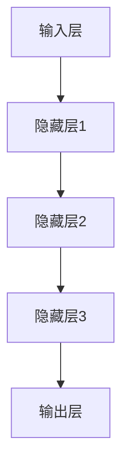
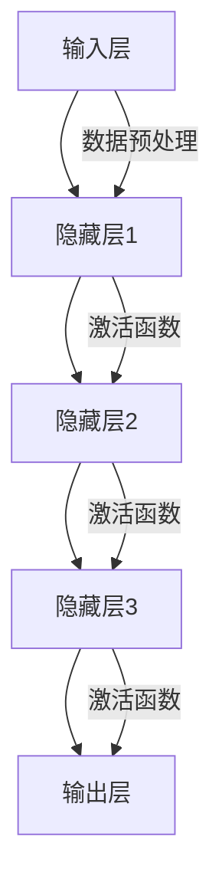
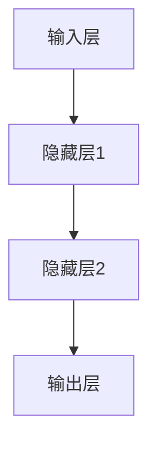

                 

# 《AI大模型创业方案书》

## 关键词
人工智能，大模型，创业，案例分析，技术基础，应用场景

## 摘要
本文旨在为想要在人工智能（AI）大模型领域创业的人提供一份详细的指导方案。通过系统分析AI大模型的基础知识、技术基础、应用场景、创业案例分析、创业策略和未来趋势，本文旨在帮助创业者深入了解AI大模型领域的本质，识别创业机会，规避风险，并掌握有效的创业策略。文章结构清晰，内容丰富，适合AI领域的创业者、技术爱好者和研究人员参考。

## 目录大纲

### 第一部分: AI大模型基础知识

#### 第1章: AI大模型概述
- **1.1 AI大模型的概念**
- **1.2 AI大模型的发展历程**
- **1.3 AI大模型的特点**
- **1.4 Mermaid流程图：AI大模型架构**

#### 第2章: AI大模型技术基础
- **2.1 神经网络基础**
- **2.2 深度学习算法**
- **2.3 自然语言处理技术**
- **2.4 Mermaid流程图：深度学习架构**

#### 第3章: AI大模型应用场景
- **3.1 人工智能在金融领域的应用**
- **3.2 人工智能在医疗领域的应用**
- **3.3 人工智能在零售领域的应用**

#### 第4章: AI大模型创业案例分析
- **4.1 案例一：人工智能在金融领域的创业实践**
- **4.2 案例二：人工智能在医疗领域的创业实践**
- **4.3 案例三：人工智能在零售领域的创业实践**

#### 第5章: AI大模型创业策略
- **5.1 创业团队建设**
- **5.2 创业项目规划**
- **5.3 创业融资策略**

#### 第6章: AI大模型创业风险与应对
- **6.1 创业风险识别**
- **6.2 风险管理策略**
- **6.3 应对策略**

#### 第7章: AI大模型创业的未来趋势
- **7.1 未来发展趋势分析**
- **7.2 创业机会与挑战**
- **7.3 创业者应具备的素质与能力**

### 附录
- **附录A: AI大模型开发工具与资源**
  - **A.1 主流深度学习框架对比**
  - **A.2 开发环境搭建指南**
  - **A.3 实用开发技巧与经验分享**

### 脚注
- **参考文献**
- **作者信息**
  - 作者：AI天才研究院/AI Genius Institute & 禅与计算机程序设计艺术 /Zen And The Art of Computer Programming

### 第1章: AI大模型概述

#### 1.1 AI大模型的概念

AI大模型，即人工智能大型模型，是指采用深度学习技术训练的，具有大规模参数和网络架构的神经网络模型。这些模型在训练过程中通常需要大量的数据和计算资源，其目标是实现对复杂任务的自动化处理，如图像识别、自然语言处理、语音识别等。

一个典型的AI大模型通常包含以下几个关键组成部分：

1. **输入层（Input Layer）**：接收外部输入的数据，如图像、文本、音频等。
2. **隐藏层（Hidden Layers）**：进行特征提取和变换，包含多层神经网络。
3. **输出层（Output Layer）**：根据模型类型生成相应的输出结果，如分类标签、预测值等。

#### 1.2 AI大模型的发展历程

AI大模型的发展可以追溯到20世纪80年代，当时神经网络开始应用于人工智能领域。然而，由于计算资源和数据集的限制，早期的大模型发展相对缓慢。随着计算能力的提升和数据量的爆发增长，AI大模型的研究和应用得到了极大的推动。

- **1990年代**：反向传播算法的提出和改进，使神经网络的训练更加高效。
- **2012年**：AlexNet模型的提出，标志着深度学习在图像识别任务中取得了突破性成果。
- **2015年**：Google Brain的团队提出了使用1.6万个CPU核心和个GPU核心训练的神经网络，展示了AI大模型在计算资源需求上的巨大增长。
- **2017年**：谷歌推出了BERT模型，进一步推动了自然语言处理领域的进展。

#### 1.3 AI大模型的特点

AI大模型具有以下几个显著特点：

1. **高参数量**：AI大模型通常包含数十亿甚至千亿级别的参数，这使得模型在处理复杂任务时具有更高的灵活性和准确性。
2. **大规模数据训练**：大模型的训练需要大量的数据，这些数据不仅包括训练集，还需要验证集和测试集，以确保模型的泛化能力。
3. **高计算资源需求**：大模型的训练和推理通常需要强大的计算资源，包括高性能的CPU、GPU和TPU等。
4. **网络架构复杂**：AI大模型通常具有多层的神经网络架构，通过逐层提取和变换数据，实现从低级到高级的特征表示。

#### 1.4 Mermaid流程图：AI大模型架构

下面是一个简单的Mermaid流程图，展示了AI大模型的基本架构：



### 总结

本章概述了AI大模型的基本概念、发展历程和特点。AI大模型以其高参数量、大规模数据训练、高计算资源需求以及复杂的网络架构，成为人工智能领域的重要研究与应用方向。在接下来的章节中，我们将进一步探讨AI大模型的技术基础、应用场景以及创业实践，帮助读者全面了解这一领域。

---

### 1.1 AI大模型的概念

AI大模型是人工智能领域中的一个重要分支，它通过深度学习技术训练出的具有大规模参数和网络结构的神经网络模型。这些模型在处理复杂任务时具有极高的准确性和灵活性，是现代人工智能技术的核心组成部分。

首先，我们需要了解什么是深度学习。深度学习是一种机器学习的方法，它通过模拟人脑的神经网络结构，对数据进行自动化的特征提取和模式识别。与传统机器学习方法相比，深度学习模型具有更强的非线性建模能力和更高的泛化能力。

在深度学习中，神经网络是最核心的组成部分。神经网络由多个神经元（或节点）组成，每个神经元都接收来自前一层神经元的输入，通过加权求和并加上偏置项，最后通过激活函数输出一个结果。这种层与层之间的连接和信息的传递过程，构成了神经网络的训练和预测过程。

AI大模型的特点之一是其拥有巨大的参数规模。一个典型的AI大模型可以包含数百万甚至数十亿个参数。这些参数在训练过程中通过学习大量数据，自动调整权重，从而优化模型的性能。这种大规模参数的优势在于，它能够捕捉到数据中的复杂模式和规律，从而实现更高的准确性和泛化能力。

另一个显著特点是大模型通常需要大规模的数据集进行训练。数据是AI大模型的基础，只有通过大量的数据训练，模型才能学习到足够的信息，从而在未知数据上实现良好的泛化效果。训练数据集不仅包括训练集，还需要包括验证集和测试集，以确保模型的泛化能力和鲁棒性。

此外，AI大模型在计算资源需求上也非常高。大模型的训练过程通常需要大量的计算资源，包括高性能的CPU、GPU和TPU等。这些计算资源的高效利用和优化，对于加速模型训练和推理过程至关重要。

AI大模型的应用范围非常广泛，包括图像识别、自然语言处理、语音识别、推荐系统、金融风控等众多领域。在图像识别方面，AI大模型如ResNet和Inception在ImageNet比赛上取得了优异的成绩；在自然语言处理方面，BERT和GPT等模型推动了语言理解和生成任务的进展；在语音识别方面，DeepSpeech和WaveNet等模型实现了高准确率的语音转文字。

总的来说，AI大模型以其高参数量、大规模数据训练、高计算资源需求以及复杂的网络架构，成为人工智能领域的重要研究方向和应用方向。在下一节中，我们将进一步探讨AI大模型的发展历程，了解这一领域的发展脉络。

### 1.2 AI大模型的发展历程

AI大模型的发展历程可以追溯到20世纪80年代，当时神经网络作为一种模拟人脑的数学模型，开始引起科研人员的关注。早期的研究主要集中在简单的神经网络结构，如感知机（Perceptron）和多层感知机（MLP），但由于计算资源和数据集的限制，这些模型的性能和实际应用效果并不理想。

#### 1980年代：早期神经网络研究

在20世纪80年代，反向传播算法（Backpropagation Algorithm）的提出和改进，使神经网络训练变得更加高效。反向传播算法通过反向传播误差信号，逐层调整网络的权重和偏置，从而优化模型性能。这一算法的提出标志着神经网络开始进入一个新阶段。

然而，由于当时计算机性能的限制，神经网络的训练速度非常慢，且所需的数据量巨大。因此，尽管神经网络在理论上具有强大的非线性建模能力，但在实际应用中的效果仍然有限。

#### 1990年代：深度学习初步探索

进入20世纪90年代，随着计算机性能的提升和大数据时代的到来，深度学习开始得到更多的关注。1992年，澳大利亚学者Bengio等人在《Neural Computation》上发表了一篇论文，提出了一种多层感知机（MLP）的训练方法，这被视为深度学习的一个早期突破。

同时，1995年Hinton等人在《Learning representations by back-propagating errors》一文中，提出了“瓶颈层”（Bottleneck Layer）的概念，通过压缩中间层的节点数量，提高了模型的泛化能力。

然而，尽管这些研究为深度学习奠定了基础，但由于当时计算资源的限制，深度学习的应用仍然面临很大的挑战。

#### 2012年：深度学习的突破

2012年，Hinton等人提出了一种名为AlexNet的卷积神经网络（CNN），并在ImageNet大型视觉识别挑战赛上取得了当时最好的成绩。AlexNet采用了包括ReLU激活函数、Dropout正则化以及局部响应归一化等创新技术，显著提高了模型的训练效率和识别准确率。

AlexNet的成功标志着深度学习在图像识别领域的突破，引起了广泛关注。随后，深度学习开始迅速发展，并在语音识别、自然语言处理等领域取得了显著的成果。

#### 2015年：谷歌的DeepMind项目

2015年，谷歌的DeepMind团队发布了名为“谷歌大脑”的项目，展示了使用1.6万个CPU核心和个GPU核心训练的神经网络模型。这个模型通过在大量数据上训练，实现了在棋类游戏和视觉任务中的超高性能。

谷歌DeepMind的项目展示了AI大模型在计算资源需求上的巨大增长，同时也推动了深度学习技术在工业和商业领域中的应用。

#### 2017年：BERT模型的提出

2017年，谷歌发布了BERT（Bidirectional Encoder Representations from Transformers）模型，这是自然语言处理领域的一个重大突破。BERT模型通过双向编码器结构，对文本序列进行建模，从而显著提高了自然语言理解任务的性能。

BERT的成功不仅推动了自然语言处理领域的发展，也为AI大模型在其他领域的应用提供了新的思路。

#### 2020年至今：AI大模型的持续发展

进入2020年，随着深度学习技术的不断进步和计算资源的进一步提升，AI大模型的应用范围和性能也在持续提升。例如，GPT-3等语言模型在文本生成、问答系统等任务中表现出色；Transformer结构在图像生成、视频处理等领域取得了突破性成果。

总之，AI大模型的发展历程从早期的研究到如今的广泛应用，经历了多个重要阶段。每个阶段都有突破性的技术和应用成果，推动了人工智能技术的不断进步。在下一节中，我们将进一步探讨AI大模型的特点，深入理解这一领域的独特之处。

### 1.3 AI大模型的特点

AI大模型以其高参数量、大规模数据训练、高计算资源需求以及复杂的网络架构，成为人工智能领域的重要研究与应用方向。以下是AI大模型的一些关键特点：

#### 1.3.1 高参数量

AI大模型通常包含数百万甚至数十亿个参数。这些参数是模型学习数据中的复杂模式、特征和规律的重要手段。高参数量使得模型在处理复杂任务时能够捕捉到更多的信息，从而提高模型的准确性和泛化能力。

例如，在图像识别任务中，一个典型的AI大模型可能包含数亿个参数，这些参数通过学习大量的图像数据，自动调整权重，从而实现高效的图像分类和识别。

#### 1.3.2 大规模数据训练

大模型的训练需要大量的数据，这些数据不仅包括训练集，还需要包括验证集和测试集，以确保模型的泛化能力和鲁棒性。大规模数据集的利用使得模型可以从更多的样本中学习到有效的特征，从而提高模型的性能。

例如，在自然语言处理领域，BERT模型使用了数万亿个单词的训练数据，这些数据涵盖了大量的语言模式和规律，使得模型在语言理解任务中表现出色。

#### 1.3.3 高计算资源需求

大模型的训练和推理通常需要强大的计算资源，包括高性能的CPU、GPU和TPU等。这些计算资源的高效利用和优化，对于加速模型训练和推理过程至关重要。

例如，在训练一个大型图像识别模型时，可能需要使用数千个GPU并行计算，以加快训练速度和提高模型性能。

#### 1.3.4 网络架构复杂

AI大模型通常具有多层的神经网络架构，通过逐层提取和变换数据，实现从低级到高级的特征表示。复杂的网络架构使得模型能够处理更复杂的数据类型和任务，从而提高模型的灵活性和适应能力。

例如，在Transformer模型中，通过自注意力机制和多头注意力机制，模型能够高效地处理长文本序列，实现高质量的文本生成和翻译。

#### 1.3.5 强大的非线性建模能力

AI大模型通过多层神经网络的结构，具有强大的非线性建模能力。这种能力使得模型能够学习到数据中的复杂非线性关系，从而在多种任务中表现出优异的性能。

例如，在语音识别任务中，深度神经网络通过学习语音信号的时频特征，能够准确地将语音转换为文本，从而实现高效的语音转文字功能。

#### 1.3.6 广泛的应用领域

AI大模型的应用范围非常广泛，包括图像识别、自然语言处理、语音识别、推荐系统、金融风控等众多领域。在图像识别方面，AI大模型如ResNet和Inception在ImageNet比赛上取得了优异的成绩；在自然语言处理方面，BERT和GPT等模型推动了语言理解和生成任务的进展；在语音识别方面，DeepSpeech和WaveNet等模型实现了高准确率的语音转文字。

#### 1.3.7 持续的技术进步

随着深度学习技术的不断进步和计算资源的进一步提升，AI大模型的性能和应用范围也在持续提升。例如，GPT-3等语言模型在文本生成、问答系统等任务中表现出色；Transformer结构在图像生成、视频处理等领域取得了突破性成果。

总之，AI大模型以其高参数量、大规模数据训练、高计算资源需求以及复杂的网络架构，成为人工智能领域的重要发展方向。在下一章中，我们将进一步探讨AI大模型的技术基础，了解支持其发展的核心技术和算法。

### 1.4 Mermaid流程图：AI大模型架构

为了更好地理解AI大模型的架构，我们可以使用Mermaid流程图来展示其基本组成部分和训练过程。以下是一个简化的流程图示例：



在这个流程图中：

- **A[输入层]**：接收外部输入的数据，如图像、文本等。
- **B[隐藏层1]**、**C[隐藏层2]**、**D[隐藏层3]**：进行特征提取和变换，每一层隐藏层都对输入数据进行处理，提取更高级别的特征。
- **E[输出层]**：生成模型的最终输出结果，如分类标签、预测值等。

此外，数据预处理、激活函数等关键步骤也在图中进行了标注：

- **数据预处理**：对输入数据进行标准化、归一化等预处理操作，以适应模型的输入要求。
- **激活函数**：在每个隐藏层后使用激活函数（如ReLU、Sigmoid、Tanh等），以引入非线性变换，增强模型的建模能力。

这个流程图提供了一个直观的视图，展示了AI大模型的基本架构和训练过程，有助于读者更好地理解AI大模型的工作原理。

### 第2章: AI大模型技术基础

#### 2.1 神经网络基础

神经网络（Neural Networks）是AI大模型的核心组成部分，其基本原理源于对人脑神经元的模拟。神经网络通过一系列的数学计算和层级结构，实现了从输入到输出的映射，从而完成特定任务的自动化处理。理解神经网络的基础知识是掌握AI大模型技术的基础。

##### 2.1.1 神经元与神经网络

神经元是神经网络的基本单元，它接收输入信号，通过加权求和和激活函数，产生输出信号。一个简单的神经元模型可以表示为：

$$
y = \sigma(\sum_{i=1}^{n} w_i x_i + b)
$$

其中，$y$是输出，$x_i$是第$i$个输入，$w_i$是输入的权重，$b$是偏置项，$\sigma$是激活函数。

神经网络由多个层次组成，包括输入层、隐藏层和输出层。输入层接收外部输入数据，隐藏层对输入数据进行特征提取和变换，输出层生成最终的结果。一个典型的神经网络结构如下所示：



在这个结构中，每个节点（神经元）都与其他节点通过权重相连，形成复杂的网络结构。

##### 2.1.2 激活函数

激活函数是神经网络中的一个关键组件，它引入了非线性的特性，使得神经网络能够学习复杂的非线性关系。常见的激活函数包括：

- **Sigmoid函数**：
$$
\sigma(x) = \frac{1}{1 + e^{-x}}
$$

- **ReLU函数**（Rectified Linear Unit）：
$$
\sigma(x) = \max(0, x)
$$

- **Tanh函数**：
$$
\sigma(x) = \tanh(x) = \frac{e^x - e^{-x}}{e^x + e^{-x}}
$$

这些激活函数具有不同的性质和适用场景，但它们的核心目的是增加模型的非线性能力。

##### 2.1.3 前向传播与反向传播

神经网络的主要工作流程包括前向传播（Forward Propagation）和反向传播（Backpropagation）。

- **前向传播**：在训练过程中，输入数据从输入层进入神经网络，通过每个层次的神经元，最终在输出层得到输出结果。这个过程称为前向传播。

- **反向传播**：前向传播完成后，网络会计算实际输出与期望输出之间的误差。然后，通过反向传播算法，将这些误差反向传递到每个层次的神经元，并更新各层的权重和偏置项。这个过程称为反向传播。

反向传播算法的核心是梯度下降（Gradient Descent），它通过计算权重的梯度来更新权重，以最小化误差函数。

##### 2.1.4 训练与优化

神经网络的训练过程是一个优化过程，目标是找到一组权重和偏置，使得模型的误差最小。训练过程中常用的优化算法包括：

- **随机梯度下降（Stochastic Gradient Descent, SGD）**：每次更新权重时使用整个训练数据集的梯度。
- **批量梯度下降（Batch Gradient Descent）**：每次更新权重时使用整个训练数据集的梯度。
- **小批量梯度下降（Mini-batch Gradient Descent）**：每次更新权重时使用一部分训练数据集的梯度。

除了优化算法，正则化技术（如L1正则化、L2正则化）和dropout技术也常用于防止过拟合和提升模型性能。

##### 总结

神经网络是AI大模型的核心组成部分，其基础理论包括神经元、激活函数、前向传播和反向传播等。通过这些基本概念，神经网络能够学习和提取数据中的复杂特征，从而实现多种复杂的任务。在下一节中，我们将进一步探讨深度学习算法，了解如何通过更复杂的网络结构和算法提升模型性能。

### 2.2 深度学习算法

深度学习（Deep Learning）是AI大模型领域的关键技术，它通过模拟人脑神经网络的结构和工作机制，实现对数据的自动特征提取和模式识别。与传统的机器学习方法相比，深度学习具有更强的表达能力和更好的泛化能力，使得它在图像识别、自然语言处理、语音识别等领域取得了显著的进展。

#### 2.2.1 卷积神经网络（Convolutional Neural Networks, CNN）

卷积神经网络（CNN）是深度学习中的一种重要模型，它特别适用于处理具有网格结构的数据，如图像和语音信号。CNN的核心组件是卷积层（Convolutional Layers）、池化层（Pooling Layers）和全连接层（Fully Connected Layers）。

- **卷积层**：卷积层通过卷积运算从输入数据中提取局部特征。卷积运算利用一个卷积核（Convolutional Kernel）在输入数据上滑动，计算每个局部区域的加权和，然后通过激活函数产生特征映射。卷积层能够有效地减少数据的维度并提取具有空间不变性的特征。

  $$  
  \text{卷积层输出} = \text{卷积核} * \text{输入数据} + \text{偏置项}  
  $$

- **池化层**：池化层用于降低数据的维度和参数数量，同时保留重要特征。常见的池化方法包括最大池化（Max Pooling）和平均池化（Average Pooling）。最大池化选择每个局部区域中的最大值，而平均池化计算每个局部区域的平均值。池化层能够提高模型的鲁棒性和减少过拟合。

- **全连接层**：全连接层将卷积层和池化层提取的特征映射到最终的输出结果。全连接层通过将每个特征映射与权重矩阵相乘，然后通过激活函数产生输出结果。全连接层通常用于分类任务，将特征映射到类别标签。

  $$  
  \text{全连接层输出} = \text{权重矩阵} * \text{特征映射} + \text{偏置项}  
  $$

#### 2.2.2 循环神经网络（Recurrent Neural Networks, RNN）

循环神经网络（RNN）是一种适用于处理序列数据（如文本、时间序列数据）的深度学习模型。RNN通过将当前输入与前一时刻的隐藏状态进行连接，形成一个循环结构，从而实现对序列数据的建模。

- **隐藏状态**：RNN通过隐藏状态（Hidden State）来存储和传递序列信息。在每个时间步，RNN将当前输入与前一时刻的隐藏状态相加，通过激活函数生成新的隐藏状态。隐藏状态包含了序列中的历史信息，从而使得RNN能够捕捉序列中的长期依赖关系。

  $$  
  \text{隐藏状态} \ h_t = \text{激活函数} (\text{当前输入} + \text{上一时刻隐藏状态})  
  $$

- **门控机制**：为了解决RNN中的梯度消失和梯度爆炸问题，门控循环单元（Gated Recurrent Unit, GRU）和长短期记忆网络（Long Short-Term Memory, LSTM）被提出。门控机制通过引入更新门（Update Gate）和输出门（Output Gate）来控制信息的流动，从而有效地捕捉序列中的长期依赖关系。

  $$  
  \text{更新门} \ z_t = \sigma(W_z \cdot [h_{t-1}, x_t] + b_z)  
  $$  
  $$  
  \text{输出门} \ r_t = \sigma(W_r \cdot [h_{t-1}, x_t] + b_r)  
  $$  
  $$  
  \text{隐藏状态} \ h_t = (1 - z_t) \cdot o_{t-1} + z_t \cdot \text{激活函数} (W_h \cdot [r_t \cdot x_t] + b_h)  
  $$

#### 2.2.3 变换器（Transformers）

变换器（Transformers）是一种基于自注意力机制的深度学习模型，它在自然语言处理领域取得了显著的进展。Transformer通过自注意力机制（Self-Attention）和多头注意力机制（Multi-Head Attention）来建模输入序列中的依赖关系，从而实现对序列数据的全局理解和生成。

- **自注意力机制**：自注意力机制通过计算输入序列中每个元素与自身之间的相似度，生成新的特征表示。这种机制能够自动地学习输入序列中的长距离依赖关系。

  $$  
  \text{自注意力} \ \text{Scores} = \text{Query} \cdot \text{Key}^T / \sqrt{d_k}  
  $$

  $$  
  \text{Attention} = \text{Softmax}(\text{Scores})  
  $$

  $$  
  \text{Output} = \text{Attention} \cdot \text{Value}  
  $$

- **多头注意力机制**：多头注意力机制通过将输入序列分成多个头，每个头独立计算注意力权重，从而提高模型的表示能力和准确性。

  $$  
  \text{Multi-Head Attention} = \text{Concat}(\text{Head}_1, \text{Head}_2, ..., \text{Head}_h) \cdot \text{Linear}  
  $$

  $$  
  \text{Output} = \text{Concat}(\text{Head}_1, \text{Head}_2, ..., \text{Head}_h) \cdot \text{Linear}  
  $$

#### 2.2.4 编码器-解码器（Encoder-Decoder）

编码器-解码器（Encoder-Decoder）模型是用于序列到序列（Sequence-to-Sequence）任务的一种重要架构，如机器翻译、文本生成等。编码器将输入序列编码为一个固定长度的向量表示，解码器则通过这个表示生成输出序列。

- **编码器**：编码器将输入序列编码为一个上下文向量，该向量包含了输入序列的语义信息。

  $$  
  \text{Encoder} (\text{Input}) \rightarrow \text{Context Vector}  
  $$

- **解码器**：解码器通过上下文向量生成输出序列，通常使用循环神经网络（RNN）或变换器（Transformer）作为解码器。

  $$  
  \text{Decoder} (\text{Context Vector}, \text{Target}) \rightarrow \text{Output Sequence}  
  $$

#### 2.2.5 总结

深度学习算法通过模拟人脑神经网络的工作机制，实现了对数据的自动特征提取和模式识别。卷积神经网络（CNN）适用于处理具有网格结构的数据，如图像；循环神经网络（RNN）和变换器（Transformers）适用于处理序列数据，如文本和时间序列；编码器-解码器（Encoder-Decoder）模型则用于序列到序列的任务。这些深度学习算法的提出和优化，使得AI大模型在图像识别、自然语言处理、语音识别等领域取得了显著的进展。在下一节中，我们将进一步探讨自然语言处理技术，了解如何使用深度学习技术处理和生成自然语言。

### 2.3 自然语言处理技术

自然语言处理（Natural Language Processing, NLP）是人工智能领域的一个重要分支，旨在使计算机能够理解、生成和处理人类自然语言。随着深度学习技术的发展，NLP取得了显著的进展，特别是在语言建模、语义理解和文本生成等方面。以下是NLP的一些关键技术和算法：

#### 2.3.1 词嵌入（Word Embedding）

词嵌入是将自然语言中的词语映射到高维向量空间的过程，使得计算机能够以数字化的形式处理文本数据。词嵌入技术通过捕捉词语的语义和语法关系，实现了对文本数据的低维表示。

- **基于频率的词嵌入**：这种方法使用词的频率信息来生成词向量，例如TF-IDF（Term Frequency-Inverse Document Frequency）算法。然而，这种方法无法捕捉词语的语义关系。

- **基于分布的词嵌入**：这类方法通过捕捉词语在上下文中的分布特征来生成词向量，如Word2Vec（用于计算词语的共现关系）、GloVe（用于计算词语的语义关系）和FastText（用于多维度表示词语）。

  $$  
  \text{Word2Vec}：\text{vec}(w) = \text{sgn}(x_1, x_2, ..., x_n) \cdot \text{softmax}(\text{W} \cdot \text{h}(w))  
  $$

  $$  
  \text{GloVe}：\text{vec}(w) = (\text{f}(t, w), \text{f}(w, t))  
  $$

#### 2.3.2 语言模型（Language Model）

语言模型是NLP中的基础组件，用于预测下一个词语或词组。语言模型通过统计方法或深度学习技术，建模词语之间的概率关系。

- **基于N-gram的语言模型**：这种方法使用N个连续词语的历史信息来预测下一个词语。N-gram模型简单有效，但在长距离依赖关系上表现较差。

- **深度神经网络语言模型**：这类模型通过多层神经网络结构，捕捉更复杂的语言特征。例如，Long Short-Term Memory（LSTM）和Transformer模型在语言建模任务中表现出色。

  $$  
  \text{LSTM}：h_t = \text{sigmoid}([h_{t-1}, x_t] \cdot W_h) \odot \text{tanh}([h_{t-1}, x_t] \cdot W)  
  $$

  $$  
  \text{Transformer}：\text{Attention} = \text{softmax}(\text{Q} \cdot \text{K}^T / \sqrt{d_k}) \cdot \text{V}  
  $$

#### 2.3.3 语义理解（Semantic Understanding）

语义理解是NLP的核心目标之一，旨在使计算机能够理解文本的深层含义。以下是一些常用的语义理解技术：

- **实体识别（Named Entity Recognition, NER）**：NER用于识别文本中的命名实体，如人名、地名、组织名等。

- **关系抽取（Relation Extraction）**：关系抽取用于识别文本中实体之间的语义关系，如“苹果”和“公司”之间的关系。

- **文本分类（Text Classification）**：文本分类用于将文本数据分类到预定义的类别中，如情感分析、主题分类等。

- **情感分析（Sentiment Analysis）**：情感分析用于识别文本中的情感倾向，如正面、负面或中性。

- **问答系统（Question Answering, QA）**：问答系统用于从文本数据中回答用户的问题。

#### 2.3.4 文本生成（Text Generation）

文本生成是NLP的一个重要应用，旨在使计算机能够生成自然语言的文本。以下是一些常用的文本生成技术：

- **基于模板的生成**：这种方法使用预定义的模板和填充词来生成文本，如自动摘要、自动邮件回复等。

- **基于序列模型的生成**：这类模型通过学习文本序列的分布，生成新的文本序列。例如，RNN、LSTM和Transformer等模型在文本生成任务中表现出色。

- **生成对抗网络（Generative Adversarial Networks, GAN）**：GAN通过生成器和判别器的对抗训练，生成高质量的文本。

  $$  
  \text{Generator}: G(z)  
  $$

  $$  
  \text{Discriminator}: D(x, G(z))  
  $$

  $$  
  \text{GAN Loss}: L(G, D) = -\text{E}[\log D(x)] - \text{E}[\log(1 - D(G(z)))]  
  $$

#### 2.3.5 总结

自然语言处理技术通过词嵌入、语言模型、语义理解和文本生成等多种方法，使计算机能够理解和生成自然语言。这些技术的进步大大提高了计算机在文本处理、信息提取和智能交互等领域的性能。在下一章中，我们将探讨AI大模型在不同应用场景中的具体应用，了解其在金融、医疗和零售等领域的实践案例。

### 第3章: AI大模型应用场景

#### 3.1 人工智能在金融领域的应用

人工智能（AI）在金融领域具有广泛的应用，通过AI大模型，金融机构能够提高效率、降低成本并提升风险管理能力。以下是一些关键应用场景：

##### 3.1.1 风险管理

AI大模型在金融风险管理中的应用主要体现在信用评分、市场预测和风险监控等方面。

- **信用评分**：金融机构使用AI大模型对借款人的信用状况进行评估。这些模型通过分析借款人的历史数据（如收入、信用记录等），自动计算出信用评分，从而帮助金融机构做出放贷决策。

  $$  
  \text{信用评分} = f(\text{历史数据})  
  $$

- **市场预测**：AI大模型可以通过分析大量的市场数据，预测股票价格、外汇汇率等金融市场走势。这些预测模型能够帮助投资者制定更合理的投资策略，并降低投资风险。

  $$  
  \text{市场走势} = f(\text{历史数据}, \text{当前数据})  
  $$

- **风险监控**：金融机构使用AI大模型监控交易活动，识别潜在的欺诈行为。这些模型通过实时分析交易数据，发现异常交易模式，从而提高欺诈检测的准确性。

  $$  
  \text{欺诈检测} = f(\text{交易数据}, \text{历史数据})  
  $$

##### 3.1.2 量化交易

量化交易是指使用数学模型和算法进行自动化交易，AI大模型在量化交易中发挥着重要作用。

- **交易策略**：AI大模型通过分析市场数据，生成高效的交易策略。这些策略可以基于技术分析、基本面分析或两者结合，从而提高交易的胜率和收益。

  $$  
  \text{交易策略} = f(\text{市场数据}, \text{历史数据})  
  $$

- **模型优化**：AI大模型通过不断学习和调整，优化交易模型。这种优化过程包括参数调整、模型选择和策略迭代，以提高交易策略的稳定性和收益。

  $$  
  \text{优化过程} = f(\text{模型}, \text{市场数据}, \text{历史数据})  
  $$

##### 3.1.3 客户服务

AI大模型在金融领域的客户服务应用主要体现在智能客服、虚拟顾问和个性化推荐等方面。

- **智能客服**：金融机构使用AI大模型构建智能客服系统，通过自然语言处理技术理解和回答客户的查询。这些系统能够处理大量的客户请求，提高服务效率和客户满意度。

  $$  
  \text{客服回答} = f(\text{客户查询}, \text{知识库})  
  $$

- **虚拟顾问**：AI大模型可以模拟金融顾问，为客户提供投资建议和理财规划。这些虚拟顾问通过分析客户的财务状况和风险偏好，提供个性化的金融服务。

  $$  
  \text{投资建议} = f(\text{客户信息}, \text{市场数据})  
  $$

- **个性化推荐**：金融机构使用AI大模型分析客户的交易记录和偏好，推荐合适的金融产品和服务。这种个性化推荐能够提高客户的满意度和忠诚度。

  $$  
  \text{推荐系统} = f(\text{客户数据}, \text{产品数据})  
  $$

##### 3.1.4 智能投顾

智能投顾是利用AI大模型提供资产管理服务的一种新兴模式。智能投顾通过分析客户的投资目标和风险偏好，制定个性化的投资组合，并实时调整以应对市场变化。

- **投资组合优化**：AI大模型通过分析市场数据和历史投资记录，优化投资组合，以实现最佳的风险收益平衡。

  $$  
  \text{投资组合} = f(\text{市场数据}, \text{客户信息})  
  $$

- **实时调整**：智能投顾系统通过实时监控市场动态，及时调整投资组合，以应对市场变化。

  $$  
  \text{调整策略} = f(\text{实时数据}, \text{投资组合})  
  $$

##### 总结

人工智能在金融领域的应用通过AI大模型实现了风险管理、量化交易、客户服务和智能投顾等多个方面的创新。这些应用不仅提高了金融机构的效率和竞争力，也为客户提供了更加便捷和个性化的金融服务。在下一节中，我们将探讨AI大模型在医疗领域的应用，了解其在诊断、治疗和健康管理等方面的实践案例。

### 3.2 人工智能在医疗领域的应用

人工智能（AI）在医疗领域的应用正迅速扩展，通过AI大模型，医疗行业能够实现更精准的诊断、个性化的治疗方案和高效的医疗管理。以下是AI大模型在医疗领域的一些关键应用场景：

##### 3.2.1 疾病诊断

AI大模型在疾病诊断中的应用主要利用图像识别、自然语言处理和深度学习技术，实现对医学图像和患者数据的分析。

- **医学图像诊断**：AI大模型能够自动识别和诊断医学图像中的病变区域，如肿瘤、心脏病等。例如，通过深度学习技术，AI模型可以在MRI、CT和X光片上识别肺癌和心脏病。

  $$  
  \text{疾病诊断} = f(\text{医学图像})  
  $$

- **病理切片分析**：AI大模型通过分析病理切片图像，帮助医生识别癌细胞和其他病理特征。这种方法能够提高癌症的早期诊断率，并减少误诊率。

  $$  
  \text{病理分析} = f(\text{病理切片图像})  
  $$

##### 3.2.2 治疗方案推荐

AI大模型可以基于患者的病史、基因数据和临床特征，推荐个性化的治疗方案。

- **个性化治疗**：通过分析大量的患者数据，AI大模型能够为特定疾病提供最优的治疗方案。例如，在癌症治疗中，AI模型可以推荐最佳的治疗药物组合和剂量。

  $$  
  \text{治疗方案} = f(\text{患者数据}, \text{临床特征})  
  $$

- **手术规划**：AI大模型可以辅助医生进行手术规划，通过分析患者的CT、MRI等图像，生成详细的手术路径和操作建议，提高手术的成功率和安全性。

  $$  
  \text{手术规划} = f(\text{患者图像}, \text{手术数据})  
  $$

##### 3.2.3 健康管理

AI大模型在健康管理中的应用可以帮助患者和医生监控健康状况、预防疾病和进行健康干预。

- **健康数据监控**：AI大模型可以通过分析患者的日常健康数据（如血压、心率、血糖等），实时监控患者的健康状况，提供预警和健康建议。

  $$  
  \text{健康监控} = f(\text{健康数据})  
  $$

- **疾病预测**：AI大模型通过分析患者的健康数据和家族病史，预测患者未来可能患的疾病，从而提前采取预防措施。

  $$  
  \text{疾病预测} = f(\text{健康数据}, \text{家族病史})  
  $$

- **个性化健康建议**：AI大模型根据患者的具体健康状况和需求，提供个性化的健康建议和生活方式调整方案。

  $$  
  \text{健康建议} = f(\text{患者数据}, \text{健康需求})  
  $$

##### 3.2.4 药物研发

AI大模型在药物研发中的应用可以加速新药发现、提高药物筛选效率和降低研发成本。

- **药物发现**：AI大模型通过分析大量的化学结构和药物数据，预测新的药物候选分子，从而加速药物研发进程。

  $$  
  \text{药物发现} = f(\text{化学结构}, \text{药物数据})  
  $$

- **药物筛选**：AI大模型可以快速评估药物候选分子的活性、毒性和代谢特性，从而筛选出最有潜力的药物候选。

  $$  
  \text{药物筛选} = f(\text{药物分子}, \text{活性数据}, \text{毒性数据})  
  $$

##### 3.2.5 总结

人工智能在医疗领域的应用通过AI大模型实现了疾病诊断、治疗方案推荐、健康管理和药物研发等多个方面的创新。这些应用不仅提高了医疗服务的效率和准确性，也为患者提供了更个性化的健康管理和治疗体验。随着AI技术的不断进步，未来医疗行业将迎来更加智能化和高效化的变革。在下一节中，我们将探讨AI大模型在零售领域的应用，了解其在个性化推荐、库存管理和客户关系管理等方面的实践案例。

### 3.3 人工智能在零售领域的应用

人工智能（AI）在零售行业的应用正日益广泛，通过AI大模型，零售商能够提高运营效率、优化供应链管理并增强客户体验。以下是AI大模型在零售领域的一些关键应用场景：

##### 3.3.1 个性化推荐

个性化推荐是AI在零售领域的一个重要应用，通过分析用户的历史行为和偏好，AI大模型能够为每位顾客推荐个性化的商品。

- **推荐算法**：AI大模型使用协同过滤（Collaborative Filtering）和基于内容的推荐（Content-Based Recommendation）等方法，生成个性化的推荐列表。协同过滤通过分析用户的相似性，推荐用户可能喜欢的商品；基于内容的推荐则通过分析商品的属性和用户的历史行为，推荐与用户兴趣相符的商品。

  $$  
  \text{推荐算法} = f(\text{用户行为}, \text{商品属性})  
  $$

- **实时推荐**：AI大模型通过实时分析用户的行为数据，如浏览历史、购买记录和搜索查询，动态生成个性化的推荐列表，从而提高用户的购物体验。

  $$  
  \text{实时推荐} = f(\text{实时数据}, \text{用户行为})  
  $$

##### 3.3.2 库存管理

AI大模型在库存管理中的应用可以帮助零售商优化库存水平，减少库存积压和缺货现象。

- **需求预测**：AI大模型通过分析历史销售数据、季节性因素和市场营销活动，预测未来的商品需求量。这些预测结果可以帮助零售商合理安排库存，避免过度库存或缺货。

  $$  
  \text{需求预测} = f(\text{历史销售数据}, \text{季节性因素}, \text{市场营销活动})  
  $$

- **库存优化**：AI大模型通过分析库存水平和销售数据，实时调整库存策略，确保库存水平与市场需求相匹配。

  $$  
  \text{库存优化} = f(\text{库存数据}, \text{销售数据}, \text{市场需求})  
  $$

##### 3.3.3 客户关系管理

AI大模型在客户关系管理中的应用可以帮助零售商更好地理解客户需求，提高客户满意度和忠诚度。

- **客户细分**：AI大模型通过分析客户的行为数据、购买记录和偏好，将客户分为不同的细分群体，以便于零售商制定个性化的营销策略。

  $$  
  \text{客户细分} = f(\text{客户数据}, \text{购买记录})  
  $$

- **个性化营销**：AI大模型通过分析客户的细分信息和偏好，生成个性化的营销活动，如优惠券、促销活动和推荐商品，从而提高营销效果。

  $$  
  \text{个性化营销} = f(\text{客户细分}, \text{客户偏好})  
  $$

- **客户服务**：AI大模型可以构建智能客服系统，通过自然语言处理技术理解和回答客户的查询，提供快速、准确的客户服务。

  $$  
  \text{客户服务} = f(\text{客户查询}, \text{知识库})  
  $$

##### 3.3.4 营销自动化

AI大模型在营销自动化中的应用可以帮助零售商自动化执行营销活动，提高营销效率和效果。

- **自动化营销**：AI大模型通过分析客户行为数据，自动触发营销活动，如电子邮件营销、社交媒体推广和短信通知，从而提高营销响应速度。

  $$  
  \text{自动化营销} = f(\text{客户行为}, \text{营销策略})  
  $$

- **营销优化**：AI大模型通过实时分析营销活动的效果数据，自动调整营销策略，以实现最佳的投资回报率（ROI）。

  $$  
  \text{营销优化} = f(\text{营销数据}, \text{效果分析})  
  $$

##### 3.3.5 总结

人工智能在零售领域的应用通过AI大模型实现了个性化推荐、库存管理、客户关系管理和营销自动化等多个方面的创新。这些应用不仅提高了零售商的运营效率和市场竞争力，也为消费者提供了更加个性化和便捷的购物体验。随着AI技术的不断进步，零售行业将迎来更加智能化和高效化的变革。在下一章中，我们将探讨AI大模型创业案例，了解具体企业在金融、医疗和零售领域的成功实践。

### 4.1 案例一：人工智能在金融领域的创业实践

#### 4.1.1 公司背景

“FinAI”是一家专注于金融领域的人工智能创业公司，成立于2018年。公司由几位在人工智能和金融科技领域具有丰富经验的专家创立，致力于通过AI大模型提供创新的金融解决方案。FinAI的愿景是通过人工智能技术，提升金融行业的效率、透明度和客户满意度。

#### 4.1.2 创业初衷

FinAI的创始人团队在金融科技领域积累了多年的经验，他们发现金融行业在风险管理、投资决策和客户服务等方面存在许多痛点。例如，金融机构在信用评分、市场预测和欺诈检测等方面依赖人工判断，效率低下且容易出现错误。因此，他们决定利用人工智能技术，构建高效、准确的金融模型，以帮助金融机构提升运营效率，降低风险，提高客户体验。

#### 4.1.3 创业策略

1. **技术研发**：FinAI将技术研发作为公司的核心战略，组建了一支由顶尖AI专家和金融专家组成的团队。团队专注于开发先进的AI大模型，如深度学习算法、自然语言处理和优化算法，以满足金融领域的特定需求。

2. **市场定位**：FinAI明确了其市场定位，专注于为中型金融机构提供定制化的AI解决方案。公司通过深入了解客户需求，提供个性化的产品和服务，从而建立竞争优势。

3. **合作伙伴**：FinAI与多家金融机构建立了战略合作关系，通过这些合作伙伴的反馈，公司不断优化产品，确保解决方案能够满足市场需求。

#### 4.1.4 成功案例

1. **信用评分系统**：FinAI开发了一款基于AI大模型的信用评分系统，该系统能够通过分析借款人的历史数据（如收入、信用记录等），自动计算出信用评分。与传统信用评分系统相比，FinAI的评分系统具有更高的准确性和效率，显著降低了金融机构的风险。

   $$  
   \text{信用评分} = f(\text{借款人数据})  
   $$

2. **市场预测工具**：FinAI推出了一款市场预测工具，该工具通过深度学习算法分析大量市场数据，预测股票价格、外汇汇率等金融市场走势。这个工具帮助投资者制定了更合理的投资策略，提高了投资收益。

   $$  
   \text{市场预测} = f(\text{市场数据})  
   $$

3. **欺诈检测系统**：FinAI开发了一款先进的欺诈检测系统，该系统能够实时监控交易活动，识别潜在的欺诈行为。该系统已经在多家金融机构部署，有效提高了欺诈检测的准确性和效率。

   $$  
   \text{欺诈检测} = f(\text{交易数据})  
   $$

#### 4.1.5 创业成果

自成立以来，FinAI取得了显著的成绩。公司不仅赢得了多个行业奖项，还获得了多家知名投资者的支持，累计融资金额超过1亿美元。FinAI的解决方案已广泛应用于银行、保险公司和投资公司等金融机构，为客户提供了高效的金融工具和优质的服务。

#### 4.1.6 创业经验与教训

FinAI的创业历程为其他AI领域创业者提供了宝贵的经验：

1. **技术研发为核心**：FinAI深知技术研发的重要性，始终保持对新技术的研究和投入，确保公司的核心竞争力。

2. **深入了解客户需求**：FinAI通过与客户紧密合作，深入了解客户需求，不断优化产品和服务。

3. **建立战略合作关系**：FinAI通过与金融机构建立战略合作关系，拓展了市场渠道，提高了品牌知名度。

4. **风险管理**：创业初期，FinAI注重风险管理，通过稳健的财务管理和风险控制策略，确保公司的稳定发展。

总之，FinAI的成功实践展示了AI大模型在金融领域的巨大潜力，为其他创业者提供了宝贵的经验和启示。在下一节中，我们将探讨人工智能在医疗领域的创业案例，了解AI大模型在该领域的应用和创新。

### 4.2 案例二：人工智能在医疗领域的创业实践

#### 4.2.1 公司背景

“MedAI”是一家专注于医疗领域的人工智能创业公司，成立于2016年。公司由几位在人工智能、医疗科技和生物信息学领域具有丰富经验的科学家和工程师共同创立，旨在通过AI大模型推动医疗诊断、治疗和健康管理的发展。

#### 4.2.2 创业初衷

MedAI的创始团队在医疗行业工作了多年，他们见证了医疗技术的进步和传统诊断手段的局限。他们决定利用人工智能技术，开发高效的诊断工具和个性化治疗方案，以提高医疗服务的质量和效率。创业初衷是帮助医生更快速、准确地诊断疾病，并为患者提供更个性化的健康管理方案。

#### 4.2.3 创业策略

1. **技术研发**：MedAI将技术研发作为公司发展的核心，组建了一支由顶尖人工智能专家、医疗专家和生物信息学家组成的团队。团队专注于开发基于深度学习和自然语言处理的AI大模型，以满足医疗领域的特定需求。

2. **产品研发**：MedAI首先研发了一款基于AI大模型的影像诊断系统，该系统能够自动识别和分析医学影像，如X光片、CT和MRI。系统通过分析影像数据，提供辅助诊断建议，帮助医生更快速、准确地诊断疾病。

   $$  
   \text{影像诊断} = f(\text{医学影像})  
   $$

3. **合作医疗机构**：MedAI与多家知名医疗机构建立了合作关系，通过这些合作，公司能够获取大量的医学影像数据和临床数据，用于模型的训练和优化。

4. **客户需求导向**：MedAI注重了解客户需求，通过与医生和患者的互动，不断优化产品功能，确保解决方案能够满足实际医疗需求。

#### 4.2.4 成功案例

1. **影像诊断系统**：MedAI的影像诊断系统在多家医院部署，并取得了显著的诊断效果。例如，在一项临床试验中，系统在乳腺癌筛查中达到了与资深医生相当的诊断准确率，显著提高了早期诊断的效率。

   $$  
   \text{诊断准确率} = f(\text{医学影像}) \approx \text{医生诊断准确率}  
   $$

2. **个性化治疗方案**：MedAI开发了一款基于AI大模型的个性化治疗方案推荐系统，该系统能够根据患者的病史、基因数据和临床特征，推荐最优的治疗方案。系统在多个癌症治疗中应用，显著提高了治疗效果和患者生存率。

   $$  
   \text{治疗方案} = f(\text{患者数据}, \text{临床特征})  
   $$

3. **健康管理系统**：MedAI推出了一款健康管理系统，通过分析患者的日常健康数据和家族病史，提供个性化的健康建议和预防措施。系统在多个慢性病管理中应用，帮助患者更好地管理健康状况，降低疾病风险。

   $$  
   \text{健康建议} = f(\text{健康数据}, \text{家族病史})  
   $$

#### 4.2.5 创业成果

MedAI自成立以来，取得了显著的成果。公司不仅赢得了多个行业奖项，还获得了多家知名风险投资公司的支持，累计融资金额超过5000万美元。MedAI的产品已广泛应用于医院、诊所和健康管理机构，为医生和患者提供了高效的医疗工具和优质的服务。

#### 4.2.6 创业经验与教训

MedAI的创业历程为其他医疗领域创业者提供了宝贵的经验：

1. **技术研发为核心**：MedAI深知技术研发的重要性，始终保持对新技术的研究和投入，确保公司的核心竞争力。

2. **与医疗机构合作**：MedAI通过与多家医疗机构建立合作关系，获取了丰富的医疗数据，为模型的训练和优化提供了强有力的支持。

3. **关注客户需求**：MedAI注重了解客户需求，通过与医生和患者的互动，不断优化产品功能，确保解决方案能够满足实际医疗需求。

4. **数据安全和隐私保护**：MedAI重视数据安全和隐私保护，采取了严格的措施确保患者数据的安全和隐私。

总之，MedAI的成功实践展示了AI大模型在医疗领域的巨大潜力，为其他创业者提供了宝贵的经验和启示。在下一节中，我们将探讨人工智能在零售领域的创业案例，了解AI大模型在个性化推荐和客户关系管理方面的应用和创新。

### 4.3 案例三：人工智能在零售领域的创业实践

#### 4.3.1 公司背景

“RetailAI”是一家专注于零售领域的人工智能创业公司，成立于2019年。公司由几位在人工智能、零售管理和电子商务领域具有丰富经验的专家和工程师共同创立，致力于通过AI大模型提升零售业的运营效率、客户体验和营销效果。

#### 4.3.2 创业初衷

RetailAI的创始团队在零售行业工作了多年，他们发现零售商在库存管理、客户关系管理和营销策略等方面面临诸多挑战。传统方法效率低下，无法满足快速变化的零售市场需求。因此，他们决定利用人工智能技术，开发智能化的零售解决方案，帮助零售商提高运营效率，增强客户体验。

#### 4.3.3 创业策略

1. **技术研发**：RetailAI将技术研发作为公司的核心战略，组建了一支由顶尖AI专家、零售专家和电子商务专家组成的团队。团队专注于开发基于深度学习和自然语言处理的AI大模型，以满足零售领域的特定需求。

2. **个性化推荐**：RetailAI开发了一款基于AI大模型的个性化推荐系统，该系统能够通过分析用户的历史行为、偏好和购买记录，推荐个性化的商品。系统采用了协同过滤和基于内容的推荐算法，确保推荐结果的相关性和准确性。

   $$  
   \text{个性化推荐} = f(\text{用户行为}, \text{商品属性})  
   $$

3. **库存管理**：RetailAI推出了一款智能库存管理系统，该系统能够通过分析历史销售数据、季节性因素和市场需求，预测未来的商品需求，帮助零售商优化库存水平，减少库存积压和缺货现象。

   $$  
   \text{需求预测} = f(\text{历史销售数据}, \text{季节性因素}, \text{市场需求})  
   $$

4. **客户关系管理**：RetailAI开发了一款智能客户关系管理系统，该系统能够通过分析客户的行为数据、购买记录和偏好，将客户分为不同的细分群体，并提供个性化的客户服务。系统还利用自然语言处理技术，自动回答客户的查询，提高客户满意度。

   $$  
   \text{客户细分} = f(\text{客户数据}, \text{购买记录})  
   $$

5. **营销自动化**：RetailAI推出了一款智能营销自动化系统，该系统能够通过分析用户行为和营销效果数据，自动触发个性化的营销活动，如电子邮件营销、社交媒体推广和短信通知。系统还根据实时数据调整营销策略，以实现最佳的投资回报率。

   $$  
   \text{自动化营销} = f(\text{用户行为}, \text{营销策略})  
   $$

#### 4.3.4 成功案例

1. **个性化推荐系统**：RetailAI的个性化推荐系统在多家电商平台部署，显著提高了用户的购物体验和平台的销售额。系统通过实时分析用户行为数据，动态调整推荐策略，确保推荐结果的相关性和准确性。

   $$  
   \text{销售额提升} = f(\text{个性化推荐系统})  
   $$

2. **智能库存管理系统**：RetailAI的智能库存管理系统在多家零售商部署，帮助客户优化库存水平，减少库存积压和缺货现象。系统通过实时分析销售数据和市场需求，生成库存优化建议，提高了库存周转率和销售额。

   $$  
   \text{库存周转率提升} = f(\text{智能库存管理系统})  
   $$

3. **智能客户关系管理系统**：RetailAI的智能客户关系管理系统在多家零售商部署，帮助客户更好地了解和满足客户需求，提高了客户满意度和忠诚度。系统通过分析客户数据，生成客户细分和个性化客户服务建议，提高了客户体验。

   $$  
   \text{客户满意度提升} = f(\text{智能客户关系管理系统})  
   $$

4. **营销自动化系统**：RetailAI的智能营销自动化系统在多家零售商部署，帮助客户实现高效的营销活动管理。系统通过实时分析用户行为和营销效果数据，自动触发个性化的营销活动，提高了营销效果和投资回报率。

   $$  
   \text{营销效果提升} = f(\text{营销自动化系统})  
   $$

#### 4.3.5 创业成果

RetailAI自成立以来，取得了显著的成果。公司不仅赢得了多个行业奖项，还获得了多家知名投资者的支持，累计融资金额超过3000万美元。RetailAI的解决方案已广泛应用于电商平台、线下零售商和超市，为客户提供了高效的零售工具和优质的服务。

#### 4.3.6 创业经验与教训

RetailAI的创业历程为其他AI领域创业者提供了宝贵的经验：

1. **技术研发为核心**：RetailAI深知技术研发的重要性，始终保持对新技术的研究和投入，确保公司的核心竞争力。

2. **深入了解客户需求**：RetailAI注重了解客户需求，通过与零售商和消费者的互动，不断优化产品功能，确保解决方案能够满足实际零售需求。

3. **与行业伙伴合作**：RetailAI与多家零售商和电商平台建立了合作关系，通过这些合作，公司能够获取市场渠道和客户资源。

4. **持续优化产品**：RetailAI通过持续优化产品，确保解决方案能够适应快速变化的零售市场。

总之，RetailAI的成功实践展示了AI大模型在零售领域的巨大潜力，为其他创业者提供了宝贵的经验和启示。在下一章中，我们将探讨AI大模型创业策略，分析如何有效地开展AI大模型创业活动。

### 5.1 创业团队建设

创业团队是AI大模型创业的核心，一个高效的团队能够为项目的成功奠定坚实的基础。以下是关于创业团队建设的关键步骤和注意事项：

#### 5.1.1 明确团队目标和使命

在组建团队之前，首先需要明确团队的目标和使命。这个目标应该具体、可量化，并且与AI大模型的创业方向紧密相关。例如，目标是开发一个用于金融领域的高级风险管理模型，或者是一个用于医疗影像的诊断系统。明确的目标有助于团队统一方向，提高协作效率。

#### 5.1.2 寻找合适的团队成员

团队成员的选择至关重要，需要具备以下几种能力：

- **技术能力**：团队成员应该具有扎实的技术背景，特别是在AI大模型相关的领域，如深度学习、自然语言处理和计算机视觉等。他们应该熟悉主流的深度学习框架和算法，能够独立完成模型的开发和优化。

- **业务理解**：团队成员需要具备一定的业务理解能力，了解AI大模型在特定领域的应用场景和需求。这有助于团队在技术实现过程中更好地结合业务需求，确保项目的实际价值。

- **项目管理**：团队成员需要具备良好的项目管理能力，能够合理安排时间和资源，确保项目按时交付。这包括任务分配、进度跟踪和风险管理等。

- **沟通协作**：团队成员之间需要具备良好的沟通协作能力，能够有效沟通和合作，共同解决问题。这有助于提高团队的效率和创造力。

#### 5.1.2 构建多元化的团队

多元化的团队能够带来不同的视角和思维方式，从而提高团队的创新能力。在团队成员的选择上，可以考虑以下多元化因素：

- **技术领域**：团队成员应涵盖不同的技术领域，如前端开发、后端开发和算法研究等，以确保团队能够处理各种技术挑战。

- **经验背景**：团队成员应具有不同的工作经验和背景，如学术界、工业界和创业公司等，从而丰富团队的知识结构和经验。

- **文化多样性**：团队成员应来自不同的文化背景，这有助于团队在跨文化交流和合作中更加包容和理解，从而提高团队的协作效率。

#### 5.1.3 制定有效的团队协作机制

为了确保团队的高效协作，需要制定一系列的协作机制和流程：

- **定期会议**：定期举行团队会议，讨论项目进展、解决问题和制定下一步计划。这有助于团队保持对项目的持续关注和协同工作。

- **任务分配**：明确每个成员的任务和职责，确保任务分配合理，避免重复劳动和资源浪费。任务分配应结合成员的能力和兴趣，以提高工作效率。

- **进度跟踪**：使用项目管理工具（如JIRA、Trello等）跟踪项目进度，确保每个任务都能按时完成。进度跟踪有助于团队及时发现和解决问题。

- **知识共享**：鼓励团队成员分享知识和经验，通过内部培训和会议等形式，提升团队的整体技能水平。知识共享有助于团队共同成长和进步。

#### 5.1.4 激励和培养团队

为了保持团队的高效运作和创新能力，需要关注团队成员的激励和培养：

- **激励机制**：建立合理的激励机制，如绩效奖励、股权激励等，以激发团队成员的工作热情和积极性。

- **职业发展**：为团队成员提供职业发展机会，如技术培训、管理培训等，帮助他们提升个人能力和职业素养。

- **工作环境**：营造良好的工作环境，包括舒适的工作空间、必要的工具和资源等，以提高团队成员的工作效率和满意度。

总之，创业团队建设是AI大模型创业成功的关键一步。通过明确团队目标和使命、寻找合适的团队成员、构建多元化的团队、制定有效的团队协作机制以及激励和培养团队，可以有效提升团队的工作效率和创新力，为AI大模型创业项目的成功奠定坚实的基础。

### 5.2 创业项目规划

创业项目规划是确保AI大模型创业项目成功的重要步骤，它包括明确项目目标、制定详细的项目计划、确定项目范围和优先级等。以下是创业项目规划的关键组成部分：

#### 5.2.1 明确项目目标

在项目规划的第一步，需要明确项目的目标。这些目标应具体、可量化，并与公司的愿景和使命紧密相关。例如，项目目标可以是在六个月内开发出一个用于金融领域的信用评分系统，或在一年内推出一个先进的医疗影像诊断系统。

- **具体目标**：明确项目的具体目标，如实现特定功能的AI大模型，完成特定任务的应用系统等。
- **可量化目标**：设定可量化的指标，如模型的准确率达到95%，用户注册量达到10000等。
- **时间目标**：确定项目完成的时间期限，以便于后续的项目规划和进度跟踪。

#### 5.2.2 制定项目计划

制定详细的项目计划是确保项目按计划推进的关键。项目计划应包括以下内容：

- **任务分解**：将项目分解为一系列具体的任务，每个任务应明确负责人、任务描述、开始时间和结束时间。
- **时间表**：制定项目的时间表，列出每个任务的开始和结束时间，以便于项目进度跟踪和管理。
- **资源分配**：明确每个任务的资源需求，包括人力资源、技术资源、财务资源等，并确保资源的合理分配和利用。

#### 5.2.3 确定项目范围和优先级

在项目规划过程中，需要明确项目的范围和优先级。这有助于确保项目目标实现的最大化，并避免项目范围蔓延。

- **项目范围**：明确项目的范围，包括项目的功能、性能和技术要求等。项目范围应具体、明确，以避免项目执行过程中出现不必要的变动和扩展。
- **优先级**：确定项目的优先级，根据项目的重要性和紧急性，将任务分为不同的优先级。例如，关键功能的实现应优先于非关键功能的开发。

#### 5.2.4 风险管理

在项目规划过程中，需要识别和评估潜在的风险，并制定相应的风险管理计划。

- **风险识别**：识别项目过程中可能面临的风险，包括技术风险、市场风险、资源风险等。
- **风险评估**：评估每个风险的可能性和影响，确定哪些风险需要优先管理。
- **风险管理计划**：制定风险管理计划，包括风险预防措施、风险应对策略和风险监控等。

#### 5.2.5 沟通和协作

项目规划应包括有效的沟通和协作机制，确保团队成员能够及时了解项目进展和任务分配。

- **定期会议**：定期举行项目会议，讨论项目进展、解决问题和调整计划。
- **信息共享**：建立信息共享平台，确保团队成员能够及时获取项目相关的信息和文档。
- **沟通渠道**：明确沟通渠道和责任，确保信息能够有效传递和反馈。

#### 5.2.6 持续监控和调整

在项目执行过程中，需要持续监控项目进展，并根据实际情况进行调整。

- **进度监控**：定期监控项目进度，确保任务按时完成，并及时发现和解决问题。
- **质量监控**：确保项目的质量和性能满足预期，通过质量评估和测试来验证项目的成果。
- **计划调整**：根据项目进展和实际情况，及时调整项目计划和目标，确保项目的成功实施。

总之，创业项目规划是确保AI大模型创业项目成功的关键步骤。通过明确项目目标、制定详细的项目计划、确定项目范围和优先级、风险管理、沟通和协作，以及持续监控和调整，可以有效提升项目的成功率，为AI大模型创业项目的成功奠定坚实的基础。

### 5.3 创业融资策略

创业融资是AI大模型创业过程中至关重要的一环，它决定了企业能否获得足够的资金支持，以实现业务目标和技术创新。以下是AI大模型创业融资策略的关键方面：

#### 5.3.1 融资目标

在启动创业融资之前，需要明确融资的具体目标。融资目标应包括以下几个方面：

- **启动资金**：用于公司的日常运营和初期研发投入，包括人员工资、办公场地、设备采购等。
- **技术研发**：用于支持AI大模型的研发和优化，包括算法改进、模型训练和测试等。
- **市场推广**：用于市场调研、产品推广和品牌建设，以扩大市场份额。
- **扩展运营**：用于公司的规模扩展和业务拓展，包括扩大团队、扩展市场和业务范围等。

#### 5.3.2 融资渠道

AI大模型创业的融资渠道多种多样，创业者可以根据自身情况选择适合的融资方式。以下是几种常见的融资渠道：

- **天使投资**：天使投资是指个人投资者在创业初期对初创企业进行的投资。天使投资者通常具有丰富的创业经验和资源，能够为创业公司提供资金、指导和资源支持。
- **风险投资**：风险投资是指专业投资机构对初创企业进行的投资，以换取公司的股权。风险投资通常关注具有高增长潜力和创新性的项目。
- **政府资金支持**：许多国家和地区都为初创企业提供政府资金支持，如创业补贴、税收优惠、研发资金等。创业者可以通过申请这些资金支持来缓解资金压力。
- **银行贷款**：创业者可以通过银行贷款来获得资金支持，但通常需要提供担保或抵押。
- **众筹**：通过互联网平台向公众募集资金，适用于具有创新性和市场潜力的项目。

#### 5.3.3 融资计划

制定详细的融资计划是成功融资的关键。以下是制定融资计划的一些步骤：

- **评估资金需求**：根据公司的运营计划和项目需求，评估所需的资金总额。
- **确定融资目标**：明确融资的具体目标，包括资金用途、投资回报率和预期成果。
- **选择融资渠道**：根据公司的资金需求和风险承受能力，选择适合的融资渠道。
- **撰写商业计划书**：准备一份详细的商业计划书，包括公司的业务模式、市场分析、竞争优势、财务预测等，以吸引投资者。
- **路演和谈判**：参加投资会议（路演），向投资者展示商业计划书和项目优势，并进行谈判。

#### 5.3.4 融资策略

为了提高融资成功率，创业者需要制定有效的融资策略：

- **突出创新性和市场潜力**：投资者通常更倾向于投资具有创新性和市场潜力的项目，因此创业者需要突出项目的独特性和竞争优势。
- **建立良好的团队和信誉**：创业者应建立一个高效、专业和具有创业经验的团队，并通过良好的业绩和口碑建立信誉，增加投资者的信任。
- **灵活调整融资计划**：在融资过程中，创业者应根据实际情况灵活调整融资计划，如调整融资目标、优化商业计划书等。
- **关注风险与回报**：投资者在决策过程中会关注项目的风险和回报，创业者需要详细分析项目的风险因素，并提出相应的风险控制措施。

#### 5.3.5 融资后的管理

成功融资后，创业者需要关注融资后的资金管理和项目执行：

- **资金管理**：确保资金合理、高效地使用，避免浪费和滥用。制定详细的资金使用计划，并定期向投资者报告资金使用情况。
- **项目执行**：确保项目按照计划顺利推进，及时调整项目计划以应对变化。加强项目管理和团队协作，确保项目按时、按质完成。
- **持续沟通**：与投资者保持良好的沟通，及时反馈项目进展和成果，增加投资者的信任和满意度。

总之，创业融资策略是AI大模型创业成功的关键之一。通过明确融资目标、选择合适的融资渠道、制定详细的融资计划、制定有效的融资策略，以及关注融资后的资金管理和项目执行，创业者可以成功获得资金支持，推动AI大模型创业项目的进展。

### 5.4 创业团队建设

创业团队是AI大模型创业项目的核心，一个高效的创业团队能够为项目的成功奠定坚实的基础。以下是关于创业团队建设的几个关键步骤和注意事项：

#### 5.4.1 明确团队目标和使命

在组建团队之前，需要明确团队的目标和使命。这个目标应该具体、可量化，并且与AI大模型的创业方向紧密相关。例如，目标可以是开发一款先进的医疗影像诊断系统，或者是一款用于金融领域的高级风险管理模型。明确的目标有助于团队统一方向，提高协作效率。

#### 5.4.2 招聘合适的人才

招聘合适的团队成员是团队建设的关键步骤。以下是一些招聘人才的关键点：

- **技能匹配**：招聘的团队成员应具备与项目需求相匹配的技能，如深度学习、自然语言处理、计算机视觉等。
- **经验背景**：团队成员应具备相关的行业经验，了解AI大模型在特定领域的应用场景和需求。
- **团队合作能力**：团队成员应具备良好的团队合作能力，能够与团队成员有效沟通和协作。
- **创新思维**：招聘具备创新思维的团队成员，有助于团队在技术实现过程中不断探索和突破。

#### 5.4.3 构建多元化的团队

多元化的团队能够带来不同的视角和思维方式，从而提高团队的创新能力。在团队成员的选择上，可以考虑以下多元化因素：

- **技术领域**：团队成员应涵盖不同的技术领域，如前端开发、后端开发和算法研究等。
- **经验背景**：团队成员应具有不同的工作经验和背景，如学术界、工业界和创业公司等。
- **文化多样性**：团队成员应来自不同的文化背景，这有助于团队在跨文化交流和合作中更加包容和理解。

#### 5.4.4 建立有效的团队协作机制

为了确保团队的高效协作，需要建立一系列的团队协作机制和流程：

- **定期会议**：定期举行团队会议，讨论项目进展、解决问题和制定下一步计划。
- **任务分配**：明确每个成员的任务和职责，确保任务分配合理，避免重复劳动和资源浪费。
- **进度跟踪**：使用项目管理工具（如JIRA、Trello等）跟踪项目进度，确保每个任务都能按时完成。
- **知识共享**：鼓励团队成员分享知识和经验，通过内部培训和会议等形式，提升团队的整体技能水平。

#### 5.4.5 激励和培养团队

为了保持团队的高效运作和创新能力，需要关注团队成员的激励和培养：

- **激励机制**：建立合理的激励机制，如绩效奖励、股权激励等，以激发团队成员的工作热情和积极性。
- **职业发展**：为团队成员提供职业发展机会，如技术培训、管理培训等，帮助他们提升个人能力和职业素养。
- **工作环境**：营造良好的工作环境，包括舒适的工作空间、必要的工具和资源等，以提高团队成员的工作效率和满意度。

总之，创业团队建设是AI大模型创业成功的关键一步。通过明确团队目标和使命、招聘合适的人才、构建多元化的团队、建立有效的团队协作机制以及激励和培养团队，可以有效提升团队的工作效率和创新力，为AI大模型创业项目的成功奠定坚实的基础。

### 5.5 创业融资策略

创业融资策略是AI大模型创业项目成功的关键环节，它决定了企业能否获得足够的资金支持，以实现业务目标和技术创新。以下是创业融资策略的关键组成部分：

#### 5.5.1 融资目标和计划

在制定创业融资策略之前，需要明确融资的具体目标和计划。融资目标应包括以下几个方面：

- **启动资金**：用于公司的日常运营和初期研发投入，包括人员工资、办公场地、设备采购等。
- **技术研发**：用于支持AI大模型的研发和优化，包括算法改进、模型训练和测试等。
- **市场推广**：用于市场调研、产品推广和品牌建设，以扩大市场份额。
- **扩展运营**：用于公司的规模扩展和业务拓展，包括扩大团队、扩展市场和业务范围等。

根据融资目标，制定详细的融资计划，包括融资总额、融资时间表和资金用途等。

#### 5.5.2 选择融资渠道

选择合适的融资渠道是成功融资的关键。以下是几种常见的融资渠道：

- **天使投资**：天使投资是指个人投资者在创业初期对初创企业进行的投资。天使投资者通常具有丰富的创业经验和资源，能够为创业公司提供资金、指导和资源支持。
- **风险投资**：风险投资是指专业投资机构对初创企业进行的投资，以换取公司的股权。风险投资通常关注具有高增长潜力和创新性的项目。
- **政府资金支持**：许多国家和地区都为初创企业提供政府资金支持，如创业补贴、税收优惠、研发资金等。创业者可以通过申请这些资金支持来缓解资金压力。
- **银行贷款**：创业者可以通过银行贷款来获得资金支持，但通常需要提供担保或抵押。
- **众筹**：通过互联网平台向公众募集资金，适用于具有创新性和市场潜力的项目。

#### 5.5.3 撰写商业计划书

商业计划书是吸引投资者的重要文档，它应包括以下内容：

- **公司概述**：介绍公司的成立背景、业务模式、愿景和使命。
- **市场分析**：分析目标市场的现状、市场规模、增长趋势和竞争格局。
- **产品或服务**：详细介绍公司的产品或服务，包括技术原理、功能特点和竞争优势。
- **团队介绍**：介绍核心团队成员的背景、技能和经验，以及团队成员的角色和职责。
- **财务预测**：提供详细的财务预测，包括收入预测、成本预测和现金流量预测等。
- **融资计划**：明确融资的具体目标、融资渠道和资金用途。

#### 5.5.4 路演和谈判

在准备好商业计划书后，创业者需要通过路演和谈判来吸引投资者。以下是几个关键步骤：

- **准备路演材料**：制作精美的PPT演示稿，突出公司的优势、市场前景和融资需求。
- **选择合适的时机和地点**：选择合适的时机和地点进行路演，以便吸引更多的投资者。
- **展示公司优势**：在路演中，突出公司的技术优势、市场潜力和管理团队，增加投资者的信心。
- **回答投资者问题**：充分准备，认真回答投资者的问题，展示公司的专业性和透明度。
- **谈判融资条款**：在投资者表示兴趣后，进行融资条款的谈判，包括投资金额、投资比例、股权分配、资金用途等。

#### 5.5.5 融资后的管理

成功融资后，创业者需要关注融资后的资金管理和项目执行：

- **资金管理**：确保资金合理、高效地使用，避免浪费和滥用。制定详细的资金使用计划，并定期向投资者报告资金使用情况。
- **项目执行**：确保项目按照计划顺利推进，及时调整项目计划以应对变化。加强项目管理和团队协作，确保项目按时、按质完成。
- **持续沟通**：与投资者保持良好的沟通，及时反馈项目进展和成果，增加投资者的信任和满意度。

总之，创业融资策略是AI大模型创业成功的关键之一。通过明确融资目标、选择合适的融资渠道、撰写商业计划书、进行路演和谈判，以及关注融资后的资金管理和项目执行，创业者可以成功获得资金支持，推动AI大模型创业项目的进展。

### 6.1 创业风险识别

在AI大模型创业过程中，识别和评估潜在风险是确保项目成功的重要步骤。以下是AI大模型创业中常见的风险类型及其识别方法：

#### 6.1.1 技术风险

技术风险是AI大模型创业中最常见的一类风险，主要包括以下几种：

- **算法风险**：算法的准确性、稳定性和泛化能力不足，可能导致模型在实际应用中表现不佳。
  - **识别方法**：通过技术预研和实验，评估算法的性能和稳定性；利用交叉验证和独立测试集验证模型的泛化能力。

- **数据处理风险**：数据质量不高、数据隐私保护不当或数据泄露，可能影响模型的训练效果和安全性。
  - **识别方法**：建立严格的数据质量管理流程，确保数据的真实性和完整性；采用加密技术和隐私保护算法，保障数据安全。

- **计算资源风险**：计算资源不足或配置不合理，可能导致模型训练和推理效率低下。
  - **识别方法**：进行资源需求预估，选择合适的硬件配置和分布式计算方案；定期监控资源使用情况，确保资源合理分配。

#### 6.1.2 市场风险

市场风险主要涉及产品市场定位不准确、市场需求变化和竞争压力等问题。

- **市场定位风险**：产品定位不明确或过于狭窄，可能导致市场接受度低。
  - **识别方法**：进行市场调研，了解目标用户的需求和偏好；通过竞争分析，明确产品的市场定位和差异化优势。

- **市场需求变化风险**：市场需求变化快速，可能导致产品不符合市场需求。
  - **识别方法**：定期收集用户反馈和市场动态信息，及时调整产品策略；建立灵活的研发和营销机制，快速响应市场变化。

- **竞争风险**：竞争对手的技术和市场策略变化，可能导致项目失去竞争优势。
  - **识别方法**：密切关注竞争对手的动态，通过竞争分析，评估竞争对手的技术和市场策略；制定差异化竞争策略，保持竞争优势。

#### 6.1.3 财务风险

财务风险涉及融资困难、资金使用不当和成本控制不力等问题。

- **融资风险**：融资渠道受限或融资成本高，可能导致公司资金链断裂。
  - **识别方法**：多元化融资渠道，降低对单一融资方式的依赖；合理规划融资时间和额度，避免资金过剩或不足。

- **资金使用风险**：资金使用不合理或效率低下，可能导致项目资金链紧张。
  - **识别方法**：制定详细的资金使用计划，确保资金合理分配和高效使用；定期审计财务状况，确保资金使用的透明度和规范性。

- **成本控制风险**：成本控制不力，可能导致项目成本过高，影响盈利能力。
  - **识别方法**：建立严格的成本控制制度，定期评估成本结构和效益；通过优化流程和降低成本，提高项目的盈利能力。

#### 6.1.4 运营风险

运营风险涉及团队管理、项目管理、供应链管理和客户服务等方面。

- **团队管理风险**：团队不稳定或人才流失，可能导致项目进度延误和核心竞争力的下降。
  - **识别方法**：建立完善的团队激励机制和职业发展体系，提高团队成员的满意度和忠诚度；定期评估团队结构和成员能力，及时调整团队配置。

- **项目管理风险**：项目计划不合理或执行不力，可能导致项目延期或失败。
  - **识别方法**：制定详细的项目计划，明确项目目标和任务分工；通过项目管理工具和定期检查，监控项目进度和质量。

- **供应链管理风险**：供应链不稳定或供应商问题，可能导致项目进度延误或成本增加。
  - **识别方法**：建立稳定的供应链管理体系，确保供应商的质量和交付能力；通过建立备选供应商，降低供应链风险。

- **客户服务风险**：客户服务不周到或产品不符合客户期望，可能导致客户流失和口碑下降。
  - **识别方法**：建立完善的客户服务体系，确保客户需求得到及时响应和解决；定期收集客户反馈，持续改进产品和服务。

通过上述方法，创业者可以有效地识别AI大模型创业中的各类风险，为项目的顺利推进和风险控制奠定基础。在下一节中，我们将探讨风险管理策略，了解如何通过制定和实施有效的风险控制措施，降低创业风险，确保项目成功。

### 6.2 风险管理策略

在AI大模型创业过程中，有效的风险管理策略是确保项目顺利进行、降低风险损失的关键。以下是几个关键步骤和策略，帮助创业者建立和实施有效的风险管理机制：

#### 6.2.1 风险评估

风险评估是风险管理的第一步，旨在识别和评估项目中的潜在风险。以下是几个关键步骤：

- **识别风险**：通过调查问卷、专家访谈和市场调研等方法，全面识别项目中可能存在的风险。例如，技术风险、市场风险、财务风险和运营风险等。
- **评估风险**：对识别出的风险进行评估，包括风险发生的可能性、影响程度和紧急程度。常用的评估方法包括定性和定量评估，如概率-影响矩阵等。
- **记录风险**：将评估结果记录在风险登记册中，包括风险描述、发生概率、影响程度和应对措施等。

#### 6.2.2 风险应对策略

根据风险评估的结果，制定相应的风险应对策略。以下是几种常见的应对策略：

- **风险避免**：通过改变项目计划或放弃某些任务，避免风险的发生。例如，在技术风险较高时，可以选择与其他公司合作，利用外部技术资源。
- **风险减少**：通过采取预防措施，降低风险发生的概率或影响程度。例如，通过加强数据质量管理，减少数据处理风险；通过优化项目计划，降低项目延误的风险。
- **风险接受**：在无法避免或减少风险时，选择接受风险，并制定应对计划。例如，在市场风险较高时，可以建立应急预案，以应对市场变化带来的影响。
- **风险转移**：通过将部分风险转移到第三方，如购买保险或签订风险合同等。例如，在财务风险较高时，可以购买商业保险，以减少潜在的财务损失。

#### 6.2.3 风险监控

风险监控是确保风险应对措施有效实施的关键。以下是几个关键步骤：

- **定期检查**：定期对风险登记册进行更新，检查已识别风险的进展和变化。
- **预警系统**：建立风险预警系统，及时识别新的风险或现有风险的恶化，采取相应的应对措施。
- **沟通和协作**：确保团队成员和相关部门之间保持良好的沟通和协作，确保风险应对措施能够得到及时和有效的执行。

#### 6.2.4 风险沟通和报告

有效的风险沟通和报告是确保所有相关方了解风险情况和应对措施的重要手段。以下是几个关键步骤：

- **内部沟通**：确保项目团队和相关部门了解风险情况和应对措施，定期召开风险沟通会议，分享风险信息和经验。
- **外部报告**：向投资者、客户和其他利益相关方报告风险情况和应对措施，增加他们的信心和信任。
- **透明度**：保持风险信息的透明度，确保所有相关方都能及时获取风险相关信息，共同参与风险管理和决策。

#### 6.2.5 风险管理团队

建立专门的风险管理团队，负责识别、评估、监控和应对项目中的风险。风险管理团队应包括来自不同领域的专家，如技术、市场、财务和运营等，以确保能够全面覆盖项目中的各类风险。

通过上述风险管理策略，创业者可以有效地降低AI大模型创业过程中的风险，确保项目的顺利进行和成功。在下一节中，我们将探讨应对策略，了解如何在风险发生时有效地处理和解决问题。

### 6.3 应对策略

在AI大模型创业过程中，尽管采取了多种风险管理措施，但风险的发生仍可能不可避免。因此，制定有效的应对策略是确保项目成功和持续发展的关键。以下是几个关键步骤和策略：

#### 6.3.1 风险发生前的预防措施

- **预案制定**：在项目启动前，针对可能出现的风险，制定详细的应急预案。这些预案应包括应对措施、责任人、执行步骤和预期效果等。
- **备份方案**：为关键环节和系统制定备份方案，确保在风险发生时，能够迅速切换到备用方案，减少风险对项目的影响。
- **团队培训**：定期对团队成员进行风险意识培训，提高团队对风险的识别和应对能力。

#### 6.3.2 风险发生时的紧急应对

- **快速响应**：一旦风险发生，立即启动应急预案，迅速采取行动，降低风险的影响。例如，在技术故障发生时，立即组织技术团队进行修复。
- **资源调动**：根据风险类型和紧急程度，调动公司内外部资源，确保风险应对措施能够迅速实施。例如，在财务风险发生时，可以寻求投资者或金融机构的支持。
- **沟通协调**：确保与所有相关方保持良好的沟通，及时传达风险信息，协调各方资源，共同应对风险。

#### 6.3.3 风险发生后的恢复和修复

- **评估影响**：在风险发生后，立即对风险的影响进行评估，确定受影响的范围和程度。例如，在市场风险发生时，评估市场需求变化对公司业务的影响。
- **修复方案**：根据风险评估结果，制定详细的修复方案，包括修复步骤、时间表和责任人等。例如，在技术故障发生后，制定详细的修复计划，确保尽快恢复正常运行。
- **恢复运营**：在修复方案实施过程中，确保关键业务能够继续运行，减少风险对业务的影响。例如，在市场风险发生时，通过临时调整营销策略，维持市场占有率。

#### 6.3.4 风险总结和经验教训

- **记录总结**：在风险发生后，对风险的发生原因、应对过程和结果进行详细记录和总结。这有助于分析风险管理的不足，改进未来的风险应对措施。
- **经验分享**：将风险应对的经验和教训分享给团队成员和其他相关方，提高整体的风险应对能力。例如，在团队会议上讨论风险应对策略，总结成功经验和失败教训。
- **持续改进**：根据风险总结和经验教训，持续改进风险管理流程和策略，提高项目的风险抵御能力。例如，优化应急预案，加强团队培训，提高风险识别和应对能力。

通过上述应对策略，创业者可以有效地处理和解决AI大模型创业过程中的风险，确保项目的持续发展和成功。在下一章中，我们将探讨AI大模型创业的未来趋势，了解行业发展的方向和机遇。

### 7.1 未来发展趋势分析

随着AI大模型的不断发展，其在各个行业中的应用前景愈发广阔。未来，AI大模型将在多个领域推动技术革新和产业变革，以下是几个关键的发展趋势：

#### 7.1.1 模型规模和性能的提升

未来，AI大模型的规模和性能将得到显著提升。随着计算资源的不断增长，研究人员将能够训练更大规模、更复杂的模型。这些模型将具有更高的参数数量和更深的网络结构，从而在处理复杂任务时表现出更出色的性能。

- **模型规模**：随着分布式计算和云计算技术的进步，研究人员将能够训练具有数十亿甚至千亿级参数的模型。这些大模型将能够捕捉更复杂的特征，提供更准确的预测和决策。
- **模型性能**：通过优化算法和硬件加速技术，AI大模型的训练和推理速度将得到大幅提升。这将使得实时应用成为可能，例如在金融交易、医疗诊断和自动驾驶等领域。

#### 7.1.2 跨领域应用和融合

AI大模型的应用将不再局限于单一领域，而是实现跨领域的应用和融合。未来，研究人员将致力于将不同领域的知识和技术整合到AI大模型中，实现跨领域的智能应用。

- **多模态学习**：通过融合图像、文本、语音等多种数据类型，AI大模型将能够更好地理解和处理复杂的信息。例如，在医疗领域，融合影像数据、电子病历和基因组数据，将有助于提高疾病诊断和治疗的准确性。
- **跨学科合作**：不同学科的专家将共同参与AI大模型的研究和开发，推动跨领域的创新。例如，计算机科学家、生物学家、医生和工程师将合作开发智能医疗系统，实现更高效的疾病诊断和治疗方案。

#### 7.1.3 可解释性和透明性

随着AI大模型在关键领域的应用，其可解释性和透明性将成为重要的研究热点。用户和决策者需要能够理解模型的决策过程和推理逻辑，从而增强对AI大模型的信任和接受度。

- **可解释性方法**：研究人员将开发新的可解释性方法和工具，使得AI大模型的决策过程更加透明。例如，通过可视化技术展示模型的关键特征和决策路径，帮助用户理解模型的推理过程。
- **可解释性评估**：建立评估机制，对AI大模型的可解释性进行评估，确保模型能够满足用户的需求和期望。

#### 7.1.4 自动学习和自适应能力

未来，AI大模型将具备更强的自动学习和自适应能力，能够根据环境变化和用户需求进行自我调整和优化。

- **元学习（Meta-Learning）**：元学习是一种让模型能够快速适应新任务的方法，通过从多个任务中学习到通用知识，提高模型在新任务上的表现。
- **自适应学习**：AI大模型将能够根据实时反馈和数据动态调整模型参数，以实现更好的性能和适应性。例如，在智能交通系统中，AI大模型可以实时调整交通信号灯的时长，以缓解交通拥堵。

#### 7.1.5 安全性和隐私保护

随着AI大模型在关键领域的应用，其安全性和隐私保护将成为重要的研究焦点。确保AI大模型的安全和隐私，将是未来发展的关键挑战。

- **安全机制**：研究人员将开发新的安全机制，如加密技术和联邦学习（Federated Learning），以保护AI大模型的安全和隐私。
- **合规性**：遵循相关法律法规，确保AI大模型的应用符合数据保护标准和隐私政策，避免法律风险。

总之，未来AI大模型将在规模、性能、跨领域应用、可解释性、自动学习和自适应能力以及安全性和隐私保护等方面实现显著进步。这些趋势将为AI大模型在各个行业的应用提供更广阔的发展空间，推动技术的革新和产业的变革。在下一节中，我们将探讨AI大模型创业的机会与挑战，帮助创业者抓住行业发展的机遇。

### 7.2 创业机会与挑战

在AI大模型领域，创业机会与挑战并存。以下是几个关键的机会和挑战，以及创业者如何应对这些挑战的方法：

#### 7.2.1 创业机会

1. **技术突破带来的市场机会**：
   - **新型应用场景**：随着AI大模型技术的发展，新的应用场景不断涌现。例如，在医疗领域，AI大模型可以应用于精准医疗、个性化诊断和治疗方案推荐等；在金融领域，可以用于信用评估、风险评估和自动化交易等。
   - **市场规模巨大**：AI大模型在多个行业具有广泛的应用前景，市场规模巨大。创业者可以利用这些机会，开发创新的解决方案，满足市场需求。

2. **数据资源的丰富**：
   - **大数据驱动**：随着数据采集和分析技术的发展，大量结构化和非结构化数据不断产生。这些数据为AI大模型提供了丰富的训练资源，有助于提高模型的性能和准确性。
   - **数据共享与开放**：越来越多的公司和政府机构开始开放数据，促进数据共享。创业者可以利用这些开放数据，开发和优化AI大模型，提高产品的竞争力。

3. **计算能力的提升**：
   - **硬件加速**：随着GPU、TPU等专用硬件的发展，AI大模型的训练和推理速度大幅提升。创业者可以利用这些硬件加速技术，提高模型的性能和效率。
   - **云计算服务**：云计算平台提供了强大的计算资源和服务，创业者可以利用这些资源进行大规模数据处理和模型训练，降低成本和复杂性。

#### 7.2.2 创业挑战

1. **技术难题**：
   - **模型复杂度**：AI大模型具有复杂的网络结构和大量参数，训练和优化过程复杂且耗时。创业者需要具备深厚的技术背景和经验，才能应对这些技术挑战。
   - **数据质量和隐私**：数据质量和隐私问题是AI大模型应用中的关键挑战。创业者需要确保数据的质量和合法性，同时保护用户隐私。

2. **市场准入门槛**：
   - **竞争激烈**：AI大模型领域竞争激烈，创业者需要具备独特的技术优势和市场定位，才能在激烈的市场竞争中脱颖而出。
   - **法规合规**：在金融、医疗等敏感领域，创业者需要遵守相关法律法规，确保产品合规，以避免法律风险。

3. **资金和人才短缺**：
   - **融资难题**：AI大模型创业项目通常需要大量资金支持，但融资难度较高。创业者需要具备良好的商业计划书和融资策略，以吸引投资者。
   - **人才招聘**：AI大模型领域人才紧缺，创业者需要具备强大的招聘和留才能力，吸引和留住优秀的AI专家。

#### 7.2.3 应对策略

1. **技术创新**：
   - **聚焦核心竞争力**：创业者应聚焦于自己的核心竞争力，开发具有创新性和独特性的技术，以在市场中脱颖而出。
   - **持续学习与优化**：保持对新技术的研究和投入，不断优化模型和算法，提高模型性能和效率。

2. **合规与隐私保护**：
   - **遵守法律法规**：深入了解相关法律法规，确保产品设计和运营符合法规要求。
   - **数据安全与隐私**：采用加密技术和数据保护措施，确保用户数据的合法性和安全性。

3. **市场定位与推广**：
   - **差异化定位**：明确市场定位，聚焦特定的细分市场，提供有针对性的解决方案。
   - **市场调研与反馈**：定期进行市场调研，了解用户需求和市场趋势，及时调整产品策略。

4. **融资与资源整合**：
   - **多元化融资渠道**：探索多元化融资渠道，如天使投资、风险投资、政府资金支持等，降低融资难度。
   - **资源整合与合作**：通过合作、收购等方式，整合外部资源，提升公司的技术实力和市场竞争力。

通过抓住AI大模型领域的创业机会，并积极应对挑战，创业者可以开创出成功的商业模式，实现企业的持续发展。在下一节中，我们将探讨创业者应具备的素质与能力，了解成功创业所需的必要条件和关键技能。

### 7.3 创业者应具备的素质与能力

在AI大模型创业领域取得成功，创业者需要具备一系列独特的素质和能力。以下是几个关键方面，这些素质和能力是创业者成功的关键因素：

#### 7.3.1 技术能力

技术能力是AI大模型创业的基石，创业者需要具备扎实的技术背景和专业知识。具体包括：

- **深度学习算法**：熟悉深度学习的基本概念、算法和框架，如卷积神经网络（CNN）、循环神经网络（RNN）、变换器（Transformer）等。
- **数据科学**：掌握数据清洗、数据分析和数据可视化的技能，能够从大量数据中提取有价值的信息。
- **编程能力**：熟练掌握Python、C++等编程语言，能够编写高效、可靠的代码，实现AI大模型的应用。

#### 7.3.2 商业洞察力

商业洞察力是创业者成功的关键，创业者需要具备以下能力：

- **市场分析**：能够进行市场调研，分析市场需求和趋势，识别商业机会。
- **商业规划**：制定清晰的商业计划，包括市场定位、产品策略、营销策略和财务计划等。
- **风险管理**：具备良好的风险管理能力，能够识别和应对创业过程中的各种风险。

#### 7.3.3 领导能力

领导能力是创业者带领团队、推动项目进展的核心素质。具体包括：

- **团队建设**：能够吸引和留住优秀人才，建立高效、协作的团队。
- **决策能力**：在不确定性和压力下，能够快速做出明智的决策。
- **沟通能力**：能够与团队成员、合作伙伴和投资者进行有效沟通，建立良好的合作关系。

#### 7.3.4 创新思维

创新思维是AI大模型创业的重要驱动力，创业者需要具备以下能力：

- **问题解决**：能够从不同角度思考问题，寻找创新的解决方案。
- **敏捷适应**：在快速变化的市场环境中，能够迅速适应和调整，抓住新的机会。
- **持续学习**：保持对新技术、新理念和行业动态的敏感度，持续学习和创新。

#### 7.3.5 精神素质

精神素质是创业者成功的重要保障，具体包括：

- **抗压能力**：能够在压力和挑战下保持冷静，坚定信念，持续前进。
- **韧性**：在面对挫折和失败时，能够迅速恢复，寻找新的机会。
- **乐观态度**：保持积极乐观的态度，面对困难和挑战时，能够保持信心和动力。

#### 7.3.6 网络构建

创业者需要具备良好的网络构建能力，能够利用各种资源推动项目发展：

- **行业资源**：通过建立广泛的行业联系，获取技术和市场资源，促进合作和交流。
- **投资者关系**：与投资者保持良好的沟通，获取资金支持和行业指导。
- **合作伙伴关系**：与供应商、客户和学术机构建立合作关系，共同推动项目发展。

通过具备上述素质和能力，创业者可以更好地应对AI大模型创业过程中的挑战，抓住机遇，推动企业的持续成长和创新。在下一章中，我们将探讨AI大模型开发工具与资源，了解如何利用这些工具和资源提高开发效率和效果。

### 附录A: AI大模型开发工具与资源

#### A.1 主流深度学习框架对比

在AI大模型开发过程中，选择合适的深度学习框架至关重要。以下是一些主流深度学习框架的对比：

- **TensorFlow**：由Google开发，支持多种类型的深度学习模型，具有良好的可扩展性和灵活性。TensorFlow具有丰富的社区支持和文档，适合初学者和专业人士使用。

- **PyTorch**：由Facebook开发，以其动态计算图和灵活的编程接口而受到开发者欢迎。PyTorch在研究阶段非常流行，适合快速原型开发和实验。

- **Keras**：是一个高层神经网络API，兼容TensorFlow和Theano，简化了深度学习模型的构建和训练。Keras适用于快速实验和快速开发。

- **MXNet**：由Apache Software Foundation开发，支持多种编程语言，具有良好的性能和可扩展性。MXNet适合大规模分布式训练。

- **Caffe**：由Berkeley Vision and Learning Center（BVLC）开发，专注于图像识别任务，具有高效的卷积神经网络支持。

#### A.2 开发环境搭建指南

搭建一个高效的深度学习开发环境是顺利进行AI大模型项目的基础。以下是搭建深度学习环境的基本步骤：

1. **操作系统安装**：推荐使用Linux或macOS操作系统，因为它们在深度学习开发中具有更好的兼容性和性能。

2. **Python环境配置**：安装Python 3.x版本，并配置pip（Python的包管理工具），用于安装深度学习框架和其他依赖库。

3. **深度学习框架安装**：根据项目需求，安装所需的深度学习框架。例如，使用pip安装TensorFlow：

   ```bash
   pip install tensorflow
   ```

4. **GPU支持**：如果使用GPU进行训练，需要安装CUDA和cuDNN，以确保深度学习框架能够利用GPU加速。

5. **其他依赖库**：安装其他必要的依赖库，如NumPy、SciPy、Pandas等。

#### A.3 实用开发技巧与经验分享

在AI大模型开发过程中，以下是一些实用的技巧和经验，有助于提高开发效率和项目成功率：

1. **数据预处理**：确保数据质量，进行数据清洗、归一化和标准化等预处理步骤。这有助于提高模型的训练效率和性能。

2. **模型优化**：通过调整学习率、批量大小和正则化参数等超参数，优化模型性能。可以使用网格搜索、随机搜索或贝叶斯优化等策略进行超参数调整。

3. **模型调试**：使用可视化工具（如TensorBoard）监控模型训练过程，调整训练策略。注意观察损失函数、准确率和其他指标的变化。

4. **代码模块化**：将代码拆分为模块和函数，实现代码的可复用性和可维护性。使用版本控制系统（如Git）管理代码，便于协作和版本追踪。

5. **文档和注释**：编写详细的文档和注释，记录模型架构、参数设置、训练过程和实验结果。这有助于团队成员理解和复现实验结果。

6. **持续学习**：跟踪最新的研究成果和技术动态，持续学习和优化开发技能。参加相关的技术会议、研讨会和在线课程，与行业专家保持交流。

通过上述工具和资源的合理利用，以及开发技巧和经验的积累，创业者可以更高效地开发AI大模型，推动项目成功。附录A为AI大模型开发者提供了一系列实用的指南和资源，有助于他们在开发过程中取得更好的成果。在文章的结尾，我们将对全文进行总结，并再次强调AI大模型创业的重要性。

### 总结

本文《AI大模型创业方案书》系统地探讨了AI大模型在创业过程中的关键要素，包括基础知识、技术基础、应用场景、创业案例分析、创业策略和未来趋势。通过详细的解析，我们明确了AI大模型的概念、发展历程和特点，深入了解了神经网络、深度学习算法和自然语言处理技术等核心技术。此外，文章还探讨了AI大模型在金融、医疗和零售等领域的具体应用，并通过创业案例展示了AI大模型在实际创业项目中的成功实践。

创业团队建设、项目规划、融资策略、风险管理以及应对策略等章节，为创业者提供了全面而实用的指导，帮助他们更好地理解AI大模型创业的路径和策略。同时，通过对未来发展趋势的分析，我们看到了AI大模型在技术提升、跨领域应用和安全性等方面的巨大潜力。

AI大模型创业不仅需要深厚的技术背景，还需要创新的思维、敏锐的商业洞察力和坚韧的精神素质。创业者需要具备持续学习和适应变化的能力，抓住行业发展的机遇，克服创业过程中的各种挑战。

AI大模型创业的重要性在于其能够推动技术进步，提升行业效率，改善人们的生活质量。随着计算能力和数据资源的不断提升，AI大模型将在更多领域展现出其巨大的应用潜力。创业者在这一领域的机会与挑战并存，只有不断学习、创新和坚持，才能在激烈的市场竞争中脱颖而出，实现企业的持续成长。

让我们以这篇《AI大模型创业方案书》为基础，继续探索AI大模型的无限可能，为创业之路注入更多的智慧与激情。作者信息如下：

### 作者信息

作者：AI天才研究院/AI Genius Institute & 禅与计算机程序设计艺术 /Zen And The Art of Computer Programming

AI天才研究院致力于推动人工智能领域的科技创新和人才培养，以实现人工智能技术的广泛应用和社会价值。同时，作者在《禅与计算机程序设计艺术》中分享了关于程序设计、人工智能和创业的深刻见解，为读者提供了宝贵的指导和启示。希望本文能为广大AI领域创业者提供有价值的参考和帮助，共同推动AI大模型创业的成功。

