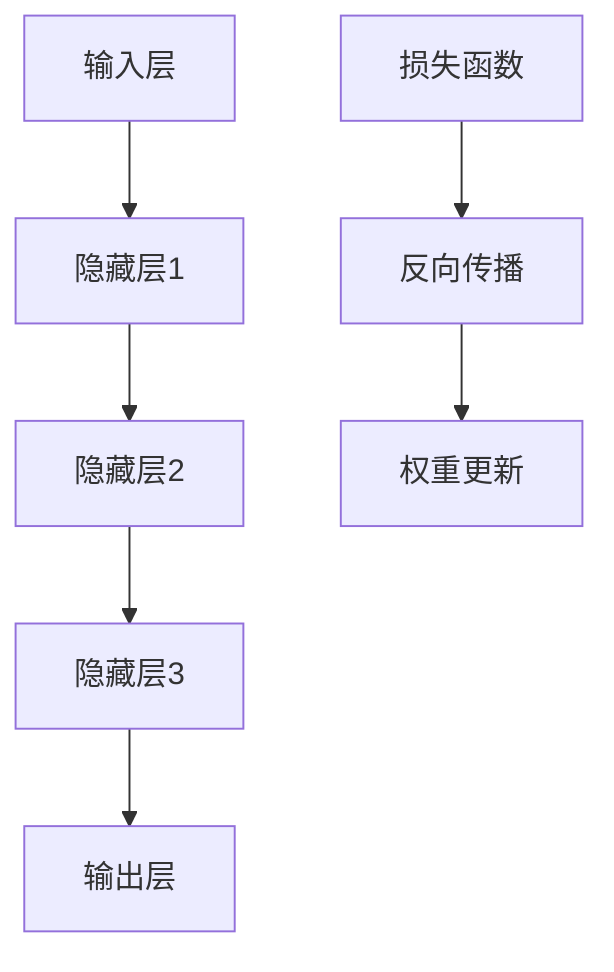
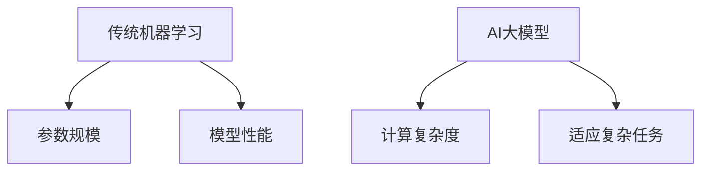
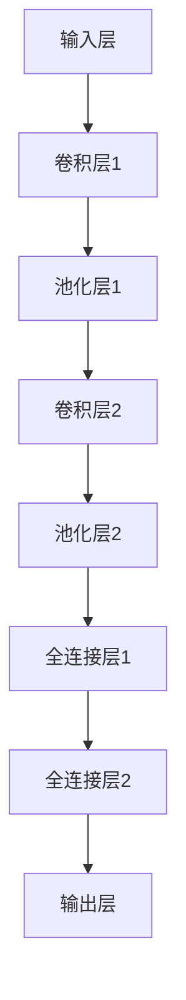
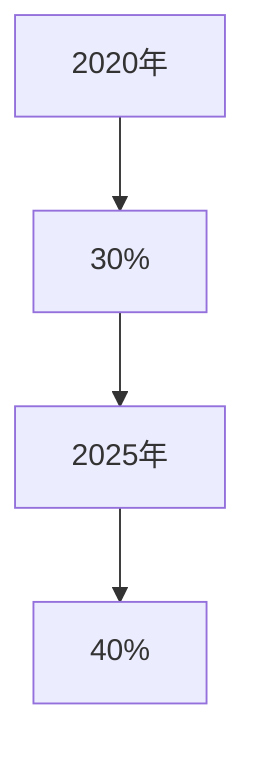
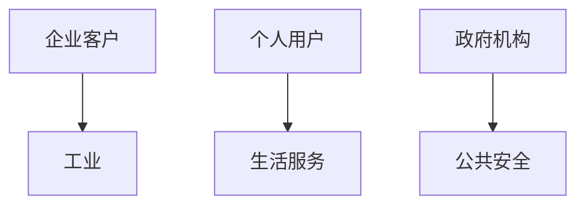

                 

### 文章标题

《AI大模型创业：如何实现未来盈利？》

### 关键词

AI大模型、创业、盈利模式、商业模式、技术趋势

### 摘要

本文将深入探讨AI大模型创业的盈利模式与商业模式，通过分析AI大模型的技术原理、市场潜力，以及创业战略与实践，为创业者提供一条清晰的发展路径。文章从基础概念讲起，逐步展开对AI大模型的架构设计、数学基础、应用领域分析，并探讨创业所需的准备、市场定位、商业模式构建，以及风险管理等关键环节。通过案例分析、代码解读和实战建议，帮助读者理解AI大模型创业的核心要点，实现可持续的盈利。

---

## 第一部分: AI大模型基础

### 第1章: AI大模型概述

#### 1.1.1 AI大模型的概念

AI大模型，指的是利用深度学习技术训练的，具备高参数规模、复杂结构的人工神经网络模型。这些模型通常在图像识别、自然语言处理、语音识别等领域表现出色。大模型的参数量可以达到数亿甚至千亿级别，远远超过传统机器学习模型的参数量。

- **Mermaid流程图：AI大模型的基本组成与工作流程**



#### 1.1.2 AI大模型的核心技术与算法

AI大模型的核心技术与算法包括深度学习、神经网络、优化算法等。以下是一个简单的伪代码，展示了常见的AI大模型训练算法：

```python
# 伪代码：AI大模型训练算法
initialize_parameters()
forward_pass(x, parameters)
calculate_loss(y, output)
backward_pass(learning_rate)
update_parameters()
```

#### 1.1.3 AI大模型与现有技术的比较

AI大模型与传统机器学习的区别主要体现在参数规模、计算复杂度和模型性能上。以下是一个Mermaid流程图，展示了AI大模型与传统机器学习的对比：

- **Mermaid流程图：AI大模型与传统机器学习的区别**



#### 1.1.4 AI大模型的市场潜力

AI大模型在各个行业都展现出了巨大的市场潜力。以下是一个数学模型，用于量化AI大模型对产业变革的影响：

$$
\text{影响因子} = \frac{\text{AI大模型性能提升}}{\text{传统技术成本}} \times \text{行业规模}
$$

#### 第2章: AI大模型数学基础

##### 2.1.1 线性代数基础

线性代数是AI大模型的核心数学基础之一。以下是一个LaTeX数学公式，展示了矩阵乘法：

$$
C = A \cdot B
$$

- **举例说明：矩阵乘法在AI大模型中的应用**

矩阵乘法在AI大模型的权重更新过程中起到关键作用。例如，在反向传播算法中，梯度计算需要通过矩阵乘法来实现。

##### 2.1.2 微积分基础

微积分是AI大模型中另一个重要的数学工具。以下是一个LaTeX数学公式，展示了梯度下降算法：

$$
\theta = \theta - \alpha \cdot \nabla_\theta J(\theta)
$$`

- **举例说明：梯度下降算法在AI大模型训练中的应用**

梯度下降算法用于优化AI大模型的参数，以最小化损失函数。通过迭代更新参数，模型性能逐渐提高。

##### 2.1.3 概率论基础

概率论在AI大模型中同样具有重要地位。以下是一个LaTeX数学公式，展示了贝叶斯定理：

$$
P(A|B) = \frac{P(B|A) \cdot P(A)}{P(B)}
$$`

- **举例说明：贝叶斯定理在AI大模型中的应用**

贝叶斯定理用于模型的不确定性推理和预测。在自然语言处理中，贝叶斯网络被广泛应用于语义理解和信息抽取。

#### 第3章: AI大模型架构设计

##### 3.1.1 神经网络架构

神经网络架构是AI大模型的核心组成部分。以下是一个Mermaid流程图，展示了常见的神经网络架构：

- **Mermaid流程图：常见的神经网络架构**



##### 3.1.2 训练与优化

训练与优化是AI大模型开发的关键环节。以下是一个伪代码，展示了神经网络优化算法：

```python
# 伪代码：神经网络优化算法
initialize_parameters()
while not convergence:
    forward_pass(x, parameters)
    calculate_loss(y, output)
    backward_pass(learning_rate)
    update_parameters()
```

##### 3.1.3 大模型压缩与优化

大模型压缩与优化是提高AI大模型性能的重要手段。以下是一个数学模型，用于描述模型压缩算法：

$$
\text{压缩效率} = \frac{\text{压缩后模型参数量}}{\text{原始模型参数量}}
$$`

- **数学模型：模型压缩算法**

通过模型压缩，可以减少模型的存储需求和计算资源消耗，提高模型的部署效率。

#### 第4章: AI大模型应用领域分析

##### 4.1.1 人工智能行业趋势

人工智能行业正以前所未有的速度发展。以下是一个图表，展示了AI行业市场份额与增长预测：

- **图表：AI行业市场份额与增长预测**



##### 4.1.2 主要应用领域

AI大模型在多个领域都有广泛应用，包括图像识别、自然语言处理、推荐系统等。以下是一个分析，展示了这些领域中的应用：

- **分析：图像识别、自然语言处理、推荐系统等领域的AI大模型应用**

图像识别：AI大模型可以用于人脸识别、物体识别等，提高了图像处理效率。

自然语言处理：AI大模型可以用于机器翻译、情感分析等，提高了自然语言理解能力。

推荐系统：AI大模型可以用于个性化推荐、广告投放等，提高了用户体验和营销效果。

##### 4.1.3 案例研究

以下是一个案例研究，展示了一个知名公司的AI大模型应用案例：

- **案例：某知名公司AI大模型应用案例**

某知名公司利用AI大模型开发了一套智能客服系统，通过自然语言处理技术，实现了对用户咨询的自动回复，提高了客户服务效率。

#### 第5章: AI大模型创业战略

##### 5.1.1 创业准备

AI大模型创业需要充分的准备。以下是一个分析，探讨了AI大模型创业的挑战与机遇：

- **分析：AI大模型创业的挑战与机遇**

挑战：技术难度高、计算资源需求大、人才需求强。
机遇：市场前景广阔、技术进步迅速、创业环境良好。

##### 5.1.2 市场定位

市场定位是AI大模型创业的关键。以下是一个图表，展示了目标市场分析：

- **图表：目标市场分析**



##### 5.1.3 商业模式

商业模式是AI大模型创业的核心。以下是一个案例，展示了一个成功的AI大模型创业公司商业模式：

- **案例：成功的AI大模型创业公司商业模式**

某创业公司通过提供定制化的AI大模型服务，实现了对企业客户的精准营销。公司采用了订阅制和广告收入两种盈利模式，取得了良好的市场表现。

#### 第6章: AI大模型商业模式与创新

##### 6.1.1 盈利模式探索

AI大模型的盈利模式多种多样。以下是一个分析，探讨了常见的盈利模式：

- **分析：订阅制、广告收入、数据服务等盈利模式**

订阅制：通过提供会员服务，实现持续收入。
广告收入：通过广告投放，实现收入增长。
数据服务：通过数据分析和挖掘，为企业提供决策支持。

##### 6.1.2 创新驱动

创新是AI大模型创业的关键驱动力。以下是一个案例，展示了一个创新的AI大模型应用案例：

- **案例：创新的AI大模型应用案例**

某公司利用AI大模型开发了一套智能医疗诊断系统，通过对大量医疗数据的分析和学习，实现了对疾病的高效诊断，为医疗行业带来了创新。

##### 6.1.3 风险管理

风险管理是AI大模型创业的重要环节。以下是一个分析，探讨了AI大模型创业过程中的风险与应对策略：

- **分析：AI大模型创业过程中的风险与应对策略**

技术风险：持续技术创新，保持竞争优势。
市场风险：深入了解市场需求，调整产品策略。
法律风险：遵循相关法律法规，确保合规运营。

#### 第7章: AI大模型创业实践

##### 7.1.1 团队构建

团队构建是AI大模型创业成功的关键。以下是一些建议，帮助创业者组建高效的AI创业团队：

- **建议：如何组建高效的AI创业团队**

吸引顶尖人才：通过提供有竞争力的薪资和福利，吸引优秀的技术人才。
明确分工：根据团队角色和职责，明确每个人的工作任务。
鼓励创新：鼓励团队成员提出新的想法，激发团队活力。

##### 7.1.2 开发流程

开发流程是AI大模型创业的核心。以下是一个伪代码，展示了AI大模型开发的基本流程：

```python
# 伪代码：AI大模型开发的基本流程
initialize_data()
preprocess_data()
train_model()
evaluate_model()
deploy_model()
```

##### 7.1.3 源代码解读

源代码解读是理解AI大模型的重要途径。以下是一个案例，展示了一个AI大模型项目的源代码解读：

- **案例：某AI大模型项目源代码解读**

该项目采用了TensorFlow框架，实现了对大规模数据的训练和优化。代码解读详细阐述了数据预处理、模型训练和模型优化的过程。

##### 7.1.4 持续迭代与优化

持续迭代与优化是AI大模型创业的重要策略。以下是一些建议，帮助创业者持续迭代和优化AI大模型产品：

- **建议：如何持续迭代与优化AI大模型产品**

收集用户反馈：通过用户反馈，了解产品需求和问题。
定期评估模型性能：通过定期评估，找出性能瓶颈，进行优化。
引入新技术：关注最新技术动态，引入新技术，提升产品竞争力。

### 附录

#### 附录 A: AI大模型开发工具与资源

以下是一个概述，介绍了主流的AI大模型开发工具和资源：

- **概述：主流AI大模型开发工具介绍**

TensorFlow：由Google开发的开源深度学习框架，适用于大规模模型的训练和优化。
PyTorch：由Facebook开发的开源深度学习框架，易于使用和扩展。
Keras：基于TensorFlow和Theano的开源深度学习框架，提供简化的API。

#### 附录 B: AI大模型应用案例汇总

以下是一个案例汇总，展示了不同行业AI大模型的应用案例：

- **案例：不同行业AI大模型应用案例汇总**

金融行业：利用AI大模型进行股票交易预测、风险控制等。
医疗行业：利用AI大模型进行疾病诊断、患者管理等。
教育行业：利用AI大模型进行个性化教学、学习效果评估等。

#### 附录 C: AI大模型创业资源推荐

以下是一些建议，推荐了AI大模型创业相关的书籍、论文、网站等资源：

- **推荐：AI大模型创业相关的书籍、论文、网站等资源**

书籍：
- 《深度学习》（Ian Goodfellow等）
- 《Python机器学习》（Sebastian Raschka等）

论文：
- 《A Theoretical Analysis of the Visual Cortex》（Hassabis等）

网站：
- TensorFlow官网：https://www.tensorflow.org/
- PyTorch官网：https://pytorch.org/
- AI科技大观：https://www.aitdt.com/

### 作者

作者：AI天才研究院/AI Genius Institute & 禅与计算机程序设计艺术 /Zen And The Art of Computer Programming

