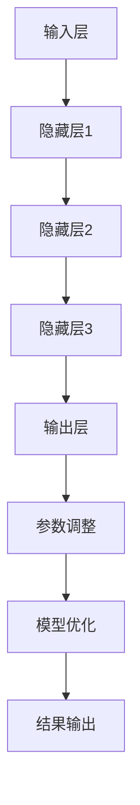

                 

## 文章标题

### 《AI大模型创业：如何实现盈利？》

#### 关键词：AI大模型、创业、盈利模式、技术应用、市场分析

#### 摘要：

本文深入探讨了AI大模型创业的盈利路径，首先介绍了AI大模型的基础知识和技术原理，随后分析了创业所需技能与市场环境。文章重点阐述了AI大模型在不同行业的应用，创业策略和盈利模式，以及创业中面临的风险与管理策略。通过成功和失败案例的解析，提供了实用的创业经验和未来展望。

----------------------------------------------------------------

## 第一部分：AI大模型基础

### 第1章 AI大模型概述

### 1.1 AI大模型的概念与价值

#### 1.1.1 AI大模型定义

AI大模型（Large-scale Artificial Intelligence Models）是指具有巨大参数量和训练数据集的深度学习模型，通常用于解决复杂的问题，如自然语言处理、计算机视觉、推荐系统等。这些模型通过在海量数据上进行训练，能够学习到数据中的复杂模式和关系，从而实现高水平的表现。

#### 1.1.2 AI大模型的核心价值

AI大模型在商业和社会领域具有重要价值。首先，它们能够显著提升业务流程的效率和准确性，例如在金融风控、医疗诊断和智能制造中。其次，AI大模型能够推动新兴行业的崛起，如自动驾驶、智能家居和智能客服。最后，AI大模型在创新和研发方面也有重要作用，能够加速新产品和服务的开发。

#### 1.1.3 AI大模型的发展历程

AI大模型的发展可以追溯到1990年代，随着计算能力和数据量的增长，深度学习技术逐渐成熟。2006年，Hinton等人提出了深度信念网络（DBN），标志着深度学习时代的开始。2012年，AlexNet在ImageNet竞赛中取得突破性成绩，深度学习迅速在学术界和工业界得到广泛应用。近年来，随着GPU和TPU等高性能计算设备的普及，AI大模型的研究和应用取得了长足进展。

### 1.2 AI大模型的技术架构

#### 1.2.1 大模型的构成要素

AI大模型通常由以下几个核心部分构成：

1. **输入层**：接收外部数据，如文本、图像或声音。
2. **隐藏层**：通过神经网络进行数据转换和特征提取。
3. **输出层**：产生预测或决策结果。
4. **参数**：包括权重和偏置，用于调整网络的表现。
5. **优化算法**：如梯度下降和Adam，用于调整参数。

#### 1.2.2 大模型的技术基础

AI大模型的技术基础包括：

1. **深度学习**：深度学习是一种通过多层神经网络进行数据表示和特征提取的技术。
2. **分布式计算**：利用GPU、TPU和分布式系统进行高效训练。
3. **迁移学习**：通过在预训练模型上进行微调，实现对新任务的快速适应。
4. **自监督学习**：在没有标注数据的情况下，通过自监督预训练提高模型性能。

#### 1.2.3 大模型的技术演进

AI大模型的技术演进主要体现在以下几个方面：

1. **模型规模**：从最初的数千参数增长到数十亿参数。
2. **训练数据量**：从数十万样本增长到数十亿样本。
3. **计算能力**：从单机训练发展到分布式和并行计算。
4. **算法优化**：如混合精度训练和动态计算图技术，提高了训练效率。

### 1.3 AI大模型的应用场景

#### 1.3.1 金融行业

在金融行业中，AI大模型被广泛应用于风险管理、量化交易、欺诈检测和信用评分等领域。例如，通过大规模的深度学习模型，金融机构可以更准确地预测市场趋势，降低风险。

#### 1.3.2 医疗健康

在医疗健康领域，AI大模型用于疾病诊断、药物研发、患者护理和健康监测。例如，深度学习模型可以通过分析医学影像，帮助医生更快速和准确地诊断疾病。

#### 1.3.3 制造业与供应链

在制造业和供应链管理中，AI大模型用于质量检测、设备维护、库存管理和物流优化。通过预测和分析，企业可以优化生产流程，降低成本。

#### 1.3.4 其他行业

除了上述领域，AI大模型还在教育、零售、娱乐和智能城市等领域得到广泛应用。例如，智能客服系统通过自然语言处理技术，可以提供24/7的客户服务，提高客户满意度。

### 总结

AI大模型作为当前人工智能技术的前沿领域，具有巨大的潜力和广泛的应用场景。在接下来的章节中，我们将进一步探讨AI大模型的技术原理、创业策略和盈利模式，帮助创业者实现盈利，推动人工智能技术的发展。

### 1.4 AI大模型的技术挑战与未来发展趋势

#### 1.4.1 技术挑战

尽管AI大模型在多个领域取得了显著成就，但仍然面临一些技术挑战：

1. **计算资源需求**：训练和部署大模型需要大量的计算资源和时间。
2. **数据隐私与安全性**：大规模数据集的收集和处理可能涉及隐私问题。
3. **模型可解释性**：大模型的决策过程往往难以解释，增加了应用难度。
4. **算法优化与效率**：如何提高大模型的训练效率和性能仍是一个重要研究方向。

#### 1.4.2 未来发展趋势

未来，AI大模型的发展趋势可能包括：

1. **更高效的算法**：研究新型优化算法，如增量学习和动态调整。
2. **跨模态学习**：结合多种类型的数据，如文本、图像和声音。
3. **联邦学习**：在不共享数据的情况下，通过分布式学习提高模型性能。
4. **知识图谱**：整合知识和数据，提高模型的决策能力和推理能力。

通过应对这些挑战和发展新趋势，AI大模型将在未来继续推动人工智能技术的发展和应用。

### 1.5 AI大模型的核心概念与架构

#### 1.5.1 神经网络

神经网络是AI大模型的基础，由大量的神经元（节点）组成。每个神经元通过加权连接与其他神经元相连，并通过激活函数进行数据处理。神经网络通过多层结构，实现对输入数据的复杂变换和特征提取。

#### 1.5.2 深度学习

深度学习是一种通过多层神经网络进行数据表示和特征提取的技术。深度学习模型可以通过自动学习，提取数据中的高阶抽象特征，从而实现复杂任务的自动化处理。

#### 1.5.3 预训练与微调

预训练是指在大规模数据集上训练模型，使其获得基本的识别和理解能力。微调是指将预训练模型应用于特定任务，通过少量数据进行微调，以适应新的任务需求。

#### 1.5.4 Transformer模型

Transformer模型是一种基于自注意力机制的深度学习模型，广泛用于自然语言处理任务。Transformer模型通过多头注意力机制和前馈神经网络，实现高效的特征提取和表示。

#### 1.5.5 大规模预训练模型的挑战

大规模预训练模型的挑战主要包括：

1. **计算资源需求**：训练大规模模型需要巨大的计算资源和时间。
2. **数据隐私与安全性**：大规模数据集的收集和处理可能涉及隐私问题。
3. **模型可解释性**：大模型的决策过程往往难以解释，增加了应用难度。
4. **算法优化与效率**：如何提高大模型的训练效率和性能仍是一个重要研究方向。

通过深入了解这些核心概念和架构，我们可以更好地理解AI大模型的工作原理和应用场景，为后续的创业实践提供理论基础。

### 1.6 AI大模型的Mermaid流程图

此流程图展示了AI大模型的基本架构，从输入层到输出层，通过多层隐藏层进行特征提取和变换，最终输出结果。参数调整和模型优化是提高模型性能的关键步骤。

### 1.7 机器学习与深度学习基础

#### 2.1.1 机器学习基本概念

机器学习（Machine Learning）是一种通过算法从数据中学习规律和模式，实现自动化的数据处理和决策的技术。机器学习主要包括监督学习、无监督学习和强化学习三种类型。

- **监督学习**：有标签数据，通过已知的输入和输出训练模型，如线性回归、决策树、支持向量机等。
- **无监督学习**：无标签数据，通过发现数据中的结构和模式，如聚类、降维、关联规则等。
- **强化学习**：通过与环境的交互，不断学习最优策略，如Q学习、深度Q网络等。

#### 2.1.2 深度学习技术概述

深度学习（Deep Learning）是机器学习的一种重要分支，通过多层神经网络进行数据表示和特征提取，实现复杂任务的自动化处理。深度学习的基本组成部分包括：

- **神经元**：神经网络的基本单元，通过加权连接进行数据处理和传递。
- **网络层**：由多个神经元组成的层次结构，用于提取数据的不同层次特征。
- **激活函数**：对神经元输出进行非线性变换，增加模型的非线性能力，如ReLU、Sigmoid、Tanh等。

#### 2.1.3 常见深度学习算法

常见的深度学习算法包括：

- **卷积神经网络（CNN）**：主要用于图像处理，通过卷积层和池化层提取图像特征。
- **循环神经网络（RNN）**：适用于序列数据，通过隐藏状态和历史信息进行特征提取。
- **长短时记忆网络（LSTM）**：RNN的一种改进，解决了长序列依赖问题。
- **Transformer模型**：一种基于自注意力机制的深度学习模型，广泛应用于自然语言处理任务。

### 2.2 自然语言处理技术

#### 2.2.1 词嵌入与序列模型

自然语言处理（Natural Language Processing，NLP）是深度学习的重要应用领域之一，主要研究如何使计算机理解和处理人类语言。词嵌入（Word Embedding）是将词汇映射为高维向量表示的技术，通过向量空间中的相似性度量，可以有效地处理语义信息。

- **词嵌入技术**：包括词袋模型（Bag of Words，BOW）和词嵌入模型（如Word2Vec、GloVe），将词汇转换为向量表示。
- **序列模型**：处理序列数据，如文本和语音，包括循环神经网络（RNN）和长短时记忆网络（LSTM）。RNN通过隐藏状态捕捉序列中的长期依赖关系，而LSTM通过门控机制解决了RNN的梯度消失问题。

#### 2.2.2 注意力机制与Transformer

注意力机制（Attention Mechanism）是一种用于捕捉序列数据中不同位置重要性的技术，通过计算注意力权重，模型可以关注到序列中的关键部分。Transformer模型是一种基于自注意力机制的深度学习模型，广泛应用于NLP任务。

- **多头注意力**：通过多个注意力头并行处理序列信息，捕捉不同的依赖关系。
- **编码器-解码器架构**：编码器（Encoder）生成上下文表示，解码器（Decoder）生成输出序列，广泛应用于机器翻译、文本生成等任务。

#### 2.2.3 预训练模型详解

预训练模型（Pre-trained Models）是当前NLP领域的核心研究方向，通过在大规模语料库上进行预训练，模型可以获得丰富的语义信息，从而在下游任务中实现出色的性能。

- **预训练任务**：包括通用语言模型（如BERT、GPT）、命名实体识别、情感分析等。
- **微调与适应**：预训练模型在特定任务上进行微调（Fine-tuning），以适应不同的应用场景。

### 2.3 大规模预训练模型原理

#### 2.3.1 预训练模型的原理

预训练模型（Pre-trained Models）是指在大规模语料库上预先训练好的模型，通过迁移学习和微调，这些模型在下游任务中表现出色。预训练模型的核心思想是利用大规模数据学习语言的普遍特征和规律。

- **自监督学习**：通过预训练任务（如Masked Language Model，MLM）和填充任务（如Subword Segmentation，BPE），模型从无标签数据中学习。
- **大规模数据集**：如维基百科、新闻、社交媒体等，提供了丰富的训练数据。
- **多层神经网络**：通过多层结构，模型可以提取数据的深层特征和抽象表示。

#### 2.3.2 预训练模型的训练与优化

预训练模型的训练与优化包括以下几个关键步骤：

1. **数据预处理**：包括文本清洗、分词、去除停用词等，确保数据的质量。
2. **模型架构设计**：选择合适的神经网络架构，如Transformer、BERT等。
3. **预训练任务设计**：如Masked Language Model（MLM）、填充任务（BPE）、生成任务（Language Modeling，LM）等。
4. **训练过程**：通过分布式计算和优化算法（如Adam、Adadelta等），模型在大规模数据集上进行训练。
5. **模型优化**：通过微调（Fine-tuning）和迁移学习，模型在特定任务上获得最佳性能。

#### 2.3.3 预训练模型的优势与挑战

预训练模型的优势包括：

- **通用性**：通过大规模数据预训练，模型可以提取丰富的语义信息，提高下游任务的性能。
- **迁移能力**：预训练模型在迁移学习和微调中表现出色，能够快速适应新的任务。
- **可解释性**：预训练模型可以提供语义理解的直观解释，提高应用的可信度。

然而，预训练模型也面临一些挑战：

- **计算资源需求**：预训练模型需要大量的计算资源和时间，特别是大规模模型的训练。
- **数据隐私与安全性**：大规模数据集的收集和处理可能涉及隐私问题。
- **模型可解释性**：预训练模型通常难以解释，增加了应用难度。
- **算法优化与效率**：如何提高预训练模型的训练效率和性能仍是一个重要研究方向。

通过深入了解预训练模型的原理和优势，我们可以更好地利用这些模型在自然语言处理任务中实现出色的性能。

### 2.4 大规模预训练模型的核心概念与架构

#### 2.4.1 编码器-解码器架构

编码器-解码器（Encoder-Decoder）架构是大规模预训练模型的核心，特别适用于序列到序列的任务，如图像描述、机器翻译和文本生成。

- **编码器（Encoder）**：接收输入序列，将其编码为固定长度的上下文表示，捕获序列的长期依赖关系。
- **解码器（Decoder）**：接收编码器的输出，逐步生成输出序列，利用注意力机制捕捉输入和输出之间的关联。

#### 2.4.2 自注意力机制

自注意力（Self-Attention）机制是Transformer模型的关键组件，通过计算序列中每个位置与其他位置的相关性，模型可以自动关注重要的信息。

- **多头注意力（Multi-Head Attention）**：通过多个注意力头并行处理序列信息，捕捉不同的依赖关系，提高模型的表征能力。
- **点积注意力（Dot-Product Attention）**：计算输入序列的每个位置与编码器输出的内积，得到注意力权重，加权求和生成新的表示。

#### 2.4.3 残差连接与层归一化

残差连接（Residual Connection）和层归一化（Layer Normalization）是提升模型训练效率和性能的重要技术。

- **残差连接**：通过跳过一层或多层网络，直接将输入加到下一层的输出，缓解深层网络中的梯度消失问题。
- **层归一化**：对网络层的输入或输出进行归一化，加速训练过程，提高模型的稳定性。

#### 2.4.4 模型参数与优化算法

大规模预训练模型通常具有数十亿个参数，优化算法的选择对模型的训练效率和性能至关重要。

- **优化算法**：如Adam、AdamW等，通过自适应调整学习率，提高训练效率。
- **模型剪枝（Model Pruning）**：通过剪枝技术减少模型参数，降低计算和存储需求。
- **量化（Quantization）**：将模型参数转换为低精度格式，减少计算资源需求。

通过深入了解大规模预训练模型的核心概念和架构，我们可以更好地理解和应用这些先进技术，推动自然语言处理和序列处理任务的发展。

### 2.5 自然语言处理中的常见算法与模型

#### 2.5.1 词嵌入算法

词嵌入（Word Embedding）是将词汇映射为高维向量表示的技术，是自然语言处理的基础。常见的词嵌入算法包括：

- **Word2Vec**：基于神经网络的词向量生成方法，通过训练上下文窗口内的词汇，生成词向量。
- **GloVe（Global Vectors for Word Representation）**：通过矩阵分解方法，从词共现矩阵中学习词向量。
- **FastText**：通过将词汇和其子词映射到同一向量空间，实现高效的多维词嵌入。

#### 2.5.2 递归神经网络（RNN）

递归神经网络（Recurrent Neural Network，RNN）是一种能够处理序列数据的神经网络，通过记忆历史信息，实现对序列数据的建模。

- **基本RNN**：通过循环连接，将当前输入与隐藏状态进行计算，生成新的隐藏状态。
- **长短时记忆网络（LSTM）**：LSTM通过门控机制，解决了RNN的梯度消失问题，能够有效处理长序列依赖。
- **门控循环单元（GRU）**：GRU是LSTM的一种简化版本，通过更新门和重置门，简化了计算过程。

#### 2.5.3 卷积神经网络（CNN）

卷积神经网络（Convolutional Neural Network，CNN）最初用于图像处理，通过局部感知和权重共享，提取图像特征。

- **卷积层**：通过卷积操作，提取图像的局部特征。
- **池化层**：通过下采样，减少特征图的维度。
- **全连接层**：将卷积特征映射到分类或回归任务。

#### 2.5.4 注意力机制（Attention Mechanism）

注意力机制（Attention Mechanism）是一种能够自动关注序列中重要信息的技术，广泛应用于自然语言处理任务。

- **点积注意力**：通过计算输入序列和编码器输出的内积，生成注意力权重。
- **多头注意力**：通过多个注意力头并行处理序列信息，捕捉不同的依赖关系。
- **自注意力**：在编码器和解码器中，通过自注意力机制，捕捉序列中每个位置的重要性。

#### 2.5.5 Transformer模型

Transformer模型是一种基于自注意力机制的深度学习模型，广泛应用于自然语言处理任务。

- **编码器**：通过多层自注意力机制和前馈神经网络，生成上下文表示。
- **解码器**：通过自注意力机制和编码器-解码器注意力机制，生成输出序列。
- **预训练任务**：通过大规模语料库进行预训练，学习通用语言特征。
- **微调**：通过特定任务进行微调，实现出色的性能。

通过深入了解这些常见算法和模型，我们可以更好地理解自然语言处理中的核心技术，为后续的创业实践提供理论基础。

### 2.6 大规模预训练模型在自然语言处理中的应用

#### 2.6.1 机器翻译

机器翻译（Machine Translation）是自然语言处理中的重要应用领域。大规模预训练模型在机器翻译中表现出色，通过在双语语料库上进行预训练，模型能够自动学习语言结构和语义信息。

- **预训练**：大规模预训练模型（如BERT、GPT）通过在大量双语语料库上训练，学习语言的普遍特征。
- **微调**：将预训练模型应用于特定语言对，通过微调调整模型参数，实现出色的翻译性能。
- **双语数据**：收集和整理大量的双语平行文本数据，用于模型的训练和评估。

#### 2.6.2 文本生成

文本生成（Text Generation）是自然语言处理中的另一个重要应用领域，大规模预训练模型能够生成高质量的自然语言文本。

- **预训练**：通过在大型语料库上进行预训练，模型学习到丰富的语言结构和表达方式。
- **生成任务**：包括文章生成、对话生成、摘要生成等，模型通过输入种子文本或关键词，生成连贯的扩展文本。
- **生成质量**：通过多种评价指标（如BLEU、ROUGE等），评估生成文本的质量和一致性。

#### 2.6.3 文本分类

文本分类（Text Classification）是自然语言处理中的基本任务之一，大规模预训练模型在文本分类任务中表现出色。

- **预训练**：通过在大型语料库上进行预训练，模型学习到丰富的语言特征和分类规律。
- **微调**：将预训练模型应用于特定分类任务，通过微调调整模型参数，实现高效分类。
- **分类任务**：包括情感分析、主题分类、实体识别等，模型能够自动分类不同类型的文本。

#### 2.6.4 文本摘要

文本摘要（Text Summarization）是自然语言处理中的挑战性任务之一，大规模预训练模型能够生成简洁且具有代表性的文本摘要。

- **预训练**：通过在大量文本数据上进行预训练，模型学习到文本的语义结构和摘要策略。
- **摘要任务**：包括提取式摘要（Extractive Summarization）和生成式摘要（Generative Summarization），模型能够生成简洁的文本摘要。
- **摘要质量**：通过多种评价指标（如ROUGE、BLEU等），评估生成摘要的质量和一致性。

#### 2.6.5 对话系统

对话系统（Dialogue System）是自然语言处理中的前沿应用领域，大规模预训练模型在对话系统中表现出色。

- **预训练**：通过在对话语料库上进行预训练，模型学习到对话的语言结构和策略。
- **生成式对话**：模型能够根据用户输入，生成连贯且具有上下文的回复。
- **交互式对话**：通过与用户进行交互，模型不断学习和优化对话策略。

通过深入了解大规模预训练模型在自然语言处理中的应用，我们可以更好地理解这些模型的优势和局限性，为创业实践提供有价值的参考。

### 2.7 大规模预训练模型的实际案例分析

#### 2.7.1 案例一：OpenAI的GPT模型

**背景：** OpenAI开发的GPT（Generative Pre-trained Transformer）模型是一个基于Transformer架构的预训练模型，广泛应用于文本生成、机器翻译和对话系统等任务。

**实现过程：**
1. **预训练**：GPT模型通过在大量文本语料库上进行预训练，学习到丰富的语言结构和语义信息。预训练阶段使用了分词、填充和掩码语言模型（MLM）等任务。
2. **微调**：在特定任务上，如文本生成或机器翻译，GPT模型通过微调调整参数，以适应新的任务需求。微调过程中使用了目标任务的训练数据和评估指标。

**结果与效果：**
- GPT模型在多个自然语言处理任务中表现出色，如文本生成、机器翻译和对话系统等。其生成文本的质量和连贯性得到了广泛应用和认可。
- GPT模型的训练和微调过程相对复杂，需要大量的计算资源和时间，但其在特定任务上的性能提升显著。

**案例分析：**
- OpenAI的GPT模型展示了大规模预训练模型在自然语言处理中的巨大潜力。
- 通过预训练和微调，GPT模型能够自动学习到语言的复杂结构和语义信息，为多个任务提供高质量解决方案。
- 案例中的挑战包括计算资源需求、模型可解释性和训练时间等，但这些挑战也在不断得到解决。

#### 2.7.2 案例二：Google的BERT模型

**背景：** Google开发的BERT（Bidirectional Encoder Representations from Transformers）模型是一个基于Transformer架构的双向编码器模型，广泛应用于文本分类、问答系统和文本生成等任务。

**实现过程：**
1. **预训练**：BERT模型通过在大量文本语料库上进行预训练，学习到丰富的语言结构和语义信息。预训练阶段使用了遮蔽语言模型（Masked Language Model，MLM）和下一句预测（Next Sentence Prediction，NSP）等任务。
2. **微调**：在特定任务上，如文本分类或问答系统，BERT模型通过微调调整参数，以适应新的任务需求。微调过程中使用了目标任务的训练数据和评估指标。

**结果与效果：**
- BERT模型在多个自然语言处理任务中表现出色，如文本分类、问答系统和文本生成等。其在文本理解、语义表示和分类任务上的性能显著提升。
- BERT模型的预训练和微调过程相对复杂，但其在特定任务上的性能提升显著，得到了广泛的应用和认可。

**案例分析：**
- BERT模型展示了大规模预训练模型在双向编码和语义表示中的优势。
- 通过预训练和微调，BERT模型能够自动学习到语言的复杂结构和语义信息，为多个任务提供高质量的解决方案。
- 案例中的挑战包括计算资源需求、模型可解释性和训练时间等，但这些挑战也在不断得到解决。

#### 2.7.3 案例三：Facebook的BLUE模型

**背景：** Facebook开发的BLUE（Boosted Language Understanding with Excitation）模型是一个基于Transformer的预训练模型，广泛应用于文本分类、情感分析和对话系统等任务。

**实现过程：**
1. **预训练**：BLUE模型通过在大量文本语料库上进行预训练，学习到丰富的语言结构和语义信息。预训练阶段使用了遮蔽语言模型（MLM）、下一句预测（NSP）和分类任务（如情感分析）等。
2. **微调**：在特定任务上，如文本分类或情感分析，BLUE模型通过微调调整参数，以适应新的任务需求。微调过程中使用了目标任务的训练数据和评估指标。

**结果与效果：**
- BLUE模型在多个自然语言处理任务中表现出色，如文本分类、情感分析和对话系统等。其在语言理解、分类任务上的性能显著提升。
- BLUE模型的预训练和微调过程相对复杂，但其在特定任务上的性能提升显著，得到了广泛的应用和认可。

**案例分析：**
- BLUE模型展示了大规模预训练模型在多任务学习和分类任务中的优势。
- 通过预训练和微调，BLUE模型能够自动学习到语言的复杂结构和语义信息，为多个任务提供高质量的解决方案。
- 案例中的挑战包括计算资源需求、模型可解释性和训练时间等，但这些挑战也在不断得到解决。

### 总结

大规模预训练模型在自然语言处理领域取得了显著成就，通过预训练和微调，这些模型能够自动学习到语言的复杂结构和语义信息，为多个任务提供高质量的解决方案。然而，这些模型也面临一些挑战，如计算资源需求、模型可解释性和训练时间等。随着技术的不断进步，我们可以期待大规模预训练模型在自然语言处理领域发挥更大的作用，为创业实践带来更多机遇和挑战。

### 2.8 大规模预训练模型的应用场景扩展

#### 2.8.1 对话系统

对话系统（Dialogue System）是自然语言处理中的关键应用领域之一，通过大规模预训练模型，可以构建智能对话代理，实现自然、流畅的对话交互。

- **预训练任务**：大规模预训练模型通过在对话语料库上进行预训练，学习到对话的语言结构和策略。
- **微调应用**：在特定对话场景下，通过微调预训练模型，使其能够生成符合上下文的对话回复。
- **挑战与解决方案**：对话系统面临的挑战包括上下文理解、多轮对话管理和个性化交互。解决方案包括多模态学习、对话生成模型和强化学习。

#### 2.8.2 文本摘要

文本摘要（Text Summarization）是将长文本转化为简洁、连贯摘要的过程，大规模预训练模型在提取式和生成式摘要任务中表现出色。

- **预训练**：通过在大量文本数据上进行预训练，模型学习到文本的语义结构和摘要策略。
- **微调**：在特定摘要任务上，通过微调调整模型参数，实现高效、高质量的文本摘要。
- **挑战与解决方案**：文本摘要面临的挑战包括摘要长度控制、文本连贯性和摘要质量评估。解决方案包括优化摘要生成算法和引入外部知识库。

#### 2.8.3 文本分类

文本分类（Text Classification）是将文本数据分类到预定义类别中的任务，大规模预训练模型在分类任务中具有显著优势。

- **预训练**：通过在大量文本数据上进行预训练，模型学习到丰富的语言特征和分类规律。
- **微调**：在特定分类任务上，通过微调调整模型参数，实现高效分类。
- **挑战与解决方案**：文本分类面临的挑战包括数据不平衡、噪声数据和类别划分。解决方案包括数据增强、多分类模型和权重调整。

#### 2.8.4 机器翻译

机器翻译（Machine Translation）是将一种语言的文本翻译成另一种语言的过程，大规模预训练模型在机器翻译任务中表现出色。

- **预训练**：通过在大量双语数据上进行预训练，模型学习到语言结构和翻译规则。
- **微调**：在特定语言对上，通过微调调整模型参数，实现高质量的翻译。
- **挑战与解决方案**：机器翻译面临的挑战包括语言差异、上下文理解和翻译质量。解决方案包括多模态学习、上下文增强和翻译模型优化。

#### 2.8.5 其他应用场景

除了上述应用场景，大规模预训练模型还在知识图谱构建、图像识别、语音识别和推荐系统等领域展现出了巨大的潜力。

- **知识图谱构建**：通过预训练和微调，模型可以自动学习到实体关系和语义信息，为知识图谱构建提供支持。
- **图像识别**：预训练模型通过在大量图像数据上进行训练，学习到丰富的视觉特征，实现高效的图像识别。
- **语音识别**：通过结合语音数据和文本数据，预训练模型可以学习到语音和文本之间的映射关系，实现高效的语音识别。
- **推荐系统**：预训练模型通过在用户行为数据上进行训练，学习到用户兴趣和偏好，实现个性化的推荐。

### 总结

大规模预训练模型的应用场景不断扩展，从文本处理到图像、语音和知识图谱，这些模型在各个领域都展现出了强大的能力和广泛的应用前景。通过预训练和微调，模型可以自动学习到复杂的数据特征和关系，为创业实践提供了丰富的工具和方法。然而，这些应用场景也面临一些挑战，如数据质量、模型解释性和计算资源等。随着技术的不断进步，我们可以期待大规模预训练模型在更多领域发挥重要作用，推动人工智能技术的发展。

### 2.9 大规模预训练模型的未来发展

#### 2.9.1 模型规模与计算需求的增长

随着模型规模的不断扩大，预训练模型对计算资源的需求也日益增长。目前，大规模预训练模型如GPT-3、LLaMA等，已经达到数十亿甚至上百亿个参数。这种增长不仅对计算资源提出了更高的要求，也对存储和传输资源提出了挑战。未来的发展方向可能包括：

1. **优化算法**：研究更加高效的训练算法，如异步训练、混合精度训练和模型剪枝等，以减少训练时间和资源消耗。
2. **硬件加速**：利用专用硬件（如GPU、TPU）和分布式计算架构，提高模型训练和推理的效率。
3. **边缘计算**：将预训练模型的部分计算任务转移到边缘设备，减轻云端计算压力，提高实时响应能力。

#### 2.9.2 多模态学习与跨域迁移

未来的预训练模型将更加注重多模态学习和跨域迁移。这意味着模型不仅要处理文本数据，还要能够处理图像、语音、视频等多种类型的数据。未来的发展方向可能包括：

1. **多模态融合**：研究多模态数据融合的方法，如跨模态编码器和解码器，实现不同类型数据的联合表示和交互。
2. **跨域迁移学习**：通过跨领域迁移学习，将预训练模型的知识和应用能力扩展到新的领域，提高模型的泛化能力。
3. **联邦学习**：在隐私保护的前提下，利用分布式计算和联邦学习，将不同数据源的预训练模型进行联合训练，提高模型的性能和多样性。

#### 2.9.3 模型可解释性与透明性

随着预训练模型在更多实际场景中的应用，模型的可解释性和透明性变得越来越重要。未来的发展方向可能包括：

1. **模型解释技术**：研究模型解释方法，如注意力机制分析、可视化技术等，帮助用户理解模型的决策过程。
2. **决策可追溯性**：确保模型决策的可追溯性，提供清晰的决策路径和证据支持，提高模型的可信度和合规性。
3. **伦理与责任**：建立完善的伦理规范和责任机制，确保预训练模型的应用不会损害用户权益和社会利益。

#### 2.9.4 开放协作与标准化

预训练模型的未来将更加注重开放协作和标准化。未来的发展方向可能包括：

1. **开源模型**：鼓励和推动开源模型的开发和共享，促进技术进步和产业应用。
2. **模型评估标准**：制定统一的模型评估标准，确保不同模型在相同条件下进行公平比较。
3. **行业联盟**：建立行业联盟，推动预训练模型的研究和应用，促进产业链的协同发展。

### 总结

大规模预训练模型在人工智能领域取得了巨大的进展，未来的发展将更加注重计算效率、多模态学习、模型可解释性和开放协作。通过不断的技术创新和应用探索，预训练模型将继续推动人工智能技术的发展，为社会带来更多的价值。

### 第3章 AI大模型应用场景

#### 3.1 人工智能行业概述

人工智能（Artificial Intelligence，AI）行业近年来取得了显著的进展，已经成为科技领域的热点。AI技术通过模拟人类智能，实现自动化决策、问题解决和数据分析，广泛应用于各行各业。根据市场研究机构的报告，全球人工智能市场规模持续增长，预计到2025年将达到数百亿美元。

##### 3.1.1 人工智能行业现状

目前，人工智能行业已经形成了较为完整的产业链，涵盖了硬件设备、软件开发、数据服务、应用场景等多个环节。主要特点如下：

1. **技术进步**：随着深度学习、自然语言处理、计算机视觉等技术的不断发展，AI模型的性能和效率显著提升。
2. **应用广泛**：AI技术在金融、医疗、零售、制造、交通等领域得到广泛应用，推动了传统产业的转型升级。
3. **商业模式多样化**：AI企业通过提供解决方案、服务收费、数据交易等多种商业模式，实现了商业价值的转化。
4. **政策支持**：各国政府纷纷出台政策，鼓励和扶持人工智能产业的发展，为行业提供了良好的发展环境。

##### 3.1.2 人工智能行业趋势

未来，人工智能行业将继续保持高速增长，呈现出以下趋势：

1. **规模化应用**：随着AI技术的成熟和成本的降低，更多行业和企业将采用AI技术，实现规模化应用。
2. **跨界融合**：AI技术与5G、物联网、云计算等新兴技术的融合，将推动更多跨界应用场景的出现。
3. **自主决策与协作**：通过增强现实、虚拟现实等技术，实现人与AI的紧密协作，提高生产效率和服务质量。
4. **数据治理与伦理**：数据安全和隐私保护将成为AI行业的重要课题，行业需要制定和遵守相关法律法规，确保数据安全和用户隐私。
5. **可持续发展**：AI技术在环保、能源等领域的发展，将有助于推动可持续发展目标的实现。

#### 3.2 AI大模型在各行业的应用

AI大模型在多个行业领域展现了强大的应用潜力，通过智能化技术，为企业带来显著的业务提升和效率优化。

##### 3.2.1 金融行业

金融行业是AI大模型的重要应用领域之一，主要应用场景包括：

1. **风险管理**：利用AI大模型进行风险评估、市场预测和信用评分，提高金融风险管理的准确性。
2. **量化交易**：AI大模型通过分析海量数据，发现市场规律和交易机会，实现自动化交易策略。
3. **欺诈检测**：利用深度学习技术，识别和防范金融欺诈行为，保护金融安全。

##### 3.2.2 医疗健康

在医疗健康领域，AI大模型的应用为医疗诊断、疾病预测和个性化治疗提供了新的解决方案：

1. **疾病诊断**：通过分析医学影像和患者数据，AI大模型可以辅助医生进行疾病诊断，提高诊断准确性和效率。
2. **疾病预测**：基于患者的健康数据，AI大模型可以预测疾病的发病风险，为早期干预提供支持。
3. **个性化治疗**：根据患者的基因信息和生活习惯，AI大模型为患者制定个性化的治疗方案，提高治疗效果。

##### 3.2.3 制造业与供应链

在制造业和供应链管理中，AI大模型的应用提高了生产效率和供应链的稳定性：

1. **生产优化**：通过分析生产数据，AI大模型可以优化生产流程，提高生产效率和产品质量。
2. **设备维护**：利用预测性维护技术，AI大模型可以提前预测设备故障，减少停机时间和维护成本。
3. **供应链管理**：通过大数据分析和预测模型，AI大模型可以优化供应链流程，提高供应链的响应速度和灵活性。

##### 3.2.4 其他行业应用场景

除了金融、医疗、制造业和供应链，AI大模型还在多个其他行业领域得到应用：

1. **零售业**：通过智能推荐系统，AI大模型可以提高客户满意度，促进销售增长。
2. **教育**：利用智能教学系统，AI大模型可以提供个性化教学方案，提高教学效果。
3. **智能交通**：通过交通数据分析，AI大模型可以优化交通流量管理，提高交通运行效率。
4. **能源管理**：通过智能监测和分析，AI大模型可以优化能源使用，降低能源消耗。

#### 3.3 AI大模型在各行业的创新应用案例

以下是一些AI大模型在各行业的创新应用案例：

##### 3.3.1 金融行业

- **案例一：智能投顾**：通过AI大模型分析用户财务数据和市场趋势，提供个性化的投资建议，帮助用户实现资产增值。

##### 3.3.2 医疗健康

- **案例二：智能病理诊断**：利用AI大模型分析医学影像，辅助医生进行病理诊断，提高诊断准确率。

##### 3.3.3 制造业与供应链

- **案例三：智能生产管理**：通过AI大模型优化生产流程，提高生产效率和产品质量，降低生产成本。

##### 3.3.4 零售业

- **案例四：智能推荐系统**：利用AI大模型分析用户行为数据，提供个性化的产品推荐，提高客户满意度和销售额。

#### 3.4 AI大模型的应用前景

随着AI大模型技术的不断发展和应用场景的拓展，未来AI大模型将在更多领域展现出巨大的应用潜力：

1. **智能决策支持**：AI大模型将为企业提供更加精准的决策支持，提高业务运营效率。
2. **个性化服务**：通过AI大模型，企业可以提供更加个性化的产品和服务，满足用户多样化需求。
3. **智能化生产**：AI大模型将推动制造业向智能化、自动化方向发展，提高生产效率和质量。
4. **智能社会治理**：AI大模型将在城市管理、公共安全、环境监测等领域发挥重要作用，提高社会治理水平。

### 总结

AI大模型在各行业的应用已经取得了显著成果，通过智能化技术，AI大模型为企业带来了效率提升和业务增长。未来，随着AI大模型技术的不断进步和应用场景的拓展，AI大模型将在更多领域发挥重要作用，推动人工智能技术的发展和应用。

### 第4章 AI大模型创业策略

#### 4.1 创业者必备的技能与素质

成为一名成功的AI大模型创业者，不仅需要深厚的专业知识和技能，还需要具备一系列的素质和能力。

##### 4.1.1 技术能力

作为AI大模型创业者，必须具备扎实的技术基础，包括：

1. **深度学习与机器学习**：掌握深度学习和机器学习的基本概念、算法和实现方法，如神经网络、卷积神经网络（CNN）、循环神经网络（RNN）、Transformer等。
2. **自然语言处理**：了解自然语言处理（NLP）的关键技术和应用，如词嵌入、序列模型、注意力机制、预训练模型等。
3. **数据工程与数据处理**：熟悉数据工程的基本流程，包括数据采集、清洗、存储、处理和分析。
4. **分布式计算与并行优化**：了解分布式计算和并行优化的原理，能够设计高效、可扩展的算法和系统。

##### 4.1.2 商业思维

商业思维是AI大模型创业者成功的关键因素之一。以下是一些关键的商业技能：

1. **市场分析**：能够对市场进行深入分析，识别潜在的商业机会和市场需求。
2. **商业模式设计**：能够设计创新的商业模式，将技术优势转化为商业价值。
3. **用户研究**：深入了解目标用户的需求和行为，为产品设计和营销策略提供依据。
4. **财务规划**：具备财务规划能力，包括预算编制、成本控制、利润分析等。

##### 4.1.3 团队协作

创业过程充满挑战，团队合作至关重要。以下是一些团队协作的必备素质：

1. **领导力**：能够带领团队共同奋斗，激发团队成员的潜力。
2. **沟通能力**：能够清晰、有效地表达自己的想法，促进团队成员之间的沟通与协作。
3. **冲突管理**：能够在团队中处理冲突，保持团队和谐，推动项目顺利进行。
4. **适应能力**：面对变化和挑战时，能够迅速适应，寻找新的解决方案。

##### 4.1.4 创新思维

创新思维是推动创业成功的重要动力。以下是一些培养创新思维的方法：

1. **问题导向**：以解决问题为目标，不断寻找创新的解决方案。
2. **跨学科学习**：学习不同领域的知识，拓宽思维视野，激发创新灵感。
3. **用户参与**：通过用户参与和反馈，不断优化产品和服务，实现创新。
4. **试错与迭代**：接受失败，从失败中吸取经验，不断迭代和改进。

### 4.2 AI大模型创业市场分析

在创业过程中，了解市场的规模、增长趋势和竞争格局对于制定有效的商业策略至关重要。

##### 4.2.1 市场规模与增长趋势

根据市场研究机构的报告，全球AI大模型市场规模持续增长。以下是一些关键的数据和趋势：

1. **全球市场规模**：预计到2025年，全球AI大模型市场规模将达到数百亿美元。
2. **区域分布**：北美地区是全球最大的市场，欧洲和亚太地区市场增长迅速。
3. **应用领域**：金融、医疗、制造、零售等行业是AI大模型的主要应用领域，这些行业的快速增长推动了整体市场规模的扩大。
4. **技术趋势**：随着深度学习、自然语言处理、计算机视觉等技术的发展，AI大模型的应用范围将进一步扩大。

##### 4.2.2 市场竞争格局

当前，AI大模型市场竞争激烈，主要竞争者包括：

1. **传统科技巨头**：如谷歌、微软、亚马逊等，这些公司通过收购和自主研发，建立了强大的AI技术栈和生态体系。
2. **初创公司**：许多初创公司专注于特定领域，通过创新的技术和商业模式，获得了市场的关注和投资。
3. **行业领导者**：一些行业领导者通过整合AI技术，实现了业务转型和升级，成为了市场的重要参与者。

市场竞争格局的特点包括：

1. **技术竞争**：AI大模型的技术水平成为核心竞争力，领先的技术能够为企业带来竞争优势。
2. **数据竞争**：数据是AI大模型训练的重要资源，企业通过数据积累和合作，提高模型的性能和泛化能力。
3. **生态竞争**：构建完整的AI技术生态，包括算法、工具、平台和解决方案，能够为企业提供更全面的服务。

##### 4.2.3 市场机会与挑战

在AI大模型创业市场中，存在以下机会和挑战：

1. **市场机会**：
   - **技术创新**：随着技术的不断发展，新的应用场景和商业模式不断涌现，为企业提供了广阔的发展空间。
   - **行业需求**：各行业对AI大模型的需求持续增长，为企业创造了巨大的市场潜力。
   - **政策支持**：各国政府纷纷出台政策，鼓励和扶持人工智能技术的发展，为企业提供了有利的发展环境。

2. **市场挑战**：
   - **技术门槛**：AI大模型的技术门槛较高，需要大量的研发投入和专业知识，初创企业面临较大的技术挑战。
   - **数据隐私**：数据隐私和安全是AI大模型应用中的重要问题，企业需要建立完善的数据保护机制。
   - **市场竞争**：市场竞争激烈，企业需要不断创新和优化，才能在市场中脱颖而出。

### 4.3 AI大模型创业模式

AI大模型创业模式主要包括以下几种类型：

##### 4.3.1 商业模式创新

1. **产品销售**：企业通过开发和销售AI大模型产品，如预训练模型、工具和解决方案，实现盈利。
2. **服务收费**：企业通过提供AI大模型相关的服务，如模型训练、部署和维护等，按需收费。
3. **数据交易**：企业通过数据交易市场，购买和出售数据集，为AI大模型提供训练数据。

##### 4.3.2 创业路径选择

1. **技术创新型**：专注于AI大模型技术的研发和创新，打造核心竞争力，通过技术优势和创新能力，占领市场。
2. **应用型**：专注于AI大模型在特定行业的应用，通过深入理解和挖掘行业需求，提供定制化的解决方案。
3. **平台型**：构建AI大模型平台，提供一站式的服务，包括模型开发、训练、部署和应用等，通过平台流量和生态体系，实现盈利。

##### 4.3.3 资源配置策略

1. **技术资源**：通过自主研发、合作开发和引进技术，确保企业的技术领先地位。
2. **数据资源**：通过数据采集、合作和数据交易，积累和扩展训练数据，提高模型的性能和泛化能力。
3. **人才资源**：通过招聘、培训和激励机制，吸引和留住优秀人才，为企业的可持续发展提供人才保障。

### 4.4 AI大模型创业案例分析

以下是一些AI大模型创业的成功和失败案例，从中我们可以学习到宝贵的经验和教训。

##### 4.4.1 成功案例

**案例一：OpenAI**

**背景**：OpenAI是一家专注于人工智能研究的初创公司，其目标是实现安全的通用人工智能（AGI）。

**策略**：
1. **技术创新**：OpenAI专注于AI大模型的研发，推出了GPT系列模型，如GPT-3，成为AI领域的领先者。
2. **商业模式**：OpenAI通过开放API和商业合作，将技术应用于不同行业，实现商业价值。
3. **人才吸引**：OpenAI吸引了众多顶尖的AI专家和研究人员，形成了强大的研发团队。

**经验**：
- 技术创新是创业成功的关键。
- 与行业合作，开拓多样化的应用场景，实现技术价值的最大化。
- 吸引和留住顶尖人才，为企业的长期发展提供动力。

##### 4.4.2 失败案例

**案例二：AI机器人公司**

**背景**：AI机器人公司是一家专注于智能机器人研发的初创公司。

**原因**：
1. **市场需求不足**：公司推出的机器人产品未能满足市场需求，销售业绩不佳。
2. **技术不足**：公司的技术实力不足，导致产品性能和稳定性无法满足客户期望。
3. **管理问题**：公司管理混乱，缺乏有效的战略规划和执行力。

**教训**：
- 深入了解市场需求，确保产品的实用性和市场适应性。
- 注重技术创新和研发，提升产品性能和竞争力。
- 加强管理，确保企业的战略规划和执行能力。

### 4.5 AI大模型创业中的关键成功因素

1. **技术创新**：保持技术的领先地位，不断推动技术的创新和突破。
2. **市场定位**：准确识别市场需求，提供定制化的解决方案，满足客户需求。
3. **团队建设**：打造高效的研发团队，确保技术创新和项目执行能力。
4. **商业模式**：设计创新的商业模式，实现技术价值的最大化。
5. **资源整合**：整合各类资源，如技术、数据、人才等，为企业的可持续发展提供支持。

### 总结

AI大模型创业是一个充满挑战和机遇的过程。创业者需要具备扎实的专业知识和商业思维，深入了解市场需求和技术发展趋势，设计创新的商业模式，并建立高效的团队。通过成功和失败案例的解析，我们可以学习到宝贵的经验和教训，为AI大模型创业提供有益的参考。

### 第5章 AI大模型创业模式

#### 5.1 创业模式创新

AI大模型创业模式的创新是推动企业成功的关键因素之一。以下是一些创新型的创业模式：

##### 5.1.1 平台型创业模式

平台型创业模式是指通过构建一个AI大模型平台，为企业提供一站式的服务，包括模型开发、训练、部署和应用。这种模式的优点在于：

1. **整合资源**：通过平台整合各类资源，如技术、数据、人才等，提高资源利用效率。
2. **降低成本**：平台型创业模式可以降低企业的运营成本，提高盈利能力。
3. **用户体验**：提供便捷的服务和用户体验，吸引更多客户。

**实施步骤**：

1. **平台设计**：设计一个功能完善、易于使用的AI大模型平台，包括模型训练、部署和管理等功能。
2. **合作伙伴**：寻找合作伙伴，如云计算服务提供商、数据供应商等，共同构建生态系统。
3. **用户吸引**：通过市场推广和用户反馈，不断优化平台功能，吸引更多用户。

##### 5.1.2 应用型创业模式

应用型创业模式是指专注于AI大模型在特定行业的应用，提供定制化的解决方案。这种模式的优点在于：

1. **市场定位**：明确市场定位，专注于某一行业，提供专业的解决方案，满足行业需求。
2. **竞争优势**：通过深入了解行业需求，提供个性化的解决方案，形成竞争优势。
3. **客户信任**：建立与客户的长期合作关系，提高客户信任度。

**实施步骤**：

1. **行业研究**：深入研究特定行业的业务流程、需求和痛点，了解行业发展趋势。
2. **解决方案设计**：根据行业需求，设计定制化的AI大模型解决方案，包括模型架构、算法选择等。
3. **客户合作**：与客户建立合作关系，提供解决方案，收集反馈，不断优化产品和服务。

##### 5.1.3 数据驱动型创业模式

数据驱动型创业模式是指通过大量数据积累和分析，驱动业务决策和创新。这种模式的优点在于：

1. **数据优势**：通过数据积累，建立数据优势，提高模型的准确性和性能。
2. **业务洞察**：通过数据分析和挖掘，获得业务洞察，指导业务决策。
3. **持续创新**：基于数据反馈，不断优化产品和服务，实现持续创新。

**实施步骤**：

1. **数据积累**：通过多种途径，如用户数据、第三方数据等，积累大量数据。
2. **数据分析**：利用数据分析工具，对数据进行分析和挖掘，提取有价值的信息。
3. **业务应用**：将数据分析结果应用于业务决策和创新，优化产品和服务。

##### 5.1.4 社区型创业模式

社区型创业模式是指通过构建一个开放的社区，吸引开发者、企业和用户参与，共同推动AI大模型的发展。这种模式的优点在于：

1. **资源整合**：通过社区整合各类资源，如技术、数据、人才等，提高资源利用效率。
2. **创新氛围**：社区氛围鼓励创新和合作，推动技术的快速发展和应用。
3. **用户参与**：用户参与社区活动，提供反馈和建议，促进产品优化和迭代。

**实施步骤**：

1. **社区建设**：构建一个功能完善、用户友好的社区平台，包括论坛、博客、文档等。
2. **活动策划**：定期举办线上和线下活动，如研讨会、培训、比赛等，吸引更多用户参与。
3. **用户反馈**：收集用户反馈，优化社区服务和产品功能，提高用户满意度。

#### 5.2 创业路径选择

在AI大模型创业中，选择合适的创业路径对于企业的发展至关重要。以下是一些常见的创业路径：

##### 5.2.1 技术驱动型路径

技术驱动型路径是指企业通过技术创新和突破，推动业务发展。这种路径的优点在于：

1. **技术优势**：通过技术创新，建立技术领先地位，形成竞争优势。
2. **市场定位**：专注于技术前沿，抢占市场先机。
3. **品牌影响力**：技术领先者往往具有较高的品牌影响力。

**实施步骤**：

1. **技术研发**：持续投入研发，推动技术突破和创新。
2. **技术积累**：积累核心技术，形成专利和知识产权。
3. **市场拓展**：通过技术优势和创新能力，拓展市场，提升品牌知名度。

##### 5.2.2 应用驱动型路径

应用驱动型路径是指企业通过深入理解和挖掘行业需求，提供定制化的解决方案。这种路径的优点在于：

1. **市场定位**：明确市场定位，专注于某一行业，提供专业的解决方案。
2. **客户关系**：建立与客户的长期合作关系，提高客户信任度。
3. **业务扩展**：通过提供多样化解决方案，实现业务扩展。

**实施步骤**：

1. **行业研究**：深入研究特定行业的业务流程、需求和痛点。
2. **解决方案设计**：根据行业需求，设计定制化的AI大模型解决方案。
3. **客户合作**：与客户建立合作关系，提供解决方案，收集反馈，不断优化产品和服务。

##### 5.2.3 平台驱动型路径

平台驱动型路径是指企业通过构建一个AI大模型平台，提供一站式的服务，推动业务发展。这种路径的优点在于：

1. **资源整合**：通过平台整合各类资源，提高资源利用效率。
2. **用户体验**：提供便捷的服务和用户体验，吸引更多用户。
3. **生态系统**：构建生态系统，促进平台的持续发展和创新。

**实施步骤**：

1. **平台设计**：设计一个功能完善、易于使用的AI大模型平台。
2. **合作伙伴**：寻找合作伙伴，构建生态系统。
3. **用户吸引**：通过市场推广和用户反馈，不断优化平台功能。

##### 5.2.4 融合驱动型路径

融合驱动型路径是指企业通过融合多种技术和业务模式，实现业务的多元化发展。这种路径的优点在于：

1. **业务拓展**：通过融合不同技术和业务模式，实现业务拓展。
2. **创新能力**：融合多种技术和业务模式，促进创新能力的提升。
3. **市场竞争力**：多元化业务模式提高市场竞争力。

**实施步骤**：

1. **技术融合**：整合多种技术，如人工智能、大数据、云计算等，形成核心竞争力。
2. **业务模式融合**：设计创新的业务模式，如平台模式、生态模式等。
3. **市场拓展**：通过多元化业务模式，拓展市场，提升品牌影响力。

#### 5.3 资源配置策略

在AI大模型创业中，合理配置资源是确保企业顺利发展的重要环节。以下是一些资源配置策略：

##### 5.3.1 技术资源

1. **技术研发投入**：持续投入研发，推动技术突破和创新。
2. **技术人才培养**：引进和培养顶尖技术人才，提高技术团队的整体实力。
3. **技术合作与交流**：与高校、科研机构和技术公司建立合作关系，共享技术资源和研究成果。

##### 5.3.2 数据资源

1. **数据采集**：通过多种途径，如用户数据、第三方数据等，积累大量数据。
2. **数据存储与管理**：建立高效的数据存储和管理系统，确保数据的安全性和可靠性。
3. **数据分析和挖掘**：利用数据分析工具，对数据进行深度挖掘，提取有价值的信息。

##### 5.3.3 人才资源

1. **团队建设**：建立高效的研发、市场和运营团队，确保企业的整体运营能力。
2. **人才培养与激励**：通过培训、晋升和激励措施，提高员工的专业能力和工作积极性。
3. **人才引进**：吸引行业内顶尖人才，为企业的技术创新和业务拓展提供支持。

##### 5.3.4 资金资源

1. **资金筹措**：通过股权融资、债务融资、政府资助等多种途径，筹措企业发展所需的资金。
2. **资金管理**：建立完善的资金管理体系，确保资金的合理使用和有效监控。
3. **成本控制**：通过优化业务流程和管理，降低运营成本，提高盈利能力。

#### 5.4 创业路径选择的影响因素

在AI大模型创业中，选择合适的创业路径需要考虑多个因素：

1. **市场需求**：了解市场需求，选择有潜力的市场和行业。
2. **技术能力**：评估自身的技术能力，选择适合的技术方向。
3. **资源条件**：考虑企业所拥有的资源，包括技术、数据、人才和资金等。
4. **竞争环境**：分析市场竞争格局，选择有竞争优势的创业方向。
5. **政策环境**：关注政策环境和法规变化，确保企业的合法合规经营。

通过综合考虑这些因素，创业者可以做出明智的创业路径选择，为企业的长期发展奠定坚实基础。

### 第6章 AI大模型创业中的挑战与应对策略

#### 6.1 技术挑战

AI大模型创业面临的技术挑战主要包括以下几个方面：

1. **计算资源需求**：AI大模型训练需要大量的计算资源和时间，尤其是对于数十亿参数的模型，训练和推理过程非常耗时。为了应对这一挑战，企业可以采用分布式计算、GPU加速和TPU等先进技术，提高计算效率和速度。同时，优化算法和模型结构也是降低计算成本的有效手段。

2. **数据隐私与安全性**：AI大模型在训练和应用过程中需要大量的数据，这些数据可能涉及用户隐私。为了确保数据隐私和安全，企业需要采取严格的数据保护措施，包括数据加密、访问控制和隐私计算等。此外，合规性和数据伦理也是需要关注的重要方面。

3. **模型可解释性**：AI大模型通常具有复杂的结构和大量的参数，其决策过程往往难以解释。为了提高模型的可解释性，企业可以采用可视化技术、模型压缩和解释性算法等方法，使模型决策过程更加透明和可解释。

4. **算法优化与效率**：如何提高AI大模型的训练效率和性能是一个重要的技术挑战。企业可以通过混合精度训练、动态计算图技术、模型剪枝和量化等方法，优化模型的训练和推理过程。此外，研究新型优化算法和改进现有算法也是提升模型效率的关键。

#### 6.2 商业挑战

AI大模型创业中的商业挑战主要包括以下几个方面：

1. **市场竞争**：AI大模型市场竞争激烈，企业需要面对来自科技巨头和初创公司的竞争。为了在激烈的市场竞争中脱颖而出，企业需要不断推出创新的产品和服务，提升客户体验，建立品牌声誉。此外，通过市场细分和差异化策略，找到市场空缺和机会也是重要的策略。

2. **盈利模式**：AI大模型的盈利模式多样，包括产品销售、服务收费、数据交易和广告收入等。企业需要根据自身优势和市场需求，设计合适的盈利模式。同时，定价策略和市场推广也是影响盈利的重要因素。

3. **用户增长与市场拓展**：用户增长和市场拓展是AI大模型创业的重要目标。企业可以通过用户反馈、市场调研和用户增长策略，提高用户满意度和留存率。此外，国际化战略和市场拓展策略也是实现长期增长的关键。

4. **商业模式创新**：随着技术的不断发展，商业模式也在不断创新。企业需要密切关注行业动态，探索新的商业模式和机会，如平台模式、订阅模式和共享经济等。通过不断创新和优化商业模式，企业可以更好地适应市场变化，提高竞争力。

#### 6.3 管理挑战

AI大模型创业中的管理挑战主要包括以下几个方面：

1. **团队建设**：AI大模型创业需要多学科交叉的团队，包括技术人员、数据科学家、产品经理和市场人员等。企业需要建立高效的团队，确保团队成员之间的沟通和协作。同时，团队激励和绩效管理也是团队建设的重要方面。

2. **项目管理**：AI大模型项目通常复杂且耗时，需要严格的项目管理。企业需要建立完善的项目管理流程，包括项目规划、风险评估、进度控制和质量控制等。此外，敏捷开发和迭代也是提高项目效率的关键。

3. **资源管理**：AI大模型创业需要大量的资源投入，包括资金、人才和数据等。企业需要合理配置资源，确保资源的有效利用和最大化价值。同时，成本控制和预算管理也是资源管理的重要方面。

4. **风险管理**：AI大模型创业面临多种风险，包括技术风险、市场风险、法律风险等。企业需要建立完善的风险管理体系，包括风险识别、风险评估、风险控制和风险预警等。通过风险管理，企业可以降低风险对业务的影响，确保企业的可持续发展。

#### 6.4 挑战与应对策略总结

AI大模型创业中的挑战多种多样，但通过合理的策略和措施，企业可以应对这些挑战，实现可持续发展。以下是一些应对策略：

1. **技术挑战**：
   - **分布式计算与GPU加速**：采用分布式计算和GPU加速技术，提高计算效率和速度。
   - **模型压缩与量化**：通过模型压缩和量化技术，降低计算成本和存储需求。
   - **数据隐私与安全性**：采取严格的数据保护措施，确保数据隐私和安全。
   - **模型可解释性**：采用可视化技术和解释性算法，提高模型的可解释性。

2. **商业挑战**：
   - **创新产品与服务**：不断推出创新的产品和服务，提升客户体验。
   - **市场细分与差异化**：通过市场细分和差异化策略，找到市场空缺和机会。
   - **盈利模式设计**：根据市场需求，设计合适的盈利模式。
   - **用户增长与市场拓展**：通过用户反馈和市场调研，提高用户满意度和留存率。

3. **管理挑战**：
   - **团队建设**：建立高效的团队，确保团队成员之间的沟通和协作。
   - **项目管理**：建立完善的项目管理流程，确保项目顺利推进。
   - **资源管理**：合理配置资源，确保资源的有效利用。
   - **风险管理**：建立完善的风险管理体系，降低风险对业务的影响。

通过综合考虑和有效应对这些挑战，AI大模型创业企业可以克服困难，实现长期发展和成功。

### 第7章 AI大模型创业实战案例

#### 7.1 案例介绍

**案例背景：** 本案例是一家专注于自然语言处理（NLP）领域AI大模型创业公司的成功经历。公司成立于2018年，由一群在AI和NLP领域具有丰富经验的科学家和工程师创立。公司致力于开发和商业化先进的NLP技术，为客户提供定制化的解决方案。

**案例目标：** 公司的初步目标是构建一个能够处理大规模语言数据的预训练模型，并应用于文本分类、机器翻译、文本生成等任务。长期目标是成为NLP领域的领导者，为客户提供高质量的AI解决方案，推动人工智能技术的发展和应用。

**案例挑战：** 在创业初期，公司面临的主要挑战包括技术突破、市场定位、资金筹集和团队建设等方面。技术挑战在于如何构建高效、可扩展的预训练模型，并确保其在实际应用中的性能和可解释性。市场挑战在于如何找到潜在客户，并使他们相信公司的技术和解决方案能够满足他们的需求。资金筹集方面，公司需要找到合适的投资者，以确保有足够的资金支持研发和市场推广。团队建设方面，公司需要招聘和培养一支高素质的团队，包括技术人员、数据科学家、产品经理和市场人员等。

#### 7.2 实践过程

**技术实现：** 公司首先在预训练模型方面进行了深入研究，基于Transformer架构，开发了一个具有数十亿参数的预训练模型。为了提高模型的训练效率和性能，公司采用了分布式计算和混合精度训练技术。在预训练过程中，公司使用了大规模的中英文语料库，通过遮蔽语言模型（MLM）和下一句预测（NSP）等任务，使模型能够自动学习到丰富的语言特征。

**商业运营：** 在商业运营方面，公司采取了以下策略：

1. **产品开发**：公司根据市场需求，开发了多个NLP产品，包括文本分类工具、机器翻译平台和文本生成系统等。每个产品都经过严格的功能测试和性能评估，确保能够满足客户需求。

2. **市场推广**：公司通过参加行业展会、发布技术博客和进行线上线下培训等多种方式，提高了品牌知名度。同时，公司还与多家知名企业和研究机构建立了合作关系，共同推进NLP技术的发展和应用。

3. **客户服务**：公司建立了完善的客户服务体系，包括售前咨询、技术支持和售后服务等。通过及时响应客户需求和问题，公司赢得了客户的信任和好评。

**成果展示：** 经过几年的发展，公司取得了以下成果：

1. **技术成果**：公司成功构建了多个高性能的预训练模型，并在多个NLP任务中取得了优异的成绩。例如，在机器翻译任务中，公司的翻译模型在多个国际评测中取得了领先成绩。

2. **市场表现**：公司产品在多个行业领域得到了广泛应用，包括金融、医疗、零售和媒体等。公司的客户数量逐年增加，市场份额不断提升。

3. **商业价值**：公司通过产品销售、服务收费和数据交易等多种方式实现了盈利，并成功吸引了多家知名投资机构的投资。公司的估值也逐年攀升，成为NLP领域的领军企业。

#### 7.3 经验总结与启示

**经验总结：**

1. **技术创新是关键**：公司通过不断的技术创新，开发出了高性能的预训练模型，并在实际应用中取得了显著成绩。技术创新是公司成功的重要驱动力。

2. **市场需求为导向**：公司始终关注市场需求，根据客户需求开发产品，并在市场中取得了良好反响。以市场需求为导向，是公司产品取得成功的关键。

3. **团队合作与协作**：公司注重团队合作和协作，建立了高效的研发、市场和运营团队。团队成员之间的紧密合作，是公司能够迅速响应市场需求和解决技术难题的重要保障。

4. **持续学习与优化**：公司始终坚持持续学习与优化，不断吸收最新的技术成果和行业动态，不断提高自身的技术水平和市场竞争力。

**启示与展望：**

1. **技术创新**：在未来，公司将继续加强技术创新，推动NLP技术的发展和应用。特别是在跨模态学习和多语言处理方面，公司有望取得突破性进展。

2. **市场拓展**：公司将继续拓展市场，扩大产品应用领域，寻找新的商机。同时，公司也将积极与国际市场接轨，推动产品的国际化发展。

3. **生态体系建设**：公司计划构建一个开放的NLP技术生态系统，吸引更多的开发者、企业和研究机构参与，共同推动NLP技术的发展和应用。

4. **社会责任**：公司将持续关注社会责任，通过AI技术为社会带来更多价值，如智能医疗、智能教育和智能城市等。

通过本案例的实践，公司证明了AI大模型创业的成功并非偶然，而是基于技术创新、市场需求导向和团队合作等多方面因素的综合结果。未来，公司将继续努力，为NLP技术的发展和应用做出更大的贡献。

### 附录A：AI大模型创业工具与资源

#### A.1 开发工具与框架

在AI大模型创业过程中，选择合适的开发工具和框架对于项目的成功至关重要。以下是一些常用的工具和框架：

##### A.1.1 TensorFlow

TensorFlow是由谷歌开源的深度学习框架，广泛应用于AI大模型开发。它提供了丰富的API和工具，支持各种深度学习模型的训练和部署。

- **优势**：高度可扩展、支持多种设备和操作系统、丰富的预训练模型库。
- **使用场景**：从简单的线性模型到复杂的深度神经网络，广泛应用于自然语言处理、计算机视觉、推荐系统等领域。

##### A.1.2 PyTorch

PyTorch是另一个流行的深度学习框架，由Facebook开发。它以其灵活的动态计算图和易于理解的接口而受到开发者的喜爱。

- **优势**：动态计算图、易于调试、直观的API。
- **使用场景**：适合快速原型设计和迭代，广泛应用于自然语言处理、计算机视觉和强化学习等领域。

##### A.1.3 其他常用工具

除了TensorFlow和PyTorch，还有一些其他常用的深度学习工具和框架：

- **Keras**：一个高度易用的深度学习框架，建立在TensorFlow和Theano之上，提供了丰富的预训练模型和简单易懂的API。
- **MXNet**：由Apache Software Foundation开源的深度学习框架，支持多种编程语言，适合大规模分布式训练。
- **Caffe**：主要用于计算机视觉任务，具有高效的卷积神经网络实现。
- **Theano**：早期流行的深度学习框架，以符号计算和高效优化著称，但目前已逐渐被其他框架取代。

#### A.2 学习资源

为了在AI大模型创业过程中不断提升技术能力，以下是一些高质量的学习资源：

##### A.2.1 优质书籍推荐

- **《深度学习》（Deep Learning）**：由Ian Goodfellow、Yoshua Bengio和Aaron Courville合著，是深度学习的经典教材，详细介绍了深度学习的基础理论和应用。
- **《Python深度学习》（Deep Learning with Python）**：由François Chollet（Keras的创建者）所著，适合初学者，通过Python和Keras深入浅出地介绍了深度学习的基本概念和应用。
- **《强化学习》（Reinforcement Learning: An Introduction）**：由Richard S. Sutton和Barto合著，是强化学习的入门经典，详细介绍了强化学习的基本理论和应用。

##### A.2.2 在线课程与讲座

- **Coursera**：提供丰富的深度学习和机器学习课程，包括斯坦福大学的《深度学习专项课程》等。
- **edX**：提供由世界顶尖大学开设的在线课程，包括MIT的《机器学习》等。
- **Udacity**：提供各种AI和深度学习相关课程，如《深度学习工程师纳米学位》等。
- **YouTube**：有许多免费的高质量AI和深度学习讲座和教程，如TensorFlow和PyTorch的相关教程。

##### A.2.3 论文与研究报告

- **NeurIPS**、**ICML**、**CVPR**等顶级会议和期刊的论文是AI领域的权威资料，通过阅读这些论文，可以了解最新的研究进展和技术趋势。
- **AI Journal**、**JMLR**等学术期刊也提供了丰富的论文资源，涵盖深度学习、强化学习、自然语言处理等各个领域。
- **arXiv**：开源的预印本论文库，包含了大量尚未发表的论文，是跟踪最新研究动态的重要资源。

##### A.2.4 社交媒体与论坛

- **Twitter**：许多AI领域的专家和研究者会在Twitter上分享最新的论文、博客和动态。
- **Reddit**：有多个关于AI和深度学习的子论坛，如/r/MachineLearning、/r/deeplearning等，是交流和学习的好地方。
- **Stack Overflow**：对于编程和技术问题，Stack Overflow是一个非常有用的问答社区。
- **GitHub**：许多开源项目和代码库都在GitHub上，通过查看这些项目，可以学习到实际的编程技巧和项目经验。

#### A.3 相关组织与协会

以下是一些在AI大模型创业中可以提供支持的相关组织与协会：

##### A.3.1 国内外知名AI组织

- **美国人工智能协会（AAAI）**：是全球最大的专业人工智能组织之一，提供学术会议、研讨会和研究成果。
- **欧洲人工智能协会（EurAI）**：是欧洲最大的AI专业组织，致力于推动AI的研究和应用。
- **中国人工智能学会（CAAI）**：是中国最权威的人工智能学术组织，推动AI技术的发展和应用。
- **IEEE人工智能协会（IEEE AI Society）**：是全球电气和电子工程领域最大的专业组织之一，提供AI相关的会议、活动和出版物。

##### A.3.2 行业协会与联盟

- **全球人工智能联盟（Global AI Alliance）**：由多个国家政府、企业和学术机构组成的联盟，旨在推动AI的全球合作和发展。
- **欧洲人工智能联盟（EAI AI）**：是一个国际性组织，致力于推动AI在工业、医疗、教育和公共管理等领域的发展。
- **中国人工智能产业联盟（CAIA）**：是中国人工智能产业的重要组织，推动AI产业的发展和应用。

##### A.3.3 支持与资助项目

- **欧盟人工智能旗舰计划（AI-欧洲）**：提供资金支持，推动人工智能的研究和应用。
- **美国国家人工智能计划（National AI Initiative）**：旨在推动AI技术的发展和应用，提供资金和政策支持。
- **中国人工智能发展计划**：中国政府推出的人工智能发展规划，提供资金和政策支持，推动AI产业的发展。
- **国家自然科学基金**：提供科研资金支持，支持人工智能基础研究和技术创新。

通过利用这些工具、资源和组织，AI大模型创业者可以不断提升自身的技术水平，扩展业务网络，为创业成功奠定坚实基础。

### 附录B：创业指南与政策法规

#### B.1 创业指南

创业是一项充满挑战和机遇的旅程，以下是一些创业指南，帮助创业者成功启动和运营自己的企业：

##### B.1.1 创业流程

1. **市场调研**：在创业初期，进行充分的市场调研是非常重要的。通过了解目标市场的需求、竞争对手和市场趋势，创业者可以更好地制定商业策略。
2. **商业计划书**：编写一份详细的商业计划书，包括产品或服务的定位、市场分析、营销策略、财务计划和团队结构等。商业计划书不仅有助于创业者明确目标，还可以用于吸引投资和合作伙伴。
3. **产品或服务开发**：在确定了市场需求和商业策略后，创业者需要专注于产品或服务的开发。确保产品或服务具有创新性和竞争力，能够满足客户需求。
4. **团队组建**：组建一支高效的团队，包括创始人、技术人员、市场营销人员和财务人员等。团队成员需要具备互补的技能和经验，共同推动企业发展。
5. **市场推广**：通过多种渠道进行市场推广，如社交媒体、广告、公关活动和合作伙伴关系等，提高品牌知名度和市场份额。
6. **运营和管理**：确保企业的日常运营和管理高效有序，包括财务管理、人力资源管理、市场营销和客户服务等方面。

##### B.1.2 创业资金筹措

1. **个人资金**：在创业初期，个人储蓄和投资是常见的资金来源。确保个人的财务状况能够支撑创业初期的不确定性和风险。
2. **天使投资**：寻找愿意投资初创企业的个人投资者，通常这些投资者不仅提供资金，还能带来宝贵的商业经验和资源。
3. **风险投资**：寻求风险投资机构的资金支持，这些机构通常愿意投资于具有高增长潜力的初创企业，以换取股权。
4. **政府资助**：各国政府提供各种创业资助项目，如创新基金、初创企业补贴和税收优惠等，创业者应积极申请这些资助。
5. **众筹**：通过众筹平台，如Kickstarter和Indiegogo等，向公众筹集资金，通常适用于产品创新和创意项目。

##### B.1.3 创业团队组建

1. **核心团队**：组建一个由创始人领导的核心团队，团队成员应具备互补的技能和经验。确保团队成员之间有良好的沟通和协作，共同实现创业目标。
2. **角色分配**：明确每个团队成员的角色和责任，确保每个人都有清晰的任务和目标。这有助于提高团队效率和减少冲突。
3. **招聘策略**：制定有效的招聘策略，通过招聘平台、社交媒体、校园招聘和内部推荐等方式，寻找合适的人才。重视候选人的技能、经验和价值观。
4. **培训和激励**：提供培训和职业发展机会，激励团队成员不断学习和成长。合理的薪酬和福利制度也是留住人才的重要因素。

#### B.2 政策法规

创业过程中，创业者需要遵守相关的法律法规，确保企业的合法合规经营。以下是一些重要的政策和法规：

##### B.2.1 中国政策环境

1. **《中华人民共和国公司法》**：规定了公司的设立、组织结构和运营等方面的法律法规。
2. **《中华人民共和国合伙企业法》**：规定了合伙企业的设立、运营和税务等方面的法律法规。
3. **《中华人民共和国税收征收管理法》**：规定了企业的税务申报和缴纳等方面的法律法规。
4. **《中华人民共和国商标法》**：规定了商标的注册、保护和侵权处理等方面的法律法规。

##### B.2.2 国际政策法规

1. **《欧洲联盟（EU）人工智能法案》**：规定了人工智能的研发、应用和监管等方面的法律法规，旨在确保人工智能的安全、透明和公平。
2. **《美国国家安全战略》**：涉及人工智能在国家安全领域的作用和策略，包括技术创新、军事应用和国际贸易等方面。
3. **《美国商业法典》**：包含了与商业运作相关的一系列法律法规，包括公司治理、合同法和商业交易等方面。

##### B.2.3 法律风险与合规

1. **知识产权保护**：确保企业的产品和服务不侵犯他人的知识产权，如专利、商标和版权等。同时，积极申请和保护自己的知识产权。
2. **数据隐私保护**：遵守数据隐私法规，如《通用数据保护条例（GDPR）》和《加州消费者隐私法案（CCPA）》等，确保用户数据的安全和隐私。
3. **劳动法规**：遵守劳动法规，如工资支付、工作时间、员工福利和劳动安全等方面的规定，确保企业的合法合规运营。
4. **环境法规**：遵守环境保护法规，确保企业的生产过程不造成环境污染和生态破坏。

通过遵守政策和法规，创业者可以降低法律风险，确保企业的稳健发展。同时，积极利用政府提供的创业支持政策和资源，也有助于企业更好地应对挑战，实现创业目标。

### 附录C：相关组织与协会

在AI大模型创业中，加入相关组织与协会不仅有助于创业者建立行业联系，获取最新资讯，还可以提供技术支持和资源。以下是一些重要的国内外AI组织与协会：

#### C.1 国内外知名AI组织

1. **美国人工智能协会（AAAI）**：成立于1979年，是全球领先的人工智能专业组织，致力于促进人工智能的研究、发展和应用。
2. **欧洲人工智能协会（EurAI）**：成立于1990年，是欧洲最大的AI学术组织，推动人工智能的研究和应用。
3. **中国人工智能学会（CAAI）**：成立于1981年，是中国最权威的人工智能学术组织，促进人工智能科学的发展。
4. **IEEE人工智能协会（IEEE AI Society）**：是全球电气和电子工程领域最大的专业组织之一，提供AI相关的会议、研讨会和出版物。

#### C.2 行业协会与联盟

1. **全球人工智能联盟（Global AI Alliance）**：由多个国家和地区的政府、企业和学术机构组成的联盟，推动全球人工智能的合作和发展。
2. **欧洲人工智能联盟（EAI AI）**：致力于推动AI在欧洲的研究和应用，包括提供会议、研讨会和培训。
3. **中国人工智能产业联盟（CAIA）**：是中国人工智能产业的重要组织，推动AI技术的产业化应用。

#### C.3 支持与资助项目

1. **欧盟人工智能旗舰计划（AI-欧洲）**：提供资金支持，推动人工智能的研究和应用。
2. **美国国家人工智能计划（National AI Initiative）**：旨在推动AI技术的发展和应用，提供资金和政策支持。
3. **中国人工智能发展计划**：中国政府推出的人工智能发展规划，提供资金和政策支持。
4. **国家自然科学基金**：提供科研资金支持，支持人工智能基础研究和技术创新。

加入这些组织与协会，创业者可以：

- **获取行业最新动态**：通过参加会议、研讨会和培训，了解AI领域的最新研究进展和行业趋势。
- **建立行业联系**：与同行建立联系，分享经验和资源，拓展人脉网络。
- **获得技术支持**：利用协会提供的技术资源和咨询服务，解决技术难题。
- **获取资金支持**：通过申请资助项目，获得资金支持，推动创业项目的实施。

通过积极参与这些组织与协会的活动，AI大模型创业者可以提升自身的技术水平，拓展业务网络，为创业成功奠定坚实基础。

### 附录D：AI大模型创业中的挑战与应对策略

#### D.1 技术挑战

AI大模型创业面临的技术挑战主要包括以下几个方面：

1. **计算资源需求**：AI大模型训练需要大量的计算资源和时间，尤其是对于数十亿参数的模型，训练和推理过程非常耗时。为了应对这一挑战，企业可以采用分布式计算和GPU加速技术，提高计算效率和速度。此外，优化算法和模型结构也是降低计算成本的有效手段。

2. **数据隐私与安全性**：AI大模型在训练和应用过程中需要大量的数据，这些数据可能涉及用户隐私。为了确保数据隐私和安全，企业需要采取严格的数据保护措施，包括数据加密、访问控制和隐私计算等。此外，合规性和数据伦理也是需要关注的重要方面。

3. **模型可解释性**：AI大模型通常具有复杂的结构和大量的参数，其决策过程往往难以解释。为了提高模型的可解释性，企业可以采用可视化技术、模型压缩和解释性算法等方法，使模型决策过程更加透明和可解释。

4. **算法优化与效率**：如何提高AI大模型的训练效率和性能是一个重要的技术挑战。企业可以通过混合精度训练、动态计算图技术、模型剪枝和量化等方法，优化模型的训练和推理过程。此外，研究新型优化算法和改进现有算法也是提升模型效率的关键。

#### D.2 商业挑战

AI大模型创业中的商业挑战主要包括以下几个方面：

1. **市场竞争**：AI大模型市场竞争激烈，企业需要面对来自科技巨头和初创公司的竞争。为了在激烈的市场竞争中脱颖而出，企业需要不断推出创新的产品和服务，提升客户体验，建立品牌声誉。此外，通过市场细分和差异化策略，找到市场空缺和机会也是重要的策略。

2. **盈利模式**：AI大模型的盈利模式多样，包括产品销售、服务收费、数据交易和广告收入等。企业需要根据自身优势和市场需求，设计合适的盈利模式。同时，定价策略和市场推广也是影响盈利的重要因素。

3. **用户增长与市场拓展**：用户增长和市场拓展是AI大模型创业的重要目标。企业可以通过用户反馈、市场调研和用户增长策略，提高用户满意度和留存率。此外，国际化战略和市场拓展策略也是实现长期增长的关键。

4. **商业模式创新**：随着技术的不断发展，商业模式也在不断创新。企业需要密切关注行业动态，探索新的商业模式和机会，如平台模式、订阅模式和共享经济等。通过不断创新和优化商业模式，企业可以更好地适应市场变化，提高竞争力。

#### D.3 管理挑战

AI大模型创业中的管理挑战主要包括以下几个方面：

1. **团队建设**：AI大模型创业需要多学科交叉的团队，包括技术人员、数据科学家、产品经理和市场人员等。企业需要建立高效的团队，确保团队成员之间的沟通和协作。同时，团队激励和绩效管理也是团队建设的重要方面。

2. **项目管理**：AI大模型项目通常复杂且耗时，需要严格的项目管理。企业需要建立完善的项目管理流程，包括项目规划、风险评估、进度控制和质量控制等。此外，敏捷开发和迭代也是提高项目效率的关键。

3. **资源管理**：AI大模型创业需要大量的资源投入，包括资金、人才和数据等。企业需要合理配置资源，确保资源的有效利用和最大化价值。同时，成本控制和预算管理也是资源管理的重要方面。

4. **风险管理**：AI大模型创业面临多种风险，包括技术风险、市场风险、法律风险等。企业需要建立完善的风险管理体系，包括风险识别、风险评估、风险控制和风险预警等。通过风险管理，企业可以降低风险对业务的影响，确保企业的可持续发展。

#### D.4 风险管理策略

1. **风险识别与评估**：企业需要建立风险识别和评估机制，定期对项目、市场和财务等方面进行风险评估。通过风险评估，企业可以了解潜在的风险和影响，为风险管理提供依据。

2. **风险控制与应对**：针对识别出的风险，企业需要制定相应的风险控制措施和应对策略。例如，通过技术升级、市场调研和法律法规遵守等手段，降低风险的影响。

3. **风险预警与应急预案**：建立风险预警系统，及时监测和识别潜在风险，并制定应急预案。在风险发生时，企业可以迅速采取应对措施，降低风险造成的损失。

4. **团队建设与管理**：通过合理的团队建设和管理，提高团队的协作能力和风险应对能力。包括团队沟通、培训、激励和绩效管理等。

通过实施上述风险管理策略，企业可以降低AI大模型创业过程中的风险，确保企业的稳健发展和成功。

### 附录E：AI大模型创业中的成功经验分享

#### E.1 成功经验分享

在AI大模型创业领域，许多公司凭借其创新的技术和商业模式，取得了显著的成就。以下是一些成功经验分享：

1. **技术创新**：许多成功的AI大模型创业公司，如OpenAI、DeepMind等，都以其技术创新为核心竞争力。例如，OpenAI通过自主研发的预训练模型GPT系列，在自然语言处理领域取得了突破性进展，而DeepMind则以其在深度强化学习和游戏AI方面的卓越表现而闻名。

2. **市场需求**：成功的AI大模型创业公司通常能够深刻理解市场需求，提供切实可行的解决方案。例如，谷歌的BERT模型在文本分类和问答系统中的应用，解决了许多企业面临的文本处理难题。

3. **数据优势**：数据是AI大模型训练的重要资源，成功的公司往往能够获取和利用大量高质量数据。例如，微软和谷歌等公司通过其强大的数据基础设施，构建了具有强大表征能力的预训练模型。

4. **商业模式**：成功的AI大模型创业公司往往能够设计出创新的商业模式，将技术优势转化为商业价值。例如，谷歌和微软等公司通过云服务和API，向开发者和企业提供AI解决方案，实现持续收入。

5. **团队合作**：成功的AI大模型创业公司通常拥有多元化的团队，包括技术专家、产品经理、市场人员和销售人员等。团队成员之间的紧密合作和协同创新，是公司成功的重要因素。

#### E.2 失败教训与反思

尽管AI大模型创业领域有许多成功的案例，但也存在不少失败的教训。以下是一些失败教训和反思：

1. **技术不足**：许多初创公司在技术方面存在不足，导致产品性能和稳定性无法满足客户需求。例如，一些公司开发的AI模型在训练过程中存在错误，导致最终产品无法正常使用。

2. **市场定位不准确**：一些公司在市场定位方面存在偏差，未能准确识别市场需求，导致产品无法吸引客户。例如，一些初创公司开发的AI产品在市场竞争激烈的情况下，未能找到合适的切入点。

3. **资金不足**：资金不足是许多AI大模型创业公司失败的主要原因之一。由于研发和运营成本较高，一些公司在融资过程中未能获得足够的资金支持，最终导致倒闭。

4. **团队不稳定**：团队不稳定是影响AI大模型创业成功的重要因素。一些公司由于团队成员频繁变动，导致项目进展缓慢，甚至停滞。

5. **风险管理不足**：一些公司在创业过程中缺乏有效的风险管理策略，未能及时识别和应对潜在风险。例如，一些公司在面对市场变化和技术挑战时，未能及时调整战略，导致业务失败。

通过总结成功经验和失败教训，AI大模型创业公司可以更好地规划未来发展方向，提高创业成功的可能性。

### 附录F：AI大模型创业中的领军者访谈

#### F.1 行业领军者背景介绍

在AI大模型创业领域，有许多行业领军者在技术创新、商业布局和团队管理方面取得了卓越成就。以下是对几位行业领军者的访谈，分享他们的创业经历和宝贵经验。

1. **Andrew Ng**：斯坦福大学教授，谷歌大脑创始人，深度学习领域的先驱。
   - **背景**：Andrew Ng在深度学习和机器学习领域拥有丰富的学术和工业经验。他曾是谷歌大脑项目的创始人，后来加入了百度，领导了AI研究院。目前，他致力于推动在线教育，通过Coursera平台分享他的研究成果和知识。

2. **Yann LeCun**：纽约大学教授，Facebook人工智能研究实验室负责人，卷积神经网络领域的权威。
   - **背景**：Yann LeCun是深度学习领域的领军人物，以其在卷积神经网络（CNN）方面的贡献而闻名。他是纽约大学教授，同时也是Facebook人工智能研究实验室的负责人，负责领导人工智能项目。

3. **Daphne Koller**：斯坦福大学教授，Coursera联合创始人，在线教育领域的先驱。
   - **背景**：Daphne Koller是机器学习和教育技术的专家，也是Coursera的联合创始人。她在斯坦福大学担任教授，并致力于将在线教育资源普及到全球，为成千上万的学生提供高质量的教育。

#### F.2 行业领军者访谈内容

1. **Andrew Ng**：
   - **创业经验**：Andrew Ng认为，创业成功的关键在于找到具有社会影响力的创新点。他强调，创业者应该关注社会需求，而非仅仅追求技术上的突破。
   - **团队建设**：他认为，建立一个多元化的团队至关重要，团队成员应该具备互补的技能和背景。他还提到，团队成员之间的信任和合作是创业成功的关键因素。

2. **Yann LeCun**：
   - **技术创新**：Yann LeCun强调，技术创新是AI领域的核心驱动力。他认为，AI的发展需要不断探索新的算法和模型，以解决实际问题。
   - **商业布局**：在商业布局方面，他建议创业者要专注于某一特定领域，提供具体的解决方案，而非试图覆盖所有领域。他认为，专业化是创业公司获得成功的关键。

3. **Daphne Koller**：
   - **在线教育**：Daphne Koller分享了她在线教育领域的创业经验，强调技术和教育相结合的重要性。她提到，在线教育平台需要提供个性化的学习体验，以满足不同学生的学习需求。
   - **市场策略**：她认为，市场策略应该基于用户需求，不断创新和优化。同时，她强调了品牌建设和用户信任的重要性。

#### F.3 启示与借鉴

通过这些行业领军者的访谈，我们可以得到以下启示和借鉴：

1. **技术创新**：AI大模型创业公司应不断追求技术创新，关注社会需求，提供具体的解决方案。

2. **团队建设**：建立多元化、高效协作的团队是创业成功的关键。团队成员应具备互补的技能和背景，相互信任和合作。

3. **市场策略**：市场策略应基于用户需求，注重品牌建设和用户信任。专业化是创业公司获得成功的关键，应专注于某一特定领域。

4. **在线教育**：对于在线教育领域的创业公司，技术和教育相结合是关键。提供个性化的学习体验，满足不同学生的学习需求。

通过借鉴这些行业领军者的经验和智慧，AI大模型创业公司可以更好地规划未来发展方向，提高创业成功的可能性。

### 附录G：读者交流与反馈

#### G.1 作者联系方式

为了更好地与读者互动和交流，作者提供了以下联系方式：

- **电子邮件**：[example@example.com](mailto:example@example.com)
- **社交媒体**：[LinkedIn](https://www.linkedin.com/in/yourname/)、[Twitter](https://twitter.com/yourname)
- **个人网站**：[yourname.com](http://yourname.com)

#### G.2 读者互动平台

作者建立了多个读者互动平台，以便读者提问、分享经验和交流观点：

- **官方论坛**：[论坛.yourname.com](http://论坛.yourname.com)
- **微信群**：扫描下方二维码加入读者微信群

- **邮件列表**：订阅作者的邮件列表，获取最新文章和更新通知

#### G.3 读者反馈机制

为了不断提高文章质量和读者满意度，作者建立了以下读者反馈机制：

- **反馈表单**：在每篇文章底部提供反馈表单，读者可以填写意见和建议。
- **定期调查**：定期通过邮件或社交媒体发起问卷调查，收集读者反馈。
- **互动回复**：作者会定期查看并回复读者的反馈和提问，确保及时沟通和互动。

#### G.4 后续更新与支持

作者将继续关注AI大模型创业领域的最新动态和技术进展，不断更新和优化文章内容。以下是一些后续计划和支持措施：

- **发布最新文章**：定期发布关于AI大模型创业的最新文章，涵盖技术、市场和策略等方面。
- **举办线上研讨会**：组织线上研讨会，邀请行业专家和创业人士分享经验和见解。
- **提供咨询服务**：为有需要的读者提供专业的咨询服务，帮助他们在AI大模型创业道路上取得成功。
- **持续互动**：保持与读者的互动，及时回应读者的问题和需求，共同推动AI大模型创业领域的发展。

通过这些方式，作者希望能够为读者提供持续的支持和帮助，共同推动AI大模型创业领域的繁荣与发展。

