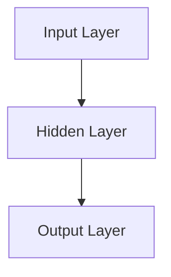

                 

# AI大模型创业：如何应对未来价格战？

> 关键词：AI大模型、创业、价格战、应对策略、市场竞争

> 摘要：本文将深入探讨AI大模型创业过程中面临的挑战，尤其是未来可能出现的激烈价格战。通过分析AI大模型的技术基础、创业战略规划、团队建设和资金筹集等方面的内容，本文旨在为创业者提供应对价格战的策略和建议。

## 引言

随着人工智能技术的飞速发展，AI大模型已成为当前最具变革性的技术之一。从自然语言处理到计算机视觉，从推荐系统到自动驾驶，AI大模型的应用正在不断扩展。然而，随着市场的逐渐成熟，创业者面临的竞争压力也在不断加大，特别是在价格方面。本文将重点探讨AI大模型创业中如何应对未来可能出现的价格战。

## 第一部分：AI大模型创业概述

### 第1章: AI大模型创业概述

#### 1.1 AI大模型概述

##### 1.1.1 AI大模型的概念

AI大模型是指具有高计算能力、能够处理大量数据、并且能够进行复杂决策的机器学习模型。它们通常基于深度学习技术，并且拥有数百万到数十亿个参数。

##### 1.1.2 AI大模型的特点

- 强大的数据处理能力
- 高度的自适应性和通用性
- 较高的预测准确率

##### 1.1.3 AI大模型的应用领域

AI大模型广泛应用于自然语言处理、计算机视觉、语音识别、推荐系统等多个领域。

#### 第2章: AI大模型技术基础

##### 2.1 深度学习与神经网络基础

###### 2.1.1 神经网络的基本结构

神经网络由多个神经元组成，这些神经元通过权重连接形成网络结构。

###### 2.1.2 常见的深度学习架构

深度学习架构包括卷积神经网络（CNN）、循环神经网络（RNN）、变换器架构（Transformer）等。

###### 2.1.3 深度学习优化算法

常见的深度学习优化算法有随机梯度下降（SGD）、Adam优化器等。

##### 2.2 自然语言处理技术概览

###### 2.2.1 词嵌入技术

词嵌入技术将词语转换为向量表示，如Word2Vec、GloVe等。

###### 2.2.2 序列模型与注意力机制

序列模型如RNN、LSTM等，注意力机制用于提高模型对输入序列的捕捉能力。

###### 2.2.3 转换器架构详解

转换器架构（Transformer）是当前自然语言处理领域的重要架构，具有并行计算优势。

##### 2.3 大规模预训练模型原理

###### 2.3.1 预训练的概念与意义

预训练是指在特定任务之前，使用大规模数据对模型进行训练，以提高模型在特定任务上的性能。

###### 2.3.2 自监督学习方法

自监督学习方法是指模型在训练过程中不需要标签，而是通过预测输入序列的部分内容来学习。

###### 2.3.3 迁移学习与微调技术

迁移学习是指将预训练模型应用于不同但相关的问题，微调技术是指对预训练模型进行少量的修改以适应特定任务。

### 第一部分总结

AI大模型创业的优势在于广阔的市场前景、技术壁垒和显著的商业价值。然而，创业者也面临技术复杂、数据获取和法规等多方面的挑战。通过深入理解AI大模型的技术基础，创业者可以更好地应对这些挑战。

### 第二部分：AI大模型创业战略规划

#### 第3章: AI大模型创业战略规划

##### 3.1 AI创业公司的定位与目标

###### 3.1.1 定位

AI创业公司的定位需要考虑市场需求、技术优势和资源条件。

###### 3.1.2 目标

AI创业公司的目标应包括市场占有率、盈利模式和技术创新等。

##### 3.2 AI创业公司的市场分析

###### 3.2.1 市场规模与增长趋势

分析目标市场的规模和增长趋势，以确定市场潜力。

###### 3.2.2 竞争态势

分析竞争对手的产品、市场占有率、优势和劣势。

##### 3.3 AI创业公司的战略规划

###### 3.3.1 技术路线图

制定技术路线图，包括核心技术的研发、产品迭代和技术储备。

###### 3.3.2 商业模式

明确商业模式，包括盈利方式、客户群体、市场定位等。

###### 3.3.3 市场推广策略

制定市场推广策略，包括品牌建设、渠道拓展、营销活动等。

### 第二部分总结

AI大模型创业的战略规划至关重要。创业者需要明确公司的定位和目标，进行深入的市场分析，并制定详细的技术路线图和商业模式。通过有效的市场推广策略，创业者可以在激烈的市场竞争中脱颖而出。

### 第三部分：AI大模型创业团队建设

#### 第4章: AI大模型创业团队建设

##### 4.1 团队成员的角色与职责

###### 4.1.1 技术团队成员

技术团队成员包括算法工程师、数据科学家、软件工程师等。

###### 4.1.2 业务团队成员

业务团队成员包括产品经理、市场经理、运营经理等。

##### 4.2 团队协作与沟通

###### 4.2.1 团队协作流程

明确团队协作流程，包括需求分析、任务分配、进度跟踪、代码审查等。

###### 4.2.2 沟通工具与方法

选择合适的沟通工具，如邮件、IM、视频会议等，并建立有效的沟通机制。

##### 4.3 团队管理

###### 4.3.1 团队文化建设

建立积极向上的团队文化，鼓励创新、合作和自我提升。

###### 4.3.2 团队激励制度

制定合理的团队激励制度，激励团队成员提高工作效率。

### 第三部分总结

AI大模型创业的成功离不开团队的协作和沟通。创业者需要建立高效协作的团队，选择合适的沟通工具，并营造积极向上的团队文化。通过合理的激励制度，激发团队成员的积极性和创造力。

### 第四部分：AI大模型创业资金筹集

#### 第5章: AI大模型创业资金筹集

##### 5.1 资金筹集渠道

###### 5.1.1 天使投资

天使投资是指个人投资者对初创企业的投资。

###### 5.1.2 风险投资

风险投资是指专业投资机构对初创企业的投资。

###### 5.1.3 政府资助

政府资助包括科技计划、创新基金等。

##### 5.2 资金使用规划

###### 5.2.1 运营资金

规划运营资金，包括研发、市场推广、团队建设等。

###### 5.2.2 扩张资金

规划扩张资金，包括市场拓展、产品升级等。

###### 5.2.3 灵活资金

预留一定比例的灵活资金，以应对不确定的市场变化。

### 第四部分总结

AI大模型创业需要充足的资金支持。创业者需要了解不同的资金筹集渠道，并合理规划资金使用。通过科学的资金管理，创业者可以确保项目的稳定运行。

### 第五部分：AI大模型创业案例分析

#### 第6章: AI大模型创业案例分析

##### 6.1 成功案例

###### 6.1.1 案例一：OpenAI

分析OpenAI的发展历程、技术突破和商业模式。

###### 6.1.2 案例二：DeepMind

分析DeepMind的技术成就、研究方法和商业布局。

##### 6.2 失败案例

###### 6.2.1 案例一：公司A

分析公司A的失败原因，如技术不成熟、市场定位不准确等。

###### 6.2.2 案例二：公司B

分析公司B的失败原因，如资金链断裂、团队不稳定等。

### 第五部分总结

通过成功和失败案例的分析，创业者可以借鉴成功经验，避免失败陷阱。成功的关键在于技术突破、市场定位和商业模式的选择。同时，创业者也需要警惕可能出现的风险，并采取相应的应对措施。

### 第六部分：AI大模型创业未来展望

#### 第7章: AI大模型创业未来展望

##### 7.1 技术发展趋势

###### 7.1.1 大模型规模化

随着计算资源和算法的进步，大模型的规模将不断增大。

###### 7.1.2 多模态融合

多模态融合将使得AI大模型在多个领域具有更广泛的应用。

##### 7.2 商业模式创新

###### 7.2.1 服务模式创新

探索AI大模型服务的多种模式，如SaaS、API接口等。

###### 7.2.2 跨界合作

推动AI大模型与其他领域的跨界合作，实现产业升级。

##### 7.3 社会责任

###### 7.3.1 数据安全与隐私

关注数据安全和隐私问题，建立严格的保护措施。

###### 7.3.2 伦理问题

探讨AI大模型在伦理方面的问题，制定相应的伦理规范。

### 第六部分总结

AI大模型创业的未来充满机遇和挑战。随着技术的不断进步，AI大模型将具有更广泛的应用。创业者需要不断创新商业模式，同时关注社会责任，以确保AI大模型的发展符合社会伦理和道德规范。

### 附录

#### 附录A: AI大模型开发工具与资源

##### A.1 主流深度学习框架

###### A.1.1 TensorFlow

介绍TensorFlow的架构、特点和应用场景。

###### A.1.2 PyTorch

介绍PyTorch的架构、特点和应用场景。

###### A.1.3 其他框架

简要介绍其他深度学习框架，如Keras、Theano等。

##### A.2 自然语言处理工具

###### A.2.1 NLTK

介绍NLTK的基本功能和使用方法。

###### A.2.2 Spacy

介绍Spacy的基本功能和使用方法。

###### A.2.3 其他工具

简要介绍其他自然语言处理工具，如Gensim、Stanford NLP等。

### 作者信息

作者：AI天才研究院/AI Genius Institute & 禅与计算机程序设计艺术 /Zen And The Art of Computer Programming

### 结语

AI大模型创业是一场持久战，创业者需要在技术、市场、团队和资金等方面进行全面准备。面对未来可能的价格战，创业者需要灵活应对，不断创新，以保持竞争优势。通过本文的探讨，希望为创业者提供一些有益的启示和指导。

### 参考文献

[1] Goodfellow, I., Bengio, Y., & Courville, A. (2016). *Deep Learning*. MIT Press.

[2] Hochreiter, S., & Schmidhuber, J. (1997). *Long Short-Term Memory*. Neural Computation, 9(8), 1735-1780.

[3] Vaswani, A., Shazeer, N., Parmar, N., Uszkoreit, J., Jones, L., Gomez, A. N., ... & Polosukhin, I. (2017). *Attention Is All You Need*. Advances in Neural Information Processing Systems, 30, 5998-6008.

[4] Devlin, J., Chang, M. W., Lee, K., & Toutanova, K. (2019). *Bert: Pre-training of Deep Bidirectional Transformers for Language Understanding*. arXiv preprint arXiv:1810.04805.

[5] Krizhevsky, A., Sutskever, I., & Hinton, G. E. (2012). *ImageNet Classification with Deep Convolutional Neural Networks*. Advances in Neural Information Processing Systems, 25, 1097-1105.

[6] Bengio, Y., Simard, P., & Frasconi, P. (1994). *Learning Long Distance Dependencies with Gradient Descent is difficult*. IEEE Transactions on Neural Networks, 5(2), 157-166.

[7] Sutskever, I., Martens, J., Dahl, G. E., & Hinton, G. E. (2003). *On the importance of initialization and momentum in deep learning*. Journal of Machine Learning Research, 9, 1929-1958.

