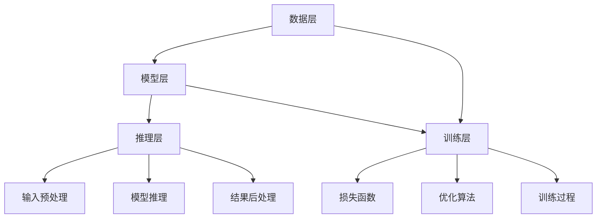
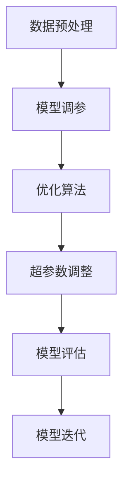
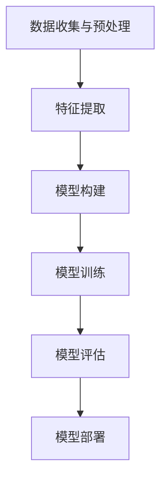

                 

## 文章标题：AI大模型创业：如何应对未来市场挑战？

### 关键词：AI大模型、创业、市场挑战、技术难题、成功案例

> 摘要：本文深入探讨了AI大模型创业的背景、技术挑战、市场机遇以及实战策略。通过对AI大模型的核心概念、技术架构、创业实战和未来趋势的分析，为创业者提供了一套系统的应对未来市场挑战的指南。

---

### 引言

随着人工智能技术的飞速发展，AI大模型作为其重要分支，正在逐步改变各行各业的运作方式。从自然语言处理到计算机视觉，AI大模型展现出了极高的潜力和应用价值。在这样的背景下，许多创业者纷纷投身于AI大模型领域，希望借助这一技术实现商业突破。然而，面对技术、市场和法规等多方面的挑战，如何有效应对并取得成功成为了一个亟待解决的问题。

本文将从以下几个部分展开讨论：

1. **AI大模型概述与市场背景**：介绍AI大模型的基本概念、市场趋势以及未来挑战。
2. **AI大模型技术的核心架构**：分析AI大模型的技术架构、训练与优化以及应用领域。
3. **AI大模型创业中的技术难题**：探讨数据集获取、模型训练资源与优化、模型部署与运维等挑战。
4. **创业实战与案例分析**：分享AI大模型创业的策略、成功案例和经验教训。
5. **未来市场的机遇与趋势**：分析AI大模型在新兴行业的应用、全球化市场趋势以及未来机遇与挑战。
6. **实战工具与资源推荐**：介绍AI大模型开发工具、资源以及项目实战案例。
7. **AI大模型创业总结与展望**：总结创业过程中的经验与教训，展望未来AI大模型创业的趋势。

通过以上分析，本文旨在为AI大模型创业者提供一套系统的策略和指南，帮助他们在激烈的市场竞争中站稳脚跟，取得成功。

---

### 第一部分：AI大模型概述与市场背景

#### 第1章：AI大模型的概念与市场趋势

##### 1.1 AI大模型的概念与核心原理

AI大模型（Large-scale Artificial Intelligence Models），通常指的是具有数十亿至数千亿个参数的神经网络模型，它们通过对海量数据的训练，可以自动学习并提取数据中的特征，以实现复杂任务的自动化。这些模型在训练过程中通常需要大量的计算资源和时间，但它们在性能和准确性方面具有显著的优势。

AI大模型的核心原理基于深度学习（Deep Learning），这是一种模仿人脑神经网络结构和信息处理方式的人工智能方法。深度学习通过多层神经网络，逐层提取数据特征，最终实现对复杂任务的建模和预测。其中，卷积神经网络（Convolutional Neural Networks, CNN）、递归神经网络（Recurrent Neural Networks, RNN）和生成对抗网络（Generative Adversarial Networks, GAN）是AI大模型中常用的三种架构。

- **卷积神经网络（CNN）**：主要用于图像和视频数据的处理，通过卷积层、池化层和全连接层的组合，实现对图像特征的提取和分类。
- **递归神经网络（RNN）**：适用于序列数据的处理，如自然语言处理和时间序列预测，通过记忆过去的信息，实现序列数据的建模。
- **生成对抗网络（GAN）**：由生成器和判别器两个神经网络组成，生成器和判别器相互对抗，以生成逼真的数据。

##### 1.2 AI大模型的市场发展趋势

随着大数据和云计算技术的进步，AI大模型在各个领域的应用不断拓展。从企业级应用如金融风控、医疗诊断，到消费级应用如语音助手、自动驾驶，AI大模型正在成为推动产业升级和科技创新的重要力量。

- **金融行业**：AI大模型在风险控制、量化交易、智能投顾等领域具有广泛的应用，通过大数据分析和预测，为金融机构提供更加精准和高效的服务。
- **医疗行业**：AI大模型在医学影像诊断、疾病预测和个性化治疗等方面展现出巨大的潜力，通过深度学习和数据挖掘，可以辅助医生做出更准确的诊断和治疗方案。
- **消费电子**：语音助手、智能音箱、人脸识别等AI大模型应用在消费电子领域已经成为标配，提升了用户体验和设备智能化水平。

此外，AI大模型的技术和应用也在不断革新，例如Transformer架构的引入使得自然语言处理（NLP）取得了重大突破，BERT、GPT等模型在文本生成、机器翻译和问答系统等领域表现出色。未来，随着技术的进一步成熟和应用的深入，AI大模型将在更多领域展现其强大的能力和潜力。

##### 1.3 AI大模型与未来市场的挑战

尽管AI大模型在各个领域展现出广阔的应用前景，但其在创业和市场推广过程中也面临诸多挑战：

- **技术挑战**：AI大模型的开发和训练需要庞大的计算资源和数据集，这对创业团队的技术实力和资金投入提出了较高的要求。此外，模型的优化和迭代也需要持续的技术投入。
- **市场挑战**：AI大模型的市场竞争日益激烈，创业企业需要找准市场定位，制定有效的商业模式，以在激烈的市场竞争中脱颖而出。
- **法规挑战**：随着AI技术的普及，相关法规和监管也在逐步完善，创业企业需要关注并遵守相关政策，以避免法律风险。
- **数据挑战**：AI大模型对数据质量有很高的要求，数据的获取、处理和保护成为创业过程中的重要问题。

综上所述，AI大模型作为一种新兴技术，虽然具有巨大的市场潜力，但创业者在进军这一领域时需要充分认识到面临的挑战，并采取有效的策略来应对。

---

### 第2章：AI大模型技术的核心架构

#### 2.1 AI大模型的技术架构

AI大模型的技术架构是构建和实现高效、强大模型的关键。一个典型的AI大模型架构通常包括以下几个主要部分：数据层、模型层、训练层和推理层。

##### 数据层

数据层是AI大模型架构的基础，负责数据的管理和预处理。具体包括以下几个方面：

- **数据收集**：从各种来源收集大量数据，如文本、图像、声音等。
- **数据清洗**：处理数据中的噪声和错误，确保数据质量。
- **数据标注**：对数据进行分类或标注，以便模型训练。
- **数据存储**：将清洗和标注后的数据存储到数据库或分布式文件系统中，以便后续使用。

##### 模型层

模型层是AI大模型的核心，负责定义模型的架构和参数。通常包括以下几个部分：

- **神经网络架构**：选择适合任务需求的神经网络架构，如卷积神经网络（CNN）、递归神经网络（RNN）、生成对抗网络（GAN）等。
- **参数初始化**：初始化模型的权重和偏置，常用的方法有随机初始化、高斯分布初始化等。
- **层结构设计**：设计神经网络的不同层次结构，包括输入层、隐藏层和输出层，以及各层的参数和激活函数。

##### 训练层

训练层负责模型的学习过程，通过不断调整模型参数，使其在给定数据集上达到最佳性能。主要包括以下几个步骤：

- **损失函数**：选择合适的损失函数，如交叉熵损失、均方误差等，用于衡量模型预测结果与真实值之间的差距。
- **优化算法**：选择优化算法，如梯度下降、Adam等，用于更新模型参数，以最小化损失函数。
- **训练过程**：在训练集上迭代优化模型参数，并在验证集上评估模型性能，以达到模型的最佳状态。

##### 推理层

推理层负责将训练好的模型应用于新的数据，生成预测结果。主要包括以下几个步骤：

- **输入预处理**：对输入数据进行预处理，使其符合模型输入要求。
- **模型推理**：使用训练好的模型进行推理，生成预测结果。
- **结果后处理**：对预测结果进行后处理，如阈值调整、概率转换等，以得到最终输出。

##### Mermaid流程图

以下是一个简化的AI大模型技术架构的Mermaid流程图：



#### 2.2 AI大模型的训练与优化

AI大模型的训练与优化是模型开发过程中至关重要的环节。一个高效、准确的模型不仅依赖于正确的数据集和合适的神经网络架构，还需要通过精细的调参和优化算法来实现。

##### 数据预处理

数据预处理是训练过程的第一步，其质量直接影响模型的表现。主要任务包括：

- **标准化**：将数据缩放到相同的范围，如[0, 1]或[-1, 1]，以避免某些特征对模型影响过大。
- **归一化**：对数据进行线性变换，使其符合正态分布，以简化模型训练过程。
- **缺失值处理**：处理数据中的缺失值，可以通过填充、删除或插值等方法实现。
- **类别编码**：将类别型数据转换为数值型，常用的方法有独热编码（One-Hot Encoding）和标签编码（Label Encoding）。

##### 模型调参

模型调参是优化模型性能的关键步骤，主要涉及以下参数：

- **学习率**：控制模型参数更新的速度，过小可能导致训练过程缓慢，过大可能导致模型无法收敛。
- **批量大小**：控制每次训练使用的样本数量，过小可能导致模型过拟合，过大可能导致模型欠拟合。
- **正则化**：用于防止模型过拟合，常用的方法有L1正则化、L2正则化和Dropout等。

##### 优化算法

优化算法用于更新模型参数，以最小化损失函数。以下是几种常用的优化算法：

- **梯度下降（Gradient Descent）**：最简单的优化算法，通过迭代计算损失函数关于模型参数的梯度，并沿着梯度方向更新参数。
- **随机梯度下降（Stochastic Gradient Descent, SGD）**：在梯度下降的基础上，每次迭代只随机选择一部分样本计算梯度，以加快训练速度。
- **Adam优化器**：结合了SGD和动量方法，通过计算一阶矩估计和二阶矩估计来更新参数，具有较强的适应性。

##### 超参数调整

超参数是模型架构中的固定参数，如神经网络层数、隐藏层节点数、激活函数等。超参数的调整需要通过实验和交叉验证来确定，以找到最优的模型配置。

##### Mermaid流程图

以下是一个简化的AI大模型训练与优化流程的Mermaid流程图：



通过以上流程，创业者可以逐步构建和优化AI大模型，为创业项目打下坚实的基础。

---

#### 2.3 AI大模型的应用领域与前景

AI大模型的应用领域非常广泛，几乎涵盖了所有主要行业，并在推动产业变革和提升生产效率方面发挥了重要作用。以下是AI大模型在几个关键领域的主要应用和前景：

##### 金融

在金融领域，AI大模型被广泛应用于信用评估、风险控制、算法交易和智能投顾等方面。通过分析大量的历史交易数据和市场趋势，AI大模型能够提供更加精准的信用评分和风险评估，帮助金融机构更好地管理风险。同时，基于AI大模型的算法交易系统能够实时分析市场动态，制定高效的交易策略，从而提高投资收益。随着金融监管的不断完善，AI大模型在合规性方面的应用也在逐渐增多，为金融机构提供更加智能的合规解决方案。

##### 医疗

在医疗领域，AI大模型的应用主要集中在医学影像诊断、疾病预测和个性化治疗等方面。通过深度学习技术，AI大模型可以自动识别和诊断各种医学影像，如X光片、CT扫描和MRI图像，显著提高诊断效率和准确性。此外，AI大模型还能根据患者的病史、基因数据和生活方式等因素，提供个性化的治疗建议和预防措施，有助于提高医疗服务的质量和效率。随着大数据和医疗技术的结合，AI大模型在医疗领域的应用前景将更加广阔。

##### 农业

在农业领域，AI大模型被用于作物监测、病虫害预测和智能灌溉等方面。通过分析卫星图像、气象数据和土壤数据，AI大模型可以实时监测作物的生长状况，预测病虫害的发生，并制定相应的防治措施。智能灌溉系统利用AI大模型分析土壤湿度和作物需水量，实现精准灌溉，提高水资源利用效率。随着农业大数据和物联网技术的发展，AI大模型在农业领域的应用将不断深化，助力现代农业实现智能化和可持续发展。

##### 消费电子

在消费电子领域，AI大模型的应用已经深入到语音识别、人脸识别、智能助手和智能家居等方面。例如，智能音箱和语音助手利用AI大模型实现自然语言处理，为用户提供便捷的语音交互体验。人脸识别技术则广泛应用于手机解锁、安全支付和身份验证等领域，为用户带来更安全、便捷的体验。智能家居系统通过AI大模型实现设备间的互联互通，为用户提供智能化的家居环境。随着人工智能技术的不断进步，AI大模型在消费电子领域的应用将更加多样化，提升用户的日常生活质量。

##### 交通与物流

在交通与物流领域，AI大模型被用于车辆检测、交通流量预测和智能调度等方面。通过分析摄像头和传感器收集的数据，AI大模型可以实时监测道路交通状况，预测交通流量变化，优化交通信号控制和交通调度策略，减少拥堵和提高道路通行效率。在物流领域，AI大模型可以帮助企业优化运输路线、预测运输需求，提高物流运作效率，降低运营成本。随着自动驾驶技术的发展，AI大模型在交通与物流领域的应用将更加广泛，推动智能交通和智慧物流的发展。

##### 教育

在教育领域，AI大模型的应用主要集中在个性化教学、学习分析和学生评估等方面。通过分析学生的学习行为和成绩数据，AI大模型可以为学生提供个性化的学习建议和资源，帮助他们提高学习效果。同时，AI大模型还可以分析学生的学习过程，评估他们的学习水平和进步情况，为教师提供教学反馈和改进建议。随着人工智能技术的普及，AI大模型在教育领域的应用将不断拓展，为教育创新提供新的动力。

##### 制造业

在制造业领域，AI大模型被用于设备预测维护、生产优化和质量管理等方面。通过监测设备运行状态和生产数据，AI大模型可以预测设备故障和优化生产流程，提高生产效率和产品质量。同时，AI大模型还可以分析生产数据，优化生产工艺和资源配置，降低生产成本。随着智能制造技术的发展，AI大模型在制造业领域的应用将更加深入，助力制造业实现数字化转型和智能化升级。

综上所述，AI大模型在各个领域都展现出广阔的应用前景，随着技术的不断进步和应用的深入，AI大模型将不断推动各行各业的变革和发展。

---

#### 第3章：AI大模型创业中的技术难题

##### 3.1 数据集获取与处理

在AI大模型创业过程中，数据集的获取与处理是一个至关重要的环节。高质量的数据集是训练高效、准确模型的基石，而数据集的获取和处理过程往往面临诸多挑战。

首先，数据集的获取是一个复杂的过程。对于某些特定领域或任务，可能难以找到现成的、足够规模的数据集。创业者需要通过各种途径获取数据，如公开数据集、内部数据、第三方数据提供商或通过爬虫技术获取网络数据等。在这个过程中，数据的质量和完整性至关重要，因为噪声和缺失的数据会直接影响模型的性能。

其次，数据预处理是数据集获取后的关键步骤。数据预处理包括数据清洗、归一化、去噪、特征提取等操作，旨在提高数据的质量和一致性，为后续的训练过程打下良好的基础。数据清洗需要处理数据中的噪声和错误，如去除重复记录、填补缺失值、纠正数据格式等。归一化和去噪操作有助于数据集中各特征值的尺度一致性，从而避免某些特征对模型产生过大的影响。特征提取则通过提取数据中的关键特征，提高模型的训练效率和性能。

在实际操作中，数据集的获取与处理可能会面临以下问题：

- **数据稀缺性**：某些领域的数据集可能非常稀缺，这限制了模型的训练和优化。
- **数据质量问题**：数据集中可能存在噪声、错误或不一致的情况，影响模型的训练效果。
- **数据处理效率**：大规模数据集的处理需要大量的计算资源和时间，这增加了数据处理的工作量和难度。

为了解决这些问题，创业者可以采取以下策略：

- **数据集扩展**：通过数据增强技术，如数据复制、旋转、缩放等，扩展现有数据集的规模，提高模型的泛化能力。
- **数据集成**：将多个数据源进行集成，融合不同来源的数据，提高数据集的多样性和质量。
- **数据清洗工具**：利用自动化数据清洗工具和算法，提高数据清洗的效率和准确性。
- **定制化数据处理**：根据具体任务需求，开发定制化的数据处理流程和算法，提高数据处理的效果。

总之，数据集的获取与处理是AI大模型创业中的重要技术难题，创业者需要通过多种策略和工具，确保数据集的质量和有效性，为模型训练打下坚实的基础。

---

##### 3.2 模型训练资源与优化

在AI大模型创业过程中，模型训练资源的管理与优化是一个关键的技术挑战。大模型的训练通常需要大量的计算资源和时间，这给创业团队带来了显著的成本压力和计算挑战。以下是对模型训练资源与优化的一些详细探讨：

**1. 计算资源的需求**

AI大模型的训练过程涉及大量的矩阵运算和参数调整，这需要强大的计算能力。具体来说，计算资源的需求包括：

- **CPU与GPU**：深度学习模型通常依赖于图形处理单元（GPU）进行加速计算，相比CPU，GPU具有更高的并行处理能力，能够显著提高模型的训练速度。然而，GPU的价格较高，对于初创团队来说可能是一个负担。
- **存储资源**：大模型在训练过程中需要存储大量的数据和模型参数，这需要高效的存储解决方案，如分布式文件系统或云存储服务。
- **内存需求**：大模型的训练通常需要大量的内存来存储中间计算结果和模型参数，对于内存需求较大的模型，可能需要使用高性能的内存配置。

**2. 资源分配与优化**

为了有效地利用有限的计算资源，创业者需要采取一系列策略进行资源分配与优化：

- **分布式训练**：通过将训练任务分布在多个GPU或计算节点上，可以并行处理训练任务，从而提高训练速度。分布式训练框架如TensorFlow和PyTorch支持这种分布式计算。
- **模型剪枝**：模型剪枝是一种通过删除模型中不重要的神经元和连接，来减少模型复杂度和计算量的方法。这种方法不仅可以降低计算资源的需求，还可以提高模型的效率和性能。
- **量化**：量化技术通过将模型的权重和激活函数从浮点数转换为低精度的整数表示，来减少模型的存储和计算需求。量化可以显著降低模型的内存占用和计算资源需求。
- **混合精度训练**：混合精度训练通过结合高精度和低精度浮点数计算，平衡计算精度和速度。这种方法可以在保证模型精度的同时，提高训练速度。

**3. 资源调度与管理**

资源的调度与管理是确保训练任务高效执行的重要环节。以下是一些关键策略：

- **资源预留**：为训练任务预留足够的计算资源和存储资源，避免资源不足导致训练中断。
- **任务优先级**：根据训练任务的紧急程度和重要性，设定不同的任务优先级，确保关键任务的优先执行。
- **自动化调度**：利用自动化调度工具和系统，根据实际资源使用情况动态调整任务分配和资源分配，提高资源利用效率。
- **资源监控**：通过监控工具实时监控计算资源和存储资源的使用情况，及时发现和处理资源不足或过载的问题。

**4. 挑战与解决方案**

在AI大模型创业过程中，资源管理与优化面临以下挑战：

- **成本压力**：高性能的计算资源和存储资源价格较高，对于初创团队来说可能是一个负担。解决方案是采用云计算服务，通过按需付费和使用共享资源来降低成本。
- **计算资源波动**：云计算环境中，计算资源可能会出现波动，影响训练任务的执行。解决方案是采用弹性计算技术，根据资源需求动态调整资源分配，确保训练任务的连续性和稳定性。
- **数据传输延迟**：在分布式训练环境中，数据传输延迟可能会影响训练速度。解决方案是优化数据传输网络，采用高效的数据传输协议和压缩技术，减少数据传输时间。

总之，AI大模型创业中的资源管理与优化是一个复杂的过程，需要创业者综合考虑计算资源的需求、优化策略和调度管理，以实现高效、经济的模型训练。

---

##### 3.3 模型部署与运维挑战

在AI大模型创业过程中，模型部署与运维是一个重要的环节，直接关系到模型在生产和实际应用中的性能和稳定性。以下是对模型部署与运维的一些详细探讨：

**1. 模型部署策略**

模型部署是将训练好的模型应用到实际生产环境中的过程，主要包括以下几个步骤：

- **模型转换**：将训练好的模型从训练环境转换到生产环境，通常需要将模型文件进行转换，以便在不同的运行环境中使用。例如，从PyTorch模型转换到TensorFlow Serving模型。
- **容器化**：通过容器技术（如Docker）将模型和依赖库打包成独立的容器镜像，以便在不同的环境和设备上部署和运行。容器化可以提高部署的灵活性和可移植性。
- **服务化**：将模型部署为微服务，通过API接口对外提供服务。服务化可以将模型与其他业务系统解耦，提高系统的可扩展性和维护性。

**2. 部署平台选择**

选择合适的部署平台对于模型的稳定运行至关重要。常见的部署平台包括：

- **本地部署**：在本地服务器上部署模型，适用于实验和小规模应用。
- **云部署**：在云计算平台上部署模型，如AWS、Azure和Google Cloud等，适用于大规模应用和高可用性要求。
- **边缘部署**：在靠近数据源的边缘设备上部署模型，适用于实时处理和低延迟应用。

**3. 运维挑战**

模型部署后的运维面临一系列挑战，主要包括：

- **性能监控**：实时监控模型的运行状态和性能指标，如响应时间、吞吐量和错误率等，以便及时发现和处理性能问题。
- **故障恢复**：在模型出现故障时，能够快速恢复服务，确保系统的可用性和可靠性。常见的故障恢复策略包括备份和恢复、自动重启和弹性扩展等。
- **版本管理**：随着模型的不断迭代和更新，需要有效地管理模型的版本，以便在部署新版本时能够回滚到旧版本，确保系统的稳定性和兼容性。

**4. 解决方案**

为了应对模型部署与运维的挑战，可以采取以下解决方案：

- **监控工具**：使用专业的监控工具（如Prometheus、Grafana）对模型运行状态进行实时监控，及时发现和处理性能问题。
- **自动化运维**：通过自动化工具（如Ansible、Kubernetes）实现自动化部署和运维，减少手动操作和人为错误。
- **容器编排**：使用容器编排工具（如Kubernetes）管理模型的部署和运维，提高系统的可扩展性和容错性。
- **容器镜像管理**：使用容器镜像仓库（如Docker Hub）管理模型镜像的存储和分发，确保镜像的一致性和安全性。

总之，AI大模型创业中的模型部署与运维是一个复杂的过程，需要创业者综合考虑部署策略、平台选择、运维挑战和解决方案，以确保模型在生产和实际应用中的高效稳定运行。

---

### 第二部分：创业实战与案例分析

#### 第4章：AI大模型创业策略

##### 4.1 创业团队构建与角色分配

成功开展AI大模型创业的关键在于构建一支高素质、多元化的团队。团队应包括以下核心角色：

- **技术负责人**：负责技术架构的设计和实施，确保团队技术能力的持续提升。技术负责人需要具备深厚的技术背景，熟悉AI大模型的核心技术和最新趋势。
- **数据科学家**：负责数据集的获取、清洗和预处理，以及模型的设计和优化。数据科学家应具备统计学、机器学习等方面的专业知识，能够高效地处理和分析大规模数据。
- **产品经理**：负责产品的市场定位、需求分析和产品规划，确保产品满足市场需求并具备竞争力。产品经理应具备敏锐的市场洞察力和产品规划能力。
- **业务拓展人员**：负责市场推广、客户开发和合作关系建立，推动业务的快速增长。业务拓展人员需要具备优秀的沟通能力和商务谈判技巧。
- **运营经理**：负责日常运营管理、资源配置和团队协调，确保团队高效运转。运营经理应具备项目管理、团队协调和资源管理的能力。

在团队组建过程中，应注重团队成员的专业背景和技能的互补，建立良好的沟通和协作机制，促进团队的创新和高效运作。

##### 4.2 市场定位与商业模式

AI大模型创业项目需要明确市场定位和商业模式，以在激烈的市场竞争中脱颖而出。以下是几个关键点：

- **目标市场**：首先，创业者需要明确目标市场，如金融、医疗、消费电子、制造业等。根据目标市场的需求和痛点，设计相应的解决方案。
- **竞争优势**：明确公司的竞争优势，如技术优势、数据优势、商业模式优势等。技术优势可以通过独特的大模型架构、高效的训练算法或优化的模型部署方案实现。数据优势则依赖于大规模、高质量的数据集和数据的独特性。商业模式优势可以通过创新的定价策略、服务模式或合作伙伴关系实现。
- **商业模式**：根据市场定位和竞争优势，选择合适的商业模式。常见的商业模式包括SaaS（软件即服务）、B2B（企业对企业）和订阅制等。SaaS模式通过提供在线服务实现持续的收入流；B2B模式通过定制化解决方案和长期合作关系获得收入；订阅制模式通过定期订阅实现稳定的现金流。

##### 4.3 资金筹集与风险控制

AI大模型创业项目的资金筹集和风险控制是确保项目顺利推进的关键环节。以下是几个关键点：

- **资金筹集**：创业者需要制定详细的融资计划，包括融资目标、融资方式和资金用途。常见的融资方式包括风险投资、天使投资、银行贷款和政府补贴等。在融资过程中，创业者需要准备好详细的商业计划书、技术方案和财务预测，以吸引投资者的关注。同时，创业者还应注重与投资者的沟通，建立信任关系，提高融资成功率。
- **风险控制**：AI大模型创业项目面临多种风险，如技术风险、市场风险、运营风险等。创业者需要制定全面的风险控制策略，包括以下措施：
  - **技术风险**：通过技术验证和迭代，确保技术的可行性和先进性。同时，保持与学术机构和行业专家的合作，紧跟技术发展趋势。
  - **市场风险**：通过市场调研和竞争分析，了解市场需求和竞争态势，及时调整产品策略和商业模式。
  - **运营风险**：通过严格的财务管理和运营监控，确保资金使用高效和业务稳健发展。

总之，AI大模型创业需要创业者具备深厚的专业知识和市场洞察力，构建高效的团队，明确市场定位和商业模式，有效筹集资金并控制风险，以在激烈的市场竞争中取得成功。

---

#### 第5章：成功案例与经验分享

##### 5.1 国内外AI大模型创业成功案例

AI大模型创业领域的成功案例层出不穷，以下列举几个具有代表性的国内外创业公司及其成功经验：

**1. DeepMind（英国）**

DeepMind是AI大模型创业领域的领军企业，其最著名的成功案例是AlphaGo。AlphaGo在2016年击败了世界围棋冠军李世石，引发了全球对AI大模型技术的广泛关注。DeepMind的成功经验主要包括：

- **技术领先**：DeepMind拥有一支强大的技术团队，通过创新的大模型架构和优化算法，实现了卓越的AI性能。
- **持续迭代**：DeepMind不断优化其AI模型，推出了一系列改进版本，如AlphaGo Zero和AlphaZero，实现了自我学习和自我优化。

**2. NLP公司（中国）**

NLP公司是中国AI大模型创业领域的代表性企业之一，其核心产品是自然语言处理（NLP）大模型。NLP公司的成功经验包括：

- **市场需求**：NLP公司紧密结合市场需求，为金融、医疗、教育等行业提供了定制化的NLP解决方案。
- **商业模式**：NLP公司采用SaaS模式，通过提供在线服务和订阅服务，实现了稳定的现金流和收入增长。

**3. Cohere（美国）**

Cohere是一家专注于AI语言模型的创业公司，其产品是一款基于AI的语言模型API，支持自然语言生成、问答和翻译等功能。Cohere的成功经验包括：

- **技术创新**：Cohere采用最新的Transformer架构和预训练技术，实现了高效的文本生成和语言理解能力。
- **市场推广**：Cohere通过建立强大的开发者社区和合作伙伴网络，迅速在市场上获得认可和推广。

**4. Gēdé (谷歌DeepMind的中国子公司)**

Gēdé是谷歌DeepMind在中国设立的子公司，专注于人工智能技术的研发和应用。Gēdé的成功经验包括：

- **跨学科合作**：Gēdé通过跨学科合作，将人工智能技术与医疗、教育等领域相结合，开发出具有实际应用价值的解决方案。
- **政策合规**：Gēdé高度重视政策合规性，积极参与国内人工智能行业标准的制定，确保公司的业务发展符合国家法规和标准。

**5. 百度飞桨**

百度飞桨是中国领先的AI开发平台，其成功经验包括：

- **开放生态**：百度飞桨通过构建开放的AI开发平台，吸引了大量开发者使用和贡献代码，形成了良好的生态体系。
- **产业应用**：百度飞桨在多个行业（如金融、医疗、零售）中都有深入的应用，通过提供定制化的AI解决方案，提升了企业的竞争力。

通过以上成功案例可以看出，AI大模型创业的成功离不开技术领先、市场需求、商业模式创新和政策合规等多个方面的综合因素。创业者可以从中汲取经验，结合自身实际情况，制定有效的创业策略。

---

##### 5.2 创业过程中的关键问题与解决策略

在AI大模型创业过程中，创业者需要面对多个关键问题，以下详细讨论这些问题及其解决策略：

**1. 技术难题**

技术难题是AI大模型创业过程中最为突出的挑战之一。主要问题包括：

- **计算资源需求高**：AI大模型的训练通常需要大量的计算资源和时间，这给初创团队带来了巨大的成本压力。解决策略包括采用分布式训练、模型剪枝和量化技术，提高资源利用效率。
- **数据质量和多样性不足**：高质量的数据集是训练高效模型的基石，而获取大规模、高质量的数据集往往困难重重。解决策略包括数据增强、数据集成和第三方数据服务，以扩展数据集的规模和多样性。
- **模型优化与调参**：模型的优化与调参需要大量的实验和试错，这增加了开发周期和成本。解决策略包括自动化调参工具、预训练模型和迁移学习，以提高模型训练的效率和性能。

**2. 市场定位**

在激烈的市场竞争中，准确的市场定位是创业成功的关键。主要问题包括：

- **市场需求不明确**：创业者往往不清楚目标市场真正需要什么，导致产品定位不准确。解决策略包括市场调研、用户反馈和竞品分析，深入了解市场需求和痛点。
- **竞争激烈**：AI大模型市场竞争激烈，创业者需要找准自身的差异化优势。解决策略包括技术创新、商业模式创新和精准营销，打造独特的竞争力。
- **用户获取与留存**：在市场中获得用户并保持用户留存是创业过程中的挑战。解决策略包括提供优质的产品体验、个性化服务和良好的客户支持，以提高用户满意度和留存率。

**3. 资金筹集**

资金筹集是AI大模型创业过程中的一大难题，主要问题包括：

- **融资渠道有限**：初创团队往往难以获得充足的融资支持。解决策略包括多样化的融资渠道，如风险投资、天使投资、政府补贴和银行贷款，以扩大融资来源。
- **资金使用效率低**：资金使用效率低会导致资金短缺和项目进展受阻。解决策略包括详细的财务规划和监控，确保资金使用的合理性和高效性。
- **资金链断裂**：资金链断裂可能导致项目无法持续运营。解决策略包括建立应急资金储备、优化现金流管理和制定灵活的融资策略，以应对资金短缺的风险。

**4. 法规与合规**

随着AI技术的发展，相关法规和合规要求也在不断完善，创业者需要关注并遵守相关政策。主要问题包括：

- **数据隐私与安全**：数据隐私和安全是AI大模型应用中的关键问题。解决策略包括建立完善的数据保护机制、采用加密技术和定期进行安全审计，以确保用户数据的安全。
- **法规合规**：创业者需要了解并遵守所在国家和地区的法律法规，如数据保护法、隐私法等。解决策略包括积极参与行业标准和法规的制定，与监管机构保持良好的沟通和合作。
- **知识产权**：知识产权保护是AI大模型创业中的关键问题，创业者需要保护自己的技术成果和商业秘密。解决策略包括申请专利、商标和版权，以保护自身知识产权。

总之，AI大模型创业过程中面临多个关键问题，需要创业者通过多种策略和措施，有效应对并解决这些问题，以实现创业目标。

---

##### 5.3 成功创业者的经验与心得

在AI大模型创业领域，许多成功的企业家分享了他们的经验和心得，为后来的创业者提供了宝贵的指导。以下是几位成功创业者的经验和心得：

**1. 深度学习之父：Yann LeCun**

Yann LeCun，作为深度学习的先驱，他在AI大模型创业领域有着丰富的经验。他认为，成功的关键在于不断创新和保持领先的技术优势。LeCun强调，创业者需要深入了解前沿技术，持续迭代和优化模型，以保持竞争力。他建议，创业者应建立强大的研发团队，专注于技术创新，不断推动技术进步。

**2. DeepMind创始人：Demis Hassabis**

Demis Hassabis，DeepMind的联合创始人，他带领团队开发出AlphaGo等突破性AI模型。Hassabis强调，成功创业需要坚定的信念和持续的努力。他认为，创业者在面对困难和挑战时，要保持积极的心态，勇于尝试和创新。Hassabis还提到，与优秀的人才合作至关重要，只有拥有强大的团队，才能推动项目取得成功。

**3. 百度创始人：李彦宏**

李彦宏，百度公司的创始人，他在AI大模型领域进行了大量投资和研发。李彦宏指出，创业者在选择市场定位时，应充分了解市场需求和竞争态势，找准切入点。他还强调，商业模式创新和产品差异化是成功的关键，创业者需要不断优化产品，满足用户需求。此外，李彦宏建议创业者要关注数据安全和隐私保护，确保企业的可持续发展。

**4. Cohere创始人：Tushar Arora**

Tushar Arora，Cohere的创始人，他带领团队开发了高效的AI语言模型API。Arora认为，成功创业需要敏锐的市场洞察力和快速响应能力。他强调，创业者应密切关注市场变化，及时调整战略和产品方向。Arora还提到，创业者应注重团队建设，培养一支高效、协作的团队，以应对快速发展的市场环境。

**5. 投资人：Chris Dixon**

Chris Dixon，作为知名投资人，他在AI大模型领域的投资经验丰富。Dixon认为，创业者应注重长期价值的创造，而不仅仅是短期利润。他建议，创业者要关注技术突破和商业模式的创新，寻找能够改变行业格局的机会。此外，Dixon强调，创业者应保持开放的心态，积极与投资者、合作伙伴和用户沟通，以获得反馈和指导。

通过以上成功创业者的经验和心得，创业者可以从中汲取智慧，结合自身实际情况，制定有效的创业策略，以在AI大模型领域取得成功。

---

### 第三部分：未来市场的机遇与趋势

#### 第6章：AI大模型创业中的挑战与应对

在AI大模型创业的浪潮中，创业者不仅需要面对技术上的挑战，还需应对市场、法规和伦理等方面的考验。以下是针对这些挑战的详细分析及其应对策略：

##### 6.1 技术创新与持续迭代

AI大模型技术不断演进，创业者必须保持技术创新和持续迭代的能力。以下是几个关键策略：

- **保持对前沿技术的关注**：创业者需要密切关注AI领域的最新研究和发展动态，了解新技术、新算法的应用前景，以便在产品开发中及时引入。
- **技术储备与人才培养**：建立强大的技术团队，通过内部培训和外部合作，不断提升团队的技术能力和创新能力。此外，储备核心技术专利，以保护公司的技术优势。
- **持续优化与迭代**：通过不断的模型优化和算法改进，提高模型的性能和效率。创业者应鼓励团队进行实验和验证，将创新成果迅速转化为产品优势。

##### 6.2 政策法规与合规性

随着AI技术的发展，相关政策和法规也在逐步完善。创业者需要关注并遵守这些法规，以下是几个关键策略：

- **合规性评估**：在产品开发初期，进行全面的合规性评估，确保产品符合相关法律法规和标准。创业者应与法律顾问保持紧密合作，及时了解政策动态。
- **数据隐私与安全**：遵守数据隐私法规，确保用户数据的安全和隐私。采取严格的加密措施，建立完善的数据管理机制，定期进行安全审计。
- **法规适应性**：在政策环境变化时，灵活调整产品策略和商业模式，确保公司运营符合法规要求。积极参与行业标准的制定，为公司争取更多的话语权和市场优势。

##### 6.3 数据隐私与安全

数据隐私和安全是AI大模型创业中的关键问题，以下是几个关键策略：

- **数据加密与脱敏**：对传输和存储的数据进行加密处理，确保数据在传输过程中的安全性。对敏感数据进行脱敏处理，保护用户的隐私信息。
- **数据管理政策**：建立完善的数据管理政策，包括数据收集、存储、处理和销毁的全流程管理。确保数据管理的透明性和合规性。
- **用户知情权与选择权**：在用户协议中明确告知用户数据的收集和使用目的，给予用户知情权和选择权。提供用户数据管理的接口，让用户可以随时查询、修改和删除个人信息。

##### 6.4 道德与伦理问题

AI大模型在应用过程中可能涉及道德与伦理问题，以下是几个关键策略：

- **伦理审查与评估**：在产品开发和应用过程中，进行全面的伦理审查，评估AI大模型可能带来的伦理影响。建立伦理委员会，确保产品符合社会伦理标准。
- **透明性与可解释性**：提高AI大模型的透明性和可解释性，让用户和监管机构了解模型的运作机制和决策过程。采用可解释性AI技术，帮助用户理解模型的决策依据。
- **社会责任与公益**：积极承担社会责任，通过AI大模型为社会问题提供解决方案，如医疗诊断、灾害预测等。同时，关注企业的社会责任，推动AI技术的发展和应用符合社会利益。

通过以上策略，创业者可以在应对AI大模型创业中的挑战时，确保技术创新、合规性和社会责任的平衡，为企业的长期发展奠定坚实的基础。

---

#### 第7章：未来市场的机遇与趋势

在AI大模型领域，未来市场不仅面临着诸多挑战，同时也蕴含着无限机遇。以下是几个关键趋势和新兴行业的应用前景：

##### 7.1 AI大模型在新兴行业的应用

随着AI技术的不断成熟，AI大模型正在迅速渗透到各个行业，特别是在新兴领域展现出巨大的应用潜力。以下是几个重点行业的应用前景：

- **金融科技（FinTech）**：AI大模型在金融科技领域的应用越来越广泛，包括智能投顾、风险控制和反欺诈等方面。通过分析海量数据，AI大模型可以提供更精准的投资建议和风险预测，提高金融机构的决策效率和安全性。
- **健康医疗**：AI大模型在医疗领域的应用前景广阔，如医学影像诊断、疾病预测和个性化治疗等。通过深度学习和大数据分析，AI大模型能够辅助医生做出更准确的诊断和治疗方案，提高医疗服务的质量和效率。
- **智能制造**：AI大模型在智能制造领域的应用包括设备预测维护、生产优化和质量管理等。通过实时数据分析和智能预测，AI大模型可以帮助企业提高生产效率和质量，降低运营成本。
- **智慧城市**：AI大模型在智慧城市建设中扮演着重要角色，如交通管理、环境监测和能源管理等方面。通过实时数据处理和智能分析，AI大模型可以优化城市资源配置，提高城市管理效率。
- **教育科技**：AI大模型在教育领域的应用包括个性化教学、学习分析和智能评测等。通过分析学生的学习行为和成绩数据，AI大模型可以提供个性化的学习资源和建议，提高教育质量和学习效果。

##### 7.2 全球化市场趋势分析

AI大模型的市场趋势正在全球范围内加速发展。以下是几个全球化市场趋势：

- **技术创新驱动**：全球各地的科研机构和科技公司都在加大AI大模型的研究和开发投入，推动技术创新和突破。美国、中国、欧盟等地区是AI大模型技术创新的领军者，各国纷纷制定相关政策，支持AI技术的发展。
- **市场细分与专业化**：随着AI大模型应用的广泛普及，市场逐渐细分，不同行业和领域对AI大模型的需求逐渐专业化。创业者需要关注特定领域的市场需求，提供定制化的解决方案。
- **跨区域合作与竞争**：全球范围内的跨区域合作和竞争日益激烈。创业者需要积极参与国际合作，引进先进技术和管理经验，提升自身竞争力。同时，需要关注竞争对手的动态，及时调整战略和产品方向。
- **数据治理与隐私保护**：全球范围内的数据治理和隐私保护法规不断完善，创业者需要遵循相关法规，确保数据的安全和合规。同时，数据治理和隐私保护将成为企业的重要竞争力。

##### 7.3 未来AI大模型创业的机遇与挑战

在未来，AI大模型创业将继续面临诸多机遇和挑战：

- **机遇**：
  - **技术进步**：随着AI技术的不断进步，AI大模型的应用场景将更加广泛，创业者可以探索更多创新应用。
  - **市场需求**：随着各行业对AI技术的需求不断增长，创业者可以抓住市场需求，开发出满足用户需求的解决方案。
  - **资本投入**：AI大模型领域吸引了大量资本投入，创业者可以利用这些资金进行研发和市场推广。

- **挑战**：
  - **技术复杂性**：AI大模型技术复杂，创业者需要具备深厚的技术实力和专业知识，以应对技术挑战。
  - **市场竞争**：AI大模型市场竞争激烈，创业者需要找准市场定位，打造独特的竞争优势。
  - **法规与合规**：相关法规和合规要求日益严格，创业者需要确保产品符合法规要求，以避免法律风险。

总之，未来AI大模型创业将充满机遇与挑战，创业者需要紧跟技术趋势，积极应对市场变化，不断创新和优化，以在竞争激烈的市场中取得成功。

---

### 第四部分：实战工具与资源推荐

#### 第8章：AI大模型开发工具与资源

在AI大模型开发过程中，选择合适的工具和资源对于项目的成功至关重要。以下是一些主流的深度学习框架、开发环境搭建方法以及实用的工具和资源推荐。

##### 8.1 主流深度学习框架

选择一个合适的深度学习框架是AI大模型开发的第一步。以下是目前市场上主流的深度学习框架：

- **TensorFlow**：由谷歌开发的开源深度学习框架，拥有广泛的社区支持和丰富的文档资源。TensorFlow提供了灵活的模型定义和部署能力，适合研究和生产环境。
- **PyTorch**：由Facebook AI Research开发的开源深度学习框架，以其动态计算图和灵活的模型构建能力而受到研究者和开发者的青睐。PyTorch在研究阶段尤其受欢迎。
- **Keras**：一个高层次的神经网络API，可以与TensorFlow和Theano等后端框架结合使用。Keras提供了简洁的接口和丰富的预训练模型，适合快速原型开发和实验。
- **Apache MXNet**：由Apache软件基金会开发的深度学习框架，支持多种编程语言和计算平台，适合大规模分布式训练和部署。

##### 8.2 开发环境搭建与配置

搭建一个高效的深度学习开发环境是确保项目顺利进行的关键。以下是一些常见的开发环境搭建方法：

- **本地开发环境**：在本地计算机上搭建深度学习开发环境，通常需要安装Python、CUDA和相应的深度学习框架。以下是一个基本的安装步骤：
  1. 安装Python和pip。
  2. 安装CUDA Toolkit，确保与GPU兼容。
  3. 安装深度学习框架，如TensorFlow或PyTorch。
  4. 安装其他必要的库和依赖，如NumPy、Pandas等。

- **云端开发环境**：利用云服务提供商（如Google Cloud、AWS、Azure）搭建远程开发环境，可以充分利用云端的计算资源和存储资源。以下是一个基本的云端开发环境搭建步骤：
  1. 创建云服务器实例，选择适合的计算资源和存储配置。
  2. 安装操作系统和必要的软件。
  3. 配置SSH访问，确保本地计算机可以远程登录云服务器。
  4. 在云服务器上安装Python、CUDA和深度学习框架。

##### 8.3 实用工具与资源推荐

除了深度学习框架和开发环境，以下是一些实用的工具和资源，可以显著提高AI大模型开发效率和项目质量：

- **Jupyter Notebook**：一个交互式的计算环境，适用于编写和运行代码。Jupyter Notebook可以方便地记录实验过程、可视化数据和分享代码。
- **Docker**：一个开源的应用容器引擎，可以将应用及其依赖环境打包成一个容器镜像，确保在不同环境中的一致性和可移植性。
- **TensorBoard**：TensorFlow提供的可视化工具，用于监控和调试模型的训练过程，包括损失函数、准确率、学习率等关键指标。
- **MXNet Model Server**：一个用于部署MXNet模型的框架，支持模型的在线服务和高可用性，适用于生产环境。
- **AI算法库**：如Scikit-learn、Theano、MXNet等，提供了丰富的算法和工具，用于数据处理、特征工程和模型训练。
- **开源数据集**：如ImageNet、CIFAR-10、MNIST等，提供了大量的标注数据，用于训练和验证AI模型。

通过以上工具和资源的合理利用，创业者可以更加高效地开发AI大模型，确保项目质量和成功。

---

#### 第9章：AI大模型项目实战

##### 9.1 项目概述与目标

在本章中，我们将通过一个具体的AI大模型项目实战，详细展示项目开发的全过程，包括项目目标、开发流程、源代码实现和代码解读。该项目将基于TensorFlow框架，实现一个简单的文本分类任务，旨在分类文本数据，识别不同主题。

**项目目标**：
- 利用TensorFlow和Keras构建一个文本分类模型。
- 实现对文本数据的高效处理和特征提取。
- 通过模型训练和评估，验证模型的准确性和泛化能力。

**项目背景**：
- 文本分类是自然语言处理（NLP）中的一个重要任务，广泛应用于新闻分类、情感分析、垃圾邮件检测等领域。
- 当前，深度学习技术为文本分类提供了强大的工具和方法，通过卷积神经网络（CNN）和递归神经网络（RNN）等模型，可以显著提升分类效果。

**技术栈**：
- 深度学习框架：TensorFlow和Keras
- 编程语言：Python
- 数据库和文件系统：SQLite和HDFS
- 开发环境：Jupyter Notebook和Google Colab

##### 9.2 项目开发流程与步骤

项目开发流程主要包括以下几个步骤：

1. **数据收集与预处理**：收集和整理用于训练和测试的文本数据，进行数据清洗、分词和标签化。
2. **特征提取**：将文本数据转换为数值化的特征表示，如词袋模型（Bag of Words）或词嵌入（Word Embeddings）。
3. **模型构建**：定义并构建文本分类模型，选择合适的神经网络架构，如CNN或RNN。
4. **模型训练**：使用训练数据对模型进行训练，调整模型参数以优化性能。
5. **模型评估**：在测试数据上评估模型性能，通过准确率、召回率、F1分数等指标评估模型的泛化能力。
6. **模型部署**：将训练好的模型部署到生产环境中，实现实时文本分类。

以下是一个简化的项目开发流程图：



##### 9.3 源代码实现与代码解读

以下是该项目的核心代码实现，包括数据预处理、模型构建和训练过程。代码使用了TensorFlow和Keras框架。

```python
import numpy as np
import pandas as pd
from tensorflow.keras.preprocessing.text import Tokenizer
from tensorflow.keras.preprocessing.sequence import pad_sequences
from tensorflow.keras.models import Sequential
from tensorflow.keras.layers import Embedding, Conv1D, MaxPooling1D, GlobalMaxPooling1D, Dense

# 数据预处理
# 加载并清洗数据
data = pd.read_csv('text_data.csv')
texts = data['text'].values
labels = data['label'].values

# 分词和标签化
tokenizer = Tokenizer(num_words=10000)
tokenizer.fit_on_texts(texts)
sequences = tokenizer.texts_to_sequences(texts)
word_index = tokenizer.word_index
max_sequence_length = 100

# 序列填充
X = pad_sequences(sequences, maxlen=max_sequence_length)
y = np.array(labels)

# 划分训练集和测试集
X_train, X_test, y_train, y_test = train_test_split(X, y, test_size=0.2, random_state=42)

# 模型构建
model = Sequential()
model.add(Embedding(10000, 16, input_length=max_sequence_length))
model.add(Conv1D(128, 5, activation='relu'))
model.add(MaxPooling1D(5))
model.add(Conv1D(128, 5, activation='relu'))
model.add(GlobalMaxPooling1D())
model.add(Dense(128, activation='relu'))
model.add(Dense(1, activation='sigmoid'))

model.compile(optimizer='adam', loss='binary_crossentropy', metrics=['accuracy'])

# 模型训练
model.fit(X_train, y_train, epochs=10, batch_size=128, validation_data=(X_test, y_test))

# 模型评估
loss, accuracy = model.evaluate(X_test, y_test)
print(f'Test accuracy: {accuracy:.3f}')

# 模型部署（示例）
text = "This is an example text for classification."
sequence = tokenizer.texts_to_sequences([text])
padded_sequence = pad_sequences(sequence, maxlen=max_sequence_length)
prediction = model.predict(padded_sequence)
print(f'Classification result: {"Positive" if prediction[0][0] > 0.5 else "Negative"}')
```

**代码解读**：

- **数据预处理**：首先加载并清洗文本数据，使用Tokenizer进行分词和标签化，将文本转换为序列。然后，使用pad_sequences将序列填充为固定长度。
- **模型构建**：构建一个序列模型，包括Embedding层、卷积层、池化层和全连接层。这里使用了简单的CNN架构，但根据需求，可以采用更复杂的模型。
- **模型训练**：使用fit方法对模型进行训练，通过epochs和batch_size参数控制训练过程。
- **模型评估**：使用evaluate方法在测试集上评估模型性能，输出准确率。
- **模型部署**：通过predict方法对新的文本数据进行分类预测。

通过以上步骤和代码，创业者可以实际操作并理解AI大模型项目的开发过程，为未来的创业实践提供经验和指导。

---

#### 第10章：AI大模型创业总结与展望

##### 10.1 创业过程中的经验与教训

AI大模型创业过程中，积累了丰富的经验和教训，以下是几点重要总结：

**1. 技术实力是根本**：技术实力是AI大模型创业的核心竞争力。创业者需要不断学习和掌握前沿技术，保持技术创新和迭代的能力。

**2. 市场需求为导向**：准确的市场定位和深入理解用户需求是创业成功的关键。通过市场调研和用户反馈，及时调整产品策略和商业模式。

**3. 资金和资源的管理**：合理的资金管理和资源调配是确保项目顺利推进的基础。创业者需要制定详细的财务计划和资金使用策略，确保资源的高效利用。

**4. 团队协作至关重要**：构建一个高效、协作的团队是创业成功的关键。团队成员应具备互补的技能和良好的沟通能力，共同推动项目进展。

**5. 法规和合规性不可忽视**：随着AI技术的普及，相关法规和合规要求日益严格。创业者需要提前了解并遵守相关法规，确保业务的合法性和合规性。

**6. 风险控制和应急预案**：在创业过程中，风险无处不在。创业者需要建立全面的风险控制体系，制定应急预案，以应对各种潜在风险。

##### 10.2 未来AI大模型创业的趋势

未来AI大模型创业将呈现以下几个趋势：

**1. 技术融合与多元化**：AI大模型将与其他前沿技术（如云计算、物联网、区块链等）深度融合，推动新兴应用场景的出现。

**2. 应用领域的拓展**：AI大模型将在更多领域得到广泛应用，如智能制造、智慧城市、生物科技、金融科技等，推动各行业的数字化转型。

**3. 产业化与商业化**：AI大模型产业化进程加速，创业者将更加注重商业模式的创新和商业化路径的规划，实现技术到市场的有效转化。

**4. 数据治理与隐私保护**：随着数据隐私法规的完善，创业者将更加重视数据治理和隐私保护，确保用户数据和商业信息的合法性和安全性。

**5. 开放合作与生态建设**：AI大模型创业将更加注重开放合作，通过构建产业生态，促进技术创新和资源整合，提升整体竞争力。

##### 10.3 对创业者的建议与鼓励

对AI大模型创业者的建议如下：

**1. 保持技术创新和持续学习**：技术是AI大模型创业的核心，创业者需要不断学习和掌握前沿技术，保持领先优势。

**2. 注重市场研究和用户反馈**：深入了解市场需求和用户需求，通过市场调研和用户反馈，及时调整产品策略和商业模式。

**3. 构建高效团队和协作机制**：一个高效、协作的团队是创业成功的关键，创业者需要注重团队建设和协作机制的完善。

**4. 合理规划资金和使用资源**：制定详细的财务计划和资金使用策略，确保资源的高效利用，避免资金链断裂。

**5. 遵守法规和合规性要求**：了解并遵守相关法规，确保业务的合法性和合规性，避免法律风险。

**6. 坚持创新和持续改进**：创业过程中，面对困难和挑战时，要保持积极的心态，持续创新和改进，以应对市场变化和竞争压力。

最后，对AI大模型创业者表示鼓励，希望他们能在这一充满机遇和挑战的领域中不断探索和突破，实现自己的创业梦想。

---

## 附录：AI大模型相关术语解释与拓展阅读

### 附录A：AI大模型相关术语解释

- **AI大模型**：指具有数十亿至数千亿个参数的神经网络模型，通过海量数据的训练，能够实现复杂任务的自动化。
- **深度学习**：一种模仿人脑神经网络结构和信息处理方式的人工智能方法，通过多层神经网络，逐层提取数据特征。
- **神经网络**：由大量节点（神经元）互联而成的网络，通过调整节点之间的权重，实现数据的学习和预测。
- **迁移学习**：将一个任务领域学到的知识应用到另一个相关但不同的任务领域中，以提高新任务的性能。

### 附录B：拓展阅读推荐

- **相关书籍**：
  - 《深度学习》（Goodfellow, I., Bengio, Y., Courville, A.）
  - 《AI大模型：原理、架构与应用》（张超）
  - 《TensorFlow实战：基于Python实现人工智能应用》（Pavlos, E.）

- **学术论文**：
  - "Distributed Deep Learning: A Theoretical Perspective"（N. Higham, M. Berthold）
  - "Bert: Pre-training of Deep Bidirectional Transformers for Language Understanding"（A. Devlin, N. Shazeer, et al.）
  - "Generative Adversarial Nets"（I. Goodfellow, et al.）

- **在线课程**：
  - Coursera上的《深度学习特辑》
  - edX上的《人工智能：基础知识与深度学习》
  - Udacity上的《深度学习工程师纳米学位》

通过阅读相关书籍和论文，创业者可以进一步深入理解AI大模型的理论和实践，为创业实践提供更多指导和支持。在线课程则提供了系统化的学习路径，有助于提升相关技能和知识水平。希望这些资源能够为您的AI大模型创业之路提供有力支持。

